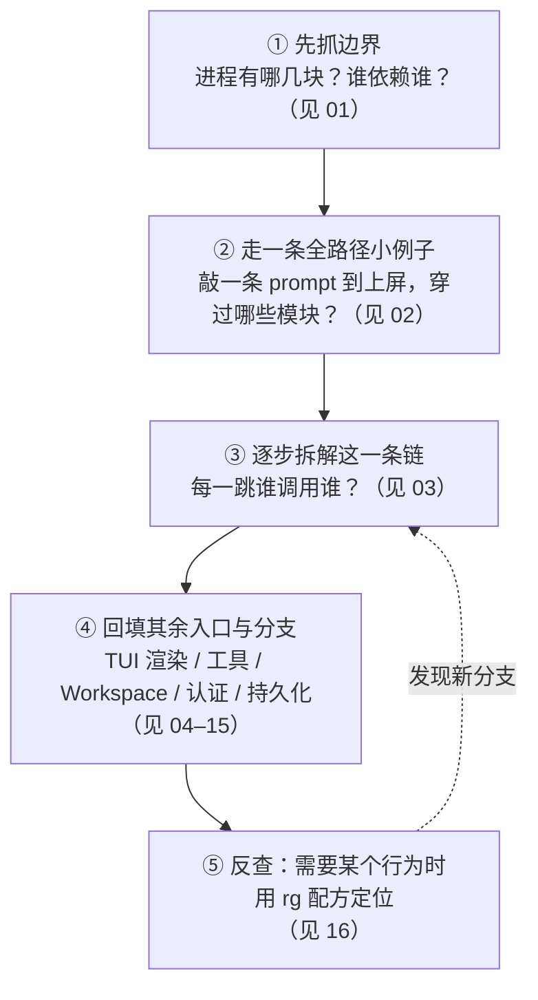

[总目录](README.md) · [下一篇：01-简单框架-系统骨架](01-简单框架-系统骨架.md)

# 00：阅读指南与文档地图

> **场景**：你第一次打开 Grok Build 这个 **101 个 workspace 成员**的 Rust 工程，不知道从哪一行读起、读到什么程度算「懂了」。
> **工具版本**：Rust `1.94.0`（`rust-toolchain.toml:11`）；`ratatui 0.29` / `tokio full` / `agent-client-protocol 0.10.4`（`Cargo.toml:233` / `Cargo.toml:280` / `Cargo.toml:117`）。
> **阅读说明**：本文讲**阅读策略**，不把行号当稳定 API。本文所有源码索引一律写成 **`文件路径 + 符号名 + 函数内相对偏移`**（`+0` = 函数定义那一行），**行号随版本变化，一切以当前源码为准**。配套见 [README.md](README.md) 的分组表与阅读路径。

---

## 本文件内容

1. [为什么不能按文件树从头读到尾](#1-为什么不能按文件树从头读到尾)
2. [覆盖口径：读哪些 crate](#2-覆盖口径读哪些-crate)
3. [三类代码不要混：生产 / 测试 / vendored](#3-三类代码不要混生产--测试--vendored)
4. [打开一个 .rs 必须回答的 9 个问题](#4-打开一个-rs-必须回答的-9-个问题)
5. [Rust 预备知识](#5-rust-预备知识)
6. [证据优先级](#6-证据优先级)
7. [四条使用路径](#7-四条使用路径)
8. [重实现前最低检查清单](#8-重实现前最低检查清单)

---

## 1. 为什么不能按文件树从头读到尾

大型异步 Rust 程序不是「一行接一行」顺序执行的。它更像一组**并发运行的 Actor**（每个 Actor 是一个 `tokio` task 或一条专用线程，拥有自己的状态），通过 `channel` 互相发消息。

最典型的反例就是组合根：`crates/codegen/xai-grok-pager-bin/src/main.rs` 当前共 **3774 行**，但其中真正的启动壳只到 `fn main`（偏移：`+0`）与 `fn async_main`（偏移：`+0`，位于 `main` 之后约 104 行）；**`fn main` 之后约 770 行处（`mod tests` 起）全是 `#[cfg(test)]` 单元测试**。如果你从第 1 行顺序读到第 3774 行，只会读到「一堆 CLI 分支 + 一堆测试」，看不到运行时的核心循环——核心循环在 `xai-grok-pager` 的 `event_loop`，不在这个文件里。



正确的读法：

- **先抓边界**：进程有哪几块？谁依赖谁？（见 `01`）
- **再走一条全路径小例子**：用户敲一条 prompt 到回答上屏，中间穿过哪些模块？（见 `02`）
- **然后逐步拆解这一条链**：每一跳谁调用谁？（见 `03`）
- **最后补齐其余入口与分支**：TUI 渲染、工具、Workspace、认证、持久化、构建（见 `04`–`15`）

> 一句话：**先建立「系统骨架图」，再沿一条真实请求把图走活，最后回填细节。** 不要逐文件翻译。

---

## 2. 覆盖口径：读哪些 crate

本指南的覆盖范围是「第一方生产代码 + 关键适配器」。成员清单以 `Cargo.toml:8-110` 的 `[workspace].members` 为准，**共 101 项**（含 `third_party/` 的 vendored crate 与 `prod/mc/cli-chat-proxy-types`）。

> **注意**：101 不等于「要读 101 个 crate」。下表中标「否」的类别只在被引用时去查。

| 类别 | 位置 | 是否重点 |
|---|---|---|
| 组合根（二进制） | `crates/codegen/xai-grok-pager-bin`（`main.rs` + `agent_command.rs`） | 是（入口） |
| 展示层 / TUI | `crates/codegen/xai-grok-pager`、`xai-grok-pager-render`、`xai-ratatui-textarea`、`xai-ratatui-inline`、`xai-grok-pager-minimal`、`xai-grok-pager-diff` | 是 |
| 应用层 / Agent / ACP | `crates/codegen/xai-grok-shell`、`xai-grok-shell-base`、`xai-grok-shell-terminal`、`xai-grok-shell-session-support`、`xai-grok-agent`、`xai-acp-lib` | 是（核心） |
| 领域层 | `crates/codegen/xai-chat-state`、`xai-grok-sampler`、`xai-grok-sampling-types`、`xai-grok-tools`、`xai-grok-tools-api` | 是（核心） |
| 端口 / 适配器 | `crates/codegen/xai-grok-workspace`、`xai-grok-workspace-client`、`xai-grok-workspace-daemon`、`xai-grok-workspace-types`、`xai-grok-auth`、`xai-grok-login`、`xai-grok-http`、`xai-grok-sandbox`、`xai-grok-config`、`xai-grok-config-types`、`xai-grok-telemetry`、`xai-grok-otel`、`xai-grok-mcp`、`xai-grok-hooks`、`xai-grok-memory`、`xai-grok-update`、`xai-crash-handler` | 是 |
| 跨切面（common） | `crates/common/xai-tool-runtime`、`xai-tool-types`、`xai-tool-protocol`、`xai-circuit-breaker`、`xai-computer-hub-core`、`xai-computer-hub-sdk`、`xai-computer-hub-mcp-adapter`、`xai-interjection-core`、`xai-message-delivery-core`、`xai-grok-compaction` | 是 |
| 构建 | `crates/build/xai-proto-build` | 否（按需） |
| 第三方 vendored | `third_party/`（Mermaid 栈 `mermaid-to-svg` / `dagre_rust` / `graphlib_rust`、`ordered_hashmap`） | 否（读引用即可） |
| 测试 / harness | `*_tests.rs`、`tests/`、`xai-grok-pager-pty-harness`、`ptyctl`、`ptyctl-cli`、`xai-grok-test-support`、`xai-test-utils` | 仅用作验证证据 |

> 真实符号名比文件夹名更可靠：crate 目录名与 crate 名一一对应（下划线形式），例如 `crates/codegen/xai-grok-shell` → `xai_grok_shell`。读代码时以 `Cargo.toml` 的 `name` 字段为准。

---

## 3. 三类代码不要混：生产 / 测试 / vendored

读源码时务必区分三种文件，否则会误把测试桩当成真实逻辑：

1. **生产代码**：`src/` 下的 `lib.rs`/`main.rs`/模块。这是要读懂的主体。注意本工程把**大量测试放在 `src/` 内**（`#[cfg(test)] mod tests` 或 `*_tests.rs` 兄弟文件），例如 `xai-grok-pager/src/app/effects/tests.rs`（2928 行）与 `effects/mod.rs`（5736 行）并列——**同名 `*_tests.rs` 一律是测试**。
2. **测试 / harness**：`tests/`、`*_test.rs`、`*_tests.rs`、`xai-grok-pager-pty-harness`（PTY 端到端）、`ptyctl` / `ptyctl-cli`（伪终端控制）、`xai-grok-test-support`、`xai-test-utils`。它们验证行为，但不是运行时路径。
3. **vendored 源码**：`third_party/` 下是对外源（Mermaid 渲染栈 `dagre_rust`/`graphlib_rust`/`mermaid-to-svg`、`ordered_hashmap`）。codex/opencode 的移植（`apply_patch`、`grep`/`glob`/`edit`）现在已并入第一方 crate 的 `implementations` 子模块，不再单独放 `third_party/`。

> 证据优先级见 [§6](#6-证据优先级)：**生产调用点 > 类型/trait > 测试 > Cargo 依赖 > README**。

---

## 4. 打开一个 .rs 必须回答的 9 个问题

每打开一个源文件，按下面 9 问自测；答不全说明还没读透：

1. **定位**：它在哪个 crate？属于哪一层（组合根/展示/应用/领域/端口/适配器）？
2. **契约**：对外暴露的类型/函数签名是什么？输入、输出、错误类型？
3. **主路径**：被谁调用？正常成功路径怎么走？
4. **状态**：它拥有什么可变状态？是不是某个 Actor 的「单写者」？
5. **异步**：哪里有 `.await`？跨 `await` 时状态会不会被别的 task 改？
6. **失败**：错误怎么返回（`?`/`Result`）？会不会发送通知？会不会重试？
7. **Rust 机制**：用到了哪些语言特性（trait object、`Arc<Mutex>`、channel、`Drop`、条件编译）？
8. **验证**：怎么能证明我理解对了？（`cargo test`、`--help`、日志 `caller`、断点）
9. **下一跳**：从当前调用点继续读哪个文件/函数？

> **自测样例（当前源码可核验）**：拿 `crates/codegen/xai-grok-pager/src/app/dispatch/router.rs` 的 `fn dispatch`（偏移：`+0`）走一遍 9 问——它是纯函数 `dispatch(action: Action, app: &mut AppView) -> Vec<Effect>`，**不含 `.await`**（第 5 问答案：无挂起点，所以可单测）；真正的副作用发生在 `crates/codegen/xai-grok-pager/src/app/effects/mod.rs` 的 `fn execute`（偏移：`+0`）里。能一眼指出这条分界，就说明你抓住了 UI 与领域的解耦点。

---

## 5. Rust 预备知识

本工程重度使用以下机制，读前确认你理解它们的「为什么」：

| 机制 | 项目中的用途 | 易错点 |
|---|---|---|
| workspace / crate | 用 101 个成员划分 TUI、Shell、Agent、工具、Workspace | crate 边界比文件夹名更能说明依赖方向 |
| `Result<T, E>` + `?` | 错误沿调用栈向上传播 | `?` 是「提前返回转换后的错误」，不是忽略 |
| `Option<T>` | 参数未提供 / 配置未知 / 资源不存在 | 区分 `None` 与 `false`/空字符串 |
| `enum` + `match` | 命令、状态、结果的穷尽分发 | 新增 variant 时编译器会逼你处理 |
| `async fn` / `.await` | 网络、进程、通道、模型流 | `.await` 是挂起点，等待期间状态可能变 |
| `tokio::spawn` | 后台更新、stdin/stdout 泵、并发任务 | JoinHandle 是否 awaited 决定生命周期 |
| `Arc<Mutex<T>>` / `Arc<RwLock<T>>` | 多任务共享可变状态 | 锁跨 `.await` 会阻塞其他任务，检查作用域 |
| trait object（`Box<dyn Tool>` / `dyn ToolDyn`） | 隔离文件系统、工具、认证、传输实现 | 先找 trait，再找具体 `impl` |
| `#[cfg(...)]` | 平台 / feature 条件编译（`jemalloc`、`enforce`、`test-seams`） | 当前平台看不到的代码仍可能影响发布构建 |
| RAII / `Drop` | Sentry guard、OTEL guard、运行时、终端、锁的清理 | 变量名前的 `_` 不代表无用，可能依赖 Drop 副作用 |

**两个必须看懂的「非典型」写法**（都在组合根里）：

1. **组合根手动构建 Tokio runtime，而不是 `#[tokio::main]`**。
   `crates/codegen/xai-grok-pager-bin/src/main.rs` 函数：`main` 偏移：`+81`（`tokio::runtime::Builder::new_multi_thread()`），随后在偏移：`+84` 调用 `xai_tty_utils::runtime::build_with_blocking_pool`，在偏移：`+88` 调用 `run_and_shutdown(runtime, async_main(args), RUNTIME_SHUTDOWN_GRACE)`。
   配套函数 `main.rs` 函数：`run_and_shutdown` 偏移：`+0`，其 `+6` 处调用 `runtime.shutdown_timeout(grace)`。原因写在该函数上方注释里：**普通 drop 会永久阻塞在一个不可取消的 in-flight blocking task 上**，`shutdown_timeout` 在宽限期后放弃它，退出才不会挂住。
   工作线程数由 `main.rs` 函数：`cli_worker_threads` 偏移：`+0` 决定（读 `GROK_WORKER_THREADS_ENV`，超范围则 clamp 并打印提示，见 `resolve_worker_override` 偏移：`+0`）。

2. **`main` 里有一个「特殊子进程」短路分支**。
   `main.rs` 函数：`main` 偏移：`+3` 处 `if let Some(code) = xai_grok_pager::app::mermaid_worker::maybe_run_render_subprocess() { std::process::exit(code); }`，偏移：`+6` 处同理处理 `xai_grok_pager::voice::maybe_run_capture_subprocess()`。**这两个分支在解析 CLI 之前执行**：同一个二进制以子进程身份被拉起时，直接干活后 `exit`，不会进入 Tokio runtime。

---

## 6. 证据优先级

当你对「某行为到底如何实现」不确定时，按以下顺序取证，高优先级覆盖低优先级：

1. **生产调用点**：谁 `.await`/调用了它（用 `rg -n 'fn_name'` 定位）。
2. **类型 / trait 定义**：签名与文档注释（`crates/.../src/...` + 函数名 + 偏移）。
3. **单元测试 / 集成测试**：断言即行为规范。
4. **Cargo 依赖图**：`cargo tree -p <crate> --depth 2` 看实现从哪来。
5. **README / 设计文档**：`docs/design/`、用户手册——仅作背景，**不与代码冲突时以代码为准**。

**取证示例（当前源码）**：要确认「TUI 的 prompt 怎么发给 Agent」，按下面这条链读，而不是猜：

```
crates/codegen/xai-grok-pager/src/app/dispatch/router.rs
    函数：dispatch（偏移：+0，纯函数，产出 Effect）
        ↓
crates/codegen/xai-grok-pager/src/app/actions.rs
    类型：enum Effect（偏移：+0）
        ↓
crates/codegen/xai-grok-pager/src/app/effects/mod.rs
    函数：execute（偏移：+0，副作用落点）
        ↓
crates/codegen/xai-grok-pager/src/app/effects/helpers.rs
    函数：acp_send_bounded（偏移：+0，带超时的发送包装）
        ↓
crates/codegen/xai-acp-lib/src/channel.rs
    函数：acp_send（偏移：+0，真正写入 ACP channel）
```

> 注意：`xai-grok-pager/src/app/effects/mod.rs` 当前 **5736 行**，`acp_send` 的调用点有数十处（`prompt.acp_send.start` / `prompt.acp_send.done` 是它的 tracing 事件名，可直接 `rg` 到）。**不要记行号，记事件名和函数名。**

---

## 7. 四条使用路径

- **路径 A（第一次理解工程）**：`00 → 01 → 02 → 03 → 04 → 09 → 10 → 11 → 15`。
- **路径 B（准备维护现有代码）**：`16 → 04 → 05 → 目标专题（07–13）→ 对应测试索引`。
- **路径 C（从零重新实现）**：`01 → 04 → 05 → 06 → 可靠性说明书 → 14 → 07/09/10/11 → 08/12/13`。
- **路径 D（只查某条行为）**：直接用 [16-术语表与源码查找手册](16-术语表与源码查找手册.md) 的 `rg` 配方反查。

**路径 D 的三个高命中入口**（记住符号名即可，行号会漂）：

| 想查什么 | 起点 |
|---|---|
| 进程启动/分支 | `main.rs` 函数：`main` 偏移：`+0`；函数：`async_main` 偏移：`+0` |
| TUI 主循环 | `xai-grok-pager/src/app/event_loop.rs` 函数：`run` 偏移：`+0`；函数：`process_effects` 偏移：`+0` |
| 回合循环 | `xai-grok-shell/src/session/acp_session_impl/turn.rs` 函数：`handle_prompt` 偏移：`+0` |

---

## 8. 重实现前最低检查清单

动手重写前，确认你能回答：

- [ ] 进程从 `main()` 怎样分发到 TUI / headless / stdio ACP / leader / 子进程短路（Mermaid、Voice）？
- [ ] 一次用户 Prompt 怎样穿过 Action → Effect → ACP → SessionActor → ChatState → Sampler → Tool → Workspace，再回到屏幕？
- [ ] UI 状态、会话状态、对话事实、文件事实分别由谁拥有？
- [ ] 工具调用如何用同一个 `ToolCallId` 闭合？
- [ ] 权限决策与 OS 沙箱为什么是两层，不能互相替代？
- [ ] 取消、重试、结果未知、崩溃恢复分别停在哪一层？
- [ ] 如何从空 Cargo workspace 分阶段重建功能等价系统？（见各章「重实现」小节与 `15`）

**每答一题，都要能指出对应的生产调用点**。例如第 2 题的第 4 跳必须能指出 `xai-grok-shell/src/session/acp_session.rs` 的 `struct SessionActor`（偏移：`+0`）——它是会话状态的单写者，所有回合都经它。

---

[总目录](README.md) · [下一篇：01-简单框架-系统骨架](01-简单框架-系统骨架.md)
