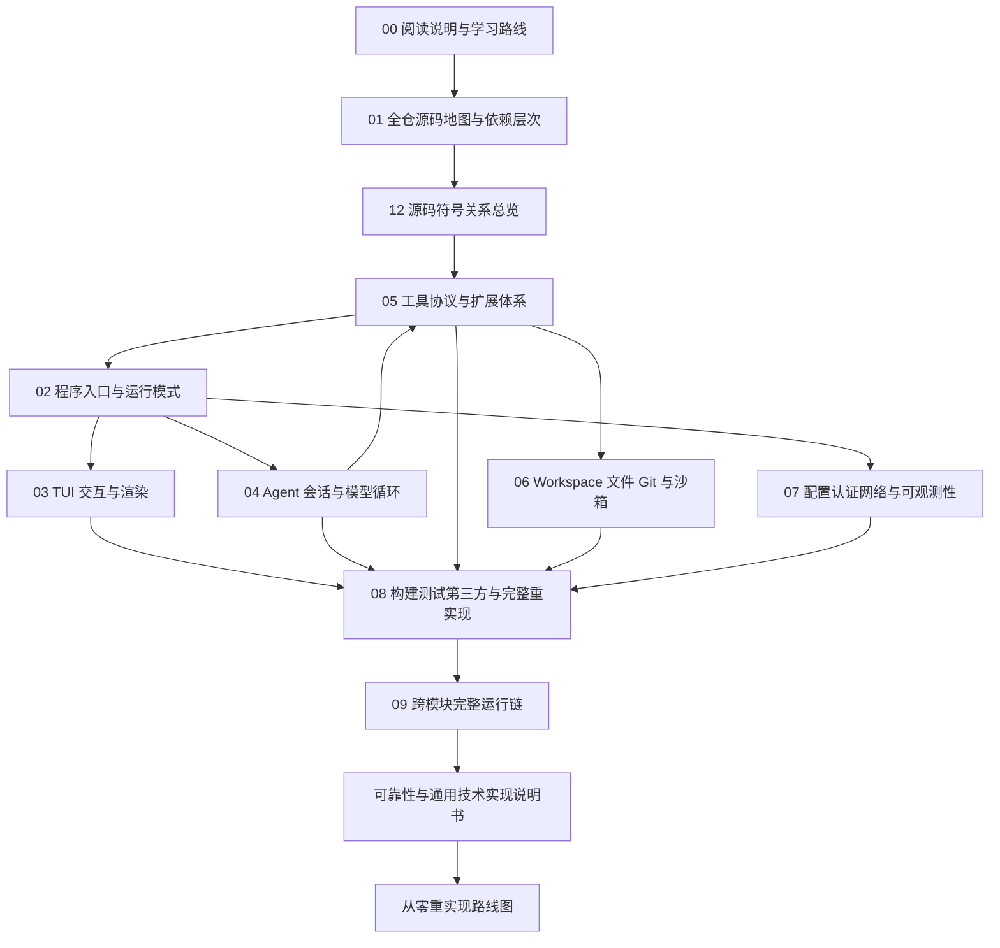

# Grok Build 源码精读：阅读说明与学习路线

> 目标读者：刚开始学习 Rust，或者第一次接触大型异步终端应用的开发者。
>
> 最终目标：读者不仅能说出“每个 crate 做什么”，还能按照本文档集给出的边界、契约和实现顺序，从空仓库逐步重建一个功能等价的 Grok Build。

## 1. 这套笔记怎样使用

Grok Build 不是一个只有 `main.rs` 和几个模块的小程序。它是一个拥有 80 余个 workspace member、约 2494 个 Rust 文件的工程。若排除路径中显式的 `tests/`、`benches/` 和 `fuzz/`，仍有约 2085 个 Rust 文件。直接从文件树第一项读到最后一项，不容易形成正确的系统模型。

这套笔记提供两条互补路线：

1. **调用链路线**：跟随一次用户 Prompt，从 CLI、TUI、ACP、Session Actor、Sampler、Tool 一直走到 Workspace 和文件系统，再沿事件反向回到屏幕。
2. **模块路线**：按 crate 分组理解稳定类型、协议、适配器、状态所有者和测试边界。

建议第一次阅读先走调用链，第二次再按模块补齐细节。重实现时则反过来：先实现底层类型和端口，再逐层组合到入口。

## 2. 覆盖口径

### 2.1 纳入范围

- 根 workspace、工具链和构建配置；
- `crates/codegen/` 下全部 workspace crate；
- `crates/common/` 下全部共享 crate；
- `crates/build/` 下代码生成辅助 crate；
- `prod/mc/cli-chat-proxy-types` 中被同步进来的协议类型；
- `third_party/` 下 vendored Rust 源码；
- 单元测试、集成测试、PTY E2E、场景快照、benchmark 和 fuzz target 的测试意图；
- 运行配置、模板、协议定义和与源码直接绑定的资源文件。

### 2.2 “阅读全部源码”的含义

本文档集不会逐行翻译 2494 个 Rust 文件。逐行翻译既不可维护，也会遮蔽设计。这里采用可复现的工程阅读口径：

- 每个 workspace member 都进入 crate 导航；
- 每个生产源码目录都归入一个专题；
- 关键入口、公共类型、trait、Actor、命令、事件、状态和适配器给出符号级说明；
- 重复实现、平台分支、生成代码和大规模测试按模式归纳，并保留查找入口；
- 每条关键结论尽量指向具体路径和符号；
- 正常路径、失败路径、取消路径和恢复路径一起说明；
- 不确定或仅由测试名称推断的内容明确标记，不将推断写成源码事实。

### 2.3 不混淆三种代码

| 类别 | 典型位置 | 阅读目的 |
|---|---|---|
| 第一方生产代码 | `crates/codegen/`、`crates/common/` | 理解产品行为和架构决策 |
| 测试与工具代码 | `tests/`、`benches/`、`fuzz/`、harness crate | 用外部行为反证对生产代码的理解 |
| vendored 源码 | `third_party/` | 理解被本工程内嵌维护的算法和许可证边界 |

## 3. 推荐阅读顺序



第一次跟源码时，不建议从 `02` 直接跳到某个数千行实现文件。先读 `12` 识别关系类型，再用 `13` 的逐函数步骤走一遍完整链，最后进入 `02`–`08` 专题。

如果只想尽快看懂主流程，先读 `01`、`02`、`04`、`05`、`06`、`09`。如果要重新实现，则不要跳过 TUI、配置、安全和可靠性专题。

## 4. 每读一个 Rust 文件先回答什么

### 4.1 定位

- 它属于哪个 crate？
- 是 `lib.rs`、`main.rs`、公共模块、平台适配器还是测试？
- 它由谁调用，又调用谁？
- 它在依赖图中是稳定叶子，还是上层组合根？

### 4.2 契约

- 输入类型是什么？是否借用、共享或取得所有权？
- 输出是普通值、`Result`、`Option`、`Future`、`Stream` 还是 channel receiver？
- 错误能否恢复？由当前层处理还是向上传播？
- 是否产生文件、进程、网络、终端或遥测副作用？

### 4.3 状态

- 状态真正由谁拥有？
- 修改状态是否被 Actor/event loop 串行化？
- `Arc` 只表示共享所有权，还是还配合 `Mutex/RwLock/ArcSwap` 提供同步？
- clone 出去的是事实副本、只读快照，还是廉价句柄？

### 4.4 异步

- 每个 `await` 会把控制权交还给谁？
- `tokio::spawn` 创建的任务由谁持有和取消？
- channel 关闭意味着正常完成、取消还是故障？
- 是否存在背压、超时、select 分支或失联任务？

### 4.5 可恢复性

- 用户按下 `Esc` 或 `Ctrl-C` 后，取消如何传播？
- HTTP 请求成功但响应丢失时如何判断结果？
- 工具执行到一半失败时，文件事实与会话事实是否一致？
- 进程崩溃后哪些状态能从磁盘恢复？

## 5. 新手必须先掌握的 Rust 语法

### 5.1 `Result<T, E>` 与 `?`

`?` 不是“忽略错误”。它表示：成功时取出 `T`，失败时把错误转换为当前函数声明的错误并立即返回。阅读长调用链时，应沿 `?` 反向寻找最终错误处理边界。

### 5.2 trait 与 `dyn Trait`

trait 是稳定能力边界。`dyn Trait` 表示运行时多态，常用于工具、传输、存储或模型适配器。阅读顺序应是：

1. trait 方法和关联类型；
2. 所有 impl；
3. 谁创建具体 impl；
4. 谁只依赖 trait；
5. 错误、取消和线程安全约束。

### 5.3 `Arc<T>`、锁与 Actor

- `Arc<T>`：让多个任务拥有同一对象，不自动允许修改；
- `Mutex<T>` / `RwLock<T>`：允许受同步保护的修改；
- Actor：状态只由一个任务拥有，其他任务通过消息请求修改；
- event loop：UI 常用的特殊 Actor，按顺序消费输入和异步结果。

本工程大量使用 Actor/事件循环，是为了让会话和 UI 状态拥有明确的单写者。

### 5.4 `async fn`、Future 和 Stream

调用 `async fn` 只创建 Future；Future 被 `await` 或交给 executor 后才推进。Stream 是多次产生值的异步序列，适合模型 token、工具进度和服务端事件。不要把“收到一个流事件”误认为“本轮已经成功提交”。

### 5.5 enum 状态机

Rust enum 能让状态携带不同数据。阅读 `Action`、`Effect`、`SamplingEvent`、`SessionCommand` 时，应把 variant 当作状态机的输入字母，再寻找消费它的 `match`。

### 5.6 feature 与 `cfg`

Cargo feature 决定可选能力，`#[cfg(...)]` 决定平台或编译条件。重实现时若过早复制全部 feature，会显著增加复杂度。先实现最小平台和最小模式，再把条件分支还原。

## 6. 固定笔记模板

对任何关键符号，都可以使用下面的表格复查：

| 项目 | 要记录的内容 |
|---|---|
| 位置 | crate、文件、符号 |
| 角色 | 为什么存在，明确不负责什么 |
| 输入 | 参数、命令、事件、配置、所有权 |
| 输出 | 返回值、事件、持久化、副作用 |
| 状态 | 所有者、并发控制、生命周期 |
| 正常路径 | 最短成功调用链 |
| 失败路径 | 错误分类、传播和恢复 |
| 取消 | 触发源、传播边界、清理动作 |
| 测试证据 | 单测、集成、PTY E2E、快照 |
| 重实现 | 最小版本、兼容点、可延后项 |

## 7. 如何验证自己的理解

不用一开始运行全 workspace。先做静态验证：

```bash
rg "struct TypeName|enum TypeName|trait TraitName" crates
rg "impl .*TraitName|TypeName::" crates
rg "tokio::spawn|select!|mpsc::|oneshot::" path/to/crate/src
rg "test_name_or_behavior" path/to/crate/tests path/to/crate/src
```

形成假设后，再运行最小 crate 的目标测试：

```bash
cargo test -p <crate-name> <test-filter>
cargo check -p <crate-name>
```

完整 workspace 构建很慢，且入口 README 也明确建议按 crate 验证。

## 8. 重实现时的纪律

1. 先写类型和契约测试，再写具体适配器。
2. 每层只依赖下一层稳定端口，不让 UI 直接操作文件系统事实。
3. 第一个版本只支持一种运行模式、一个模型适配器和少数工具。
4. 从第一天就保留取消、超时和结构化错误，不要最后补。
5. 会话历史、文件事实、工具结果和 UI 缓存必须区分。
6. 先用内存实现验证协议，再替换成 SQLite、JSONL、远端 hub 等实现。
7. 每新增一个异步任务，都明确 owner、停止条件和 join/abort 责任。

## 9. 文档约定

- 路径均相对于仓库根目录；
- `Type::method` 表示类型方法，`module::function` 表示模块函数；
- “事实源”表示恢复和冲突时最终采用的数据所有者；
- “推断”表示根据依赖、调用点或测试行为得出的解释，会显式标注；
- Mermaid 图只帮助建立关系，字段、错误和边界以正文为准。
