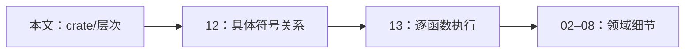
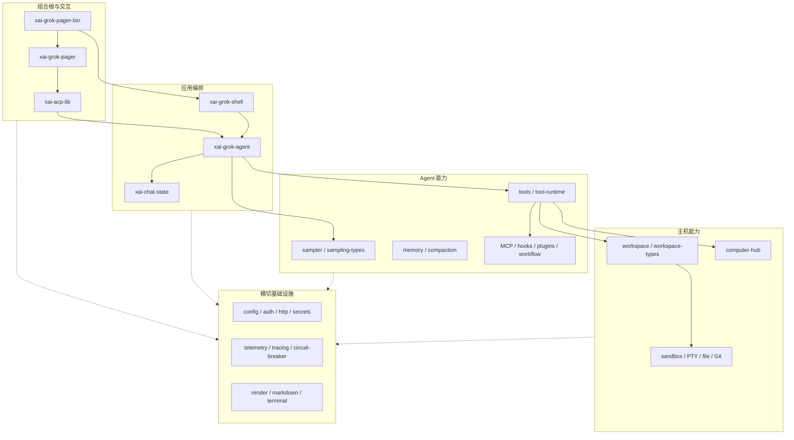
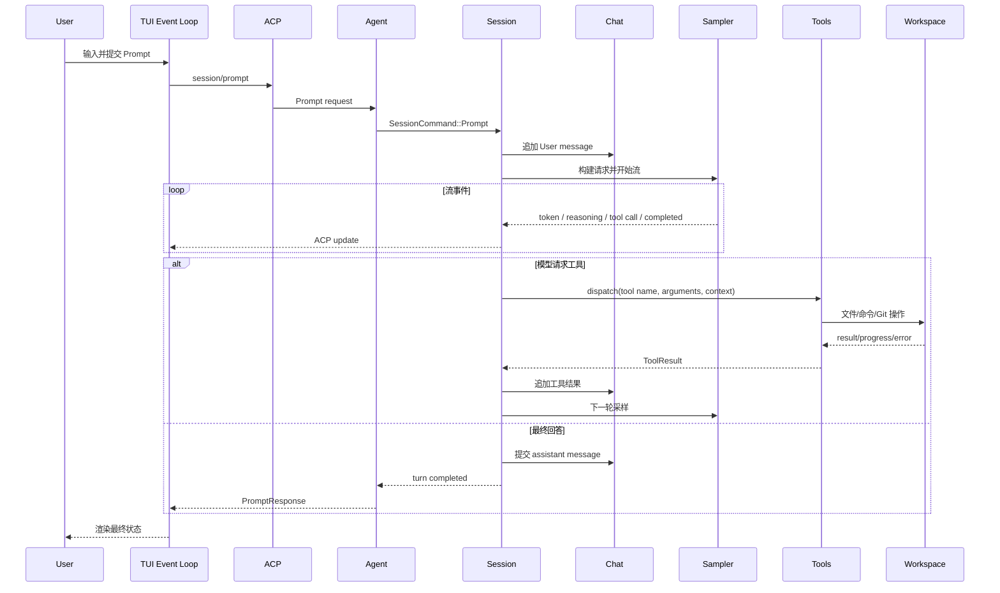

# 全仓源码地图与依赖层次

> 本文回答 crate 和逻辑层次。需要查看具体 Rust 符号、channel、trait 与运行时调用边，请继续阅读 [源码符号关系总览](12-源码符号关系总览.md)；需要逐函数跟踪一次请求，请阅读 [关键调用链逐函数精读](13-关键调用链逐函数精读.md)。



## 1. 一页认识工程

Grok Build 是一个以 Rust 2024 edition 构建的终端 AI 编程 Agent。产品形态包括全屏 TUI、headless/脚本模式和 ACP 嵌入模式。核心能力是：接收用户 Prompt，调用模型，在模型请求时执行受权限约束的工具，把文件和命令副作用交给 Workspace 层，并持续把事件反馈给客户端。

根 `Cargo.toml` 是自动生成的 workspace 清单。它声明了 80 余个 member，并统一第三方依赖版本。README 明确提醒：不要手工把根清单当普通配置维护，应优先修改各 crate 的 `Cargo.toml`。



图中的层次是学习模型，不代表每组是单独进程。具体运行模式可能把多个 crate 链接进同一个二进制，也可能通过 ACP、workspace RPC、stdio MCP 或 PTY 启动其他进程。

## 2. 物理目录与所有权

| 目录 | 性质 | 阅读重点 |
|---|---|---|
| `crates/codegen/` | 产品主体及配套库 | 入口、TUI、Agent、工具、Workspace、配置等 |
| `crates/common/` | 可复用共享叶子 | 协议、运行时 trait、重试/熔断、追踪 |
| `crates/build/` | 构建期工具 | protobuf 等代码生成 |
| `prod/mc/` | 从上游生产环境同步的类型 | 与服务端/代理的 wire compatibility |
| `third_party/` | vendored 上游实现 | Mermaid 解析、图布局、许可证与修改边界 |
| `docs/` | 用户、设计和源码笔记 | 不是运行事实源，但可提供入口线索 |

## 3. 规模热点

按 `.rs` 文件数量统计，最大的几个 crate 是：

| crate | 约文件数 | 为什么大 |
|---|---:|---|
| `xai-grok-pager` | 708 | TUI 状态、控件、输入、场景和大量 PTY/E2E 测试 |
| `xai-grok-shell` | 490 | 多运行模式、Session、工具编排及大量行为测试 |
| `xai-grok-tools` | 241 | 每种工具的实现、解析、权限和测试 |
| `xai-grok-workspace` | 94 | 文件、Git、执行、搜索、事件和 RPC |
| `xai-grok-pager-render` | 70 | 终端内容、Markdown、布局和选择渲染 |
| `xai-grok-workspace-types` | 48 | Workspace RPC、请求、事件和数据类型 |

文件多不等于架构层级高。`xai-grok-sampling-types`、`xai-tool-protocol` 等较小 crate 反而定义跨层契约，重实现时应更早完成。

## 4. Crate 分组导航

### 4.1 组合根、入口和运行模式

| crate | 责任 | 不负责 |
|---|---|---|
| `xai-grok-pager-bin` | 构造最终二进制、解析入口参数、初始化 runtime 和依赖 | 具体 TUI 控件、Agent 业务 |
| `xai-grok-shell` | Agent shell、会话编排、leader/stdio/headless 等入口 | 终端像素级渲染 |
| `xai-grok-shell-base` | Shell 层共享基础类型和小型能力 | 完整会话状态机 |
| `xai-grok-shell-session-support` | 会话启动/恢复相关共享支持 | 模型供应商实现 |
| `xai-acp-lib` | Agent Client Protocol 的客户端/服务端适配 | Workspace 的文件实现 |

阅读顺序：`pager-bin` 的 `main`/参数类型 → shell 的模式分发 → ACP 会话创建与 Prompt → Session 命令。

### 4.2 TUI、终端与内容渲染

| crate | 责任 |
|---|---|
| `xai-grok-pager` | 全量 TUI、事件循环、输入、scrollback、modal、状态归约 |
| `xai-grok-pager-minimal` | 最小屏幕模式及兼容行为 |
| `xai-grok-pager-render` | 对话内容、工具块、Markdown 等渲染模型 |
| `xai-grok-pager-pty-harness` | PTY 端到端测试驱动和终端仿真 |
| `xai-ratatui-inline` | Ratatui 与普通终端 scrollback 共存 |
| `xai-ratatui-textarea` | 多行编辑、光标、选区、viewport 和换行 |
| `xai-grok-markdown` | Markdown 解析和终端呈现 |
| `xai-grok-markdown-core` | Markdown 共享核心类型 |
| `xai-grok-mermaid` | Mermaid 到可展示制品的适配 |
| `ptyctl` / `ptyctl-cli` | PTY 控制库与命令行工具 |
| `xai-tty-utils` | TTY 检测和平台辅助 |

稳定模型是 `输入事件 → Action → 状态变化/Effect → 异步结果 → TaskResult/Action → render`。具体符号以 TUI 专题为准。

### 4.3 Agent、会话与模型

| crate | 责任 |
|---|---|
| `xai-grok-agent` | ACP Agent 实现、会话创建、Prompt 编排入口 |
| `xai-chat-state` | 对话消息和可串行化状态的单一所有者 |
| `xai-grok-sampler` | 模型请求、流式事件、工具调用停顿与完成 |
| `xai-grok-sampling-types` | 模型请求/响应/事件等稳定类型 |
| `xai-agent-lifecycle` | Agent/子任务生命周期状态与通知 |
| `xai-prompt-queue` | 运行中 Prompt 排队、重排或立即发送语义 |
| `xai-interjection-core` | 中途插话事件与缓冲 |
| `xai-grok-compaction` | 上下文压缩策略和模型交互 |
| `xai-grok-memory` | 长期/会话记忆的抽象与实现 |
| `xai-token-estimation` | 本地 token 估算辅助 |

最关键的不变量：只有会话/Chat Actor 能确认对话事实；Sampler 的中间 token 是展示事件，不等同于完成消息。

### 4.4 工具、协议和扩展

| crate | 责任 |
|---|---|
| `xai-grok-tools` | 终端、读写文件、搜索等具体工具 |
| `xai-grok-tools-api` | Grok 工具层公共 API |
| `xai-tool-runtime` | Tool trait、上下文、dispatch、streaming 和错误 |
| `xai-tool-types` | 工具描述、schema 和通用 wire 类型 |
| `xai-tool-protocol` | 跨进程工具注册、调用、通知、握手协议 |
| `xai-computer-hub-core` | 本地/远端 tool resolver 与 registry |
| `xai-computer-hub-sdk` | Hub 连接、认证、握手、复用和观测 |
| `xai-computer-hub-mcp-adapter` | MCP 与 Hub 工具模型之间的桥 |
| `xai-grok-mcp` | MCP server 配置、连接、OAuth 和传输 |
| `xai-grok-hooks` | turn/tool 等生命周期 hook 执行 |
| `xai-hooks-plugins-types` | Hook/Plugin 共享类型 |
| `xai-grok-plugin-marketplace` | 插件目录、匹配、安装和 Git 来源 |
| `xai-grok-subagent-resolution` | 子 Agent 能力解析和选择 |
| `xai-workflow` | 多步骤 workflow 描述与执行辅助 |

重实现时先建立统一 `Tool` 端口和单进程 registry，再添加跨进程协议、MCP 和 Hub；否则错误边界会一次性爆炸。

### 4.5 Workspace、文件、Git 与安全执行

| crate | 责任 |
|---|---|
| `xai-grok-workspace` | Workspace server、文件、命令、Git、搜索和事件 |
| `xai-grok-workspace-client` | Workspace RPC 客户端门面 |
| `xai-grok-workspace-types` | RPC envelope、request、event、chunk 和实体类型 |
| `xai-grok-sandbox` | 平台沙箱策略和命令隔离 |
| `xai-file-utils` | 文件操作、跟踪、日志和跨平台辅助 |
| `xai-fast-worktree` | 高效创建/管理 Git worktree |
| `xai-gix-status` | 基于 gix 的状态读取 |
| `xai-hunk-tracker` | diff hunk 与 Agent 修改归因 |
| `xai-fsnotify` | 文件系统变化监听和去抖 |
| `xai-codebase-graph` | 代码结构图和导航索引 |
| `xai-sqlite-journal` | SQLite journal 小型持久化封装 |

Workspace 是主机事实的边界。工具不应自行绕过它写文件，否则权限、归因、事件和恢复链会失真。

### 4.6 配置、认证和网络

| crate | 责任 |
|---|---|
| `xai-grok-config` | 配置发现、加载、合并、校验和运行时访问 |
| `xai-grok-config-types` | 类型化配置结构 |
| `xai-grok-auth` | 登录凭据、token 和认证流程 |
| `xai-grok-http` | 统一 HTTP client 构造和策略 |
| `xai-grok-extra-ca` | 额外 CA 证书加载 |
| `xai-grok-secrets` | secret 处理和输出脱敏 |
| `xai-grok-env` | 环境变量读取辅助 |
| `xai-grok-paths` | 配置、缓存、会话等路径规则 |
| `xai-grok-models` | 模型目录和模型能力描述 |

配置类型与加载机制分开，是为了让协议层共享结构，同时避免叶子类型反向依赖文件系统和网络。

### 4.7 可观测性、韧性和平台辅助

| crate | 责任 |
|---|---|
| `xai-grok-telemetry` | 产品遥测事件和导出 |
| `xai-tracing` / `xai-tracing-macros` | Trace、日志、HTTP/gRPC 插桩和宏 |
| `xai-mixpanel` | Mixpanel 适配 |
| `xai-circuit-breaker` | 熔断器、滑动窗口、状态和 retry policy |
| `xai-grok-crash-handler` | 崩溃捕获、终端恢复和符号化 |
| `xai-grok-update` / `xai-grok-version` | 更新检查、安装和版本信息 |
| `xai-grok-announcements` | 公告数据 |
| `xai-grok-shared` | 跨入口共享 UI/session/clipboard 等小能力 |
| `xai-grok-voice` | 语音输入及平台实现 |
| `xai-system-power` | 防休眠/系统电源辅助 |

### 4.8 构建、测试和同步类型

| crate | 责任 |
|---|---|
| `xai-proto-build` | 构建期 protobuf 代码生成 |
| `xai-grok-test-support` | 产品 crate 共用测试夹具 |
| `xai-test-utils` | Git、环境、图片、追踪等通用测试工具 |
| `cli-chat-proxy-types` | 与外部服务交换的部署、会话、存储等类型 |

### 4.9 Vendored Mermaid 栈

| crate | 责任 |
|---|---|
| `mermaid-to-svg` | Mermaid 语法分发、AST、布局适配与 SVG 输出 |
| `dagre_rust` | 有向图分层布局算法 |
| `graphlib_rust` | 图数据结构和 DFS 等算法 |
| `ordered_hashmap` | 保持插入顺序的映射实现 |

它们是本地源码依赖，但不是 Grok Agent 领域内核。第一次实现可以先把 Mermaid 当外部命令或不支持的内容块，主链稳定后再内嵌。

## 5. 关键事实源

| 事实 | 主要所有者 | 派生/展示方 |
|---|---|---|
| 当前 TUI 交互状态 | TUI event loop 的 view/application state | renderer |
| 会话执行状态 | Session Actor | ACP/TUI 状态提示 |
| 对话历史 | Chat State Actor / 持久化层 | Sampler request、transcript |
| 模型流中间输出 | 当前 sampling task | TUI 临时 thinking/output |
| 已完成模型消息 | 会话在完成事件后提交 | transcript、持久化 |
| 工具定义与 schema | finalized registry/toolset | 模型请求中的 tool declarations |
| 文件内容 | Workspace 所在文件系统 | hunk tracker、会话摘要 |
| Git 状态 | repository/worktree | UI diff 和归因视图 |
| 权限决定 | permission policy/manager | UI 提示和工具 dispatcher |
| 配置 | 合并并校验后的 typed config | 各运行模块快照 |

## 6. 一次 Prompt 的骨架链路



专题文档会补齐真实符号、变体和失败路径；这里的价值是先记住职责方向。

## 7. 依赖方向的实践规则

1. `*-types` 和协议 crate 尽量作为稳定叶子，不依赖 UI 或具体执行器。
2. 具体工具依赖工具 runtime 和 Workspace 端口，反向依赖应避免。
3. TUI 依赖 ACP/应用端口，不把 Session 内部状态当自己的可写状态。
4. 配置、遥测和认证是横切适配器，但不得成为领域事实所有者。
5. 组合根可以看见所有实现，普通模块只看见自己需要的 trait。

## 8. 从零实现时的最小 crate 切分

不要第一天复制 80 个 crate。可以先建立 8 个逻辑包：

```text
app-bin          # CLI 与组合根
protocol         # Session/Tool/UI 公共命令和事件
agent            # 会话 Actor 和模型循环
model            # 模型端口与一个 HTTP 实现
tools            # Tool trait、registry 和少数内置工具
workspace        # 文件和命令端口、本地实现
tui              # 输入、状态归约和渲染
storage-config   # 会话持久化和类型化配置
```

当出现明确替换、编译隔离或依赖冲突需求时，再按原工程的细粒度拆分。crate 数量是工程演进结果，不是功能正确性的前提。

## 9. 下一步阅读

- 想知道程序怎样启动：阅读 `02-程序入口与运行模式.md`。
- 想知道屏幕怎样工作：阅读 `03-TUI交互与渲染.md`。
- 想知道模型为什么会多轮调用工具：阅读 `04-Agent会话与模型循环.md`。
- 想知道文件最终怎样被修改：阅读 `05` 和 `06`。
- 准备自己实现：先完整读完跨模块运行链、可靠性说明和重实现路线图。
