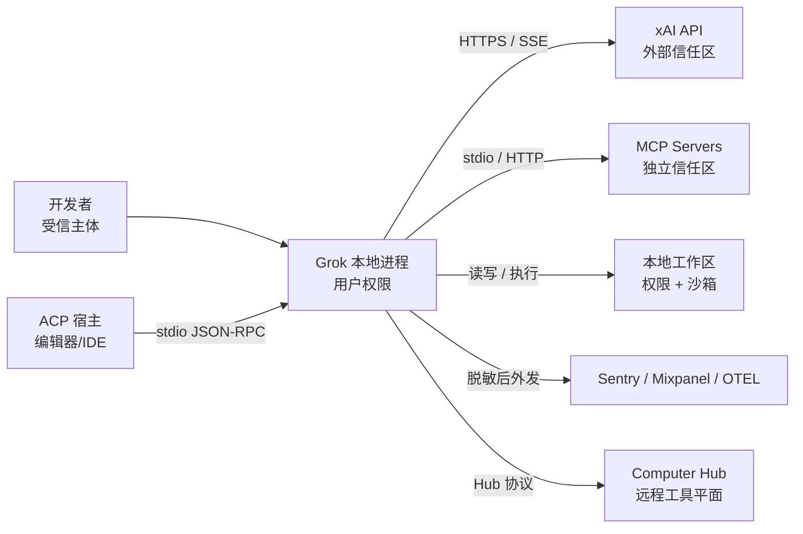
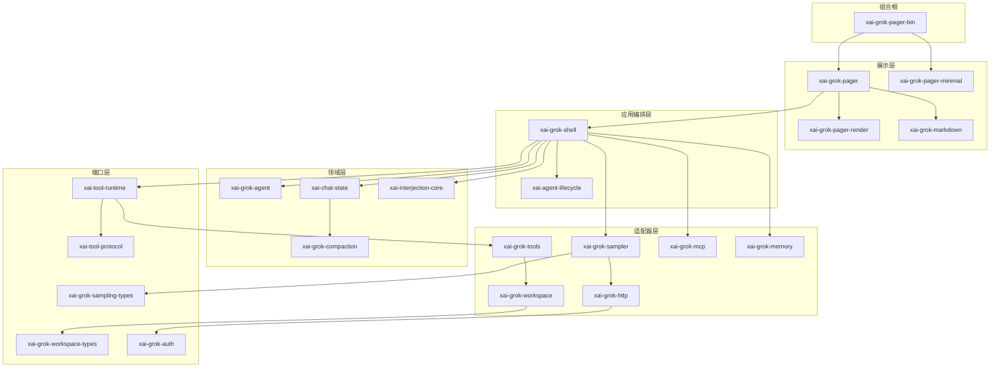
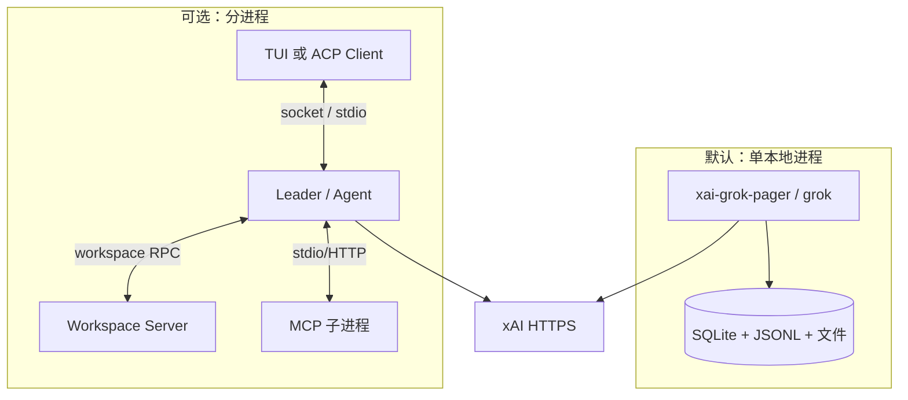
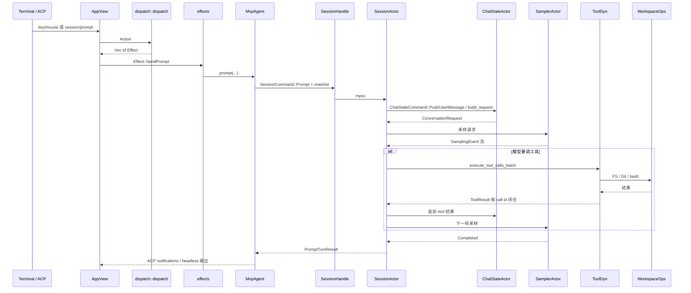
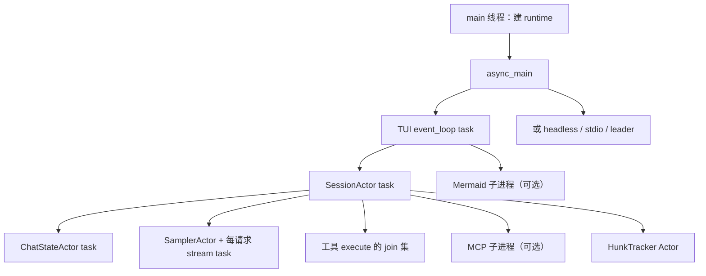
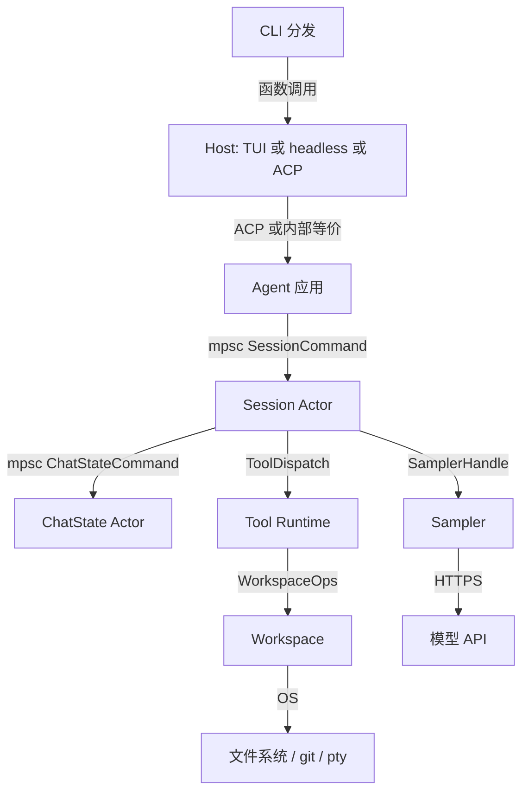

# 01 · 架构总览

> 读完本篇应能：在白板上画出六层依赖、四种进程形态、以及一次 Prompt 的回边；并能指出每个方框对应的真实 crate，而不是“前端/后端”这种空词。

## 快速摘要

### 架构总览（模块与依赖）

`xai-grok-pager-bin` 只装配。`xai-grok-pager` 只表达。`xai-grok-shell` 只编排。`xai-chat-state` / `xai-grok-agent` 只决策对话。`xai-tool-runtime` / `xai-tool-protocol` / `workspace-types` 只定义契约。`xai-grok-tools` / `xai-grok-workspace` / `xai-grok-sampler` 才碰磁盘、进程和 HTTP。

### 核心调用序列（全路径小例子）

一次回车的最短路径：`Action::SendPrompt` → `Effect::SendPrompt` → `MvpAgent::prompt` → `SessionCommand::Prompt` → `ChatStateHandle::build_request` → `SamplerHandle` →（若有工具）`ToolDyn::execute` → `WorkspaceOps` → `PromptTurnResult` 回到屏幕。

### 易错点与边界条件

- 增量 token 不是规范助手消息；`Completed` 才是提交屏障。
- 权限决策和 OS 沙箱是两层。
- Leader / Workspace Proxy / ACP stdio 换的是传输，不是第二套 Tool API。

## 1. Why：这套分层在解决什么问题

Grok Build 同时满足四类互相冲突的需求：

1. **交互式 TUI**：全屏终端、流式 Markdown、权限弹窗、滚动历史。
2. **可脚本化**：`grok -p` / `Command::Agent` headless，把同样的 Agent 循环接到 stdout。
3. **可嵌入**：通过 Agent Client Protocol（ACP）走 stdio JSON-RPC，让编辑器当宿主。
4. **可隔离**：Leader 进程、Workspace Server、MCP 子进程，在需要时把 UI、Agent、宿主 FS、外部工具拆开。

如果把文件读写、HTTP 采样、终端绘制、会话历史塞进同一个模块，会出现：

- TUI 测试必须启动真模型；
- 换一种传输（本地 FS vs 远程 Workspace）要改 Agent 循环；
- 权限规则和像素布局缠在一起，无法单独演进。

因此仓库用 **模块化单体 + 少量可选进程边界**：默认一个进程里用 Tokio task 和 channel 通信；需要隔离时，同一套 wire 类型改走 stdio 或 WebSocket。

设计初衷可以压成一句话：

> **组合根只装配，展示层只表达，应用层只编排，领域层只决策，端口层只定义契约，适配器层只碰外部世界。**

## 2. What：系统上下文



信任规则（重实现时必须原样保留）：

- 模型输出、仓库内容、MCP 返回值、命令 stdout **都不可信**。
- 只有「工具参数校验 + 权限决策 + OS 沙箱」共同决定副作用是否允许。
- 遥测必须先脱敏。token 只允许打 suffix，见 `xai-grok-auth` 的 `BEARER_SUFFIX_LEN`。

参与者对应的代码入口：

| 参与者 | 代码入口 |
|---|---|
| 本地 CLI/TUI | `xai-grok-pager-bin::main` → `async_main` |
| ACP 宿主 | `xai-grok-shell::agent::app::run_stdio_agent` + `xai-acp-lib` |
| Headless | `run_headless`（同一 `agent::app`） |
| Leader | `run_leader` / `xai-grok-shell::leader` |
| 模型 API | `xai-grok-sampler` + `xai-grok-http` |
| 工作区 | `xai-grok-workspace::{WorkspaceOps, WorkspaceHandle}` |
| MCP | `xai-grok-mcp` + `xai-computer-hub-mcp-adapter` |

## 3. What：逻辑分层与依赖规则



| 层 | 代表 crate | 可以依赖 | 不应承担 |
|---|---|---|---|
| 组合根 | `xai-grok-pager-bin` | 装配所需的库 | 领域规则、持久状态、像素布局 |
| 展示层 | pager / pager-render / markdown | Shell 的公共事件、纯渲染库 | 文件/命令执行规则、模型重试 |
| 应用层 | `xai-grok-shell` | Agent、Chat、Workspace、端口 | 终端单元格布局、供应商 HTTP 细节扩散 |
| 领域层 | agent / chat-state / compaction | 纯类型、稳定端口 | OS 操作、Ratatui |
| 端口层 | tool-runtime / tool-protocol / workspace-types / auth / sampling-types | 纯类型和最小公共库 | 具体 HTTP、具体进程实现 |
| 适配器层 | tools / workspace / sampler / mcp / memory / http | 端口、外部库 | 上层交互流程（不要反向依赖 pager） |

依赖方向只允许向下（或通过端口横向）。pager 可以依赖 shell 的**公共 API**，shell 不得依赖 pager 的 view 类型。跨边界的 DTO 放在小 crate 里，例如 `xai-prompt-queue`、`xai-hooks-plugins-types`，就是为了打断循环依赖。

`xai-grok-pager-bin/Cargo.toml` 把这件事写得很直白：`xai-grok-pager-minimal` 依赖 pager，所以 pager 不能再依赖 minimal，必须由二进制在启动时调用 `xai_grok_pager_minimal::install()` 把 fn-pointer IoC 钩子打进去。

## 4. What：物理部署形态



- **默认拓扑**：一个进程内 TUI + Session Actor + Sampler + 本地 `WorkspaceHandle`。减少序列化，延迟最低。
- **Leader**：TUI 可以连到已有 Agent 进程（`xai-grok-shell::leader::{connect_or_spawn, LeaderClient}`），用于多客户端附着、后台常驻。
- **Workspace Server**：`WorkspaceOps` 的 `Proxy` 模式经 Hub WebSocket 调远程 `workspace.*` RPC，本地 Agent 不再直接碰那台机器的磁盘。
- **ACP stdio**：stdin/stdout 被协议占用，日志必须走 stderr 或文件（`init_tracing_simple`、`GROK_DEBUG_LOG`）。
- **MCP**：每个 server 通常是独立子进程，崩溃不得拖垮 Session Actor。

重实现时先做默认单进程；Leader/Proxy 是同一套 `WorkspaceRpc` 类型换传输，不要先发明第二套 API。

## 5. What：一次 Prompt 的架构回边

下面这张图是全目录共用的心智模型，节点都是真实类型：



六个架构不变量（违反其中任何一条，系统会在并发下损坏）：

1. **事实源分离**：像素与输入焦点在 `AppView`；回合生命周期在 `SessionActor`；对话数组在 `ChatStateActor`；文件与 git 在 Workspace。
2. **增量不是提交**：`SamplingEvent::ChannelToken` 只供 UI 流式显示；规范助手消息在 `Completed`（或等价的最终响应）之后才写入 ChatState。
3. **call id 闭合**：每个模型发出的 tool call 必须有且仅有一个对应结果（成功、错误或取消标记），否则下一轮请求会带 dangling call，多数供应商会拒。
4. **权限 ≠ 沙箱**：`xai-grok-workspace::permission` 决定“允不允许”；`xai-grok-sandbox` 决定“即使用户点了允许，OS 还允不允许”。
5. **取消不回滚**：`session/cancel` 停止未来的采样和尚未启动的工具；已 `search_replace` 的文件保持现状。
6. **结果未知先对账**：写文件超时不等于没写。重试前必须 stat/hash，见可靠性说明书。

## 6. How：crate 地图（按层展开）

下面不是“每个 crate 一句话介绍”的目录抄写，而是**重实现时你要不要立刻碰到它**。完整成员列表仍以根 `Cargo.toml` 为准。

### 6.1 组合根与入口

| Crate | 路径 | 架构职责 |
|---|---|---|
| `xai-grok-pager-bin` | `crates/codegen/xai-grok-pager-bin` | 唯一 `[[bin]]`，`name = "xai-grok-pager"`。`main()` 装配分配器、crash handler、Tokio，再 `async_main` 分发。 |
| `xai-grok-version` | `crates/codegen/xai-grok-version` | 版本字符串，被 tools 与 pager 再导出。 |
| `xai-crash-handler` | `crates/codegen/xai-crash-handler` | 信号处理、终端 restore、crash 报告目录。 |

`main()` 的前几步已经体现“组合根不拥有领域”：

1. `xai_grok_telemetry::startup::mark_process_start`
2. `mermaid_worker::maybe_run_render_subprocess` / `voice::maybe_run_capture_subprocess`（若当前进程其实是子进程，直接 exit）
3. `PagerArgs::parse_cli()`（定义在 pager，不在 bin）
4. `dispatch_version_if_requested` / `dispatch_doctor_if_requested`（doctor 在 runtime 起来之前就能跑）
5. `xai_grok_pager_minimal::install()`
6. jemalloc hooks、`memory_trace::start`
7. `xai_grok_config::validate_requirements()`（策略失败则 exit 2）
8. Sentry、user-guide 解包、crash handler、收集 crashed sessions
9. 建 Tokio multi-thread runtime，`run_and_shutdown(..., async_main(args), ...)`

### 6.2 展示层

| Crate | 架构职责 |
|---|---|
| `xai-grok-pager` | TUI 应用：`app::{actions, dispatch, effects, event_loop, app_view}`，scrollback，slash，ACP client 侧。 |
| `xai-grok-pager-minimal` | 精简渲染模式，经 fn-pointer 接入，避免与 pager 循环依赖。 |
| `xai-grok-pager-render` | 主题、语法高亮、剪贴板、链接、终端宿主。pager 在 `lib.rs` 里 `pub use` 回来。 |
| `xai-grok-markdown` / `xai-grok-markdown-core` | 流式 Markdown；core 无 UI，给结构分析。 |
| `xai-grok-mermaid` | Mermaid → 图，实际引擎在 `third_party/`。 |
| `xai-ratatui-textarea` / `xai-ratatui-inline` | 多行 prompt 编辑与 inline 绘制。 |
| `ptyctl` / `xai-grok-pager-pty-harness` | E2E：驱动真二进制，不是 Agent 的 bash 工具。 |

Pager 内部的架构决定是 **Elm 式单向数据流**：

```text
crossterm Event → input → Action
Action → dispatch::dispatch(&mut AppView) → Vec<Effect>
Effect → effects（spawn async）→ TaskResult
TaskResult → 再次进入 dispatch
draw 只读 AppView
```

这让 `dispatch` 可以单测，不必起终端。详见 `06`。

### 6.3 应用编排层

`xai-grok-shell` 是最大的应用 crate。`src/lib.rs` 导出的模块就是它的职责清单：

- `agent`：`MvpAgent`、headless/stdio/leader 入口、`Config`
- `session`：Session Actor、ACP session 实现、prompt queue、compaction 接线
- `auth`、`leader`、`remote`、`sampling`、`tools`、`plugin`、`extensions`
- `config` / `managed_config` / `util`

它还把若干实现再导出，避免调用方依赖太多 crate：

- `pub use xai_grok_http as http`
- `pub use xai_grok_models as models`
- `pub use xai_grok_workspace::foreign_sessions`

同层还有：

- `xai-agent-lifecycle`：任务发送/结束语义
- `xai-acp-lib`：JSON-RPC 通道与 framing
- `xai-grok-shell-base` / `xai-grok-shell-session-support`：被 shell 再导出的基础能力
- `xai-prompt-queue`：Pager ↔ Shell 的队列 DTO

### 6.4 领域层

| Crate | 拥有的决策 |
|---|---|
| `xai-grok-agent` | `Agent` / `AgentBuilder` / `AgentDefinition`：工具集、system prompt、compaction 策略、reminder 策略如何组装。crate 文档明确：从 shell 抽出，让任何 host 都能消费。 |
| `xai-chat-state` | 对话数组的唯一写者。`ChatStateCommand` 变更，`ChatStateEvent` 观察，`ChatPersistence` 落盘。 |
| `xai-grok-compaction` | 与传输无关的压缩算法；通过 `CompactionSampler` 端口叫模型。 |
| `xai-interjection-core` | 回合中用户插话的纯逻辑。 |
| `xai-grok-subagent-resolution` | persona/role/override 合并成无歧义 spec。 |
| `xai-token-estimation` | 各层共用的 token 估算，避免 chat 和 telemetry 各算各的。 |

### 6.5 端口层（重实现第一天就应该抄类型）

| Crate | 稳定契约 |
|---|---|
| `xai-tool-types` | 工具描述、schema 宽容解析 |
| `xai-tool-protocol` | Hub wire：`PROTOCOL_VERSION`、Hello、JSON-RPC envelope、`ToolId`/`ToolCallId` |
| `xai-tool-runtime` | `Tool` trait、`ToolDispatch`、`ToolCallContext`、`ToolNotification` |
| `xai-grok-workspace-types` | `workspace.*` RPC 请求/响应/事件 |
| `xai-grok-sampling-types` | `ConversationItem`、`ConversationRequest`、`SamplingError`、`ToolSpec` |
| `xai-grok-auth` | `HttpAuth`、`AuthCredentialProvider` |
| `xai-grok-config-types` | 配置数据结构（与 loader 分离） |
| `xai-hooks-plugins-types` | Hook/Plugin 的 ACP 扩展 DTO |

端口层的特征是：**没有 Reqwest，没有 Ratatui，没有 `Command::new("git")`。** 一旦出现这些依赖，它就不再是端口。

### 6.6 适配器层

| Crate | 外部世界 |
|---|---|
| `xai-grok-sampler` | xAI HTTP SSE；三层 API：Client → stream transform → Actor |
| `xai-grok-http` | 统一 Reqwest、rustls、proxy、传输错误分类 |
| `xai-grok-tools` | 内置工具实现（bash、read_file、search_replace、task…） |
| `xai-grok-workspace` | FS、Git、permission、workspace server、Hub 注册 |
| `xai-grok-workspace-client` | Proxy 模式的 typed RPC client |
| `xai-grok-sandbox` | OS 沙箱 |
| `xai-grok-mcp` | MCP 子进程生命周期与 OAuth |
| `xai-computer-hub-core/sdk` | 工具注册表、连接池、重连 |
| `xai-grok-memory` | 跨会话记忆、SQLite vec、MMR |
| `xai-grok-telemetry` | Sentry、OTEL、unified_log、startup mark |

## 7. How：运行时并发模型

默认单进程里的主要 task（不是完整列表，是必须理解的那些）：



通信原语选择：

| 需求 | 原语 | 例子 |
|---|---|---|
| 持续向 Actor 发命令 | `mpsc::unbounded` | `SessionHandle.cmd_tx` |
| 等待这一次的结果 | `oneshot` | `SessionCommand::Prompt.respond_to: Sender<PromptTurnResult>` |
| 多观察者看事件 | 内部 `event_tx` / ACP notifications | `ChatStateEvent`、`SamplingEvent` |
| 取消整棵子树 | `CancellationToken` | turn cancel |
| 配置热读 | `arc_swap::ArcSwap` | `SessionHandle.resolved_tool_overrides` |
| 跨线程立即读的标志 | `AtomicBool` | `gateway_enabled` |

`SessionHandle`（`session/handle.rs`）把这些端口捆在一个 `Clone` 结构里：命令通道、persistence 通道、`current_prompt_id`、`pending_interactions`、`chat_state_handle`、`hunk_tracker_handle`、`signals_handle`。UI 和 Leader roster 读的是 Handle 上的缓存字段，而不是直接进 Actor 内部 state。

## 8. How：配置、策略与启动门闩

架构上配置不是“读一个 toml”，而是一层压一层，权威顺序写在 `xai-grok-config/src/lib.rs` 顶部：

1. `/etc/grok/managed_config.toml`
2. `$GROK_HOME/managed_config.toml`
3. `$GROK_HOME/config.toml`
4. `$GROK_HOME/requirements.toml`（签名策略缓存）
5. `/etc/grok/requirements.toml`
6. macOS MDM（`ai.x.grok`）

`main()` 在建 Tokio **之前**调用 `xai_grok_config::validate_requirements()`。失败则进程以码 2 退出。这意味着：**企业策略是启动门闩，不是运行时尽力而为的提示。**

`GROK_HOME` 由 `xai-grok-config::paths` / shell 的 `util::grok_home` 解析。会话、日志、crash、memtrace、user-guide 解包都挂在这个根下。重实现时先规定一个 home 目录，再决定 jsonl/sqlite 的相对位置。

## 9. 技术选型（以及替换边界）

| 领域 | 选择 | 为什么 | 替换时切断点 |
|---|---|---|---|
| 异步运行时 | Tokio multi-thread | 网络、进程、channel、信号统一 | 业务代码只依赖 Handle，不直接 `Runtime::new` |
| TUI | Ratatui + Crossterm | 跨平台；与 dispatch 分离 | 换 UI 时保留 Action/Effect |
| HTTP | Reqwest + rustls ring | `async_main` 里 `ring::default_provider().install_default()` | Sampler 只依赖 `SamplingClient` |
| 流式协议 | SSE / OpenAI 兼容 chunk | 三套 transform：chat completions / responses / messages | `xai-grok-sampler/src/stream/` |
| 编辑器嵌入 | `agent-client-protocol` crate | 标准 session/prompt/cancel | `xai-acp-lib` |
| 外部工具 | MCP（rmcp，隔离的 reqwest 0.13） | 独立 crate 避免 HTTP 版本污染 | `xai-grok-mcp` |
| 本地索引 | tree-sitter + petgraph | 代码导航 | `xai-codebase-graph` |
| Git | gix + CLI 辅助 | 状态读取 vs 成熟命令 | workspace `session/git` |
| 记忆 | SQLite + vec | 本地事实 | `xai-grok-memory` + `xai-sqlite-journal` |

## 10. 重实现时必须先画的边界

不要从“仿一个漂亮 TUI”开始。按这个顺序在纸上画框，框之间只允许箭头上标注的机制：



每个箭头问三个问题：

1. 序列化格式是什么（内存类型还是 JSON-RPC）？
2. 失败如何返回（`Result`、`oneshot`、事件）？
3. 取消如何传播？

若某个箭头需要“直接改对方的私有字段”，边界就画错了。

## 11. 本篇涉及的真实文件

| 路径 | 角色 |
|---|---|
| `crates/codegen/xai-grok-pager-bin/src/main.rs` | 进程入口与模式分发 |
| `crates/codegen/xai-grok-pager-bin/Cargo.toml` | 组合根依赖与 IoC 说明 |
| `crates/codegen/xai-grok-pager/src/lib.rs` | 展示层模块清单与 render re-export |
| `crates/codegen/xai-grok-pager/src/app/mod.rs` | Action/Effect/event_loop 总述 |
| `crates/codegen/xai-grok-shell/src/lib.rs` | 应用层模块清单 |
| `crates/codegen/xai-grok-agent/src/lib.rs` | Agent 组装职责 |
| `crates/codegen/xai-chat-state/src/lib.rs` | ChatState Actor 图 |
| `crates/codegen/xai-grok-sampler/src/lib.rs` | 采样三层 API |
| `crates/common/xai-tool-runtime/src/lib.rs` | 工具运行时表面 |
| `crates/codegen/xai-grok-workspace/src/lib.rs` | 宿主能力表面 |
| `crates/codegen/xai-grok-config/src/lib.rs` | 配置层序 |
| `Cargo.toml` | 全部 workspace members |

## 12. 自检问题

1. 为什么 `xai-grok-pager-minimal` 不能被 pager 直接依赖？
2. `ChatStateActor` 如果改成 `Mutex<Vec<ConversationItem>>` 让 UI 直接 lock，会破坏哪条不变量？
3. Leader 模式与默认模式是否需要两套 Tool trait？为什么？
4. `validate_requirements` 为什么在 Tokio runtime 创建之前调用？
5. 把 `xai-grok-http` 的 Reqwest 客户端直接 `use` 进 `xai-chat-state` 会违反哪一层的规则？

下一篇：[02-核心模块与类关系.md](02-核心模块与类关系.md)
