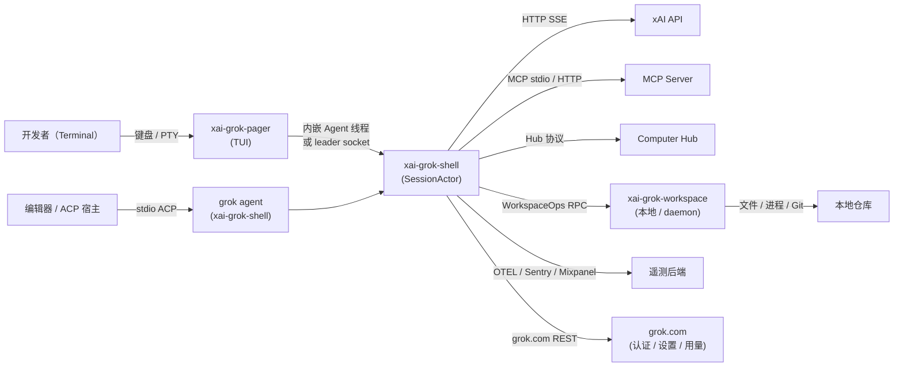
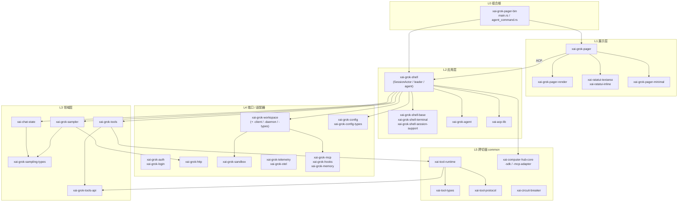
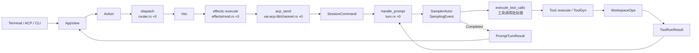

[上一篇：00-阅读指南与文档地图](00-阅读指南与文档地图.md) · [总目录](README.md) · [下一篇：02-简单例子-全路径走读](02-简单例子-全路径走读.md)

# 01：简单框架-系统骨架

> **场景**：先不进任何函数体，只用一张分层图 + 一张部署图，把 **101 个 workspace 成员**收成「可记忆的系统」——知道有几块进程、各自负责什么、谁依赖谁、数据从哪进到哪出。
> **工具版本**：Rust `1.94.0`（`rust-toolchain.toml:11`）；`ratatui 0.29` / `tokio full` / `agent-client-protocol 0.10.4`（`Cargo.toml:233` / `Cargo.toml:280` / `Cargo.toml:117`）。
> **阅读说明**：本文讲**边界与主路径**，不展开函数体。源码索引一律写成 **`文件路径 + 符号名 + 函数内相对偏移`**（`+0` = 函数定义那一行）；**行号随版本变化，以当前源码为准**。逐函数细节在 `03`、模块细节在 `04`–`15`。

---

## 本文件内容

1. [Why：为什么要分层](#1-why为什么要分层)
2. [系统上下文：谁和本进程交互](#2-系统上下文谁和本进程交互)
3. [逻辑分层：谁可以依赖谁](#3-逻辑分层谁可以依赖谁)
4. [物理拓扑：默认单进程，可选子进程](#4-物理拓扑默认单进程可选子进程)
5. [核心运行回边：一条请求怎么回流](#5-核心运行回边一条请求怎么回流)
6. [信任边界：什么不可信](#6-信任边界什么不可信)
7. [技术选型表](#7-技术选型表)
8. [重实现时先画出的边界](#8-重实现时先画出的边界)

---

## 1. Why：为什么要分层

一个二进制要同时服务：交互 TUI、CI headless、编辑器 ACP、后台 leader、以及若干「被拉起就干活然后退出」的子进程。若不分层，这些模式会互相污染——UI 细节渗进 Agent 逻辑，OS 细节焊死在采样里。

分层把「**依赖方向**」钉死：上层可调用下层，下层不知道上层存在。这样：

- Agent 逻辑不依赖 Ratatui（可 headless 跑）。**可核验**：`crates/codegen/xai-chat-state/Cargo.toml` 与 `crates/codegen/xai-grok-sampler/Cargo.toml` 中**都没有** `ratatui`、也没有 `xai-grok-pager` / `xai-grok-shell`。
- 采样不依赖具体文件系统（可换实现/可测试）。`xai-grok-sampler` 只依赖 `xai-grok-http` 与 `xai-grok-sampling-types` 这一层的类型。
- 工具不依赖 UI（可在 leader 进程里跑）。`xai-grok-tools` 依赖 `xai-tool-runtime` / `xai-tool-types` / `xai-tool-protocol`（`crates/codegen/xai-grok-tools/Cargo.toml`），**不依赖** `xai-grok-pager`。

> 组合根 `xai-grok-pager-bin` 只负责「用哪个实现、以什么模式启动」，**不实现业务循环**：`crates/codegen/xai-grok-pager-bin/src/main.rs` 函数：`main` 偏移：`+0` 与函数：`async_main` 偏移：`+0` 通篇是「解析参数 → 分发到某个 `run_*`」，真正的 TUI 主循环在 `xai-grok-pager/src/app/event_loop.rs` 函数：`run` 偏移：`+0`。

---

## 2. 系统上下文：谁和本进程交互



| 参与方 | 角色 | 进入点 |
|---|---|---|
| 开发者 | 用终端驱动 agent | TUI（`xai-grok-pager/src/app/mod.rs` 函数：`run` 偏移：`+0`） |
| ACP 宿主（编辑器） | 以 ACP over stdio 驱动 agent | `grok agent` 子命令 → `xai-grok-shell/src/agent/app.rs` 函数：`run_stdio_agent` 偏移：`+0` |
| Leader 进程 | 常驻 Agent，供多个 TUI/宿主复用 | `xai-grok-shell/src/agent/app.rs` 函数：`run_leader` 偏移：`+0`；客户端连接 `xai-grok-shell/src/leader/mod.rs` 函数：`connect_or_spawn` 偏移：`+0` |
| xAI API | 模型推理（流式） | `xai-grok-sampler` → `xai-grok-http` |
| MCP Server | 外部工具 | `xai-grok-mcp` |
| Computer Hub | 远程计算机 / 桌面 | `crates/common/xai-computer-hub-*` |
| 本地仓库 | 被读写的文件系统 / Git | `xai-grok-workspace` |
| grok.com | 认证、远程设置、用量与计费 | `xai-grok-login` / `xai-grok-shell/src/agent/remote_config.rs` |
| 遥测后端 | Sentry / OTEL / Mixpanel | `xai-grok-telemetry`、`xai-grok-otel`、`xai-mixpanel` |

---

## 3. 逻辑分层：谁可以依赖谁



依赖规则（谁不该承担什么）：

- 展示层（`xai-grok-pager`）**不得**直接 `std::fs`/`Command` 写文件——必须通过 ACP → `xai-grok-shell` → `xai-grok-workspace`。
- 领域层（`xai-chat-state` / `xai-grok-sampler`）**不依赖** Ratatui、不依赖具体 FS，只依赖端口 trait（如 chat-state 的 `persistence.rs` 中定义的持久化接口、sampler 的 HTTP 客户端抽象）。
- 端口层（`crates/common/xai-tool-runtime/src/tool.rs` 的 `trait Tool`，偏移：`+0`；以及 `trait ToolDyn`）定义接口，适配器（`xai-grok-tools/src/implementations/` 下的 `codex` / `opencode` / `grok_build` / `lsp` / `search_tool` 等，以及 `xai-grok-mcp`）实现它。
- 方向可核验：`xai-grok-tools` 依赖 `xai-tool-runtime`；`xai-tool-runtime` 依赖 `xai-tool-types`、`xai-tool-protocol`、`xai-grok-tools-api`。**反向依赖不存在**。

---

## 4. 物理拓扑：默认单进程，可选子进程

默认**单进程**：TUI 与 Agent 在同一个 `grok` 进程内——`xai-grok-pager/src/acp/spawn.rs` 函数：`spawn_grok_shell` 偏移：`+0` 会判断走内嵌线程（`spawn_agent_thread_direct`，偏移：`+0`）还是 leader 连接。入口是 `main.rs` 函数：`async_main` 偏移：`+390` 处的 `xai_grok_pager::app::run(args, bg_update_rx).await`。

| 拓扑 | 何时 | 进程划分 |
|---|---|---|
| 默认 TUI | 交互使用 | 1 进程：Pager + 内嵌 Agent + Sampler 同体 |
| headless `-p` / `--prompt-json` / `--prompt-file` | CI / 脚本 | 1 进程：`xai-grok-pager/src/headless.rs` 函数：`run_single_turn` 偏移：`+0` |
| `grok agent`（stdio ACP） | 编辑器集成 | 1 进程：`xai-grok-shell/src/agent/app.rs` 函数：`run_stdio_agent` 偏移：`+0` |
| Leader | 多客户端复用同一 Agent | Leader 进程（`run_leader`）+ 客户端进程（连 socket，`connect_or_spawn`） |
| Workspace daemon | 远程 / 共享仓库 | `xai-grok-workspace-daemon` 独立进程（`src/daemonize.rs` 函数：`daemonize` 偏移：`+0`） |
| MCP 子进程 | 外部工具 | `xai-grok-mcp` 拉起 stdio / HTTP server |
| Mermaid / Voice | 渲染 / 采集 | 特殊子进程，**启动即 `exit`**，不进 runtime |
| PTY harness | 端到端测试 | `xai-grok-pager-pty-harness` / `ptyctl`，仅测试期 |

> `main()` 的前 7 行就完成「特殊子进程」判定：`crates/codegen/xai-grok-pager-bin/src/main.rs` 函数：`main` 偏移：`+3` 调 `xai_grok_pager::app::mermaid_worker::maybe_run_render_subprocess()`，偏移：`+6` 调 `xai_grok_pager::voice::maybe_run_capture_subprocess()`；任一返回 `Some(code)` 就 `std::process::exit(code)`，**连 CLI 都不解析**。

---

## 5. 核心运行回边：一条请求怎么回流

不进函数体，只看「数据从哪进、经过谁、回到哪」。ASCII 总览：

```text
┌────────┐  key    ┌──────────────┐  Action  ┌────────────────────┐
│Terminal│ ──────▶ │ AppView      │ ───────▶ │ dispatch()         │  ① 同步纯函数
└────────┘         └──────────────┘          │ router.rs +0       │
                                              └──────┬─────────────┘
                                                     │ Vec<Effect>
                                                     ▼
                                              ┌────────────────────┐
                                              │ effects::execute   │  ② 异步副作用
                                              │ effects/mod.rs +0  │
                                              └──────┬─────────────┘
                                          acp_send   │ (xai-acp-lib)
                                                     ▼
┌────────┐  ACP     ┌──────────────┐  SessionCmd ┌────────────────────┐
│Screen  │ ◀─────── │ SessionActor │ ◀────────── │ acp_session.rs     │  ③ 单写者 Actor
└────────┘  update  │ (Agent loop) │             │ struct SessionActor│
                    └──────────────┘             └──────┬─────────────┘
                                              handle_prompt│
                                                          ▼
                                    ┌────────────────────┐  ┌────────────────────┐
                                    │ ChatStateActor     │  │ SamplerActor       │  ④ 采样
                                    │ (xai-chat-state)   │  │ (mpsc 事件流)      │
                                    └──────┬─────────────┘  └──────┬─────────────┘
                                           │ ToolCall              │ SamplingEvent
                                           ▼                       │
                                    ┌────────────────────┐         │
                                    │ execute_tool_calls │ ◀───────┘
                                    └──────┬─────────────┘
                                           │ WorkspaceOps RPC (FS / Git / proc)
                                           ▼
                                    ┌────────────────────┐
                                    │ ToolRunResult      │ ──▶ ChatState ──▶ SamplingEvent
                                    └────────────────────┘      ──▶ ACP update ──▶ ①
```

Mermaid 版：



要点（每条都给当前源码位置）：

- **① 同步分发**：`crates/codegen/xai-grok-pager/src/app/dispatch/router.rs` 函数：`dispatch` 偏移：`+0`，签名 `pub(crate) fn dispatch(action: Action, app: &mut AppView) -> Vec<Effect>`，**不 `.await`**（内部真正的分支在 `dispatch_inner` 偏移：`+9`），所以 UI 逻辑可单测。`Effect` 枚举定义在 `xai-grok-pager/src/app/actions.rs` 类型：`enum Effect` 偏移：`+0`。
- **② 异步副作用**：`xai-grok-pager/src/app/effects/mod.rs` 函数：`execute` 偏移：`+0` 把 `Effect` 变成 `tokio::spawn`；跨进程/跨线程的发送统一走 `xai-grok-pager/src/app/effects/helpers.rs` 函数：`acp_send_bounded` 偏移：`+0`（带 `tokio::time::timeout`），最终落到 `crates/codegen/xai-acp-lib/src/channel.rs` 函数：`acp_send` 偏移：`+0`。
- **③ 异步 Actor（单写者）**：`crates/codegen/xai-grok-shell/src/session/acp_session.rs` 类型：`struct SessionActor` 偏移：`+0`。它持有 `state: TokioMutex<State>`、`chat_state_handle: ChatStateHandle`、`notifications: NotificationSender` 等，所有回合都经它，避免历史/工具结果竞态。回合主体在 `xai-grok-shell/src/session/acp_session_impl/turn.rs` 函数：`handle_prompt` 偏移：`+0`。
- **④ 采样**：`crates/codegen/xai-grok-sampler/src/actor/mod.rs` 类型：`struct SamplerActor` 偏移：`+0`；构造入口 `SamplerActor::spawn` 偏移：`+12`（内部 `tokio::spawn(actor.run())`）；actor 主循环 `SamplerActor::run` 偏移：`+0`，用 `tokio::select!` 在 `cmd_rx.recv()` 与 `tasks.join_next()` 之间选；事件类型 `enum SamplingEvent` 定义在 `xai-grok-sampler/src/events.rs` 偏移：`+0`，经 `mpsc::UnboundedSender<SamplingEvent>` 往外发。**Sampler 只产事件，不碰 FS**。
- **⑤ 工具调用闭合**：`xai-grok-shell/src/session/acp_session_impl/tool_calls.rs` 函数：`execute_tool_calls` 偏移：`+0` → 函数：`execute_tool_calls_batch` 偏移：`+0`；宿主副作用收口到 `crates/codegen/xai-grok-workspace/src/workspace_ops.rs` 类型：`impl WorkspaceOps` 偏移：`+0`，其中通用派发是 `dispatch<Op: WorkspaceOp>` 偏移：`+151`，工具桥接是 `call_tool` 偏移：`+241`。

---

## 6. 信任边界：什么不可信

| 不可信输入 | 谁产生 | 防御在哪 |
|---|---|---|
| 模型输出（含 tool call 参数） | xAI API | `xai-grok-sampler` 校验 + 权限层二次确认（`xai-grok-shell/src/session/acp_session_impl/` 下的权限路径） |
| 仓库内容（文件 / 补丁） | 本地 FS | `xai-grok-workspace` 走 WorkspaceOps，不裸 `std::fs` |
| MCP 返回值 | 外部 server | `xai-grok-mcp` 边界校验 + 超时 / 熔断（`crates/common/xai-circuit-breaker`） |
| Hub 返回值 | Computer Hub | `xai-computer-hub-*` 协议校验 |
| 远端设置 / 公告 | grok.com | `xai-grok-shell/src/agent/remote_config.rs`、`xai-grok-announcements` |
| Hook 输出 | 用户配置的 hook 脚本 | `xai-grok-hooks` + `xai-grok-sandbox/src/hook_write_deny.rs`（`ensure_namespace_lockdown` 偏移：`+0`） |

> 核心原则：**Agent 从不直接 `std::fs` / `Command`**，所有宿主副作用收口到 `xai-grok-workspace`（`crates/codegen/xai-grok-workspace/src/workspace_ops.rs` 类型：`impl WorkspaceOps` 偏移：`+0`）。否则无法代理、无法审计、无法沙箱。

---

## 7. 技术选型表

| 关注点 | 选型 | 位置 | 为什么 |
|---|---|---|---|
| 语言 / 版本 | Rust `1.94.0`，edition `2024` | `rust-toolchain.toml:11` / `Cargo.toml:113` | 手动 bump，一次一个点版本 |
| 异步运行时 | Tokio `1`（`full`） | `Cargo.toml:280` | 手动 `Builder::new_multi_thread` 以控制线程数与 `shutdown_timeout` |
| TUI | Ratatui `0.29`（+ `ratatui-core 0.1`） | `Cargo.toml:233` / `Cargo.toml:234` | 立即模式渲染；文本输入自研 `xai-ratatui-textarea` |
| HTTP | Reqwest `0.12` + rustls | `Cargo.toml:239`、`xai-grok-http` | SSE 流式采样 |
| Agent 协议 | ACP `agent-client-protocol 0.10.4`（`unstable`） | `Cargo.toml:117` | 编辑器可嵌入；`xai-acp-lib` 包一层 |
| 工具协议 | `xai-tool-protocol` / `xai-tool-runtime` | `crates/common/` | 内置 / MCP / Hub 统一 `Tool` + `ToolDyn` trait |
| 对话持久化 | JSONL（`chat_history.jsonl` / `updates.jsonl`） | `xai-chat-state`（`src/persistence.rs`） | 追加写、崩溃可恢复、可重放 |
| 记忆检索 | SQLite + FTS5 + `sqlite-vec` | `xai-grok-memory`（`src/search.rs`、`xai-sqlite-journal`） | 混合检索（BM25 + 向量 KNN + 时间衰减 + MMR） |
| 语法分析 | tree-sitter | `xai-codebase-graph`（`src/index_manager.rs`） | 符号索引与导航 |
| Git | `gix 0.83`（+ `git2 0.20`） | `Cargo.toml:178` / `Cargo.toml:177`、`xai-gix-status` | 纯 Rust Git 状态与内容过滤 |
| 沙箱 | bubblewrap（bwrap 重执行）+ seccomp BPF | `xai-grok-sandbox`：`SandboxManager::apply`（`lib.rs` 偏移：`+0`）、`restrict_child_network`（`child_net.rs` 偏移：`+0`） | OS 层隔离；子进程网络另用 seccomp 过滤 |
| 分配器 | jemalloc（`tikv-jemallocator`） | `Cargo.toml:277`、`main.rs` 顶部 `#[global_allocator]` | 堆剖析与内存回收（`memory_trace` / `heap_profile`） |
| 崩溃上报 | Sentry + 自研 crash handler | `xai-grok-telemetry` / `xai-crash-handler` | `main.rs` 函数：`main` 偏移：`+46` 起初始化 |

---

## 8. 重实现时先画出的边界

从零重建时，第一天**不要**复制 101 个 crate。先画并锁死以下边界（详见 `04`–`15` 各章「重实现」小节）：

1. 组合根只分发，不放逻辑（`07`）。
2. `Action`/`Effect` 事件循环是 UI 与领域解耦点（`08`）。
3. `SessionActor` 单写者，回合循环是核心（`09`）。
4. `Sampler` 只产 `SamplingEvent`，不碰 FS（`09`/`05`）。
5. `Tool` trait 统一内置 / MCP / Hub（`10`）。
6. `WorkspaceOps` 收口所有宿主副作用 + 权限双层（`11`）。
7. `ChatPersistence` JSONL 是崩溃恢复基础（`13`）。

**判定「边界画对了」的最小实验**：把 `xai-grok-pager` 换成一个只读 stdin / 写 stdout 的 headless 客户端，如果 Agent 侧一行都不用改就能跑通（这正是 `run_single_turn` 与 `run_stdio_agent` 存在的原因），说明 L1/L2 边界是干净的。

---

[上一篇：00-阅读指南与文档地图](00-阅读指南与文档地图.md) · [总目录](README.md) · [下一篇：02-简单例子-全路径走读](02-简单例子-全路径走读.md)
