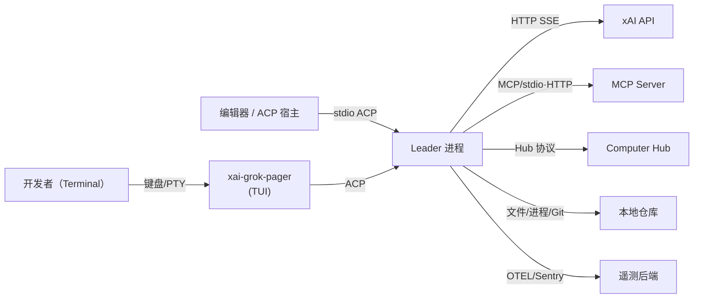
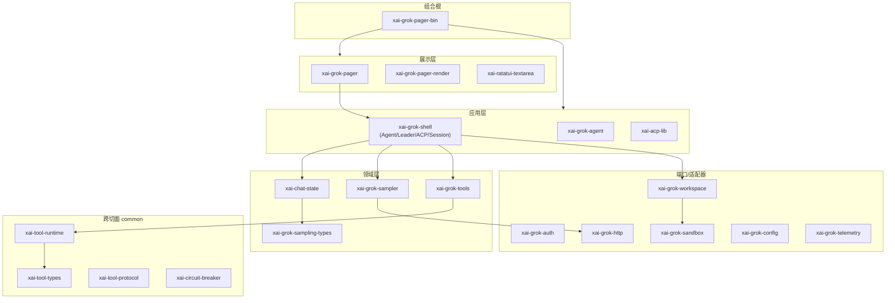
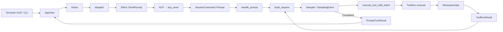

[上一篇：00-阅读指南与文档地图](00-阅读指南与文档地图.md) · [总目录](README.md) · [下一篇：02-简单例子-全路径走读](02-简单例子-全路径走读.md)

# 01：简单框架-系统骨架

> **场景**：先不进任何函数体，只用一张分层图 + 一张部署图，把 ~89 个 crate 收成「可记忆的系统」——知道有几块进程、各自负责什么、谁依赖谁、数据从哪进到哪出。
> **工具版本**：Rust `1.94.0`（`rust-toolchain.toml:11`）。
> **阅读说明**：本文讲**边界与主路径**，不展开函数体。行号来自当前快照，以当前源码为准。逐函数细节在 `03`、模块细节在 `04`–`15`。

---

## 本文件内容

1. [Why：为什么要分层](#1-why为什么要分层)
2. [系统上下文：谁和本进程交互](#2-系统上下文谁和本进程交互)
3. [逻辑分层：谁可以依赖谁](#3-逻辑分层谁可以依赖谁)
4. [物理拓扑：默认单进程，可选子进程](#4-物理拓扑默认单进程可选子进程)
5. [核心运行回边：一条请求怎么回流](#5-核心运行回边一条请求怎么回流)
6. [信任边界：什么不可信](#6-信任边界什么不可信)
7. [技术选型表](#7-技术选型表)
8. [重实现时先画出的边界](#8-重实现时先画出的边界)

---

## 1. Why：为什么要分层

一个二进制要同时服务：交互 TUI、CI headless、编辑器 ACP、后台 leader。若不分层，这些模式会互相污染——UI 细节渗进 Agent 逻辑，OS 细节焊死在采样里。

分层把「**依赖方向**」钉死：上层可调用下层，下层不知道上层存在。这样：

- Agent 逻辑不依赖 Ratatui（可 headless 跑）。
- 采样不依赖具体文件系统（可换实现/可测试）。
- 工具不依赖 UI（可在 leader 进程里跑）。

> 组合根 `xai-grok-pager-bin` 只负责「用哪个实现、以什么模式启动」，**不实现业务循环**（见 `crates/codegen/xai-grok-pager-bin/src/main.rs:1879` 的 `main`，以及 `:1970` 的 `async_main`）。

---

## 2. 系统上下文：谁和本进程交互



| 参与方 | 角色 | 进入点 |
|---|---|---|
| 开发者 | 用终端或编辑器驱动 agent | TUI / ACP stdio |
| ACP 宿主 | VS Code 等编辑器 | `Leader` 模式（`main.rs` `Command::Leader`，`cli.rs:9`） |
| xAI API | 模型推理 | `xai-grok-sampler` → `xai-grok-http` |
| MCP Server | 外部工具 | `xai-grok-mcp` |
| Computer Hub | 远程计算机/桌面 | `xai-computer-hub-*` |
| 本地仓库 | 被读写的文件系统/Git | `xai-grok-workspace` |
| 遥测后端 | Sentry/OTEL | `xai-grok-telemetry` |

---

## 3. 逻辑分层：谁可以依赖谁



依赖规则（谁不该承担什么）：

- 展示层（`xai-grok-pager`）**不得**直接 `std::fs`/`Command` 写文件——必须通过 ACP → `xai-grok-shell` → `xai-grok-workspace`。
- 领域层（`xai-chat-state`/`xai-grok-sampler`）**不依赖** Ratatui、不依赖具体 FS，只依赖端口 trait（如 `ChatPersistence`、`SamplingClient`）。
- 端口层（`xai-tool-runtime` 的 `Tool` trait）定义接口，适配器（`xai-grok-tools` 的具体工具、`xai-grok-mcp`）实现它。

---

## 4. 物理拓扑：默认单进程，可选子进程

默认**单进程**：TUI 与 Agent 在同一个 `xai-grok-pager` 进程内（见 `main.rs:2307` 的 `xai_grok_pager::app::run`）。但通过 ACP，可拆成多进程：

| 拓扑 | 何时 | 进程划分 |
|---|---|---|
| 默认 TUI | 交互使用 | 1 进程：Pager + Shell + Sampler 同体 |
| headless `-p` | CI / 脚本 | 1 进程：`run_single_turn`（`main.rs:2248`） |
| Leader / ACP 宿主 | 编辑器集成 | Leader 进程（Agent）+ 宿主进程（Pager 连 socket） |
| Workspace Server | 远程/共享仓库 | `xai-grok-workspace-daemon` 独立进程 |
| MCP 子进程 | 外部工具 | `xai-grok-mcp` 拉起 stdio/HTTP server |
| Mermaid / Voice | 渲染/采集 | 特殊子进程，启动即 `exit`（`main.rs` 子进程判断） |

> `main()` 先判断「是否特殊子进程（Mermaid renderer / Voice capture）」，是则执行后直接 `exit`，不走运行时（`main.rs` 的 `SUB` 分支）。

---

## 5. 核心运行回边：一条请求怎么回流

不进函数体，只看「数据从哪进、经过谁、回到哪」。ASCII 总览（多列标参与方）：

```text
┌────────┐  key    ┌──────────────┐  Action  ┌──────────────┐
│Terminal│ ──────▶ │ Pager AppView│ ───────▶ │ dispatch()   │  ① 同步分发
└────────┘         └──────────────┘          └──────┬───────┘
                                                     │ Effect::SendPrompt
                                                     ▼
┌────────┐  ACP     ┌──────────────┐  SessionCmd     ┌──────────────┐
│Screen  │ ◀─────── │ Leader/Shell │ ◀────────────── │ SessionActor │  ② 异步 Actor
└────────┘  update  │ (Agent loop) │                 └──────┬───────┘
                   └──────────────┘                        │ handle_prompt
                                            build_request  │
                                                     ▼      ▼
                                            ┌──────────────┐  ┌──────────────┐
                                            │ ChatState    │  │ Sampler      │ ③ 采样
                                            └──────┬───────┘  └──────┬───────┘
                                                   │ ToolCall          │ SamplingEvent
                                                   ▼                  │
                                            ┌──────────────┐          │
                                            │ Tool execute │ ◀────────┘
                                            └──────┬───────┘
                                                   │ WorkspaceOps (FS/Git/proc)
                                                   ▼
                                            ┌──────────────┐
                                            │ ToolRunResult│ ──▶ ChatState ──▶ SamplingEvent ──▶ ACP update ──▶ ①
                                            └──────────────┘
```

Mermaid 版（与 README 心智模型一致）：



要点：

- **① 同步分发**：TUI 的 `dispatch` 是纯函数 `dispatch(Action) -> Vec<Effect>`（`crates/codegen/xai-grok-pager/src/app/dispatch/router.rs:149`），不 `.await`，所以 UI 逻辑可单测。
- **② 异步 Actor**：`SessionActor` 是单写者（`crates/codegen/xai-grok-shell/src/session/acp_session.rs:645`），所有回合都经它，避免历史/工具结果竞态。
- **③ 采样**：`SamplerActor` 通过 `mpsc` 把 `SamplingEvent` 往外发（`crates/codegen/xai-grok-sampler/src/actor/mod.rs:27`）。

---

## 6. 信任边界：什么不可信

| 不可信输入 | 谁产生 | 防御在哪 |
|---|---|---|
| 模型输出（含 tool call 参数） | xAI API | `xai-grok-sampler` 校验 + 权限层二次确认 |
| 仓库内容（文件/补丁） | 本地 FS | `xai-grok-workspace` 走 WorkspaceOps，不裸 `std::fs` |
| MCP 返回值 | 外部 server | `xai-grok-mcp` 边界校验 + 超时/熔断 |
| Hub 返回值 | Computer Hub | `xai-computer-hub-*` 协议校验 |

> 核心原则：**Agent 从不直接 `std::fs` / `Command`**，所有宿主副作用收口到 `xai-grok-workspace`（`crates/codegen/xai-grok-workspace/src/workspace_ops.rs:1452` 的 `WorkspaceOps`）。否则无法代理、无法审计、无法沙箱。

---

## 7. 技术选型表

| 关注点 | 选型 | 位置 | 为什么 |
|---|---|---|---|
| 异步运行时 | Tokio（`full`） | `Cargo.toml:271` | 手动 `Builder` 以控制 `shutdown_timeout` |
| TUI | Ratatui `0.29` | `Cargo.toml:225` | 立即模式渲染 |
| HTTP | Reqwest + rustls | `xai-grok-http` | SSE 流式采样 |
| Agent 协议 | ACP `0.10.4` | `Cargo.toml:110` | 编辑器可嵌入 |
| 工具协议 | `xai-tool-protocol` | `crates/common/xai-tool-protocol` | Hub/MCP/内置统一 `Tool` trait |
| 持久化 | JSONL + SQLite | `xai-chat-state` / `xai-grok-memory` | 崩溃可恢复、可检索 |
| 语法分析 | tree-sitter | `xai-grok-tools` | 精确编辑/补全 |
| Git | `gix`（`xai-gix-status`） | `crates/codegen/xai-gix-status` | 纯 Rust Git 状态 |
| 沙箱 | bubblewrap + seccomp | `xai-grok-sandbox`（`lib.rs:320` / `child_net.rs:105`） | OS 层隔离 |

---

## 8. 重实现时先画出的边界

从零重建时，第一天**不要**复制 89 个 crate。先画并锁死以下边界（详见 `04`–`15` 各章「重实现」小节）：

1. 组合根只分发，不放逻辑（`07`）。
2. `Action`/`Effect` 事件循环是 UI 与领域解耦点（`08`）。
3. `SessionActor` 单写者，回合循环是核心（`09`）。
4. `Sampler` 只产 `SamplingEvent`，不碰 FS（`09`/`05`）。
5. `Tool` trait 统一内置/MCP/Hub（`10`）。
6. `WorkspaceOps` 收口所有宿主副作用 + 权限双层（`11`）。
7. `ChatPersistence` JSONL 是崩溃恢复基础（`13`）。

---

[上一篇：00-阅读指南与文档地图](00-阅读指南与文档地图.md) · [总目录](README.md) · [下一篇：02-简单例子-全路径走读](02-简单例子-全路径走读.md)
