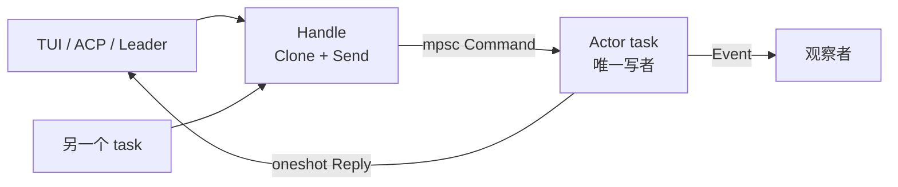
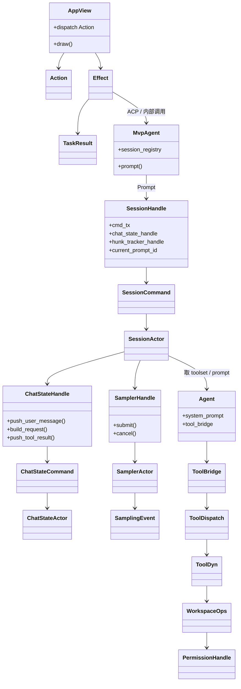
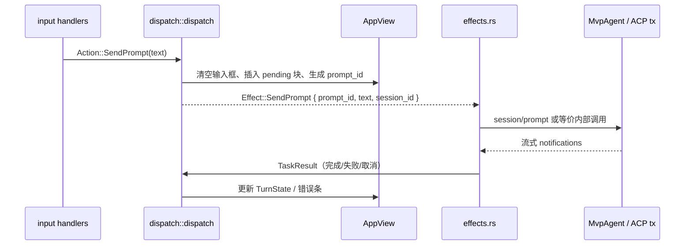
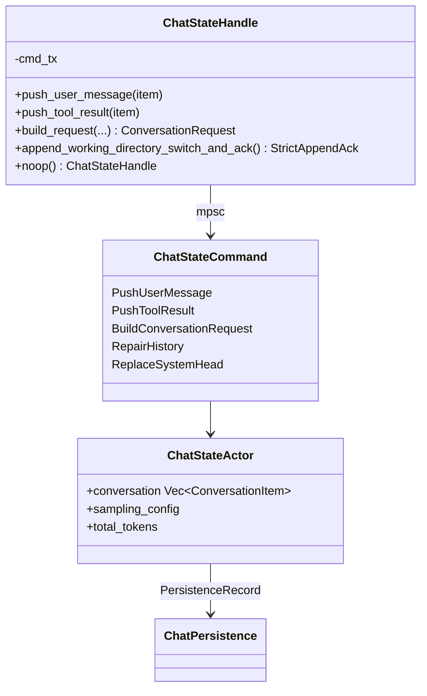
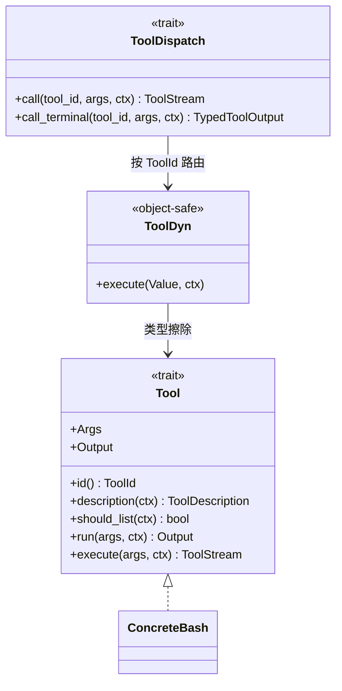
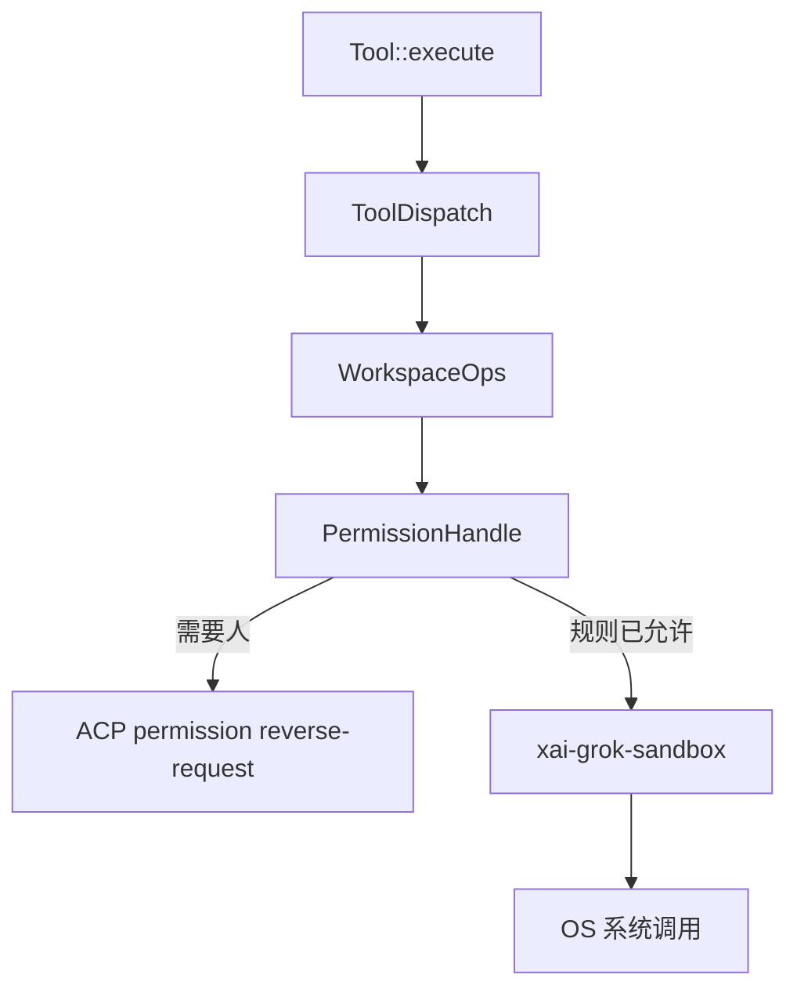
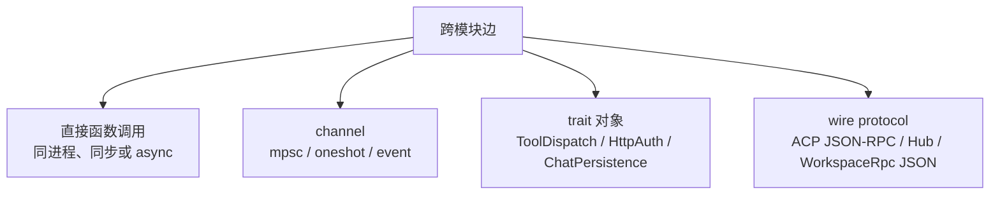

# 02 · 核心模块与类关系

> 读完本篇应能：指出任意跨 crate 的边用的是直接调用、channel、trait 还是 wire protocol；并能列出重实现时最小对象集（哪些 Handle/Actor 第一天就要有，哪些可以后补）。

## 快速摘要

### 架构总览（模块与依赖）

成套出现的四类对象：Handle（`Clone` 调用端口）、Actor（唯一写者 task）、Command（mpsc 消息）、Event/Result（观察或 oneshot）。TUI 另有 `Action` / `Effect` / `TaskResult`。工具侧是 `Tool` → `ToolDyn` → `ToolDispatch` → `WorkspaceOps`。

### 核心调用序列（全路径小例子）

`AppView` 发出 `Action::SendPrompt` → `dispatch` 返回 `Effect::SendPrompt` → `MvpAgent` 向 `SessionHandle.cmd_tx` 发送带 oneshot 的 `SessionCommand::Prompt` → `SessionActor` 调 `ChatStateHandle::build_request` 与 `SamplerHandle::submit` → 工具经 `ToolDispatch::call` 落到 `WorkspaceOps`。

### 易错点与边界条件

- 不要对 `Vec<ConversationItem>` 加 `Mutex` 让 UI 直接 lock。
- `PromptCompletionKind::RemovedFromQueue` 不能当 `Completed` 处理。
- `Tool` 因关联类型不是 object-safe，调度必须走 `ToolDyn`。

## 1. Why：为什么到处是 Handle + Actor，而不是一把大锁

大型异步程序如果用 `Mutex<AppState>` 让 TUI、HTTP 回调、工具任务一起抢锁，会出现：

1. **锁跨 await**：持锁时 `await` 采样流，取消和重入会把状态机撕开。
2. **事实源混乱**：UI 直接改对话数组，压缩任务同时截断同一 Vec，磁盘 JSONL 变成第三份真相。
3. **无法单测 dispatch**：TUI 测试必须启动真 Session。

本仓库的标准解法写在 `xai-chat-state/src/lib.rs` 的模块文档里，并在 Session、Sampler、HunkTracker、PermissionManager 上重复使用：

```text
调用方只持有 Handle（Clone + Send）
Handle 内部是 mpsc::UnboundedSender<Command>
独立 tokio task 里的 Actor 是该状态的唯一写者
需要“这一次的结果”时，Command 里带 oneshot::Sender
需要“持续观察”时，Actor 另有 event_tx
```

这不是风格偏好，而是所有权模型：

- **谁能 `mut` 这块内存？** 只有那个 Actor task。
- **谁能发起变更？** 任何持有 Handle 的人，但变更被串行化成 Command。
- **谁在等待完成？** 只有塞了 oneshot 的那一次调用。



若你在重实现里对 `Vec<ConversationItem>` 加 `Mutex` 并在 UI 线程 lock 它，等于撤销了这整套设计。正确做法是：UI 发 `ChatStateCommand`，自己只保留**渲染用快照**。

## 2. What：四类对象，先认标签再认名字

整仓对象可以打四种标签。同一个业务概念（例如“会话”）会同时有这四种东西，名字成套出现。

| 标签 | 职责 | 典型符号 |
|---|---|---|
| **Handle** | 调用端口，可 Clone，不拥有大块状态 | `SessionHandle`、`ChatStateHandle`、`SamplerHandle`、`PermissionHandle`、`HunkTrackerHandle`、`WorkspaceHandle` |
| **Actor** | 单写者 task，拥有状态 | `SessionActor`、`ChatStateActor`、`SamplerActor` |
| **Command** | Handle → Actor 的消息 | `SessionCommand`、`ChatStateCommand`、`SamplerCommand` |
| **Event / Result** | Actor → 外界 | `SamplingEvent`、`ChatStateEvent`、`PromptTurnResult`、ACP notification、`TaskResult` |

另外还有两种**不是 Actor** 但经常被误认成 Actor 的东西：

| 种类 | 职责 | 典型符号 |
|---|---|---|
| **Trait 端口** | 可替换适配器 | `Tool`、`ToolDispatch`、`ChatPersistence`、`HttpAuth`、`WorkspaceRpc` |
| **值对象 / 定义** | 装配完成后尽量不可变 | `Agent`、`AgentDefinition`、`ToolSpec`、`ConversationRequest` |

`xai-grok-agent` 的 `Agent` 注释写得很清楚：它 **NOT portable**，绑在某次 session 的 `ToolBridge` 和已渲染 system prompt 上；构造后视为不可变，工具运行时状态走 `ToolBridge` 内部锁，而不是让 `Agent` 自己变成 Actor。

## 3. What：对象全景（真实类型）



读这张图时记住方向：

- 实线向下是**命令/调用**。
- `SamplingEvent`、`TaskResult`、ACP notification 是**反向观察**，不要让 Sampler 去改 `AppView` 字段。

## 4. How：TUI 三元组 Action / Effect / TaskResult

文件：`crates/codegen/xai-grok-pager/src/app/actions.rs`  
模块总述：`crates/codegen/xai-grok-pager/src/app/mod.rs`

```text
Action  — 同步、无副作用的用户意图（input 产生，dispatch 消费）
Effect  — 必须异步执行的外界动作（dispatch 产生，event_loop/effects 消费）
TaskResult — 异步任务完成后再喂回 dispatch 的结果
```

`mod.rs` 把测试策略说死了：`dispatch` 是 sync、testable；副作用全部推迟到 `effects`。

### 4.1 Action（节选，完整枚举有数百变体）

与 Prompt 主链直接相关的：

| 变体 | 含义 |
|---|---|
| `Action::SendPrompt(String)` | 用户提交当前输入框文本 |
| `Action::SendPromptNow { .. }` | 取消当前 turn 并立刻发送（cancel-and-send） |
| `Action::Quit` / `QuitConfirmed` / `QuitForUpdate` | 退出族 |
| 权限相关变体 | 用户在 modal 里允许/拒绝 |

`Action` 由 `app/input` 从 crossterm 事件翻译而来，**不得**在 input 层直接调 Agent。

### 4.2 Effect（节选）

`Effect::SendPrompt` 的字段就是一次 ACP prompt 的最小客户端契约：

| 字段 | 类型 | 作用 |
|---|---|---|
| `agent_id` | `AgentId` | 多 Agent 视图时选哪一个 |
| `session_id` | `acp::SessionId` | 目标会话 |
| `text` | `String` | 用户可见文本 |
| `prompt_id` | `String` | 客户端 UUID；每条 notification 和最终 `PromptResponse` 都回显它，用来把流式块对上这一次提交 |
| `skill_token_ranges` | `Vec<Range<usize>>` | slash/skill 高亮区间，写入 content block `_meta.skillTokenRanges` |

同文件里还有 `CreateSession`、`LoadSession`、`CancelTurn`、`SendBashCommand`。它们都是“请外界做事”，不是“请改 AppView 字段”——改字段是 `dispatch` 在同步阶段已经做完的。

### 4.3 调用关系



重实现 TUI 时，最小闭环是：

1. 定义自己的 `Action` / `Effect`（可以只有 5 个变体）。
2. `dispatch` 纯函数：`(state, action) -> (state, effects)`。
3. `effects` 里只允许 I/O。

不要在 key handler 里 `await agent.prompt()`。那会把事件循环卡死，也无法单测。

## 5. How：MvpAgent 是应用层门面，不是对话事实源

文件：`crates/codegen/xai-grok-shell/src/agent/mvp_agent/mod.rs`  
ACP 实现：`mvp_agent/acp_agent.rs` 的 `impl acp::Agent for MvpAgent`

`MvpAgent` 持有：

- `session_registry`：session id → `SessionHandle`
- `cfg: RefCell<AgentConfig>`
- `sampling_config`、`auth_manager`、`models_manager`
- `gateway: GatewaySender`（向外发 ACP notification）
- `activity`（给 Leader 看“有没有人在干活”）

它实现 ACP 的 `session/new`、`session/load`、`session/prompt`、`session/cancel`。`prompt` 方法的核心动作不是改历史，而是：

1. 从 registry 取出 `SessionHandle`。
2. 组装 `SessionCommand::Prompt { respond_to: oneshot, ... }`。
3. `cmd_tx.send(...)`。
4. `.await` oneshot，得到 `PromptTurnResult`。
5. 把 stop reason 映射成 ACP `PromptResponse`。

`MvpAgent` 里大量 `RefCell` / `Cell` 的注释标明了 **leader-safe** 字段哪些是 init-once、哪些是 last-client-wins。重实现单进程 TUI 时可以先忽略这些注释；做 Leader 多客户端时必须回来读它们，否则 telemetry 和 folder-trust 会串台。

## 6. How：SessionHandle / SessionActor / SessionCommand

### 6.1 Handle 上有什么

文件：`crates/codegen/xai-grok-shell/src/session/handle.rs`

`SessionHandle` 是 `Clone` 的。关键字段：

| 字段 | 类型 | 谁读 | 谁写 |
|---|---|---|---|
| `cmd_tx` | `mpsc::UnboundedSender<SessionCommand>` | 所有调用方 | Actor 收 |
| `persistence_tx` | persistence 通道 | 扩展处理器 | Actor / persistence task |
| `current_prompt_id` | `Arc<Mutex<Option<String>>>` | 取消路径、subagent 过滤 | Actor 在 turn 开始/结束时 |
| `pending_interactions` | 阻塞中的 permission/question | roster 显示 NeedsInput | Actor insert/remove |
| `info` | session id + cwd 缓存 | 任何不想打盘的人 | 创建时 |
| `chat_state_handle` | `ChatStateHandle` | 检查最终对话 | ChatStateActor |
| `hunk_tracker_handle` | `HunkTrackerHandle` | diff UI | HunkTracker Actor |
| `signals_handle` | 完成跟踪 | 等待 turn 结束 | Actor |
| `gateway_enabled` | `Arc<AtomicBool>` | 是否向客户端转发 notification | 附着/分离客户端时 |
| `resolved_tool_overrides` | `ArcSwapOption<ToolOverrides>` | 子 Agent 继承 cutoff | Actor 在 turn 前发布 |
| `max_turns` | `Option<usize>` | 子 Agent 继承 | 创建时 |

`SessionLiveState` 描述的不是磁盘上的“会话结束了吗”（会话是可恢复日志），而是 **进程内驻留**：

| 变体 | 含义 |
|---|---|
| `Working` | Actor 在，turn 正在跑 |
| `IdleResident` | Actor 在，没有 turn |
| `Dormant` | 只在磁盘，内存里没 Actor |
| `Completed` | 磁盘上有终态标记，可 resume |
| `DeadFailed` | JoinHandle 异常结束且没有终态标记；可收割并降为 Dormant |
| `Attaching` | 正在 load/resume 构建 Actor |

Leader 的 roster/dashboard 读的是这个枚举，不是 pid。重实现若用“子进程还活着吗”来表示会话状态，会和磁盘日志模型冲突。

### 6.2 SessionCommand::Prompt 的参数就是内部 API

文件：`crates/codegen/xai-grok-shell/src/session/commands.rs`

`SessionCommand::Prompt` 不是“一个字符串”。字段决定了回合语义：

| 字段 | 类型 | 传递含义 |
|---|---|---|
| `prompt_id` | `String` | 本轮 id，取消和 notification 都用它 |
| `prompt_blocks` | `Vec<acp::ContentBlock>` | 结构化内容（文本/图），不是纯 String |
| `prompt_mode` | `PromptMode` | 来自 request `_meta.mode` |
| `verbatim` | `bool` | true 则跳过 `<user_query>` 包装和大 prompt 截断 |
| `send_now` | `bool` | 取消当前 turn 并跑这条 |
| `json_schema` | `Option<Value>` | `--json-schema` 结构化输出 |
| `traceparent` | `Option<String>` | 跨 channel 把 `agent.prompt` 和 `handle_prompt` 连到同一条 OTEL 迹 |
| `respond_to` | `oneshot::Sender<PromptTurnResult>` | **这一轮**的最终结果 |
| `persist_ack` | `Option<oneshot::Sender<()>>` | 用户消息已入历史且 persistence barrier 完成、**推理开始前** |
| `parsed_prompt_tx` | `Option<oneshot<ParsedPromptInfo>>` | 解析后立刻回传，供 metadata.json 使用，避免调用方再 parse 一次 |
| `admission` | `Option<TaskWakeAdmission>` | 后台 task 唤醒的准入 |
| `tool_overrides_update` | `Option<ToolOverridesUpdate>` | 本轮工具覆盖 |

返回值类型：

```text
PromptTurnResult = Result<PromptTurnOk, acp::Error>
```

`PromptTurnOk` 含 `stop_reason`、`total_tokens`、`turn_snapshot`、`completion_kind`、`structured_output`、`usage`、`tool_overrides`。

`PromptCompletionKind` 变体（重实现必须全部有语义，哪怕第一天只实现前两个）：

| 变体 | 含义 | 副作用注意 |
|---|---|---|
| `Completed` | 正常结束 | 可以触发 goal continuation |
| `StationarityEnded` | 判定空转后静默 EndTurn | **不要**再排队 goal continuation |
| `Cancelled` | 用户/系统取消 | 带 `CancellationContext`（tool_name、trigger 如 `"esc"`） |
| `MaxTurnsReached` | 碰到 `max_turns` |  |
| `Rewound` | rewind 打断 |  |
| `RemovedFromQueue` | 排队中的 prompt 被删，**从未开 turn** | 禁止发 `prompt_complete` broadcast，否则会误伤正在跑的 turn |

`spawn_session_actor` 在 `session/acp_session_impl/spawn.rs`，参数列表极长（gateway、credentials、mcp_servers、persistence、初始 conversation、compaction 模式……）。阅读时不要试图一次记住所有参数；先抓住三件事：它返回 `SessionHandle`、它启动一个 task、它把 ChatState/Sampler/Tools 的 Handle 塞进 Actor 状态。

## 7. How：ChatState 是对话事实的唯一写者

文件：

- `crates/codegen/xai-chat-state/src/lib.rs`
- `handle.rs`、`commands.rs`、`actor/`

`ChatStateHandle` 内部只有 `cmd_tx: UnboundedSender<ChatStateCommand>`。公开方法分成：

- **fire-and-forget**：`push_user_message`、`push_assistant_response`、`push_tool_result`（`let _ = send`，Actor 挂了就丢，调用方通常还有更外层的错误路径）。
- **query + oneshot**：`push_user_message_and_ack`、`append_working_directory_switch_and_ack`、`build_request`、`get_conversation`。

`build_request` 的签名是重实现采样前必须抄对的契约：

```text
ChatStateHandle::build_request(
    tool_definitions: Vec<ToolSpec>,
    memory_reminder: Option<String>,
    persist_memory_reminder: bool,
    trace: Option<Box<dyn TraceContext>>,
    conv_id: String,
    req_id: String,
) -> Option<ConversationRequest>
```

注释写明它会 **prune、repair dangling tool calls、inject memory**，然后返回一份**即将发送**的 `ConversationRequest`。对应测试 `build_request_does_not_mutate_actor_state` 要求：构建请求不得偷偷改 Actor 里的权威历史（除非明确 `persist_memory_reminder`）。

`append_working_directory_switch_and_ack` 展示了“写盘 API 该长什么样”：

- 成功：`StrictAppendAck::Appended` 或 `AlreadyPresent`（按 `cwd_generation` 幂等）。
- 失败：`StrictAppendError::{NotCommitted, Committed, Indeterminate}`。
- Actor 不可用时 Handle 把它映射成 `Indeterminate` + `BrokenPipe`，注释要求 **按 generation 重试**，而不是再 append 一条新的 cwd 消息。

这就是可靠性说明书里“结果未知先对账”在类型系统里的落地。



`ChatStateHandle::noop()` 丢弃一切命令，供测试和“还没接上 Actor”的字段占位。`SamplerHandle::noop()`、`HunkTrackerHandle::noop()` 是同一模式。重实现时为每个 Handle 提供 noop，能让上层类型先编译起来。

## 8. How：Sampler 三层，事件不是状态

文件：`crates/codegen/xai-grok-sampler/src/lib.rs`、`handle.rs`、`events.rs`

crate 文档定义三层 API：

| 层 | 符号 | 输入 | 输出 |
|---|---|---|---|
| L1 | `SamplingClient` | HTTP | 原始 chunk 流 |
| L2 | `stream::{stream_chat_completions, stream_responses, stream_messages, collect_response}` | 原始流 | `SamplingEvent` |
| L3 | `SamplerHandle` / `SamplerActor` | `ConversationRequest` | 并发、重试、取消、事件分发 |

`SamplerHandle::submit(request_id, request)` 是 fire-and-forget：结果**不**从 `submit` 的返回值来，而从共享事件通道的 `SamplingEvent` 来。需要同步等待时用带 `completion_tx` 的命令变体（见 `SamplerCommand::Submit` 的 `completion_tx: Option<...>`）。

`cancel(request_id)` 对未知 id 是 no-op（已经结束或从未提交）。这避免 UI 双击 Esc 变成错误。

`SamplingEvent` 关键变体：

| 变体 | 何时 | UI 可否当最终消息 |
|---|---|---|
| `StreamStarted` | HTTP 头读完 | 否 |
| `FirstToken` | 第一个内容 token | 否 |
| `ChannelToken { channel, text }` | 文本或 reasoning 增量 | 否，只用于流式显示 |
| `ToolCallDelta` | 工具参数碎片，**单独一份不一定是合法 JSON** | 否 |
| 最终完成类事件 | 流正常结束 | **是**，这时才允许 `push_assistant_response` |

`SamplingChannel` 是 `Text` | `Reasoning`。加新通道只加这个枚举，不必复制一整套 Event 变体。

SessionActor 是 Sampler 的翻译器：把 `SamplingEvent` 变成 ACP `session/update` notifications，并在完成后写 ChatState。Pager 不应该直接依赖 `SamplingEvent`，否则展示层和传输层焊死。

## 9. How：Agent 值对象 vs Tool 运行时

### 9.1 `xai_grok_agent::Agent`

文件：`crates/codegen/xai-grok-agent/src/agent.rs`、`builder.rs`

`AgentBuilder` 把 `AgentDefinition` + session context 变成 `Agent`。`Agent` 持有：

- `definition: AgentDefinition`
- `prompt_context: PromptContext`（可再渲染）
- `system_prompt: String`（缓存）
- `tool_bridge: Arc<ToolBridge>`（注册表 + 会话工具状态）
- `reminder_policy` / `compaction` 策略

SessionActor 问 Agent：“这一轮 system prompt 是什么、工具清单是什么”，而不是让 Agent 去跑 HTTP。跑 HTTP 是 Sampler 的事；跑工具是 `ToolBridge` → `ToolDispatch` 的事。

### 9.2 Tool trait 与 ToolDispatch

文件：`crates/common/xai-tool-runtime/src/tool.rs`、`dispatch.rs`



关键调用约定：

- 运行时**只调用** `execute`。`run` 是给阻塞工具的糖；默认 `execute` 把 `run` 包成单 Terminal 流。
- `Tool` 因关联类型 `Args`/`Output` **不是 object-safe**，所以必须有 `ToolDyn` + JSON `Value` 边界。
- `ToolDispatch::call_terminal` 默认丢掉所有 `Progress`，遇到第一个 `Terminal` 返回；流结束还没有 Terminal 则 `ToolError::custom("stream_no_terminal", ...)`。这是协议违规，不是业务失败。

`ToolCallContext`（`context.rs`）携带身份、cwd、取消、session、trace。工具实现通过 context 碰 Workspace，而不是自己 `std::env::current_dir()`。

## 10. How：WorkspaceOps 与 PermissionHandle

文件：

- `crates/codegen/xai-grok-workspace/src/workspace_ops.rs`
- `permission/mod.rs`（`PermissionHandle`、`spawn_permission_manager`）

`WorkspaceOps` 是**双模式句柄**，不是 Actor：

| 模式 | 行为 |
|---|---|
| `Local` | 扩展走 `WorkspaceHandle`；工具走 session 的 `FinalizedToolset`（`bind_local_session` 之后安装） |
| `Proxy` | 全部经 Hub WebSocket 调远程 workspace server |

每个 RPC 有一个实现 `WorkspaceRpc` 的请求 struct，带 `METHOD` 常量。客户端 `WorkspaceOps` 和服务器 `WorkspaceRpcHandler::dispatch` 共用同一 struct，改字段两边一起红。这是端口层最成功的模式之一：把“函数签名”做成共享类型，而不是两边手写 JSON。

`PermissionHandle` 由 `spawn_permission_manager` 产生，同样是“Handle + 后台 task”。工具在真正执行副作用前问它；UI 通过 ACP reverse-request 当 `prompter`。Auto mode 走 `permission/auto_mode` 的 classifier，不是把“允许”写死在工具里。



两层拒绝的含义不同：Permission 拒绝是产品决策；Sandbox 拒绝是即使用户点了允许，内核/隔离策略仍不允许。重实现时用一个 `if allowed { Command::new }` 把两层捏在一起，之后无法做企业策略和 OS 隔离的独立测试。

## 11. What：状态所有权表（事实源）

这张表是本篇最重要的可执行结论。改代码前先查“谁是唯一写者”。

| 数据 | 唯一写者 | 其他人如何读 | 禁止 |
|---|---|---|---|
| 输入框文本、焦点、modal 栈 | `AppView` / `AgentView` | 只在 draw 读 | SessionActor 改像素 |
| 当前 turn 的 UI 展示块 | pager scrollback（由 ACP notification 驱动） | 用户滚动 | 把模型增量直接当历史真相 |
| 回合是否在跑、prompt_id | `SessionActor`（经 Handle 上的共享字段同步只读视图） | roster、取消路径 | UI 自己猜 |
| `Vec<ConversationItem>` | `ChatStateActor` | `get_conversation` / persistence | UI lock 同一 Vec |
| 即将发给模型的 request | `build_request` 的返回值（临时） | Sampler | 把流式 token 写回该 request |
| 文件内容、git index | Workspace / OS | 工具结果、hunk tracker | Agent 直接 `std::fs::write` |
| 权限决策缓存 | Permission manager | 后续同类请求 | 工具自己记住“用户说过允许”且绕过 manager |
| 凭据 | AuthManager / `AuthCredentialProvider` | HTTP 中间件 | 把 token 写进 ChatState JSONL |
| Hunk 列表 | HunkTracker Actor | UI diff | 用 git diff 现场解析当唯一真相而不经 tracker（产品语义会丢 session 级 accept/reject） |

## 12. What：跨 crate 边的机制分类

遇到一条依赖，先分类，再决定重实现时怎么仿。



| 边 | 机制 | 代表 |
|---|---|---|
| pager-bin → pager/shell | 直接调用 | `async_main` match `Command` |
| pager dispatch → pager state | 直接调用 | `dispatch::dispatch` |
| pager effects → MvpAgent | ACP 或内存等价调用 | `Effect::SendPrompt` |
| MvpAgent → SessionActor | **mpsc + oneshot** | `SessionCommand::Prompt` |
| SessionActor → ChatState | **mpsc + oneshot** | `build_request` |
| SessionActor → Sampler | **mpsc + SamplingEvent** | `SamplerHandle::submit` |
| SessionActor → 工具 | **trait** | `ToolDispatch::call` |
| 工具 → Workspace | 直接调用或 **WorkspaceRpc wire** | `WorkspaceOps` Local/Proxy |
| HTTP → 凭据 | **trait** | `HttpAuth` / `AuthCredentialProvider` |
| 编辑器 → Grok | **ACP wire** | stdio JSON-RPC |
| MCP → Grok | **MCP / Hub wire** | `xai-grok-mcp` |

判断规则：

- 同 crate 内部、无并发所有者 → 直接调用。
- 有独立生命周期或唯一写者 → channel。
- 需要替换实现（测试假工具、远程 FS）→ trait 或 wire。
- 跨进程 → 只能 wire，且类型放在 `*-types` / `*-protocol` crate。

## 13. 重实现最小对象集

第一天不要克隆 80 个 crate。下面这组对象足够跑通“假模型 + 读文件 + CLI”：

| 必须有 | 可以推迟 |
|---|---|
| `Command` 枚举（哪怕 4 个变体） | 完整 `PagerArgs` |
| 一个 `SessionHandle` + 单 task Actor | Leader / roster / `SessionLiveState` 全集 |
| `ChatStateHandle` + JSONL persistence | compaction、memory reminder |
| `SamplerHandle` 或直接假 `ConversationResponse` | 三套 stream transform、doom-loop |
| `Tool` + `ToolDispatch` + 一个 `read_file` | MCP、Hub、Plugin、Skills |
| `WorkspaceOps::Local` 的读文件 | Proxy、worktree、hunk tracker |
| 同步权限：一律 ask 或一律 allow（测试用） | auto_mode classifier、规则引擎 |
| `Action/Effect` 或直接 CLI 调 `prompt` | Ratatui scrollback、Mermaid |

每加一个对象，先问：它的 Command/Event 是什么？它的 noop Handle 在哪？它的唯一写者是谁？答不出来就不要加。

## 14. 本篇涉及的真实文件

| 路径 | 角色 |
|---|---|
| `crates/codegen/xai-grok-pager/src/app/mod.rs` | Action/Effect/event_loop 总述 |
| `crates/codegen/xai-grok-pager/src/app/actions.rs` | `Action` / `Effect` / `TaskResult` |
| `crates/codegen/xai-grok-shell/src/agent/mvp_agent/mod.rs` | `MvpAgent` 字段与 leader-safe 注释 |
| `crates/codegen/xai-grok-shell/src/agent/mvp_agent/acp_agent.rs` | `impl acp::Agent` |
| `crates/codegen/xai-grok-shell/src/session/handle.rs` | `SessionHandle`、`SessionLiveState` |
| `crates/codegen/xai-grok-shell/src/session/commands.rs` | `SessionCommand`、`PromptTurnResult` |
| `crates/codegen/xai-grok-shell/src/session/acp_session_impl/spawn.rs` | `spawn_session_actor` |
| `crates/codegen/xai-chat-state/src/lib.rs` | Actor 模式权威图 |
| `crates/codegen/xai-chat-state/src/handle.rs` | `build_request`、ack API |
| `crates/codegen/xai-grok-sampler/src/handle.rs` | `submit` / `cancel` |
| `crates/codegen/xai-grok-sampler/src/events.rs` | `SamplingEvent` |
| `crates/codegen/xai-grok-agent/src/agent.rs` | `Agent` 值对象 |
| `crates/common/xai-tool-runtime/src/tool.rs` | `Tool` / Stream 不变量 |
| `crates/common/xai-tool-runtime/src/dispatch.rs` | `ToolDispatch::call_terminal` |
| `crates/codegen/xai-grok-workspace/src/workspace_ops.rs` | Local/Proxy |
| `crates/codegen/xai-grok-workspace/src/permission/mod.rs` | `PermissionHandle` |

## 15. 自检问题

1. 为什么 `Effect::SendPrompt` 必须带客户端生成的 `prompt_id`，而不是等服务端分配？
2. `PromptCompletionKind::RemovedFromQueue` 若被当成 `Completed` 处理，Leader 模式下会观察到什么错误现象？
3. `ChatStateHandle::build_request` 返回 `None` 可能意味着什么？（Handle 的 `query` 在 Actor 已死时返回 `None`。）
4. `ToolDispatch::call_terminal` 遇到只有 Progress、没有 Terminal 的流时，错误码是什么？
5. `Agent` 为什么“不是 portable”？把它 `Send` 到另一个 session 会共享什么不该共享的东西？
6. `SessionLiveState::DeadFailed` 和 `Completed` 在磁盘事实上有何不同？
7. 指出三条边：一条必须用 oneshot，一条必须用 trait，一条必须用 wire。说明若用错机制会怎样。

下一篇：[03-API与接口设计.md](03-API与接口设计.md)
