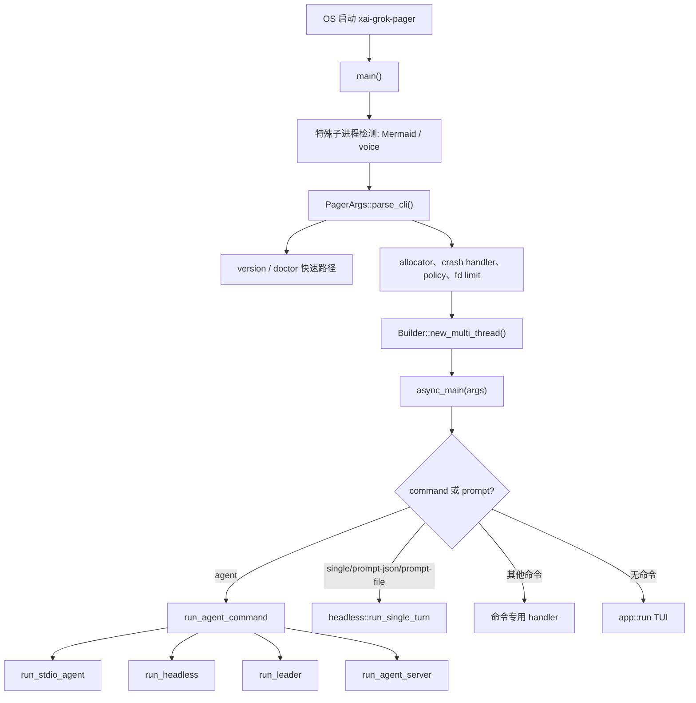
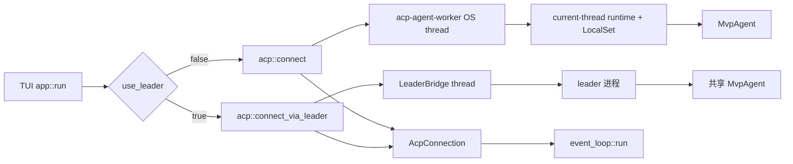
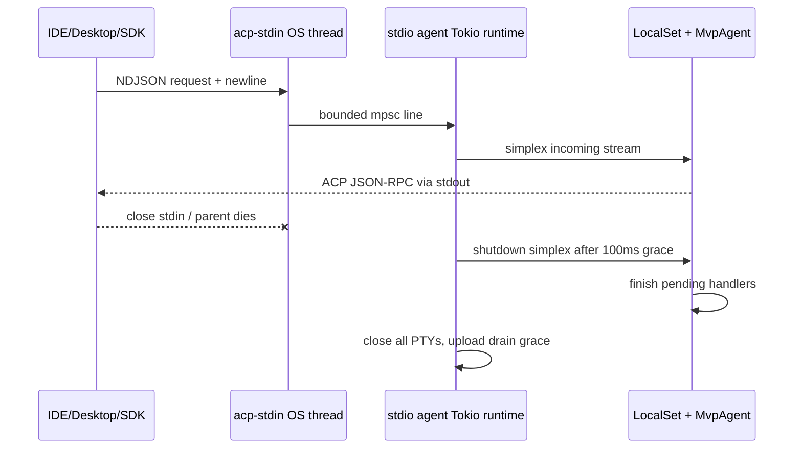
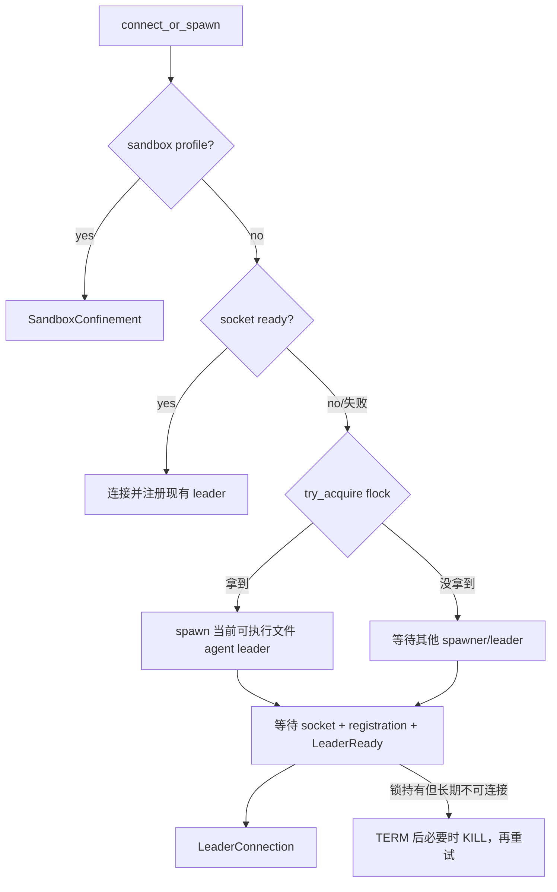
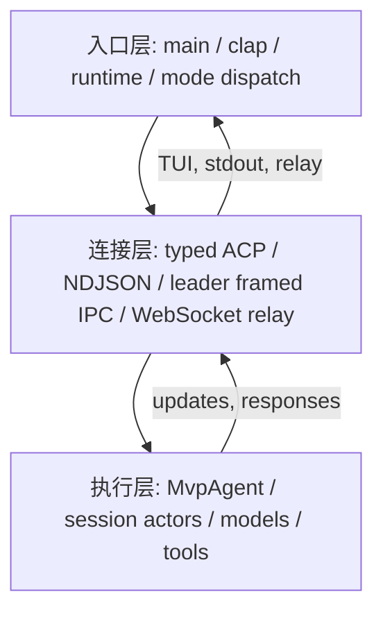

# 02 程序入口与运行模式

> **全局调用位置**：`pager-bin::main → async_main → xai_grok_pager::app::run / run_agent_command`。完整符号图见 [源码符号关系总览第 4 节](12-源码符号关系总览.md#4-程序入口的真实符号关系)，逐函数启动过程见 [关键调用链第 2 节](13-关键调用链逐函数精读.md#2-调用链一进程启动到-tui-第一帧)。

> 本文面向第一次阅读 Rust 异步程序的新手。目标不是只说明“程序从哪里启动”，而是让读者能够沿着本文重新实现 Grok Build 的入口层、运行模式分发、ACP 通信和共享 leader。
>
> 本文只分析程序入口和启动直接可达的代码。会话推理、工具执行、TUI 组件绘制等业务细节只说明它们如何被启动，不在这里展开。

## 1. 先记住六个结论

1. 最终可执行文件是 `xai-grok-pager-bin` 产出的 `xai-grok-pager`，真正的组合根是 `crates/codegen/xai-grok-pager-bin/src/main.rs`。
2. CLI 使用 `clap` 派生宏解析，但没有使用 `#[tokio::main]`。代码在同步 `main()` 中手工构造多线程 Tokio runtime，再调用 `async_main()`。
3. TUI 和 agent 是两个逻辑组件，但默认可以在同一进程内运行。内嵌 agent 位于独立 OS 线程，线程中又运行单线程 Tokio runtime 和 `LocalSet`。
4. ACP 是 client 与 agent 的统一协议。进程内走类型化 channel；stdio 和 WebSocket 路径走换行分隔 JSON-RPC；leader IPC 再在 ACP JSON 字符串外包一层 4 字节大端长度帧。
5. leader 不是“主线程”的别名，而是一个可长期存活、可服务多个客户端的独立进程。Unix 使用 Unix domain socket，Windows 使用 named pipe，并用锁文件保证同一环境只有一个 leader。
6. 工程中有两个容易混淆的 headless：顶层 `grok -p` 是执行一次 prompt 后退出；`grok agent headless` 是通过 Grok WebSocket relay 长期运行的 agent 服务。

## 2. 范围和名词

### 2.1 本文覆盖的 crate

| crate | 本文关注点 |
|---|---|
| `crates/codegen/xai-grok-pager-bin` | 最终二进制、同步入口、runtime、总分发、资源和进程收尾 |
| `crates/codegen/xai-grok-shell` | stdio/headless/leader agent、leader IPC、agent bootstrap |
| `crates/codegen/xai-grok-shell-base` | 被 shell 家族共享的环境、进程、文件和 CPU profile 基础设施 |
| `crates/codegen/xai-grok-shell-session-support` | 会话启动后可复用的 managed MCP 缓存状态；不是入口，但属于启动依赖边界 |
| `crates/codegen/xai-acp-lib` | ACP 类型化 channel、gateway、行读取与 stdio 适配 |

入口直接依赖的 `xai-grok-pager` 文件也必须一起读，否则无法解释 CLI、TUI 和单轮 headless：

- `crates/codegen/xai-grok-pager/src/app/cli.rs`
- `crates/codegen/xai-grok-pager/src/app/mod.rs`
- `crates/codegen/xai-grok-pager/src/acp/mod.rs`
- `crates/codegen/xai-grok-pager/src/acp/spawn.rs`
- `crates/codegen/xai-grok-pager/src/acp/leader_bridge.rs`
- `crates/codegen/xai-grok-pager/src/headless.rs`
- `crates/codegen/xai-grok-pager/src/headless/cli.rs`

### 2.2 术语

| 术语 | 含义 |
|---|---|
| pager | 交互式终端客户端，也就是 TUI |
| agent | 处理 ACP 请求、维护会话、调用模型和工具的后端对象 |
| embedded | pager 进程内的 agent；仍使用独立 OS 线程隔离 |
| stdio | stdin 输入 NDJSON、stdout 输出 NDJSON 的 ACP 服务模式 |
| leader | 独立共享进程，持有一个 agent，并通过本地 IPC 服务多个客户端 |
| follower/client | 连接 leader 的 TUI、IDE、stdio bridge 或 headless 注册端 |
| relay | leader/headless agent 与 grok.com 之间的 WebSocket 通道 |
| ACP | Agent Client Protocol；client 与 agent 之间的请求、响应和通知协议 |
| LocalSet | Tokio 中运行 `!Send` future 的本地任务集合 |
| cancellation token | 可克隆、可派生子 token 的协作式取消信号 |

## 3. Cargo 与构建产物地图

### 3.1 `xai-grok-pager-bin/Cargo.toml`

这是最终二进制 crate，`[[bin]]` 把 `src/main.rs` 编译成 `xai-grok-pager`。它是 composition root：同时链接 pager UI、minimal 渲染插件和 shell 后端，从而避开 `xai-grok-pager` 与 `xai-grok-pager-minimal` 的循环依赖。

关键依赖如下：

| 依赖 | 启动职责 |
|---|---|
| `xai-grok-pager` | CLI 类型、TUI、单轮 headless、ACP 客户端适配 |
| `xai-grok-pager-minimal` | 通过 `install()` 注入 minimal 渲染实现 |
| `xai-grok-shell` | agent、leader、stdio、relay、配置和会话后端 |
| `xai-acp-lib` | stdio 行读取和 ACP channel |
| `tokio` | async runtime、任务、信号、IO、channel |
| `tokio-util` | `CancellationToken` 和 futures/tokio IO 兼容层 |
| `anyhow` | 入口层可附加上下文的通用错误 |
| `tracing` / `tracing-subscriber` | 启动日志与遥测层 |
| `rustls` | TLS provider 安装 |
| `tikv-jemallocator` | Unix 可选全局 allocator |

重要 feature：

- `jemalloc`：在 Unix 上安装 jemalloc、统计和 heap profile hook。
- `sandbox-enforce`：把 sandbox enforcement 传给 pager。
- `local-workspace`：启用本地 workspace 能力。
- `release-dist`：发行版特有的 remote leader gate 等逻辑。

`build.rs` 读取 Git commit 和 `GROK_VERSION`，生成编译期环境变量 `VERSION_WITH_COMMIT`。它影响版本输出和 client/leader 版本协商，但不参与运行时分发。

### 3.2 `xai-grok-shell/Cargo.toml`

这是大型 library crate，没有主二进制入口；它把 agent、leader、auth、session、terminal、config 等能力提供给 composition root。

与本文最相关的第三方依赖：

| 依赖 | 用途 |
|---|---|
| `agent-client-protocol = 0.10.4` | ACP JSON-RPC 类型与 `AgentSideConnection`/`ClientSideConnection` |
| `tokio` / `futures` / `tokio-util` | 异步执行、LocalSet、channel、IO 兼容 |
| `clap` | shell 中少量命令类型；总 CLI 仍在 pager |
| `serde` / `serde_json` | ACP、leader IPC 和配置序列化 |
| `thiserror` / `anyhow` | 库内稳定错误分类与入口错误上下文 |
| `tracing` / `tracing-subscriber` | 结构化诊断 |
| `kanal` | leader server 的有界异步出站队列 |
| `parking_lot` / `dashmap` | 进程内并发状态 |
| `axum` / `tokio-tungstenite` | agent server 与 WebSocket |
| `process-wrap` / `portable-pty` | 子进程与 PTY 生命周期 |

`build.rs` 在 release 构建中下载并嵌入 ripgrep 15.0.0，或使用 `GROK_SHELL_BUNDLE_RG_PATH` 指定的本地文件。Windows 默认不自动下载。这个构建行为不是启动链的一部分，但会决定运行时工具是否使用内嵌 `rg`。

### 3.3 `xai-grok-shell-base/Cargo.toml`

这是低层基础 crate。它故意不依赖完整 shell，避免环境、进程和文件工具反向依赖业务模块。主要依赖 `anyhow`、`thiserror`、`tokio::sync`、`reqwest::blocking`、配置/环境 crate，以及 Unix 的 `nix/libc/pprof`。

### 3.4 `xai-grok-shell-session-support/Cargo.toml`

这是会话支持层，主要持有 managed MCP 的缓存、token 过期判断、刷新和 gateway tool catalog。使用 `tokio::sync`、`tokio-util`、`reqwest`、`serde`。它不选择运行模式，也不创建 runtime。

### 3.5 `xai-acp-lib/Cargo.toml`

这是薄协议适配层，依赖 `agent-client-protocol`、`async-trait`、`futures`、`tokio`、`serde` 和 `tracing`。它不拥有业务会话，只负责把强类型调用、channel 和流式 JSON-RPC 接起来。

## 4. 生产源码地图

### 4.1 最终二进制

| 文件 | 关键符号 | 职责 |
|---|---|---|
| `crates/codegen/xai-grok-pager-bin/src/main.rs` | `main`、`async_main`、`run_agent_command`、`run_and_shutdown` | 全局 allocator、前置子进程分流、CLI、runtime、命令分发、TUI/headless/stdio/leader 分发、更新和收尾 |
| `crates/codegen/xai-grok-pager-bin/build.rs` | `main` | 注入版本和 commit 字符串 |

`main.rs` 很大。建议按符号而不是从第一行一直读到底：

1. `main`
2. `async_main`
3. `run_agent_command`
4. `run_and_shutdown`
5. `forward_stdio_line_to_leader` 和 `StdioReplayState`
6. leader/workspace 管理命令
7. jemalloc、更新和测试辅助

### 4.2 `xai-grok-shell` 的启动相关文件

| 文件 | 关键符号 | 职责 |
|---|---|---|
| `src/lib.rs` | `pub mod ...` | crate 公共模块总表；重导出 base 的 `cpu_profile`、`env` |
| `src/agent/mod.rs` | `MvpAgent`、`run_agent_server` | agent 子系统门面 |
| `src/agent/app.rs` | `run_stdio_agent`、`run_headless`、`run_leader`、`spawn_agent_local` | 三种服务运行模式和进程级生命周期 |
| `src/agent/init.rs` | `bootstrap`、`update_telemetry_config` | managed policy、配置解析、单例初始化、模型目录 |
| `src/agent/config.rs` | `Config`、`RuntimeResolutionContext` | 启动配置的类型化表示和运行时字段解析 |
| `src/agent/mvp_agent.rs` 及 `src/agent/mvp_agent/` | `MvpAgent` | ACP agent 实现；入口最终构造的业务内核 |
| `src/agent/models.rs` 及 `src/agent/models/` | `ModelsManager`、early prefetch | 模型目录预取和后台刷新 |
| `src/agent/relay.rs` | `RelayConfig`、relay spawn 函数 | grok.com WebSocket 与 ACP 字符串桥接 |
| `src/agent/server.rs` | `ServerConfig`、`run_agent_server` | `agent serve` 的 WebSocket server |
| `src/agent/auth_method.rs` | auth method 解析 | 启动认证方法判断 |
| `src/agent/folder_trust.rs` | `grant_folder_trust` | `--trust` 的持久化副作用 |
| `src/managed_config.rs` | policy gate、sync | 启动前 managed policy 修复与 fail-closed gate |
| `src/config/` | config load/reloader/watcher | 配置分层、启动读取和 leader 热更新 |
| `src/auth/` | `AuthManager`、auth flow | token 获取、刷新、磁盘采用和登录 |
| `src/session/` | session actors | agent 启动后创建的会话运行单元；退出时必须 flush |
| `src/terminal/pty_session.rs` | `close_all` | stdio agent 退出时清理 PTY 子进程 |
| `src/util/` | process/config helpers | leader 进程识别、终止、配置 gate |

leader 子目录逐文件地图：

| 文件 | 关键符号 | 职责 |
|---|---|---|
| `src/leader/mod.rs` | `connect_or_spawn`、`LeaderReconnector`、`LeaderConnection` | leader 发现、选举、拉起、重连和公共门面 |
| `src/leader/lock.rs` | `LeaderLock`、socket/lock path 函数 | 单 leader 锁、PID、环境 URL 到路径映射 |
| `src/leader/transport.rs` | `LeaderStream`、`LeaderListener` | Unix socket 与 Windows named pipe 抽象 |
| `src/leader/protocol.rs` | `ClientMessage`、`ServerMessage`、`read_frame` | IPC 帧、注册、ACP payload、控制和关闭协议 |
| `src/leader/client.rs` | `LeaderClient`、`LeaderRegistration` | 连接、注册、读写任务、control request 配对 |
| `src/leader/server.rs` | `run_leader_server`、`run_client_session` | 多客户端接入、request ID 改写、路由、ready gate、关闭广播 |
| `src/leader/in_process.rs` | `spawn_agent` | 测试/嵌入场景的简化 leader 后 agent |
| `src/leader/test_support.rs` | 测试辅助 | 非生产启动链，不应被重实现为运行时依赖 |

### 4.3 `xai-grok-shell-base` 逐文件地图

| 文件 | 职责 |
|---|---|
| `src/lib.rs` | 导出 `cpu_profile`、`env`、`util` |
| `src/env.rs` | 环境常量、gateway URL、custom bridge gate |
| `src/cpu_profile.rs` | leader 可控 CPU profile 状态机、路径和停机处理 |
| `src/util/mod.rs` | URL 信任判断、随机采样、进程存活/识别/终止 |
| `src/util/changelog.rs` | changelog 拉取、缓存和展示数据 |
| `src/util/event_id.rs` | 跨会话事件 ID 与单调计数 |
| `src/util/grok_home.rs` | 重导出统一的 grok home 路径函数 |
| `src/util/secure_file.rs` | owner-only 文件创建与权限修复 |
| `src/util/tips.rs` | tip 游标持久化 |
| `src/util/uname.rs` | 跨平台 OS/kernel 描述 |

这些文件大多不分发模式。入口使用它们提供的稳定底座，尤其是 grok home、进程判断、kill 和 CPU profile。

### 4.4 `xai-grok-shell-session-support` 逐文件地图

| 文件 | 关键符号 | 职责 |
|---|---|---|
| `src/lib.rs` | `pub mod managed_mcp` | 模块门面 |
| `src/managed_mcp.rs` | `ManagedMcpState`、`ManagedMcpCache`、`spawn_cache_refresh_task` | managed MCP 三态缓存、并发 fetch、reactive reauth、刷新取消 |

`ManagedMcpStateHandle = Arc<tokio::sync::Mutex<ManagedMcpState>>` 表示多个异步任务共享状态。缓存不是简单 `Option<Vec<_>>`，而是 `NotFetched / Fetching / Ready`，这样并发调用者能等待同一请求，也能在失败后回到可重试状态。

### 4.5 `xai-acp-lib` 逐文件地图

| 文件 | 关键符号 | 职责 |
|---|---|---|
| `src/lib.rs` | re-export | 对外提供统一 API |
| `src/common.rs` | `AcpResult`、`AcpChannelFailure` | channel 错误分类和公共类型 |
| `src/message.rs` | `AcpSide`、`AcpRequest`、消息枚举 | 用泛型把 request 与 response 类型配对 |
| `src/channel.rs` | `AcpChannel`、`acp_channels`、`acp_send` | mpsc 发送请求，oneshot 等待对应响应 |
| `src/gateway.rs` | `AcpGatewaySender/Receiver` | 类型化 channel 与 ACP trait object 之间的双向分发 |
| `src/line_reader.rs` | `LineBufferedRead` | 先读完整 NDJSON 行，避免取消导致半行字节丢失 |
| `src/stdin_reader.rs` | `spawn_stdin_line_reader` | 独立 OS 线程阻塞读 stdin，并用深度 64 的 channel 背压 |
| `src/normalize.rs` | `normalize_json_line` | 修复特定 `\/` method 编码兼容问题 |

### 4.6 pager 入口适配文件

| 文件 | 关键符号 | 职责 |
|---|---|---|
| `src/app/cli.rs` | `PagerArgs`、`Command`、`AgentArgs`、`AgentCmd` | clap CLI schema |
| `src/app/mod.rs` | `run`、`resolve_leader_mode`、`bounded_connect` | TUI 启动、terminal、embedded/leader 选择和清理 |
| `src/acp/mod.rs` | `connect`、`connect_via_leader`、`AcpConnection` | 把两种 agent 位置统一成同一 ACP client 接口 |
| `src/acp/spawn.rs` | `spawn_grok_shell`、`AgentShutdownGuard` | 内嵌 agent OS 线程和可靠退出 |
| `src/acp/leader_bridge.rs` | `bridge_leader_connection` | leader 原始 JSON 字符串与类型化 ACP channel 互转 |
| `src/headless.rs` | `run_single_turn` | 顶层单轮 prompt 状态机和输出 |
| `src/headless/cli.rs` | `HeadlessPrompt`、`OutputFormat` | 文本/JSON/file prompt 和输出格式解析 |

## 5. 总启动链



### 5.1 同步 `main()` 为什么不直接 async

`main()` 必须先做一些不能依赖 async runtime 的事情：

- 判断当前进程是不是 Mermaid/voice helper。
- 解析 CLI，并让 `version`、`doctor` 在启动 runtime 前返回。
- 安装 allocator、crash handler、Sentry 和 managed requirements gate。
- 根据 CPU 数量和 `GROK_WORKER_THREADS` 计算 worker 数。
- 决定 runtime 关闭宽限时间。

`main()` 使用：

```text
tokio::runtime::Builder::new_multi_thread()
  -> worker_threads(...)
  -> enable_all()
  -> build()
  -> run_and_shutdown(runtime, async_main(args), 2s)
```

手工 runtime 的价值是能控制 worker 数和 `shutdown_timeout`。`run_and_shutdown` 在 future 完成后，不让 Tokio 因阻塞任务无限等待；超过 `RUNTIME_SHUTDOWN_GRACE` 后继续结束进程。

### 5.2 `async_main()` 的顺序不能随意交换

`async_main()` 的关键顺序：

1. 安装 rustls ring provider。
2. 应用 `--cwd`，把部分 CLI 选项转为进程环境变量。
3. 先处理 completions/wrap 等轻路径。
4. 固定 resume 目标，解析并应用 sandbox。
5. 根据是否交互设置 HTTP client identity。
6. 分发显式子命令。
7. 若存在单轮 prompt，进入 `headless::run_single_turn`。
8. 否则进入 TUI `xai_grok_pager::app::run`。
9. TUI 退出后刷新 sandbox，必要时完成后台更新。

这里先应用 sandbox，再创建 agent。否则工具执行线程可能已经在不受约束的进程中启动。

## 6. CLI 如何决定运行模式

`PagerArgs` 是顶层参数，`Command` 是顶层子命令，`AgentArgs.mode: Option<AgentCmd>` 是 agent 子命令的第二级分发。

| 用户形式 | 判定字段 | 最终入口 |
|---|---|---|
| `grok` | 无 command、无单轮 prompt | `app::run` TUI |
| `grok -p "..."` | `PagerArgs.single` | `headless::run_single_turn` |
| `grok --prompt-json ...` | `prompt_json` | `headless::run_single_turn` |
| `grok agent stdio` | `Command::Agent` + `AgentCmd::Stdio` | `run_stdio_agent` 或 leader bridge |
| `grok agent headless` | `AgentCmd::Headless` | `run_headless` 或 leader 注册监视 |
| `grok agent leader` | `AgentCmd::Leader` | `run_leader` |
| `grok agent serve` | `AgentCmd::Serve` | `run_agent_server` |
| `grok agent` | `mode == None` | 等价于 `run_headless` |
| `grok leader list/info/kill` | `Command::Leader` | leader 管理 API |

`Box<AgentArgs>` 是一个 Rust 内存布局技巧：`Command` 变体很多，把较大的 `AgentArgs` 放到堆上，避免整个 enum 以最大变体尺寸内联存储。

## 7. TUI 启动链

### 7.1 `app::run` 的四个阶段

#### 阶段 A：配置和启动意图

`crates/codegen/xai-grok-pager/src/app/mod.rs::run` 首先：

- 重定向 native stderr，避免 agent 日志破坏 TUI。
- 创建根 `CancellationToken`。
- 读取 effective config，并尝试刷新认证。
- 启动模型/remote settings 预取，最多等待 2 秒。
- 调用 `resolve_leader_mode`。
- 解析 new/resume/fork 启动意图并 materialize。

leader 决策优先级是：`--no-leader`、`--leader`、是否 eligible、本地 config、发行版 remote flag、默认关闭。任何 sandbox confinement 都可以在最后否决 leader，因为独立共享进程无法证明处于当前调用者的 sandbox 中。

#### 阶段 B：terminal

代码计算 `ScreenMode::Fullscreen / Inline / Minimal`，启动独立 writer thread，再调用 `init_terminal`。这样 Tokio event loop 不会被 terminal/PTY 的阻塞写拖住。

如果 terminal 已经初始化，但 agent 连接失败，代码必须先 `restore_terminal` 再返回错误。否则用户 shell 会残留 raw mode、alternate screen 或错误光标状态。

#### 阶段 C：连接 agent



连接受 `bounded_connect` 的 30 秒 timeout 和根 cancellation 约束。leader 连接失败时，TUI 会记录失败遥测并回退 embedded agent。这个回退是 TUI 特有的可用性策略。

#### 阶段 D：event loop 与清理

`event_loop::run` 消费 terminal 事件、ACP 消息、配置变化和后台任务结果。退出顺序是：

1. flush unified log。
2. restore terminal 并等待 writer thread。
3. drop `AgentShutdownGuard`。
4. 取消并 join embedded agent worker，等待 session actors flush。
5. 杀掉 process scope 中登记的子进程。
6. 打印 resume hint，或执行 screen-mode re-exec。

## 8. 内嵌 agent 的线程模型

`acp::connect` 调用 `spawn::spawn_grok_shell`：

1. 创建并配置 `AuthManager`。
2. 修复 managed policy。
3. `agent::init::bootstrap` 解析最终配置并构造 `ModelsManager`。
4. `acp_channels()` 创建 client/agent 两端。
5. 创建名为 `acp-agent-worker` 的 OS 线程。
6. 在线程中创建 current-thread Tokio runtime 和 `LocalSet`。
7. 构造 `Rc<MvpAgent>`，由 `AcpGatewayReceiver` 直接分发请求。

这里使用 `Rc` 而不是 `Arc`，说明 `MvpAgent` 不需要跨线程共享。所有访问都固定在 agent worker 的 `LocalSet` 上。`spawn_local` 可运行捕获 `Rc`、`RefCell` 等 `!Send` 值的 future。

`AgentShutdownGuard` 使用 RAII：无论正常返回、`?` 提前返回还是 panic unwind，`Drop` 都会 cancel worker，并等待 `SESSION_FLUSH_GRACE + 2s`。如果 worker 卡住，helper thread 的 join 会超时，进程继续退出，同时记录 session teardown 可能不完整。

## 9. `grok agent stdio`

### 9.1 直接模式



`run_stdio_agent` 先绑定 parent-death 行为。stdio agent 对父进程没有独立价值，因此父进程死亡时应被内核终止；leader 则故意不绑定，因为它必须比 client 活得久。

为什么不用 `tokio::io::stdin()`：Tokio 的 stdin 底层仍可能占用阻塞线程，且 Windows 持久 pipe 场景可能直到 EOF 才交付。`spawn_stdin_line_reader` 使用专用 OS 线程同步读完整行，通过深度 64 的 mpsc 提供自然背压。

stdin 和内部 watcher 注入共用一个 `simplex` writer，并由 `TokioMutex` 保证一条 JSON 不会与另一条消息交错。

### 9.2 stdio 通过 leader

当 `run_agent_command` 解析出 `use_leader = true`：

- 当前进程不构造 `MvpAgent`。
- stdin 行通过 `forward_stdio_line_to_leader` 发到本地 IPC。
- leader 返回的 ACP JSON 行写到当前进程 stdout。
- 连接断开后使用 bounded reconnect。
- `StdioReplayState` 缓存 initialize、session/new/load 等必要状态；重连后重新 load session，并发送 `x.ai/leader_reconnected` 通知。

发送失败的行最多等待 300 秒重连。取消或 deadline 到达后记录并丢弃。这不是 exactly-once：跨断线恢复依赖 session 持久化和显式 replay。

## 10. 两种 headless

### 10.1 顶层单轮 `grok -p`

`headless::run_single_turn` 总是直接 `spawn_grok_shell`，本专题所读代码中它不走 leader。流程如下：

1. 解析文本、JSON content blocks 或文件 prompt。
2. 加载配置并设置 `AgentMode::Headless`。
3. 创建 embedded agent worker 和 `AgentShutdownGuard`。
4. 发送 ACP `InitializeRequest`。
5. 非交互认证；若需要浏览器登录则直接报错。
6. materialize new/resume/fork，并发送 session new/load/fork。
7. 应用 model 和 reasoning effort。
8. 发送 `PromptRequest`。
9. `tokio::select!` 同时等待 ACP 通知和 prompt response。
10. 根据 `OutputFormat` 输出 plain/json/streaming messages。
11. 等待或回收后台 task/subagent，flush 后退出。

`pending_bg` 与 `completed_bg` 同时存在，是为了处理乱序：completed 是 tombstone，防止迟到的 `task_backgrounded` 把已经完成的任务重新加入 pending。

stdout 的 `BrokenPipe` 被视为下游消费者主动关闭，是干净停止；其他写错误会被 latch，最终覆盖正常模型结果并返回非零错误。

### 10.2 `grok agent headless`

`agent::app::run_headless` 是常驻 relay 模式：

- 必须有 grok.com session，API key 不能代替 relay session。
- 启动前完成认证并预取模型。
- 创建两对 simplex 流，分别承载 WS 到 agent、agent 到 WS。
- `spawn_relay_connection_with_callback` 管理 WebSocket。
- LocalSet 中运行 `MvpAgent` 和两个 bridge task。
- relay 断开时 agent 仍存在；发不出去的 outbound message 可以丢弃，因为 session 已持久化，客户端重连后通过 `session/load` replay。

这是一种明确的 at-most-once 在线通知语义加持久状态恢复，不应描述为消息不丢失。

## 11. leader 的启动、选举与服务

### 11.1 `connect_or_spawn`



socket/lock 路径由 WebSocket URL 决定，因此不同环境可以有不同 leader。Unix 的 flock holder 才能创建或删除 socket。Windows 使用固定哈希生成 named pipe 名称。

自动 spawn 复用当前安装的可执行文件，并进入 `agent leader` 子命令。这样 client 与 leader 使用同一发行物，不需要第二个 daemon binary。

### 11.2 `run_leader`

生产 leader 使用 lock-then-socket 顺序：

1. 先获得 flock 并写 PID。
2. 创建 IPC server、channel 和 readiness watch。
3. socket 先 bind，使 client 能注册但看到 `ready = false`。
4. 执行有界、非交互认证。
5. `ready_tx.send(true)`，client 收到 `LeaderReady`。
6. 在 LocalSet 中启动共享 agent、IPC bridge、relay bridge、配置 watcher 和 auto-update checker。

ready gate 的意义是把“端口/文件已经存在”和“业务可以接收 ACP”分开。client 不需要盲目重试 initialize。

### 11.3 IPC 协议

leader IPC 不是 NDJSON。每帧格式为：

```text
[4 bytes big-endian payload length][UTF-8 JSON payload]
```

最大 payload 64 MiB。`ClientMessage` 包含 `Register`、`Acp { payload }`、`Control`、`Ping`、`Disconnect`；`ServerMessage` 包含 `Registered`、`LeaderReady`、`Acp`、`ControlResult`、`ShuttingDown`、`Shutdown` 和错误。

新增协议字段必须有 `#[serde(default)]`，因为 client 和 leader 可能是不同版本。

### 11.4 多客户端路由

leader 为每个 client 分配 `ClientId`，并把 ACP request ID 改写为带 client namespace 的 ID。agent response 到达后再恢复原 ID并路由回发起 client。

session notification 根据 subscriber 和 driver 路由：普通更新可广播给订阅者；permission/interaction 等反向请求只发给 driver。session/load 期间有 live buffer，避免历史 replay 与实时通知乱序。

### 11.5 重连

`LeaderReconnector` 的状态为：

- `Connected { generation }`
- `Reconnecting { attempt }`
- `Failed { error }`

退避从 1 秒指数增长到最多 30 秒。TUI 使用 unbounded policy；stdio/headless 使用 bounded policy。新 channel 必须先安装，再调用 `notify_connected()`，否则观察者可能看到 Connected 后向旧 sender 发消息。

## 12. ACP 内部架构

### 12.1 类型化请求与响应

`AcpRequest` 通过关联类型声明 `type Response`。`acp_send(request, tx)` 的动作是：

1. 创建 oneshot channel。
2. 把 request 和 `response_tx` 包装为对应消息 enum。
3. 通过 unbounded mpsc 发给另一端。
4. await oneshot receiver。

因此 mpsc 负责多请求排队，oneshot 负责每个请求的单响应配对。

`AcpSide` 用 marker type 区分 AgentSide 和 ClientSide，编译器可以阻止把发给 client 的消息错误地当作发给 agent 的消息。

### 12.2 gateway

`AcpGatewayReceiver<S, C>` 从类型化 channel 收消息，调用 `agent-client-protocol` 的 `Agent` 或 `Client` trait；`AcpGatewaySender` 做反向适配。它让业务代码只面对 Rust 类型，而 transport 可以是内存 channel、stdio、WebSocket 或 leader IPC。

### 12.3 为什么要 `LineBufferedRead`

底层 ACP connection 在 biased select 中使用 `read_line`。普通 `read_line` future 被取消时可能已经消费部分字节，下一次读取就从半条 JSON 开始。`LineBufferedRead` 在后台先读出完整换行行，前台只会在两行之间返回 Pending，从而做到 cancel-safe。

ACP NDJSON 和 leader frame 都有 64 MiB 上限，但位置不同：前者限制一行，后者限制一帧。

## 13. 状态、所有权和并发

| 状态 | 所有者 | 共享方式 | 生命周期 |
|---|---|---|---|
| `PagerArgs` | composition root | move | 单进程启动期 |
| `AgentConfig` | 各 agent 实例 | clone 后解析 | agent 生命周期 |
| `MvpAgent` | embedded worker/leader LocalSet | `Rc` | agent 生命周期 |
| `AcpConnection` | TUI/headless client | owned channels | client 连接生命周期 |
| root cancellation | TUI/模式入口 | clone/child token | 模式生命周期 |
| leader lock | leader 进程 | OS flock | leader 全生命周期 |
| leader clients | `run_leader_server` | server event loop map | 每个 IPC 连接 |
| reconnect status | `LeaderReconnector` | Tokio watch | client 生命周期 |
| stdio replay state | stdio bridge | `Arc<std::sync::Mutex<_>>` | bridge 进程生命周期 |
| managed MCP cache | session support | `Arc<tokio::Mutex<_>>` | agent 进程生命周期 |

选择 `std::sync::Mutex` 还是 `tokio::sync::Mutex` 的原则：不跨 `.await`、临界区很短的纯内存数据可以用前者；持锁期间需要 async IO，或任务必须异步等待锁时用后者。

## 14. 输入输出与进程边界

| 模式 | 进程/线程 | 输入 | 输出 | 网络 |
|---|---|---|---|---|
| TUI embedded | 1 进程；TUI runtime + agent OS thread | terminal events、ACP channel | terminal stderr/PTY | 模型/API |
| TUI leader | TUI 进程 + leader 进程 + bridge thread | terminal + leader IPC | terminal | leader 可连 relay/API |
| `agent stdio` | 1 child 进程 + stdin thread + LocalSet | stdin NDJSON | stdout NDJSON；日志走 stderr | agent API |
| `agent stdio --leader` | bridge 进程 + leader 进程 | stdin NDJSON | stdout NDJSON | leader 持有后端网络 |
| `grok -p` | 1 进程 + embedded agent thread | CLI prompt | stdout plain/JSON stream | 模型/API |
| `agent headless` | 1 常驻进程 | WebSocket relay | WebSocket relay；提示走 stderr | grok.com relay |
| `agent headless --leader` | follower + leader | follower 主要注册和监视 | relay 由 leader 处理 | leader relay |
| `agent leader` | 1 独立共享进程 | IPC clients + relay | IPC + relay | relay/API |
| `agent serve` | 1 server 进程 | WebSocket server | WebSocket | 取决于 agent 配置 |

不要把日志写到 stdio 模式的 stdout。stdout 是协议数据面，任何普通日志都会破坏 JSON-RPC；因此 tracing 和用户提示默认写 stderr。

## 15. 错误、取消和关闭

### 15.1 错误分层

| 层 | 类型 | 用法 |
|---|---|---|
| composition root | `anyhow::Result` | 给错误附加上下文并统一打印 |
| leader IPC | `ProtocolError`、`ClientError`、`ConnectionError`、`ServerError` | 稳定分类 connect/register/protocol/timeout/sandbox |
| ACP | `acp::Error`、`AcpChannelFailure` | JSON-RPC error 与本地 channel 失败 |
| profile/MCP | `thiserror` enum | 可匹配的业务错误码和恢复行为 |

`?` 会在错误时提前返回，并调用 `From`/`Into` 完成错误转换。入口层可以使用 `anyhow`，协议层必须保留类型，否则重试逻辑只能解析错误字符串。

### 15.2 取消传播

| 触发 | 传播与结果 |
|---|---|
| TUI 正常退出 | drop guard -> cancel agent child token -> flush sessions -> join worker |
| TUI 连接失败 | restore terminal -> cancel -> 返回错误 |
| stdio stdin EOF | reader channel 关闭 -> 100ms grace -> shutdown simplex -> ACP IO 结束 |
| 父进程死亡 | stdio/stdio bridge 由 OS parent-death 机制终止 |
| relay cancel | `CancellationToken` 同时停止 relay bridge 和 LocalSet 主等待 |
| leader auto-update | 先 flush sessions，再发送 shutdown reason，再 cancel |
| leader client 断开 | client task 结束，server 更新 subscriber/driver 状态 |
| reconnect cancel | 退避 select 立即返回 `ConnectionError::Cancelled` |

`CancellationToken` 是协作式取消，不会强行中断正在执行的同步函数。阻塞 IO 必须放专用线程或 `spawn_blocking`，并另设 deadline。

### 15.3 不可保证的语义

- unbounded mpsc 没有持久化，不是消息队列。
- WebSocket 离线时 outbound notification 可能被丢弃。
- leader 重连会显式 replay session，但某些单次通知仍可能丢失。
- `ShuttingDown.delay_ms` 当前总是 0，不能当作真实宽限期。
- agent session 持久化和幂等恢复降低重复/丢失影响，但不等于 exactly-once。

## 16. Rust 新手必读机制

### 16.1 package、crate、binary、library

一个 `Cargo.toml` 定义 package。package 可以产生 library crate 和多个 binary crate。这里 `xai-grok-shell` 是 library，`xai-grok-pager-bin` 是 binary package。最终链接发生在 binary composition root。

### 16.2 move 与 clone

`async move` 把捕获变量所有权移入 future。需要同时给多个任务使用的 sender/token 通常先 `clone()`。Tokio sender 和 cancellation token 的 clone 是共享句柄，不是复制后端状态。

### 16.3 `Arc`、`Rc` 和 `Mutex`

- `Rc<T>`：单线程引用计数，便宜但不是 `Send`。
- `Arc<T>`：原子引用计数，可跨线程。
- `Mutex<T>`：提供内部可变性，保证同一时刻一个写者。
- `Rc<RefCell<T>>`：只适合被 LocalSet 固定在单线程的状态。

### 16.4 `Send`、`spawn` 与 `spawn_local`

`tokio::spawn` 的 future 可能被调度到其他 worker，因此必须 `Send + 'static`。`spawn_local` 固定在当前 LocalSet，可捕获 `Rc`。这就是 agent 和 leader 大量使用 LocalSet 的原因。

### 16.5 channel 的选择

- `mpsc`：多生产者、单消费者，适合事件流。
- `oneshot`：一次响应，适合 RPC request/response 配对。
- `watch`：只关心最新值，适合 ready、connection status、shutdown reason。
- `simplex`：字节流适配，适合把 channel 接到需要 `AsyncRead/AsyncWrite` 的协议库。

### 16.6 `Drop` 与 RAII

`AgentShutdownGuard` 在离开作用域时自动执行 `Drop`。这比要求每个 return 分支手写 cleanup 更可靠。但 `std::process::exit` 不运行普通栈析构，所以调用 exit 前代码显式 flush telemetry、restore stderr 或完成必要清理。

### 16.7 `cfg` 和 feature

`#[cfg(unix)]`、`#[cfg(windows)]`、`#[cfg(feature = "jemalloc")]` 在编译期移除不适用代码，不是运行时 if。重实现时必须分别考虑 Unix socket/flock 和 Windows named pipe/handle。

## 17. 推荐源码阅读顺序

### 第一轮：只建立分发图

1. `xai-grok-pager-bin/src/main.rs::main`
2. `xai-grok-pager/src/app/cli.rs`
3. `xai-grok-pager-bin/src/main.rs::async_main`
4. `xai-grok-pager-bin/src/main.rs::run_agent_command`

### 第二轮：TUI 与 embedded

5. `xai-grok-pager/src/app/mod.rs::run`
6. `xai-grok-pager/src/acp/mod.rs::connect`
7. `xai-grok-pager/src/acp/spawn.rs::spawn_grok_shell`
8. `xai-grok-shell/src/agent/init.rs::bootstrap`
9. `xai-acp-lib/src/channel.rs` 和 `gateway.rs`

### 第三轮：stdio 与单轮 headless

10. `xai-grok-shell/src/agent/app.rs::run_stdio_agent`
11. `xai-acp-lib/src/stdin_reader.rs` 和 `line_reader.rs`
12. `xai-grok-pager/src/headless.rs::run_single_turn`
13. `xai-grok-shell/src/agent/app.rs::run_headless`

### 第四轮：leader

14. `xai-grok-shell/src/leader/protocol.rs`
15. `xai-grok-shell/src/leader/lock.rs` 和 `transport.rs`
16. `xai-grok-shell/src/leader/mod.rs::connect_or_spawn`
17. `xai-grok-shell/src/leader/client.rs`
18. `xai-grok-shell/src/leader/server.rs::run_leader_server`
19. `xai-grok-shell/src/agent/app.rs::run_leader`
20. `xai-grok-pager/src/acp/leader_bridge.rs`

## 18. 从零重实现步骤

### 阶段 1：做一个最小同步 CLI

实现 `PagerArgs`、`Command`、`AgentCmd`，先只支持 `version`、TUI 占位和 `agent stdio`。验收：未知参数由 clap 生成一致错误，stdout/stderr 不混用。

### 阶段 2：手工 runtime

在同步 `main` 中创建多线程 Tokio runtime，提供 worker 数 env override 和关闭 timeout。验收：runtime 构建失败能在没有 tracing 的情况下打印错误。

### 阶段 3：定义最小 ACP 类型化 channel

实现 side marker、request/response 关联类型、mpsc 加 oneshot 的 `acp_send`。先支持 initialize、session/new、prompt 和 session/update。

### 阶段 4：实现内嵌 agent worker

创建 OS thread、current-thread runtime、LocalSet 和 `Rc<Agent>`。实现 cancellation 和 RAII join guard。验收：正常退出、错误返回和 panic unwind 都会触发 session flush。

### 阶段 5：实现 TUI 启动壳

先不实现复杂 UI，只做 terminal init、连接 agent、事件循环和 terminal restore。任何连接错误都必须恢复 terminal。

### 阶段 6：实现 stdio NDJSON

用专用 OS 线程读 stdin；每行有大小限制和 bounded channel。stdout 只写协议。stdin EOF 要协作式关闭 agent。

### 阶段 7：实现 cancel-safe line reader

先在后台完整读取一行，再向协议 reader 供给。加入“在半行 Pending 时取消”的回归测试。

### 阶段 8：实现单轮 headless

按 initialize、auth、open session、prompt、消费 update、输出、cleanup 的顺序实现。用 pending/completed 两个集合处理后台任务乱序。

### 阶段 9：实现 leader 外层帧协议

先实现 4 字节大端长度、64 MiB 限制、serde message enum，再实现 register/ready handshake。不要一开始就做 session 路由。

### 阶段 10：实现 leader 选举

Unix 先做 lock-then-socket；Windows 再加 named pipe。只有锁持有者能删除 socket。加入 stale PID、stale socket、并发 spawn 测试。

### 阶段 11：实现多 client request ID 路由

为请求 ID 添加 client namespace，response 还原。再加入 session subscriber、driver 和 load live buffer。

### 阶段 12：实现 leader reconnect

实现 watch 状态、指数退避、bounded/unbounded policy。严格执行“先换 channel，再发布 Connected generation”。

### 阶段 13：实现 relay headless

用 simplex 把 WebSocket 字符串流接到 ACP connection。明确离线丢弃策略，并依靠 session/load 恢复。

### 阶段 14：补配置、policy、认证和遥测

这些必须在模式骨架稳定后接入，但顺序必须保留：policy gate 在完整 bootstrap 前，遥测 identity 在 auth 后更新，secret 不进入普通日志。

### 阶段 15：补关闭和故障恢复

覆盖 parent death、stdin EOF、SIGTERM、terminal restore、PTY cleanup、session flush、upload grace、leader auto-update、zombie eviction 和版本偏差。

## 19. 测试索引

本文不执行测试，只给出阅读和重实现时应对照的测试位置。

| 主题 | 测试位置 | 重点 |
|---|---|---|
| CLI 和 worker 数 | `xai-grok-pager-bin/src/main.rs` 内联 tests | env override、CPU 上限、命令分发辅助 |
| CLI schema | `xai-grok-pager/src/app/cli.rs` 内联 tests | alias、冲突、agent stdio、leader flags、resume |
| leader mode 决策 | `xai-grok-pager/src/app/mod.rs` 内联 tests | config/flag/sandbox 优先级 |
| embedded worker 关闭 | `xai-grok-pager/src/acp/spawn.rs` 内联 tests | clean/error/panic/timeout join |
| leader bridge | `xai-grok-pager/src/acp/leader_bridge.rs` 内联 tests | stale outbound drop、channel swap、cancel |
| 单轮 headless | `xai-grok-pager/src/headless_tests.rs` | background 生命周期、stdout 错误、规则、结构化输出 |
| headless reducer | `xai-grok-pager/src/headless/reducer/messages/tests/` | ACP update 到输出事件的确定性归约 |
| leader 协议 | `xai-grok-shell/src/leader/protocol.rs` 内联 tests | framing、serde 兼容、大小限制 |
| leader 锁 | `xai-grok-shell/src/leader/lock.rs` 内联 tests | path、PID、锁生命周期 |
| leader client/server | `xai-grok-shell/src/leader/client.rs`、`server.rs` 内联 tests | registration、ready gate、路由、关闭 |
| leader stdio 集成 | `xai-grok-shell/tests/test_leader_stdio_integration.rs` | 真实二进制和 IPC bridge |
| leader 死亡恢复 | `xai-grok-shell/tests/test_leader_death_repro.rs` | 断线与重新拉起 |
| leader sandbox | `xai-grok-shell/tests/test_leader_sandbox_confinement.rs` | sandbox 必须阻止共享进程 |
| leader 版本偏差 | `xai-grok-shell/tests/test_leader_version_skew.rs` | 新旧字段和更新替换 |
| 非阻塞启动 | `xai-grok-shell/tests/test_nonblocking_startup.rs`、`test_nonblocking_startup_offline.rs` | 网络慢/离线不应卡住 readiness |
| 构建后二进制 | `xai-grok-shell/tests/test_built_binary_e2e.rs` | 实际入口和进程退出 |
| ACP session setup wire | `xai-grok-shell/tests/acp_session_setup_wire.rs` | initialize/new 的 wire metadata |
| ACP 行读取 | `xai-acp-lib/src/line_reader.rs` 内联 tests | cancel-safe、超大行、EOF |
| stdin 读取 | `xai-acp-lib/src/stdin_reader.rs` 内联 tests | 行终止、背压、normalize |
| ACP gateway/channel | `xai-acp-lib/src/gateway.rs`、`channel.rs` 内联 tests | 类型分发和 response 配对 |
| CPU profile | `xai-grok-shell-base/src/cpu_profile.rs` 内联 tests | profile 状态与 shutdown stop |
| managed MCP | `xai-grok-shell-session-support/src/managed_mcp.rs` 内联 tests | 三态缓存、失败回滚、reauth backoff、取消 |

## 20. 重实现时最容易犯的错误

1. 把顶层 `grok -p` 与 `agent headless` 合并，导致单轮 CLI 被迫依赖 WebSocket session。
2. 在 stdio stdout 打日志，直接破坏 JSON-RPC。
3. 用 `tokio::io::stdin()` 代替专用线程，Windows 持久 pipe 初始化可能挂住。
4. 在普通 `read_line` future 半行时取消，造成后续 JSON 永久错位。
5. 在 leader 中先删 socket 再拿锁，竞态会删除活 leader 的 socket。
6. 发布 Connected 后才替换 sender，观察者会向旧连接写消息。
7. 把 `Rc<MvpAgent>` 放进 `tokio::spawn`，编译器会因 `!Send` 拒绝；正确位置是 LocalSet 的 `spawn_local`。
8. 只 cancel 不 join embedded worker，SessionEnd hook、memory 和 telemetry 可能没完成。
9. 把 WebSocket notification 丢失误称为可靠投递；真实恢复点是持久 session 加 `session/load`。
10. 忽略 terminal 出错路径的 restore，用户退出后 shell 会保持 raw mode。
11. 依赖 `ShuttingDown.delay_ms` 等待宽限，当前值始终为 0。
12. 给跨版本 leader 协议新增必填字段却没有 `serde(default)`，滚动更新期间会反序列化失败。

## 21. 最终心智模型

可以把整个入口系统理解成三层：



入口层决定“在哪运行”；连接层决定“怎样通信”；执行层决定“做什么”。TUI、stdio、headless 和 leader 并没有各自复制一套 agent，它们通过不同 transport 复用同一个 `MvpAgent` 和 ACP 契约。重新实现时，最重要的不是先复制所有功能，而是先保持这三个边界和每条退出路径正确。
