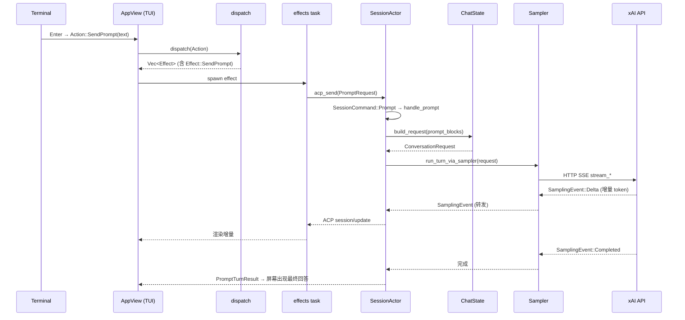

[上一篇：01-简单框架-系统骨架](01-简单框架-系统骨架.md) · [总目录](README.md) · [下一篇：03-详细逐步说明-主链路拆解](03-详细逐步说明-主链路拆解.md)

# 02：简单例子-全路径走读

> **场景**：用户在 TUI 里输入「用一句话解释什么是闭包」，敲回车，屏幕上出现模型回答。我们端到端追这条**主成功路径**（无工具调用），写清真实文件路径、函数名、关键参数与返回值。
> **工具版本**：Rust `1.94.0`；依赖见根 `Cargo.toml`。
> **阅读说明**：本文只走主成功路径，失败/重试/权限先点到为止（在 `03`/`15` 展开）。行号来自当前快照，以当前源码为准。

---

## 本文件内容

1. [Why：为什么先走一条最小例子](#1-why为什么先走一条最小例子)
2. [选定的例子（脱敏输入输出）](#2-选定的例子脱敏输入输出)
3. [端到端 ASCII 总览](#3-端到端-ascii-总览)
4. [Mermaid 全路径时序图](#4-mermaid-全路径时序图)
5. [逐段走读（只主成功路径）](#5-逐段走读只主成功路径)
6. [一句话复述 + 下一步](#6-一句话复述--下一步)

---

## 1. Why：为什么先走一条最小例子

`01` 给了骨架图，但图是「静态」的。只有沿**一条真实请求**把图走活，你才会真正理解「数据从哪进、经过谁、回到哪」。选**无工具调用**的纯问答，是因为它最短：入口 → 采样 → 返回，不经过工具/Workspace/权限，先把主干跑通。

> 涉及工具的完整链（读文件、编辑+权限、bash+沙箱、取消、压缩、MCP）在 `15` 的 8 个场景里展开；逐跳拆解在 `03`。

---

## 2. 选定的例子（脱敏输入输出）

**触发**：TUI 提示符下输入并回车

```text
> 用一句话解释什么是闭包
```

**脱敏输入（`Action`）**：`Action::SendPrompt("用一句话解释什么是闭包")`，由 `crates/codegen/xai-grok-pager/src/app/actions.rs:40` 的 `Action` enum 承载。

**关键参数（简化）**：

| 参数 | 值 | 来源 |
|---|---|---|
| `agent_id` | `default` | TUI 当前 session 绑定 |
| `session_id` | `sess_<uuid>` | ChatState 分配 |
| `prompt_id` | `pr_<uuid>` | 本次 Prompt 唯一 id |
| `prompt_blocks` | `[ContentBlock::Text("用一句话解释什么是闭包")]` | 经 ACP 序列化 |

**预期输出（屏幕）**：模型生成的文本逐字流式上屏，最终以一条 `session/update` 的 `Completed` 收尾。

**脱敏模型返回（节选）**：`闭包是一个能捕获并使用其定义环境里变量的函数。`

---

## 3. 端到端 ASCII 总览

```text
 Step 1  Terminal 输入回车
   │  Action::SendPrompt(text)
   ▼
 Step 2  Pager AppView
   │  dispatch(Action) -> Vec<Effect>        [router.rs:149, 纯函数, 不 await]
   │  → Effect::SendPrompt {agent_id, session_id, text, prompt_id}
   ▼
 Step 3  effects 任务 (异步)
   │  acp_send(PromptRequest)                [effects/mod.rs:1141]
   │  ── ACP 传输 ──▶
   ▼
 Step 4  Session Actor (Leader/Shell 内)
   │  SessionCommand::Prompt {prompt_id, prompt_blocks, ..}   [run_loop.rs:547]
   │  handle_prompt(...)                     [turn.rs:249]
   │  → ChatStateHandle::build_request(...)  [handle.rs:361]
   ▼
 Step 5  Sampler (HTTP SSE)
   │  stream_*(request) -> SamplingEvent 流  [sampler_turn.rs:1142 驱动]
   │  ▲ 模型增量 token 作为 SamplingEvent::Delta
   ▼
 Step 6  回流
   │  SamplingEvent → ACP session/update → TUI
   │  SamplingEvent::Completed → PromptTurnResult
   ▼
 Step 7  Screen 流式渲染回答（无工具调用，直接显示）
```

---

## 4. Mermaid 全路径时序图



---

## 5. 逐段走读（只主成功路径）

### Step 2 — TUI 同步分发（不进网络）

`dispatch` 是纯函数，输入 `Action`，输出一组 `Effect`，**不 `.await`**，因此可在单测里确定性验证：

- 入口：`crates/codegen/xai-grok-pager/src/app/dispatch/router.rs:149` — `pub(crate) fn dispatch(action: Action, app: &mut AppView) -> Vec<Effect>`。
- `Action::SendPrompt(text)` 路由到 `dispatch_send_prompt`（`crates/codegen/xai-grok-pager/src/app/dispatch/prompt.rs:176`）。
- 产出 `Effect::SendPrompt { agent_id, session_id, text, prompt_id, skill_token_ranges }`（`router.rs:1313`）。

> 设计点：UI 逻辑（同步、`&mut AppView`）与副作用（异步、`Effect`）分离，是 UI 可单测的根本（`08` 详述）。

### Step 3 — Effect 变成异步任务，经 ACP 发出

`Effect::SendPrompt` 由 effects 运行器消费，构造 `acp::PromptRequest` 并调用 `acp_send`：

- 消费点：`crates/codegen/xai-grok-pager/src/app/effects/mod.rs:1110`（`Effect::SendPrompt { .. }` 分支）。
- 发送点：`effects/mod.rs:1141` — `acp_send(req, &tx)`，把请求经 ACP 传输交给 Leader/Shell 侧的 Session Actor。

> 注意：**TUI 侧没有 `SessionHandle::prompt` / `MvpAgent::prompt` 方法**。Prompt 是通过 ACP 传输发出去的，不是 TUI 直接调领域函数。这让 TUI 与 Agent 可以同进程也可以跨进程。

### Step 4 — Session Actor 接收并建请求

Leader/Shell 侧把 ACP 消息翻译成 `SessionCommand::Prompt`，由单写者 Session Actor 处理：

- `SessionCommand` 定义：`crates/codegen/xai-grok-shell/src/session/commands.rs:249`；`Prompt` variant 在 `:285`。
- 匹配：`crates/codegen/xai-grok-shell/src/session/acp_session_impl/run_loop.rs:547`（`SessionCommand::Prompt { prompt_id, prompt_blocks, .. } =>`）。
- 处理器：`crates/codegen/xai-grok-shell/src/session/acp_session_impl/turn.rs:249` — `pub(super) async fn handle_prompt(...)`。
- 建请求：`crates/codegen/xai-chat-state/src/handle.rs:361` — `pub async fn build_request(...)`；真正拼 `ConversationItem` 的逻辑在 `crates/codegen/xai-chat-state/src/actor/request_builder.rs`。

### Step 5 — Sampler 流式采样（无工具）

`handle_prompt` 驱动采样，把模型增量 token 作为 `SamplingEvent` 往外发：

- 回合驱动：`crates/codegen/xai-grok-shell/src/session/acp_session_impl/sampler_turn.rs:1142` — `pub(crate) async fn run_turn_via_sampler(...)`。
- `SamplerHandle`：`crates/codegen/xai-grok-sampler/src/handle.rs:19`；`SamplerActor` 持有 `event_tx: mpsc::UnboundedSender<SamplingEvent>`（`actor/mod.rs:27`）。
- `SamplingEvent`：`crates/codegen/xai-grok-sampler/src/events.rs:52`。
- 流式入口：`stream_messages`（`stream/messages.rs:81`）/ `stream_responses`（`stream/responses.rs:202`）等；底层 `SamplingClient` 在 `crates/codegen/xai-grok-sampler/src/client.rs:357`。

> 本例无工具调用，所以 `run_turn_via_sampler` 在收到 `SamplingEvent::Completed` 后即结束这一回合，不进入工具批次。

### Step 6 — 回流到屏幕

`SamplingEvent` 被翻译成 ACP `session/update` 回流 TUI，TUI 渲染增量；`Completed` 对应 `PromptTurnResult` 回到 `AppView`。至此屏幕出现最终回答。

---

## 6. 一句话复述 + 下一步

**复述**：TUI 的 `dispatch`（同步纯函数）把输入变成 `Effect::SendPrompt` → 经 ACP `acp_send` 到 Session Actor → `handle_prompt` 用 `ChatState::build_request` 建请求 → `Sampler` 流式产出 `SamplingEvent` → 翻译回 ACP `session/update` 回流屏幕。

**下一步**：这条链在 `03` 里被**逐跳拆解**（每跳的参数传递、返回值消费、错误传播、状态变化都会展开），并在 `15` 补上工具/权限/沙箱/取消/压缩/MCP 等分支场景。

---

[上一篇：01-简单框架-系统骨架](01-简单框架-系统骨架.md) · [总目录](README.md) · [下一篇：03-详细逐步说明-主链路拆解](03-详细逐步说明-主链路拆解.md)
