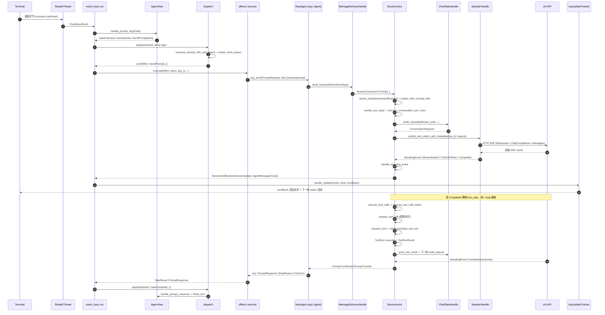

[上一篇：01-简单框架-系统骨架](01-简单框架-系统骨架.md) · [总目录](README.md) · [下一篇：03-详细逐步说明-主链路拆解](03-详细逐步说明-主链路拆解.md)

# 02：简单例子-全路径走读

> **场景**：用户在 TUI 里输入「用一句话解释什么是闭包」，敲回车，屏幕上出现模型回答。我们端到端追这条**主成功路径**，写清真实文件路径、函数名、关键参数与返回值。
> **工具版本**：Rust `1.94.0`（`rust-toolchain.toml:11`）/ `ratatui 0.29` / `tokio full` / `agent-client-protocol 0.10.4`（根 `Cargo.toml` `[workspace.dependencies]`，workspace members = 101）。
> **阅读说明**：本文只走主成功路径。`03` 把同一条链逐跳拆开（参数/返回/错误/状态），`15` 展开权限/取消/压缩/MCP 等分支。源码索引用「函数 + 函数内偏移」，行号是当前快照（HEAD `6c01b90c`），随版本变化，以当前源码为准。

---

## 本文件内容

1. [Why：为什么先走一条最小例子](#1-why为什么先走一条最小例子)
2. [选定的例子（脱敏输入输出）](#2-选定的例子脱敏输入输出)
3. [端到端 ASCII 总览](#3-端到端-ascii-总览)
4. [Mermaid 全路径时序图](#4-mermaid-全路径时序图)
5. [逐段走读（只主成功路径）](#5-逐段走读只主成功路径)
6. [一句话复述 + 下一步](#6-一句话复述--下一步)

---

## 1. Why：为什么先走一条最小例子

`01` 给了骨架图，但图是「静态」的。只有沿**一条真实请求**把图走活，你才会真正理解「数据从哪进、经过谁、回到哪」。选纯问答，是因为它最短：入口 → 采样 → 返回。

但要注意一个容易踩的坑：**这条链上「工具调用」不是一个可选旁支，而是同一循环里的下一次迭代**。同一个 `loop`（`process_conversation_turn_inner`）既跑「无工具的直接回答」，也跑「模型要工具 → 执行工具 → 把结果塞回对话 → 再采样」。所以本文在第 5 节把两者都走一遍：A 段（无工具）是最小成功路径，B 段（一次工具调用）是同一循环的第二轮迭代。

> 更复杂的工具场景（编辑 + 权限、bash + 沙箱、取消、压缩、MCP、子代理）在 `15` 展开；逐跳拆解在 `03`。

---

## 2. 选定的例子（脱敏输入输出）

**触发**：TUI 提示符下输入并回车

```text
> 用一句话解释什么是闭包
```

**脱敏输入**：

| 层 | 值 |
|---|---|
| 按键 | `KeyCode::Enter`（`ActionId::SendPrompt` 的 `default_key`） |
| `Action` | `Action::SendPrompt("用一句话解释什么是闭包".to_string())` |
| `Effect` | `Effect::SendPrompt { agent_id, session_id, text, prompt_id, skill_token_ranges: vec![] }` |
| ACP 线上 | `PromptRequest { session_id, prompt: [ContentBlock::Text], _meta: { promptId, screenMode } }` |
| `SessionCommand` | `SessionCommand::Prompt { prompt_id, prompt_blocks, prompt_mode, .. }` |

**关键参数（简化）**：

| 参数 | 值 | 来源 |
|---|---|---|
| `agent_id` | `AgentId`（TUI 内每个 pane 一个） | `AgentView.session.id` |
| `session_id` | `acp::SessionId`（形如 `sess_<uuid>`） | `session/new` 的返回 |
| `prompt_id` | `uuid::Uuid::new_v4().to_string()` | 每次 drain 现生成 |
| `skill_token_ranges` | `vec![]`（本例无 slash token） | `slash_controller.recognized_token_ranges()` |
| `screen_mode` | `fullscreen` \| `inline` \| `minimal` | `SessionFlags::screen_mode_label` |

**预期输出（屏幕）**：模型生成的文本逐块（`AgentMessageChunk`）流式上屏，最终以一条 `PromptResponse`（`StopReason::EndTurn`）收尾。

**脱敏模型返回（节选）**：`闭包是一个能捕获并使用其定义环境里变量的函数。`

---

## 3. 端到端 ASCII 总览

```text
 Step 1  Terminal（crossterm）
   │  ReaderThread::spawn 轮询 stdin  [reader_thread.rs 函数：ReaderThread::spawn +0]
   │  TimedInputEvent -> unbounded channel
   ▼
 Step 2  Pager 事件循环  [event_loop.rs 函数：run +0]
   │  AgentView::handle_prompt_key  [agent_view/prompt.rs 函数：handle_prompt_key +0]
   │  registry.lookup(Enter, When::PromptFocused) -> ActionId::SendPrompt
   │  PromptInputMode::send_action(text)  [agent_view/mod.rs 函数：send_action +0]
   │  -> Action::SendPrompt(text)
   ▼
 Step 3  dispatch（同步纯函数，不 await）  [dispatch/router.rs 函数：dispatch +0]
   │  Action::SendPrompt => dispatch_send_prompt  [+260]
   │  -> dispatch_send_prompt_inner -> dispatch_send_prompt_submission
   │  -> agent.session.enqueue_prompt_with_skill_tokens(text, ranges)
   │  -> maybe_drain_queue(agent)  [dispatch/queue.rs 函数：maybe_drain_queue +0]
   │  -> Effect::SendPrompt { agent_id, session_id, text, prompt_id, skill_token_ranges }  [+250]
   ▼
 Step 4  effects 执行器（异步任务）  [effects/mod.rs 函数：execute +0]
   │  Effect::SendPrompt 分支  [+1123]
   │  acp::PromptRequest::new(session_id, [ContentBlock::Text])  [+1148]
   │  .meta({ promptId, screenMode })
   │  acp_send(req, &tx).await  [+1154]
   │  ── ACP 传输（同进程 mpsc / 跨进程 stdio|socket）──▶
   ▼
 Step 5  Shell 侧 MvpAgent（impl acp::Agent）
   │  MvpAgent::prompt(arguments)  [agent/mvp_agent/acp_agent.rs 函数：prompt +0]
   │  非 send_now：DeliveryEnvelope -> MessageDeliveryHandle::send_human
   │    [session/message_delivery.rs 函数：send_human +0]
   │  -> SessionCommand::Prompt { .. }  [+19 处的 HumanPromptContent::into_command]
   ▼
 Step 6  SessionActor 命令循环（单写者）  [acp_session_impl/run_loop.rs]
   │  SessionCommand::Prompt { .. } 匹配 + 入队
   │  session.queue_input(QueueInputRequest { .. })
   │  SessionActor::maybe_start_running_task(..)
   │  -> handle_turn_input  [acp_session_impl/turn.rs 函数：handle_turn_input +0]
   ▼
 Step 7  回合循环  [turn.rs 函数：process_conversation_turn_inner +0]
   │  ChatStateHandle::build_request(effective_tools, ..)  [+330]
   │    [xai-chat-state/src/handle.rs 函数：build_request +0]
   │  -> ConversationRequest
   │  run_turn_via_sampler(request, ..)  [+412]
   │    [acp_session_impl/sampler_turn.rs 函数：run_turn_via_sampler +0]
   │  -> SamplerHandle::submit_and_collect_with_metadata
   │       [xai-grok-sampler/src/handle.rs 函数：submit_and_collect_with_metadata +0]
   │  -> SamplerActor -> stream_* -> HTTP SSE  ──▶ xAI API
   ▼
 Step 8  事件回流  [acp_session_impl/spawn.rs 的 drainer 任务]
   │  SamplingEvent::ChannelToken{Text} -> handle_sampling_event
   │    [acp_session_impl/sampling_events.rs 函数：handle_sampling_event +0]
   │  -> acp::SessionUpdate::AgentMessageChunk  [+100]
   │  -> SessionNotification 经 ACP 回程 ──▶ Pager
   ▼
 Step 9  Pager 渲染
   │  acp_handler::handle  [app/acp_handler/mod.rs 函数：handle +0]
   │  AcpUpdateTracker::handle_update  [acp/tracker.rs 函数：handle_update +0]
   │  -> handle_agent_chunk -> scrollback 追加文本  [+60]
   ▼
 Step 10 屏幕出现回答（无工具调用时，本回合到此结束）

 ── 若模型请求工具，同一 loop 进入下一轮迭代 ──
 Step 7'  tool_calls 非空
   │  execute_tool_calls(tool_call_responses)  [turn.rs +1176]
   │    [tool_calls.rs 函数：execute_tool_calls +0]
   │  -> execute_tool_calls_batch  [+137]
   │  -> prepare_tool_call（权限/钩子/解析）  [+1030]
   │  -> dispatch_tool(&workspace_ops, &prepared, &session_id)
   │       [tool_dispatch.rs 函数：dispatch_tool +0]
   │  -> WorkspaceOps::call_tool  [workspace_ops.rs 函数：call_tool +0]
   │  -> FinalizedToolset::call -> LocalRegistry -> ToolDyn::execute
   │  -> Result<ToolRunResult, ToolError>
   │  -> push_tool_result 回 ChatState，continue 回 Step 7
```

---

## 4. Mermaid 全路径时序图



---

## 5. 逐段走读（只主成功路径）

### A 段：无工具的最小成功路径

#### Step 1 — 按键从终端到 `Action`

- **读键**：`crates/codegen/xai-grok-pager/src/app/reader_thread.rs`，`函数：ReaderThread::spawn +0`。这是一个**独占 stdin 的 OS 线程**，用 `crossterm::event::poll(POLL_TIMEOUT)`（20 ms）后 `read()`，把事件包成 `TimedInputEvent` 经 `UnboundedSender<TimedInputEvent>` 送给事件循环。它不解析语义，只搬运字节。
- **事件循环**：`crates/codegen/xai-grok-pager/src/app/event_loop.rs`，`函数：run +0`（`pub(crate) async fn run`）。它 `select!` 输入事件、ACP 消息、定时器。
- **语义化**：`crates/codegen/xai-grok-pager/src/app/agent_view/prompt.rs`，`函数：handle_prompt_key +0`。先做元素交互（Enter 展开 paste/file chip）、multiline 判断，然后查动作表：
  - `registry.lookup(key, When::PromptFocused)` 命中 `ActionId::SendPrompt`（定义：`crates/codegen/xai-grok-pager/src/actions/mod.rs` 的 `Struct：ActionId`，`SendPrompt` 在 `+2`；键位定义：`crates/codegen/xai-grok-pager/src/actions/defaults.rs` 的 `ActionDef { id: ActionId::SendPrompt, default_key: key!(Enter), context: When::PromptFocused, .. }`）。
  - `self.prompt.try_send()` 取出文本（空文本/仅空白返回 `None`，不产生动作）。
  - `PromptInputMode::send_action(text)`（`crates/codegen/xai-grok-pager/src/app/agent_view/mod.rs` 的 `函数：send_action +0`）把 `(输入模式, 文本)` 映射成具体 `Action`；`PromptInputMode::Normal` → `Action::SendPrompt(text)`。
- **返回**：`InputOutcome::Action(action)`，事件循环拿到后调 `dispatch`。

> 注意：`Action` 是「用户意图」而不是「动作结果」——`crates/codegen/xai-grok-pager/src/app/actions.rs` 的 `Struct：Action`（`SendPrompt(String)` 在 `+102`）。它刻意**不带** `session_id`/`prompt_id`，因为这些是 dispatch 阶段才知道的事实。

#### Step 2 — `dispatch`：同步纯函数产出 `Effect`

- **入口**：`crates/codegen/xai-grok-pager/src/app/dispatch/router.rs`，`函数：dispatch +0`（`pub(crate) fn dispatch(action: Action, app: &mut AppView) -> Vec<Effect>`）。它维护 `app.dispatch_depth`，只在最外层调用后 `flush_image_notices(app)`——因为 slash 命令/任务结果会**递归**调用 `dispatch`，图片提示只在整棵树跑完后统一弹一次。
- **路由**：`函数：dispatch_inner +9` 里 `Action::SendPrompt(text) => dispatch_send_prompt(app, text)`（`+260`）。
- **发送**：`crates/codegen/xai-grok-pager/src/app/dispatch/prompt.rs`：
  - `函数：dispatch_send_prompt +0` → 打一条 `prompt.enqueue` 日志 → 调 `dispatch_send_prompt_inner(app, text, true, false, false)`（`+6`）。
  - `函数：dispatch_send_prompt_inner +0` → 直接转给 `dispatch_send_prompt_submission(app, text, None, consume_input, literal, is_follow_up)`（`+7`）。
  - `函数：dispatch_send_prompt_submission +0`：清 `app.pending_action`，取 `skill_token_ranges = agent.prompt.slash_controller.recognized_token_ranges(&text, &agent.session.models)`，然后判断走哪条路。

**两条产出 `Effect::SendPrompt` 的路，务必分清**：

| 条件 | 路径 | 产出点 |
|---|---|---|
| `immediate_server_send_eligible(agent, leader_mode) == true`（**回合正在跑**，且本地队列为空等） | 立即 server-authoritative 发送 | `prompt.rs` `函数：dispatch_send_prompt_submission +602` |
| 否则（**本例：回合空闲**） | 先本地入队，再由 drain 提升为运行中回合 | `dispatch/queue.rs` `函数：maybe_drain_queue +250` |

`immediate_server_send_eligible` 定义在 `crates/codegen/xai-grok-pager/src/app/dispatch/queue.rs`，`函数：immediate_server_send_eligible +0`，条件为：

```text
(leader_mode || load_follow_up_steer() || wake_running)
  && server_busy                      // 回合在跑 / 有 wake turn / shared_queue 非空
  && session_id.is_some()
  && pending_prompts.is_empty()       // 本地队列必须为空
  && prompt_mode != EditingQueued
  && !model_switch_pending
  && !loading_replay
```

**本例（空闲）走的是本地入队**：

1. `agent.session.enqueue_prompt_with_skill_tokens(text.clone(), skill_token_ranges)`（`prompt.rs` `函数：dispatch_send_prompt_submission +614` 起的分支）。
2. `consume_input == true`（Enter 提交）：`agent.prompt.stash().into_submission()` 取出 images/chips，`agent.prompt.set_text("")` 清空输入框，`agent.note_draft_consumed()`。
3. `maybe_drain_queue(agent, &mut app.pending_image_notices)`（`dispatch/queue.rs` `函数：maybe_drain_queue +0`）——这一步才真正把「队列头」提升为「运行中回合」。
4. `maybe_drain_queue` 的前置闸门（任一命中就 `QueueDrain::blocked()`，本回合不发）：
   - `!agent.session.state.is_idle()` → `turn_running`
   - `agent.running_wake_turn.is_some()` → `wake_turn_running`
   - `agent.session.model_switch_pending` → `model_switch_pending`
   - `agent.session.loading_replay` → `loading_replay`
   - `agent.session.hook_block_hold` → `hook_block_hold`
   - `shared_queue` 里有**非**当前 running 的行 → `server_queue_owns_next_turn`
   - `session_id` 为 `None` → `no_session_id`
   - 用户正在编辑队首行（`PromptMode::EditingQueued`）→ `user_editing_front`
5. 闸门通过后 `dequeue_prompt()`（或开启 `combine_queued_prompts` 时 `dequeue_combined_prompt`），然后：
   - `prompt_id = uuid::Uuid::new_v4().to_string()`（`queue.rs` `函数：maybe_drain_queue +136`）——**每次 drain 现生成**，不是发送时生成。
   - `agent.note_self_originated_prompt(&prompt_id)`：标记「这条 prompt 是本客户端发出的」，ACP 网关据此把该 `prompt_id` 的 delta 视为「我们的回合」，而不是去 adopt 别人的回合。
   - `agent.begin_local_turn(&prompt_id)`：把 pane 从 Idle 推到运行态。
   - `agent.scrollback.push_block(RenderBlock::user_prompt(&queued.text))`：**用户气泡此刻上屏**（`+164`），并把 `InFlightPrompt` 存进 `agent.session.in_flight_prompt` 供取消时还原。
   - 普通纯文本分支产出 `Effect::SendPrompt { agent_id, session_id, text, prompt_id, skill_token_ranges }`（`+250`）。

> 设计点：`dispatch` 是**同步、纯函数、不 `.await`**（只有 `&mut AppView` 这一个可变输入），所以整条 UI 决策链可以在单测里确定性复现。副作用一律推迟到 `Effect`。见 `08`。

#### Step 3 — `Effect::SendPrompt` 变成异步任务并经 ACP 发出

- **消费点**：`crates/codegen/xai-grok-pager/src/app/effects/mod.rs`，`函数：execute +0`（`pub(crate) fn execute(effect, tasks: &mut JoinSet<TaskResult>, acp_tx: &AcpAgentTx, ..) -> (bool, EffectMeta)`）。它是**同步函数**，作用是把 `Effect` 变成 `tasks.spawn(...)`。
- `Effect::SendPrompt { .. }` 分支在 `+1123`，内部：
  1. `ulog::info("prompt.acp_send.start", ..)`
  2. `let prompt = vec![plain_prompt_content_block(text, &skill_token_ranges)]`（`函数：plain_prompt_content_block +0`）——无 skill token 时 `meta` 为 `None`，有则写入 `_meta.skillTokenRanges`（`[start, end]` 数组的数组）。
  3. `acp::PromptRequest::new(session_id.clone(), prompt).meta(prompt_request_meta(&prompt_id, screen_mode).as_object().cloned())`（`+1148`）。
     `prompt_request_meta`（`函数：prompt_request_meta +0`）只放两个键：`promptId`（必需，用于把每条 `session/update` 与 `PromptResponse` 关联回本次 prompt）和 `screenMode`（`fullscreen`/`inline`/`minimal`，遥测用；`None` 时整个键省略，保持旧线格式字节一致）。
  4. `let result = acp_send(req, &tx).await;`（`+1154`），随后 `ulog::info("prompt.acp_send.done", ..)` 记录 `elapsed_ms`/`ok`。
  5. 无论成功失败都产出 `TaskResult::PromptResponse { agent_id, result: result.map_err(|e| format_acp_error(&e, is_api_key_auth)), http_status, prompt_id: Some(prompt_id) }`（`+1173`）。

- **`acp_send` 的真身**：`crates/codegen/xai-acp-lib/src/channel.rs`，`函数：acp_send +0`：

```rust
pub async fn acp_send<R, T>(request: T, tx: &mpsc::UnboundedSender<R>) -> AcpResult<T::Response>
where T: AcpRequest, R: From<AcpArgs<T>> + fmt::Debug
{
    let (response_tx, response_rx) = oneshot::channel();
    let method = request.method_name();
    let args = AcpArgs { request, response_tx };
    tx.send(args.into()).map_err(|_| /* AcpChannelFailure::SendFailed */)?;
    response_rx.await.map_err(|_| /* AcpChannelFailure::RecvFailed */)?
}
```

**关键事实**：`acp_send` 是「**发请求 + 等 oneshot 响应**」的完整 RPC，不是 fire-and-forget。它把 `oneshot::Sender<AcpResult<T::Response>>` 塞进 `AcpArgs`，连同请求一起经 `mpsc::UnboundedSender` 交给对端；对端处理完把结果写回 oneshot。两种失败各有独立错误码：发送前 channel 已关（`SendFailed`）、发送后对端丢弃了 `response_tx`（`RecvFailed`）。

- **消息类型**：`PromptRequest` 在 `crates/codegen/xai-acp-lib/src/message.rs` 的 `acp_define_request_response!(acp::PromptRequest, acp::PromptResponse, acp::AGENT_METHOD_NAMES.session_prompt)`（`Module：agent`，`+30`）；枚举载体 `AcpAgentMessageGeneric::Prompt(AcpArgsGeneric<acp::PromptRequest, S>)`（`Struct：AcpAgentMessageGeneric`，`Prompt` 变体在 `+6`）。
- **同进程 / 跨进程**：`acp_channels()`（`channel.rs` `函数：acp_channels +0`）造出一对 `mpsc::unbounded_channel()` 组成的 `AcpClientChannel`/`AcpAgentChannel`；TUI 与 Agent 同进程时这就是内存 channel，跨进程（leader 模式）时同一套 `AcpAgentMessage` 经 stdio/socket 序列化——**上层代码不变**。这是「TUI 侧没有 `SessionHandle::prompt`」的根本原因：prompt 只能经 ACP 出去。

#### Step 4 — Shell 侧 `MvpAgent::prompt` 接收

- **入口**：`crates/codegen/xai-grok-shell/src/agent/mvp_agent/acp_agent.rs`，`impl acp::Agent for MvpAgent`（`+92`），`函数：prompt +0`（带 `#[tracing::instrument(name = "agent.prompt", ..)]`）。签名：

```rust
async fn prompt(&self, mut arguments: acp::PromptRequest) -> Result<acp::PromptResponse, acp::Error>
```

- 它先做一串「拒收」前置检查（都返回 `StopReason::EndTurn` 而不是报错）：
  1. `session_handle_waiting_for_load(&arguments.session_id)` 拿不到 → `acp::Error::invalid_params().data("unknown session id")`。
  2. `models_manager.allowlist_excludes_all()` → 发 `ModelAutoSwitched` 后 `EndTurn`。
  3. 该 session 被 latch 了 `unavailable_model`：若目录里已有替代模型 → 自动切回并继续；否则发提示后 `EndTurn`。
- 然后 `let dispatch_guard = self.dispatch_lock(&arguments.session_id).lock().await;`——**每个 session 一把异步互斥锁**，保证同一 session 的 prompt 处理串行，不会两条 prompt 交叉入队。
- `prompt_mode`：优先读 `_meta.mode`，否则向 actor 发 `SessionCommand::GetCurrentPromptMode` 问当前模式。
- `prompt_id`：读 `_meta.promptId`；缺省才 `uuid::Uuid::new_v4()`（`+137`）——**正常情况下用的是 TUI 生成的那个 id**，两端必须一致，否则 delta 会被 prompt-id 网关丢掉。
- 读其它 meta：`verbatim`、`sendNow`、`clientIdentifier`、`screenMode`、`outputSchema`（非 object 直接 `invalid_params`）、`toolOverrides`（`ToolOverridesUpdate::parse` 失败即 `invalid_params`）。

**入队：两条路**

- `send_now == true`：直接构造 `SessionCommand::Prompt { .. send_now: true, admission: None, prompt_admitted: None, persist_ack: None, .. }` 发给 `handle.cmd_tx`（`+364`）。
- `send_now == false`（**本例**）：走新的 message-delivery 层——

```rust
let envelope = xai_message_delivery_core::DeliveryEnvelope::from_human(
    xai_message_delivery_core::Operation::Queue,
    HumanPromptContent { prompt_blocks, prompt_mode, artifact_upload_ctx,
                         client_identifier, screen_mode, verbatim, traceparent,
                         json_schema, tool_overrides_update, respond_to: tx,
                         parsed_prompt_tx },
    human_delivery_identity(prompt_id.clone()),
    ResidentHumanGrant::new(handle.info.id.0.to_string()),
);
handle.message_delivery().send_human(envelope)...
```

- `MessageDeliveryHandle::send_human`：`crates/codegen/xai-grok-shell/src/session/message_delivery.rs`，`函数：send_human +0`。它做**三道校验**：
  1. `grant.target_session_id != self.target_session_id || message_id != prompt_id` → `HumanDeliveryError::Rejected`（防止把 envelope 投给错的 session，或身份自相矛盾）。
  2. `authorize_operation(OperationSet::QUEUE, operation).is_err()` → `Unsupported`（`Queue` 是该 grant 允许的操作集）。
  3. `cmd_tx.send(content.into_command(prompt_id))`，失败 → `ChannelClosed`。
- `HumanPromptContent::into_command`（`+19`）把内容翻译成 `SessionCommand::Prompt { .. send_now: false, .. }`。**这是 `SessionCommand::Prompt` 的构造点之一**，另一个是 `send_now` 分支。

- **等待**：`let stop_result = rx.await`（`+435`）。这一行是本跳的「阻塞点」——`MvpAgent::prompt` 会一直等到 SessionActor 把 `PromptTurnResult` 写回 oneshot。错误映射：`rx` 被丢弃 → `acp::Error::internal_error().data("session failed to respond")`。

#### Step 5 — SessionActor 命令循环：入队 → 起回合

- **定义**：`SessionCommand::Prompt { .. }` 在 `crates/codegen/xai-grok-shell/src/session/commands.rs` 的 `Struct：SessionCommand`（`Prompt` 变体在 `+31`）。字段全是「事实」而非「意图」：`prompt_id`、`prompt_blocks: Vec<acp::ContentBlock>`、`prompt_mode: PromptMode`、`artifact_upload_ctx`、`client_identifier`、`screen_mode`、`verbatim`、`traceparent`、`json_schema`、`send_now`、`admission: Option<TaskWakeAdmission>`、`tool_overrides_update`、`respond_to: oneshot::Sender<PromptTurnResult>`、`prompt_admitted`、`persist_ack`、`parsed_prompt_tx`。
- **Actor**：`crates/codegen/xai-grok-shell/src/session/acp_session.rs` 的 `Struct：SessionActor`（`+728`）；它的命令循环在 `crates/codegen/xai-grok-shell/src/session/acp_session_impl/run_loop.rs`。
- **匹配与入队**：`run_loop.rs` 里 `SessionCommand::Prompt { prompt_id, prompt_blocks, prompt_mode, artifact_upload_ctx, client_identifier, screen_mode, verbatim, traceparent, json_schema, send_now, admission, tool_overrides_update, respond_to, prompt_admitted, persist_ack, parsed_prompt_tx } =>` 分支（`+25` 处相对该 match 臂）。它做：
  1. `PromptOrigin::from_prompt_id(&prompt_id)` 判定来源（人类 / 合成 / 子代理 / 任务唤醒）。
  2. `admission` 存在时 `admit_task_completion_wake(..)`；不被接纳则 `SessionActor::respond_removed_prompt(respond_to)` 并 `continue`。
  3. `session.ensure_prefix_ready().await`。
  4. 非合成 prompt：清 `tool_context.task_wake_suppressed`、把 `state.notifications_suppressed = false`、`user_input_generation.fetch_add(1, AcqRel)`（让任何在跑的 LazinessDetector 轮询看到陈旧值而放弃）。
  5. 组装 `QueueInputRequest { .. }` 调 `session.queue_input(..)`；返回 `cancel_for_send_now: bool`。
  6. `cancel_for_send_now` 为真时 `session.cancel_turn_for_send_now(&mut replay_buffer).await`。
  7. `settled` 为真才 `SessionActor::maybe_start_running_task(session.clone(), completion_tx.clone()).await`——**这才是真正把 prompt 提升为运行回合的调用**。
- **处理器**：`crates/codegen/xai-grok-shell/src/session/acp_session_impl/turn.rs`，`函数：handle_turn_input +0`（注意：`turn.rs` 里那个同名 `handle_prompt` 是 `#[cfg(test)]` 的测试入口，生产路径是 `handle_turn_input` → `handle_turn_input_inner`）。
  - `handle_turn_input` 只做一件事：开一个 `tracing::info_span!("session.handle_prompt", session_id, prompt_id, ..)`，若有 `traceparent` 则 `xai_grok_otel::link_span_to_meta`，然后 `handle_turn_input_inner(request).instrument(span).await`。
  - `handle_turn_input_inner` 里与主路径相关的顺序：
    1. `TURNS_ACTIVE.enter()` + `WorkGuard::new(self.active_work.clone())`（RAII：回合期间 active work 计数 +1，drop 时 -1）。
    2. `self.ensure_session_disk_writable().await?`——**磁盘不可写直接 `?` 冒泡**。
    3. `resolve_turn_prompt_mode(..)` 并把结果写进 `turn_start_prompt_mode` / `turn_prompt_mode`。
    4. `TurnActiveGuard::activate(is_turn_active)` ×2（`tool_context.is_turn_active` + `session_turn_active`）。
    5. `extension_registry.turn_lifecycle_contributors()` 逐个 `on_turn_start_with_policy(&TurnStartInput::new(is_synthetic), policy)`。
    6. `extract_bash_command(&prompt_blocks)` 命中且 authority 不是 `ModelAuthoredUntrusted` → `handle_direct_bash_command(..)` 提前返回（bash 直通模式，不走模型）。
    7. 解析/截断 prompt（`<user_query>` 包裹等，`verbatim` 可跳过），**提交点**：`mark_front_message_committed().await`（`+751` 区域）+ `mark_completions_reported`。此后本 prompt 在 `chat_history.jsonl` 的持久化顺序已确定，后续 send-now 取消可以安全地接管。
    8. `process_conversation_turn_with_recovery(..)`（`+827`）——真正的回合循环入口。

> 关于 `SessionLiveState`：`crates/codegen/xai-grok-shell/src/session/handle.rs` 的 `Enum：SessionLiveState`（`+6`）取值 `Working` / `IdleResident` / `Dormant` / `Completed` / `DeadFailed` / `Attaching`。回合开始时 `Working`，`maybe_start_running_task` 完成后回 `IdleResident`。

#### Step 6 — 回合循环：建请求 → 采样

- **循环体**：`crates/codegen/xai-grok-shell/src/session/acp_session_impl/turn.rs`，`函数：process_conversation_turn_inner +0`（`process_conversation_turn` 只是包一层 `emit_pending_latency`）。结构是 `loop { ... }`（`+133`）。
- 每轮迭代做：
  1. `record_turn_start(Utc::now().timestamp_millis())`。
  2. `get_sampling_config()` 取当前 model / `reasoning_effort`，写进 tracing span。
  3. `prepare_tool_definitions_timed()` → `(tool_definitions, mcp_wait_ms)`；`maybe_inject_mcp_connecting_reminder()` / `maybe_inject_mcp_reminder()`。
  4. 解析本轮 `effective_tools: Vec<ToolSpec>`（子代理走 `child_tool_projection::child_safe_tool_specs` 做投影；`structured_output` 时追加 `STRUCTURED_OUTPUT_TOOL`）。
  5. **建请求**：`self.chat_state_handle.build_request(effective_tools, memory_reminder, self.memory.is_enabled(), trace, self.session_info.id.to_string(), req_id.to_owned()).await.expect("chat state actor should be alive")`（`+330`）。
     - `crates/codegen/xai-chat-state/src/handle.rs` 的 `函数：build_request +0`：签名 `pub async fn build_request(&self, tool_definitions: Vec<ToolSpec>, memory_reminder: Option<String>, persist_memory_reminder: bool, trace: Option<Box<dyn TraceContext>>, conv_id: String, req_id: String) -> Option<ConversationRequest>`。它只是把 `ChatStateCommand::BuildConversationRequest { .. }` 发给 ChatStateActor 并等 `reply`（`self.query(...)`）。
     - 真正的「剪枝 / 修复悬空 tool_call / 注入 memory / 预算图片」逻辑在 `crates/codegen/xai-chat-state/src/actor/` 里；对调用方它就是一个纯函数式转换：**不修改 actor 状态**（`build_request_does_not_mutate_actor_state` 是明写的单测契约）。
  6. 给请求补上遥测头：`x_grok_session_id`、`x_grok_turn_idx = get_prompt_index()`、`x_grok_agent_id`、`x_grok_transient_retry`、`x_grok_deployment_id`。
  7. `request.max_output_tokens = clamp_task_model_request(..)?`（子代理预算钳制，失败即 `local_error("max_output_tokens_clamp_failed", ..)`）。
  8. `emit_event(Event::PhaseChanged { phase: WaitingForModel })` + `observability_bridge.emit(SessionEvent::PhaseChanged { phase: Sampling })`。
  9. **采样**：`self.run_turn_via_sampler(request.clone(), &mut rate_limit_waits, TransientRetryState { .. }, salvage.awaiting_continuation(), turn_parked).await`（`+412`）。
- **`run_turn_via_sampler`**：`crates/codegen/xai-grok-shell/src/session/acp_session_impl/sampler_turn.rs`，`函数：run_turn_via_sampler +0`。逻辑：
  - 非 parked 时 `prepare_sampler_for_turn().await`（刷新 auth + 把采样配置推给 sampler actor）。
  - `budget.can_wait()` 为假（子代理的 429 预算耗尽）→ 只提交一次 `submit_turn_request(request)`，失败走 `recover_from_sampling_failure`。
  - 否则 `loop { submit_turn_request(request.clone()) }`：成功即 `budget.record_submission_accepted()` 返回；失败由 `budget.decide(&info)` 给出 `RateLimitWaitDecision`，`Wait { attempt, backoff }` 则 `notify_rate_limit_wait` + `sleep(backoff)` 后重试，并 `turn_phases.record_sampling_retries(1)`。
  - `submit_turn_request`（`+65`）：生成 `RequestId::random()`，在 `turn_stream_drained` 里登记 `StreamOwnership { generation, waiter }`（这个 map 是「本轮还拥有该 request 的所有 FIFO 事件」的唯一依据），取 `acquire_subagent_sampling_guard` 信号量，写 `request.traceparent = span_traceparent(sampling_span.span())`，然后 `sampler_handle.submit_and_collect_with_metadata(request_id.clone(), request).await`。
- **SamplerHandle**：`crates/codegen/xai-grok-sampler/src/handle.rs` 的 `Struct：SamplerHandle`（`+33`），内部就是一个 `mpsc::UnboundedSender<SamplerCommand>`。`函数：submit_and_collect_with_metadata +0` 的要点：
  - 建一个 `CancelOnDrop` RAII guard：future 被 drop（取消/panic/正常返回）时向 actor 发 `SamplerCommand::Cancel { request_id }`；actor 已结束则为 no-op。
  - `SamplerCommand::Submit { request_id, request: Box::new(request), config: None, completion_tx: Some(tx) }`。
  - `completion_rx.await`；actor 提前掉线则返回 `SamplingError::auth_unknown("sampler actor dropped before completion")`。
  - 返回 `CollectedSamplingResult { result, terminal_event_queued, doom_loop_signals, doom_loop_recovery_attempts }`。
- **SamplerActor 与 HTTP**：`crates/codegen/xai-grok-sampler/src/actor/mod.rs` 的 `Struct：SamplerActor`（`+21`）持有 `event_tx: mpsc::UnboundedSender<SamplingEvent>`（`+2`）。单次尝试在 `actor/request_task.rs` 的 `函数：run_attempt` 附近按后端分派（`+520` 起）：
  - Chat Completions：`client.conversation_stream_chat_completions(request)` → `stream_chat_completions(teed, metadata, request_id, idle_timeout)`（`stream/chat_completions.rs` 的 `函数：stream_chat_completions +0`）。
  - Responses：`client.conversation_stream_responses(request)`（`client.rs` 的 `函数：conversation_stream_responses +0`）→ `stream_responses_tracked(..)`（`stream/responses.rs` 的 `函数：stream_responses_tracked +0`）。
  - Messages：`client.conversation_stream_messages(request)` → `stream_messages(teed, metadata, request_id, idle_timeout)`（`stream/messages.rs` 的 `函数：stream_messages +0`）。
  - 三条 L2 变换都把原始 SSE 归一到同一套 `SamplingEvent`，由 `event_tx` 推给订阅方。

#### Step 7 — `SamplingEvent` 回流成 ACP `session/update`

- **事件定义**：`crates/codegen/xai-grok-sampler/src/events.rs` 的 `Enum：SamplingEvent`（`+36`）。与主路径相关的变体：
  - `StreamStarted { request_id, timestamp_ms }`（`+2`）
  - `FirstToken { request_id }`（`+7`）
  - `ChannelToken { request_id, channel: SamplingChannel, text: String, chunk_index: u64 }`（`+11`）；`SamplingChannel` 只有 `Text` / `Reasoning`（`+15`）
  - `ToolCallDelta { request_id, tool_index, id, name, arguments_delta }`（`+21`）
  - `Completed { request_id, response: Box<ConversationResponse>, metrics: InferenceLatencyStats }`（`+50`）
  - `Retrying { request_id, attempt, max_retries, kind, reason, .. }`（`+73`）、`Failed { request_id, error: SamplingErrorInfo }`（`+88`）、`ModelMetadata { .. }`（`+94`）、`BackendToolCallStarted/Completed`（`+101`/`+108`）。
- **订阅点**：`crates/codegen/xai-grok-shell/src/session/acp_session_impl/spawn.rs`，在 session 起来时起一个 `tokio::task::spawn_local` drainer：

```rust
tokio::task::spawn_local(async move {
    while let Some(event) = sampler_event_rx.recv().await {
        drainer_session.handle_sampling_event(event).await;
    }
    tracing::debug!("sampler event drainer exiting (channel closed)");
});
```

- **翻译器**：`crates/codegen/xai-grok-shell/src/session/acp_session_impl/sampling_events.rs`，`函数：handle_sampling_event +0`。开头两道过滤：
  - `request_owned = self.turn_stream_drained.lock().contains_key(event.request_id())`
  - `owns_pending_strip = self.pending_image_strip.lock().contains_key(event.request_id())`
  - `if !request_owned && !closes_backend_tool && !resolves_pending_strip { return; }` —— **一个已被取消/重写的回合的迟到事件会被直接丢弃**，不会污染下一个回合。
- `ChannelToken { channel: Text, text, chunk_index }`（`+65`）：
  1. `bump_stream_apply_span(&request_id, text.len())`
  2. 追加到 `streaming_turn_capture`（**只在内存里给 trace 上传用，不写入 chat_state**）
  3. `record_turn_first_token` + `record_turn_first_meaningful_output`（TTFT / TTFM 遥测）
  4. `emit_event(Event::PhaseChanged { phase: StreamingText })`
  5. `self.send_update(acp::SessionUpdate::AgentMessageChunk(acp::ContentChunk::new(acp::ContentBlock::Text(acp::TextContent::new(text)))), Some(chunk_index)).await`（`+100`）
- `ChannelToken { channel: Reasoning }`（`+108`）：同样累计，但发的是 `AgentThoughtChunk`（`send_thought_chunk`，`+1`）并且**只记 TTFT 不记 TTFM**（reasoning 不算「有意义输出」）。
- `Completed { .. }`（`+203`）：`apply_pending_image_strip(&request_id)`（持久化被剥离的图片，必须在 drain waiter 释放前完成）→ 合并 doom-loop 信号 → 遥测 → 把 `ConversationResponse` 交给上层做 turn 收尾。
- `send_update` 的终点是 `crates/codegen/xai-grok-shell/src/session/acp_session_impl/turn.rs`（`+50` 区域）：它把 `SessionUpdate` 包成 `acp::SessionNotification::new(self.session_info.id.clone(), update).meta(self.build_notification_meta().as_object().cloned())`，**既发给 ACP 网关（回 TUI），又发一份到 `notifications.persistence_tx` 作为 `PersistenceMsg::Update(SessionUpdate::Acp(..))`**——这就是「屏幕上有 + JSONL 里也有」的双写点。

#### Step 8 — Pager 收通知并渲染

- **事件循环接收**：`crates/codegen/xai-grok-pager/src/app/event_loop.rs`，`函数：run +0`：`let mut acp_rx = connection.rx;`（`+595`），`None => acp_rx.recv().await`（`+1150`）拿到 `AcpClientMessage`，`let mut state_changed = acp_handler::handle(msg, &mut app);`（`+1154`），随后还会 `while let Ok(msg) = acp_rx.try_recv() { state_changed |= acp_handler::handle(msg, &mut app); }`（`+1163`）把同一批消息一次排干，减少重绘。
- **分发**：`crates/codegen/xai-grok-pager/src/app/acp_handler/mod.rs`，`函数：handle +0`（`pub(crate) fn handle(msg: AcpClientMessage, app: &mut AppView) -> bool`）→ `函数：handle_inner +8`。`AcpClientMessage::SessionNotification(notif)` 分支（`+2`）先做几件与「事件身份」有关的事：
  1. `NotificationMeta::from_json(notif.request.meta.as_ref())` 解析 `promptId` / `eventSeq` / `isReplay` / `streamStartMs` / `turnStartMs` / `totalTokens` 等。
  2. `find_session_match(app, &notif.request.session_id)` → `SessionMatch::Root(id)` 或子代理/任务视图。
  3. **去重高水位**：`dedup_drop = !meta.is_replay && meta.event_seq.is_some_and(|seq| agent.last_applied_event_seq.is_some_and(|last| seq <= last))`——`session/load` 与实时流竞态时，重复事件在此被丢掉。
  4. `ack_prompt_from_update(agent, &meta)`：收到任意一条带 `promptId` 的 update 即认为该 prompt 已被服务端受理（`prompt_ack` 模块）。
  5. `drop_unexpected_replay(..)`：不是本会话的 replay 直接丢弃并回 `Ok(())`。
  6. **viewer 判定**：`notif_pid != agent.session.current_prompt_id` 且不是 server-initiated → `agent.attached_as_viewer = !agent.is_self_originated_prompt(notif_pid)`（在另一窗口里跑别人的回合时只读跟随）。
- **真正改 UI**：`crates/codegen/xai-grok-pager/src/acp/tracker.rs`，`函数：AcpUpdateTracker::handle_update +0`（`pub fn handle_update(..)`）。核心 match（`+59` 起）：
  - `AgentMessageChunk(chunk) => self.handle_agent_chunk(chunk, meta, scrollback)`（`+60`）——清空 `blocking_waits`、把文本追加到当前 running 的 agent message block。
  - `AgentThoughtChunk(thought) => self.handle_thought_chunk(..)`（`+64`）
  - `ToolCall(tc) / ToolCallUpdate(tcu)`（`+68`/`+71`）
  - `UserMessageChunk(chunk)`（`+74`）——**用户气泡的权威版本**（本地 drain 时已乐观画过一次，replay 时靠这条重建）
  - `AvailableCommandsUpdate`（`+77`）、`Plan` / `CurrentModeUpdate`（`+84`）
  - `changed` 为真且是 agent 输出且非 replay 时 `bump_agent_output_epoch()`（`+87`）——渲染层用它判断「有没有新内容需要重绘」。
- **上屏**：scrollback 状态变更后，`event_loop` 让 presenter 在下一个 tick 渲染一帧（`ratatui 0.29`）。渲染代码在 `crates/codegen/xai-grok-pager-render` / `xai-grok-pager/src/views/`。

#### Step 9 — 回合收尾：`PromptResponse` → 状态回 Idle

- **Shell 侧**：`sampler_turn.rs` 拿到 `Completed` 后回到 `process_conversation_turn_inner`，判定 `tool_calls` 为空 → `return Ok(TurnOutcome::Completed { .. })`（或 `MaxTurnsReached` 等）。`turn.rs` 的收尾构造 `PromptTurnOk { stop_reason: StopReason::EndTurn, total_tokens, turn_snapshot, completion_kind: PromptCompletionKind::Completed, structured_output, usage, tool_overrides }`；`函数：ok_end_turn +0` 是这条构造的便捷入口（`commands.rs`）。
- **回到 ACP 层**：`MvpAgent::prompt` 的 `rx.await` 解开，构造 `acp::PromptResponse::new(stop_reason).meta(build_prompt_response_meta(..))`。同时（`+76` 区域）fire-and-forget 发一条 `x.ai/session/prompt_complete` 扩展通知，携带 `turnId` / `cancelTrigger` / `cancellationCategory` / `cancellationContext`。
- **Pager 侧**：`effects/mod.rs` 的 `Effect::SendPrompt` 任务返回 `TaskResult::PromptResponse`，经 `JoinSet` 回到事件循环，转成 `Action::TaskComplete(..)` 再进 `dispatch`。路由在 `crates/codegen/xai-grok-pager/src/app/dispatch/task_result.rs` 的 `TaskResult::PromptResponse { agent_id, result, http_status, prompt_id } =>` 分支（`+488`）：

```rust
let effects = handle_prompt_response(app, agent_id, result, http_status, prompt_id);
app.refresh_status_line_for(agent_id);
effects
```

- `handle_prompt_response`（`crates/codegen/xai-grok-pager/src/app/dispatch/prompt.rs`，`函数：handle_prompt_response +0`）：
  1. 先取回 `app.pending_running_adoptions.remove(&agent_id)`（leader 广播的 `running_prompt_id` 可能比 `PromptResponse` 先到）。
  2. 解析 `response_pid`：`Ok(pr)` 取 `pr.meta["promptId"]`，`Err(_)` 退回 `prompt_id` 参数。
  3. **不匹配就丢弃**：`response_pid != agent.session.current_prompt_id` 时，只有「双方都是 server-initiated」才 adopt，否则把之前弹出的 `pending_adoption` 放回，并且**绝不触碰当前回合状态**。这防的是「被 rewind 掉的回合」或「从未真正运行的排队 prompt」的响应污染当前 UI。
  4. 匹配则 `agent.finish_turn(...)` → `AcpUpdateTracker::finish_turn`（`acp/tracker.rs`，`+93`）：记 `epoch_at_last_finish`、`finish_thinking`、`scrollback.note_pin_reserve_turn_finished()`、把 running block 收尾、清 pending tools。
- 至此屏幕上是完整回答 + 状态栏回到 Idle。

### B 段：同一循环里的工具分支（主成功路径的第二轮迭代）

若 `ConversationResponse.tool_calls()` 非空，循环不返回，而是继续。这一段是「回答上屏」在真实编码任务里的常态。

1. **工具批次入口**：`turn.rs` 把 `tool_calls` 转成 `Vec<ToolCallResponse { id, kind: "function", function: ToolCallFunction { name, arguments } }>`（`+3719` 区域），`emit_event(PhaseChanged { ToolExecution })`，然后
   `self.execute_tool_calls(tool_call_responses).await`（`+1176`）。
2. **`execute_tool_calls`**：`crates/codegen/xai-grok-shell/src/session/acp_session_impl/tool_calls.rs`，`函数：execute_tool_calls +0`（带 `#[tracing::instrument(name = "tools.execute", ..)]`）。
   - `reject_excess_media_gen_calls(tool_calls)`：超出 `media_gen_batch_limits` 的图片/视频生成调用被拒，但**每个被拒的 call id 仍然登记 Pending `ToolCall` + Failed `ToolCallUpdate`**（`handle_tool_not_executed`），保证 provider 侧 `tool_use` / `tool_result` 成对。
   - 多调用时 `split_exit_plan_tail(tool_calls, kind_of)` 把 `exit_plan_mode` 拆成尾批，先跑主体再跑尾巴，两批各自调 `execute_tool_calls_batch`；单调用直接调一次。
   - 批次跑完后 flush `deferred_followups`（每个 `push_user_message`）、`drain_interjections_at_safe_point()`、`flush_pending_skill_reminders()`，最后返回 `final_result` 或 `ToolLoop::Continue`。
3. **`execute_tool_calls_batch`**：同文件 `函数：execute_tool_calls_batch +0`。三阶段：
   - **prepare**：逐个 `prepare_tool_call(call, &mut deferred_followups)`（`+61`，定义在 `+1030`）。
     - 先发 Pending 的 `acp::ToolCall::new(tool_call_id, name).kind(Other).status(Pending).raw_input(early_raw_input)`（`+38`），让 TUI 立刻画出「正在调用 X」。
     - `mcp_file_budget.admit(&prepared)` 超预算 → `handle_tool_not_executed` 并跳过。
     - 权限：构造 `AccessKind`（`Read` / `Edit` / `Bash` / `Grep` / `MCPTool` / `WebFetch` / `WebSearch` / `AgentMessage`，见 `xai_grok_workspace::permission::AccessKind`），带 `RequestPathContext { real_cwd, display_cwd }`，用 `PendingInteractionGuard::new(.., PendingKind::Permission)` 包住，然后
       `self.permissions.request(PermissionRequest { path_context, session_id, hook_ask, ..PermissionRequest::new(access_kind, tool_call_update) }).await`（`+344` 区域）。
       决策 `Decision::{Allow, Reject, PolicyDeny, Cancelled, FollowupMessage, Ask}` 在此分叉。
   - **dispatch**：把 `approved: Vec<PreparedToolCall>` 变成并发 future，用 `FuturesUnordered` + `mpsc` drainer 收结果（`+365` 起）。每个 future 里：
     - 同文件写的**文件锁**：`lock_path_for_args(args, cwd)`（`tool_dispatch.rs` 的 `函数：lock_path_for_args +0`）取出目标路径，`write_paths` 集合里同路径的 call 共享一把 `tokio::sync::Mutex<()>`——**并发同文件编辑被串行化**，只读调用不加锁。
     - `dispatch_tool(&workspace_ops, &prepared, &session_id).await`（`+253`）。
     - 可中断工具（wait 类）额外 `tokio::select!` 监听 `wait_for_wait_interrupt(&pending_interjections, &parent_interject)`，允许插话打断长等待；`call_with_auth_retry` 包住 401 重试。
   - **post-flight**：`record_completed_tool_output` → `dispatch_post_tool_use_hook`（成功）或 `dispatch_tool_failure`（失败）→ 把 `ToolRunResult.prompt_text` 经 `push_tool_result` 写回 ChatState。
4. **`dispatch_tool`**：`crates/codegen/xai-grok-shell/src/session/acp_session_impl/tool_dispatch.rs`，`函数：dispatch_tool +0`：

```rust
pub(super) async fn dispatch_tool(
    workspace_ops: &xai_grok_workspace::WorkspaceOps,
    prepared: &PreparedToolCall,
    session_id: &str,
) -> Result<ToolRunResult, xai_tool_runtime::ToolError> {
    workspace_ops.call_tool(&prepared.tool_name, prepared.execution_arguments().clone(),
                           &prepared.tool_call_id.0, Some(session_id)).await
}
```

   注意参数是 `execution_arguments()`（已 remap 到执行侧参数名），而权限与日志用的是 `authored_arguments()`（模型写的那份）。
5. **`WorkspaceOps::call_tool`**：`crates/codegen/xai-grok-workspace/src/workspace_ops.rs`，`函数：call_tool +0`。两个分支：
   - `Self::Local { handle }`：`session_id` 缺失 → `ToolError::custom("missing_session", ..)`；`handle.session(session_id)` 找不到 → `ToolError::custom("session_not_found", ".. call bind_local_session() first")`；否则 `session.toolset().call(name, args, call_id, None).await`（**Agent 会话永远走这条**，进程内工具集）。
   - `Self::Proxy { client }`：未连接 → `ToolError::network_error("The workspace server connection was lost. ..")`；否则 `client.harness().call(tool_id, args, ctx)` 取流，`consume_stream_terminal(&mut stream)` 收终态，`serde_json::from_value::<ToolRunResult>(typed.value)` 反序列化，失败 → `ToolError::custom("tool_result_deserialize", ..)`。
6. **`FinalizedToolset::call`**：`crates/codegen/xai-grok-tools/src/registry/types.rs`，`函数：call +0`。`call` 只是 `call_with_cancellation(.., None)` 的糖；后者驱动 `call_streaming_with_cancellation` 并把流抽干到第一个 `Terminal`：

```rust
pub async fn call(self: &Arc<Self>, tool_name: &str, tool_args: serde_json::Value,
                  tool_call_id: &str, cwd_override: Option<PathBuf>)
    -> Result<ToolRunResult, xai_tool_runtime::ToolError>
```

   `prepare_dispatch` 负责：按 client-facing 名字查 entry → 取 `registry_id` / `output_converter` / `reverse_params` → 把参数 remap 回 canonical 名 → 组装 `ToolCallContext`（塞 `resources`、`renderer`、`Cancellation`、`InvokingToolParamNames`、`Cwd`）→ `local_registry.find(&tool_id)` 拿 `Arc<dyn ToolDyn>` → `lr_handle.execute(ctx, canonical_params).await`（`+88` 区域）。
7. **`ToolDyn::execute`**：`crates/common/xai-tool-runtime/src/tool.rs`，`Trait：ToolDyn`（`+2`），唯一必须实现的方法是

```rust
async fn execute(&self, ctx: ToolCallContext, args: Value) -> ToolStream<TypedToolOutput>;
```

   泛型 blanket impl（`+31`）做的事：`serde_json::from_value::<T::Args>(args)` 失败 → `terminal_only(Err(ToolError::invalid_arguments(..)))`；成功 → `Tool::execute(self, ctx, typed_args).await`，再把 typed 输出 `serde_json::to_value` 并 `extract_content_blocks` 抽出模型可见的 `model_output`（工具有自定义 `model_output()` 就用自定义的）。流的不变量是 `[Progress*, Terminal]`。
8. **回到 `ToolRunResult`**：`crates/codegen/xai-grok-tools/src/types/output.rs` 的 `Struct：ToolRunResult`（`+4`）：

```rust
pub struct ToolRunResult {
    pub output: ToolOutput,             // 干净输出，给 JSON 序列化 / 协议转换 / hunk 追踪
    pub prompt_text: String,            // 给模型看的文本（层可追加 system reminder）
    pub effective_tool_name: Option<String>, // use_tool -> linear__save_issue 这类转发时不同
}
```

   `FinalizedToolset::call` 会用 `finalize_output(typed.value, &output_converter, effective_tool_name)` 把 `TypedToolOutput` 转成 `ToolRunResult`，并回填 `effective_tool_name`。
9. **沙箱的真实位置（易错点）**：沙箱**不在** per-tool 调用路径上，而是**进程启动时一次性施加**。见 `crates/codegen/xai-grok-shell/src/config/mod.rs` 的 `函数：apply_sandbox +0`：解析 `ProfileName`（`crates/codegen/xai-grok-sandbox/src/profiles.rs` 的 `Enum：ProfileName +6`：`Workspace`（默认）/ `Devbox` / `ReadOnly` / `Strict` / `Off` / `Custom(String)`）→ `set_configured_profile` → `SandboxManager::new(profile, &workspace).apply(&workspace)`（`lib.rs` 的 `函数：SandboxManager::apply +0`）→ 必要时 `bwrap_reexec_for_profile(..)` **重新 exec 自身**进入 bubblewrap → 再逐个 `verify_read_deny_enforced` / `verify_hook_write_deny_enforced` / `verify_data_write_deny_enforced` 校验真的生效（校验失败即拒绝启动，不是降级运行）。所以「工具调用时的沙箱」实际是「工具跑在一个早已被 bwrap 约束的进程里」。
10. **下一轮迭代**：`push_tool_result(ConversationItem::tool_result(call.id, prompt_text))` 写回 ChatState 后，`execute_tool_calls` 返回 `ToolLoop::Continue`，`process_conversation_turn_inner` 的 `loop` 回到第 6 步重新 `build_request`——这次请求里多了一对 `assistant(tool_call)` + `tool(tool_result)`，模型据此产出最终自然语言回答，屏幕才出现「闭包是……」这类结论。

---

## 6. 一句话复述 + 下一步

**复述**：TUI 的 `dispatch`（同步纯函数）把 `Action::SendPrompt` 变成「本地入队 + drain」，由 `maybe_drain_queue` 产出 `Effect::SendPrompt`；effects 执行器把它包成 `acp::PromptRequest`（`_meta.promptId`）经 `acp_send` 送出；Shell 侧 `MvpAgent::prompt` 经 message-delivery 层转成 `SessionCommand::Prompt` 交给单写者 `SessionActor`；`handle_turn_input` → `process_conversation_turn_inner` 用 `ChatStateHandle::build_request` 建 `ConversationRequest`，交 `SamplerHandle` 采样；`SamplingEvent` 由 drainer 翻译成 ACP `session/update`，Pager 的 `AcpUpdateTracker::handle_update` 追加到 scrollback 上屏；`PromptResponse` 回来才把回合状态收成 Idle。若模型要工具，同一 `loop` 进入 `execute_tool_calls` → `execute_tool_calls_batch` → `dispatch_tool` → `WorkspaceOps::call_tool` → `ToolDyn::execute` → `ToolRunResult` 回到对话，再采样一次。

**下一步**：这条链在 `03` 里被**逐跳拆解**（每跳的参数传递、返回值消费、错误传播、状态变化、跨 await/channel 边界都会展开），并在 `15` 补上编辑+权限、bash+沙箱、取消/重写、压缩、MCP、子代理等分支场景。

---

[上一篇：01-简单框架-系统骨架](01-简单框架-系统骨架.md) · [总目录](README.md) · [下一篇：03-详细逐步说明-主链路拆解](03-详细逐步说明-主链路拆解.md)
