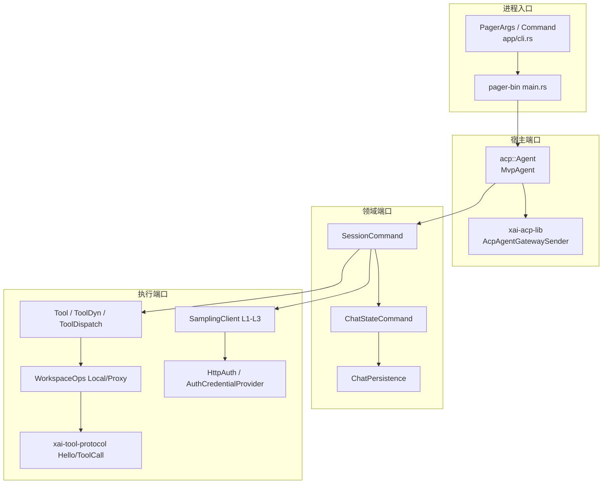
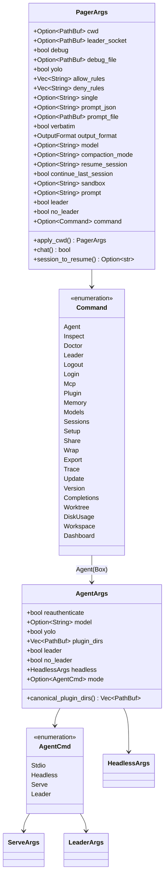
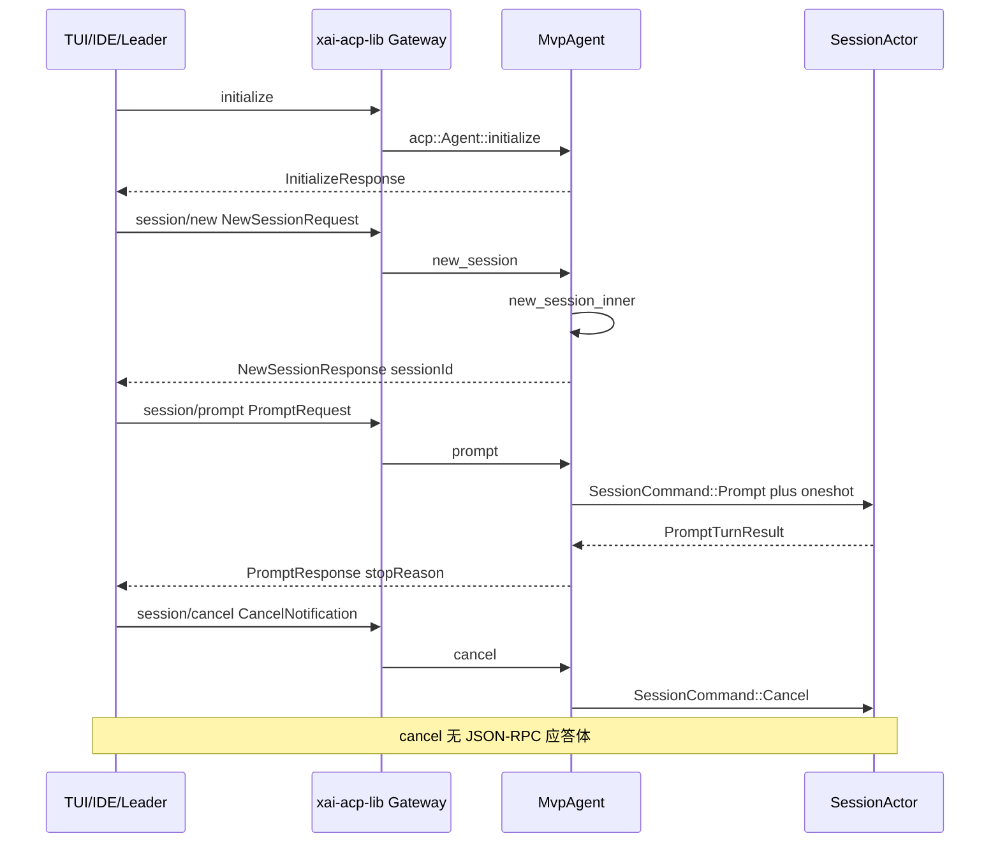
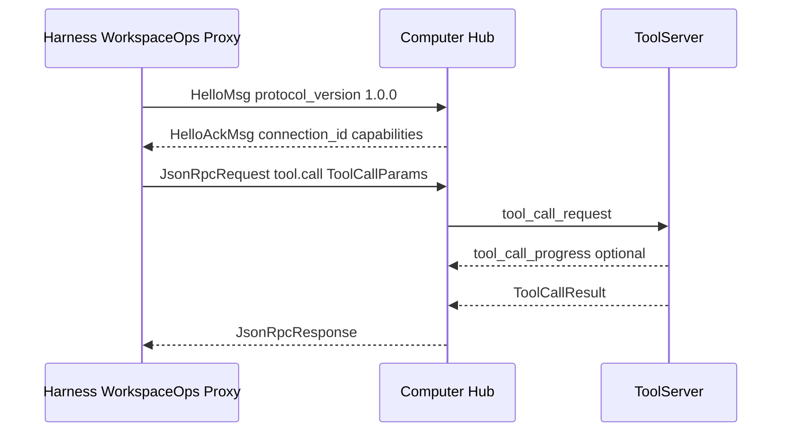
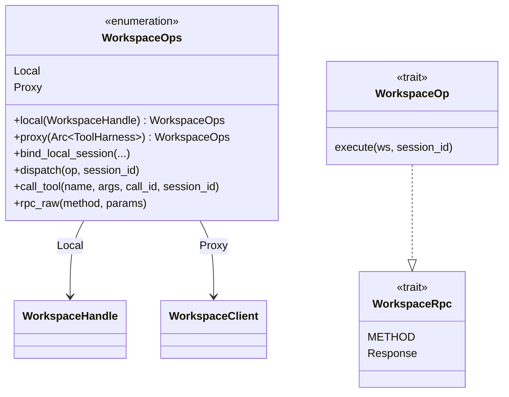
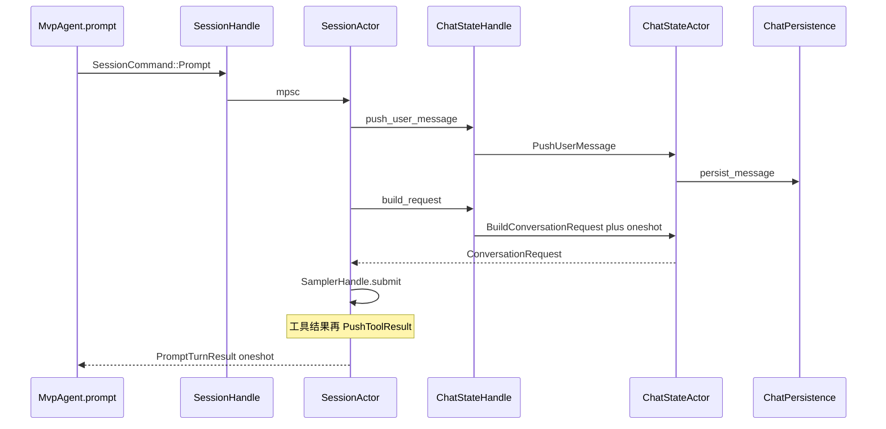

# 03 · API 与接口设计

> 读完本篇应能：列出 CLI、ACP、Tool、Hub、Workspace RPC、Sampler、Auth、Persistence 这些稳定端口，并说明每个接口的调用者、参数、返回和版本约束。上一篇：[02-核心模块与类关系.md](02-核心模块与类关系.md) · 下一篇：[04-配置与数据流.md](04-配置与数据流.md)

## 快速摘要

### 架构总览（模块与依赖）

Grok Build 对外暴露的不是一组 HTTP REST 路由，而是一组**可替换端口**：进程入口的 clap CLI、JSON-RPC 的 ACP、类型擦除后的 `Tool`/`ToolDispatch`、Computer Hub 的 JSON-RPC wire、Workspace 的 typed RPC、Sampler 的三层采样 API、认证的 `HttpAuth`、对话事实的 `ChatPersistence`，以及进程内 Actor 的 `SessionCommand` / `ChatStateCommand`。依赖方向固定为：Pager / 组合根依赖这些端口；端口 crate 不依赖 TUI 或具体工具实现。

### 核心调用序列（逐步逻辑）

1. `xai-grok-pager-bin` 的 `main()` 解析 `PagerArgs`，按 `Command` 分发。
2. TUI / headless / stdio 最终都落到 `MvpAgent` 实现的 `acp::Agent`。
3. `session/new` → `MvpAgent::new_session_inner` 创建 `SessionHandle`。
4. `session/prompt` → `MvpAgent::prompt` 发送 `SessionCommand::Prompt`（带 oneshot）。
5. `SessionActor::handle_prompt` 调 `ChatStateHandle::build_request`，得到 `ConversationRequest`。
6. `SamplerHandle::submit` 走 L3 Actor → L2 `stream_*` → L1 `SamplingClient` HTTP SSE。
7. `SamplingEvent` 被 `handle_sampling_event` 译成 ACP `session/update`；工具调用走 `ToolDyn::execute` / `WorkspaceOps::call_tool`。
8. 结果以 `ChatStateCommand::PushToolResult` / `PushAssistantResponse` 写回，并由 `ChatPersistence` 落盘。

### 易错点与边界条件

- CLI 的 `--always-approve` 与 ACP `_meta.yoloMode` 不是同一层：前者影响启动，后者是会话级。
- `session/cancel` 是 **notification**（无 JSON-RPC `id`），成功路径永远 `Ok(())`；会话不存在时静默忽略。
- Runtime 只调 `Tool::execute`，不调 `run`。Stream 必须恰好一个 `Terminal`。
- Hub `PROTOCOL_VERSION` 是 `"1.0.0"`；不兼容才 bump，additive 字段走 `HelloAckMsg.capabilities`。
- `SamplingEvent::ChannelToken` 不是规范助手消息；只有 `Completed` 才提交 `ConversationItem::Assistant`。
- `HttpAuth::apply` 的 bearer 必须与 `AuthCredentialProvider::snapshot().token` 一致，否则 401 归因会错。

---

## 目录

1. [Why：端口先于实现](#1-why端口先于实现)
2. [端口全景](#2-端口全景)
3. [CLI：`PagerArgs` / `Command` / `AgentArgs` / `AgentCmd`](#3-clipagerargs--command--agentargs--agentcmd)
4. [ACP：`session/new`、`session/prompt`、`session/cancel`](#4-acpsessionnewsessionpromptsessioncancel)
5. [Tool 端口：`Tool` / `ToolDyn` / `ToolDispatch`](#5-tool-端口tool--tooldyn--tooldispatch)
6. [Hub wire：`xai-tool-protocol`](#6-hub-wirexai-tool-protocol)
7. [Workspace RPC：`WorkspaceOps` / `WorkspaceRpc`](#7-workspace-rpcworkspaceops--workspacerpc)
8. [Sampler：三层 API 与 `SamplingEvent`](#8-sampler三层-api-与-samplingevent)
9. [Auth：`HttpAuth` / `AuthCredentialProvider`](#9-authhttpauth--authcredentialprovider)
10. [Persistence：`ChatPersistence`](#10-persistencechatpersistence)
11. [内部 Actor API：`SessionCommand` / `ChatStateCommand`](#11-内部-actor-apisessioncommand--chatstatecommand)
12. [版本与兼容约束总表](#12-版本与兼容约束总表)
13. [如何重新实现这些端口](#13-如何重新实现这些端口)
14. [本篇涉及的真实文件](#14-本篇涉及的真实文件)
15. [自检问题](#15-自检问题)

---

## 1. Why：端口先于实现

Grok Build 同时服务四类调用者：交互 TUI、CI headless（`-p`）、编辑器 ACP stdio、共享 Leader。如果把“读文件”“调模型”“写会话历史”直接焊进 `main.rs` 或 Ratatui 视图，每加一种宿主都要复制一套副作用。

所以工程把稳定契约抽成端口：

| 端口形态 | 解决的耦合 | 典型符号 |
|---|---|---|
| clap 结构体 | 用户意图 → 进程模式 | `PagerArgs`、`Command` |
| JSON-RPC 方法 | 宿主 UI ↔ Agent 进程 | `acp::Agent::{new_session,prompt,cancel}` |
| 泛型 trait + 类型擦除 | 内置工具 / MCP / Hub 远程工具共用调度 | `Tool`、`ToolDyn`、`ToolDispatch` |
| wire enum + 版本字符串 | 跨进程、跨语言、跨版本 | `PROTOCOL_VERSION`、`HelloMsg`、`Method::ToolCall` |
| typed RPC marker | Local 与 Proxy 共用同一请求结构 | `WorkspaceRpc`、`WorkspaceOps` |
| 分层客户端 | HTTP 细节不泄漏进 Session | `SamplingClient` / `stream_*` / `SamplerHandle` |
| 认证 seam | shell 凭据不进入 data-collector | `HttpAuth`、`AuthCredentialProvider` |
| 持久化 trait | Actor 单写者，测试可替换 | `ChatPersistence` |
| Actor 命令 enum | UI / ACP 不直接碰会话内存 | `SessionCommand`、`ChatStateCommand` |

**必须保持的行为契约**：调用者、被调者、参数、返回、错误、幂等、版本。**可以替换的技术实现**：clap 换成自己的解析器、ACP 换成别的 JSON-RPC 库、HTTP 换成别的 client——只要字段语义和对端协议不变。

---

## 2. 端口全景



跨 crate 边的形态不同，不要混用：

| 边 | 形态 | 同步语义 |
|---|---|---|
| CLI → `async_main` | 直接函数调用 | 同步解析，异步执行 |
| ACP JSON-RPC | stdio / in-process gateway | request 配 oneshot；notification 无应答 |
| `SessionHandle` → Actor | `mpsc::UnboundedSender<SessionCommand>` | 持续喂命令 |
| Prompt 完成 | Command 内嵌 `oneshot::Sender<PromptTurnResult>` | 只等这一轮 |
| Sampler 增量 | 共享 event channel 上的 `SamplingEvent` | 观察端口，不是提交屏障 |
| Hub | WebSocket + JSON-RPC 2.0 envelope | `id` 关联请求；`seq` 用于 notification 去重 |

---

## 3. CLI：`PagerArgs` / `Command` / `AgentArgs` / `AgentCmd`

### 3.1 Why

一个二进制要同时是 TUI、CI 工具、ACP 服务器、Leader 管理器和登录器。clap 的 `PagerArgs` 是**进程级意图**的唯一入口；`main.rs` 把它翻译成环境变量、沙箱 profile 和运行模式，领域层不再重新解析 argv。

### 3.2 What

文件：`crates/codegen/xai-grok-pager/src/app/cli.rs`。

`PagerArgs` 是 `#[derive(Parser)]` 的根，`name = "grok"`，版本来自 `env!("VERSION_WITH_COMMIT")`，`disable_version_flag = true`（自定义 `-v/--version`）。

`command: Option<Command>` 为子命令。`None` 且没有 `-p`/`--prompt-json`/`--prompt-file` 时走交互 TUI。



### 3.3 How：各命令谁调用、参数、返回、错误

| 调用方 | 关系 | 被调方 | 触发与输入 | 返回与后续 | 错误、状态与副作用 |
|---|---|---|---|---|---|
| `pager-bin/src/main.rs` `main` | 解析 | `PagerArgs::parse`（clap） | argv | `PagerArgs` | 非法 flag 由 clap 打印 usage 后退出 |
| `async_main` | 分发 | `Command` match | `args.command.take()` | 各子命令 `run` | 多数路径 `Result<()>`，失败 `eprintln` + exit 1 |
| `async_main` | 调用 | `PagerArgs::apply_cwd` | `--cwd` | `set_current_dir` 后的 `PagerArgs` | IO 错误包装为 anyhow |
| `async_main` | 设置 env | `GROK_COMPACTION_MODE` 等 | 见 [04](04-配置与数据流.md) | 后续 config 读取看到覆盖 | `unsafe { set_var }`，必须在读配置前 |
| TUI 默认路径 | 消费 | `PagerArgs.prompt` / `single` | 位置参数或 `-p` | 变成 ACP prompt | `-p`/`--prompt-json`/`--prompt-file` 互斥 |

`Command` 变体与运行模式：

| 变体 | 参数类型 | 被谁处理 | 成功返回 | 失败 |
|---|---|---|---|---|
| `Agent(Box<AgentArgs>)` | 见下 | `run_agent_command` | Agent 进程跑到退出 | 认证失败、stdio 断开 |
| `Inspect { json }` | bool | inspect 命令 | 打印发现的配置 | 读盘失败 |
| `Doctor(DoctorArgs)` | doctor 专用 | doctor_cmd | 终端能力报告 | 非零表示检查未通过（待确认具体码） |
| `Login { oauth, device_auth, .. }` | 互斥 flags | auth 流程 | 写入 `auth.json` | OAuth / device-code 失败 |
| `Logout` | 无 | 清凭据 | 删除缓存 token | 文件锁失败 |
| `Leader(LeaderMgmtArgs)` | `List/Info/Kill` | leader 管理 | 列表/详情/停止 | PID 找不到 |
| `Update { check, version, alpha, stable, enterprise }` | 通道互斥 | `xai-grok-update` | 安装或检查结果 | 下载失败 |
| `Completions { shell }` | `clap_complete::Shell` | `completions_cmd::run` | 写脚本到 stdout | 无 |
| `Workspace(WorkspaceMgmtArgs)` | hidden | Hub 暴露 | start/stop | 需 `GROK_WORKSPACE_COMMAND=1` 才启用本地测试 |

`AgentCmd` 是 `AgentArgs.mode`：

| 变体 | 含义 | stdin/stdout 所有权 |
|---|---|---|
| `Stdio` | ACP over stdio | stdout 被 JSON-RPC 占用；警告必须打 stderr（`canonical_plugin_dirs` 已遵守） |
| `Headless(HeadlessArgs)` | WebSocket relay | 无 TTY |
| `Serve(ServeArgs)` | 监听 `bind`，默认 `127.0.0.1:2419` | `GROK_AGENT_SECRET` 或随机 12 字符 |
| `Leader(LeaderArgs)` | 共享后端 | `no_exit_on_disconnect`、`relay_on_demand`、`no_auto_update` |

`AgentArgs` 与根 `PagerArgs` 都有 `--always-approve`/`--yolo`、`--model`、`--leader`/`--no-leader`。根上的 yolo 服务 TUI/headless `-p`；`grok agent --yolo` 走 `AgentArgs.yolo`。不要假设两处会自动同步——`async_main` 对 `Command::Agent` 还有额外检查：根上的 `--leader`/`--no-leader` 与 `agent` 子命令同时出现会报错。

`PagerArgs::chat()` 当前实现**恒返回 `false`**（注释写“没有 optional feature 时始终 false”）。`async_main` 里 `if args.chat() { set_var(GROK_CHAT_MODE_ENV, "1") }` 因此在当前树是死路径。重实现时不要把“chat 模式已接线”当成事实。

兼容别名（必须保留，否则脚本会断）：

- `--always-approve` = `--yolo` = `--dangerously-skip-permissions`
- `--allow` = `--allowedTools`（逗号分隔）
- `--deny` = `--disallowedTools`
- `--resume` 的 hidden 别名 `--load`
- `--system-prompt-override` = `--system-prompt`
- Login 的 `--oauth` alias `--oidc`；`--device-auth` 的 visible alias `--device-code`

幂等：CLI 解析本身无副作用。`apply_cwd`、env 写入、`apply_sandbox` 有副作用，且 `apply_sandbox` 在 Linux 上可能 `exec` 成 bwrap 子进程（见 04）。

---

## 4. ACP：`session/new`、`session/prompt`、`session/cancel`

### 4.1 Why

编辑器、TUI、Leader follower、headless 不能各自发明一套“发一句用户话”的 API。ACP（crate `agent_client_protocol`，源码里 `use agent_client_protocol as acp`）提供 JSON-RPC 方法名；本仓库的 `MvpAgent` 是唯一的 `acp::Agent` 实现。`xai-acp-lib` 把 stdio/in-process 通道做成 `AcpAgentGatewaySender`，让 Leader 和测试能在同一套消息类型上转发。

### 4.2 What：`xai-acp-lib`

crate：`crates/codegen/xai-acp-lib/`。公开表面在 `src/lib.rs`：

- `AcpAgentChannel` / `AcpClientChannel` / `acp_channels` / `acp_send`
- `AcpAgentGatewaySender`（shell 里别名为 `GatewaySender`）与 `AcpAgentGatewayReceiver`
- `AcpAgentMessage` / `AcpClientMessage` / `AcpArgs` / `AcpRequest` / `AcpMethod`

`AcpSide` 把方向钉死：Agent 侧入站是 `AcpAgentMessage`（`session/prompt` 等），出站是 `AcpClientMessage`（`session/update`、permission 反向请求）。Request 带 `oneshot::Sender<AcpResult<T::Response>>`；Notification 没有 `id`。

### 4.3 What：`MvpAgent` 实现的方法

文件：`crates/codegen/xai-grok-shell/src/agent/mvp_agent/acp_agent.rs`。



#### `initialize`

| 项 | 内容 |
|---|---|
| 调用者 | ACP 宿主在任何 session 之前恰好一次（注释写 SINGLE-CALL INVARIANT） |
| 被调者 | `MvpAgent::initialize(&self, acp::InitializeRequest)` |
| 参数 | `InitializeRequest`；本实现读 `_meta.clientType`、`clientIdentifier`、`mcpApps`、`bufferingSettings`、code-nav / interactive-trust 能力 |
| 返回 | `InitializeResponse`（含 model_state、auth methods、tool-overrides capability） |
| 错误 | `_meta` 解析失败可变成 `acp::Error` |
| 副作用 | 写 `self.auth_method_id`（唯一写者）、启动 subagent coordinator、磁盘刷新 `AuthManager`、spawn worktree GC / stale session cleanup |
| 兼容 | 重入时 `initialize_request.set` 失败只打日志“reconnect”，不覆盖已解析的 init |

#### `session/new` → `new_session` / `new_session_inner`

| 项 | 内容 |
|---|---|
| 调用者 | TUI 建会话、IDE `session/new`、Leader 转发 |
| 被调者 | `MvpAgent::new_session` → `session_setup.rs` 的 `new_session_inner` |
| 参数 | `acp::NewSessionRequest`：`cwd`、`mcpServers`、`_meta` |
| `_meta` 关键字段 | `sessionId`（必须是合法 UUID，否则 `invalid_params`）、`modelId`、`yoloMode`、`x.ai/local_workspace`、**禁止** `x.ai/cloud_server_id`（`reject_direct_hub_cloud_meta` 返回硬错误 `DIRECT_HUB_CLOUD_REMOVED_MSG`） |
| 返回 | `acp::NewSessionResponse`，含 `SessionId`（客户端给的 UUID 或 `Uuid::now_v7()`） |
| 前置 | **必须先 `initialize`**，否则 `invalid_params`: `"initialize must be called before new_session"` |
| 副作用 | `resolve_workspace`、spawn `SessionActor`、注册到 `session_registry`、绑定 `WorkspaceOps::bind_local_session` |

测试证据：`crates/codegen/xai-grok-shell/tests/test_leader_stdio_integration.rs` 断言 Leader 只对 `session/new` 注入 `_meta`（`yoloMode`、`modelId`、`codeNavEnabled`），**不得**改 `session/prompt` / `session/load`。

#### `session/prompt` → `prompt`

| 项 | 内容 |
|---|---|
| 调用者 | Pager `Effect::SendPrompt` / `SendPromptBlocks` / `SendPromptNow`；headless `-p`；IDE |
| 被调者 | `MvpAgent::prompt(&self, mut acp::PromptRequest)` |
| 参数 | `session_id`、`prompt`（`Vec<acp::ContentBlock>`）、`_meta` |
| `_meta` | `promptId`（缺则 `Uuid::new_v4()`）、`mode` → `PromptMode`、`sendNow`、`verbatim`、`clientIdentifier`、`screenMode`、OTEL traceparent |
| 返回 | `acp::PromptResponse`（`StopReason`）；`_meta` 可带 usage / structured output（`PromptTurnOk`） |
| 错误 | 未知 session → `invalid_params` `"unknown session id"`；采样失败经 `map_sampling_err_to_acp` |
| 内部 | 取 `SessionHandle` → 填 `SessionCommand::Prompt`（含 `respond_to` oneshot、`persist_ack`、`parsed_prompt_tx`） |
| 特殊 | 模型 allowlist 为空或 load 时记下的模型仍不可用：发 `model_auto_switched` 通知并 **`Ok(PromptResponse::new(EndTurn))`**，不是 JSON-RPC error——调用者必须能区分“空转结束”和“真正完成” |
| 排队移除 | `PromptCompletionKind::RemovedFromQueue` 只解开仍 pending 的 `session/prompt` RPC，**不**广播 `prompt_complete`（否则会让别的客户端以为正在跑的 turn 结束了） |

`session/prompt` 在 turn 结束前会阻塞 RPC。增量文本不走这个 response，而走 `session/update` notification（`AgentMessageChunk` 等）。

#### `session/cancel` → `cancel`

| 项 | 内容 |
|---|---|
| 调用者 | Esc / Ctrl+C、Leader 转发、宿主 abort |
| 被调者 | `MvpAgent::cancel(&self, acp::CancelNotification)` |
| 参数 | `session_id`；`_meta.cancelTrigger`（`CancelTrigger::from_client`）、`cancelSubagents`（默认 **true**）、`rewindIfNoOutput` / 旧名 `rewindIfPristine` |
| 返回 | 永远 `Ok(())`。这是 notification：没有 JSON-RPC 错误通道给“会话不存在” |
| 内部 | 若找到 handle：`SessionCommand::Cancel(CancelOptions { user_initiated: true, .. })` |
| 语义 | 只停尚未发生的工作；已写入文件、已起的子进程、已发出的 HTTP **不撤销** |
| 兼容 | 客户端字符串永远不会映射成内部的 `SendNow`/`Shutdown`/`SessionClose`；未知字符串进 `CancelTrigger::Client` |

`CancelTrigger::from_client`：`"esc"` → `Esc`，`"ctrl_c"` → `CtrlC`，其它 → `Client(s)`。`is_stop_gesture` 为 `Esc|CtrlC|Client`，会武装 task-wake barrier。

### 4.4 ACP 其它方法（同一 `impl acp::Agent`）

重实现最小集是 new/prompt/cancel；完整宿主还需要：`load_session`、`list_sessions`、`resume_session`、`close_session`、`set_session_mode`、`set_session_model`、authenticate、ext methods（`x.ai/session/repair` 等）。它们同样经 `MvpAgent`，内部仍转 `SessionCommand`。

---

## 5. Tool 端口：`Tool` / `ToolDyn` / `ToolDispatch`

### 5.1 Why

内置 bash/read_file、MCP 服务器、Hub 远程工具必须被同一调度器调用。关联类型 `Args`/`Output` 给作者类型安全；运行时只能看到 JSON `Value`，所以需要 `ToolDyn` 擦除。`ToolDispatch` 是对象安全的“按 id 找工具”端口，Hub 与本地 registry 都实现它。

### 5.2 What：`Tool` 与 Stream 不变量

文件：`crates/common/xai-tool-runtime/src/tool.rs`。

```text
Tool::execute 是 runtime 唯一入口。
默认实现：await Tool::run → terminal_only(result)。
两者都不覆盖 → run 默认返回 ToolError::not_implemented。
Stream 形状：[Progress(_)* , Terminal(Result<T, ToolError>)] 恰好一个 Terminal，且必须在最后。
```

| 方法 | 输入 | 输出 | 谁调用 |
|---|---|---|---|
| `id()` | `&self` | `xai_tool_protocol::ToolId` | registry / dispatch |
| `description(&ListToolsContext)` | 每 turn 的 listing 上下文 | `xai_tool_types::ToolDescription` | 组 `ToolSpec` 给模型 |
| `capabilities()` | 无 | `ToolCapabilities` | 并发、scope、frame cap |
| `should_list(&ListToolsContext)` | 每 turn 的 listing 上下文 | `bool` | 从模型可见清单剔除 |
| `execute(ctx, args)` | `ToolCallContext` + `Self::Args` | `ToolStream<Self::Output>` | **唯一运行时入口** |
| `run(ctx, args)` | `ToolCallContext` + `Self::Args` | `Result<Self::Output, ToolError>` | 仅被默认 `execute` 包装 |

`ToolStreamItem`：`Progress(ToolProgress)` | `Terminal(Result<T, ToolError>)`。构造器：`terminal_only`、`with_progress`（progress 排干后再 await terminal）。

`ToolProgress`：`Text` / `Content { blocks: Vec<ContentBlock> }` / `Custom { subkind, payload }`。`ContentBlock`（runtime 侧）有 `Text` / `Image` / `Resource`，镜像协议 crate 的 `McpBlock`。

MCP 不变量：`TypedToolOutput.model_output` **永远非空**。`ToolOutput` 默认把 typed output 序列化成 JSON text block。

### 5.3 `ToolDyn` 与 blanket impl

`ToolDyn::execute(&self, ctx, args: Value) -> ToolStream<TypedToolOutput>`。blanket `impl<T: Tool> ToolDyn for T`：

1. `serde_json::from_value::<T::Args>(args)`，失败 → `ToolError::invalid_arguments` 的单 Terminal 流。
2. 调 `Tool::execute`。
3. Terminal `Ok(out)` 时 `serde_json::to_value`，再取 `out.model_output()`；空则 `extract_content_blocks(&value)`。序列化失败 → `ToolError::execution`。

别名：`ArcTool = Arc<dyn ToolDyn>`。同 `ToolId` 多实现走 `ToolFamily` + `ToolVariant::{Default, Variant(String)}`。

### 5.4 `ToolCallContext`

文件：`crates/common/xai-tool-runtime/src/context.rs`。

```text
ToolCallContext { call_id: ToolCallId, extensions: TypedExtensions }
```

`TypedExtensions` 按 `TypeId` 存 `Arc<dyn Any + Send + Sync>`。运行时祝福的扩展类型：

| 类型 | 用途 |
|---|---|
| `Cwd(PathBuf)` | 相对路径解析 |
| `BehaviorVersion(String)` | 未知值必须硬失败 |
| `TraceContext(String)` | 入站 W3C traceparent，不回写 |
| `SessionContext(String)` | 多会话 tool server 路由 |
| `Cancellation(CancellationToken)` | 协作取消；dispatcher 也可 drop future 硬取消 |
| `WorkspaceViewerContext` | 如 `stream_tool_progress`；缺省全 off |

`WorkspaceBindMetadata` 是 Hub `session.bind` 的 wire 形状：畸形字段 `ok_or_default` 丢掉、兄弟字段保留，保证混版本可解析。

### 5.5 `ToolDispatch`

文件：`crates/common/xai-tool-runtime/src/dispatch.rs`。

| 方法 | 契约 |
|---|---|
| `call(tool_id, args: Value, ctx) -> ToolStream<TypedToolOutput>` | 必须遵守 `[Progress*, Terminal]` |
| `call_terminal(...)` 默认实现 | 丢掉 Progress，返回第一个 Terminal；流结束仍无 Terminal → `ToolError::custom("stream_no_terminal", ...)` |

调用关系：

| 调用方 | 关系 | 被调方 | 输入 | 返回 | 错误 |
|---|---|---|---|---|---|
| `SessionActor::execute_tool_calls_batch` | 调用 | 具体 `ToolDyn::execute` 或 `WorkspaceOps::call_tool` | 完整 JSON args + `ToolCallId` | `ToolRunResult` / `TypedToolOutput` | `ToolError` → 变成 `ConversationItem::ToolResult` 文本，不拆 call id |
| Hub harness | 实现 | `ToolDispatch::call` | wire `ToolCallParams` | 流式 Progress + Terminal | `ToolErrorWire` |
| 测试 `trait_object_safety.rs` | 实现 | `EchoDispatch` 等 | 固定 Value | 验证对象安全与 stream 不变量 | 无 Terminal 时断言 custom 码 |

`ToolErrorKind`（`xai-tool-runtime/src/error.rs`）含 `NotImplemented`、`InvalidArguments`、`NotFound`、`PermissionDenied`、`Unauthorized`、`Timeout`、`Cancelled`、`RateLimited`、`UsagePoolExhausted` 等。`detail` 是给模型看的人话。wire 边界：`From<ToolError> for ToolErrorWire`。

---

## 6. Hub wire：`xai-tool-protocol`

### 6.1 Why

Workspace Server、Computer Hub、本地 harness 不共享地址空间。它们需要一份**无 runtime 依赖**的 schema crate：identifier newtype、握手、JSON-RPC envelope、方法名枚举、ToolCall 帧。`xai-tool-runtime` 可以依赖它；反过来不行。

### 6.2 `PROTOCOL_VERSION` 与 Hello

文件：`crates/common/xai-tool-protocol/src/handshake.rs`。

```text
pub const PROTOCOL_VERSION: &str = "1.0.0";
```

不兼容 schema 才 bump；小字段通过 capability 协商。

`HelloMsg`（升级成功后客户端第一帧）：

| 字段 | 含义 |
|---|---|
| `protocol_version` | 必须与常量对齐 |
| `kind` | `ConnectionKind::Harness` 或 `ToolServer` |
| `server_id` | 仅 ToolServer |
| `description` / `metadata` | 可选，进 `servers.list` |

握手**不带 session id**。会话之后用 `register_session` / `session.bind` 动态绑定。

`HelloAckMsg`：`connection_id`、`user_id`（hub 从升级凭据解析，客户端不要自己宣布）、`computer_hub_version`、`supported_protocol_versions`、`capabilities`（额外 JSON-RPC 方法字符串；旧 hub 缺该字段视为空）。

### 6.3 Envelope

文件：`src/envelope.rs`。JSON-RPC 2.0 + Grok 扩展：

| 类型 | 关键字段 | 不变量 |
|---|---|---|
| `JsonRpcRequest<P>` | `jsonrpc`、`id`、可选 `session_id`、`method`、`params` | `jsonrpc` 反序列化必须是 `"2.0"` |
| `JsonRpcNotification<P>` | 无 `id`；可选 `seq: FrameSeq` | 用于去重/丢包检测 |
| `JsonRpcResponse<R>` | `outcome: Result \| Error` | 恰好一个 `result` 或 `error` |
| `JsonRpcId` | String 或 Number | 本端发送用 string；Number 转入 `RequestId` 时 stringify |

注意：envelope 的 `JsonRpcId` ≠ `crate::RequestId`（内部 correlator newtype）。用 `JsonRpcId::from_request_id` / `as_request_id` 转换。

### 6.4 `tool.call`

`Method` 枚举（`src/methods.rs`）是方法名的唯一事实源。Harness→service 的调用是 `Method::ToolCall => "tool.call"`。

`ToolCallParams`（`src/frames.rs`）：

| 字段 | 类型 | 说明 |
|---|---|---|
| `tool_call_id` | `ToolCallId` | 闭合键，必须原样回到 result |
| `tool_id` | `ToolId` | 路由 |
| `arguments` | `serde_json::Value` | JSON 参数 |
| `deadline_ms` | `Option<u64>` | 可选截止 |
| `behavior_version` | `Option<String>` | 对应 runtime `BehaviorVersion` |
| `cwd` | `Option<String>` | 信息性 |
| `trace_context` | `Option<String>` | W3C traceparent |

成功体 `ToolCallResult`：`tool_call_id`、`output: ToolOutputWire`、本地工具才有的 `follow_ups`/`reminders`、可选 `chat_completion_output`（opaque `Value`，因为 protocol crate 不能依赖 runtime）。

`tool.cancel` 是糖：SDK 在发送前译成 `HookEvent::Cancel`，**没有**独立的 `ToolCancelParams` 帧。

旧 hub 拒识方法时消息前缀钉死为 `UNKNOWN_METHOD_MSG_PREFIX = "unknown method `"。新客户端应看 `hello_ack.capabilities`，不要靠嗅探这段字符串；前缀保留是因为旧二进制还在舰队里。



---

## 7. Workspace RPC：`WorkspaceOps` / `WorkspaceRpc`

### 7.1 Why

Agent 不能直接 `std::fs` / `Command`。所有宿主副作用收口到 Workspace 后，才能：本地 in-process 跑、或经 Hub 代理到远程 workspace server。两端必须用**同一请求结构体**，否则加字段会只改一侧。

### 7.2 `WorkspaceRpc` marker

文件：`crates/codegen/xai-grok-workspace-types/src/rpc/mod.rs`。

```rust
pub trait WorkspaceRpc: Serialize {
    const METHOD: &'static str;
    type Response: Serialize + DeserializeOwned + Send;
}
```

`WorkspaceOp`（`workspace_ops.rs`）在此之上加 `execute(&self, &WorkspaceHandle, Option<&str>) -> WorkspaceResult<Response>`，只用于 Local。

### 7.3 `WorkspaceOps` 双模



| 模式 | 构造 | 扩展 RPC | 工具调用 |
|---|---|---|---|
| `Local { handle }` | `WorkspaceOps::local(handle)` | `op.execute(handle, session_id)` | `session.toolset().call(...)`，必须先 `bind_local_session` |
| `Proxy { client }` | `proxy(harness)` / `proxy_with_connected` | `rpc(op)` → `rpc_raw(METHOD, json)` | `client.harness().call(tool_id, args, ctx)` 再 `consume_stream_terminal` |

`bind_local_session` 在 Proxy 是 no-op（服务端拥有 session）。`rpc_raw` 在 Local 返回 `WorkspaceError::HubError("rpc not available in local mode")`。

`call_tool` 错误：Local 缺 `session_id` → `missing_session`；未 bind → `session_not_found`；Proxy 断线 → `network_error` 并 `mark_disconnected`（`is_transport_fatal`）。

### 7.4 主要 req 类型（METHOD 常量）

types crate 按域拆分。调用方是 shell 的 git/hunk/worktree UI 与工具实现；被调方是 `WorkspaceOps::dispatch` 或便捷方法（`git_status`、`begin_prompt`、`put_files`…）。

| Req 类型 | `METHOD` | 典型用途 |
|---|---|---|
| `GitStatusReq` | `workspace.git_status` | 状态 |
| `GitStatusExtReq` | `workspace.git_status_ext` | 扩展状态 |
| `GitCommitReq` / `GitDiffReq` / `GitStageReq` | `workspace.git_commit` 等 | 写 git |
| `PutFilesReq` / `GetFilesReq` | `workspace.put_files` / `get_files` | 批量文件 |
| `BeginPromptReq` / `EndPromptReq` | `workspace.begin_prompt` / `end_prompt` | 按 prompt_index 圈定 hunk |
| `RewindToReq` | `workspace.rewind_to` | 文件状态回退 |
| `HunkActionReq` 及 file/turn/all | `workspace.hunk_*` | accept/reject |
| `CreateWorktreeRequest` 等 | `workspace.create_worktree` … | worktree 池 |
| `CodeGotoDefinitionReq` 等 | `workspace.code_*` | code-nav |
| `DiscoverSkillsReq` / `DiscoverAgentsMdReq` | `workspace.discover_skills` / `discover_agents_md` | 技能与 AGENTS.md |
| `WorkspaceInfoReq` | `workspace.info` | 根路径与能力 |
| `GetRewindPointsReq` | `workspace.get_rewind_points` | 实现放在 workspace crate（Response 引用内部 `RewindPoint`） |

返回：`WorkspaceResult<T> = Result<T, WorkspaceError>`。Proxy 路径先解 `RpcEnvelope`，再 `rpc_error_to_workspace`。序列化失败也变成 `HubError`。

版本：请求结构同时 `Serialize + Deserialize`，两端共用。新增字段应 `#[serde(default)]`，否则旧 peer 会反序列化失败。Workspace 不可用有专用 JSON-RPC 码：`WORKSPACE_UNAVAILABLE_JSONRPC_CODE`（protocol `error_codes.rs`）。

---

## 8. Sampler：三层 API 与 `SamplingEvent`

### 8.1 Why

Session Actor 不该知道 Chat Completions / Responses / Messages 三种 SSE 形状。`xai-grok-sampler` 的 crate 文档把 API 分成三层，让 Session 只认 `SamplerHandle` + `SamplingEvent`。

文件：`crates/codegen/xai-grok-sampler/src/lib.rs`。

| 层 | 符号 | 职责 |
|---|---|---|
| L1 | `client::SamplingClient` | 原始 HTTP 流：`conversation_stream` / `conversation_stream_responses` / `conversation_stream_messages` |
| L2 | `stream::{stream_chat_completions, stream_responses, stream_messages}` | 把 chunk 译成 `SamplingEvent` |
| L3 | `SamplerHandle` + `SamplerActor` | 并发请求、重试、取消、事件扇出 |

后端选择来自 `SamplerConfig.api_backend`，在 `actor/request_task.rs` 里挑 L1 方法再交给对应 L2。

### 8.2 L1 `SamplingClient`

| 方法 | 输入 | 返回 | 错误 |
|---|---|---|---|
| `conversation_stream` | `ConversationRequest` | `(BoxStream<ChatCompletionChunk>, Option<ResponseModelMetadata>)` | `SamplingError` |
| `conversation` | `ConversationRequest` | `ChatCompletionResponse` 非流式 | `SamplingError` |
| `conversation_stream_responses` | `ConversationRequest` | SSE `rs::ResponseStreamEvent` + metadata + 可选 `DoomLoopSignalCollector` | `SamplingError` |
| `conversation_stream_messages` | `ConversationRequest` | Anthropic Messages 流 | `SamplingError` |
| `conversation_collect` | `ConversationRequest` | 收集完整响应 | `SamplingError` |

内部：`apply_conversation_defaults`、把 `ConversationRequest` 转成各 API DTO、打 `x-grok-conv-id` 等头、可选 `bearer_resolver` / `header_injector` / 401 `attribution_callback`。User-Agent 产品名常量 `AGENT_PRODUCT = "grok-shell"`。

### 8.3 L3 `SamplerHandle`

文件：`handle.rs`。内部 `mpsc::UnboundedSender<SamplerCommand>`（`commands.rs`，`pub(crate)`）。

| 方法 | 阻塞？ | 作用 |
|---|---|---|
| `submit(request_id, ConversationRequest)` | 否 | 结果走 event channel |
| `submit_with_config` | 否 | 覆盖模型等 |
| `submit_and_collect` | 是（oneshot） | compaction / `/btw`；Drop 时 RAII cancel |
| `cancel(request_id)` | 否 | 未知 id 为 no-op |
| `update_config` | 否 | 模型切换、auth 刷新后 |
| `is_active` / `active_count` | 是 | 查询 |

`SamplerHandle::noop()` 丢弃命令，给测试占位。

### 8.4 `SamplingEvent`

文件：`events.rs`。Session 的 `handle_sampling_event` 是唯一生产翻译器。

| 变体 | 含义 | Session 侧后果 |
|---|---|---|
| `StreamStarted { timestamp_ms }` | HTTP 头读完 | `ChatStateCommand::RecordStreamStart` |
| `FirstToken` | 首 token | UI 事件 |
| `ChannelToken { channel, text, chunk_index }` | `SamplingChannel::Text\|Reasoning` | ACP `AgentMessageChunk` / thought chunk；**不**写入规范历史 |
| `ToolCallDelta { tool_index, id, name, arguments_delta }` | 参数碎片，**单独不必是合法 JSON** | 缓冲到完整 args |
| `ResponseStarted` | 仅 Messages L2：真实 message id / 缓存 token | 部分模式消费者 |
| `ReasoningCompleted { signature }` | Messages thinking 签名 | 在 content_block_stop 前发出 |
| `Completed { response, metrics }` | **提交屏障** | 把 `ConversationResponse` 变成 Assistant + tool calls |
| `Retrying { kind, attempt, max_retries }` | 重试中 | UI；doom-loop 带 trigger labels |
| `Failed { error: SamplingErrorInfo }` | 重试耗尽或不可重试 | `handle_sampling_failure`（压缩、友好错误） |
| `ModelMetadata` | 响应头模型元数据 | 上下文窗口等 |
| `BackendToolCallStarted/Completed` | **服务端**已执行的 hosted tool | 客户端不执行 |

`SamplingErrorKind`：**没有**独立的 context-window 变体。400 + metadata 由 Session 决定是否 compact。`SamplingErrorInfo` 可序列化；旧 peer 缺 `credential` 字段反序列化为 `SentCredential::Unknown`（收费重试预算的 fail-closed 行为）。`x-should-retry: false` 禁止重试。

调用链：

| 调用方 | 关系 | 被调方 | 输入 | 返回 | 错误 |
|---|---|---|---|---|---|
| `SessionActor` 回合循环 | 调用 | `SamplerHandle::submit` | `RequestId` + `ConversationRequest` | 无；等 event | 失败 event |
| `SamplerActor` request_task | 调用 | `SamplingClient::conversation_stream*` | 同一 request | 原始 SSE | `SamplingError` |
| request_task | 调用 | `stream_chat_completions` 等 | 原始流 | `SamplingEvent` 流 | 译成 `Failed` |
| event 订阅者 | 观察 | `handle_sampling_event` | 每个 event | ACP notification / ChatState 命令 | `Failed` 不在此做恢复 |

---

## 9. Auth：`HttpAuth` / `AuthCredentialProvider`

### 9.1 Why

`xai-file-utils` / data-collector 不能依赖 shell 的 `AuthManager` 类型。`xai-grok-auth` 是反向依赖缝：shell 实现 trait，HTTP 层只认端口。

### 9.2 `HttpAuth`

文件：`crates/codegen/xai-grok-auth/src/visibility.rs`。

```text
fn apply(&self, builder: reqwest::RequestBuilder, base_url: &str) -> RequestBuilder
```

生产实现：`xai-grok-shell::util::grok_auth_credentials::GrokAuthCredentials`。按 `base_url` 决定打 Bearer 还是其它头；deployment key 与用户 OAuth 的 `X-XAI-Token-Auth` 行为不同（见 `needs_token_auth_header`）。

### 9.3 `AuthCredentialProvider`

文件：`auth_provider.rs`。supertrait 含 `HttpAuth`。

| 方法 | 契约 |
|---|---|
| `snapshot() -> CredentialSnapshot` | 应先廉价磁盘 refresh；`token` **必须**等于 `apply` 会上线的 bearer |
| `refresh_after_unauthorized() -> bool` | `true` 表示拿到了不同 token，调用者应重试一次 |
| `needs_token_auth_header()` | 默认 `true`；deployment key 为 `false` |
| `has_usable_credential()` | 默认 `true` |

`CredentialSnapshot` 字段：`token`、`user_id`、`team_id`、`deployment_id`、`api_key_id`、`organization_id`。日志只用 `bearer_suffix`（`BEARER_SUFFIX_LEN`），禁止打完整 token。

`StaticAuthCredentialProvider`：测试与裸 `&str` token；`refresh_after_unauthorized` 恒 `false`。

Sampler 的 401 归因依赖 snapshot 与 wire 一致；不一致会把“根本没带票”和“票被拒”算错重试预算。

---

## 10. Persistence：`ChatPersistence`

### 10.1 Why

`ChatStateActor` 是对话事实的单写者。持久化必须由 Actor 独占 `Box<dyn ChatPersistence>`，方法用 `&mut self`，避免锁。测试用 channel mock，生产用再包一层 session 持久化 Actor。

### 10.2 Trait

文件：`crates/codegen/xai-chat-state/src/persistence.rs`。

| 方法 | 参数 | 返回 | 语义 |
|---|---|---|---|
| `persist_message` | `&ConversationItem` | `()` fire-and-forget | append `chat_history.jsonl` |
| `persist_working_directory_switch_and_ack` | `&ConversationItem` | `oneshot::Receiver<Result<StrictAppendAck, StrictAppendError>>` | generation-aware 目录切换，必须等 commit |
| `replace_history` | `&[ConversationItem]` | `()` | compaction / rewind 整文件替换 |
| `flush` | 无 | `()` | turn 结束刷盘 |

`StrictAppendAck`：`Appended` | `AlreadyPresent(ConversationItem)`。`StrictAppendError`：`NotCommitted` / `Committed { acknowledgement, source }` / `Indeterminate`——结果未知时按 generation 重试，不要再 append 一条。

实现：

| 类型 | 位置 | 行为 |
|---|---|---|
| `ChannelChatPersistence` | `xai-grok-shell/src/session/chat_persistence.rs` | `persist_message` → `PersistenceMsg::Chat`；cwd switch → `AppendCwdSwitchAndAck`；replace → `ReplaceChatHistory`；flush → `Flush`。channel 关闭时 cwd ack 为 `Indeterminate(BrokenPipe)` |
| `MockChatPersistence` | 同 persistence.rs | 把 `PersistenceRecord` 发给测试 |
| `NullChatPersistence` | 同文件 | 丢弃 |

调用方永远是 `ChatStateActor` 处理 `ChatStateCommand` 的突变臂；Session / UI 不得直接写 jsonl。

---

## 11. 内部 Actor API：`SessionCommand` / `ChatStateCommand`

这两份 enum **不是**跨进程协议，但是重实现时的内部 API：所有 UI/ACP 副作用都必须变成其中一条命令。通道：`mpsc` 传命令；需要应答时命令里带 `oneshot::Sender`。

### 11.1 `SessionCommand`

文件：`crates/codegen/xai-grok-shell/src/session/commands.rs`。调用方：`MvpAgent`、Leader、少数 pager ext。被调方：`SessionActor` 单 task。

关键变体：

| 变体 | 参数要点 | 返回 | 错误 |
|---|---|---|---|
| `Initialize { system_prompt }` | 会话启动 | 无 | 无 |
| `ReplaceSystemPrompt { system_prompt }` | attach 时只换头一条 System | 内部转 `ChatStateCommand::ReplaceSystemHead` | 无 |
| `Prompt { prompt_id, prompt_blocks, prompt_mode, verbatim, send_now, json_schema, respond_to, persist_ack, parsed_prompt_tx, ... }` | ACP ContentBlock 列表 | `PromptTurnResult = Result<PromptTurnOk, acp::Error>` | 采样/权限/取消映射到 `PromptCompletionKind` 或 `acp::Error` |
| `Cancel(CancelOptions)` | 见 §4 | 无 oneshot；正在跑的 Prompt 的 oneshot 会以 `Cancelled` 完成 | 取消不回滚磁盘 |
| `SetSessionModel { sampling_config, ... }` | 模型切换 | `Result<acp::ModelId, acp::Error>` | 未知模型 |
| `RebuildAgentForDefinition` | turn_count==0 且 agent_type 变 | `Result<(), acp::Error>` | 重建失败 |
| `CompactSession` | 用户或自动压缩 | `acp::Result<()>` | 压缩失败 |
| `Rewind { request, respond_to }` | 回退到 prompt_index | `anyhow::Result<RewindResponse>` | 文件/历史不一致 |
| `RepairHistory { dry_run, respond_to }` | 修 dangling tool calls | 报告；turn 进行中拒绝 | `RepairHistoryBlocked` |
| `SetYoloMode` / `SetAutoMode` / `ResetPermissionState` | 权限模式 | 无 | 与 managed pin 冲突时被夹紧（manager 侧） |
| `Shutdown(ShutdownKind)` | `Graceful` 或 `CancelRunningTurn` | 无 | Graceful 不杀正在跑的 turn |

`PromptTurnOk`：`stop_reason`、`total_tokens`、`completion_kind`、可选 `structured_output`、`usage`、`tool_overrides`。`PromptCompletionKind`：`Completed`、`StationarityEnded`、`Cancelled { category, context }`、`MaxTurnsReached`、`Rewound`、`RemovedFromQueue`。

### 11.2 `ChatStateCommand`

文件：`crates/codegen/xai-chat-state/src/commands.rs`。调用方：几乎只有 `SessionActor`（经 `ChatStateHandle` 方法，它们只是 `cmd_tx.send`）。被调方：`ChatStateActor`。

突变（多数 fire-and-forget）：`PushUserMessage`、`PushUserMessageAndAck`、`PushAssistantResponse`、`PushToolResult`、`ReplaceConversation { is_compaction }`、`Flush`、`IncrementPromptIndex`、`RecordTokenUsage`、`UpdateSamplingConfig`、`UpdateCredentials`、`RestoreSnapshot`、`BeginTurnCapture`…

查询（oneshot）：`BuildConversationRequest`（克隆对话、修剪旧 tool result、修 dangling、注入 memory reminder、组装 `ConversationRequest`）、`GetConversation`、`Snapshot`、`TruncateToPromptIndex`、`CheckAutoCompactNeeded`、以及一组避免全量 clone 的窄查询（`GetLastAssistantText`、`HasDanglingToolCalls`…）。

`BuildConversationRequest` 的返回是 `ConversationRequest`（`xai-grok-sampling-types`）：`items: Vec<ConversationItem>`、`tools: Vec<ToolSpec>`、`hosted_tools`、采样参数、`x_grok_*` 追踪头。这是进 Sampler 的领域 DTO，不是 ACP 的 `PromptRequest`。



---

## 12. 版本与兼容约束总表

| 接口 | 版本机制 | 向前兼容规则 | 打破时发生什么 |
|---|---|---|---|
| CLI | clap 别名 + hidden flags | 保留 `--yolo`/`--allowedTools`/`--load` | 用户脚本失败 |
| ACP | `agent_client_protocol` 方法名字符串 | `_meta` 新键必须缺省安全；Leader 只改 `session/new` | 旧客户端忽略未知 meta；未知方法 JSON-RPC error |
| Tool stream | 文档不变量，无数字版本 | 恰好一个 Terminal | UI/批次执行器乱序或挂起 |
| Hub | `PROTOCOL_VERSION = "1.0.0"` + `HelloAck.capabilities` | 新方法 advertised；未知方法前缀不可改 | 握手失败或旧客户端走 fallback |
| `WorkspaceBindMetadata` | 字段 `ok_or_default` | 畸形字段丢默认 | 整帧反序列化仍成功 |
| `SamplingErrorInfo` | serde default | 缺 `credential` → `Unknown` | 多扣一次重试预算，不崩 |
| Workspace RPC | 同一 struct + `#[serde(default)]` | 新旧 server/client 混跑 | 缺 default 则 `HubError` envelope parse |
| Auth snapshot | 无版本号，靠“wire 与 snapshot 同一 token” | 新字段 Option | 401 归因错 |

---

## 13. 如何重新实现这些端口

建议顺序（对应 [15-从零重实现路线图.md](15-从零重实现路线图.md) 的前几阶段）：

1. 一个 `PagerArgs` 子集：`Command::{Agent{Stdio}, Version}` + 默认 TUI 空壳。
2. `acp::Agent` 三方法：`new_session` 返回固定 UUID，`prompt` 固定 `"ok"`，`cancel` no-op。用 `xai-acp-lib` 或手写 newline JSON-RPC。
3. `SessionCommand::Prompt/Cancel` + oneshot；先不要 ChatState。
4. `ChatStateCommand` 的 push/build + `ChatPersistence` 写 jsonl。
5. `SamplingClient` 只接一个后端；L2 产出 `ChannelToken`/`Completed`/`Failed`。
6. `Tool` + `execute` 默认包装 `run`；`read_file`/`bash`；`WorkspaceOps::Local` only。
7. 最后才加 Hub Hello、Proxy、MCP。

验收：对每个端口都能回答本节表格里的“调用者、参数、返回、错误、兼容”。用 `cargo test -p xai-tool-runtime`、`cargo test -p xai-tool-protocol`、`cargo test -p xai-grok-sampler --lib`、`cargo test -p xai-chat-state` 锁不变量。

---

## 14. 本篇涉及的真实文件

| 路径 | 角色 |
|---|---|
| `crates/codegen/xai-grok-pager/src/app/cli.rs` | `PagerArgs`、`Command`、`AgentArgs`、`AgentCmd` |
| `crates/codegen/xai-grok-pager-bin/src/main.rs` | 解析 CLI、写 env、分发 `Command` |
| `crates/codegen/xai-acp-lib/src/lib.rs` | ACP 通道与 gateway |
| `crates/codegen/xai-acp-lib/src/gateway.rs` | `AcpAgentGatewaySender` |
| `crates/codegen/xai-acp-lib/src/message.rs` | `AcpSide`、`AcpRequest`、oneshot args |
| `crates/codegen/xai-grok-shell/src/agent/mvp_agent/mod.rs` | `MvpAgent`、拒绝 Direct hub meta |
| `crates/codegen/xai-grok-shell/src/agent/mvp_agent/acp_agent.rs` | `impl acp::Agent`：initialize/prompt/cancel |
| `crates/codegen/xai-grok-shell/src/agent/mvp_agent/session_setup.rs` | `new_session_inner` |
| `crates/codegen/xai-grok-shell/src/session/commands.rs` | `SessionCommand`、`PromptCompletionKind`、`CancelOptions` |
| `crates/codegen/xai-grok-shell/src/session/handle.rs` | `SessionHandle`、`SessionLiveState` |
| `crates/codegen/xai-grok-shell/src/session/acp_session_impl/turn.rs` | `handle_prompt` |
| `crates/codegen/xai-grok-shell/src/session/acp_session_impl/tool_calls.rs` | `execute_tool_calls_batch`、`handle_sampling_event` |
| `crates/codegen/xai-grok-shell/src/session/chat_persistence.rs` | `ChannelChatPersistence` |
| `crates/common/xai-tool-runtime/src/tool.rs` | `Tool`、`ToolDyn`、Stream 不变量 |
| `crates/common/xai-tool-runtime/src/context.rs` | `ToolCallContext`、`WorkspaceBindMetadata` |
| `crates/common/xai-tool-runtime/src/dispatch.rs` | `ToolDispatch` |
| `crates/common/xai-tool-runtime/src/error.rs` | `ToolError` / `ToolErrorKind` |
| `crates/common/xai-tool-protocol/src/lib.rs` | 协议 crate 出口 |
| `crates/common/xai-tool-protocol/src/handshake.rs` | `PROTOCOL_VERSION`、`HelloMsg`、`HelloAckMsg` |
| `crates/common/xai-tool-protocol/src/envelope.rs` | JSON-RPC envelope |
| `crates/common/xai-tool-protocol/src/methods.rs` | `Method` 枚举 |
| `crates/common/xai-tool-protocol/src/frames.rs` | `ToolCallParams`、`ToolCallResult` |
| `crates/codegen/xai-grok-workspace/src/workspace_ops.rs` | `WorkspaceOps`、`WorkspaceOp`、`call_tool` |
| `crates/codegen/xai-grok-workspace-types/src/rpc/mod.rs` | `WorkspaceRpc` |
| `crates/codegen/xai-grok-sampler/src/lib.rs` | 三层 API 说明 |
| `crates/codegen/xai-grok-sampler/src/client.rs` | `SamplingClient` |
| `crates/codegen/xai-grok-sampler/src/handle.rs` | `SamplerHandle` |
| `crates/codegen/xai-grok-sampler/src/events.rs` | `SamplingEvent` |
| `crates/codegen/xai-grok-sampler/src/commands.rs` | `SamplerCommand` |
| `crates/codegen/xai-grok-sampler/src/stream/mod.rs` | L2 transforms |
| `crates/codegen/xai-grok-auth/src/lib.rs` | crate 出口 |
| `crates/codegen/xai-grok-auth/src/visibility.rs` | `HttpAuth` |
| `crates/codegen/xai-grok-auth/src/auth_provider.rs` | `AuthCredentialProvider` |
| `crates/codegen/xai-chat-state/src/commands.rs` | `ChatStateCommand` |
| `crates/codegen/xai-chat-state/src/persistence.rs` | `ChatPersistence` |
| `crates/codegen/xai-chat-state/src/handle.rs` | `ChatStateHandle` |
| `crates/codegen/xai-grok-sampling-types/src/conversation.rs` | `ConversationItem`、`ConversationRequest` |
| `crates/codegen/xai-grok-shell/tests/test_leader_stdio_integration.rs` | ACP 转发与 `_meta` 注入契约 |

---

## 15. 自检问题

1. `Tool::run` 和 `Tool::execute` 谁是 runtime 真正调用的入口？默认实现怎样把前者包成流？
2. 为什么 `session/cancel` 在会话不存在时仍返回 `Ok(())`？
3. Leader 允许改写哪些 ACP 方法的 `_meta`？为什么不能改 `session/prompt`？
4. `SamplingEvent::ChannelToken` 能否直接 `PushAssistantResponse`？哪一个 event 才是提交屏障？
5. `WorkspaceOps::call_tool` 在 Local 未 `bind_local_session` 时返回什么错误码字符串？
6. `HelloAckMsg.capabilities` 缺省（旧 hub）时，客户端应如何决定能否发 `session_attach_server`？
7. `AuthCredentialProvider::snapshot().token` 与 `HttpAuth::apply` 不一致会破坏哪条遥测/重试语义？
8. `ChatPersistence::persist_working_directory_switch_and_ack` 得到 `StrictAppendError::Indeterminate` 时，正确动作是按 generation 对账还是再写一行 jsonl？
9. `PagerArgs` 的 `--yolo` 和 `AgentArgs` 的 `--yolo` 分别服务哪条启动路径？
10. `PromptCompletionKind::RemovedFromQueue` 为什么不能触发 `prompt_complete` 广播？

阅读源码建议顺序：`cli.rs` → `acp_agent.rs` 的 `prompt`/`cancel` → `commands.rs` 的 `SessionCommand::Prompt` → `tool.rs` → `handshake.rs` + `frames.rs` → `workspace_ops.rs` 的 `WorkspaceOps` enum → `sampler/src/lib.rs` 三层注释 → `events.rs` → `auth_provider.rs` → `ChatStateCommand`。

下一篇：[04-配置与数据流.md](04-配置与数据流.md)
