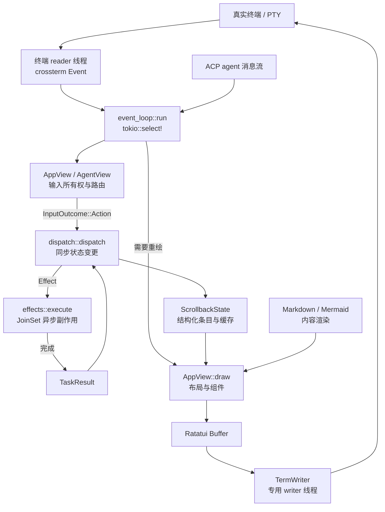
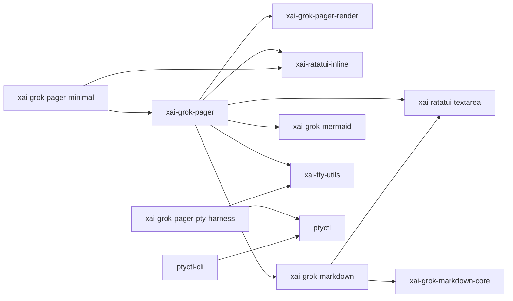
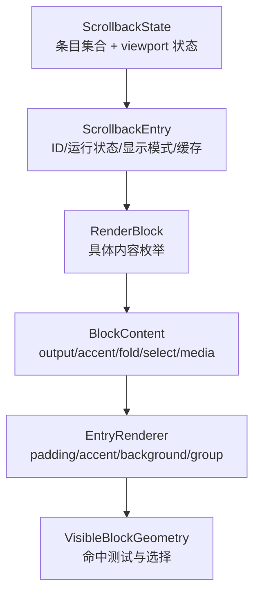
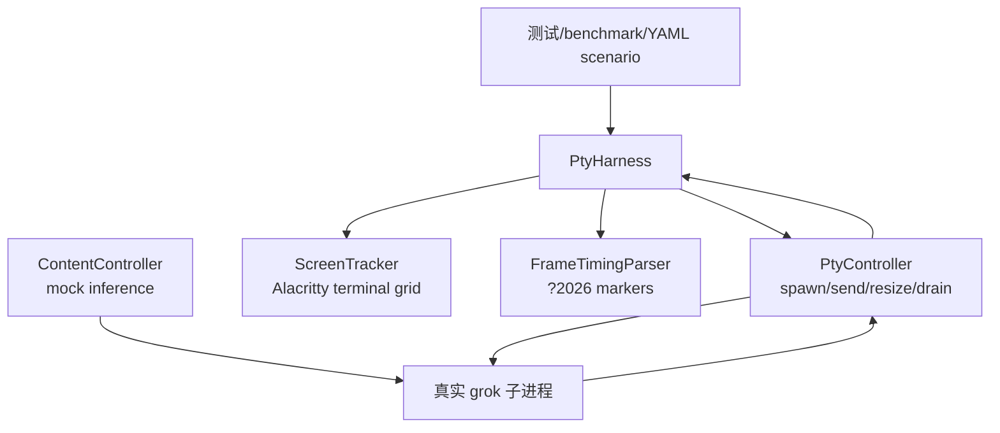

# Grok Build TUI 交互与渲染源码精读

> **全局调用位置**：`event_loop::run → AppView input handler → dispatch::dispatch → effects::execute → JoinSet<TaskResult> → Action::TaskComplete`。完整关系见 [源码符号关系总览第 5 节](12-源码符号关系总览.md#5-tui-的代码关系action--effect--taskresult)，Prompt 提交逐函数过程见 [关键调用链第 3 节](13-关键调用链逐函数精读.md#3-调用链二用户按-enter-到-acp-promptrequest)。

> 本文面向第一次阅读 Rust TUI 项目的开发者。目标不是只回答“用了 Ratatui”，而是解释一次输入如何穿过终端、事件循环、状态机、副作用执行器、布局与渲染器，最后变成用户看到的字符；同时说明异常、并发、PTY 测试和终端恢复如何保证这个过程可控。

## 1. 本文范围与阅读目标

本文精读以下 12 个 crate：

| crate | 本文关注点 |
|---|---|
| `xai-grok-pager` | TUI 应用状态、输入路由、事件循环、Action/Effect/TaskResult、scrollback、modal、页面和会话 UI |
| `xai-grok-pager-minimal` | 将完成内容提交到终端原生 scrollback 的 minimal 模式 |
| `xai-grok-pager-render` | 通用绘制、主题、终端能力、剪贴板、图片、滚动条与 writer 线程 |
| `xai-grok-pager-pty-harness` | 真实 PTY 端到端测试、屏幕仿真、场景和滚动矩阵 |
| `xai-ratatui-inline` | 支持 inline viewport、原生 scrollback 插入和差异刷新定制的 Ratatui Terminal |
| `xai-ratatui-textarea` | Unicode 安全的文本编辑、选择、撤销、鼠标和换行 |
| `xai-grok-markdown` | 流式 Markdown 解析、样式、表格、代码、LaTeX、链接和 Mermaid 文本渲染 |
| `xai-grok-markdown-core` | 与终端渲染解耦的 Markdown 语法分析 |
| `xai-grok-mermaid` | Mermaid 到 SVG/位图的受限渲染引擎与子进程隔离 |
| `ptyctl` | 可编程 PTY 会话、终端网格、按键注入、HTTP 控制和事件驱动等待 |
| `ptyctl-cli` | `ptyctl` 的命令行入口和命名会话注册表 |
| `xai-tty-utils` | TTY 脱离、进程组、父进程死亡联动、stderr 保存与恢复 |

本文重点覆盖这些 crate 的生产源码。`xai-grok-pager` 中与 TUI 无直接关系的业务命令也会在文件地图中标出边界，但不会展开其业务协议。测试源码用于解释生产行为，不逐行复述测试夹具。

读完后，应当能够：

- 说清 `Action`、`Effect`、`TaskResult` 各自解决什么问题。
- 从键盘、鼠标或粘贴事件追踪到状态变化和终端绘制。
- 理解 fullscreen、inline、minimal 三种屏幕模式的差异。
- 理解应用 scrollback 与终端原生 scrollback 为什么是两套不同状态。
- 解释 modal 为什么必须先做“输入所有权”仲裁。
- 解释流式 Markdown、Mermaid 图片和普通 Ratatui cell 如何组合。
- 用 PTY 测试验证真实终端行为，而不是只测试 Rust 函数返回值。
- 按本文最后的阶段重新实现一个兼容核心行为的 TUI。

## 2. 新手预备知识：TUI 到底在控制什么

### 2.1 终端不是画布，而是状态机

程序写到终端的并不是像素，而是普通字符和 ANSI/CSI/OSC 控制序列。例如：

- `CSI row;col H` 移动光标。
- SGR 序列修改前景色、背景色、粗体等样式。
- alternate screen 切换到独立屏幕缓冲区。
- bracketed paste 让程序区分“用户逐字输入”和“一次粘贴”。
- mouse reporting 让终端把鼠标动作编码后送给应用。
- synchronized update `?2026h`/`?2026l` 让一帧中的多次写入原子呈现。
- OSC 8 表达可点击超链接，OSC 52 可写系统剪贴板。

`crossterm` 负责跨平台地读写这些能力；`ratatui` 负责把组件绘制到二维 cell buffer，再计算前后帧差异；Grok Build 在此基础上增加了 inline viewport、异步 writer、终端探测和恢复逻辑。

### 2.2 raw mode 的意义

普通 shell 输入通常由内核行规程处理：用户输入一整行，按 Enter 后程序才收到。TUI 进入 raw mode 后可以立即收到单个按键，但同时承担更多责任：

- 自己处理 Enter、退格、方向键和 Ctrl 组合键。
- 自己决定是否回显字符。
- 自己保证退出、panic、信号和子进程切换后恢复终端。

因此，“恢复终端”不是美化工作，而是正确性要求。失败会导致 shell 没有回显、鼠标报告泄漏成文本、粘贴模式残留或光标不可见。

### 2.3 PTY 的意义

PTY，即伪终端，由 master/slave 两端组成。被测程序把 slave 当真实终端；测试程序控制 master，能够：

- 注入按键字节。
- 改变窗口大小并触发终端 resize 行为。
- 读取程序输出的所有 escape sequence。
- 用终端仿真器重建用户实际看到的 cell 网格。

这比把输出重定向到 pipe 更接近真实终端，因为很多程序会用 `isatty`、终端模式和窗口尺寸改变行为。

### 2.4 Ratatui 的基本模型

Ratatui 的典型绘制链路是：

```text
状态模型 -> Widget/Renderable -> Buffer<Cell> -> 前后帧 diff -> Backend -> 终端字节
```

Grok Build 仍遵循这个模型，但替换或扩展了两个关键位置：

- `xai-ratatui-inline::Terminal` 替代标准 `ratatui::Terminal`，支持 viewport、`insert_before` 和“本帧是否真的有 cell 变化”的返回值。
- `xai-grok-pager-render::render::draw::TermWriter` 不直接在 Tokio 事件循环中阻塞写终端，而是把帧交给专用 writer 线程。

## 3. 一页架构总览



这里最重要的依赖方向是：

```text
输入只表达意图
    ↓
dispatch 同步修改唯一 UI 状态
    ↓
Effect 才允许触发 IO/异步工作
    ↓
TaskResult 把结果重新送回 dispatch
```

这使渲染函数可以保持“从当前状态得到当前画面”，而不是在绘制过程中发网络请求或等待磁盘。

## 4. crate 依赖和职责边界

### 4.1 运行时依赖关系



`xai-grok-pager-minimal -> xai-grok-pager` 看起来反常：pager 为什么不直接依赖 minimal？源码在 `xai-grok-pager-minimal/src/lib.rs::install` 给出答案。minimal 深度读取 pager 的 `AppView`，若 pager 再反向依赖 minimal 会形成 Cargo 循环。工程使用 `xai_grok_pager::minimal_hook` 的函数指针 seam，由组合根二进制启动时安装 `draw`。这是依赖倒置，而不是动态插件系统。

### 4.2 主要三方框架

| 框架 | 用途 | 替换边界 |
|---|---|---|
| `ratatui` / `ratatui-core` | cell buffer、布局、样式、Widget 和 backend | 被 `Renderable`、视图模块和定制 `Terminal` 包裹，但替换成本高 |
| `crossterm` | 跨平台事件、raw mode、鼠标、粘贴、屏幕和光标控制 | 集中在 terminal/input 边界，可替换但要重做平台兼容 |
| `tokio` | 主事件循环、channel、`select!`、`JoinSet`、timer、signal | 应用调度模型依赖较深 |
| `agent-client-protocol` | TUI 与 agent 会话之间的协议对象 | 通过 `Effect` 和 ACP handler 隔离 |
| `pulldown-cmark` | CommonMark/GFM 事件解析 | `xai-grok-markdown-core::parser_options/offset_events` 是统一入口 |
| `syntect` / `two-face` | 代码语法和主题高亮 | `Syntect` 包装层可替换 |
| `unicode-segmentation` / `unicode-width` | grapheme 边界与终端列宽 | 编辑器、换行、选择的正确性基础，不应退化成字节/char 计数 |
| `portable-pty` | 创建跨平台 PTY | pager wrap 和测试 harness 的适配边界 |
| `alacritty_terminal` | 在测试中仿真真实终端网格 | 封装在 `ptyctl::term` 和 `ScreenTracker` |
| `vte` | 解析命令输出中的 ANSI 状态变化 | `render::terminal_output` 的 `Perform` 实现 |
| `axum` / `reqwest` | `ptyctl` 本地 HTTP 控制面 | 仅测试/自动化工具，不进入 pager 生产运行时 |
| `mermaid-to-svg`、`usvg`、`resvg`、`tiny-skia` | Mermaid 纯 Rust SVG 和栅格化 | `MermaidEngine` trait 隔离；也可使用外部 `mmdc` |

## 5. 生产文件地图

本节不是推荐阅读顺序，而是“遇到某个问题应去哪找”的索引。

### 5.1 `xai-grok-pager`

| 路径组 | 责任 | 关键符号 |
|---|---|---|
| `src/app/actions.rs` | 三段式执行协议 | `Action`、`Effect`、`TaskResult`、`CancelTrigger` |
| `src/app/event_loop.rs` | 主循环、输入排空、paste 合并、timer、公平性、任务回流 | `run`、`drain_and_process`、`coalesce_rapid_keys`、`process_effects` |
| `src/app/app_view.rs` | 顶层 UI 状态和 Welcome/Agent/Dashboard 路由 | `AppView`、`ActiveView`、`InputOutcome`、`handle_input_at_with_paste_provenance` |
| `src/app/dispatch/**` | 按领域拆分的同步 reducer | `dispatch_*`、`dispatch_task_result` |
| `src/app/effects/**` | 把 `Effect` 转成异步任务或立即动作 | `execute`、`EffectMeta` |
| `src/app/acp_handler/**` | ACP notification/update 到本地状态 | `handle` 及 queue、permission、settings、background 子处理器 |
| `src/app/agent_view/**` | 单个会话视图、输入、modal、prompt、queue、selection、render | `AgentView`、`handle_input`、`KeyOwner`、`handle_*` |
| `src/input/**` | 键位抽象、跨终端归一化、鼠标滚动分类、终端支持 | `KeyShortcut`、`KeyboardNormalizer`、`ScrollClassifier` |
| `src/scrollback/block.rs` | 所有消息块的共同内容契约 | `BlockContent`、`RenderBlock` |
| `src/scrollback/entry.rs` | 单条记录、运行状态、显示模式与缓存 | `ScrollbackEntry`、`EntryId` |
| `src/scrollback/state/**` | 条目集合、可见区、导航、follow、group、selection | `ScrollbackState`、`ScrollState` |
| `src/scrollback/blocks/**` | 用户、模型、思考、工具、系统、后台任务等具体块 | 各 `*Block` 的 `BlockContent` 实现 |
| `src/scrollback/render.rs`、`wrappers/**` | 从条目到可见 cell、sticky/header、缓存和几何 | `EntryRenderer`、`render_scrollback` |
| `src/scrollback/text_selection.rs`、`table_geometry.rs` | 可复制文本模型和表格形状选择 | `ResolvedSelectionModel`、`TableGeometry` |
| `src/views/**` | Welcome、Dashboard、Picker、Permission、Question、Settings 等组件 | 各 `render_*`、`*State`、输入处理方法 |
| `src/slash/**`、`src/actions/**` | slash command 注册与键位动作注册 | `ActionRegistry`、`ActionDef`、`SlashCommand` |
| `src/app/mod.rs` | 启动、屏幕模式、终端初始化与恢复 | `run`、`ScreenMode`、`init_terminal`、`restore_terminal` |
| `src/pty_wrap.rs`、`wrap_filter.rs`、`wrap_restore.rs` | `grok wrap` 的 PTY 透明转发与终端模式快照恢复 | `ModeSnapshot`、`restore_bytes` |
| `src/acp/**` | ACP 连接、跟踪器、模型状态和 leader bridge | `AcpConnection`、tracker handlers |
| `src/minimal/api.rs`、`minimal/hook.rs` | pager 与 minimal crate 的无环接口 | `MinimalHooks`、minimal state accessors |
| `src/diagnostics/**` | 终端能力和启动诊断 | `TerminalWarning`、probe/fix/view |
| 其余 `*_cmd.rs`、`headless/**`、`notifications/**` | CLI、headless、通知等邻接能力 | 与本专题主渲染链隔离，不应把业务逻辑放入绘制路径 |

### 5.2 其余 crate

| crate | 生产文件地图 |
|---|---|
| `xai-grok-pager-minimal` | `commit.rs` 决定 print-once frontier；`live.rs` 绘制固定 live 区；`overlay.rs` 调整 viewport；`full_view.rs` 生成 transcript；`panel.rs`/`plan.rs`/`todo.rs`/`welcome.rs`/`auth.rs` 绘制具体区域；`lib.rs` 编排一帧 |
| `xai-grok-pager-render` | `render/**` 通用 cell/ANSI/scrollbar/media 绘制；`terminal/**` 终端识别、键盘、图片、tmux、DA2/XTVERSION 探测；`theme/**` 主题和系统外观；`appearance/**` 配置；`clipboard/**` 剪贴板路由；`prompt_images.rs` 图片验证与临时文件；`host/**` 主机能力 |
| `xai-grok-pager-pty-harness` | `pty.rs` 控制子进程；`screen.rs` 屏幕网格；`timing.rs` 帧标记；`scripted.rs` YAML 场景解释器；`scroll_matrix/**` 滚动状态矩阵；`content.rs` mock 推理；`flows.rs` 通用驱动；`results.rs` 基准统计 |
| `xai-ratatui-inline` | `terminal.rs` 定制 Terminal；`scrollback.rs` 插入历史；`resize.rs` inline resize；`segment.rs` ANSI 感知分行；`common.rs` TerminalLike 与同步更新 |
| `xai-ratatui-textarea` | `editor.rs` 纯文本编辑内核；`editor_keys.rs` 键到命令；`textarea.rs` 元素、历史、选择、撤销、鼠标与 Widget；`wrapping.rs` 视觉行布局；`render/**` 辅助渲染 |
| `xai-grok-markdown` | `parse.rs` 事件到中间缓冲；`streaming.rs` 增量冻结；`render.rs` 终端/ratatui 输出；`buffers.rs` 变换和元数据；`output.rs` 输出视图；`syntax.rs` 高亮；`latex/**` 数学文本；`hyperlinks.rs`/`url_scan.rs` 链接；`mermaid.rs` 文本图 |
| `xai-grok-markdown-core` | 单文件提供统一 parser options、事件后处理、统计和结构问题检测 |
| `xai-grok-mermaid` | `engine.rs` trait/错误/限制；`pure.rs` 纯 Rust 引擎；`mmdc.rs` 外部 CLI；`raster.rs` SVG 到位图；`subprocess.rs` 超时与进程组清理；`lib.rs` 公共参数和默认引擎 |
| `ptyctl` | `pty.rs` 创建 PTY；`session.rs` 并发会话；`term.rs` Alacritty 网格；`server.rs` HTTP API；`keys.rs` Vim 键记法；`wait.rs` watch 驱动等待；`styled.rs` 样式 JSON/HTML |
| `ptyctl-cli` | `cli.rs` 参数；`commands/run.rs` 启动服务；`commands/client.rs` 控制客户端；`registry.rs` 原子写命名会话；`main.rs` 分派 |
| `xai-tty-utils` | `lib.rs` TTY/进程组/stderr；`process_scope.rs` 子进程所有权；`process_resources.rs` 资源回收；`runtime.rs` Tokio worker 上限 |

## 6. 启动：从命令行到第一帧

入口主线位于 `xai-grok-pager/src/app/mod.rs::run`。

```mermaid
sequenceDiagram
    participant Main as "app::run"
    participant Cfg as "配置/远端设置"
    participant Term as "终端初始化"
    participant ACP as "ACP 连接"
    participant Loop as "event_loop::run"
    participant Restore as "restore_terminal"

    Main->>Main: redirect_native_stderr
    Main->>Cfg: 加载配置、认证刷新、预取设置
    Main->>Main: 解析 leader / session / screen mode
    Main->>Term: spawn_writer_thread + init_terminal
    Main->>ACP: bounded_connect（必要时 leader 降级 embedded）
    alt 连接成功
        Main->>Loop: 交付 terminal、connection、配置和启动意图
        Loop-->>Main: RunResult 或错误
    else 连接失败/取消/超时
        Main->>Restore: 立即恢复终端
    end
    Main->>Restore: flush 日志、恢复终端、停止 writer
    Main->>Main: drop agent guard + kill process scope
```

### 6.1 屏幕模式

`ScreenMode` 在 `src/app/mod.rs` 定义：

| 模式 | 终端行为 | 历史归属 | 鼠标/选择 |
|---|---|---|---|
| `Fullscreen` | 使用 alternate screen，应用占满窗口 | 应用 `ScrollbackState` | 应用处理滚动和选择 |
| `Inline` | 在当前屏幕的一块 viewport 内运行 | 应用 `ScrollbackState` | 应用处理；退出后 shell 历史仍在 |
| `Minimal` | 小 live viewport，完成块通过 `insert_before` 打进原生历史 | 已提交历史归终端，未完成 tail 归应用 | 默认让终端原生滚动/选择 |

有效模式不是单一 CLI flag 决定，而是综合：

- CLI `--minimal`、`--fullscreen`、`--no-alt-screen`。
- 屏幕模式重启时写入的环境覆盖。
- `[ui].screen_mode` 和 appearance 配置。
- tmux control mode、终端能力与 mouse-report 泄漏判定。

`apply_screen_mode_globals` 集中设置 minimal 的全局渲染开关：关闭 inline 图片 overlay、使用 embedded modal、隐藏应用滚动条、锁定终端原生主题。这种集中式设置避免下层模块散落“猜测 minimal”的条件。

### 6.2 stderr 为什么要保存

`xai_tty_utils::redirect_native_stderr` 保存原生 stderr，并让 TUI 有稳定输出目标。`dup_tui_stderr` 可获得指向真实终端的副本，`restore_native_stderr` 在退出恢复。这样 tracing、子进程和 TUI 字节不会无序争用同一个描述符。

### 6.3 终端能力探测

`xai-grok-pager-render/src/terminal` 把探测拆开：

- `terminal_context()` 基于环境识别终端品牌、SSH、tmux/byobu。
- `xtversion.rs`、`da2.rs` 发送查询并解析回复。
- `tmux_probe.rs` 用有界子进程查询 tmux 能力，超时后清理进程组。
- `keyboard.rs` 描述不同终端/宿主能否可靠传递修饰键。
- `kitty_keyboard.rs` 记录是否成功推入 enhanced keyboard flags，以及是否报告 release。
- `image.rs` 选择 Kitty/iTerm2/无图片协议。
- `theme/osc11.rs` 查询终端背景色，`TermiosGuard::drop` 负责恢复临时 termios。

探测必须有超时并保守降级。终端不回复不是致命错误；错误地永久改变 termios 才是致命设计。

## 7. 核心执行协议：Action、Effect、TaskResult

三个枚举都定义于 `xai-grok-pager/src/app/actions.rs`。

### 7.1 `Action`：同步、无副作用的意图

`Action` 由输入、系统事件或异步结果产生，由 `dispatch::dispatch` 消费。典型类别：

| 类别 | 示例 |
|---|---|
| 生命周期 | `Quit`、`NewSession`、`ExitSession`、`RelaunchInScreenMode` |
| prompt | `SendPrompt`、`SendPromptNow`、`Interject`、`ClearPrompt` |
| 导航 | `FocusPrompt`、`ScrollUp`、`GotoBottom`、`ToggleFold` |
| modal | `OpenExtensionsModal`、`CancelTurnChoice`、`PlanApprovalAnswered` |
| 设置 | `CycleMode`、`SwitchModel`、`ToggleMouseCapture` |
| 异步回流 | `TaskComplete(TaskResult)` |

“无副作用”指 Action 本身不执行网络、文件或进程操作。dispatch 可以同步修改 `AppView`，并返回需要执行的 `Effect`。

### 7.2 `Effect`：可执行的副作用描述

`Effect` 是任务说明，不是任务结果。例如：

- `CreateSession`、`LoadSession`、`SendPrompt`、`CancelTurn` 调 ACP。
- `PersistSetting`、`PersistPreferredModel` 写配置。
- `OpenUrl`、`OpenExternalEditor` 调宿主能力。
- `DebounceSessionSearch`、`FetchRoster`、`RenderMermaid` 启动后台工作。
- `Quit` 是少数能让 `process_effects` 直接返回退出信号的控制 Effect。

`event_loop::process_effects` 遍历 Effect，调用 `effects::execute`。异步任务进入 `JoinSet<TaskResult>`；特殊 effect meta 会把 abort handle 安装回正确的认证尝试。

### 7.3 `TaskResult`：异步完成的事实

`TaskResult` 表达成功和失败两条路径，例如：

- `SessionCreated` / `SessionFailed`。
- `SessionLoaded` / `SessionLoadFailed`。
- `SwitchModelComplete`，其中错误使用类型化的 `SwitchModelError`。
- `SessionListLoaded` / `SessionListFailed`。
- Mermaid、剪贴板、持久化、搜索等操作的完成结果。

事件循环收到 `JoinSet::join_next()` 后执行：

```rust
dispatch::dispatch(Action::TaskComplete(result), &mut app)
```

因此，异步任务不能直接随意改 `AppView`。状态变更重新进入同一 reducer 边界，保持顺序和可测试性。

### 7.4 一次发送 prompt 的因果链

```mermaid
sequenceDiagram
    participant Key as "Enter/Paste"
    participant Input as "AgentView::handle_input"
    participant D as "dispatch"
    participant E as "effects::execute"
    participant Agent as "ACP agent"
    participant Loop as "event_loop"

    Key->>Input: crossterm::Event
    Input-->>D: InputOutcome::Action(SendPrompt)
    D->>D: 清空 composer、追加用户块、设置 running
    D-->>E: Effect::SendPrompt
    E->>Agent: session/prompt(prompt_id, blocks)
    Agent-->>Loop: session/update 流式通知
    Loop->>D: acp_handler 修改对应运行块
    Agent-->>E: PromptResponse
    E-->>Loop: TaskResult
    Loop->>D: Action::TaskComplete
    D->>D: 结束 turn、处理队列、更新显示模式
```

`prompt_id` 是关键关联标识。通知和最终响应都携带它，避免不同 prompt 的流式更新串到一起。

### 7.5 顺序、陈旧结果与恢复

源码大量使用 `seq`、`generation`、`session_binding_epoch` 和 `prompt_id`：

- session picker 搜索用递增 `seq` 丢弃过期结果。
- 卡片详情和渲染任务携带 generation，避免旧结果覆盖新视图。
- 剪贴板异步探测携带目标和 baseline，目标已变化则返回 `Dropped`。
- session 绑定 epoch 防止旧会话任务污染复用后的 AgentView。

这不是数据库事务，而是 UI 异步任务的 optimistic concurrency control。

## 8. 主事件循环

### 8.1 输入源

`event_loop::run` 的 `tokio::select!` 使用 `biased;`，主要 arm 的优先顺序是：

1. connection cancellation。
2. signal handler 的 graceful quit。
3. terminal writer ACK 或失败。
4. ACP 消息，但仅在输入队列为空时。
5. `JoinSet<TaskResult>` 完成。
6. 恢复进度等内部 channel。
7. 后台更新结果。
8. 终端输入。
9. resize、draw、scroll、animation 和业务 poll timer。
10. 配置 hot reload、主题/语音等较低优先级事件。

优先级不是“ACP 永远比输入重要”。源码特意用 `if input_rx.is_empty()` 约束 ACP arm：流式 token firehose 不能让键鼠在 channel 中饿死。反过来，输入 arm 会一次排空当前 backlog，下一轮 ACP 又可以继续。

### 8.2 ACP 批处理和绘制节流

收到一个 ACP 消息后，循环会用 `try_recv` 最多排空 `ACP_DRAIN_BATCH_MAX` 条立即就绪消息，并在有输入到达时提前停止。原因是流式模型可能每个 token 都产生通知；若每条通知画一帧，会出现：

- CPU 和终端写入放大。
- 键盘/滚轮延迟。
- terminal backpressure 反过来阻塞 Tokio runtime。

`presenter.request_throttled` 把流式绘制限制到最小帧间隔，而普通输入可请求立即绘制。

### 8.3 为什么 writer 需要 ACK

`xai-grok-pager-render/src/render/draw.rs` 定义：

- `TermWriter`：实现 `Write`，把帧积累成 `WriterPayload`。
- `WriterThread`：专门做可能阻塞的终端写入。
- `WriterEvent`：把完成 sequence 或错误送回事件循环。
- `WriterSync`：支持 drain/flush 协调。

事件循环通过 sequence ACK 知道哪一帧已经真正交给 OS。writer channel 断开或写失败会使主循环返回错误，避免 UI 继续在“没人看见”的状态中运行。

### 8.4 timer 不等于固定 60 FPS

循环按需启动 timer：

- `deferred_draw`：节流后的延迟绘制。
- `resize_debounce`：窗口拖动稳定后再重建布局。
- `scroll_tick`：滚轮残余量和 80ms stream gap。
- `animation_tick`：spinner、pending action TTL、丢失 cancel/turn-end 恢复。
- billing、gate、subscription、roster、recap poll：只在状态要求时重启。

没有动画、输入和消息时，应用可以休眠，而不是空转刷新。

### 8.5 输入批次处理

终端 reader 在线程中读取 `crossterm::Event`，经 channel 进入 `drain_and_process`。一个批次会：

- 排空当前可用事件。
- 过滤终端探测回复。
- 归一化键盘事件和平台差异。
- 合并破碎的 bracketed paste。
- 将高速多行 key burst 推断成 `Event::Paste`。
- 保留 Resize/Mouse/Focus 的相对顺序。
- 逐个交给 `AppView::handle_input_at_with_paste_provenance`。

返回的 `DrainResult` 区分 `needs_draw`、`should_quit`、`resize_only` 和 `force_repaint`。只发生 resize 时可 debounce；从外部编辑器或 multiplexer 回焦时可强制 clear + repaint 修复带外污染。

## 9. 输入路由与“谁拥有这个按键”

### 9.1 顶层路由

`AppView::handle_input_at_with_paste_provenance` 先按 `ActiveView` 路由：

- `Welcome` 交给 welcome 输入上下文。
- `Agent(id)` 交给对应 `AgentView`。
- `AgentDashboard` 先判断 attached session overlay，再交 dashboard。

之后才处理 global action、退出二次确认和未消费事件。`InputOutcome` 的语义如下：

| 结果 | 含义 |
|---|---|
| `Action(a)` | 交给 dispatch |
| `ActionThenForward(a)` | 先 dispatch，再把同一输入投递给新激活视图 |
| `ActionPair(a,b)` | 严格按顺序 dispatch 两个 Action |
| `Changed` | 状态已同步修改，只需重绘 |
| `ArmPending` | 建立“再按一次确认”的 pending action |
| `Unchanged` | 当前层未消费，允许更高层/global 继续判断 |

`ActionThenForward` 解决一个细节：welcome 上直接输入字符可能先创建 session，然后同一个字符还必须进入新 prompt，不能被创建动作吞掉。

### 9.2 AgentView 的优先级

`AgentView::handle_input_inner` 不是简单 match，而是层层抢占。概念顺序是：

```text
全屏 takeover / media / game
    ↓
modal stack、extensions、agents/persona
    ↓
line viewer / block viewer
    ↓
permission、plan approval、cancel、question 等 blocking card
    ↓
queue edit / inline edit / rewind / search / dropdown
    ↓
当前 pane（prompt、scrollback、todo）
    ↓
agent action
    ↓
global action
```

如果改变这个顺序，最常见的回归是 Esc 同时关闭两层、方向键移动了错误组件、modal 后面的 prompt 也收到字符。

### 9.3 `KeyOwner` 是输入与提示栏的共同事实源

`src/app/agent_view/key_owner.rs` 定义 `KeyOwner`：

- `LineViewer`
- `BlockViewer`
- `Card(Permission | CancelTurn | Question)`
- `PlanApproval`
- `Pane`

`AgentView::key_owner` 不仅给 router 使用，shortcuts bar 也用同样的所有权决定显示什么键位。这样 UI 不会提示“Esc 取消 turn”，实际却被 question card 吞掉。

`EscStep` 进一步把 Esc 设计成阶梯：先关闭文件搜索，再离开文本输入，再清选择，再 park 到 scrollback，最后才可能关闭外层。每次只退一层。

### 9.4 键盘标准化

`src/input/key.rs` 的 `KeyShortcut` 做精确 modifier 匹配；`key!` 宏减少样板。需要特别注意：

- Shift+Tab 可能是 `BackTab`、`BackTab+SHIFT` 或 `Tab+SHIFT`。
- Windows AltGr 常表现为 Ctrl+Alt，不能误判成快捷键。
- Kitty protocol 可区分 Press/Repeat/Release；普通终端通常只报告 Press。
- voice hold-to-talk 只有在 release 可靠时才能使用按住说话，否则降级为 toggle。
- `is_text_input_key` 只允许无 modifier、Shift 或有效 AltGr 的字符。

`keyboard_normalizer.rs` 修正终端/平台编码差异；`terminal/keyboard.rs` 则描述某个终端能力，而不是修改具体事件。

## 10. 粘贴：为什么比“插入字符串”复杂

### 10.1 三种来源

TUI 至少面对三类粘贴：

- 终端 bracketed paste，直接成为 `Event::Paste(text)`。
- 不支持或错误实现 bracketed paste 的终端，把内容拆成高速 `Key`。
- Ctrl/Cmd+V 触发宿主剪贴板探测，内容可能是文本、图片或文件 URL。

### 10.2 高速 key 合并

`event_loop::coalesce_rapid_keys` 在满足阈值且检测到 Enter 后仍有字符时，把连续 Char/Enter/Tab 合成 paste。这样多行代码中的第一个 Enter 不会误触发送。

`merge_paste_fragments` 处理 Windows Terminal 将大 paste 拆成 `Event::Paste + Key + Event::Paste` 的情况。Resize、Mouse、Focus 仍保序；破碎 paste 中的 Ctrl+C、Backspace 等非文本 key 被视为碎片噪声丢弃。

测试明确覆盖：

- `a + Enter + b` 合成 `"a\nb"`。
- bracketed fragment 与 key 混合仍得到完整字符串。
- Resize 把两个 paste 分成两个批次，不越界合并。
- Windows 路径 drag/drop 可按形状触发 fallback。

### 10.3 剪贴板探测不能阻塞事件循环

`AgentView` 的 paste 逻辑将读取图片、验证/解码和持久化放到 Effect/TaskResult 路径。关键状态包括：

- `paste_probe_in_flight`：仍有探测任务。
- `deferred_send`：用户在 paste 完成前按了发送，先延迟。
- baseline/target identity：完成时确认输入目标没有变化。
- `ClipboardPasteCompletion::{Handled, FullMiss, Dropped, Failed}`：明确区分没有内容、陈旧丢弃和真正失败。

这样 Ctrl+V 图片解码时 UI 仍可响应。PTY 测试 `paste_ctrl_v_image_keeps_ui_responsive_*` 和 `paste_ctrl_v_text_echoes_fast_*` 固化了这个要求。

### 10.4 TextArea 的 Unicode 安全

`xai-ratatui-textarea/src/editor.rs::EditBuffer` 用字节下标存光标，但所有外部下标都归一到 grapheme boundary。原因是一个用户可见字符可能由多个 Unicode scalar 组成，宽字符还可能占两个 terminal column。

`EditPlan` 携带：

- 被替换字节区间。
- replacement 和 removed text。
- 编辑后的 cursor 及 affinity。
- buffer identity 和 generation。

`apply_plan` 会拒绝 `StalePlan`、非法区间、原文不匹配和非法光标。这使异步补全或计划编辑不能盲目应用到已经变化的文本。

`TextArea` 在此纯编辑内核之上增加多元素、历史、undo/redo、viewport、选择、鼠标和 WidgetState。重实现时应先完成 `EditBuffer`，不要一开始就把编辑逻辑写进 Widget render。

## 11. 鼠标、滚轮和文本选择

### 11.1 鼠标事件不是统一可靠的

`src/input/mouse.rs` 和 `src/app/mouse.rs` 处理：

- click、double click、drag、release。
- wheel 与 trackpad burst。
- 某些终端错误分类或放大滚动量。
- scrollbar 抓取区和点击跳转。
- mouse capture 关闭后让终端原生选择接管。

滚动不是每个 wheel event 直接 `offset += N`。`ScrollClassifier`、scroll accumulator 和 `scroll_tick` 共同处理连续手势，避免一帧多个事件导致移动被绘制次数放大。

### 11.2 选择是几何模型，不是屏幕字符串切片

scrollback 每次渲染建立 `ResolvedSelectionModel`，记录：

- 哪些可见 block/line/range 可选择。
- 屏幕坐标到 entry、line、range、列的映射。
- 每个 entry 实际 content width。
- 被 quote bar、bullet、sticky header 等装饰占用的列。

drag 开始后保存 anchor 的 content width。即使该 block 随后滚出屏幕，释放鼠标时仍可按原换行宽度重建文本。表格选择还保存 `TableGeometry`，若流式更新导致几何变化，则安全降级到线性选择。

关键状态位于 `app/agent_view/selection.rs`：

- `pending_text_drag`：未超过阈值，不立即破坏 click 行为。
- `drag_selection`：已升级为文本拖选。
- `pending_block_drag` / `block_drag_selection`：块级选择。
- `deferred_text_press`：起点在空白 chrome，进入文本后才转成文本拖选。
- `drag_autoscroll`：指针越界时自动滚动。
- `persistent_text_selection`：复制成功后保留高亮。

`clear_stuck_scrollback_drag` 是恢复路径：Focus 丢失或 release 丢失时清除所有 latch，防止以后每次移动都被误认为仍在拖动。

### 11.3 测试表达的行为

PTY 测试将这些细节作为外部契约：

- quote block copy 排除装饰竖线。
- read tool header 只复制路径。
- drag 跨 gap 不冻结 anchor。
- drag 滚出整个屏幕后仍能复制完整内容。
- scrollbar 抓取区可用。
- wheel 流式期间仍滚动，不产生 ghost frame。
- overscroll 到底部后恢复 follow。

## 12. Scrollback：应用内历史模型

### 12.1 数据层次



`BlockContent` 在 `scrollback/block.rs` 是核心契约：

- `output(ctx)` 生成结构化 `BlockOutput`。
- `accent`、`bullet`、`background` 控制外观。
- `is_foldable`、`next_fold_mode`、`finished_display_mode` 控制折叠状态机。
- `is_selectable` 和 selection metadata 控制复制。
- `inline_media_placements`、`diagram_affordances` 描述 cell 之外的媒体 overlay。
- `estimate_extra_rows` 为离屏高度估算补偿 Mermaid 等动态行。

`RenderBlock` 枚举统一包住 UserPrompt、AgentMessage、ToolCall、Thinking、System、SessionEvent、BgTask、Subagent、Workflow 等。具体块只描述“内容是什么”，wrapper 负责一致的 chrome。

### 12.2 显示模式

`DisplayMode` 通常包括：

- `Collapsed`：只显示概要。
- `Truncated`：显示受限预览。
- `Expanded`：完整内容。

运行中的 execute block 即使 collapse 也可能保持 truncated，以保留流式输出反馈；thinking 在完成后可能根据 appearance 自动折叠。用户手工 fold 与自动 finished policy 需要明确优先级。

### 12.3 布局和缓存

scrollback 布局成本可能是 O(history)。源码通过 entry cache、宽度键、appearance 版本、离屏高度估算和可见范围缩小工作量。影响缓存有效性的输入包括：

- content width。
- display mode。
- block 内容/运行状态。
- appearance/theme。
- 是否需要选择元数据或 media rows。

不要只按 entry ID 缓存渲染结果；同一内容在不同宽度下会有不同换行、选择坐标和高度。

### 12.4 follow mode 与手工滚动

follow 表示 viewport 追随最新内容。用户向上滚动后离开 follow；回到底部或特定 overscroll 行为重新进入。流式内容增加高度时：

- follow 状态应继续显示尾部。
- 非 follow 状态应尽量保持用户当前锚点，而不是因为上方重排跳动。
- resize 需要重算高度，但测试要求保留语义位置。

`scrollback/state/nav.rs::handle_follow_mode`、滚动 offset/anchor 类型和 `state/layout.rs` 是阅读重点。

### 12.5 sticky 内容

sticky header 是视觉复制，不是新条目。它在顶部重复当前 block 的上下文，但选择/点击需要映射回真实条目。测试 `sticky_header_drag_copy_pty` 保证 sticky chrome 不污染复制文本。

## 13. Modal、Overlay 和布局

### 13.1 Modal 是状态，不是独立窗口

终端没有原生窗口层。modal 是在同一 Buffer 上后画的一组 cells，并通过状态控制输入拦截。相关层次：

- `views/modal.rs`：通用 modal 类型和内容。
- `views/modal_window.rs`：窗口几何、边框、embedded 模式。
- `xai-grok-pager-render/modal_window_state.rs`：共享窗口状态。
- `AgentView.active_modal`、permission/question/plan 等专用状态。
- `agent_view/modals.rs`：各 modal 的键鼠和 paste 路由。

正确顺序必须是：先决定最上层是谁，再让它处理输入；绘制则先背景后 modal。仅在 render 中覆盖背景、却让背景继续收按键，会产生“穿透”。

### 13.2 布局不是固定行数

典型 Agent 页面由以下区域竞争高度：

- scrollback 主区。
- todo/status/context 行。
- blocking card 或 plan/question 区。
- prompt composer。
- shortcuts/status bar。
- dropdown、toast、preview、media overlay。

布局先计算 `Rect`，render 再把 rect 同时写回 hit-test 状态。鼠标不能重新猜布局；必须使用本帧实际绘制出的 rect。

### 13.3 小屏幕策略

组件普遍对 `width == 0 || height == 0` 立即返回。Picker 和 Settings 测试还覆盖高度为 2、标题过长、说明溢出和 choices 超出。重实现时应定义降级顺序：先去说明和装饰，再缩短标签，最后保留最关键交互，不应在 `u16` 减法中下溢。

## 14. 一帧如何画出来

### 14.1 通用绘制

`xai-grok-pager-render/src/render/draw.rs::draw_frame` 负责：

- `terminal.autoresize()`。
- 调用上层 draw closure 填充 Buffer。
- 通过定制 Terminal flush 前后帧差异。
- 没有 cell diff 时跳过多余光标 escape，保留终端光标 blink timer。
- 处理 cursor show/hide/move。
- 完成 synchronized update。
- 把 frame payload 交给 writer thread。

`render/safe_buf.rs`、`line_utils.rs`、`wrapping.rs` 为边界安全、Unicode 宽度和换行提供共享工具。`render/terminal_output.rs` 用 VTE 解释命令输出中的 SGR、CR、erase 和 cursor 动作，再生成 Ratatui `Line`，不能简单 `strip_ansi`。

### 14.2 cell 外媒体

图片协议通常不是 Ratatui cell 内容，而是额外 escape sequence。流程是：

1. scrollback block 预留 rows。
2. 布局产生图片 placement 几何。
3. Buffer 中画占位/按钮。
4. draw 阶段根据终端协议发送 Kitty/iTerm2 图片命令。
5. 重绘、滚动或关闭时清除旧 placement。

`prompt_images.rs` 负责读取、格式识别、尺寸限制、临时文件和输入图片状态；`terminal/image.rs` 负责协议编码；`render/image_overlay/**` 负责几何与按钮。minimal 强制关闭这种 scrollback overlay，因为终端原生历史无法可靠追踪 app-managed image placement。

### 14.3 OSC 8 与链接

Markdown 和 tool 路径先生成语义 link target，`render/osc8.rs` 再将可见 spans 与 OSC 8 映射。点击时使用 `scrollback/link_map.rs` 将坐标解析成 `LinkTarget`，最后由 `Action::OpenLink`/`OpenUrl` 进入安全的 opener。URL 必须做 scheme 校验；不可让服务端文本直接形成任意 shell 命令。

## 15. Markdown 渲染

### 15.1 两层 crate 的原因

`xai-grok-markdown-core` 只依赖 `pulldown-cmark`，提供：

- `parser_options()`：GFM、表格、任务列表、数学和删除线的唯一配置。
- `offset_events()`：把单波浪线 `~x~` 降级为普通文本，只认 `~~x~~`。
- `analyze()`：统计结构并识别 malformed table、未闭合 fence。

`xai-grok-markdown` 在同一事件语义上增加终端样式、高亮、链接、表格布局、LaTeX 和 streaming。分析工具因此无需拖入 Ratatui/Syntect，也不会与真实渲染语法漂移。

### 15.2 渲染管线


`MarkdownBuffers` 不只保存字符串，还保存：

- `Highlight`、`Replace`、`Transform`。
- `LinkTarget` 和 code block metadata。
- table cell span/hyperlink。
- Mermaid replacement 和 render event。

这允许 parse 与具体输出格式分离，并保留 source offset 到最终可见文本的映射，供选择、链接和增量更新使用。

### 15.3 StreamingMarkdownRenderer

模型输出逐块到达。每次从头完整 parse 虽简单，但会频繁改变尚未闭合的 Markdown 结构，例如刚收到三个反引号时，后续文本可能仍属于代码块。

`streaming.rs::StreamingMarkdownRenderer` 使用 checkpoint/frozen state：

- 已确认稳定的前缀冻结，不重复高亮和布局。
- 未闭合尾部继续解析。
- trailing blank line 和 fence 状态决定何处可安全冻结。
- clone/debug 明确处理缓存，而不是共享可变 parser。

重实现的第一版可以全量重绘，但必须先保持正确；优化成 checkpoint 前需要用流式测试证明前缀不会被错误冻结。

### 15.4 LaTeX 与文本 Mermaid

`latex_delimiters.rs` 是流式状态机，把 `\(...\)`、`\[...\]` 等规范化，同时跳过 code fence。`latex/**` 将常见符号、上下标、分数、矩阵和 cases 转成 Unicode/多行文本，并设置深度与大小上限，畸形输入返回安全结果而不是 panic。

`xai-grok-markdown/src/mermaid.rs` 是终端字符图 renderer；它与 `xai-grok-mermaid` 的 SVG/位图引擎不是同一个实现。前者用于文本 fallback，后者用于高质量图片。

## 16. Mermaid 高质量渲染

`xai-grok-mermaid/src/engine.rs` 定义 `MermaidEngine: Send + Sync`、`RenderLimits` 和类型化 `MermaidError`。`render_checked` 在调用引擎前后执行：

- source 长度限制。
- panic 捕获并转换错误。
- 输出尺寸/像素预算检查。

实现有两类：

- `PureRustEngine`：`mermaid-to-svg` 生成 SVG，再由 `raster.rs` 使用 `usvg/resvg/tiny-skia` 栅格化，内置 Roboto 字体，必要时系统字体 fallback。
- `MmdcEngine`：将输入写到权限受限临时文件，调用外部 `mmdc`，由 `subprocess::run_with_timeout` 限时和回收进程组。

pager 的 `app/mermaid_worker.rs` 再包一层 UI worker：job 带 cache key、主题、尺寸与目标 entry；结果回来时检查 freshness。失败时显示源码/文本 fallback，不能卡住主渲染。

## 17. Minimal 模式：终端原生 scrollback

### 17.1 核心不变量

minimal 的完成块是 print-once：一旦写入终端原生历史，应用无法像 fullscreen 那样回头修改任意旧 cell。因此必须区分：

- committed prefix：已经打印，终端拥有。
- live tail：仍可能变化，应用在固定 viewport 中重绘。

`commit.rs::is_committable` 的主要规则：

- `is_pending_user_input` 永远不能提交。
- turn idle 时其余块视为稳定。
- turn running 时，已结束块可提交。
- 非最后一个 agent message 即使遗留 `is_running` 也可证明已经结束。
- running tool 可能更新，不能提交。
- BgTask started block 的内容不再变，running 只用于动画，可提交。

### 17.2 frontier 算法

`scan_frontier` 从 commit scan cursor 开始，只接受连续的 `Commit/Skip`，遇到第一个不可提交块就停止。`commit_leading_run` 是唯一修改 frontier 的实现。

terminal 写成功后才标记 committed。若 `insert_before` 失败，entry 保持未提交并在下一帧重试；否则 print-once 内容会永久消失。

### 17.3 一帧顺序

`xai-grok-pager-minimal/src/lib.rs::draw` 的顺序是设计的一部分：

1. Begin synchronized update，并提前 `autoresize`。
2. 同步 pending marks，推进 transcript 分片构建。
3. 提交 welcome/plan 等可提交内容。
4. 按 post-commit tail 高度调整 viewport。
5. `commit_active` 用 `insert_before` 提交完成块。
6. 处理 Ctrl+E 的 expanded reprint。
7. `draw_live` 绘制 tail、todo、status、overlay 和 prompt。

提前 autoresize 防止“块完成和 resize 同帧”时按旧宽度永久打印。提前调整 viewport 防止 commit 后 prompt 跳到屏幕顶端。同步更新包围整个流程，避免多块提交时肉眼看到多次滚动闪烁。

### 17.4 为什么不能使用 RIS 重放

`guard.rs` 是编译期源码扫描测试，禁止 minimal 引用：

- `resize_purge_rerender`
- `emit_to_scrollback`
- `resize_viewport_height`

这些 inline helper 假设应用持有完整 history；minimal 的 history 已由终端拥有，重放会重复或擦除。minimal resize 只能使用 Terminal 自带 `autoresize`/viewport API。

## 18. `xai-ratatui-inline` 的实现价值

### 18.1 定制 Terminal

`src/terminal.rs::Terminal<B>` 基于 Ratatui Terminal fork，增加：

- 显式 `viewport_area`。
- `insert_before` 在 viewport 前插入内容。
- `set_viewport_height` 和 autoresize。
- flush 返回是否有实际 diff。
- back buffer reset 和 inline 光标位置管理。

`TerminalLike` trait 让 scrollback/resize 算法可用 mock terminal 单测。

### 18.2 ANSI 感知分段

`segment.rs::split_into_line_segments` 按显示宽度分行，但 ANSI sequence 不占列宽，Unicode 宽字符和组合字符必须正确计数。它使用 `anstyle-parse` 状态机而不是正则删除 escape，因为分段后仍要保留样式序列。

### 18.3 `emit_to_scrollback`

算法位于 `scrollback.rs`：

1. 读取终端尺寸和旧 viewport。
2. 按终端宽度分段 content。
3. 从旧 viewport 顶部 clear downward。
4. 打印分段内容。
5. 打印与 viewport 高度相同的空行。
6. clear 新 viewport。
7. reset back buffer 并更新 viewport y。

### 18.4 resize 的核选项

`resize.rs::resize_purge_rerender` 会 ED2 + ED3 + Home，重放应用持有的完整 history，然后重建 viewport。注释明确说明这是为了绕过不同终端不可预测的 reflow。这个方案适用于“应用拥有 history”的 inline 模式，不适用于 minimal。

`with_synchronized_output` 在 begin/end 之间执行 closure；注释警告 closure panic 时调用方必须补发 end。因此 pager 顶层恢复仍需兜底清理同步更新模式。

## 19. PTY、测试 harness 与 `ptyctl`

### 19.1 harness 分层



`PtyHarness::update` 逐 chunk 同时喂给 ScreenTracker 和 FrameTimingParser，而不是先全部收完再解析，因此帧耗时保留真实 chunk 到达间隔。

真实终端会自动回答 cursor/device query。harness 默认不回答，避免探测测试失去控制；minimal 测试显式启用 `respond_to_queries`，否则 startup cursor query 超时可能把 minimal 降级。

### 19.2 等待条件

`PtyHarness::wait_until` 每 50ms pump 一次输出并检查语义条件；超时报告：

- child 是否仍运行。
- process tree。
- 当前屏幕。
- 必要时 raw output。

`wait_until_stable` 要求条件连续保持一段时间，避免“瞬间出现 idle 文本”造成假阳性。

### 19.3 `ptyctl` 会话模型

`ptyctl::session::PtySession` 组合：

- portable PTY master/child。
- 输入 writer。
- 输出 feeder task。
- `Arc<Mutex<Terminal>>` 仿真网格。
- generation `watch` channel。
- 有界 raw tail。
- timeout/linger 状态。

`wait.rs::WaitHandle` 克隆所需 handle 后释放外层 session mutex，再长轮询 Text/Regex/Gone/Stable 条件。若长 wait 一直拿住 session lock，send 和 screen API 会同时被阻塞。

generation 由每次 `term.feed()` 更新。waiter 在检查前 `borrow_and_update`，避免“更新刚好发生在检查与 changed 之间”的丢失唤醒。sender 消失意味着输出结束，可立即返回带 `ended=true` 的诊断。

### 19.4 HTTP 和 CLI

`ptyctl::server` 暴露控制和查询 API，`ptyctl-cli` 提供：

- `run`：启动命令和本地 server。
- `send`：发送 Vim 风格 key notation。
- `screen`：文本、styled JSON 或 HTML。
- `resize`、`cursor`、`status`、`stop`。
- `wait`：匹配返回 0，超时返回 1，用法/连接错误返回 2。

`registry.rs` 把命名 session 写入 state dir，采用临时文件 + rename 原子替换。`--force` 接管时，旧 server 退出不能删除新 server 的记录，所以 cleanup 前检查 port 仍等于自己。

### 19.5 测试类型

| 层级 | 主要验证 |
|---|---|
| 纯函数单测 | key normalization、编辑边界、布局计算、frontier、错误分类 |
| Buffer/render 单测 | 指定 Rect 生成哪些 cells、样式和 cursor |
| snapshot | diff、状态块等稳定文本表现 |
| scripted YAML | 输入步骤、屏幕断言、视觉 artifact |
| PTY E2E | raw mode、真实 escape、resize、鼠标、粘贴、signal、恢复 |
| scroll matrix | 终端/手势/模式组合的不变量和 JSONL flight recorder |
| benchmark | idle cost、streaming render、large codeblock、resize storm、paste latency |

## 20. 并发、背压和失败语义

### 20.1 并发所有权

| 状态/资源 | 所有者 | 并发策略 |
|---|---|---|
| `AppView` | 主 event loop | 单线程可变访问，不跨 task 共享 |
| async effects | Tokio `JoinSet` | 只返回 `TaskResult`，不直接改 UI |
| ACP updates | ACP channel | event loop 串行消费，批量排空 |
| terminal bytes | writer thread | frame channel + sequence ACK |
| terminal input | reader thread | channel 到 event loop，批量 drain |
| PTY test grid | `Arc<tokio::Mutex<Terminal>>` | feeder 更新，query/wait 短时持锁 |
| child processes | `ProcessScope` / `ProcessGroup` | 显式登记、取消和 drop 回收 |

### 20.2 背压

主要背压点和对策：

- ACP token 太快：有界批量 + draw throttle + 输入到达即中断 drain。
- PTY 写入阻塞：专用 writer thread，不阻塞 Tokio loop。
- resize storm：debounce。
- mouse wheel flood：手势累计和固定 scroll clock。
- Mermaid/图片/高亮昂贵：worker/`spawn_blocking`、cache、generation 丢弃陈旧结果。
- transcript 很长：minimal `pump_transcript` 每帧只做时间预算内切片。

### 20.3 失败分类

源码倾向把失败分成：

- 可显示业务失败：转成 error block、toast 或 modal。
- 陈旧结果：静默 `Dropped`，不是错误。
- 可降级能力：图片转文本、Mermaid 转源码、探测无回复使用保守默认。
- 任务 panic：记录错误，事件循环继续；关键 writer 停止则终止。
- terminal cleanup 失败：不覆盖原始 run error；若主流程成功则 warning。
- agent/leader 连接失败：leader 可降级 embedded；最终失败先恢复 terminal 再返回。

### 20.4 丢失响应恢复

animation tick 中有两个恢复器：

- `reconcile_overdue_cancels`：取消超过 grace 仍未确认时重发。
- `reconcile_overdue_turn_ends`：已收到 `prompt_complete` 广播，但最终 RPC response 丢失时完成 turn。

这表明“流式通知”和“RPC 完成”是两个信号，任何一个都可能先到或丢失。状态机不能只等其中一个而永久卡住。

## 21. 清理与终端恢复

### 21.1 正常退出顺序

`app::run` 在 event loop 返回后：

1. flush unified log。
2. `restore_terminal(terminal, writer_thread, screen_mode)`。
3. drop agent shutdown guard。
4. `global_process_scope().kill_all()`。
5. 根据 RunResult 打印 resume hint 或执行 screen-mode relaunch。

恢复通常需要撤销：

- mouse capture。
- bracketed paste。
- focus change reporting。
- Kitty keyboard enhancement flags。
- raw mode。
- alternate screen。
- cursor visibility、颜色和形状。
- synchronized update。
- stderr redirect。

### 21.2 panic 与 signal

signal handler 不在异步信号上下文里做复杂清理，而是通知主循环 graceful quit。顶层仍有 panic/终端清理兜底，因为某些错误发生在 event loop 建立前或 writer 已失效后。

`wrap_restore.rs::restore_bytes(ModeSnapshot)` 根据观察到的 child 模式生成精确恢复字节，而不是无条件 reset 所有模式。无条件 reset 可能破坏父 shell 原本就启用的模式。

### 21.3 子进程清理

`xai-tty-utils` 提供：

- `detach_from_tty`：后台子进程不抢控制终端。
- `new_process_group` / `ProcessGroup`：按组终止子孙树。
- parent-death 绑定：父进程消失时终止 child。
- `reap_killed_bounded`：发送终止后有界等待回收。
- `ProcessScope`：把多个已启动子进程登记到共同生命周期。

Mermaid `mmdc`、tmux probe、后台工具和 PTY child 都需要防止孤儿进程。只 kill 直接 child 不够，因为 shell/npm 可能再派生孙进程。

## 22. 从测试反推出来的核心行为契约

| 主题 | 测试所固定的行为 |
|---|---|
| 输入与 Esc | dropdown/modal 先于 cancel；idle 双 Esc 清 prompt 或开 rewind；running minimal Esc 取消 |
| Ctrl+C | 活动前取消可把 prompt 恢复 composer；不能重复 history；再次按可进入 quit 确认 |
| 粘贴 | bracketed paste 完整发送；立即 Enter 不截断；图片探测期间 UI 可响应 |
| queue | top queued row 先发送；remove 后绝不发送；server queue 以 rebroadcast 为事实源 |
| scroll | resize 保持位置；streaming 可滚；wheel burst 不按帧放大；到底部恢复 follow |
| selection | 装饰不进 clipboard；跨 gap/滚出屏幕仍可复制；stuck drag 可由 Esc 恢复 |
| minimal | 完成块只提交一次；resize 不重放；overlay grow 不破坏已提交历史；退出重置 paste mode |
| modal | settings 打开/关闭、locked row、picker 小尺寸、Esc 逐层回退 |
| terminal | child 被 kill、SIGTERM、正常退出都恢复模式和 exit code；wrap 保持字节透明 |
| render | ANSI execute 内容完整；流式 thinking 与 output 样式可区分；图片和 OSC8 路径正确 |
| process | pager 退出回收后台任务和子孙进程 |

测试名称本身是一套行为目录。建议从以下文件族按主题阅读：

- `xai-grok-pager/tests/pty_e2e/*paste*`。
- `xai-grok-pager/tests/pty_e2e/*scroll*`、`*wheel*`、`*drag*`。
- `xai-grok-pager/tests/pty_e2e/minimal/**`。
- `xai-grok-pager/tests/pty_e2e/wrap_*restore*`、`wrap_*exit*`。
- `xai-grok-pager-pty-harness/tests/**`。
- `xai-ratatui-textarea/src/editor_tests/**`。
- `xai-ratatui-inline/src/tests.rs` 和 `tests/segment_differential.rs`。
- `xai-grok-mermaid/tests/pure_engine.rs`。

## 23. 面向重实现的分阶段路线

下面的顺序刻意让每一步都有可运行产物。不要从完整 Grok Build 枚举复制开始。

### 阶段 1：最小终端守卫

实现：

- 进入 raw mode。
- 隐藏光标。
- 可选 alternate screen。
- RAII `TerminalGuard::drop` 恢复所有已启用模式。
- panic hook 和 Ctrl+C/SIGTERM 通知。

验收：程序正常退出、错误返回和 panic 后，shell 输入回显、光标、鼠标和粘贴均正常。

### 阶段 2：单线程状态与绘制

定义：

```rust
struct App {
    should_quit: bool,
    prompt: EditBuffer,
    messages: Vec<Message>,
}
```

只实现 `Event -> update(&mut App) -> draw(&App)`。先不引入 async agent。

验收：输入文字、Enter 追加消息、resize 后完整重画。

### 阶段 3：Action reducer

引入 `Action` 和 `InputOutcome`，让 Widget 不直接执行 IO。输入层只返回 `Action::Submit`、`Scroll`、`Quit`。

验收：对 reducer 做纯函数/状态单测；同一 Action 在键盘和鼠标入口产生一致行为。

### 阶段 4：Effect/TaskResult

加入 `Effect`、`TaskResult` 和 `JoinSet`。先模拟延迟 echo：Submit 产生 Effect，task 完成产生 TaskResult，重新 dispatch。

验收：任务完成顺序不同也不会写错消息；陈旧 generation 被丢弃。

### 阶段 5：按需 event loop

用 `tokio::select!` 组合 input、task、timer、shutdown。加入 `needs_draw`，无变化不画；resize debounce；动画仅在需要时启动。

验收：idle CPU 接近零；长任务期间键盘仍即时响应。

### 阶段 6：独立 writer

将 terminal bytes 交专用线程，加入 sequence ACK 和 writer failure channel。

验收：人为让 PTY master 暂停读取时，Tokio timer 和取消仍工作；writer 关闭后主循环报错退出。

### 阶段 7：Unicode TextArea

先实现 `EditBuffer`：grapheme 移动、删除、word movement、byte/display column 映射和 stale plan。再实现视觉换行、viewport、undo 和鼠标。

验收：emoji、组合音标、CJK、宽字符、CRLF、行首行尾删除均不破坏 UTF-8。

### 阶段 8：结构化 scrollback

定义 `BlockContent`、`RenderBlock`、`ScrollbackEntry` 和 `DisplayMode`。内容与 wrapper chrome 分离；缓存键至少包含 width、mode、content revision、appearance revision。

验收：折叠/展开、流式更新、resize 和离屏高度估算一致。

### 阶段 9：follow 与选择模型

加入 viewport anchor、follow state、scroll accumulator、selection geometry。复制必须从结构化 source/render metadata 重建，不从屏幕行硬切。

验收：装饰不进复制；滚动/resize 后选择正确；anchor 滚出屏幕后可完成复制。

### 阶段 10：Modal 输入所有权

定义单一 `KeyOwner` 或 modal stack，输入和 shortcuts bar 都读取它。Esc 每次只退一层。

验收：modal 后的 prompt 不收到字符；dropdown Esc 不误取消运行任务；提示键与真实行为一致。

### 阶段 11：Markdown streaming

先用统一 parser options 做全量渲染，再加入 source map、代码高亮和 checkpoint。表格和 fenced code 必须有 malformed/unterminated 测试。

验收：把同一文档按任意 chunk 边界输入，最终输出与一次性输入一致。

### 阶段 12：图片与 Mermaid worker

用 trait 隔离 renderer；设置 source、像素、时间和内存上限；所有 job 带 generation；失败保留源码 fallback。

验收：超时、panic、无 CLI、超大图、陈旧结果都不阻塞 UI，不留下子进程或临时文件。

### 阶段 13：inline/minimal

先实现 inline viewport，再单独实现 minimal committed frontier。不要复用 RIS history replay。terminal write 成功后才推进 committed 标记。

验收：同帧 resize + commit、连续多块 commit、overlay grow/shrink、退出恢复均不重复、不丢块、不跳 prompt。

### 阶段 14：PTY 自动化

构建 `spawn/send/resize/screen/wait`，使用真实终端仿真网格；等待采用 generation/watch，而不是固定 sleep。

验收：测试失败报告屏幕、cursor、modes、raw tail 和 process tree。

### 阶段 15：故障与恢复矩阵

至少注入：

- agent channel 关闭。
- task panic/abort。
- terminal writer 错误。
- resize storm 与 wheel flood。
- paste 分片和慢图片读取。
- SIGTERM、panic、child tree。
- Mermaid timeout。
- prompt complete 与 RPC response 只到一个。

验收：状态不会永久 running/cancelling；终端总能恢复；没有孤儿进程。

## 24. 重实现时必须保留的不变量

1. `AppView` 只由主事件循环同步修改。
2. async task 不持有 `&mut AppView`，只返回类型化结果。
3. 所有异步结果携带足以判断 freshness 的关联标识。
4. render 不做网络、磁盘、长时间锁或不可控子进程调用。
5. 输入所有权与 shortcuts 提示使用同一个事实源。
6. hit-test 使用实际 render 产生的 Rect/geometry。
7. Unicode 光标落在 grapheme boundary，显示列使用 Unicode width。
8. scrollback cache 必须以宽度和显示模式为键的一部分。
9. minimal 只有连续稳定前缀可提交，写成功后才标记 committed。
10. 终端能力探测有界、可取消、失败保守降级。
11. writer failure 是运行时错误，不可静默吞掉。
12. shutdown 清理不覆盖原始业务错误，但必须记录自身失败。
13. 子进程按进程组/作用域回收，不只 kill 直接 child。
14. PTY 测试等待语义状态，不依赖任意固定 sleep。

## 25. 推荐源码阅读顺序

第一次阅读不要从 12,000 行的 `AppView` 开始。建议按以下顺序：

1. `xai-grok-pager/src/app/actions.rs` 顶部注释和三个枚举。
2. `xai-grok-pager/src/app/event_loop.rs::run` 的 `tokio::select!` 与 `process_effects`。
3. `xai-grok-pager/src/app/app_view.rs::handle_input_at_with_paste_provenance`。
4. `xai-grok-pager/src/app/agent_view/key_owner.rs` 与 `input.rs::handle_input_inner`。
5. `xai-ratatui-textarea/src/editor.rs`，再看 `textarea.rs`。
6. `xai-grok-pager/src/scrollback/block.rs`、`entry.rs`、`state/mod.rs`。
7. `xai-grok-pager/src/scrollback/render.rs` 和 `wrappers/entry_renderer.rs`。
8. `xai-grok-pager-render/src/render/draw.rs` 与 `xai-ratatui-inline/src/terminal.rs`。
9. `xai-grok-markdown/src/lib.rs`、`parse.rs`、`streaming.rs`。
10. `xai-grok-pager-minimal/src/lib.rs`、`commit.rs`、`live.rs`、`overlay.rs`。
11. `xai-grok-pager-pty-harness/src/lib.rs` 与 `ptyctl/src/session.rs`、`wait.rs`。
12. 最后按感兴趣行为打开对应 PTY E2E 测试，再反查生产符号。

## 26. 常见误读与实现陷阱

### “Ratatui 会替我管理历史”

不会。Ratatui 只管理当前/上一帧 buffer。应用 scrollback、终端原生 scrollback 和 PTY 仿真 history 是三个不同概念。

### “收到 Resize 就调用 draw 即可”

fullscreen 通常可以，但 inline/minimal 需要处理终端已经先 reflow 的事实。minimal 同帧 commit 还必须先采用新宽度。

### “Esc 就是取消”

Esc 是分层 back 操作。当前最上层 dropdown、editor、selection、card、modal 都可能先拥有它。只有路由到 turn policy 后才是取消。

### “复制屏幕上的字符最准确”

屏幕包含 bullet、quote bar、sticky header、截断符和换行产物。正确复制必须使用结构化 selection metadata 和源内容。

### “spawn 后丢掉 Child 就行”

外部 CLI 可能产生 shell、node 和浏览器等孙进程。必须按进程组清理，并有 timeout/reap。

### “异步结果回来就应用”

用户可能已切 session、关闭 modal、修改 prompt 或改变宽度。没有 generation/epoch/baseline 的完成结果是不安全的。

## 27. 总结

Grok Build 的 TUI 可以理解为六个相互约束的层：

```text
终端与进程生命周期
        ↓
事件采集、归一化与公平调度
        ↓
Action / Effect / TaskResult 状态机
        ↓
AppView、AgentView、modal 与输入所有权
        ↓
结构化 scrollback、Markdown、布局与 Ratatui Buffer
        ↓
差异帧、异步 writer、PTY 观测与恢复
```

它最值得复用的不是某个具体 Widget，而是边界设计：状态只在一个地方修改，副作用类型化并回流，输入所有权可解释，渲染不阻塞，终端能力保守探测，print-once 历史有明确 frontier，真实 PTY 行为由端到端测试固定。按这些边界重实现，即使第一版功能较少，也能逐步扩展而不把终端、并发和 UI 状态缠成一团。
