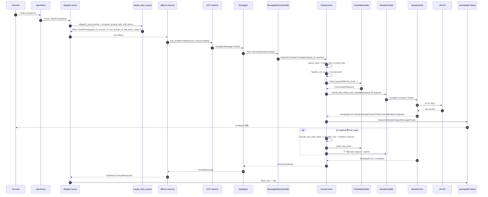

[上一篇：02-简单例子-全路径走读](02-简单例子-全路径走读.md) · [总目录](README.md) · [下一篇：04-核心模块与类关系](04-核心模块与类关系.md)

# 03：详细逐步说明-主链路拆解

> **场景**：把 `02` 走通的那条「TUI 输入 → 回答上屏（含一次工具调用）」主链，按调用顺序**逐跳拆解**：谁调用谁、参数如何传递、返回值如何消费、错误如何传播、状态如何变化。
> **工具版本**：Rust `1.94.0`（`rust-toolchain.toml:11`）/ `ratatui 0.29`（根 `Cargo.toml:234`）/ `tokio 1` full（根 `Cargo.toml:281`）/ `agent-client-protocol 0.10.4`（根 `Cargo.toml:118`）；workspace members = **102**（根 `Cargo.toml:8` 起）。
> **阅读说明**：本文是「逐步拆解」层。源码索引用「`文件路径 · 符号(+函数内偏移)`」，`+0` = 该函数/定义所在行；非函数写 `Struct：X` / `Enum：Y` / `Const：Z`。行号是 HEAD `2178c69c` 的快照，**随版本漂移，以当前源码为准**；带「（快照 L）」的只是方便跳转的辅助行号。工具调用/权限/沙箱分支在 `15` 展开得更细，这里只拆到能看清参数与错误传播为止。

---

## 本文件内容

1. [Why：为什么要在走通后再拆解](#1-why为什么要在走通后再拆解)
2. [拆解约定：每跳回答 6 件事](#2-拆解约定每跳回答-6-件事)
3. [逐跳拆解（H1–H14）](#3-逐跳拆解h1h14)
4. [提交屏障：Completed 才是完成](#4-提交屏障completed-才是完成)
5. [错误如何冒泡](#5-错误如何冒泡)
6. [跨 await / channel 的状态变化](#6-跨-await--channel-的状态变化)
7. [下一步](#7-下一步)

---

## 1. Why：为什么要在走通后再拆解

`02` 让你「知道这条路走得通」；`03` 让你「知道每一步为什么这么写、出错会停在哪」。只有逐跳确认参数与返回，重实现时才不会：

- 把 `prompt_id` 当成可随手生成的字符串（它必须**由客户端生成、经 `_meta.promptId` 传过去、再原样回传**，否则回程 delta 会被 prompt-id 网关丢掉）；
- 以为「敲回车就会发 `session/prompt`」（空闲时其实是**先本地入队、再由 drain 提升**，两步都可能在闸门处停下）；
- 把 `Effect` 当结果（它是意图；真正结果只能从 `TaskResult` 回来）；
- 把「收到最后一个 token」当完成（见 §4）；
- 以为沙箱在工具调用路径上（见 H12 第 9 点：它在**进程启动**时就已施加）。

---

## 2. 拆解约定：每跳回答 6 件事

每一跳都按此模板记录：

- **调用者 → 被调**：函数与源码索引（符号 + 偏移）。
- **入参**：传了什么（类型/字段）。
- **返回**：返回什么、谁消费。
- **错误**：`Result` 的 `Err` 怎么处理、会不会变成通知。
- **状态**：哪个 Actor / 哪块 UI 状态变化了。
- **边界**：同步还是异步？同进程还是跨 ACP channel？是否跨 `await`？

---

## 3. 逐跳拆解（H1–H14）

先给一张总览时序图（细节在下面逐跳展开）：



### H1 Terminal → AgentView：产出 `Action::SendPrompt`

- **调用者→被调**：`ReaderThread::spawn` 的循环（`crates/codegen/xai-grok-pager/src/app/reader_thread.rs · ReaderThread::spawn(+0)`，快照 45）→ `crossterm::event::poll/read` → `TimedInputEvent::now(ev)` → `tx.send(timed)`；事件循环 `crates/codegen/xai-grok-pager/src/app/event_loop.rs · run(+0)`（快照 1031）取出后交 `crates/codegen/xai-grok-pager/src/app/agent_view/prompt.rs · handle_prompt_key(+0)`（快照 91）。
- **入参**：`KeyEvent`（`KeyCode::Enter`，可能带 modifier）+ `ActionRegistry` + 可变 `AgentView`（`Struct：AgentView +0`，`app/agent_view/mod.rs` 快照 738）。
- **返回**：`InputOutcome::Action(Action::SendPrompt(text))`，或 `InputOutcome::Changed`（只改了输入框），或 `InputOutcome::None`。
- **错误**：无 `Result`。这是**故意**的：输入处理不可能「失败」，它只会产出「什么都不做」。
- **状态**：`agent.prompt`（textarea 内容）、`agent.prompt_input_mode`（Bash/Normal/Remember 复位为 `Normal`）、可能 `agent.image_viewer`。
- **边界**：同步；读键发生在 **OS 线程**（`std::thread::spawn`，不是 tokio task），语义化发生在 tokio 事件循环线程。
- **关键细节**：
  - 顺序敏感：Enter 先被 `try_element_interaction(key)` 抢（在 chip 上回车是「展开 paste/file 引用」而不是发送）；multiline 模式下 Enter 插换行。
  - 键位来自 `ActionDef { id: ActionId::SendPrompt, .. }`（`crates/codegen/xai-grok-pager/src/actions/defaults.rs`，快照 456）；`Enum：ActionId +0`（`crates/codegen/xai-grok-pager/src/actions/mod.rs` 快照 36，`SendPrompt` 项 `+2`）；`Struct：ActionDef +0`（同文件快照 198）。
  - 模式 → 变体：`PromptInputMode::send_action(text)`（`crates/codegen/xai-grok-pager/src/app/agent_view/mod.rs · send_action(+0)`，快照 389）决定产出 `Action::SendPrompt` / `SendBashCommand` / `SendPromptNow` 中的哪一个。`Enum：Action +0`（`crates/codegen/xai-grok-pager/src/app/actions.rs` 快照 36；`SendPrompt(String)` 在 `+102`）。

### H2 AppView → `dispatch`：同步纯函数

- **调用者→被调**：`dispatch(action, &mut app)` — `crates/codegen/xai-grok-pager/src/app/dispatch/router.rs · dispatch(+0)`（快照 156）。
- **入参**：`action: Action`、`app: &mut AppView`。
- **返回**：`Vec<Effect>`。
- **错误**：不返回 `Result`。`Effect` 是「意图」不是「结果」，分发本身不会失败；真正失败发生在 H4 之后，以 `TaskResult` 回来。
- **状态**：`app.dispatch_depth`（进出各 ±1，`+1` / `+3`）；只有最外层（depth 归零）才 `flush_image_notices(app)`（`+5`；`flush_image_notices(+0)` 快照 1615）。路由到 `dispatch_inner(+0)`（快照 165）后 `Action::SendPrompt(text) => dispatch_send_prompt(app, text)`（`+260`）。
- **边界**：**同步、不 `.await`**。这是「UI 可单测」的根本（见 `08`）：给定 `(Action, AppView)` 就能确定性地断言 `Vec<Effect>`。
- **递归注意**：slash 命令与任务结果会**在 dispatch 内部再调 `dispatch`**（例如 `router.rs` 的 `+99` 处 `effects.extend(dispatch(Action::SendPrompt(prompt), app))`）。`dispatch_depth` 就是为这种嵌套而存在。

### H3 入队 + drain：`Effect::SendPrompt` 的两个产出点

- **调用者→被调**：`dispatch_send_prompt(+0)`（`crates/codegen/xai-grok-pager/src/app/dispatch/prompt.rs`，快照 224）→ `dispatch_send_prompt_inner` → `dispatch_send_prompt_submission(+0)`（同文件，快照 617）。
- **入参**：`text: String`、`consume_input: bool`（Enter 提交为 `true`）、`literal: bool`（chip/follow-up 文本为 `true`，跳过 slash 解析）、`is_follow_up: bool`。
- **返回**：`Vec<Effect>`（可能为空 —— 被闸门拦下时就是空）。
- **错误**：不返回 `Result`。但**会被闸门静默拦下**，产出空 `Vec`：
  - `app.reconnect_pending` → `show_toast(RECONNECTING_NOTICE)` 后返回空；
  - `has_post_turn_review && build_in_flight` / `leave_plan_pending` → toast 后返回空；
  - `maybe_drain_queue` 的 8 道闸门（见下）。
- **状态**：
  - `agent.prompt.slash_controller.recognized_token_ranges(&text, &agent.session.models)` → `skill_token_ranges: Vec<Range<usize>>`（字节范围，供 `_meta.skillTokenRanges` 让 replay 重新上色）。
  - `consume_input` 时：`agent.prompt.stash().into_submission()` 取出 images/chips，`agent.prompt.set_text("")`，`agent.note_draft_consumed()`，`agent.record_prompt_in_history(&text)`（上箭头历史）。
  - `agent.clear_follow_ups()`、`agent.credit_limit_stashed_prompt = None`。
  - drain 成功后：`agent.begin_local_turn(&prompt_id)`、`agent.note_self_originated_prompt(&prompt_id)`、`agent.scrollback.push_block(RenderBlock::user_prompt(&text))`、`agent.session.in_flight_prompt = Some(InFlightPrompt { .. })`。
- **边界**：同步。
- **两条路（必须分清，这是最容易读错的一跳）**：

| 判据 | 路径 | `Effect::SendPrompt` 产出点 |
|---|---|---|
| `immediate_server_send_eligible(agent, leader_mode) == true` | 立即发送，先 `push_server_queue_echo` 画乐观队列行 | `dispatch/prompt.rs · dispatch_send_prompt_submission`（判断 `+512` / `+535`） |
| 否则（回合空闲时的常态） | `agent.session.enqueue_prompt_with_skill_tokens(text, ranges)`（`+616`）→ `maybe_drain_queue` | `dispatch/queue.rs · maybe_drain_queue +250` |

- `immediate_server_send_eligible(+0)`（`crates/codegen/xai-grok-pager/src/app/dispatch/queue.rs`，快照 39）的完整条件：

```text
(leader_mode || load_follow_up_steer() || wake_running)
  && server_busy               // state.is_turn_running() || running_wake_turn.is_some() || !shared_queue.is_empty()
  && session_id.is_some()
  && pending_prompts.is_empty()
  && prompt_mode != EditingQueued
  && !model_switch_pending
  && !loading_replay
```

- `maybe_drain_queue(+0)`（`crates/codegen/xai-grok-pager/src/app/dispatch/queue.rs`，快照 315）的闸门（任一命中即 `QueueDrain::blocked()`，日志 `prompt.drain_blocked`）：

| 闸门 | `reason` | 偏移 |
|---|---|---|
| `!state.is_idle()` | `turn_running` | `+17` |
| `running_wake_turn.is_some()` | `wake_turn_running` | `+23` |
| `model_switch_pending` | `model_switch_pending` | `+29` |
| `loading_replay` | `loading_replay` | `+33` |
| `hook_block_hold` | `hook_block_hold` | `+38` |
| `shared_queue` 含非当前 running 的行 | `server_queue_owns_next_turn` | `+46` |
| `session_id == None` | `no_session_id` | `+54` |
| 正在编辑队首行 | `user_editing_front` | `+60` |

- 通过后：`dequeue_prompt()`（或 `combine_queued_prompts` 开启时 `dequeue_combined_prompt(editing_id)`）→ `prompt_id = uuid::Uuid::new_v4().to_string()`（`+136`）→ 打 `prompt.drain` 日志 → 按 `QueueEntryKind` 分派：
  - `Prompt` + 普通纯文本 → `Effect::SendPrompt { agent_id, session_id, text, prompt_id, skill_token_ranges }`（`+250`）。
  - `Prompt` + `wire_blocks`（skill 注入）/ 带 images / combined → `Effect::SendPromptBlocks { agent_id, session_id, blocks, prompt_id }`（`+209` / `+230` / `+242`）。
  - `Command` → 视 token 产出 `Effect::MemoryFlush` / `Effect::MemoryDream` / `Effect::Compact` 等。
  - `BashCommand` → 走 `dispatch_send_bash_command` 的 `Effect::SendPromptBlocks`（带 bash `_meta`）。

### H4 effects 执行器 → `acp_send`（ACP 出程）

- **调用者→被调**：事件循环的 `process_effects(+0)`（`crates/codegen/xai-grok-pager/src/app/event_loop.rs`，快照 3942）逐个调 `effects::execute(effect, tasks, acp_tx, cwd, session_flags, progress_tx)`（`crates/codegen/xai-grok-pager/src/app/effects/mod.rs · execute(+0)`，快照 120）。
- **入参**：`effect: Effect`、`tasks: &mut JoinSet<TaskResult>`、`acp_tx: &AcpAgentTx`（即 `mpsc::UnboundedSender<AcpAgentMessage>`，`crates/codegen/xai-acp-lib/src/common.rs · Type：AcpAgentTx +0`，快照 15）、`cwd`、`session_flags: &SessionFlags`、`progress_tx`。
- **返回**：`(bool, EffectMeta)` —— `bool` 是「是否要退出主循环」（`Effect::Quit` 返回 `true`）；`EffectMeta` 携带需要装回 `AppView` 的 `AbortHandle`（auth / auth-url-poll）。
- **错误**：`execute` 本身不返回 `Result`。所有失败都被**降级为 `TaskResult`** 回到 `dispatch`：`Effect::SendPrompt` 分支把 `acp_send` 的 `Err(acp::Error)` 经 `format_acp_error(&e, is_api_key_auth)` 变成用户可读字符串，塞进 `TaskResult::PromptResponse { result: Err(String), .. }`。
- **状态**：`tasks` 新增一个 `JoinSet` 成员；`ulog` 记 `prompt.acp_send.start` / `prompt.acp_send.done`。
- **边界**：`execute` **同步**；真正的 I/O 在它 `tasks.spawn(async move { .. })` 出来的任务里（异步、跨 ACP channel）。
- **`Effect::SendPrompt` 分支的完整流程**（`+1123`）：
  1. 克隆 `acp_tx`、读 `session_flags.screen_mode_label` / `is_api_key_auth`。
  2. `let prompt = vec![plain_prompt_content_block(text, &skill_token_ranges)]`（`+1147`；`plain_prompt_content_block(+0)` 同文件快照 5504）。`skill_token_ranges` 非空时写入 `acp::Meta` 的 `SKILL_TOKEN_RANGES` 键（值为 `[[start, end], ..]`）；空则为 `None`，**整个 meta 字段省略**。
  3. `acp::PromptRequest::new(session_id.clone(), prompt).meta(prompt_request_meta(&prompt_id, screen_mode).as_object().cloned())`（`+1148`）。`prompt_request_meta(+0)`（同文件快照 5527）只放 `promptId` 与（可选）`screenMode`。
  4. `let result = acp_send(req, &tx).await;`（`+1154`）。
  5. `log_prompt_result(&session_id, &result)`（`crates/codegen/xai-grok-pager/src/app/effects/helpers.rs · log_prompt_result +0`）：`Ok` → `ulog::info("agent response complete")`；`Err` → `ulog::error("agent response failed", {error})`。
  6. `let http_status = result.as_ref().err().and_then(http_status_from_error);`
  7. 产出 `TaskResult::PromptResponse { agent_id, result: result.map_err(..), http_status, prompt_id: Some(prompt_id) }`（`+1173`）。
- **`acp_send` 本体**：`crates/codegen/xai-acp-lib/src/channel.rs · acp_send(+0)`（快照 34）。签名与语义：

```rust
pub async fn acp_send<R, T>(request: T, tx: &mpsc::UnboundedSender<R>) -> AcpResult<T::Response>
where T: AcpRequest, R: From<AcpArgs<T>> + fmt::Debug
```

  - `let (response_tx, response_rx) = oneshot::channel();`
  - `let method = request.method_name();`（`PromptRequest` 的 `method_name()` = `acp::AGENT_METHOD_NAMES.session_prompt`，即 `"session/prompt"`）
  - `let args = AcpArgs { request, response_tx };`
  - `tx.send(args.into())` 失败 → `acp_channel_failure_error(format!("unable to send '{method}' request, channel closed"), AcpChannelFailure::SendFailed)`
  - `response_rx.await` 失败（对端把 `response_tx` 丢了）→ `AcpChannelFailure::RecvFailed`
  - 成功 → `T::Response`（这里就是 `acp::PromptResponse`）
  - **这是完整 RPC（发 + 等），不是 fire-and-forget**。`AcpArgsGeneric<T, S>`（`crates/codegen/xai-acp-lib/src/message.rs · Struct：AcpArgsGeneric +0`，快照 54）把 `request` 与 `oneshot::Sender<AcpResult<T::Response>>` 绑成一个消息。
- **消息形状**：`AcpAgentMessageGeneric` 的 `Prompt` 变体（`crates/codegen/xai-acp-lib/src/message.rs · Enum：AcpAgentMessageGeneric +0`，快照 400）；其 `Serialize` 实现（`+35`）产出 `{ method_name, request }` 两个字段 —— 跨进程时这就是线上的 JSON。
- **通道**：`acp_channels(+0)`（`channel.rs`，快照 28）用两条 `mpsc::unbounded_channel()` 造出配对的 `AcpClientChannel` / `AcpAgentChannel`。**同进程就是内存 channel，跨进程（leader 模式）就是 stdio/socket**；上层代码不区分。

### H5 ACP → `MvpAgent::prompt` → `SessionCommand::Prompt`

- **调用者→被调**：`crates/codegen/xai-grok-shell/src/agent/mvp_agent/acp_agent.rs · MvpAgent::prompt(+0)`（快照 997）；`impl acp::Agent for MvpAgent` 在 `+92`；`Struct：MvpAgent +0` 在 `crates/codegen/xai-grok-shell/src/agent/mvp_agent/mod.rs`（快照 663）。
- **入参**：`mut arguments: acp::PromptRequest`（`session_id`、`prompt: Vec<ContentBlock>`、`meta: Option<Meta>`）。
- **返回**：`Result<acp::PromptResponse, acp::Error>`。
- **错误**（都是 `Result`，但语义分两类）：
  - **拒收但不算错**（返回 `Ok(PromptResponse::new(StopReason::EndTurn))`）：`allowlist_excludes_all()`（`+25`）；session 的 model 不可用且目录里没有替代（`+41` 起）。
  - **真错误**：`session_handle_waiting_for_load(&session_id)` 返回 `None` → `acp::Error::invalid_params().data("unknown session id")`（`+24`）；`_meta.outputSchema` 非 object → `invalid_params`；`_meta.toolOverrides` 解析失败 → `invalid_params`（`+345`）；`cmd_tx.send(..)` 失败 → `internal_error().data("failed to dispatch prompt to session: {e}")`（`+382`）；`rx.await` 被丢弃 → `internal_error().data("session failed to respond")`（`+435`）。
- **状态**：`dispatch_lock(&session_id)` 的异步互斥锁在整段处理期间持有（`+114`，`drop(dispatch_guard)` 在入队之后，`+428`）——**同一 session 的 prompt 串行**；`self.allocate_turn_number(&session_id)` 递增 turn 号（`+144`）；`push_roster_activity_delta(.., RosterActivity::Working)`（`+429`）。
- **边界**：异步；跨 ACP（收）+ 同进程 channel（`handle.cmd_tx`）+ 跨 `await`（等 `rx`）。
- **meta 读取清单**（决定入参的每一个字段）：

| `_meta` 键 | 去处 | 缺省 |
|---|---|---|
| `promptId` | `prompt_id` | `uuid::Uuid::new_v4()`（`+137`） |
| `mode` | `prompt_mode` | 向 actor 发 `GetCurrentPromptMode` 问（`+125`） |
| `verbatim` | `verbatim` | `false` |
| `sendNow` | `send_now` | `false` |
| `clientIdentifier` | `client_identifier` | `None` |
| `screenMode` | `screen_mode` | `None` |
| `outputSchema` | `json_schema` | `None` |
| `toolOverrides` | `tool_overrides_update` | `None` |

- **入队两条路**：
  - `send_now == true`：直接 `handle.cmd_tx.send(SessionCommand::Prompt { .., send_now: true, admission: None, prompt_admitted: None, persist_ack: None, .. })`（`+364`）。
  - `send_now == false`：构造 `xai_message_delivery_core::DeliveryEnvelope::from_human(Operation::Queue, HumanPromptContent { .. }, human_delivery_identity(prompt_id.clone()), ResidentHumanGrant::new(handle.info.id.0.to_string()))`（`+387`），交 `handle.message_delivery().send_human(envelope)`（`+411`）。
- **`MessageDeliveryHandle::send_human(+0)`**（`crates/codegen/xai-grok-shell/src/session/message_delivery.rs`，快照 113；`Struct：MessageDeliveryHandle +0` 快照 97）三道校验，对应三种错误：
  1. `grant.target_session_id != self.target_session_id || message_id != prompt_id` → `HumanDeliveryError::Rejected`
  2. `authorize_operation(OperationSet::QUEUE, operation).is_err()` → `HumanDeliveryError::Unsupported`
  3. `cmd_tx.send(content.into_command(prompt_id))` 失败 → `HumanDeliveryError::ChannelClosed(String)`
  调用方把三者都映射成 `internal_error().data("failed to dispatch prompt to session: {error}")`；其中 `Rejected | Unsupported` 走 `unreachable!("resident human Queue is target-bound and supported")` —— 即「这两个分支在类型上不可能发生」。
- **`HumanPromptContent::into_command(+0)`**（快照 47）：把内容翻译成 `SessionCommand::Prompt { prompt_id, prompt_blocks, prompt_mode, artifact_upload_ctx, client_identifier, screen_mode, verbatim, traceparent, json_schema, send_now: false, admission: None, tool_overrides_update, respond_to, prompt_admitted: None, persist_ack: None, parsed_prompt_tx }`。
- **`SessionCommand::Prompt` 定义**：`crates/codegen/xai-grok-shell/src/session/commands.rs · Enum：SessionCommand +0`（快照 334），`Prompt` 变体在 `+35`。

### H6 SessionActor 命令循环：入队 → 起回合

- **调用者→被调**：`SessionActor` 的命令循环（`crates/codegen/xai-grok-shell/src/session/acp_session.rs · Struct：SessionActor +0`，快照 740；循环体在 `crates/codegen/xai-grok-shell/src/session/acp_session_impl/run_loop.rs`）的 `SessionCommand::Prompt { .. }` 臂（快照 725）。
- **入参**：`SessionCommand::Prompt` 的 16 个字段（见 H5）。
- **返回**：无（`() =>`）。真正的「返回」通过 `respond_to: oneshot::Sender<PromptTurnResult>` 异步写回。
- **错误**：不被接纳 → `SessionActor::respond_removed_prompt(respond_to)`（把 `PromptCompletionKind::RemovedFromQueue` 写回 oneshot）后 `continue`（`+12`）；不 `panic`。
- **状态**：
  - `PromptOrigin::from_prompt_id(&prompt_id)` 判定来源（人类 / 合成 / 子代理 / 任务唤醒）。`crates/codegen/xai-grok-shell/src/session/mod.rs · Enum：PromptOrigin +0`（快照 89），`from_prompt_id(+0)`（快照 130），`is_synthetic(+0)`（快照 223）。
  - 非合成：`task_wake_suppressed.set(false)`、`state.notifications_suppressed = false`、`state.take_hook_block_hold()`（记 `shell.prompt.hook_block_hold_released`）、`user_input_generation.fetch_add(1, AcqRel)`（`+18` 起）。
  - `session.queue_input(QueueInputRequest { .. })` → 返回 `cancel_for_send_now: bool`（`+59`）。
- **边界**：异步；**Actor 单写者**（所有 `SessionCommand` 经 `cmd_tx` 串行进入同一循环）；`queue_input` 内部可能跨 `await`。
- **起回合**：
  1. `cancel_for_send_now` 为真 → `session.cancel_turn_for_send_now(&mut replay_buffer).await`，取 `.settled`（`+82`）。
  2. `settled` 为真 → `SessionActor::maybe_start_running_task(session.clone(), completion_tx.clone()).await`（`+90`；定义在 `crates/codegen/xai-grok-shell/src/session/acp_session_impl/notification_drain.rs · maybe_start_running_task(+0)`，快照 119）。**这一句才是「prompt 从队列变成运行中回合」的开关**；不 `settled` 意味着另一条 finalization 正持有回合，它的 release 会重新 kick 队列。

### H7 `handle_turn_input` → 提交点 → 回合循环

- **调用者→被调**：`crates/codegen/xai-grok-shell/src/session/acp_session_impl/turn.rs · handle_turn_input(+0)`（快照 486）→ `handle_turn_input_inner(+0)`（快照 503）。
- **入参**：`TurnInputRequest { prompt_id, input_origin, prompt_blocks, prompt_mode, trace_gcs_config, artifact_tracker, client_identifier, screen_mode, verbatim, send_now, json_schema, persist_ack, parsed_prompt_tx, traceparent, start_gate }`。
- **返回**：`PromptTurnResult = Result<PromptTurnOk, acp::Error>`（`crates/codegen/xai-grok-shell/src/session/commands.rs · Type：PromptTurnResult +0`，快照 134）。
- **错误**：`ensure_session_disk_writable().await?` 与后续 `?` 直接冒泡成 `acp::Error`，由 H5 的 `rx.await` 收下并转成 ACP 错误响应（TUI 渲染成错误卡片）。
- **状态**（按执行顺序）：
  1. `TURNS_ACTIVE.enter()` + `WorkGuard::new(self.active_work.clone())`（RAII，回合期间 active-work 计数 +1）（`+4`）。
  2. `*self.active_skill.lock() = None`；打 `shell.handle_prompt.start` 日志（带 `prompt_id` / `block_count`）（`+25`）。
  3. `policy = input_origin.policy()`；`open_subagent_spawn_admission()`；`tool_context.task_completion_reservations.release(completion_id)`（`+34`）。
  4. `policy.authority.is_human_intent()` → `invalidate_side_calls_for_new_prompt()`（`+42`）。
  5. `ensure_session_disk_writable().await?`（`+44`）。
  6. 子代理完成唤醒：`build_wake_turn_message(subagent_id)` → `WakeTurnMessage::Silent` 时直接返回（**不发采样**）；`Digest` 时替换 `prompt_blocks`（`+45` 起）。
  7. `resolve_turn_prompt_mode(input_origin.as_prompt_origin(), prompt_mode)` → 写 `turn_start_prompt_mode` / `turn_prompt_mode`。
  8. `TurnActiveGuard::activate(..)` ×2。
  9. `extension_registry.turn_lifecycle_contributors()` 逐个 `on_turn_start_with_policy(&TurnStartInput::new(is_synthetic), policy)`（`+85`）。
  10. `extract_bash_command(&prompt_blocks)` 且 `policy.authority != InputAuthority::ModelAuthoredUntrusted` → `handle_direct_bash_command(..)` 提前返回（`+107`）。
  11. 解析/包裹 prompt（`<user_query>` 等；`verbatim` 跳过），`parsed_prompt_tx` 回传 `ParsedPromptInfo`。
  12. **提交点**：`mark_front_message_committed().await`（`+239`）。此后本 prompt 在 `chat_history.jsonl` 的顺序已定，后续 send-now 取消可以安全接管。
  13. `process_conversation_turn_with_recovery(req_id, trace_gcs_config, artifact_tracker, json_schema, &mut salvage, &mut turn_sampling).await`（`+814`）。
  14. 收尾：`handle_turn_end(turn_succeeded, suppress_goal_continuation)` + `shell.handle_prompt.done` 日志（含 `total_elapsed_ms` / `pre_turn_ms`）。
- **边界**：异步；同 Actor（不跨 channel）；大量跨 `await`（磁盘、hooks、ChatState）。

### H8 `ChatStateHandle::build_request`

- **调用者→被调**：`process_conversation_turn_inner`（`crates/codegen/xai-grok-shell/src/session/acp_session_impl/turn.rs`，`+0`，快照 2597；`loop` 在 `+132`）里的 `self.chat_state_handle.build_request(..)`（`+351`）。
- **入参**（`crates/codegen/xai-chat-state/src/handle.rs · build_request(+0)`，快照 415）：

```rust
pub async fn build_request(
    &self,
    tool_definitions: Vec<ToolSpec>,
    memory_reminder: Option<String>,
    persist_memory_reminder: bool,
    trace: Option<Box<dyn TraceContext>>,
    conv_id: String,
    req_id: String,
) -> Option<ConversationRequest>
```

  实参：`effective_tools`（含子代理投影与 `STRUCTURED_OUTPUT_TOOL`）、`memory_reminder`、`self.memory.is_enabled()`、`trace_gcs_config.map(|cfg| Box::new(ConversationRequestTrace { .. }))`、`self.session_info.id.to_string()`、`req_id`。
- **返回**：`Option<ConversationRequest>`。**Shell 侧用 `.expect("chat state actor should be alive")` 直接 unwrap**（`+369`）——即「ChatState actor 死了」被当作不可恢复的内部不变量违反，而不是可展示错误。
- **错误**：`Option` 的 `None` 只在 `cmd_tx.send` 失败或 `reply` 被丢弃时出现（`handle.rs` 的 `query(+0)`，快照 394，内部 `tracing::error!("ChatStateActor dead: ..")`）。语义上「不返回 `Result`」是刻意的：ChatState 是内存事实源，它不该有业务性失败。
- **状态**：**不修改 actor 状态**。`persist_memory_reminder` 为真时才把 memory reminder 持久化进 actor 状态。剪枝 / 修复悬空 `tool_call` / 图片预算都在**请求副本**上做。
- **边界**：异步（`self.query` 发 `ChatStateCommand::BuildConversationRequest { .. }` 并等 oneshot）；同进程 channel。`Enum：ChatStateCommand +0`（`crates/codegen/xai-chat-state/src/commands.rs` 快照 56），`BuildConversationRequest` 变体在 `+165`。
- **返回后 Shell 补的字段**（`+387` 起）：`x_grok_session_id`、`x_grok_turn_idx = get_prompt_index()`、`x_grok_agent_id = xai_grok_telemetry::id::agent_id()`、`x_grok_transient_retry`（>0 才有）、`x_grok_deployment_id`（缺失时 `resolve_deployment_id`）、`json_schema`（native structured output）、`hosted_tools = hosted_tools_for_turn()`、`max_output_tokens = clamp_task_model_request(..)?`、`length_policy = CompletePartial`（salvage 开启时）。

### H9 `run_turn_via_sampler` → SamplerHandle → SamplerActor → HTTP

- **调用者→被调**：`process_conversation_turn_inner` → `self.run_turn_via_sampler(request.clone(), &mut rate_limit_waits, TransientRetryState { step_attempts, prompt_attempts, episode_start, enabled }, salvage.awaiting_continuation(), turn_parked)`（`+434`）。
- **被调定义**：`crates/codegen/xai-grok-shell/src/session/acp_session_impl/sampler_turn.rs · run_turn_via_sampler(+0)`（快照 1671）。
- **入参**：`request: ConversationRequest`、`budget: &mut RateLimitWaitBudget`、`transient: TransientRetryState`、`mid_salvage_continuation: bool`、`park: TurnParkState`。
- **返回**：`Result<SamplerTurnOutcome, acp::Error>`。
- **错误**：两条路：
  - `budget.can_wait() == false`（子代理 429 预算耗尽）→ 只提交一次；`Err(info)` 走 `recover_from_sampling_failure(..)`。
  - 否则 `loop`：`Err(info)` → `budget.decide(&info)`；`Wait { attempt, backoff }` 则 `notify_rate_limit_wait` + `sleep(backoff)` + 重新 `prepare_sampler_for_turn()`（非 parked）+ `record_sampling_retries(1)`；其它决策 → `log_rate_limit_budget_spent(..)` + `recover_from_sampling_failure(..)`。
- **状态**：`turn_phases`（`record_sampling_request` / `begin_sampling` / `record_sampling_retries`）；`turn_stream_drained: Mutex<HashMap<RequestId, StreamOwnership { generation, waiter }>>` —— **「本轮是否仍拥有该 request 的 FIFO 事件」的唯一依据**（`Struct：StreamOwnership +0`，`crates/codegen/xai-grok-shell/src/session/acp_session.rs` 快照 714）。
- **边界**：异步；跨 `await`；`submit_and_collect_with_metadata` 内部跨 oneshot + mpsc。
- **`submit_turn_request`**（`+0`，快照 1736）逐项：
  1. `request_id = xai_grok_sampler::RequestId::random()`。
  2. 在 `turn_stream_drained` 插入 `StreamOwnership { generation: turn_phases.current_generation(), waiter: Some(tx) }`，拿到 `stream_drained_rx`（`+9`）。
  3. `acquire_subagent_sampling_permit(&self.sampling_gate).await`（子代理采样并发闸）（`+22`）。
  4. `request.traceparent = xai_grok_otel::span_traceparent(sampling_span.span())`（`+27`）—— **sampler 任务没有 tracing 祖先，靠这一步把 HTTP span 挂到本回合的 region 下**。
  5. `self.sampler_handle.submit_and_collect_with_metadata(request_id.clone(), request).await`（`+28`）。
  6. 拿回 `CollectedSamplingResult` 后：`terminal_event_queued` 为真 → `wait_for_stream_drain(&request_id, stream_drained_rx, "..")`（`+66`），返回 `StreamDrainOutcome::Revoked` 则 `Err(revoked_sampling_info())`；为假但 `turn_stream_drained` 已不含该 id → 同样 `Err(revoked_sampling_info())`（`+77`）（**回合已被 rewind/cancel 撤权，不许把这次成功记账到恢复后的回合**）。
  7. 通过屏障才 `record_api_request_time()` + `signals_handle().record_inference_metrics(metrics.clone())`。
- **`SamplerHandle`**：`crates/codegen/xai-grok-sampler/src/handle.rs · Struct：SamplerHandle +0`（快照 33，内部只有 `cmd_tx: mpsc::UnboundedSender<SamplerCommand>`）。`submit_and_collect_with_metadata(+0)`（快照 138）：
  - 定义局部 `struct CancelOnDrop { cmd_tx, request_id }`（`+7`），`Drop` 里发 `SamplerCommand::Cancel { request_id }` —— **future 被 drop（取消/panic/正常返回）都会通知 actor**；actor 已结束则是 no-op。
  - `let (completion_tx, completion_rx) = oneshot::channel();`
  - `cmd_tx.send(SamplerCommand::Submit { request_id, request: Box::new(request), config: None, completion_tx: Some(completion_tx) })`（`+25`），**只有 send 成功才创建 guard**。
  - `completion_rx.await`（`+36`）失败 → `CollectedSamplingResult { result: Err(SamplingError::auth_unknown("sampler actor dropped before completion")), .. }`。
  - 其它同步入口：`submit`（fire-and-forget，`completion_tx: None`）、`submit_with_config`、`cancel`、`update_config`、`is_active`、`active_count`、`submit_and_collect`（只要 `.result`）。
- **`SamplerActor`**：`crates/codegen/xai-grok-sampler/src/actor/mod.rs · Struct：SamplerActor +0`（快照 21），字段 `event_tx: mpsc::UnboundedSender<SamplingEvent>`（`+2`）。每个请求起一个 `request_task`，单次尝试在 `actor/request_task.rs · run_one_attempt(+0)`（快照 527）按后端分派：
  - Chat Completions：`client.conversation_stream(request)` → `stream_chat_completions(teed, metadata, request_id, idle_timeout)`（`stream/chat_completions.rs · stream_chat_completions +0`）
  - Responses：`client.conversation_stream_responses(request)` → `stream_responses_tracked(..)`（`stream/responses.rs · stream_responses_tracked +0`）
  - Messages：`client.conversation_stream_messages(request)` → `stream_messages(teed, metadata, request_id, idle_timeout)`（`stream/messages.rs · stream_messages +0`）
  三条 L2 变换把异构 SSE 归一为同一套 `SamplingEvent`，`Completed` 由 `event_tx.send(SamplingEvent::Completed { .. })` 发出，失败路径走 `emit_failed` / `emit_retrying` / `emit_images_stripped`。
- **`SamplingEvent`**：`crates/codegen/xai-grok-sampler/src/events.rs · Enum：SamplingEvent +0`（快照 36）。

### H10 `SamplingEvent` → ACP `session/update`（回程）

- **订阅**：`crates/codegen/xai-grok-shell/src/session/acp_session_impl/spawn.rs`（快照 2086 区域）在 session 起来时起一个 drainer，`while let Some(event) = sampler_event_rx.recv().await { drainer_session.handle_sampling_event(event).await; }`。
- **调用者→被调**：`crates/codegen/xai-grok-shell/src/session/acp_session_impl/sampling_events.rs · handle_sampling_event(+0)`（快照 105）。
- **入参**：`event: xai_grok_sampler::SamplingEvent`。
- **返回**：`()`。
- **错误**：不返回 `Result`。**所有错误都在事件流里表达**（`SamplingEvent::Failed`），或由 H9 的 `submit_turn_request` 从 `CollectedSamplingResult.result` 拿到。
- **前置过滤**（`+6` 起）：
  - `request_owned = turn_stream_drained.contains_key(event.request_id())`
  - `owns_pending_strip = pending_image_strip.contains_key(event.request_id())`
  - `closes_backend_tool = matches!(event, BackendToolCallCompleted { .. })`
  - `resolves_pending_strip = ImagesStripped{..}` 满足 `should_defer_image_strip` 时，或 `Completed | Failed` 且 `owns_pending_strip`
  - `if !request_owned && !closes_backend_tool && !resolves_pending_strip { return; }`（`+35`）—— **撤权回合的迟到事件在此丢弃**。
  - `Completed | Failed | Retrying` 会先 `close_stream_apply_span(event.request_id())`（`+33`）。
- **逐变体处理**：

| 事件 | 处理 | 产出的 ACP 更新 |
|---|---|---|
| `StreamStarted { request_id, timestamp_ms }` | `streaming_turn_capture.begin_turn/start_request_stream`、`chat_state_handle.record_stream_start(ts)`、`open_stream_apply_span` | 无 |
| `FirstToken` | `emit_event(Event::FirstToken)` | 无 |
| `ChannelToken { Text, text, chunk_index }` | `bump_stream_apply_span` → capture 追加 → `record_turn_first_token` + `record_turn_first_meaningful_output` → `emit_event(PhaseChanged{StreamingText})` | `SessionUpdate::AgentMessageChunk(ContentChunk::new(ContentBlock::Text(..)))`（`+100`） |
| `ChannelToken { Reasoning, .. }` | capture 追加 → 只 `record_turn_first_token`（**不算 TTFM**）→ `emit_event(PhaseChanged{StreamingReasoning})` | `SessionUpdate::AgentThoughtChunk(..)`（`send_thought_chunk`，`+108` 分支） |
| `ToolCallDelta { tool_index, id, name, arguments_delta }` | 标记 capture 相位为 `ToolCall`、`record_turn_first_token` | buffered `XaiSessionUpdate::ToolCallDeltaChunk { .. }` |
| `DoomLoopSignals { triggers }` | 若 `turn_stream_drained` 含该 request → `doom_loop_turn_tally.merge_all_triggers` | 无 |
| `Completed { response, metrics }` | `apply_pending_image_strip(&request_id)`（**必须在 drain waiter 释放前**）→ 合并 doom-loop 信号 → 遥测 | 无（turn 收尾在 H13） |
| `Retrying { attempt, max_retries, kind, reason, .. }` | 记 `close_stream_apply_span`、重试遥测 | `RetryState` 一类 |
| `Failed { error }` | 同上 + 错误分类 | 错误通知 |
| `ImagesStripped { stripped_urls, reason }` | `should_defer_image_strip` → 延后到 `Completed` 才持久化 | `ImageDropped { notes }` 一类 |
| `BackendToolCallStarted/Completed` | 后端托管工具（web_search 等），**客户端不执行** | `ToolCall` / `ToolCallUpdate` |

- **`send_update` 的双写**：`crates/codegen/xai-grok-shell/src/session/acp_session_impl/updates.rs · send_update(+0)`（快照 251；`send_update_full(+0)`，快照 255）把 `SessionUpdate` 包成 `acp::SessionNotification::new(self.session_info.id.clone(), update).meta(self.build_notification_meta().as_object().cloned())`，然后
  1. 发给 ACP 网关（回 TUI）；
  2. 同一份发进 `self.notifications.persistence_tx`（`PersistenceMsg::Update(SessionUpdate::Acp(Box::new(notification)))`）。
  **屏幕与 JSONL 的「同一事实双写」就发生在这里**；顺序由同一个 `event_tx` FIFO 保证。
- **边界**：异步；跨 mpsc（sampler → session）+ 跨 ACP（session → client）。

### H11 Pager：`acp_handler` → `AcpUpdateTracker` → scrollback

- **调用者→被调**：`event_loop::run(+0)`（`crates/codegen/xai-grok-pager/src/app/event_loop.rs`，快照 1031）的 ACP 分支：`acp_rx.recv().await` → `acp_handler::handle(msg, &mut app)` → 排干同批 `while let Ok(msg) = acp_rx.try_recv() { .. }`。
- **`acp_handler::handle(+0)`**（`crates/codegen/xai-grok-pager/src/app/acp_handler/mod.rs`，快照 149）：`handle_inner(msg, app)`（`+0`，快照 154）后 `app.flush_image_notices_if_root()`，返回 `state_changed || flushed`。
- **`handle_inner` 的 `AcpClientMessage::SessionNotification(notif)` 分支**（`+2`）做六件事：
  1. `NotificationMeta::from_json(notif.request.meta.as_ref())` 解析 `promptId` / `eventSeq` / `isReplay` / `streamStartMs` / `turnStartMs` / `totalTokens`（`crates/codegen/xai-grok-pager/src/acp/meta.rs · Struct：NotificationMeta +0`，快照 13）。
  2. `find_session_match(app, &notif.request.session_id)` → `SessionMatch::Root(id)`（根会话）或子代理/任务视图；不匹配的走别的分支。
  3. **去重高水位**：`dedup_drop = !meta.is_replay && meta.event_seq.is_some_and(|seq| agent.last_applied_event_seq.is_some_and(|last| seq <= last))`（`+15`）；非 replay 且未 drop 时推进 `agent.last_applied_event_seq = Some(seq)`（`+19`）。日志 `load-race: session/update DROPPED by dedup highwater`。
  4. `ack_prompt_from_update(agent, &meta)`（`+25`；定义 `+0`，快照 140）：任何带 `promptId` 的 update 都视作「服务端已受理该 prompt」的 ack 信号（`prompt_ack::AckSignal::SessionUpdate`）。
  5. `drop_unexpected_replay(agent, &meta, session_id, "session/update")`（`+26`）→ 丢弃并 `notif.response_tx.send(Ok(()))` 后 `return false`。
  6. **viewer 判定**：`notif_pid != agent.session.current_prompt_id` 且非 `is_server_initiated_prompt(notif_pid)` → `agent.attached_as_viewer = !agent.is_self_originated_prompt(notif_pid)`（`+41`）。
  7. `meta.total_tokens` → `confirm_context_used(agent, tokens)`；`meta.turn_start_ms` → `agent.turn_start_ms = Some(ts)` + `agent.turn_start_ms_prompt = meta.prompt_id.clone()`（`+44` 起）。
  8. 特殊分支优先拦截：`SessionUpdate::Plan` → `agent.todo.update_todos(..)`；`SessionUpdate::UsageUpdate` → `agent.apply_context_used(used, size)`；`ToolCallUpdate` 命中后台任务 stdout 路由。
  9. **pending-adoption 缓冲**：非 replay、`promptId` 与当前不同、非 viewer、且等于 `stashed_adoption_pid` → 把 `(pid, update, meta)` 压进 `agent.pending_adoption_updates`（上限 `MAX_PENDING_ADOPTION_UPDATES`），等真正的 running turn 确认后再应用。
- **`AcpUpdateTracker::handle_update`**（`crates/codegen/xai-grok-pager/src/acp/tracker.rs · handle_update(+0)`，快照 928；`Struct：AcpUpdateTracker +0`，快照 347）的核心 match（`+60` 起）：

```rust
let changed = match update {
    acp::SessionUpdate::AgentMessageChunk(chunk) => { self.blocking_waits.clear(); self.handle_agent_chunk(chunk, meta, scrollback) }   // +60
    acp::SessionUpdate::AgentThoughtChunk(thought) => { self.drop_stale_blocking_waits(meta.stream_start_ms); self.handle_thought_chunk(..) } // +64
    acp::SessionUpdate::ToolCall(tc) => self.handle_tool_call(tc, scrollback, meta.is_replay),        // +68
    acp::SessionUpdate::ToolCallUpdate(tcu) => self.handle_tool_call_update(..),                      // +71
    acp::SessionUpdate::UserMessageChunk(chunk) => self.handle_user_message(chunk, meta, scrollback), // +74
    acp::SessionUpdate::AvailableCommandsUpdate(update) => { ..; true },                              // +77
    acp::SessionUpdate::Plan(_) | acp::SessionUpdate::CurrentModeUpdate(_) => false,                  // +84
    _ => false,
};
if is_agent_output && changed && !meta.is_replay { self.bump_agent_output_epoch(); }                 // +87
```

  `is_agent_output_update(&update)`（`+0`，快照 297）为真且不是 `ToolCallUpdate` 时还会清 `writing_tool_call` / `writing_tool_names`（`+55`）。
- **返回**：`bool`（`changed`）。事件循环据此决定是否重绘一帧。
- **错误**：不返回 `Result`；非法/重复/不属于本会话的消息都被静默丢弃（每条都有对应的 `tracing::debug!`）。
- **状态**：`agent.scrollback`（追加文本块）、`agent.todo`、`agent.last_applied_event_seq`、`agent.attached_as_viewer`、`agent.pending_adoption_updates`、`agent.turn_start_ms*`、tracker 自身的 `current_agent_msg` / `current_thinking` / `pending_tools` / `agent_output_epoch`。
- **边界**：同步（`handle_update` 不是 `async`）；跨 ACP（收）。注意 `AgentView::handle_update`（`crates/codegen/xai-grok-pager/src/app/agent.rs · handle_update(+0)`，快照 848）只是先 `set_session_cwd` 再委托给 tracker。

### H12 工具分支：`execute_tool_calls` → … → `ToolDyn::execute` → `ToolRunResult`

（这是同一 `loop` 的第二轮迭代；只有 `response.tool_calls()` 非空时进入。）

- **触发**：`process_conversation_turn_inner` 里 `tool_calls` 非空 → 构造 `tool_call_responses: Vec<ToolCallResponse { id, kind: "function", function: ToolCallFunction { name, arguments } }>`（`+1181`）→ `emit_event(PhaseChanged{ToolExecution})`（`+1192`）→ `self.execute_tool_calls(tool_call_responses, requested_model).await`（`+1204`）。
- **返回**：`Result<ToolLoop, acp::Error>`。`Enum：ToolLoop +0`（`crates/codegen/xai-grok-shell/src/session/acp_session_impl/types.rs`，快照 117），取值与 loop 动作：

| `ToolLoop` | loop 动作 |
|---|---|
| `PermissionReject { tool_name, reason }` | `return Ok(TurnOutcome::Cancelled { category: Some(PermissionRejected), .. })` |
| `HookDenied { .. }` | 继续（不返回） |
| `Cancelled` | `return Ok(TurnOutcome::Cancelled { category: Some(PermissionCancelled), context: None })` |
| `FollowupMessage(msg)` | `add_followup_message_as_user_turn(msg)` 后 `continue` |
| `NonExistingTool` / `ToolParsingError` | 继续（tool_result 已写回） |
| `Continue` | 落到底部：`max_turns` 检查 → `tool_turn_count += 1` → 回到 H8 重新 `build_request` |

- **`execute_tool_calls`**（`crates/codegen/xai-grok-shell/src/session/acp_session_impl/tool_calls.rs · execute_tool_calls(+0)`，快照 335，带 `#[tracing::instrument(name = "tools.execute", fields(tool_count, model_id, session_id))]`）：
  1. `reject_excess_media_gen_calls(tool_calls).await?`（`+10`，定义 `+0` 快照 414）：按 `media_gen_batch_limits` 切分；被拒的每个 call 仍然 **`send_update(ToolCall{..status: Pending})` + `handle_tool_not_executed(..)`（Failed update）**，保证 provider 侧 `tool_use`/`tool_result` 成对，不会孤儿。
  2. 多调用时 `split_exit_plan_tail(tool_calls, kind_of)` 拆成 `body` / `tail`，两批各调一次 `execute_tool_calls_batch`；单调用直接一次（`+12`）。
  3. flush `deferred_followups`（`chat_state_handle.push_user_message(chat)`）、`drain_interjections_at_safe_point()`、`flush_pending_skill_reminders()`（`+43`）。
  4. 有 `final_result` 就返回它，否则 `Ok(ToolLoop::Continue)`（`+61`）。
- **`execute_tool_calls_batch`**（`+0`，快照 484）三阶段：
  - **auto-mode 分类器**：`if self.permissions.is_auto_mode() { refresh_classifier_transcript(..) }`（`+7`）。
  - **MCP 面探测**：`mcp_surface_requested = tool_calls.any(|c| c.function.name == "search_tool" || "use_tool" || contains(MCP_TOOL_NAME_DELIMITER))`（`+11`）。
  - **prepare 循环**（`+20` 起）：
    - 若 `final_result.is_some()`（前面已有拒绝/取消）→ 给每个剩余 call 塞一条 `ConversationItem::tool_result(call.id, "Tool execution cancelled due to earlier ..")` 后 `continue`（**每个 tool_use 都必须有 tool_result**）（`+21`）。
    - `emit_event(Event::ToolStarted { tool_name })` + `observability_bridge.emit(SessionEvent::ToolCallStarted { .. })`（`+49`）。
    - `self.prepare_tool_call(call, deferred_followups, requested_model).await?`（`+62`，定义 `+0` 快照 1445）返回 `Result<Result<PreparedToolCall, ToolLoop>, acp::Error>`：
      - `Err(tool_loop)` → `events.tool_finished()`；若是 MCP 工具则发 `McpToolCallCompleted { success: false, .. }`；`PermissionReject | Cancelled | FollowupMessage` 且 `final_result.is_none()` → `*final_result = Some(tool_loop)`（`+117`）。
      - `Ok(prepared)` → `mcp_file_budget.admit(&prepared)`；超预算 → `handle_tool_not_executed` + `events.tool_finished()`；否则 `approved.push(prepared)`（`+67`）。
    - `prepare_tool_call` 内部关键点：
      - 先 `send_update(SessionUpdate::ToolCall(ToolCall::new(tool_call_id, name).kind(Other).status(Pending).raw_input(early_raw_input).meta(meta)))`——**TUI 的「正在调用 X」在此出现**。
      - 参数解析：`serde_json::from_str::<Value>`；失败时尝试 `try_extract_concatenated_json_objects`（模型把多个 JSON 拼一起的常见病）；都失败 → `build_tool_parse_error_message(name, err, raw_arguments)`（`crates/codegen/xai-grok-shell/src/session/acp_session_impl/tool_dispatch.rs · build_tool_parse_error_message +0`，快照 397）作为 `tool_result`。
      - 权限：`AccessKind::{Read(p), Edit(p), Bash(cmd), Grep{..}, MCPTool{..}, WebFetch(u), WebSearch(q), AgentMessage{..}}` → `RequestPathContext { real_cwd: session_info.cwd, display_cwd }` → `self.permissions.request(PermissionRequest { path_context, session_id: Some(..), hook_ask, ..PermissionRequest::new(access_kind, tool_call_update) }).await`。`Enum：PermissionHandle +0`（`crates/codegen/xai-grok-workspace/src/permission/manager/mod.rs` 快照 67），`request(+0)` 快照 269。
      - `perm_mode` 记录：`is_yolo_mode()` → `always-approve`，`is_auto_mode()` → `auto`，否则 `manual`；打 `tool.decision` span。
  - **dispatch 阶段**（`+129` 起）：
    - `dispatch_cwd = tool_context.cwd`；`lock_args` 用 `toolset.remap_params(&prepared.tool_name, prepared.authored_arguments().clone())` 把参数 remap 回**执行侧名字**再算路径（因为模型写的是 client-facing 名字）。
    - `lock_paths = tokio::task::spawn_blocking(|| lock_args.map(|args| lock_path_for_args(args, &lock_cwd)))`（`crates/codegen/xai-grok-shell/src/session/acp_session_impl/tool_dispatch.rs · lock_path_for_args +0`，快照 77：取 `file_path`/`path`/`target_file` 第一个字符串，相对路径按 `cwd` 拼，`..` 归一化）。失败 → `tracing::warn!("file-lock path resolution failed")` + `vec![None; approved.len()]`（**降级为不加锁，不中断**）。
    - `write_paths` = 非只读 prepared 的路径集合；`file_locks: HashMap<String, Arc<tokio::sync::Mutex<()>>>` 只给写路径建锁（`+156`）—— **同文件并发编辑被串行化，纯读不加锁**。
    - 每个 approved 起一个 future（`+244`），放进 `FuturesUnordered`；future 内：取 `lock`（`Some(l) => Some(l.lock().await)`）→ `dispatch_observed(&workspace_ops, &prepared, &session_id, origin, slot).await`（`+359`）→ 可选的 `workflow_write_smoke_check`（快照 → 校验 → `append_validation_warning`）。
    - 可中断工具（wait 类）额外允许插话打断长等待。
  - **post-flight 阶段**：按 `idx` 取回 `approved_slots[idx]`；`signals_handle().record_tool_call(..)`；`events.tool_started(..)`；`call_id` 为空时合成 `missing-call-id-{idx}`（并 warn）；然后
    - `Ok(tool_result)`：`effective_tool_name = tool_result.effective_tool_name.or(prepared.dispatch_target_name).unwrap_or(prepared.tool_name)`；`is_mcp_error_result` 为真 → `dispatch_tool_failure(..)`；否则 `dispatch_post_tool_use_hook(&prepared, drained.output(), Some(duration_ms))` 并把 `prompt_text` 写回。
    - `Err(ToolError)`：`dispatch_tool_failure(&prepared, format!("{err:#}"), duration_ms)`（`crates/codegen/xai-grok-shell/src/session/acp_session_impl/hook_dispatch.rs · dispatch_tool_failure(+0)`，快照 377）。
    - 统一记 `shell.tool.exec_done`（`tool_name` / `tool_call_id` / `elapsed_ms` / `success` / `outcome`）。
- **`dispatch_tool`**（`crates/codegen/xai-grok-shell/src/session/acp_session_impl/tool_dispatch.rs · dispatch_tool(+0)`，快照 16）：

```rust
pub(super) async fn dispatch_tool(
    workspace_ops: &xai_grok_workspace::WorkspaceOps,
    prepared: &PreparedToolCall,
    session_id: &str,
) -> Result<ToolRunResult, xai_tool_runtime::ToolError> {
    workspace_ops.call_tool(&prepared.tool_name, prepared.execution_arguments().clone(),
                           &prepared.tool_call_id.0, Some(session_id)).await
}
```

  参数用 `execution_arguments()`（执行侧名字），权限/日志用 `authored_arguments()`（模型写的那份）。两者都是 `impl PreparedToolCall`（`crates/codegen/xai-grok-shell/src/session/acp_session_impl/mcp_file_input.rs · impl PreparedToolCall +0`，快照 332）的方法：`authored_arguments(+1)`（快照 333）、`execution_arguments(+5)`（快照 337）。`Struct：PreparedToolCall +0` 在 `crates/codegen/xai-grok-shell/src/session/acp_session.rs`（快照 631）。注释里明说：Agent 会话**总是** local workspace ops（进程内工具集）。
- **`WorkspaceOps::call_tool`**（`crates/codegen/xai-grok-workspace/src/workspace_ops.rs · call_tool(+0)`，快照 1754；转 `call_tool_with_context(+0)`，快照 1767；`Enum：WorkspaceOps +0`，快照 1507）：
  - `Self::Local { handle }`：`session_id` 为 `None` → `ToolError::custom("missing_session", "session_id required for local tool dispatch")`；`handle.session(session_id)` 为 `None` → `ToolError::custom("session_not_found", "workspace session not found: {session_id} — call bind_local_session() first")`；否则 `session.toolset().call_with_context(name, args, ctx).await`。
  - `Self::Proxy { client }`：`!client.is_connected()` → `ToolError::network_error("The workspace server connection was lost. Please restart your session to reconnect.")`；`ToolId::new(name)` 失败 → `custom("hub_proxy_error", "invalid tool name: {e}")`；`client.harness().call(tool_id, args, ctx)` 取流 → `consume_stream_terminal(&mut stream)`（`is_transport_fatal(e)` 时 `client.mark_disconnected()`）→ `serde_json::from_value::<ToolRunResult>(typed.value)` 失败 → `custom("tool_result_deserialize", "tool result deserialization failed: {e}")`。
- **`FinalizedToolset::call`**（`crates/codegen/xai-grok-tools/src/registry/types.rs · FinalizedToolset::call(+0)`，快照 1630；`Struct：FinalizedToolset +0`，快照 422）：`call` 是 `call_with_cancellation(tool_name, tool_args, tool_call_id, cwd_override, None)` 的糖（`+11`）；后者转 `call_with_context`（`+27`），再驱动 `call_streaming_with_context`（`+76`）并抽干到第一个 `Terminal`，流结束却没 `Terminal` → `stream_no_terminal_error()`。
  - `call_streaming_with_context` 内部：`prepare_dispatch(&tool_name, tool_args, ctx)` → 得到 `DispatchParts { lr_handle, ctx, canonical_params, output_converter, effective_tool_name }`；`lr_handle.execute(ctx, canonical_params).await`；`Terminal(Ok(typed))` → `this.finalize_output(typed.value, &output_converter, effective_tool_name).await` 得到 `ToolRunResult`。
  - `prepare_dispatch(+0)`（快照 1760）做的事：按 client-facing 名字在 `tools` 里 `find(|t| t.client_name == tool_name)`（找不到 → `Self::tool_not_found_error(tool_name)`）→ 取 `registry_id` / `output_converter` / `reverse_params` → `reverse_params` 非空则 remap 参数 → 组 `ToolCallContext`，塞 `resources` / `renderer` / `Cancellation` / `InvokingToolParamNames` / `Cwd` → `local_registry.find(&tool_id)`。
- **`ToolDyn::execute`**：`crates/common/xai-tool-runtime/src/tool.rs · Trait：ToolDyn +0`（快照 322），唯一必实现方法是

```rust
async fn execute(&self, ctx: ToolCallContext, args: Value) -> ToolStream<TypedToolOutput>;   // +27
```

  泛型 blanket impl（`impl<T: Tool> ToolDyn for T`，`+31`）：
  1. `serde_json::from_value::<T::Args>(args)` 失败 → `terminal_only(Err(ToolError::invalid_arguments(e.to_string())))`（**不 panic，也不抛给调用方**）。
  2. `Tool::execute(self, ctx, typed_args).await` 拿 typed 流（`Trait：Tool +0`，快照 37）。
  3. `ToolStreamItem::Terminal(Ok(out))` → `serde_json::to_value(&out)`；`out.model_output()` 为空时用 `render::extract_content_blocks(&value)` 抽默认块；包成 `TypedToolOutput { tool_id, value, model_output, chat_completion_output }`。
  4. 流的不变量：`[Progress*, Terminal]`。
- **`ToolRunResult`**：`crates/codegen/xai-grok-tools/src/types/output.rs · Struct：ToolRunResult +0`（快照 134）：`output: ToolOutput`（干净输出，给 JSON 序列化 / 协议转换 / hunk 追踪）、`prompt_text: String`（层可追加 system reminder，给模型）、`effective_tool_name: Option<String>`（`use_tool` → `linear__save_issue` 这类转发时不同）。
- **沙箱的真实位置**：`crates/codegen/xai-grok-shell/src/config/mod.rs · apply_sandbox(+0)`（快照 1458）。它**不在** per-tool 路径上，而在**进程启动时一次性施加**：
  1. 解析 `ProfileName`（`crates/codegen/xai-grok-sandbox/src/profiles.rs · Enum：ProfileName +0`，快照 70：`Workspace`（默认）/ `Devbox` / `ReadOnly` / `Strict` / `Off` / `Custom(String)`；`restricts_network()` 只对 `ReadOnly | Strict` 为真）。
  2. `set_configured_profile(&resolved.value)`（`crates/codegen/xai-grok-sandbox/src/lib.rs · set_configured_profile(+0)`，快照 109）。
  3. `SandboxManager::new(..).apply(&workspace)`（`crates/codegen/xai-grok-sandbox/src/lib.rs · SandboxManager::apply(+0)`，快照 181）。
  4. 必要时重新 exec 自身进入 bubblewrap。
  5. 逐项 `verify_read_deny_enforced` / `verify_hook_write_deny_enforced` / `verify_data_write_deny_enforced` 校验**真的生效**；失败即拒绝启动（不是降级运行）。
  因此「工具调用时的沙箱」实际是「工具跑在一个早已被约束的进程里」；工具层看到的只是普通的文件/进程 API。
- **回到对话**：`push_tool_result(ConversationItem::tool_result(call.id, prompt_text))` 写入 ChatState，`execute_tool_calls` 返回 `ToolLoop::Continue`，loop 回到 H8 —— 这次 `build_request` 里多了一对 `assistant(tool_call)` + `tool(tool_result)`。

### H13 回合收尾：`Completed` → `PromptTurnOk` → `PromptResponse` → `TaskResult`

- **Shell 侧构造**：`process_conversation_turn_inner` 在 `tool_calls` 为空（或循环因 `MaxTurnsReached` / stationarity 结束）时返回 `TurnOutcome`（`crates/codegen/xai-grok-shell/src/session/acp_session_impl/types.rs · Enum：TurnOutcome +0`，快照 93）；上层把它翻成 `PromptTurnOk { stop_reason, total_tokens, turn_snapshot, completion_kind, structured_output, usage, tool_overrides }`（`crates/codegen/xai-grok-shell/src/session/commands.rs · Struct：PromptTurnOk +0`，快照 123）。便捷构造器 `ok_end_turn(+0)`（快照 135）产出 `stop_reason: EndTurn` + `completion_kind: PromptCompletionKind::Completed`。
- **`PromptCompletionKind`**（`crates/codegen/xai-grok-shell/src/session/commands.rs · Enum：PromptCompletionKind +0`，快照 47）：`Completed` / `StationarityEnded` / `Cancelled { category, context }` / `MaxTurnsReached { limit }` / `Rewound` / `RemovedFromQueue`。`cancellation_category_meta(+52)`（快照 99）把类别映射成 `_meta.cancellationCategory` 的**第二套词表**（PascalCase：`HookDenied` / `PermissionRejected` / `PermissionCancelled` / `MidTurnAbort`；另有 `max_turns_reached` / `action_stationarity`，见同文件 `Const：MAX_TURNS_REACHED_CATEGORY` / `Const：ACTION_STATIONARITY_CATEGORY`）——与 events.jsonl 的 snake_case 刻意分开，避免改 variant 名就悄悄改线上协议。
- **ACP 层**：`MvpAgent::prompt` 的 `rx.await`（`+435`）解开 → `let removed_from_queue = matches!(&stop_result, Ok(ok) if matches!(ok.completion_kind, RemovedFromQueue))`（`+441`）：
  - `RemovedFromQueue` → 直接返回 `acp::PromptResponse::new(StopReason::Cancelled).meta({ promptId, completionKind: "removedFromQueue", .. })`（`+467` 起）（**不发** `prompt_complete` 广播，因为该 prompt 从未起回合）。
  - 否则 → `build_prompt_response_meta(PromptResponseMetaArgs { session_id, prompt_id, total_tokens, model_id, last_turn_usage, prompt_usage, cancellation_category, cancellation_context, cancel_trigger, structured_output, tool_overrides, completion_kind })`（`+467`）构造 `_meta`，并 fire-and-forget 发 `x.ai/session/prompt_complete`（`+540`），payload 由 `turn_completion::prompt_complete_payload(session_id, prompt_id, mapped_stop_reason)` 生成，再补 `turnId` / `cancelTrigger` / `cancellationCategory` / `cancellationContext`。
- **Pager 侧**：`effects/mod.rs` 里 `Effect::SendPrompt` 任务产出 `TaskResult::PromptResponse`，经 `JoinSet` 回到事件循环，转成 `Action::TaskComplete(..)` 再进 `dispatch`。路由在 `crates/codegen/xai-grok-pager/src/app/dispatch/task_result.rs` 的 `TaskResult::PromptResponse { agent_id, result, http_status, prompt_id } =>`（快照 849）：

```rust
let effects = handle_prompt_response(app, agent_id, result, http_status, prompt_id);
app.refresh_status_line_for(agent_id);
effects
```

- **`handle_prompt_response`**（`crates/codegen/xai-grok-pager/src/app/dispatch/prompt.rs · handle_prompt_response(+0)`，快照 1407）：
  1. `pending_adoption = app.pending_running_adoptions.remove(&agent_id)`（`+10`）。
  2. `response_pid`：`Ok(pr)` → `pr.meta["promptId"]`；`Err(_)` → 退回入参 `prompt_id`（`+15`）（**错误响应没有 meta，只能靠入参对账**）。
  3. `response_pid != agent.session.current_prompt_id` 时（`+31`）：
     - 只有「当前为空或当前是 server-initiated」且「response 也是 server-initiated」才 adopt（自动唤醒回合）；
     - 否则把 `pending_adoption` 放回（除非它正是这个 response 的 prompt —— 那说明该 stash 的唯一出口已消耗），**绝不触碰当前回合状态**。
  4. 匹配 → `agent.finish_turn(..)`（`crates/codegen/xai-grok-pager/src/app/agent.rs · AgentView::finish_turn(+0)`，快照 871）→ `AcpUpdateTracker::finish_turn`（`crates/codegen/xai-grok-pager/src/acp/tracker.rs · finish_turn(+0)`，快照 1021）：`epoch_at_last_finish = agent_output_epoch`、`finish_thinking(scrollback)`、`scrollback.note_pin_reserve_turn_finished()`、收尾 running block、清空 `pending_tools`。
- **状态回 Idle**：`AgentView` 的 `state = AgentState::Idle`、`current_prompt_id = None`（`agent.rs · finish_turn`）；roster 广播 Idle delta。

### H14 屏幕定稿 + 本轮可恢复

- **调用者→被调**：渲染由事件循环每帧驱动（`ratatui 0.29`），数据源是 H11 已更新的 `ScrollbackState`。
- **返回/错误**：无（渲染无 `Result` 语义；终端错误走 `terminal_restore` / `teardown_fence` 路径，见 `07`）。
- **状态**：`chat_history.jsonl` 已由 `persistence_tx` 的 FIFO 落盘（`13`）；`session.json` 的摘要字段（含 `sandbox_profile`）在写盘时从 `xai_grok_sandbox::configured_profile_name()`（`crates/codegen/xai-grok-sandbox/src/lib.rs · configured_profile_name(+0)`，快照 113）取。因此本回合在**任何时刻**都可恢复。
- **边界**：同进程；UI 状态由 `AppView` 单写者持有。

---

## 4. 提交屏障：Completed 才是完成

> **不变量 1**：`SamplingEvent::ChannelToken`（增量 token）**不是**完成消息。真正的完成信号是 `SamplingEvent::Completed { .. }`，它在 Shell 侧对应 `TurnOutcome::Completed`，在 ACP 侧对应 `StopReason::EndTurn`。
>
> **不变量 2**：`SamplingEvent::Completed` 到达后，Shell 还要过一道 **stream-drain barrier**：`terminal_event_queued` 为真时 `wait_for_stream_drain(&request_id, stream_drained_rx, "..")`（`sampler_turn.rs · submit_turn_request +66`），返回 `StreamDrainOutcome::Revoked` 就 `Err(revoked_sampling_info())` 丢弃这次成功。理由是「事件是 FIFO 的，`Completed` 先到不代表所有 `ChannelToken` 已被消费」；不等屏障就去发 `ToolCall`，TUI 上会出现「工具先于文本」的错序。
>
> **不变量 3**：`TurnCompleted` / `prompt_complete` / `PromptResponse` 三条轨必须一致。`cancellation_category_meta()`（`commands.rs`）是唯一产出 `_meta.cancellationCategory` 的地方，三条轨都从它取，避免线上词表分叉。

重实现时绝对不能把「收到最后一个 token」当成「回答已定稿」——`Completed` 之前仍可能插入工具调用、压缩、插话或重试。只有 `Completed` + drain barrier 承诺本轮终止。

---

## 5. 错误如何冒泡

### 5.1 领域层：`Result` + `?`，不吞错

```text
ToolDyn::execute 的 ToolStreamItem::Terminal(Err(ToolError))
   │
   ▼
FinalizedToolset::call  →  Result<ToolRunResult, ToolError>
   │
   ▼
WorkspaceOps::call_tool →  Result<ToolRunResult, ToolError>
   │
   ▼
dispatch_tool → execute_tool_calls_batch 的 post-flight
   │  Err(_) → dispatch_tool_failure(&prepared, format!("{err:#}"), duration_ms)
   │  → 变成一条 tool_result 文本写回对话（模型下一轮能看到并自我修正）
   ▼
loop 继续（不是回合失败）
```

**要点**：工具失败**不是**回合失败。它被降级成对话里的 `tool_result`，让模型自己重试。这是「失败路径与成功路径同等重要」的最典型例子。

### 5.2 会话层：`acp::Error` 冒泡到 `PromptResponse`

```text
handle_turn_input_inner 的 ? （磁盘不可写 / 内部不变量违反）
   │
   ▼
process_conversation_turn_inner → Result<TurnOutcome, acp::Error>
   │
   ▼
handle_turn_input → PromptTurnResult = Result<PromptTurnOk, acp::Error>
   │  respond_to: oneshot::Sender<PromptTurnResult>
   ▼
MvpAgent::prompt 的 rx.await → Err(acp::Error) → 作为 session/prompt 的 JSON-RPC error 返回
   │
   ▼
effects 任务的 acp_send 返回 Err → format_acp_error(&e, is_api_key_auth)
   │  429 → format_rate_limited_user_message（免费额度墙）
   │  InvalidParams 且有 data → error_detail_from_data
   │  其它 → format_request_failure(http_status, wire_error_kind, raw).message()
   ▼
TaskResult::PromptResponse { result: Err(String), http_status, .. }
   │
   ▼
dispatch → handle_prompt_response → AppView 渲染错误卡片；进程不退出
```

### 5.3 ACP 传输层：两类 channel 失败

`acp_send`（`xai-acp-lib/src/channel.rs`，`+0`）只有两种失败：

| 失败点 | 条件 | 错误 |
|---|---|---|
| `tx.send(args.into())` | 对端 `rx` 已 drop（channel 关闭） | `acp_channel_failure_error("unable to send '{method}' request, channel closed", AcpChannelFailure::SendFailed)` |
| `response_rx.await` | 对端收到了请求但丢弃了 `response_tx`（panic / 提前返回） | `acp_channel_failure_error("unable to receive '{method}' response, channel closed", AcpChannelFailure::RecvFailed)` |

`AcpChannelFailure` 会被记进错误的 `data` 对象，所以上层能区分「根本没发出去」和「发出去了但没回音」——这两者的用户提示与重试策略不同。

### 5.4 Sampler 层：重试预算与撤权

```text
submit_turn_request → CollectedSamplingResult { result: Err(SamplingError), terminal_event_queued, .. }
   │
   ▼
run_turn_via_sampler 的 loop
   │  budget.decide(&info)
   │    ├─ Wait { attempt, backoff } → notify_rate_limit_wait + sleep + prepare_sampler_for_turn → 重试
   │    └─ 其它 → log_rate_limit_budget_spent + recover_from_sampling_failure(..)
   │
   ├─ budget.can_wait() == false（子代理预算耗尽）→ 只提交一次，失败直接 recover
   └─ wait_for_stream_drain 返回 Revoked → Err(revoked_sampling_info())（丢弃这次成功，不记账）
   ▼
最终 Err(acp::Error) 或 Ok(SamplerTurnOutcome)
```

### 5.5 事件层：静默丢弃，不报错

`handle_sampling_event` 与 `AcpUpdateTracker::handle_update` 都**不返回 `Result`**：不属于本轮 / 重复 / 顺序错乱的事件一律丢弃并打 `tracing::debug!`。这是刻意的——事件流的正确性由 `turn_stream_drained`（请求级所有权）+ `event_seq`（客户端去重高水位）两层保证，而不是靠逐条报错。**能静默丢弃的前提是「错误在源头已被分类」**。

### 5.6 Pager 顶层：不 panic 的边界

- `dispatch` / `execute` / `acp_handler::handle` / `handle_update` 全都不返回 `Result`。
- 唯一「允许炸」的地方是**不可恢复的内部不变量**，例如 `build_request(..).await.expect("chat state actor should be alive")`（ChatState actor 死掉）、`current_prompt_id` mutex 的 `.expect("current_prompt_id mutex poisoned")`。
- 进程退出走 `Effect::Quit`（`execute` 返回 `true`）→ `finish_run(&mut app)` → `shutdown_and_flush_telemetry`（见 `07`）。

---

## 6. 跨 await / channel 的状态变化

| 跳 | 同步/异步 | 跨 channel | 跨 await | 状态写者 |
|---|---|---|---|---|
| H1 Terminal → AgentView | 同步 | 是（OS 线程 → tokio，`UnboundedSender<TimedInputEvent>`） | 否 | `AgentView`（UI） |
| H2 `dispatch` | **同步、不 await** | 否 | 否 | `AppView`（含 `dispatch_depth`） |
| H3 入队 + drain | 同步 | 否 | 否 | `AgentView`（队列、scrollback、`current_prompt_id`、`in_flight_prompt`） |
| H4 `effects::execute` | 同步（spawn 异步任务） | 是（ACP 出程） | 任务内 | `JoinSet<TaskResult>` |
| H5 `MvpAgent::prompt` | 异步 | 是（收 ACP + 发 `cmd_tx`） | 是（等 `rx`） | `dispatch_lock`、turn 号、roster |
| H6 `SessionActor` 命令循环 | 异步 | 否（同 Actor 的 `cmd_tx`） | 是 | `state.notifications_suppressed`、`user_input_generation`、队列 |
| H7 `handle_turn_input` | 异步 | 否 | 是（磁盘 / hooks / ChatState） | `turn_prompt_mode`、`active_work`、提交点标记 |
| H8 `build_request` | 异步 | 否（ChatState `cmd_tx` + oneshot） | 是 | **不写**（契约：请求副本上剪枝） |
| H9 `run_turn_via_sampler` | 异步 | 否（`SamplerHandle` 的 `cmd_tx` + oneshot） | 是（`sleep(backoff)`、drain barrier） | `turn_stream_drained`、`turn_phases` |
| H9' SamplerActor → HTTP | 异步 | 是（HTTP/SSE） | 是 | `event_tx` 推 `SamplingEvent` |
| H10 `handle_sampling_event` | 异步 | 是（sampler → session 的 `mpsc`；session → client 的 ACP） | 是（`send_update` 双写） | `streaming_turn_capture`、`stream_apply_span`、`turn_stream_drained`、ChatState |
| H11 `acp_handler` / `handle_update` | **同步** | 是（收 ACP） | 否 | `AppView` / `ScrollbackState` / tracker |
| H12 工具批次 | 异步 | 否（`WorkspaceOps` 进程内；Proxy 模式跨 hub） | 是（权限等待、文件锁、`FuturesUnordered`） | `approved_slots`、ChatState（`push_tool_result`）、`events` |
| H13 收尾 | 异步 | 是（`PromptResponse` + `prompt_complete`） | 是 | `AgentState → Idle`、`current_prompt_id = None` |

> **设计含义**：UI 状态、会话状态、对话事实、文件事实由不同模块拥有，每个都有**唯一单写者**（`AppView` / `SessionActor` / `ChatStateActor` / `WorkspaceOps`）。因此「跨 `await` 时状态会不会被改」的答案是：**会，但不会竞态**——写者唯一，且跨 await 的边界都由 channel + oneshot 明确划出。唯一需要额外小心的是 `turn_stream_drained`：它同时被取消路径（清 ownership）和成功路径（drain barrier）读写，所以两处都拿同一把锁，并用「先 ownership、后 tally」的固定顺序避免死锁（`sampler_turn.rs` 的注释明写）。

---

## 7. 下一步

- 想看**真实类型关系**（Handle / Actor / Command / Event 怎么组织、谁实现哪个 trait）：`04`。
- 想看**带工具调用的完整分支**（编辑 + 权限、bash + 沙箱、取消/重写、压缩、MCP、子代理、hook）：`15`。
- 想看 TUI 事件循环/渲染内部：`08`；Agent 回合循环内部：`09`；Sampler 与重试/降级：`12`；持久化与恢复：`13`。

---

[上一篇：02-简单例子-全路径走读](02-简单例子-全路径走读.md) · [总目录](README.md) · [下一篇：04-核心模块与类关系](04-核心模块与类关系.md)
