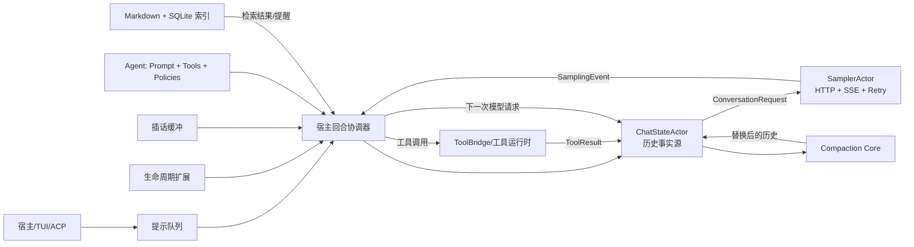
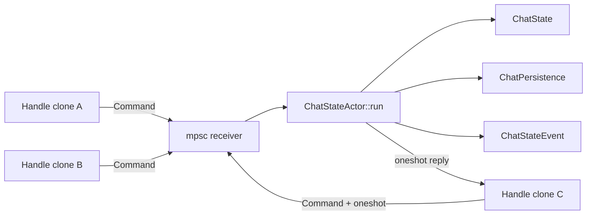
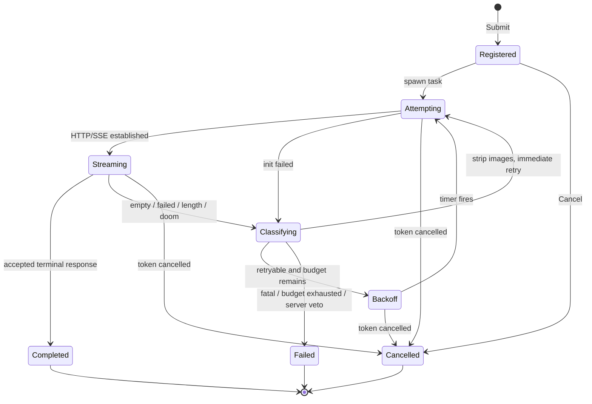
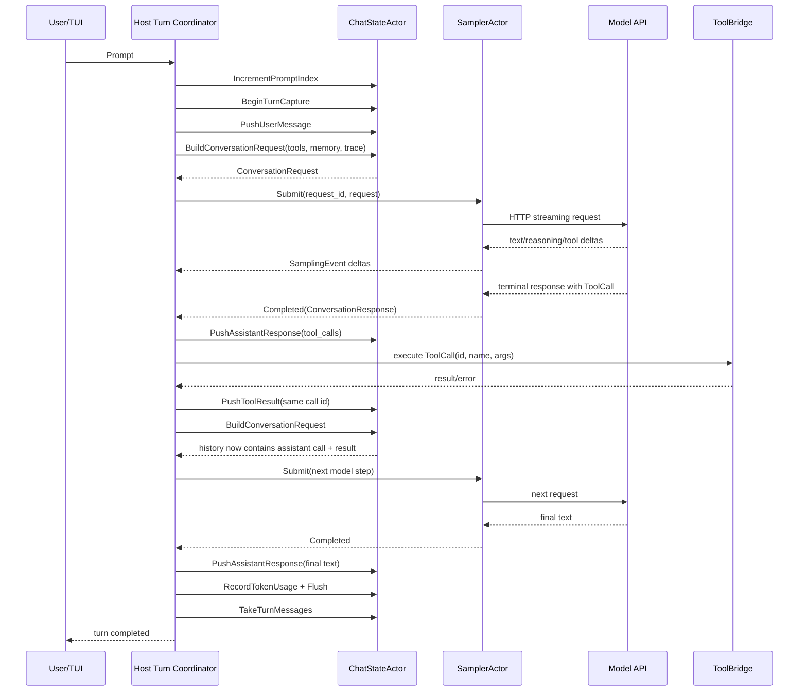
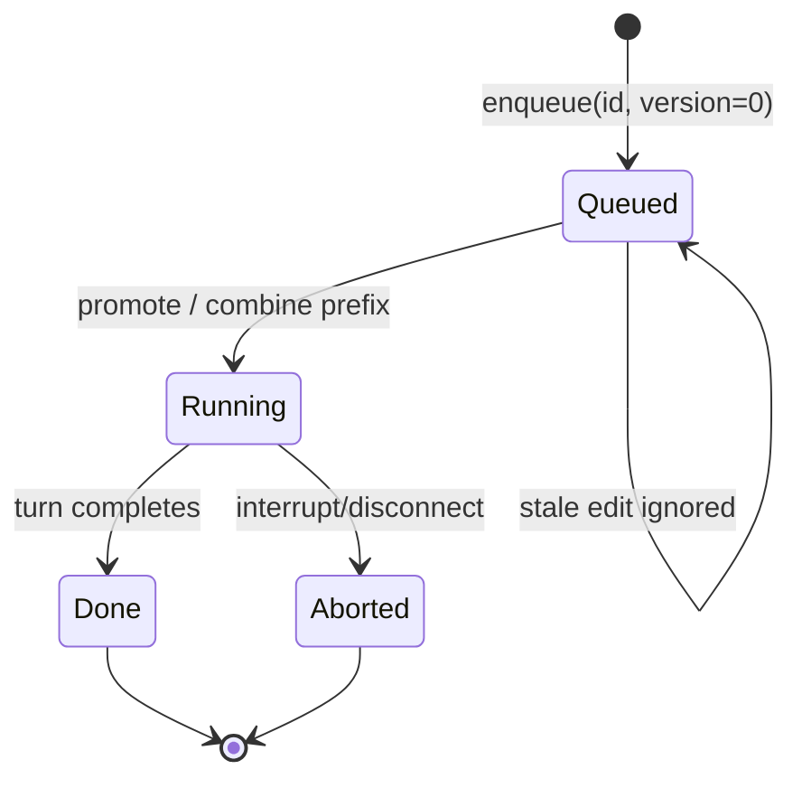
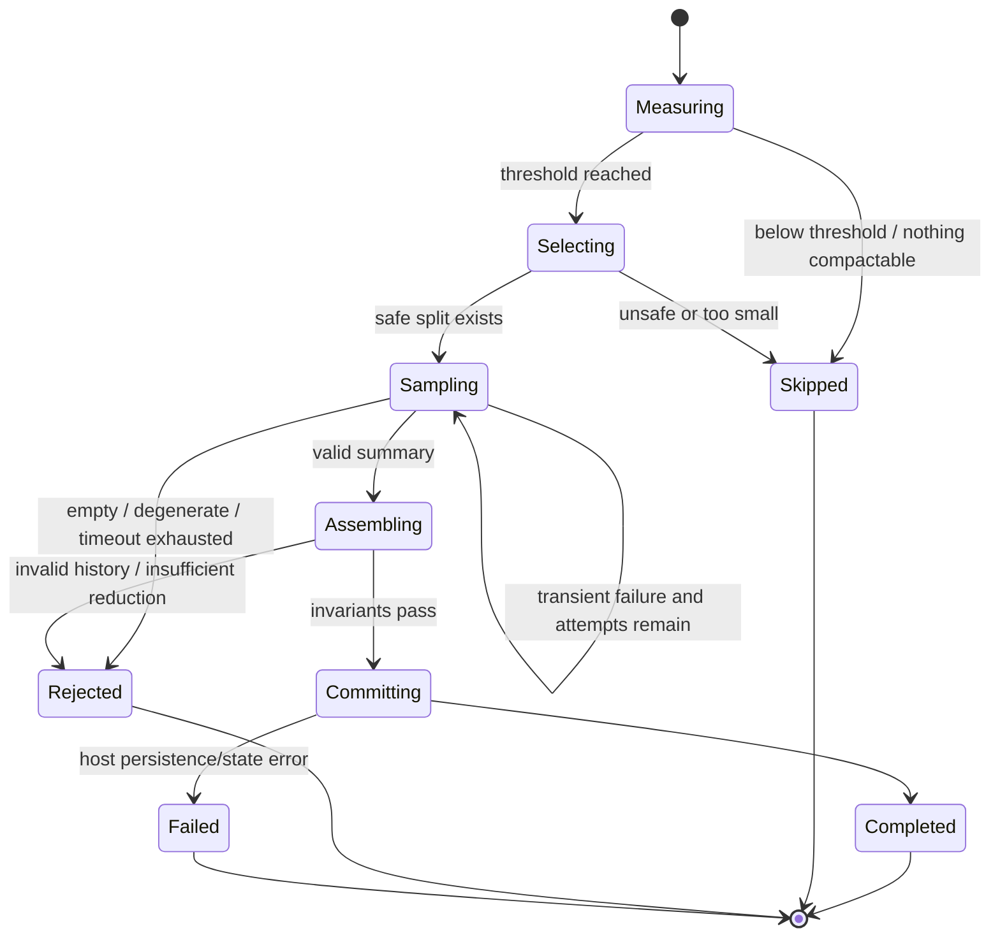
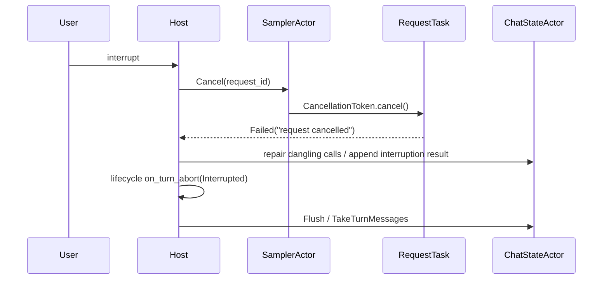

# 04 Agent、会话与模型循环源码精读

> **全局调用位置**：`MvpAgent::prompt → SessionCommand::Prompt → SessionActor::handle_prompt → process_conversation_turn → ChatStateHandle::build_request → run_turn_via_sampler`。具体符号关系见 [源码符号关系总览第 6–10 节](12-源码符号关系总览.md#6-acp-prompt-到-sessioncommand)，普通 Prompt 和模型流逐函数过程见 [关键调用链第 4–6 节](13-关键调用链逐函数精读.md#4-调用链三mvpagentprompt-到-session-actor)。

> 本文面向第一次接触 Rust、Actor 和大模型工具循环的读者。目标不是只说明“代码在哪里”，而是解释这些 crate 为什么被拆开、状态由谁拥有、一次用户输入怎样穿过系统、失败后怎样收敛，以及如何依据本文从零重写一个兼容实现。

## 1. 阅读范围与结论先行

本文精读以下 10 个 crate 的 `Cargo.toml`、生产源码，并使用其测试锁定行为边界：

| crate | 主要职责 | 明确不负责 |
|---|---|---|
| `xai-grok-agent` | 解析 Agent 定义，组装系统提示、工具桥和会话策略 | 不执行模型循环，不持有可变聊天历史 |
| `xai-chat-state` | 用单 Actor 串行管理消息历史、token、快照、持久化和请求构造 | 不发 HTTP，不执行工具 |
| `xai-grok-sampler` | 模型 HTTP/SSE 调用、流事件统一、并发请求、取消与重试 | 不决定何时调用工具，不修改聊天历史 |
| `xai-grok-sampling-types` | 定义供应商无关的消息、请求、响应和错误类型，并做协议转换 | 不做网络 I/O |
| `xai-agent-lifecycle` | 定义回合/会话/命令扩展点 | 不拥有主循环，不决定扩展调用时机 |
| `xai-prompt-queue` | 定义提示队列线协议及连续提示合并规则 | 不存储真实队列，不启动回合 |
| `xai-interjection-core` | 保存回合中插话，在安全点按 FIFO 转成合成用户消息 | 不主动中断模型，不决定安全点 |
| `xai-grok-compaction` | 与传输无关的历史压缩算法、提示、选择、验证和提交接口 | 不拥有宿主会话，不直接持久化 |
| `xai-grok-memory` | 跨会话 Markdown 记忆、SQLite 索引、混合检索和后台归并 | 不自动把检索结果塞进 Prompt |
| `xai-token-estimation` | 提供统一的 bytes/4 粗估算及阈值运算 | 不是模型 tokenizer，不能替代供应商 usage |

最重要的架构结论是：工程中没有一个叫“AgentLoop”的万能对象。Agent 循环是多个边界清晰的部件组合出来的：



这里有三个必须分清的“循环”：

1. **会话循环**：接收提示、排队、启动回合、处理取消和回合结束。它属于宿主。
2. **模型循环**：构造请求、采样、看到工具调用、执行工具、写入结果、再次采样。它也由宿主协调。
3. **采样重试循环**：同一个 `ConversationRequest` 因网络、限流、空响应等原因重试。它属于 `xai-grok-sampler`。

工具调用后的再次采样不是 HTTP 重试。前者是 Agent 正常推进，历史发生了变化；后者是对同一逻辑请求的故障恢复，原则上历史不变。

---

## 2. 推荐阅读顺序

新手不要按目录字母顺序阅读。按以下依赖方向读，理解成本最低：

1. `xai-grok-sampling-types/src/conversation.rs`：先认识消息、请求、响应。
2. `xai-chat-state/src/commands.rs`、`actor/state.rs`、`actor/mod.rs`：理解历史由谁管理。
3. `xai-grok-sampler/src/events.rs`、`actor/mod.rs`、`actor/request_task.rs`：理解模型流。
4. `xai-grok-agent/src/agent.rs`、`builder.rs`：理解一次会话开始前装配了什么。
5. `xai-grok-compaction` 与 `xai-grok-memory`：理解上下文窗口和跨会话知识。
6. `xai-prompt-queue`、`xai-interjection-core`、`xai-agent-lifecycle`：理解控制面扩展。

如果只想先建立最小心智模型，先记住四个类型：

| 类型 | 路径 | 心智模型 |
|---|---|---|
| `Agent` | `crates/codegen/xai-grok-agent/src/agent.rs::Agent` | 一份已经组装好的会话能力配置 |
| `ConversationItem` | `crates/codegen/xai-grok-sampling-types/src/conversation.rs::ConversationItem` | 历史中的一条规范化记录 |
| `ChatStateHandle` | `crates/codegen/xai-chat-state/src/handle.rs::ChatStateHandle` | 向历史 Actor 发命令的遥控器 |
| `SamplerHandle` | `crates/codegen/xai-grok-sampler/src/handle.rs::SamplerHandle` | 向采样 Actor 提交/取消请求的遥控器 |

---

## 3. Cargo 依赖揭示的分层

### 3.1 纯类型层

`xai-grok-sampling-types/Cargo.toml` 依赖 `serde`、`serde_json`、`schemars`、`async-openai`、`reqwest` 等。这里的 `reqwest` 主要用于 `StatusCode` 和错误类型，不代表该 crate 发网络请求。`src/lib.rs` 明确说明它“contains no I/O”。

它向上提供：

- 规范化的 `ConversationItem`；
- `ConversationRequest`、`ConversationResponse`；
- `SamplingConfig`；
- `SamplingError`；
- OpenAI Chat Completions、Responses、Anthropic Messages 三套协议的转换类型。

`xai-token-estimation` 甚至没有第三方依赖，是最底层纯函数 crate。

### 3.2 状态层

`xai-chat-state/Cargo.toml` 依赖 `tokio`、`tokio-util`、`serde`、`indexmap`、sampling types、compaction 和 token estimation。它不依赖 HTTP 客户端，因此不能调用模型；这是有意保持的边界。

### 3.3 传输层

`xai-grok-sampler/Cargo.toml` 引入：

- `reqwest`：HTTP 与流式响应；
- `eventsource-stream`：SSE 解码；
- `futures-util`、`async-stream`：异步流转换；
- `tokio-util::CancellationToken`：协作式取消；
- `async-openai`：Responses API 数据结构；
- `uuid`：请求 ID。

它依赖 sampling types，但不依赖 chat state，避免传输层反向修改领域状态。

### 3.4 Agent 装配层

`xai-grok-agent/Cargo.toml` 的重要依赖有：

- `minijinja`：渲染系统提示模板；
- `xai-grok-tools`：构建 `ToolBridge` 和工具定义；
- `xai-grok-sampling-types`：声明托管工具；
- `xai-token-estimation`：压缩阈值；
- `git2`、`ignore`：发现仓库和 `AGENTS.md`；
- `serde_yaml`：Agent 定义配置。

### 3.5 压缩与记忆层

`xai-grok-compaction` 只依赖 `async-trait`、`tokio`、`serde` 等通用库，通过 trait 注入消息类型、token 统计、模型采样和状态提交。

`xai-grok-memory` 是数据设施最重的部分：

- `rusqlite` bundled + FTS5：关键词索引；
- `sqlite-vec`：可选向量 KNN；
- `blake3`：工作区标识与内容 hash；
- `notify`：文件变更监听；
- `arc-swap`：并发可替换状态；
- `reqwest-middleware`：Embedding HTTP；
- `tar`、`flate2`：记忆归档。

### 3.6 扩展与控制层

`xai-agent-lifecycle` 用 `async-trait` 定义异步扩展接口；`xai-prompt-queue` 只有 Serde；`xai-interjection-core` 只有 Serde 和标准库互斥锁。三者都刻意保持轻量，便于多个宿主复用。

---

## 4. Rust 新手预备知识

### 4.1 `enum` 是带数据的状态联合

`ConversationItem` 不是一个带 `role: String` 的松散结构，而是：

```rust
pub enum ConversationItem {
    System(SystemItem),
    User(UserItem),
    Assistant(AssistantItem),
    ToolResult(ToolResultItem),
    BackendToolCall(BackendToolCallItem),
    Reasoning(ReasoningItem),
}
```

匹配时编译器要求考虑所有分支。新增消息类型后，遗漏处理点更容易在编译期暴露。

### 4.2 `Arc<T>` 与 Actor 不是同一种并发方案

- `Arc<T>` 让多个所有者安全共享同一个值；它本身不允许随意修改值。
- `Mutex<T>` 通过加锁提供共享可变性。
- Actor 把可变状态关在一个任务中，外部只能发消息；Actor 内部通常不需要锁。

`Agent` 使用 `Arc<ToolBridge>`，因为多个组件共享工具桥。`ChatStateActor` 直接拥有 `ChatState`，因为所有修改都经过其命令循环。

### 4.3 `mpsc` 与 `oneshot`

- `mpsc::UnboundedSender<Command>`：多个调用方持续向一个 Actor 发命令。
- `oneshot::Sender<T>`：某条查询命令携带一次性回复通道。

例如 `GetConversation { reply }` 进入 Actor，Actor 克隆历史后调用 `reply.send(...)`。这相当于一个类型安全的异步 RPC。

### 4.4 `async fn`、`Stream` 和 `tokio::select!`

- `async fn` 返回一个将来可被 `.await` 的 Future。
- `Stream` 是异步版本的迭代器，每次 `.next().await` 等下一个块。
- `tokio::select!` 同时等待多个异步事件，先到者先处理。

Sampler 使用 `select!` 同时等待 SSE 下一个事件和取消令牌。

### 4.5 trait 是替换边界

压缩核心不知道具体聊天消息类型，只要求实现 `CompactionItem`。这是 Rust 中的依赖倒置：算法依赖能力契约，而不是宿主结构体。

### 4.6 `Send` 与 `?Send`

`xai-agent-lifecycle` 提供两套 registry：

- `send` 版使用 `Arc<dyn Trait + Send + Sync>`，适合多线程 Tokio 宿主；
- `local` 版使用 `Rc<dyn Trait>` 和 `#[async_trait(?Send)]`，适合 TUI 中基于 `Rc/RefCell` 的单线程状态。

共享扩展只需实现 Send 版，blanket impl 会让它也可注册到 Local 版。

---

## 5. Agent：运行前的能力快照

### 5.1 `AgentDefinition` 是声明，`Agent` 是实例

`crates/codegen/xai-grok-agent/src/config.rs::AgentDefinition` 描述名字、说明、Prompt 模式、工具允许/禁止列表、权限、模型覆盖、记忆范围、完成条件等。它可来自配置文件，仍然是“想要什么”。

`crates/codegen/xai-grok-agent/src/agent.rs::Agent` 是 `AgentBuilder` 结合当前工作目录、会话环境、工具注册表和 Prompt 上下文生成的“已经能用的实例”。字段包括：

| 字段 | 含义 |
|---|---|
| `definition` | 原始 Agent 声明 |
| `prompt_context` | 渲染 Prompt 使用的结构化上下文 |
| `system_prompt` | 已渲染并缓存的系统提示 |
| `tool_bridge` | 工具注册、状态和会话上下文入口 |
| `reminder_policy` | Todo nudge/gate 等提醒策略 |
| `compaction_policy` | 自动压缩阈值、压缩模型、memory flush 等 |
| `hosted_tools` | 由服务端执行的 Web/X Search 等工具 |
| `backend_search_enabled` | 是否允许把服务端搜索工具放入请求 |

源码称 `Agent` “effectively immutable”。运行中工具内部状态通过 `ToolBridge` 自己的锁更新；Agent 外壳不承担聊天状态。

### 5.2 `AgentBuilder::build` 的关键阶段

主实现位于 `crates/codegen/xai-grok-agent/src/builder.rs::AgentBuilder::build`：

1. 解析/补全 `AgentDefinition`。
2. 选择工具预设并合并动态工具。
3. 应用 `tools` allowlist、`disallowed_tools` denylist。
4. 推导允许的 subagent 类型，并在禁止 subagent 时移除 task 相关工具。
5. 调用 `ToolBridge::finalize_builder`，注入终端、文件系统、cwd、session folder、memory backend 等 `SessionContext`。
6. 发现 `AGENTS.md`、技能和 gitignore，并把发现状态种入 ToolBridge。
7. 构造 `PromptContext`，包含操作系统、Shell、cwd、日期、角色和 persona。
8. 用 `PromptContext::render` 渲染系统提示。
9. 根据配置和 Agent 规则装配 hosted tools。
10. 返回 `Agent::new(...)`。

这条链是“构建时控制面”，不是每次模型调用都执行。

### 5.3 Prompt 的来源

`crates/codegen/xai-grok-agent/src/prompt/` 下的文件按来源拆分：

- `template.rs`：完整和 compact 系统 Prompt 模板；
- `context.rs::PromptContext`：渲染输入与占位符；
- `agents_md.rs`：沿目录链读取 `AGENTS.md`；
- `skills.rs`：发现、预算和展示技能；
- `user_message.rs`：用户消息包装；
- `workspace_user.rs`：工作区用户信息；
- `subagent_prompts.rs`：子 Agent Prompt。

`Agent::finalize_prompt` 会更新时间戳并重新渲染，适用于工具覆盖改变后。`render_prompt_for_definition` 支持中途模式切换，但复用原有 ToolBridge。

### 5.4 压缩与提醒策略

`crates/codegen/xai-grok-agent/src/compaction.rs::CompactionPolicy` 默认：

- 85% 上下文占用触发自动压缩；
- 默认沿用当前模型，也可指定压缩模型；
- memory flush 默认关闭；
- 单次压缩 wall-clock budget 默认 300 秒；
- two-pass prefire 默认关闭。

`Agent::should_auto_compact` 使用 `xai_token_estimation::exceeds_threshold`，边界语义是 `>=`。

`crates/codegen/xai-grok-agent/src/system_reminder.rs::ReminderPolicy` 控制 Todo nudge 和 TodoGate。注意 TodoGate 的执行位置在宿主，不在 Agent crate；策略对象只携带配置。

---

## 6. 统一会话数据模型

### 6.1 `ConversationItem`

核心定义在 `crates/codegen/xai-grok-sampling-types/src/conversation.rs`：

| 变体 | 关键字段 | 用途 |
|---|---|---|
| `System` | `content` | 系统提示，通常位于首项 |
| `User` | `Vec<ContentPart>`、synthetic 元数据 | 真实用户输入、图片、提醒、插话 |
| `Assistant` | 文本、`tool_calls`、模型元数据 | 模型最终可提交输出 |
| `ToolResult` | `tool_call_id`、content | 本地工具执行结果 |
| `BackendToolCall` | 服务端工具状态/结果 | 由模型服务执行的托管工具 |
| `Reasoning` | summary/content/encrypted content | 推理块及加密连续性数据 |

`SyntheticReason` 区分自动继续、系统提醒、压缩元数据等合成输入。不能简单地把所有 `User` 都当作真实用户回合，否则裁剪年龄、回退和统计都会错误。

### 6.2 工具调用配对不变量

一条 `AssistantItem` 可以包含多个 `ToolCall { id, name, arguments }`。之后的 `ToolResultItem.tool_call_id` 必须与调用 ID 配对。

合法序列：

```text
Assistant(tool_call id=A, tool_call id=B)
ToolResult(tool_call_id=A)
ToolResult(tool_call_id=B)
Assistant(...)
```

以下情况需要修复：

- Assistant 声明调用，但进程崩溃/取消导致没有 ToolResult；
- ToolResult 被移到对应 Assistant 之前；
- 压缩或截断只保留配对的一半；
- 用户消息在尚未闭合的工具调用后直接进入历史。

`xai-chat-state` 的请求构造和 repair 命令，以及 `xai-grok-compaction::select_turns_to_compact` 都保护这个不变量。

### 6.3 请求与响应

`ConversationRequest` 包含规范化历史、工具定义、hosted tools、tool choice、trace 与关联 ID 等。它随后可转换为三种后端格式。

`ConversationResponse` 包含：

- `items`：Assistant、Reasoning、BackendToolCall 等规范化输出；
- `stop_reason`：`Stop`、`ToolCalls`、`Length`、`ContentFilter` 等；
- `usage`：输入、输出、推理、缓存 token；
- `doom_loop_signals`；
- provider 原始结束信息。

不要只从 `assistant.content` 判断响应是否有效。工具调用、reasoning、拒绝响应都可能没有普通文本。

### 6.4 三套供应商协议

转换实现分布在：

- `conversation/chat_completions.rs`；
- `conversation/responses.rs`；
- `conversation/messages.rs`；
- `types.rs` 和 `messages.rs` 的 wire types。

`ApiBackend` 决定使用 Chat Completions、Responses 或 Messages。上层循环只处理统一的 `ConversationRequest/Response`，减少供应商条件分支泄漏。

---

## 7. ChatStateActor：会话历史的唯一写入口

### 7.1 为什么使用 Actor

`crates/codegen/xai-chat-state/src/lib.rs` 的注释直接给出设计目标：把历史状态放进独立 Tokio task，所有修改串行执行，因此 Actor 内部不需要给每个字段加锁。



这样解决了“模型流、工具结果、取消修复、重连替换系统提示同时写历史”的竞争问题。

### 7.2 Actor 状态

`crates/codegen/xai-chat-state/src/actor/state.rs::ChatState` 的重要字段包括：

- `conversation`：消息事实源；
- `sampling_config`：当前模型和上下文窗口；
- `prompt_index`：真实用户 Prompt 序号；
- `total_tokens`：最近供应商返回的总量基线；
- `estimated_tokens_since_model`：模型响应后新增工具结果/合成消息的估算增量；
- `estimate_at_last_response`：最近模型响应时本地估算，用于压缩后保留 provider overhead 比例；
- `prompt_usage`、`session_usage`：当前 Prompt 与会话累计计费账本；
- `agent_edited_paths`、`prompt_texts`：归因和 rewind 数据；
- `stream_start_ms`、`turn_start_ms`：延迟测量；
- `last_compaction_prompt_index`：压缩边界；
- `credentials`：Actor 只透明保存、不解释的凭据；
- `turn_capture`：当前回合新增消息捕获；
- harness trace 缓冲。

### 7.3 Command、Handle 与 Event

`ChatStateHandle` 只包装 `mpsc::UnboundedSender<ChatStateCommand>`，克隆成本低。命令分两类：

**写命令**：

- `PushUserMessage` / `PushAssistantResponse` / `PushToolResult`；
- `RecordTokenUsage`、`RecordModelCallUsage`；
- `IncrementPromptIndex`；
- `ReplaceConversation`、`ReplaceSystemHead`、`RepairHistory`；
- `BeginTurnCapture`；
- `Flush`、`RestoreSnapshot`。

**查询命令**携带 `oneshot::Sender`：

- `BuildConversationRequest`；
- `GetConversation`、`GetEstimatedTotalTokens`；
- `Snapshot`、`CheckAutoCompactNeeded`；
- 针对长度、首尾文本、消息计数等窄查询。

窄查询避免为了读取一个布尔值而克隆整段历史。

`ChatStateEvent` 很少，只有需要宿主协调的变化：Prompt index、token 更新、历史重置和图片预算。持久化不是靠事件订阅者完成，而是 Actor 内部直接调用 `ChatPersistence`。

### 7.4 写入与持久化语义

普通 push 的大致过程：

1. 必要时修复悬空工具调用；
2. 追加到 `conversation`；
3. 如果 turn capture 开启，也计入本回合；
4. 更新本地 token 增量；
5. 交给 `ChatPersistence` 记录。

`AppendWorkingDirectorySwitchAndAck` 更严格，它区分：

- `NotCommitted`：存储确认未提交；
- `Committed`：已提交但后续确认有错误；
- `Indeterminate`：无法知道是否提交。

这是典型的“写入结果未知”建模，调用方不能把所有错误都当作可以盲重试。

### 7.5 原子替换系统提示

`ReplaceSystemHead` 必须在 Actor 内完成。若宿主先 `GetConversation`，本地修改，再 `ReplaceConversation`，中间到达的 ToolResult 可能被旧快照覆盖。Actor 内部执行 `replace_or_insert_system_head`，与其它 push 串行化，避免丢更新。

### 7.6 构造模型请求

核心位于 `crates/codegen/xai-chat-state/src/actor/request_builder.rs`。`BuildConversationRequest` 的语义不是简单 clone：

1. 克隆当前历史；
2. 修复悬空工具调用；
3. 对旧大工具结果做请求级软裁剪；
4. 执行图片 body 预算，必要时淘汰旧内联图像；
5. 注入或更新 `<memory-context>`；
6. 附加工具定义、sampling config、trace、conversation/request ID；
7. 返回 `ConversationRequest`。

默认构造请求不应修改 Actor 历史；只有 `persist_memory_reminder` 等显式选项会把注入结果写回。这一边界被 `build_request_does_not_mutate_actor_state` 测试锁定。

### 7.7 Token 双轨计量

模型返回 usage 时，`record_token_usage`：

- 将 `total_tokens` 设置为供应商值；
- 清零 `estimated_tokens_since_model`；
- 冻结当前本地 `estimate_at_last_response`。

随后工具结果和合成用户消息进入历史，但还没有新的供应商 usage，因此 `get_estimated_total_tokens` 返回：

```text
供应商 total_tokens + 模型响应后新增内容的 bytes/4 估算
```

Assistant 响应本身已包含在供应商统计中，所以 push Assistant 不再重复增加 delta。

压缩替换时，代码按比例保留 provider overhead：

```text
ratio = pre_replace_total / estimate_at_last_response
new_total = estimate(new_history) * ratio
new_total <= pre_replace_total
```

这样既不在压缩后突然丢掉协议/缓存等隐含开销，也不允许“压缩后 token 反而更多”。

### 7.8 快照、回退和 turn capture

`ChatStateSnapshot` 是可序列化的不可变快照，用于 fork/rewind。`truncate_to_prompt_index` 按真实 Prompt 边界截断，并保留系统消息。

`BeginTurnCapture` 记录开始 offset，`TakeTurnMessages` 返回本回合消息。若回合中发生压缩或历史替换，Actor 会先把即将消失的尾部放入 `pre_replacement_messages`，再 rebase offset，确保 trace 不丢。`compaction_occurred` 告诉调用方本回合历史发生过替换。

---

## 8. SamplerActor：并发模型请求与流式归一化

### 8.1 三层 API

`crates/codegen/xai-grok-sampler/src/lib.rs` 明确划分：

1. **L1 `SamplingClient`**：创建 HTTP 请求，返回供应商原始 chunk stream。
2. **L2 `stream_*`**：把原始流转换为统一 `SamplingEvent`。
3. **L3 `SamplerActor`**：管理并发请求、取消、重试和完成通知。

### 8.2 Actor 本身不阻塞在网络上

`SamplerActor` 的状态只有默认配置、重试策略和 `HashMap<RequestId, ActiveRequest>`。收到 `Submit` 后：

1. 创建 `CancellationToken`；
2. 注册 request ID；若 ID 重复，取消旧请求；
3. 冻结本次 effective config；
4. 在 `JoinSet` 中 `spawn(run_request_task(...))`；
5. Actor 继续接收下一条命令。

因此多个请求可并发。Actor 自己串行管理 bookkeeping，每个请求 task 独立流式采样。

`run` 使用 biased `tokio::select!`，优先回收已完成 task，再处理新命令，减少 active map 的陈旧窗口。所有 handle 被 drop 后，Actor 取消剩余 token 并 shutdown `JoinSet`。

### 8.3 `SamplingEvent`

主要事件按生命周期排序：

- `StreamStarted`；
- `ResponseStarted`（Messages 可提供真实 message id 和输入 token）；
- `FirstToken`；
- `ChannelToken { Text | Reasoning }`；
- `ToolCallDelta`；
- `ReasoningCompleted`；
- `BackendToolCallStarted/Completed`；
- `ModelMetadata`；
- `Retrying`；
- 终态 `Completed` 或 `Failed`。

`ToolCallDelta.arguments_delta` 只是 JSON 片段，单块通常不是合法 JSON。UI 可用它展示进度，真正执行必须等待 L2 组装后的完整 `ConversationResponse`。

### 8.4 一次 attempt

`crates/codegen/xai-grok-sampler/src/actor/request_task.rs::run_one_attempt` 根据 `ApiBackend` 分派：

- Chat Completions -> `conversation_stream` + `stream_chat_completions`；
- Responses -> `conversation_stream_responses` + `stream_responses_tracked`；
- Messages -> `conversation_stream_messages` + `stream_messages`。

原始错误流先经过 `tee_errors`，把第一个富类型 `SamplingError` 保存到共享 cell；L2 同时生成适合跨边界的 `SamplingErrorInfo`。这样重试分类仍能使用原始错误，不会因序列化镜像丢信息。

`drive_l2` 同时等待 L2 事件和取消：

- 非终态事件转发给共享 event channel；
- `Completed` 被暂时截住，检查 doom loop、长度截断和空响应；
- `Failed` 还原富错误；
- 流无终态直接结束被视为 transport error。

### 8.5 为什么完成事件要被请求任务重新发出

L2 的 `Completed` 只说明“这一 attempt 解码完成”。它还可能：

- 是应重试的空响应；
- 因 `Length` 截断应失败；
- 命中高置信 doom loop，应丢弃并重新采样。

所以 `drive_l2` 吞掉 attempt 级终态，只有外层 retry loop 接受结果后才向宿主发送最终 `SamplingEvent::Completed`。

### 8.6 采样请求状态机



### 8.7 重试分类

`crates/codegen/xai-grok-sampler/src/retry.rs::classify_error` 是纯函数，返回 `RetryDecision`：

| 错误 | 决策 |
|---|---|
| 认证/加密内容错误 | `EmitToSession`，由会话刷新凭据或解释 |
| 413 或图片处理错误 | `RetryWithImageStrip` |
| `x-should-retry: false` | Fatal |
| context length overflow | Fatal；同 payload 重发无意义 |
| doom loop | 独立预算，快速 resample |
| 429 | 遵循 `Retry-After` 或指数退避，并受更小阈值限制 |
| 首次普通 transport/5xx | 退避并重建 HTTP/1.1 client |
| 后续普通 retryable 错误 | 有抖动退避 |
| 序列化、非法配置等确定性错误 | Fatal |

两个容易写错的细节：

- `retry_only_before_output` 开启后，一旦已经向用户暴露 token/tool delta，就把有效重试预算降为 0，避免第二次生成造成重复输出。
- doom-loop 重试预算与 transport/empty 重试预算分离，不能互相消耗。

### 8.8 取消语义

取消是协作式的：Actor 从 active map 移除请求并触发 `CancellationToken`。请求任务在 attempt、读流和 backoff 睡眠点都检查 token。

`SamplerHandle::submit_and_collect` 内部还有 `CancelOnDrop` RAII guard。等待 Future 因调用方取消、panic 或作用域退出而 drop 时，`Drop` 自动向 Actor 发 `Cancel`。这避免“调用者已经不等了，后台 HTTP 仍继续烧 token”。

当前取消在事件面表现为 `Failed`，消息是 `request cancelled`；没有独立 `Cancelled` 事件枚举。重实现时若要改变这一点，需要同步所有事件消费者。

---

## 9. Prompt 到模型、工具调用回边的完整流程

### 9.1 正常工具回合时序



### 9.2 “工具回边”由谁负责

在本文目标 crate 中：

- sampling types 定义 `ToolCall` 和 `ToolResult`；
- sampler 解析/流式发布工具调用；
- chat state 保存 Assistant 调用和 ToolResult；
- Agent 暴露 `ToolBridge` 与 tool definitions；
- 但真正的 `while response has tool_calls` 协调在宿主。

工程中的集成调用点可在 `crates/codegen/xai-grok-shell/src/session/acp_session_impl/turn.rs`、`tool_calls.rs` 和 `sampler_turn.rs` 看到。本文只用它们确认边界，不把宿主私有实现混入 10 个 crate 的职责。

### 9.3 伪代码

```rust
loop {
    let request = chat_state.build_request(tool_specs, memory, trace).await;
    let (response, metrics) = sampler.submit_and_collect(new_id(), request).await?;

    commit_reasoning_and_assistant_items(&chat_state, &response);
    record_usage(&chat_state, &response, &metrics);

    let calls = response.tool_calls();
    if calls.is_empty() {
        break TurnOutcome::Completed;
    }

    for call in calls {
        let result = tool_bridge.execute(call.name, call.arguments).await;
        chat_state.push_tool_result(result.for_call(call.id));
        drain_safe_interjections_if_any();
    }
}
```

实际实现还要处理并行工具、审批、拒绝、取消、backend-hosted tools、TodoGate、压缩和生命周期 hook。

---

## 10. 历史完整性与取消后的修复

### 10.1 为什么取消会破坏工具对

用户可能在 Assistant 已提交三个 ToolCall、只完成第一个工具时取消。历史会暂时是：

```text
Assistant(A, B, C)
ToolResult(A)
```

下一次请求若原样发送，模型 API 可能拒绝 B、C 没有结果。chat state 在下一次用户消息或显式 repair 时，为缺失调用加入合成的中断 ToolResult，并标注 `DanglingToolCallReason`。

### 10.2 修复的安全边界

`ChatStateCommand::RepairHistory` 接受一个共享 `turn_active` 原子标志，并在 Actor 处理命令时再次检查。只在调用侧检查会有竞态：检查后新回合可能已经开始，但 repair 命令还没进 Actor。

进行中的工具调用不能被误判为 dangling，因此回合活动时返回 `RepairHistoryBlocked`。

### 10.3 构造请求时也做防御修复

`BuildConversationRequest` 在克隆副本上修复，确保即使持久历史尚未显式 repair，也不会把非法序列发送给模型。持久修复和请求级修复解决不同问题：前者让事实源收敛，后者保证出站请求安全。

---

## 11. Prompt 队列

### 11.1 数据契约

`crates/codegen/xai-prompt-queue/src/types.rs::QueueEntryMeta` 是 Actor 内元数据：

- `id` 复用稳定 prompt ID；
- `version` 每次原地编辑递增，旧版本编辑是 no-op；
- `owner` 保留最初入队客户端；
- `last_editor` 记录最近编辑者；
- `kind` 区分 prompt/bash 等；
- `text` 与可选 `combined_texts` 用于展示。

`QueueEntryWire` 增加 `position`。`QueueChanged` 除等待队列外，还携带正在运行的 prompt ID/text/kind，因为 running row 已从 entries 移除。

### 11.2 合并规则

`crates/codegen/xai-prompt-queue/src/combine.rs` 只合并队头开始的连续可合并前缀：

- 必须是普通用户 prompt；
- synthetic、bash、命令、展开后的 skill 不合并；
- follower 不能带图片；队头可以带图片；
- 正被编辑的 ID 阻断合并；
- 遇到第一个不合格项立即停止，不跳过去继续合并。

模型文本用两个换行连接，UI 通过 `combinedDisplayTexts` 保留原始气泡。该 crate 只提供规则，真实队列状态和 promote/drain 在宿主。

### 11.3 队列状态机



队列解决的是 turn 之间的顺序，不等同于插话。

---

## 12. 回合中插话

### 12.1 核心结构

`xai-interjection-core/src/events.rs::EventQueue<E>` 内部是 `Arc<Mutex<Vec<E>>>`。clone 共享同一队列；`drain_matching` 在保持 FIFO 的同时留下不匹配项；`push_capped` 超限时丢最老项。

`InterjectionBuffer<Attachment>` 只是 `EventQueue<PendingInterjection<Attachment>>` 的类型别名。核心不理解附件，附件类型由宿主决定。

### 12.2 安全注入

`drain_formatted`：

1. 原子 drain 全部 pending 条目；
2. 让宿主先清洗文本；
3. 每条分别包装为合成用户消息；
4. 保留附件和 FIFO；
5. 永不把多条插话合并成一条。

格式由 `format_interjection` 固定：

```text
The user sent a message while you were working:
<user_query>
...
</user_query>
```

文本超过 25,000 字节时在 UTF-8 边界截断。

插话不是立即打断当前 SSE。生产者可随时 push，宿主在工具完成后、下一次采样前等安全点 drain。这样不会把消息插进一个尚未闭合的 Assistant/ToolResult 结构中。

---

## 13. 生命周期扩展

`xai-agent-lifecycle` 的第一条注释就是边界：contributors “never own loop control”。宿主负责调用时机，扩展只响应。

### 13.1 四类扩展

| trait | hook | 作用 |
|---|---|---|
| `TurnLifecycleContributor` | start/done/abort/error | 观察回合生命周期 |
| `SessionLifecycleContributor` | session idle | 会话无运行回合且无排队任务时触发 |
| `TurnInputContributor` | contribute input | 在采样 choke point 向当前回合贡献片段 |
| `CommandContributor` | advertise/handle command | 提供 slash command |

`TurnAbortReason` 目前区分 `Disconnected` 与 `Interrupted`。`CommandAction` 只有 `Rewrite { model_text }` 和 `Acted`；失败原因通过 `Err(String)` 返回，宿主必须展示。

### 13.2 Registry

Builder 收集 trait object，`build` 后生成不可变 Registry。命令名必须唯一；重复时 debug panic，release 记录错误且“先注册者获胜”。

这是一种组合期错误，而不是运行时随机覆盖。

---

## 14. 上下文压缩

### 14.1 为什么独立成 transport-agnostic core

`crates/common/xai-grok-compaction/src/lib.rs` 明确不依赖 sampling types。它通过以下 seam 解耦：

- `CompactionItem`：读取角色、文本、工具关系、附件；
- `CompactionItemBuilder`：构造 summary item、移除工具内容、截断 payload；
- `CompactionItemFactory`：构造 full-replace 后的用户/元数据/提醒项；
- `ItemTokenCounter`：由宿主提供可信 token 统计；
- `CompactionSampler`：由宿主提供 LLM 调用；
- `CompactionStreamProc`：由宿主提交历史替换；
- Observer：宿主接入指标。

`ConversationItem` 在 sampling types 中实现这些 trait，这使依赖方向仍然是“具体类型依赖抽象核心”，而不是压缩核心依赖具体类型。

### 14.2 三种压缩风格

| 模块 | 风格 | 适用 |
|---|---|---|
| `code_compaction` | whole-session full replace | grok-build 会话摘要 |
| `intra_compaction` | 当前会话内 tail-keep / 分目标压缩 | Steps、History、FullReplace 策略 |
| `inter_compaction` | 回合之间分块压缩 | Grok chat 风格历史 |

### 14.3 安全 split

`select_turns_to_compact` 从尾部逆向累计“要保留”的 token，找到候选 split，再向前移动到安全边界，绝不从 Assistant tool request 和紧随的 ToolResult 中间切开。若可压缩部分低于 `min_compactable`，返回 `None`，避免为几条消息浪费一次 LLM 调用。

### 14.4 Full-replace 主流程

`code_compaction::apply_full_replace_compaction` 可概括为：

1. 清洗历史：去 reasoning、图片和不适合摘要的工具结构；
2. 按预算 fit，必要时截断超大工具结果；
3. 生成 summarization prompt；
4. 使用有界 attempt、delay 和 wall-clock timeout 采样；
5. 拒绝空/退化 summary；
6. 清洗模型输出中的控制包装；
7. 重新组装 system、用户信息、summary、最近查询、项目说明和 active reminder；
8. 验证历史合法性；
9. 由宿主一次性替换会话。

### 14.5 Intra 一次压缩

`intra_compaction/compact.rs::compact_one_pass`：

1. 从 stream processor 读取 Steps 或 History 视图；
2. 统计每项 token；
3. 计算目标 tail 预算并选 split；
4. History 模式先提取旧 `<grok_user_queries>`，避免摘要反复嵌套；
5. 使用 Legacy 或 Shared summarizer；
6. 把历史用户查询 preamble 加回 summary；
7. 构造 compaction item；
8. 检查 `tokens_after / tokens_before`，压缩收益不足则丢弃；
9. 通过 `replace_with_compaction` 提交。

`HistoryThenSteps` 先压 History，再按 Steps/History token 比率决定是否继续压 Steps。若 History 已成功而 Steps 失败，前一次提交不会回滚；调用方必须理解这是部分成功。

### 14.6 压缩状态机



### 14.7 压缩后 ChatState 的提交

压缩核心不碰 ChatState。宿主获得新 history 后调用 `ChatStateHandle::replace_conversation_for_compaction`，Actor 才负责：

- 持久化替换；
- turn capture 保全；
- provider overhead 比例重估；
- `ConversationReset` 和 `TokensUpdated` 事件；
- 记录 compaction Prompt index。

---

## 15. 长期记忆

### 15.1 事实源与派生索引

`xai-grok-memory/src/lib.rs` 定义的文件布局：

```text
~/.grok/memory/
├── MEMORY.md
└── {workspace_hash}/
    ├── MEMORY.md
    └── sessions/
        └── YYYY-MM-DD-{slug}-{sid8}.md
```

Markdown 文件是用户可读、可编辑的事实源。SQLite 是可删除重建的派生索引，不应反过来成为唯一数据源。

工作区目录使用 repo identity 或 canonical cwd 计算 BLAKE3 标识；临时目录会被识别为 ephemeral，避免把一次性工作区污染为长期项目记忆。

### 15.2 `MemoryStorage`

`crates/codegen/xai-grok-memory/src/storage.rs::MemoryStorage` 负责：

- 计算 global/workspace/session 路径；
- 写 daily session log；
- 覆盖或追加 global/workspace `MEMORY.md`；
- 限定范围读取，拒绝路径逃逸；
- 初始化模板；
- 清理 workspace/global；
- GC 旧的空/临时工作区。

`normalize_memory_content` 为没有标题的文本生成可读 Markdown 结构。写 workspace memory 时，ephemeral 工作区会保守跳过。

### 15.3 SQLite Schema

`schema.rs` 当前 `SCHEMA_VERSION = 1`：

| 表 | 作用 |
|---|---|
| `meta` | schema、embedding dimension、reindex claim |
| `chunks` | path、行号、文本、hash、source、时间、访问计数 |
| `chunks_fts` | contentless FTS5 关键词索引 |
| `chunks_vec` | 可选 sqlite-vec `vec0` 向量索引 |

`MemoryIndex` 包装 `rusqlite::Connection`，负责 reindex、FTS 查询、向量查询、访问计数和 reindex lease。由于 Connection 是 `!Send + !Sync`，`MemoryBackendImpl` 每次查询打开新的 index/连接；WAL 允许并发读。

### 15.4 Chunk 与 embedding

`chunk_markdown` 优先按 Markdown 标题和段落切块，并保留标题上下文。chunk hash 用于检测内容变化。

`embed_missing_chunks`：

1. 查询没有 embedding 的 chunk；
2. 每 32 条批量调用 `EmbeddingProvider`；
3. 每条 upsert vector；
4. 单批失败只记录并跳过，不阻止 FTS 使用。

凭据通过 `EndpointScopedCredentials` 绑定可信 endpoint；URL 不可信或不匹配时不携带会话凭据，默认 fail closed。

### 15.5 混合检索

`search.rs::hybrid_search` 的完整管线：

1. FTS5 BM25 候选；
2. 补充 global/workspace evergreen 候选，避免被大量 session 记录挤出；
3. 若 vector 可用，异步生成 query embedding；失败则降级 FTS-only；
4. vector KNN；
5. 归一化 FTS 与 L2 距离；
6. 同时命中的项做加权组合，但不得比纯 FTS 分数更差；
7. 过滤空模板；
8. session 记忆按半衰期衰减，global/workspace 不衰减；
9. 应用 source weight 和 `ln(1 + access_count)` 小幅 boost；
10. 使用未 clamp 分数排序，展示分数 clamp 到 `[0,1]`；
11. 可选 MMR 去冗余；
12. 截断到 `max_results`。

### 15.6 Dream：后台记忆归并

`dream.rs` 把多份 session log 交给模型，生成更稳定的 curated memory。触发前检查：

- 功能是否启用；
- 距上次归并是否超过 `min_hours`；
- 新 session 数是否达到 `min_sessions`；
- lock 是否可获取/是否陈旧。

`DreamLock` 使用 `.dream-lock` 防止多进程同时归并，并检查 PID 存活与 stale 时间。`execute_dream` 读取 session、构造受限输入、调用注入的模型函数、清洗响应、写长期记忆、清理已处理 session、记录归并时间。

### 15.7 Memory 怎样进入模型循环

记忆 crate 自己不注入 Prompt。宿主有两种路径：

- `memory_search` 工具：模型主动搜索，结果作为 ToolResult 回边；
- 会话预取/提醒：宿主把检索结果格式化为 `<memory-context>`，交给 `ChatStateHandle::build_request` 去重注入。

压缩前还可执行 memory flush：先让模型把即将被压缩但值得长期保存的信息写入 memory，再做历史替换。`CompactionPolicy.memory_flush_enabled` 只是开关，真正 flush 在宿主执行。

---

## 16. Token 估算

`xai-token-estimation/src/lib.rs` 是全工程粗估算的单一事实源：

```text
estimate_tokens(text) = UTF-8 bytes / 4
image estimate = 765 tokens / image
```

它提供三种百分比函数，语义不同：

- `usage_percentage`：浮点并 clamp；
- `usage_percentage_u8`：四舍五入；
- `usage_percentage_truncated_u8`：整数截断，与 threshold gate 对齐。

阈值函数：

```text
used * 100 >= context_window * threshold_percent
```

使用饱和算术避免整数溢出，`context_window == 0` 返回 false。`exceeds_threshold_with_headroom` 会在阈值前预留 token，适合 preflight/prefire。

这只是启发式。供应商 usage 可用时必须优先作为基线；中日韩字符在 UTF-8 中占多个字节，bytes/4 也不等价于真实 tokenizer。

---

## 17. 取消、重试和完成的端到端语义

### 17.1 取消传播



取消不会回滚已经提交的 Assistant/tool result；它要求历史修复后收敛到可继续状态。

### 17.2 重试所有权

| 场景 | 所有者 | 是否改变历史 |
|---|---|---|
| HTTP connect/5xx/429 | Sampler retry loop | 否 |
| 空响应 | Sampler retry loop | 否 |
| 图片 413 后剥图 | Sampler retry loop 的 request 副本 | ChatState 历史不变 |
| 401 refresh 后重发 | 会话协调器 | 通常不变，但会更新 config/credentials |
| context overflow 后压缩 | 会话 + compaction | 是，替换历史后新请求 |
| 工具调用后的下一步 | Agent 主循环 | 是，追加 Assistant + ToolResult |
| TodoGate/auto-continue | 会话主循环 | 是，追加合成用户消息 |

不要在多个层同时对同一错误无限重试。Sampler 有次数预算，doom loop 独立预算，压缩有 attempt 和 wall-clock budget；宿主层重试必须识别这些终态。

### 17.3 完成定义

Sampler 的 `Completed` 只代表一个被接受的模型响应。Agent 回合是否完成还取决于：

- 是否有本地 ToolCall；
- backend tool 是否结束；
- 是否需要 TodoGate 再推进一轮；
- 是否有安全点插话要注入；
- 是否触发自动压缩/继续；
- 完成要求是否满足。

因此不能收到一次 `SamplingEvent::Completed` 就直接把整个 turn 标记完成。

---

## 18. 关键测试作为行为证据

以下测试最适合按主题阅读，不需要从头阅读所有测试：

### 18.1 Chat state

文件：`crates/codegen/xai-chat-state/src/actor/tests.rs`

- `push_user_message_appends_and_persists`：追加和持久化；
- `replace_system_head_retains_concurrently_pushed_item`：Actor 原子更新；
- `build_request_does_not_mutate_actor_state`：请求构造副本边界；
- `build_request_repairs_dangling_tool_calls`：出站完整性；
- `live_cancel_after_partial_tool_results_repairs_remaining`：取消修复；
- `turn_capture_survives_compaction_and_flags_it`：回合 trace 保全；
- `compaction_reseed_carries_provider_overhead`：压缩 token 重估；
- `prefix_stable_*`：Prompt prefix/KV cache 稳定性；
- `repair_history_command_refused_while_turn_active`：修复竞态保护。

### 18.2 Sampler

文件：`crates/codegen/xai-grok-sampler/tests/test_actor.rs`

- `submit_emits_started_first_token_channel_completed`：事件顺序；
- `cancel_in_flight_request_terminates_task`：取消；
- `two_concurrent_requests_complete_with_correct_request_ids`：并发隔离；
- `retries_on_500_then_succeeds`：重试成功；
- `rate_limit_exhausts_at_threshold_and_yields_failed`：429 小预算；
- `auth_401_emits_failed_immediately_no_retry`：认证错误上抛；
- `responses_confident_doom_loop_signal_resamples_once`：doom 独立重采样。

`src/stream/messages_tests.rs` 验证 thinking/tool block 组装、拒绝、usage cache bucket、idle timeout 和 server error。

### 18.3 压缩、记忆和控制面

- `xai-grok-compaction/src/select.rs` 测试 tool pair 安全 split；
- `history/validate.rs` 测试压缩后历史合法性；
- `xai-grok-memory/src/search.rs` 测试 FTS fallback、时效衰减、access boost、MMR；
- `xai-grok-memory/src/storage.rs` 测试路径逃逸、ephemeral、GC；
- `xai-prompt-queue/src/combine.rs` 测试所有合并阻断条件；
- `xai-interjection-core/src/buffer.rs` 测试 FIFO、清洗、逐条包装；
- `xai-token-estimation/src/lib.rs` 测试 `>=` 精确边界和饱和运算。

测试的用途是确认生产代码语义，不应通过“只看测试”推断完整架构。

---

## 19. 常见误解与实现陷阱

1. **把 Agent 当成运行线程**：`Agent` 是配置和能力快照，运行循环在宿主。
2. **在多个任务直接修改 Vec 历史**：会造成丢写和非法工具配对；必须走 ChatStateActor。
3. **把流式 delta 直接持久化为最终 Assistant**：重试或取消时会把半成品污染规范历史。实时展示和最终 commit 要分离。
4. **工具调用后不先提交 Assistant**：ToolResult 将没有历史中的调用来源。
5. **把所有 UserItem 当真实 turn**：合成提醒和插话会破坏 prompt index、裁剪年龄和 rewind。
6. **取消即删除历史尾部**：可能删除已发生事实；正确方式是保留并修复未完成调用。
7. **对 context overflow 做 HTTP 重试**：同 payload 是确定性失败，应压缩/裁剪后产生新请求。
8. **压缩从工具对中间切开**：会生成 API 拒绝的孤儿 ToolResult。
9. **把 SQLite 当记忆事实源**：索引可重建，Markdown 才是持久可读源。
10. **让 Embedding 失败阻断关键词搜索**：当前设计明确降级到 FTS-only。
11. **在输出已展示后透明重试**：可能让用户看到两份回答；`retry_only_before_output` 专门防止此问题。
12. **混淆 Prompt queue 与 Interjection**：前者安排下一回合，后者在当前回合安全点注入。
13. **生命周期扩展控制主循环**：Contributor 只能贡献和观察，宿主保留控制权。
14. **使用浮点百分比判断精确阈值**：生产 gate 使用整数交叉乘法和 `>=`。

---

## 20. 从零重新实现：建议阶段

以下顺序能让每一步都有可运行、可验证的闭环。

### 阶段 1：纯领域类型

实现：

- `ConversationItem` 六类消息；
- `ToolCall`、`ToolResult` 配对；
- `ConversationRequest/Response`；
- `StopReason`、`TokenUsage`；
- `SamplingError` 与 retryable/veto 判断。

验收：Serde round-trip；多工具调用可表示；三种后端转换不丢 ID、顺序和 reasoning。

### 阶段 2：最小 ChatStateActor

实现：

- `mpsc` command loop；
- cloneable handle；
- push 三类核心消息；
- oneshot 查询；
- 内存 persistence adapter。

验收：并发 handle 发消息后顺序与 Actor 接收顺序一致；外部拿不到 `&mut conversation`。

### 阶段 3：历史完整性

实现：

- 检测 dangling tool call；
- 构造中断 ToolResult；
- request-copy repair 与 persistent repair；
- 回合活动时拒绝 repair。

验收：0、部分、全部工具结果三种取消场景都生成 API 合法历史。

### 阶段 4：最小 Sampler

先只支持一种后端：

- L1 HTTP/SSE；
- L2 token/tool delta/Completed/Failed；
- L3 Actor + per-request task；
- request ID 路由。

验收：两个并发请求事件不串线；流无终态被判失败。

### 阶段 5：取消与重试

实现：

- `CancellationToken`；
- `CancelOnDrop`；
- 纯 `classify_error`；
- 有上限退避、抖动、`Retry-After`；
- output observed 后禁重试；
- 图片剥离恢复。

验收：取消能打断 backoff；401 不重试；429 使用独立阈值；context overflow veto；完成只发一次终态。

### 阶段 6：宿主 Agent 工具循环

实现严格顺序：

1. push user；
2. build request；
3. sample；
4. commit canonical Assistant；
5. 若无工具则候选完成；
6. 若有工具则执行并逐条 push ToolResult；
7. 回到步骤 2。

验收：工具错误也必须形成 ToolResult；取消后历史可继续；流式 UI 半成品不进入 canonical history。

### 阶段 7：AgentBuilder

实现：定义解析、工具 allow/deny、PromptContext、模板渲染、不可变 Agent。先不要加入插件发现等外围能力。

验收：同输入生成稳定 Prompt；禁用工具不会出现在 definitions；模式切换不重建会话状态。

### 阶段 8：队列、插话和 lifecycle

实现：

- versioned queue entry 与 changed snapshot；
- combine prefix；
- FIFO interjection buffer；
- turn start/done/abort/error hook；
- command 唯一 owner。

验收：正在编辑项不被合并；图片 follower 阻断；插话只在安全点注入；扩展不能直接取得 loop 控制权。

### 阶段 9：Token 与压缩

先实现 bytes/4 + provider baseline，再实现：

- threshold gate；
- tool-safe split；
- compaction sampler trait；
- summary 退化检测；
- reduction guard；
- ChatState 原子替换和 token reseed。

验收：压缩前后历史均合法；收益不足不提交；精确阈值触发；压缩不增加 total token。

### 阶段 10：长期记忆

按事实源优先实现：

1. Markdown storage 和路径安全；
2. chunking；
3. SQLite chunks + FTS5；
4. memory search tool；
5. watcher/reindex claim；
6. optional embedding + vector；
7. 时效/source/access/MMR 排序；
8. dream 和 memory flush。

验收：删除 SQLite 后可从 Markdown 全量重建；Embedding 故障仍可 FTS 搜索；临时工作区不写长期 workspace memory；不可信 endpoint 不收到凭据。

---

## 21. 最小可兼容接口清单

若目标是重写而不是逐行翻译，至少保持以下契约：

### Chat state

- 单写者历史事实源；
- command 顺序化；
- request 构造默认不变更历史；
- push/replace 与 persistence 的明确顺序；
- dangling repair；
- snapshot/rewind；
- provider usage + 本地 delta 双轨。

### Sampler

- 每请求唯一 ID；
- 共享事件流中所有事件带 ID；
- attempt 终态与请求终态分离；
- 取消可覆盖连接、读取和 backoff；
- retry 分类纯函数化；
- 输出后重试策略明确；
- 正好一个最终 Completed/Failed。

### Agent loop

- Assistant tool call 先入历史，ToolResult 后入历史；
- 工具结果 ID 精确对应；
- 工具回边与网络重试分离；
- turn 完成由宿主判定；
- 插话、TodoGate、压缩都在安全边界推进新模型 step。

### Compaction/Memory

- 压缩不拆工具对；
- summary 无收益不提交；
- Markdown 是记忆事实源；
- 索引、向量和 watcher 都可降级；
- memory 注入可识别、可替换、不可无限累积。

---

## 22. 源码索引

### Agent

- `crates/codegen/xai-grok-agent/src/agent.rs::Agent`
- `crates/codegen/xai-grok-agent/src/builder.rs::AgentBuilder::build`
- `crates/codegen/xai-grok-agent/src/config.rs::AgentDefinition`
- `crates/codegen/xai-grok-agent/src/prompt/context.rs::PromptContext`
- `crates/codegen/xai-grok-agent/src/compaction.rs::CompactionPolicy`
- `crates/codegen/xai-grok-agent/src/system_reminder.rs::ReminderPolicy`

### Chat state

- `crates/codegen/xai-chat-state/src/commands.rs::ChatStateCommand`
- `crates/codegen/xai-chat-state/src/handle.rs::ChatStateHandle`
- `crates/codegen/xai-chat-state/src/actor/state.rs::ChatState`
- `crates/codegen/xai-chat-state/src/actor/mod.rs::ChatStateActor`
- `crates/codegen/xai-chat-state/src/actor/request_builder.rs`
- `crates/codegen/xai-chat-state/src/actor/mutations.rs`
- `crates/codegen/xai-chat-state/src/compaction_utils.rs`
- `crates/codegen/xai-chat-state/src/persistence.rs::ChatPersistence`

### Sampling

- `crates/codegen/xai-grok-sampling-types/src/conversation.rs::ConversationItem`
- `crates/codegen/xai-grok-sampling-types/src/conversation.rs::ConversationRequest`
- `crates/codegen/xai-grok-sampling-types/src/conversation.rs::ConversationResponse`
- `crates/codegen/xai-grok-sampling-types/src/error.rs::SamplingError`
- `crates/codegen/xai-grok-sampler/src/actor/mod.rs::SamplerActor`
- `crates/codegen/xai-grok-sampler/src/actor/request_task.rs::run_request_task`
- `crates/codegen/xai-grok-sampler/src/events.rs::SamplingEvent`
- `crates/codegen/xai-grok-sampler/src/retry.rs::classify_error`
- `crates/codegen/xai-grok-sampler/src/client.rs::SamplingClient`
- `crates/codegen/xai-grok-sampler/src/stream/`

### 控制面

- `crates/codegen/xai-agent-lifecycle/src/send/contributors/`
- `crates/codegen/xai-agent-lifecycle/src/local/contributors/`
- `crates/codegen/xai-agent-lifecycle/src/send/registry.rs`
- `crates/codegen/xai-prompt-queue/src/types.rs`
- `crates/codegen/xai-prompt-queue/src/combine.rs`
- `crates/common/xai-interjection-core/src/events.rs::EventQueue`
- `crates/common/xai-interjection-core/src/buffer.rs::InterjectionBuffer`

### 压缩与记忆

- `crates/common/xai-grok-compaction/src/item.rs`
- `crates/common/xai-grok-compaction/src/select.rs::select_turns_to_compact`
- `crates/common/xai-grok-compaction/src/code_compaction/`
- `crates/common/xai-grok-compaction/src/intra_compaction/compact.rs`
- `crates/codegen/xai-grok-memory/src/storage.rs::MemoryStorage`
- `crates/codegen/xai-grok-memory/src/index.rs::MemoryIndex`
- `crates/codegen/xai-grok-memory/src/search.rs::hybrid_search`
- `crates/codegen/xai-grok-memory/src/backend.rs::MemoryBackendImpl`
- `crates/codegen/xai-grok-memory/src/dream.rs::execute_dream`
- `crates/codegen/xai-token-estimation/src/lib.rs`

---

## 23. 最终心智模型

可以把整个系统记成一句话：

> `Agent` 提供本次会话的 Prompt、工具和策略；宿主把用户输入变成回合；`ChatStateActor` 维护唯一规范历史并构造请求；`SamplerActor` 把请求可靠地流式送到模型；宿主提交完整 Assistant、执行工具并写回 ToolResult，直到没有回边；上下文过大时由 Compaction 重写短历史，跨会话知识由 Memory 以 Markdown 保存并通过索引检索；队列、插话和 lifecycle 只在宿主定义的边界影响循环，不夺取循环所有权。

重实现时，只要守住“状态单写者、流式展示与规范提交分离、工具配对、重试分层、取消可收敛、压缩原子提交、记忆事实源可重建”这七条原则，就抓住了这组源码真正的架构骨架。
