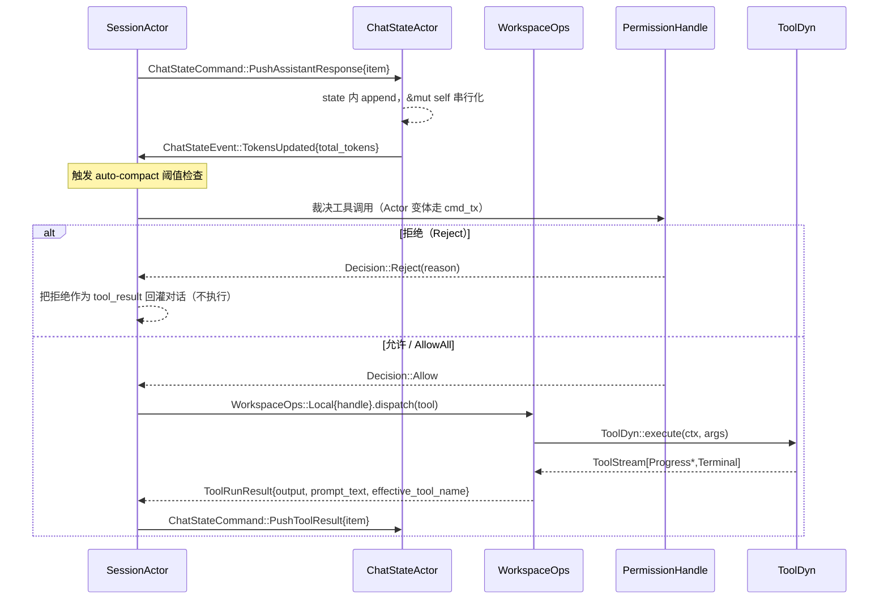

[上一篇：03-详细逐步说明-主链路拆解](03-详细逐步说明-主链路拆解.md) · [总目录](README.md) · [下一篇：05-API与接口设计](05-API与接口设计.md)

# 04：核心模块与类关系

> **场景**：把「模块图」落到真实类型——`Handle` / `Actor` / `Command` / `Event` / `Trait`。读完应能凭本篇在脑子里搭出 Grok Build 全部核心 crate 的对象关系，知道每个对象拥有什么状态、靠什么边界（直接调用 / channel / trait object / 线协议）互相通信，以及失败路径与成功路径分别长什么样。
> **阅读说明**：讲调用关系与数据流，不把行号当稳定 API。行号来自当前工作区快照，随版本变化；以当前源码为准。每关键结论给 `crate/path:line`。

---

## 本文件内容

1. [Why：为什么是 Actor 而不是到处加锁](#1-why为什么是-actor-而不是到处加锁)
2. [四类对象的定义与可见性约定：Handle / Actor / Command / Event](#2-四类对象的定义与可见性约定handle--actor--command--event)
3. [类关系全景（Mermaid classDiagram）](#3-类关系全景mermaid-classdiagram)
4. [谁拥有什么状态——对应 README 不变量 1](#4-谁拥有什么状态对应-readme-不变量-1)
5. [跨 crate 边界的四种连接方式（含真实 file:line）](#5-跨-crate-边界的四种连接方式含真实-fileline)
6. [Actor 运行循环骨架（三个真实 run 实现）](#6-actor-运行循环骨架三个真实-run-实现)
7. [重实现最小对象集、接口与禁止事项](#7-重实现最小对象集接口与禁止事项)

---

## 1. Why：为什么是 Actor 而不是到处加锁

Grok Build 是一个重度异步的程序：`tokio = full`（见根 `Cargo.toml` workspace 依赖）。同一时刻可能有——

- TUI 主线程在渲染、等待用户输入；
- 一个 `SessionActor` 在跑模型回合（流式采样）；
- 多个工具调用（`tokio::spawn` 出去）在读写文件、跑 shell、查 MCP；
- `ChatStateActor` 在把对话落盘（`chat_history.jsonl`）；
- `SamplerActor` 在并发跑多个采样请求；
- `PermissionActor` 在等用户对某个 bash 命令点「允许」。

这些任务都要触碰**共享可变状态**：对话历史、token 计数、权限裁决、文件事实。两条路：

- **方案 A：共享状态 + `Mutex`/`RwLock` 到处加锁**。可读写点分散在十几个 crate，锁粒度难定，易死锁、易忘记持锁、易在 `await` 时持锁跨越 `.await`（这是 Rust 异步里经典的 *hold a std MutexGuard across await* bug）。
- **方案 B：Actor（单写者 + `mpsc`）**。把「状态」关进一个 struct，只让它跑在**一个** `tokio` task 里（单写者）；所有外部访问都通过「发消息」——`mpsc::UnboundedSender<Command>`。消息串行处理，状态内部永远单线程访问，**根本不需要锁**。

Grok Build 选了方案 B，并把它做成一条贯穿全系统的纪律：

> **每个拥有状态的核心对象 = 一个 `Actor` + 一个 `Handle`（调用端口）+ 一组 `Command`（入站消息）+ 一组 `Event`（观察端口）。**

这条纪律让「不变量 1」（UI 状态 / 会话状态 / 对话事实 / 文件事实由不同模块拥有）变成**编译期可强制**的结构，而不是靠 code review 维持的约定。

关键源码证据——`ChatStateActor` 独占持久化 trait 对象，且 `&mut self` 即可，无需任何锁：

- `crates/codegen/xai-chat-state/src/actor/mod.rs:36` — `persistence: Box<dyn ChatPersistence>`（actor 独占）
- `crates/codegen/xai-chat-state/src/persistence.rs:23` — `pub trait ChatPersistence: Send + 'static { fn persist_message(&mut self, ...); ... }`（所有方法 `&mut self`，注释明确写「no locks, no atomics, no shared state」）

> **阅读说明**：Actor 不是银弹。单写者意味着「状态 owner 的处理循环」是系统瓶颈点，所以重活（流式采样、工具执行）被 `tokio::spawn` 出去并发跑，actor 自己只做「串行化、收口、落盘」。见 [§6](#6-actor-运行循环骨架三个真实-run-实现) 的 `SamplerActor` 与 `SessionActor` 两套不同循环。

---

## 2. 四类对象的定义与可见性约定：Handle / Actor / Command / Event

本章把全系统的核心类型分成四类。下面先给**定义 + 真实类型证据**，再给**可见性约定**（这是重实现最容易踩坑的地方：哪些 `pub`、哪些 `pub(crate)`）。

### 2.1 Handle（调用端口，对外 `pub`）

`Handle` 是「指向 actor 的便宜可克隆句柄」。内部通常只是 `mpsc::UnboundedSender<Command>`，外加少量 `Arc<AtomicXxx>` / `Arc<Mutex<_>>` 的**只读或原子**旁路字段（用于不进 actor 就能同步读的状态，如 `current_prompt_id`）。所有**会改状态**的操作都必须走 `cmd_tx.send(Command)`。

真实类型：

- `SessionHandle`：`crates/codegen/xai-grok-shell/src/session/handle.rs:47`，`#[derive(Clone)] pub struct`，字段含 `cmd_tx: mpsc::UnboundedSender<SessionCommand>`（`:48`）、`chat_state_handle: xai_chat_state::ChatStateHandle`（`:73`）、`permissions: PermissionHandle`（来自 `SessionActor`，见 `acp_session.rs:687`）。
- `ChatStateHandle`：`crates/codegen/xai-chat-state/src/handle.rs:20`，`pub struct`，**唯一字段** `cmd_tx: mpsc::UnboundedSender<ChatStateCommand>`（`:21`）。
- `SamplerHandle`：`crates/codegen/xai-grok-sampler/src/handle.rs:19`，`pub struct`，唯一字段 `cmd_tx: mpsc::UnboundedSender<SamplerCommand>`（`:20`）。
- `WorkspaceHandle`：`crates/codegen/xai-grok-workspace/src/handle.rs:431`，`pub struct`，唯一字段 `shared: Arc<WorkspaceShared>`（`:432`）——注意它是 `Arc` 持有共享状态，但 `WorkspaceShared` 内部才分锁，Handle 本身不持有可变状态。
- `PermissionHandle`：`crates/codegen/xai-grok-workspace/src/permission/manager/mod.rs:78`，注意它是 **`enum` 而非 struct**：`Actor { cmd_tx, yolo_state, auto_state, ... } | AllowAll`（`:78-99`）。`AllowAll` 变体表示「免权限模式」，调用方 `match` 即可短路。

> **可见性约定**：`Handle` 几乎都 `pub`、可跨 crate 持有。`SessionHandle` 虽 `pub`，但其 `persistence_tx` 是 `pub(crate)`（`handle.rs:50`），外部拿不到持久化旁路。

### 2.2 Actor（单写者，常 `pub(crate)` 或 `pub` 但字段私有）

`Actor` 是「拥有状态、跑在独立 task 里、串行消费 `Command`」的那个 struct。它的 **字段几乎都私有**——外部只能通过 `Handle` 发命令，不能直接 `&mut` 它。

真实类型与字段：

- `SessionActor`：`crates/codegen/xai-grok-shell/src/session/acp_session.rs:645`，`pub(crate) struct`。字段海量，关键有：`state: TokioMutex<State>`（`:684`，注意会话级状态仍用 `TokioMutex` 因为回合内要跨 `.await` 持锁，但**只在 actor task 内**）、`notifications: NotificationSender`（`:686`）、`permissions: PermissionHandle`（`:687`）、`chat_state_handle`（`:704`）、`tool_context`（`:688`）、`mcp_state: Arc<TokioMutex<McpState>>`（`:694`）。
- `ChatStateActor`：`crates/codegen/xai-chat-state/src/actor/mod.rs:30`，`pub struct`（字段私有）。`state: ChatState`（`:32`）、`persistence: Box<dyn ChatPersistence>`（`:36`）、`cmd_rx: mpsc::UnboundedReceiver<ChatStateCommand>`（`:38`）、`event_tx: mpsc::UnboundedSender<ChatStateEvent>`（`:40`）、`cancellation_token`（`:42`）。
- `SamplerActor`：`crates/codegen/xai-grok-sampler/src/actor/mod.rs:27`，`pub struct`（字段私有）。`cmd_rx`（`:28`）、`event_tx: mpsc::UnboundedSender<SamplingEvent>`（`:29`）、`state: ActorState`（`:30`）、`tasks: JoinSet<RequestId>`（`:35`）——`JoinSet` 是它并发跑采样任务的核心。
- Permission 的 actor 不在本篇逐一展开，但其 Handle 由 `spawn_permission_manager` 产出（见 `mod.rs:1404`）。

> **可见性约定**：`SessionActor` 是 `pub(crate)`（只在本 crate 内构造/运行）；`ChatStateActor`/`SamplerActor` 是 `pub` 但**字段私有**，外部只能拿到 `Handle`。这条「struct 可 `pub`、字段私有」的写法，让 `spawn()` 成为唯一构造入口（`ChatStateActor::spawn` 在 `actor/mod.rs:54`，`SamplerActor::spawn` 在 `actor/mod.rs:42`）。

### 2.3 Command（入站消息，多半 `pub(crate)`）

`Command` 是 `enum`，每个 variant 是一个「请求 actor 做某事」的消息。分两类：

- **fire-and-forget**：发完不等结果，如 `ChatStateHandle::push_user_message`（`handle.rs:40`）直接 `cmd_tx.send(ChatStateCommand::PushUserMessage { item })`。
- **请求/响应**：variant 里带 `respond_to: oneshot::Sender<_>`，actor 处理完 `reply.send(...)`，调用方 `await` 这个 `oneshot::Receiver`。

真实类型与代表 variant：

- `SessionCommand`：`crates/codegen/xai-grok-shell/src/session/commands.rs:249`。代表 variant：`Initialize`（`:250`）、`ReplaceSystemPrompt`（`:257`，非破坏式同步系统提示）、`Prompt`（`:285`，回合入口，含 `prompt_id`/`prompt_blocks`/`respond_to: oneshot::Sender<PromptTurnResult>`（`:311`））、`SetSessionModel`（`:327`）、`CancelOptions`（`:240`）等。
- `ChatStateCommand`：`crates/codegen/xai-chat-state/src/commands.rs:56`，**variant 极多**（25+），见 [§2.3.1](#231-chatstatecommand-的-variant-全表为什么会这么多)。
- `SamplerCommand`：`crates/codegen/xai-grok-sampler/src/commands.rs:20`，`pub(crate) enum`：`Submit`（`:24`，含 `completion_tx: Option<oneshot::Sender<...>>`）、`Cancel`（`:34`）、`UpdateConfig`（`:37`）、`IsActive`（`:40`）、`ActiveCount`（`:46`）。

#### 2.3.1 `ChatStateCommand` 的 variant 全表（为什么会这么多）

`ChatStateCommand` 不是「几个大操作」，而是把**对账历史的一切小动作**都做成独立 variant，目的是让它们都在 actor 内**串行化**，避免任何 `read-modify-write` 竞态：

```text
PushUserMessage                  PushUserMessageAndAck           AppendWorkingDirectorySwitchAndAck
PushUserMessageWithRepairReason  PushAssistantResponse           PushToolResult
PushModelOutput                  PushUnreportedModelOutput       RecordTokenUsage
RecordLastTurnUsage              RecordModelCallUsage            RecordSubagentUsage
MarkUsageIncomplete              IncrementPromptIndex           UpdateSamplingConfig
RecordAgentEditedPath            RecordStreamStart              RecordTurnStart
ReplaceConversation              RepairHistory                  StripConversationImages
ReplaceSystemHead                CachePromptText                RecordCompactionAt
Flush                            UpdateCredentials               RestoreSnapshot
```

来源：`crates/codegen/xai-chat-state/src/commands.rs:56-200`。

为什么这很重要——README 不变量 2 说「`Completed` 才是提交屏障」，而 `ReplaceSystemHead`（`:181`）的注释明确指出：它**在 actor 内执行**，从而和 `PushAssistantResponse`/`PushToolResult` 串行，避免「mid-turn reconnect 用 `GetConversation`+`ReplaceConversation` 的 read-modify-write 丢更新」。这就是「单写者 actor」带来的正确性收益，不是性能优化。

> **失败路径同样走 Command**：`RepairHistory`（`:154`）带 `turn_active: Option<Arc<AtomicBool>>`，actor 内**再次**检查 `turn_active`，因为「调用方侧的 check 会和 turn start 竞态」——只有进到 actor 处理时才真的串行化。若 `turn_active` 为真则返回 `RepairHistoryBlocked`。这是把「竞态」显式建模进 Command 的真实例子。

### 2.4 Event（观察端口，多半 `pub`）

`Event` 是 actor **主动往外推**的消息，用于「观察」而非「请求」。通常有一个共享的 `mpsc::UnboundedSender<Event>`，多个订阅者各持 `UnboundedReceiver`。事件**丢失也安全**（接收端掉线只是 `drop`，见 `ChatStateActor::send_event` 在 `actor/mod.rs:47`）。

真实类型：

- `SamplingEvent`：`crates/codegen/xai-grok-sampler/src/events.rs:52`，`pub enum`。代表 variant：`StreamStarted`（`:54`）、`FirstToken`（`:60`）、`ChannelToken`（`:63`）、`ToolCallDelta`（`:75`，流式工具调用参数增量）、`ResponseStarted`（`:94`）、`ReasoningCompleted`（`:107`）、`Completed`（`:113`，携带 `Box<ConversationResponse>` 与 `InferenceLatencyStats`）、`ImagesStripped`（`:120`）、`Retrying`（`:128`）。`SessionActor` 订阅 `SamplingEvent` 并把它翻译成 ACP 通知。
- `ChatStateEvent`：`crates/codegen/xai-chat-state/src/events.rs:8`，`pub enum`。variant：`PromptIndexChanged`（`:10`）、`TokensUpdated`（`:14`）、`ConversationReset`（`:18`）、`ImageBudget`（`:24`）。注意这是 `ChatStateActor` 推给 `SessionActor` 的**内部协调事件**（不是给客户端的）。
- `SessionEvent`：`crates/codegen/xai-grok-shell/src/session/replay_events.rs:106`，`pub(crate) enum`——`SessionActor` 自己的内部事件总线（replay buffer / 通知重放用）。

> **Command 与 Event 的方向性**：Command 是「外→actor」（请求），Event 是「actor→外」（观察）。两者走**不同的 channel**，不存在「回包走 Event」的混淆：`Command` 的请求/响应走 `oneshot`，`Event` 永远单向广播。

---

## 3. 类关系全景（Mermaid classDiagram）

下面这张图把本章覆盖的全部真实类型按「四类对象」着色（用 UML 关系近似表示）。箭头语义：

- `-->` 实线：持有 / 发送（Handle 持 `cmd_tx` 指向 Actor；Actor 持 Handle 指向子 Actor）
- `..>` 虚线：trait 实现 / 依赖
- `*--` 组合：`WorkspaceOps` 内含 `WorkspaceHandle`（`Local`）或 `WorkspaceClient`（`Proxy`）

```mermaid
classDiagram
    direction LR

    class SessionHandle {
        +cmd_tx: UnboundedSender~SessionCommand~
        +chat_state_handle: ChatStateHandle
        +current_prompt_id: Arc~Mutex~Option~String~~
        +pending_interactions: PendingInteractions
        +permissions: PermissionHandle
        +mcp_servers: Vec~McpServer~
    }
    class SessionActor {
        <<pub(crate)>>
        -state: TokioMutex~State~
        -permissions: PermissionHandle
        -chat_state_handle: ChatStateHandle
        -mcp_state: Arc~TokioMutex~McpState~~
    }
    class SessionCommand {
        <<pub(crate) enum>>
        Initialize / ReplaceSystemPrompt
        Prompt / SetSessionModel
        CancelOptions
    }
    class SessionEvent {
        <<pub(crate) enum>>
        replay / notification bus
    }

    class ChatStateHandle {
        +cmd_tx: UnboundedSender~ChatStateCommand~
    }
    class ChatStateActor {
        -state: ChatState
        -persistence: Box~dyn ChatPersistence~
        -cmd_rx: UnboundedReceiver~ChatStateCommand~
        -event_tx: UnboundedSender~ChatStateEvent~
    }
    class ChatStateCommand {
        <<pub enum>>
        PushUserMessage / PushAssistantResponse
        ReplaceSystemHead / Flush
    }
    class ChatStateEvent {
        <<pub enum>>
        PromptIndexChanged / TokensUpdated
        ConversationReset / ImageBudget
    }
    class ChatPersistence {
        <<trait>>
        persist_message(&mut self)
        replace_history(&mut self)
        flush(&mut self)
    }

    class SamplerHandle {
        +cmd_tx: UnboundedSender~SamplerCommand~
    }
    class SamplerActor {
        -cmd_rx: UnboundedReceiver~SamplerCommand~
        -event_tx: UnboundedSender~SamplingEvent~
        -state: ActorState
        -tasks: JoinSet~RequestId~
    }
    class SamplerCommand {
        <<pub(crate) enum>>
        Submit / Cancel / UpdateConfig
    }
    class SamplingEvent {
        <<pub enum>>
        StreamStarted / ChannelToken
        ToolCallDelta / Completed
    }
    class SamplingClient {
        http: reqwest::Client
        base_url: String
        endpoint: EndpointTemplate
    }

    class Tool {
        <<trait>>
        type Args / type Output
        id() / execute() / run()
    }
    class ToolDyn {
        <<trait, erased>>
        id() / execute(Value)
    }
    class ToolDispatch {
        <<trait>>
        call() / call_terminal()
    }
    class ToolCallContext {
        +call_id: ToolCallId
        +extensions: TypedExtensions
    }

    class WorkspaceOps {
        <<pub enum>>
        Local~handle~ / Proxy~client~
    }
    class WorkspaceHandle {
        +shared: Arc~WorkspaceShared~
    }
    class WorkspaceClient

    class PermissionHandle {
        <<pub enum>>
        Actor~cmd_tx, yolo_state~ / AllowAll
    }

    class AppView
    class Action {
        <<pub enum>>
        Quit / NewSession / SendPrompt
    }
    class Effect {
        <<pub enum>>
        CreateSession / SendPrompt
    }
    class TaskResult {
        <<pub enum>>
        SessionCreated / SessionFailed
    }

    SessionHandle --> SessionActor : cmd_tx
    SessionActor --> SessionCommand : consumes
    SessionActor ..> SessionEvent : emits
    SessionHandle --> ChatStateHandle : owns
    SessionActor --> ChatStateHandle : owns
    SessionActor --> PermissionHandle : owns

    ChatStateHandle --> ChatStateActor : cmd_tx
    ChatStateActor --> ChatStateCommand : consumes
    ChatStateActor ..> ChatStateEvent : emits
    ChatStateActor ..> ChatPersistence : owns Box~dyn~

    SessionActor --> SamplerHandle : owns
    SamplerHandle --> SamplerActor : cmd_tx
    SamplerActor --> SamplerCommand : consumes
    SamplerActor ..> SamplingEvent : emits
    SamplerActor ..> SamplingClient : spawns req task

    Tool <|.. ToolDyn : blanket impl T:Tool
    ToolDispatch ..> ToolDyn : dispatches
    ToolDyn ..> ToolCallContext : execute(ctx,args)

    WorkspaceOps *-- WorkspaceHandle : Local
    WorkspaceOps --> WorkspaceClient : Proxy
    WorkspaceOps ..> PermissionHandle : consults

    AppView --> Action : input produces
    Action --> Effect : dispatch returns
    Effect --> TaskResult : JoinSet completes
```

> **读图要点**：`SessionActor` 是一个**聚合根**——它同时持有 `ChatStateHandle`、`PermissionHandle`、`SamplerHandle`（经 `tool_context`/采样子系统），并把 `SessionCommand` 翻译成对这些子 actor 的调用。这正对应 README 心智模型里 `CMD["SessionCommand::Prompt"] --> TURN["SessionActor::handle_prompt"] --> BUILD["ChatStateHandle::build_request"] --> SAMPLE["SamplerHandle / SamplingEvent"]` 的链路（`README.md:94-97`）。

---

## 4. 谁拥有什么状态——对应 README 不变量 1

README 不变量 1（`README.md:109`）原文：

> **1. UI 状态、会话状态、对话事实、文件事实由不同模块拥有。**

把这条不变量翻译成真实对象归属：

| 状态类别 | 拥有者（真实类型） | 证据 file:line | 不拥有的边界 |
|---|---|---|---|
| **UI 状态** | `AppView`（xai-grok-pager 的渲染状态） + `Action`/`Effect`/`TaskResult` 三元组（`crates/codegen/xai-grok-pager/src/app/actions.rs:40/1446/2333`） | `actions.rs:40` `actions.rs:1446` `actions.rs:2333` | UI 永远不直接碰对话历史，只通过 `Effect` 发命令 |
| **会话状态** | `SessionActor`（`acp_session.rs:645`）：回合状态、`State`、`mcp_state`、`pending_interactions`、信号 | `acp_session.rs:684` `acp_session.rs:712` | 对话「事实」不在会话 actor，**在 ChatStateActor** |
| **对话事实** | `ChatStateActor`（`actor/mod.rs:30`）：`ChatState`、token、`ConversationItem`、压缩边界、凭证 | `actor/mod.rs:32` `actor/mod.rs:36` | 会话 actor 只持 `ChatStateHandle`，改对话必须发 `ChatStateCommand` |
| **文件事实** | `WorkspaceHandle` / `WorkspaceOps`（xai-grok-workspace，`handle.rs:431` `workspace_ops.rs:1452`）+ `HunkTrackerHandle`（挂在 `SessionHandle::hunk_tracker_handle`，`handle.rs:71`） | `handle.rs:431` `workspace_ops.rs:1452` `handle.rs:71` | 文件事实的「沙箱裁决」再交给 `PermissionHandle`（`mod.rs:78`） |
| **权限裁决状态** | `PermissionHandle`（`enum Actor{cmd_tx, yolo_state, auto_state, ...}` / `AllowAll`，`mod.rs:78`） | `mod.rs:78-99` | 权限只裁决「能否做」，不拥有文件事实 |

### 4.1 一个跨 owner 的写操作长什么样（成功 + 失败）

以「模型返回一段 assistant 文本 + 工具调用」为例，体会状态如何**跨 owner 流动**：



证据：
- `PushAssistantResponse` variant：`commands.rs:83`
- `TokensUpdated` event：`events.rs:14`
- `ToolRunResult` 字段：`crates/codegen/xai-grok-tools/src/types/output.rs:136-147`（`output` / `prompt_text` / `effective_tool_name`）
- `ToolDyn::execute` 签名：`crates/common/xai-tool-runtime/src/tool.rs:333`

> **失败路径（务必同等看待）**：若 `PermissionHandle == AllowAll` 之外的 Actor 变体里 `cmd_tx` 接收端已掉线（permission actor panic），`PermissionHandle` 的裁决方法 `send` 失败——调用方必须按「默认拒绝（fail closed）」处理，否则会变成静默放行。这正是 `mcp_pre_decision`（`mod.rs:117`）「deny wins over any grant」的同一安全姿态在另一处的体现。

---

## 5. 跨 crate 边界的四种连接方式（含真实 file:line）

Grok Build 的 crate 之间只通过**四种**边界通信。重实现时必须严格选对，不能混用。

### 5.1 直接调用（sync / async，同 owner 内）

最快、零分配。仅用于「调用方已经持有目标对象的 `&self`/`&mut self`」的场景——典型是 actor **内部**访问自己字段，或 tool 运行时调用已类型化的 `Tool::execute`。

- `SessionActor` 直接读 `self.chat_state_handle`、`self.permissions`、`self.mcp_state`：`acp_session.rs:687` `:694` `:704`。
- `Tool` trait 的默认 `execute` 直接 `await self.run(...)`：`crates/common/xai-tool-runtime/src/tool.rs:87-96`。
- `ToolDyn` 对 `T: Tool` 的 blanket impl 直接 `Tool::execute(self, ctx, typed_args)`：`tool.rs:358`。

**失败路径**：直接调用若跨 `.await` 持 `&mut` 会编译失败（借用检查）或运行时死锁（若误用 `std::Mutex`）。系统用 `TokioMutex` 规避（`SessionActor::state` 是 `TokioMutex<State>`，`acp_session.rs:684`）。

### 5.2 Channel（`mpsc` / `oneshot`）——跨 actor 的边界

这是「Handle → Actor」与「Actor → 观察者」的标准边界。

**入站（Command）**：`Handle` 持 `UnboundedSender<Command>`，`Actor` 持 `UnboundedReceiver<Command>`。

```text
ChatStateHandle.cmd_tx ──mpsc──> ChatStateActor.cmd_rx
  (handle.rs:21)                  (actor/mod.rs:38)

SamplerHandle.cmd_tx  ──mpsc──> SamplerActor.cmd_rx
  (handle.rs:20)                  (actor/mod.rs:28)

SessionHandle.cmd_tx  ──mpsc──> SessionActor（run_session 的 cmd_rx）
  (handle.rs:48)                  (run_loop.rs:184)
```

**出站（Event）**：`Actor` 持 `UnboundedSender<Event>`，观察者持 `UnboundedReceiver<Event>`。

```text
SamplerActor.event_tx  ──mpsc──> SessionActor（订阅 SamplingEvent）
  (actor/mod.rs:29)

ChatStateActor.event_tx ──mpsc──> SessionActor（订阅 ChatStateEvent）
  (actor/mod.rs:40)              (run_loop.rs:185)
```

**请求/响应（oneshot）**：variant 带 `respond_to`，如 `SessionCommand::Prompt { respond_to: oneshot::Sender<PromptTurnResult> }`（`commands.rs:311`）、`ChatStateCommand::PushUserMessageAndAck { reply }`（`commands.rs:63`）。

> **失败路径（channel 关闭）**：
> - 所有 `Handle` 被 drop → `cmd_rx.recv()` 返回 `None` → actor `break`（优雅退出）：`ChatStateActor::run` 在 `actor/mod.rs:106-109`；`SamplerActor::run` 在 `actor/mod.rs:84`。
> - 事件接收端掉线 → `event_tx.send(event).is_err()` → 仅 `debug!` 并 drop：`ChatStateActor::send_event` 在 `actor/mod.rs:47-50`。**事件丢失安全**。
> - `oneshot` 的接收方在 actor 处理前被 drop → `reply.send(...)` 返回 `Err`，actor 用 `let _ =` 吞掉：`ChatStateHandle::push_user_message_and_ack` 在 `handle.rs:46-51` 用 `query(...)` 包了一层，receiver 掉线时返回 `Indeterminate` 错误（`handle.rs:68-73`）——**把「未知」显式建模成错误，对应 README 不变量 6（结果未知先对账）**。

### 5.3 Trait object（`Box<dyn Trait>`）——跨实现的边界

用于「调用方持接口、实现可替换/可注入」。

- `ChatStateActor` 独占 `Box<dyn ChatPersistence>`（`actor/mod.rs:36`），所有持久化方法 `&mut self`（`persistence.rs:23-47`）。真实实现把 `&mut self` 内部再转成「发 `PersistenceMsg` 给一个独立的持久化 task」（见 `handle.rs:50` 的 `persistence_tx: mpsc::UnboundedSender<PersistenceMsg>`——注意 `ChatStateActor` 自己拥有持久化，而 `SessionHandle` 也持一个 `persistence_tx` 旁路供 extension handler 用）。
- `Tool` 经 `ToolDyn` 做类型擦除（`tool.rs:306`），注册进 tool registry 后作为 `Arc<dyn ToolDyn>` 被 `ToolDispatch::call` 调度（`dispatch.rs:32-40`）。
- `PermissionHandle::Actor` 内部也是「trait object 风格的 actor」——持 `cmd_tx` 指向 permission actor。

> **失败路径**：`ChatPersistence` 方法是 `&mut self` 且**不返回 Result**（如 `persist_message` 返回 `()`，`persistence.rs:25`）。这意味着「磁盘写入失败」不在 trait 层传播，而是交给内部的持久化 task 用 `oneshot` 回包（`replace_history_for_strip_and_ack` 返回 `oneshot::Receiver<io::Result<()>>`，`persistence.rs:40-43`）。即：**fire-and-forget 的持久化不报错，只有「需确认的strict append」才回包**。这是「写丢失 vs 写未知」的显式分流。

### 5.4 线协议（ACP / Hub WebSocket）——跨进程/跨网络的边界

用于「调用方不在本进程」：TUI ↔ Shell、Shell ↔ 远程 Workspace hub。

- **ACP（Agent Client Protocol）**：TUI 进程（`xai-grok-pager`）与 Shell（`xai-grok-shell`）之间走 `agent_client_protocol`（`acp`）。客户端 JSON-RPC 进来 → gateway → `SessionHandle::cmd_tx` → `SessionCommand::Prompt`（`commands.rs:285`）。`SessionActor` 把 `SamplingEvent` 翻译成 ACP 通知发回（`events.rs:52` 注释「The session translates these into ACP notifications」）。
- **Hub WebSocket（Workspace Proxy 模式）**：`WorkspaceOps::Proxy { client: WorkspaceClient }`（`workspace_ops.rs:1457`）把所有 workspace 操作经 hub WebSocket 路由到远程 workspace server。对比 `WorkspaceOps::Local { handle: WorkspaceHandle }`（`workspace_ops.rs:1455`）是进程内直连。

```text
  进程内（Local）                          跨网络（Proxy）
  ┌──────────────┐                         ┌──────────────┐
  │ SessionActor │                         │ SessionActor │
  │   │          │                         │   │          │
  │   ▼          │                         │   ▼          │
  │ WorkspaceOps │                         │ WorkspaceOps │
  │  └Local{     │                         │  └Proxy{     │
  │    handle}   │                         │    client}   │
  │   │          │                         │   │  Hub WS  │
  │   ▼          │                         │   ▼          │
  │ WorkspaceHandle                       │ WorkspaceClient ──► remote hub
  │  (Arc<Shared>)│                        │  (tokio WS)  │
  └──────────────┘                         └──────────────┘
```

证据：`workspace_ops.rs:1452-1458`（enum 定义）、`workspace_ops.rs:1487`（`client()` 取 `WorkspaceClient`）、`workspace_ops.rs:1494`（`workspace_handle()` 取 `WorkspaceHandle`）。

> **失败路径（线协议）**：Proxy 模式下 `WorkspaceClient` 断线 → 所有 `WorkspaceOps` 调用返回连接错误，且 `WorkspaceOps::bind_local_session` 在 `Proxy` 变体下是 **no-op**（`workspace_ops.rs:1523-1525`：`let Self::Local { handle } = self else { return Ok(()); }`）。即「local 才绑 toolset，proxy 永远跳过」——重实现时**不能**在 proxy 分支假设 session 已建立。`connect_local_workspace`（`handle.rs:4166`）返回的 `WorkspaceHandle` 必须「caller 保持 alive 整个 server 连接期」（注释 `handle.rs:4164-4165`），drop 即断连。

---

## 6. Actor 运行循环骨架（三个真实 run 实现）

三种 actor 的循环**形状不同**，正是因为它们拥有不同性质的状态。逐个给出真实骨架。

### 6.1 `ChatStateActor::run` —— 最简「单接收者 + 取消令牌」

来源：`crates/codegen/xai-chat-state/src/actor/mod.rs:97-114`。

```rust
// crate/codegen/xai-chat-state/src/actor/mod.rs:97
async fn run(mut self) {
    loop {
        tokio::select! {
            biased;
            _ = self.cancellation_token.cancelled() => {
                debug!("ChatStateActor shutting down via cancellation");
                break;                       // 成功/失败统一出口：取消令牌
            }
            cmd = self.cmd_rx.recv() => {
                let Some(cmd) = cmd else {
                    debug!("ChatStateActor shutting down: all handles dropped");
                    break;                   // 失败出口：所有 Handle 被 drop
                };
                self.handle_command(cmd).await;   // 串行消费，&mut self 安全
            }
        }
    }
}
```

- `handle_command` 用 `match cmd { ChatStateCommand::PushUserMessage { item } => ... }` 分发（`actor/mod.rs:117-120`）。
- **成功路径**：每个 Command 在 actor 内同步改 `state` 并（按需）调 `persistence`。
- **失败路径**：`cancellation_token` 触发优雅退出；`cmd_rx` 全 drop 退出；`handle_command` 内若 `persistence` 失败，fire-and-forget 命令静默，`&mut self` 的 strict-append 命令经 `oneshot` 把 `StrictAppendError` 回给调用方（`persistence.rs:46-52` 的 `NotCommitted`/`Committed`/`Indeterminate` 三态）。

### 6.2 `SamplerActor::run` —— 「接收者 + JoinSet 并发任务」

来源：`crates/codegen/xai-grok-sampler/src/actor/mod.rs:58-89`。

关键差异：`SamplerActor` 既收 `SamplerCommand`，又 `tokio::select!` 在 `tasks.join_next()` 上——因为真正的采样工作被 `tokio::spawn` 到 `JoinSet<RequestId>` 里并发跑（actor 注释 `actor/mod.rs:1-6`：「single-threaded command processing, but spawns per-request tasks」）。

```rust
// crate/codegen/xai-grok-sampler/src/actor/mod.rs:58
async fn run(mut self) {
    loop {
        tokio::select! {
            biased;
            // 优先清理已完成的请求任务，避免 active_requests 长期陈旧
            Some(joined) = self.tasks.join_next(), if !self.tasks.is_empty() => {
                match joined {
                    Ok(request_id) => {
                        self.state.remove(&request_id);   // 成功：任务正常结束，清理
                    }
                    Err(join_err) => {
                        tracing::warn!(error=%join_err,
                            "request task panicked or was aborted");  // 失败：任务 panic
                        // 注意：panic 的任务其 request_id 仍在 active_requests，
                        // 除非用户先 Cancel（Cancel 也会 remove）。见 §6.2 失败路径。
                    }
                }
            }
            cmd = self.cmd_rx.recv() => {
                match cmd {
                    Some(cmd) => self.handle_command(cmd),
                    None => break,   // 所有 SamplerHandle 被 drop
                }
            }
        }
    }
    // 退出前 cancel 仍在跑的任务，避免孤儿 task
}
```

- `handle_command` 对 `Submit` 调 `state.insert` 并 `tasks.spawn(...)` 真正请求（`commands.rs:24` 的 `Submit` 含 `completion_tx`，供 `submit_and_collect` 用）。
- **成功路径**：`JoinSet` 任务完成 → `state.remove(request_id)` → 若 `completion_tx` 在，回包 `ConversationResponse`；同时 actor 已在流式过程中通过 `event_tx` 推了 `SamplingEvent::{StreamStarted,ChannelToken,...,Completed}`。
- **失败路径**：
  1. 任务 **panic/abort** → `join_next()` 返回 `Err(join_err)`，`request_id` 不会被自动 `remove`（只有用户 `Cancel` 才 remove，`actor/mod.rs:71` 注释）。后果：该 `request_id` 卡在 `active_requests`，`ActiveCount` 虚高，直到会话取消。这是「**结果未知**」的真实场景，对应 README 不变量 6。
  2. `Cancel { request_id }`（`commands.rs:34`）→ actor 取消对应任务并从 `state` 移除。
  3. 所有 `SamplerHandle` drop → `cmd_rx.recv()` 返回 `None` → `break`，随后 cancel 剩余 `tasks`（注释 `actor/mod.rs:90`）。

### 6.3 `SessionActor::run_session` —— 「多接收者 select」聚合根

来源：`crates/codegen/xai-grok-shell/src/session/acp_session_impl/run_loop.rs:182` 入口，`loop { tokio::select! }` 在 `run_loop.rs:347`。

`SessionActor` 不是「一个 cmd_rx 循环」——它是**聚合根**，同时订阅多条 channel + 多个定时器，所以用 `tokio::select!` 扇入：

```rust
// crate/codegen/xai-grok-shell/src/session/acp_session_impl/run_loop.rs:347 (节选骨架)
loop {
    tokio::select! {
        biased;
        // 1) idle flush 定时器（memory flush）
        _ = &mut idle_flush_sleep, if session.idle_flush_timeout.is_some() && ... => { ... }
        // 2) dream consolidation 定时器
        _ = &mut dream_check_sleep, if session.dream_check_timeout.is_some() && ... => { ... }
        // 3) 模型切换通知（watch channel）
        changed = model_switch_rx.changed() => { ... }
        // 4) ChatStateActor 推来的协调事件
        event = chat_state_event_rx.recv() => {
            match event {
                Some(ChatStateEvent::ConversationReset { new_len }) => { ... }
                Some(ChatStateEvent::ImageBudget { .. }) => { ... }
                None => { /* ChatStateActor 退出 */ }
            }
        }
        // 5) Session 自身内部事件总线（replay）
        event = event_rx.recv() => { ... }   // SessionEvent @ replay_events.rs:106
        // 6) 外部命令（Prompt / Cancel / SetSessionModel ...）
        cmd = cmd_rx.recv() => {
            match cmd {
                Some(SessionCommand::Prompt { .. }) => { ... }
                Some(SessionCommand::Cancel { .. }) => { ... }
                None => break,  // 全部 SessionHandle drop
            }
        }
        // 7) 回合完成回包
        completion = completion_rx.recv() => { ... }
    }
}
```

- 入口：`run_session(session: Arc<SessionActor>, cmd_rx, chat_state_event_rx, event_rx, ...)`（`run_loop.rs:182`），在 `spawn_session_actor` 处 `tokio::spawn` 出去（详见 `acp_session.rs` 的 spawn 路径）。
- **成功路径**：`SessionCommand::Prompt` 进入 `handle_prompt` → 跑回合 → 流式 `SamplingEvent` 经 gateway 推 ACP 通知 → `Completed` 后 `completion_tx.send(PromptTurnResult)`（`:192-193` 的 `completion_rx`）→ `TaskResult` 回到 TUI。
- **失败路径**：
  1. `cmd_rx.recv()` → `None`：所有 `SessionHandle` 被 drop → `break`，触发 `fire_session_end_hooks`（`run_loop.rs:35`）与 `finish_session_exit_feedback`（`:67`）做内存落盘、background task manifest 持久化、scratch 清理。
  2. `ChatStateActor` 先死：`chat_state_event_rx.recv()` → `None` → session 失去「对话事实」协调源，必须走降级（不能继续写对话）。
  3. `SessionEvent` replay channel 关闭：影响通知重放，不阻断主链路。
  4. `completion_rx` 在 `PromptTurnResult` 发出前 TUI 侧 `oneshot` 被 drop：`send` 失败、`let _ =`，回合结果丢失但会话状态已落盘（ChatStateActor 不依赖这个回包）。

> **三种循环的设计取舍小结**：

| Actor | 循环形状 | 为什么 |
|---|---|---|
| `ChatStateActor` | 单 `cmd_rx` + 取消令牌 | 状态纯串行、无并发子任务 |
| `SamplerActor` | `cmd_rx` + `JoinSet::join_next` | 采样任务并发，需回收 `RequestId` |
| `SessionActor` | 多 `cmd_rx`/`event_rx`/定时器扇入 | 聚合根，要同时响应命令、子 actor 事件、定时器 |

---

## 7. 重实现最小对象集、接口与禁止事项

凭本篇重实现一个**功能等价**的最小系统，需要的对象集与接口如下。

### 7.1 最小对象集（按四类）

**Handle（调用端口，可 `pub`、可克隆，内部仅 `cmd_tx` + 只读/原子旁路）**

- `SessionHandle`：`cmd_tx: UnboundedSender<SessionCommand>`，外加 `chat_state_handle`、`permissions`、`current_prompt_id`（原子旁路）。`handle.rs:47`。
- `ChatStateHandle`：仅 `cmd_tx: UnboundedSender<ChatStateCommand>`。`handle.rs:20`。
- `SamplerHandle`：仅 `cmd_tx: UnboundedSender<SamplerCommand>`。`handle.rs:19`。
- `WorkspaceHandle`：`Arc<WorkspaceShared>`（共享，内部再分锁）。`handle.rs:431`。
- `PermissionHandle`：**enum** `Actor{cmd_tx, yolo_state, auto_state, ...} | AllowAll`。`mod.rs:78`。

**Actor（单写者，字段私有，仅 `spawn()` 构造）**

- `SessionActor`（`pub(crate)`，聚合根）：`state`、`permissions`、`chat_state_handle`、`tool_context`、`mcp_state`。`acp_session.rs:645`。
- `ChatStateActor`（`pub`）：`state: ChatState` + `persistence: Box<dyn ChatPersistence>` + `cmd_rx` + `event_tx` + `cancellation_token`。`actor/mod.rs:30`。
- `SamplerActor`（`pub`）：`cmd_rx` + `event_tx` + `state: ActorState` + `tasks: JoinSet<RequestId>`。`actor/mod.rs:27`。

**Command（入站 enum）**

- `SessionCommand`（含 `Prompt`/`Cancel`/`SetSessionModel`）、`ChatStateCommand`（25+ 小动作，含 strict-append 回包变体）、`SamplerCommand`（`Submit`/`Cancel`/`UpdateConfig`/`IsActive`/`ActiveCount`）。

**Event（观察 enum，丢失安全）**

- `SamplingEvent`（流式子类型，供转 ACP 通知）、`ChatStateEvent`（内部协调）、`SessionEvent`（内部 replay 总线）。

**Trait（类型擦除 + 持久化接口）**

- `Tool`（`tool.rs:36`）+ `ToolDyn`（`tool.rs:306`）+ `ToolDispatch`（`dispatch.rs:32`）+ `ToolCallContext`（`context.rs:66`）。
- `ChatPersistence`（`persistence.rs:23`，全部 `&mut self`）。
- `WorkspaceOps` enum（`workspace_ops.rs:1452`）：`Local`/`Proxy`。

**TUI 三元组**

- `Action`（`actions.rs:40`）→ `Effect`（`actions.rs:1446`）→ `TaskResult`（`actions.rs:2333`）：输入产生 Action，dispatch 返回 Effect，事件循环 `JoinSet` 跑 Effect，完成经 `TaskResult` 回流。

### 7.2 必实现的最小接口契约

```text
// Handle 侧（对外 API 的全部 surface）
SessionHandle::cmd_tx.send(SessionCommand::Prompt{ prompt_id, prompt_blocks,
                                                   respond_to: oneshot<PromptTurnResult>, .. })
ChatStateHandle::push_user_message(item)                      // fire-and-forget
ChatStateHandle::push_user_message_and_ack(item).await        // oneshot 回包
SamplerHandle::submit(request_id, request)                    // fire-and-forget，结果走 event
PermissionHandle::Actor{ cmd_tx, yolo_state, .. } | AllowAll  // match 短路免权限

// Actor 侧（spawn 唯一入口）
ChatStateActor::spawn(conversation, config, Box<dyn ChatPersistence>,
                      event_tx, cancellation_token) -> ChatStateHandle   // actor/mod.rs:54
SamplerActor::spawn(config, retry_policy, event_tx) -> SamplerHandle      // actor/mod.rs:42

// Tool 侧
impl Tool for MyTool { type Args=..; type Output=..; fn id()->ToolId;
                       async fn execute(ctx, args)->ToolStream<Output>; }
// 类型擦除自动获得：impl ToolDyn for T:Tool  (tool.rs:337)

// Workspace 侧
WorkspaceOps::Local{ handle } | WorkspaceOps::Proxy{ client }   // workspace_ops.rs:1452
connect_local_workspace(cwd, hub_url, auth, ..) -> WorkspaceHandle  // handle.rs:4166
```

### 7.3 禁止事项（重实现红线）

1. **禁止**让两个 actor 共享同一份可变状态并各自加锁。状态必须「单写者」——谁拥有，谁串行改。交叉访问只能走 Command/Event。
2. **禁止**在 `ChatStateActor` 之外直接 `&mut` 改 `ConversationItem` 历史；所有写入必须经 `ChatStateCommand`（否则破坏 `ReplaceSystemHead` 的串行化保证，`commands.rs:181`）。
3. **禁止**把「流式 token」当「完成」。`Completed`（`events.rs:113`）才是提交屏障（README 不变量 2）。未完成就落盘 = 脏数据。
4. **禁止**让工具调用不闭合。每个 `tool_call_id` 必须有且仅有一个 `tool_result`（`ToolRunResult`/`PushToolResult`），否则对话结构损坏（README 不变量 3）。
5. **禁止**把权限裁决和 OS 沙箱混为一层。`PermissionHandle`（裁决，`mod.rs:78`）与 workspace 沙箱是两层（README 不变量 4）。`AllowAll` 只能来自显式 yolo，不能因 channel 掉线默认产生。
6. **禁止**因取消自动撤销已发生的副作用（README 不变量 5）。`Cancel`（`commands.rs:34`）只停未来工作，已写的文件/已发的请求不回滚。
7. **禁止**结果未知时盲目重试（README 不变量 6）。`oneshot` 接收方掉线 → 返回 `Indeterminate`，由调用方对账，不得假装成功。
8. **禁止**在 `WorkspaceOps::Proxy` 分支假设 session 已建立——`bind_local_session` 在 proxy 下是 no-op（`workspace_ops.rs:1523`）。
9. **禁止**让 `SamplerActor` 在 actor task 内同步跑 LLM 请求——必须 `tasks.spawn` 并发，否则阻塞所有 `SamplerCommand` 处理（见 §6.2 设计）。
10. **禁止**让 `Event` channel 关闭导致 actor panic——事件丢失必须安全 drop（参考 `actor/mod.rs:47` 的 `if send().is_err() { debug!; }`）。

### 7.4 一句话重实现路线

> 先造 `ChatStateActor`（`Box<dyn ChatPersistence>` + 单 `cmd_rx`）跑通「对话串行化」；再造 `SamplerActor`（`JoinSet` 并发 + `SamplingEvent`）；然后用 `SessionActor` 聚合两者 + `PermissionHandle` + `WorkspaceOps`；最后用 TUI 三元组 `Action/Effect/TaskResult` 把用户输入接成 `SessionCommand::Prompt`。四类对象的契约（Handle 只发命令、Actor 只串行改、Command 区分 fire-and-forget/oneshot、Event 单向广播）一旦守住，跨 crate 的四种边界（直接调用/channel/trait object/线协议）就不会串味。

---

> **本章与已核对锚点的核对结论**：上方所有 `crate/path:line` 均已在当前工作区快照用 `Read`/`Grep` 实际核对（见下「汇报」）。本篇新增的关键事实：`ChatStateCommand` 的 25+ variant 全表（`commands.rs:56-200`）、`SessionActor::run_session` 的多接收者 `select!` 扇入结构（`run_loop.rs:182`/`347`）、`SamplerActor` 借 `JoinSet<RequestId>` 做并发回收（`actor/mod.rs:35`）、`PermissionHandle` 实为 `enum`（非 struct，`mod.rs:78`）、`ChatStateActor` 独占 `Box<dyn ChatPersistence>` 且 `&mut self` 无锁（`persistence.rs:23`）。
