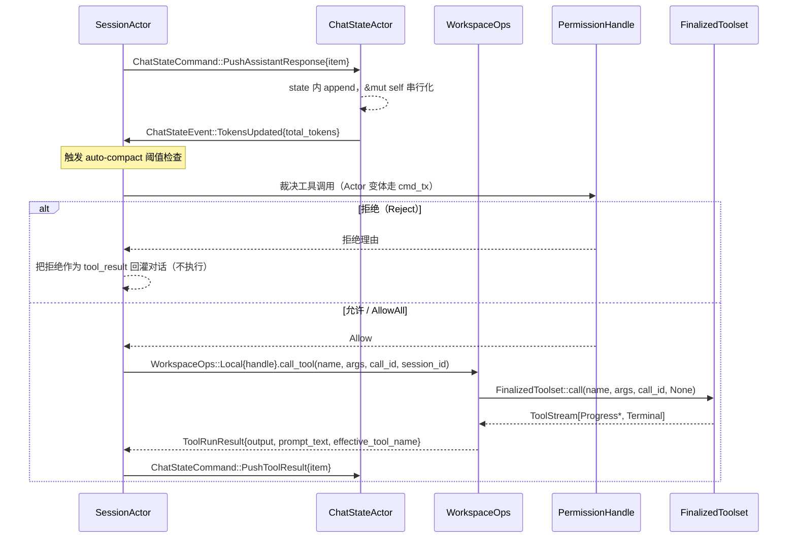

[上一篇：03-详细逐步说明-主链路拆解](03-详细逐步说明-主链路拆解.md) · [总目录](README.md) · [下一篇：05-API与接口设计](05-API与接口设计.md)

# 04：核心模块与类关系

> **场景**：把「模块图」落到真实类型——`Handle` / `Actor` / `Command` / `Event` / `Trait`。读完应能凭本篇在脑子里搭出 Grok Build 全部核心 crate 的对象关系，知道每个对象拥有什么状态、靠什么边界（直接调用 / channel / trait object / 线协议）互相通信，以及失败路径与成功路径分别长什么样。
> **工具版本**：Rust `1.94.0`（`rust-toolchain.toml:11`）；`ratatui 0.29` / `tokio`（features `full`）/ `agent-client-protocol 0.10.4`（根 `Cargo.toml` `[workspace.dependencies]`）。workspace members = **101**（`Cargo.toml:8` 起）。
> **阅读说明**：讲调用关系与数据流，不把行号当稳定 API。行号来自当前工作区快照（HEAD `6c01b90c`），随版本变化；以当前源码为准。凡能给出函数名的位置，一律用「函数 + 函数内相对偏移（`+0` = 函数定义行）」定位，行号只作为辅助。

---

## 本文件内容

1. [Why：为什么是 Actor 而不是到处加锁](#1-why为什么是-actor-而不是到处加锁)
2. [四类对象的定义与可见性约定：Handle / Actor / Command / Event](#2-四类对象的定义与可见性约定handle--actor--command--event)
3. [类关系全景（Mermaid classDiagram）](#3-类关系全景mermaid-classdiagram)
4. [谁拥有什么状态——对应 README 不变量 1](#4-谁拥有什么状态对应-readme-不变量-1)
5. [跨 crate 边界的四种连接方式（含真实源码索引）](#5-跨-crate-边界的四种连接方式含真实源码索引)
6. [Actor 运行循环骨架（三个真实 run 实现）](#6-actor-运行循环骨架三个真实-run-实现)
7. [重实现最小对象集、接口与禁止事项](#7-重实现最小对象集接口与禁止事项)

---

## 1. Why：为什么是 Actor 而不是到处加锁

Grok Build 是一个重度异步的程序：`tokio = { version = "1", features = ["full"] }`（根 `Cargo.toml` workspace 依赖）。同一时刻可能有——

- TUI（`xai-grok-pager`）在渲染、等待用户输入；
- 一个 `SessionActor` 在跑模型回合（流式采样）；
- 多个工具调用在读写文件、跑 shell、查 MCP；
- `ChatStateActor` 在把对话落盘（`chat_history.jsonl`）；
- `SamplerActor` 在并发跑多个采样请求；
- 权限 actor 在等用户对某个 bash 命令点「允许」。

这些任务都要触碰**共享可变状态**：对话历史、token 计数、权限裁决、文件事实。两条路：

- **方案 A：共享状态 + `Mutex`/`RwLock` 到处加锁**。可读写点分散在几十个 crate，锁粒度难定，易死锁、易忘记持锁、易在 `await` 时持锁跨越 `.await`（Rust 异步里的经典 *hold a std MutexGuard across await* bug）。
- **方案 B：Actor（单写者 + `mpsc`）**。把「状态」关进一个 struct，只让它跑在**一个** task 里（单写者）；所有外部访问都通过「发消息」——`mpsc::UnboundedSender<Command>`。消息串行处理，状态内部永远单线程访问，**根本不需要锁**。

Grok Build 选了方案 B，并把它做成一条贯穿全系统的纪律：

> **每个拥有状态的核心对象 = 一个 `Actor` + 一个 `Handle`（调用端口）+ 一组 `Command`（入站消息）+ 一组 `Event`（观察端口）。**

关键源码证据——`ChatStateActor` 独占持久化 trait 对象，且所有持久化方法收 `&mut self`，无需任何锁：

- `crates/codegen/xai-chat-state/src/actor/mod.rs` Struct：`ChatStateActor` 偏移 `+5` — `persistence: Box<dyn ChatPersistence>`（actor 独占）。
- `crates/codegen/xai-chat-state/src/persistence.rs` Trait：`ChatPersistence`（`:17`）——模块头注释原文「The actor owns persistence exclusively (`Box<dyn ChatPersistence>`), so the trait uses `&mut self` — no locks, no atomics, no shared state.」

> **阅读说明**：Actor 不是银弹。单写者意味着「状态 owner 的处理循环」是系统瓶颈点，所以重活（流式采样、工具执行）被 `tokio::spawn` 出去并发跑，actor 自己只做「串行化、收口、落盘」。见 [§6](#6-actor-运行循环骨架三个真实-run-实现) 的 `SamplerActor` 与 `SessionActor` 两套不同循环。

---

## 2. 四类对象的定义与可见性约定：Handle / Actor / Command / Event

本章把全系统的核心类型分成四类。下面先给**定义 + 真实类型证据**，再给**可见性约定**（这是重实现最容易踩坑的地方：哪些 `pub`、哪些 `pub(crate)`）。

### 2.1 Handle（调用端口，对外 `pub`）

`Handle` 是「指向 actor 的便宜可克隆句柄」。内部通常只是 `mpsc::UnboundedSender<Command>`，外加少量 `Arc<AtomicXxx>` / `Arc<Mutex<_>>` 的**只读或原子**旁路字段（用于不进 actor 就能同步读的状态，如 `current_prompt_id`）。所有**会改状态**的操作都必须走 `cmd_tx.send(Command)`。

真实类型：

- `SessionHandle`：`crates/codegen/xai-grok-shell/src/session/handle.rs:53`，`#[derive(Clone)] pub struct`。**当前版本的 `SessionHandle` 是一个巨型只读旁路袋**，共 40+ 字段，按性质分四组：
  - **命令入口**：`pub cmd_tx: mpsc::UnboundedSender<SessionCommand>`（`:54`）。
  - **`pub(crate)` 旁路**（外部 crate 拿不到）：`persistence_tx: mpsc::UnboundedSender<PersistenceMsg>`（`:55`）、`active_work: Arc<AtomicUsize>`（`:60`）、`client_caps: SessionClientCaps`（`:79`）、`upload_queue: Arc<OnceLock<UploadQueue>>`（`:94`）、`upload_failures_since_success: Arc<AtomicU64>`（`:97`）。
  - **共享给 actor 的同步可见状态**：`current_prompt_id: Arc<std::sync::Mutex<Option<String>>>`（`:57`）、`pending_interactions: PendingInteractions`（`:59`）、`gateway_enabled: Arc<AtomicBool>`（`:73`）、`emit_local_background_tasks: Arc<AtomicBool>`（`:77`）、`plan_mode: Arc<parking_lot::Mutex<PlanModeTracker>>`（`:121`）、`force_compact: Arc<AtomicBool>`（`:124`）、`resolved_tool_overrides: Arc<ArcSwapOption<ToolOverrides>>`（`:64-65`）、`registry_write_order: RegistryWriteOrder`（`:151`）。
  - **子 actor / 子端口句柄**：`chat_state_handle: xai_chat_state::ChatStateHandle`（`:68`）、`hunk_tracker_handle: HunkTrackerHandle`（`:67`）、`permission_handle: xai_grok_workspace::permission::PermissionHandle`（`:125`）、`workspace_ops: xai_grok_workspace::WorkspaceOps`（`:139`）、`signals_handle: SessionSignalsHandle`（`:70`）、`terminal_backend: Option<Arc<dyn TerminalBackend>>`（`:142-143`）、`tools_notification_handle`（`:146-147`）、`scheduler_handle`（`:149-150`）、`feedback_manager: Arc<FeedbackManager>`（`:91`）。
  - **per-session 的配置快照**（leader 模式下防止跨客户端污染）：`model_id: acp::ModelId`（`:101`）、`reasoning_effort`（`:102`）、`yolo_mode`（`:105`）、`origin_client`（`:107`）、`code_nav_enabled`（`:111`）、`ask_user_question_enabled`（`:115`）、`non_interactive`（`:118`）、`agent_name: String`（`:131`）、`allowed_subagent_types`（`:135`）、`hook_registry`（`:137`）、`mcp_servers: Vec<acp::McpServer>`（`:81`）。
  - 方法面很窄：`SessionHandle::is_busy`（`handle.rs` 函数：`is_busy` `+0`，`:333`）、`list_tasks`（`:346`）、`call_mcp_tool`（`:627`）是少数 `pub` 方法，其余 ~40 个是 `pub(crate)`（如 `get_model_metadata`、`snapshot_tool_definitions`、`get_mcp_status`）。
- `ChatStateHandle`：`crates/codegen/xai-chat-state/src/handle.rs:20`，`pub struct`，**唯一字段** `cmd_tx: mpsc::UnboundedSender<ChatStateCommand>`（`:21`）。同文件还定义了「邮箱已关」的类型化错误 `ChatStateMailboxClosed`（`:26`）。
- `SamplerHandle`：`crates/codegen/xai-grok-sampler/src/handle.rs:33`，`pub struct`，唯一字段 `cmd_tx: mpsc::UnboundedSender<SamplerCommand>`（`:34`）。`SamplerHandle::new`（函数：`new` `+0`，`:39`）是 `pub(crate)`——只有 `SamplerActor::spawn` 能产出；`SamplerHandle::noop`（`:46`）造一个 receiver 立刻被 drop 的空句柄，供测试与「actor 还没接好」的占位。
- `WorkspaceHandle`：`crates/codegen/xai-grok-workspace/src/handle.rs:418`，`pub struct`，唯一字段 `pub(crate) shared: Arc<WorkspaceShared>`（`:419`）——注意它是 `Arc` 持有共享状态，但 `WorkspaceShared` 内部才分锁，Handle 本身不持有可变状态。
- `HunkTrackerHandle`：`crates/codegen/xai-hunk-tracker/src/handle.rs:17`，唯一字段 `cmd_tx: mpsc::UnboundedSender<HunkTrackerCommand>`（`:18`）。
- `PermissionHandle`：`crates/codegen/xai-grok-workspace/src/permission/manager/mod.rs:67`，注意它是 **`enum` 而非 struct**：
  - `Actor { cmd_tx, yolo_state, auto_state, side_query_wired, yolo_pin, deny_read_globs, in_flight, user_prompt_notify }`（`:68-86`）——8 个字段，其中 `yolo_pin: Option<&'static str>`（`:78`）是「托管策略钉住」：`Some` 时 agent 会把客户端传来的每个 yolo 重新夹回非 yolo。
  - `AllowAll`（`:87`）——免权限模式，调用方 `match` 即可短路。

> **可见性约定**：`Handle` 几乎都 `pub`、可跨 crate 持有。`SessionHandle` 虽 `pub`，但 `persistence_tx` / `active_work` / `client_caps` / `upload_queue` / `upload_failures_since_success` 都是 `pub(crate)`——外部拿不到持久化旁路与会话内部工作计数。这是「对外面窄、对内部宽」的典型做法：跨 crate 只需要 `cmd_tx` + 子句柄。

### 2.2 Actor（单写者，常 `pub(crate)` 或 `pub` 但字段私有）

`Actor` 是「拥有状态、跑在独立 task 里、串行消费 `Command`」的那个 struct。它的 **字段几乎都私有**——外部只能通过 `Handle` 发命令，不能直接 `&mut` 它。

真实类型与字段：

- `SessionActor`：`crates/codegen/xai-grok-shell/src/session/acp_session.rs:728`，`pub(crate) struct`。字段海量（跨 300+ 行），关键有：
  - `state: TokioMutex<State>`（`:761`）——会话级状态仍用 `TokioMutex`，因为回合内要跨 `.await` 持锁，但**只在 actor task 内**持。
  - `notifications: NotificationSender`（`:763`）——通知传输（gateway / persistence channel / replay buffer 三合一）。
  - `permissions: PermissionHandle`（`:764`）、`tool_context: ToolContext`（`:765`）。
  - `deny_read_globs: Vec<String>`（`:768`）——托管 Read-deny glob，构造时解析一次，注入 ToolBridge 让 Grep 排除策略禁止路径。
  - `mcp_state: Arc<TokioMutex<McpState>>`（`:771`）——单锁保证 config 更新与 init 状态检查原子。
  - `mcp_strategy: std::cell::Cell<McpInitStrategy>`（`:775`）——per-attachment 策略，用 `Cell` 因为可无 `&mut self` 改。
  - `chat_state_handle: ChatStateHandle`（`:779`）、`current_prompt_id: Arc<std::sync::Mutex<Option<String>>>`（`:781`）、`active_work: Arc<AtomicUsize>`（`:782`）。
  - `pending_interactions: PendingInteractions`（`:787`）——阻塞式反向请求（permission / question / plan-approval）按 `tool_call_id` 索引，共享给 `SessionHandle` 让 roster 能同步读 `NeedsInput`；**永不持久化**。
  - `file_state_tracker: Arc<FileStateTracker>`（`:806`）——rewind 用；`rewind_pending_prompt: std::sync::Mutex<Option<String>>`（`:809`）。
  - `startup_hints: StartupHints`（`:811`）、`status_wake: status_line::StatusWake`（`:814`）、`compaction: super::compaction_config::CompactionConfig`（`:827`）。
  - 大量 `std::cell::Cell` / `RefCell` 字段（`transient_retries_prompt_total`、`tool_overrides`、`delivery_tools`…）——这是「actor 单线程」这一事实被编译器/类型系统显式利用的痕迹：不需要 `Mutex`，`Cell` 就够。
- `ChatStateActor`：`crates/codegen/xai-chat-state/src/actor/mod.rs:30`，`pub struct`（字段私有）。`state: ChatState`（`:32`）、`pruning_config: PruningConfig`（`:34`）、`persistence: Box<dyn ChatPersistence>`（`:36`）、`cmd_rx: mpsc::UnboundedReceiver<ChatStateCommand>`（`:38`）、`event_tx: mpsc::UnboundedSender<ChatStateEvent>`（`:40`）、`cancellation_token: tokio_util::sync::CancellationToken`（`:42`）。
- `SamplerActor`：`crates/codegen/xai-grok-sampler/src/actor/mod.rs:21`，`pub struct`（字段私有）。`cmd_rx`（`:22`）、`event_tx: mpsc::UnboundedSender<SamplingEvent>`（`:23`）、`state: ActorState`（`:24`）、`tasks: JoinSet<RequestId>`（`:27`）——`JoinSet` 是它并发跑采样任务的核心，注释明写「A finished task returns its `RequestId` so the actor can clean up `active_requests`」。

> **可见性约定**：`SessionActor` 是 `pub(crate)`（只在本 crate 内构造/运行，且跑在 `LocalSet` 上，非 `Send`——`crates/codegen/xai-grok-shell/src/session/mcp_restart.rs` 注释「The production impl holds `Arc<SessionActor>` (!Send)」）；`ChatStateActor` / `SamplerActor` 是 `pub` 但**字段私有**，外部只能拿到 `Handle`。这条「struct 可 `pub`、字段私有」的写法，让 `spawn()` 成为唯一构造入口（`ChatStateActor::spawn` 在 `actor/mod.rs` 函数：`spawn` `+0`（`:54`）；`SamplerActor::spawn` 在 `actor/mod.rs` 函数：`spawn` `+0`（`:33`））。

### 2.3 Command（入站消息，多半 `pub(crate)`）

`Command` 是 `enum`，每个 variant 是一个「请求 actor 做某事」的消息。分两类：

- **fire-and-forget**：发完不等结果，如 `ChatStateCommand::PushUserMessage { item }`（`commands.rs:59`）。
- **请求/响应**：variant 里带 `respond_to` / `reply` / `responds_to` 的 `oneshot::Sender<_>`，actor 处理完 `reply.send(...)`，调用方 `await` 这个 `oneshot::Receiver`。命名在三个 crate 里**不统一**（`respond_to` / `responds_to` / `reply`），重实现时别按名字猜语义。

真实类型与代表 variant：

- `SessionCommand`：`crates/codegen/xai-grok-shell/src/session/commands.rs:334`，`pub enum`，**107 个 variant，enum 体到 `:939`**。代表 variant：
  - `Initialize { system_prompt }`（`:335`）
  - `ReplaceSystemPrompt { system_prompt }`（`:341`）——非破坏式同步系统提示：只换开头的 `System` 消息，保留 user/assistant 回合，背后是原子化的 `ChatStateCommand::ReplaceSystemHead`。
  - `EmitStatusSnapshot`（`:345`）——客户端 attach 到常驻会话时补发状态快照。
  - `Prompt { prompt_id, prompt_blocks, prompt_mode, artifact_upload_ctx, client_identifier, screen_mode, verbatim, traceparent, json_schema, send_now, admission, tool_overrides_update, respond_to: oneshot::Sender<PromptTurnResult>, prompt_admitted, persist_ack, parsed_prompt_tx }`（`:365`）——回合入口，**字段最多的 variant**。其中 `send_now: bool` 是 cancel-and-send（打断当前回合并把这条排到下一位）；`persist_ack` 是「落盘已确定」信号（被 `UserPromptSubmit` hook 拦下的 prompt 会立刻触发，因为什么都没存）；`parsed_prompt_tx` 把解析后的内容块回传给调用方，避免二次解析。
  - `SetSessionModel { switch, responds_to: oneshot::Sender<Result<acp::ModelId, acp::Error>> }`（`:416`）
  - `CompactSession { user_context, respond_to: oneshot::Sender<acp::Result<()>> }`（`:458`）
  - `ReloadHooks`（`:469`）、`RefreshSkillBaseline`（`:471`）、`ResetPermissionState`（`:503`）、`RepairHistory { … }`（`:511`）、`FlushComplete { … }`（`:576`）、`UpdateMcpServers { … }`（`:591`）、`PersistGitHead { commit, branch }`（`:935`）。
  - `PromptTurnResult` 是**类型别名而非 struct**：`pub(crate) type PromptTurnResult = Result<PromptTurnOk, acp::Error>;`（`commands.rs:134`）。
- `ChatStateCommand`：`crates/codegen/xai-chat-state/src/commands.rs:56`，`pub enum`，**66 个 variant，enum 体到 `:390`**。分三块（源码注释用 `═══ Mutations (fire-and-forget) ═══` / 查询块分隔）：见 [§2.3.1](#231-chatstatecommand-的-variant-全表为什么会这么多)。
- `SamplerCommand`：`crates/codegen/xai-grok-sampler/src/commands.rs:15`，`pub(crate) enum`，**只有 5 个 variant**：`Submit { request_id, request: Box<ConversationRequest>, config: Option<Box<SamplerConfig>>, completion_tx: Option<oneshot::Sender<CollectedSamplingResult>> }`（`:18`）、`Cancel { request_id }`（`:25`）、`UpdateConfig { config: Box<SamplerConfig> }`（`:30`）、`IsActive { request_id, reply: oneshot::Sender<bool> }`（`:35`）、`ActiveCount { reply: oneshot::Sender<usize> }`（`:41`）。

#### 2.3.1 `ChatStateCommand` 的 variant 全表（为什么会这么多）

`ChatStateCommand` 不是「几个大操作」，而是把**对账历史的一切小动作**都做成独立 variant，目的是让它们都在 actor 内**串行化**，避免任何 `read-modify-write` 竞态。按源码注释的三段分类列出：

```text
═══ Mutations (fire-and-forget) ═══            ═══ 严格追加 / 需 ack ═══
PushUserMessage (:59)                          PushUserMessagesBatchAndAck
PushUserMessagesBatch                           PushUserMessageAndAck (:72)
PushAssistantResponse                          AppendWorkingDirectorySwitchAndAck
PushToolResult                                 PushUserMessageWithRepairReason
PushModelOutput                                StripConversationImages (:167)
PushUnreportedModelOutput                      ReplaceSystemHead (:175)
RecordTokenUsage (:104)                        RepairHistory (:157)
RecordLastTurnUsage                            ReplaceConversation (:149)
RecordModelCallUsage
RecordSubagentUsage                            ═══ 查询（带 oneshot 回包）═══
MarkUsageIncomplete                            BuildConversationRequest (:217)
IncrementPromptIndex                           GetConversation (:228)
UpdateSamplingConfig                           GetPromptIndex / GetTotalTokens
RecordAgentEditedPath                          GetLastTurnUsage / GetPromptUsage
RecordStreamStart / RecordTurnStart            GetSessionUsage / GetSamplingConfig
CachePromptText                                GetEstimatedTotalTokens
RecordCompactionAt                             GetEstimatedMessagesTokens
Flush                                          GetAgentEditedPaths
UpdateCredentials                              GetNotificationMeta
RestoreSnapshot                                GetCredentials / GetLastModelMetadata
BeginTurnCapture                               GetConversationLen
AppendHarnessTraceItems                        HasDanglingToolCalls
FlushHarnessTraceTurn                          GetLastAssistantText
RepairDanglingAfterHarnessHalt                 GetTrailingAssistantReport
PopStrandedContinueReminder                    GetLastAssistantTextInTurn
ApplyTurnRequestPruning                        GetAssistantTextInTurn
TruncateToPromptIndex                          GetFirstUserText
CheckAutoCompactNeeded                         GetConversationItemAt
Snapshot                                       GetLastUserQueryText
TakeTurnMessages                               GetConversationCounts
TakeHarnessTraceTurns                          GetSystemMessage
```

来源：`crates/codegen/xai-chat-state/src/commands.rs:56-390`。

为什么这很重要——README 不变量 2 说「`Completed` 才是提交屏障」，而 `ReplaceSystemHead`（`:175`）的注释明确指出：它**在 actor 内执行**，从而和 `PushAssistantResponse` / `PushToolResult` 串行，避免「mid-turn reconnect 用 `GetConversation` + `ReplaceConversation` 的 read-modify-write 丢更新」。这就是「单写者 actor」带来的正确性收益，不是性能优化。

> **失败路径同样走 Command**：`RepairHistory`（`:157`）带 `turn_active` 标志，actor 内**再次**检查它，因为「调用方侧的 check 会和 turn start 竞态」——只有进到 actor 处理时才真的串行化。`StripConversationImages`（`:167`）返回的 ack 类型是 `StripOutcome`（`persistence.rs:45`）：`Applied { stripped }` / `NoMatch` / `WriteFailed { stripped }` / `ActorUnavailable`——**把「actor 已死」显式建模成一种结果**，而不是让调用方把「没人回答」误读成「成功」。

### 2.4 Event（观察端口，多半 `pub`）

`Event` 是 actor **主动往外推**的消息，用于「观察」而非「请求」。通常有一个共享的 `mpsc::UnboundedSender<Event>`，多个订阅者各持 `UnboundedReceiver`。事件**丢失也安全**（接收端掉线只是 `log + drop`，见 `ChatStateActor::send_event` 函数：`send_event` `+0`（`actor/mod.rs:47`））。

真实类型：

- `SamplingEvent`：`crates/codegen/xai-grok-sampler/src/events.rs:36`，`pub enum`，**14 个 variant**：`StreamStarted { request_id, timestamp_ms }`（`:38`）、`FirstToken { request_id }`（`:44`）、`ChannelToken { … }`（`:47`，命名通道 text / reasoning 的内容）、`ToolCallDelta { … }`（`:57`，流式工具调用参数增量）、`ResponseStarted { … }`（`:68`）、`ReasoningCompleted { … }`（`:80`）、`Completed { … }`（`:86`，携带 `Box<ConversationResponse>` 与 `InferenceLatencyStats`）、`DoomLoopSignals { … }`（`:94`，服务端 doom-loop 检测回传）、`ImagesStripped { … }`（`:101`）、`Retrying { … }`（`:109`）、`Failed { … }`（`:124`）、`ModelMetadata { … }`（`:130`）、`BackendToolCallStarted { … }`（`:137`）、`BackendToolCallCompleted { … }`（`:144`）。`SessionActor` 订阅 `SamplingEvent` 并把它翻译成 ACP 通知。
- `ChatStateEvent`：`crates/codegen/xai-chat-state/src/events.rs:8`，`pub enum`，**只有 4 个 variant**：`PromptIndexChanged { new_index }`（`:10`）、`TokensUpdated { total_tokens }`（`:14`）、`ConversationReset { new_len }`（`:18`）、`ImageBudget { body_bytes, trigger_bytes, reclaim_target_bytes, inline_images, needs_image_compaction, evicted, body_bytes_after }`（`:22`）。注意这是 `ChatStateActor` 推给 `SessionActor` 的**内部协调事件**（不是给客户端的）。
- `SessionEvent`：`crates/codegen/xai-grok-shell/src/session/replay_events.rs:94`，`pub(crate) enum`，**只有 2 个 variant**：`Notification(SessionNotification)`（`:95`）与 `FlushReplay { respond_to: Option<oneshot::Sender<()>> }`（`:96`）——`SessionActor` 自己的内部事件总线（replay buffer / 通知重放用）。`SessionEvent::flush_with_ack`（函数：`flush_with_ack` `+0`，`:102`）造出带 ack 的 flush，`flush_replay_actor`（`:121`）在 5 秒超时内等它。

> **Command 与 Event 的方向性**：Command 是「外→actor」（请求），Event 是「actor→外」（观察）。两者走**不同的 channel**，不存在「回包走 Event」的混淆：`Command` 的请求/响应走 `oneshot`，`Event` 永远单向广播。三个 crate 的 Event 数量差异极大（14 / 4 / 2），因为只有 `SamplerActor` 需要把「流式过程」外化——另外两个 actor 的事件只是「状态变了，你来对账」。

---

## 3. 类关系全景（Mermaid classDiagram）

下面这张图把本章覆盖的全部真实类型按「四类对象」着色（用 UML 关系近似表示）。箭头语义：

- `-->` 实线：持有 / 发送（Handle 持 `cmd_tx` 指向 Actor；Actor 持 Handle 指向子 Actor）
- `..>` 虚线：trait 实现 / 依赖
- `*--` 组合：`WorkspaceOps` 内含 `WorkspaceHandle`（`Local`）或 `WorkspaceClient`（`Proxy`）

```mermaid
classDiagram
    direction LR

    class SessionHandle {
        +cmd_tx: UnboundedSender~SessionCommand~
        +chat_state_handle: ChatStateHandle
        +hunk_tracker_handle: HunkTrackerHandle
        +permission_handle: PermissionHandle
        +workspace_ops: WorkspaceOps
        +current_prompt_id: Arc~Mutex~Option~String~~
        +pending_interactions: PendingInteractions
        +gateway_enabled: Arc~AtomicBool~
        +plan_mode: Arc~Mutex~PlanModeTracker~~
        +registry_write_order: RegistryWriteOrder
        -persistence_tx: UnboundedSender~PersistenceMsg~
        -active_work: Arc~AtomicUsize~
    }
    class SessionActor {
        <<pub(crate)>>
        -state: TokioMutex~State~
        -notifications: NotificationSender
        -permissions: PermissionHandle
        -tool_context: ToolContext
        -mcp_state: Arc~TokioMutex~McpState~~
        -chat_state_handle: ChatStateHandle
        -pending_interactions: PendingInteractions
        -file_state_tracker: Arc~FileStateTracker~
    }
    class SessionCommand {
        <<pub enum, 107 variants>>
        Initialize / ReplaceSystemPrompt
        Prompt / SetSessionModel
        CompactSession / RepairHistory
        UpdateMcpServers / PersistGitHead
    }
    class SessionEvent {
        <<pub(crate) enum, 2>>
        Notification / FlushReplay
    }

    class ChatStateHandle {
        +cmd_tx: UnboundedSender~ChatStateCommand~
    }
    class ChatStateActor {
        -state: ChatState
        -pruning_config: PruningConfig
        -persistence: Box~dyn ChatPersistence~
        -cmd_rx: UnboundedReceiver~ChatStateCommand~
        -event_tx: UnboundedSender~ChatStateEvent~
        -cancellation_token: CancellationToken
    }
    class ChatStateCommand {
        <<pub enum, 66 variants>>
        PushUserMessage / PushAssistantResponse
        ReplaceSystemHead / RepairHistory
        BuildConversationRequest / GetConversation
    }
    class ChatStateEvent {
        <<pub enum, 4>>
        PromptIndexChanged / TokensUpdated
        ConversationReset / ImageBudget
    }
    class ChatPersistence {
        <<trait, &mut self>>
        persist_message / replace_history
        replace_history_for_strip_and_ack / flush
    }
    class StripOutcome {
        <<enum, 4>>
        Applied / NoMatch
        WriteFailed / ActorUnavailable
    }

    class SamplerHandle {
        +cmd_tx: UnboundedSender~SamplerCommand~
    }
    class SamplerActor {
        -cmd_rx: UnboundedReceiver~SamplerCommand~
        -event_tx: UnboundedSender~SamplingEvent~
        -state: ActorState
        -tasks: JoinSet~RequestId~
    }
    class SamplerCommand {
        <<pub(crate) enum, 5>>
        Submit / Cancel / UpdateConfig
        IsActive / ActiveCount
    }
    class SamplingEvent {
        <<pub enum, 14>>
        StreamStarted / ChannelToken
        ToolCallDelta / Completed / Failed
    }
    class SamplingClient {
        http: reqwest::Client
        default_headers: HeaderMap
        base_url: String
        endpoint: EndpointTemplate
    }

    class Tool {
        <<trait, 非 object-safe>>
        type Args / type Output
        id() / description() / execute() / run()
    }
    class ToolDyn {
        <<trait, erased>>
        id() / execute(Value)
    }
    class ToolDispatch {
        <<trait, object-safe>>
        call() / call_terminal()
    }
    class ToolCallContext {
        +call_id: ToolCallId
        +extensions: TypedExtensions
    }

    class WorkspaceOps {
        <<pub enum>>
        Local~handle~ / Proxy~client~
    }
    class WorkspaceHandle {
        +shared: Arc~WorkspaceShared~
    }
    class WorkspaceClient {
        -harness: ToolHarness
        -connected: Arc~AtomicBool~
        -deadline: Option~Duration~
    }

    class PermissionHandle {
        <<pub enum>>
        Actor~cmd_tx, yolo_state, auto_state, yolo_pin, ..~
        AllowAll
    }

    class Action {
        <<pub enum>>
        Quit / NewSession / SendPrompt
    }
    class Effect {
        <<pub enum>>
        CreateSession / SendPrompt
    }
    class TaskResult {
        <<pub enum>>
        SessionCreated / SessionFailed
        PromptResponse
    }
    class AgentRuntime {
        +run_stdio()
        +leader_mode()
    }

    SessionHandle --> SessionActor : cmd_tx
    SessionActor --> SessionCommand : consumes
    SessionActor ..> SessionEvent : emits
    SessionHandle --> ChatStateHandle : owns
    SessionActor --> ChatStateHandle : owns
    SessionActor --> PermissionHandle : owns

    ChatStateHandle --> ChatStateActor : cmd_tx
    ChatStateActor --> ChatStateCommand : consumes
    ChatStateActor ..> ChatStateEvent : emits
    ChatStateActor ..> ChatPersistence : owns Box~dyn~
    ChatPersistence ..> StripOutcome : acks

    SessionActor --> SamplerHandle : owns (via tool_context)
    SamplerHandle --> SamplerActor : cmd_tx
    SamplerActor --> SamplerCommand : consumes
    SamplerActor ..> SamplingEvent : emits
    SamplerActor ..> SamplingClient : spawns per-request task

    Tool <|.. ToolDyn : blanket impl for T: Tool
    ToolDispatch ..> ToolDyn : dispatches
    ToolDyn ..> ToolCallContext : execute(ctx, args)

    WorkspaceOps *-- WorkspaceHandle : Local
    WorkspaceOps --> WorkspaceClient : Proxy
    WorkspaceOps ..> PermissionHandle : consults

    Action --> Effect : dispatch returns
    Effect --> TaskResult : completes
    AgentRuntime --> Effect : drives
```

> **读图要点**：`SessionActor` 是一个**聚合根**——它同时持有 `ChatStateHandle`、`PermissionHandle`、`WorkspaceOps`、`SamplerHandle`（经 `tool_context` / 采样子系统），并把 `SessionCommand` 翻译成对这些子 actor 的调用。这正对应 README 心智模型里 `CMD["SessionCommand::Prompt"] --> TURN["SessionActor::handle_prompt"] --> BUILD["ChatStateHandle::build_request"] --> SAMPLE["SamplerHandle / SamplingEvent"]` 的链路（`README.md:94-97`）。

---

## 4. 谁拥有什么状态——对应 README 不变量 1

README 不变量 1（`README.md:109`）原文：

> **1. UI 状态、会话状态、对话事实、文件事实由不同模块拥有。**

把这条不变量翻译成真实对象归属：

| 状态类别 | 拥有者（真实类型） | 源码索引 | 不拥有的边界 |
|---|---|---|---|
| **UI 状态** | `AppView`（xai-grok-pager 渲染状态）+ `Action` / `Effect` / `TaskResult` 三元组（`app/actions.rs:36` / `:1401` / `:2361`） | `app/actions.rs` Struct：`Action`；Struct：`Effect`；Struct：`TaskResult` | UI 永远不直接碰对话历史，只通过 `Effect` 发 ACP 请求 |
| **会话状态** | `SessionActor`（`acp_session.rs:728`）：回合状态、`state: TokioMutex<State>`、`mcp_state`、`pending_interactions`、`startup_hints`、信号 | `acp_session.rs` Struct：`SessionActor` `+33`（`state`）、`+43`（`mcp_state`）、`+59`（`pending_interactions`） | 对话「事实」不在会话 actor，**在 ChatStateActor** |
| **对话事实** | `ChatStateActor`（`actor/mod.rs:30`）：`ChatState`、token、`ConversationItem`、压缩边界、凭证 | `actor/mod.rs` Struct：`ChatStateActor` `+2`（`state`）、`+6`（`persistence`） | 会话 actor 只持 `ChatStateHandle`，改对话必须发 `ChatStateCommand` |
| **文件事实** | `WorkspaceHandle` / `WorkspaceOps`（xai-grok-workspace，`handle.rs:418` / `workspace_ops.rs:1497`）+ `HunkTrackerHandle`（挂在 `SessionHandle::hunk_tracker_handle`，`handle.rs:67`） | `handle.rs` Struct：`WorkspaceHandle`；`workspace_ops.rs` Struct：`WorkspaceOps`；`handle.rs` Struct：`SessionHandle` `+14` | 文件事实的「沙箱裁决」再交给 `PermissionHandle`（`mod.rs:67`） |
| **权限裁决状态** | `PermissionHandle`（`enum Actor { cmd_tx, yolo_state, auto_state, side_query_wired, yolo_pin, deny_read_globs, in_flight, user_prompt_notify } / AllowAll`，`mod.rs:67`） | `permission/manager/mod.rs` Struct：`PermissionHandle` | 权限只裁决「能否做」，不拥有文件事实 |
| **工作区 RPC 事实**（远端模式） | `WorkspaceClient`（`xai-grok-workspace-client/src/lib.rs:142`）：`harness`、`connected: Arc<AtomicBool>`、`deadline` | `lib.rs` Struct：`WorkspaceClient` | 它只是**传输**；真正的文件事实在远端 workspace server |

### 4.1 一个跨 owner 的写操作长什么样（成功 + 失败）

以「模型返回一段 assistant 文本 + 工具调用」为例，体会状态如何**跨 owner 流动**：



源码索引：
- `PushAssistantResponse` variant：`crates/codegen/xai-chat-state/src/commands.rs:92`
- `TokensUpdated` event：`crates/codegen/xai-chat-state/src/events.rs:14`
- `WorkspaceOps::call_tool`：`crates/codegen/xai-grok-workspace/src/workspace_ops.rs` 函数：`call_tool` `+0`（`:1744`）；Local 分支 `+6`（`:1750`）起
- `FinalizedToolset::call`：`crates/codegen/xai-grok-tools/src/registry/types.rs` 函数：`call` `+0`（`:1583`）→ 委托 `call_with_cancellation`（`:1594`）
- `ToolRunResult` 字段：`crates/codegen/xai-grok-tools/src/types/output.rs:134`（`output` / `prompt_text` / `effective_tool_name`）
- `ToolDyn::execute` 签名：`crates/common/xai-tool-runtime/src/tool.rs:322` 起的 trait 内 `execute`

> **失败路径（务必同等看待）**：`WorkspaceOps::call_tool` 的两个分支各有自己的失败形状：
> - **Local 分支**：`session_id` 为 `None` → `ToolError::custom("missing_session", …)`；查不到 session → `ToolError::custom("session_not_found", "… call bind_local_session() first")`（`workspace_ops.rs` 函数：`call_tool` `+11` ~ `+28`）。
> - **Proxy 分支**：先 `client.is_connected()`，为假直接返回 `ToolError::network_error("The workspace server connection was lost. Please restart your session to reconnect.")`；真正传输时若错误是 `is_transport_fatal`，调用方要 `client.mark_disconnected()` 把 `Arc<AtomicBool>` latch 置假——**之后所有调用都会快速失败**，直到 SDK 的 `on_reconnect` 回调调 `mark_connected()`。
> - 权限 actor 若已 panic，`PermissionHandle::Actor` 的 `cmd_tx.send` 失败——调用方必须按「默认拒绝（fail closed）」处理，否则会变成静默放行。这是「deny wins over any grant」的同一安全姿态。

---

## 5. 跨 crate 边界的四种连接方式（含真实源码索引）

Grok Build 的 crate 之间只通过**四种**边界通信。重实现时必须严格选对，不能混用。

### 5.1 直接调用（sync / async，同 owner 内）

最快、零分配。仅用于「调用方已经持有目标对象的 `&self`/`&mut self`」的场景——典型是 actor **内部**访问自己字段，或 tool 运行时调用已类型化的 `Tool::execute`。

- `SessionActor` 直接读 `self.chat_state_handle`、`self.permissions`、`self.mcp_state`：`acp_session.rs` Struct：`SessionActor` `+51`（`permissions`）、`+43`（`mcp_state`）、`+51`（`chat_state_handle`）。
- `Tool` trait 的默认 `execute` 直接 `await self.run(...)`：`crates/common/xai-tool-runtime/src/tool.rs` Trait：`Tool`（`:37`），函数：`Tool::execute` `+0`（`:88`）——它用原生 `async fn` in trait（RPITIT）+ 显式 `Send` 约束，**不是** `#[async_trait]`，所以返回的 future 不被 box。
- `ToolDyn` 对 `T: Tool` 的 blanket impl 直接 `Tool::execute(self, ctx, typed_args)`。

**失败路径**：直接调用若跨 `.await` 持 `&mut` 会编译失败（借用检查）或运行时死锁（若误用 `std::Mutex`）。系统用 `TokioMutex` 规避（`SessionActor::state` 是 `TokioMutex<State>`，`acp_session.rs:761`）。

### 5.2 Channel（`mpsc` / `oneshot`）——跨 actor 的边界

这是「Handle → Actor」与「Actor → 观察者」的标准边界。

**入站（Command）**：`Handle` 持 `UnboundedSender<Command>`，`Actor` 持 `UnboundedReceiver<Command>`。

```text
ChatStateHandle.cmd_tx ──mpsc──> ChatStateActor.cmd_rx
  (handle.rs:21)                  (actor/mod.rs:38)

SamplerHandle.cmd_tx  ──mpsc──> SamplerActor.cmd_rx
  (handle.rs:34)                  (actor/mod.rs:22)

SessionHandle.cmd_tx  ──mpsc──> SessionActor（run_session 的 cmd_rx）
  (handle.rs:54)                  (run_loop.rs:356)
```

**出站（Event）**：`Actor` 持 `UnboundedSender<Event>`，观察者持 `UnboundedReceiver<Event>`。

```text
SamplerActor.event_tx  ──mpsc──> SessionActor（订阅 SamplingEvent）
  (actor/mod.rs:23)

ChatStateActor.event_tx ──mpsc──> SessionActor（订阅 ChatStateEvent）
  (actor/mod.rs:40)              (run_loop.rs:357)

SessionActor 自身 ──mpsc──> event_rx（SessionEvent，replay 总线）
  (replay_events.rs:94)          (run_loop.rs:358)
```

**请求/响应（oneshot）**：variant 带 `respond_to` / `responds_to` / `reply`，如 `SessionCommand::Prompt { respond_to: oneshot::Sender<PromptTurnResult>, … }`（`commands.rs:388`）、`ChatStateCommand::PushUserMessageAndAck { reply }`（`commands.rs:72`）、`SamplerCommand::IsActive { reply: oneshot::Sender<bool> }`（`commands.rs:37`）。

> **失败路径（channel 关闭）**：
> - 所有 `Handle` 被 drop → `cmd_rx.recv()` 返回 `None` → actor `break`（优雅退出）：`ChatStateActor::run` 函数：`run` `+9`（`actor/mod.rs:105` 附近的 `let Some(cmd) = cmd else { … break; }`）；`SamplerActor::run` 函数：`run` `+24`（`actor/mod.rs:72` 附近的 `None => break`）。
> - 事件接收端掉线 → `event_tx.send(event).is_err()` → 仅 `debug!` 并 drop：`ChatStateActor::send_event` 函数：`send_event` `+1`（`actor/mod.rs:48`）。**事件丢失安全**。
> - `oneshot` 的接收方在 actor 处理前被 drop → `reply.send(...)` 返回 `Err`，actor 用 `let _ =` 吞掉（如 `ChatStateCommand::PushUserMessageAndAck` 分支在 `actor/mod.rs` 函数：`handle_command` `+24` 用 `let _ = reply.send(());`）。**「未知」被显式建模**：`ChatStateHandle` 暴露 `ChatStateMailboxClosed`（`handle.rs:26`）表示「actor 邮箱已关」，而不是返回成功。
> - `WorkspaceOps::rpc_raw` 在 **Local 模式**直接返回 `WorkspaceError::HubError("rpc not available in local mode")`（`workspace_ops.rs` 函数：`rpc_raw` `+4`）——**用错模式也是显式失败**，不是静默 no-op。

### 5.3 Trait object（`Box<dyn Trait>` / `Arc<dyn Trait>`）——跨实现的边界

用于「调用方持接口、实现可替换/可注入」。

- `ChatStateActor` 独占 `Box<dyn ChatPersistence>`（`actor/mod.rs:36`），所有持久化方法 `&mut self`（`persistence.rs:17-42`）。真实实现把 `&mut self` 内部再转成「发 `PersistenceMsg` 给一个独立的持久化 task」（`SessionHandle::persistence_tx: mpsc::UnboundedSender<PersistenceMsg>`，`handle.rs:55`——注意 `ChatStateActor` 自己拥有持久化，而 `SessionHandle` 也持一个 `persistence_tx` 旁路供 extension handler 用）。
- `Tool` 经 `ToolDyn` 做类型擦除（`tool.rs:322`），注册进 tool registry 后作为 `Arc<dyn ToolDyn>` 被调度；`ToolCallContext::extensions` 里塞的是 `Arc<dyn ToolDispatch>` 的 newtype 包装 `InnerDispatch(pub Arc<dyn xai_tool_runtime::ToolDispatch>)`（`crates/codegen/xai-grok-tools/src/types/resources.rs:458`），它的真实实现是 `InnerDispatchForToolset`（`crates/codegen/xai-grok-tools/src/registry/types.rs:1286` 的 `impl xai_tool_runtime::ToolDispatch for InnerDispatchForToolset`），用来绕过外层 `ToolBridge` 的互斥锁、避免 `use_tool` 派发到 MCP 工具时死锁。
- `PermissionHandle::Actor` 内部也是「trait object 风格的 actor」——持 `cmd_tx` 指向 permission actor。
- `SessionHandle::terminal_backend: Option<Arc<dyn TerminalBackend>>`（`handle.rs:142-143`）——终端后端可替换（本地 PTY / 远端）。

> **失败路径**：`ChatPersistence` 方法分两档——
> - **fire-and-forget 档**：`persist_message`（`persistence.rs:19`）与 `replace_history`（`persistence.rs:30`）、`flush`（`persistence.rs:42`）返回 `()`，**磁盘写失败不在 trait 层传播**。
> - **需确认档**：`persist_working_directory_switch_and_ack` 返回 `oneshot::Receiver<Result<StrictAppendAck, StrictAppendError>>`（`persistence.rs:22-25`），`replace_history_for_strip_and_ack` 返回 `oneshot::Receiver<io::Result<()>>`（`persistence.rs:36-39`）。
> 这是「写丢失 vs 写未知」的显式分流：不需要确认的写入不报错；需要确认的写入必须 `await` ack，否则崩溃窗口内的记录会静默丢失。

### 5.4 线协议（ACP / Hub WebSocket / workspace.* RPC）——跨进程/跨网络的边界

用于「调用方不在本进程」：TUI ↔ Shell、Shell ↔ 远端 Workspace hub、工具服务器 ↔ hub。

- **ACP（Agent Client Protocol）**：TUI 进程（`xai-grok-pager`）与 Shell（`xai-grok-shell`）之间走外部 crate `agent-client-protocol`（别名 `use agent_client_protocol as acp;`）。`xai-acp-lib` 把每种「请求/响应」绑定成 `AcpAgentMessage` / `AcpClientMessage` 的变体，并在 gateway 里分发到 `acp::Agent` / `acp::Client` 实现（`MvpAgent` 在 `crates/codegen/xai-grok-shell/src/agent/mvp_agent/acp_agent.rs:92` 的 `impl acp::Agent for MvpAgent`）。客户端 JSON-RPC 进来 → gateway → `SessionHandle::cmd_tx` → `SessionCommand::Prompt`（`commands.rs:365`）。`SessionActor` 把 `SamplingEvent` 翻译成 ACP 通知发回。
- **Hub WebSocket**：`xai-computer-hub-sdk` 的 `ToolHarness`（`crates/common/xai-computer-hub-sdk/src/harness.rs:606`）承载与 hub 的连接；服务端实现 `ToolServerHandler`（`crates/common/xai-computer-hub-sdk/src/server.rs:161`）。`WorkspaceOps::Proxy { client: WorkspaceClient }`（`workspace_ops.rs:1501`）把所有 workspace 操作经 hub 路由到远端 workspace server，方法名形如 `workspace.git_status_ext`。
- **`workspace.*` RPC**：`xai-grok-workspace-types` 的 `rpc` 模块定义 `WorkspaceRpc` trait（`crates/codegen/xai-grok-workspace-types/src/rpc/mod.rs:60`）与 `RpcEnvelope`（`rpc/envelope.rs:22`）。这是**当前版本新增的一整层端口**，见 [05-API与接口设计](05-API与接口设计.md) §7。

```text
  进程内（Local）                          跨网络（Proxy）
  ┌──────────────┐                         ┌──────────────────────────┐
  │ SessionActor │                         │ SessionActor             │
  │   │          │                         │   │                      │
  │   ▼          │                         │   ▼                      │
  │ WorkspaceOps │                         │ WorkspaceOps             │
  │  └Local{     │                         │  └Proxy{                 │
  │    handle}   │                         │    client}               │
  │   │          │                         │   │  workspace.* RPC     │
  │   ▼          │                         │   ▼  (hub tool_id=       │
  │ WorkspaceHandle                       │ WorkspaceClient           │
  │  (Arc<Shared>)│                        │  └ ToolHarness (WS)      │
  │   │          │                         │        │                 │
  │   ▼          │                         │        ▼                 │
  │ FinalizedToolset                      │  remote workspace server  │
  └──────────────┘                         └──────────────────────────┘
```

源码索引：`workspace_ops.rs` Struct：`WorkspaceOps`（`:1497`）；`local` 函数 `+10`（`:1507`）；`proxy` 函数 `+13`（`:1510`）；`proxy_with_connected` `+19`（`:1516`）；`is_proxy` `+25`（`:1522`）；`client` `+29`（`:1526`）；`workspace_handle` `+36`（`:1533`）。

> **失败路径（线协议）**：
> - Proxy 模式下 `WorkspaceClient` 断线 → `WorkspaceClient::rpc_raw` 第一句就是 `if !self.is_connected() { return Err(WorkspaceClientError::NotConnected); }`（`xai-grok-workspace-client/src/lib.rs` 函数：`rpc_raw` `+5`）——**latch 是「一旦断过就一直失败」**，直到 `mark_connected()`。
> - `WorkspaceOps::rpc_raw` 在 `Proxy` 变体下转发到 `client.rpc_raw`，`Local` 变体直接报错（`workspace_ops.rs` 函数：`rpc_raw` `+0`）。
> - 远端 workspace server 对未实现的方法回 `RpcError { code: "unknown_method" }`；老版本二进制回 `hub_error` + message 前缀 `"unknown workspace method:"`。`RpcError::is_unknown_method()`（`rpc/envelope.rs` 函数：`is_unknown_method` `+0`）**同时识别三种历史形状**——重实现者不能只判 `code`。
> - `TURN_ACTIVE = "turn_active"`（`rpc/envelope.rs:12`）：`workspace.update_tool_config` 在会话有活跃回合时会被拒，语义是「回合边界可重试」。`RpcError::is_turn_active()` 就是判这个码。

---

## 5A. Dashboard Store —— SQLite 持久化工作区

Dashboard Store 是 Agent Dashboard 的持久化层，负责管理仪表盘的工作区状态。它**不是** actor，而是一个独占 SQLite 连接的同步单写者。

### 5A.1 核心组件

- **`WorkspaceStore`** — 主存储句柄，单写者模式（`crates/codegen/xai-grok-dashboard-store/src/store.rs:110`）
- **`SessionId`** — 类型安全的会话标识符（`src/types.rs:37`），已验证的单路径组件
- **`SchemaState`** — 数据库 schema 版本管理（`src/types.rs:491`）
- **`NewMember` / `InsertOutcome`** — 插入成员与插入结果（`store.rs` 函数：`insert_member` `+0`，`:157`）

### 5A.2 存储不变量

- **单写者**：一个进程只有一个 `WorkspaceStore`，`conn` 是独占的 SQLite 连接，避免 SQLite 锁竞争。仓库里另有 `owner_only.rs` 模块专门表达「只允许 owner 打开」这一约束。
- **类型安全 ID**：`pub struct SessionId(String);`（`types.rs:37`）在创建时验证，防止路径注入。
- **容量限制**：工作区成员数上限 `WORKSPACE_CAPACITY`，**当前值是 256**（`types.rs:13`）——注意旧文档写的 200 已过时。
- **Schema 演进**：仅追加式迁移，新旧版本二进制可共存（`SchemaState`，`types.rs:491`）。

### 5A.3 事务使用模式

```rust
// 插入成员（自动淘汰最旧的非置顶成员）
let outcome: InsertOutcome = store.insert_member(NewMember { .. })?;   // store.rs:157

// 更新布局（置顶/排序）
store.update_layout(LayoutUpdate { pinned, reorder })?;

// 查询当前工作区快照
let snapshot = store.current_snapshot()?;
```

### 5A.4 源码位置

- **主存储**：`crates/codegen/xai-grok-dashboard-store/src/store.rs:110`（Struct：`WorkspaceStore`）
- **Schema 定义**：`crates/codegen/xai-grok-dashboard-store/src/schema.rs`
- **类型系统**：`crates/codegen/xai-grok-dashboard-store/src/types.rs:13`（`WORKSPACE_CAPACITY`）、`:37`（`SessionId`）、`:491`（`SchemaState`）
- **错误处理**：`crates/codegen/xai-grok-dashboard-store/src/error.rs`
- **打开/归属**：`crates/codegen/xai-grok-dashboard-store/src/store_open.rs`、`owner_only.rs`

> **与 actor 模式的关系**：Dashboard Store 是**唯一**不用 `mpsc` 的核心状态容器。它的理由与 actor 相反——SQLite 自己就是串行化的，且事务必须同步提交；再套一层 channel 只会引入「提交何时生效」的不确定性。这是「Actor 是默认，不是教条」的真实反例。

---

## 6. Actor 运行循环骨架（三个真实 run 实现）

三种 actor 的循环**形状不同**，正是因为它们拥有不同性质的状态。逐个给出真实骨架。

### 6.1 `ChatStateActor::run` —— 最简「单接收者 + 取消令牌」

来源：`crates/codegen/xai-chat-state/src/actor/mod.rs` 函数：`run` `+0`（`:96`）~ `+18`（`:114`）。

```rust
// crate/codegen/xai-chat-state/src/actor/mod.rs  fn run(mut self)  +0
async fn run(mut self) {
    loop {
        tokio::select! {
            biased;
            _ = self.cancellation_token.cancelled() => {
                debug!("ChatStateActor shutting down via cancellation");
                break;                       // 成功/失败统一出口：取消令牌
            }
            cmd = self.cmd_rx.recv() => {
                let Some(cmd) = cmd else {
                    debug!("ChatStateActor shutting down: all handles dropped");
                    break;                   // 失败出口：所有 Handle 被 drop
                };
                self.handle_command(cmd).await;   // 串行消费，&mut self 安全
            }
        }
    }
}
```

- `handle_command` 用 `match cmd { ChatStateCommand::PushUserMessage { item } => … }` 分发（`actor/mod.rs` 函数：`handle_command` `+0`（`:117`））。
- **成功路径**：每个 Command 在 actor 内同步改 `state` 并（按需）调 `persistence`。批量变体如 `PushUserMessagesBatchAndAck` 是「先 for 循环 push，再 `let _ = reply.send(())`」（函数：`handle_command` `+17`）。
- **失败路径**：`cancellation_token` 触发优雅退出；`cmd_rx` 全 drop 退出；`handle_command` 内若 `persistence` 失败，fire-and-forget 命令静默，`&mut self` 的 strict-append 命令经 `oneshot` 把 `StrictAppendError` 回给调用方（三态 `NotCommitted` / `Committed` / `Indeterminate`，见 `commands.rs` 的 `StrictAppendError`）。

### 6.2 `SamplerActor::run` —— 「接收者 + JoinSet 并发任务」

来源：`crates/codegen/xai-grok-sampler/src/actor/mod.rs` 函数：`run` `+0`（`:49`）~ `+48`（`:97`）。

关键差异：`SamplerActor` 既收 `SamplerCommand`，又 `tokio::select!` 在 `tasks.join_next()` 上——因为真正的采样工作被 `tokio::spawn` 到 `JoinSet<RequestId>` 里并发跑（`actor/mod.rs` 模块注释：「single-threaded command processing, but spawns per-request tasks」）。

```rust
// crate/codegen/xai-grok-sampler/src/actor/mod.rs  fn run(mut self)  +0
async fn run(mut self) {
    loop {
        tokio::select! {
            biased;
            // 优先清理已完成的请求任务，避免 active_requests 长期陈旧
            Some(joined) = self.tasks.join_next(), if !self.tasks.is_empty() => {
                match joined {
                    Ok(request_id) => self.state.remove(&request_id),   // 成功：任务正常结束
                    Err(join_err) => {
                        tracing::warn!(error = %join_err,
                            "request task panicked or was aborted");     // 失败：任务 panic
                    }
                }
            }
            cmd = self.cmd_rx.recv() => {
                match cmd {
                    Some(cmd) => self.handle_command(cmd),
                    None => break,   // 所有 SamplerHandle 被 drop
                }
            }
        }
    }
    // 退出前 cancel 仍在跑的任务，避免孤儿 task
    for (_, active) in self.state.active_requests.drain() {
        active.cancel_token.cancel();
    }
    self.tasks.shutdown().await;
}
```

- `handle_command`（函数：`handle_command` `+0`（`:78`））对 `Submit` 的处理：先造 `CancellationToken` 与 `ActiveRequest`，`self.state.register(request_id.clone(), active)`；**若返回 `Some(prev)`（重复 id）则 `prev.cancel_token.cancel()`**，避免泄漏旧任务；然后取 `effective_config = config.map(|b| *b).unwrap_or_else(|| self.state.config.clone())`，最后 `self.tasks.spawn(request_task::run_request_task(…))`。
- **成功路径**：`JoinSet` 任务完成 → `state.remove(request_id)` → 若 `completion_tx` 在，回包 `CollectedSamplingResult`；同时 actor 已在流式过程中通过 `event_tx` 推了 `SamplingEvent::{StreamStarted, ChannelToken, …, Completed}`。
- **失败路径**：
  1. 任务 **panic/abort** → `join_next()` 返回 `Err(join_err)`，只 `warn!`；`request_id` 不会被自动 `remove`（只有正常返回的 `Ok(request_id)` 才 remove，或用户 `Cancel` 才 remove）。后果：该 `request_id` 卡在 `active_requests`，`ActiveCount` 虚高，直到会话取消。这是「**结果未知**」的真实场景，对应 README 不变量 6。
  2. `Cancel { request_id }`（`commands.rs:25`）→ actor 取消对应任务并从 `state` 移除。
  3. 所有 `SamplerHandle` drop → `cmd_rx.recv()` 返回 `None` → `break`，随后 drain 剩余 `active_requests` 逐个 `cancel_token.cancel()`，再 `tasks.shutdown().await`。

### 6.3 `SessionActor::run_session` —— 「多接收者 select」聚合根

来源：`crates/codegen/xai-grok-shell/src/session/acp_session_impl/run_loop.rs` 函数：`run_session` `+0`（`:354`）；主 `loop { tokio::select! }` 在 `+169`（`:522`）。

`SessionActor` 不是「一个 cmd_rx 循环」——它是**聚合根**，同时订阅多条 channel + 多个定时器，所以用 `tokio::select!` 扇入。真实签名（函数：`run_session` `+0`）：

```rust
pub(super) async fn run_session(
    session: Arc<SessionActor>,
    mut cmd_rx: mpsc::UnboundedReceiver<SessionCommand>,
    mut chat_state_event_rx: mpsc::UnboundedReceiver<xai_chat_state::ChatStateEvent>,
    mut event_rx: mpsc::UnboundedReceiver<SessionEvent>,
    fs_notify_config: Option<ClientFsConfig>,
    codebase_indexes: Arc<parking_lot::Mutex<CodebaseIndexManager>>,
    index_root: std::path::PathBuf,
    fs_watch_caps: fs_watch::FsWatchCapabilities,
)
```

`select!` 的 7 条臂（按 `biased;` 优先级顺序，行号取自当前快照）：

```rust
loop {
    tokio::select! {
        biased;
        // 1) idle flush 定时器（memory flush）              run_loop.rs:526
        _ = &mut idle_flush_sleep, if session.idle_flush_timeout.is_some()
            && session.memory.uses_legacy_pipeline()
            && !session.memory.is_flushing.load(Relaxed) => { … }
        // 2) dream consolidation 定时器                      run_loop.rs:557
        _ = &mut dream_check_sleep, if session.dream_check_timeout.is_some()
            && session.memory.uses_legacy_pipeline()
            && !session.startup_hints.is_subagent => { … }
        // 3) 模型切换通知（watch channel）                   run_loop.rs:574
        changed = model_switch_rx.changed() => { … }
        // 4) ChatStateActor 推来的协调事件                   run_loop.rs:~590
        event = chat_state_event_rx.recv() => {
            match event {
                Some(ChatStateEvent::ConversationReset { new_len }) => { … }
                Some(ChatStateEvent::ImageBudget { body_bytes, trigger_bytes,
                        reclaim_target_bytes, inline_images, needs_image_compaction,
                        evicted, body_bytes_after }) => { … }
                …
            }
        }
        // 5) Session 自身内部事件总线（replay）              run_loop.rs:625
        maybe_event = event_rx.recv() => { … }
        // 6) 外部命令（Prompt / Cancel / SetSessionModel …） run_loop.rs:653
        maybe_cmd = cmd_rx.recv() => { … }
        // 7) 回合完成回包                                    run_loop.rs:2277
        maybe_completion = completion_rx.recv() => { … }
    }
}
```

- 入口 `run_session` 在 `acp_session_impl/spawn.rs` 的 `spawn_session_actor`（`crates/codegen/xai-grok-shell/src/session/acp_session_impl/spawn.rs:217`，`pub(crate) async fn`）里被构造并 `tokio::spawn`。注意 `spawn_session_actor` 的入参有 40+ 个（`session_info`、`gateway`、`sampling_config`、`credentials`、`mcp_servers`、`persistence`、`conversation`、`startup_hints`…）——这是「actor 构造即冻结全部依赖」的直接体现。
- `run_session` 开头还会起若干后台任务：`ReplayBuffer`（+ `SessionEvent::FlushReplay` 定时器，间隔取 `replay_buffer.max_wait_duration_ms() * 2`）、`TurnEndQueue::spawn`（`:366`）、`ProjectDiscoveryWatcher::start`（skills / workflows 热重载）、`fs_watch::spawn`（`FsWatchPlan::build`）。
- **成功路径**：`SessionCommand::Prompt` 进入回合处理 → 流式 `SamplingEvent` 经 gateway 推 ACP 通知 → 回合结束经 `completion_tx.send(TurnCompletionMsg)`（`:364` 造出的 channel）→ `maybe_completion` 臂收口，并在其中调 `turn_end_queue.flush()`。
- **失败路径**：
  1. `cmd_rx.recv()` → `None`：所有 `SessionHandle` 被 drop → `break`，触发 session 结束钩子（内存落盘、background task manifest 持久化、scratch 清理）。
  2. `ChatStateActor` 先死：`chat_state_event_rx.recv()` → `None` → session 失去「对话事实」协调源，必须走降级（不能继续写对话）。
  3. `SessionEvent` replay channel 关闭：影响通知重放，不阻断主链路。
  4. `completion_rx` 在结果发出前 TUI 侧 `oneshot` 被 drop：`send` 失败、`let _ =`，回合结果丢失但会话状态已落盘（`ChatStateActor` 不依赖这个回包）。
  5. `turn_end_queue.flush()` / `.drain()` 在 `cmd_rx` 的多个分支里被调用（`:664`、`:681`、`:2255`、`:2268`、`:2297`）——**回合结束钩子有多个触发点**，重实现时别只挂一个。

> **三种循环的设计取舍小结**：

| Actor | 循环形状 | 为什么 |
|---|---|---|
| `ChatStateActor` | 单 `cmd_rx` + 取消令牌 | 状态纯串行、无并发子任务 |
| `SamplerActor` | `cmd_rx` + `JoinSet::join_next` | 采样任务并发，需回收 `RequestId` |
| `SessionActor` | 7 条臂的 `cmd_rx` / 三个 `event_rx` / 定时器 / `completion_rx` 扇入 | 聚合根，要同时响应命令、子 actor 事件、定时器、回合回包 |

---

## 7. 重实现最小对象集、接口与禁止事项

凭本篇重实现一个**功能等价**的最小系统，需要的对象集与接口如下。

### 7.1 最小对象集（按四类）

**Handle（调用端口，可 `pub`、可克隆，内部仅 `cmd_tx` + 只读/原子旁路）**

- `SessionHandle`：`cmd_tx: UnboundedSender<SessionCommand>`（`handle.rs:54`），外加 `chat_state_handle`（`:68`）、`hunk_tracker_handle`（`:67`）、`permission_handle`（`:125`）、`workspace_ops`（`:139`）、`current_prompt_id`（原子旁路，`:57`）、`pending_interactions`（`:59`）。
- `ChatStateHandle`：仅 `cmd_tx: UnboundedSender<ChatStateCommand>`（`handle.rs:21`）。
- `SamplerHandle`：仅 `cmd_tx: UnboundedSender<SamplerCommand>`（`handle.rs:34`）。
- `HunkTrackerHandle`：仅 `cmd_tx: UnboundedSender<HunkTrackerCommand>`（`handle.rs:18`）。
- `WorkspaceHandle`：`Arc<WorkspaceShared>`（共享，内部再分锁，`handle.rs:419`）。
- `PermissionHandle`：**enum** `Actor{cmd_tx, yolo_state, auto_state, side_query_wired, yolo_pin, deny_read_globs, in_flight, user_prompt_notify} | AllowAll`（`permission/manager/mod.rs:67`）。

**Actor（单写者，字段私有，仅 `spawn()` 构造）**

- `SessionActor`（`pub(crate)`，聚合根，`!Send`，跑在 `LocalSet`）：`state`、`notifications`、`permissions`、`tool_context`、`mcp_state`、`chat_state_handle`、`pending_interactions`、`file_state_tracker`。`acp_session.rs:728`。
- `ChatStateActor`（`pub`）：`state: ChatState` + `pruning_config` + `persistence: Box<dyn ChatPersistence>` + `cmd_rx` + `event_tx` + `cancellation_token`。`actor/mod.rs:30`。
- `SamplerActor`（`pub`）：`cmd_rx` + `event_tx` + `state: ActorState` + `tasks: JoinSet<RequestId>`。`actor/mod.rs:21`。

**Command（入站 enum）**

- `SessionCommand`（`commands.rs:334`，**107 variant**，含 `Prompt` / `SetSessionModel` / `CompactSession` / `UpdateMcpServers` / `PersistGitHead`）。
- `ChatStateCommand`（`commands.rs:56`，**66 variant**，含 fire-and-forget / strict-append / 查询三档）。
- `SamplerCommand`（`commands.rs:15`，仅 5 variant：`Submit` / `Cancel` / `UpdateConfig` / `IsActive` / `ActiveCount`）。

**Event（观察 enum，丢失安全）**

- `SamplingEvent`（14 variant，流式子类型，供转 ACP 通知，`events.rs:36`）。
- `ChatStateEvent`（4 variant，内部协调，`events.rs:8`）。
- `SessionEvent`（2 variant，内部 replay 总线，`replay_events.rs:94`）。

**Trait（类型擦除 + 持久化 + 工作区接口）**

- `Tool`（`tool.rs:37`）+ `ToolDyn`（`tool.rs:322`）+ `ToolDispatch`（`dispatch.rs:32`）+ `ToolCallContext`（`context.rs:66`）。
- `ChatPersistence`（`persistence.rs:17`，全部 `&mut self`）+ `StripOutcome`（`persistence.rs:45`）。
- `WorkspaceOps` enum（`workspace_ops.rs:1497`）：`Local` / `Proxy`。
- `WorkspaceRpc`（`xai-grok-workspace-types/src/rpc/mod.rs:60`）：`const METHOD` + `const ACTIVITY` + `type Response`。
- `ToolServerHandler`（`xai-computer-hub-sdk/src/server.rs:161`）：`tool_id` / `description` / `handle_call` / `handle_hook` / `handle_hook_request` / `handle_evict`。

**TUI 三元组 + 运行时**

- `Action`（`app/actions.rs:36`）→ `Effect`（`app/actions.rs:1401`）→ `TaskResult`（`app/actions.rs:2361`）：输入产生 Action，dispatch 返回 Effect，事件循环跑 Effect，完成经 `TaskResult` 回流。
- `AgentRuntime`（`crates/codegen/xai-grok-pager/src/agent_runtime.rs:5`）：`from_args` / `leader_mode` / `run_stdio`——组合根。

### 7.2 必实现的最小接口契约

```text
// Handle 侧（对外 API 的全部 surface）
SessionHandle.cmd_tx.send(SessionCommand::Prompt{ prompt_id, prompt_blocks, prompt_mode,
                                                   respond_to: oneshot<PromptTurnResult>, .. })
ChatStateHandle.cmd_tx.send(ChatStateCommand::PushUserMessage{item})        // fire-and-forget
ChatStateHandle.cmd_tx.send(ChatStateCommand::PushUserMessageAndAck{item, reply}).await
SamplerHandle.cmd_tx.send(SamplerCommand::Submit{ request_id, request, config, completion_tx })
PermissionHandle::Actor{ cmd_tx, yolo_state, .. } | AllowAll                // match 短路免权限

// Actor 侧（spawn 唯一入口）
ChatStateActor::spawn(initial_conversation, sampling_config, Box<dyn ChatPersistence>,
                      event_tx, cancellation_token) -> ChatStateHandle   // actor/mod.rs  fn spawn  +0
SamplerActor::spawn(config, retry_policy, event_tx) -> SamplerHandle     // actor/mod.rs  fn spawn  +0

// Tool 侧
impl Tool for MyTool { type Args=..; type Output=..; fn id()->ToolId;
                       async fn execute(ctx, args)->ToolStream<Output>; }
// 类型擦除自动获得：impl ToolDyn for T: Tool

// Workspace 侧
WorkspaceOps::Local{ handle } | WorkspaceOps::Proxy{ client }            // workspace_ops.rs:1497
WorkspaceOps::call_tool(name, args, call_id, session_id) -> Result<ToolRunResult, ToolError>
WorkspaceClient::rpc::<R: WorkspaceRpc>(&req) -> Result<R::Response, WorkspaceClientError>

// 远端工具服务器侧
impl ToolServerHandler for MyHandler { fn tool_id()->ToolId;
    async fn handle_call(ctx, args)->ToolStream<TypedToolOutput>; }
```

### 7.3 禁止事项（重实现红线）

1. **禁止**让两个 actor 共享同一份可变状态并各自加锁。状态必须「单写者」——谁拥有，谁串行改。交叉访问只能走 Command/Event。
2. **禁止**在 `ChatStateActor` 之外直接 `&mut` 改 `ConversationItem` 历史；所有写入必须经 `ChatStateCommand`（否则破坏 `ReplaceSystemHead`（`commands.rs:175`）的串行化保证）。
3. **禁止**把「流式 token」当「完成」。`SamplingEvent::Completed`（`events.rs:86`）才是提交屏障（README 不变量 2）。未完成就落盘 = 脏数据。
4. **禁止**让工具调用不闭合。每个 `tool_call_id` 必须有且仅有一个 `tool_result`（`ToolRunResult` / `PushToolResult`），否则对话结构损坏（README 不变量 3）。
5. **禁止**把权限裁决和 OS 沙箱混为一层。`PermissionHandle`（裁决，`mod.rs:67`）与 workspace 沙箱是两层（README 不变量 4）。`AllowAll` 只能来自显式 yolo，不能因 channel 掉线默认产生；`yolo_pin`（`mod.rs:78`）为 `Some` 时必须把客户端 yolo 重新夹回非 yolo。
6. **禁止**因取消自动撤销已发生的副作用（README 不变量 5）。`SamplerCommand::Cancel`（`commands.rs:25`）与 `SessionCommand` 里的 cancel 路径只停未来工作，已写的文件/已发的请求不回滚。
7. **禁止**结果未知时盲目重试（README 不变量 6）。`StripOutcome::ActorUnavailable`（`persistence.rs:57`）、`StrictAppendError::Indeterminate`、`ChatStateMailboxClosed`（`handle.rs:26`）都是「未知」的显式表示，调用方必须对账，不得假装成功。
8. **禁止**在 `WorkspaceOps::Proxy` 分支假设 session 已建立——Local 模式的 `bind_local_session` 语义在 proxy 下不存在，`call_tool` 的 Proxy 分支根本不看 `session_id`（`workspace_ops.rs` 函数：`call_tool` `+45` 起）。
9. **禁止**让 `SamplerActor` 在 actor task 内同步跑 LLM 请求——必须 `tasks.spawn` 并发，否则阻塞所有 `SamplerCommand` 处理（见 §6.2 设计）。
10. **禁止**让 `Event` channel 关闭导致 actor panic——事件丢失必须安全 drop（参考 `actor/mod.rs` 函数：`send_event` `+1` 的 `if send().is_err() { debug!; }`）。
11. **禁止**把 `WorkspaceClient` 的 `connected` latch 当成「每次调用重新探测」——它是**粘性**的：`mark_disconnected()` 之后所有调用立刻 `NotConnected`，只有 SDK `on_reconnect` 回调调 `mark_connected()` 才恢复（`xai-grok-workspace-client/src/lib.rs` 函数：`mark_disconnected` `+0` / `mark_connected` `+0`）。
12. **禁止**给 `SessionActor` 加 `Send` 约束——它刻意跑在 `LocalSet` 上、持有 `Rc`/`Cell`/`RefCell`，这是「actor 单线程」被类型系统表达的地方（`mcp_restart.rs` 注释明写 `!Send`）。

### 7.4 一句话重实现路线

> 先造 `ChatStateActor`（`Box<dyn ChatPersistence>` + 单 `cmd_rx` + 4 个 Event）跑通「对话串行化」；再造 `SamplerActor`（`JoinSet` 并发 + 14 个 `SamplingEvent`）；然后用 `SessionActor` 聚合两者 + `PermissionHandle` + `WorkspaceOps`；最后用 TUI 三元组 `Action`/`Effect`/`TaskResult` + `AgentRuntime` 把用户输入接成 `SessionCommand::Prompt`。四类对象的契约（Handle 只发命令、Actor 只串行改、Command 区分 fire-and-forget/oneshot、Event 单向广播）一旦守住，跨 crate 的四种边界（直接调用/channel/trait object/线协议）就不会串味。

---

> **本章核对说明**：上方所有类型名、字段名、变体名与源码索引均已在当前 HEAD（`6c01b90c`）用 `Read`/`Grep` 实际核对。相对旧版（`923c583d`）的结构性变化已在本章体现：`SessionHandle` 由 ~10 字段扩到 40+ 字段（`handle.rs:53`）、`SessionCommand` 由 ~30 variant 扩到 **107**（`commands.rs:334-939`）、`ChatStateCommand` 由 25 个扩到 **66**（`commands.rs:56-390`）、`SamplingEvent` 由 9 个扩到 14（`events.rs:36-150`）、`PermissionHandle::Actor` 由 5 字段扩到 8（`mod.rs:68-86`）、`WorkspaceOps` 位置由 `:1452` 移到 `:1497`、新增 `WorkspaceRpc`/`WorkspaceClient` 一整层工作区 RPC 端口、`WORKSPACE_CAPACITY` 由 200 改为 256。凡本文与源码冲突处，以源码为准。

---

[上一篇：03-详细逐步说明-主链路拆解](03-详细逐步说明-主链路拆解.md) · [总目录](README.md) · [下一篇：05-API与接口设计](05-API与接口设计.md)
