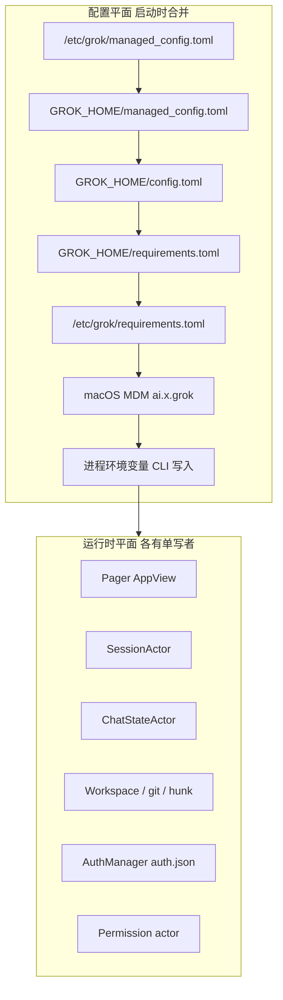
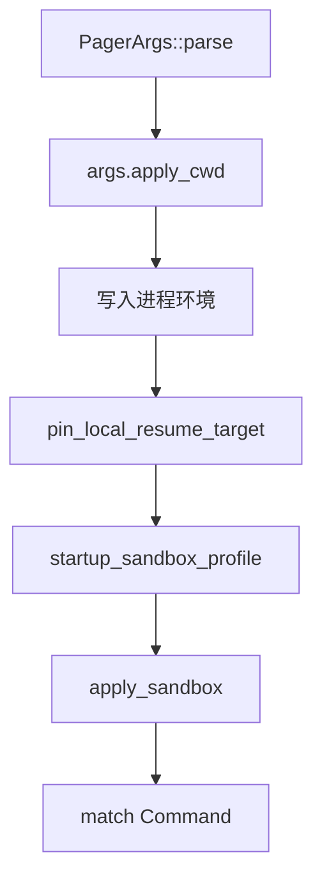
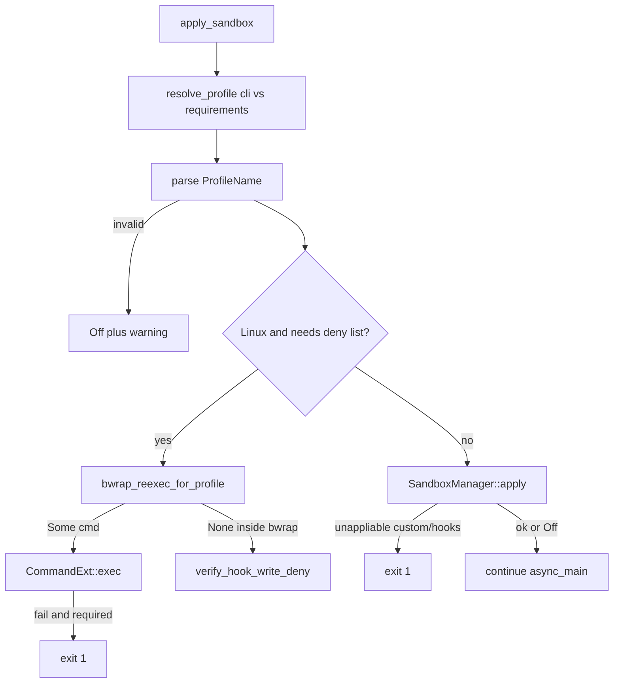
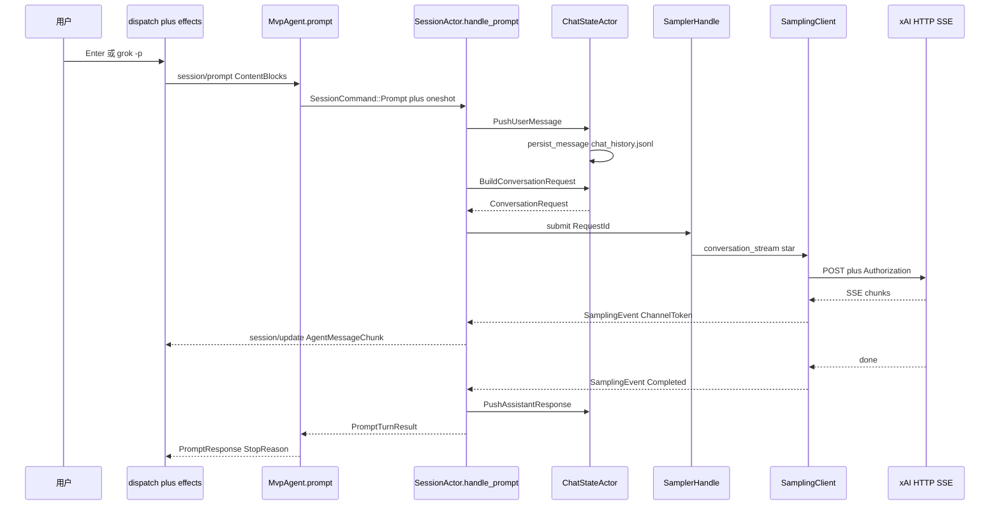
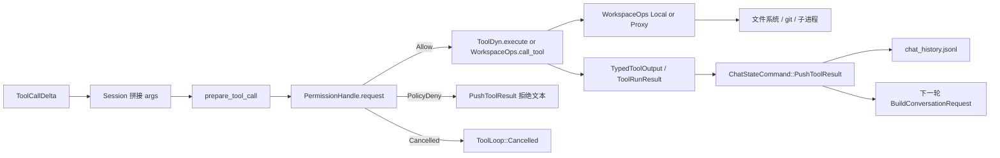
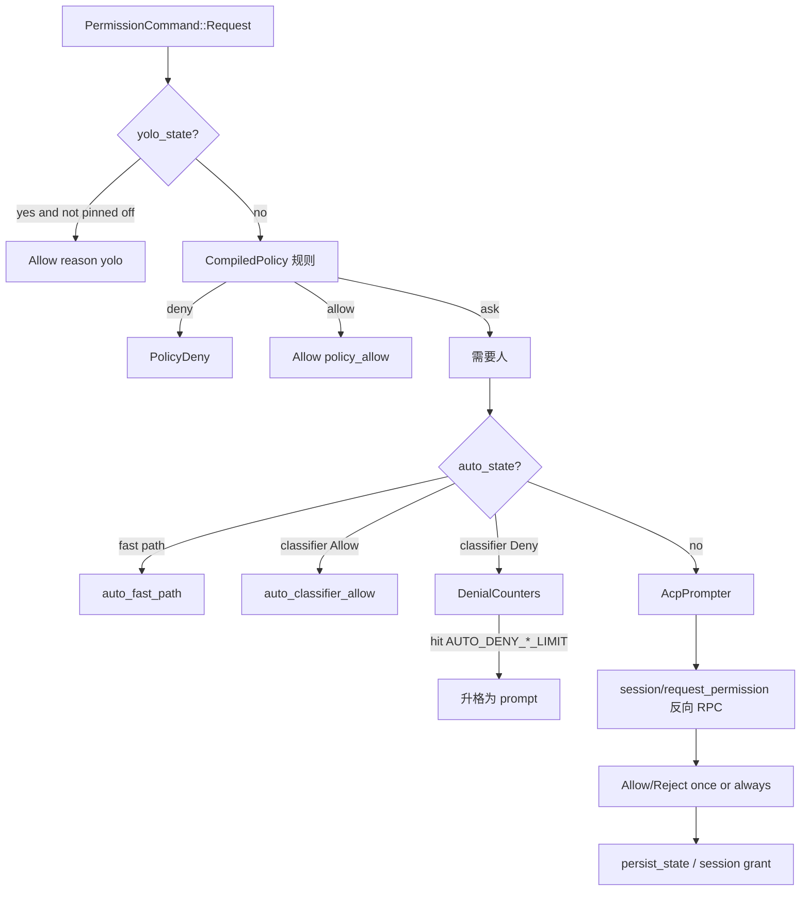

# 04 · 配置与数据流

> 读完本篇应能：按权威层序画出配置合并，并指出 Prompt、工具、权限三条数据流上每一类数据的唯一写者。上一篇：[03-API与接口设计.md](03-API与接口设计.md) · 下一篇：[05-程序入口与运行模式.md](05-程序入口与运行模式.md)

## 快速摘要

### 架构总览（模块与依赖）

配置由 `xai-grok-config` 按注释声明的 6 层 TOML 深合并，再被 CLI 写入的进程环境变量覆盖。运行时数据不存在“一个全局 store”：UI 状态在 Pager `AppView`，会话编排在 `SessionActor`，对话事实在 `ChatStateActor` + `chat_history.jsonl`，文件事实在 Workspace / hunk tracker / git，凭据在 `auth.json`。Prompt、工具、权限各有一条单向数据流，汇合点只允许特定命令 enum。

### 核心调用序列（逐步逻辑）

1. `grok_home()` 解析 `$GROK_HOME` 或 `~/.grok`（`OnceLock`，首次调用 `create_dir_all`）。
2. `ConfigLayers::effective_config_base` 按低→高合并 TOML；requirements 可 fail-closed。
3. `async_main` 把 `--compaction-mode` 等写成 env，然后 `apply_sandbox`（可能 Linux `exec` bwrap）。
4. 用户输入变成 `acp::ContentBlock` → `SessionCommand::Prompt` → `ConversationItem::User` → `ConversationRequest`。
5. `SamplingClient` 发 HTTP SSE → L2 译成 `SamplingEvent` → ACP `session/update` → TUI scrollback。
6. 完整 tool args 经权限 `PermissionHandle::request` 后 `Tool::execute` / `WorkspaceOps::call_tool`，结果 `PushToolResult`。

### 易错点与边界条件

- `GROK_HOME` 只在第一次 `grok_home()` 时读取；之后改环境变量无效。
- `user_grok_home()` 在既无 `$GROK_HOME` 又无 home 时返回 `None`，避免把项目目录 `.grok` 当成用户全局层。
- `--debug-file` 会 `remove_var("GROK_LOG_FILE")`，避免两个文件后端抢日志。
- `apply_sandbox` 在自定义 profile / hook write-deny 无法强制时 **exit 1**，不是 warning。
- 增量 token 不是对话事实；只有 `SamplingEvent::Completed` 之后的 `PushAssistantResponse` 才是。
- 权限 `Decision::PolicyDeny` 必须回给模型；`Cancelled` 必须变成 `StopReason::Cancelled`，二者不可互换。
- 写文件结果未知时先对账，不要按同一 args 再 `execute` 一次。

---

## 目录

1. [Why：配置分层与数据所有权](#1-why配置分层与数据所有权)
2. [配置合并顺序](#2-配置合并顺序)
3. [`grok_home` 与 `GROK_HOME`](#3-grok_home-与-grok_home)
4. [CLI 如何变成环境变量](#4-cli-如何变成环境变量)
5. [`apply_sandbox`](#5-apply_sandbox)
6. [Prompt 数据流](#6-prompt-数据流)
7. [工具数据流](#7-工具数据流)
8. [权限数据流](#8-权限数据流)
9. [磁盘上还有哪些会话数据](#9-磁盘上还有哪些会话数据)
10. [事实源表：谁是唯一写者](#10-事实源表谁是唯一写者)
11. [如何重新实现](#11-如何重新实现)
12. [本篇涉及的真实文件](#12-本篇涉及的真实文件)
13. [自检问题](#13-自检问题)

---

## 1. Why：配置分层与数据所有权

企业要把“禁止 YOLO、强制 sandbox profile、钉死模型 allowlist”压过用户 `config.toml` 里的偏好。如果只有一个 `~/.grok/config.toml`，IT 无法在用户可写目录上实施策略。所以合并顺序是**管理面高于用户面**，而不是“多几个 toml 文件比较灵活”。

运行时同样不能把所有可变状态塞进一个 `Mutex<AppState>`：TUI 高频重绘、Session 回合循环、ChatState jsonl append、文件系统写入，并发模式完全不同。所有权拆开之后，取消、崩溃恢复、Leader 多客户端才有明确的“以谁为准”。



---

## 2. 配置合并顺序

权威注释在 `crates/codegen/xai-grok-config/src/lib.rs`（**以它为准，不要以旧 README 口述为准**）：

```text
Merge order (lowest → highest priority):
1. /etc/grok/managed_config.toml
2. $GROK_HOME/managed_config.toml
3. $GROK_HOME/config.toml
4. $GROK_HOME/requirements.toml  (cloud cache; Ed25519-signed at rest)
5. /etc/grok/requirements.toml
6. macOS MDM managed preferences (ai.x.grok, admin-forced) — macOS only
```

每一层在合并前先应用自己的 `[[version_overrides]]`。requirements 层（#4–#6）可以 opt-in fail-closed 启动，见 `validate_requirements`。

### 2.1 What：加载符号

| 符号 | 文件 | 作用 |
|---|---|---|
| `USER_CONFIG_FILENAME` | `loader.rs` | `"config.toml"` |
| `MANAGED_CONFIG_FILENAME` | `loader.rs` | `"managed_config.toml"` |
| `REQUIREMENTS_FILENAME` | `loader.rs` | `"requirements.toml"` |
| `load_config_file` | `loader.rs` | 读 TOML + `$VAR` 展开 + version_overrides |
| `load_system_managed_config` | `loader.rs` | `/etc/grok/managed_config.toml`；Windows 无 system dir 则空表 |
| `load_managed_config` | `loader.rs` | 用户 home 的 managed |
| `load_from_disk` | `loader.rs` | 用户 `config.toml` |
| `deep_merge_toml` | `loader.rs` | 表深合并；**数组替换**（不是拼接） |
| `ConfigLayers::effective_config_base` | `loader.rs` | 按层 merge 出最终表 |
| `MDM_REQUIREMENTS_SOURCE` | `macos_managed.rs` | macOS 管理偏好 |
| `env_bool` | `lib.rs` | `"1/true/yes/on/enabled"` vs `"0/false/no/off/disabled"`；其它 → `None` |

`load_user_config_layer`：若 `user_grok_home()` 为 `None`，返回空表，**绝不**去读 cwd 相对的 `.grok/config.toml`——否则会把项目目录提升成用户全局层。

### 2.2 How：`effective_config_base`

```text
merged = system_managed
deep_merge(merged, managed)           // $GROK_HOME/managed_config.toml
deep_merge(merged, user)              // config.toml
deep_merge(merged, user_requirements) // 若存在
deep_merge(merged, system_requirements)
deep_merge(merged, mdm_requirements)
```

campaign 条目另有优先级：`requirements > remote > user > managed > system_managed`，**first-id-wins**（`campaign_source_slices`）。`GROK_CAMPAIGNS_OVERRIDE` 由 shell resolver 再包一层。`campaigns_application_disabled(base)` 为杀开关。

TOML 语法错误：`toml_error_detail` 只报行号/列号和 `e.message()`，**不**把出错源码行打进日志（可能含 secret）。

requirements 的 `fail_closed` 必须是布尔；字符串 `"true"` 会 warn 一次并当作 false。环境覆盖键：`GROK_MANAGED_CONFIG_FAIL_CLOSED`（`validation.rs` 的 `FAIL_CLOSED_ENV`）。

### 2.3 调用关系

| 调用方 | 关系 | 被调方 | 输入 | 返回 | 错误 |
|---|---|---|---|---|---|
| shell `agent::config` 启动 | 调用 | `load_effective_config_disk_only` / `ConfigLayers` | 磁盘路径 | 合并后的 `toml::Value` | IO；语法错误 `ErrorKind::Other` |
| `apply_sandbox` | 调用 | `load_merged_requirements` | 无 | requirements 表 | 缺文件视为无 pin |
| `validate_requirements` | 校验 | fail-closed 策略 | 合并后的 req | 阻止启动或放行 | fail-closed 武装后缺文件会拒启 |
| 测试 `deep_merge_toml_table_merge_array_replace_and_insert` | 锁定 | `deep_merge_toml` | 嵌套表 + 数组 | 表合并、数组替换 | 无 |

---

## 3. `grok_home` 与 `GROK_HOME`

文件：`crates/codegen/xai-grok-config/src/paths.rs`。

```text
static GROK_HOME: OnceLock<PathBuf>
```

| 函数 | 行为 |
|---|---|
| `default_grok_home()` | `home_dir()`（失败则 `"."`）经 `dunce::canonicalize` 再 join `.grok`。Windows 必须用 dunce，避免 `\\?\` 让 `git clone` 失败 |
| `grok_home()` | `OnceLock`：`$GROK_HOME` 若 set 则用之，否则 `default_grok_home()`；然后 `create_dir_all` |
| `user_grok_home()` | 仅当 `$GROK_HOME` 有设 **或** `home_dir()` 存在时返回 `Some(grok_home())`；否则 `None`（扫描 hooks/marketplace 时不要误用项目 `.grok`） |
| `grok_application()` | `$GROK_HOME/bin/grok`（Windows `grok.exe`） |
| `system_config_dir()` | Unix：`/etc/grok`；Windows：`None` |
| `sessions_cwd_dir(cwd)` | `grok_home()/sessions/{encode_cwd_dirname(cwd)}`，**不**创建目录 |
| `ensure_sessions_cwd_dir(cwd)` | `create_dir_all`；长路径写 `.cwd` 元数据（`O_CREAT\|O_EXCL`） |

`encode_cwd_dirname`：短路径 URL-encode（≤255 字节）；超长则 `{slug}-{blake3_hex16}`（≤57 字节）。`decode_cwd_from_dirname` 先 URL-decode，失败再读 `.cwd`。

会话目录约定（生产写入点在 shell persistence）：

```text
$GROK_HOME/sessions/<cwd-dirname>/<session-uuid>/
    chat_history.jsonl
    metadata.json
    以及 rewind / events / traces 等
```

`persist_chat_history_jsonl_sync`（`acp_session.rs`）原子写 `{session_dir}/chat_history.jsonl`：先写 `chat_history.jsonl.sync.tmp` 再 rename。并发 rename 后写者赢。

凭据：`$GROK_HOME/auth.json` + `auth.json.lock`（`xai-grok-shell/src/auth/manager/lock.rs`）。debug 日志默认目录 `$GROK_HOME/debug`（`GROK_DEBUG_LOG=1` 的 PerSession 模式）。

与 `xai_fast_worktree::db::resolve_grok_home` 有一份手写重复实现，注释要求与 dunce 规则保持同步。

---

## 4. CLI 如何变成环境变量

文件：`crates/codegen/xai-grok-pager-bin/src/main.rs` 的 `async_main`。发生在 `Command` match **之前**、`apply_sandbox` **之前**（sandbox 本身不读这几条 compaction env，但后续 agent config 会读）。



| CLI 字段 | 写入的环境变量 | 代码 | 后续读者 |
|---|---|---|---|
| `compaction_mode` | `GROK_COMPACTION_MODE` | `if let Some(ref mode) = args.compaction_mode { set_var(...) }` | `agent/config.rs`：`env_string("GROK_COMPACTION_MODE")` 优先于 config / remote；`CompactionMode::parse` |
| `compaction_detail` | `GROK_COMPACTION_DETAIL` | `if let Some(ref detail) = args.compaction_detail { set_var(...) }` | segments 模式的 verbatim 详细度 |
| `args.chat()` 为 true | `GROK_CHAT_MODE`（常量 `GROK_CHAT_MODE_ENV`） | `set_var(..., "1")` | `agent/chat_modes.rs`。**当前 `PagerArgs::chat()` 恒 false，`process_chat_mode_enabled()` 也恒 false（release hard-off）**，此分支是为 feature 预留的死路径 |
| `leader_socket` | `GROK_LEADER_SOCKET`（`leader::LEADER_SOCKET_ENV`） | `set_var(LEADER_SOCKET_ENV, socket)` | Leader lock / follower 连接；`lock.rs` 的 `var_os(LEADER_SOCKET_ENV)` |
| `debug_file` | `GROK_DEBUG_LOG` = 该路径，并 **`remove_var("GROK_LOG_FILE")`** | 避免双文件后端 | `xai-grok-telemetry/src/debug_log.rs`：路径 → SingleFile |
| `debug` 或 `debug_file` | 仅当未设置时 `GROK_DEBUG_LOG=1`、`GROK_HOOKS_LOG=1` | `set_if_unset` | `GROK_DEBUG_LOG=1` → PerSession 写入 `~/.grok/debug` |

全部使用 `unsafe { std::env::set_var }`（Rust 2024 对进程级 env 的约束）。必须发生在任何 `grok_home()` 的 OnceLock 初始化**之前**吗？`GROK_HOME` 本身不是这里写的，用户/测试在启动前设置。`GROK_COMPACTION_MODE` 等是给后续同步读取用的，OnceLock 不缓存它们。

`--sandbox` 走 clap `env = "GROK_SANDBOX"`，**不是** `async_main` 里 `set_var`。即：命令行 `--sandbox` 与预先存在的 `GROK_SANDBOX` 由 clap 合并进 `PagerArgs.sandbox`，再交给 `startup_sandbox_profile` → `apply_sandbox` 的 `cli_profile`。

Leader 再 spawn 子进程时会把 `GROK_LEADER_SOCKET` 和 `GROK_DEBUG_LOG` 传下去（`leader/mod.rs`），避免 follower 丢掉 socket 覆盖。

---

## 5. `apply_sandbox`

文件：`crates/codegen/xai-grok-shell/src/config/mod.rs` 函数 `apply_sandbox(sandbox_config, cli_profile, cwd)`。注释：**启动时调用一次**。`cli_profile` 是 resume 保存的 profile 或显式 `--sandbox`，压过新读的 env/config。

### 5.1 How

1. 若 `sandbox_config` 为 `None`，`SandboxSettingsConfig::from_effective_config()`。
2. `load_merged_requirements()` 取 `sandbox.profile` / `sandbox.auto_allow_bash` pin。
3. `config.resolve_profile(cli_profile, profile_req)` → 字符串 profile。
4. `xai_grok_sandbox::set_auto_allow_bash` / `set_configured_profile`。
5. parse 失败：stderr warning，落到 `ProfileName::Off`。
6. workspace 路径：`cwd` canonicalize，否则 `current_dir`，再否则 `"."`。
7. **Linux**：若 profile 需要 read-deny 或 hook write-deny，必须 bwrap。`bwrap_reexec_for_profile` 返回 `Some(cmd)` 则 `cmd.exec()`——成功则当前进程被替换，后面的 Rust 代码不再运行。exec 失败且 `requires_bwrap` → **exit 1**。不需要 bwrap 时 fallback Landlock 并警告安装 bubblewrap。
8. profile ≠ Off：`SandboxManager::new(profile, workspace).apply(&workspace)`。apply 失败先 warning；若是 custom 或 hook-deny 且仍未 applied（Linux 还要排除已在 bwrap 内）→ **exit 1**。
9. Linux 在 bwrap 内再 `verify_hook_write_deny_enforced`，失败视为 `__GROK_INSIDE_BWRAP` 伪造，exit 1。

`PagerArgs::startup_sandbox_profile` 可返回 `SandboxStartup::Conflict { requested, saved }`：`async_main` 打印 “cannot resume this session under sandbox profile …” 并 exit 1。resume 不得悄悄换沙箱。

权限层（`PermissionHandle`）与 OS 沙箱是两层：YOLO 不能关掉 Landlock/bwrap。见事实源表。



---

## 6. Prompt 数据流

目标：用户敲回车之后，屏幕上的字从哪来、规范历史何时才提交。

### 6.1 类型变换

| 阶段 | 类型 | 所在 crate | 谁拥有 |
|---|---|---|---|
| 键盘 / `-p` / `--prompt-json` | `String` 或 JSON | pager CLI | 进程 argv |
| TUI dispatch | `Action` → `Effect::SendPrompt` / `SendPromptBlocks` / `SendPromptNow` | `xai-grok-pager` | UI 线程 |
| ACP 请求 | `Vec<acp::ContentBlock>`（`Text`/`Image`/…） | `agent_client_protocol` | `PromptRequest` |
| Session | `SessionCommand::Prompt { prompt_blocks, verbatim, json_schema, ... }` | shell | Actor 邮箱 |
| 解析后 | `ParsedPromptInfo { text, full_text, local_path }` | 大 prompt 截断时 | 写 metadata.json 用完整文本 |
| 对话事实 | `ConversationItem::User(UserItem { content: Vec<ContentPart>, ... })` | `xai-grok-sampling-types` | ChatState |
| 发给模型 | `ConversationRequest { items, tools, hosted_tools, x_grok_*, json_schema, ... }` | `xai-grok-sampling-types` | Sampler |
| HTTP | ChatCompletions / Responses / Messages SSE | `SamplingClient` | 网络 |
| 采样观察 | `SamplingEvent::ChannelToken` / `Completed` / `Failed` | sampler | event channel |
| 宿主 UI | `acp::SessionUpdate::AgentMessageChunk(ContentChunk)` | ACP notification | Pager scrollback |
| 规范提交 | `ChatStateCommand::PushAssistantResponse` | ChatState | jsonl |

`ContentPart`（sampling-types）只有 `Text { text: Arc<str> }` 与 `Image { url: Arc<str> }`，比 ACP / tool-runtime 的 `ContentBlock` 更窄。图片在 413 恢复路径上会被 `ConversationRequest::strip_images` 换成占位文本。

`verbatim: true` 跳过 `<user_query>` 包装和大 prompt 截断（CLI `--verbatim` 或 prompt `_meta`）。

### 6.2 逐步调用



`handle_sampling_event`（`tool_calls.rs`）对 `ChannelToken`+`Text`：更新 `streaming_turn_capture`，`send_update(AgentMessageChunk)`。对 `Completed`：以 `ConversationResponse` 为权威，丢弃仅用于 UI 的 in-progress 生成（注释明确：canonical 在 Completed 提交）。对 `Failed`：不在 drainer 里 compact，把恢复留给 turn loop 的 `handle_sampling_failure`。

`persist_ack` oneshot 在用户消息已 append 且 flush barrier 完成、**推理开始前**触发，供 `session/load` / trace 快照使用。

失败路径：

- 未知 session：ACP `invalid_params`，ChatState 无写入。
- 401：`AuthCredentialProvider::refresh_after_unauthorized`；成功则 Sampler 重试。
- 413：`strip_images` 后再提交。
- 400 + `model_metadata.context_window`：Session 决定 compact，不是 Sampler 自己判断。
- 取消：`SamplerHandle::cancel`；已发出的 HTTP 不撤回；`PromptCompletionKind::Cancelled`。

---

## 7. 工具数据流

### 7.1 从碎片到闭合

模型不会一次吐出完整 JSON 参数。L2 对每个 SSE 块发出 `SamplingEvent::ToolCallDelta { tool_index, id, name, arguments_delta }`。`arguments_delta` **单独不必是合法 JSON**。Session 按 `tool_index`/`id` 拼接，得到 `ToolCallResponse { id, function: { name, arguments } }` 列表，再进 `execute_tool_calls_batch`。



### 7.2 `execute_tool_calls_batch`

文件：`session/acp_session_impl/tool_calls.rs`。

对每个 `ToolCallResponse`：

1. 若批次里已有 `final_result`（更早的权限拒绝 / 取消 / followup），仍 `push_tool_result` 一条“cancelled due to earlier …”——**call id 必须闭合**，否则下次 `BuildConversationRequest` 会走 dangling repair。
2. `Event::ToolStarted` + `SessionEvent::ToolCallStarted`。
3. `prepare_tool_call`：解析参数、跑 hook、请求权限。`Err(tool_loop)` 则结束该 call。
4. 批准的进入 `approved: Vec<PreparedToolCall>`，随后真正 `execute`。
5. 结果变成 `ConversationItem::tool_result(call.id, message)` 或结构化 tool result。

`WorkspaceOps::call_tool(name, args, call_id, session_id)`：

- Local：`handle.session(session_id).toolset().call(...)`。未 bind → `session_not_found`。
- Proxy：检查 `is_connected`；`ToolCallContext.call_id` 用同一字符串；`consume_stream_terminal`；传输致命错误则 `mark_disconnected`。

工具内部读 `ToolCallContext` 的 `Cwd`、`Cancellation`、`WorkspaceViewerContext.stream_tool_progress`（bash 才发 `bash_output_chunk` Progress）。Progress 经 ACP tool_call 更新进 scrollback，但**不是** ChatState 的规范项；规范项是 Terminal 之后的 `PushToolResult`。

失败：`ToolError::PermissionDenied` / `Cancelled` / `Timeout` 的 `detail` 作为模型可见文本写回。不要把失败变成“没有 ToolResult”——dangling 会在下一 turn 被 repair 成合成错误，语义更差。

幂等：读类工具可重试；`search_replace` / `put_files` 在结果未知时必须先 `get_files` / hunk 对账。这是可靠性说明书的条款，本流只负责把 `call_id` 原样带回。

---

## 8. 权限数据流

权限是**产品策略**，沙箱是 **OS 强制**。YOLO 只跳过 Prompter，不关掉 `apply_sandbox` 装上的 Landlock/bwrap。

### 8.1 入口

`PermissionHandle::request(access, tool_call_update, session_id, subagent_type, subagent_description) -> Decision`（`permission/manager/mod.rs`）。共享 parent/subagent 的路径类请求必须用 `request_with_path_context`，把执行 cwd 传进去，否则 allow/deny glob 会锚错目录。

`AccessKind`：`Read` / `Grep { path, glob }` / `Edit(path)` / `Bash(cmd)` / `MCPTool { name, input }` / `WebFetch` / `WebSearch`。

`Decision`：`Allow`、`Ask`、`FollowupMessage`、`Reject`、`PolicyDeny`、`Cancelled`。

- `AllowAll` 变体：立即 `Allow`，无 `PermissionEvent`。
- `Actor` 变体：`InFlightGuard` 计数 → `PermissionCommand::Request` + oneshot。send 失败 → `Reject("permission manager unavailable")`；recv 失败 → `Reject("failed to receive permission decision")`。两者 `event: None`，分析代码不得伪造 manager 事件。

### 8.2 Actor 内决策顺序（概念，细节在 `request_classification.rs`）



`yolo_pin: Option<&'static str>` 在 spawn 时缓存 managed 策略：`Some` 时每次客户端 YOLO 都被夹回非 YOLO。auto 与 yolo 运行时互斥。

`AcpPrompter` 通过 ACP 反向请求把 `ToolCallUpdate` 送到 TUI/IDE。用户选择写入 `PermissionState`（`load_state_from_disk` / `persist_state`）。`PermissionEvent` 记录 `decision_reason`（`yolo`、`policy_deny`、`auto_classifier_allow`、`persisted_grant`、`sandbox_auto`、`requester_gone` 等），供 trace，不作为二次决策入口。

CLI `--allow`/`--deny`（`PagerArgs.allow_rules` / `deny_rules`）在会话启动时编进 `CompiledPolicy`，不是运行时再 parse argv。`--permission-mode` 对应 `PermissionMode::VALID_VALUES`。

与工具流的接合：`prepare_tool_call` await `request*`；`PolicyDeny` → 把原因字符串当 tool result 推给模型并继续 turn；`Cancelled` → `ToolLoop::Cancelled` → 最终 `StopReason::Cancelled`；`Reject`（用户点拒绝）取消该工具，策略上接近用户意图而不是模型可见 deny（源码用不同变体区分）。

---

## 9. 磁盘上还有哪些会话数据

| 路径（均在 `$GROK_HOME` 下） | 内容 | 写者 |
|---|---|---|
| `config.toml` | 用户偏好 | 用户 / `grok setup` 以外的产品代码应少写 |
| `managed_config.toml` | 服务端同步的托管配置 | managed cache / setup |
| `requirements.toml` | 签名策略缓存 | setup / sync；Ed25519 见 `signed_policy` |
| `auth.json` | token / user id | `AuthManager`（login/logout/refresh） |
| `sessions/<cwd>/<id>/chat_history.jsonl` | `ConversationItem` 日志 | ChatState → `ChannelChatPersistence` |
| 同目录 `metadata.json` | 标题、模型、sandbox profile | Session persistence |
| hunk tracker DB | 文件 diff hunk | `HunkTrackerActor`（经 Workspace） |
| memory sqlite | 跨会话记忆 | `xai-grok-memory`（`--experimental-memory`） |
| `debug/` | PerSession 日志 | telemetry debug_log |
| `leader.sock` | Leader 默认 socket | Leader 进程；可被 `GROK_LEADER_SOCKET` 覆盖 |

cwd 目录名用 `encode_cwd_dirname`，不要自己 URL-encode 一份不兼容的实现。

---

## 10. 事实源表：谁是唯一写者

“唯一写者”指**规范状态**的写入，不含只读缓存和 UI 投影。

| 数据 | 唯一写者 | 读者 | 禁止的写者 | 崩溃后以谁为准 |
|---|---|---|---|---|
| 滚动区文本、输入框、选中 hunk | Pager `AppView` / dispatch | 渲染 | Session / ChatState 不得改 UI struct | 不持久；重启从 jsonl 重建投影 |
| 会话生命周期 `SessionLiveState` | Agent 的 join-handle supervisor + `SessionHandle` | Leader roster / dashboard | TUI 不得本地发明 Working/Idle | 磁盘无 terminal marker 则 `DeadFailed`→扫描后 `Dormant` |
| 回合是否在跑、prompt 队列、tool 拼接缓冲 | `SessionActor` 单 task | ACP / 子 agent | 第二个 Session task、UI 线程 | 未 Completed 的流式文本丢弃 |
| `Vec<ConversationItem>`、token 计数、sampling config 副本 | `ChatStateActor` | Session 经 Handle 查询 | Session 不得直接 `vec.push` | `chat_history.jsonl` |
| `chat_history.jsonl` 字节 | `ChatPersistence`（生产是 persistence actor 经 `ChannelChatPersistence`） | resume / fork / export | UI 不得 append；例外：`persist_chat_history_jsonl_sync` 仅模型切换等需要同步屏障的路径，仍用同一 session_dir | 文件；generation-aware cwd 用 ack |
| 工作区文件内容 | OS + `WorkspaceOps` 工具路径（`put_files` / 本地 toolset） | `get_files`、git、hunk | Agent 不得 `std::fs::write` 绕过 Workspace | 磁盘；结果未知先 get 再决定 |
| git index / commit | Workspace git RPC（`GitCommitReq` 等） | `git_status_ext` | 工具外的 `git` 子进程除非走 bash+权限 | 仓库 |
| hunk accept/reject | `HunkTrackerActor` 经 `workspace.hunk_*` | diff UI | 直接改 tracker 文件 | hunk DB |
| 权限规则缓存与 session grant | Permission actor（`persist_state`） | 后续 `request` | YOLO flag 本身不是规则文件 | permission state 文件；managed pin 再夹一次 |
| OS 沙箱 profile | 启动时 `apply_sandbox`（进程级，通常不可逆） | 所有子进程 | 会话中途 `--sandbox` 无效 | 进程仍在则仍强制 |
| OAuth / API key | `AuthManager` → `auth.json` | `HttpAuth::apply`、`snapshot` | 把 token 写进 `config.toml` | `auth.json`；`initialize` 会 `force_reload_from_disk` |
| 模型目录 / 当前模型 id | `ModelsManager` + `SessionCommand::SetSessionModel` | TUI 模型选择器 | prompt 路径不得在 ChatState 里偷偷改 model 字符串（应用 `OverrideModelName` 命令） | session metadata |
| ACP `_meta.promptId` | 客户端铸造或 `MvpAgent` 补 `Uuid::new_v4()` | 取消、trace、队列 | 服务端不要在 Leader 转发时改写 prompt 的 meta（测试锁定） | 仅内存 |

UI 上的助手流式字是 **ChatState 的投影**，不是第二份事实。刷新或 `session/load` 必须从 jsonl / `GetConversation` 重建，不能假定 scrollback buffer 还在。

---

## 11. 如何重新实现

1. 实现 `grok_home()`：env → `~/.grok` → `create_dir_all`；测试用临时 `GROK_HOME`。
2. 实现两层 merge：`managed_config.toml` 低于 `config.toml`；再加一个最高层“policy”表模拟 requirements。
3. 启动时把 `--compaction-mode` 写成 env，再在 config resolver 里 `env > file`。
4. 沙箱可先做成 no-op `ProfileName::Off`，但 API 要留 `cli_profile` 压过文件。
5. Prompt 流按 §6 表做完 `ContentBlock → ConversationItem → Request → fake SSE → ChannelToken → Completed → PushAssistant`。没有 Completed 就不要写 Assistant。
6. 工具流：缓冲 Delta → 权限 stub（恒 Allow）→ `run` → `PushToolResult` 用同一 id。
7. 权限再拆：规则文件 → Prompter 通道 → `Decision` 枚举四个结果（Allow/Deny/Reject/Cancelled）。
8. 给每类数据写一句“谁许写”，做成测试：从错误层写入应编译失败或运行失败。

验收：改用户 `config.toml` 不能压过 fake requirements 里的 `sandbox.profile`；Kill -9 后 resume 只恢复 jsonl 里 Completed 的消息；取消 turn 后磁盘上已写入的文件仍在。

---

## 12. 本篇涉及的真实文件

| 路径 | 角色 |
|---|---|
| `crates/codegen/xai-grok-config/src/lib.rs` | 合并顺序权威注释、`env_bool` |
| `crates/codegen/xai-grok-config/src/paths.rs` | `grok_home`、`GROK_HOME` OnceLock、sessions 路径编码 |
| `crates/codegen/xai-grok-config/src/loader.rs` | `ConfigLayers`、`deep_merge_toml`、文件名常量 |
| `crates/codegen/xai-grok-config/src/validation.rs` | requirements、fail-closed、`FAIL_CLOSED_ENV` |
| `crates/codegen/xai-grok-pager-bin/src/main.rs` | CLI → env、`apply_sandbox` 调用点 |
| `crates/codegen/xai-grok-pager/src/app/cli.rs` | `PagerArgs` 字段、`SandboxStartup`、`chat()` |
| `crates/codegen/xai-grok-shell/src/config/mod.rs` | `apply_sandbox` |
| `crates/codegen/xai-grok-shell/src/agent/config.rs` | `GROK_COMPACTION_MODE` 解析 |
| `crates/codegen/xai-grok-shell/src/agent/chat_modes.rs` | `GROK_CHAT_MODE_ENV` |
| `crates/codegen/xai-grok-shell/src/leader/lock.rs` | `LEADER_SOCKET_ENV = "GROK_LEADER_SOCKET"` |
| `crates/codegen/xai-grok-telemetry/src/debug_log.rs` | `GROK_DEBUG_LOG` / `GROK_LOG_FILE` 模式 |
| `crates/codegen/xai-grok-shell/src/session/commands.rs` | `SessionCommand::Prompt` 的 persist_ack |
| `crates/codegen/xai-grok-shell/src/session/acp_session_impl/turn.rs` | `handle_prompt` |
| `crates/codegen/xai-grok-shell/src/session/acp_session_impl/tool_calls.rs` | `execute_tool_calls_batch`、`handle_sampling_event` |
| `crates/codegen/xai-grok-shell/src/session/acp_session.rs` | `persist_chat_history_jsonl_sync` |
| `crates/codegen/xai-grok-shell/src/session/chat_persistence.rs` | 生产 `ChatPersistence` |
| `crates/codegen/xai-grok-sampling-types/src/conversation.rs` | `ConversationItem`、`ConversationRequest`、`ContentPart` |
| `crates/codegen/xai-grok-sampler/src/events.rs` | `SamplingEvent` |
| `crates/codegen/xai-grok-sampler/src/client.rs` | HTTP SSE |
| `crates/codegen/xai-chat-state/src/commands.rs` | push / build / flush |
| `crates/codegen/xai-grok-workspace/src/workspace_ops.rs` | `call_tool`、FS RPC |
| `crates/codegen/xai-grok-workspace/src/permission/manager/mod.rs` | `PermissionHandle::request` |
| `crates/codegen/xai-grok-workspace/src/permission/types.rs` | `AccessKind`、`Decision`、`PermissionEvent` |
| `crates/codegen/xai-grok-pager/src/app/effects/mod.rs` | `Effect::SendPrompt*` |
| `crates/codegen/xai-grok-pager/src/app/actions.rs` | 用户意图 → Action |

---

## 13. 自检问题

1. 用户 `config.toml` 里的 `sandbox.profile` 能否压过 `/etc/grok/requirements.toml`？依据哪一段 merge 代码？
2. 为什么 `user_grok_home()` 在没有 home 时不能 fallback 到 `grok_home()` 的 cwd 相对 `.grok`？
3. `--debug-file /tmp/x.log` 之后 `GROK_LOG_FILE` 还在吗？为什么要删？
4. Linux 上 hook write-deny profile 在 bwrap exec 失败时，进程是继续用 Landlock 还是退出？
5. `SamplingEvent::ChannelToken` 写进了 scrollback，为什么 resume 后可能看不到同样的字？
6. 批次里第一个工具被 PolicyDeny，第二个工具的 call id 还要不要 `PushToolResult`？
7. `PermissionHandle` 通道断开时返回的是 `Decision::Allow` 还是 `Reject`？有没有 `PermissionEvent`？
8. `GROK_HOME` 在进程里被第二次 `set_var` 后，`grok_home()` 会不会换目录？
9. `deep_merge_toml` 对数组是拼接还是替换？这对 `[[version_overrides]]` 意味着什么？
10. 事实源表里，YOLO 模式改变的是权限决策还是 OS 沙箱？二者之一被关掉时另一个是否仍在？

阅读源码建议顺序：`xai-grok-config/src/lib.rs` 注释 → `paths.rs` → `loader.rs` 的 `effective_config_base` → `pager-bin` `async_main` 的 env 块 → `apply_sandbox` → `handle_prompt` → `handle_sampling_event` → `execute_tool_calls_batch` → `PermissionHandle::request`。

下一篇：[05-程序入口与运行模式.md](05-程序入口与运行模式.md)
