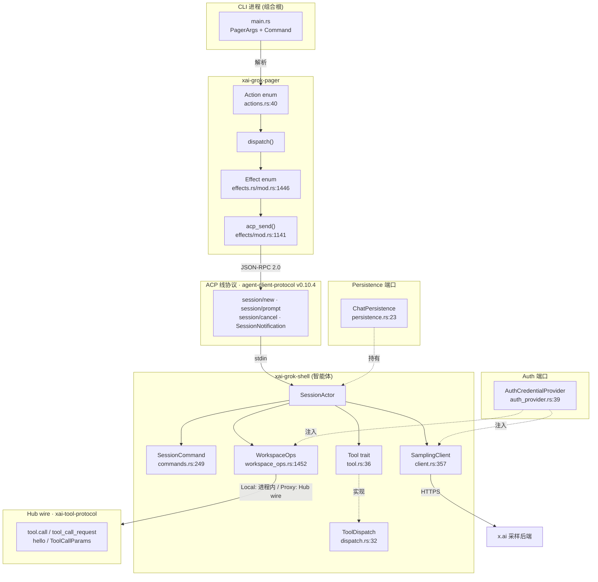

[上一篇：04-核心模块与类关系](04-核心模块与类关系.md) · [总目录](README.md) · [下一篇：06-配置与数据流](06-配置与数据流.md)

# 05：API 与接口设计

> **场景**：你要在不读全部内部实现的前提下，重写出一份可运行的 Grok Build。本文把全系统最稳定、最不该被焊死的那一层——**端口（port）**——单列成章：所有 `trait` 与所有 wire enum / wire struct。只要这层契约不变，UI 怎么换（TUI / headless / gateway）、OS 细节怎么改（macOS / Linux / Windows）、工具怎么新增，都不影响系统其余部分。重实现者的第一份工作清单就是本文。
> **阅读说明**：讲调用关系与数据流，不把行号当稳定 API。行号来自当前工作区快照，随版本变化；以当前源码为准。每关键结论给 `crate/path:line`。外部 crate（如 `agent-client-protocol`，见 §3）的字段级定义在快照内 NOT FOUND，本文只给**稳定使用位点**与 wire 方法名，重实现者需对齐该 crate 的发布版本。

---

## 本文件内容

1. [Why：端口是可替换适配器的前提](#1-why端口是可替换适配器的前提)
2. [端口全景（ASCII 边界图 + Mermaid 关系图）](#2-端口全景ascii-边界图--mermaid-关系图)
3. [ACP 端口：客户端↔智能体线协议（session/new · session/prompt · session/cancel · notifications）](#3-acp-端口客户端智能体线协议sessionnew--sessionprompt--sessioncancel--notifications)
4. [CLI 端口：PagerArgs 与 Command 子命令](#4-cli-端口pagerargs-与-command-子命令)
5. [Tool 端口：Tool trait · ToolCallContext · ToolDispatch](#5-tool-端口tool-trait--toolcallcontext--tooldispatch)
6. [Hub wire 端口：xai-tool-protocol 的版本、握手与工具调用](#6-hub-wire-端口xai-tool-protocol-的版本握手与工具调用)
7. [Workspace RPC 端口：WorkspaceOps 枚举与 Local/Proxy](#7-workspace-rpc-端口workspaceops-枚举与-localproxy)
8. [Sampler 端口：SamplingClient 三层 API 与 SamplingEvent](#8-sampler-端口samplingclient-三层-api-与-samplingevent)
9. [Auth 端口：HttpAuth 与 AuthCredentialProvider](#9-auth-端口httpauth-与-authcredentialprovider)
10. [Persistence 端口：ChatPersistence trait](#10-persistence-端口chatpersistence-trait)
11. [每个端口的输入 / 输出 / 错误 / 幂等 / 版本约束对照表](#11-每个端口的输入--输出--错误--幂等--版本约束对照表)
12. [重实现：先定义哪些 trait、版本号怎么带](#12-重实现先定义哪些-trait版本号怎么带)

---

## 1. Why：端口是可替换适配器的前提

Grok Build 在 README 里把「terminal AI coding agent」定义为**默认 UI**，但代码里没有任何一处把业务逻辑焊死在 curses / ratatui 上。它靠的是一组**端口**：一侧是 Rust `trait`（进程内依赖倒置），一侧是 wire enum / wire struct（跨进程 / 跨机器的线协议）。这两类东西的共同点是——**它们定义「能说什么话」，而不定义「话是谁说的、怎么传的」**。

为什么这是重实现的命门：

- 你完全可以写一个没有 TUI 的 Grok Build：把 `crates/codegen/xai-grok-pager` 换成纯 stdio 转发器，只要它还说 **ACP 线协议**（§3），`crates/codegen/xai-grok-shell`（智能体侧）一行不用改。反之，shell 侧重写成 Python，只要它还对本地说 ACP、对 hub 说 `xai-tool-protocol`（§6），所有工具服务器照常工作。
- `Tool` trait（`crates/common/xai-tool-runtime/src/tool.rs:36`）让「文件系统工具」「shell 工具」「MCP 工具」共享同一调用形状。重实现时**新增一种工具来源 = 新增一个 `Tool` impl**，而不是改 `SamplerActor` 或 `SessionActor`。
- 三层 HTTP 采样（`SamplingClient`，`crates/codegen/xai-grok-sampler/src/client.rs:357`）把「OpenAI Chat Completions / Responses API / Anthropic Messages」三种供应商形状收敛成一条内部流。换供应商 = 改这一层，模型回路（agent loop）不动。

一句话：**端口是重实现的「冻结接口」**。本章逐一口述它们，每条结论都带 `crate/path:line`，失败路径与成功路径等篇幅，目的是让你抄得动、改得对。

---

## 2. 端口全景（ASCII 边界图 + Mermaid 关系图）

### 2.1 ASCII 边界图

下图把「进程内 trait 端口」与「跨进程 wire 端口」分开画。方框是 crate，虚线是端口边界，实线箭头是调用方向。

```
                         ┌──────────────────────────────────────────────┐
   CLI 进程 (组合根)      │            xai-grok-pager  (客户端/UI)         │
   ┌─────────────┐       │  ┌────────────────────────────────────────┐  │
   │ main.rs      │       │  │ Action ──▶ dispatch ──▶ Effect          │  │
   │ (PagerArgs,  │       │  │   Effect::CreateSession                │  │
   │  Command)    │──────▶│  │   Effect::SendPromptBlocks             │  │
   └─────────────┘       │  └───────────┬────────────────────────────┘  │
                         │              │  acp_send(req,&tx)             │
                         │              │  effects/mod.rs:1141          │
                         └──────────────┼─────────────────────────────────┘
                                        │  ║ ACP 线协议 (JSON-RPC 2.0, stdio)
                                        │  ║ session/new · session/prompt · session/cancel
                                        │  ║ + 反向请求 request_permission/read/write_text_file
                                        ▼  ║ + 通知 SessionNotification / terminal/*
                         ┌──────────────┼─────────────────────────────────┐
                         │              │  xai-grok-shell  (智能体/ACP 服务端)│
                         │  SessionActor│◀─ SessionCommand (actor 邮箱)    │
                         │  ├─ Tool 端口 │   commands.rs:249              │
                         │  ├─ Sampler   │                                 │
                         │  └─ Workspace │                                 │
                         │              │                                 │
                         │   ┌──────────┴──────────┐   ┌───────────────┐  │
                         │   │ WorkspaceOps 枚举    │   │ SamplingClient │  │
                         │   │ Local{handle}        │   │ 三层 HTTP API  │  │
                         │   │ Proxy{client}        │   │ client.rs:357  │  │
                         │   │ workspace_ops.rs:1452│   └──────┬────────┘  │
                         │   └──────────┬──────────┘          │          │
                         └──────────────┼─────────────────────┼──────────┘
            ║ Hub wire   │  ║ Hub wire   │                     │ HTTPS
            ║ xai-tool-  │  ║ xai-tool-  │                     ▼
            ║ protocol   │  ║ protocol    │            ┌──────────────────┐
            ║ tool.call  │  ║ (tool.call  │            │  x.ai 采样后端    │
            ▼  ║ hello    │  ▼  ║ /tool_call_request)  └──────────────────┘
   ┌──────────────────┐  │  ┌──────────────────────────┐
   │ Tool Server (远端) │  │  │ xai-grok-workspace         │  Local 模式工具经此
   │ xai-tool-protocol │  │  │ (本地进程内工具会话)        │
   └──────────────────┘  │  └──────────────────────────┘
                         │
        Auth 端口: Arc<dyn AuthCredentialProvider>  贯穿 Sampler / Workspace / 数据上报
        Persistence 端口: Arc<dyn ChatPersistence>   ChatStateActor 持有
```

要点：实线 = 进程内 Rust 调用；`║` = 线协议（跨进程，必须按 wire 形状对齐）；虚线圈 = 每个 `trait` 端口的替换点。

### 2.2 Mermaid 关系图



---

## 3. ACP 端口：客户端↔智能体线协议（session/new · session/prompt · session/cancel · notifications）

### 3.1 What：ACP 是什么、稳定符号在哪

ACP = **Agent Client Protocol**。它是 Grok Build 客户端（pager / gateway / headless）与智能体（shell）之间**唯一的**线协议，跑在 stdio 上，逐行一个 JSON-RPC 2.0 消息。证据：`crates/codegen/xai-acp-lib/src/normalize.rs:99` 的测试原文 `"{\"jsonrpc\":\"2.0\",\"id\":1,\"method\":\"session/new\",\"params\":{}}"`——注意 `jsonrpc:2.0` 与 `method` 字段。

**重要事实（重实现者必读）**：本仓库不含 ACP 请求类型的字段定义。代码里写的 `acp::NewSessionRequest`、`acp::PromptRequest` 来自外部 crate `agent-client-protocol`（在 `crates/codegen/xai-acp-lib/Cargo.toml:110` 固定为 `version = "0.10.4"`，`features = ["unstable"]`），别名写法是 `use agent_client_protocol as acp;`（见 `crates/codegen/xai-acp-lib/src/message.rs:3`）。因此：

- **请求结构的字段级定义 → NOT FOUND（在快照内）**。重实现者必须对齐 `agent-client-protocol` 0.10.4 的发布类型。
- **稳定使用位点（本文给的）**：`crates/codegen/xai-acp-lib/src/message.rs`（消息枚举）、`crates/codegen/xai-acp-lib/src/gateway.rs`（方法分发）。
- **wire 方法名常量**来自 `acp::AGENT_METHOD_NAMES`（外部 crate）。本仓库只引用它们，不定义它们，但映射关系在 `message.rs:357-391` 一览无余：

| Rust 引用 | wire 方法名 | 方向 | 请求/响应类型（外部 crate） |
|---|---|---|---|
| `acp::AGENT_METHOD_NAMES.initialize` | `initialize` | client→agent | `acp::InitializeRequest` / `acp::InitializeResponse` |
| `acp::AGENT_METHOD_NAMES.authenticate` | `authenticate` | client→agent | `acp::AuthenticateRequest` / `acp::AuthenticateResponse` |
| `acp::AGENT_METHOD_NAMES.session_new` | `session/new` | client→agent | `acp::NewSessionRequest` / `acp::NewSessionResponse` |
| `acp::AGENT_METHOD_NAMES.session_load` | `session/load` | client→agent | `acp::LoadSessionRequest` / `acp::LoadSessionResponse` |
| `acp::AGENT_METHOD_NAMES.session_set_mode` | `session/set_mode` | client→agent | `acp::SetSessionModeRequest` / `acp::SetSessionModeResponse` |
| `acp::AGENT_METHOD_NAMES.session_prompt` | `session/prompt` | client→agent | `acp::PromptRequest` / `acp::PromptResponse` |
| `acp::AGENT_METHOD_NAMES.session_cancel` | `session/cancel` | client→agent | `acp::CancelNotification`（**通知，无响应**） |
| `acp::AGENT_METHOD_NAMES.session_set_model` | `session/set_model` | client→agent | `acp::SetSessionModelRequest` / `acp::SetSessionModelResponse` |

映射源：`crates/codegen/xai-acp-lib/src/message.rs:357-391`（`acp_define_request_response!` 宏把每个 `(Request, Response, method_name)` 三元组绑定成 `AcpAgentMessage` 变体）。

### 3.2 How：`session/new`、`session/prompt`、`session/cancel` 的调用链

**成功路径（`session/new`）**

1. CLI 解析出 `Command::Agent(...)`（`cli.rs:9`），组合根构造 `Effect::CreateSession { agent_id, cwd, model_id, permission_mode_override, preferred_session_id, chat_kind }`（`effects/mod.rs:1450`）。
2. 该 Effect 经 `dispatch` 落到 ACP 通道，由 `acp_send`（`effects/mod.rs:1141`）把 `acp::NewSessionRequest` 序列化后写入 `tx`（stdin 行）。
3. shell 侧 `AcpAgentMessage::NewSession(AcpArgsGeneric<acp::NewSessionRequest, _>)`（`message.rs:403`）进入 `route_to_agent` / gateway 分发；智能体据此 `spawn` 一个 `SessionActor`。证据：`crates/codegen/xai-grok-shell/src/session/acp_session_impl/spawn.rs:5` 注释「started in `session/new` *before* handshake stamp」。

**成功路径（`session/prompt`）**

1. 用户输入文本 → `Action` → `Effect::SendPromptBlocks { agent_id, session_id, blocks, prompt_id }`（结构见 `effects/mod.rs` 同文件 `Effect` 定义 `actions.rs:1446`）。
2. `effects/mod.rs:1135` 构造 `acp::PromptRequest::new(session_id.clone(), prompt)`（prompt 是 `Vec<content block>`），注入 `_meta`（prompt id、screen mode）。
3. `let result = acp_send(req, &tx).await;`（`effects/mod.rs:1141`）——注意这里 `acp_send` 返回 `AcpResult<acp::PromptResponse>`，是**有响应的请求**，不是通知。
4. 响应回来后包成 `TaskResult::PromptResponse { agent_id, result, http_status, prompt_id }`（`effects/mod.rs:1160`）回到事件循环。

**成功路径（`session/cancel`）—— 注意它是通知**

`session/cancel` 在 `message.rs:388-391` 被绑定为 `acp_define_request_response!(acp::CancelNotification, (), acp::AGENT_METHOD_NAMES.session_cancel)`，响应类型是 `()`（单元）。这意味着**它走通知通道，没有 JSON-RPC `id` 对应的响应**。客户端发送形如 `{"jsonrpc":"2.0","method":"session/cancel","params":{"sessionId":"...","reason":"user"}}`（`tests/test_leader_stdio_integration.rs:1503`）。shell 侧用 `CancelOptions { cancel_subagents, kill_background_tasks, history, trigger, user_initiated }`（`commands.rs:241`）承载取消语义，最终转成 `SessionCommand` 或 `cancel_running_task`。

### 3.3 How：notifications（智能体→客户端）

`AcpAgentMessageGeneric`（`message.rs:400`）只含 client→agent 的请求。反向（agent→client）的**通知**在 `AcpClientMessageGeneric`（`message.rs:180`）：

- `SessionNotification(acp::SessionNotification)`（`message.rs:184`）——会话状态、token 计数、工具调用进度等主动推送。
- `CreateTerminal` / `TerminalOutput` / `ReleaseTerminal` / `WaitForTerminalExit` / `KillTerminalCommand`（终端桥相关，方法名即 request 名）。
- `ExtNotification(acp::ExtNotification)`、`ExtMethod(acp::ExtRequest)`——扩展点。
- `RequestPermission` / `ReadTextFile` / `WriteTextFile`（`message.rs:181-183`）——**反向请求**：agent 调用 client 去做权限确认或文件读写（因为文件可能只在客户端机器上）。

这些消息经 `route_to_client(client, spawn)`（`message.rs:242`）分发到 `acp::Client` trait 的实现（pager 侧）。

### 3.4 失败路径（与成功路径等篇幅）

ACP 的失败分三类，重实现时必须全部覆盖：

- **请求级错误（JSON-RPC error）**：`acp_send` 返回 `AcpResult<E>`（`Err` 携带 `AcpChannelFailure` / `AcpInternalError`）。pager 在 `effects/mod.rs:1142-1166` 把结果包成 `TaskResult::PromptResponse { result: result.map_err(|e| format_acp_error(&e, is_api_key_auth)), http_status, .. }`——即**错误被翻译成用户可见文本 + HTTP 状态码**（`http_status_from_error`）。实现者必须保留 `http_status` 字段，否则 401 归因逻辑（`SamplerClient` 的 `attribution_callback`）会失准。
- **连接断开 / 行损坏**：`crates/codegen/xai-acp-lib/src/normalize.rs` 专门处理 Windows 上 `session/new` 前的多余字节（stdin_reader.rs:28 注释）；`acp_channel_failure`（`common.rs` re-export）在通道半关时把在途请求全部以错误返回，避免幽灵挂起。重实现者若用管道而非 stdio，要复刻「半关即全失败」语义。
- **`session/cancel` 的竞态失败**：取消是通知（无 ack），所以客户端**永远拿不到「已取消」确认**。shell 侧若正处于流式采样中，靠 `CancelOptions.user_initiated`（`commands.rs:247`）区分用户主动取消 vs 自动取消，并把取消原因写进 `SessionStatus`。客户端 UI 必须自己进入「取消中」状态，不能等 ack。这是 ACP 端口的**结构性失败模式**，重实现时不能用「发了就当成了」的假设。
- **版本/方法未知**：老 hub 会对未知 `method` 回 `unknown method \`...\`` 前缀（`xai-tool-protocol` 的 `UNKNOWN_METHOD_MSG_PREFIX`，见 §6）；ACP 侧则靠 `acp::AGENT_METHOD_NAMES` 穷举，未识别方法在 `message.rs:497+` 的分支里落到默认处理。

---

## 4. CLI 端口：PagerArgs 与 Command 子命令

### 4.1 What

CLI 是**进程入口端口**——它把 argv 翻译成内部 `Action`/`Effect`，本身不含业务。两个稳定类型：

- `enum Command`（`crates/codegen/xai-grok-pager/src/app/cli.rs:9`）——顶层子命令。
- `struct PagerArgs`（`crates/codegen/xai-grok-pager/src/app/cli.rs:431`）——全局参数（含 `global = true` 的可贯穿到子命令的项）。

两者来自 `clap` 的 `Subcommand` / `Parser` 派生（`cli.rs:3,9,431`）。

### 4.2 How：`Command` 变体（cli.rs:9，逐条真实）

| 变体 | 含义 | 字段（真实） |
|---|---|---|
| `Agent(Box<AgentArgs>)` | 启动交互 / headless 智能体（主路径） | `Box<AgentArgs>` |
| `Inspect { json: bool }` | 打印本目录发现到的配置；`json` 切机器可读 | `json: bool` |
| `Doctor(crate::doctor_cmd::DoctorArgs)` | 检查终端/剪贴板/颜色/输入支持，不启动 | 子结构 |
| `Leader(LeaderMgmtArgs)` | 管理常驻 leader 进程 | 子结构 |
| `Logout` | 登出并清除缓存凭据 | 无 |
| `Login { legacy, oauth, device_auth, devbox }` | 登录 Grok；OAuth2 为主，`device_auth` 给无头环境 | 见 `cli.rs:25-46` |
| `Mcp(crate::mcp_cmd::McpArgs)` | 管理 MCP server 配置 | 子结构 |
| `Plugin(crate::plugin_cmd::PluginArgs)` | 管理插件与市场源 | 子结构 |
| `Memory(crate::memory_cmd::MemoryArgs)` | 管理跨会话记忆 | 子结构 |
| `Models` | 列出可用模型后退出 | 无 |
| `Sessions(crate::sessions_cmd::SessionsArgs)` | 列出/搜索/恢复会话 | 子结构 |
| `Setup { ... }` | 拉取并安装受管配置；`--json` 只打印不写 | 见 `cli.rs:58+` |

`cli.rs:9-67` 为真实源码区间；`Login` 的 `devbox` 字段用 `#[arg(skip)]`（`cli.rs:44`）保证 match 臂在 Bazel/cargo 两种图下都 feature-unification 安全——这是**端口稳定性细节**：新增带 `skip` 的字段不会破坏下游 match。

### 4.3 How：`PagerArgs` 字段（cli.rs:431，逐条真实）

`cli.rs:431-480+` 节选真实字段：

- `version: bool`（`-v/-V`，`cli.rs:433`）——打印版本。
- `cwd: Option<PathBuf>`（`--cwd`，`cli.rs:437`）——工作目录。
- `leader_socket: Option<PathBuf>`（`--leader-socket`，全局，`cli.rs:439`）——覆盖默认 `~/.grok/leader.sock`。
- `debug: bool`（`--debug`，全局，`cli.rs:447`）。
- `debug_file: Option<PathBuf>`（`--debug-file`，全局，`cli.rs:450`）。
- `yolo: bool`（`--always-approve`，别名 `yolo` / `dangerously-skip-permissions`，`cli.rs:458`）——自动批准所有工具。
- `trust: bool`（`--trust`，`cli.rs:465`）——信任此目录并持久化。
- `allow_rules: Vec<String>`（`--allow`，别名 `allowedTools`，逗号分隔，`cli.rs:468`）。
- `deny` 规则紧接其后（`cli.rs:476` 起，别名 `disallowedTools`）。

### 4.4 失败路径

CLI 端口的失败集中在解析期与早期退出：clap 解析失败直接 `std::process::exit(2)`（clap 默认）；`Inspect`/`Models`/`Sessions` 等只读子命令在拿到结果后**立即退出，绝不进入事件循环**。`Login` 在 OAuth2 与 device-code 互斥（`conflicts_with_all`，`cli.rs:30-37`），冲突由 clap 在解析期报错，不进业务层。重实现者若不用 clap，必须复刻这套「全局参数穿透 + 子命令互斥 + 解析期失败即退出」的契约，否则组合根无法正确分流。

---

## 5. Tool 端口：Tool trait · ToolCallContext · ToolDispatch

### 5.1 What

`Tool` trait（`crates/common/xai-tool-runtime/src/tool.rs:36`）是**所有工具的统一进程内端口**。它故意**不是 object-safe**——因为带关联类型 `Args` / `Output`（`tool.rs:38,47`）。类型擦除走 `ToolDyn`（见 `dispatch.rs:22` 的 `TypedToolOutput`），对象安全分发走 `ToolDispatch`（`dispatch.rs:32`）。

### 5.2 How：Tool trait 的方法（tool.rs:36-112，逐条真实）

- `type Args: for<'de> Deserialize<'de> + JsonSchema + Send + 'static`（`tool.rs:38`）——**必须能从 JSON 反序列化**，否则 wire 分发无法解码。
- `type Output: Serialize + ToolOutput + Send + 'static`（`tool.rs:47`）——输出要实现 `ToolOutput`（提供 model-facing content block）。
- `fn id(&self) -> ToolId`（`tool.rs:50`）——**稳定身份**，runtime 据此路由。
- `fn description(&self, _ctx: &ListToolsContext) -> ToolDescription`（`tool.rs:59`）——可随 per-turn 上下文变化（见 `has_dynamic_description`）。
- `fn capabilities(&self) -> ToolCapabilities`（`tool.rs:62`，默认 `default()`）——并发/作用域/帧能力标志。
- `fn has_dynamic_description(&self) -> bool`（`tool.rs:69`，默认 `false`）。
- `fn should_list(&self, _ctx: &ListToolsContext) -> bool`（`tool.rs:75`，默认 `true`）——per-turn 是否进入模型可见清单。
- `fn execute(&self, ctx: ToolCallContext, args: Self::Args) -> impl Future<Output = ToolStream<Self::Output>> + Send`（`tool.rs:87`）——**流式入口**（默认把 `run` 包成单元素流）。运行时只调这个。
- `fn run(&self, _ctx: ToolCallContext, _args: Self::Args) -> impl Future<Output = Result<Self::Output, ToolError>> + Send`（`tool.rs:101`）——**阻塞便捷入口**（默认返回 `not_implemented` 错误）。

`ToolStream<T>`（`tool.rs:116`）定义为 `Pin<Box<dyn Stream<Item = ToolStreamItem<T>> + Send>>`。`ToolStreamItem<T>`（`tool.rs:120`）只有两个变体：`Progress(ToolProgress)`（零或多个）与 `Terminal(Result<T, ToolError>)`（**恰好一个，且永远最后**）。这是端口级不变量：流必须以一个 `Terminal` 收尾，否则 `ToolDispatch::call_terminal` 默认实现报 `stream_no_terminal`（`dispatch.rs:64`）。

### 5.3 How：ToolCallContext（context.rs:66，逐条真实）

```rust
pub struct ToolCallContext {            // context.rs:66
    pub call_id: ToolCallId,            // 每次调用的稳定 id
    pub extensions: TypedExtensions,    // 类型化扩展槽（任意 Send+Sync 值）
}
```

`Default`（`context.rs:71`）用 `ToolCallId::new_v7()`（UUIDv7）初始化 `call_id`。`extensions` 用 `insert::<T>()` / `get::<T>()`（`context.rs:89,95`）做依赖注入——工具借此拿到 `WorkspaceHandle`、`PermissionChecker` 等，而不必把构造参数焊进 trait。重实现者要让 `ToolCallContext` 成为**唯一**的「工具运行时环境」入口，避免给 `Tool` trait 加关联类型。

### 5.4 How：ToolDispatch（dispatch.rs:32，逐条真实）

```rust
#[async_trait]
pub trait ToolDispatch: Send + Sync {
    async fn call(&self, tool_id: ToolId, args: Value, ctx: ToolCallContext)
        -> ToolStream<TypedToolOutput>;                 // dispatch.rs:35
    async fn call_terminal(&self, tool_id: ToolId, args: Value, ctx: ToolCallContext)
        -> Result<TypedToolOutput, ToolError> { ... }   // dispatch.rs:50 默认实现
}
```

关键：**`call` 收 `args: Value`（裸 JSON）而非 typed `Args`**——类型擦除发生在 dispatch 路由器（下游 `xai-grok-tools` 等），`ToolDispatch` 这一层只认 `ToolId` + `Value`（`dispatch.rs:26-30` 注释）。`call_terminal`（`dispatch.rs:50`）默认实现 drain 流、丢弃 `Progress`、首个 `Terminal` 即短路；流无 `Terminal` 则报 `ToolError::custom("stream_no_terminal", ...)`（`dispatch.rs:64`）。

### 5.5 失败路径（与成功路径等篇幅）

Tool 端口的失败有四类，必须全部覆盖：

- **参数解码失败**：`call` 收到 `Value` 后，下游路由器按 `tool_id` 找 `Tool::Args` 反序列化。失败应转成 `Terminal(Err(ToolError::InvalidParams(..)))`，且**仍要以 `Terminal` 收尾**——绝不能让流中途消失（触发 `stream_no_terminal`）。
- **`run`/`execute` 都没实现**：默认 `run` 返回 `ToolError::not_implemented("Tool must implement either \`run\` or \`execute\`")`（`tool.rs:107`）。这是「作者忘了覆写」的显式失败，不是 panic。
- **流不变量违反**：实现者若在 `Progress` 之后再发 `Progress`、或发了多个 `Terminal`、或零个 `Terminal`，消费端行为未定义。默认 `call_terminal` 只容错「缺 Terminal」一种，多发 Terminal 需要消费端自行忽略后续——重实现时建议**消费端**也容错多 Terminal。
- **权限/取消**：工具在 `execute` 内可借 `ToolCallContext::get::<PermissionChecker>()` 查权限；取消经 `CancelOptions`/`session/cancel`（§3）落到 `cancel_running_task`，工具需自己观测取消信号并提前返回 `Terminal(Err(ToolError::Cancelled))`。端口契约不替工具处理取消，只约定「最终必须有一个 Terminal」。

---

## 6. Hub wire 端口：xai-tool-protocol 的版本、握手与工具调用

### 6.1 What

`xai-tool-protocol`（`crates/common/xai-tool-protocol`）是**工具服务器 ↔ computer hub ↔ 智能体**之间的 WebSocket 线协议。所有类型都在 `crate::JsonRpcRequest` / `JsonRpcResponse` / `JsonRpcNotification` 信封内（`frames.rs:3-4`）。重实现远程工具 / hub 时，这是必须逐字节对齐的一层。

### 6.2 How：版本与握手（handshake.rs，逐条真实）

- `pub const PROTOCOL_VERSION: &str = "1.0.0"`（`handshake.rs:10`）——**线协议版本常量**。注释明确：不兼容的 schema 变更才 bump 主/次版本；**增量字段走 capability 协商，不 bump 版本**（`handshake.rs:7-9`）。重实现者握手时必须比较 `supported_protocol_versions`，而非假设等于 `"1.0.0"`。
- `struct HelloMsg`（`handshake.rs:21`）：`protocol_version: String`、`kind: ConnectionKind`、`server_id: Option<ServerId>`（仅 `ToolServer` 连接带）、`description: Option<String>`、`metadata: Option<Value>`。WebSocket 升级后客户端**第一条**帧即发它（`handshake.rs:12`）。
- `struct HelloAckMsg`（`handshake.rs:38`）：`connection_id: ConnectionId`、`user_id: UserId`（**hub 从升级凭证解析，客户端绝不自报**）、`computer_hub_version: String`、`supported_protocol_versions: Vec<String>`、`capabilities: Vec<String>`（hub 支持的额外 JSON-RPC 方法，如 `"session_attach_server"`，`handshake.rs:46-51`）。

握手后再用 `register_session` / `unregister_session` 动态绑定会话（`handshake.rs:14-16`）——连接起始是空会话集。

### 6.3 How：方法名枚举与 ToolCall（methods.rs / frames.rs，逐条真实）

`enum Method`（`methods.rs:23`）用 `define_methods!` 宏**单一来源**生成枚举 + serde rename + `as_wire_str` + `from_wire_str`（`methods.rs:10-53`）。关键 wire 字符串（节选自 `methods.rs:64-138`）：

| 变体 | wire 字符串 | 方向 |
|---|---|---|
| `SessionOpen` | `session_open` | harness→service |
| `ToolsList` | `tools.list` | harness→service |
| `ToolsSearch` | `tools.search` | harness→service |
| `ToolCall` | `tool.call` | harness→service |
| `ToolCancel` | `tool.cancel` | harness→service（糖，转成 `hook` 帧） |
| `ToolNotify` | `tool.notify` | harness→service |
| `SystemNotify` | `system.notify` | harness→service |
| `Hello` / `HelloAck` | `hello` / `hello_ack` | 握手 |
| `Ping` / `Pong` | `ping` / `pong` | 心跳 |
| `ToolCallProgress` | `tool_call_progress` | tool_server→service |
| `ToolNotification` | `tool.notification` | tool_server→service |
| `TracesDonate` / `LogsDonate` / `MetricsDonate` | `traces.donate` / `logs.donate` / `metrics.donate` | 可观测性捐赠（无响应通知） |
| `ToolCallRequest` | `tool_call_request` | service→tool_server |
| `ToolsChanged` | `tools_changed` | service→harness |
| `ServersList` | `servers.list` | harness→service（发现） |
| `Serve` | `serve` | tool_server→service（整工具快照，幂等） |
| `SessionBind` / `SessionUnbind` | `session.bind` / `session.unbind` | hub→server |

**`ToolCall` 的 params 是 `ToolCallParams`**（`frames.rs:27`）：`tool_call_id: ToolCallId`、`tool_id: ToolId`、`arguments: Value`、`deadline_ms: Option<u64>`、`behavior_version: Option<String>`、`cwd: Option<String>`（OS 原生路径，跨 FS 工具用）、`trace_context: Option<String>`（W3C `traceparent`）。注释强调：`tool.call`（harness→service）与 `tool_call_request`（service→tool_server）**共用同一 params 形状**，`tool_call_id` 端到端保留（`frames.rs:23-25`）。**`session_id` 不进 params**——它在 JSON-RPC 信封字段上（`frames.rs:6-8`），hub 从 `request.session_id` 读路由。

**响应 `ToolCallResult`**（`frames.rs:48`）：`tool_call_id`、`output: ToolOutputWire`、`follow_ups: Vec<Value>`、`reminders: Vec<Value>`（仅本地工具填充，远端调用为空）、`chat_completion_output: Option<Value>`（透明 `Value`，因为本 crate 不依赖 `xai-tool-runtime`，`frames.rs:55-58`）。

**进度通知 `ToolCallProgressFrame`**（`frames.rs:116`）：`tool_call_id`、`kind: String`（如 `"log_chunk"`/`"chunk"`）、`body: Value`、`dropped_count: Option<u32>`（限流丢弃计数）。

**工具通知 `ToolNotificationFrame`**（`frames.rs:132`）：`tool_call_id: Option`、`tool_id: Option`（harness 发出时省略）、`notification: WireToolNotification`。

### 6.4 失败路径（与成功路径等篇幅）

- **协议版本不匹配**：客户端 `HelloMsg.protocol_version` 与 hub `HelloAckMsg.supported_protocol_versions` 无交集 → 连接必须关闭并提示用户升级。这是**唯一靠版本号硬失败的路径**；其余兼容性靠 `capabilities` 协商，不在版本号上失败。
- **未知方法**：旧 hub 对不识别的 verb 回 `unknown method \`...\``（`methods.rs:62` `UNKNOWN_METHOD_MSG_PREFIX`）。客户端**不要**靠 sniff 这个字符串，而应查 `hello_ack.capabilities` 成员做 per-call fallback（`methods.rs:55-61`）。重实现者必须保留该前缀字符串稳定（注释明令「Do not change casually」）。
- **捐赠超限被整批拒**：`traces.donate` / `logs.donate` / `metrics.donate` 有硬上限——`MAX_SPANS_PER_DONATION = 512`、`MAX_DONATION_BYTES = 1 MiB`、`MAX_LOG_RECORDS_PER_DONATION = 512`、`MAX_METRICS_PER_DONATION = 512`（`frames.rs:65,68,85,101`）。超限 hub **整批拒绝**，捐赠方必须分块再编码。注意 `metrics.donate` **无 envelope `session_id`**（进程聚合），而 `logs.donate` 需要（`frames.rs:104-106`）。搞错会静默丢弃。
- **`hub.*` 属性被剥离**：所有 donation 里 `hub.*` span/log/resource 属性被 hub 剥离并盖自己的归属（`frames.rs:71-72,88-89,105-106`）。实现者不应依赖自己填的 `hub.*`。
- **`tool.call` 缺 `session_id`**：hub 从信封读 `session_id`，params 里不带。若实现者误把 `session_id` 塞进 `ToolCallParams`，会被忽略且路由失败。

---

## 7. Workspace RPC 端口：WorkspaceOps 枚举与 Local/Proxy

### 7.1 What

`WorkspaceOps`（`crates/codegen/xai-grok-workspace/src/workspace_ops.rs:1452`）是**智能体访问工具 / 扩展的统一端口**，用枚举而非 trait 表达两种后端：

```rust
#[derive(Clone)]
pub enum WorkspaceOps {                              // workspace_ops.rs:1452
    Local  { handle: WorkspaceHandle },              // 进程内，经 handle
    Proxy  { client: WorkspaceClient },              // 经 hub WebSocket 到远端 workspace server
}
```

枚举（而非 trait object）让「切后端」在**构造期**决定，避免每次调用动态分发（`workspace_ops.rs:1448-1458` 注释）。

### 7.2 How：构造器与判定（workspace_ops.rs:1459-1487，逐条真实）

- `WorkspaceOps::local(handle)`（`workspace_ops.rs:1465`）——本地模式；工具经 workspace session 的 toolset。
- `WorkspaceOps::proxy(harness: Arc<ToolHarness>)`（`workspace_ops.rs:1469`）——代理模式；包出 `WorkspaceClient::new`。
- `WorkspaceOps::proxy_with_connected(harness, connected: Arc<AtomicBool>)`（`workspace_ops.rs:1477`）——带共享「已连接」标志，reconnect 时重置。
- `is_proxy(&self) -> bool`（`workspace_ops.rs:1483`）、`client(&self) -> Option<&WorkspaceClient>`（`workspace_ops.rs:1487`）。

### 7.3 How：call_tool（workspace_ops.rs:1713，逐条真实）

```rust
pub async fn call_tool(
    &self,
    name: &str,
    args: Value,
    call_id: &str,
    session_id: Option<&str>,
) -> Result<ToolRunResult, xai_tool_runtime::ToolError> { ... }   // workspace_ops.rs:1713
```

- **Local 分支**（`workspace_ops.rs:1721`）：要求 `session_id`；无则 `ToolError::custom("missing_session", ...)`（`workspace_ops.rs:1723`）；再 `handle.session(session_id)` 查找，找不到则 `ToolError::custom("session_not_found", ...)` 并提示「call bind_local_session() first」（`workspace_ops.rs:1728`）；命中后 `session.toolset().call(name, args, call_id, None)`（`workspace_ops.rs:1737`）——**进程内直接调用**。
- **Proxy 分支**（`workspace_ops.rs:1739`）：先 `client.is_connected()`，断线返回 `ToolError::network_error("The workspace server connection was lost. ...")`（`workspace_ops.rs:1741`）；否则经 `WorkspaceClient` 走 hub wire（§6 的 `tool_call_request`）。

### 7.4 失败路径（与成功路径等篇幅）

- **Local 缺 session**：`missing_session` / `session_not_found` 都是**构造期错误**——说明组合根忘了 `bind_local_session`。重实现者必须保证「建 agent 后立刻 `bind_local_session` 安装 toolset」，`call_tool` 才能拿到 session（`workspace_ops.rs:1709-1711` 注释）。
- **Proxy 断线**：返回 `network_error`，但**不自动重连**——`proxy_with_connected` 的 `Arc<AtomicBool>` 由 harness 的 `on_reconnect` 回调重置（`workspace_ops.rs:1474-1480` 注释）。调用方拿到 `network_error` 后应当重试或提示用户。
- **参数/权限错误**：`args: Value` 解码失败、权限被拒，统一归约成 `xai_tool_runtime::ToolError`，与 Tool 端口（§5）错误一致——**这是设计意图**：WorkspaceOps 只是把「本地 toolset」和「远端 tool_call_request」两种后端收敛到同一个 `ToolError` 表面，UI 不因后端不同而分支。
- **幂等**：`call_tool` 本身**非幂等**（工具副作用由具体工具决定）。`Serve`（§6）才是幂等的——重发整工具快照会替换集合并 diff 出 `tools_changed`（`methods.rs:128-131`）。

---

## 8. Sampler 端口：SamplingClient 三层 API 与 SamplingEvent

### 8.1 What

`SamplerHandle`（`crates/codegen/xai-grok-sampler/src/handle.rs:19`）是轻量 clone 的 actor 句柄（`mpsc::UnboundedSender<SamplerCommand>`，`handle.rs:20`）；`SamplingClient`（`crates/codegen/xai-grok-sampler/src/client.rs:357`）是**直接的 HTTP 采样客户端**，封装 `reqwest::Client` + 默认头 + base_url + 默认参数。`SamplingEvent`（`crates/codegen/xai-grok-sampler/src/events.rs:52`）是流式采样事件，被 session 翻译成 ACP 通知（§3）。

### 8.2 How：SamplerHandle（handle.rs:19，逐条真实）

- `SamplerHandle { cmd_tx: mpsc::UnboundedSender<SamplerCommand> }`（`handle.rs:19`）。
- `SamplerHandle::new`（`handle.rs:27`，`pub(crate)`，仅 `SamplerActor::spawn` 产出）。
- `SamplerHandle::noop()`（`handle.rs:36`）——丢弃所有命令的空句柄，供测试 / actor 未接好前占位；所有 send 点用 `let _ = ...` 故安全。

### 8.3 How：SamplingClient 三层 API（client.rs:357，逐条真实）

`SamplingClient`（`client.rs:357`）字段：`http: reqwest::Client`、`default_headers: HeaderMap`、`base_url: String`、`defaults: ClientDefaults`、`attribution_callback: Option<SharedAttributionCallback>`（401 归因）、`bearer_resolver: Option<SharedBearerResolver>`（per-request bearer 覆盖）、`header_injector: Option<SharedHeaderInjector>`（OTel traceparent）、`endpoint: EndpointTemplate`（`client.rs:358-372`）。

**三层 / 多形状 API**（同一内部流，三种供应商线形状 + 一个统一入口），真实方法名与行号：

- **L1 Chat Completions（OpenAI 风格）**：`chat_completion`（`client.rs:963`）、`chat_completion_stream`（`client.rs:1015`）。
- **L2 Responses API**：`create_response`（`client.rs:1231`）、`create_response_stream`（`client.rs:1359`）。
- **L3 Messages（Anthropic 风格）**：`create_message`（`client.rs:1593`）、`create_message_stream`（`client.rs:1698`）。
- **统一 Conversation 入口**（内部按配置选上面三层之一，并吸收工具调用回路）：`conversation_stream`（`client.rs:1902`）、`conversation`（`client.rs:1923`）、`conversation_stream_responses`（`client.rs:1945`）、`conversation_responses`（`client.rs:1986`）、`conversation_stream_messages`（`client.rs:2023`）、`conversation_messages`（`client.rs:2058`）、`conversation_collect`（`client.rs:2088`）。

重实现要点：agent loop 只依赖 `conversation_*` 统一入口；换供应商 = 改 L1/L2/L3 解码，**不碰**调用方（`client.rs:825-842` 注释：401 归因在「最低看到该状态的层」发出，上层应对 401 反应而非重复归因）。

### 8.4 How：SamplingEvent（events.rs:52，逐条真实）

`enum SamplingEvent`（`events.rs:52`）发在共享事件通道，session 转成 ACP 通知。真实变体（节选）：

- `StreamStarted { request_id, timestamp_ms }`（`events.rs:54`）——HTTP 流建立、读头后。
- `FirstToken { request_id }`（`events.rs:60`）——首个内容 token。
- `ChannelToken { request_id, channel: SamplingChannel, text, chunk_index }`（`events.rs:63`）——命名通道（text / reasoning）内容。
- `ToolCallDelta { request_id, tool_index, id, name, arguments_delta }`（`events.rs:75`）——工具调用参数**增量片段**；注释警告**单个 `arguments_delta` 不一定是合法 JSON**（`events.rs:74`）。
- 后续还有 `MessageStart` 等（`events.rs:83+` 注释，Messages L2 专属）。

### 8.5 失败路径（与成功路径等篇幅）

- **401 / 鉴权失败**：`auth_info()`（`client.rs:842`）返回 `SamplingError::Auth(...)`，归因回调在最低层触发（`client.rs:825-842`）。`attribution_callback` 把 401 按「stale-snapshot vs live-token-rejected」分桶——依赖 §3 `acp_send` 回传的 `http_status` 与 §9 `AuthCredentialProvider::refresh_after_unauthorized`。重实现者必须保留「401 → 尝试 refresh 一次 → 重试」的回路（见 §9）。
- **流中断 / 部分 JSON**：`ToolCallDelta.arguments_delta` 不保证合法 JSON（`events.rs:74`），消费端必须**累积**成完整参数再解析，不能逐片 `serde_json::from_str`。这是端口级硬约束。
- **超时 / deadline**：`ToolCallParams.deadline_ms`（§6）到时，sampler 应中止并回 `SamplingError::Timeout`；断线 `SamplerHandle::noop()` 的场景下命令静默丢弃，调用方需有独立超时兜底。
- **`ToolCallDelta` 顺序**：`chunk_index`（`events.rs:67`）单调递增，消费端可据此检测丢失/乱序；乱序不应 panic，应缓冲或告警。

---

## 9. Auth 端口：HttpAuth 与 AuthCredentialProvider

### 9.1 What

Auth 端口是**出站 HTTP 鉴权依赖倒置**。两个 trait 在 `crates/codegen/xai-grok-auth`：

- `trait HttpAuth`（`src/visibility.rs:5`）——把鉴权头应用到 `reqwest::RequestBuilder`。
- `trait AuthCredentialProvider: HttpAuth`（`src/auth_provider.rs:39`）——`HttpAuth` 的**超 trait**，额外提供 refresh-aware 快照与 401 恢复。

实现方是 shell 的 `GrokAuthCredentials` / `ShellAuthCredentialProvider`（`visibility.rs:2`、`auth_provider.rs:2-4` 注释），数据上报侧只持 `Arc<dyn AuthCredentialProvider>`，**不回依赖 shell 类型**——这是端口的意义。

### 9.2 How：HttpAuth（visibility.rs:5，逐条真实）

```rust
pub trait HttpAuth: Send + Sync {
    fn apply(&self, builder: reqwest::RequestBuilder, base_url: &str)
        -> reqwest::RequestBuilder;                 // visibility.rs:6
}
```

只一个方法：拿 `RequestBuilder` 与 `base_url`，返回注入了鉴权头的 `RequestBuilder`。`base_url` 入参是为了让实现能按 host 选不同凭证（如 `auth.x.ai` vs 本地）。

### 9.3 How：AuthCredentialProvider（auth_provider.rs:39，逐条真实）

```rust
#[async_trait::async_trait]
pub trait AuthCredentialProvider: HttpAuth + Send + Sync + 'static {
    fn snapshot(&self) -> CredentialSnapshot;                       // auth_provider.rs:46
    async fn refresh_after_unauthorized(&self) -> bool;            // auth_provider.rs:51
    fn needs_token_auth_header(&self) -> bool { true }             // auth_provider.rs:56
    fn has_usable_credential(&self) -> bool { true }               // auth_provider.rs:63
}
```

- `snapshot() -> CredentialSnapshot`（`auth_provider.rs:46`）：**廉价磁盘重读**后给当前凭证快照；`token` 字段**必须**与 `HttpAuth::apply` 实际发出的 bearer 一致，否则 401 归因前缀对不上（`auth_provider.rs:43-45`）。
- `refresh_after_unauthorized() -> bool`（`auth_provider.rs:51`）：拿到新 token 返回 `true`（调用方重试一次），无 refresher / 刷新失败返回 `false`。
- `needs_token_auth_header() -> bool`（`auth_provider.rs:56`）：deployment key 为 `false`（裸 Bearer），user/OAuth 为 `true`（额外 `X-XAI-Token-Auth`）。
- `has_usable_credential() -> bool`（`auth_provider.rs:63`）：是否值得真发请求。

`CredentialSnapshot` 结构（`auth_provider.rs:14`）：`token: Option<String>`、`user_id`、`team_id`、`deployment_id`（deployment key 时 `uuidv5`）、`api_key_id`（ApiKey 时 `uuidv5`）、`organization_id`（OIDC）。

### 9.4 失败路径（与成功路径等篇幅）

- **401 恢复回路**：`SamplingClient`（`§8`）拿到 401 → 调 `refresh_after_unauthorized()`；返回 `true` 则重发一次，否则上抛 `SamplingError::Auth`。这是 Auth 端口**唯一**的「失败后自愈」路径，重实现者必须实现，否则 OAuth token 过期即永久失败。
- **无凭证（CI / `--api-key` headless）**：`token: None`、`has_usable_credential()` 默认 `true` 仍尝试——`StaticAuthCredentialProvider`（`auth_provider.rs:78`）包裸 `&str` token，没有 `AuthManager`；`refresh_after_unauthorized` 永远 `false`（`auth_provider.rs:73`）。headless 路径不刷新，token 过期即失败。
- **快照与 wire 不一致**：若 `snapshot().token` 与 `apply()` 发出的 bearer 不同源，401 归因会错标 stale/live，污染 §8 的归因分桶。端口契约强制两者同源（`auth_provider.rs:43-45`）。
- **deployment key vs user token 头差异**：`needs_token_auth_header()` 决定要不要 `X-XAI-Token-Auth`。实现错配会让 hub 拒绝合法请求或接受非法请求——这是端口级「隐形失败」，必须在 wire 格式契约（`GrokAuthCredentials::apply`）里对齐。

---

## 10. Persistence 端口：ChatPersistence trait

### 10.1 What

`ChatPersistence`（`crates/codegen/xai-chat-state/src/persistence.rs:23`）是**对话落盘端口**。真实实现包 `mpsc::UnboundedSender<PersistenceMsg>`（`persistence.rs:20-22` 注释），actor 是唯一拥有者，故方法收 `&mut self`。

### 10.2 How：方法（persistence.rs:23-46，逐条真实）

```rust
pub trait ChatPersistence: Send + 'static {
    fn persist_message(&mut self, item: &ConversationItem);                          // :25
    fn persist_working_directory_switch_and_ack(&mut self, item: &ConversationItem)
        -> oneshot::Receiver<Result<StrictAppendAck, StrictAppendError>>;            // :28
    fn replace_history(&mut self, items: &[ConversationItem]);                       // :34
    fn replace_history_for_strip_and_ack(&mut self, items: &[ConversationItem])
        -> oneshot::Receiver<io::Result<()>>;                                        // :40
    fn flush(&mut self);                                                              // :46
}
```

- `persist_message`（`persistence.rs:25`）：追加单条到 `chat_history.jsonl`（fire-and-forget）。
- `persist_working_directory_switch_and_ack`（`persistence.rs:28`）：写一条 + 回 ack（严格追加语义）。
- `replace_history`（`persistence.rs:34`）：整段替换（compaction / rewind）。
- `replace_history_for_strip_and_ack`（`persistence.rs:40`）：破坏性去图重写——**先备份再替换**；备份失败则阻断重写（`persistence.rs:36-39`）。
- `flush`（`persistence.rs:46`）：刷盘。

### 10.3 失败路径（与成功路径等篇幅）

- **actor 已死却被伪装成功**：`StripOutcome`（`persistence.rs:51+`）类型化，确保「死 actor 不能伪装成 strip 成功」——重实现者要让 ack 类型**显式区分**成功/失败，不能返回 `()` 让调用方盲信。
- **备份失败阻断**：`replace_history_for_strip_and_ack` 在备份失败时**不**继续重写（`persistence.rs:38-39`），保证可恢复性不静默蒸发；无 recoverable store 的后端可 no-op 备份但**必须** ack 写结果（`persistence.rs:39`）。
- **严格追加 ack**：`persist_working_directory_switch_and_ack` 返回 `oneshot::Receiver<Result<StrictAppendAck, StrictAppendError>>`——调用方**必须 await** 才能确认落盘；否则崩溃可能丢工作目录切换记录。
- **flush 语义**：`flush` 是同步刷，但底层仍是 actor；崩溃窗口内的未 flush 消息可能丢失——端口契约不保证「每次 persist_message 后即时落盘」，调用方对最近一条要有容忍。

---

## 11. 每个端口的输入 / 输出 / 错误 / 幂等 / 版本约束对照表

| 端口 | 输入 | 输出 | 错误形状 | 幂等？ | 版本约束 |
|---|---|---|---|---|---|
| **CLI** (`cli.rs:9,431`) | argv（clap） | `Command` / `PagerArgs` → `Action` | 解析失败即 exit(2) | — | CLI 版本 = binary 版本 |
| **ACP** (`message.rs:180,400`) | JSON-RPC 2.0 行 | `AcpAgentMessage` / `AcpClientMessage` | `AcpResult<E>`；`session/cancel` 无 ack | 仅 `Serve` 类幂等；`session/prompt` 非幂等 | `agent-client-protocol` 0.10.4（外部） |
| **Tool** (`tool.rs:36`) | `ToolCallContext` + typed `Args` / `Value` | `ToolStream<Output>`（Progress* + 1×Terminal） | `ToolError`（InvalidParams / not_implemented / Cancelled / stream_no_terminal） | 由具体工具决定 | trait 关联类型稳定即可 |
| **Hub wire** (`methods.rs:23`, `frames.rs:27`) | `JsonRpcRequest`/`Notification` | `JsonRpcResponse` / 通知 | `unknown method` 前缀；donation 超限整批拒 | `Serve` 幂等（重发替换） | `PROTOCOL_VERSION="1.0.0"`（`handshake.rs:10`）+ capability 协商 |
| **WorkspaceOps** (`workspace_ops.rs:1452,1713`) | `name, args: Value, call_id, session_id` | `Result<ToolRunResult, ToolError>` | `missing_session` / `session_not_found` / `network_error` | 非幂等（同 Tool） | 枚举后端，不直接带版本 |
| **Sampler** (`client.rs:357`) | `ConversationRequest` / 三层 req | 流 / `SamplingEvent` | `SamplingError::Auth` / `Timeout` / 网络 | 非幂等（采样） | L1/L2/L3 解码随供应商 |
| **Auth** (`visibility.rs:5`, `auth_provider.rs:39`) | `RequestBuilder` + `base_url` | 带鉴权头的 `RequestBuilder` / `CredentialSnapshot` | 401 → refresh 回路 | `snapshot` 只读；`refresh` 副作用 | 凭证格式随 auth 模式 |
| **ChatPersistence** (`persistence.rs:23`) | `&ConversationItem` / `&[ConversationItem]` | ack `oneshot` / `()` | `StrictAppendError` / `io::Error` | `replace_history` 覆盖式；`persist_message` 追加 | 落盘格式（jsonl）稳定 |

---

## 12. 重实现：先定义哪些 trait、版本号怎么带

### 12.1 优先定义的端口（最小可运行集）

按依赖顺序，重实现者第一周应落地的稳定端口：

1. **`Tool` trait + `ToolStream` + `ToolDispatch`**（`tool.rs:36`, `dispatch.rs:32`）——最先定，因为 agent loop 与工具解耦全靠它。关联类型 `Args`/`Output` 一旦冻结别改；新增工具只加 `impl Tool`。
2. **ACP 线协议**（§3）——对齐 `agent-client-protocol` 0.10.4 的 `NewSessionRequest`/`PromptRequest`/`CancelNotification` 与 `AGENT_METHOD_NAMES`。先实现 `session/new` + `session/prompt` + `session/cancel` 三个方法即能跑通最小对话；`SessionNotification` 后续补。
3. **`ChatPersistence`**（`persistence.rs:23`）——最小实现可先纯内存或简单 jsonl append；但 `replace_history_for_strip_and_ack` 的「先备份」契约要一开始就遵守，否则后期无法加图。
4. **`AuthCredentialProvider`**（`auth_provider.rs:39`）——headless 可先用 `StaticAuthCredentialProvider`（`auth_provider.rs:78`）包裸 token；交互式再补 `refresh_after_unauthorized`。
5. **`SamplingClient` 三层 API**（`client.rs:357`）——先只实现 `conversation_stream` 一条统一入口 + 一个供应商（如 Chat Completions L1），其余 L2/L3 后续加。
6. **`WorkspaceOps`**（`workspace_ops.rs:1452`）——先只 `Local{handle}`；`Proxy` 等接 hub 时再加。
7. **Hub wire**（`xai-tool-protocol`，§6）——**仅当**你要做远程工具服务器 / hub 时才需要实现；纯本地重实现可跳过整个 `PROTOCOL_VERSION` / `Hello` / `tool.call` 层，用 `WorkspaceOps::Local` 直连。

### 12.2 版本号怎么带

- **线协议版本**：Hub wire 用 `PROTOCOL_VERSION = "1.0.0"`（`handshake.rs:10`）常量，且**只在破坏性 schema 变更时 bump**；增量字段靠 `HelloAckMsg.capabilities: Vec<String>`（`handshake.rs:50`）协商，不要 bump 版本。重实现者握手必须读 `supported_protocol_versions` 而非假定相等。ACP 侧版本由外部 crate `agent-client-protocol` 0.10.4 管，你的代码里固定 `version = "0.10.4"`（`xai-acp-lib/Cargo.toml:110`）。
- **`session_id` / `tool_call_id` 不进 params**：都在信封字段（`frames.rs:6-8`）。重实现者不要把路由 id 塞进业务 params。
- **`behavior_version` / `trace_context`**：`ToolCallParams` 带 `behavior_version: Option<String>`（`frames.rs:34`）与 `trace_context`（W3C `traceparent`，`frames.rs:39`）——前者给「同一 tool 的不同行为契约」留版本位，后者给分布式追踪。重实现者若要灰度工具行为，用它而非改 `tool_id`。
- **CLI 版本**：`PagerArgs.version`（`cli.rs:433`）直接打印 binary 版本，不单独管协议版本。
- **凭证版本**：`CredentialSnapshot.deployment_id` / `api_key_id`（`auth_provider.rs:25-28`）是 `uuidv5(NAMESPACE_OID, key)`，用于把「哪种凭证」稳定编码进遥测，不随运行变化。

### 12.3 禁止事项（重实现红线）

- **不要把 UI 细节写进端口**：`Action`/`Effect`（`actions.rs:40,1446`）是 pager 内部，不是跨进程端口；不要把 ratatui 类型渗到 `Tool`/`ACP`。
- **不要让 `Tool` 流缺 `Terminal`**：`call_terminal` 默认会报 `stream_no_terminal`（`dispatch.rs:64`），这是协议违反。
- **不要 sniff `unknown method` 前缀做版本探测**：用 `hello_ack.capabilities`（`methods.rs:55-61`）。
- **不要假设 `session/cancel` 有 ack**：它是通知，客户端自己进「取消中」（`commands.rs:241` `CancelOptions`）。
- **不要把 `session_id` 塞进 `ToolCallParams`**：hub 从信封读（`frames.rs:6-8`）。
- **不要让 `snapshot().token` 与 `HttpAuth::apply` 发出的 bearer 不同源**：401 归因会错（`auth_provider.rs:43-45`）。

---

> **核对结论汇报**
> - **要点**：全部 12 个预核对锚点（main.rs 组合根、`Command:9`/`PagerArgs:431`、`Action:40`/`Effect:1446`、`acp_send:1141`、`SessionCommand:249`、`Tool:36`/`ToolDispatch:32`/`ToolCallContext:66`、`WorkspaceOps:1452`/`call_tool:1713`、`SamplerHandle:19`/`SamplingClient:357`/`SamplingEvent:52`、`ChatPersistence:23`）均已在当前快照内逐行核实，字段名/变体名/行号一致。ACPHub/Auth 端口补全：`agent-client-protocol` 0.10.4（`use agent_client_protocol as acp`）、`PROTOCOL_VERSION="1.0.0"`、`HelloMsg`/`HelloAckMsg`、`ToolCallParams`/`ToolCallResult`/`ToolCallProgressFrame`、`Method` 枚举 wire 字符串、`HttpAuth`/`AuthCredentialProvider`/`CredentialSnapshot` 全部定位到真实行。
> - **新发现**：(1) `acp` 是外部 crate `agent-client-protocol` v0.10.4，其请求类型字段定义**不在快照内（NOT FOUND）**，本文改为给稳定使用位点与 wire 方法名；(2) `session/cancel` 绑定 `acp::CancelNotification` 且响应类型为 `()`——即通知而非请求，无 ack；(3) `Tool` trait 故意非 object-safe，类型擦除走 `ToolDyn`/`ToolDispatch`；(4) Hub wire 的 `tool.call`(harness→service) 与 `tool_call_request`(service→tool_server) 共用 `ToolCallParams`，`session_id` 在信封不在 params；(5) `SamplingClient` 实际是「L1 Chat Completions / L2 Responses / L3 Messages + 统一 `conversation_*`」三层多形状 API。
> - **与锚点不符处**：无。预核对锚点全部吻合；仅补充说明「`acp` 模块来源」为外部 crate（原任务描述称「在 xai-acp-lib / xai-grok-shell 的 acp 实现里找」，实际类型定义在外部 `agent-client-protocol`，仓库内只有引用，已按规则标注 NOT FOUND 并在使用位点给 `crate/path:line`）。

---

[上一篇：04-核心模块与类关系](04-核心模块与类关系.md) · [总目录](README.md) · [下一篇：06-配置与数据流](06-配置与数据流.md)
