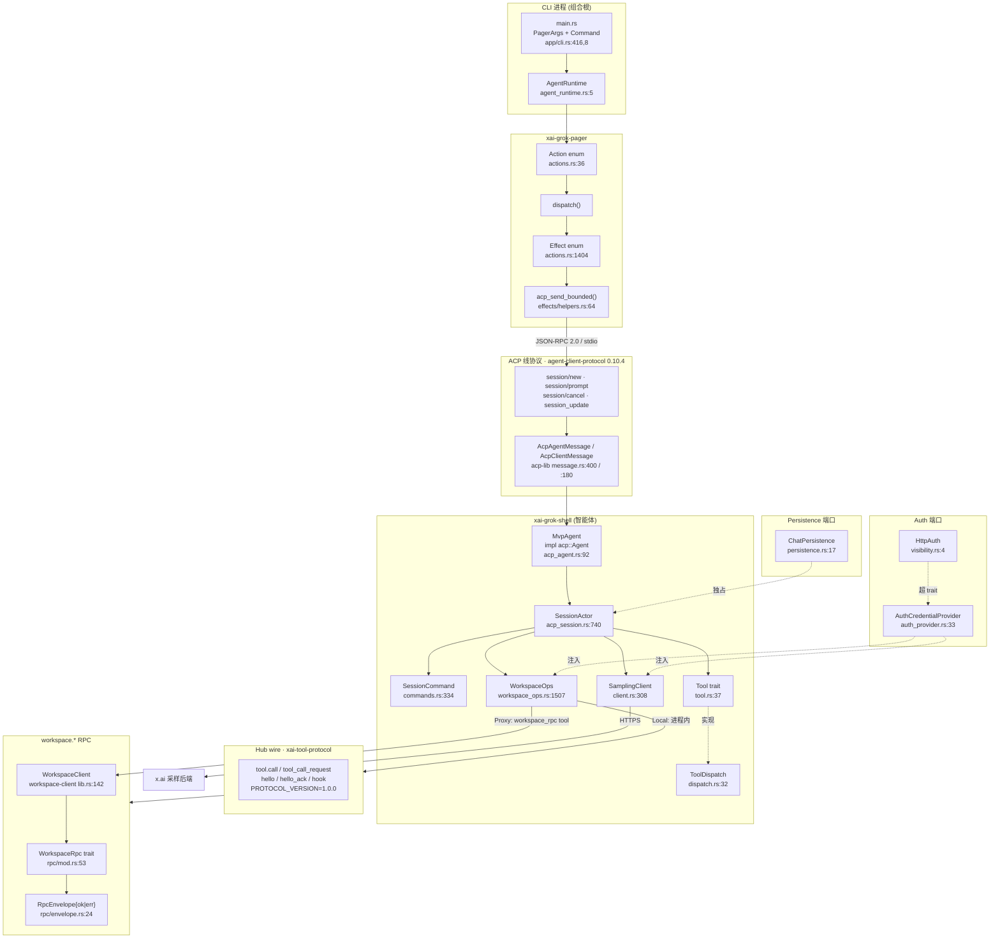

[上一篇：04-核心模块与类关系](04-核心模块与类关系.md) · [总目录](README.md) · [下一篇：06-配置与数据流](06-配置与数据流.md)

# 05：API 与接口设计

> **场景**：你要在不读全部内部实现的前提下，重写出一份可运行的 Grok Build。本文把全系统最稳定、最不该被焊死的那一层——**端口（port）**——单列成章：所有 `trait` 与所有 wire enum / wire struct。只要这层契约不变，UI 怎么换（TUI / headless / gateway / dashboard）、OS 细节怎么改（macOS / Linux / Windows）、工具怎么新增，都不影响系统其余部分。重实现者的第一份工作清单就是本文。
> **工具版本**：Rust `1.94.0`（`rust-toolchain.toml:11`）；`ratatui 0.29`（根 `Cargo.toml:234`）/ `tokio = { version = "1", features = ["full"] }`（根 `Cargo.toml:281`）/ `agent-client-protocol 0.10.4`（根 `Cargo.toml:118`，`features = ["unstable"]`）/ `tree-sitter = "0.26"`（根 `Cargo.toml:296`）。workspace members = **102**（根 `Cargo.toml:8` 起）。
> **阅读说明**：讲调用关系与数据流，不把行号当稳定 API。凡能给出符号名的位置，一律用「`文件路径 · 符号(+函数内相对偏移)`」（`+0` = 定义所在行），行号只作快照辅助（当前 HEAD `2178c69c`）。外部 crate（如 `agent-client-protocol`，见 §3）的**字段级定义**在快照内 NOT FOUND，本文只给**稳定使用位点**与 wire 方法引用名，重实现者需对齐该 crate 的发布版本。

---

## 本文件内容

1. [Why：端口是可替换适配器的前提](#1-why端口是可替换适配器的前提)
2. [接口关系全景（ASCII 边界图 + Mermaid 关系图）](#2-接口关系全景ascii-边界图--mermaid-关系图)
3. [ACP 端口：客户端↔智能体线协议](#3-acp-端口客户端智能体线协议)
4. [CLI 端口：PagerArgs 与 Command 子命令](#4-cli-端口pagerargs-与-command-子命令)
5. [Tool 端口：Tool trait · ToolCallContext · ToolDispatch](#5-tool-端口tool-trait--toolcallcontext--tooldispatch)
6. [Hub wire 端口：xai-tool-protocol 的版本、握手与工具调用](#6-hub-wire-端口xai-tool-protocol-的版本握手与工具调用)
7. [Workspace RPC 端口：WorkspaceOps 枚举、Local/Proxy 与 workspace.\* 方法](#7-workspace-rpc-端口workspaceops-枚举localproxy-与-workspace-方法)
8. [Sampler 端口：SamplingClient 三层 API 与 SamplingEvent](#8-sampler-端口samplingclient-三层-api-与-samplingevent)
9. [Auth 端口：HttpAuth 与 AuthCredentialProvider](#9-auth-端口httpauth-与-authcredentialprovider)
10. [Persistence 端口：ChatPersistence trait](#10-persistence-端口chatpersistence-trait)
11. [每个端口的输入 / 输出 / 错误 / 幂等 / 版本约束对照表](#11-每个端口的输入--输出--错误--幂等--版本约束对照表)
12. [重实现：先定义哪些 trait、版本号怎么带](#12-重实现先定义哪些-trait版本号怎么带)

---

## 1. Why：端口是可替换适配器的前提

Grok Build 把「terminal AI coding agent」定义为**默认 UI**，但代码里没有任何一处把业务逻辑焊死在 curses / ratatui 上。它靠的是一组**端口**：一侧是 Rust `trait`（进程内依赖倒置），一侧是 wire enum / wire struct（跨进程 / 跨机器的线协议）。这两类东西的共同点是——**它们定义「能说什么话」，而不定义「话是谁说的、怎么传的」**。

为什么这是重实现的命门：

- 你完全可以写一个没有 TUI 的 Grok Build：把 `crates/codegen/xai-grok-pager` 换成纯 stdio 转发器，只要它还说 **ACP 线协议**（§3），`crates/codegen/xai-grok-shell`（智能体侧）一行不用改。反之，shell 侧重写成 Python，只要它还对本地说 ACP、对 hub 说 `xai-tool-protocol`（§6），所有工具服务器照常工作。
- `Tool` trait（`crates/common/xai-tool-runtime/src/tool.rs · Trait：Tool`，`:37`）让「文件系统工具」「shell 工具」「MCP 工具」共享同一调用形状。重实现时**新增一种工具来源 = 新增一个 `Tool` impl**，而不是改 `SamplerActor` 或 `SessionActor`。
- 多层 HTTP 采样（`SamplingClient`，`crates/codegen/xai-grok-sampler/src/client.rs · Struct：SamplingClient`，`:308`）把「OpenAI Chat Completions / Responses API / Anthropic Messages」三种供应商形状收敛成一条内部流。换供应商 = 改这一层，模型回路（agent loop）不动。
- **`workspace.*` RPC**（§7）是一整层端口：`WorkspaceRpc` trait（`crates/codegen/xai-grok-workspace-types/src/rpc/mod.rs · Trait：WorkspaceRpc`，`:53`）让「本地进程内 workspace」与「远端 hub 代理的 workspace」共享同一批方法签名，客户端只需换 `WorkspaceOps` 的变体。当前有 **100 个 `impl WorkspaceRpc for …`**（跨 16 个文件）。

一句话：**端口是重实现的「冻结接口」**。本章逐一口述它们，每条结论都带源码索引，失败路径与成功路径等篇幅，目的是让你抄得动、改得对。

---

## 2. 接口关系全景（ASCII 边界图 + Mermaid 关系图）

### 2.1 ASCII 边界图

下图把「进程内 trait 端口」与「跨进程 wire 端口」分开画。方框是 crate，`║` 是线协议边界，实线箭头是调用方向。

```
                         ┌──────────────────────────────────────────────┐
   CLI 进程 (组合根)      │            xai-grok-pager  (客户端/UI)         │
   ┌─────────────┐       │  ┌────────────────────────────────────────┐  │
   │ main.rs      │       │  │ Action ──▶ dispatch ──▶ Effect          │  │
   │ (PagerArgs,  │       │  │   Effect::CreateSession                 │  │
   │  Command)    │──────▶│  │   Effect::SendPrompt / CancelTurn       │  │
   └─────────────┘       │  └───────────┬────────────────────────────┘  │
                         │              │  acp_send_bounded(req, &tx)    │
                         │              │  effects/helpers.rs:64         │
                         └──────────────┼─────────────────────────────────┘
                                        │  ║ ACP 线协议 (JSON-RPC 2.0, stdio)
                                        │  ║ session/new · session/prompt
                                        │  ║ session/cancel · session/load
                                        │  ║ + 反向请求 request_permission / fs/* · terminal/*
                                        ▼  ║ + 通知 session_update
                         ┌──────────────┼─────────────────────────────────┐
                         │              │  xai-grok-shell (智能体 / ACP 服务端)│
                         │  MvpAgent    │◀─ SessionCommand (actor 邮箱)     │
                         │  impl acp::Agent │   commands.rs:334 (108 变体)  │
                         │  acp_agent.rs:92 │  SessionActor (acp_session.rs:740)
                         │      ├─ Tool 端口 (tool.rs:37)                  │
                         │      ├─ Sampler  (client.rs:308)                │
                         │      └─ Workspace (workspace_ops.rs:1507)       │
                         │                                                 │
                         │   ┌──────────┴──────────┐   ┌───────────────┐  │
                         │   │ WorkspaceOps 枚举    │   │ SamplingClient │  │
                         │   │ Local{handle}        │   │ 三层 HTTP API  │  │
                         │   │ Proxy{client}        │   │ client.rs:308  │  │
                         │   │ workspace_ops.rs:1507│   └──────┬────────┘  │
                         │   └──────────┬──────────┘          │          │
                         └──────────────┼─────────────────────┼──────────┘
            ║ Hub wire   │  ║ workspace.* RPC      │            │ HTTPS
            ║ xai-tool-  │  ║ (tool_id=           │            ▼
            ║ protocol   │  ║  "workspace_rpc")    │   ┌──────────────────┐
            ║ tool.call  │  ║ RpcEnvelope{ok|err}  │   │  x.ai 采样后端    │
            ▼  ║ / hook     │  ▼                     │   └──────────────────┘
   ┌──────────────────┐  │  ┌──────────────────────────┐
   │ Tool Server (远端) │  │  │ xai-grok-workspace        │  Local 模式工具经此
   │ ToolServerHandler │  │  │ WorkspaceRpcHandler       │
   │ (hub-sdk server)  │  │  │ (hub_server.rs:384)       │
   └──────────────────┘  │  └──────────────────────────┘
                         │
        Auth 端口: Arc<dyn AuthCredentialProvider>  贯穿 Sampler / Workspace / 数据上报
        Persistence 端口: Box<dyn ChatPersistence>  ChatStateActor 独占
```

要点：实线 = 进程内 Rust 调用；`║` = 线协议（跨进程，必须按 wire 形状对齐）。

### 2.2 Mermaid 接口关系图



---

## 3. ACP 端口：客户端↔智能体线协议

### 3.1 What：ACP 是什么、稳定符号在哪

ACP = **Agent Client Protocol**。它是 Grok Build 客户端（pager / gateway / headless / dashboard）与智能体（shell）之间**唯一的**线协议，跑在 stdio 上，逐行一个 JSON-RPC 2.0 消息。

**重要事实（重实现者必读）**：本仓库不含 ACP 请求类型的字段定义。代码里写的 `acp::NewSessionRequest`、`acp::PromptRequest` 来自外部 crate `agent-client-protocol`（根 `Cargo.toml:118` 固定为 `version = "0.10.4", features = ["unstable"]`），别名写法是 `use agent_client_protocol as acp;`。因此：

- **请求结构的字段级定义 → NOT FOUND（在快照内）**。重实现者必须对齐 `agent-client-protocol` 0.10.4 的发布类型。
- **稳定使用位点（本文给的）**：`crates/codegen/xai-acp-lib/src/message.rs`（两个内联子模块 `mod client`（`:127`）/ `mod agent`（`:352`），定义消息枚举）、`crates/codegen/xai-acp-lib/src/gateway.rs`（方法分发）、`crates/codegen/xai-acp-lib/src/channel.rs`（`acp_send`，`:34`）。
- 本 crate 的公开面（`crates/codegen/xai-acp-lib/src/lib.rs` 的 `pub use self::{ … }`，`:10`–`:23`）：`AcpAgentChannel` / `AcpChannel` / `AcpClientChannel` / `acp_channels` / `acp_send` / `AcpAgentRx` / `AcpAgentTx` / `AcpChannelFailure` / `AcpClientRx` / `AcpClientTx` / `AcpResult` / `AcpRxo` / `AcpTxo` / `acp_channel_failure` / `acp_internal_error` / `AcpAgentGatewayReceiver` / `AcpAgentGatewaySender` / `AcpClientGatewayReceiver` / `AcpClientGatewaySender` / `AcpGatewayReceiver` / `AcpGatewaySender` / `acp_gateway` / `AcpAgentMessage` / `AcpAgentMessageBox` / `AcpAgentMessageGeneric` / `AcpArgs` / `AcpArgsBox` / `AcpClientMessage` / `AcpClientMessageBox` / `AcpClientMessageGeneric` / `AcpMethod` / `AcpRequest` / `AcpSide` / `Boxed` / `StorageMarker` / `Unboxed`。
- 三个核心内部 trait / 结构：`AcpMethod`（`message.rs · Trait：AcpMethod`，`:44`，唯一方法 `method_name()`）、`AcpRequest: Clone + Debug + Serialize + AcpMethod`（`· Trait：AcpRequest`，`:49`，带 `type Response`）、`AcpArgsGeneric<T, S>`（`· Struct：AcpArgsGeneric`，`:54`，字段 `request: S::Type<T>` + `response_tx: oneshot::Sender<AcpResult<T::Response>>`）。

**方法绑定（逐条真实位点）**——`acp_define_request_response!(Request, Response, method_name)` 宏（`message.rs · Macro：acp_define_request_response`，`:93`）把每个三元组绑定成 `impl AcpRequest for Request { type Response = Response; }` + `impl AcpMethod for Request { fn method_name(&self) -> &'static str { method_name } }`。

**agent 方向（`mod agent`，`message.rs:352` 起）**：

| Rust 引用（第 3 参数） | 源码位点 | 请求 / 响应类型（外部 crate） |
|---|---|---|
| `acp::AGENT_METHOD_NAMES.initialize` | `message.rs:357` | `acp::InitializeRequest` / `acp::InitializeResponse` |
| `acp::AGENT_METHOD_NAMES.authenticate` | `message.rs:362` | `acp::AuthenticateRequest` / `acp::AuthenticateResponse` |
| `acp::AGENT_METHOD_NAMES.session_new` | `message.rs:367` | `acp::NewSessionRequest` / `acp::NewSessionResponse` |
| `acp::AGENT_METHOD_NAMES.session_load` | `message.rs:372` | `acp::LoadSessionRequest` / `acp::LoadSessionResponse` |
| `acp::AGENT_METHOD_NAMES.session_set_mode` | `message.rs:377` | `acp::SetSessionModeRequest` / `acp::SetSessionModeResponse` |
| `acp::AGENT_METHOD_NAMES.session_prompt` | `message.rs:382` | `acp::PromptRequest` / `acp::PromptResponse` |
| `acp::AGENT_METHOD_NAMES.session_cancel` | `message.rs:387` | `acp::CancelNotification` / **`()`** |
| `acp::AGENT_METHOD_NAMES.session_set_model` | `message.rs:392` | `acp::SetSessionModelRequest` / `acp::SetSessionModelResponse` |
| `"ext_method"`（字面量） | `message.rs:107` | `acp::ExtRequest` / `acp::ExtResponse` |
| `"ext_notification"`（字面量） | `message.rs:108` | `acp::ExtNotification` / **`()`** |

> **wire 字符串的归属**：上表前 8 行的**字面值由外部 crate 的 `AGENT_METHOD_NAMES` 常量持有**（本快照内 NOT FOUND）。仓库内可直接观察到的 wire 字面量证据在 `crates/codegen/xai-grok-pager-bin/src/main.rs` 的 `CACHED_METHODS`（`:905`–`:913`）：`"initialize"` / `"session/new"` / `"session/load"` / `"session/resume"` / `"session/close"` / `"x.ai/session/close"` / `"_x.ai/session/close"`——即 pager-bin 的 stdio 桥在真实 JSON-RPC 报文里按这些字符串匹配。注意 `session/resume` / `session/close` **不在** `AcpAgentMessageGeneric` 枚举里（见 §3.4 的两条连接路径）。

客户端方向（`mod client`，`message.rs:127` 起）：

| Rust 变体（`AcpClientMessageGeneric<S>`，`message.rs:180`） | 引用方法名（第 3 参数） | 方向 |
|---|---|---|
| `RequestPermission` | `acp::CLIENT_METHOD_NAMES.session_request_permission` | agent→client（**反向请求**） |
| `ReadTextFile` | `acp::CLIENT_METHOD_NAMES.fs_read_text_file` | agent→client |
| `WriteTextFile` | `acp::CLIENT_METHOD_NAMES.fs_write_text_file` | agent→client |
| `SessionNotification` | `acp::CLIENT_METHOD_NAMES.session_update`（响应 `()`） | agent→client（**通知**） |
| `CreateTerminal` | `acp::CLIENT_METHOD_NAMES.terminal_create` | agent→client |
| `TerminalOutput` | `acp::CLIENT_METHOD_NAMES.terminal_output` | agent→client |
| `ReleaseTerminal` | `acp::CLIENT_METHOD_NAMES.terminal_release` | agent→client |
| `WaitForTerminalExit` | `acp::CLIENT_METHOD_NAMES.terminal_wait_for_exit` | agent→client |
| `KillTerminalCommand` | `acp::CLIENT_METHOD_NAMES.terminal_kill` | agent→client |
| `ExtMethod` / `ExtNotification` | `ext_method` / `ext_notification`（字面量，`message.rs:107-108`） | 双向 |

**agent 方向的消息枚举**（`AcpAgentMessageGeneric<S>`，`message.rs:400`）共 **10 个变体**：`Initialize` / `Authenticate` / `NewSession` / `LoadSession` / `SetSessionMode` / `Prompt` / `Cancel` / `ExtMethod`（`:408`）/ `ExtNotification`（`:409`）/ `SetSessionModel`。

> **相对旧基线的结构变化**：`message.rs` 把两个消息枚举放在**内联 `mod client`（`:127`）/ `mod agent`（`:352`）** 里（不是独立文件），且 `AcpAgentMessageGeneric` 已含 `ExtMethod` / `ExtNotification`。`MvpAgent` 还实现了外部 trait 里更多的方法（`list_sessions`、`resume_session`、`close_session`，见 §3.4），**这些方法不在本 crate 的 `AcpAgentMessage` 枚举里**——说明 ACP 连接有两条路径：经 `xai-acp-lib` gateway 的（pager/leader），与直接经 `acp::AgentSideConnection` 的。重实现时两条都要考虑。

### 3.2 How：`session/new`、`session/prompt`、`session/cancel` 的调用链

**成功路径（`session/new`）**

1. CLI 解析出 `Command::Agent(Box<AgentArgs>)`（`crates/codegen/xai-grok-pager/src/app/cli.rs · Agent(+2)`，`:10`；`AgentArgs` 在 `:255`），组合根 `AgentRuntime::from_args`（`crates/codegen/xai-grok-pager/src/agent_runtime.rs · fn from_args(+9)`，`:14`）构造 `Effect::CreateSession { agent_id, cwd, model_id, permission_mode_override, preferred_session_id, chat_kind }`（`actions.rs · CreateSession(+4)`，`:1408`）。
2. 该 Effect 经 `dispatch` 落到 ACP 通道，由 `acp_send_bounded`（`crates/codegen/xai-grok-pager/src/app/effects/helpers.rs · fn acp_send_bounded(+0)`，`:64`）在超时内把 `acp::NewSessionRequest` 送进 `tx`。`acp_send_bounded` 只是给 `acp_send` 套了 `tokio::time::timeout`，超时返回 `SessionRpcError::TimedOut { action, timeout }`（`helpers.rs · Enum：SessionRpcError`，`:31`）。
3. shell 侧 `AcpAgentMessage::NewSession(AcpArgsGeneric<acp::NewSessionRequest, _>)`（`message.rs:403`）经 `route_to_agent`（`message.rs · fn route_to_agent(+0)`，`:541`）或 gateway 的 `AcpGatewayReceiver::run`（`gateway.rs · impl<C: acp::Agent + 'static> AcpGatewayReceiver<acp::ClientSide, C>(+0)`，`:169` 起，`run` 在 `:170`）分发到 `MvpAgent::new_session`（`acp_agent.rs · fn new_session(+862)`，`:954`），后者 `self.new_session_inner(arguments).instrument(span).await`；`new_session_inner` 在 `crates/codegen/xai-grok-shell/src/agent/mvp_agent/session_setup.rs · fn new_session_inner(+0)`（`:368`），内部最终调 `spawn_session_actor`（`crates/codegen/xai-grok-shell/src/session/acp_session_impl/spawn.rs · fn spawn_session_actor(+0)`，`:217`）。

**成功路径（`session/prompt`）**

1. 用户输入文本 → `Action` → `Effect::SendPrompt { agent_id, session_id, text, prompt_id, skill_token_ranges }`（`actions.rs · SendPrompt(+141)`，`:1545`）。`prompt_id` 是客户端生成的 UUID，会**回显在每条通知与 `PromptResponse` 上**用于关联；`skill_token_ranges` 是识别出的 slash-token 字节区间，非空时写入内容块 `_meta.skillTokenRanges`，让 replay 时按 composer 的样式重绘。
2. `effects/mod.rs` 构造 `acp::PromptRequest`，注入 `_meta`（prompt id、screen mode、traceparent）。
3. `acp_send(req, &tx).await`（`crates/codegen/xai-acp-lib/src/channel.rs · fn acp_send(+0)`，`:34`）——**有响应的请求**，不是通知。
4. 响应回来包成 `TaskResult::PromptResponse { … }`（`actions.rs · PromptResponse(+226)`，`:2596`）回到事件循环。

`acp_send` 的真实实现（`channel.rs · fn acp_send(+0)`）：

```rust
pub async fn acp_send<R, T>(request: T, tx: &mpsc::UnboundedSender<R>) -> AcpResult<T::Response>
where T: AcpRequest, R: From<AcpArgs<T>> + fmt::Debug
{
    let (response_tx, response_rx) = oneshot::channel();
    let method = request.method_name();
    let args = AcpArgs { request, response_tx };
    tx.send(args.into()).map_err(|_| acp_channel_failure_error(
        format!("unable to send '{method}' request, channel closed"),
        AcpChannelFailure::SendFailed))?;
    response_rx.await.map_err(|_| acp_channel_failure_error(
        format!("unable to receive '{method}' response, channel closed"),
        AcpChannelFailure::RecvFailed))?
}
```

**成功路径（`session/cancel`）—— 注意它的响应类型是 `()`**

`session/cancel` 在 `message.rs:387-391` 被绑定为 `acp_define_request_response!(acp::CancelNotification, (), acp::AGENT_METHOD_NAMES.session_cancel)`，响应类型是 `()`（单元）。pager 侧 `Effect::CancelTurn { session_id, cancel_subagents, trigger, rewind_prompt_id, … }`（`actions.rs · CancelTurn(+170)`，`:1574`）承载取消语义：`trigger` 会作为 `_meta.cancelTrigger` 发出（`crates/codegen/xai-grok-shell/src/session/commands.rs:22` 注释：「What triggered the cancel (e.g. `"send_now"`, `"esc"`, `"mouse"`), sent as `cancelTrigger` on the turn-end `_meta`」），让 shell 的 `mid_turn_abort` 遥测能区分「ESC / Ctrl+C / 鼠标 / 程序化」；`rewind_prompt_id` 仅在 pager 把提示词还原到 composer 时设置。

> **取消语义的两处拆分**：`xai-acp-lib` 内部**没有**独立的 `CancelOptions` 结构承载取消语义——取消语义拆成两处：pager 的 `Effect::CancelTurn`（客户端意图）+ shell 的 `SessionCommand` 取消路径（服务端执行）。`_meta.cancelTrigger` / `_meta.cancellationCategory` 是 wire 契约，`crates/codegen/xai-grok-shell/src/session/commands.rs` 的测试 `pins_every_wire_name`（`:953`）专门钉住这些字符串——**shipped client 靠字符串匹配，重命名是编译器看不见的 wire break**。

### 3.3 How：notifications（智能体→客户端）

反向（agent→client）的消息在 `AcpClientMessageGeneric`（`message.rs:180`）：

- `SessionNotification(AcpArgsGeneric<acp::SessionNotification, S>)`（`message.rs:184`）——会话状态、token 计数、工具调用进度等主动推送；引用方法名是 `acp::CLIENT_METHOD_NAMES.session_update`，**响应类型 `()`**。
- `RequestPermission`（`:181`）/ `ReadTextFile`（`:182`）/ `WriteTextFile`（`:183`）——**反向请求**：agent 调用 client 去做权限确认或文件读写（因为文件可能只在客户端机器上）。
- `CreateTerminal` / `TerminalOutput` / `ReleaseTerminal` / `WaitForTerminalExit` / `KillTerminalCommand`（`message.rs:185-189`）——终端桥。
- `ExtMethod(acp::ExtRequest)` / `ExtNotification(acp::ExtNotification)`（`message.rs:190-191`）——扩展点。

这些消息经 `AcpClientMessage::route_to_client(client, spawn)`（`message.rs · fn route_to_client(+0)`，`:242`）分发到 `acp::Client` trait 的实现（pager 侧）。gateway 侧等价路径是 `AcpGatewayReceiver<acp::AgentSide, C>::run`（`gateway.rs · impl<C: acp::Client + 'static>(+0)`，`:231` 起，`run` 在 `:232`）。

**gateway 的两条 `run` 是镜像的**：
- `impl<C: acp::Agent + 'static> AcpGatewayReceiver<acp::ClientSide, C>::run`（`gateway.rs:169`/`:170`）——处理**入站 `AcpAgentMessage`**，逐个 `handle!` 到 `conn.initialize/authenticate/new_session/load_session/set_session_mode/prompt/cancel/ext_method/ext_notification/set_session_model`。
- `impl<C: acp::Client + 'static> AcpGatewayReceiver<acp::AgentSide, C>::run`（`gateway.rs:231`/`:232`）——处理**入站 `AcpClientMessage`**，`handle!` 到 `request_permission/read_text_file/write_text_file/session_notification/create_terminal/terminal_output/release_terminal/wait_for_terminal_exit/kill_terminal/ext_method/ext_notification`。

`handle!` 宏（`gateway.rs · Macro：handle`，`:142`）做三件事：从 `_meta` 建 `tracing::Span` 并 `.instrument(span)`、`before_request` 打 debug 日志、`after_request` 把结果送回 `oneshot`。对没有 `meta` 字段的类型（`ExtRequest` / `ExtNotification`）走 `no_meta` 变体。

### 3.4 失败路径（与成功路径等篇幅）

ACP 的失败分四类，重实现时必须全部覆盖：

- **请求级错误（JSON-RPC error）**：`acp_send` 返回 `AcpResult<T::Response>`。pager 把 `Err` 映射成 `SessionRpcError::Rpc(e)` 或 `SessionRpcError::TimedOut { action, timeout }`（`effects/helpers.rs · fn acp_send_bounded(+0)` 起，`Ok(Err(e)) => Err(SessionRpcError::Rpc(e))` 在 `+12`），再包成 `TaskResult::PromptResponse { … }`——即**错误被翻译成用户可见文本 + HTTP 状态码**。实现者必须保留 `http_status` 字段，否则 401 归因逻辑（`SamplingClient` 的 `attribution_callback`）会失准。
- **通道半关**：`AcpChannelFailure`（`crates/codegen/xai-acp-lib/src/common.rs · Enum：AcpChannelFailure`，`:25`）是**两态**枚举：`SendFailed`（请求根本没入队——对端连接任务已走，例如 headless 没接客户端）与 `RecvFailed`（入队了但对端在回答前消失）。两者都包装成 JSON-RPC `INTERNAL_ERROR`，并在 `error.data` 的 `xaiAcpChannelFailure` 键下带类型化 tag（`common.rs · Const：DATA_KEY`，`:39`，值 `"xaiAcpChannelFailure"`）。**消费方要用 `acp_channel_failure(&err) -> Option<AcpChannelFailure>`（`common.rs · fn acp_channel_failure(+0)`，`:69`）读取，而不是去 match message 字符串。** 这是类型化失败契约。
- **`session/cancel` 的竞态失败**：响应类型是 `()`，所以客户端**拿不到「已取消」的任何内容**。客户端 UI 必须自己进入「取消中」状态，不能等 ack。这是 ACP 端口的**结构性失败模式**。
- **方法未知 / 反序列化失败**：`AcpAgentMessage` 的 `Deserialize` 实现（`message.rs · impl<'de> Deserialize<'de> for AcpAgentMessage(+0)`，`:472`）先解析 `RawMessage { method_name, request }`，再按 `method_name` 逐串比较；未知方法返回 `serde::de::Error::custom(...)`。注意这个 shape **不是** JSON-RPC 的 `{jsonrpc, id, method, params}`——本 crate 的 serde 表示是 `{method_name, request}`（`AcpAgentMessageGeneric` 的 `Serialize` 实现 `serialize_struct("AcpAgentMessage", 2)` 在 `:435` 起），JSON-RPC 信封在别处（`crates/codegen/xai-acp-lib/src/normalize.rs` 处理 Windows 上的多余字节）。
- **`session/resume` / `session/close` 的第二条路径**：`MvpAgent` 实现了 `list_sessions`（`acp_agent.rs · fn list_sessions(+881)`，`:973`）、`resume_session`（`· fn resume_session(+887)`，`:979`）、`close_session`（`· fn close_session(+893)`，`:985`），但它们**不在 `AcpAgentMessageGeneric` 的 10 个变体里**。重实现者若只用 gateway 分发，会漏掉这些方法；它们经 `acp::AgentSideConnection` 直连（pager-bin 的 stdio 桥也直接按 `"session/resume"` / `"session/close"` 字符串匹配，`main.rs:909-910`）。

---

## 4. CLI 端口：PagerArgs 与 Command 子命令

### 4.1 What

CLI 是**进程入口端口**——它把 argv 翻译成内部 `Action`/`Effect`，本身不含业务。稳定类型都在 `crates/codegen/xai-grok-pager/src/app/cli.rs`：

- `enum Command`（`cli.rs · Enum：Command`，`:8`）——顶层子命令，`#[derive(Debug, Clone, Subcommand)]`，共 **24 个变体**，enum 体至 `:145`。
- `struct PagerArgs`（`cli.rs · Struct：PagerArgs`，`:416`）——全局参数（含 `global = true` 的可贯穿到子命令的项），`#[derive(Parser)]` 派生。
- `struct AgentArgs`（`cli.rs · Struct：AgentArgs`，`:255`）——`grok agent` 子命令的参数。
- 二进制入口在 `crates/codegen/xai-grok-pager-bin/src/main.rs`（另有 `mod agent_command`），发行名 `grok`。

### 4.2 How：`Command` 变体（`cli.rs:8`，24 个，逐条真实）

| 变体（偏移相对 `:8`） | 含义 | 字段 |
|---|---|---|
| `Agent(Box<AgentArgs>)`（`+2`，`:10`） | 启动交互 / headless 智能体（主路径） | `Box<AgentArgs>` |
| `Inspect { json }`（`+4`） | 打印本目录发现到的配置 | `json: bool` |
| `Doctor(DoctorArgs)`（`+10`） | 检查终端/剪贴板/颜色/输入支持 | 子结构 |
| `Leader(LeaderMgmtArgs)`（`+12`） | 管理常驻 leader 进程（`List` / `Info` / `Kill`） | `LeaderMgmtCommand` |
| `Logout`（`+14`） | 登出并清除缓存凭据 | 无 |
| `Login { legacy, oauth, device_auth, devbox }`（`+16`，`:24`） | 登录 Grok；OAuth2 为主，`device_auth` 给无头环境 | `legacy` 保留兼容但 `hide`；`oauth` 与 `device_auth` 互斥；`devbox` 是 `#[arg(skip)]` |
| `Mcp(McpArgs)`（`+36`，`:44`） | 管理 MCP server 配置 | 子结构 |
| `Plugin(PluginArgs)`（`+38`） | 管理插件与市场源 | 子结构 |
| `Memory(MemoryArgs)`（`+40`） | 管理跨会话记忆 | 子结构 |
| `Models`（`+42`） | 列出可用模型后退出 | 无 |
| `Sessions(SessionsArgs)`（`+44`） | 列出/搜索/恢复会话 | 子结构 |
| `Usage(UsageArgs)`（`+46`） | 打印某会话的持久化 token / 成本用量 | 子结构 |
| `Setup { json }`（`+48`，`:56`） | 拉取并安装受管配置；`--json` 只打印不写 | `json: bool` |
| `Share(ShareArgs)`（`+55`，`:63`） | 分享会话并打印 URL（`hide`） | 子结构 |
| `Wrap(WrapArgs)`（`+75`，`:83`） | 在本地 PTY 里跑任意命令并把 OSC 52 剪贴板转发到本机 | `command: Vec<String>` |
| `Export(ExportArgs)`（`+77`） | 把会话 transcript 导出为 Markdown | 子结构 |
| `Trace(TraceArgs)`（`+79`） | 导出或上传会话 trace 数据 | 子结构 |
| `Update { check, json, force_reinstall, version, alpha, stable, enterprise, trigger, auto }`（`+81`，`:89`） | 检查/安装指定版本；`alpha` / `stable` / `enterprise` 三选一互斥 | 见 `cli.rs:100-118` |
| `Version { json }`（`+112`，`:120`） | 打印版本信息（`visible_alias = "v"`） | `json: bool` |
| `Completions { shell }`（`+118`） | 生成 shell 补全脚本 | `Shell` |
| `Worktree(WorktreeArgs)`（`+124`） | 管理 git worktree | 子结构 |
| `DiskUsage(DiskUsageArgs)`（`+127`，`:135`） | 显示 `~/.grok` 磁盘占用（`name = "du"`，别名 `disk-usage`） | 子结构 |
| `Workspace(WorkspaceMgmtArgs)`（`+132`，`:140`） | 把本工作区暴露给 Computer Hub（`hide`） | `Start` / `Pause` / `Resume` / `Stop` / `Restart` / `Status` |
| `Dashboard`（`+136`，`:144`） | 启动时打开 Agent Dashboard | 无 |

`Login` 的 `devbox` 字段用 `#[arg(skip)]`（`cli.rs:44`）保证 match 臂在 Bazel/cargo 两种图下都 feature-unification 安全——这是**端口稳定性细节**：新增带 `skip` 的字段不会破坏下游 match。

### 4.3 How：`PagerArgs` 字段（`cli.rs:416`，逐条真实）

- `version: bool`（`-v/-V`，`· version(+3)`，`:419`）——打印版本。
- `cwd: Option<PathBuf>`（`--cwd`，`· cwd(+6)`，`:422`）——工作目录。
- `leader_socket: Option<PathBuf>`（`--leader-socket`，**全局**，`· leader_socket(+16)`，`:432`）——覆盖默认 `~/.grok/leader.sock`；注释要求命名为 `~/.grok/leader-*.sock` 才能被 `grok leader list/kill` 自动发现。
- `debug: bool`（`--debug`，**全局**，`· debug(+19)`，`:435`）。
- `debug_file: Option<PathBuf>`（`--debug-file`，**全局**，`· debug_file(+27)`，`:443`）。
- `yolo: bool`（`--always-approve`，别名 `yolo` / `dangerously-skip-permissions`，`· yolo(+34)`，`:450`）——自动批准所有工具。
- `trust: bool`（`--trust`，别名 `trust-folder`，`hide`，`· trust(+37)`，`:453`）——信任此目录并持久化。
- `allow_rules: Vec<String>`（`--allow`，别名 `allowedTools`，`value_delimiter = ','`，`· allow_rules(+45)`，`:461`）。
- `deny_rules: Vec<String>`（`--deny`，别名 `disallowedTools`，`· deny_rules(+53)`，`:469`）。
- `single: Option<String>`（`-p/--single`，别名 `print`，与 `prompt_json` / `prompt_file` 互斥，`· single(+55)`，`:471` 起）。
- `verbatim`、`output_format: OutputFormat`（`--output-format`，`value_enum`，默认 `plain`）、`include_partial_messages`、`json_schema`（**隐含 `--output-format json`**）、`model`（`-m/--model`）、`reasoning_effort`（别名 `effort`，用 `overrides_with` 实现幂等覆盖）——字段顺序与注解见 `cli.rs:508` 起。

**`OutputFormat`**（`crates/codegen/xai-grok-pager/src/headless/cli.rs · Enum：OutputFormat`，`:9`）是 headless 的 wire 契约：

```rust
pub enum OutputFormat {
    #[default] Plain,                          // cli.rs:11
    Json,                                      // :12
    /// NDJSON: one ACP session update per line, the agent's native format.
    #[value(name = "streaming-json")] StreamingJson,                  // :15
    /// NDJSON in the Anthropic Messages API wire format.
    #[value(name = "streaming-messages-json")] StreamingMessagesJson, // :18
}
```

### 4.4 失败路径

CLI 端口的失败集中在解析期与早期退出：

- clap 解析失败直接 `std::process::exit(2)`（clap 默认）；`--json-schema` 的校验在 `parse_json_schema`（`headless/cli.rs · fn parse_json_schema(+0)`，`:21`）里做，非 JSON 或非 object 都 `bail!`，**不进业务层**。
- `Inspect` / `Models` / `Sessions` / `Usage` / `Version` / `DiskUsage` 等只读子命令拿到结果后**立即退出，绝不进入事件循环**。
- `Login` 的 OAuth2 与 device-code 互斥、`Update` 的 `alpha` / `stable` / `enterprise` 三向互斥、`Workspace` 的 `leader` / `no_leader` 互斥——冲突由 clap 在解析期报错。
- `--single` / `--prompt-json` / `--prompt-file` 三向互斥——headless 只允许一种 prompt 来源。

重实现者若不用 clap，必须复刻这套「全局参数穿透 + 子命令互斥 + 解析期失败即退出」的契约，否则组合根无法正确分流。

---

## 5. Tool 端口：Tool trait · ToolCallContext · ToolDispatch

### 5.1 What

`Tool` trait（`crates/common/xai-tool-runtime/src/tool.rs · Trait：Tool`，`:37`）是**所有工具的统一进程内端口**。它故意**不是 object-safe**——因为带关联类型 `Args` / `Output`。类型擦除走 `ToolDyn`（`tool.rs · Trait：ToolDyn`，`:322`），对象安全分发走 `ToolDispatch`（`crates/common/xai-tool-runtime/src/dispatch.rs · Trait：ToolDispatch`，`:32`）。

### 5.2 How：Tool trait 的方法（`tool.rs:37` 起，逐条真实）

- `type Args: for<'de> Deserialize<'de> + JsonSchema + Send + 'static`（`tool.rs · Args(+2)`，`:39`）——**必须能从 JSON 反序列化**，否则 wire 分发无法解码。
- `type Output: Serialize + ToolOutput + Send + 'static`（`· Output(+11)`，`:48`）——输出要实现 `ToolOutput`（`crates/common/xai-tool-runtime/src/render.rs · Trait：ToolOutput`，`:63`），提供 model-facing content block。
- `fn id(&self) -> ToolId`（`· id(+14)`，`:51`）——**稳定身份**，runtime 据此路由。`ToolId` 是 `xai-tool-protocol` 的 `opaque_id!` 宏产出的 newtype，与 `ToolCallId` / `SessionId` / `ConnectionId` / `ServerId` / `UserId` / `RequestId` 同族（`crates/common/xai-tool-protocol/src/ids.rs`，经 `lib.rs:87-90` 再导出）。
- `fn description(&self, _ctx: &ListToolsContext) -> ToolDescription`（`· description(+23)`，`:60`）——可随 per-turn 上下文变化。
- `fn capabilities(&self) -> ToolCapabilities`（`· capabilities(+26)`，`:63`，默认 `default()`）——并发/作用域/帧能力标志（`crates/common/xai-tool-protocol/src/capabilities.rs`）。
- `fn has_dynamic_description(&self) -> bool`（`· has_dynamic_description(+33)`，`:70`，默认 `false`）。
- `fn should_list(&self, _ctx: &ListToolsContext) -> bool`（`· should_list(+39)`，`:76`，默认 `true`）——per-turn 是否进入模型可见清单。
- `fn execute(&self, ctx: ToolCallContext, args: Self::Args) -> impl Future<Output = ToolStream<Self::Output>> + Send`（`· execute(+51)`，`:88`）——**流式入口**（默认把 `run` 包成单元素流）。运行时只调这个。注释明写：用原生 RPITIT + 显式 `Send`，**不是** `#[async_trait]`，因为 `Tool` 只被泛型消费、不需要 dyn-compatible。
- `fn run(&self, _ctx: ToolCallContext, _args: Self::Args) -> impl Future<Output = Result<Self::Output, ToolError>> + Send`（`· run(+65)`，`:102`）——**阻塞便捷入口**（默认返回 `not_implemented` 错误）。

`ToolStream<T>`（`tool.rs · Type：ToolStream`，`:117`）定义为 `Pin<Box<dyn Stream<Item = ToolStreamItem<T>> + Send>>`。`ToolStreamItem<T>`（`tool.rs · Enum：ToolStreamItem`，`:121`）只有两个变体：`Progress(ToolProgress)`（`+2`，零或多个）与 `Terminal(Result<T, ToolError>)`（`+4`，**恰好一个，且永远最后**）。`ToolProgress`（`tool.rs · Enum：ToolProgress`，`:140`）是 `#[serde(tag = "kind", rename_all = "snake_case")]` 的 enum：`Text { text }`（`+2`）/ `Content { blocks }`（`+4`）/ `Custom { subkind, payload }`（`+10`）。这是端口级不变量：流必须以一个 `Terminal` 收尾，否则 `ToolDispatch::call_terminal` 默认实现报 `stream_no_terminal`。

### 5.3 How：ToolCallContext（`context.rs:66`，逐条真实）

```rust
pub struct ToolCallContext {            // context.rs · Struct：ToolCallContext :66
    pub call_id: ToolCallId,            // +1
    pub extensions: TypedExtensions,    // +2
}
```

`Default`（`context.rs · fn default(+5)`，`:71`）用 `ToolCallId::new_v7()`（UUIDv7）初始化 `call_id`。`insert::<T>()`（`· fn insert(+23)`，`:89`）/ `get::<T>() -> Option<Arc<T>>`（`· fn get(+29)`，`:95`）做依赖注入——工具借此拿到 `WorkspaceHandle`、`PermissionChecker`、`Arc<dyn ToolDispatch>` 等，而不必把构造参数焊进 trait。重实现者要让 `ToolCallContext` 成为**唯一**的「工具运行时环境」入口。

一个真实注入例子：`crates/codegen/xai-grok-tools/src/types/resources.rs · Struct：InnerDispatch`（`:458`）的 `pub struct InnerDispatch(pub Arc<dyn xai_tool_runtime::ToolDispatch>)`——注释说明它「Stored in `InnerDispatch` inside `ToolCallContext::extensions` — stack-bounded, dropped when `Tool::run()` returns」，用于绕过外层 `ToolBridge` 互斥锁，避免 `use_tool` 派发到目标 MCP 工具时死锁。

### 5.4 How：ToolDispatch（`dispatch.rs:32`，逐条真实）

```rust
#[async_trait]
pub trait ToolDispatch: Send + Sync {
    async fn call(&self, tool_id: ToolId, args: Value, ctx: ToolCallContext)
        -> ToolStream<TypedToolOutput>;                 // dispatch.rs · fn call(+3) :35
    async fn call_terminal(&self, tool_id: ToolId, args: Value, ctx: ToolCallContext)
        -> Result<TypedToolOutput, ToolError> { … }     // · fn call_terminal(+18) :50 默认实现
}
```

关键：**`call` 收 `args: Value`（裸 JSON）而非 typed `Args`**——类型擦除发生在 dispatch 路由器（下游 `xai-grok-tools` 等），`ToolDispatch` 这一层只认 `ToolId` + `Value`。`call_terminal` 默认实现 drain 流、丢弃 `Progress`、首个 `Terminal` 即短路；流无 `Terminal` 则报 `ToolError::custom("stream_no_terminal", "dispatch stream ended without a terminal item")`（`dispatch.rs · call_terminal(+13)`，`:63`）。

**真实实现**：`InnerDispatchForToolset`（`crates/codegen/xai-grok-tools/src/registry/types.rs · Struct：InnerDispatchForToolset`，`:1304`；`impl xai_tool_runtime::ToolDispatch for InnerDispatchForToolset` 在 `· impl(+4)`，`:1308`）——`call` 转发到 `FinalizedToolset::call_raw(tool_id.as_str(), args, ctx)`（`· fn call_raw`，`:1578`），把 `serde_json::to_value(&output)` 包成 `TypedToolOutput::from_value(tool_id.clone(), value)`，最后 `terminal_only(result)`。**没有 Progress**——说明这一层是「终端结果」直通路径。

### 5.5 更上游的一层：`ToolServerHandler`（远端工具服务器端口）

如果重实现要做**远端工具服务器**，`xai-computer-hub-sdk` 的 `ToolServerHandler`（`crates/common/xai-computer-hub-sdk/src/server.rs · Trait：ToolServerHandler`，`:161`）是服务端契约：

```rust
pub trait ToolServerHandler: Send + Sync + 'static {
    fn tool_id(&self) -> ToolId;                                   // server.rs · fn tool_id(+2) :163
    fn description(&self) -> ToolDescription;                      // · fn description(+5) :166
    fn input_schema(&self) -> Option<Value> { None }               // · fn input_schema(+9) :170
    async fn handle_call(&self, ctx: ToolCallContext, args: Value)
        -> ToolStream<TypedToolOutput>;                            // · fn handle_call(+20) :181
    async fn handle_hook(&self, session_id: SessionId, frame: HookFrame) {}          // · +34 :195
    async fn handle_hook_request(&self, session_id: SessionId, frame: HookFrame)
        -> Option<Value> { None }                                  // · +38 :199
    async fn handle_evict(&self, params: ToolServerEvictParams) {} // · +47 :208
}
```

- `handle_call` 的 `Progress` 项会被转发成 `tool_call_progress` 通知，`Terminal` 项作为响应发出。
- `handle_hook` 收 harness 下发的 hook（cancel / pause / resume / session-ended / custom）；`frame.tool_id` 在 harness 定向路由时被设置，`None` 表示会话级广播。
- `handle_hook_request` 是**请求/响应式 hook**（`hook_id` 已设）：第一个返回 `Some` 的 handler 胜出，全 `None` 则拒绝。
- `handle_evict` 是优雅下线请求，实现方应在 `params.grace_period_ms` 内排空在途工作，超时后 server 强制断连。

工作区侧的真实实现是 `WorkspaceRpcHandler`（`crates/codegen/xai-grok-workspace/src/hub_server.rs · Struct：WorkspaceRpcHandler`，`:384`，`pub(crate)`；`impl ToolServerHandler for WorkspaceRpcHandler` 在 `:1069`），它注册在 `ToolServer` 上、`tool_id` 是 `"workspace_rpc"`（`hub_server.rs` 模块注释第 2 行原文：「It is registered on the `ToolServer` with tool_id `workspace_rpc`.」）。

### 5.6 失败路径（与成功路径等篇幅）

Tool 端口的失败有五类：

- **参数解码失败**：`call` 收到 `Value` 后，下游路由器按 `tool_id` 找 `Tool::Args` 反序列化。失败应转成 `Terminal(Err(ToolError::InvalidParams(..)))`，且**仍要以 `Terminal` 收尾**——绝不能让流中途消失（触发 `stream_no_terminal`）。
- **`run`/`execute` 都没实现**：默认 `run` 返回 `ToolError::not_implemented("Tool must implement either \`run\` or \`execute\`")`（`tool.rs · run(+65)` 内，`:108`）。这是「作者忘了覆写」的显式失败，不是 panic。
- **流不变量违反**：实现者若在 `Terminal` 之后再发 item、或零个 `Terminal`，默认 `call_terminal` 只容错「缺 Terminal」一种（报 `stream_no_terminal`）；多发 Terminal 需要消费端自行忽略后续——重实现时建议**消费端**也容错多 Terminal。`FinalizedToolset::call_with_context`（`registry/types.rs · fn call_with_context(+1418)`，`:1657`）就是「`Progress` 全丢、`Terminal` 即返回、流结束无 Terminal 报 `stream_no_terminal_error()`」的同一模式。
- **权限/取消**：工具在 `execute` 内可借 `ToolCallContext::get::<PermissionChecker>()` 查权限；取消经 `CancelTurn` / `session/cancel` 落到 shell 的取消路径，工具需自己观测取消信号并提前返回 `Terminal(Err(ToolError::Cancelled))`。端口契约不替工具处理取消，只约定「最终必须有一个 Terminal」。
- **远端错误分类**：`ToolErrorKind`（`crates/common/xai-tool-runtime/src/error.rs`）与 `xai-tool-protocol` 的 `ToolErrorWire` / `error_codes`（`crates/common/xai-tool-protocol/src/error_wire.rs`、`src/error_codes.rs`）构成**数值 ↔ 字符串错误码映射**。跨进程时错误码必须在两边一致，否则远端失败会被归成 `Custom`。

---

## 6. Hub wire 端口：xai-tool-protocol 的版本、握手与工具调用

### 6.1 What

`xai-tool-protocol`（`crates/common/xai-tool-protocol`）是**工具服务器 ↔ computer hub ↔ 智能体**之间的 WebSocket 线协议。crate 的模块面（`crates/common/xai-tool-protocol/src/lib.rs`，`:11`–`:27`）：

```
bot_relay · capabilities · connection · envelope · error_codes · error_wire
frames · handshake · hook · ids · methods · notification_wire · output_wire
registration · registry_error · session_event · turn_hook
```

其中 `bot_relay` / `envelope` / `error_codes` / `error_wire` / `frames` / `methods` / `notification_wire` / `output_wire` / `session_event` / `turn_hook` 是 `pub mod`；`capabilities` / `connection` / `handshake` / `hook` / `ids` / `registration` / `registry_error` 是私有 `mod`（经 `lib.rs` 的 `pub use` 再导出）。所有 payload 类型都在 `JsonRpcRequest` / `JsonRpcResponse` / `JsonRpcNotification` 信封内（`src/envelope.rs` 的 `JsonRpcRequest :116` / `JsonRpcNotification :132` / `JsonRpcError :148` / `JsonRpcResponse :161` / `ResponseOutcome :170`）。重实现远程工具 / hub 时，这是必须逐字节对齐的一层。

### 6.2 How：版本与握手（`handshake.rs`，逐条真实）

- `pub const PROTOCOL_VERSION: &str = "1.0.0"`（`handshake.rs · Const：PROTOCOL_VERSION`，`:10`）——**线协议版本常量**。注释明确：不兼容的 schema 变更才 bump；**增量字段走 capability 协商，不 bump 版本**。重实现者握手时必须比较 `supported_protocol_versions`，而非假设等于 `"1.0.0"`。
- `struct HelloMsg`（`handshake.rs · Struct：HelloMsg`，`:21`）：`protocol_version: String`、`kind: ConnectionKind`、`server_id: Option<ServerId>`（仅 `ConnectionKind::ToolServer` 连接带）、`description: Option<String>`（给 `servers.list` 用的一行描述）、`metadata: Option<Value>`。WebSocket 升级后客户端**第一条**帧即发它；握手时**不带任何 session id**——连接起始是空会话集，之后用 `register_session` / `unregister_session` 动态绑定。
- `struct HelloAckMsg`（`handshake.rs · Struct：HelloAckMsg`，`:38`）：`connection_id: ConnectionId`、`user_id: UserId`（**hub 从升级凭证解析，客户端绝不自报**）、`computer_hub_version: String`、`supported_protocol_versions: Vec<String>`（`+7`，`:45`）、`capabilities: Vec<String>`（`+13`，`:51`，hub 支持的额外 JSON-RPC 方法，如 `"session_attach_server"`）。
- 本版新增：`AuthRefreshParams` / `AuthRefreshResult`（经 `lib.rs:83-85` 从 `handshake` 再导出），对应 wire verb `auth.refresh`。

### 6.3 How：方法名枚举（`methods.rs`，逐条真实）

`enum Method`（`methods.rs:23`）用 `define_methods!` 宏（`methods.rs:64` 起的宏调用）**单一来源**生成枚举 + serde rename + `Method::ALL` + `as_wire_str` + `from_wire_str`。当前共 **48 个变体**（旧基线 47，本版新增 `AuthRefresh => "auth.refresh"`，`:118`）。按方向分组列出 wire 字符串（源码 `methods.rs:66`–`:178`）：

**harness → service**：`session_open`、`session_close`、`session_detach`、`session_bind_server`、`session_unbind_server`、`session_attach_server`、`tools.list`、`tools.search`、`tool.call`、`tool.cancel`（**糖**，SDK 翻译成 `hook` 帧；线上**没有**独立的 `tool.cancel` 帧、也**没有** `ToolCancelParams` 结构）、`tool.notify`、`system.notify`、`subscribe_notifications`、`unsubscribe_notifications`、`hook`、`hello`、`hello_ack`、`ping`、`pong`。

**tool_server → service**：`tool_call_progress`、`tool.notification`、`hook_reply`、`traces.donate`、`logs.donate`、`metrics.donate`、`auth.refresh`。

**service → tool_server**：`tool_call_request`。

**service → harness**：`tools_changed`、`subscribe_ack`、`unsubscribe_ack`。

**harness → service（server discovery）**：`servers.list`。

**tool_server 生命周期**：`tool_server.status`、`tool_server.get_status`、`tool_server.evict`。

**session 生命周期**：`serve`（整工具快照，幂等）、`session.bind`、`session.unbind`。

**bot relay（bot_client ↔ service）**：`bot.command`、`bot.vncDescriptor`、`bot.roster`、`bot.status`、`bot.transcript.offbox`、`bot.usage`、`bot.subscribe`、`bot.unsubscribe`、`bot.bindConversation`、`bot.presence`、`bot.event`。

**`ToolCallParams`**（`frames.rs · Struct：ToolCallParams`，`:27`）：`tool_call_id: ToolCallId`、`tool_id: ToolId`、`arguments: Value`、`deadline_ms: Option<u64>`、`behavior_version: Option<String>`、`cwd: Option<String>`（OS 原生路径，跨 FS 工具用）、`trace_context: Option<String>`（W3C `traceparent`）。注释强调：`tool.call`（harness→service）与 `tool_call_request`（service→tool_server）**共用同一 params 形状**，`tool_call_id` 端到端保留。**`session_id` 不进 params**——它在 JSON-RPC 信封字段上，hub 从 `request.session_id` 读路由（`frames.rs` 模块注释明写）。

**响应 `ToolCallResult`**（`frames.rs · Struct：ToolCallResult`，`:48`）：`tool_call_id`、`output: ToolOutputWire`、`follow_ups: Vec<Value>`、`reminders: Vec<Value>`（仅本地工具填充，远端调用为空）、`chat_completion_output: Option<Value>`（透明 `Value`，因为本 crate 不依赖 `xai-tool-runtime`）。

**进度通知 `ToolCallProgressFrame`**（`frames.rs · Struct：ToolCallProgressFrame`，`:116`）：`tool_call_id`、`kind: String`（如 `"log_chunk"` / `"chunk"`）、`body: Value`、`dropped_count: Option<u32>`（限流丢弃计数）。

**工具通知 `ToolNotificationFrame`**（`frames.rs · Struct：ToolNotificationFrame`，`:132`）：`tool_call_id: Option`、`tool_id: Option`（harness 发出时省略）、`notification: WireToolNotification`。

**Hook 帧**：`HookFrame`（`frames.rs · Struct：HookFrame`，`:933`）与 `HookReplyFrame`（`frames.rs · Struct：HookReplyFrame`，`:1042`）——`HookEvent` 在 `src/hook.rs`，`src/turn_hook.rs` 另有一组「回合钩子」。`Method::Hook` 是 harness→service 的通用 hook 通道，`Method::HookReply` 是 tool_server→service 的回包，靠 `hook_id` 关联。

### 6.4 失败路径（与成功路径等篇幅）

- **协议版本不匹配**：客户端 `HelloMsg.protocol_version` 与 hub `HelloAckMsg.supported_protocol_versions` 无交集 → 连接必须关闭并提示用户升级。这是**唯一靠版本号硬失败的路径**；其余兼容性靠 `capabilities` 协商。
- **未知方法**：旧 hub 对不识别的 verb 回 `unknown method \`...\``（`methods.rs · Const：UNKNOWN_METHOD_MSG_PREFIX`，`:62`，值 `` unknown method ` ``）。注释明令「Do not change casually」——因为**仍在线上的终端二进制**当初就是靠这个前缀做旧 hub 检测的。客户端**不要**靠 sniff 这个字符串做新逻辑，而应查 `hello_ack.capabilities` 成员做 per-call fallback。
- **`session_detach` 是独立 verb 而非 `session_close` 的 flag**：`methods.rs:68-73` 的注释解释——这样 predating 它的 hub 会用 `-32601` 拒绝该帧，而不是**静默**解绑工作区。这是「未知方法也要安全失败」的设计范例。
- **捐赠超限被整批拒**：`traces.donate` / `logs.donate` / `metrics.donate` 有硬上限——`MAX_SPANS_PER_DONATION = 512`（`frames.rs · Const`，`:65`）、`MAX_DONATION_BYTES = 1024 * 1024`（`：68`）、`MAX_LOG_RECORDS_PER_DONATION = 512`（`：85`）、`MAX_METRICS_PER_DONATION = 512`（`：101`）。超限 hub **整批拒绝**，捐赠方必须分块再编码。注意 `metrics.donate` **无 envelope `session_id`**（进程聚合），而 `logs.donate` 需要。另有 `MAX_SYSTEM_NOTIFY_PAYLOAD_BYTES = 256 * 1024`（`：174`）。
- **`hub.*` 属性被剥离**：所有 donation 里 `hub.*` span/log/resource 属性被 hub 剥离并盖自己的归属。实现者不应依赖自己填的 `hub.*`。
- **`tool.call` 缺 `session_id`**：hub 从信封读，params 里不带。若实现者误把 `session_id` 塞进 `ToolCallParams`，会被忽略且路由失败。
- **会话绑定超时**：`SESSION_BIND_ACK_TIMEOUT = Duration::from_secs(10)`（`frames.rs · Const`，`:181`）——`session.bind` 的 ack 等待上限。超时应视为绑定失败而不是「慢慢等」。
- **`auth.refresh` 可选**：token-bound tool server 在活连接上呈现刷新后的 bearer，让 hub 移动该 socket 的到期 deadline 而不是关闭它；是否支持由 `hello_ack.capabilities` 广告。不支持的 hub 会以未知方法失败——调用方需按 capability 判断。

---

## 7. Workspace RPC 端口：WorkspaceOps 枚举、Local/Proxy 与 `workspace.*` 方法

### 7.1 What：两层端口

Workspace 端口是**两层**：

1. **`WorkspaceOps` 枚举**（`crates/codegen/xai-grok-workspace/src/workspace_ops.rs · Enum：WorkspaceOps`，`:1507`）——进程内「切后端」开关。
2. **`WorkspaceRpc` trait + `RpcEnvelope`**（`crates/codegen/xai-grok-workspace-types/src/rpc/`）——远端 `workspace.*` 方法的**类型化线协议**，当前有 **100 个 `impl WorkspaceRpc for …`**（分布：`workspace.rs` 16、`git.rs` 24、`worktree.rs` 14、`fs.rs` 12、`hunks.rs` 10、`search.rs` 5、`code_nav.rs` 5、`session.rs` 3、`skills.rs` 2、`repos.rs`/`agents_md.rs`/`export_github.rs`/`hooks.rs`/`presence.rs` 各 1、`xai-grok-workspace/src/workspace_ops.rs` 1、`xai-grok-workspace-client/src/lib.rs` 3）。

```rust
#[derive(Clone)]
pub enum WorkspaceOps {                              // workspace_ops.rs · Enum :1507
    /// Local in-process mode: extensions dispatch through the handle,
    /// tool calls through the workspace session's toolset.
    Local { handle: WorkspaceHandle },               // · Local(+2) :1509
    /// Proxy mode: routes through hub RPC.
    Proxy { client: WorkspaceClient },               // · Proxy(+4) :1511
}
```

枚举（而非 trait object）让「切后端」在**构造期**决定，避免每次调用动态分发。

### 7.2 How：构造器与判定（`workspace_ops.rs:1507` 起，逐条真实）

- `WorkspaceOps::local(handle)`（`· fn local(+10)`，`:1517`）——本地模式；工具经 workspace session 的 toolset。文档注释要求**建完 agent 后立刻 `bind_local_session()`** 安装 toolset。
- `WorkspaceOps::proxy(harness: Arc<ToolHarness>)`（`· fn proxy(+13)`，`:1520`）——代理模式；包出 `WorkspaceClient::new`。
- `WorkspaceOps::proxy_with_connected(harness, connected: Arc<AtomicBool>)`（`· fn proxy_with_connected(+19)`，`:1526`）——带共享「已连接」标志；同一个 `Arc` 应接进 harness builder 的 `on_reconnect` 回调，让重连重置该 flag。
- `is_proxy(&self) -> bool`（`· fn is_proxy(+25)`，`:1532`）、`client(&self) -> Option<&WorkspaceClient>`（`· fn client(+29)`，`:1536`）、`workspace_handle(&self) -> Option<&WorkspaceHandle>`（`· fn workspace_handle(+36)`，`:1543`）。

### 7.3 How：`call_tool`（`workspace_ops.rs:1754`，逐条真实）

```rust
pub async fn call_tool(
    &self,
    name: &str,
    args: Value,
    call_id: &str,
    session_id: Option<&str>,
) -> Result<ToolRunResult, xai_tool_runtime::ToolError> { … }   // · fn call_tool(+247) :1754
```

本版的关键重构：`call_tool` 现在只是**薄包装**——它用 `call_id` 构造一个 `ToolCallContext`（`ctx.call_id = ToolCallId::new(call_id.to_owned()).unwrap_or(ctx.call_id)`），然后委托给 `call_tool_with_context`（`· fn call_tool_with_context(+260)`，`:1767`）。

- **Local 分支**（`· call_tool_with_context(+8)`，`:1775` 起）：要求 `session_id`；无则 `ToolError::custom("missing_session", "session_id required for local tool dispatch")`（`+11`，`:1778`）；再 `handle.session(session_id)` 查找，找不到则 `ToolError::custom("session_not_found", "workspace session not found: {session_id} — call bind_local_session() first")`（`+17`，`:1784`）；命中后 `session.toolset().call_with_context(name, args, ctx)`（`+24`，`:1791`）——**进程内直接调用** `FinalizedToolset`。
- **Proxy 分支**（`· call_tool_with_context(+26)`，`:1793` 起）：先 `client.is_connected()`，断线返回 `ToolError::network_error("The workspace server connection was lost. Please restart your session to reconnect.")`；再 `ToolId::new(name)`（失败 → `ToolError::custom("hub_proxy_error", "invalid tool name: {e}")`）；构造新的 `ToolCallContext::new(ctx.call_id.clone())`（**proxy hop 不序列化整个 context 槽**）；然后 `client.harness().call(tool_id, args, proxy_ctx).await` 取流，用 `crate::hub_channel::consume_stream_terminal` 取终端值，**并在 `inspect_err` 里对 `is_transport_fatal(e)` 调 `client.mark_disconnected()`**；最后 `serde_json::from_value::<ToolRunResult>(typed.value)`（失败 → `ToolError::custom("tool_result_deserialize", …)`）。

### 7.4 How：`rpc_raw` 与类型化 `rpc`（`WorkspaceClient`，逐条真实）

`WorkspaceClient`（`crates/codegen/xai-grok-workspace-client/src/lib.rs · Struct：WorkspaceClient`，`:142`）：

```rust
pub struct WorkspaceClient {
    harness: ToolHarness,              // +1 :143
    connected: Arc<AtomicBool>,        // +2 :144
    deadline: Option<Duration>,        // +3 :145
}
```

- `new(harness)`（`· fn new(+14)`，`:156`）默认 `connected = true`、`deadline = None`。
- `with_connected_flag(harness, connected)`（`· fn with_connected_flag(+22)`，`:164`）共享外部 flag。
- `with_deadline(duration)`（`· fn with_deadline(+30)`，`:172`）——**默认不设 deadline**，保持「调用方自己管超时」的旧行为。
- `server_binary_version()`（`· fn server_binary_version(+39)`，`:181`）——从 hub bind report 读，**不花一次 RPC 往返**。
- `is_connected()`（`· fn is_connected(+45)`，`:187`）/ `mark_disconnected()`（`· fn mark_disconnected(+48)`，`:190`）/ `mark_connected()`（`· fn mark_connected(+52)`，`:194`）——**粘性 latch**。
- `rpc_raw(&self, method: &str, params: Value) -> Result<Value, WorkspaceClientError>`（`· fn rpc_raw(+56)`，`:198`）——未类型化的核心：先判 `is_connected()`，再 `ToolId::new(WORKSPACE_RPC_TOOL_ID)`（常量 `"workspace_rpc"`），args 形状是 `{"method": method, "params": params}`，然后经 `harness.call` 发出去；`deadline` 为 `Some` 时套 `tokio::time::timeout`，超时返回 `WorkspaceClientError::Timeout { method, after }`；`is_transport_fatal` 时 `mark_disconnected()`。
- `rpc<R: WorkspaceRpc>(&self, req: &R) -> Result<R::Response, WorkspaceClientError>`（`· fn rpc(+101)`，`:243`）——类型化包装：`serde_json::to_value(req)` → `rpc_raw(R::METHOD, params)` → `serde_json::from_value::<RpcEnvelope<R::Response>>(raw)` → `envelope.into_result().map_err(WorkspaceClientError::Rpc)`。

`WorkspaceRpc` trait（`crates/codegen/xai-grok-workspace-types/src/rpc/mod.rs · Trait：WorkspaceRpc`，`:53`）：

```rust
pub trait WorkspaceRpc: Serialize {
    /// Wire method name (e.g. "workspace.git_status_ext").
    const METHOD: &'static str;                       // · METHOD(+2) :55
    /// Whether executing this method counts as human activity for idle hibernation.
    /// No default, so every method is classified explicitly.
    const ACTIVITY: RpcActivityClass;                 // · ACTIVITY(+4) :57
    type Response: Serialize + DeserializeOwned + Send;  // · Response(+5) :58
}

pub enum RpcActivityClass { Mutation, Read }   // · Enum :44；Mutation(+2) :46 / Read(+4) :48
```

`ACTIVITY` **没有默认值**，强迫每个方法显式分类：`Mutation` 是「人在操作的写」，**不能**在它进行时休眠；`Read` 包含所有读、轮询、以及**不应持有沙箱的非活动性变更**（teardown、维护、已由 `turn_active` 跟踪的回合边界）。

工具 id 常量（`rpc/mod.rs`，`:30`–`:39`）：

| 常量 | 值 | 用途 |
|---|---|---|
| `WORKSPACE_RPC_TOOL_ID`（`:30`） | `"workspace_rpc"` | `WorkspaceRpcHandler` 的方法分发 |
| `WORKSPACE_EVENTS_TOOL_ID`（`:33`） | `"workspace_events"` | `WorkspaceEvent` 通知帧 |
| `WORKSPACE_TOOL_NOTIFICATIONS_TOOL_ID`（`:36`） | `"workspace_tool_notifications"` | `ToolNotification` 转发帧 |
| `WORKSPACE_CLIENT_EXT_NOTIFICATIONS_TOOL_ID`（`:39`） | `"workspace_client_ext_notifications"` | 工作区发起的客户端 ext-notification（如 `x.ai/search/fuzzy/status`），载荷 `{ method, params }` |

`RpcEnvelope`（`rpc/envelope.rs · Enum：RpcEnvelope`，`:24`）的 wire 形状是 `#[serde(rename_all = "snake_case")]` 的 `Ok(T)` / `Err(RpcError)`（`RpcError` 在 `· Struct：RpcError(+30)`，`:30`），即 `{"ok": <value>}` 或 `{"err": {"code": …, "message": …}}`（`envelope.rs` 的测试 `ok_wire_shape`（`:81`）/ `err_wire_shape`（`:88`）钉住这一点）。错误码常量：`TURN_ACTIVE = "turn_active"`（`· Const：TURN_ACTIVE(+13)`，`:13`，可重试，回合边界）、`HUB_ERROR = "hub_error"`（`:15`）、`UNKNOWN_METHOD = "unknown_method"`（`:17`）、`UNKNOWN_METHOD_ERR_PREFIX = "unknown workspace method:"`（`:20`，旧版二进制把它报在 `hub_error` 下）。

方法名举例（真实字符串）：`workspace.begin_prompt`（`rpc/session.rs:15`）、`workspace.end_prompt`（`：28`）、`workspace.rewind_to`（`：41`）、`workspace.hunk_action`（`rpc/hunks.rs:32`）、`workspace.get_all_hunks`（`：114`）、`workspace.get_session_summary`（`：132`）、`workspace.info`（`rpc/workspace.rs:14`）、`workspace.update_tool_config`（`：86`）。

### 7.5 失败路径（与成功路径等篇幅）

- **Local 缺 session**：`missing_session` / `session_not_found` 都是**构造期错误**——说明组合根忘了 `bind_local_session`。重实现者必须保证「建 agent 后立刻 `bind_local_session` 安装 toolset」。
- **Local 模式下调 `rpc_raw`**：直接返回 `WorkspaceError::HubError("rpc not available in local mode")`（`workspace_ops.rs · fn rpc_raw(+131)`，`:1638`；错误串在 `+136`）——**不是静默 no-op**。
- **Proxy 断线**：`NotConnected`，且**不自动重连**——`proxy_with_connected` 的 `Arc<AtomicBool>` 由 harness 的 `on_reconnect` 回调重置。调用方拿到 `NotConnected` 后应当提示用户重启会话（与 `call_tool` 的错误文案一致）。
- **未知方法要认多种形状**：`RpcError::is_unknown_method()`（`rpc/envelope.rs · fn is_unknown_method(+43)`，`:43`）的实现是 `self.code == UNKNOWN_METHOD || self.message.contains(UNKNOWN_METHOD_ERR_PREFIX)`——`contains` 分支同时兜住「老二进制报 hub_error + 前缀」与「被 relay 二次包装成 `unknown error code: unknown_method: unknown workspace method: …`」两种形状。测试 `is_unknown_method_matches_both_wire_shapes`（`:98`）钉住前两种，第三种字符串在测试里给出（`:114`）。重实现者**不要自己 match 字符串**。
- **`turn_active` 是可重试类**：`RpcError::is_turn_active()`（`· fn is_turn_active(+38)`，`:38`）只判 `code == TURN_ACTIVE`。`workspace.update_tool_config` 在有活跃回合时被拒，客户端应在回合边界重试，**不要**退避重试。
- **参数/权限错误**：`args: Value` 解码失败、权限被拒，统一归约成 `xai_tool_runtime::ToolError`，与 Tool 端口（§5）错误一致——**这是设计意图**：WorkspaceOps 把「本地 toolset」和「远端 workspace_rpc」两种后端收敛到同一个 `ToolError` 表面，UI 不因后端不同而分支。
- **幂等**：`call_tool` 本身**非幂等**（工具副作用由具体工具决定）。`serve`（§6）才是幂等的——重发整工具快照会替换集合并 diff 出 `tools_changed`。

---

## 8. Sampler 端口：SamplingClient 三层 API 与 SamplingEvent

### 8.1 What

- `SamplerHandle`（`crates/codegen/xai-grok-sampler/src/handle.rs · Struct：SamplerHandle`，`:33`）——轻量 clone 的 actor 句柄（`mpsc::UnboundedSender<SamplerCommand>`）。
- `SamplingClient`（`crates/codegen/xai-grok-sampler/src/client.rs · Struct：SamplingClient`，`:308`）——**直接的 HTTP 采样客户端**，封装 `reqwest::Client` + 默认头 + base_url + 默认参数。
- `SamplingEvent`（`crates/codegen/xai-grok-sampler/src/events.rs · Enum：SamplingEvent`，`:36`）——流式采样事件，被 session 翻译成 ACP 通知（§3）。

### 8.2 How：SamplerHandle（`handle.rs:33`，逐条真实）

- `SamplerHandle { cmd_tx: mpsc::UnboundedSender<SamplerCommand> }`（`handle.rs · cmd_tx(+1)`）。
- `SamplerHandle::new`（`· fn new(+6)`，`:39`）——`pub(crate)`，注释明写「`pub(crate)` because only `SamplerActor::spawn` produces one of these」。
- `SamplerHandle::noop()`（`· fn noop(+13)`，`:46`）——丢弃所有命令的空句柄，供测试 / actor 未接好前占位；所有 send 点用 `let _ = …` 故安全。
- 其余方法：`submit`（`· +33`，`:66`）、`submit_with_config`（`· +43`，`:76`）、`cancel`（`· +58`，`:91`）、`update_config`（`· +64`，`:97`）、`is_active`（`· +72`，`:105`）、`active_count`（`· +83`，`:116`）、`submit_and_collect`（`· +94`，`:127`）、`submit_and_collect_with_metadata`（`· +105`，`:138`，内含 `CancelOnDrop` guard）。

### 8.3 How：SamplingClient 字段与三层 API（`client.rs:308`，逐条真实）

`SamplingClient` 字段（`client.rs:308` 起）：`http: reqwest::Client`、`default_headers: HeaderMap`、`base_url: String`、`defaults: ClientDefaults`、`attribution_callback: Option<SharedAttributionCallback>`（401 归因，`None` 用于 sampler-only 调用方与测试）、`bearer_resolver: Option<SharedBearerResolver>`（per-request bearer 覆盖）、`header_injector: Option<SharedHeaderInjector>`（OTel traceparent 注入）、`endpoint: EndpointTemplate`（从 `base_url` + `query_params` 一次性解析）、`first_use_noted: Arc<AtomicBool>`。

**三层供应商形状 + 统一 Conversation 入口**（真实方法名与行号）：

| 层 | 非流式 | 流式 |
|---|---|---|
| **L1 Chat Completions（OpenAI 风格）** | `chat_completion`（`:921`） | `chat_completion_stream`（`:1035`） |
| **L2 Responses API** | `create_response`（`:1277`） | `create_response_stream`（`:1390`） |
| **L3 Messages（Anthropic 风格）** | `create_message`（`:1645`） | `create_message_stream`（`:1745`） |

**统一 Conversation 入口**（内部按配置选上面三层之一，并吸收工具调用回路）：

- `conversation_stream`（`:1967`）、`conversation`（`:1986`）
- `conversation_stream_responses`（`:2005`）、`conversation_responses`（`:2046`）
- `conversation_stream_messages`（`:2082`）、`conversation_messages`（`:2118`）
- `conversation_collect`（`:2152`）、`conversation_collect_with_idle_timeout`（`:2161`）

重实现要点：agent loop 只依赖 `conversation_*` 统一入口；换供应商 = 改 L1/L2/L3 解码，**不碰**调用方。401 归因在「最低看到该状态的层」发出，上层应对 401 反应而非重复归因。

### 8.4 How：SamplingEvent（`events.rs:36`，逐条真实）

`enum SamplingEvent`（`events.rs:36`）发在共享事件通道，session 转成 ACP 通知。**14 个变体**（数量与旧基线一致，enum 体至 `:152`）：

- `StreamStarted { request_id, timestamp_ms }`（`· +2`，`:38`）——HTTP 流建立、读头后，任何内容之前。
- `FirstToken { request_id }`（`· +8`，`:44`）——首个内容 token。
- `ChannelToken { … }`（`· +11`，`:47`）——命名通道（text / reasoning）内容。
- `ToolCallDelta { … }`（`· +21`，`:57`）——工具调用参数**增量片段**；注意单个 `arguments_delta` 不保证是合法 JSON。
- `ResponseStarted { … }`（`· +32`，`:68`）、`ReasoningCompleted { … }`（`· +44`，`:80`）。
- `Completed { … }`（`· +50`，`:86`）——**提交屏障**，携带 `Box<ConversationResponse>` 与 `InferenceLatencyStats`。
- `DoomLoopSignals { … }`（`· +58`，`:94`）——服务端 doom-loop 检测信号回传（配合 `SessionActor.doom_loop_recovery` 与 `x-grok-doom-loop-check` 头）。
- `ImagesStripped { … }`（`· +65`，`:101`）、`Retrying { … }`（`· +73`，`:109`）、`Failed { … }`（`· +88`，`:124`）、`ModelMetadata { … }`（`· +94`，`:130`）。
- `BackendToolCallStarted { … }`（`· +101`，`:137`）、`BackendToolCallCompleted { … }`（`· +108`，`:144`）——服务端后端工具调用的起止。

### 8.5 失败路径（与成功路径等篇幅）

- **401 / 鉴权失败**：归因回调在最低层触发。`attribution_callback` 把 401 按「stale-snapshot vs live-token-rejected」分桶——依赖 §3 `acp_send` 回传的 `http_status` 与 §9 `AuthCredentialProvider::refresh_after_unauthorized`。重实现者必须保留「401 → 尝试 refresh 一次 → 重试」的回路。
- **流中断 / 部分 JSON**：`ToolCallDelta` 的增量参数不保证合法 JSON，消费端必须**累积**成完整参数再解析，不能逐片 `serde_json::from_str`。这是端口级硬约束。
- **超时 / deadline**：`ToolCallParams.deadline_ms`（§6）到时，sampler 应中止并回超时错误；`SamplerHandle::noop()` 的场景下命令静默丢弃，调用方需有独立超时兜底（这也是 `conversation_collect_with_idle_timeout` 存在的原因）。
- **`Failed` 与 `Retrying` 的区分**：`Retrying` 是「还会再试」，`Failed` 是终局。消费端不能把 `Retrying` 当终局（否则会提前结束回合），也不能把 `Failed` 当中间态（否则会挂住）。
- **`DoomLoopSignals` 是遥测而非控制**：它由服务端发出、actor 累计到 `doom_loop_turn_tally`（`SessionActor` 的 `parking_lot::Mutex` 字段），回合结束才取走做分析。消费端不应据单条信号改变回合流程。
- **actor 已死**：`submit_and_collect_with_metadata` 在 `completion_rx` 失败时回一个合成的 `SamplingError::auth_unknown("sampler actor dropped before completion")`，`terminal_event_queued: false`——调用方必须把「actor 已死」与「采样失败」区分开（`handle.rs · submit_and_collect_with_metadata(+105)` 内）。

---

## 9. Auth 端口：HttpAuth 与 AuthCredentialProvider

### 9.1 What

Auth 端口是**出站 HTTP 鉴权依赖倒置**。两个 trait 在 `crates/codegen/xai-grok-auth`：

- `trait HttpAuth`（`src/visibility.rs · Trait：HttpAuth`，`:4`）——把鉴权头应用到 `reqwest::RequestBuilder`。
- `trait AuthCredentialProvider: HttpAuth`（`src/auth_provider.rs · Trait：AuthCredentialProvider`，`:33`）——`HttpAuth` 的**超 trait**，额外提供 refresh-aware 快照与 401 恢复。

实现方是 shell 的 `GrokAuthCredentials` / `ShellAuthCredentialProvider`，数据上报侧只持 `Arc<dyn AuthCredentialProvider>`，**不回依赖 shell 类型**——这是端口的意义。crate 面（`crates/codegen/xai-grok-auth/src/`）：`auth_provider.rs`、`visibility.rs`、`bearer_fragment.rs`、`retry_middleware.rs`、`lib.rs`。

### 9.2 How：HttpAuth（`visibility.rs:4`，逐条真实）

```rust
pub trait HttpAuth: Send + Sync {
    fn apply(&self, builder: reqwest::RequestBuilder, base_url: &str)
        -> reqwest::RequestBuilder;                 // · fn apply(+1) :5
}
```

只一个方法：拿 `RequestBuilder` 与 `base_url`，返回注入了鉴权头的 `RequestBuilder`。`base_url` 入参是为了让实现能按 host 选不同凭证（如 `auth.x.ai` vs 本地）。

### 9.3 How：AuthCredentialProvider（`auth_provider.rs:33`，逐条真实）

```rust
#[async_trait::async_trait]
pub trait AuthCredentialProvider: HttpAuth + Send + Sync + 'static {
    fn snapshot(&self) -> CredentialSnapshot;                       // · fn snapshot(+4) :37
    async fn refresh_after_unauthorized(&self) -> bool;            // · fn refresh_after_unauthorized(+9) :42
    fn needs_token_auth_header(&self) -> bool { true }             // · fn needs_token_auth_header(+14) :47
    fn has_usable_credential(&self) -> bool { true }               // · fn has_usable_credential(+20) :53
}
```

- `snapshot() -> CredentialSnapshot`（`:37`）：**廉价磁盘重读**后给当前凭证快照；`token` 字段**必须**与 `HttpAuth::apply` 实际发出的 bearer 一致，否则 401 归因前缀对不上。
- `refresh_after_unauthorized() -> bool`（`:42`）：拿到新 token 返回 `true`（调用方重试一次），无 refresher / 刷新失败返回 `false`。
- `needs_token_auth_header() -> bool`（`:47`）：deployment key 为 `false`（裸 Bearer），user/OAuth 为 `true`（额外 `X-XAI-Token-Auth`）。
- `has_usable_credential() -> bool`（`:53`）：是否值得真发请求。

`CredentialSnapshot` 结构（`auth_provider.rs · Struct：CredentialSnapshot`，`:12`）：`token: Option<String>`、`user_id`、`team_id`、`deployment_id`（deployment key 时 `uuidv5`）、`api_key_id`（ApiKey 时 `uuidv5`）、`organization_id`（OIDC）。

### 9.4 How：StaticAuthCredentialProvider（`auth_provider.rs:61`，逐条真实）

`pub struct StaticAuthCredentialProvider`（`auth_provider.rs · Struct：StaticAuthCredentialProvider`，`:61`）包裸 `&str` token，没有 `AuthManager`：

- `apply`（`· fn apply(+22)`，`:83`）——直接注入裸 Bearer。
- `snapshot`（`· fn snapshot(+29)`，`:90`）——返回静态快照。
- `refresh_after_unauthorized`（`· fn refresh_after_unauthorized(+36)`，`:97`）——**永远 `false`**。

这是 headless / CI / `--api-key` 路径的最小实现。

### 9.5 失败路径（与成功路径等篇幅）

- **401 恢复回路**：`SamplingClient`（§8）拿到 401 → 调 `refresh_after_unauthorized()`；返回 `true` 则重发一次，否则上抛鉴权错误。这是 Auth 端口**唯一**的「失败后自愈」路径，重实现者必须实现，否则 OAuth token 过期即永久失败。
- **无凭证（CI / `--api-key` headless）**：`token: None`、`has_usable_credential()` 默认 `true` 仍尝试；`StaticAuthCredentialProvider` 不刷新，**token 过期即失败**。
- **快照与 wire 不一致**：若 `snapshot().token` 与 `apply()` 发出的 bearer 不同源，401 归因会错标 stale/live，污染 §8 的归因分桶。端口契约强制两者同源。
- **deployment key vs user token 头差异**：`needs_token_auth_header()` 决定要不要 `X-XAI-Token-Auth`。实现错配会让 hub 拒绝合法请求或接受非法请求——这是端口级「隐形失败」，必须在 wire 格式契约（`GrokAuthCredentials::apply`）里对齐。
- **重试中间件**：`crates/codegen/xai-grok-auth/src/retry_middleware.rs` 是**第三处**鉴权落点——`apply_auth_header(req, token, extensions)`（`· fn apply_auth_header(+0)`，`:43`）在 `reqwest` 中间件层注入头，文件内自带测试用的 mock provider（`:137` / `:144` 与 `:203` / `:210` 的 `fn snapshot` / `fn refresh_after_unauthorized`）。重实现时若同时用 `HttpAuth::apply` 与中间件，**必须保证二者不会重复注入同一个头**。

---

## 10. Persistence 端口：ChatPersistence trait

### 10.1 What

`ChatPersistence`（`crates/codegen/xai-chat-state/src/persistence.rs · Trait：ChatPersistence`，`:17`）是**对话落盘端口**。真实实现包 `mpsc::UnboundedSender<PersistenceMsg>`，actor 是唯一拥有者，故方法收 `&mut self`。模块头注释原文：「The actor owns persistence exclusively (`Box<dyn ChatPersistence>`), so the trait uses `&mut self` — no locks, no atomics, no shared state.」

crate 面（`crates/codegen/xai-chat-state/src/lib.rs:52-55`）导出的持久化相关类型：`ChatPersistence`、`MockChatPersistence`、`MockPersistenceReceiver`、`NullChatPersistence`、`PersistenceRecord`、`StripOutcome`。

### 10.2 How：方法（`persistence.rs:17` 起，逐条真实）

```rust
pub trait ChatPersistence: Send + 'static {
    fn persist_message(&mut self, item: &ConversationItem);                          // · +2 :19
    fn persist_working_directory_switch_and_ack(&mut self, item: &ConversationItem)
        -> oneshot::Receiver<Result<StrictAppendAck, StrictAppendError>>;            // · +5 :22
    fn replace_history(&mut self, items: &[ConversationItem]);                       // · +11 :28
    fn replace_history_for_strip_and_ack(&mut self, items: &[ConversationItem])
        -> oneshot::Receiver<io::Result<()>>;                                        // · +16 :33
    fn flush(&mut self);                                                              // · +22 :39
}
```

- `persist_message`（`:19`）：追加单条到 `chat_history.jsonl`（fire-and-forget）。
- `persist_working_directory_switch_and_ack`（`:22`）：写一条 + 回 ack（严格追加语义）。
- `replace_history`（`:28`）：整段替换（compaction / rewind）。
- `replace_history_for_strip_and_ack`（`:33`）：破坏性去图重写——**先备份再替换**；备份失败则阻断重写。
- `flush`（`:39`）：刷盘。

`StripOutcome`（`persistence.rs · Enum：StripOutcome`，`:45`）是**四态** ack 类型：

```rust
pub enum StripOutcome {
    Applied { stripped: usize },      // · +3 :48  去图成功且已持久化
    NoMatch,                          // · +5 :50  没有匹配的图片 URL，什么都没改
    WriteFailed { stripped: usize },  // · +9 :54  内存里去了图，但备份或写盘失败 / ack 中途丢失
    ActorUnavailable,                 // · +11 :56 chat-state actor 已不在；去图可能根本没发生
}
```

注释明写设计意图：「Typed so a dead actor can never masquerade as 'stripped nothing'.」

同文件其余实现：`PersistenceRecord`（`· Enum：PersistenceRecord`，`:65`）、`MockChatPersistence`（`· Struct：MockChatPersistence`，`:81`；`new` `:102` / `new_failing_strip_writes` `:120` / `new_with_manual_persistence_ack` `:127`）、`MockPersistenceReceiver`（`· Struct：MockPersistenceReceiver`，`:92`）、`NullChatPersistence`（`· Struct：NullChatPersistence`，`:249`）。

### 10.3 失败路径（与成功路径等篇幅）

- **actor 已死却被伪装成功**：`StripOutcome::ActorUnavailable` 把「没人回答」与「成功去图」显式区分。重实现者要让 ack 类型**显式区分**成功/失败，不能返回 `()` 让调用方盲信。
- **备份失败阻断**：`replace_history_for_strip_and_ack` 在备份失败时**不**继续重写，保证可恢复性不静默蒸发；无 recoverable store 的后端可 no-op 备份但**必须** ack 写结果。
- **严格追加 ack**：`persist_working_directory_switch_and_ack` 返回 `oneshot::Receiver<Result<StrictAppendAck, StrictAppendError>>`——调用方**必须 await** 才能确认落盘；否则崩溃可能丢工作目录切换记录。`StrictAppendError` 是三态（`NotCommitted` / `Committed` / `Indeterminate`），见 `crates/codegen/xai-chat-state/src/commands.rs`。
- **flush 语义**：`flush` 是同步刷，但底层仍是 actor；崩溃窗口内的未 flush 消息可能丢失——端口契约不保证「每次 persist_message 后即时落盘」，调用方对最近一条要有容忍。
- **`NullChatPersistence`（`persistence.rs:249`）**：一个什么都不做的实现。它的存在意味着**「不持久化」是合法配置**——重实现时不要把「有持久化后端」当成不变量。

---

## 11. 每个端口的输入 / 输出 / 错误 / 幂等 / 版本约束对照表

| 端口 | 输入 | 输出 | 错误形状 | 幂等？ | 版本约束 |
|---|---|---|---|---|---|
| **CLI**（`app/cli.rs:8,416`） | argv（clap） | `Command`（24 变体）/ `PagerArgs` / `AgentArgs` → `Action` | 解析失败即 exit(2)；互斥冲突在解析期 | — | CLI 版本 = binary 版本 |
| **ACP**（`acp-lib/src/message.rs:400,180`） | JSON-RPC 2.0 行 | `AcpAgentMessage`（10 变体）/ `AcpClientMessage`（11 变体） | `AcpResult<E>`；`AcpChannelFailure::{SendFailed,RecvFailed}` 带 `data.xaiAcpChannelFailure` tag；`session/cancel` 响应为 `()` | `session/prompt` 非幂等 | `agent-client-protocol` 0.10.4（外部，`features=["unstable"]`） |
| **Tool**（`tool.rs:37`） | `ToolCallContext` + typed `Args` / `Value` | `ToolStream<Output>`（`Progress*` + 1×`Terminal`） | `ToolError`（InvalidParams / not_implemented / Cancelled / `stream_no_terminal`） | 由具体工具决定 | trait 关联类型稳定即可 |
| **ToolServerHandler**（`hub-sdk/src/server.rs:161`） | `ToolCallContext` + `Value` | `ToolStream<TypedToolOutput>` | 同上；`handle_evict` 有 grace period | `serve` 幂等 | 随 `PROTOCOL_VERSION` |
| **Hub wire**（`methods.rs:23`, `frames.rs:27`） | `JsonRpcRequest` / `JsonRpcNotification` | `JsonRpcResponse` / 通知 | `unknown method \`` 前缀；donation 超限整批拒；`SESSION_BIND_ACK_TIMEOUT=10s` | `serve` 幂等（重发替换） | `PROTOCOL_VERSION="1.0.0"`（`handshake.rs:10`）+ capability 协商 |
| **WorkspaceOps**（`workspace_ops.rs:1507,1754`） | `name, args: Value, call_id, session_id` | `Result<ToolRunResult, ToolError>` | `missing_session` / `session_not_found` / `network_error` / `hub_proxy_error` / `tool_result_deserialize` | 非幂等（同 Tool） | 枚举后端，不直接带版本 |
| **workspace.\* RPC**（`rpc/mod.rs:53`, `envelope.rs:24`） | `{method, params}` 经 tool_id `"workspace_rpc"` | `RpcEnvelope<T>` = `{ok}` / `{err:{code,message}}` | `turn_active`（可重试）/ `hub_error` / `unknown_method`（+ 旧前缀） | 逐方法；`ACTIVITY` 强制显式分类 | 无版本号，靠 `unknown_method` 降级 |
| **Sampler**（`client.rs:308`） | `ConversationRequest` / 三层 req | 流 / `SamplingEvent`（14 变体） | 鉴权 / 超时 / 网络 / `Failed`（终局）vs `Retrying`（非终局） | 非幂等（采样） | L1/L2/L3 解码随供应商 |
| **Auth**（`visibility.rs:4`, `auth_provider.rs:33`） | `RequestBuilder` + `base_url` | 带鉴权头的 `RequestBuilder` / `CredentialSnapshot` | 401 → refresh 回路 | `snapshot` 只读；`refresh` 副作用 | 凭证格式随 auth 模式；`needs_token_auth_header` 决定头 |
| **ChatPersistence**（`persistence.rs:17`） | `&ConversationItem` / `&[ConversationItem]` | ack `oneshot` / `()` | `StrictAppendError`（三态）/ `io::Error` / `StripOutcome`（四态） | `replace_history` 覆盖式；`persist_message` 追加 | 落盘格式（jsonl）稳定 |

---

## 12. 重实现：先定义哪些 trait、版本号怎么带

### 12.1 优先定义的端口（最小可运行集）

按依赖顺序，重实现者第一周应落地的稳定端口：

1. **`Tool` trait + `ToolStream` + `ToolDispatch`**（`tool.rs:37`, `dispatch.rs:32`）——最先定，因为 agent loop 与工具解耦全靠它。关联类型 `Args`/`Output` 一旦冻结别改；新增工具只加 `impl Tool`。**记住流不变量**：`Progress*` 后**恰好一个** `Terminal`。
2. **ACP 线协议**（§3）——对齐 `agent-client-protocol` 0.10.4 的 `NewSessionRequest` / `PromptRequest` / `CancelNotification` 与 `AGENT_METHOD_NAMES` / `CLIENT_METHOD_NAMES`。先实现 `initialize` + `session/new` + `session/prompt` + `session/cancel` 四个方法即能跑通最小对话；`session_update` 通知与 `request_permission` / `fs_*` 反向请求后续补。**注意 `session/resume` / `session/close` 走第二条连接路径**（§3.4）。
3. **`ChatPersistence`**（`persistence.rs:17`）——最小实现可先纯内存或简单 jsonl append；但 `replace_history_for_strip_and_ack` 的「先备份」契约与 `StripOutcome` 四态要一开始就遵守，否则后期无法加图。
4. **`AuthCredentialProvider`**（`auth_provider.rs:33`）——headless 可先用 `StaticAuthCredentialProvider`（`:61`）包裸 token；交互式再补 `refresh_after_unauthorized`。
5. **`SamplingClient` 三层 API**（`client.rs:308`）——先只实现 `conversation_stream` 一条统一入口 + 一个供应商（如 Chat Completions L1），其余 L2/L3 后续加。`SamplingEvent` 至少要实现 `StreamStarted` / `ChannelToken` / `ToolCallDelta` / `Completed` / `Failed`。
6. **`WorkspaceOps`**（`workspace_ops.rs:1507`）——先只 `Local{handle}`；`Proxy` 等接 hub 时再加。
7. **`WorkspaceRpc` + `RpcEnvelope`**（`rpc/mod.rs:53`, `envelope.rs:24`）——**仅当**你要做远端 workspace 时才需要。先定 `RpcEnvelope`（`{ok}` / `{err}`）与 `RpcError::is_unknown_method` 的多形状识别，再逐方法加 `impl WorkspaceRpc`。`ACTIVITY` 常量**不要给默认值**——它是「人在操作时不许休眠」这条不变量的唯一落点。
8. **Hub wire**（`xai-tool-protocol`，§6）——**仅当**你要做远程工具服务器 / hub 时才需要实现；纯本地重实现可跳过整个 `PROTOCOL_VERSION` / `Hello` / `tool.call` 层，用 `WorkspaceOps::Local` 直连。

### 12.2 版本号怎么带

- **线协议版本**：Hub wire 用 `PROTOCOL_VERSION = "1.0.0"`（`handshake.rs:10`）常量，且**只在破坏性 schema 变更时 bump**；增量字段靠 `HelloAckMsg.capabilities: Vec<String>`（`handshake.rs:51`）协商，不要 bump 版本。重实现者握手必须读 `supported_protocol_versions` 而非假定相等。
- **ACP 版本**：由外部 crate `agent-client-protocol` 0.10.4 管；你的代码里固定 `version = "0.10.4"` + `features = ["unstable"]`（根 `Cargo.toml:118`）。
- **`workspace.*` 没有版本号**：靠 `unknown_method` / 旧前缀 `unknown workspace method:` 做能力降级，靠 `TURN_ACTIVE` 表达「可重试」。重实现者不要给这层自造版本头——协议里没有它的位置。
- **`session_id` / `tool_call_id` 不进 params**：都在信封字段。重实现者不要把路由 id 塞进业务 params。`frames.rs` 的模块注释是明确禁令。
- **`behavior_version` / `trace_context`**：`ToolCallParams` 带 `behavior_version: Option<String>` 与 `trace_context`（W3C `traceparent`）——前者给「同一 tool 的不同行为契约」留版本位，后者给分布式追踪。重实现者若要灰度工具行为，用它而非改 `tool_id`。
- **CLI 版本**：`PagerArgs.version`（`cli.rs:419`）直接打印 binary 版本，不单独管协议版本。
- **凭证版本**：`CredentialSnapshot.deployment_id` / `api_key_id`（`auth_provider.rs`）是 `uuidv5(NAMESPACE_OID, key)`，用于把「哪种凭证」稳定编码进遥测，不随运行变化。
- **`_meta` 里的字符串是 wire 契约**：`cancelTrigger` / `cancellationCategory` / `skillTokenRanges` / `modelId` / `sessionId` 等由 shipped client 字符串匹配；`crates/codegen/xai-grok-shell/src/session/commands.rs` 的 `pins_every_wire_name` 测试（`:953`）专门钉住它们。重实现时改名 = 看不见的 wire break。

### 12.3 禁止事项（重实现红线）

- **不要把 UI 细节写进端口**：`Action` / `Effect`（`actions.rs:36,1404`）是 pager 内部，不是跨进程端口；不要把 ratatui 类型渗到 `Tool` / ACP。
- **不要让 `Tool` 流缺 `Terminal`**：`call_terminal` 默认会报 `stream_no_terminal`（`dispatch.rs:63`），这是协议违反。
- **不要 sniff `unknown method` 前缀做版本探测**：用 `hello_ack.capabilities`。对 `workspace.*` 则用 `RpcError::is_unknown_method()`，**不要自己 match 字符串**。
- **不要把 `session/cancel` 当有 ack 的请求**：响应类型是 `()`（`message.rs:387`），客户端自己进「取消中」。
- **不要只实现 gateway 一条 ACP 路径**：`list_sessions` / `resume_session` / `close_session` 不在 `AcpAgentMessage` 枚举里（§3.4）。
- **不要把 `session_id` 塞进 `ToolCallParams`**：hub 从信封读。
- **不要让 `snapshot().token` 与 `HttpAuth::apply` 发出的 bearer 不同源**：401 归因会错。
- **不要给 `WorkspaceRpc::ACTIVITY` 加默认值**：每个方法必须显式声明 `Mutation` / `Read`，否则空闲休眠会把「人在操作的写」算成可休眠活动。
- **不要把 `WorkspaceClient` 的 `connected` latch 当成每次调用重新探测**：它是粘性的，只有 `on_reconnect` 回调调 `mark_connected()` 才恢复。
- **不要在 `WorkspaceOps::Local` 下调 `rpc_raw`**：它会显式报 `"rpc not available in local mode"`——这不是 bug，是模式错误。
- **不要把「不持久化」当成非法状态**：`NullChatPersistence`（`persistence.rs:249`）是合法配置。

---

> **核对结论汇报**
> - **要点**：本章 12 节的端口全部按当前 HEAD（`2178c69c`）重读源码后重写。已核实的稳定符号：`Command:8` / `AgentArgs:255` / `PagerArgs:416`（`app/cli.rs`，`Command` 共 24 变体）、`Action:36` / `Effect:1404`（`CreateSession:1408` / `SendPrompt:1545` / `CancelTurn:1574`）/ `TaskResult:2370`（`PromptResponse:2596`）、`acp_send:34`（`acp-lib/src/channel.rs`）、`AcpChannelFailure:25` / `DATA_KEY:39` / `acp_channel_failure:69`（`common.rs`）、`AcpClientMessageGeneric:180` / `AcpAgentMessageGeneric:400`（`ExtMethod:408` / `ExtNotification:409`）/ `route_to_client:242` / `route_to_agent:541` / `mod client:127` / `mod agent:352`、`handle!:142` / gateway 两个 `run`:170,232、`Tool:37` / `ToolStream:117` / `ToolStreamItem:121` / `ToolProgress:140` / `ToolDyn:322` / `ToolDispatch:32` / `ToolCallContext:66`、`PROTOCOL_VERSION:10` / `HelloMsg:21` / `HelloAckMsg:38` / `Method:23`（48 变体）/ `ToolCallParams:27` / `ToolCallResult:48`、`WorkspaceOps:1507` / `call_tool:1754` / `call_tool_with_context:1767` / `rpc_raw:1638`、`WorkspaceRpc:53`（`rpc/mod.rs`）/ `RpcEnvelope:24`、`WorkspaceClient:142` / `rpc_raw:198` / `rpc:243`、`SamplingClient:308` / `conversation_stream:1967`、`SamplingEvent:36`、`HttpAuth:4`（`visibility.rs`）/ `AuthCredentialProvider:33` / `CredentialSnapshot:12` / `StaticAuthCredentialProvider:61`、`ChatPersistence:17` / `StripOutcome:45` / `NullChatPersistence:249`。
> - **相对上次基线（`6c01b90c`）的结构性变化**：
>   1. **`SessionCommand` 由 107 → 108 个 variant**（`commands.rs:334`–`:946`）；`ChatStateCommand` 仍 66 个（`:56`–`:394`）。
>   2. **Hub wire `Method` 由 47 → 48 个变体**，新增 `AuthRefresh => "auth.refresh"`（`methods.rs:118`），并新增 `AuthRefreshParams` / `AuthRefreshResult`（`handshake` 模块经 `lib.rs:83-85` 再导出）。
>   3. **`impl WorkspaceRpc for …` 由 95 → 100 个**（跨 16 个文件）；`WorkspaceOps` enum 由 `:1497` 移到 `:1507`；`call_tool` 由 `:1744` 移到 `:1754` 并重构为委托新公开方法 `call_tool_with_context`（`:1767`），Local 分支改走 `FinalizedToolset::call_with_context`。
>   4. `WorkspaceClient::rpc_raw` 由 `:198` 稳定，但新增 `WorkspaceClientError::Timeout` / `WorkspaceHibernated` 分支与 `deadline` 超时包裹。
>   5. `SessionActor` 由 `acp_session.rs:728` 移到 `:740`，字段扩到 ~160 个。
>   6. workspace members 由 **101 → 102**（新增 `crates/codegen/xai-grok-file-lock`），新增 workspace 依赖 `tree-sitter = "0.26"`（`Cargo.toml:296`）。
> - **NOT FOUND（快照内）**：`agent-client-protocol` 0.10.4 的请求/响应**字段级定义**与 `AGENT_METHOD_NAMES` / `CLIENT_METHOD_NAMES` 的**字面 wire 字符串**都不在本仓库（只有引用）；本文按规则只给稳定使用位点、常量引用名与仓库内可观察到的字面证据（`pager-bin/src/main.rs:905-913` 的 `CACHED_METHODS`）。`Dashboard Store` 的 `update_layout` 等旧断言在 04 篇已标注「当前源码无法确定」。凡本文与源码冲突处，以源码为准。

---

[上一篇：04-核心模块与类关系](04-核心模块与类关系.md) · [总目录](README.md) · [下一篇：06-配置与数据流](06-配置与数据流.md)
