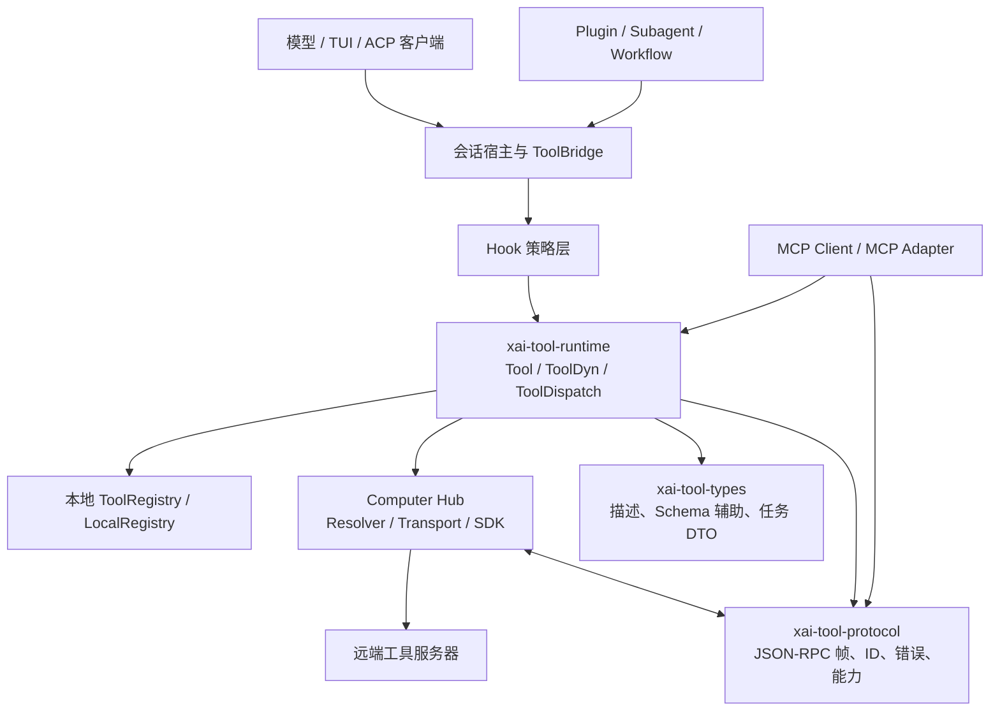
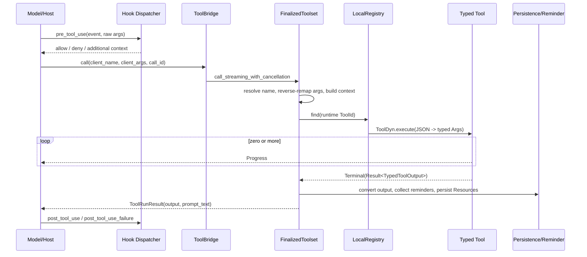
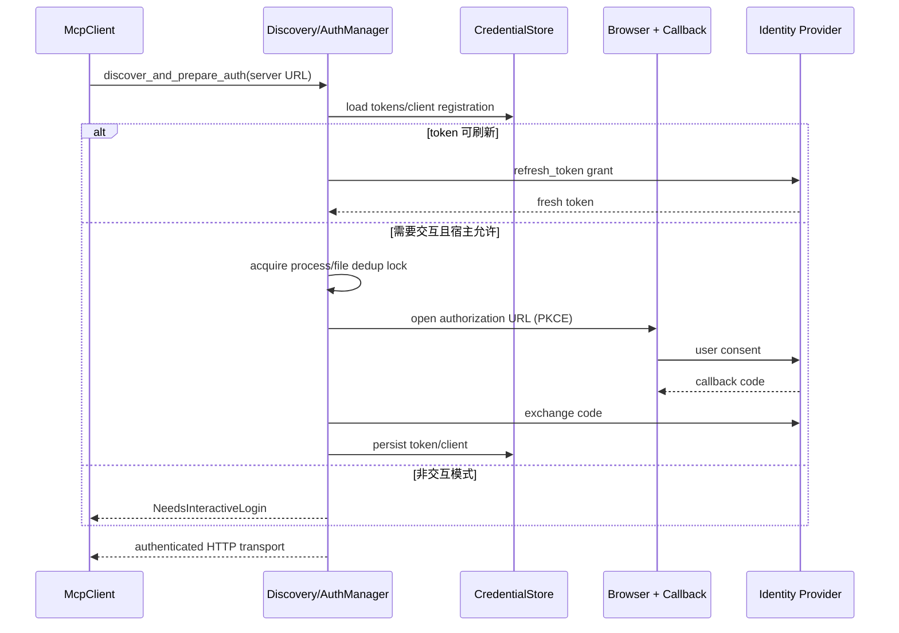
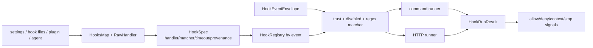
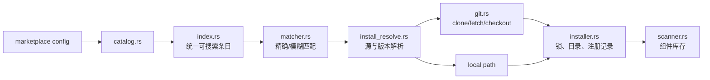
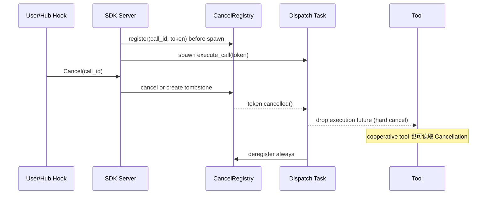

# 05. 工具、协议与扩展体系源码精读

> **全局调用位置**：`process_conversation_turn → execute_tool_calls_batch → PermissionHandle → tool_dispatch.rs → ToolBridge → ToolDispatch/ToolDyn → Tool::run → ToolResult`。具体 trait 与运行关系见 [源码符号关系总览第 11–12 节](12-源码符号关系总览.md#11-tool-trait类型擦除与-toolbridge)，逐函数工具回边见 [关键调用链第 7 节](13-关键调用链逐函数精读.md#7-调用链六模型请求工具并回到下一轮采样)。

> 面向第一次接触本工程的读者。本章不是 API 摘要，而是一份可以据此重新实现工具系统的源码地图。
>
> 阅读范围：`xai-grok-tools`、`xai-grok-tools-api`、`xai-tool-runtime`、`xai-tool-types`、`xai-tool-protocol`、`xai-computer-hub-core`、`xai-computer-hub-sdk`、`xai-computer-hub-mcp-adapter`、`xai-grok-mcp`、`xai-grok-hooks`、`xai-hooks-plugins-types`、`xai-grok-plugin-marketplace`、`xai-grok-subagent-resolution`、`xai-workflow`。

## 1. 先建立全局认识

这套系统要解决的不是“调用几个函数”，而是把来源完全不同的能力统一成模型可发现、可校验、可授权、可取消、可流式返回、可远程传输的工具：

- 内置 Rust 工具，例如读文件、执行命令、搜索、编辑、任务和调度器。
- 会话运行时动态加入的 MCP 工具。
- 通过 Computer Hub WebSocket 注册的远端工具服务器。
- 由 Hook 在工具调用前后实施的观察、补充上下文或阻断。
- Plugin 带来的 skills、commands、agents、hooks、MCP 和 LSP 配置。
- Subagent 与 Workflow 对工具、代理和长期流程的再编排。

最重要的设计思想是“稳定契约在下层，具体实现和宿主策略在上层”：



可以把一次工具调用理解成四次“降维和升维”：

1. 模型给出工具名与 JSON 参数。
2. Registry 将客户端名称和参数名还原为规范名称，并反序列化为强类型参数。
3. Tool 执行并产生强类型输出、进度和错误。
4. Runtime 再把输出擦除为统一类型，协议层将其编码为本地、WebSocket、gRPC、ACP 或 MCP 可传输的形态。

## 2. crate 分层与责任边界

| 层 | crate | 负责 | 明确不负责 |
|---|---|---|---|
| 公共 DTO | `xai-tool-types` | 工具描述、参数描述、JSON Schema 辅助、Subagent 任务 DTO、宽松反序列化 | 执行、网络、注册表 |
| 运行时接口 | `xai-tool-runtime` | `Tool`、`ToolDyn`、`ToolDispatch`、调用上下文、流、统一错误、渲染输出 | 内置工具清单、连接生命周期 |
| 线上协议 | `xai-tool-protocol` | ID、JSON-RPC envelope、方法、帧、注册、会话、能力、错误码 | socket 实现、业务工具 |
| gRPC API | `xai-grok-tools-api` | tools server 的 protobuf 服务和稳定 JSON 形状 | 具体执行逻辑 |
| 内置工具域 | `xai-grok-tools` | Builder/FinalizedToolset、ToolBridge、资源注入、工具实现、提醒、持久化 | 跨进程 WebSocket 生命周期 |
| Hub 核心 | `xai-computer-hub-core` | Registry 抽象、local-first resolver、Transport、远端代理 | Tokio WebSocket 连接细节 |
| Hub SDK | `xai-computer-hub-sdk` | WebSocket、握手、重连、连接池、服务端 harness、取消、背压、遥测捐赠 | 具体 MCP 协议语义 |
| MCP 桥 | `xai-computer-hub-mcp-adapter` | Hub 工具与 MCP server/client 形态互转 | OAuth 和 MCP 进程启动 |
| MCP 宿主 | `xai-grok-mcp` | stdio/HTTP/ACP MCP 连接、OAuth、凭证、liveness、动态工具注册 | 通用 Hub 注册规则 |
| Hook 域 | `xai-grok-hooks` | 发现、解析、匹配、信任、command/HTTP runner、结果聚合 | UI DTO 与插件安装 |
| 扩展 DTO | `xai-hooks-plugins-types` | `x.ai/hooks/*`、`x.ai/plugins/*`、`x.ai/mcp/*` 的轻量 ACP DTO | 领域执行逻辑 |
| 插件市场 | `xai-grok-plugin-marketplace` | catalog、索引、匹配、git/local 安装、扫描、配置 | 插件运行时执行 |
| 子代理解析 | `xai-grok-subagent-resolution` | role/persona/definition/override/resume 的纯解析 | 真正创建会话和模型调用 |
| 工作流 | `xai-workflow` | Rhai 沙箱、Host channel、journal replay、预算和取消 | 具体 Agent 的实现 |

这种拆分允许两个关键替换：工具可以不改业务实现而从本地变远端；宿主可以不理解具体工具类型，只依赖擦除后的 JSON/流式契约。

## 3. 第三方技术点

### 3.1 类型、Schema 与序列化

- `serde` / `serde_json`：所有 DTO、JSON-RPC、动态参数和输出的基础。
- `schemars`：从 Rust `Args` 生成 Draft 7 JSON Schema；`FinalizedToolset::generate_schema` 会内联子 Schema，并移除根 `title`、`description`。
- `prost` / `tonic` / `tonic-prost`：生成并承载 `GrokToolsService` gRPC API。
- `thiserror` / `anyhow`：前者定义稳定领域错误，后者保存不进入模型输出的调试因果链。

### 3.2 异步、并发与流

- `tokio`：进程、网络、channel、timer、任务与异步锁。
- `tokio-util::CancellationToken`：协作取消，并配合 `select!` 实现硬取消。
- `futures` / `async-stream`：`ToolStream`、进度与终态拼接。
- `async-trait`：仅用于必须对象安全的 trait；泛型 `Tool` 本身使用原生 RPITIT，避免每次调用都装箱 future。
- `dashmap`、`parking_lot`、`arc-swap`：并发注册表、短临界区和热切换连接状态。

### 3.3 网络、协议与认证

- `tokio-tungstenite`：Computer Hub WebSocket。
- `reqwest`：MCP HTTP、Hook HTTP 以及工具 HTTP 客户端。
- `rmcp 2.1`：MCP client、协议和 streamable HTTP transport。
- `oauth2`、`axum`、`webbrowser`：PKCE/DCR OAuth、回调服务器和浏览器授权。
- `agent-client-protocol`：MCP over ACP 的本地桥接。

### 3.4 扩展与编排

- `regex`、`shellexpand`：Hook matcher 和环境变量展开。
- `rhai`：受限脚本工作流引擎。
- `sha2`：Workflow 请求指纹和确定性 journal replay。
- `fs2`、`wait-timeout`：插件安装锁和外部 git 命令超时。
- `tracing`、`fastrace`、OpenTelemetry、Prometheus：日志、trace、指标及跨连接遥测捐赠。

## 4. 工具的最小契约

### 4.1 `Tool`：作者面对的强类型接口

核心在 `crates/common/xai-tool-runtime/src/tool.rs`：

```rust
pub trait Tool: Send + Sync {
    type Args: DeserializeOwned + JsonSchema + Send + 'static;
    type Output: Serialize + ToolOutput + Send + 'static;

    fn id(&self) -> ToolId;
    fn description(&self, ctx: &ListToolsContext) -> ToolDescription;
    fn capabilities(&self) -> ToolCapabilities;
    fn should_list(&self, ctx: &ListToolsContext) -> bool;
    fn execute(&self, ctx: ToolCallContext, args: Self::Args) -> Future<ToolStream<Self::Output>>;
}
```

工具作者通常只实现 `run`。默认 `execute` 会把 `run` 包成只有一个 `Terminal` 的流。需要实时输出的工具覆盖 `execute`。

`ToolDyn` 是类型擦除边界：它把 JSON 参数反序列化为 `T::Args`，驱动强类型工具，再把 `T::Output` 序列化成 `TypedToolOutput`。因此：

- 参数解码失败统一成为 `InvalidArguments`。
- 输出序列化失败统一成为 `Execution`。
- `model_output` 在边界处被提取并保证非空。
- 宿主和远端代理不需要知道 `T` 的具体类型。

### 4.2 `ToolDispatch`：宿主面对的对象安全接口

`crates/common/xai-tool-runtime/src/dispatch.rs` 定义：

- `call(tool_id, args, ctx) -> ToolStream<TypedToolOutput>`：流式入口。
- `call_terminal(...)`：丢弃所有 Progress，仅返回第一个 Terminal。
- 流提前结束会产生 `stream_no_terminal`，而不是被误判为成功。

这使 `FinalizedToolset`、Hub resolver 和远端连接都能实现同一个调用面。

### 4.3 调用上下文不是大而全参数对象

`ToolCallContext` 只固定包含 `ToolCallId` 和 `TypedExtensions`。其余能力按类型注入：

- `Cwd`：本次调用的工作目录。
- `BehaviorVersion`：工具行为版本。
- `TraceContext`：分布式追踪上下文。
- `SessionContext`：Hub 会话标识。
- `Cancellation`：协作取消 token。
- `WorkspaceViewerContext`：例如是否向前端发送 shell progress。
- `SharedResources`、`TemplateRenderer`、`InnerDispatch`：由 `xai-grok-tools` 注入。

`TypedExtensions::merge_defaults` 只填缺项，所以调用级值可以安全覆盖 session 默认值。缺点是依赖不是函数签名可见的；重实现时必须为每个工具列出必需 extension，并在缺失时返回明确错误。

## 5. Schema、名称和版本

### 5.1 三种身份不能混淆

| 名称 | 示例 | 用途 |
|---|---|---|
| fully-qualified ID | `GrokBuild:read_file` | 配置、版本目录、静态注册 |
| runtime `ToolId` | `read_file` 或动态 MCP ID | LocalRegistry/协议路由 |
| client-facing name | 可被 override 为其他名称 | 模型真正调用的函数名 |

参数名也允许 `canonical -> client-facing` 重命名。调用前 `FinalizedToolset::prepare_dispatch` 使用反向映射恢复规范参数；向模型发布定义时则使用正向映射改写 Schema。名称碰撞在 finalize 前被拒绝。

### 5.2 Schema 生成与覆盖

静态工具的 Schema 从 `Args: JsonSchema` 生成；MCP 工具使用远端服务器提供的 `inputSchema`，通过 `register_tool(..., input_schema_override)` 覆盖生成结果。

配置参数不是调用参数。`ToolConfig.params` 会先由工具自己的 `Params` 类型校验，再写入 session `Resources`。`xai-grok-tools-api/src/config_validation.rs` 进一步保证：

- `params_json` 缺失表示没有配置；显式空字符串是解析错误。
- JSON 必须是 object，数组和标量被拒绝。
- `name_override` 必须满足 `ToolId` 的字符和长度规则。
- 未知工具 ID 在保存和 finalize 阶段都可被发现。

### 5.3 行为版本

`xai-grok-tools/src/versions.rs` 管理 preset、工具版本、生命周期和替代版本：

- 单工具 `behavior_version` 高于全局 `behavior_preset`。
- 未纳入版本管理的工具返回 `None`，但显式给它版本会报错。
- Deprecated 版本必须有存在且 Active 的 replacement。
- RemovalCandidate 不允许进入 preset。
- `BehaviorVersion` 被注入调用上下文；工具遇到未知版本必须硬错误，不能默默回退。

这是兼容重实现的关键：不要把旧版本写成散落的 `if`，应保留目录化实现，例如 `read_file/versions/legacy_0_4_10.rs`。

## 6. 注册、发现与 Finalize

### 6.1 静态注册

入口是 `ToolRegistryBuilder`：

1. `new()` 注册各命名空间内置工具，并应用进程级 `ToolPack`。
2. `register<T>()` 或 `register_with_params<T, P>()` 捕获具体类型相关闭包：参数校验、资源写入、输入解析、输出转换、LocalRegistry 注册。
3. `validate_config()` 检查工具存在性、重复 client name、参数、版本和跨工具 requirement。
4. `finalize(config, SessionContext)` 注入 FS、terminal、cwd、通知、skills、subagent、scheduler、LSP、HTTP client 等资源。
5. 生成最终 Schema、描述、参数反向映射、模板 renderer 和 kind 索引。
6. 得到只读主体 `FinalizedToolset`；只有 MCP 等动态工具走运行时增删入口。

`ToolPack` 使用进程级 `OnceLock<Mutex<Vec<fn>>>`。它必须在第一次构造 Builder 之前注册，而且重复注册不会自动去重。

### 6.2 Requirement 是工具组合约束

`types/requirements.rs` 用表达式描述“某工具只有在某资源或伴随工具存在时才有效”。典型规则：后台 `task` 需要 output 查询和 kill 能力；bash 开启后台执行后也需要这些伴随工具。错误带 `field_path`、`expected`、`bad_value` 和 category，便于配置 UI 精确定位。

### 6.3 动态 MCP 注册

`ToolBridge::register_mcp_tools` 最终调用 `FinalizedToolset::register_tool`：

- 检查 client name 不重复。
- 把动态工具注册到同一个 `LocalRegistry`。
- 使用 MCP Schema 和默认 `ToolMetadata`。
- 动态定义进入模型可见工具列表；`tool_definitions_builtins_only` 刻意排除它们。
- server 断开或列表变化时按名称或前缀注销。

### 6.4 发现不等于授权

`should_list` 只控制某一 turn 是否向模型展示工具，不是安全授权。权限必须在 transport、session、Hook 或宿主策略层执行。重实现时绝不能用“没出现在列表里”代替服务端校验。

## 7. 一次本地调用的完整流程



几个容易漏掉的实现细节：

- `prepare_dispatch` 在任何 `.await` 之前释放 tools 读锁，避免动态注册与长调用互相阻塞。
- 每次调用重新构造 context，cwd override 是栈内数据，不污染共享 session。
- `use_tool` 的 inner dispatch 删除 `InnerDispatch`，防止递归调用自身；内部调用也跳过二次 reminder/persistence。
- terminal backend 单独保存在 `ToolBridge`，取消命令时不需要等待持有 registry/resource 锁的工具结束。
- Terminal 成功后才运行统一 `finalize_output`；流式和非流式路径共用该尾处理，避免行为漂移。

## 8. Computer Hub：本地与远端统一路由

### 8.1 核心抽象

`xai-computer-hub-core` 提供四个核心概念：

- `ToolRegistry`：按 connection 管理注册，按 session + tool ID 查询。
- `ToolHandle`：对象安全的工具句柄；本地 `ErasedTool<T>` 和远端 `RemoteToolProxy` 都实现它。
- `CompoundResolver`：先查 local，再查 remote；同名时本地遮蔽远端。
- `Transport`：连接时授权一次，之后以 `Principal` 调用。

`Principal` 包含 user、允许的 session、OAuth-style scopes 和 audience。`authorizes_session` 与 `has_scope("tool.invoke")` 是调用权限接点。跨 session 查询返回 NotFound，避免泄露“工具存在但属于另一个会话”。

### 8.2 注册与绑定是两个维度

远端 server 先注册工具，再把工具或整个 server 绑定到 session。Registry mutation 归属 connection，查询归属 session。这样断开连接时可以一次清理它注册的全部工具，又不会把连接 ID 暴露给模型。

关键规则：

- 注册记录有单调序列，用于 newest-wins 和过期清理。
- `(session_id, tool_id)` 反向索引冲突提升为专门 JSON-RPC 错误，而不是伪装成 unknown tool。
- connection cleanup 与 session cleanup 分开统计。
- server bind、tool bind、attach route、serve 状态均有显式 ack/outcome。

### 8.3 远端调用

`RemoteToolProxy` 和 `RemoteTransport` 最终共用 `dispatch_via_connection`：

1. 先按 `tool_call_id` 订阅 progress。
2. 再发 `tool.call` JSON-RPC request，避免极快 progress 在订阅前丢失。
3. `RequestStream` 交错轮询 progress channel 与 response future。
4. response 解码为唯一 Terminal；连接断开映射为 NetworkError。
5. `ToolOutputWire::Text/Json/Mcp` 统一还原为 runtime `TypedToolOutput`。

### 8.4 SDK 连接生命周期

`xai-computer-hub-sdk` 在 core 之上实现：

- `connection.rs`：WebSocket reader/writer、request correlation、ping/pong、超时、重连和 session 恢复。
- `demux.rs`：按 JSON-RPC id、tool call id 和事件类型分发帧。
- `pool.rs` / `refcount.rs` / `connection_borrow.rs`：连接复用、引用计数、借用和释放。
- `handshake.rs`：`HelloMsg/HelloAckMsg`、协议版本和能力协商。
- `server.rs`：远端 ToolServer、session inbox、hook、执行任务和 teardown。
- `harness.rs`：把本地 `ToolDispatch` 暴露为 server handler。

重连不能只是“重新连 socket”。它还要恢复 server registration、session bind、通知订阅和 last sequence；旧连接返回的晚到响应不得污染新 generation。

## 9. 线上协议

### 9.1 JSON-RPC envelope

`xai-tool-protocol/src/envelope.rs` 定义严格的 `2.0` request、notification、response 和 error。`JsonRpcId` 支持字符串与数字；通知没有 id，不得期待响应。

`methods.rs` 将方法名集中到枚举，覆盖：

- 工具调用与进度。
- server/tool 注册、注销、列表、搜索。
- session open/close/bind/unbind/attach/serve。
- 通知订阅。
- hook request/reply。
- ping/pong、状态、遥测捐赠。

不要在业务代码中手写方法字符串，否则跨语言实现很容易漂移。

### 9.2 标识符

`ids.rs` 为 connection、session、server、tool、tool call 等提供 newtype 和校验。调用 ID 可用 UUID v7 生成。`FrameSeq` 为单调序列。强类型 ID 的价值是防止把 session id 错传成 call id，也统一字符集和长度限制。

### 9.3 能力与注册快照

`ToolCapabilities` 描述并发、scope、frame cap、streaming spec、hook kind 和通知 Schema。`ToolRegistration` 把描述、能力、server/connection 信息组合成可路由快照。

能力是声明，不是实现。生产者声明 streaming 后必须按 `StreamingSpec` 输出；消费者仍要对超大帧、未知字段和无 Terminal 做防御。

### 9.4 错误双层表示

运行时 `ToolError` 包含：

- 稳定 `ToolErrorKind`。
- 模型可见且应可操作的 `detail`。
- 不上 wire 的 `source` 调试链。
- 可选结构化 `details`，如 retry_after、字段错误和 subcode。

协议层 `ToolErrorWire` 是稳定、可序列化但有损的投影，再由 `error_codes.rs` 映射到 JSON-RPC 数字码。未知 wire 错误回到 runtime 时保留为 Custom，不能 panic。

`workspace_unavailable` 有专门 code、message、reason 和 phase，调用方可据此重新 provision，而不是盲目重试任意错误。

### 9.5 gRPC API 的定位

`xai-grok-tools-api/proto/grok-tools.proto` 提供：

- `ExecuteTool`、`ExecuteToolStream`。
- `ListTools`、`GetToolInfo`。
- `FinalizeToolConfigRequest`、`GetToolState`。
- client callback：`SendNotification`、`SpawnSubagent`。
- 一批兼容保留但已 deprecated 的 enable/disable/options/override/reminder API。

当前 `ExecuteToolStream` 是“chunked unary”：工具先执行完成，再把结果切成字节块发送；它不等同于 runtime `ToolStream` 的实时 Progress。重新实现时若要真正增量 gRPC，必须改变服务端执行路径并定义 progress/terminal 的 wire 兼容策略。

`build.rs` 对 protobuf 生成类型添加 serde，并只给 optional 字段加 default；必填 `ToolConfigEntry.id` 缺失仍会失败。`tests/wire_shape.rs` 锁定 snake_case 和 sparse payload 行为。

## 10. Streaming：必须守住的协议不变量

合法流的形态只能是：

```text
Progress* -> Terminal(Ok | Err) -> EOF
```

`terminal_only` 和 `with_progress` 是推荐构造器。消费端要防御无 Terminal；生产端不得在 Terminal 后继续发送。

`xai-tool-runtime/src/streaming.rs` 的 `stream_chunk` 处理 append-only 字节源：

- `total_bytes` 是历史累计字节数，不是 tail 长度。
- `last_total` 只推进已发出的字节，保证分帧无损。
- UTF-8 被截在字符中间时暂缓到下一帧。
- 单帧默认 delta 上限 16 KiB，可由 `StreamingSpec` 覆盖。
- `gap=true` 表示某一 tick 的中间数据已被上游 tail 丢弃。
- `truncated=true` 表示累计意义上的永久截断；两者不能混为一谈。
- payload `deny_unknown_fields`，Schema 漂移时丢帧并告警，而不是错误解释。

通知通道还有优先级语义：容量满时普通 lossy 事件可被丢弃，但 terminal 类事件应优先保留；批量 fan-out 要尝试所有目标后再汇总失败。

## 11. 权限、审批与安全接点

权限不是集中在一个函数里，而是多个信任边界共同完成：

| 接点 | 代码位置 | 解决的问题 |
|---|---|---|
| Transport authorize | `xai-computer-hub-core/src/transport.rs` | 身份、scope、audience、session 范围 |
| Session bind | protocol frames + SDK server | 工具是否属于当前 session |
| Capability mode | ToolConfig kind + subagent resolution | 子代理可见/可执行哪类工具 |
| Permission hook | Hub hook request/reply | 高风险工具调用的用户批准 |
| PreToolUse Hook | `xai-grok-hooks` | 项目策略的 allow/deny |
| Plugin enable/trust | plugin/hook discovery | 未启用或不可信扩展不得执行 |
| MCP OAuth | `xai-grok-mcp` | 远端资源身份与 token 生命周期 |
| SSRF/URL validation | Hook HTTP 与 web/MCP client | 限制危险目标和重定向 |

`PreToolUse` 的明确 deny 会阻断；但 hook timeout、崩溃、命令不存在和坏输出采用 fail-open，只记录到 UI/日志。源码注释说明这是当前威胁模型的有意选择。若把 Hook 当成强安全边界，必须改为 fail-closed 或把真正授权下沉到 Transport/Tool 实现。

Subagent capability 合并不是简单覆盖。显式模式与 role ceiling 做交集；`read-write` 和 `execute` 这种互不包含的能力组合会收敛到 `read-only`，不能因下层配置扩大上层权限。

## 12. MCP 体系

### 12.1 支持的 transport

`xai-grok-mcp` 支持三类入口：

- stdio：启动子进程，stdin/stdout 传 newline-delimited JSON-RPC。
- HTTP/SSE：使用 rmcp streamable HTTP 与自定义 reqwest client。
- ACP：通过 `x.ai/mcp/sdk_call` 反向调用 SDK 进程内 MCP server。

`wire.rs` 是 ACP 扩展字符串的唯一事实源：`x.ai/mcp/call`、`x.ai/mcp/sdk_call`、`x.ai/mcp/servers`、`x.ai/mcp/sdk`。

### 12.2 MCP 工具如何进入统一 Registry

`McpTool` 保存 server/name/description/schema/annotations；`McpErasedTool` 实现统一 runtime `Tool`，Args/Output 都在动态 JSON/内容块边界处理。工具列表按 `_meta.ui.visibility` 分为：

- 默认或含 `model`：注册进 ToolBridge，模型可见。
- 只有 `app`：不注册给模型，仅通过 ACP 列表和 `x.ai/mcp/call` 给 UI 使用。

MCP Text/Image/Resource 内容转换为 runtime `ContentBlock`。Image 可以产生 data URI，并按配置额外暴露 base64 wrapper；输出必须受 MCP 字节上限约束。

### 12.3 ClientState 状态机

`McpClient` 的关键状态为 Pending/Initializing/Ready/Empty。初始化使用 single-flight：

- 第一个调用者成为 holder，拥有 transport 并执行 handshake。
- 并发调用者等待 `init_done`，不重复握手。
- `InitGuard` 在 holder 被取消或 panic 时把状态尽量恢复为 Pending。
- HTTP 配置可恢复重试；已消费的 stdio child 不能恢复成有效 Pending。
- liveness 只在 Ready 且 transport 真关闭时发 TransportClosed，竞态中的过渡状态静默退出。

MCP server 的 tools/resources list changed 和握手状态通过 `McpClientEvent` 进入 session dispatcher，并按 `(server, event kind)` 在短窗口内合并。

### 12.4 stdio 防御

自定义 `SafeTokioChildProcess` 和行解码器解决几个现实问题：

- stdout 偶尔出现非 JSON 日志时跳过该行，而不是杀死整个 transport。
- 未知 notification 可安静忽略；真正坏行记录截断样本遥测。
- Drop 在没有 Tokio runtime 时也不能 panic；Unix 下终止整个 process group，避免 `npx -> node` 孙进程泄漏。
- Windows 下解析 `.cmd/.bat` shim；含路径分隔符的命令保持原样。

### 12.5 OAuth 流程

OAuth 实现包含 RFC 8414/9728 discovery、RFC 7591 DCR、PKCE、refresh 和 credential store：



同进程和跨进程授权用锁及“token 前后是否变化”双重去重。等待锁超时后允许自行授权，但先重新读取凭证，避免刚完成的 leader 导致第二次弹浏览器。

恢复策略很克制：网络级 refresh 失败可视为暂态；IdP 拒绝、缺失凭证和 auth-class 错误走重新认证。MCP JSON-RPC 的 parse/invalid request/method/params 等确定性客户端错误不通过重建连接重试。

## 13. Computer Hub MCP Adapter

`xai-computer-hub-mcp-adapter` 是协议适配器而非 MCP 宿主：

- `types.rs` 定义 MCP-facing DTO 与 adapter error。
- `transport.rs` 把 Hub SDK 连接包装成 MCP transport。
- `bridge.rs` 做 tool list/call、Schema、内容和错误互转。
- `metrics.rs` 记录调用、延迟和失败。

适配时必须保留 ToolId、call correlation、MCP content block、timeout 和错误分类，不能把所有失败压成字符串。其价值是让远端 Hub 工具可被标准 MCP client 使用，或让 MCP 能力进入 Hub 路由，而不是复制一套执行器。

## 14. Hook 体系

### 14.1 生命周期

`HookEventName` 由一张宏表生成事件名、别名和 traits，避免 parse/display/matcher/gate 漂移。事件包含 session、tool、prompt、notification、subagent、compaction 和 stop 类事件。

每个事件 traits 指定：

- 是否是 gate。
- matcher 是否生效。
- 是否可转发到 Hub。

### 14.2 发现与优先级

Hook 来源包括 global、project、config layer、plugin 和 agent。`HookRegistry` 是 session 启动时的快照；磁盘改变默认不会自动生效，除非显式 reload。

来源先按权威顺序收集，再以 `(event, raw command, raw URL, configured matcher)` 去重，先出现者获胜。timeout 和 extra_env 不在 key 中，所以不能靠改 timeout 创建“第二个相同 Hook”。

### 14.3 配置到执行



命令 runner 优先 direct exec；需要 shell 语法时才走 shell。执行前检查未解析环境变量，保留 shell parameter expansion 语义。HTTP runner 在运行时再次展开 URL，并执行 URL/SSRF 校验。

环境变量展开的顺序是 hook `extra_env` 优先于进程环境。`${VAR:-default}` 等带 modifier 的形式被随机 sentinel 暂时遮罩，留给 shell 解释；缺失普通变量原样保留，使 load-time 展开可幂等。

### 14.4 Gate 语义

- `pre_tool_use`：顺序执行；明确 deny 立即停止后续 Hook 并阻断工具。
- `stop` / `subagent_stop`：所有 Hook 都执行，再聚合 block、force-stop 和 additional context。
- observe-only：永不阻断。
- matcher miss 不产生 result；disabled/untrusted 会产生 Skipped，便于 UI 解释。
- toolInput/toolResult 限制为 128 KiB，超出时用截断表示，避免 Hook 输入无界增长。

## 15. Plugin 与 Marketplace

### 15.1 Plugin 本身是组件集合

插件可提供 skills、commands、agents、MCP servers、hooks、LSP servers。`xai-hooks-plugins-types` 只定义给 TUI/ACP 的 DTO，并刻意不依赖领域 crate，防止 pager 引入整个执行栈。

`PluginInfo` 包含稳定 ID、scope、origin、enabled、版本、组件计数、hook/MCP 状态和冲突信息。`PluginOrigin::Unknown` 保证新 shell 给旧 pager 发新增来源时，不会让整个列表反序列化失败。

Catalog 是不可信输入。`PluginComponents::sanitize` 会：去控制/双向文本字符、按字符截断、限制每类最多 50 项。任何终端渲染入口都应先调用它。

### 15.2 Marketplace 数据流



文件职责：

- `config.rs`：市场源和安装配置读取。
- `catalog.rs`：catalog 格式、来源和条目规范化。
- `index.rs`：聚合索引与查找。
- `matcher.rs`：用户输入到候选插件的匹配。
- `install_resolve.rs`：把市场条目、git URL 或 local path 解析成安装计划。
- `git.rs`：受超时控制的 git 操作。
- `installer.rs`：安装锁、目标目录、重装与记录更新。
- `scanner.rs`：扫描插件目录中的实际组件。
- `types.rs` / `error.rs`：领域类型与稳定错误。

安装与启用是两件事；安装只把内容放入受管目录并登记，运行时发现还要遵循 scope、disabled、冲突和信任规则。重新实现时要使用临时目录 + 原子替换，禁止在最终目录中做半成品 clone。

## 16. Subagent Resolution

这个 crate 有意保持“纯解析”：它决定子代理应该是什么，但不真正启动模型或 worktree。

### 16.1 解析顺序

```text
definition discovery
  -> toggle / parent allow-list gate
  -> role 与 persona 选择
  -> explicit > role > persona > parent 的字段合并
  -> capability ceiling 交集
  -> harness toolset 与 recursion depth 策略
  -> prompt/persona/project instruction 渲染
  -> host adapter 创建模型、cwd/worktree 和 session
```

`definition.rs` 负责生产一致的 definition 发现、可用名称、gate、tool policy 和 prompt；`overrides.rs` 负责 model/reasoning/capability/isolation/persona/role prompt 的优先级。

Persona instructions file 读取失败是 fatal，立即返回保守默认；role prompt file 读取失败只是 warning，允许继续。这个不对称是产品语义，不应随意统一。

### 16.2 Resume

Resume 继承 source 的 transcript、tool state 和 model；当前 definition 的 system prompt 与工具配置重新渲染，新 prompt 作为最后一条 user message。

身份校验规则：

- subagent type 必须一致。
- persona 必须一致，包括 source 有而请求未给的情况。
- model 不作为身份 gate；调用方忽略新 model 并固定 source model。
- source 必须属于同一 parent session 且已完成，这部分由宿主/coordinator 校验。

### 16.3 Fork context

`context.rs` 将 parent 历史压缩为 `[System placeholder, User(<background_context>)]`，任务 prompt 后续单独追加，以获得最高 recency。

- 最近有限个完整 turn 原样保留，早期只总结消息数、文件和工具。
- turn scanner 跳过 Reasoning/BackendToolCall 并包含 ToolResult。
- 去掉 child 会重新注入的 system tags、git status、project layout 和 skill instruction body。
- XML tag 不闭合时不截到文本末尾，避免吞掉用户内容。
- 字符截断按 UTF-8 char boundary。

## 17. Workflow：可恢复的 Agent 编排

### 17.1 为什么使用 Host channel

Rhai 脚本不直接持有 Agent、文件系统或 git 实现。它调用注册函数，函数通过 `WorkflowHostRequest` channel 请求宿主完成：

- Reserve/ReleaseAgentCalls。
- SpawnAgent。
- BudgetQuery。
- RenderTemplate。
- scratch file read/write。
- GitDiffSince。
- Phase、Log、Telemetry。

这样脚本引擎可同步、确定性执行，真正异步和有副作用的能力由宿主适配。

### 17.2 沙箱与限制

`engine.rs` 禁用 `eval` 和模块 resolver，限制 operations、表达式深度、host call 数、parallel fan-out 和 agent budget。取消通过 Rhai progress callback 观察 `CancellationToken`，所以纯计算死循环也能终止。

公开脚本函数包括 agent/parallel、phase/log、complete/pause/await_user、budget、template、scratch、git diff、JSON 编解码和 fingerprint。任何新增函数都要判断是否破坏确定性与 replay。

### 17.3 Journal 是确定性重放，不是普通日志

每次有返回值的 host call 记录：递增 sequence、kind、规范化 request hash、response。恢复时：

1. 同位置、同 kind、同 hash 才返回记录结果。
2. 不匹配立即报 divergence，不能拿旧结果继续。
3. 没有记录才真正发 host request。
4. catchable host error 也以 sentinel 记录并可重放。
5. 被取消的在途 agent 不记成功记录，并释放 reservation，恢复后可以重试且不重复计费。

Journal 限制 64 MiB 和最多 `MAX_HOST_CALLS` 条；拒绝 symlink；加载时修复 torn tail，但完整的坏 JSON 行必须报错。写盘失败不能先推进内存 sequence。

### 17.4 工作流结果状态

`WorkflowOutcome` 只有 Completed、Paused、BudgetExceeded、Cancelled、Failed。PauseKind 区分 user、back_off、no_progress、verification、infra。控制结果通过 Rhai `ErrorTerminated(ControlToken)` 传播，catch 不应吞掉取消、预算等不可恢复终态。

`meta.rs` 要求第一条语句声明 `meta`，name 为 kebab-case，限制描述与 phase 数量并拒绝未知字段。`validate.rs` 不只编译脚本，还用 stub host dry-run，因此能发现不存在的 host 函数、预算超限和常见 Rhai 语法陷阱。

## 18. 超时、取消、重试与背压

### 18.1 取消传播



“先注册再 spawn”消除 cancel-before-registration 竞态；tombstone 处理更早到达的 cancel。session unbind、连接 shutdown 和 Drop 都先 `cancel_all`，再停止 dispatcher。

Workflow 和 MCP handshake 也有各自取消恢复：Workflow 释放预算；MCP `InitGuard` 避免状态永远卡在 Initializing。

### 18.2 背压

Hub SDK admission 固定按 session → connection → global 获取 semaphore，使用一个共享 deadline，避免等待时间变成三倍，也避免持有稀缺 global permit 时等待局部 permit。默认上限来自 `admission.rs`；超时返回 retryable `tool_busy`，不静默丢请求。

### 18.3 重试边界

| 场景 | 策略 |
|---|---|
| 通用 helper | 指数退避并封顶；当前 `xai-grok-tools/retry.rs` 无 jitter 和 cancellation，应谨慎使用 |
| Hub WebSocket | 按配置 schedule 重连，并恢复注册/绑定；generation 隔离旧响应 |
| MCP transport | 仅 transport 和非确定性 server error 尝试一次恢复 |
| MCP OAuth | 网络 refresh 可重试/回退；auth rejection 进入重新认证 |
| Hook | 不自动重试；timeout/crash 记录后 fail-open |
| Workflow | 通过 journal replay 跳过已确认副作用；未记录的取消调用可恢复重发 |
| 高风险外部副作用 | 不能因“没收到响应”盲重试；需要 provider operation id 或查询/对账 |

`execute_with_backoff` 中 `max_retries` 实际是最大总 attempt 数；delay 为 `base * 2^(attempt-1)` 并封顶。它没有总 deadline、jitter、Retry-After 和 cancel token，因此不应直接套在所有网络调用外层，更不能与 SDK/MCP 内层重试叠加成重试风暴。

## 19. 主要测试告诉我们的不变量

### 19.1 Runtime/Protocol

- blocking 工具自动得到单 Terminal；streaming 工具保留 progress 顺序。
- trait object safety、动态 dispatch 与 context extension 均被编译/行为测试锁定。
- 无 Terminal 是错误；未知 ToolId、非法 ID、JSON-RPC envelope 和 serde roundtrip 都有边界测试。
- streaming 测试覆盖 UTF-8 跨 tick、cap、gap、truncated、未知字段、最少帧数和 tiny cap 前进性。

### 19.2 Tools/Registry

- 名称覆盖和参数覆盖必须双向一致，Schema 描述也跟随重命名。
- finalize 拒绝 client name 冲突、坏 params、缺伴随工具和非法行为版本。
- streaming/non-streaming 共享 terminal 尾处理；MCP 可被动态隐藏/注销。
- 版本 catalog 的 managed/preset/replacement/lifecycle 有八组一致性测试。
- notification 测试固定 FIFO、fan-out、bounded channel 和 terminal 优先策略。
- 各工具实现测试重点覆盖路径安全、gitignore、shell 环境策略、编辑锁、后台任务 admission/coordinator、scheduler journal、LSP 状态和 web fetch SSRF/overflow/cache。

### 19.3 Hub

- local shadows remote，跨 session 不可见，compound resolver 不误路由。
- remote proxy 先订阅 progress，再发 request，并保留 terminal/error detail。
- workspace unavailable 的结构化 detail 必须穿过 wire。
- admission 超时、关闭 semaphore、cancel tombstone、shutdown cancel-all、重连与 request demux 是核心并发回归面。

### 19.4 MCP/Hook/Plugin/Subagent/Workflow

- MCP 覆盖坏 stdio 行、SSE flood、single-flight、transport 恢复、OAuth token 去重和 auth 错误分类。
- Hook 覆盖来源顺序、去重、regex、环境展开、reserved env、timeout、deny、stop 聚合、HTTP 校验和 trust/disable。
- Plugin 覆盖 catalog 解析、模糊匹配、安装解析、路径规范化、锁、重装、扫描和终端字符串清洗。
- Subagent 覆盖 override 优先级、capability 交集、persona fatal/role warning、resume 身份、fork turn 边界和噪声剥离。
- Workflow 覆盖正常完成、pause、取消纯循环、预算释放、parallel 顺序、catchable error replay、journal divergence、torn tail、symlink、容量和 dry-run。

## 20. 生产文件导航

### 20.1 `xai-tool-*` 与 API

- `xai-tool-types/src/{types,schema_utils,ext,serde_lenient,task}.rs`：描述和参数 DTO、Schema 降维、扩展容器、宽松模型输入、Subagent 输入输出。
- `xai-tool-runtime/src/{tool,dispatch,context,streaming,error,render,search,notification}.rs`：工具接口、路由、上下文、增量流、错误、内容块、搜索和通知。
- `xai-tool-protocol/src/{ids,envelope,methods,frames,registration,capabilities,connection,handshake}.rs`：主协议骨架。
- `xai-tool-protocol/src/{error_codes,error_wire,output_wire,notification_wire,registry_error}.rs`：wire 投影与兼容。
- `xai-tool-protocol/src/{hook,turn_hook,session_event}.rs`：Hook 与 session 生命周期协议。
- `xai-grok-tools-api/proto/grok-tools.proto`、`build.rs`、`src/{lib,config_validation,slash_commands}.rs`：gRPC 合约、代码生成属性、校验和 slash command 文本。

### 20.2 `xai-grok-tools` 核心

- `lib.rs`：模块和输出大小常量。
- `bridge.rs`：会话宿主 facade。
- `registry/{types,proto_convert}.rs`：Builder、finalize、dispatch、动态工具和 protobuf 配置转换。
- `types/{tool,tool_metadata,definition,tool_io,output,schema,context,resources,requirements,params_validation}.rs`：工具领域核心。
- `types/{process_manager,memory_backend,api_key_provider,config_source,session_mode,tool_index,description,compat,claude_alias}.rs`：宿主资源与兼容辅助。
- `types/{agents_md_tracker,skill_discovery_tracker/*}.rs`：规则和 skill 动态发现状态。
- `normalization.rs`、`tool_taxonomy.rs`、`versions.rs`：跨 harness 元数据、kind/namespace、行为版本。
- `persistence.rs`、`reminders/*`、`notification/*`、`attribution.rs`、`retry.rs`、`gitignore.rs`：横切能力。
- `computer/{types,task_log}.rs`：terminal/filesystem 抽象和任务日志。
- `computer/local/{terminal,static_shell,shell_state,lifecycle,file_system,cgroup,embedded_search_tools}.rs`：本地执行后端。
- `util/{fs,spawn,env,shell_env_policy,binary,truncate,mcp_truncate,base64_images,image_validate,image_compress,query_tools,path_suggestions,git_detect,remap,hash,command_display,grok_home,unicode_confusables,serde_base64}.rs`：I/O 与安全辅助。

### 20.3 内置工具实现目录

- `implementations/grok_build/`：主工具集；`bash`、`read_file`、`list_dir`、`grep`、`search_replace`、`todo`、`lsp`、`web_search`、`web_fetch`、`image_gen`、`image_edit`、`video_gen`、计划模式和用户提问。
- `implementations/grok_build/task/{admission,backend,coordinator,coordinator_state,types}.rs` 及 `coordinator/{spawn,queue,query}.rs`：Subagent/background task 状态机。
- `implementations/grok_build/task_output/*`、`kill_task/*`：等待、读取和终止后台任务。
- `implementations/grok_build/scheduler/{actor,create,delete,list,interval,occurrence_journal,types}.rs`：会话定时任务。
- `implementations/grok_build/web_fetch/{client,http,ssrf,domain,cache,overflow,artifact,config,error}.rs`：安全抓取管线。
- `implementations/grok_build/monitor/{tool,event,rate_limiter,types}.rs`：事件监控。
- `implementations/grok_build/workflow/mod.rs`、`update_goal/mod.rs`、`storage.rs`：工作流工具、目标和状态存储。
- `implementations/codex/{apply_patch,read_file,list_dir,grep_files}/*`：Codex 兼容工具族。
- `implementations/opencode/{bash,read,write,edit,grep,glob,todowrite,skill}/*`：OpenCode 兼容工具族。
- `implementations/grok_build_concise/*`、`grok_build_hashline/*`：精简和 hashline 编辑协议。
- `implementations/{skills,memory,web_search,search_tool,use_tool,task_output,lsp,read_file,editor_infra,cursor_rules_on_read}.rs` 或同名目录：共享/高级工具。

### 20.4 Hub 与 MCP

- `xai-computer-hub-core/src/{registry,resolver,inner,transport,local,remote}.rs`：纯路由核心。
- `xai-computer-hub-sdk/src/{connection,demux,pool,refcount,connection_borrow,handshake}.rs`：连接侧。
- `xai-computer-hub-sdk/src/{server,harness,admission,cancel,auth,oidc_provider}.rs`：服务端、授权、背压和取消。
- `xai-computer-hub-sdk/src/{notification,observability,metrics,trace_donate,metric_donate,log_donate,donate_pump}.rs`：通知与遥测。
- `xai-computer-hub-mcp-adapter/src/{types,transport,bridge,metrics}.rs`：Hub/MCP 适配。
- `xai-grok-mcp/src/{servers,acp_transport,mcp_http_client,liveness}.rs`：MCP transport 与状态。
- `xai-grok-mcp/src/{oauth,oauth_config,credentials}.rs`：认证与凭证。
- `xai-grok-mcp/src/wire.rs`：ACP 常量；`lib.rs`：公开导出。

### 20.5 扩展与编排

- `xai-grok-hooks/src/{event,config,discovery,matcher,dispatcher,result,error,trust}.rs`：Hook 领域。
- `xai-grok-hooks/src/runner/{command,http}.rs`、`env_expand.rs`：执行和环境安全。
- `xai-hooks-plugins-types/src/lib.rs`：Hook/Plugin/MCP 管理 DTO。
- `xai-grok-plugin-marketplace/src/{config,catalog,index,matcher,install_resolve,git,installer,scanner,types,error}.rs`：市场全链路。
- `xai-grok-subagent-resolution/src/{config,definition,overrides,resume,context,types}.rs`：纯解析全链路。
- `xai-workflow/src/{meta,engine,host,journal,run,validate}.rs`：脚本编排全链路。

## 21. 从零重实现的推荐顺序

### 阶段 1：先做不可变契约

实现 `ToolId/ToolCallId`、`ToolDescription`、JSON Schema、`ToolError`、`ToolProgress`、`TypedToolOutput`。先用 roundtrip 和非法输入测试锁定 wire 形状。不要先写 bash/read_file。

完成标准：一个内存 EchoTool 能被强类型调用，也能经 `ToolDyn` 用 JSON 调用；错误和输出可序列化。

### 阶段 2：实现流和 Registry

实现 `[Progress*, Terminal]`、`ToolDispatch`、`LocalRegistry`、Builder/finalize、名称和参数 remap、动态注册。加入无 Terminal、重复名字、坏参数和 UTF-8 分帧测试。

完成标准：同一工具可以 unary 和 streaming 调用，两条路径 terminal 结果完全一致。

### 阶段 3：实现资源与两个代表工具

实现 TypedExtensions/Resources、Cwd、Cancellation、FS/Terminal port。只做 ReadFile 和 Bash，以验证只读、外部进程、进度、取消和错误转换。

完成标准：取消 Bash 不等待 registry 锁；ReadFile 只依赖 FS port，可用 mock 测试。

### 阶段 4：实现协议和远端 Hub

实现 JSON-RPC envelope、method、registration/session bind、progress subscription、response correlation、local-first resolver。再做 WebSocket SDK、握手、重连和 generation。

完成标准：同一 ToolDispatch 在本地和远端得到相同 terminal；断线不会把旧 response 投递到新连接。

### 阶段 5：补授权、背压和可观测性

实现 Principal/session/scope 校验、permission hook、三级 semaphore、CancelRegistry、trace propagation、结构化指标。安全检查必须在服务端，不依赖工具列表可见性。

完成标准：越权、过载、cancel-before-register、shutdown 中调用和 hook timeout 都有确定结果。

### 阶段 6：接入 MCP

先做 stdio + list/call，再做 HTTP/SSE、OAuth、ACP。MCP 工具通过动态 Registry 接入，不能另开模型调用旁路。实现 single-flight 和工具列表变化通知。

完成标准：坏 stdout 行不杀连接；OAuth 并发只开一次浏览器；app-only 工具不出现在模型 manifest。

### 阶段 7：接入 Hooks 与 Plugins

先定义事件 envelope 与 HookSpec，再做发现、优先级、matcher、command runner、HTTP runner、gate 聚合。Plugin 先扫描本地目录，最后才做 marketplace/git 安装。

完成标准：明确 deny 可阻断；失败按选定的 fail-open/closed 策略可观察；不可信 catalog 不可注入终端控制字符。

### 阶段 8：Subagent 与 Workflow

先实现纯 resolution，再由宿主实现 spawn。Workflow 先做同步 host channel 与 outcome，再加入 journal、parallel、预算、取消和 replay。

完成标准：resume 身份不可漂移；Workflow 在同 journal 下不重复已确认 host call，hash 不一致时硬失败。

## 22. 重实现时最容易犯的错误

1. 把 client-facing name 当成稳定 ToolId，导致 override 后无法路由或版本查找失败。
2. 只校验 JSON 可解析，不校验 Schema、配置 object 形态和跨工具 requirement。
3. 用工具列表隐藏代替权限校验。
4. 远端调用先发送 request 再订阅 progress，丢失首帧。
5. 把 EOF 当成功，掩盖无 Terminal 的生产者 bug。
6. streaming 按字符串 byte index 切片，破坏 UTF-8。
7. 在持有 registry/resource 锁时 await 工具执行。
8. MCP 初始化失败后状态停在 Initializing，后续调用永久等待。
9. 对认证错误重建连接并复用旧 token，形成无意义重试。
10. 把 Hook fail-open 误认为强安全策略。
11. Workflow 先更新内存 journal 再写盘，写盘失败后 replay 序号错位。
12. 被取消的并行 Agent 不释放预算，resume 后重复收费或永久超限。
13. 插件安装直接写最终目录，失败后留下可被扫描的半安装插件。
14. 把 gRPC chunked unary 宣称成实时 streaming。

## 23. 建议的源码阅读路线

第一次阅读按以下顺序，不要从某个大型具体工具开始：

1. `xai-tool-runtime/src/tool.rs` 和 `dispatch.rs`。
2. `xai-tool-protocol/src/ids.rs`、`envelope.rs`、`frames.rs`。
3. `xai-grok-tools/src/registry/types.rs` 的 `ToolRegistryBuilder`、`finalize`、`prepare_dispatch`、`finalize_output`。
4. `xai-grok-tools/src/bridge.rs`。
5. 选 ReadFile 和 Bash 各追一遍，以理解 FS/Terminal port。
6. `xai-computer-hub-core/src/resolver.rs` 与 `remote.rs`。
7. `xai-computer-hub-sdk/src/server.rs` 的 session loop、cancel 和 execute_call。
8. `xai-grok-mcp/src/servers.rs` 的 `McpClient` 状态机与 `McpErasedTool`。
9. Hook 的 `event -> discovery -> dispatcher -> runner`。
10. Subagent 的 `definition -> overrides -> resume -> context`。
11. Workflow 的 `host -> journal -> engine -> validate`。

读每个模块时固定回答五个问题：输入事实源是什么、谁拥有状态、成功提交点在哪里、取消/超时如何传播、重复调用是否安全。能回答这五个问题，才算真正理解而不是只看懂语法。

## 24. 术语速查

| 术语 | 本工程含义 |
|---|---|
| Tool | 强类型、可生成 Schema 的能力实现 |
| ToolDyn | 将具体 Tool 擦除为 JSON 入参和统一输出 |
| ToolDispatch | 按 ToolId 路由的对象安全调用面 |
| ToolBridge | 会话层访问 FinalizedToolset 的 facade |
| FinalizedToolset | 配置、资源、定义和本地注册完成后的工具集合 |
| Registry | 保存注册及 session 可见关系的事实源 |
| Resolver | 在 local/remote registry 之间选择句柄 |
| Transport | 授权并传递调用的本地或远端通道 |
| Progress | 非终态增量；可有零到多条 |
| Terminal | 一次调用唯一的最终成功或失败 |
| Hook | 围绕 session/tool/turn 生命周期执行的策略或观察器 |
| MCP | 外部工具/资源服务标准；在本工程中被适配成统一 Tool |
| Plugin | skills/commands/agents/hooks/MCP/LSP 的可安装集合 |
| Subagent resolution | 在真正 spawn 前确定身份、权限、工具集和 prompt 的纯逻辑 |
| Workflow journal | 以请求 hash 保证确定性恢复的 host-call 记录，不是普通日志 |

---

本章描述的是当前源码中的真实边界和行为。重实现时应优先保持 wire shape、流终态、权限收敛、取消竞态和 journal replay 等可观察契约；具体锁类型、目录组织和辅助库可以替换，但这些不变量一旦变化，就会影响模型、TUI、远端工具服务器及已有会话的兼容性。
