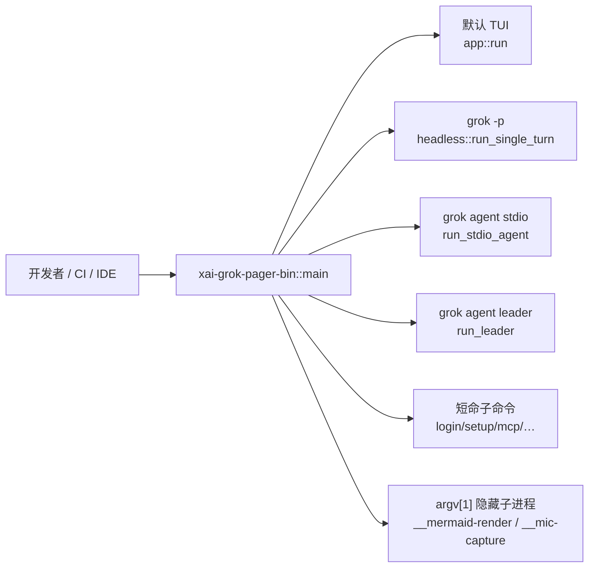
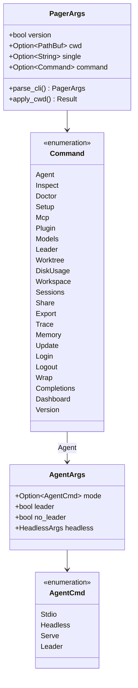
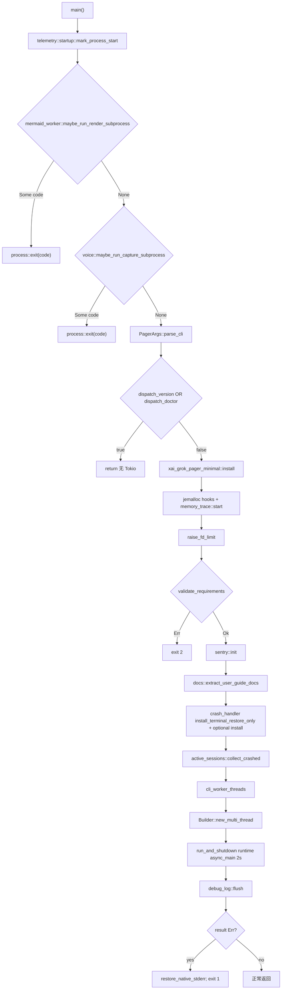
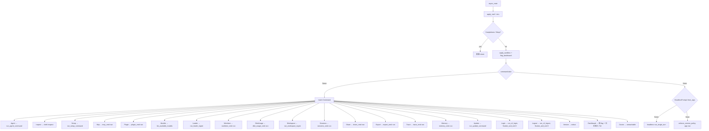
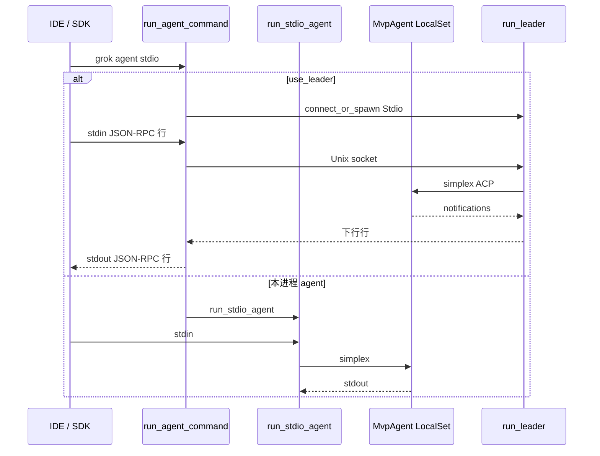
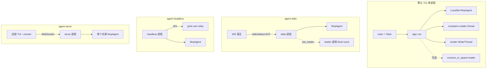

# 05 · 程序入口与运行模式

> 读完本篇应能：从 `main()` 跟到 TUI / headless / stdio / leader 四种长期模式，并说明每种模式的 stdin/stdout 所有权和退出码。上一篇：[04-配置与数据流.md](04-配置与数据流.md) · 下一篇：[06-TUI交互循环与渲染.md](06-TUI交互循环与渲染.md)

## 快速摘要

### 架构总览（模块与依赖）

组合根 crate `xai-grok-pager-bin` 只有一个 `main.rs`。它不拥有会话状态，只做：解析 CLI、安装进程级基础设施、按 `Command` / `AgentCmd` 分发到四种长期运行模式（TUI、headless、stdio ACP、leader）以及一批短命 CLI 子命令。领域逻辑在 `xai-grok-pager`（TUI / `-p`）和 `xai-grok-shell::agent`（stdio / leader / serve / grok.com relay）。

依赖方向固定：`xai-grok-pager-bin` → `xai-grok-pager` + `xai-grok-shell` → 更底层 crate。不要把 Session Actor 放进 `main.rs`。

### 核心调用序列（逐步逻辑）

1. `main()`（`xai-grok-pager-bin/src/main.rs`）先拦截隐藏子进程 `__mermaid-render` / `__mic-capture`，再 `PagerArgs::parse_cli()`。
2. `-v` / `doctor` 在 Tokio 之前同步退出；其余路径安装 jemalloc 钩子、校验 `requirements`、Sentry、crash handler、`collect_crashed`。
3. `cli_worker_threads()` 读 `GROK_WORKER_THREADS`，建 multi-thread runtime，`run_and_shutdown(runtime, async_main(args), 2s)`。
4. `async_main`：`apply_cwd`、注入环境变量、`Completions`/`Wrap` 早退、应用 sandbox、`Command` match。
5. `Command::Agent` → `run_agent_command` → `run_stdio_agent` / `run_headless` / `run_leader` / `run_agent_server`；无子命令且无 `-p` → `xai_grok_pager::app::run`（TUI）。

### 易错点与边界条件

- `grok -v` 与 `grok version` 不是同一条路径：前者在 `main()` 同步打印后 `return`，后者走 `async_main` 的 `Command::Version`。
- `grok dashboard` 不是独立进程：`flag_dashboard_at_startup_if_requested` 清掉 `args.command` 并设 `GROK_OPEN_DASHBOARD_AT_STARTUP=1`，随后落入默认 TUI。
- `GROK_WORKER_THREADS` 是真实环境变量；大纲里的 `GROK_TOKIO_WORKER_THREADS` 在本仓库不存在。默认上限 8，防止数百核主机把 cgroup 线程预算打爆。
- `validate_requirements()` 失败 `exit(2)`，与普通 `Error` 的 `exit(1)` 区分。
- stdio 模式 stdout 是 ACP JSON-RPC；任何 `println!` 都会破坏协议。日志只能写 stderr。
- leader 故意不绑 `PR_SET_PDEATHSIG`：它要活过客户端。stdio 必须绑，否则父进程死后会留下僵尸 agent。

## 目录

1. [Why：一个二进制为什么要四种长期模式](#1-why一个二进制为什么要四种长期模式)
2. [What：CLI 类型与模式清单](#2-whatcli-类型与模式清单)
3. [How：`main()` 逐步启动](#3-howmain-逐步启动)
4. [How：`async_main` 与 Command 全部分支](#4-howasync_main-与-command-全部分支)
5. [How：`run_agent_command` 的 headless / stdio / leader / serve](#5-howrun_agent_command-的-headless--stdio--leader--serve)
6. [stdin / stdout 所有权、进程图、退出码](#6-stdin--stdout-所有权进程图退出码)
7. [测试覆盖与缺口](#7-测试覆盖与缺口)
8. [重实现第一步：空壳 main 分发 4 种模式](#8-重实现第一步空壳-main-分发-4-种模式)
9. [本篇涉及的真实文件](#9-本篇涉及的真实文件)
10. [自检问题](#10-自检问题)

---

## 1. Why：一个二进制为什么要四种长期模式

Grok Build 同时服务四类宿主：

| 宿主 | 用户期望 | 若拆成四个二进制会怎样 |
|---|---|---|
| 交互终端 | 全屏 TUI、alternate screen、崩溃后恢复终端 | 安装面变宽，自更新要同步四份 |
| CI / 脚本 | `grok -p "…"` 把回答打到 stdout 然后退出 | 需要同一套工具、权限、会话恢复 |
| 编辑器 / SDK | 子进程走 ACP stdio（JSON-RPC） | stdout 是协议，不能混日志 |
| 多客户端共享后端 | 一个 leader 进程 + Unix socket | 会话 Actor 必须活过 TUI 退出 |

所以组合根把“进程怎么活、stdio 归谁”留在 `main.rs`，把“一次 Prompt 怎么跑”下沉到 `xai-grok-shell`。隐藏子进程（Mermaid 渲染、麦克风采集）也复用同一份 `argv[0]`，避免再发两个 helper 二进制。



必须保持的行为契约：同一套 `AgentConfig`、同一套 ACP `MvpAgent`、同一套会话磁盘布局。可以替换的实现：Tokio worker 数量算法、Sentry DSN、jemalloc 是否启用。

---

## 2. What：CLI 类型与模式清单

权威定义在 `crates/codegen/xai-grok-pager/src/app/cli.rs`。

| 类型 | 角色 |
|---|---|
| `PagerArgs` | clap 根：全局 flag + `command: Option<Command>` + `-p` / `--prompt-json` / `--prompt-file` |
| `Command` | 顶层子命令枚举 |
| `AgentArgs` | `grok agent` 的参数；`mode: Option<AgentCmd>` |
| `AgentCmd` | `Stdio` / `Headless(HeadlessArgs)` / `Serve(ServeArgs)` / `Leader(LeaderArgs)` |
| `HeadlessArgs` | `--grok-ws-origin` / `--grok-ws-url` |
| `LeaderMode` | `resolve_leader_mode` 的返回值：`use_leader` + 策略禁用原因 + sandbox 禁用 |

`PagerArgs::parse_cli()` 不改 cwd、不碰文件系统。它只做一件事：把 `argv[0]` 规范成 `grok` 或 `agent`（安装名可能是 `grok`），再 `parse_from`。副作用在 `apply_cwd()`：把 `--leader-socket` / `--debug-file` 锚到启动目录，然后 `set_current_dir(--cwd)`。



四种长期运行模式（重实现最小集）与若干短命模式：

| 模式 | 触发 | 长期？ | 协议 |
|---|---|---|---|
| TUI | 无子命令且无 `-p` | 是 | 终端 raw mode + ACP 进程内 |
| 单轮 headless | `-p` / `--prompt-json` / `--prompt-file` | 否（跑完退出） | ACP 进程内，stdout 文本/JSON |
| `agent stdio` | `grok agent stdio` | 是 | stdin/stdout JSON-RPC |
| `agent headless` | `grok agent headless` 或 `grok agent` 无 mode | 是 | grok.com WebSocket relay |
| `agent leader` | `grok agent leader` 或客户端 `connect_or_spawn` | 是 | Unix socket + 可选 relay |
| `agent serve` | `grok agent serve` | 是 | `ws://bind/ws?server-key=` |
| 其余 `Command` | `login`/`setup`/`mcp`/… | 否 | 各子命令自己的 stdout |

---

## 3. How：`main()` 逐步启动

`fn main()` 约在 `main.rs:1822`。它是同步函数；async 世界从它创建的 Tokio runtime 才开始。下面按真实调用顺序，每一步都有副作用。



### 3.1 遥测时间原点

`xai_grok_telemetry::startup::mark_process_start()` 必须是第一句可观察调用。后续 startup span 用这个时间戳算“进程启动到第一帧”的延迟。重实现时若把它放到 clap parse 之后，所有启动指标都会偏短。

### 3.2 隐藏子进程早退

同一份二进制被父进程再 exec 一次：

| argv[1] | 函数 | 成功 | 失败 |
|---|---|---|---|
| `__mermaid-render` | `app::mermaid_worker::maybe_run_render_subprocess` | `exit(0)` | `exit(1)`；看门狗 `exit(2)` |
| （voice crate 的 capture 标记） | `voice::maybe_run_capture_subprocess`（re-export `xai_grok_voice`） | 子进程自己的码 | 非零 |

这两步发生在 clap、jemalloc、Sentry、Tokio **之前**。原因写在 `mermaid_worker.rs`：子进程必须保持最小，好把 dagre 爆炸和 `panic = abort` 关进短命进程。父进程 stderr 对子进程是 null；子进程不能 `eprintln!` 给用户。

### 3.3 解析 CLI，以及 Tokio 之前的两个早退

```text
PagerArgs::parse_cli()
  → dispatch_version_if_requested(&args)   // -v / --version
  → dispatch_doctor_if_requested(&args)    // Command::Doctor
```

`Doctor` 在 `async_main` 的 match 里是 `unreachable!("doctor was consumed before runtime startup")`。这是刻意的：doctor 要探测终端能力，必须在 raw mode / Tokio 抢 stdin 之前跑完。

### 3.4 jemalloc、fd 上限、requirements

`#[global_allocator]` 在文件顶部：`feature = "jemalloc"` + unix 时用 `tikv_jemallocator::Jemalloc`。`feature = "release-dist"` 时再 export `malloc_conf`（Linux）或 `_rjem_malloc_conf`（macOS），打开 profiling 但默认 `prof_active:false`。

`main()` 接着安装三个钩子（同一 cfg）：

- `memory_release::install_release_hook(purge_jemalloc_retained_pages)` — 会话 replay 大对象 drop 后 `arena.4096.purge`
- `memory_trace::install_allocator_stats_provider` / `install_allocator_dump_provider`
- `install_heap_profile_hooks()` — 把 mallctl 接到 `xai_grok_shell::heap_profile`

然后 `memory_trace::start($GROK_HOME/memtrace)`（与 jemalloc feature 无关），`raise_fd_limit()`：macOS 目标 8192，Linux 65536，best-effort，失败不挡启动。

`xai_grok_config::validate_requirements()` 失败时：

```text
Couldn't start Grok: {e}
Update Grok to a version the policy allows, ...
exit(2)
```

这是企业策略闸门：签名 `requirements.toml` 不允许当前版本时，不允许进入任何业务模式。

### 3.5 Sentry、crash handler、崩溃会话

| 调用 | 何时 | 失败语义 |
|---|---|---|
| `xai_grok_telemetry::sentry::init` | requirements 通过后 | `disabled` 来自 `is_error_reporting_disabled_sync()`；guard 活到 `main` 结束 |
| `docs::extract_user_guide_docs(grok_home)` | Sentry 之后 | 把内嵌手册解到 `~/.grok` |
| `xai_crash_handler::install_terminal_restore_only()` | 总是 | 崩溃时至少发出 LeaveAlternateScreen / 关 raw mode |
| `check_previous_crash` + `install(CrashHandlerConfig)` | `load_crash_handler_enabled_sync()` 为真 | 安装失败只 `eprintln!` warning，不退出 |
| `active_sessions::collect_crashed()` | crash handler 之后 | `unwrap_or_default()`；死 PID 条目从 `active_sessions.json` 挪出并记日志 |

`collect_crashed_in` 用文件锁读改写：活 PID 留在文件里，死 PID 作为 `Vec<ActiveSession>` 返回。TUI 稍后用这些 id 做崩溃恢复提示；本层只收集，不 resume。

### 3.6 Tokio worker 与 `run_and_shutdown`

真实环境变量是 `GROK_WORKER_THREADS`（`GROK_WORKER_THREADS_ENV`），**不是** `GROK_TOKIO_WORKER_THREADS`。

```text
cli_worker_threads()
  cores = available_parallelism() 或 1
  无 env        → min(cores, 8)
  合法整数      → clamp 到 1..=cores
  非整数 / 非 Unicode → 忽略并 eprintln 提示
```

测试（`main.rs` 模块内）：

- `default_caps_the_core_count`：360 核被帽到 8
- `worker_threads_from_selects_default_or_override`
- `override_out_of_range_is_clamped_with_a_notice`：`0` → 1，`100000` → cores

runtime 创建失败会 `shutdown_and_flush_telemetry(1)`（`!` 函数：flush Sentry + OTEL + debug_log 再 `exit`）。

`run_and_shutdown`：`block_on(fut)` 然后 `shutdown_timeout(2s)`。注释写明：裸 `drop` runtime 会在不可取消的 `spawn_blocking` 上挂死。2 秒后放弃残留 blocking 任务，保证 `grok -p` / TUI 退出不会卡住 shell。

`async_main` 返回 `Err` 时：`restore_native_stderr()`（TUI 可能已经把 native stderr 重定向），`eprintln!("Error: {e:#}")`，`drop(_sentry_guard)`，`exit(1)`。成功路径只 `debug_log::flush()`。

| 调用方 | 关系 | 被调用方 | 触发与输入 | 返回与后续 | 错误、状态与副作用 |
|---|---|---|---|---|---|
| `main` | 调用 | `PagerArgs::parse_cli` | 进程 argv | `PagerArgs` | 无 FS 副作用 |
| `main` | 调用 | `validate_requirements` | 已合并的 managed requirements | `Result` | 失败 `exit(2)` |
| `main` | 调用 | `collect_crashed` | `~/.grok/active_sessions.json` | `Vec<ActiveSession>` | 删除死 PID 条目 |
| `main` | 调用 | `cli_worker_threads` | env `GROK_WORKER_THREADS` | `NonZeroUsize` | 非法值只警告 |
| `main` | 调用 | `run_and_shutdown` | runtime + `async_main` + 2s | `Result<()>` | runtime 强制关机 |
| `main` | 调用 | `shutdown_and_flush_telemetry` | 仅 runtime 创建失败 | 永不返回 | `exit(code)` |

---

## 4. How：`async_main` 与 Command 全部分支

`async fn async_main(args: PagerArgs)` 约在 `main.rs:1909`。进入后第一件事是 `rustls::crypto::ring::default_provider().install_default()`，保证后续 HTTPS 有 crypto provider。

### 4.1 `apply_cwd` 与环境注入

```text
args = args.apply_cwd()?
  --leader-socket / --debug-file 锚到启动目录
  --cwd → set_current_dir
```

然后把若干 CLI flag **写进进程环境**（`unsafe set_var`，因为必须在后续 `load_config` 读 env 之前生效）：

| CLI | 环境变量 | 作用 |
|---|---|---|
| `--compaction-mode` | `GROK_COMPACTION_MODE` | 压缩策略 |
| `--compaction-detail` | `GROK_COMPACTION_DETAIL` | 压缩日志粒度 |
| `--chat` | `GROK_CHAT_MODE_ENV`（`chat_modes`） | 会话 kind=chat |
| `--leader-socket` | `LEADER_SOCKET_ENV` | 覆盖默认 `~/.grok/leader.sock` |
| `--debug-file PATH` | `GROK_DEBUG_LOG=PATH`，并 `remove_var("GROK_LOG_FILE")` | 文件日志 |
| `--debug` 或 `--debug-file` | 若未设则 `GROK_DEBUG_LOG=1`、`GROK_HOOKS_LOG=1` | 打开 debug / hooks 日志 |

### 4.2 Completions / Wrap 早退

这两支在 `args.command.take()` **之前**返回，因此不跑 sandbox、不跑 version policy、不建 TUI：

- `Command::Completions { shell }` → `completions_cmd::run(*shell)` → `Ok(())`（脚本写 stdout）
- `Command::Wrap(wrap_args)` → `wrap_cmd::run`：本地 PTY 包一层命令，截 OSC 52 写系统剪贴板

match 里还有这两支的重复臂，属于 clap 穷尽匹配的防御副本；真正的早退是上面这两段。

### 4.3 sandbox 与 dashboard 软子命令

`pin_local_resume_target()` 之后：

```text
startup_sandbox_profile(saved_profile)
  Apply(profile)     → apply_sandbox(None, profile, cwd)
  Conflict{requested, saved} → eprintln + exit(1)
```

resume 时不允许用与创建会话不同的 sandbox profile。这是会话不变量，不是 UX 细节。

`flag_dashboard_at_startup_if_requested`：若 `Command::Dashboard` 且 dashboard 被 `[dashboard].enabled=false` / `GROK_AGENT_DASHBOARD=0` 关掉，则 `bail!`（TUI 欢迎页会静默丢掉等价 toast，所以必须在进 TUI 前报错）。否则 `args.command = None` 并 `set_var("GROK_OPEN_DASHBOARD_AT_STARTUP", "1")`。`grok dashboard` **不**强制 leader。

`is_interactive` = 无子命令且无 `-p`/`--prompt-json`/`--prompt-file`。据此 `http::set_client_name(GrokPager | Generic)`，让权限审计区分“人在终端里”和“脚本/agent”。

### 4.4 `Command` match 全部分支

`args.command.take()` 之后的 `match command`（`main.rs` 约 1978–2164）。每支都 `return`，除了 `Dashboard` 会清命令后落入后续 TUI。



分支要点（真实符号，不是“某个模块负责”）：

| `Command` 臂 | 被调用方 | stdin/stdout | 退出 |
|---|---|---|---|
| `Version { json }` | `write_version` 或 JSON `{currentVersion, channel}` | stdout | `Ok(())` |
| `Agent(agent_args)` | 若顶层 `--leader/--no-leader` 则 `bail!`；否则 `enforce_version_policy_or_exit` + `run_agent_command` | 见第 5 节 | 传播 `Result` |
| `Doctor(_)` | 不可达 | — | — |
| `Inspect { json }` | `xai_grok_shell::inspect::inspect(&cwd, json)` | stdout JSON/文本 | `?` |
| `Setup { json }` | `init_tracing_simple("cli")` + `run_setup_command` | stderr 人话 / stdout JSON | 无 principal 或 fetch 失败 `exit(1)` |
| `Mcp(mcp_args)` | `mcp_cmd::run` | 子命令自定 | `?` |
| `Plugin(plugin_args)` | `plugin_cmd::run` | 子命令自定 | `?` |
| `Models` | `load_effective_config_disk_only` → `AgentConfig::new_from_toml_cfg` → `models::list_available_models` | stdout | `?` |
| `Leader(leader_args)` | `run_leader_mgmt`：`List`/`Info`/`Kill` | stdout；Kill 无 JSON 时人话 | `?` |
| `Worktree` | `worktree_cmd::run` | stdout | `?` |
| `DiskUsage` | `disk_usage_cmd::run`（同步） | stdout | `?` |
| `Workspace` | `run_workspace_mgmt` | stdout / JSON | `?` |
| `Sessions` | `sessions_cmd::run` | stdout | `?` |
| `Share` | `share_cmd::run`（`hide = true`） | stdout URL | `?` |
| `Export` | `export_cmd::run`（同步 Markdown） | stdout 文件 | `?` |
| `Trace` | `trace_cmd::run` | 文件 / 上传 | `?` |
| `Memory` | `memory_cmd::run`（同步） | stdout | `?` |
| `Update {…}` | `get_channel_switch` + `run_update_command` | stdout / 安装副作用 | `?` |
| `Login { oauth, device_auth, devbox }` | `run_cli_login` 然后 `finalize_and_exit(0)` | stderr 流程，成功不返回 | 失败 `?` |
| `Logout` | `run_cli_logout` + `finalize_and_exit(0)` | 清凭据 | 失败 `?` |
| `Wrap` / `Completions` | 与早退相同 | stdout / PTY | `return` |
| `Dashboard` | 再调 `flag_dashboard_at_startup_if_requested` | 无 | 落入 TUI |

`Login`/`Logout` 走 `finalize_and_exit(0)` 而不是 `return Ok(())`，因为要先 flush 遥测再 `_exit`，避免 Drop 顺序把 span 截断。

### 4.5 `-p` 单轮与默认 TUI

若 `command` 为 `None`：

```text
HeadlessPrompt::from_args(single, prompt_json, prompt_file)?
  Some(prompt) → init_tracing_simple("headless")  // HEADLESS_ENTRYPOINT，默认 filter "off"
                 enforce_version_policy_or_exit
                 headless::run_single_turn(prompt, verbatim, HeadlessOptions{…})
  None         → enforce_version_policy_or_exit
                 可选 spawn check_update_background
                 app::run(args, bg_update_rx)
                 sandbox::flush
                 Ok(true)  → finish_update_on_exit（Ctrl+U 退出后装更新）
                 Ok(false) → 普通退出
```

`app::run` 返回 `Result<bool>`：`true` 表示用户为更新而退出。TUI 路径会 `redirect_native_stderr()`，所以 `async_main` 的 `Err` 打印前必须 `restore_native_stderr`（在 `main` 里做）。

| 调用方 | 关系 | 被调用方 | 触发与输入 | 返回与后续 | 错误、状态与副作用 |
|---|---|---|---|---|---|
| `async_main` | 调用 | `PagerArgs::apply_cwd` | `--cwd` 等 | 改过的 `PagerArgs` | `set_current_dir` |
| `async_main` | 调用 | `config::apply_sandbox` | CLI profile + cwd | `()` | 进程级 OS 沙箱 |
| `async_main` | 调用 | `run_agent_command` | `AgentArgs` + 全局 flag | `Result<()>` | 见第 5 节 |
| `async_main` | 调用 | `headless::run_single_turn` | `-p` 文本/JSON/文件 | `Result<()>` | stdout 回答 |
| `async_main` | 调用 | `app::run` | `PagerArgs` + 更新 oneshot | `Result<bool>` | 终端 raw mode |
| `Login` 臂 | 调用 | `auth::run_cli_login` | oauth/device/devbox | `Result` | 写凭据；然后 `exit(0)` |

---

## 5. How：`run_agent_command` 的 headless / stdio / leader / serve

`async fn run_agent_command(...)` 约在 `main.rs:1061`。这是 `grok agent …` 的唯一入口。

### 5.1 公共前奏

1. `tokio::spawn` 信号任务：Unix 上 `SIGTERM`/`SIGHUP` → `next_signal_code` → `shutdown_and_flush_telemetry(code)`；非 Unix 上 `ctrl_c` → `exit(130)`。
2. `AgentCmd::Leader|Stdio|Headless|Serve` 时 `suppress_otel()`，避免协议进程把 OTEL 打到被宿主捕获的流。
3. `init_tracing_simple("agent")`：默认 filter `error`（headless `-p` 才是 `"off"`），日志写 **stderr**。
4. `--trust` → `folder_trust::grant_folder_trust(cwd)`。
5. `start_early_prefetch` + `warm_async_http_client` + 空 `spawn_blocking`（预热 blocking 池）。
6. 非 stdio 且非 leader：stderr 打版本 banner，并可能 `auto_update::run_update_if_available(NonBlocking)`。
7. `load_effective_config` → `AgentConfig::new_from_toml_cfg` → 填 model / yolo / auto / plugin_dirs / endpoints / `resolve_runtime_fields`。
8. `resolve_leader_mode(agent_args.leader, no_leader, raw_config, remote_settings, leader_eligible, requested_confinement)`。sandbox 配置文件会禁用 leader 并 `warn_leader_disabled_by_sandbox`。
9. stdio + 非 leader + managed install：后台再 spawn 一次 auto-update。

`leader_eligible` = `mode` 为 `None | Stdio | Headless(_)`。`Serve` 和显式 `Leader` 自己就是服务端，不再当 follower 去连别人。

### 5.2 `use_leader == true`：当客户端，不在本进程起 Actor

`connect_or_spawn(client_type, mode, env_urls, capabilities)` 得到 socket 通道。然后：

**`ClientMode::Stdio`**

- `kill_current_process_on_parent_death()`（失败只 warn：stdin EOF 仍是兜底）。
- 任务 A：`spawn_stdin_line_reader` → `forward_stdio_line_to_leader`（最多重试 300s）。
- 任务 B：leader 下行 → `tokio::io::stdout` 逐行写；断线则 `LeaderReconnector::reconnect(bounded)`，replay ACP 状态，再向宿主发 `x.ai/leader_reconnected`。
- `select!` 任一任务结束即 `return Ok(())`。

**`ClientMode::Headless`**

- `drop(tx)`：本进程不向 leader 发 ACP，只挂着 rx 等待断线重连。这是“跟着 leader 活着的 headless 跟随者”，不是 `run_headless`。

### 5.3 `use_leader == false`：本进程就是 agent

```text
match agent_args.mode {
  Some(Stdio)              → run_stdio_agent(&agent_config, None, memory_config)
  Some(Headless(a))        → apply_headless_args_to_config; run_headless(..., reauthenticate, ...)
  Some(Serve(a))           → apply_headless_args; print_serve_startup_info; run_agent_server
  Some(Leader(a))          → apply_headless_args; 组装 LeaderAutoUpdateConfig; run_leader
  None                     → 当作 Headless：run_headless
}
```

#### `run_stdio_agent`（`agent/app.rs:277`）

- 绑 parent-death；stamp unified log version；清理 orphan upload。
- `stdout.compat_write()` 作为 ACP outgoing。
- simplex 中介：OS 线程阻塞读 stdin（Windows 上 `tokio::io::stdin` 对持久管道会卡在 `initialize`），按行写入 simplex；skills watcher 也可注入内部消息。
- `LocalSet` 上 `spawn_agent_local` → `MvpAgent` + `AgentSideConnection`。
- stdin EOF 后等 100ms 再 shutdown simplex，让 in-flight handler 冲完响应。
- 退出：`pty_session::close_all`，再睡 2s 给 upload worker。

#### `run_headless`（`agent/app.rs:409`）

- `set_process_client_mode_headless()`。
- 无 grok.com session 则 `bail!(HEADLESS_NO_SESSION)`，提示 `grok login` 或改用 stdio。
- `run_auth_flow`（`--reauth` 强制浏览器流）。
- `spawn_relay_connection_with_callback`：WebSocket ↔ simplex ↔ `MvpAgent`。
- 第一次连接且没走过浏览器流：stderr 打印 `Open Grok Build: {origin}/build`，另起线程 `stdin.read_line` 后 `webbrowser::open`。**这里 stdin 属于“按回车打开浏览器”，不属于 ACP。**

#### `run_leader`（`agent/app.rs:974`）

- `AgentMode::Leader`。
- **先 flock 再 socket**（`LeaderLock::try_acquire`）：已有 flock+bound socket → 返回 Err，让客户端 adopt；flock 被占但 socket 未就绪 → 等最多 15s。
- 持锁后 `cleanup_socket`，再 bind。
- 通道：IPC↔agent、WS↔agent、ACP simplex；`ready` watch 在 auth/prefetch 成功后才放行转发。
- `relay_on_demand`：交互客户端自动拉起的 leader 等到第一个 headless IPC 客户端才连 grok.com；裸 leader（systemd）则立刻连。
- 自动更新：idle 时 flush 会话再 `ShutdownReason::AutoUpdate`；busy 最多推迟 24 次（约 24h）。
- **不**绑 parent-death。

#### `run_agent_server`（`agent/server.rs:459`）

Axum `GET /ws`，`TcpListener::bind(ServeArgs.bind)` 默认 `127.0.0.1:2419`。`ServeArgs::get_secret()` 无 `--secret`/`GROK_AGENT_SECRET` 时生成 12 字符 key，并 `print_serve_startup_info` 打到 **stderr**（含 `ws://…/ws?server-key=`）。单个 `MvpAgent` 跨 WebSocket 重连复用，会话 Actor 不随客户端断开而丢。



| 调用方 | 关系 | 被调用方 | 触发与输入 | 返回与后续 | 错误、状态与副作用 |
|---|---|---|---|---|---|
| `run_agent_command` | 调用 | `resolve_leader_mode` | CLI + config + sandbox | `LeaderMode` | sandbox 可强制关 leader |
| `run_agent_command` | 调用 | `connect_or_spawn` | `ClientMode` + capabilities | socket 通道 | 可能拉起 leader 子进程 |
| `run_agent_command` | 调用 | `run_stdio_agent` | `AgentConfig` + memory | `Result<()>` | 占用 stdin/stdout |
| `run_agent_command` | 调用 | `run_headless` | config + reauth | `Result<()>` | 占用 grok.com WS；stdin 仅回车开浏览器 |
| `run_agent_command` | 调用 | `run_leader` | config + auto-update 闭包 | `Result<()>` | flock + socket；失败让客户端 adopt |
| `run_agent_command` | 调用 | `run_agent_server` | `ServerConfig` + `AgentConfig` | `Result<()>` | 听 TCP；secret 打 stderr |

---

## 6. stdin / stdout 所有权、进程图、退出码

### 6.1 所有权表（必须保持的契约）

| 模式 | stdin | stdout | stderr | 其它 I/O |
|---|---|---|---|---|
| 隐藏 `__mermaid-render` | 图源文本 | 不用（PNG 写 `--out` 路径） | 父进程已 null | 看门狗线程 |
| `-v` / `version` | 不用 | 版本文本或 JSON | 写失败时 | 无 |
| `doctor` | 探测终端（cooked） | 报告 | 错误 | 无 Tokio |
| `completions` | 不用 | shell 脚本 | 不用 | 无 |
| `wrap` | 交给子 PTY | 子 PTY 输出（滤 OSC 52） | 包装器日志 | 本机剪贴板 |
| TUI `app::run` | crossterm 读线程独占 | 几乎不用 | `redirect_native_stderr` 后供终端序列 / 日志 | ACP 在进程内 channel |
| `grok -p` | 不用（prompt 来自 argv/文件） | 回答（plain/JSON） | tracing；headless 默认 filter `off` | 进程内 ACP |
| `agent stdio`（本进程） | ACP 请求行 | ACP 响应/通知行 | tracing + banner 禁止 | LocalSet |
| `agent stdio`（连 leader） | ACP 请求行，由桥转发到 Unix socket | ACP 响应/通知行，从 socket 抄回 stdout | tracing | Unix socket |
| `agent headless` | 仅“按回车打开浏览器” | 不用作协议 | URL 提示 + tracing | grok.com WS |
| `agent leader` | 不用 | 不用 | tracing | `leader.sock` + 可选 WS |
| `agent serve` | 不用 | 不用 | 启动信息 + secret | `127.0.0.1:2419/ws` |
| `login`/`setup` | 可能交互 | JSON 时 stdout | 人话 | 网络 |

TUI 把 native stderr 重定向，是因为 Ratatui/crossterm 的 escape 写 stderr，同时 tracing 也要写 stderr。崩溃路径必须 `restore_native_stderr`，否则用户看到的是空终端或乱码。

### 6.2 进程图



TUI 也可 `use_leader=true`：此时 `app::run` 里的 ACP 桥接到已有 leader，本进程仍拥有终端，但不拥有 Session Actor。`--chat` 与 leader 冲突时 `session_startup::chat_mode_conflicts_with_leader` 直接 `bail!`。

### 6.3 退出码

| 码 | 谁发出 | 含义 |
|---|---|---|
| 0 | 正常 `return` / `finalize_and_exit(0)` / mermaid 成功 | 成功 |
| 1 | `async_main` `Err`；runtime 创建失败；mermaid 普通失败；`--agent-profile` 非法（`resolve_agent_profile_path`） | 一般错误 |
| 2 | `validate_requirements`；mermaid 子进程看门狗 | 策略/看门狗（语境不同，不要混用） |
| 130 | agent 路径非 Unix `ctrl_c` | 被中断 |
| Unix 信号码 | `next_signal_code` → `shutdown_and_flush_telemetry` | SIGTERM/SIGHUP 映射 |

`Command::Setup` 无 deployment key / team 登录时也是 `exit(1)`，不是 2。不要把“配置缺失”和“版本策略拒绝”收成同一个码。

---

## 7. 测试覆盖与缺口

| 测试 | 覆盖什么 | 未覆盖 |
|---|---|---|
| `main.rs::default_caps_the_core_count` 等 | worker 上限 / clamp / 非法 env | 未跑真实 `Builder::build` |
| `active_sessions::collect_crashed_partitions_by_pid_liveness` | 死/活 PID 分区 | 未覆盖 TUI 如何消费返回值 |
| `cli.rs` 内 `apply_cwd` 相关测试（若有） | 路径锚点 | `parse_cli` 对 `argv[0]==agent` 的行为要对照 clap |
| `mermaid_render_subprocess.rs` | 对已构建二进制 `render_via_subprocess` | `main` 里 `maybe_run_*` 早退靠 argv 单测 `is_render_subcommand` |
| PTY e2e（`xai-grok-pager` tests） | TUI 启动/退出终端恢复 | 不覆盖 `run_leader` flock 竞态 |

`run_stdio_agent` / `run_leader` / `run_headless` 的核心不变量（parent-death、lock-then-socket、HEADLESS_NO_SESSION）主要靠注释 + 少量 leader 单测。重实现时至少要补：stdio 把日志打到 stdout 应失败；第二个 leader 在 socket 已 bind 时必须退出。

---

## 8. 重实现第一步：空壳 main 分发 4 种模式

第一天不要复制 jemalloc、Sentry、Mermaid 子进程。做一个能分发的空壳，让四种模式的 **stdio 所有权** 先正确。

建议目录：

```text
src/main.rs          // 同步 main + Tokio + match
src/cli.rs           // PagerArgs / Command / AgentCmd
src/modes/tui.rs     // 打印 "TUI would start" 后等 ctrl_c
src/modes/headless.rs
src/modes/stdio.rs
src/modes/leader.rs
```

伪代码契约：

```text
fn main() {
    let args = parse_cli();          // 无副作用
    if args.version { print_version(); return; }
    let rt = runtime_with_cap_8();
    rt.block_on(async_main(args));
    rt.shutdown_timeout(2s);
}

async fn async_main(args) {
    args.apply_cwd()?;
    match args.command {
        Some(Agent { mode: Stdio, .. })  => run_stdio().await,   // stdin→stdout 回显 JSON 行
        Some(Agent { mode: Leader, .. }) => run_leader().await,  // bind sock, flock
        Some(Agent { mode: Headless, ..})| Some(Agent { mode: None, .. }) =>
            run_headless().await,     // stderr 打 "would connect WS"
        None if args.single.is_some()    => print_fake_answer(args.single), // stdout
        None                             => run_tui().await,     // 不要写 stdout
        other                            => eprintln!("unimplemented"),
    }
}
```

阶段 0 验收：

1. `grok -p "hi"` 只在 stdout 出现一行回答，stderr 可有日志。
2. `grok agent stdio` 从 stdin 读一行 JSON，从 stdout 写一行 JSON；`tracing` 在 stderr。
3. `grok agent leader` 在临时目录创建 sock+lock；第二个实例立即退出非零。
4. `grok`（无参数）不打印协议字节到 stdout。
5. 退出时 runtime 在 2s 内结束。

禁止：在 stdio 模式 `println!` 调试；在空壳里启动真实 HTTP；把 Session 状态放进 `main`。

下一阶段再接 ACP `initialize`/`session/new`（见 `07`、`15`）。

---

## 9. 本篇涉及的真实文件

| 路径 | 在本篇中的角色 |
|---|---|
| `crates/codegen/xai-grok-pager-bin/src/main.rs` | `main` / `async_main` / `run_agent_command` / worker / 退出 |
| `crates/codegen/xai-grok-pager/src/app/cli.rs` | `PagerArgs` / `Command` / `AgentCmd` / `parse_cli` / `apply_cwd` |
| `crates/codegen/xai-grok-pager/src/app/mod.rs` | TUI `run`；终端所有权从这里开始 |
| `crates/codegen/xai-grok-pager/src/app/mermaid_worker.rs` | `__mermaid-render` 早退 |
| `crates/codegen/xai-grok-pager/src/voice/mod.rs` | re-export `maybe_run_capture_subprocess` |
| `crates/codegen/xai-grok-pager/src/headless.rs` | `-p` 单轮 |
| `crates/codegen/xai-grok-pager/src/wrap_cmd.rs` | `grok wrap` PTY |
| `crates/codegen/xai-grok-shell/src/agent/app.rs` | `run_stdio_agent` / `run_headless` / `run_leader` |
| `crates/codegen/xai-grok-shell/src/agent/server.rs` | `run_agent_server` |
| `crates/codegen/xai-grok-shell/src/active_sessions.rs` | `collect_crashed` |
| `crates/codegen/xai-grok-config` | `validate_requirements` |
| `crates/codegen/xai-crash-handler` | 终端恢复 + 崩溃报告 |

## 10. 自检问题

1. 为什么 `__mermaid-render` 必须在 `parse_cli` 之前拦截？若先 clap 再 exec，会发生什么？
2. `grok doctor` 为什么不能进 `async_main` 的 match？
3. `validate_requirements` 失败为什么是 2 不是 1？
4. `GROK_WORKER_THREADS=0` 实际用几个 worker？依据哪条测试？
5. `grok dashboard` 最终调用的是 `run_leader` 还是 `app::run`？
6. stdio 连 leader 时，stdout 上的 `x.ai/leader_reconnected` 是谁写的？
7. `run_leader` 为什么先 flock 再清 socket？反过来会破坏哪条不变量？
8. `run_headless` 的 stdin 和 `run_stdio_agent` 的 stdin 各属于谁？
9. TUI `app::run` 返回 `Ok(true)` 之后 `async_main` 还会做什么？
10. 空壳阶段 0 若在 `agent stdio` 里 `println!("debug")`，哪个宿主会立刻坏掉？

下一篇：[06-TUI交互循环与渲染.md](06-TUI交互循环与渲染.md)
