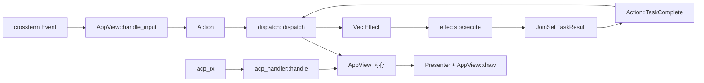
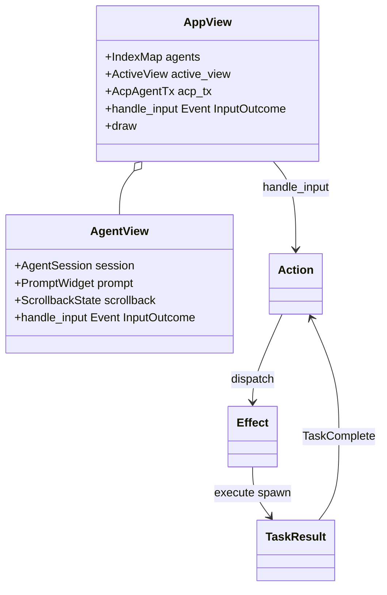
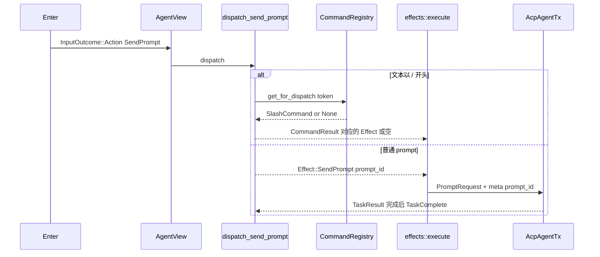
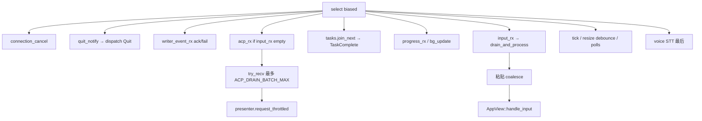
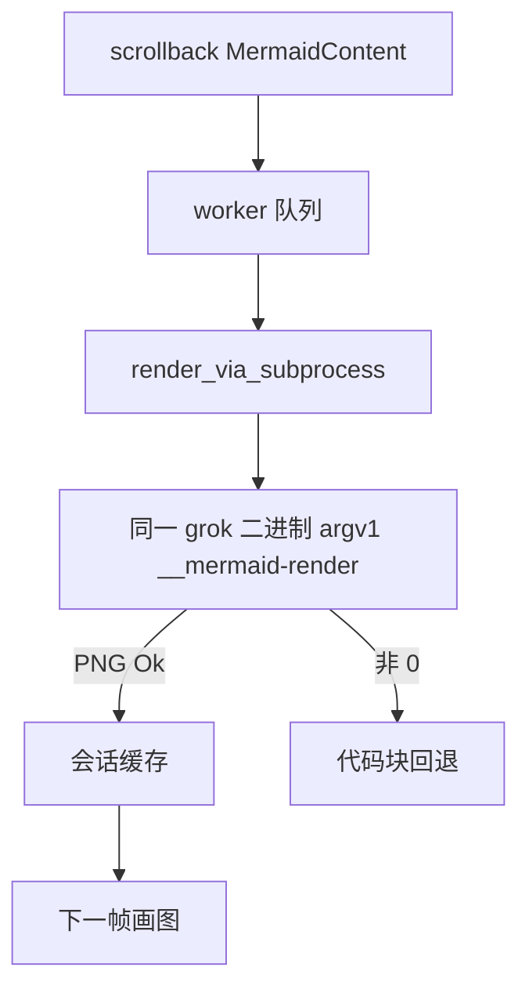
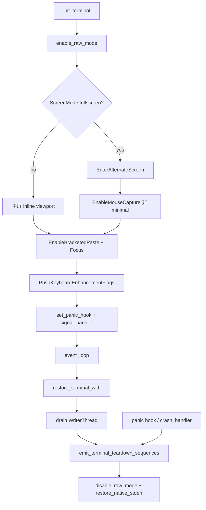

# 06 · TUI 交互循环与渲染

> 读完本篇应能：重写一个 Action/Effect 事件循环（同步 dispatch、异步 effects），而不是“会用 Ratatui”。前篇 [05-程序入口与运行模式.md](05-程序入口与运行模式.md) 把进程交到 `xai_grok_pager::app::run`。Agent 回合内部见 [07-Agent会话与模型循环.md](07-Agent会话与模型循环.md)。

## 快速摘要

### 架构总览（模块与依赖）

TUI 的因果核心不是 Ratatui widget，而是三元组：

- `Action`：同步、无副作用的用户意图（`app/actions.rs`）
- `dispatch::dispatch(Action) -> Vec<Effect>`：只改 `AppView` 内存（`app/dispatch/`）
- `effects::execute`：把 `Effect` spawn 成 `JoinSet<TaskResult>`，完成后再变成 `Action::TaskComplete`

`event_loop.rs` 是薄 `tokio::select!`：它不实现业务，只把终端事件、ACP 通知、task 结果接到 `AppView`。渲染原语在独立 crate `xai-grok-pager-render`，由 `xai-grok-pager/src/lib.rs` 根上 `pub use`，所以业务代码仍写 `crate::render` / `crate::terminal`。

### 核心调用序列（逐步逻辑）

1. `app::run` 解析 leader、物化 session、`init_terminal`（raw mode、alternate screen、Kitty flags）。
2. 专用线程读 crossterm `Event` → `input_rx`。
3. `AppView::handle_input` → `AgentView::handle_input` → `InputOutcome::Action(Action)`。
4. `dispatch::router::dispatch` 按 `Action` 分到 `turn` / `interject` / `permissions` / `rewind` / `session/*`。
5. `event_loop::process_effects` → `effects::execute`；ACP `session/prompt` 在 task 里发出。
6. `acp_handler::handle` 把通知写进 scrollback；`Presenter` 节流绘制；`MarkdownContent::push_chunk` 流式排版。

### 易错点与边界条件

- dispatch **禁止**碰终端、网络、文件系统。测 UI 逻辑时不要起 Tokio。
- ACP 火hose 必须让位于键盘：`acp_rx.recv()` 带 `if input_rx.is_empty()`，并每轮最多排空 `ACP_DRAIN_BATCH_MAX`。
- 无 bracketed paste 的终端会把粘贴拆成按键风暴；`PASTE_COALESCE_THRESHOLD = 3` 把连续 Char/Enter/Tab 合成 `Event::Paste`。
- 取消正在画的流：`Action::CancelTurn` 走 ACP `session/cancel`；滚轮动量用 `ScrollState::cancel_stream`，两者不是一回事。
- 崩溃必须 `emit_terminal_teardown_sequences`：panic hook、`restore_terminal`、`xai_crash_handler` 三条路径都要能离开 alternate screen。

## 目录

1. [Why：同步 dispatch + 异步 effects](#1-why同步-dispatch--异步-effects)
2. [What：`app/mod.rs` 子模块地图](#2-whatappmodrs-子模块地图)
3. [输入：crossterm → Action](#3-输入crossterm--action)
4. [dispatch：Action → Vec\<Effect\>](#4-dispatchaction--veceffect)
5. [effects spawn → TaskResult 回 dispatch](#5-effects-spawn--taskresult-回-dispatch)
6. [event_loop：偏置 select 与 Presenter](#6-event_loop偏置-select-与-presenter)
7. [scrollback 与 markdown 流式渲染](#7-scrollback-与-markdown-流式渲染)
8. [`xai-grok-pager-render` re-export 与 textarea](#8-xai-grok-pager-render-re-export-与-textarea)
9. [mermaid_worker 子进程](#9-mermaid_worker-子进程)
10. [slash registry](#10-slash-registry)
11. [终端：alternate screen、Kitty、崩溃恢复](#11-终端alternate-screenkitty崩溃恢复)
12. [失败：粘贴风暴、部分重绘、取消流式块](#12-失败粘贴风暴部分重绘取消流式块)
13. [测试与重实现检查清单](#13-测试与重实现检查清单)
14. [本篇涉及的真实文件](#14-本篇涉及的真实文件)
15. [自检问题](#15-自检问题)

---

## 1. Why：同步 dispatch + 异步 effects

终端 UI 若在按键处理里直接 `await session/prompt`，会出现三类事故：

1. 绘制和网络抢同一条任务，token 流时滚轮卡死。
2. 权限弹窗、插话、取消和 prompt 发送缠在一起，无法单测。
3. 崩溃或 panic 时不知道哪一步改了终端模式。

因此 pager 把“决定做什么”和“去做”切开：

```text
Event  →  Action     （纯意图，可克隆进测试）
Action →  改 AppView + Vec<Effect>   （同步、确定、无 I/O）
Effect →  JoinSet<TaskResult>        （async，ACP / 磁盘 / 定时器）
TaskResult → Action::TaskComplete    （再进 dispatch）
```

`dispatch/mod.rs` 模块文档写死四条不变量：不碰终端、不碰网络、不碰文件系统、异步工作只描述为 `Effect`。这不是风格偏好，而是 `dispatch/tests/` 能在无 Tokio 下跑完 prompt/rewind/permissions 的前提。

可以替换的实现：Ratatui backend、WriterThread、Kitty 探测。必须保持的契约：一次用户回车最终变成一条 `Effect::SendPrompt { prompt_id, … }`，且 `prompt_id` 能把后续 ACP notification 对回这条发送。



---

## 2. What：`app/mod.rs` 子模块地图

`crates/codegen/xai-grok-pager/src/app/mod.rs` 文件头列出公开地图；下面按运行期角色补全：

| 子模块 | 可见性 | 职责 |
|---|---|---|
| `actions` | `pub` | `Action` / `Effect` / `TaskResult` 三枚举 |
| `dispatch` | 私有，`pub(crate) use router::dispatch` | 同步状态机 |
| `effects` | 私有 | `execute(Effect, JoinSet, AcpAgentTx, …)` |
| `event_loop` | 私有 | 偏置 `select!`、粘贴合并、Presenter |
| `app_view` | `pub` | 根视图：多 agent、欢迎页、dashboard、输入路由 |
| `agent_view` | `pub` | 单个会话的 prompt + scrollback + overlay |
| `acp_handler` | 私有 | ACP notification → scrollback / 权限队列 |
| `cli` | `pub use` | 见 05；TUI 仍读 `PagerArgs` |
| `agent` | `pub` | `AgentSession` / `AgentId` / `TurnState` |
| `mermaid_worker` | `pub` | 进程外渲染 + 会话缓存 |
| `signal_handler` | `pub` | SIGINT/SIGTERM → `quit_notify`；崩溃时 restore |
| `screen_mode_relaunch` | `pub(crate)` | `/minimal` `/fullscreen` re-exec |
| `edit_highlight_worker` | `pub` | 大 diff 语法高亮离线程 |

`app::run(args, bg_update_rx) -> Result<bool>`（约 605 行）是 TUI 生命周期函数：load config、prefetch models、`resolve_leader_mode`、`session_startup::materialize_startup`、选 `ScreenMode`、连 ACP（本进程 `spawn_grok_shell` 或 leader 桥）、`init_terminal`、进入 `event_loop`，退出时 `restore_terminal`。

`AppView` 拥有 UI 状态；`AgentSession` 拥有该 tab 的会话 id / yolo / 模型；对话事实在 shell 的 ChatState；文件事实在 Workspace。TUI 崩溃可以丢 `AppView`，不能把 ChatState 只放在 `AppView` 里。



---

## 3. 输入：crossterm → Action

### 3.1 读线程与过滤器

`event_loop` 在 `init_terminal` 之后启动专用 OS 线程读 crossterm。事件先过：

- `csi_filter` / `xt_filter`：丢掉终端查询应答，避免把 DA2 / XTVERSION 当成按键
- `KeyboardNormalizer`（`input/keyboard_normalizer.rs`）：修修饰键；`AppView::handle_input_at_with_paste_provenance` 第一句就是 `keyboard_normalizer.rescue(ev)`
- 粘贴合并（第 12 节）

`crate::input`（`src/input/mod.rs`）提供 `key` / `mouse` / `keyboard_normalizer`，不是 `Action` 的生产者。真正产出 `Action` 的是视图层。

### 3.2 `AppView::handle_input`

签名：`handle_input(&mut self, ev: &Event) -> InputOutcome`，内部转到 `handle_input_at_with_paste_provenance`。`InputOutcome`（`app_view.rs:446`）：

| 变体 | 含义 |
|---|---|
| `Action(Action)` | dispatch 然后重绘 |
| `ActionThenForward(Action)` | 欢迎页第一键先建会话，再把同一字符喂给新 prompt |
| `ActionPair(a, b)` | 连续两条，例如预览回滚 + 打开确认 |
| `ArmPending { action, shortcut, ttl, … }` | 双击手势（空闲 Esc 清 prompt / rewind） |
| `Changed` | 只需重绘（输入了一个字） |
| `Unchanged` | 跳过重绘，保住光标闪烁 |

路由顺序（必须按这个想，不能“全局 keymap 一张表”）：

1. 已武装的 `pending_action` 是否匹配第二击。
2. 滚动阻断型 modal。
3. dashboard / welcome / 设置 overlay。
4. 活动 `AgentView::handle_input`。

### 3.3 `AgentView::handle_input`

`agent_view/input.rs`：先看 overlay 所有权（权限卡、plan review、slash 下拉、image viewer、`/gboom`…），再看 `AgentPane`（Prompt vs Scrollback）。prompt 内：

- Enter → `Action::SendPrompt`（或排队 / send-now）
- 文本以 `/` 开头 → 不在这里执行命令，只编辑；执行权在 dispatch 的 slash registry
- Esc：`esc_cancels_turn(is_minimal, vim_mode)` 决定是取消 turn 还是留给 vim
- Ctrl+C：取消；fullscreen vim 中途吞掉 Esc，Ctrl+C 仍是取消手势
- bracketed `Event::Paste` → `agent_view/paste.rs`，可能 `spawn` 剪贴板图片探测（`PastePending` 时外部编辑器不可用）

`Action` 里与输入直接相关的代表变体：`SendPrompt`、`SendPromptNow`、`Interject`、`CancelTurn`、`SendSlashCommandPreservingDraft`、`SubmitFollowUp`（chip 必须当字面 prompt，禁止当 slash）。

| 调用方 | 关系 | 被调用方 | 触发与输入 | 返回与后续 | 错误、状态与副作用 |
|---|---|---|---|---|---|
| event_loop 输入臂 | 调用 | `drain_and_process` | `input_rx` 事件 | `needs_draw` / `should_quit` | 合并粘贴 |
| `drain_and_process` | 调用 | `AppView::handle_input` | `Event` | `InputOutcome` | 可能改 prompt 缓冲 |
| `AppView` | 调用 | `AgentView::handle_input` | 同一 `Event` + `ActionRegistry` | `InputOutcome` | overlay 抢输入 |
| event_loop | 调用 | `dispatch::dispatch` | `Action` | `Vec<Effect>` | 只改内存 |

---

## 4. dispatch：Action → Vec\<Effect\>

入口：`dispatch/router.rs` 的 `pub(crate) fn dispatch(action: Action, app: &mut AppView) -> Vec<Effect>`。先 `app.reconcile_foreign_resume_launch()`，再巨大 `match action`，最后多数臂流过 `sync_sleep_inhibitor(app)`（抑制系统睡眠当 turn 在跑）。注释警告：带 `return` 的内联臂不能随手抽成函数，否则会意外经过 tail。

### 4.1 主要文件（按领域，不是按字母）

| 文件 | 处理的 Action / 职责 |
|---|---|
| `router.rs` | 总 match；`Quit` → 停 voice + `UnregisterActiveSession` + `Effect::Quit` |
| `prompt.rs` | `SendPrompt` → `dispatch_send_prompt`；slash registry 执行 |
| `turn.rs` | `CancelTurn` / 超时对账 `reconcile_overdue_cancels` |
| `interject.rs` | `Interject`：本地乐观 user block + `Effect` 发 `x.ai/interject` |
| `permissions.rs` | 权限选择 / follow-up / 取消队列 |
| `rewind.rs` | rewind picker、确认、inline edit submit |
| `session/lifecycle.rs` | new / exit / delete / trust folder |
| `session/load.rs` | resume、picker、deep search |
| `session/fork.rs` | fork、worktree persist |
| `session/foreign.rs` | 外源会话扫描 |
| `session/modal.rs` | rename |
| `task_result.rs` | `Action::TaskComplete` → `dispatch_task_result` |
| `queue.rs` | 发送队列 drain、send-now shim |
| `modes.rs` | yolo / auto / plan |
| `voice.rs` | `/voice` 与键绑定 |
| `auth.rs` / `billing.rs` / `settings/` / `dashboard.rs` | 登录、付费墙、设置、dashboard |

`router.rs` 关键臂（行号随文件增长会变，以符号为准）：

```text
Action::SendPrompt(text)            → dispatch_send_prompt(app, text)
Action::SendPromptNow { text, images } → …
Action::CancelTurn                  → dispatch_cancel_turn(app)
Action::TaskComplete(result)        → dispatch_task_result(result, app)
```

### 4.2 一次回车怎么变成 Effect::SendPrompt

`dispatch_send_prompt`（`prompt.rs`）大致顺序：

1. 无活动 agent → 空 vec。
2. 订阅/额度限制命令 → 打开 upsell，可能清空 composer。
3. **若 `trimmed.starts_with('/')` 且不是 follow-up chip**：`parse_invocation` + `CommandRegistry::get_for_dispatch`。builtin 在 pager 执行；ACP/skill 变成发给 shell 的 prompt 文本。dispatch 是**唯一**执行者，prompt widget 只做补全。
4. 否则 mint `prompt_id`（UUID），乐观插入 `UserPromptBlock`，`prompt.set_text("")`，返回 `Effect::SendPrompt { agent_id, session_id, text, prompt_id, skill_token_ranges }`。

`SubmitFollowUp` 跳过第 3 步：模型生成的 `/always-approve` chip 绝不能当命令跑。



---

## 5. effects spawn → TaskResult 回 dispatch

`effects::execute`（`effects/mod.rs:41`）签名：

```text
fn execute(
    effect: Effect,
    tasks: &mut JoinSet<TaskResult>,
    acp_tx: &AcpAgentTx,
    cwd: &Path,
    session_flags: &SessionFlags,
    progress_tx: &UnboundedSender<RestoreProgressMsg>,
) -> (bool, EffectMeta)
```

返回的 `bool` 为 true 表示 `Effect::Quit`：event_loop 应拆循环。同步副作用（`RegisterActiveSession`、`SetWorkingDir`）当场做；网络走 `tasks.spawn`。

`Effect::SendPrompt` 臂（约 1078 行）：clone `AcpAgentTx`，`acp_send(PromptRequest::new(session_id, blocks).meta(prompt_id…))`，把 ACP 结果映射成 `TaskResult`（成功/失败变体在 `actions.rs` 后部）。`event_loop` 的 `tasks.join_next()` 臂：

```text
Ok(result) → dispatch(Action::TaskComplete(result))
             process_effects
             presenter.request(false)
Err(join)  → cancelled: debug; panic: error 日志
```

`dispatch_task_result`（`task_result.rs:241`）处理 `SessionCreated` / `SessionFailed` / `SessionLoaded` / 权限超时 / 剪贴板失败等。加载中途的 `x.ai/runningPromptId` 必须被 loader 采纳，否则 live `session/update` 会被门禁丢掉，而 replay 已经画过 user block —— 造成“有流没用户消息”或重复块。

`process_effects`（`event_loop.rs:3846`）还负责把 `EffectMeta.auth_abort_handle` 装回 `AuthState::Authenticating`，使 Cancel 能 abort in-flight login task。

| 调用方 | 关系 | 被调用方 | 触发与输入 | 返回与后续 | 错误、状态与副作用 |
|---|---|---|---|---|---|
| `process_effects` | 调用 | `effects::execute` | 单条 `Effect` | `(quit, meta)` | spawn 或同步 I/O |
| `execute` SendPrompt | 调用 | `acp_send` | `PromptRequest` | ACP `Result` | 跨 await；取消不撤销已发 HTTP |
| join_next 臂 | 调用 | `dispatch` | `TaskComplete` | 更多 `Effect` | 失败 toast / 回滚模型 |

---

## 6. event_loop：偏置 select 与 Presenter

`event_loop.rs` 模块文档：所有路由/绘制委托给 `AppView`；循环只做 IO 管道。主循环 `tokio::select! { biased; … }`（约 2081 行）臂顺序是契约：

1. `connection_cancel.cancelled()` — leader IPC 断了；没有这臂会因 `AppView` 仍持 client tx 而挂死
2. `quit_notify.notified()` — 信号处理器要优雅退：`dispatch(Quit)` 再 `break`
3. `writer_event_rx` — 绘制线程 ack / 失败；失败则整个 loop `Err("terminal output failed")`
4. `acp_rx.recv() if input_rx.is_empty()` — **门控**，不是把 ACP 挪到输入后面（否则按住键会饿死 token 流）
5. `tasks.join_next()` / `progress_rx` / 后台更新 oneshot
6. `input_rx.recv()` → `drain_and_process`（一次抽干 backlog）
7. 动画 tick、resize debounce、billing/gate/roster/recap poll
8. **最后** voice STT 臂（注释：STT 火hose 不得饿死键盘）

ACP 臂还会 `try_recv` 直到 `ACP_DRAIN_BATCH_MAX` 或 `input_rx` 非空，然后 `presenter.request_throttled(now, min_draw_interval)`。这是“流式输出时仍能滚动”的核心。



`Presenter`（同文件）：

- `dirty` / `force_full_repaint` / `in_flight_target`
- `request(force)`：标脏；`true` 强制全量
- `request_throttled`：小于最小绘制间隔则预约下一帧
- `try_present`：若已有 in-flight frame 则跳过，实现 **一帧在飞、新状态合并** 的部分重绘
- `acknowledge(sequence)`：writer 回来后清 in-flight

resize 走 debounce：连续拖拽窗口只在尺寸稳定后重建 layout。refocus heal 会 `request(true)` 并取消 debounce。

---

## 7. scrollback 与 markdown 流式渲染

`src/scrollback/mod.rs` 拥有对话展示管道：

| 路径 | 角色 |
|---|---|
| `block.rs` / `blocks/` | `RenderBlock`：user / agent / thinking / tool / mermaid / system… |
| `entry.rs` | `ScrollbackEntry`：block + 折叠/选择显示态 |
| `state/` | `ScrollbackState`：条目、scroll、turn 分组、选择 |
| `layout.rs` | 列宽 |
| `render.rs` | 带 scratch buffer 的滚动绘制 |
| `sticky.rs` | turn 提示的粘性头 |
| `wrappers/` | `EntryRenderer` / `BlockRenderer` 组合 |
| `blocks/markdown_content.rs` | 流式 Markdown + wrap 缓存 |
| `blocks/mermaid_content.rs` | 占位 + 完成后换 PNG |

`MarkdownContent` 包着 `xai_grok_markdown::StreamingMarkdownRenderer`。`push_chunk` / `finish` 递增 `generation`。wrap 缓存键是 `(width, generation, theme)`。冻结前缀：`frozen_pre_wrap_count` 之前的行不再重排，流式时只 wrap 尾巴。滚动不改 generation，所以滚历史是 O(视口) 而不是 O(全文)。

`acp_handler` 把 `session/update` 增量推到当前 agent 的 agent/thinking block。权限请求不进 markdown，进 `PermissionViewState` 队列（`acp_handler/permissions.rs`）。

取消 turn 时，正在增长的 agent block 停在已收到的 token 上，并打中断标记；**不**把已渲染行从 scrollback 删掉。这与“取消不撤销副作用”一致。

---

## 8. `xai-grok-pager-render` re-export 与 textarea

`xai-grok-pager/src/lib.rs`：

```text
pub use xai_grok_pager_render::{
    appearance, clipboard, gboom, glyphs, host, link_opener,
    modal_window_state, prompt_images, render, syntax, terminal, theme, util,
};
```

业务代码继续 `crate::terminal::kitty_keyboard`、`crate::render::draw::WriterThread`。拆 crate 是为了编译隔离，不是为了让你改 import。`PagerTerminal` 类型是 `pub use crate::render::draw::PagerTerminal`。

绘制路径：`AppView::draw` → scrollback/prompt widgets → `render::draw` 把 frame 丢给 `WriterThread`（独立线程写 crossterm backend）。event_loop 等 `writer_event_rx` 的 sequence，才能发下一帧。这避免在 async worker 上做阻塞 write。

### `xai-ratatui-textarea`

crate 根 re-export `TextArea` / `TextAreaState` / `EditBuffer` / `classify_key_event`。pager 的 `PromptWidget` 拥有一个 `TextArea`：多行、元素芯片（粘贴的图、`KIND_PASTE`）、undo（`is_undo_input`）。Windows 上 `is_altgr` 把 Ctrl+Alt 当 AltGr，避免变成快捷键。

测试在 `xai-ratatui-textarea/src/editor_tests/`（keys / editing / viewport / planning）。重实现时不要用 `String` 当唯一 prompt 模型：粘贴图是 `TextElement`，不是 markdown 里的 ``。

---

## 9. mermaid_worker 子进程

`app/mermaid_worker.rs`：

- 常量 `MERMAID_RENDER_SUBCOMMAND = "__mermaid-render"`
- 生产路径 `render_via_subprocess(exe, source, theme, width, quality, out_path, timeout)`：`Command::new(current_exe).arg(__mermaid-render)…`，stdin 图源，PNG 原子写 out_path
- `maybe_run_render_subprocess` 在 **05 的 `main()` 第一时间**拦截（见前篇）
- 子进程有 wall-clock 看门狗（`CHILD_WATCHDOG_EXIT_CODE = 2`）和 Linux `RLIMIT_AS` 2GiB；父进程再加一层 kill
- `cargo test` 下 `default_render_fn` 换成 in-process，因为测试二进制不能 re-exec 自己当 pager；端到端由 `tests/mermaid_render_subprocess.rs` 打真实产物

失败对用户：scrollback 回退到 mermaid 源码块，不崩 TUI。`child_crashed` / `child_watchdog` / `child_error` / `spawn` / `wait` 分开记遥测。



---

## 10. slash registry

`src/slash/`：

| 模块 | 角色 |
|---|---|
| `registry.rs` | `CommandRegistry`：`Vec<Arc<dyn SlashCommand>>` + `key_to_index` + `triggers` |
| `command.rs` | `SlashCommand` trait、`CommandExecCtx`、`CommandResult` |
| `commands/` | 每个 builtin 一个文件：`exit` / `model` / `rewind` / `voice`… |
| `acp_command.rs` | shell 经 ACP `AvailableCommandsUpdate` 广告的命令 |
| `matcher.rs` | 模糊匹配 |
| `mod.rs` | `SlashController`：从 prompt 文本+光标派生下拉 |

设计要点（`registry.rs` 文件头）：

- key 是 `String` 不是 `&'static str`，因为 ACP 名运行时才到
- `CommandSource::Builtin | Acp`；`set_acp_commands()` 只换 ACP 条目
- ACP 名撞 builtin 或 `BLOCKED_ACP_NAMES`（`help`、`hooks-*`、`reload-plugins`）则跳过
- skill 的 `bare_suffix_sibling`：`/login` 也能搜到 `/acme:login`

执行：只有 `dispatch_send_prompt` 调 `get_for_dispatch`。palette / ArgPicker 走 `SendSlashCommandPreservingDraft`，不清 composer。shell 侧另有 `xai-grok-shell/.../slash_commands.rs` 的 `PAGER_COMMAND_KEYS`，两边必须一起改，否则 skill 会与 pager builtin 抢名。

---

## 11. 终端：alternate screen、Kitty、崩溃恢复

### 11.1 进入

`init_terminal`（`app/mod.rs` 约 1330）：

1. `xai_crash_handler::enable_terminal_escape_restore()`
2. `enable_raw_mode`
3. fullscreen → `EnterAlternateScreen`（写 **stderr**，与 tracing 同一把锁 `with_locked_stderr`）
4. 非 minimal → `EnableMouseCapture`；minimal 且终端会把 mouse 漏成文本 → 发 `MOUSE_TRACKING_RESET`
5. `EnableFocusChange` + `EnableBracketedPaste` + `Hide` 光标
6. 按 `[ui].cursor_blink` 强制 blinking/steady 或 Inherit（Inherit 时 teardown **不**发 `0 q`，以免覆盖用户 shell 光标）
7. `set_panic_hook(mode)` + `signal_handler::install(mode)`
8. DA2 探测后 `negotiated_kitty_flags` → `PushKeyboardEnhancementFlags`

Kitty：`xai-grok-pager-render/src/terminal/kitty_keyboard.rs` 区分“flags 已 push”和“release 真的会来”。Alacritty ≤ packed `2401` 会把 Enter 的 release 编成第二次 Press，所以对这些版本去掉 `REPORT_EVENT_TYPES`。代价：hold-to-talk 退化成 tap；`is_pasteable_key_event` 不再排除 Repeat，自动重复会计入粘贴合并。

`/gboom` 额外 `push_gboom_keyboard_flags`（`REPORT_ALL_KEYS_AS_ESCAPE_CODES`），teardown LIFO pop。



### 11.2 退出

`emit_terminal_teardown_sequences`：清 OSC 进度、`EndSynchronizedUpdate`、复位光标色、关 mouse/paste、`pop_gboom`、`PopKeyboardEnhancementFlags`、fullscreen 则 `LeaveAlternateScreen` + `Show` 光标，inline 则把光标移到 viewport 底并换行。

`restore_terminal_with`：**先 drain WriterThread** 再 teardown。测试 `restore_runs_teardown_even_when_writer_failed` 断言 drain 失败仍跑 teardown，避免卡在 alternate screen。然后 `disable_raw_mode`、`signal_handler::mark_restored`、`disable_terminal_escape_restore`、`restore_native_stderr`。

panic hook 调同一套 teardown + `global_process_scope().kill_all()`，再交给原 hook。`xai_crash_handler::install_terminal_restore_only` 覆盖 abort 路径（Rust panic hook 跑不到的那种）。

minimal 模式从未 `EnableMouseCapture`，但 **仍然** `EnableBracketedPaste`；teardown 不能把 `?2004l` 绑在 `MOUSE_CAPTURE_ENABLED` 上。PTY e2e：`minimal_quit_resets_bracketed_paste.rs`。

---

## 12. 失败：粘贴风暴、部分重绘、取消流式块

### 12.1 粘贴风暴

无 `2004` bracketed paste 时，终端把 2KB 剪贴板变成数千 `KeyEvent`。`coalesce_*`（`event_loop.rs` 约 3565）把连续 `Char`/`Enter`/`Tab` 合成一次 `Event::Paste`：

- `PASTE_COALESCE_THRESHOLD = 3`
- 还要 `has_char_after_enter` 才算 multiline paste（避免把“输入三行笔记”误判；真正粘贴几乎总是“多行 + 行后还有字符”）
- Windows 另有 path-shaped drop：`PATH_COALESCE_THRESHOLD` + `starts_with_drop_anchor`

单测：`coalesce_multiline_paste_without_bracketed_paste`、`coalesce_tabs_in_pasted_code`、`coalesce_mouse_events_interleaved_with_paste_chars`。

有 bracketed paste 时走 `Event::Paste` 正路；macOS IME 也可能以 paste 交付（e2e `bracketed_ime_paste_skips_clipboard_image_macos.rs`）。Ctrl+V 图片探测在离线程，e2e 要求探测期间击键仍能在 2s 内回显。

### 12.2 部分重绘

`Presenter` 不允许叠两个 in-flight frame。ACP 流式时 `request_throttled` 把多次 token 合并成一帧。`force_full_repaint` 用于：refocus 后终端缓冲区被别的程序弄脏、screen mode 切换。resize debounce 避免拖拽时每像素重算 markdown wrap。

`Unchanged` 的按键（例如单独的 modifier）不 `request`，否则会重置光标 blink 计时。

### 12.3 取消“正在绘制的流”

两条完全不同的流，取消点不同：

| 流 | 状态 | 取消入口 | 之后 UI |
|---|---|---|---|
| 模型 token / 工具 | `TurnState` + ACP | `Action::CancelTurn` → `Effect::CancelTurn { trigger, rewind_if_no_output, cancel_subagents }` → `session/cancel` | markdown 停在已有行；无输出且本地已把 prompt 抽回 composer 时才设 `rewind_if_no_output`，否则会双份 user 块 |
| 滚轮动量 | `input/mouse.rs` `ScrollState.stream` | `cancel_stream()`：清 stream、carry_lines | 立即停惯性；`dispatch/router.rs` 在若干导航 Action 里调用 |

e2e `ctrl_c_cancel_during_stream_recovers_cleanly.rs`：空 prompt 上 Ctrl+C 取消后还能再开一轮。不要在 UI 层“删掉半截 assistant 再当没发生”——shell 历史是事实源。

`park_input_reader`：外部 `$EDITOR` 抢 tty 前必须 pause 读线程并 drain writer，超时则 **不** 起子进程，避免和 TUI 抢 raw mode。

---

## 13. 测试与重实现检查清单

### 13.1 已有测试（对照实现，不要只信测试名）

| 位置 | 断言 |
|---|---|
| `dispatch/tests/prompt.rs` 等 | `SendPrompt` / slash / 队列，无终端 |
| `dispatch/tests/turn.rs` | 取消对账 grace |
| `dispatch/tests/permissions.rs` | 权限队列转换 |
| `dispatch/tests/rewind.rs` | prompt index 映射 |
| `event_loop.rs` 内 coalesce / restore 测试 | 粘贴合并、teardown 必跑 |
| `app/mod.rs::restore_runs_teardown_even_when_writer_failed` | drain 失败仍 LeaveAlternateScreen |
| `input/mouse/tests.rs::cancel_stream_drops_pending_momentum` | 滚轮 cancel |
| PTY e2e | 真终端：bracketed paste、minimal quit、Ctrl+C 取消 |
| `scripted_scenarios.rs::scripted_slash_resize_storm` | slash 下拉时狂 resize |

缺口：`Presenter` 的 in-flight 合并没有独立单测文件；Kitty Alacritty 降级依赖 DA2 探测，CI 里多数终端答不出版本。

### 13.2 重实现阶段 6（对照 `15`）最小闭环

1. `enum Action { Quit, SendPrompt(String), TaskComplete(TaskResult) }`
2. `fn dispatch(...) -> Vec<Effect>` 纯函数 + 表驱动测试
3. `effects` 里只实现 `SendPrompt` → 假 ACP 回一条文本
4. `select!`：input / task join / 定时 draw；先不要 WriterThread
5. `StreamingMarkdownRenderer` 可先整段 `push` 再 wrap，但 API 要留 `push_chunk`
6. `Drop` / panic hook 必须 `LeaveAlternateScreen` + `disable_raw_mode`

禁止：在 `handle_input` 里 `await`；在 dispatch 里 `std::fs`；把 slash 执行放在 textarea 的 key handler。

---

## 14. 本篇涉及的真实文件

| 路径 | 在本篇中的角色 |
|---|---|
| `crates/codegen/xai-grok-pager/src/app/mod.rs` | `run`、init/restore terminal、Kitty、panic hook |
| `crates/codegen/xai-grok-pager/src/app/actions.rs` | `Action` / `Effect` / `TaskResult` |
| `crates/codegen/xai-grok-pager/src/app/event_loop.rs` | `select!`、Presenter、粘贴合并、`process_effects` |
| `crates/codegen/xai-grok-pager/src/app/dispatch/mod.rs` | 子模块清单与不变量 |
| `crates/codegen/xai-grok-pager/src/app/dispatch/router.rs` | `dispatch()` |
| `crates/codegen/xai-grok-pager/src/app/dispatch/turn.rs` | 取消 turn |
| `crates/codegen/xai-grok-pager/src/app/dispatch/interject.rs` | 插话乐观回显 |
| `crates/codegen/xai-grok-pager/src/app/dispatch/permissions.rs` | 权限 UI |
| `crates/codegen/xai-grok-pager/src/app/dispatch/rewind.rs` | rewind |
| `crates/codegen/xai-grok-pager/src/app/dispatch/session/` | 会话生命周期 |
| `crates/codegen/xai-grok-pager/src/app/dispatch/prompt.rs` | 发送与 slash 执行 |
| `crates/codegen/xai-grok-pager/src/app/dispatch/task_result.rs` | task 回写 |
| `crates/codegen/xai-grok-pager/src/app/effects/mod.rs` | spawn ACP |
| `crates/codegen/xai-grok-pager/src/app/app_view.rs` | 根输入路由 |
| `crates/codegen/xai-grok-pager/src/app/agent_view/input.rs` | 每会话输入 |
| `crates/codegen/xai-grok-pager/src/app/acp_handler/mod.rs` | notification → UI |
| `crates/codegen/xai-grok-pager/src/app/mermaid_worker.rs` | 图渲染子进程 |
| `crates/codegen/xai-grok-pager/src/scrollback/` | 对话块与绘制 |
| `crates/codegen/xai-grok-pager/src/slash/registry.rs` | 命令注册表 |
| `crates/codegen/xai-grok-pager/src/input/mouse.rs` | `cancel_stream` |
| `crates/codegen/xai-grok-pager/src/lib.rs` | render crate re-export |
| `crates/codegen/xai-grok-pager-render/src/lib.rs` | 终端/主题/draw |
| `crates/codegen/xai-grok-pager-render/src/terminal/kitty_keyboard.rs` | Kitty flags 协商 |
| `crates/codegen/xai-ratatui-textarea/src/lib.rs` | prompt 编辑器 |

## 15. 自检问题

1. 为什么 `dispatch` 不允许 `tokio::fs`？允许的话哪类测试会立刻变慢且变脆？
2. `acp_rx` 臂上的 `if input_rx.is_empty()` 若改成“输入优先于 ACP”，流式输出时按住 j 会怎样？
3. `SubmitFollowUp` 为什么必须绕过 slash registry？
4. `Effect::Quit` 和 `Action::Quit` 谁真正结束 loop？
5. `restore_terminal` 为什么先 drain writer 再 `LeaveAlternateScreen`？
6. `PASTE_COALESCE_THRESHOLD` 为 3 且需要 `has_char_after_enter`，少一条条件会误伤什么输入？
7. `ScrollState::cancel_stream` 会不会发送 `session/cancel`？
8. mermaid 子进程 `exit(2)` 对用户可见的是空白、崩溃，还是源码回退？
9. `CommandRegistry::set_acp_commands` 能否覆盖 `/exit`？依据哪条 BLOCKED/碰撞规则？
10. Inherit 光标策略下 teardown 为什么不能发 `SetCursorStyle::DefaultUserShape`？

下一篇：[07-Agent会话与模型循环.md](07-Agent会话与模型循环.md)
