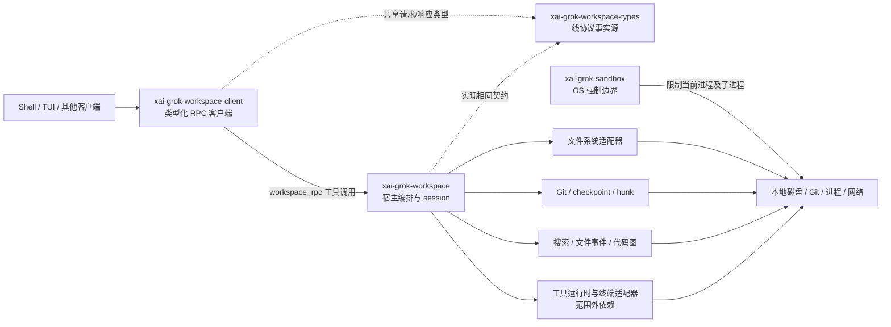
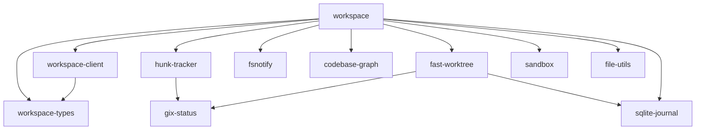
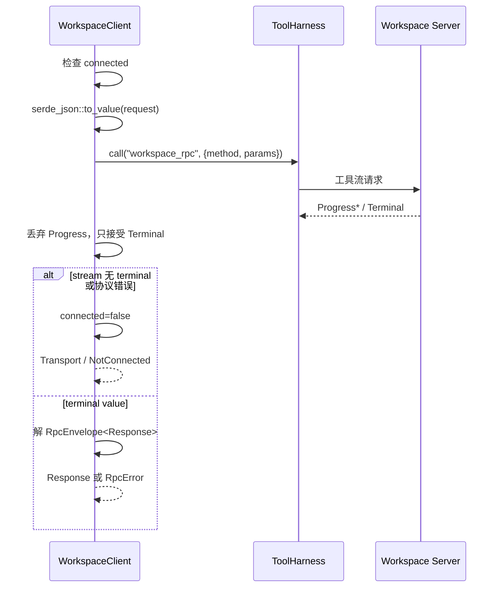
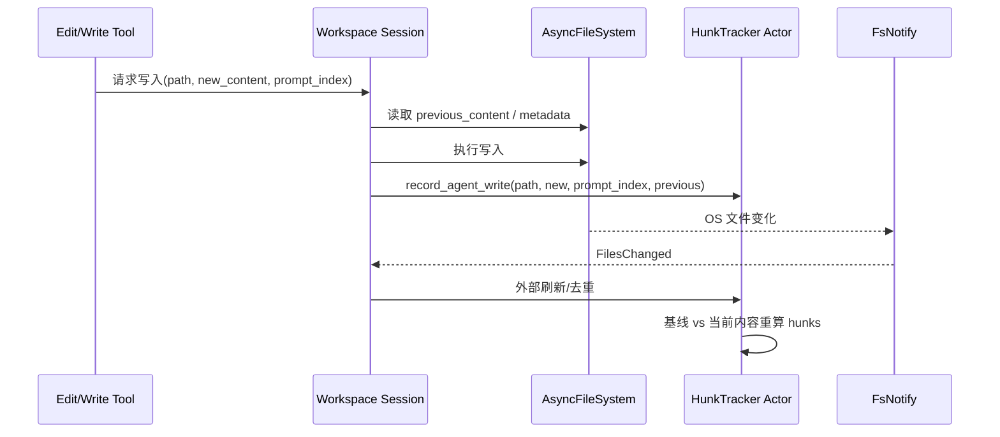
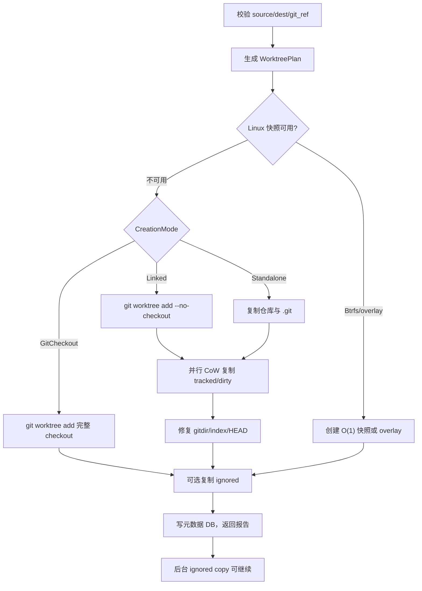
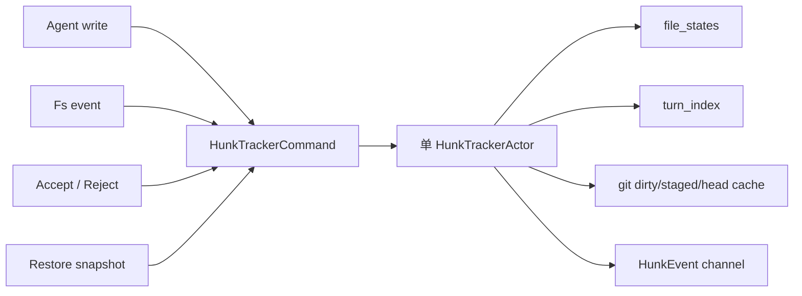
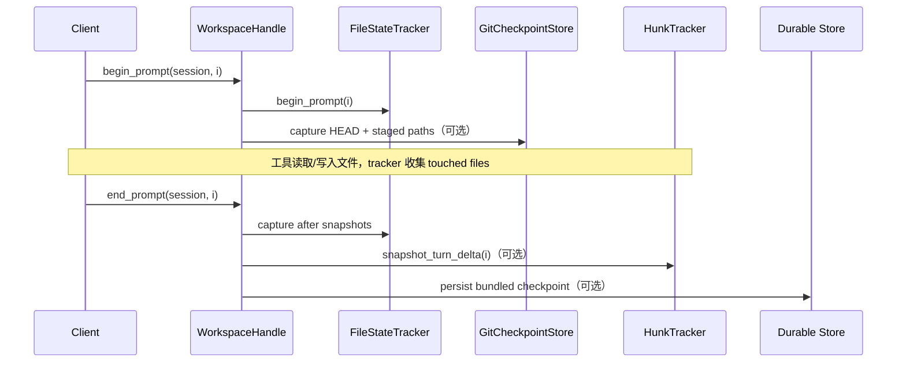
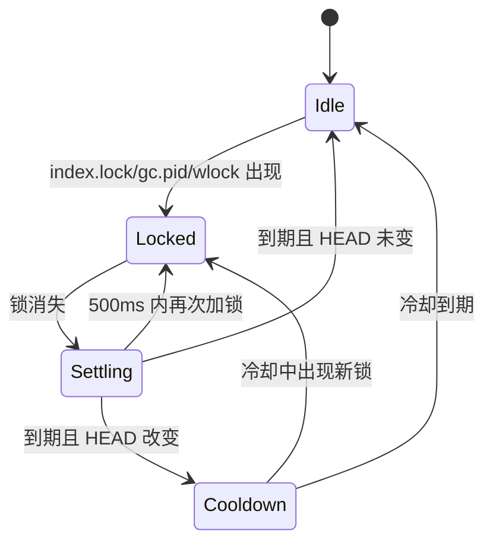
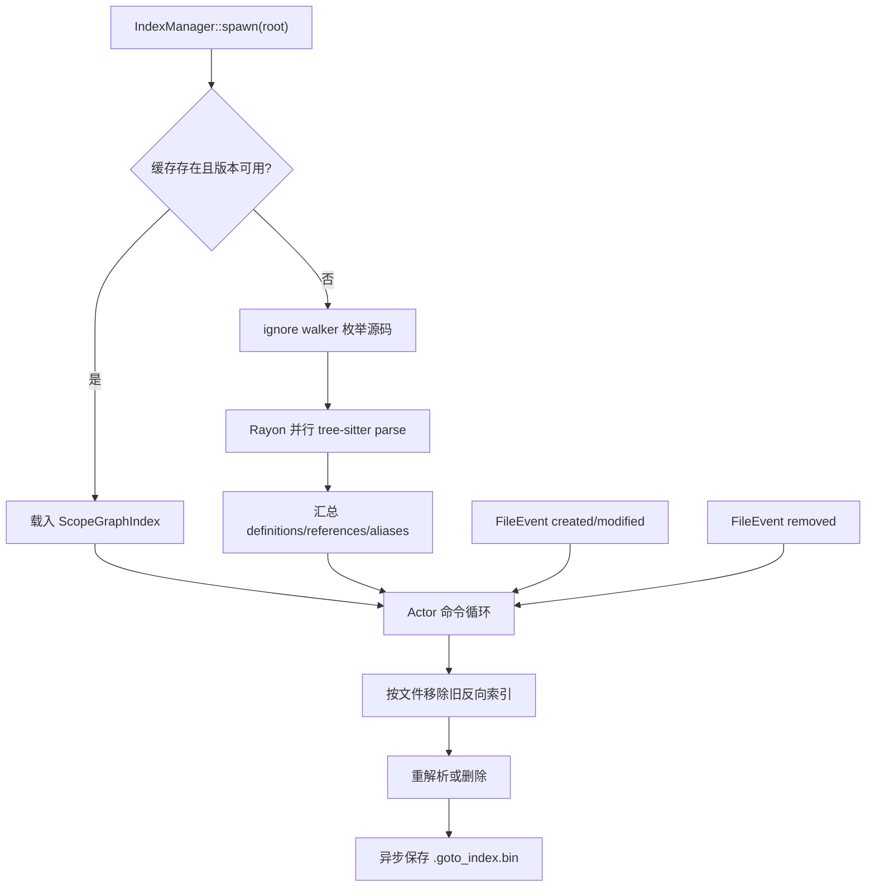
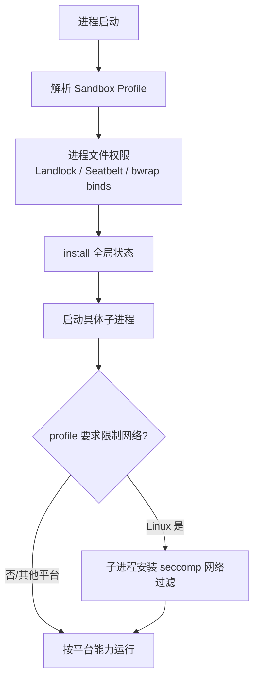

# Workspace、文件、Git、执行与沙箱源码精读

> **全局调用位置**：工具通过 `AsyncFileSystem` 或 `WorkspaceOps` 使用主机能力；远端路径为 `WorkspaceClient::rpc<R> → rpc_raw → ToolHarness::call(workspace_rpc) → WorkspaceOp::execute`。Local/Proxy 关系见 [源码符号关系总览第 13–14 节](12-源码符号关系总览.md#13-workspace-本地与-proxy-双路径)，文件和 RPC 逐函数流程见 [关键调用链第 8–9 节](13-关键调用链逐函数精读.md#8-调用链七工具读取或写入文件)。

> 本文面向第一次接触本工程的读者，也面向希望从零重新实现这套能力的人。
>
> 精读范围仅包含以下 11 个 crate：`xai-grok-workspace`、`xai-grok-workspace-client`、`xai-grok-workspace-types`、`xai-grok-sandbox`、`xai-file-utils`、`xai-fast-worktree`、`xai-gix-status`、`xai-hunk-tracker`、`xai-fsnotify`、`xai-codebase-graph`、`xai-sqlite-journal`。

---

## 1. 先建立整体认识

这组代码解决的不是简单的“读写几个文件”，而是一个 Agent 如何安全地操作真实工程：

1. 客户端怎样用稳定的类型化协议请求宿主能力。
2. Workspace 怎样为不同 session 组织文件系统、Git、工具和事件。
3. Agent 修改文件以后，怎样知道哪一段代码属于哪一轮 prompt。
4. 用户怎样接受、拒绝或回退部分修改。
5. 怎样创建隔离 worktree，同时保留源工作区需要的脏文件和忽略文件。
6. 怎样监听文件和 Git 操作，又不被一次 rebase 产生的事件风暴淹没。
7. 怎样建立代码定义/引用索引并增量更新。
8. 怎样在 Linux/macOS 上限制文件访问和子进程网络。
9. 怎样在退出、断网、锁竞争、共享盘、半完成复制等失败场景下恢复。

可以把它理解成 Agent 与操作系统之间的“宿主能力层”。



### 1.1 最重要的架构结论

- `xai-grok-workspace-types` 是网络边界的事实源，不能依赖宿主实现。
- `xai-grok-workspace-client` 只负责传输、超时、连接状态和解码，不实现业务。
- `xai-grok-workspace` 是编排层：把 RPC 映射到 session、FS、Git、索引和工具运行时。
- `xai-hunk-tracker` 用 actor 独占可变状态，维护“基线、当前内容、hunk、prompt 归因”。
- `xai-fsnotify` 只产生语义化文件事件；Git 信息补全由 workspace 层完成。
- `xai-fast-worktree` 是阻塞型高性能复制引擎，异步调用方必须用 `spawn_blocking`。
- `xai-grok-sandbox` 的文件隔离是进程级且不可逆；子进程网络限制是另一条单独路径。
- `xai-sqlite-journal` 决定 SQLite 在本地盘或网络盘上的安全打开方式。
- 通用命令/PTY 引擎不在这 11 个 crate 内；这里负责能力过滤、适配与沙箱，不应重复实现终端内核。

---

## 2. 阅读地图与符号说明

### 2.1 推荐阅读顺序

| 顺序 | crate | 先读的入口 | 读完应该理解什么 |
|---|---|---|---|
| 1 | `xai-grok-workspace-types` | `src/lib.rs`、`src/rpc/mod.rs`、`src/rpc/envelope.rs` | 线协议、方法名、错误 envelope |
| 2 | `xai-grok-workspace-client` | `src/lib.rs` | 类型化调用怎样变成 hub tool stream |
| 3 | `xai-grok-workspace` | `src/lib.rs`、`src/handle.rs`、`src/workspace_ops.rs` | 服务编排、session 与 RPC 执行 |
| 4 | `xai-grok-workspace` 文件模块 | `src/file_system/mod.rs`、`fs.rs`、`adapter.rs` | FS 抽象与 local/ACP/client 适配 |
| 5 | `xai-hunk-tracker` | `src/types.rs`、`src/actor/mod.rs`、`src/handle.rs` | 变更归因和 actor 模型 |
| 6 | `xai-grok-workspace` checkpoint | `src/session/checkpoint.rs`、`file_state.rs`、`git.rs` | 跨 FS/Git/hunk 的 rewind |
| 7 | `xai-fast-worktree` | `src/lib.rs`、`api.rs`、`worktree/execute.rs` | 快速隔离工作区的创建与清理 |
| 8 | `xai-fsnotify` | `src/event.rs`、`source.rs`、`state.rs` | 文件事件和 Git 锁状态机 |
| 9 | `xai-codebase-graph` | `src/index_manager.rs`、`scope_graph/graph.rs` | tree-sitter 索引与增量更新 |
| 10 | `xai-grok-sandbox` | `src/lib.rs`、`profiles.rs`、`deny/mod.rs` | OS 隔离、安全降级与拒绝启动 |
| 11 | `xai-file-utils`、`xai-sqlite-journal` | `events/*`、`queue.rs`、`storage_client.rs`、`lib.rs` | 本地事件、上传队列和数据库安全 |

### 2.2 本文使用的标记

- **事实源**：该状态的权威持有者，其他副本都可丢弃重建。
- **派生状态**：从事实源计算出的缓存、索引或摘要。
- **线协议**：跨进程发送的 JSON 形状及其兼容规则。
- **本地模式**：调用方与 Workspace 在同一进程，直接执行 `WorkspaceOp::execute`。
- **代理模式**：请求序列化后经 hub 的 `workspace_rpc` 工具转发。
- **阻塞 I/O**：不能直接占用 Tokio 异步执行线程，应进入 `spawn_blocking`。
- **fail closed**：无法证明安全时拒绝执行，而不是降低保护继续运行。

### 2.3 事实、推断与范围边界

本文的结构、类型、状态机和失败处理均来自上述 crate 的 Cargo、生产源码和测试。需要特别注意：

- 通用 PTY/终端实现位于 `xai-acp-lib`、`xai-tool-runtime`、`xai-tty-utils` 等依赖中，不属于本次源码范围。
- 本范围内能看到的是 Git、ripgrep、bwrap 等具体子进程，以及 Workspace 对终端能力的配置和权限控制。
- 因此重实现时应提供一个 `TerminalPort`/`CommandRunner` 接口，再接入独立终端实现；不要把 PTY 状态机塞进 Workspace。

---

## 3. 11 个 crate 的职责和依赖

| crate | 核心职责 | 主要第三方框架 | 明确不负责 |
|---|---|---|---|
| `xai-grok-workspace-types` | 请求、响应、chunk、event、错误与身份类型 | `serde`、`serde_json`、`chrono`、`base64` | I/O、Tokio actor、Git 实现 |
| `xai-grok-workspace-client` | 类型化 RPC、连接存活标记、可选 deadline | `tokio`、hub SDK、tool runtime | 文件和 Git 业务 |
| `xai-grok-workspace` | session、FS/VCS、RPC dispatch、权限、索引、恢复、上传编排 | `tokio`、`git2`、`gix`、`rusqlite`、ACP/tool runtime | 通用 UI、完整 PTY 内核 |
| `xai-grok-sandbox` | Landlock/Seatbelt、bwrap、deny profile、子进程网络政策 | `nono`、`globset`、`libc` | 应用级权限提示、身份认证 |
| `xai-file-utils` | 事件 JSONL、对象存储、上传队列、断路器 | AWS S3 SDK、GCS、`reqwest`、Tokio | Workspace 文件编辑抽象 |
| `xai-fast-worktree` | CoW/Btrfs/overlay/git worktree 创建、同步、GC、元数据 DB | `gix`、`reflink-copy`、`crossbeam`、`rusqlite` | session 对话生命周期 |
| `xai-gix-status` | 限制 gix status 并行线程预算 | `gix`、Unix `libc` | Git 命令业务 |
| `xai-hunk-tracker` | diff、hunk、归因、接受/拒绝、快照 | `similar`、`gix`、Tokio actor | OS 文件监听 |
| `xai-fsnotify` | 共享 watcher、去抖、Git 锁语义事件 | `notify`、`notify-debouncer-full`、`git2` | hunk 重算和 Git 信息补全 |
| `xai-codebase-graph` | tree-sitter scope graph、定义/引用查询、缓存 | `tree-sitter`、`petgraph`、`rayon` | LSP 协议服务器 |
| `xai-sqlite-journal` | 根据文件系统选择 SQLite journal 和文件路径 | `rusqlite`、平台文件系统 API | 表结构和业务查询 |



---

## 4. RPC 与共享类型

### 4.1 为什么单独拆 `workspace-types`

客户端和服务端必须对同一个 JSON 有相同理解。若请求类型定义在服务端 crate，轻量客户端就会被迫依赖 Git、SQLite、Tokio 和宿主代码。`xai-grok-workspace-types` 只保留纯数据，因此可以成为稳定的协议层。

核心抽象位于 `xai-grok-workspace-types/src/rpc/mod.rs`：

```rust
pub trait WorkspaceRpc {
    const METHOD: &'static str;
    type Response;
}
```

每个请求类型同时声明固定方法名和响应类型。例如：

```rust
impl WorkspaceRpc for FsReadFileReq {
    const METHOD: &'static str = "workspace.fs_read_file";
    type Response = FsReadFileData;
}
```

这样，调用处不能把 `git_diff` 的结果误解码成 `FsListData`。但它只提供编译期关联，真正的跨版本兼容仍依赖 `serde` 规则。

### 4.2 Envelope

RPC 结果不是直接裸值，而是 `RpcEnvelope<T>`：成功时包含 `data`，失败时包含结构化 `RpcError`。客户端调用 `into_result()` 将其变成 Rust `Result<T, RpcError>`。

这种包装解决三个问题：

- 传输成功不等于业务成功。
- 服务端错误可携带稳定 code/message/details。
- 客户端先解 envelope，再解业务响应，错误边界清晰。

### 4.3 主要 RPC 家族

| 家族 | 代表方法 | 说明 |
|---|---|---|
| Workspace | `workspace.info`、`load_project_config`、`load_permissions` | 宿主信息和配置 |
| 文件 | `put_files`、`get_files`、`fs_list`、`fs_read_file`、`fs_write_file`、`fs_delete_file` | 批量和单文件能力 |
| Git | `git_status_ext`、`git_diff`、`git_stage`、`git_commit`、`git_sync_base` | VCS 操作 |
| Worktree | `create_worktree`、`worktree_create_sync`、`apply_worktree`、`worktree_gc` | 隔离工作区生命周期 |
| Hunk | `hunk_action`、`hunk_file_action`、`hunk_turn_action`、`get_all_hunks` | 变更审阅 |
| Rewind | `begin_prompt`、`end_prompt`、`rewind_to` | prompt 边界和恢复 |
| 搜索 | `ripgrep`、`fuzzy_open/change/close` | 内容和文件搜索 |
| 代码导航 | `code_goto_definition`、`code_find_references`、`code_index_status` | scope graph 查询 |

完整方法清单应以各 `src/rpc/*.rs` 中的 `const METHOD` 为准，而不是手工维护字符串列表。

### 4.4 协议兼容规则

源码大量使用以下策略：

- 新增可选字段时使用 `#[serde(default)]`。
- 不发送无意义字段时使用 `skip_serializing_if`。
- 枚举使用稳定的 snake_case/camelCase 命名。
- 请求体中旧的 `session_id` 可以为兼容保留，但不再作为可信身份。
- ACP 的复杂外部类型有时暂存为 `serde_json::Value`，避免 types crate 引入重依赖。
- 测试 `tests/wire_round_trip.rs` 验证序列化往返与旧字段兼容。

### 4.5 身份不能信任请求体

`UpdateToolConfigReq`、`DropSessionReq` 等类型中的 `session_id` 已被标注为 deprecated/self-attested。服务端应从 hub 绑定的 envelope 中取得调用 session，仅在旧调用路径没有 envelope session 时兼容回退。

这是重要安全原则：

```text
可信：连接建立时由服务端/hub 绑定的身份
不可信：客户端在 JSON params 中自行填写的 session_id
```

### 4.6 客户端调用流程

`WorkspaceClient` 持有：

- `ToolHarness`：实际发送 `workspace_rpc` 工具调用。
- `Arc<AtomicBool>`：克隆客户端共享的连接状态。
- `Option<Duration>`：可选的整次调用 deadline。



默认不设置超时，保持旧 `rpc_raw` 语义；调用方可以通过 `with_deadline` 让 deadline 覆盖 dispatch 和整个 stream 消费过程。致命网络错误会把共享连接标记设为 false，后续调用快速失败；重连回调必须显式 `mark_connected()`。

---

## 5. Workspace 核心架构

### 5.1 `WorkspaceHandle` 是门面，不是全局可变大对象

`xai-grok-workspace/src/handle.rs` 是主入口。它把进程共享资源与每 session 状态关联起来，对外暴露操作方法。内部使用 `Arc`、并发 map、Tokio channel、任务追踪器和 session actor，避免调用者直接持有底层状态。

可把内部划分为：

| 层 | 责任 |
|---|---|
| `WorkspaceShared` | 工作区根、共享索引、上传队列、活动状态、全局配置 |
| `WorkspaceSession` | session cwd、FS、hunk tracker、checkpoint、工具配置 |
| `WorkspaceHandle` | 查找 session、授权入口、跨域编排、生命周期 |
| `WorkspaceOp` | 单个 RPC 的本地业务实现 |
| `workspace_ops.rs` | wire 类型与内部类型转换、所有操作 execute 实现 |

### 5.2 本地模式与代理模式统一

`WorkspaceOp` 同时继承 `WorkspaceRpc`，并提供：

```rust
async fn execute(
    &self,
    ws: &WorkspaceHandle,
    session_id: Option<&str>,
) -> WorkspaceResult<Self::Response>;
```

- 本地模式：直接调用 `execute()`。
- 代理模式：同一请求按 `METHOD` 和 JSON 发送到服务端，服务端再执行同一逻辑。

这避免维护两套“本地功能”和“远程功能”。新功能的正确加入方式是：先定义 wire request/response，再实现 `WorkspaceOp`，最后在 dispatch 表注册。

### 5.3 Session 是隔离和归因的基本单位

每个 session 至少关联：

- 自己的 cwd，可能是主工作区，也可能是独立 worktree。
- 一个 `AsyncFileSystem` 实现。
- 一个 `HunkTrackerHandle`。
- 文件 rewind tracker。
- Git checkpoint store。
- hunk 增量 checkpoint。
- 工具定义与 capability mode。
- 可选事件 writer 和上传上下文。

不要用“全局当前目录”实现 session。测试里对 process cwd 和环境变量都需要串行锁，正说明它们是危险的进程级状态。

### 5.4 能力模型不是简单布尔值

`CapabilityMode` 定义四种能力：

- `ReadOnly`：读和搜索；不能编辑、shell 或后台任务。
- `ReadWrite`：读和编辑；不能 shell。
- `Execute`：读、shell、后台任务；不能编辑。
- `All`：全部能力。

`ReadWrite` 与 `Execute` 互不包含。子 session 必须满足 `child <= parent`，且工具定义在 session 建立时被过滤。只有隐藏按钮不算安全，服务端工具集合必须真的移除不允许的能力。

---

## 6. 文件系统抽象、读写与编辑

### 6.1 统一 FS 接口

`xai-grok-workspace/src/file_system` 把文件操作抽象为同步/异步接口，再提供多个后端：

| 实现 | 用途 |
|---|---|
| `LocalFs` | 直接操作宿主本地磁盘 |
| `AcpSessionFs` / `AcpFsAdapter` | 通过 ACP 客户端访问远端文件系统 |
| `ClientFs` | 反向调用客户端暴露的 FS RPC |
| `ExtFs` | 对工具侧接口做扩展适配 |
| `MockFs` | 测试 |

上层只依赖 `AsyncFileSystem`/wrapper，不应在业务逻辑里随意调用 `tokio::fs`。这样同一个 edit/read 工具才能在本地、远端和测试环境工作。

### 6.2 路径处理

路径安全至少需要以下步骤：

1. 明确路径相对哪个 session cwd 解释。
2. 将协议字符串转换为路径类型。
3. 规范化 `.`、`..` 和平台分隔符。
4. 对真实访问路径处理 symlink/canonicalization。
5. 检查路径是否仍在授权根内。
6. 在写入前保留旧内容，供 hunk attribution 和 rewind 使用。

`FlexiblePath` 优先保存相对 session cwd 的 `RelPathBuf`，以便 checkpoint 跨机器或 worktree 迁移；旧版本绝对路径仍能反序列化。新实现应把路径根和路径本身分开建模，不要把任意字符串直接拼接给 OS。

### 6.3 文件读取的状态不能只用 `Option<String>`

Hunk 模块给出了更可靠的模型 `FileContentState`/`FileContentView`：

| 状态 | 含义 | 是否有文本 |
|---|---|---|
| `Missing` | 文件不存在 | 否 |
| `Binary` | 检测到 NUL 等二进制特征 | 否 |
| `TooLarge` | 超出保留上限 | 否，仅大小 |
| `LfsPointer` | Git LFS 指针与工作副本不等价 | 否 |
| `Symlink` | 符号链接，不按普通文本 diff | 否 |
| `Full` | 可安全 diff 的文本 | 是 |

`None` 无法区分上述五种情况，容易在恢复时删除真实文件或把二进制当成空文件。

### 6.4 写入与编辑的正确调用链



关键点是直接工具写入必须主动通知 hunk tracker，不能只等待 OS watcher。Watcher 事件不携带 prompt identity，只能被视作 external；若仅依赖 watcher，agent 修改会被错误归因给用户。

### 6.5 批量 `put_files/get_files`

线协议支持批量文件传输，内容可用 base64 表达，适合远端 workspace。实现时应保证：

- 单个文件失败可被准确定位。
- 限制总大小和单文件大小。
- 写入目标路径经过根目录检查。
- 不把部分成功错误包装成整体成功。
- 必要时使用临时文件加 rename，避免留下半文件。

### 6.6 搜索不是文件读取的附属功能

内容搜索由 `file_system/content.rs` 启动 ripgrep，并要求 JSON 输出。实现过程：

1. 构造 `rg --json` 参数，包括 cwd、glob、大小/数量限制。
2. 异步读取 stdout 行。
3. 解析 begin/match/end 等 JSON 事件。
4. 按文件聚合 match 和 byte span。
5. 达到批次阈值或时间阈值时回调通知。
6. 进程退出后发送最后一批并返回统计。

文件名模糊搜索使用独立的 open/change/close 生命周期和 generation/query version，避免旧查询结果覆盖新输入。

---

## 7. 命令执行与 PTY：本范围内和范围外

### 7.1 本范围内实际存在的进程调用

这 11 个 crate 会直接启动一些受控子进程：

- `git`：status、diff、stage、commit、checkout、stash、fetch、worktree 等。
- `rg`：内容搜索。
- `bwrap`：Linux 重新执行当前进程并建立 mount namespace。
- Btrfs/overlay 相关命令或特权 delegate。

这些调用通常使用 `xai_tty_utils::git_command()` 或 `tokio::process::Command`，显式设置 cwd、stdout/stderr 和参数数组。参数数组比拼接 shell 字符串更能避免注入。

### 7.2 通用 PTY 不在这些 crate 中

源码注释提到 `AcpTerminalAdapter`，但实现来自外部依赖。Workspace 在这里做的是：

- 根据 capability mode 决定 Execute 工具是否存在。
- 构造 session toolset。
- 将 ACP FS/terminal 等适配器注入工具运行时。
- 把 sandbox 和子进程网络政策应用到启动边界。
- 追踪工具事件、取消和 drain。

重新实现时建议定义：

```rust
trait TerminalPort {
    async fn spawn(&self, spec: CommandSpec) -> Result<TerminalSession>;
    async fn write(&self, id: TerminalId, bytes: &[u8]) -> Result<()>;
    async fn resize(&self, id: TerminalId, cols: u16, rows: u16) -> Result<()>;
    async fn kill(&self, id: TerminalId) -> Result<()>;
}
```

Workspace 只依赖此端口。PTY 实现应单独处理进程组、resize、stdin、流式输出、退出码、超时和取消。

### 7.3 子进程安全清单

- 使用 argv，不使用未转义的拼接 shell。
- cwd 必须来自已经授权的 session。
- 清理或白名单化环境变量，Secret 不写日志。
- stdout/stderr 必须有内存或流量上限。
- 取消要传播到进程组，而不仅是 Future。
- Linux 受限 profile 下，在已知 launch path 安装子进程网络 seccomp。
- Git refspec、branch 和 SHA 必须校验；源码明确拒绝不安全 refspec 和缩写 SHA 的部分恢复路径。

---

## 8. Git 操作层

### 8.1 为什么同时使用 Git CLI、`git2` 和 `gix`

| 技术 | 适合任务 | 原因 |
|---|---|---|
| Git CLI | 用户语义操作、checkout/stash/fetch/commit、快速 status | 与用户 Git 行为一致，原生实现对大仓库更快 |
| `git2` | 仓库发现、diff、worktree 元数据等 | 成熟的 libgit2 API |
| `gix` | 并行 status、index、纯 Rust hunk 基线读取 | 避免某些 libgit2 全局限制并支持细粒度控制 |

不是所有 Git 操作都应该强行统一到一个库。重实现时先按语义稳定性和性能选择后端，再用自己的 `GitPort` 隔离。

### 8.2 Git 状态

系统提示使用的 compact status 走 Git CLI，因为源码记录 libgit2 在大仓库上慢 5 到 10 倍。它只展示分支、ahead/behind 和 staged 文件，总文本约限制为 1 KB。

`git status --short --branch` 的原始 stdout 上限为 1 MiB：达到上限时整段丢弃而不是截断，以免把不完整 porcelain 当成完整事实。只读后台 Git 命令使用 `--no-optional-locks`，避免刷新 stat cache 时争抢 `index.lock`。

### 8.3 `xai-gix-status` 的线程预算

`gix` 的 parallel status 会创建 producer worker。在 `panic=abort` 环境中，线程创建失败可能终止整个进程。该 crate 根据：

- CPU 数量；
- Unix `RLIMIT_NPROC`；
- 当前线程估算；
- 安全余量；

计算保守的 worker 数，并在低资源时降为串行或更小并行度。它是可靠性适配层，不是 Git 业务层。

### 8.4 Stage、unstage、discard、commit

核心语义：

- stage 支持路径和直接内容。
- unstage 修改 index，不应破坏 working tree。
- discard 是破坏性操作，必须限定目标路径并处理未跟踪文件。
- commit 可选择 stage all，但传统“没有 staged 内容”仍返回错误。
- conversation 分支提交会验证当前分支，push 遇到 non-fast-forward 不会强推。
- sync base 会拒绝脏工作区；冲突时保留 merge in-progress，显式 abort 才回滚。

### 8.5 Checkout 与自动 stash

恢复到某 commit 的流程大致为：

1. 校验目标是安全 OID/ref，不接受可注入 refspec。
2. 若已在目标 commit，直接成功，不制造 stash。
3. 若工作区脏且允许，创建带 session 标识的 stash。
4. 本地没有目标时按受限规则 fetch。
5. checkout 目标。
6. 失败时尽力 pop 自动 stash，不能把用户改动遗留在隐藏 stash 中。
7. 返回是否 checkout、stash ref 和跳过 stash 的原因。

若处于 merge/rebase 等无法安全 stash 的状态，应返回“跳过原因”并保持 Git 不变。

---

## 9. 快速 Worktree

### 9.1 三种创建模式

`xai-fast-worktree::CreationMode`：

| 模式 | 做法 | 优点 | 风险/代价 |
|---|---|---|---|
| `Linked` | `git worktree add --no-checkout` + 并行 CoW 文件复制 + index 收尾 | 大仓库快、共享对象库 | 要正确处理 `.git` gitfile、index、split-index |
| `Standalone` | CoW 复制完整仓库和 `.git` | 可独立移动/替换 | 元数据更多，占用略高 |
| `GitCheckout` | 原生 `git worktree add` 完整 checkout | 语义简单 | 单线程 checkout 较慢 |

Linux 上 Linked/Standalone 会尝试 Btrfs snapshot 或 overlay 优化；无法使用时回退到文件级 CoW/复制。`BtrfsMode` setter 已保留兼容但不再决定新执行逻辑。

### 9.2 源工作区内容策略

`WorkingTreeMode`：

- `PreserveWorkingTree`：复制已修改和未跟踪内容。
- `CleanTracked`：只得到干净 tracked 文件。
- `CleanAll`：再清理 untracked，但默认 Git clean 不移除 ignored。

`IgnoredFilesMode`：

- `Skip`：不复制 ignored。
- `Copy`：worktree 创建后复制 ignored，可加跳过模式。
- `CopyOnly`：只执行 ignored 文件复制，供后台补齐。

### 9.3 创建阶段



`WorktreeBuilder::create()` 是同步阻塞 API。Workspace 从 async 环境调用时必须 `spawn_blocking`，并通过 `CancellationToken` 让复制 worker 尽快停止。

### 9.4 并行复制

复制引擎包含：

- `ignore` walker 负责遵循 gitignore 和跳过规则。
- hash sharding 把路径稳定分给 worker，减少争用。
- `crossbeam` channel 连接扫描者和复制 worker。
- 优先使用 reflink/CoW，失败时可回退普通 copy。
- 单独处理目录、普通文件、symlink 和 `.git` 元数据。
- 收集非致命 issue，返回结构化 `CopyReport`。

取消是协作式的：扫描和 worker 周期检查 token。它不能撤销已经完成的复制，所以失败路径还要负责清理半成品。

### 9.5 并发创建与取消

Workspace 有进程内 `HashSet<session_id>` 加 Tokio mutex，用原子 contains+insert 抢占创建权。它只做同进程 best-effort 去重，不是跨进程锁；真正正确性不能依赖它。

后台 ignored copy 使用：

- `CancellationToken`；
- `BackgroundCopyContext` 的 path -> task map；
- RAII `BackgroundCopyGuard`，无论成功、错误还是 panic，drop 时都注销。

删除 worktree 前先取消后台复制，避免“目录刚删除又被 worker 写回来”。

### 9.6 元数据数据库和 GC

启用 `metadata` feature 后，SQLite 表记录：id、path、source repo、kind、creation mode、git ref、HEAD、session、creator PID、创建/访问时间、alive/dead、JSON metadata。

关键行为：

- `id_from_path` 同时编码 basename 和完整路径 hash，避免不同仓库同名 worktree 冲突。
- register 使用 upsert。
- 路径消失时 `sweep_dead` 标记 dead，不直接假设记录不存在。
- list 默认只列 alive，可按 kind/repo/source 过滤。
- discovery 可以扫描受管根并重建 DB。
- auto-GC 有最小间隔、最大年龄、dry-run 和 rebuild 控制。

数据库是生命周期目录，不是 worktree 存在性的最终事实源；真实路径和 Git 注册仍需核验。

---

## 10. Hunk Tracker 与变更归因

### 10.1 为什么使用 Actor

Hunk 状态同时被以下事件修改：

- Agent 工具写文件。
- OS watcher 报告外部修改/删除。
- Git HEAD/index 改变。
- 用户接受或拒绝 hunk。
- session rewind 或跨 worktree restore。

若多处直接锁多个 map，容易出现 hunk 列表、文件基线和 prompt 索引不一致。`HunkTrackerActor` 独占全部状态，外部通过 mpsc command 和 oneshot reply 访问。



### 10.2 核心状态

- `file_states: Path -> FileHunkState`
- `turn_index: prompt_index -> Set<HunkId>`，用于 O(1) 找某轮 hunk。
- `git_dirty_cache` 与 `git_staged_cache`。
- `git_repo_state`，缓存 Unknown/Repo/NotARepo。
- HEAD OID 和 index mtime，用于判断是否需要刷新基线。
- session accept/reject 统计。

### 10.3 Hunk 的来源

`HunkSource`：

- `AgentEdit { prompt_index }`：工具明确报告的 agent 写入。
- `ExternalEditOnAgentFile`：用户修改了 Agent 已碰过的文件。
- `External`：用户修改其他文件，仅在 `AllDirty` 模式追踪。

`AgentOnly` 默认只关注 Agent 文件；`AllDirty` 会把所有 Git dirty 文件纳入，但忽略 gitignored 文件。

### 10.4 基线选择

计算 hunk 前必须有 baseline：

1. 优先读取 Git HEAD blob。
2. 若 worktree 中目标不在 Git，但工具提供 `previous_content`，以它为基线。
3. 新文件没有旧内容，baseline 为 Missing。
4. symlink、LFS、binary、too-large 不进入普通文本 diff。

Git baseline 优先于工具传来的 previous content，防止调用方的旧快照覆盖版本库事实。

### 10.5 Diff 和稳定 hunk

`similar` 负责文本 diff，内部还维护位置映射和 overlap 匹配。文件变化后不是简单替换所有 HunkId，而是尽量识别内容相同但位置移动的 hunk，发送 `Moved`，使 UI 选择状态和 prompt 归因稳定。

事件类型包括 Added、Removed、Moved、ContentChanged/BaselineUpdated 等。批量文件事件会先 coalesce：同一路径重复 changed 合并，delete/recreate 按最终语义处理，非合并命令仍保持顺序。

### 10.6 Accept 与 Reject

- Accept：把该 hunk 的当前内容吸收到 baseline，并重算剩余 hunk；不写回旧文件。
- Reject：把该 hunk 对应的旧内容应用到当前文件，再重算；可能删除“本轮新建的空余文件”或恢复被删除文件。
- File/Turn/All action：按目标集合批量执行，但每次位置变化都要避免影响后续 hunk。

最危险的 bug 是“接受一个 hunk 后，其他 hunk 的基线偏移”和“拒绝一个 hunk 却覆盖整个文件”。测试专门覆盖多 hunk 顺序接受、混合接受拒绝、相同插入、删除与 prompt 隔离。

### 10.7 快照与增量 delta

完整 `HunkTrackerSnapshot` 保存全部 file state、turn index 和统计，适合跨 session/worktree 转移。

Rewind 使用更小的 `HunkTurnDelta`：只保存某 prompt 涉及的文件快照和该轮 HunkId。恢复到目标 prompt 时按索引升序组合 `< target` 的 delta，同一路径后写覆盖前写，再删除不存在于最终 file states 的悬空 HunkId。

---

## 11. Checkpoint 与 Rewind

### 11.1 三个域、一个 prompt 边界

Workspace 的 rewind 包含三个状态域：

| 域 | 捕获内容 | 权威存储 |
|---|---|---|
| FS | prompt 前后涉及文件的 snapshot | `FileStateTracker` |
| Git | prompt 开始时 HEAD 和 staged path | `GitCheckpointStore` |
| Hunk | 本轮涉及文件与 HunkId delta | hunk checkpoint map |

`WorkspaceHandle::on_turn_boundary` 是统一 fan-out 入口，避免 begin/end 分散到不同调用点而漏掉某个域。

### 11.2 捕获时序



Git 在 begin 捕获，因为目标是“回到这轮开始前”；FS after snapshot 在 end 捕获，用来判断 rewind 时文件是否被外部再次修改。

### 11.3 冲突检测

Rewind 不能盲目覆盖。对每个文件比较：

- `before`：prompt 开始时内容。
- `after`：prompt 结束时内容。
- `current`：执行 rewind 时磁盘内容。

若 current 等于 after，说明此后无人修改，可以恢复 before。若不相等，则分类为：

- `DeletedExternally`
- `CreatedExternally`
- `ModifiedExternally`

冲突文件不应被静默覆盖，响应分别返回 reverted、clean 和 conflicts。

### 11.4 Git soft restore

Git checkpoint 记录 HEAD 与 staged 集合。恢复分两阶段：

1. 必要时安全 stash 当前脏状态，`git reset --soft <recorded HEAD>`，保留工作树内容和 reflog 可达性。
2. 清理 index 后，按 checkpoint 的 repo-root-relative 路径重新 stage。

为什么用 soft reset：prompt 内可能创建了 commit，恢复对话时要退回 HEAD，但不能直接丢掉文件内容；原 commit 仍通过 reflog 可找回。

若 stash 不可执行或 reset 失败，必须恢复 stash并返回失败，不能留下半恢复 Git 状态。

### 11.5 Durable checkpoint

持久化默认受 feature/env 开关控制，关闭时保持内存路径且无磁盘 I/O。持久存储采用：

- session 安全化后的目录名；
- 每 prompt 独立 blob；
- last-write-wins，重复 finalize 幂等；
- cache 与磁盘一起 truncate `>= target`；
- 丢失目录视为空；损坏/不可读 blob 跳过并告警；
- 容量上限和清理策略。

持久镜像不是在线恢复的第二个写主；live session 仍以进程内 tracker 为事实源。

---

## 12. 文件事件系统

### 12.1 从 OS 事件到语义事件

`notify` 原始事件包含大量平台差异和噪声。`xai-fsnotify` 经过去抖和路径分类，只输出：

- `FilesChanged { paths, kind }`
- `GitMetaChanged { kind }`
- `GitOperationStarted`
- `GitOperationCompleted { head_changed }`

所有事件通过同一个 broadcast channel 保持单源因果顺序。多根目录组合和 Git enrichment 放在 Workspace 层。

### 12.2 共享 watcher

进程全局 registry 使用 canonical path -> `Weak<FsEventSource>`：

- 同一目录的多个 session/subagent 共用一个 OS watcher。
- registry 不持有强引用；最后一个订阅者退出后 watcher 自动释放。
- 事件循环运行在注册的进程长生命周期 Tokio runtime，而不是短命 session runtime。
- 暴露 created/reused/live 统计，验证 watcher 数量不会随 session 数无限增长。

### 12.3 Git 锁状态机



`SETTLE_MS = 500ms` 的目的，是把 rebase/squash 每个 pick 的快速锁循环合并成一次操作。操作期间 Git metadata 事件被抑制；普通文件变化仍可被 workspace 缓冲。HEAD 改变后的 cooldown 会丢弃短暂文件事件，因为消费者最终会做一次完整刷新。

锁超过 60 秒只告警一次，不自动假设已失效；大型 `git gc` 可能合法地很慢。

### 12.4 快操作竞态

一次 Git 操作可能在 debounce 窗口内完成，处理事件时 lock 文件已经消失。源码同时检查“当前 lock 是否存在”和“该批次是否包含 lock path 事件”，因此仍能合成 Started -> Settling -> Completed。

`.git`/`.sl` 内部路径只驱动状态机，绝不作为普通 `FilesChanged` 发送。

---

## 13. 搜索与代码索引

### 13.1 两类搜索

- 文本搜索：直接调用 ripgrep，结果真实但每次扫描。
- 代码导航：预建 tree-sitter scope graph，快速查询定义和引用。

模糊文件搜索又是第三类，它维护用户输入驱动的短生命周期查询状态。

### 13.2 Codebase Graph 数据模型

支持 Rust、TypeScript/TSX、JavaScript、Python、Go。每种语言提供 tree-sitter language 和 query。query 捕获：

- scope；
- definition；
- reference；
- import/export alias。

`ScopeGraphIndex` 维护：

- string interner，将重复 symbol/path 压缩为整数 ID；
- symbol -> `(path_id, line)` definitions；
- symbol -> `(path_id, line)` references；
- path -> symbols 的反向索引，用于增量删除；
- alias 双向关系；
- file size/mtime metadata，用于 stale 判断；
- query version，用于语法查询变更后的全量重建。

### 13.3 构建与增量更新



每个 root 的 manager 也使用共享/去重机制。Workspace 的 `CodebaseIndexManager` 保存 `Weak`：首个代码导航请求 lazy-start；同 root session 共享；最后一个强引用释放后可回收。

### 13.4 缓存与锁

缓存文件名为 `.goto_index.bin`/workspace 编码后的 `goto_index.bin`。保存的是 compact index，不保存完整 per-file scope graph；后者需要时从源码重建。

索引锁带 PID/时间等信息，并检查 owner 是否仍存活，用于清理 stale lock。构建失败或缓存损坏时应回退 fresh build，而不是把空索引标成 ready。

### 13.5 查询不是语义编译器

定义/引用查找依靠名字、alias、文件扩展名和上下文排序，不具备完整类型系统。它适合“快速跳转候选”，不能承诺与 rust-analyzer/tsserver 完全一致。API 应返回候选列表和索引状态，不应假装唯一正确答案。

---

## 14. 沙箱与安全边界

### 14.1 两条独立防线



进程需要访问模型 API，所以不能在整个进程级别关闭网络。文件访问由进程级 sandbox 限制；无网络命令在子进程启动路径单独限制。

### 14.2 Profile

`ProfileName` 可选择内建 profile、`Devbox`、`Off` 或 custom。解析结果形成：

- 允许读路径；
- 允许写路径；
- deny 路径/Glob；
- 是否限制网络；
- profile 继承关系。

`SandboxManager` 的生命周期：

1. `new(profile, workspace)`，尚未生效。
2. `apply(workspace)`，解析 profile 并调用内核 primitive。
3. `install()`，记录全局状态和 logger。

文件 sandbox 一旦 apply 即不可逆，不能在同一进程里“切换到更宽 profile”。多安全级别任务需要独立进程。

### 14.3 平台实现

- Linux：`nono` 使用 Landlock；额外可通过 bwrap 重执行建立只读/不可读 bind。
- macOS：`nono` 使用 Seatbelt。
- 非 Unix 或禁用 `enforce`：保留 API，但没有内核强制。
- Linux 子进程网络：在已知 launch path 安装 seccomp。

源码固定 `nono = 0.53.0`，因为 Seatbelt deny 规则发射顺序会影响“先移动再读取”的绕过风险。升级必须在真实 macOS 重跑 E2E。

### 14.4 fail-open 与 fail-closed 的区分

一般“不支持平台”会记录 apply_failed 并继续，这是一种显式降级。但以下场景必须 fail closed：

- profile 明确要求保护 hook 写入，而计划无法构造。
- custom profile 带 read deny，但 deny 解析失败。
- bwrap read-deny placeholder 创建失败。
- hook path 在计划构造后发生 inode/device identity 替换。
- hook 文件变成 symlink/hardlink 或出现计划外晚插入文件。

安全需求是否“必须满足”从原始 profile 配置判断，不能从解析失败后得到的空集合判断；否则错误会把 required deny 变成“没有 deny”。

### 14.5 Glob 的平台差异

`globset` 负责统一验证语法。Linux 对 glob deny 需要在启动时展开现有路径；之后新建的匹配文件不一定被覆盖，因此日志明确标记 best-effort。精确路径比 glob 具有更强保证。

### 14.6 bwrap 重执行

bwrap 命令：

- drop 全部 capability；
- bind `/` 作为基线；
- deny-write 路径用 `--ro-bind`；
- deny-read 路径绑定 mode 000 的占位文件/目录；
- 重新挂载 `/dev`、`/proc`；
- 设置内部 marker 防止无限 re-exec；
- 用当前 executable 和原 argv 重启。

占位文件带 PID，避免并发进程互相删除或 chmod。目标类型要匹配文件/目录，否则 bind 失败可能造成保护缺失。

### 14.7 沙箱不是权限系统的替代品

完整防线顺序应是：

```text
身份绑定 -> capability 过滤 -> 操作权限/审批 -> 参数与路径校验
         -> OS 文件 sandbox -> 子进程网络 sandbox -> 审计/事件
```

沙箱只做最后一道 OS 强制，不能判断“这个 session 是否被允许 commit”。

---

## 15. SQLite Journal 策略

### 15.1 为什么网络盘不能默认 WAL

SQLite WAL 依赖 `-shm` 的共享内存和 mmap 协调。NFS、SMB、FUSE 等共享盘可能无法提供 SQLite 假设的锁和共享内存语义。

`xai-sqlite-journal` 的选择：

- 本地文件系统：`WAL`。
- 网络文件系统：`TRUNCATE` rollback journal。
- 可用 `GROK_SQLITE_JOURNAL_MODE` 显式覆盖；拼写错误告警，不静默当成 unset。

### 15.2 每主机数据库文件

只把共享路径切成 TRUNCATE 仍不够：旧版本进程可能打开同一 DB 并把 database-wide journal mode 改回 WAL。网络模式因此把逻辑 DB 路径映射为每主机独立 sibling 文件，使新旧进程物理隔离。

代价是网络盘上的 DB 不再是跨主机共享事实源。对 worktree registry 这是可接受的，因为真实文件系统可重扫重建。

### 15.3 打开流程

1. 找到数据库或最近存在的父目录。
2. 用平台 API 判定 mount/filesystem 类型。
3. 应用 env override 或默认选择。
4. 计算 effective path。
5. 打开连接。
6. 在有 deadline 的重试循环里设置 journal/locking mode。
7. 只读打开设置 `query_only`；缺失 DB 不创建。

测试覆盖暂时 exclusive lock、WAL 到 TRUNCATE 转换、只读拒写、网络路径不碰 legacy WAL 文件和 sidecar 清理。

---

## 16. 本地事件、对象存储和上传队列

### 16.1 `events.jsonl`

`EventWriter` 在 session 目录追加 `events.jsonl`：

- 每行独立 JSON，带 RFC3339 毫秒时间。
- `Arc<Mutex<Option<File>>>` 让 clone 共享同一文件。
- 首次写失败告警，之后抑制重复日志。
- 无法打开时退化为 no-op，不阻断主任务。

`EventTracker` 本身是 `!Send`，只活在 session actor；后台任务只拿 `Clone + Send + Sync` 的 writer。它维护 turn 结束去重、活动工具、权限等待以及跨 turn 的一次性中断标记。

### 16.2 上传队列

`xai-file-utils/src/queue.rs` 是有界异步上传系统，核心机制包括：

- channel 和 semaphore 限制内存与并发。
- 大文件优先 reflink/copy 到 owned snapshot，避免源文件随后变化。
- reference snapshot 带 metadata/hash 校验，过期则跳过。
- channel full/closed 时有受限 inline fallback。
- 每次重试重新解析凭证，支持认证刷新。
- 401/403 等按结构化错误分类为认证/终止，网络/5xx 可重试。
- 认证暂不可用的 item 进入 parked 状态，释放并发 permit，等待 level-triggered 恢复通知。
- drain 后新 enqueue 改走 inline；重复 drain 幂等。
- 退出 drain 有总 deadline，卡住 producer 不能耗尽队列 flush 的全部时间。
- owned snapshot 成功、终止失败或过期后删除；启动时清理孤儿文件和 sidecar。

### 16.3 对象存储抽象

`StorageClient` 为 S3/GCS/HTTP proxy 提供 upload、stream、exists/batch exists 等能力。S3 大对象走 multipart，小对象 single PUT；批量 API 返回部分失败，而不是把第一项错误当作全部结果。

断路器用于避免已知故障依赖被持续打爆。断路器打开通常仍是可恢复状态，队列可等待恢复，而不是永久删除数据。

---

## 17. 并发模型与背压

| 子系统 | 并发模型 | 背压/上限 | 取消 |
|---|---|---|---|
| Workspace RPC | async request + tool stream | 可选 per-call deadline | transport/task cancellation |
| Session/Hunk | 单 actor + mpsc/oneshot | command 合并、事件 channel | actor shutdown token |
| FsNotify | OS watcher线程 + async event loop + broadcast | debounce，channel 256；lag 可观测 | `CancellationToken` |
| Code graph | actor + Rayon build | 共享 root、Weak 回收、worker 数 | manager shutdown |
| Fast worktree | 同步 worker pool + crossbeam | parallelism、channel buffer、shard | 协作式 token |
| Upload queue | Tokio workers + semaphore | queue、bytes、inline permit | drain/deadline |
| Git status | gix/CLI + `spawn_blocking` | RLIMIT 线程预算、输出上限 | task/process timeout |

### 17.1 不要在 async runtime 上做阻塞工作

以下工作必须进入 `spawn_blocking` 或独立 worker：

- 大目录 walk。
- Git/libgit2/gix status。
- reflink/copy 和 Btrfs 操作。
- tree-sitter 全仓解析。
- 同步 SQLite 初始化在高争用路径中的等待。

### 17.2 Broadcast lag

broadcast receiver 落后时会丢旧事件。Workspace 不应假设每个事件都收到；lag 后应触发 rescan/full refresh。事件是“缓存失效提示”，磁盘/Git 才是事实源。

### 17.3 两阶段 drain

Workspace 退出时先标记 draining，再给 producer 有上限的时间结束，然后保留足够预算 flush 上传队列。晚启动 producer仍被 tracker 记录并计为 at-risk；TaskTracker 不永久 close，以便一次 hub eviction 后进程仍可继续服务。

---

## 18. 失败恢复矩阵

| 失败 | 检测 | 恢复/降级 | 不允许的行为 |
|---|---|---|---|
| Hub 连接断开 | stream 无 terminal、network/protocol error | connected=false，重连后重置 | 每次都等待相同死连接 |
| RPC 业务错误 | `RpcEnvelope::Error` | 返回结构化 `RpcError` | 当成 decode error |
| 文件被外部修改 | current != prompt after snapshot | 返回 rewind conflict | 覆盖用户新修改 |
| Hunk actor 事件风暴 | 同路径命令连续到达 | coalesce 后按最终状态重算 | 每个 OS event 全仓扫描 |
| Git lock 风暴 | lock/settling 状态机 | 合并为一次 Started/Completed | 每个 rebase pick 刷新 UI |
| Git checkout 失败 | 非零退出/目标校验失败 | pop 自动 stash，报告原因 | 留下隐藏 stash/半 checkout |
| Worktree 复制取消 | token 检查 | 停 worker，清理半成品/登记 | 把半成品标 alive |
| Worktree DB 损坏 | SQLite 分类/open 失败 | 报告并用 discovery 重建 | 把空 DB 当真实无 worktree |
| 网络盘 WAL 不安全 | mount 分类 | per-host TRUNCATE DB | 多主机共用 WAL `-shm` |
| 索引缓存损坏/旧版本 | load/version 校验 | fresh build | 返回 ready 的空索引 |
| Watcher receiver lag | broadcast Lagged | rescan/full refresh | 假设增量完整 |
| Sandbox 不支持 | support info | 明示降级和事件 | 宣称 sandbox active |
| 必需 deny 构造失败 | profile 原始要求 | 拒绝启动 | 用空 deny 继续 |
| 上传认证失效 | 401/403/credential resolver | park，刷新后重试 | 持 permit 忙等 |
| 退出时 producer 卡死 | drain deadline | 保留 queue flush 预算并返回 outstanding | 无限等待 |

---

## 19. 测试告诉我们的设计意图

测试不是附属代码，它记录了最容易回归的契约。

### 19.1 Wire 测试

- 所有 request/response 往返。
- tagged enum 形状稳定。
- 缺失新增字段可由 default 读取。
- 错误 kind 和 retryability 映射稳定。

### 19.2 Sandbox 测试

- profile 解析、继承和冲突。
- deny glob 在 Linux/macOS 解释一致。
- hook path inode 被替换、symlink swap、hardlink alias 必须拒绝。
- 真实 OS E2E 验证读写 deny；不支持环境可自跳过，但不能替代真实平台测试。

### 19.3 Worktree 测试

- linked/standalone/git checkout 的正确 HEAD 和 dirty state。
- split index、gitdir、symlink、ignored 文件。
- Btrfs/overlay mount、独立写入、卸载和孤儿清理。
- DB 并发打开、journal 竞争、损坏分类、rebuild。

### 19.4 Hunk 测试

- 接受/拒绝单个 hunk 不破坏其他 hunk。
- agent-to-agent 连续编辑保留最新 prompt 归因。
- external edit 不伪装为 Agent。
- binary/too-large/LFS/symlink 状态转换。
- 文件创建、删除、恢复和 staged 标记。
- 批次 coalesce 与 refresh storm。
- rewind delta 只包含目标 turn。

### 19.5 FsNotify 测试

- rename/create/remove 语义。
- `.git` 内部路径不泄漏为普通文件。
- 快速 lock 消失仍产生 Git operation。
- settling 合并、cooldown、长锁一次告警。
- 同 root watcher 共享和最后引用释放。

### 19.6 Code Graph 测试

- 各语言 definitions/references/alias。
- incremental add/modify/delete/rename 与 full rebuild 一致。
- 缓存版本和损坏恢复。
- 同 root manager 去重，Weak 回收。
- line number 上溢时饱和为 `u32::MAX`。

### 19.7 SQLite 与上传队列测试

- WAL/TRUNCATE 转换和锁竞争 deadline。
- 网络模式不打开 legacy WAL 文件。
- parked 任务释放 permit、恢复后上传、超龄删除。
- drain 幂等、timeout 返回 remaining。
- snapshot 在源文件变化后仍保持 enqueue 时内容。

---

## 20. 从零重实现：推荐步骤

不要一开始实现所有优化。下面顺序保证每一步都有可运行闭环。

### 阶段 1：协议和最小 Workspace

1. 建立纯数据 `workspace-types`。
2. 实现 `WorkspaceRpc { METHOD, Response }`。
3. 实现统一 `RpcEnvelope<T>` 和错误 code。
4. 建立 client 的 `rpc_raw`、typed `rpc`、deadline 和连接 latch。
5. 服务端只实现 `workspace.info` 与一个 echo/test RPC。

验收：旧字段缺失仍可解码；业务错误不混成传输错误；断线后快速失败。

### 阶段 2：文件端口

1. 定义 `AsyncFileSystem`。
2. 先实现 `LocalFs` 和 `MockFs`。
3. 加 list/exists/read/write/delete。
4. 引入 root-relative 安全路径类型。
5. 文件读取返回显式 Missing/Binary/TooLarge/Full。
6. 再实现 ACP/client FS adapter。

验收：`..` 和 symlink 不能越界；远端/本地行为一致；部分批量失败可定位。

### 阶段 3：Session 和能力

1. `WorkspaceHandle` 持共享资源。
2. `WorkspaceSession` 持 cwd、FS 和 cancel token。
3. session identity 从可信 envelope 绑定。
4. capability 过滤工具集合。
5. 只提供 `TerminalPort`，暂不实现 PTY。

验收：ReadWrite 不能执行 shell，Execute 不能编辑；子 session 不能升级能力。

### 阶段 4：Git 基础

1. 实现 repo discovery、status、diff。
2. 实现 stage/unstage/discard。
3. 实现 commit 和 branch 校验。
4. 所有 Git argv 参数化，stdout 有上限。
5. 阻塞操作移入 worker。

验收：非 Git 目录、detached HEAD、空 index、大 status、路径含特殊字符均可预测。

### 阶段 5：Hunk actor

1. 只实现文本文件 baseline/current diff。
2. 单 actor 持 `file_states` 与 `turn_index`。
3. Agent write 必须携带 prompt index。
4. 实现 accept/reject 单 hunk。
5. 加 binary/too-large/LFS/symlink。
6. 加 file/turn/all action 和 stable matching。

验收：多 hunk 局部操作不互相污染；external 与 agent attribution 不混淆。

### 阶段 6：Rewind

1. begin 捕获 touched file before。
2. end 捕获 after。
3. current/after 比较后恢复 before。
4. 加冲突分类。
5. 加 Git HEAD/staged checkpoint。
6. 加 hunk per-turn delta。
7. 最后增加 durable mirror。

验收：外部修改绝不被覆盖；失败 Git restore 不留 stash；truncate 三域一致。

### 阶段 7：FsNotify

1. notify + debounce 转 semantic event。
2. canonical root 共享 watcher。
3. broadcast lag 触发 full rescan。
4. 加 Git lock Idle/Locked/Settling/Cooldown 状态机。
5. Workspace 把事件路由到 hunk 和 index。

验收：rebase 只产生一个操作窗口；`.git` 内部事件不进入普通文件列表。

### 阶段 8：Code Graph

1. 先支持一种语言。
2. tree-sitter query 抽取定义/引用。
3. string interner 与双向索引。
4. 文件增删改的反向索引更新。
5. 二进制 cache + version。
6. actor、root 去重、Weak 生命周期。
7. 再增加其他语言和智能排序。

验收：incremental 结果与 full rebuild 相同；坏缓存自动重建。

### 阶段 9：Fast Worktree

1. 先用 `GitCheckout` 得到正确语义。
2. 加 Linked `--no-checkout`。
3. 加 reflink/普通 copy fallback。
4. 加 dirty/untracked/ignored 策略。
5. 加取消与清理 guard。
6. 再加 Standalone、Btrfs、overlay。
7. 最后增加 SQLite registry、discovery 和 GC。

验收：任何阶段失败都不留下 alive 的半成品；源仓库不被修改。

### 阶段 10：Sandbox 与可靠上传

1. 先实现 capability/path validation。
2. 加 profile schema 和 dry-run 解析。
3. 接入 Landlock/Seatbelt。
4. 加 Linux bwrap read/write deny。
5. 加子进程网络 policy。
6. 对必需 deny 采用 fail closed。
7. 最后实现 JSONL、对象存储、有界上传队列和 drain。

验收：真实平台 E2E，不能只测字符串规则；退出时有界等待且报告未完成项。

---

## 21. 建议的重实现接口

```rust
trait WorkspaceService {
    async fn execute<R: WorkspaceRpc>(&self, identity: BoundIdentity, req: R)
        -> Result<R::Response, WorkspaceError>;
}

trait FileSystemPort: Send + Sync {
    async fn read(&self, path: &SafePath) -> Result<FileContent, FsError>;
    async fn write(&self, path: &SafePath, bytes: &[u8]) -> Result<(), FsError>;
    async fn remove(&self, path: &SafePath) -> Result<(), FsError>;
    async fn list(&self, path: &SafePath) -> Result<Vec<FileEntry>, FsError>;
}

trait GitPort: Send + Sync {
    async fn status(&self, cwd: &Path) -> Result<GitStatus, GitError>;
    async fn capture(&self, cwd: &Path) -> Result<GitCheckpoint, GitError>;
    async fn restore(&self, cwd: &Path, cp: &GitCheckpoint) -> Result<RestoreOutcome, GitError>;
}

trait SandboxPort {
    fn resolve(&self, profile: &Profile, root: &Path) -> Result<ResolvedPolicy, PolicyError>;
    fn apply_once(&self, policy: &ResolvedPolicy) -> Result<AppliedSandbox, SandboxError>;
}
```

这些端口把业务编排与第三方技术隔开：Git CLI 可换成其他后端，ACP FS 可换成本地 FS，Landlock 可按平台替换。

---

## 22. 新手常见误区

1. **把 watcher 当事实源**：事件会去抖、丢失和 lag，收到事件后必须重新读磁盘/Git。
2. **把 request.session_id 当身份**：身份必须来自连接 envelope。
3. **用 `Option<String>` 表示文件**：无法区分 missing、binary 和 too-large。
4. **在 Tokio worker 直接复制大仓库**：会阻塞所有异步任务。
5. **认为取消会回滚**：CancellationToken 只停止后续工作，已写内容要显式清理。
6. **接受 hunk 就删除它**：还必须推进局部 baseline 并重算其他 hunk。
7. **Git restore 直接 hard reset**：会破坏用户未提交内容。
8. **所有 SQLite 都用 WAL**：共享盘的 `-shm` 可能不安全。
9. **沙箱 apply 失败仍显示 active**：requested profile 与 applied state 必须分开。
10. **把 PTY 实现在 Workspace**：Workspace 只应依赖 terminal port，PTY 是独立运行时能力。
11. **进程内 mutex 当跨进程锁**：worktree claim 只是本地去重，磁盘操作仍需幂等和校验。
12. **索引查询等同编译器语义**：scope graph 是快速候选，不是完整类型检查器。

---

## 23. 源码事实索引

| 主题 | 首要事实源路径 |
|---|---|
| RPC trait/envelope | `crates/codegen/xai-grok-workspace-types/src/rpc/mod.rs`、`rpc/envelope.rs` |
| 文件/Git/worktree wire | `.../xai-grok-workspace-types/src/rpc/fs.rs`、`git.rs`、`worktree.rs` |
| 客户端 | `crates/codegen/xai-grok-workspace-client/src/lib.rs` |
| Workspace 门面 | `crates/codegen/xai-grok-workspace/src/handle.rs` |
| RPC 本地实现 | `crates/codegen/xai-grok-workspace/src/workspace_ops.rs` |
| 文件抽象 | `crates/codegen/xai-grok-workspace/src/file_system/` |
| Git 实现 | `crates/codegen/xai-grok-workspace/src/session/git.rs` |
| FS/Git/hunk checkpoint | `crates/codegen/xai-grok-workspace/src/session/checkpoint.rs`、`file_state.rs`、`checkpoint_store.rs` |
| Worktree 编排 | `crates/codegen/xai-grok-workspace/src/worktree/mod.rs` |
| 快速复制 | `crates/codegen/xai-fast-worktree/src/worktree/execute.rs`、`copy/engine.rs` |
| Hunk 状态 | `crates/codegen/xai-hunk-tracker/src/types.rs`、`actor/` |
| 文件事件 | `crates/codegen/xai-fsnotify/src/source.rs`、`state.rs`、`event.rs` |
| 代码索引 | `crates/codegen/xai-codebase-graph/src/index_manager.rs`、`scope_graph/graph.rs` |
| Sandbox | `crates/codegen/xai-grok-sandbox/src/lib.rs`、`profiles.rs`、`deny/` |
| 上传/事件 | `crates/codegen/xai-file-utils/src/events/`、`queue.rs`、`storage_client.rs` |
| SQLite journal | `crates/codegen/xai-sqlite-journal/src/lib.rs` |
| gix 线程预算 | `crates/codegen/xai-gix-status/src/lib.rs` |

---

## 24. 最终心智模型

读完整组源码后，最值得保留的不是某个函数，而是以下边界：

```text
协议类型定义“能请求什么”
可信 envelope 定义“谁在请求”
Capability/permission 定义“允许做什么”
Workspace 定义“把请求交给哪个 session 和哪个端口”
FS/Git/Terminal 适配器定义“怎样触达宿主”
Hunk/checkpoint 定义“怎样归因、审阅和恢复”
FsNotify/Index 定义“怎样维护可重建的派生状态”
Sandbox 定义“即使上层出错，OS 最终不允许什么”
Queue/journal/drain 定义“失败和退出时怎样不悄悄丢数据”
```

重新实现时，应先保证协议、身份、路径、事实源和失败语义正确，再加入 CoW、并行索引、共享 watcher、Btrfs 和后台上传等优化。优化可以晚到，边界错误通常很难补救。
