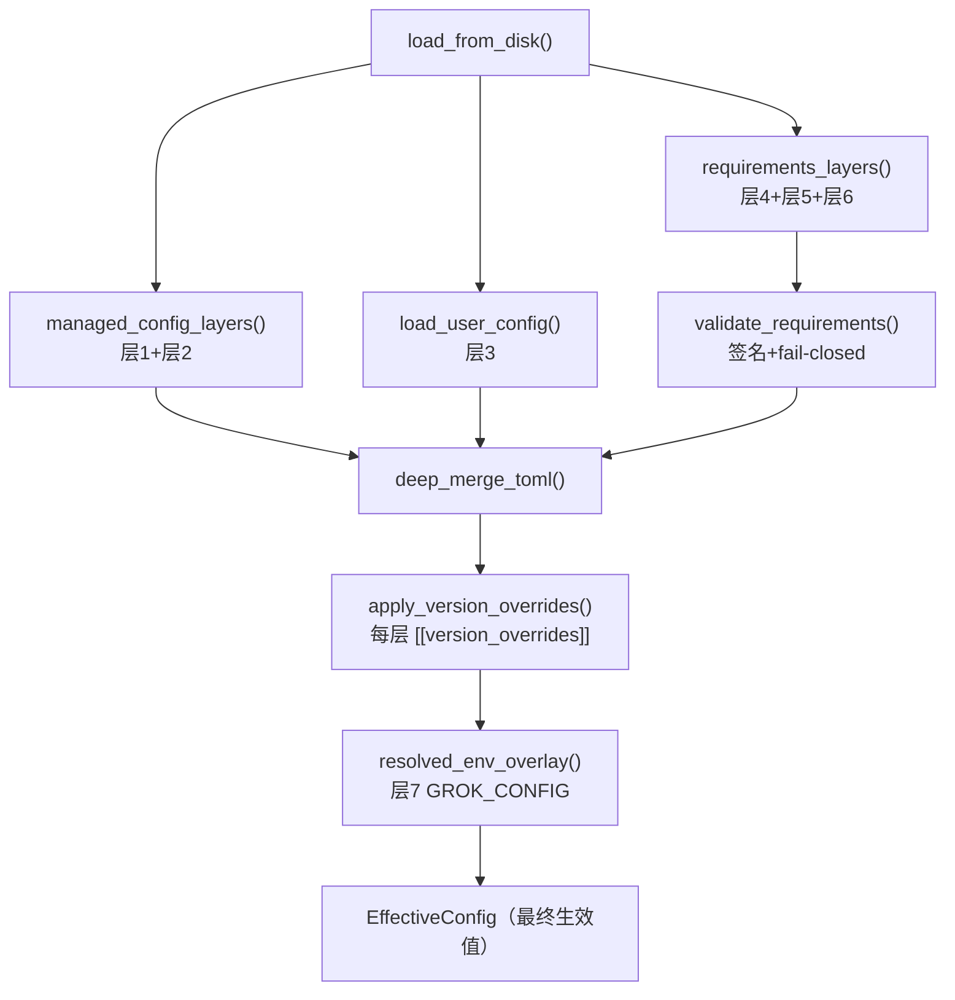
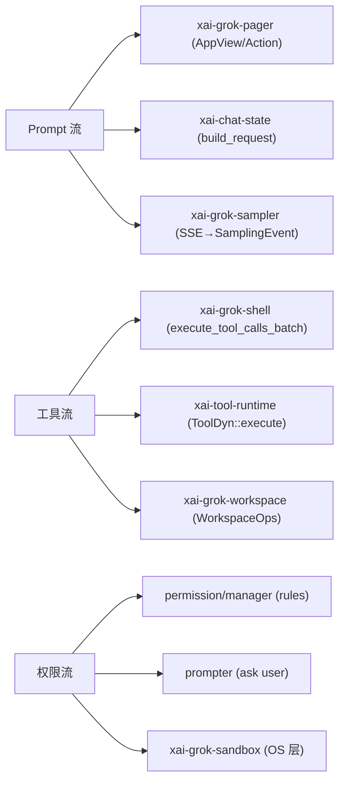

[上一篇：API 与接口设计](05-API与接口设计.md) · [总目录](README.md) · [下一篇：程序入口与运行模式](07-程序入口与运行模式.md)

# 配置与数据流：从磁盘到屏幕的合并与流向

> **场景**：一条 `GROK_CONFIG='{"model":"grok-4.1"}' grok` 启动后，模型从哪来、会话历史写到哪、一次 Prompt 的文本怎样穿过各层最终变成屏幕上的字。本文把「配置从哪来、怎么合并、运行时数据谁写谁读」一次讲清。
> **时间**：采样于 2026-08-25（CST），工作区 `HEAD = 940ce403`。
> **工具版本**：Rust `1.94.0`（`rust-toolchain.toml:11`）；配置核心 crate `xai-grok-config` / `xai-grok-config-types`。

> **阅读说明**：本文讲**调用关系与数据流**，不把行号当稳定 API。行号来自当前工作区快照，随版本变化；若你本地已有后续修改，**以当前源码为准**。每个关键结论都给出 `crate/path:line` 源码索引，便于定位与复现。`config.toml` 是用户层，企业与 MDM 层压在它之上——不要假设「本地文件就是最终生效值」。

---

### 本文件内容

1. [Why：配置为什么必须分层](#1-why配置为什么必须分层)
2. [配置合并顺序（全链路）](#2-配置合并顺序全链路)
3. [路径系统：grok_home 与会话目录](#3-路径系统grok_home-与会话目录)
4. [环境变量覆盖：GROK_* 家族](#4-环境变量覆盖grok_-家族)
5. [各层职责与关键符号](#5-各层职责与关键符号)
6. [会话数据与磁盘布局](#6-会话数据与磁盘布局)
7. [运行时数据流：Prompt / 工具 / 权限三条链](#7-运行时数据流prompt--工具--权限三条链)
8. [事实源表：每类数据唯一写入者](#8-事实源表每类数据唯一写入者)
9. [失败与边界](#9-失败与边界)
10. [本文件结论](#10-本文件结论)

其余阶段见[总目录](README.md)。

---

## 1. Why：配置为什么必须分层

Grok 同时被四种人控制，且优先级不能颠倒：

- **企业 IT**：通过 `/etc/grok/managed_config.toml` 与 macOS MDM 强制策略，保证全公司行为一致。
- **团队管理员**：通过 `$GROK_HOME/managed_config.toml`（托管缓存）下推策略。
- **用户本人**：`$GROK_HOME/config.toml` 写个人偏好。
- **云侧 / 设备策略**：`requirements.toml`（Ed25519 签名）下发「最低版本 / 必开能力」。

如果只有「一个 `config.toml`」，企业策略就无法压过用户偏好，设备合规也无法强制。所以分层不是为了「多几个 toml」，而是为了**让高信任层在不改低信任层文件的前提下覆盖它**。合并规则写在 `crates/codegen/xai-grok-config/src/lib.rs:1-14`，读这段模块注释就能拿到权威顺序。

---

## 2. 配置合并顺序（全链路）

### 2.1 优先级（低 → 高）

```text
┌──────────────────────────────────────────────────────────────────────────┐
│ 层1  /etc/grok/managed_config.toml       系统托管（企业 IT，OS 保护目录）  │
│ 层2  $GROK_HOME/managed_config.toml      团队托管缓存（同步下发）          │
│ 层3  $GROK_HOME/config.toml              用户配置（最常被手改）            │
│ 层4  $GROK_HOME/requirements.toml       云端缓存，Ed25519 签名（落盘即验）│
│ 层5  /etc/grok/requirements.toml         系统级签名策略                    │
│ 层6  macOS MDM「ai.x.grok」              仅 macOS，admin 强制              │
│  ── 以上为磁盘层，以下为运行时覆盖（最高优先级）──                          │
│ 层7  GROK_CONFIG（内联 JSON）/ GROK_CONFIG_PATH（文件）开发者临时覆盖      │
└──────────────────────────────────────────────────────────────────────────┘
       ↑ 数字越大优先级越高；同名 key 被高层整表覆盖（deep_merge_toml）
```

> 来源：`crates/codegen/xai-grok-config/src/lib.rs:3-14`。注意 `requirements.toml` 在两处出现（层4/层5），它**签名校验通过后**才参与合并，且可「fail-closed」让启动直接失败（见 §5、§9）。

### 2.2 合并调用链（谁调用谁）



| 序号 | 动作 | 内部调用链（`file:line`） | 说明 |
|---|---|---|---|
| 1 | 收集托管层 | `managed_config_layers()`（`loader.rs:137`）/ `load_managed_config()`（`loader.rs:100`）/ `load_system_managed_config()`（`loader.rs:115`） | 层1、层2 |
| 2 | 收集用户层 | `load_config_file(USER_CONFIG_FILENAME)` — `loader.rs` | 层3，`USER_CONFIG_FILENAME = "config.toml"` |
| 3 | 收集签名层 | `requirements_layers()` → `validate_requirements()` — `crates/codegen/xai-grok-config/src/validation.rs` | 层4/5/6，先验签再合并 |
| 4 | 逐层版本覆盖 | `apply_version_overrides_with_registered()` — `version_overrides.rs` | 每层先跑自己的 `[[version_overrides]]` |
| 5 | 深层合并 | `deep_merge_toml()` — `loader.rs` | 同名表递归合并，标量高层覆盖低层 |
| 6 | 运行时覆盖 | `resolved_env_overlay()` — `crates/codegen/xai-grok-config/src/env_overlay.rs:76-84` | 层7，`GROK_CONFIG` 内联 JSON 优先于 `GROK_CONFIG_PATH` 文件 |

> `MANAGED_CONFIG_FILENAME = "managed_config.toml"`、`REQUIREMENTS_FILENAME = "requirements.toml"`、`USER_CONFIG_FILENAME = "config.toml"` 三个常量在 `crates/codegen/xai-grok-config/src/loader.rs:92-98` 导出（注意 `loader.rs:55-62` 实为 TOML 解析错误的 `line_col` 辅助函数，并非加载器）。

---

## 3. 路径系统：grok_home 与会话目录

### 3.1 grok_home 的两条来源

- `default_grok_home()` / `grok_home()` / `user_grok_home()` 来自 `xai-grok-home`（被 `paths.rs` 重导出）：`crates/codegen/xai-grok-config/src/paths.rs:5`。
- 默认 `~/.grok`；可用环境变量 `GROK_HOME` 整体覆盖（`crates/codegen/xai-grok-pager/src/app/session_startup.rs:618` 读取 `GROK_HOME`）。
- 系统目录：`system_config_dir()` 在 Unix 返回 `/etc/grok`，Windows 返回 `None`：`paths.rs:25-31`。

### 3.2 会话目录：按 CWD 隔离

会话历史按「当前工作目录」分桶，保证不同项目不串数据：

```text
$GROK_HOME/
├── config.toml
├── managed_config.toml
├── requirements.toml
├── sessions/                              ← 每个 CWD 一个子目录
│   ├── %2FUsers%2Ffoo%2Fproject/         ← 短路径：URL 编码，可读可还原
│   │   ├── chat_history.jsonl            ← 对话增量日志（generation-aware）
│   │   ├── metadata.json
│   │   └── memory.sqlite                 ← xai-grok-memory 向量库
│   └── my-app-a1b2c3d4e5f6a7b8/          ← 长路径：{slug}-{blake3 前16}
│       ├── .cwd                          ← 原路径回写，decode 用
│       └── ...
└── debug/                                ← GROK_DEBUG_LOG=1 的 per-session 日志
```

关键符号（`paths.rs`）：

| 函数 | 行号 | 作用 |
|---|---|---|
| `sessions_cwd_dir(cwd)` | `paths.rs:149-157` | 拼出 `grok_home()/sessions/{encode_cwd_dirname(cwd)}`，**不建目录** |
| `encode_cwd_dirname(cwd)` | `paths.rs:70-84` | 短路径 URL 编码；>255 字节改用 `{slug}-{blake3_hex16}`（≤57 字节） |
| `decode_cwd_from_dirname(dir)` | `paths.rs:91-105` | 先 URL 解码，失败读 `.cwd` 元数据文件还原原路径 |
| `ensure_sessions_cwd_dir(cwd)` | `paths.rs:164-194` | 建目录并写 `.cwd`（仅 hash 形态）；目录 `0700` 自愈合 |

> 长路径兜底用 `blake3::hash` 前 16 位十六进制 + 目录名 slug（`paths.rs:75-83`），并写 `.cwd` 文件，使 `decode_cwd_from_dirname` 能无损还原（测试见 `paths.rs:244-297`）。`create_dir_all_owner_only` 用 `0o700` 出生权限，避免 umask 窗口泄露会话历史（`paths.rs:129-142`）。

---

## 4. 环境变量覆盖：GROK_* 家族

除 `GROK_HOME`（覆盖根目录）外，运行期还有一组 `GROK_*` 覆盖：

| 变量 | 含义 | 来源 |
|---|---|---|
| `GROK_HOME` | 覆盖 grok 根目录（默认 `~/.grok`） | `session_startup.rs:618` |
| `GROK_CONFIG` | 内联 JSON 配置覆盖（层7） | `env_overlay.rs:10`（`GROK_CONFIG_ENV`） |
| `GROK_CONFIG_PATH` | 额外的 JSON/TOML 覆盖文件（层7） | `env_overlay.rs:13`（`GROK_CONFIG_PATH_ENV`） |
| `GROK_DEBUG_LOG` | `=1` 每会话日志到 `~/.grok/debug`；给路径则单文件 | `xai-grok-telemetry/src/debug_log.rs:39,408-421` |
| `GROK_LOG_FILE` | 显式 debug 日志路径 | `debug_log.rs:8` |
| `GROK_COMPACTION_MODE` | 覆盖上下文压缩模式 | `xai-grok-config-types/src/lib.rs:1066`；CLI 见 `cli.rs:541` |
| `GROK_SANDBOX` | 覆盖沙箱 profile（`--sandbox` 同义） | `cli.rs:726` |
| `GROK_WORKER_THREADS` | Tokio worker 线程数覆盖（`cli_worker_threads`） | 见 `07-程序入口与运行模式.md` |

> `GROK_CONFIG` 与 `GROK_CONFIG_PATH` 共用 4 MiB 硬上限 `MAX_OVERLAY_BYTES = 4*1024*1024`（`env_overlay.rs:20`）：超大文件、`/dev/zero` 等特殊节点不会卡死或 OOM，超限/非常规文件直接视为「无覆盖」。内联 JSON 解析失败会**回退**到 `GROK_CONFIG_PATH` 文件候选（`env_overlay.rs:86-100`），不 silently 丢弃。

---

## 5. 各层职责与关键符号

| 层 | crate / 模块 | 关键符号（`file:line`） | 职责 |
|---|---|---|---|
| 托管（系统） | `loader` | `load_system_managed_config()` | 读 `/etc/grok/managed_config.toml` |
| 托管（用户） | `loader` + `managed_cache` | `MANAGED_CONFIG_CACHE_FILE`（`managed_cache.rs`） | 同步下发的团队策略缓存 + 回滚下限 |
| 用户 | `loader` | `load_config_file(USER_CONFIG_FILENAME)` | 个人偏好 |
| 签名策略 | `signed_policy` + `validation` | `validate_requirements()`（`validation.rs`） | Ed25519 验签；fail-closed |
| MDM | `macos_managed` | `MDM_REQUIREMENTS_SOURCE`（`macos_managed.rs`） | macOS `ai.x.grok` admin 强制 |
| 活动营销 | `campaigns` | `filter_active_campaigns()` / `CampaignEntry` | 按时间/路径生效的临时覆盖 |
| 版本覆盖 | `version_overrides` | `apply_version_overrides()` | 每层先跑自己的 `[[version_overrides]]` |
| 钩子来源 | `global_hook_sources` | `resolve_global_hook_sources()` | 解析全局 hook 插件来源 |
| 运行时覆盖 | `env_overlay` | `resolved_env_overlay()` | `GROK_CONFIG` / `GROK_CONFIG_PATH` |

> 合并入口 `load_effective_config_disk_only()`（`config_layers.rs`）只依赖磁盘层（不含 env 覆盖），供 `grok inspect` 等只读场景使用；完整生效值还要叠 §2.2 的层7。

### 5.1 签名策略的两条铁律

1. `requirements.toml` **落盘即验签**：见 `crates/codegen/xai-grok-config/src/lib.rs:6-8` 注释——一旦嵌入公钥即强制 Ed25519 校验。
2. 签名层可「fail-closed」：`validate_requirements()` 在校验失败且策略要求时让进程**启动即失败**，而不是带着未授权配置继续跑（`lib.rs:12-14`、§9）。

---

## 6. 会话数据与磁盘布局

会话是**磁盘上的可恢复日志**，不是进程内对象（详见 `13-持久化记忆与会话恢复.md`）。本文件只定位文件与写入者：

| 文件 | 位置 | 唯一写入者 | 说明 |
|---|---|---|---|
| `chat_history.jsonl` | `$GROK_HOME/sessions/<cwd>/` | `ChatPersistence`（`xai-grok-shell`） | 对话增量 append，generation-aware 目录切换 |
| `metadata.json` | 同上 | Session 生命周期管理 | 会话元信息、状态机 |
| `memory.sqlite` | 同上 | `xai-grok-memory` | chunk / embedding / SQLite vec / MMR |
| hunk 跟踪 | 同上 | `xai-hunk-tracker`（配置项 `hunk_tracker_mode`） | 文件改动的 hunk 映射，见 `xai-grok-shared/src/ui_config.rs:88` |

> `generation-aware`：同一会话多次「rewind/fork」会切到不同 generation 子目录，保证历史可回放、不互相覆盖。

---

## 7. 运行时数据流：Prompt / 工具 / 权限三条链

这一节只画「数据从哪进、到哪出、谁改」，逐函数精读见 `03-详细逐步说明-主链路拆解.md` 与 `15-跨模块完整运行链与场景.md`。

### 7.1 总览（ASCII）

```text
┌─────────┐   Prompt    ┌──────────┐  ContentBlock  ┌──────────────┐
│ Terminal │ ─────────▶ │ AppView  │ ──────────────▶ │ ChatState     │
│ (TUI)    │            │ (Action) │                 │ build_request │
└─────────┘            └──────────┘                 └──────┬───────┘
                                                              │ ConversationRequest
                                                              ▼
                                                     ┌────────────────┐  SSE  ┌─────────┐
                                                     │ SamplerHandle  │ ─────▶ │ xAI API│
                                                     └───────┬────────┘        └─────────┘
                                                             │ SamplingEvent (token/tool_call)
                              ┌──────────────────────────────┘
                              ▼
                       ┌───────────────┐  ToolCall  ┌──────────────┐  WorkspaceOps  ┌──────────┐
                       │ execute_tool_ │ ────────▶ │ ToolDyn::exec │ ────────────▶ │ FS / Git │
                       │ calls_batch   │ ◀──────── │ ToolRunResult │ ◀──────────── │ / Perm   │
                       └───────────────┘           └──────────────┘               └──────────┘
                              │ ToolResult
                              ▼
                       ┌──────────────┐  append   ┌──────────┐  scrollback  ┌─────────┐
                       │ ChatState    │ ───────▶ │ AppView  │ ───────────▶ │ Screen  │
                       └──────────────┘           └──────────┘              └─────────┘
```

### 7.2 三条链对应 crate



- **Prompt 流**：用户输入 → `ContentBlock` → `ConversationItem` → `ConversationRequest` → HTTP SSE → `SamplingEvent` → ACP notification → scrollback。
- **工具流**：`ToolCallDelta` → 完整 args → `Tool::execute` → `ToolRunResult` → `ChatState` append。流不变量：**任意多个 Progress + 恰好一个 Terminal**（`08-工具协议与扩展体系.md`）。
- **权限流**：工具请求 → `PermissionManager` → `Prompter` → 规则缓存；OS 沙箱是**另一层**，不能替代权限决策（见 `11-Workspace权限沙箱与Git.md`）。

---

## 8. 事实源表：每类数据唯一写入者

重实现时最重要的约束——**每类事实只有一个写入者**，其余都是观察者：

| 事实 | 唯一写入者（crate） | 观察者 |
|---|---|---|
| UI 状态（光标/视图/输入框） | `xai-grok-pager`（AppView） | 渲染层 |
| 会话状态（生命周期/状态机） | `xai-grok-shell`（SessionActor） | TUI、leader |
| 对话事实（消息/历史） | `xai-chat-state`（ChatState） | Sampler、工具 |
| 文件事实（磁盘内容） | `xai-grok-workspace`（WorkspaceOps） | 工具、hunk tracker |
| 权限决策 | `permission/manager` | 工具运行时 |
| 记忆/嵌入 | `xai-grok-memory` | 检索、压缩 |
| 配置生效值 | `xai-grok-config`（合并结果） | 全进程只读 |

> 这是 README「六条不变量」第 1 条的运行体现：UI / 会话 / 对话 / 文件 由不同模块拥有，跨模块一律走 Handle（端口）或 channel，不直接共享可变状态。

---

## 9. 失败与边界

| 边界 | 行为 | 来源 |
|---|---|---|
| `requirements.toml` 验签失败 + fail-closed | 启动即失败 | `validation.rs` / `lib.rs:12-14` |
| 托管配置「硬过期」 | `is_managed_config_hard_stale_for` / `managed_policy_compromised_for`（`managed_cache.rs`）触发重新同步或拒绝 | `managed_cache.rs` |
| `GROK_CONFIG_PATH` 超大/特殊节点 | 视为「无覆盖」，不 OOM | `env_overlay.rs:20` |
| 会话目录非 0700 | `ensure_sessions_cwd_dir` 下次触碰自愈合到 `0700` | `paths.rs:371-409` |
| 身份切换（团队切换） | `confirmed_team_switch` / `bump_rollback_floor` 记录回滚下限 | `managed_cache.rs` |
| 结果未知（写文件超时） | 先 reconcile 再决定是否重试，不盲目重放 | `可靠性与通用技术实现说明书.md` |

> 合并是**纯函数式**的：`deep_merge_toml` 不产生副作用，只有 `ensure_sessions_cwd_dir` 这类「确保目录存在」才触碰磁盘，且失败仅 `tracing::debug` 不向上抛（`paths.rs:112-124`）。

---

## 10. 本文件结论

1. 配置合并顺序固定为：系统托管 → 用户托管 → 用户 → 签名策略（双处）→ macOS MDM → `GROK_CONFIG[_PATH]` 覆盖，数字越大优先级越高。权威定义见 `crates/codegen/xai-grok-config/src/lib.rs:1-14`。
2. 路径真相只有一个：`grok_home()`（默认 `~/.grok`，受 `GROK_HOME` 覆盖），会话按 CWD 落在 `sessions/<encode_cwd_dirname(cwd)>`，长路径用 blake3 兜底并写 `.cwd`（`paths.rs`）。
3. 运行时 `GROK_*` 中，`GROK_CONFIG`/`GROK_CONFIG_PATH` 是最高优先级覆盖，4 MiB 封顶；`GROK_DEBUG_LOG`/`GROK_COMPACTION_MODE`/`GROK_SANDBOX` 覆盖可观测性与行为。
4. 会话历史是磁盘 JSONL 日志 + `memory.sqlite`，由 `ChatPersistence` / `xai-grok-memory` 唯一写入。
5. Prompt / 工具 / 权限 三条流各自有明确写入者，跨模块只走端口或 channel——这是「可重实现」的边界基线。

[上一篇：API 与接口设计](05-API与接口设计.md) · [总目录](README.md) · [下一篇：程序入口与运行模式](07-程序入口与运行模式.md)
