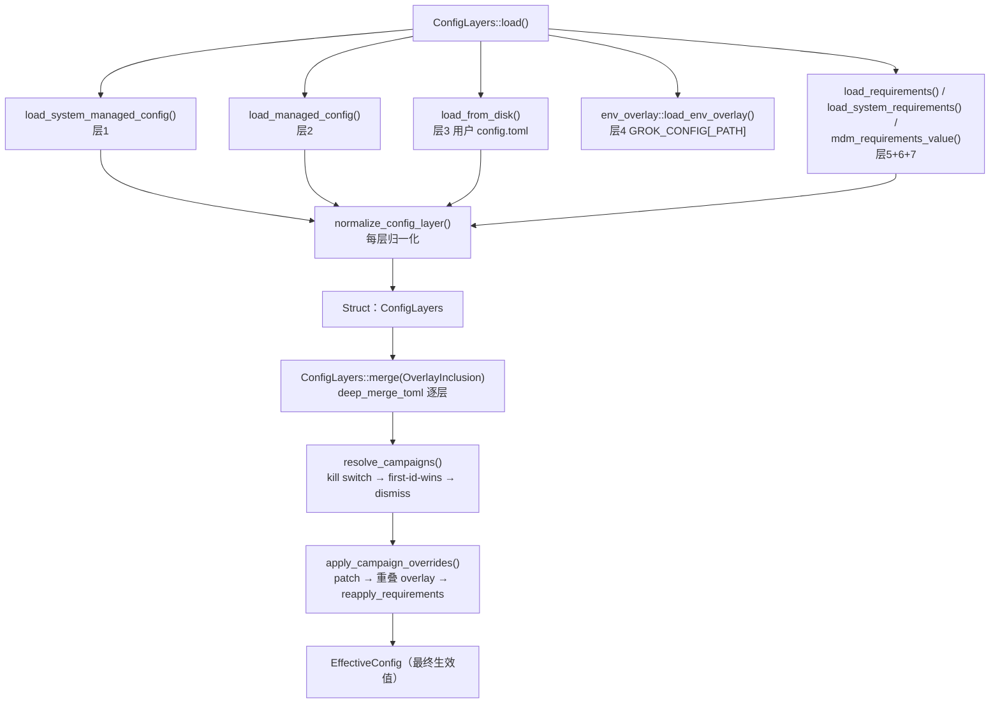
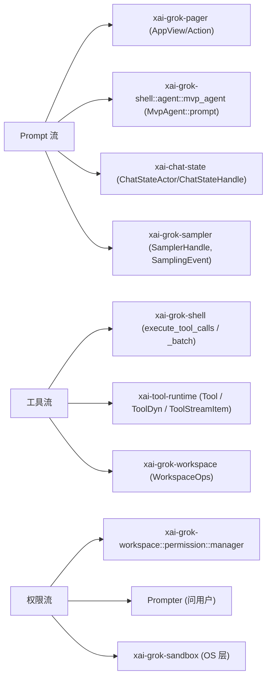

[上一篇：API 与接口设计](05-API与接口设计.md) · [总目录](README.md) · [下一篇：程序入口与运行模式](07-程序入口与运行模式.md)

# 配置与数据流：从磁盘到屏幕的合并与流向

> **第 6 / 18 篇** · 采样于 2026-09-23（CST）· 工作区 `HEAD = 2178c69c`
> **工具版本：Rust 1.94.0（rust-toolchain.toml:11）**；`agent-client-protocol 0.10.4`（`Cargo.toml:118`）；workspace members = **102**。
> **场景**：一条 `GROK_CONFIG='{"models":{"default":"grok-4.1"}}' grok` 启动后，模型从哪来、会话历史写到哪、一次 Prompt 的文本怎样穿过各层最终变成屏幕上的字。本文把「配置从哪来、怎么合并、运行时数据谁写谁读」一次讲清。

> **阅读说明**：本文讲**调用关系与数据流**，不把行号当稳定 API。源码索引统一写成「`文件路径` · `符号(+函数内相对偏移)`」，`+0` 即该函数/定义所在行。非函数定义用 `Struct：X` / `Const：Y` / `Enum：Z` / `Module：x`。**绝对行号只作快照辅助**，代码漂移后请以符号为准。
>
> **与旧版指南的重要差异（先说结论，避免照抄过时断言）**：
> 1. `crates/codegen/xai-grok-config/src/lib.rs` 的**模块文档注释现在只列 6 个静态层**（`Module：xai-grok-config` 文档注释 `+2 ~ +11`），**不再把 `GROK_CONFIG` overlay 列成一个编号层**。overlay 是**字段级**插在「用户 `config.toml`」与「requirements」之间的一个可选 `toml::Value`。
> 2. `xai-grok-env` 的 `Enum：GrokBuildEnvironment` 现在**只有 `Production` 一个变体**，`from_flags(_dev, _staging)` 恒返回 `Production`（`xai-grok-env/src/lib.rs · GrokBuildEnvironment::from_flags(+1)`）。dev/staging 环境已从该枚举移除。
> 3. 采样命令枚举已改名为 `Enum：SamplerCommand`，且是 `pub(crate)`——**外部调用者只能走 `SamplerHandle`**（`xai-grok-sampler/src/commands.rs` 模块注释 `+0 ~ +1`）。
> 4. 会话目录仍是 **session-id 子目录**结构 `sessions/<encoded-cwd>/<session-id>/`；记忆索引仍是 `index.sqlite`（不是 `memory.sqlite`），V2 独立根 `~/.grok/memory-v2/`。
> 5. 会话 actor 仍是 `MvpAgent`（`crates/codegen/xai-grok-shell/src/agent/mvp_agent/mod.rs`）。

---

### 本文件内容

1. [Why：配置为什么必须分层](#1-why配置为什么必须分层)
2. [配置合并顺序（全链路）](#2-配置合并顺序全链路)
3. [路径系统：grok_home 与会话目录](#3-路径系统grok_home-与会话目录)
4. [环境变量覆盖：GROK_* 家族](#4-环境变量覆盖grok_-家族)
5. [各层职责与关键符号](#5-各层职责与关键符号)
6. [会话数据与磁盘布局](#6-会话数据与磁盘布局)
7. [运行时数据流：Prompt / 工具 / 权限三条链](#7-运行时数据流prompt--工具--权限三条链)
8. [事实源表：每类数据唯一写入者](#8-事实源表每类数据唯一写入者)
9. [失败与边界](#9-失败与边界)
10. [本文件结论](#10-本文件结论)

其余阶段见[总目录](README.md)。

---

## 1. Why：配置为什么必须分层

Grok 同时被四种主体控制，且优先级不能颠倒：

- **企业 IT**：通过 `/etc/grok/managed_config.toml` 与 macOS MDM 强制策略，保证全公司行为一致。
- **团队管理员**：通过 `$GROK_HOME/managed_config.toml`（托管缓存）下推策略。
- **用户本人**：`$GROK_HOME/config.toml` 写个人偏好。
- **云侧 / 设备策略**：`requirements.toml`（Ed25519 签名）下发「最低版本 / 必开能力」，并可选 fail-closed。

如果只有「一个 `config.toml`」，企业策略就无法压过用户偏好，设备合规也无法强制。所以分层不是为了「多几个 toml」，而是为了**让高信任层在不改低信任层文件的前提下覆盖它**。

权威顺序写在模块文档注释里：`crates/codegen/xai-grok-config/src/lib.rs` · `Module：xai-grok-config` 文档注释 `+2 ~ +11`，共 **6 条**：

```text
1. /etc/grok/managed_config.toml
2. $GROK_HOME/managed_config.toml
3. $GROK_HOME/config.toml
4. $GROK_HOME/requirements.toml   (云端缓存；嵌入公钥后落盘即验签)
5. /etc/grok/requirements.toml
6. macOS MDM managed preferences (ai.x.grok，仅 macOS，admin 强制)
```

注释同时写明两点：**每层在合并前先跑自己的 `[[version_overrides]]`**；**requirements 层（4–6）可以选择 fail-closed 启动**。

注意这段注释**没有把 `GROK_CONFIG` 列进去**。`GROK_CONFIG` / `GROK_CONFIG_PATH` 是一个**可选的 overlay 字段**（`Struct：ConfigLayers` 的 `env_overlay: Option<toml::Value>`，`config_layers.rs · ConfigLayers` 字段注释 `+4 ~ +6`），它在**用户层之上、requirements 之下**参与合并——所以管理员策略永远赢过它。字段注释本身写着「fail-closed：一切 code-exec、auth、egress、trust、discovery 表都不在 allowlist 里，默认被丢弃」。

另有一层**不写在文件里**的机制：**campaign**（活动运营覆盖）。campaign 不是第 7 层 toml，而是一组可携带**任意字段**的 patch，由云端 settings、用户配置、托管配置等多个来源汇合，优先级单独定义（见 §2.4）。把 campaign 当成「一层文件」会误判它的权限边界。

---

## 2. 配置合并顺序（全链路）

### 2.1 优先级（低 → 高）

```text
┌──────────────────────────────────────────────────────────────────────────┐
│ 层1  /etc/grok/managed_config.toml       系统托管（企业 IT，OS 保护目录）  │
│ 层2  $GROK_HOME/managed_config.toml      团队托管缓存（同步下发）          │
│ 层3  $GROK_HOME/config.toml              用户配置（最常被手改）            │
│ 层4  GROK_CONFIG（内联 JSON）/ GROK_CONFIG_PATH（文件）  ← 仅白名单子集    │
│ 层5  $GROK_HOME/requirements.toml        云端缓存，Ed25519 签名（落盘即验）│
│ 层6  /etc/grok/requirements.toml         系统级签名策略                    │
│ 层7  macOS MDM「ai.x.grok」              仅 macOS，admin 强制              │
│  ── 以上为静态层，以下为动态覆盖（合并后二次施加）──                        │
│ 层8  campaigns（requirements > remote > user > managed > system_managed） │
└──────────────────────────────────────────────────────────────────────────┘
       ↑ 数字越大优先级越高；同名表递归合并，标量高层覆盖低层（deep_merge_toml）
```

> 层 1–7 顺序的**实现**是 `crates/codegen/xai-grok-config/src/config_layers.rs` · `ConfigLayers::merge(+1 ~ +21)`：
> 先 `system_managed` → `managed` → `user`，再（若 `OverlayInclusion::Include`）叠 `env_overlay`，最后按 `ConfigLayers::requirements_in_order(+0 ~ +8)` 依次叠 user → system → MDM requirements。
>
> 关键点：**层 4 的 `GROK_CONFIG` 不是最高的**。`merge` 先合并 overlay、再合并 requirements，所以管理员策略永远赢。
>
> 层 8 campaign 之所以是「二次施加」，是因为它必须**在 requirements 之下**但又允许覆盖用户层：`ConfigLayers::apply_campaign_overrides(+0 ~ +10)` 的顺序是「打 campaign patch → 重新叠 overlay → `reapply_requirements`」。

### 2.2 合并调用链（谁调用谁）



| 序号 | 动作 | 内部调用链（`文件` · 符号(+偏移)） | 说明 |
|---|---|---|---|
| 1 | 收集托管层 | `loader.rs` · `load_system_managed_config(+0 ~ +7)` / `load_managed_config(+0 ~ +2)` | 层1、层2 |
| 2 | 收集用户层 | `loader.rs` · `load_from_disk(+0 ~ +5)` → `load_user_config_layer` | 层3，`USER_CONFIG_FILENAME`（`loader.rs` · `Const：USER_CONFIG_FILENAME(+0)`）= `"config.toml"` |
| 3 | 收集 overlay | `env_overlay.rs` · `load_env_overlay(+0 ~ +13)` | 层4，内联 JSON 完全成功才用，否则回落 `GROK_CONFIG_PATH` |
| 4 | 收集签名层 | `validation.rs` · `requirements_layers(+0 ~ +35)` / `load_merged_requirements(+0 ~ +13)` | 层5/6/7，先验签再合并 |
| 5 | 逐层归一化 | `loader.rs` · `normalize_config_layer(+0 ~ +29)`；调用点 `config_layers.rs` · `ConfigLayers::load(+34 ~ +46)` | 让 `[toolset.web_search]` 的 allow/exclude 域列表同层成对生效 |
| 6 | 逐层版本覆盖 | `loader.rs` · `apply_version_overrides_with_registered(+0 ~ +11)` | 每层先跑自己的 `[[version_overrides]]` |
| 7 | 深层合并 | `loader.rs` · `deep_merge_toml(+0 ~ +14)` | 同名表递归合并，标量高层覆盖低层 |
| 8 | campaign 覆盖 | `config_layers.rs` · `apply_campaign_overrides(+0 ~ +10)` | 层8，patch 后重叠 overlay 与 requirements |

> 文件名常量集中在 `crates/codegen/xai-grok-config/src/loader.rs`（全部为 `Const：`，`+0` 即定义行）：
> `USER_CONFIG_FILENAME` = `"config.toml"`、`MANAGED_CONFIG_FILENAME` = `"managed_config.toml"`、`REQUIREMENTS_FILENAME` = `"requirements.toml"`、`TRUSTED_FOLDERS_FILENAME` = `"trusted_folders.toml"`、`SANDBOX_CONFIG_FILENAME` = `"sandbox.toml"`、`TRUSTED_HOOK_PROJECTS_FILENAME` = `"trusted-hook-projects"`（遗留，下次非沙箱启动迁移进 `trusted_folders.toml`）、`TRUSTED_PLUGINS_FILENAME` = `"trusted-plugins"`。

### 2.3 覆盖面收窄：overlay 白名单（当前最重要的安全边界）

`GROK_CONFIG` / `GROK_CONFIG_PATH` 的内容**不是随便什么字段都能改**。解析后统一走一个 choke point：

```text
env_overlay::finalize_overlay()          [env_overlay.rs · finalize_overlay(+0 ~ +23)]
  ├─ expand_env_vars_in_toml()           ← $VAR 展开
  ├─ apply_version_overrides_with_registered()  ← 失败则整个候选作废
  ├─ campaigns::take_campaign_entries()  ← 摘掉 [[campaigns]]，不许从 overlay 注入
  ├─ config_override::retain_overlay_allowed()  ← 白名单过滤（fail-closed）
  ├─ normalize_config_layer()
  └─ sections.is_empty() → None（不算有效覆盖，回落到无覆盖）
```

白名单定义在 `crates/codegen/xai-grok-config/src/config_override.rs` · `Const：OVERLAY_ALLOW_PATHS(+0 ~ +17)`，当前允许的**全部**路径只有：

| 允许路径 | 语义 |
|---|---|
| `models` | 全局模型块（`default_reasoning_effort`、picker 过滤），**不含** `[model.<id>]` |
| `features` | 软开关 |
| `toolset.bash.login_shell_capture` | 是否跑用户自己的 `$SHELL` |
| `toolset.web_search.allowed_domains` / `excluded_domains` | 搜索域名单（下游仍受 requirements 夹紧与上限约束） |
| `shell_environment_policy.inherit` / `ignore_default_excludes` / `exclude` / `include_only` | 只能放宽或收紧继承，**不能注入新 env 值** |

> 被显式排除的类别（注释里写明）：一切 code-exec、auth、egress、trust、discovery 表。`toolset.web_search.base_url`/`api_key`、`tool_fetch.proxy_endpoint`、`toolset.bash.cmd_prefix` 都**不在**白名单里。
>
> 另外 `retain_allowed_paths`（`config_override.rs` · `retain_allowed_paths(+0 ~ +25)`）有一条结构性规则：**顶层整棵子树条目只有在值是 table 时才保留**，否则一个标量会在 `deep_merge_toml` 时把整棵子树打掉。

`parse_overlay`（`env_overlay.rs` · `parse_overlay(+0 ~ +44)`）也做形态检查：必须能解析、必须是 table、JSON 里的 `null` 会先被 `strip_json_nulls(+0 ~ +18)` 递归删除。

`MAX_OVERLAY_BYTES`（`env_overlay.rs` · `Const：MAX_OVERLAY_BYTES(+0)`）= `4 * 1024 * 1024`。`read_capped_overlay_file(+0 ~ +34)` 会先 `metadata()` 拒绝非普通文件（FIFO、`/dev/zero`），再用 `take(MAX+1)` 有界读取，超限即视为「无覆盖」。日志**从不打印文件内容**。

> **回落语义**：`resolve_overlay_detailed(+0 ~ +13)` 只在「内联值完全成功」时采用 `GROK_CONFIG`；解析失败、`$VAR` 展开失败、`version_overrides` 失败、白名单后为空——任一环节不通过就**回落到 `GROK_CONFIG_PATH` 文件候选**，不会因为一个坏的内联值丢掉一个有效文件。

### 2.4 campaign：第二套覆盖机制

campaign 与「文件层」正交，来源优先级在 `ConfigLayers::campaign_source_slices(+0 ~ +11)` 里写死为**五元组**（first-id-wins）：

```text
requirements  >  remote（云端 settings）  >  user  >  managed  >  system_managed
```

- **kill switch**：`config_layers.rs` · `campaigns_application_disabled(+0 ~ +9)`。`GROK_CAMPAIGNS=0`（`xai_grok_env::env_bool`）或 `[features] campaigns = false` 任一命中即关闭全部 campaign。
- **dismiss**：`campaigns_state.json`（`config_layers.rs` · `Const：CAMPAIGNS_STATE_FILE(+0)`，路径由 `campaigns_state_path(+0 ~ +2)` 拼出），由 shell 侧 `dismiss_campaign_ids_at` 原子写 + 跨进程 advisory lock（`xai-grok-shell/src/util/config/campaigns.rs` · `dismiss_campaign_ids_at(+0 ~ +51)`）。
- **测试/调试覆盖**：`GROK_CAMPAIGNS_OVERRIDE` 是 JSON 数组，**替换所有来源**且**压过 kill switch**；JSON 非法时解析为「空列表」而不是回落（`campaigns.rs` · `campaigns_override(+0 ~ +13)`）。
- **结构保证**：campaign patch 可以带任意字段，但 `apply_campaign_overrides` 最后会 `reapply_requirements(+0 ~ +4)`，所以「管理员设过的字段」永远赢。
- **shell 侧唯一解析路径**：`resolve_active_campaigns_from_layers(+0 ~ +10)` 先看 `GROK_CAMPAIGNS_OVERRIDE`，再交给 `ConfigLayers::resolve_campaigns`。

---

## 3. 路径系统：grok_home 与会话目录

### 3.1 grok_home 的来源与归属

- `grok_home()` / `default_grok_home()` / `user_grok_home()` 由 **`xai-dirs`** crate 拥有，`xai-grok-config` 只是重导出：`crates/codegen/xai-grok-config/src/paths.rs` · `Module：paths` 重导出行 `+2`（`pub use xai_dirs::{default_grok_home, grok_home, user_grok_home};`）。
- `$GROK_HOME` **非空时原样生效**，否则回落 `<home>/.grok`（`xai-dirs` 内部解析，含 `OnceLock` 缓存；`loader.rs` · `load_from_disk(+1 ~ +4)` 注释说明它刻意用 `resolve_grok_home()` 取**活值**，避免 OnceLock 缓存读到与最近一次 settings 写入不同的文件）。
- shell 侧通过 `xai-grok-shell-base::util::*` 再导出，所以 `crate::util::grok_home::grok_home()` 与 `xai_grok_config::grok_home()` 是同一个函数。
- 系统目录：`system_config_dir(+0 ~ +6)` 在 Unix 返回 `/etc/grok`，Windows 返回 `None`。
- 应用二进制路径：`grok_application(+0 ~ +2)` → `grok_application_in(+0 ~ +3)` = `$GROK_HOME/bin/grok`（Windows 为 `grok.exe`）。

### 3.2 会话目录：`sessions/<cwd>/<session-id>/` 两级

```text
$GROK_HOME/
├── config.toml                     ← 层3 用户配置
├── managed_config.toml             ← 层2 团队托管
├── managed_config_cache.json       ← 托管缓存同步标记 / 回滚下限
├── requirements.toml               ← 层5 签名策略（云端缓存）
├── managed_config.sig.json         ← 托管配置签名信封（Const：SIGNATURE_SIDECAR_FILE）
├── managed_identity.sig.json       ← 托管身份签名信封（Const：MANAGED_IDENTITY_SIDECAR_FILE）
├── sandbox.toml                    ← 沙箱 profile 定义
├── trusted_folders.toml            ← 文件夹信任存储
├── trusted-hook-projects           ← 遗留 hook 信任清单（待迁移）
├── trusted-plugins                 ← 插件信任清单
├── campaigns_state.json            ← campaign dismiss 状态
├── sessions/                       ← 按 CWD 分桶
│   ├── %2FUsers%2Ffoo%2Fproject/   ← 短路径：URL 编码，可读可还原
│   │   └── <session-id>/           ← 每个会话一个子目录
│   │       ├── summary.json        ← 索引项：标题/时间戳/模型/消息数
│   │       ├── updates.jsonl       ← ACP update 流（权威会话日志）
│   │       ├── chat_history.jsonl  ← 发给模型的原始消息（v1 格式）
│   │       ├── plan.json / plan_mode.json
│   │       ├── signals.json / usage.json
│   │       ├── announcement_state.json
│   │       ├── goal/state.json
│   │       └── workflows/<run_id>/ ← 工作流运行态（新）
│   └── my-app-a1b2c3d4e5f6a7b8/    ← 长路径：{slug}-{blake3 前16}
│       ├── .cwd                    ← 原路径回写，decode 用
│       └── <session-id>/...
├── memory/                         ← 记忆（Legacy 模式）
│   └── {project-slug}-{hash8}/index.sqlite
├── memory-v2/                      ← 记忆（V2 模式，独立根）
│   ├── global/
│   └── workspaces/{workspace-hash}/index.sqlite
├── crash/                          ← 崩溃报告目录（leader 用 crash/leader/）
└── debug/                          ← GROK_DEBUG_LOG=1 的 per-session 日志
```

路径与文件名常量：

| 符号 | 位置 | 作用 |
|---|---|---|
| `sessions_cwd_dir_in(grok_home, cwd)` | `paths.rs` · `sessions_cwd_dir_in(+0 ~ +2)` | `grok_home/sessions/{encode_cwd_dirname(cwd)}`，**不含 session-id**，**不建目录** |
| `sessions_cwd_dir(cwd)` | `paths.rs` · `sessions_cwd_dir(+0 ~ +2)` | 上一行的默认 home 版本 |
| `JsonlStorageAdapter::session_dir(info)` | `session/storage/jsonl/mod.rs` · `session_dir(+0 起)` | 在 CWD 桶结果上 join `info.id`，得到真正的会话目录 |
| `encode_cwd_dirname(cwd)` | `paths.rs` · `encode_cwd_dirname(+0 ~ +17)` | 短路径 URL 编码；> `MAX_DIRNAME_BYTES`(255) 改用 `{slug}-{blake3_hex16}`（≤ 57 字节） |
| `decode_cwd_from_dirname(dir)` | `paths.rs` · `decode_cwd_from_dirname(+0 ~ +13)` | 先 URL 解码（结果必须以 `/` 或盘符开头），失败读 `.cwd` 还原 |
| `ensure_sessions_cwd_dir_in(home, cwd)` | `paths.rs` · `ensure_sessions_cwd_dir_in(+0 ~ +27)` | 建 `sessions/` 与 CWD 桶（均 `0700`），hash 形态额外写 `.cwd`（`create_new` + `sync_all`） |
| `ensure_sessions_cwd_dir(cwd)` | `paths.rs` · `ensure_sessions_cwd_dir(+0 ~ +2)` | 默认 home 版本 |
| `create_dir_all_owner_only(dir)` | `paths.rs` · `create_dir_all_owner_only(+0 ~ +13)` | `DirBuilder` 带 `0o700` 出生权限，避免 umask 窗口泄露 |
| `set_dir_owner_only(dir)` | `paths.rs` · `set_dir_owner_only(+0 ~ +12)` | 自愈合 chmod（失败只 `tracing::debug`，不向上抛） |
| `MAX_DIRNAME_BYTES` | `paths.rs` · `Const：MAX_DIRNAME_BYTES(+0)` | `255`，APFS/ext4/NTFS 单组件上限 |

> 注意 `ensure_sessions_cwd_dir_in` 会**同时**把 `grok_home/sessions` 根目录也 chmod 到 `0700`——注释说明这是为了「遮蔽旧版遗留的松权限子目录和会话搜索索引」。

---

## 4. 环境变量覆盖：GROK_* 家族

`xai-grok-env` crate 提供统一的解析入口：

- `env_bool(name) -> Option<bool>`：接受 `1/true/yes/on/enabled` 与 `0/false/no/off/disabled`，其余（含空串、`maybe`、`2`）返回 `None`（`xai-grok-env/src/registry.rs` · `parse_bool(+0 ~ +6)`、`env_bool(+0 ~ +2)`）。
- `env_string(name) -> Option<String>`：trim 后为空视为未设置（`registry.rs` · `env_string(+0 ~ +8)`）。
- `FIRST_PARTY_CREDENTIAL_ENV_VARS`（`registry.rs` · `Const：FIRST_PARTY_CREDENTIAL_ENV_VARS(+0 ~ +10)`）：`GROK_AUTH`、`GROK_AUTH_PATH`、`XAI_API_KEY`、`GROK_DEPLOYMENT_KEY`、`GROK_CODE_XAI_API_KEY`、`GROK_EXTRA_AUTH_KEY`、`GROK_TRACE_UPLOAD_CREDENTIALS_FILE`、`OTEL_EXPORTER_OTLP_HEADERS`、`GROK_INTERNAL_OTLP_HEADERS`。
- `Struct：GrokBuildEndpoints`（`xai-grok-env/src/lib.rs` · `+0 ~ +6`）与 `Const：PRODUCTION_ENDPOINTS(+0 ~ +6)`：`cli_chat_proxy_base_url`、`asset_server_url`、`relay_ws_url`、`gateway_ws_url`、`ws_origin`。每个可被 `GROK_PRODUCTION_*` 前缀环境变量覆盖（`GrokBuildEnvironment::resolve(+0 ~ +3)`）。**relay 与 gateway 是两套协议**，代码里有专门测试 `relay_and_gateway_urls_are_distinct` 防混淆。
- `Enum：GrokBuildEnvironment` 当前**只有 `Production`**：`from_flags(_dev, _staging)` 恒返回 `Production`，`indicator()` 恒返回 `None`。旧指南提到的 dev/staging 变体在当前源码中不存在。

高频 `GROK_*` 变量（按当前源码中的出现位置归纳）：

| 变量 | 含义 | 读取点 |
|---|---|---|
| `GROK_HOME` | 覆盖 grok 根目录（默认 `~/.grok`） | `xai-dirs`（`resolve_grok_home()`） |
| `GROK_CONFIG` | 内联 JSON 覆盖（层4） | `env_overlay.rs` · `Const：GROK_CONFIG_ENV(+0)` |
| `GROK_CONFIG_PATH` | 额外 JSON/TOML 覆盖文件（层4） | `env_overlay.rs` · `Const：GROK_CONFIG_PATH_ENV(+0)` |
| `GROK_CAMPAIGNS` | `=0` 关闭全部 campaign（kill switch） | `config_layers.rs` · `campaigns_application_disabled(+1 ~ +2)` |
| `GROK_CAMPAIGNS_OVERRIDE` | JSON 数组，替换所有 campaign 来源并压过 kill switch | `util/config/campaigns.rs` · `campaigns_override(+1)` |
| `GROK_WORKER_THREADS` | Tokio worker 线程数覆盖 | `xai-grok-pager-bin/src/main.rs` · `Const：GROK_WORKER_THREADS_ENV(+0)` |
| `GROK_DEBUG_LOG` | `=1` 每会话日志到 `~/.grok/debug`；给路径则单文件 | `main.rs` · `configure_process_env(+19 ~ +31)` |
| `GROK_LOG_FILE` | 旧版显式 debug 日志路径（被 `--debug-file` 时主动 `remove_var`） | 同上 |
| `GROK_HOOKS_LOG` | 打开 hooks 日志（`--debug` / `--debug-file` 时自动置 1） | 同上 |
| `GROK_COMPACTION_MODE` | 覆盖上下文压缩模式（CLI `--compaction-mode` 写入） | `main.rs` · `configure_process_env(+4 ~ +6)` |
| `GROK_COMPACTION_DETAIL` | 覆盖压缩详略 | 同上，`+7 ~ +9` |
| `GROK_CHAT_MODE_ENV` | 聊天模式开关（CLI `--chat` 判定后写入） | 同上，`+10 ~ +12` |
| `GROK_LOG_SAMPLING` | 打开采样日志（CLI `--log-sampling` 写入） | 同上，`+16 ~ +18` |
| `LEADER_SOCKET_ENV` | 自定义 leader socket 路径 | 同上，`+13 ~ +15` |
| `GROK_WORKSPACE_COMMAND` | 本地打开 workspace 命令（`=1`） | `main.rs` · `Const：WORKSPACE_COMMAND_ENV(+0)`；用法在 `workspace_command_env_override(+0 ~ +4)` |
| `GROK_AGENT_DASHBOARD` | `=0` 关闭 Agent Dashboard | `main.rs` · `flag_dashboard_at_startup_if_requested(+0 ~ +14)` |
| `GROK_AGENT_SECRET` | `agent serve` 的鉴权 token | `xai-grok-pager/src/app/cli.rs` · `Struct：ServeArgs` 字段 `secret`（clap `env = "GROK_AGENT_SECRET"`） |
| `GROK_OPEN_DASHBOARD_AT_STARTUP` | 启动即开 dashboard（`Command::Dashboard` 转写） | `main.rs` · `flag_dashboard_at_startup_if_requested(+11)` |
| `GROK_SANDBOX` | 沙箱 profile（clap `env` 绑定） | `cli.rs` · `Struct：PagerArgs` 字段 `sandbox` |
| `GROK_SCREEN_MODE` | 一次性屏幕模式覆写（`minimal` / `fullscreen`），消费即删除 | `xai-grok-pager/src/app/screen_mode_relaunch.rs` · `Const：GROK_SCREEN_MODE_ENV(+0)` |
| `GROK_TEST_VERSION` | 开发期伪造版本（`installed_semver()` 失败时 `version_overrides` 静默剥离） | `loader.rs` · `apply_version_overrides_with_registered(+0 ~ +11)` 注释 |

> `env_bool` 同时被 `xai_grok_config` 重导出（`xai-grok-config/src/lib.rs` · `pub use xai_grok_env::env_bool` 行 `+89`），所以配置侧与 shell 侧用的是同一个解析器。

---

## 5. 各层职责与关键符号

| 层 | crate / 模块 | 关键符号（`文件` · 符号(+偏移)） | 职责 |
|---|---|---|---|
| 托管（系统） | `xai-grok-config::loader` | `load_system_managed_config(+0 ~ +7)` | 读 `/etc/grok/managed_config.toml` |
| 托管（用户） | `xai-grok-config::loader` + `managed_cache` | `load_managed_config(+0 ~ +2)`；`MANAGED_CONFIG_CACHE_FILE` | 团队策略 + 同步标记/回滚下限 |
| 用户 | `xai-grok-config::loader` | `load_from_disk(+0 ~ +5)` | 个人偏好（`$GROK_HOME/config.toml`） |
| 运行时覆盖 | `xai-grok-config::env_overlay` | `resolved_env_overlay(+0 ~ +8)` | `GROK_CONFIG` / `GROK_CONFIG_PATH`，白名单收敛 |
| 签名策略 | `xai-grok-config::signed_policy` + `validation` | `validate_requirements(+0 ~ +12)`；`EMBEDDED_DEPLOYMENT_CONFIG_PUBKEYS` | Ed25519 验签；可选 fail-closed |
| MDM | `xai-grok-config::macos_managed` | `MDM_REQUIREMENTS_SOURCE` | macOS `ai.x.grok` admin 强制 |
| 活动营销 | `xai-grok-config::campaigns` | `filter_active_campaigns` / `CampaignEntry` / `merge_campaign_entries` | 按时间/路径生效的临时覆盖 |
| 版本覆盖 | `xai-grok-config::version_overrides` | `apply_version_overrides` / `apply_version_overrides_with_registered(+0 ~ +11)` | 每层先跑自己的 `[[version_overrides]]` |
| 钩子来源 | `xai-grok-config::global_hook_sources` | `resolve_global_hook_sources` / `ensure_grok_hook_slots` / `TRUST_BOUNDARY_FILENAMES` | 解析全局 hook 插件来源与信任边界 |
| 补丁/白名单 | `xai-grok-config::config_override` | `retain_overlay_allowed(+0 ~ +2)`；`apply_patches(+0 ~ +35)`；`PATCH_STRIP_KEYS` / `PATCH_STRIP_PATHS` / `CAMPAIGN_STRIP_KEYS` | overlay 白名单 + patch 剥离键 |
| 环境工具 | `xai-grok-env` | `env_bool` / `env_string` / `FIRST_PARTY_CREDENTIAL_ENV_VARS` | 统一 env 解析与凭据变量清单 |
| 配置类型 | `xai-grok-config-types` | `Struct：RemoteSettings`（`lib.rs · +0 ~ +5`）、`Struct：CampaignOverride`、`Enum：MemoryMode`、`Struct：ConsentGate` | 跨 crate 共享的配置数据结构 |

> **合并入口的三个版本**（名字本身在提醒你别混用）：
> - `xai_grok_config::load_effective_config_disk_only()`（`config_layers.rs` · `load_effective_config_disk_only(+0 ~ +2)`）——**纯磁盘**，无 remote campaign、无 `GROK_CAMPAIGNS_OVERRIDE`，供一次性 CLI 使用。
> - `xai_grok_shell::util::config::load_effective_config()`（`xai-grok-shell/src/util/config/campaigns.rs` · `load_effective_config(+0 ~ +2)` → `load_effective_config_with_layers(+0 ~ +15)`）——**remote-aware**，先读进程内 remote campaign 缓存，再走 `GROK_CAMPAIGNS_OVERRIDE`。TUI / agent 走这条。
> - `xai_grok_shell::util::config::load_effective_config_disk_only()`（同文件 `+0 ~ +2`）——shell 侧的纯磁盘版本，与第一个名字刻意对齐。

### 5.1 签名策略的两条铁律

1. **落盘即验签**：一旦编译进 `EMBEDDED_DEPLOYMENT_CONFIG_PUBKEYS`（`signed_policy.rs` · `Const：EMBEDDED_DEPLOYMENT_CONFIG_PUBKEYS(+0 ~ +8)`，当前只有 prod `v1`，32 字节 raw Ed25519 key），`requirements.toml` 就必须通过 Ed25519 校验；`EMBEDDED_V1_PUBKEY_SHA256_HEX(+0 ~ +4)` 是对该 key 的 SHA-256 钉桩，防止静默改错字节。`verification_active(+0 ~ +9)` 判断是否处于验签态。
2. **签名层可 fail-closed**：`resolve_fail_closed_mode`（`validation.rs` · `resolve_fail_closed_mode(+0 ~ +8)`）决定校验失败时是「警告后继续」还是**启动即失败**。`xai-grok-pager-bin/src/main.rs` 在 runtime 建好之前就调用 `xai_grok_config::validate_requirements()`，失败打印两行指引后 `std::process::exit(2)`（`main.rs` · `main(+37 ~ +45)`）。
3. **身份绑定**：`check_fetch_identity`（`signed_policy.rs` · `+0 ~ +21`）/ `verify_managed_identity_claim(+0 ~ +14)` / `check_on_disk_matches(+0 ~ +39)` 把「签名内容」「principal」「磁盘字节」三者对齐——换团队（identity 变更）会被 `confirmed_team_switch` 记录并抬高回滚下限（`managed_cache.rs` · `confirmed_team_switch` / `bump_rollback_floor`）。

---

## 6. 会话数据与磁盘布局

会话是**磁盘上的可恢复日志**，不是进程内对象（恢复细节见 `13-持久化记忆与会话恢复.md`）。本文件只定位文件与写入者。

### 6.1 会话目录内的文件（`xai-grok-shell/src/session/storage/mod.rs` 常量）

| 文件 | 常量 | 唯一写入者 | 说明 |
|---|---|---|---|
| `summary.json` | `Const：SUMMARY_FILE(+0)` | `JsonlStorageAdapter`（持久化 actor） | 索引项：`Info{id,cwd}` + 标题 + 时间戳 + 模型 + 消息数 + `parent_session_id` |
| `updates.jsonl` | `Const：UPDATES_FILE(+0)` | 同上 | ACP update 流，**权威会话日志**，`/load` 与恢复靠它 |
| `chat_history.jsonl` | `Const：CHAT_HISTORY_FILE(+0)` | 同上 | 发给模型的原始消息；`Const：CHAT_FORMAT_VERSION = 1`（`session/persistence.rs` · `+0`） |
| `plan.json` | `Const：PLAN_FILE(+0)` | 同上 | TODO / 任务清单 |
| `plan_mode.json` | `Const：PLAN_MODE_FILE(+0)` | 同上 | Plan 模式状态 |
| `signals.json` | `Const：SIGNALS_FILE(+0)` | 同上 | 会话信号（轮数、token 用量） |
| `usage.json` | `Const：USAGE_FILE(+0)` | 同上（`session/usage_file.rs`） | 持久化 token/cost 用量 |
| `goal/state.json` | `Const：GOAL_STATE_FILE(+0)` | 同上（goal 子系统） | 目标循环状态 |
| `announcement_state.json` | `Const：ANNOUNCEMENT_STATE_FILE(+0)` | 同上 | 公告已读状态 |
| `workflows/<run_id>/` | `workflows_dir` / `workflow_run_dir`（`jsonl/mod.rs` · `+0 ~ +8`） | 同上 | 工作流运行态（`validate_run_id` 先校验 run_id） |
| `index.sqlite` | — | `xai-grok-memory` | chunk / embedding / sqlite-vec / MMR（见 6.3） |

### 6.2 会话数据结构

```rust
// xai-grok-shared/src/session/info.rs  结构：Info  偏移：+0 ~ +3
pub struct Info { pub id: acp::SessionId, pub cwd: String }

// xai-grok-shell/src/session/persistence.rs  结构：Summary  偏移：+0 起
pub struct Summary {
    pub info: Info,                    // 会话身份（id + cwd）
    pub session_summary: String,       // 标题
    pub created_at / updated_at: DateTime<Utc>,
    pub num_messages: usize,
    pub num_chat_messages: usize,
    pub current_model_id: acp::ModelId,
    pub parent_session_id: Option<String>,   // fork 谱系（persistence.rs +27）
    pub forked_at,                     // fork 时间戳
    pub cwd_generation: u64,           // 权威 cwd 的单调代号（persistence.rs +8）
    pub previous_cwd: Option<String>,  // 上一代 cwd（用于搬迁回放，persistence.rs +11）
    // …还有 agent_id / attempt_id / collection_id 等遥测字段
}
```

- **cwd 有「代号」（generation）**：会话在生命周期内可以切换工作目录（relocation），`cwd_generation` 单调递增，`previous_cwd` 保存上一代。`PendingCwdSwitchReminder` 保证切换提醒**恰好追加一次**。这意味着「一个会话目录」不等于「一个固定 cwd」——重实现时不要假设 `info.cwd` 恒定。
- **`Info` 与 `Summary` 分离**：`Info` 只有 `{id, cwd}` 两个字段且被 `xai-grok-shared` 共享（渲染层、工具层都能用），`Summary` 是完整索引项。路径计算只需要 `Info`（见 §3.2 `session_dir`）。
- **`chat_history.jsonl` 是派生物**：`ensure_chat_history`（`jsonl/mod.rs` · `+0 ~ +9`）发现文件为 0 字节时会用 `rebuild_chat_history`（`session/storage/chat_rebuild.rs`）从 `updates.jsonl` 重建；且当调用方给的 `chat_format_version` 与当前 `CHAT_FORMAT_VERSION` 不一致时**直接跳过**。所以「chat_history 丢失」不等于「会话丢失」。
- **会话目录 owner-only + durable**：`create_session_dir_owner_only`（`jsonl/mod.rs` · `+0 ~ +13`）在 `SessionDirMode::FromRoot` 下会连带把 `<encoded-cwd>` 与 sessions 根置为 owner-only，并在存在 `.cwd` 标记时 `sync_cwd_marker_if_present`。

### 6.3 记忆存储（`xai-grok-memory`）

`MemoryStorage` 有两种根，由 `Enum：MemoryMode` 决定（`xai-grok-memory/src/storage.rs` · `new_for_mode(+0 ~ +17)`）：

```text
Legacy  →  ~/.grok/memory/{project-slug}-{hash8}/     ← workspace_dir
              ├── index.sqlite                        ← 向量索引
              ├── MEMORY.md                           ← 工作区记忆正文
              └── sessions/…                          ← 会话级记忆
V2      →  ~/.grok/memory-v2/
              ├── global/
              └── workspaces/{workspace-hash}/index.sqlite
```

- 文件是 `index.sqlite`（不是旧指南写的 `memory.sqlite`），路径由 `workspace_dir().join("index.sqlite")` 拼出（`storage.rs` · `open` 附近 `+1`）。
- V2 根可用 `root_override` 替换，否则回落 `grok_home().join("memory-v2")`（`storage.rs` · `new_for_mode(+5 ~ +7)`）。
- **V2 与 Legacy 完全隔离**：V2 用独立根，**看不到** Legacy 根下的任何文件。
- 临时目录 cwd 会被标记 `ephemeral`，工作区写入静默跳过（`storage.rs` · `is_ephemeral(+0 ~ +2)`）。

---

## 7. 运行时数据流：Prompt / 工具 / 权限三条链

这一节只画「数据从哪进、到哪出、谁改」，逐函数精读见 `03-详细逐步说明-主链路拆解.md` 与 `15-跨模块完整运行链与场景.md`。

### 7.1 总览（ASCII）

```text
┌─────────┐   Prompt    ┌──────────┐  ContentBlock  ┌────────────────────┐
│ Terminal │ ─────────▶ │ AppView  │ ──────────────▶ │ ACP session/prompt │
│ (TUI)    │            │ (Action) │                 │ MvpAgent::prompt   │
└─────────┘            └──────────┘                 └─────────┬──────────┘
                                                               │ SessionCommand::Prompt
                                                               ▼ (mpsc cmd_tx)
                                                     ┌────────────────────┐
                                                     │ SessionHandle /    │
                                                     │ ChatStateActor     │
                                                     └─────────┬──────────┘
                                                               │ SamplerHandle::submit
                                                               ▼
                                                     ┌────────────────┐  SSE  ┌─────────┐
                                                     │ SamplerActor   │ ─────▶ │ xAI API │
                                                     │ (SamplerHandle)│        └─────────┘
                                                     └───────┬────────┘
                                                             │ SamplingEvent
                                                             │ (ChannelToken/ToolCallDelta/…)
                              ┌──────────────────────────────┘
                              ▼
                    ┌───────────────────────┐  ToolCall  ┌──────────────────┐
                    │ execute_tool_calls_   │ ─────────▶ │ Tool::execute    │
                    │ batch                 │            │ (ToolDyn)        │
                    └──────────┬────────────┘ ◀────────── │ ToolRunResult    │
                               │                          └──────────────────┘
                               │ PermissionHandle::Request
                               ▼
                    ┌───────────────────────┐   allow/deny   ┌──────────────┐
                    │ permission manager    │ ─────────────▶ │ FS / Bash /  │
                    │ (+ Prompter 问用户)    │ ◀───────────── │ WorkspaceOps │
                    └───────────────────────┘                └──────────────┘
                               │ ToolResult
                               ▼
                    ┌──────────────┐  append  ┌──────────┐  scrollback  ┌─────────┐
                    │ ChatState    │ ───────▶ │ AppView  │ ───────────▶ │ Screen  │
                    └──────┬───────┘          └──────────┘              └─────────┘
                           │ 持久化 actor
                           ▼
                    sessions/<cwd>/<sid>/{updates.jsonl, chat_history.jsonl, summary.json}
```

### 7.2 三条链对应 crate



- **Prompt 流**：`AppView` 动作 → ACP `session/prompt` 请求 → `MvpAgent::prompt`（`xai-grok-shell/src/agent/mvp_agent/acp_agent.rs` · `prompt(+0 起)`）。同一 session 的并发 prompt 由 `dispatch_lock` 串行化（`acp_agent.rs` · `prompt(+113 ~ +114)`）。
- **工具流**：`SamplingEvent::ToolCallDelta` 增量拼装完整 args → `execute_tool_calls`（`xai-grok-shell/src/session/acp_session_impl/tool_calls.rs` · `execute_tool_calls(+0 起)`）→ `execute_tool_calls_batch`（同文件 `+149 起`）→ `Tool::execute` 返回 `ToolStream<T>`。流不变量：**任意多个 `ToolStreamItem::Progress` + 恰好一个 terminal**（详见 `10-工具协议与扩展体系.md`）。
- **权限流**：工具请求 → permission manager（`xai-grok-workspace/src/permission/manager/mod.rs` · `Enum：PermissionHandle(+0 起)`）→ 决策 → 必要时 `Prompter` 问用户 → 决策缓存到规则。**OS 沙箱是另一层**（`xai-grok-sandbox`），不能替代权限决策（见 `11-Workspace权限沙箱与Git.md`）。
- **工作区后端是两态**：`Enum：WorkspaceOps`（`xai-grok-workspace/src/workspace_ops.rs` · `+0 起`）的 `Local { handle }`（进程内）与 Proxy 形态（经 hub RPC）决定了工具落到本地还是远端。

### 7.3 会话并发模型（谁串行、谁并行）

| 机制 | 位置 | 作用 |
|---|---|---|
| `dispatch_lock(session_id)` | `acp_agent.rs` · `prompt(+113)` 附近 | 同一 session 的 prompt 串行；不同 session 并行 |
| `SessionHandle.cmd_tx` | `session/handle.rs` · `Struct：SessionHandle` | 向 session actor 投递 `Enum：SessionCommand`（`session/commands.rs` · `+0 起`，`Prompt` 变体在同文件 `+31`） |
| `SamplerHandle` | `xai-grok-sampler/src/handle.rs` · `Struct：SamplerHandle(+0 起)` | 采样命令的唯一公开入口；底层 `Enum：SamplerCommand` 是 `pub(crate)`，变体 `Submit`(`+18`)/`Cancel`(`+25`)/`UpdateConfig`(`+30`)/`IsActive`(`+35`)/`ActiveCount`(`+41`) |
| `ChatStateHandle` | `xai-chat-state/src/handle.rs` · `Struct：ChatStateHandle(+0 起)` | 对话事实的唯一入口；邮箱关闭返回 `ChatStateMailboxClosed`（同文件 `+26`） |
| `ChatStateCommand` | `xai-chat-state/src/commands.rs` · `Enum：ChatStateCommand(+0 起)` | 对话变更/查询命令面 |
| 持久化 actor | `xai-grok-shell/src/session/persistence.rs` | 落盘与 fsync 屏障，不与 UI 线程共享可变状态 |

---

## 8. 事实源表：每类数据唯一写入者

重实现时最重要的约束——**每类事实只有一个写入者**，其余都是观察者：

| 事实 | 唯一写入者（crate） | 观察者 |
|---|---|---|
| UI 状态（光标/视图/输入框） | `xai-grok-pager`（AppView） | 渲染层（`xai-grok-pager-render`） |
| 会话状态（生命周期/状态机） | `xai-grok-shell`（`MvpAgent` + `SessionHandle`） | TUI、leader |
| 对话事实（消息/历史） | `xai-chat-state`（`ChatStateActor`） | Sampler、工具 |
| 采样流（token / tool_call 增量） | `xai-grok-sampler`（`SamplerHandle`） | session actor、pager |
| 文件事实（磁盘内容） | `xai-grok-workspace`（`WorkspaceOps`） | 工具、hunk tracker |
| 权限决策 | `xai-grok-workspace::permission::manager` | 工具运行时 |
| 记忆/嵌入 | `xai-grok-memory`（`index.sqlite`） | 检索、压缩 |
| 配置生效值 | `xai-grok-config`（`ConfigLayers` 合并结果） | 全进程只读 |
| campaign dismiss 状态 | `xai-grok-shell::util::config::campaigns` | 配置解析、`/new` 的模型选择 |
| 托管缓存同步标记 | `xai-grok-config::managed_cache` | 启动合规检查 |
| 托管策略文件锁 | `xai-grok-file-lock`（新增 member，`crates/codegen/xai-grok-file-lock`） | 多进程共享 `$GROK_HOME` 时的写入串行化 |

> 这是 README「六条不变量」第 1 条的运行体现：UI / 会话 / 对话 / 文件 由不同模块拥有，跨模块一律走 Handle（端口）或 channel，不直接共享可变状态。

---

## 9. 失败与边界

| 边界 | 行为 | 来源 |
|---|---|---|
| `requirements.toml` 验签失败 + fail-closed | 启动即失败（`exit(2)`，打印修复指引） | `validation.rs` · `validate_requirements`；`main.rs` · `main(+37 ~ +45)` |
| `GROK_CONFIG` 内联 JSON 非法 / 白名单后为空 | **回落**到 `GROK_CONFIG_PATH` 候选，不丢弃 | `env_overlay.rs` · `resolve_overlay_detailed(+0 ~ +13)` |
| `GROK_CONFIG_PATH` 超大（> 4 MiB）或特殊节点 | 视为「无覆盖」，不 OOM 不卡死 | `env_overlay.rs` · `read_capped_overlay_file(+11 ~ +33)` |
| overlay 试图注入 `auth_provider` / `model_providers` | 被白名单整表丢弃 | `config_override.rs` · `OVERLAY_ALLOW_PATHS` / `PATCH_STRIP_KEYS` |
| `GROK_CAMPAIGNS_OVERRIDE` JSON 非法 | 解析为**空列表**（压制全部 campaign），**不回落**到真实来源 | `util/config/campaigns.rs` · `campaigns_override(+8 ~ +11)` |
| `campaigns_state.json` 损坏 | 重命名为 `.json.corrupt` 旁置，不丢弃 | `util/config/campaigns.rs` · `dismiss_campaign_ids_at(+20 ~ +27)` |
| campaign dismiss 并发写 | 进程内 `DISMISS_LOCK` + 跨进程 `json.lock` advisory lock；锁失败仍继续 | `util/config/campaigns.rs` · `dismiss_campaign_ids_at(+10 ~ +17)` |
| dismiss 列表超长 | FIFO 截断到 `MAX_DISMISSED_IDS`(32) | `util/config/campaigns.rs` · `Const：MAX_DISMISSED_IDS(+0)` |
| 托管配置「硬过期」/ 策略被篡改 | `is_managed_config_hard_stale_for` / `managed_policy_compromised_for` 触发重新同步或拒绝 | `managed_cache.rs` |
| 会话目录非 `0700` | `ensure_sessions_cwd_dir_in` 下次触碰自愈合到 `0700`（含 `sessions/` 根） | `paths.rs` · `ensure_sessions_cwd_dir_in(+7 ~ +8)` |
| `chat_history.jsonl` 为 0 字节 | 从 `updates.jsonl` 重建 | `jsonl/mod.rs` · `ensure_chat_history(+0 ~ +9)` |
| `chat_format_version` 与当前版本不符 | `ensure_chat_history` 直接返回（不重建、不误判） | `jsonl/mod.rs` · `ensure_chat_history(+0 ~ +3)` |
| 身份切换（团队切换） | `confirmed_team_switch` / `bump_rollback_floor` 记录回滚下限 | `managed_cache.rs` |
| 结果未知（写文件超时） | 先 reconcile 再决定是否重试，不盲目重放 | `可靠性与通用技术实现说明书.md` |

> 合并本身是**纯函数式**的：`deep_merge_toml` 不产生副作用，只有 `ensure_sessions_cwd_dir` 这类「确保目录存在」才触碰磁盘，且失败只 `tracing::debug` 不向上抛（`paths.rs` · `set_dir_owner_only(+4 ~ +7)`）。

---

## 10. 本文件结论

1. **层序（低 → 高）**：系统托管 → 用户托管 → 用户 `config.toml` → `GROK_CONFIG[_PATH]` overlay → 用户 requirements → 系统 requirements → macOS MDM → campaigns。实现见 `crates/codegen/xai-grok-config/src/config_layers.rs` · `ConfigLayers::merge(+1 ~ +21)`。**`GROK_CONFIG` 已被 requirements 压住**，与旧版指南相反。
2. **overlay 是白名单的**：`OVERLAY_ALLOW_PATHS`（`config_override.rs` · `+0 ~ +17`）只放行 `models` / `features` / 少数 `toolset` 叶子 / `shell_environment_policy` 继承控制；一切 code-exec、auth、egress、trust 表都被丢弃，且 4 MiB 封顶。
3. **路径真相只有一个**：`grok_home()`（`xai-dirs` 拥有，`$GROK_HOME` 或 `<home>/.grok`）；会话落在 `sessions/<encode_cwd_dirname(cwd)>/<session-id>/`，长路径用 blake3 兜底并写 `.cwd`（`paths.rs`）。目录 `0700` 且自愈合。
4. **会话数据是两级目录 + 多文件**：`summary.json` 是索引项（含 `cwd_generation`），`updates.jsonl` 是权威日志，`chat_history.jsonl` 可从中重建；记忆索引是 `index.sqlite`，V2 模式独立在 `~/.grok/memory-v2/`。
5. **campaign 是与文件层正交的第二套覆盖**：五源 first-id-wins（requirements > remote > user > managed > system_managed），kill switch + dismiss + `GROK_CAMPAIGNS_OVERRIDE` 三层控制，且结构上保证 requirements 永远赢。
6. **Prompt / 工具 / 权限 三条流各自有明确写入者**，跨模块只走 Handle（`SessionHandle` / `SamplerHandle` / `ChatStateHandle` / `PermissionHandle`）或 channel——这是「可重实现」的边界基线。注意 `SamplerCommand` 已是 crate 私有，外部只能经 `SamplerHandle`。

[上一篇：API 与接口设计](05-API与接口设计.md) · [总目录](README.md) · [下一篇：程序入口与运行模式](07-程序入口与运行模式.md)
