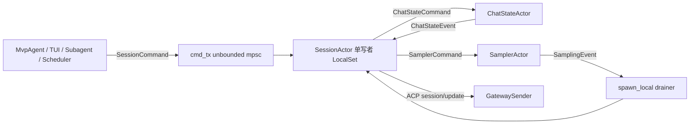
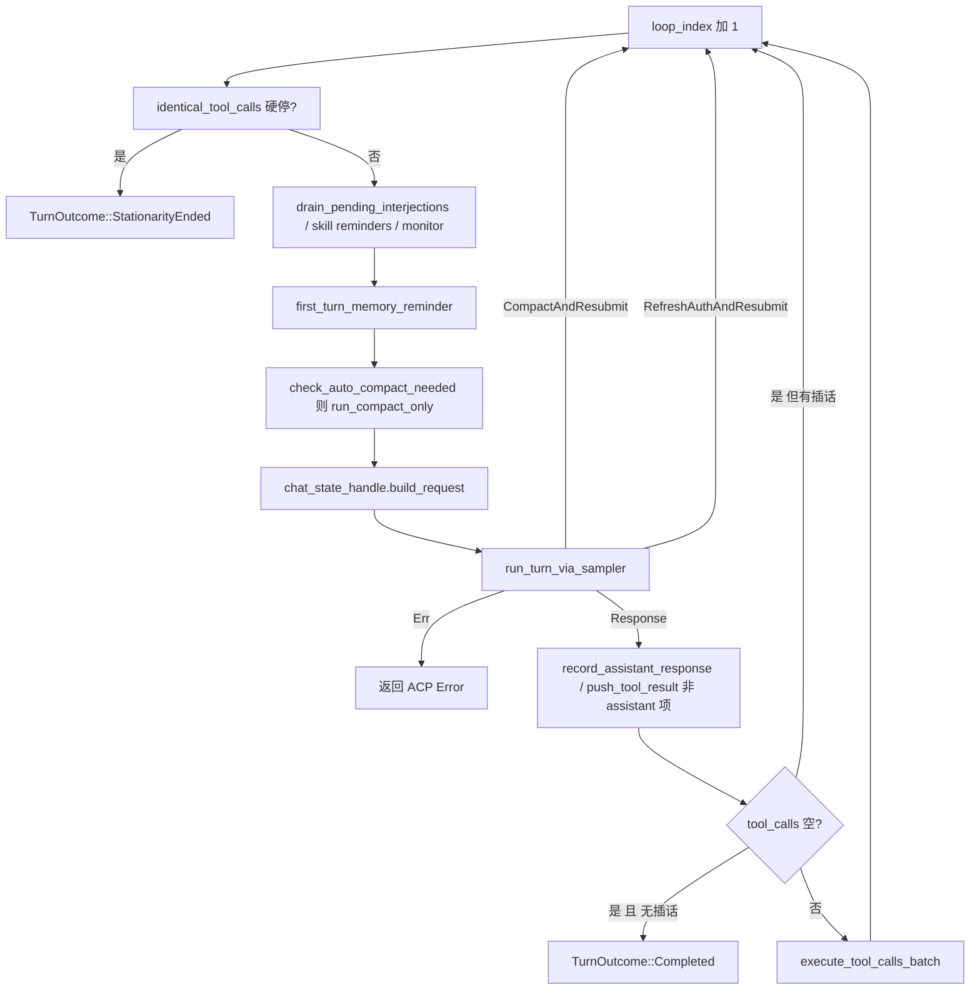
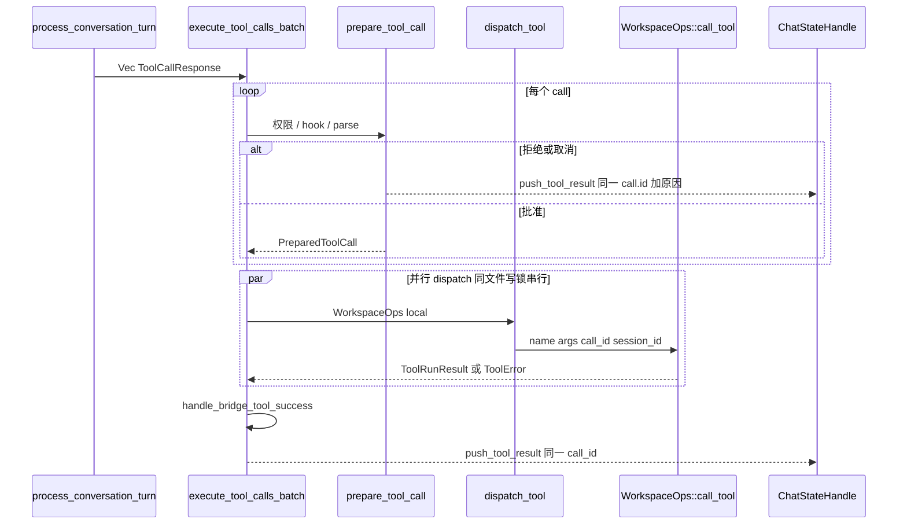

# 07 · Agent 会话与模型循环

> 读完本篇应能：把一次 Prompt 从 `SessionCommand::Prompt` 跟到 `PromptTurnResult`，并解释为什么对话历史、采样流和工具批次必须由单写者串行化。上一篇：[06-TUI交互循环与渲染.md](06-TUI交互循环与渲染.md) · 下一篇：[08-工具协议与扩展体系.md](08-工具协议与扩展体系.md)

## 快速摘要

### 架构总览（模块与依赖）

一次用户 Prompt 的规范所有者是 **Session Actor**（`SessionActor`，实现散落在 `session/acp_session.rs` 与 `session/acp_session_impl/`）。调用方只持有可克隆的 `SessionHandle`，通过无界 `mpsc` 发送 `SessionCommand`。对话事实属于独立的 `ChatStateActor`；HTTP 流式采样属于独立的 `SamplerActor`。三者都是单写者：历史、工具结果、压缩、取消不能在多个任务上并发改同一份 `Vec<ConversationItem>`。

依赖方向（禁止反向）：

```text
Pager / MvpAgent  →  SessionHandle
SessionActor      →  ChatStateHandle + SamplerHandle + WorkspaceOps + Agent/ToolBridge
ChatStateActor    →  ChatPersistence（JSONL）
SamplerActor      →  SamplingClient（HTTP SSE）
```

### 核心调用序列（逐步逻辑）

1. `MvpAgent::prompt`（或 headless / ACP `session/prompt`）构造 `SessionCommand::Prompt`，经 `SessionHandle.cmd_tx` 送入会话邮箱。
2. `run_session` 在 `acp_session_impl/run_loop.rs` 拆字段，调用 `SessionActor::queue_input`；`send_now=true` 时先 `cancel_turn_for_send_now`。
3. `maybe_start_running_task` 从 `pending_inputs` 取出队首，用 `tokio::task::spawn_local` 启动 `AgentTask` → `run_task` → `SessionActor::handle_prompt`。
4. `handle_prompt` 解析 slash / skill、追加用户消息、`ChatStateHandle::begin_turn_capture`，再进入 `process_conversation_turn_with_recovery`。
5. 内层循环：`prepare_tool_definitions_timed` → `ChatStateHandle::build_request` → `run_turn_via_sampler`（`SamplerHandle::submit_and_collect`）。
6. 并行的 `spawn_local` 采样事件 drainer 把 `SamplingEvent` 翻译成 ACP `session/update`。
7. 若响应含 tool calls：`execute_tool_calls_batch` → `dispatch_tool` → `WorkspaceOps::call_tool`；结果用 **同一个 call id** `push_tool_result`。
8. 无 tool call 且无待插话时，`TurnOutcome` 映射为 `PromptCompletionKind`，经 oneshot 回到 ACP。

### 易错点与边界条件

- 会话 Actor 是 `!Send`：必须跑在 `LocalSet` + current-thread runtime 上；跨线程只能搬 `SessionHandle`。
- 流式 token **不是**规范完成消息；`SamplingEvent::Completed` 才是提交屏障。取消后 `streaming_partial.json` 可能单独上传。
- 工具批次里只要有一次 PermissionReject / Cancelled / Followup，后续 call 仍必须用原 id 写入取消结果，否则下次 `build_request` 会触发 dangling repair。
- Esc 取消会武装 task-wake barrier，不自动撤销已写文件、已跑 bash。
- `PromptCompletionKind::RemovedFromQueue` 绝不能发 `prompt_complete` 广播，否则会误报正在跑的 turn 已结束。

---

## 目录

1. [Why：会话必须是单写者](#1-why会话必须是单写者)
2. [What：Handle、LiveState、命令](#2-whathandlelivestate命令)
3. [How：把 Actor 生出来](#3-how把-actor-生出来)
4. [How：Prompt 字段与入队](#4-howprompt-字段与入队)
5. [How：handle_prompt 到采样](#5-howhandle_prompt-到采样)
6. [How：SamplingEvent 翻译到 ACP](#6-howsamplingevent-翻译到-acp)
7. [How：工具批次与 call id 闭合](#7-how工具批次与-call-id-闭合)
8. [压缩](#8-压缩)
9. [插话与 PromptOrigin](#9-插话与-promptorigin)
10. [Subagent](#10-subagent)
11. [取消语义](#11-取消语义)
12. [PromptCompletionKind 每个变体](#12-promptcompletionkind-每个变体)
13. [关键调用关系表](#13-关键调用关系表)
14. [测试证据](#14-测试证据)
15. [重新实现检查清单](#15-重新实现检查清单)
16. [源码文件表](#16-源码文件表)
17. [自检](#17-自检)

---

## 1. Why：会话必须是单写者

会话在磁盘上是可恢复日志（`chat_history.jsonl` + metadata），在进程里是一份有序 `Vec<ConversationItem>`。下列操作都会改这份向量，而且彼此不交换：

| 操作 | 若不串行会发生什么 |
|---|---|
| `PushUserMessage` / `PushAssistantResponse` / `PushToolResult` | 工具结果插到错误的 assistant 之后，API 400 |
| `BuildConversationRequest` 里的 prune / dangling repair / 图片驱逐 | 读到半写入的历史，压缩摘要与 live 历史分叉 |
| `ReplaceConversation`（compaction） | 压缩刚写完，turn 又 push 了一条 tool result，被覆盖 |
| `RepairHistory` | 把正在飞的 tool call 当成 dangling 补一条假结果 |
| 取消 + 新 Prompt | 旧 turn 的 tool result 写进新 turn |

因此工程选择与 `xai-hunk-tracker` 相同的 Actor 模式：一个任务独占状态，调用方只发命令。`ChatStateCommand::RepairHistory` 的注释写明：调用方自己检查 `turn_active` 会与 turn 启动竞态；必须在 Actor 处理命令时再读共享 flag，这样“拒绝”和“突变”在同一 mailbox 里串行。

`SessionLiveState` 注释进一步说明：Grok 会话 **没有** 自己的终端 status 字段——它是磁盘上的可恢复日志——所以“活着”是 **驻留 + 回合状态**，不是 pid。Actor panic 后 join-handle supervisor 把它降为 `Dormant`，对话仍在磁盘上。



---

## 2. What：Handle、LiveState、命令

### 2.1 `SessionLiveState`

定义于 `crates/codegen/xai-grok-shell/src/session/handle.rs`。`pub(crate)`，供 leader / roster 读。

| 变体 | 含义 |
|---|---|
| `Working` | 驻留 Actor，当前有 turn 在跑 |
| `IdleResident` | 驻留 Actor，无 turn |
| `Dormant` | 在磁盘上，本进程未加载（idle-unload 或从未加载） |
| `Completed` | 已结束且可 resume（磁盘上有终端标记） |
| `DeadFailed` | Actor panic / load 失败：JoinHandle 结束且无终端标记；可收割，下次扫描降为 `Dormant` |
| `Attaching` | load / resume 正在构建 Actor |

### 2.2 `SessionHandle`

`Clone + Send` 代理。关键字段（不是完整列表）：

| 字段 | 用途 |
|---|---|
| `cmd_tx` | 发 `SessionCommand` 的唯一入口 |
| `current_prompt_id` | `Arc<Mutex<Option<String>>>`，与 Actor 共享；取消路径只杀本 turn 的 subagent |
| `pending_interactions` | 阻塞式 reverse-request（权限 / 提问 / plan 审批），按 `tool_call_id` 索引 |
| `chat_state_handle` | 只读查询最终对话（mutation 仍应走 Session 命令，避免绕过回合不变量） |
| `mcp_servers` | spawn 时刻快照；`UpdateMcpServers` **不会**回写 handle |
| `plan_mode` | `Arc<Mutex<PlanModeTracker>>`，toggle 可不走命令通道 |
| `force_compact` | 下一 turn 无条件 auto-compact，`compare_exchange` 消费 |
| `attribution_callback` | 传给子会话，保留父 session_id |
| `workspace_ops` | 本会话工具副作用入口 |

几乎所有 `SessionHandle` 方法都是：建 oneshot → `cmd_tx.send(...)` → `rx.await`。Actor 死了时，查询类方法返回保守默认值（例如 `is_busy()` 返回 `true`，避免 leader 把忙会话卸掉）。

### 2.3 `PromptOrigin`

定义于 `session/mod.rs`。由 **prompt_id 前缀**解析，而不是单独的 wire 字段：

| 前缀 | 变体 | `is_synthetic` | 用户 echo 进 scrollback |
|---|---|---|---|
| （其它） | `User` | false | 是 |
| `task-completed-` | `TaskCompleted` | true | 否 |
| `subagent-completed-` | `SubagentCompleted` | true | 否 |
| `workflow-completed-` | `WorkflowCompleted` | true | 否 |
| `notifications-` | `NotificationDrain` | true | 否 |
| `goal-summary-` | `GoalSummary` | true | 否 |
| `goal-classifier-nudge-` | `GoalClassifierNudge` | true | 否 |
| `scheduler-fired-` | `SchedulerFired` | true | 是 |
| `plan-resume-` | `PlanResume` | true | 是 |

合成 prompt 不把用户当“重新介入”：`run_loop` 对 `origin.is_synthetic()` 跳过清除 `task_wake_suppressed`，也不 bump `user_input_generation`（否则会误杀 laziness classifier）。

---

## 3. How：把 Actor 生出来

对外入口是 `spawn_session_on_thread`（`acp_session_impl/spawn.rs`），不是直接 `spawn_session_actor`。原因：`SessionActor` 含 `RefCell` / `LocalSet` 任务，`!Send`。

```mermaid
sequenceDiagram
    participant Agent as MvpAgent
    participant Thread as Session OS thread
    participant RT as current-thread Runtime plus LocalSet
    participant Spawn as spawn_session_actor
    participant CS as ChatStateActor
    participant SM as SamplerActor
    participant Loop as run_session

    Agent->>Thread: spawn_session_on_thread 搬 Send 参数
    Thread->>RT: build_session_runtime
    RT->>Spawn: 在 LocalSet 内构造 !Send SessionActor
    Spawn->>CS: ChatStateActor::spawn_with_pruning
    Spawn->>SM: SamplerActor::spawn
    Spawn->>Loop: spawn_local(run_session)
    Spawn-->>Agent: oneshot 送回 SessionHandle
```

`build_session_runtime` 使用 `tokio::runtime::Builder::new_current_thread().enable_all()`。fd 耗尽必须返回 `Err`，禁止 panic（`panic=abort` 会杀死所有会话）。测试 `runtime_build_failure_is_contained` 用降低 `RLIMIT_NOFILE` 的子进程验证。

`spawn_session_actor` 内部关键步骤：

1. 组装 `SamplingConfig`（context window、reasoning effort、stream_tool_calls）。
2. `ChatStateActor::spawn_with_pruning`：把 resume 进来的 `conversation`、`ChannelChatPersistence`、pruning 配置交给独立 tokio 任务。
3. 若有 `initial_prompt_texts` / `initial_total_tokens` / `initial_last_compaction`，`snapshot` → 改字段 → `restore_snapshot`（resume 校正 prompt_index）。
4. `SamplerActor::spawn`：`event_tx` 接到本会话；`RetryPolicy.max_retries` 默认 5（会话层覆盖 sampler crate 的 `DEFAULT_MAX_RETRIES=15`）。
5. `discover_hooks` 得到 `HookRegistry`；`WorkflowRunStore::from_restored` 恢复 workflow。
6. `spawn_local` 启动 sampler event drainer：`while let Some(event) = sampler_event_rx.recv()` → `handle_sampling_event`。
7. `spawn_local(run_session(...))` 进入命令循环。
8. 返回 `SessionHandle`（含 `cmd_tx`、共享 `current_prompt_id`、`chat_state_handle` 等）。

ChatState 与 Sampler 都是 **独立 Actor**：Session 通过 Handle 发命令，通过事件通道观察。不要在 Session 里直接锁 ChatState 的 `Vec`。

---

## 4. How：Prompt 字段与入队

### 4.1 `SessionCommand::Prompt` 逐字段

定义于 `session/commands.rs`。`run_loop` 原样拆开后填入 `QueueInputRequest`。

| 字段 | 类型 | 职责 |
|---|---|---|
| `prompt_id` | `String` | 本 turn 关联键；前缀决定 `PromptOrigin`；也是 usage / 取消 / subagent 作用域 |
| `prompt_blocks` | `Vec<acp::ContentBlock>` | 用户内容（文本 + 图片）；slash 解析在 `handle_prompt` 内发生 |
| `prompt_mode` | `PromptMode` | 来自请求 `_meta.mode`；`handle_prompt` 再用 `resolve_turn_prompt_mode` 与 plan tracker 对齐 |
| `artifact_upload_ctx` | `Option<ArtifactUploadContext>` | 拆成 `trace_gcs_config` + `artifact_tracker`，给采样请求挂 GCS trace |
| `client_identifier` | `Option<String>` | 覆盖会话级 client id（leader 多客户端） |
| `screen_mode` | `Option<String>` | 仅遥测：`fullscreen` / `inline` / `minimal` / `headless` |
| `verbatim` | `bool` | 跳过 `<user_query>` 包装与大 prompt 截断（合成 / 内部注入） |
| `traceparent` | `Option<String>` | W3C traceparent；`run_loop` 用它把 `session.handle_prompt` span 链回 `agent.prompt` |
| `json_schema` | `Option<Value>` | `--json-schema`；native backend 写入 request，否则注入 `StructuredOutput` 伪工具 |
| `send_now` | `bool` | 取消正在跑的 turn，让本 prompt 下一个跑；中断式 wait 窗口也会由服务端派生 |
| `admission` | `Option<TaskWakeAdmission>` | 终端任务完成自动唤醒的准入；失败则 `respond_removed_prompt` |
| `tool_overrides_update` | `Option<ToolOverridesUpdate>` | 本 turn 起生效的工具覆盖 |
| `respond_to` | `oneshot::Sender<PromptTurnResult>` | ACP `session/prompt` RPC 的最终答复 |
| `persist_ack` | `Option<oneshot::Sender<()>>` | 用户消息已 append **且** persistence flush barrier 完成后、推理开始前触发 |
| `parsed_prompt_tx` | `Option<oneshot::Sender<ParsedPromptInfo>>` | 解析后把截断后文本送回，避免调用方再 parse 一遍写 metadata |

### 4.2 入队与启动

```mermaid
sequenceDiagram
    participant Loop as run_session
    participant Q as queue_input
    participant Start as maybe_start_running_task
    participant Task as run_task spawn_local
    participant HP as handle_prompt

    Loop->>Q: QueueInputRequest
    alt send_now 或中断式 wait
        Q-->>Loop: true
        Loop->>Loop: cancel_turn_for_send_now
    else 普通排队
        Q-->>Loop: false
    end
    Loop->>Start: 若无 running_task 则弹出队首
    Start->>Task: AgentTask::new_prompt
    Task->>HP: handle_prompt(...)
    HP-->>Task: PromptTurnResult
    Task->>Loop: completion_tx 发送 prompt_id 加结果
```

`queue_input`（`prompt_queue.rs`）把 `InputItem` 推进 `state.pending_inputs`。`send_now` 插到正在跑的 front 之后（不能把 running 那一行挤掉，否则 `handle_completion` 的 front pop 会错位）。返回 `true` 时调用方必须取消当前 turn。

`maybe_start_running_task`（`notification_drain.rs`）保证 **同一时刻最多一个** `running_task`。`AgentTask` 持有 `AbortHandle`；新任务会 abort 旧的 debounce / prefix 任务。

`run_task`（`tasks_cancel.rs`）是 LocalSet 上的实际 turn 任务：调用 `handle_prompt`，把 `(prompt_id, PromptTurnResult)` 发到 `completion_tx`。`TurnSubagentScopeGuard` 在 `handle_prompt` 开始时把 `current_prompt_id` 设为本 prompt，Drop 时若仍是自己则清掉——这就是取消路径能“只杀本 turn 的子代理”的原因。

---

## 5. How：handle_prompt 到采样

### 5.1 `handle_prompt` 前半段

`SessionActor::handle_prompt`（`acp_session_impl/turn.rs`）是回合编排器，不是采样器。

1. 由 `prompt_id` 得到 `PromptOrigin`。合成完成类 origin 会 `mark_completions_reported` 并释放 `task_completion_reservations`。
2. 非合成 prompt：`invalidate_side_calls_for_new_prompt`（杀掉 in-flight recap / side question）。
3. `ensure_session_disk_writable`：磁盘满则整 turn 失败。
4. `TurnActiveGuard` 把 `tool_context.is_turn_active` 与 `session_turn_active` 置 true；Drop 时清 false。这挡住并发 `RepairHistory`。
5. 扩展点 `turn_lifecycle_contributors().on_turn_start`。
6. 直通 bash（prompt 被识别为 `!command`）走 `handle_direct_bash_command`，不进模型循环。
7. `slash_commands::resolve`：内建 slash（`/goal`、`/compact`、workflow launch）可能直接 `ok_end_turn` 返回，根本不采样。
8. 规范化图片、包装 `<user_query>`（除非 `verbatim`）、`begin_turn_capture`、`increment_prompt_index`、`push_user_message`（若有 `persist_ack` 则 `push_user_message_and_ack` + `FlushAndAck`）。
9. `dispatch_hook(UserPromptSubmit)`。
10. `TurnSubagentScopeGuard` + `open_subagent_spawn_admission`。
11. 循环调用 `process_conversation_turn_with_recovery`（goal continuation / stop-gate 可能再跑一轮）。

### 5.2 ChatState 如何组请求

`ChatStateHandle::build_request` 发 `ChatStateCommand::BuildConversationRequest`，oneshot 等 `ConversationRequest`。Actor 侧（`actor/mod.rs` + `actor/request_builder.rs`）：

1. **先** `ensure_conversation_integrity()`（dangling tool call 修复、重复 tool result 去重）。注释强调：只在写边界和这次 build 上修，普通 Get 查询不修，以免后台任务改历史。
2. `build_conversation_request`：接近 50% 窗口则 prune 旧 tool result；接近 50 MB 则驱逐最旧 inline 图片；可选把 memory reminder 持久化进 system 消息；clone 后注入 reminder；装配 `ConversationRequest`（含 `tool_definitions`、`conv_id`、`req_id`）。

Session 拿到 request 后再填：`x_grok_session_id`、`x_grok_turn_idx`（prompt_index）、`x_grok_agent_id`、`hosted_tools`、`json_schema`（native 路径）、`max_output_tokens`（task 预算 clamp）。

### 5.3 内层 agentic 循环

`process_conversation_turn` 是一个 `loop`，每次迭代 = 一次模型调用 + 可选一批工具：



`run_turn_via_sampler`（`sampler_turn.rs`）：

1. `prepare_sampler_for_turn`（auth 刷新 + `sampler_handle.update_config`）。
2. 安装 `turn_stream_drained` oneshot：drainer 在 `SamplingEvent::Completed` 时 `tx.send(())`。
3. `SamplerHandle::submit_and_collect(request_id, request)`。该方法内部有 `CancelOnDrop`：future 被 drop（取消 / panic）时向 Sampler 发 `Cancel`。
4. 成功后最多等 5 秒 stream-drain barrier，再返回 `ConversationResponse`。这保证 UI 上的 token chunk 都发出去了，才开始发 tool call 通知（eventId 顺序）。
5. 失败走 `handle_sampling_failure`：上下文超限 → compact 再 `CompactAndResubmit`；401 恢复成功 → `RefreshAuthAndResubmit`；其余 → 已发 `RetryState::Failed` 的 ACP error。

Sampler 自己的重试在 `xai-grok-sampler`：`classify_error` + `retry_backoff_with_jitter`（2s 起指数，封顶 30s，±20% jitter）。429 另计 `RATE_LIMIT_RETRY_THRESHOLD=2`。`IdleTimeout` / `MaxTokensTruncation` / `Auth` / 非 429 的 4xx **不重试**。会话层 `RetryPolicy.max_retries` 默认 5，覆盖 crate 默认 15。

---

## 6. How：SamplingEvent 翻译到 ACP

Sampler 的三层 API（`xai-grok-sampler/src/lib.rs`）：

| 层 | 符号 | 职责 |
|---|---|---|
| L1 | `SamplingClient` | 原始 HTTP chunk stream |
| L2 | `stream_chat_completions` / `stream_responses` / `stream_messages` | 变成 `SamplingEvent` |
| L3 | `SamplerHandle` + `SamplerActor` | 并发请求、重试、取消；事件走共享 channel |

Session spawn 时 `spawn_local` 一个 drainer，**不**在 turn 任务里 recv。这样 UI 更新与 `submit_and_collect` 的 oneshot 并行。映射表（`handle_sampling_event`）：

| `SamplingEvent` | Session 行为 |
|---|---|
| `StreamStarted` | `streaming_turn_capture.begin_turn`；`record_stream_start` |
| `FirstToken` | `Event::FirstToken` |
| `ChannelToken { Text }` | capture append；`AgentMessageChunk` |
| `ChannelToken { Reasoning }` | capture append；`send_thought_chunk` |
| `ToolCallDelta` | `XaiSessionUpdate::ToolCallDeltaChunk`（单片 args **不必**是合法 JSON） |
| `ResponseStarted` | Messages API 的真实 message id / cache token（仅该 backend） |
| `ReasoningCompleted` | 加密 thinking signature |
| `Completed` | 触发 stream-drain oneshot；记录 inference metrics；**不**在这里 push assistant——canonical 提交在 turn 循环拿到 `ConversationResponse` 之后 |
| `Retrying` | `RetryState::Retrying`；DoomLoop 计入 `doom_loop_turn_tally` |
| `Failed` | 打日志 + `record_error_typed`；语义恢复在 `handle_sampling_failure` |
| `ModelMetadata` | `handle_model_metadata_update` |
| `BackendToolCallStarted/Completed` | 后端托管工具（如 web search）的 ACP ToolCall 通知；客户端 **不执行** |

测试 `replay_buffer_send_update_tests.rs` 固定了：`Completed` 才提交 canonical assistant；`Failed`（含取消）不得把半截 generation 当成完成消息。

---

## 7. How：工具批次与 call id 闭合

模型返回的每个 `ToolCall` 带 `id`（API 侧）和 ACP `ToolCallId`。闭合规则：**结果必须用同一个 id 写回 `ConversationItem::tool_result`**，否则下次 `ensure_conversation_integrity` 会补假结果或 400。

`execute_tool_calls_batch`（`tool_calls.rs`）：



要点：

1. **Prepare 阶段已失败**（权限拒绝、用户取消、hook deny）：仍 `push_tool_result(call.id, message)`。批次后续 call 若 `final_result` 已置位，也用原 id 写“因先前拒绝而取消”。
2. **同路径写锁**：`lock_path_for_args` 看 `file_path` / `path` / `target_file`。同一路径共享 `tokio::sync::Mutex`，按模型发出顺序串行；读/list 不锁。
3. **可中断 wait**：`get_task_output`（wait）、`wait_tasks`、`Await` 等与 `wait_for_pending_interjection` 做 `select!`。用户插话时返回合成 `ToolRunResult`（status=`cancelled`），**仍然闭合 call id**。
4. **空 id**：合成 `missing-call-id-{idx}` 并 warn，避免无法 join。
5. **成功路径**：`handle_bridge_tool_success` 发 ACP `ToolCallUpdate`，再 `ConversationItem::tool_result(call_id, prompt_text)`（PDF 可读成带 images 的变体）。`call_id` 是模型侧 id，ACP 通知用 `tool_call_id`。
6. `dispatch_tool` 本身只做 `workspace_ops.call_tool(name, parsed_args, tool_call_id, session_id)`。Local 模式：`handle.session(id).toolset().call(...)`。细节见 [08](08-工具协议与扩展体系.md)。

`ChatStateActor` 把 `PushToolResult` 与 `PushAssistantResponse` 都当成 `push_message`：顺序由 Session 保证，ChatState 不重排。

---

## 8. 压缩

压缩策略对象在 `xai-grok-agent::CompactionPolicy`；**何时压、压完写什么** 由 Session + ChatState 共同完成。

`CompactionMode`（`xai-chat-state/src/compaction_mode.rs`）：

| 模式 | 模型事后看到什么 |
|---|---|
| `Summary`（默认） | 只有摘要 |
| `Transcript` | 摘要 + 指向完整 `updates.jsonl` |
| `Segments(detail)` | 摘要 + `compaction/segment_*.md` 与目录 |

环境变量 `GROK_COMPACTION_MODE` / `GROK_COMPACTION_DETAIL` 在 spawn 时解析进 session。

触发点：

- **预采样**：`process_conversation_turn` 在 `build_request` 前 `check_auto_compact_needed` → `run_compact_only`。
- **采样失败**：`handle_sampling_failure` 识别 context-length（400 + metadata），compact 后 `CompactAndResubmit`。
- **用户**：`SessionCommand::CompactSession { user_context, respond_to }`。
- **调试**：`SessionHandle.force_compact` 使下一 turn 无条件触发。

`run_compact_only`（`session/compaction.rs`）：进入 `compaction.cancel` 作用域（Esc 可中止压缩生成）、发 `AutoCompactStarted`、`run_compact_inner`（内部再用 Sampler 做一次 **无工具** 摘要调用）、`ChatStateHandle::replace_conversation_for_compaction` + `record_compaction_at(prompt_index)`。压缩是一次 `ReplaceConversation { is_compaction: true }`：ChatState 重估 `total_tokens`，turn capture 标记 `compaction_occurred`。

失败路径：auth 错误走 `surface_compact_auth_failure`，不把半截摘要写进历史。`cancel_running_task` 会 `compaction.cancel.request_cancel()`。

---

## 9. 插话与 PromptOrigin

插话缓冲类型来自 `xai-interjection-core`（`InterjectionBuffer` / `drain_formatted`）。Shell 负责到达、持久化、pager echo。

两条进入路径：

| 命令 | 语义 |
|---|---|
| `SessionCommand::Interject { text, id, images }` | 不取消 turn；推进 `pending_interjections`；在 `process_conversation_turn` 每次模型调用前、以及“本将 Completed”时 `drain_pending_interjections` |
| `SessionCommand::InterjectQueuedPrompt` | **原子**：从 `pending_inputs` 移除该排队项并推进插话缓冲，避免同一条既插话又稍后自己开一轮 |

安全点（drain 时机）：模型调用之间、tool 批次之后、判定 Completed 之前、turn-end bookkeeping 期间再查一次。若 drain 成功，循环 `continue`，把插话当作新的 user item 再采样。

错过最终 drain（到达时 idle，或 turn 已结束）会变成独立 turn：`queue_interjection_fallback_prompt` 使用 `interject-fallback-` 前缀。`user_echo_mode` 对此前缀为 `PersistOnly`——pane 已经从 `x.ai/session/interjection` 广播画过一遍，再 live echo 会重复。

`PromptOrigin` 还控制自动唤醒是否与用户排队冲突：`admit_task_completion_wake` 在 `notifications_suppressed` 或 `task_wake_suppressed` 时拒绝，并把 fallback 塞回队列；`respond_to` 对 ACP 走 `RemovedFromQueue`。

---

## 10. Subagent

子代理不是“函数调用”，而是 **另一套 Session Actor**。

1. 模型调用 grok_build 的 `task` 工具（`xai-grok-tools/.../grok_build/task/`）。
2. `TaskTool` 通过 `SubagentBackendResource` 把 spawn 请求发到 coordinator。
3. Shell `agent/subagent/handle_request.rs` 调 `spawn_session_on_thread`，把父 `SessionHandle` 上的 MCP pool、hooks、attribution_callback、`max_turns`、terminal backend、scheduler 继承过去。
4. 子会话 `startup_hints.is_subagent = true`。取消时只 `kill_foreground_commands_by_owner`，不杀父/兄弟在共享 backend 上的进程。
5. 默认 `MAX_SUBAGENT_DEPTH = 1`。
6. 子会话 usage 经 `SessionCommand::RecordSubagentUsage` 折入父 `ChatState` ledger。fold 失败必须 drop oneshot，让子会话视为未落地（`MarkSubagentUsageNotApplied`）。
7. `handle_prompt` 结束前 `freeze_prompt_usage` 最多等 120s 等 **turn-blocking** 子代理；后台子代理不阻塞，只把 prompt report 标 incomplete。
8. **取消路径故意跳过** 这段多秒 drain（actor loop 不能卡住）。

Goal harness 的 planner / verifier 子代理把合成 `task` pair 写入 `AppendHarnessTraceItems`，**不进入** live `conversation`；`FlushHarnessTraceTurn` 封成独立 trace 产物。

---

## 11. 取消语义

取消入口：`SessionCommand::Cancel(CancelOptions)`。

`CancelOptions`：

| 字段 | 作用 |
|---|---|
| `cancel_subagents` | 先 abort 本 turn 任务（阻止再 enqueue TaskTool），再 `cancel_all_session_subagents` 并关闭 spawn admission |
| `kill_background_tasks` | 子代理 teardown 时为 true；交互会话通常保留后台 bash |
| `rewind_if_no_output` | 无输出则 rewind，而不是标 Cancelled |
| `trigger` | `CancelTrigger`：Esc / CtrlC / SendNow / Shutdown / SessionClose / SessionDelete / Client(string) |
| `user_initiated` | 计入 cancel-rate 指标 |

`CancelTrigger::from_client`：只有 `"esc"` / `"ctrl_c"` 映射到内部变体；其它字符串进 `Client(_)`，**客户端不能伪装** `SendNow` / `Shutdown`。`is_stop_gesture` 为 true 时武装 task-wake barrier（`task_wake_suppressed` + `notifications_suppressed`），防止取消后后台任务立刻又唤醒一轮。

`cancel_running_task` 顺序：

1. `compaction.cancel.request_cancel()`。
2. 若 stop gesture：先置 barrier（在第一个 await 之前，避免 completion 抢先唤醒）。
3. 可选 abort + 取消全部 session 子代理。
4. `kill_foreground_commands`（子代理按 owner）。
5. abort `running_task` 的 `AbortHandle` → drop `handle_prompt` future → `SamplerHandle` 的 `CancelOnDrop` 发 `SamplerCommand::Cancel`。
6. 用同一 call id 修复仍 dangling 的 tool calls（reason=cancelled）。
7. 经 `completion_tx` / `respond_to` 送出 `PromptCompletionKind::Cancelled`。

**不变量：取消只停止未来工作。** 已 `search_replace` 的文件、已跑完的 bash、已发出的 MCP 调用不会自动 rollback。对账在 Workspace / hunk tracker（见 `09`）。

`send_now` 走 `cancel_turn_for_send_now`：取消当前 turn 但 **清除** wake barrier（用户在重新介入）。

测试：`cancel_running_task_teardown_clears_running_and_pending_work`、`cancel_running_task_interactive_preserves_queued_work`（`acp_session_tests/cancel_running_task_tests.rs`）。

---

## 12. `PromptCompletionKind` 每个变体

`PromptTurnResult = Result<PromptTurnOk, acp::Error>`。`PromptTurnOk` 带 `stop_reason`、`total_tokens`、`turn_snapshot`、`completion_kind`、`structured_output`、`usage`、`tool_overrides`。

`handle_prompt` 末尾把 `TurnOutcome` 映射过来；队列层另有两个不经过 `handle_prompt` 的变体。

| 变体 | 谁产生 | ACP `StopReason` | 副作用 |
|---|---|---|---|
| `Completed` | `TurnOutcome::Completed` | `EndTurn`；若 `refusal` 则 `Refusal` | `on_turn_done`；StopFailure hook（仅 refusal）；`TurnEnded { Completed }` |
| `StationarityEnded` | 相同 tool call 连打超过硬阈值（含 `true` noop） | `EndTurn` | **不**把 goal continuation 再入队；与 Completed 刻意分开 |
| `Cancelled { category, context }` | `TurnOutcome::Cancelled` 或 `tasks_cancel` 在 abort 后组装 | `Cancelled` | `on_turn_abort`；不 drain 120s subagent usage；`cancelTrigger` 进 turn-end `_meta` |
| `MaxTurnsReached { limit }` | 会话 `max_turns` | `Cancelled` | 同样走 abort 生命周期；取消本 turn 子代理 |
| `Rewound` | rewind 清掉未完成 turn（`tasks_cancel.rs`） | 由 rewind 路径决定 | **不是**用户 stop；不记 cancellation 指标 |
| `RemovedFromQueue` | `respond_removed_prompt`：队列删除 / 未准入的 task-wake | 成功 `PromptTurnOk` 但 completion_kind 为此 | **禁止** `prompt_complete` 广播和 roster Idle——该 prompt 从未开始 turn |

`ok_end_turn` 是 slash / host-turn 捷径：`Completed` + `EndTurn` + 0 tokens。

`turn_end.rs` 按 `completion_kind` 决定是否发 completion 广播、是否把 session 标 Idle、是否写 durable `TurnCompleted`。把 `RemovedFromQueue` 误当成 `Completed` 会在 leader 模式下让所有附加客户端以为 **正在跑的** turn 结束了（广播不带 `promptId`）。

---

## 13. 关键调用关系表

| 调用方文件与符号 | 关系 | 被调用方文件与符号 | 触发与输入 | 返回与后续处理 | 错误、状态与副作用 |
|---|---|---|---|---|---|
| `mvp_agent` / ACP `session/prompt` | 发命令 | `SessionHandle.cmd_tx` → `SessionCommand::Prompt` | prompt_id、blocks、oneshot | 异步；结果在 `respond_to` | 通道关闭 → RPC internal error |
| `run_loop.rs` Prompt 臂 | 调用 | `SessionActor::queue_input` | `QueueInputRequest` | `bool`（是否要 cancel） | 改 `pending_inputs` |
| `queue_input` 返回 true | 调用 | `cancel_turn_for_send_now` | replay_buffer | 当前 turn Cancelled | 清 wake barrier |
| `maybe_start_running_task` | spawn_local | `run_task` → `handle_prompt` | 队首 `InputItem` | `PromptTurnResult` 经 `completion_tx` | `running_task` 占槽 |
| `handle_prompt` | 调用 | `ChatStateHandle::push_user_message(_and_ack)` | `ConversationItem` | ack 后才推理 | persist_ack flush 失败只打 error，仍可能继续 |
| `process_conversation_turn` | 调用 | `ChatStateHandle::build_request` | tools、memory、trace、ids | `ConversationRequest` | Actor 死 → `expect` panic（视为会话死亡） |
| `run_turn_via_sampler` | 调用 | `SamplerHandle::submit_and_collect` | `RequestId` + request | `(ConversationResponse, metrics)` | Drop 时 Cancel；失败 → `handle_sampling_failure` |
| Sampler L2 stream | 发事件 | `handle_sampling_event` | `SamplingEvent` | ACP updates | Completed 解开 drain barrier |
| `execute_tool_calls_batch` | 调用 | `dispatch_tool` → `WorkspaceOps::call_tool` | name、args、call_id、session_id | `ToolRunResult` | 同文件 Mutex；wait 可被插话打断 |
| `handle_bridge_tool_success` | 调用 | `ChatStateHandle::push_tool_result` | **同一** `call_id` | 下一轮 build_request 看到闭合对 | 失败也必须 push |
| `handle_prompt` 尾 | 映射 | `PromptCompletionKind` | `TurnOutcome` | `PromptTurnOk` | Err 经 `attach_prompt_usage` |

ChatState 内部：`ChatStateActor::spawn_with_pruning` → `run` select 取消 token 与 `cmd_rx` → `handle_command`。Mutation 走 `actor/mutations.rs`；`BuildConversationRequest` 走 `request_builder.rs`。

Sampler 内部：`SamplerActor::run` JoinSet 收割 per-request task；`request_task.rs` 拥有重试环，消费 L2 stream，对每个 attempt 发 `Retrying` / `Completed` / `Failed`。

---

## 14. 测试证据

| 测试位置 | 覆盖的行为 |
|---|---|
| `session/mod.rs` `from_prompt_id_*` | PromptOrigin 前缀解析 |
| `commands.rs` `cancel_trigger_tests` | 只有 stop gesture 武装 wake barrier；`SendNow` 不是 |
| `cancel_running_task_tests.rs` | teardown 清 running；交互取消保留队列；`handle_prompt` 在用户消息前注入 interrupt reminder |
| `prompt_queue_actor_tests.rs` | send_now 插入位置；合成 prompt 免 send_now；`RemovedFromQueue` |
| `replay_buffer_send_update_tests.rs` | SamplingEvent → ACP；Completed 才提交；Failed 不提交半截流 |
| `turn/chat_history_integrity_tests.rs` | dangling / 配对 |
| `turn/disk_full_tests.rs` | 磁盘满时 handle_prompt 失败 |
| `turn/auth_retry_budget_tests.rs` | 401 预算耗尽 |
| `inline_auto_compact_flow_tests.rs` | 自动压缩 |
| `xai-chat-state` `handle.rs` `noop_handle_does_not_panic` | Actor 死后 send 被忽略 |
| `xai-grok-sampler` `events.rs` 分类测试 | 401/429/5xx/IdleTimeout → `SamplingErrorKind` |

未覆盖风险（推断）：完整“用户回车 → SSE → 多工具并行 → 插话 → Completed”依赖 PTY E2E；单测多用 fake sampler。Doom-loop 有 `tests/test_doom_loop_recovery.rs`。

---

## 15. 重新实现检查清单

必须保持的行为契约：

1. 每个会话一个单写者 Actor；UI 不得直接 `push` 对话向量。
2. Handle 可 `Send`；Actor 可 `!Send`（LocalSet）。
3. 一次只有一个 `running_task`；其余进 `pending_inputs`。
4. `build_request` 前修复 dangling tool calls。
5. 每个 tool call id 恰好一个 terminal tool result（成功、拒绝、取消都算）。
6. 流式 chunk 可丢；`Completed` 的 `ConversationResponse` 是事实源。
7. 取消不 rollback 已发生的 FS / 进程副作用。
8. `RemovedFromQueue` 不触发 turn-complete 广播。
9. `StationarityEnded` 不唤醒 goal continuation。
10. 合成 PromptOrigin 不清除用户取消设置的 wake barrier。

可替换的实现：current-thread vs multi-thread（只要命令串行）；Sampler 三层是否拆 crate；ChatState 是否独立进程（只要 persistence 与 repair 语义相同）。

建议实现顺序：假 `SessionHandle`（固定 `Completed`）→ ChatState JSONL + dangling repair → 真 Sampler SSE → 工具批次闭合 → 取消 / 插话 / compact。

---

## 16. 源码文件表

| 路径 | 关键符号 |
|---|---|
| `crates/codegen/xai-grok-shell/src/session/handle.rs` | `SessionHandle`、`SessionLiveState` |
| `crates/codegen/xai-grok-shell/src/session/commands.rs` | `SessionCommand`、`PromptTurnOk`、`PromptCompletionKind`、`CancelOptions` |
| `crates/codegen/xai-grok-shell/src/session/mod.rs` | `PromptOrigin` |
| `crates/codegen/xai-grok-shell/src/session/acp_session.rs` | `SessionActor` 字段、模块装配 |
| `crates/codegen/xai-grok-shell/src/session/acp_session_impl/spawn.rs` | `spawn_session_actor`、`spawn_session_on_thread`、`build_session_runtime` |
| `crates/codegen/xai-grok-shell/src/session/acp_session_impl/run_loop.rs` | `run_session`、Prompt 臂 |
| `crates/codegen/xai-grok-shell/src/session/acp_session_impl/prompt_queue.rs` | `queue_input`、`respond_removed_prompt` |
| `crates/codegen/xai-grok-shell/src/session/acp_session_impl/turn.rs` | `handle_prompt`、`process_conversation_turn` |
| `crates/codegen/xai-grok-shell/src/session/acp_session_impl/sampler_turn.rs` | `run_turn_via_sampler`、`handle_sampling_failure` |
| `crates/codegen/xai-grok-shell/src/session/acp_session_impl/tool_calls.rs` | `execute_tool_calls_batch`、`handle_sampling_event`、`handle_bridge_tool_success` |
| `crates/codegen/xai-grok-shell/src/session/acp_session_impl/tool_dispatch.rs` | `dispatch_tool` |
| `crates/codegen/xai-grok-shell/src/session/acp_session_impl/tasks_cancel.rs` | `run_task`、`cancel_running_task`、`AgentTask` |
| `crates/codegen/xai-grok-shell/src/session/acp_session_impl/interjection.rs` | 插话 drain / fallback |
| `crates/codegen/xai-grok-shell/src/session/acp_session_impl/turn_end.rs` | completion 广播策略 |
| `crates/codegen/xai-grok-shell/src/session/compaction.rs` | `run_compact_only` |
| `crates/codegen/xai-chat-state/src/{lib,handle,commands}.rs` | `ChatStateHandle`、`ChatStateCommand` |
| `crates/codegen/xai-chat-state/src/actor/{mod,request_builder}.rs` | `spawn_with_pruning`、`build_conversation_request` |
| `crates/codegen/xai-chat-state/src/compaction_mode.rs` | `CompactionMode` |
| `crates/codegen/xai-grok-sampler/src/{lib,handle,events,retry}.rs` | `SamplerHandle`、`SamplingEvent`、`classify_error` |
| `crates/codegen/xai-grok-sampler/src/actor/{mod,request_task}.rs` | Actor 循环、重试任务 |
| `crates/codegen/xai-grok-agent/src/lib.rs` | `Agent`、`AgentBuilder`、`AgentDefinition` |
| `crates/codegen/xai-grok-shell/src/agent/subagent/handle_request.rs` | 子会话 `spawn_session_on_thread` |

---

## 17. 自检

1. 打开 `handle.rs`，用自己的话解释为什么 `SessionLiveState` 不是进程 pid。
2. 对着 `commands.rs` 把 `SessionCommand::Prompt` 每个字段讲给另一个人听。
3. 从 `run_loop.rs` Prompt 臂画到 `submit_and_collect`，标出每一跳的 channel 类型（unbounded mpsc / oneshot / spawn_local）。
4. 在 `tool_calls.rs` 找到三处 `push_tool_result`：成功、prepare 失败、批次提前终止。确认都使用原 call id。
5. 说出 `PromptCompletionKind` 六个变体各自 **禁止** 触发的副作用。
6. 若文档与源码冲突：以源码和上表测试为准。

阅读源码建议顺序：`handle.rs` → `commands.rs` Prompt 变体 → `spawn.rs` 后半（drainer + `run_session`）→ `run_loop.rs` Prompt 臂 → `turn.rs` `handle_prompt` / `process_conversation_turn` → `sampler_turn.rs` → `tool_calls.rs` batch + `handle_sampling_event` → `tasks_cancel.rs`。

下一篇把 `dispatch_tool` 之后的 `Tool` trait、MCP、Hub、Hooks 展开：[08-工具协议与扩展体系.md](08-工具协议与扩展体系.md)。
