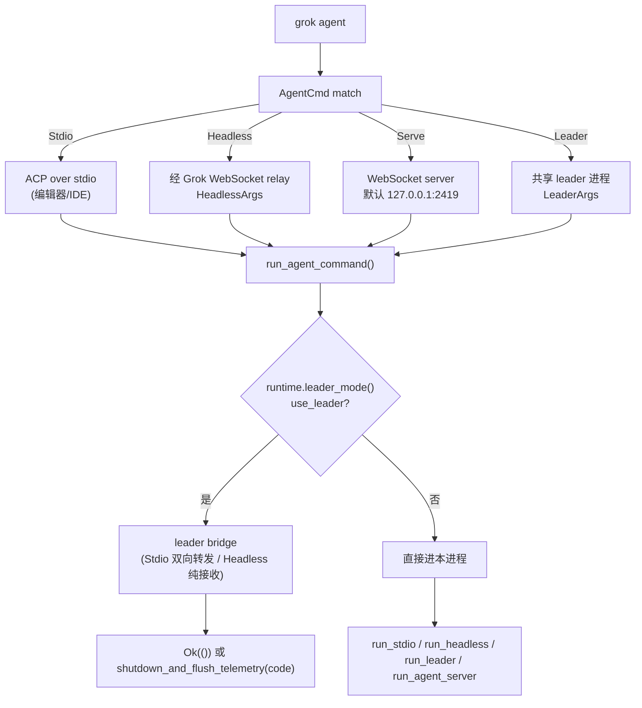

[上一篇：配置与数据流](06-配置与数据流.md) · [总目录](README.md) · [下一篇：TUI交互循环与渲染](08-TUI交互循环与渲染.md)

# 程序入口与运行模式：一个二进制分发多种形态

> **第 7 / 18 篇** · 采样于 2026-09-23（CST）· 工作区 `HEAD = 2178c69c`
> **工具版本：Rust 1.94.0（rust-toolchain.toml:11）**；`agent-client-protocol 0.10.4`（`Cargo.toml:118`）；workspace members = **102**。
> **场景**：`grok` 敲下后，从进程启动到进入 TUI / minimal / headless / stdio ACP / leader / workspace 等模式，中间经历了什么。本文把 `main()` → `async_main()` 的分发写成可照抄的启动状态机。

> **阅读说明**：本文讲**调用关系与数据流**，不把行号当稳定 API。源码索引统一写成「`文件路径` · `符号(+函数内相对偏移)`」，`+0` 即该函数定义行；非函数定义用 `Struct：X` / `Enum：Y` / `Const：Z`。组合根 `main.rs` 有意**不放领域逻辑**，所有模式都委托给各自 crate。
>
> **与旧版指南的重要差异（先说结论）**：
> 1. 组合根仍是 `crates/codegen/xai-grok-pager-bin/src/main.rs`（3778 行）+ `agent_command.rs`（100 行）。**`main` 与 `async_main` 都不在文件头部**：`main(+0)` 位于文件后半段，`async_main` 紧随其后。旧文档把 `main` 当成 `+0` 是行号快照，不具稳定性。
> 2. 包名是 `xai-grok-pager-bin`，**产物二进制名是 `xai-grok-pager`**（`Cargo.toml` `[[bin]] name`），发行/安装名是 `grok`（`xai-grok-config/src/paths.rs` · `grok_application(+1)` → `$GROK_HOME/bin/grok`）。
> 3. **`cli.rs` 不在 pager-bin 里**：`Command` / `PagerArgs` / `AgentArgs` 住在 `xai-grok-pager/src/app/cli.rs`，`Command` 仍有 **24 个变体**。
> 4. worker 线程默认是 `min(cores, 8)`；runtime 退出走 `shutdown_timeout(2s)` 而非直接 drop。
> 5. **「运行模式」不只有 TUI / headless**：TUI 内部还分 `Fullscreen` / `Inline` / `Minimal` 三种 `ScreenMode`，且 `agent` 子命令再分 `Stdio` / `Headless` / `Serve` / `Leader` 四种。详见 §7。
> 6. `version` / `doctor` 在建 runtime 之前就返回；`completions` / `wrap` 在 `async_main` 最前面返回。

---

### 本文件内容

1. [Why：为什么一个二进制要服务多种模式](#1-why为什么一个二进制要服务多种模式)
2. [main() 启动状态机](#2-main-启动状态机)
3. [async_main 的 Command match（全命令面）](#3-async_main-的-command-match全命令面)
4. [run_agent_command：stdio / headless / serve / leader](#4-run_agent_commandstdio--headless--serve--leader)
5. [Tokio worker 线程数](#5-tokio-worker-线程数)
6. [退出路径：shutdown_and_flush_telemetry 与 run_and_shutdown](#6-退出路径shutdown_and_flush_telemetry-与-run_and_shutdown)
7. [各模式的进程图、屏幕模式与 stdin/stdout 所有权](#7-各模式的进程图屏幕模式与-stdinstdout-所有权)
8. [重实现第一步：空壳 main 分发 4 种模式](#8-重实现第一步空壳-main-分发-4-种模式)

其余阶段见[总目录](README.md)。

---

## 1. Why：为什么一个二进制要服务多种模式

同一个 `grok` 二进制要同时服务五类宿主，且不能把它们的逻辑焊死在 `main` 里：

- **交互终端**：开发者本地跑 TUI（无子命令，`Command == None`）。
- **CI / 远程**：`grok -p "..."` 单轮 headless，输出到 stdout；或 `agent headless` 经 Grok WebSocket relay。
- **编辑器 / IDE**：`agent stdio` 走 ACP over stdio；`agent serve` 起本地 WebSocket 服务。
- **后台 leader**：被 TUI/IDE 拉起，作为共享会话的 leader 进程，可被多个 client 共享并支持断线重连。
- **Computer Hub 暴露**：`workspace start/pause/resume/stop/status` 经 leader 把本工作区暴露给 Hub（默认隐藏，需 `GROK_WORKSPACE_COMMAND=1` 或云端 settings 打开）。

`crates/codegen/xai-grok-pager-bin/src/main.rs` 是**唯一组合根**，它只做「解析 → 建运行时 → 按 `Command` 分发」，领域逻辑全部委托出去。

组合根当前只有两个文件：

| 文件 | 行数（快照） | 职责 |
|---|---|---|
| `xai-grok-pager-bin/src/main.rs` | 3778 | `main` / `async_main` / `run_agent_command` / leader bridge / worker 线程 / 退出路径 |
| `xai-grok-pager-bin/src/agent_command.rs` | 100 | `spawn_signal_flush`（信号）+ `run_stdio`（stdio 会话） |

`Cargo.toml` 里写明了这个包为什么单独存在（注释 `+10 ~ +14`）：二进制要同时链接 `xai-grok-pager`（库）与 `xai-grok-pager-minimal`（minimal 渲染），而 `minimal` 依赖 `pager`，反向依赖会成环——所以由一个「组合根」包安装 minimal 的 IoC hook。

---

## 2. main() 启动状态机

`main` 定义在 `crates/codegen/xai-grok-pager-bin/src/main.rs` · `main(+0)`；真正的异步逻辑在 `async_main(mut args: PagerArgs) -> Result<()>`（同文件 · `async_main(+0)`）。

```text
┌──────────────────────────────────────────────────────────────────────────┐
│ main()  [main.rs · main(+0)]                                              │
│   │                                                                       │
│   ├─ +1   set_full_version(env!("VERSION_WITH_COMMIT"))                   │
│   ├─ +2   telemetry mark_process_start()                                  │
│   ├─ +3   mermaid 渲染子进程早退（maybe_run_render_subprocess）             │
│   ├─ +6   voice 采集子进程早退（maybe_run_capture_subprocess）              │
│   ├─ +9   set_release_channel(from channel_name())                        │
│   ├─ +12  PagerArgs::parse_cli()          ← clap，见 pager/src/app/cli.rs  │
│   ├─ +13  dispatch_version_if_requested / dispatch_doctor_if_requested     │
│   │        └─ 命中即 return（不建 runtime）                                 │
│   ├─ +16  xai_grok_pager_minimal::install()  ← 注册 minimal 渲染 hook      │
│   ├─ +17  test_seam::install()（feature 门控）                              │
│   ├─ +19  jemalloc allocator stats / heap profile hooks（feature 门控）     │
│   ├─ +29  strip_conflicting_process_env()（外部 OTEL 冲突清理）             │
│   ├─ +31  configure_process_env(args)   ← 写回 GROK_* 环境变量             │
│   ├─ +35  memory_trace::start(default_dir())                              │
│   ├─ +36  raise_fd_limit()              ← 把 RLIMIT_NOFILE 抬向硬上限      │
│   ├─ +37  validate_requirements()       ← 失败 exit(2)（fail-closed 见 06） │
│   ├─ +46  sentry::init(...)             ← _sentry_guard 持有到 main 结束    │
│   ├─ +52  extract_user_guide_docs(grok_home())                            │
│   ├─ +53  install_terminal_restore_only()                                 │
│   ├─ +54  崩溃处理：load_crash_handler_enabled_sync → check_previous_crash │
│   │        → install(CrashHandlerConfig{app_version, crash_dir})          │
│   ├─ +73  cli_worker_threads()                                            │
│   ├─ +74  tokio::runtime::Builder::new_multi_thread()                     │
│   ├─ +75  builder.worker_threads(workers.get()).enable_all()              │
│   ├─ +76  xai_tty_utils::runtime::build_with_blocking_pool(&mut builder)   │
│   │        └─ Err → eprintln + shutdown_and_flush_telemetry(1)            │
│   ├─ +81  run_and_shutdown(runtime, async_main(args), RUNTIME_SHUTDOWN_GRACE)│
│   ├─ +82  debug_log::flush()                                              │
│   ├─ +83  Err(e) → restore_native_stderr + StartupFailure::user_report()   │
│   │        / "Error: {e:#}" → drop(_sentry_guard) → exit(1)                │
│   └─ +94  finalize_span_profile()                                         │
│                                                                           │
│   ▼                                                                       │
│ async_main(args)  [main.rs · async_main(+0)]                              │
│   └─ match args.command.take() → 各模式（见 §3）                            │
└──────────────────────────────────────────────────────────────────────────┘
```

| 偏移 | 动作 | 内部调用链（`文件` · 符号(+偏移)） | 说明 |
|---|---|---|---|
| `+12` | 解析 CLI | `xai-grok-pager/src/app/cli.rs` · `PagerArgs::parse_cli(+0 ~ +12)` | `args.command: Option<Command>`，`None` 即默认 TUI |
| `+13` | 版本/体检早退 | `main.rs` · `dispatch_version_if_requested(+0 ~ +12)` / `dispatch_doctor_if_requested(+0 ~ +9)` | 两者都在 runtime 之前，命中直接 `return` |
| `+16` | 注册 minimal 渲染 | `xai_grok_pager_minimal::install()` | minimal 经 fn-pointer hook 反向注入（`xai-grok-pager-minimal/src/lib.rs` 模块注释 `+15 ~ +20`） |
| `+31` | 写回进程环境 | `main.rs` · `configure_process_env(+0 ~ +33)` | `--compaction-mode` / `--debug-file` / `--leader-socket` / `--log-sampling` 等转成 `GROK_*`（见 `06` §4） |
| `+36` | 抬 fd 上限 | `main.rs` · `raise_fd_limit(+0 ~ +30)` | macOS `TARGET = 8192`，其他 Unix `65536`；best-effort，失败不阻塞启动 |
| `+73` | 计算 worker 线程 | `main.rs` · `cli_worker_threads(+0 ~ +13)` | 见 §5 |
| `+74 ~ +76` | 建运行时 | `tokio::runtime::Builder::new_multi_thread()` + `build_with_blocking_pool` | 失败走 `shutdown_and_flush_telemetry(1)` |
| `+81` | 进入异步主 | `run_and_shutdown(runtime, async_main(args), RUNTIME_SHUTDOWN_GRACE)` | `Const：RUNTIME_SHUTDOWN_GRACE(+0)` = `Duration::from_secs(2)` |

> **进程身份（telemetry）在 `async_main` 里设置，不在 `main` 里**：`process_identity(command, is_interactive)`（`main.rs` · `process_identity(+0 ~ +37)`）把命令映射成 `(Entrypoint, Interactivity)`。`Command::Agent(_)` 与 `Command::Dashboard` 返回 `None`（身份由 `run_agent_command` 或 dashboard 内部再设），`Login` 是唯一被标为 `Interactive` 的 CLI 子命令，其余 CLI 子命令一律 `Unattended`；`None` 且非交互时是 `(Headless, Unattended)`。
>
> **「哪些命令需要先自愈托管策略」也是一张显式白名单**：`command_needs_pre_sandbox_policy_heal`（`main.rs` · `+0 ~ +29`）对 `None` / `Agent` / `Dashboard` / `Models` / `Worktree` 返回 `true`——这五者会拉起 agent，所以要在 `apply_sandbox` **之前**先跑 `ensure_managed_policy_present`。

---

## 3. async_main 的 Command match（全命令面）

`async_main`（`main.rs` · `async_main(+0)`）按固定顺序处理：

```text
+1   ensure_default_crypto_provider()            ← 早于一切 TLS 使用
+2   Command::Completions → completions_cmd::run，return
+6   Command::Wrap        → wrap_cmd::run，return
+9   计算 is_interactive = command.is_none() && single/prompt_json/prompt_file 全空
+13  http::set_client_name(GrokPager | Generic)
+18  schedule_startup_prewarm()                  ← 预热 HTTP client
+19  args.pin_local_resume_target()?             ← resume 目标固化
+21  startup_sandbox_profile(saved) → Apply / Conflict(exit 1)
+32  --trust → grant_folder_trust(cwd) + 报告
+45  command_needs_pre_sandbox_policy_heal → ensure_managed_policy_present
+68  xai_grok_shell::config::apply_sandbox(...)
+73  process_identity(...) → set_identity
+76  build_update_config()
+77  match args.command.take() { … }            ← 见下表
+292 HeadlessPrompt::from_args(...)              ← -p / --prompt-json / --prompt-file
+297 if headless_prompt.is_some() || memory_flush → run_single_turn(...)，return
+370 enforce_version_policy_or_exit()
+376 后台更新检查（should_check_for_updates）→ oneshot 通道
+391 xai_grok_pager::app::run(args, bg_update_rx).await   ← 默认 TUI
+392 xai_grok_sandbox::flush()
+393 match result { Ok(true) → finish_update_on_exit … }
```

`Command` 枚举当前有 **24 个变体**（`crates/codegen/xai-grok-pager/src/app/cli.rs` · `Enum：Command(+0 ~ +137)`）：

| 命令 | 变体 | 路由到（`async_main` 内偏移） | 是否建 runtime 后处理 |
|---|---|---|---|
| 默认（无子命令） | `None` | `xai_grok_pager::app::run`（TUI 事件循环）`+391` | 是 |
| `agent` | `Agent(Box<AgentArgs>)` | `run_agent_command`（`+107`） | 是 |
| `inspect` | `Inspect { json }` | `xai_grok_shell::inspect::inspect` `+120` | 是 |
| `doctor` | `Doctor(DoctorArgs)` | **runtime 之前** `dispatch_doctor_if_requested` | 否 |
| `leader` | `Leader(LeaderMgmtArgs)` | `run_leader_mgmt`（`+147`） | 是 |
| `logout` / `login` | `Logout` / `Login {...}` | `agent::init::run_cli_logout` `+272` / `xai_grok_login::run_cli_login` `+246` | 是 |
| `mcp` | `Mcp(McpArgs)` | `xai_grok_pager::mcp_cmd::run` `+131` | 是 |
| `plugin` | `Plugin(PluginArgs)` | `xai_grok_pager::plugin_cmd::run` `+135` | 是 |
| `memory` | `Memory(MemoryArgs)` | 先 `load_effective_config` + `MemoryConfig::resolve`，再 `memory_cmd::run` `+204` | 是 |
| `models` | `Models` | `xai_grok_pager::models::list_available_models` `+140` | 是 |
| `sessions` | `Sessions(SessionsArgs)` | `xai_grok_pager::sessions_cmd::run` `+170` | 是 |
| `usage` | `Usage(UsageArgs)` | `xai_grok_pager::usage_cmd::run` `+177` | 是 |
| `setup` | `Setup { json }` | `run_setup_command` `+125` | 是 |
| `share` | `Share(ShareArgs)`（隐藏） | `xai_grok_pager::share_cmd::run` `+182` | 是 |
| `wrap` | `Wrap(WrapArgs)` | **`async_main` 最前面** `wrap_cmd::run` `+6` | 是（但立即 return） |
| `export` | `Export(ExportArgs)` | `xai_grok_pager::export_cmd::run` `+189` | 是 |
| `trace` | `Trace(TraceArgs)` | `xai_grok_pager::trace_cmd::run` `+193`（非 `--local` 时拉 remote settings） | 是 |
| `update` | `Update {...}` | `run_update_command`（channel 切换 + trigger 解析）`+220` | 是 |
| `version` / `v` | `Version { json }` | `--version` 走 `dispatch_version_if_requested`；子命令时打印 JSON `+79` | 部分否 |
| `completions` | `Completions { shell }` | **`async_main` 最前面** `completions_cmd::run` `+2` | 是（但立即 return） |
| `worktree` | `Worktree(WorktreeArgs)` | `xai_grok_pager::worktree_cmd::run` `+152` | 是 |
| `du` | `DiskUsage(DiskUsageArgs)` | `xai_grok_pager::disk_usage_cmd::run` `+160` | 是 |
| `workspace` | `Workspace(WorkspaceMgmtArgs)`（隐藏） | `run_workspace_mgmt` `+165` | 是 |
| `dashboard` | `Dashboard` | 走 `flag_dashboard_at_startup_if_requested` `+286` | 是 |

> **一处 `unreachable!`**：`Command::Doctor(_)` 在 match 里是 `unreachable!("doctor was consumed before runtime startup")`（`main.rs` · `async_main(+117)`）——因为它已在 `main()` 里被消费掉。重实现时如果忘了「提前返回」这一步，会直接 panic。
>
> **`Dashboard` 的开关是硬错误而非静默降级**：`flag_dashboard_at_startup_if_requested`（`main.rs` · `+0 ~ +14`）在 `dashboard_enabled()` 为 false 时 `anyhow::bail!`，因为 welcome 视图会静默吞掉运行时 toast。
>
> **注意 `Dashboard` 分支当前流程下走不到**：`configure_process_env`（`main.rs` · `configure_process_env(+1)`）已经先调用过同一个 helper，把 `args.command` 置成 `None` 并写入 `GROK_OPEN_DASHBOARD_AT_STARTUP=1`。`async_main` 里那个 `Command::Dashboard` 分支（`+286`）是防御性保留。
>
> **`version` 的双重入口**：`PagerArgs` 的 `version: bool`（clap `short = 'v'`, `short_alias = 'V'`, `long = "version"`, `action = SetTrue`）由 `dispatch_version_if_requested` 在 runtime 之前消费；而子命令 `Command::Version { json }` 在 `async_main(+79)` 处理。两者不能互相替代。

---

## 4. run_agent_command：stdio / headless / serve / leader

`grok agent` 的子命令由 `Enum：AgentCmd` 决定（`xai-grok-pager/src/app/cli.rs` · `+0 ~ +9`，共 4 个变体）：



| 变体 | 形态 | stdin/stdout 所有权 |
|---|---|---|
| `Stdio` | ACP 走 stdio | 完全交给 ACP 帧 |
| `Headless(HeadlessArgs)` | 经 Grok WebSocket relay | 日志走 stderr，relay 走 WS |
| `Serve(ServeArgs)` | 本地 WebSocket 服务，默认 `127.0.0.1:2419`（`default_value`），`--secret`（env `GROK_AGENT_SECRET`，未给则 `generate_random_key(12)`）鉴权 | HTTP/WS 端口 |
| `Leader(LeaderArgs)` | 共享 leader，`--no-exit-on-disconnect` / `--relay-on-demand` / `--no-auto-update` | 被多个 client 共享 |

`run_agent_command`（`main.rs` · `run_agent_command(+0)`）的执行骨架：

```text
+8    agent_command::spawn_signal_flush()          ← 独立信号监听（见 §6）
+9    四种 agent 模式 → xai_grok_shell::agent::app::suppress_otel()
+15   init_tracing_simple("agent") + otel_guard + install_panic_hook
+18   --trust → grant_folder_trust(cwd)
+31   load_grok_com_config_for_settings()
+32   SettingsQuery::resolve + is_eligible → warm_startup_settings（早取远端设置）
+45   !stdio && !leader → 打印版本横幅 + 后台自动更新
+64   await_startup_settings(EARLY_PREFETCH_WAIT) → consume_wait → remote_settings
+79   set_remote_campaigns_from_settings(remote_settings)
+80   load_effective_config() → AgentConfig::new_from_toml_cfg
+84   覆盖 default_model_override / reasoning_effort_override
+89   effective_yolo_for_launch + effective_auto_for_launch（含 blocked_warning）
+104  agent_profile_path / client_version / plugin dirs
+114  apply_agent_endpoint_args（--cli-chat-proxy-base-url / --xai-api-base-url）
+115  agent_config.remote_settings = remote_settings
+116  agent_config.resolve_runtime_fields(RuntimeResolutionContext { … })
+130  AgentRuntime::from_args(&agent_args, &agent_config, &raw_config)
+132  runtime.leader_mode() → { use_leader, policy_disable_reason, disabled_by_confinement }
+148  set_identity(ProcessIdentity { entrypoint, leader, interactivity })
+162  is_managed_install(...) + stdio_auto_update_enabled(...) → 可能 spawn 自动更新
+186  if use_leader { …leader bridge，见 §4.1… }
+369  match agent_args.mode { Stdio / Headless / Serve / Leader / None }
```

最后的模式分派（`main.rs` · `run_agent_command(+369 ~ +468)`）：

| 分支 | 调用 | 说明 |
|---|---|---|
| `Some(AgentCmd::Stdio)` | `agent_command::run_stdio(&runtime, &agent_config, signal_flush)` | 见 `agent_command.rs` · `run_stdio(+0 ~ +16)` |
| `Some(AgentCmd::Headless(a))` | `apply_headless_args_to_config` → `run_headless(&agent_config, reauthenticate, memory_config)` | `xai_grok_shell::agent::app::run_headless` |
| `Some(AgentCmd::Serve(a))` | `print_serve_startup_info` → `xai_grok_shell::agent::run_agent_server(ServerConfig{bind_addr, secret}, cfg)` | secret 由 `ServeArgs::get_secret()` 生成 |
| `Some(AgentCmd::Leader(a))` | `run_leader(&agent_config, LeaderRunOptions { … })` | 含 `LeaderAutoUpdateConfig`（1 小时周期，`check_fn` 内读 `cli.auto_update`） |
| `None` | `apply_headless_args_to_config(&agent_args.headless, …)` → `run_headless` | `agent` 不带子命令等价于 headless |

### 4.1 leader bridge（大块逻辑）

`use_leader == true` 时，本进程**不再自己跑 agent**，而是变成 leader 的客户端。`Enum：ClientMode` 由子命令决定（`main.rs` · `run_agent_command(+196 ~ +200)`）：

- `Some(AgentCmd::Stdio)` → `ClientMode::Stdio`
- `Some(AgentCmd::Headless(_)) | None` → `ClientMode::Headless`
- 其余 → `ClientMode::Stdio`

两条桥接路径的行为完全不同：

```text
ClientMode::Stdio（双向，偏移 +231 ~ +335）
  ├─ kill_current_process_on_parent_death()      ← 父进程死则一起死（失败仅 warn）
  ├─ StdioReplayState（std::sync::Mutex）         ← 缓存出站/入站 ACP 状态，供重连回放
  ├─ stdin_task:  xai_acp_lib::spawn_stdin_line_reader
  │                → forward_stdio_line_to_leader(line, tx, replay_state, cancel)
  ├─ stdout_task: rx.recv() → cache_incoming_session_id → write_all + '\n' + flush
  └─ rx 关闭时 → LeaderReconnector::reconnect(ReconnectPolicy::bounded(), &cancel)
                  → replay_acp_state_after_reconnect(...)
                  → 向 stdout 写一条 x.ai/leader_reconnected 通知
ClientMode::Headless（单向，偏移 +337 ~ +365）
  ├─ drop(tx)                                     ← 只读，不发命令
  └─ rx 关闭时 → reconnect，成功则继续消费，失败则退出
```

- 发送侧 `forward_stdio_line_to_leader`（`main.rs` · `+0 ~ +29`）在 channel 关闭时会**重试**：每轮 `leader_tx.send` 失败就把值取回重试（重试间隔 250 ms），总预算 `300 s`，超时打印 `stdio bridge: dropping client message after reconnect retries were exhausted` 后丢弃该行。
- 重连回放逻辑集中在 `replay_acp_state_after_reconnect`（`main.rs` · `+0 ~ +58`）与 `parse_replay_response`（`+0 ~ +17`）；回放相关常量：`CACHED_METHODS`、`REPLAY_LOAD_REQUEST_ID`、`REPLAY_RECV_TIMEOUT`(60s)、`REPLAY_RESPONSE_DEADLINE`(180s)。
- `--plugin-dir` 在 leader 模式下**被忽略**并打印 `PLUGIN_DIR_LEADER_WARNING`（`main.rs` · `Const：PLUGIN_DIR_LEADER_WARNING(+0 ~ +1)`）——因为插件由 leader 进程加载。该警告在 `run_agent_command` 里出现两次（`+109` 与 `+187`）：前者是「本进程要当 leader」，后者是「本进程要连 leader」。

---

## 5. Tokio worker 线程数

```text
cli_worker_threads()                       [main.rs · cli_worker_threads(+0)]
   ├─ cores = std::thread::available_parallelism()（失败取 NonZeroUsize::MIN）
   └─ GROK_WORKER_THREADS_ENV = "GROK_WORKER_THREADS"   [main.rs · Const(+0)]
         ├─ 未设置        → worker_threads_from(None, cores) → default_worker_threads(cores) = cores.min(8)
         ├─ 设置且可解析  → resolve_worker_override(value, cores) → clamp(1, cores)
         │     ├─ 恰好相等 → WorkerCount::Accepted
         │     └─ 被夹紧   → WorkerCount::Clamped  + eprintln 提示
         ├─ 非整数/空串   → WorkerCount::Ignored  + eprintln 提示
         └─ 非 UTF-8      → WorkerCount::Ignored（value 走 lossy 展示）
```

关键常量与函数：

| 符号 | 位置 | 说明 |
|---|---|---|
| `GROK_WORKER_THREADS_ENV` | `main.rs` · `Const(+0)` | `"GROK_WORKER_THREADS"` |
| `DEFAULT_MAX_WORKER_THREADS` | `main.rs` · `Const(+0)` | **`NonZeroUsize::new(8).unwrap()`** |
| `RUNTIME_SHUTDOWN_GRACE` | `main.rs` · `Const(+0)` | `Duration::from_secs(2)` |
| `Enum：WorkerCount` | `main.rs` · `+0 ~ +11`（`impl` 到 `+33`） | `Accepted` / `Clamped{requested,used,cores}` / `Ignored{value,used}`；`used()` 与 `notice()` 是仅有的两个方法 |
| `worker_threads_from(env_override, cores)` | `main.rs` · `+0 ~ +5` | 分派到 `resolve_worker_override` 或默认值 |
| `default_worker_threads(cores)` | `main.rs` · `+0 ~ +2` | `cores.min(DEFAULT_MAX_WORKER_THREADS)` |
| `resolve_worker_override(value, cores)` | `main.rs` · `+0 ~ +18` | `i128` 解析 + `clamp(1, cores)` |

> **为什么默认是 8 而不是核数**：源码注释写明——「tokio 默认每个逻辑 CPU 一个 worker；在几百核的机器上这会在启动时耗尽 cgroup 线程预算，并在 `panic = "abort"` 下直接 abort。终端 UI 是 I/O 密集型的，所以封顶 8。」
>
> worker 线程数只影响 Tokio 计算调度，不影响异步 IO；它经 `main.rs` · `main(+75)` 的 `builder.worker_threads(workers.get())` 传入。

---

## 6. 退出路径：shutdown_and_flush_telemetry 与 run_and_shutdown

当前有**两条**退出路径，职责不同：

### 6.1 `shutdown_and_flush_telemetry(exit_code) -> !`（硬退出）

`main.rs` · `shutdown_and_flush_telemetry(+0 ~ +9)`：

1. 进 `teardown.process_exit` span → `sentry::flush_on_shutdown()`
2. `otel_layer::shutdown_otel()`
3. `debug_log::flush()`（与 `06` 的 `GROK_DEBUG_LOG` 打通）
4. `finalize_span_profile()`（`main.rs` · `+0 ~ +5`，若有 span profile，打印路径到 stderr）
5. `std::process::exit(exit_code)`

**它不再负责终端恢复**——注释明确写着「agent 模式从不启用 TUI 模式，所以这里不写终端转义码；TUI 有自己的信号处理器 `app::signal_handler` 做完整 crossterm teardown」。

当前调用者只有三处：

| 调用点 | 场景 |
|---|---|
| `main.rs` · `main(+76)` 的 `unwrap_or_else` | Tokio runtime 构建失败（exit 1） |
| `agent_command.rs` · `spawn_signal_flush(+13)` / `(+21)` | agent 模式收到信号（首次给一次优雅窗口，第二次立即退出） |
| `agent_command.rs` · `run_stdio(+13)` | stdio 会话被信号打断，返回信号码 |

`spawn_signal_flush`（`agent_command.rs` · `+0 ~ +29`）的语义：监听 SIGTERM / SIGHUP（Unix；非 Unix 走 Ctrl-C 返回 130）。`defer_exit` 未置位（非 stdio）时**立即** flush 退出；置位后先 `send(code)` 让 `run_stdio` 走优雅路径，随后 `select!` 等 `STDIO_SHUTDOWN_TIMEOUT`（`Const：+0` = 30s）或第二次信号，到时无条件 `shutdown_and_flush_telemetry(code)`。

### 6.2 `run_and_shutdown(runtime, fut, grace)`（正常退出）

`main.rs` · `run_and_shutdown(+0 ~ +8)`：

```rust
let output = runtime.block_on(fut);
runtime.shutdown_timeout(grace);   // grace = RUNTIME_SHUTDOWN_GRACE = 2s
output
```

> **为什么需要它**：源码注释说明——「直接 drop runtime 会在一个不可取消的 in-flight blocking task 上永久阻塞；`shutdown_timeout` 在 grace 之后放弃它，退出不会挂住。」
>
> **默认 TUI 的正常退出不走 `shutdown_and_flush_telemetry`**：`main()` 拿到 `async_main` 的 `Result` 后，成功路径只做 `debug_log::flush()` + `finalize_span_profile()` 并让 `main` 自然返回（`_sentry_guard` 随作用域 drop）；失败路径才 `restore_native_stderr()` + 打印 `StartupFailure::user_report()` 或 `Error: {e:#}` + `drop(_sentry_guard)` + `std::process::exit(1)`。
>
> **TUI 的「有更新待装」是一条特殊的成功退出**：`xai_grok_pager::app::run` 返回 `Ok(true)` 时，`async_main` 会 `finish_update_on_exit(adopted, &update_config)`（`main.rs` · `+0 起`），成功则打印 `Update installed. Run \`grok\` to start.`，失败则提示重试 `grok update`。

---

## 7. 各模式的进程图、屏幕模式与 stdin/stdout 所有权

### 7.1 模式总览（回答「实际支持哪些 mode」）

当前源码里「运行模式」分两层，不要混为一谈：

**第一层：进程形态（由 `Command` 决定）**

| 形态 | 触发 | 入口 |
|---|---|---|
| TUI（默认） | 无子命令、无 `-p` | `xai_grok_pager::app::run` |
| Headless 单轮 | `-p` / `--prompt-json` / `--prompt-file` / `--memory-flush` | `xai_grok_pager::headless::run_single_turn` |
| ACP over stdio | `agent stdio` | `agent_command::run_stdio` |
| Headless over relay | `agent headless` / `agent`（无子命令） | `run_headless` |
| WebSocket server | `agent serve` | `run_agent_server` |
| 共享 leader | `agent leader` | `run_leader` |
| 一次性 CLI | `inspect` / `models` / `sessions` / `usage` / `mcp` / `plugin` / `memory` / `setup` / `share` / `export` / `trace` / `worktree` / `du` / `leader` / `workspace` / `login` / `logout` / `update` / `version` / `completions` / `wrap` / `doctor` | 各自的 `*_cmd::run` |
| leader 客户端桥接 | 任意 agent 形态 + `use_leader == true` | `run_agent_command(+186)` 内的 bridge |

**第二层：TUI 的屏幕模式（`Enum：ScreenMode`）**

`xai-grok-pager/src/app/mod.rs` · `Enum：ScreenMode(+0 ~ +7)` 有 **3 个变体**：

| 变体 | 含义 | 触发方式 |
|---|---|---|
| `Fullscreen` | 备用屏全屏 TUI | 默认；`--fullscreen`；`[ui] screen_mode = "fullscreen"` |
| `Inline` | 不用备用屏，就地渲染 | `--no-alt-screen`；终端探测降级 |
| `Minimal` | **实验性 scrollback-native**：已定稿的对话块一次性打进终端**原生滚动区**（`insert_before`） | `--minimal`；`[ui] screen_mode = "minimal"`；`[terminal] minimal = true`；或终端把鼠标上报漏成裸文本时自动选中 |

- `--minimal` 与 `--fullscreen` 在 clap 层互斥（`conflicts_with = "minimal"`，`cli.rs` · `Struct：PagerArgs` 字段 `fullscreen`）。
- 优先级链由 `screen_mode_relaunch::effective_minimal_preference`（`xai-grok-pager/src/app/screen_mode_relaunch.rs` · `+0 ~ +17`）实现：**CLI > `[ui] screen_mode` > pager.toml `[terminal] minimal` > 无偏好**；返回 `Some(true)` = minimal、`Some(false)` = 显式全屏、`None` = 无偏好。
- minimal 的渲染代码在**独立 crate** `xai-grok-pager-minimal`（`--minimal` 的模块注释 `+0 ~ +20`），由组合根在 `main(+16)` 调 `install()` 注册 fn-pointer hook 注入，避免 cargo 依赖环。
- `/minimal` 与 `/fullscreen` 默认**进程内切换**（`app/mode_switch.rs`）；`screen_mode_relaunch.rs` 是**回退路径**，通过 re-exec 加 `--minimal`/`--fullscreen` 并用一次性环境变量 `GROK_SCREEN_MODE` 传递意图（消费即 `remove_var`）。
- minimal 的 `_meta.screenMode` 遥测标签是稳定 wire 值（headless 发 `"headless"`），由 `xai-grok-telemetry` 的 `KNOWN_SCREEN_MODES` 允许列表钉住，改名会静默塌缩成 `"other"`。

### 7.2 进程图

```text
┌────────────┐   ┌─────────────┐   ┌─────────────┐   ┌─────────────┐   ┌────────────┐
│ TUI 默认   │   │ agent stdio │   │ agent head  │   │ agent serve │   │ workspace  │
│ (全屏/内联 │   │ (ACP stdio) │   │ (WS relay)  │   │ (WS 127.0.1:2419)  │ (经 leader)│
│  /minimal) │   │             │   │             │   │             │   │            │
│ stdin=用户 │   │ stdin=ACP帧 │   │ stdin=无    │   │ 端口监听    │   │ 控制通道   │
│ stdout=UI  │   │ stdout=ACP  │   │ stderr=日志 │   │ secret 鉴权 │   │ JSON 输出  │
└─────┬──────┘   └─────┬───────┘   └─────┬───────┘   └─────┬───────┘   └─────┬──────┘
      │                │                 │                 │                 │
      └────────────────┴────────┬────────┴─────────────────┴─────────────────┘
                                ▼
                     MvpAgent / Sampler / Tools / Workspace
                                │
                        leader（可选共享进程）
                        └─ Stdio 客户端：双向转发 + 断线重连 + ACP 状态回放
                        └─ Headless 客户端：单向接收
```

| 模式 | 进程数 | stdin/stdout | 失败码来源 |
|---|---|---|---|
| TUI 默认（含 minimal / inline） | 1（可拉起 leader 子进程） | 占终端 | `main` 返回 `Err` → `exit(1)` |
| Headless 单轮（`-p`） | 1（可拉起 leader 子进程） | stdout 出结果 | `run_single_turn` 返回值 |
| agent stdio | 1（use_leader 时连 leader） | 交给 ACP 帧 | `agent_command::run_stdio` → 信号码 |
| agent headless | 1（+relay，或连 leader） | stderr 日志 | `run_headless` 返回值 |
| agent serve | 1 | 端口 | `run_agent_server` 返回值 |
| agent leader | 1（被多 client 共享） | 无 | `run_leader` 返回值 |
| leader / workspace 管理命令 | 1 | 无（可 `--json`） | `run_leader_mgmt` / `run_workspace_mgmt` |
| update | 可能替换自身二进制 | — | `run_update_command` |

---

## 8. 重实现第一步：空壳 main 分发 4 种模式

照抄的最小骨架（伪代码，对应真实符号与偏移）：

```rust
// crates/codegen/xai-grok-pager-bin/src/main.rs
fn main() {                                            // main.rs · main(+0)
    let args = PagerArgs::parse_cli();                 // cli.rs · PagerArgs::parse_cli(+0)
    if dispatch_version_if_requested(&args) || dispatch_doctor_if_requested(&args) {
        return;                                        // 二者必须在建 runtime 之前（main +13）
    }
    xai_grok_pager_minimal::install();                 // main +16：注册 minimal 渲染 hook
    let args = configure_process_env(args)             // main.rs · configure_process_env(+0)，main +31
        .unwrap_or_else(|err| { eprintln!("grok: {err:#}"); std::process::exit(1) });

    if let Err(e) = xai_grok_config::validate_requirements() {   // main +37，fail-closed 见 06 §5.1
        eprintln!("Couldn't start Grok: {e}");
        std::process::exit(2);
    }

    let workers = cli_worker_threads();                // main.rs · cli_worker_threads(+0)，默认 min(cores, 8)
    let mut builder = tokio::runtime::Builder::new_multi_thread();
    builder.worker_threads(workers.get()).enable_all();            // main +75
    let runtime = xai_tty_utils::runtime::build_with_blocking_pool(&mut builder)
        .unwrap_or_else(|e| { eprintln!("grok: failed to start tokio runtime: {e}");
                              shutdown_and_flush_telemetry(1); });  // main +76

    let result = run_and_shutdown(runtime, async_main(args), RUNTIME_SHUTDOWN_GRACE); // 2s，main +81
    xai_grok_telemetry::debug_log::flush();                        // main +82
    if let Err(e) = result { std::process::exit(1); }              // main +83
}

async fn async_main(mut args: PagerArgs) -> Result<()> {           // main.rs · async_main(+0)
    if let Some(Command::Completions { shell }) = &args.command { xai_grok_pager::completions_cmd::run(*shell); return Ok(()); }
    if let Some(Command::Wrap(ref w)) = args.command { return xai_grok_pager::wrap_cmd::run(w); }
    // …is_interactive / set_client_name / prewarm / pin_resume / sandbox / set_identity…
    xai_grok_shell::config::apply_sandbox(None, sandbox_profile.as_deref(), args.cwd.as_deref()); // +68
    match args.command.take() {
        None                     => {}                                     // 落到 TUI（见下）
        Some(Command::Agent(a))  => return run_agent_command(a, …).await,   // +107
        Some(Command::Update {..})=> return run_update_command(…).await,    // +220
        Some(Command::Dashboard) => { /* configure_process_env 已消费，防御性保留 */ }
        Some(other)              => { /* 各自的 *_cmd::run */ }
    }
    // headless 单轮优先于 TUI（+292 ~ +329）
    if let Some(p) = xai_grok_pager::headless::HeadlessPrompt::from_args(
            args.single.as_deref(), args.prompt_json.as_deref(), args.prompt_file.as_deref())? {
        return xai_grok_pager::headless::run_single_turn(Some(p), args.verbatim, options).await;
    }
    let result = xai_grok_pager::app::run(args, bg_update_rx).await;        // +391 默认 TUI
    xai_grok_sandbox::flush();                                            // +392
    match result { Ok(true) => { /* finish_update_on_exit */ } _ => {} }
    Ok(())
}
```

> 先让 `main` 能分发「TUI / headless 单轮 / agent / 其他 CLI」四种形态（哪怕其他是 stub），再往里填 `08`–`13` 的领域逻辑。组合根保持「只分发、不实现」。
>
> **三个容易踩的坑**：① `Command::Doctor` 一旦走到 `async_main` 的 match 就是 `unreachable!`——必须像上面那样在建 runtime 前消费掉；② agent 模式的信号处理是**独立任务**（`spawn_signal_flush`），首次信号给一次优雅窗口（`STDIO_SHUTDOWN_TIMEOUT` = 30s），第二次立即 `shutdown_and_flush_telemetry`；③ `--minimal` 的渲染实现**不在 pager 库里**，忘了 `main(+16)` 的 `install()` 会让 minimal 模式没有渲染入口。

---

## 本文件结论

1. 组合根只有 `main.rs`（`main(+0)`、`async_main(+0)`、`run_agent_command(+0)`）与 `agent_command.rs`，它只做「解析 → 建 runtime → 按 `Command` 分发」，领域逻辑全委托；`cli.rs` 在 `xai-grok-pager/src/app/cli.rs`。
2. `Command` 枚举有 **24 个变体**，默认（无子命令）进 TUI；`agent` 子命令再分 `Stdio/Headless/Serve/Leader`（`AgentCmd` 4 个变体）。`version`/`doctor` 在建 runtime 前早退，`completions`/`wrap` 在 `async_main` 最前面早退。
3. **「运行模式」是两层的**：进程形态（TUI / headless 单轮 / ACP stdio / relay headless / WS serve / leader / CLI 一次性）由 `Command` 决定；TUI 内部还有 `Fullscreen` / `Inline` / `Minimal` 三种 `ScreenMode`，`--minimal` 的渲染来自独立 crate `xai-grok-pager-minimal`，经 `install()` 注入 hook。
4. worker 线程数由 `cli_worker_threads()` 解析 `GROK_WORKER_THREADS`，**默认 `min(cores, 8)`**，超出范围 clamp 到 cores 并打印提示。
5. 退出有两条路径：正常退出走 `run_and_shutdown`（`shutdown_timeout(2s)` 防阻塞）后由 `main` 返回；硬退出走 `shutdown_and_flush_telemetry`，只做遥测 flush，**不做终端恢复**。
6. `use_leader` 时进程变身为 leader 客户端：`Stdio` 是双向转发 + 断线重连 + ACP 状态回放，`Headless` 是单向接收；`--plugin-dir` 在该模式下被忽略。
7. 重实现先做一个能分发 4 种模式的空壳 `main`，再逐层填领域逻辑。

[上一篇：配置与数据流](06-配置与数据流.md) · [总目录](README.md) · [下一篇：TUI交互循环与渲染](08-TUI交互循环与渲染.md)
