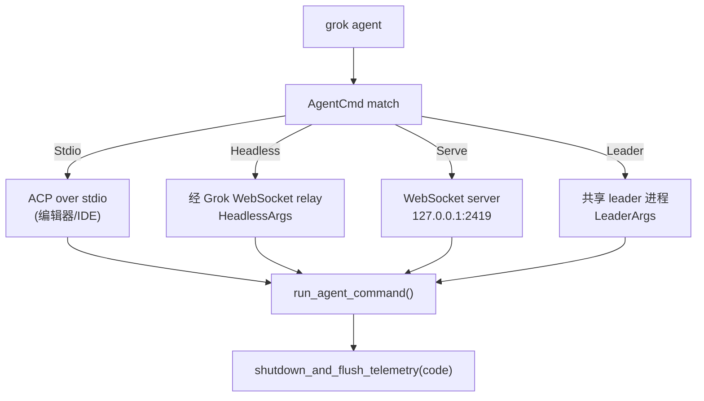

[上一篇：配置与数据流](06-配置与数据流.md) · [总目录](README.md) · [下一篇：TUI交互循环与渲染](08-TUI交互循环与渲染.md)

# 程序入口与运行模式：一个二进制分发多种形态

> **场景**：`grok`（即 `xai-grok-pager`）敲下后，从进程启动到进入 TUI / headless / leader / MCP / update 等模式，中间经历了什么。本文把 `main()` → `async_main()` 的分发写成可照抄的启动状态机。
> **时间**：采样于 2026-08-25（CST），工作区 `HEAD = 940ce403`。
> **工具版本**：Rust `1.94.0`；组合根 `crates/codegen/xai-grok-pager-bin/src/main.rs`。

> **阅读说明**：本文讲**调用关系与数据流**，不把行号当稳定 API。行号来自当前工作区快照；若本地已有后续修改，**以当前源码为准**。组合根 `main.rs` 有意**不放领域逻辑**，所有模式都委托给各自 crate。

---

### 本文件内容

1. [Why：为什么一个二进制要服务多种模式](#1-why为什么一个二进制要服务多种模式)
2. [main() 启动状态机](#2-main-启动状态机)
3. [async_main 的 Command match（全命令面）](#3-async_main-的-command-match全命令面)
4. [run_agent_command：headless / stdio / leader / serve](#4-run_agent_commandheadless--stdio--leader--serve)
5. [Tokio worker 线程数](#5-tokio-worker-线程数)
6. [退出路径：shutdown_and_flush_telemetry](#6-退出路径shutdown_and_flush_telemetry)
7. [各模式的进程图与 stdin/stdout 所有权](#7-各模式的进程图与-stdinstdout-所有权)
8. [重实现第一步：空壳 main 分发 4 种模式](#8-重实现第一步空壳-main-分发-4-种模式)

其余阶段见[总目录](README.md)。

---

## 1. Why：为什么一个二进制要服务多种模式

同一个 `grok` 二进制要同时服务四类宿主，且不能把它们的逻辑焊死在 `main` 里：

- **交互终端**：开发者本地跑 TUI。
- **CI / 远程**：headless 经 Grok WebSocket relay 跑。
- **编辑器 / IDE**：`agent stdio` 走 ACP stdio，或 `agent serve` 起 WebSocket 服务。
- **后台 leader**：被 TUI/IDE 拉起，作为共享会话的leader进程。

`crates/codegen/xai-grok-pager-bin/src/main.rs` 是**唯一组合根**，它只做「解析 → 建运行时 → 按 `Command` 分发」，领域逻辑全部委托出去（见 `README.md` 不变量：「组合根只有一个 `main.rs`」）。

---

## 2. main() 启动状态机

`main()` 在 `main.rs:1879`，自身只解析 CLI、建 Tokio runtime，真正逻辑在 `async_main(args: PagerArgs)`（`main.rs:1970`）。

```text
┌──────────────────────────────────────────────────────────────────────┐
│ main()  [main.rs:1879]                                                  │
│   │                                                                     │
│   ├─ 1. telemetry mark（启动埋点）                                       │
│   ├─ 2. 解析 CLI → PagerArgs（clap）            [cli.rs:431]            │
│   ├─ 3. jemalloc（若启用 feature）                                      │
│   ├─ 4. crash handler 安装                  [xai-crash-handler]        │
│   ├─ 5. cli_worker_threads() → 建 Tokio runtime  [main.rs:1950,1668]   │
│   │                                                                     │
│   ▼                                                                     │
│ async_main(args)  [main.rs:1970]                                        │
│   └─ match args.command  →  各模式（见 §3）                             │
└──────────────────────────────────────────────────────────────────────┘
```

| 序号 | 动作 | 内部调用链（`file:line`） | 说明 |
|---|---|---|---|
| 1 | 解析 CLI | `PagerArgs` clap parser — `cli.rs:410-431` | `args.command: Option<Command>`（`cli.rs:801`），`None` 即默认 TUI |
| 2 | 计算 worker 线程 | `cli_worker_threads()` — `main.rs:1668` | 见 §5 |
| 3 | 建运行时 | `tokio::runtime` with `workers` — `main.rs:1950` | 失败直接 `shutdown_and_flush_telemetry(1)`（`main.rs:1956`） |
| 4 | 进入异步主 | `async_main(args).await` — `main.rs:1970` | 返回 `Result<()>` |

> 交互性判定在 `main.rs:53-77`：除 `Command::Agent` 返回 `None`（headless，不占终端）外，其余命令（Inspect/Doctor/Leader/Mcp/Plugin/Sessions/Setup/Update/Workspace 等）都被标记为「需要终端/交互」。

---

## 3. async_main 的 Command match（全命令面）

`async_main` 在 `main.rs:2042` 对 `args.command` 做 `match`。当前 `Command` 枚举（`cli.rs:9-154`）有 **23 个变体**，比早期文档更宽：

| 命令 | 变体（`cli.rs`） | 路由到 |
|---|---|---|
| 默认（无子命令） | `None`（`cli.rs:801`） | TUI 交互界面（`08-TUI交互循环与渲染.md`） |
| `agent` | `Agent(Box<AgentArgs>)`（`cli.rs:11`） | `run_agent_command`（`main.rs:1099`）→ headless/stdio/leader/serve |
| `inspect` | `Inspect { json }`（`cli.rs:13`） | 打印发现到的配置（JSON 可选） |
| `doctor` | `Doctor(...)`（`cli.rs:19`） | 终端/剪贴板/颜色/输入能力自检 |
| `leader` | `Leader(LeaderMgmtArgs)`（`cli.rs:21`） | 管理 leader 进程生命周期 |
| `logout` / `login` | `Logout` / `Login {...}`（`cli.rs:22-46`） | 退出登录 / OAuth 或 device-code 登录（OAuth 为唯一认证方式） |
| `mcp` | `Mcp(...)`（`cli.rs:48`） | MCP server 配置管理（`10-工具协议与扩展体系.md`） |
| `plugin` | `Plugin(...)`（`cli.rs:50`） | 插件与 marketplace 源管理 |
| `memory` | `Memory(...)`（`cli.rs:52`） | 跨会话记忆管理（`13-持久化记忆与会话恢复.md`） |
| `models` | `Models`（`cli.rs:54`） | 列出可用模型并退出 |
| `sessions` | `Sessions(...)`（`cli.rs:56`） | 列出/搜索/恢复会话 |
| `setup` | `Setup { json }`（`cli.rs:58`） | 拉取并安装托管配置（fail-closed 见 `06`） |
| `share` / `export` / `trace` | （`cli.rs:66,88,90`） | 会话分享/导出/追踪（隐藏） |
| `wrap` | `Wrap(WrapArgs)`（`cli.rs:86`） | 任意命令包 PTY，转发 OSC 52 剪贴板 |
| `update` | `Update {...}`（`cli.rs:92-122`） | 检查/安装更新；channel：`alpha`/`stable`/`enterprise` |
| `version` / `completions` | （`cli.rs:124,131`） | 版本 / shell 补全 |
| `worktree` | `Worktree(...)`（`cli.rs:137`） | 管理 git worktree |
| `du` | `DiskUsage(...)`（`cli.rs:140`） | 展示 `~/.grok` 磁盘占用 |
| `workspace` | `Workspace(...)`（`cli.rs:146`） | 经 leader 暴露给 Computer Hub（隐藏，需 `GROK_WORKSPACE_COMMAND=1`） |
| `dashboard` | `Dashboard`（`cli.rs:153`） | 启动即开 Agent Dashboard（受 `[dashboard].enabled` / `GROK_AGENT_DASHBOARD=0` 控制） |

> **真实漂移提示**：早期指南只列了约 10 个命令；当前枚举新增 `Logout`/`Login`/`Memory`/`Models`/`Share`/`Wrap`/`Export`/`Trace`/`Version`/`Completions`/`Worktree`/`DiskUsage`/`Dashboard` 等。重实现时以 `cli.rs:9-154` 为准。

---

## 4. run_agent_command：headless / stdio / leader / serve

`grok agent` 的子命令由 `AgentCmd` 枚举决定（`cli.rs:342-351`）：



| 变体 | 行号 | 形态 | stdin/stdout 所有权 |
|---|---|---|---|
| `Stdio` | `cli.rs:344` | ACP 走 stdio | 完全交给 ACP 帧 |
| `Headless(HeadlessArgs)` | `cli.rs:346` | 经 Grok WebSocket relay | 日志走 stderr，relay 走 WS |
| `Serve(ServeArgs)` | `cli.rs:348` | 本地 WebSocket 服务，默认 `127.0.0.1:2419`（`cli.rs:364`） | HTTP/WS 端口；`GROK_AGENT_SECRET` 鉴权（`cli.rs:367`） |
| `Leader(LeaderArgs)` | `cli.rs:350` | 共享 leader，`--relay-on-demand` / `--no-exit-on-disconnect` / `--no-auto-update`（`cli.rs:391-408`） | 被多个 client 共享 |

`run_agent_command` 位于 `main.rs:1099`，结束时统一走 `shutdown_and_flush_telemetry(code)`（`main.rs:1115` / `1120`，信号 130 表示被中断）。

---

## 5. Tokio worker 线程数

```text
cli_worker_threads()                       [main.rs:1668]
   └─ GROK_WORKER_THREADS_ENV = "GROK_WORKER_THREADS"   [main.rs:1627]
         ├─ 未设置 → 默认物理核数（NonZeroUsize）
         ├─ 设置且 ∈ [1, cores] → 使用
         ├─ 超出 → clamp 到 cores（日志：main.rs:1660 / :2654）
         └─ 非整数 → 忽略，回退默认（日志：main.rs:1663 / :2667）
```

> worker 线程数只影响 Tokio 计算调度，不影响异步 IO；它经 `main.rs:1950` 传入 runtime builder。

---

## 6. 退出路径：shutdown_and_flush_telemetry

所有最终退出都收敛到 `shutdown_and_flush_telemetry(exit_code: i32) -> !`（`main.rs:1058`）：

1. 终端状态恢复（离开 alternate screen、还原原始 termios）。
2. flush telemetry / debug log（与 `06` 的 `GROK_DEBUG_LOG` 打通）。
3. 必要时触发自更新安装。
4. `std::process::exit(code)`（签名 `-> !`，绝不返回）。

> 这意味着「优雅退出」是集中式责任：任何模式都不要自己 `std::process::exit`，统一回 `async_main` 再交给 `shutdown_and_flush_telemetry`，保证遥测与终端状态不丢。

---

## 7. 各模式的进程图与 stdin/stdout 所有权

```text
┌────────────┐   ┌────────────┐   ┌────────────┐   ┌────────────┐
│ TUI 默认   │   │ agent stdio│   │ agent head │   │ agent serve│
│ (终端)     │   │ (ACP stdio)│   │ (WS relay) │   │ (WS 127.0.1:2419)
│ stdin=用户 │   │ stdin=ACP帧│   │ stdin=无   │   │ stdin=无   │
│ stdout=UI  │   │ stdout=ACP │   │ stderr=日志 │   │ 端口监听   │
└─────┬──────┘   └─────┬──────┘   └─────┬──────┘   └─────┬──────┘
      │                │                │                │
      └────────────────┴───────┬────────┴────────────────┘
                               ▼
                   SessionActor / Sampler / Tools / Workspace
                               │
                       leader（可选共享进程）
```

| 模式 | 进程数 | stdin/stdout | 失败码来源 |
|---|---|---|---|
| TUI 默认 | 1（可拉起 leader 子进程） | 占终端 | `shutdown_and_flush_telemetry` |
| agent stdio | 1 | 交给 ACP | 同上 |
| agent headless | 1（+relay） | stderr 日志 | 同上 |
| agent serve | 1 | 端口 | 同上 |
| leader | 1（被多 client 共享） | 无 | 同上 |
| update | 可能替换自身二进制 | — | `main.rs:2161` 的 `Update` 分支 |

---

## 8. 重实现第一步：空壳 main 分发 4 种模式

照抄的最小骨架（伪代码，对应真实符号）：

```rust
// crates/codegen/xai-grok-pager-bin/src/main.rs
fn main() {
    let args = PagerArgs::parse();          // cli.rs:431
    let workers = cli_worker_threads();      // main.rs:1668
    let rt = tokio::runtime::Builder::new_multi_thread()
        .worker_threads(workers.get())       // main.rs:1950
        .enable_all().build().unwrap();
    let code = rt.block_on(async_main(args)); // main.rs:1970
    shutdown_and_flush_telemetry(code);       // main.rs:1058  ← 唯一出口
}

async fn async_main(args: PagerArgs) -> i32 {
    match args.command {                      // main.rs:2042
        None => run_tui().await,              // 默认 TUI
        Some(Command::Agent(a)) => run_agent_command(a).await, // main.rs:1099
        Some(Command::Update { .. }) => run_update().await,
        // ... 其余命令逐臂委托
    }
}
```

> 先让 `main` 能分发「TUI / agent / update / 其他」四种形态（哪怕其他是 stub），再往里填 `08`–`13` 的领域逻辑。组合根保持「只分发、不实现」。

---

## 本文件结论

1. 组合根只有 `main.rs`（`main.rs:1879`），它只做「解析 → 建 runtime → 按 `Command` 分发」，领域逻辑全委托。
2. `Command` 枚举有 23 个变体（`cli.rs:9-154`），默认（无子命令）进 TUI；`agent` 子命令再分 `Stdio/Headless/Serve/Leader`（`cli.rs:342-351`）。
3. worker 线程数由 `cli_worker_threads()`（`main.rs:1668`）按 `GROK_WORKER_THREADS` 解析并 clamp 到物理核数。
4. 所有退出路径统一收敛到 `shutdown_and_flush_telemetry`（`main.rs:1058`，签名 `-> !`），负责终端恢复、遥测 flush、更新安装。
5. 重实现先做一个能分发 4 种模式的空壳 `main`，再逐层填领域逻辑。

[上一篇：配置与数据流](06-配置与数据流.md) · [总目录](README.md) · [下一篇：TUI交互循环与渲染](08-TUI交互循环与渲染.md)
