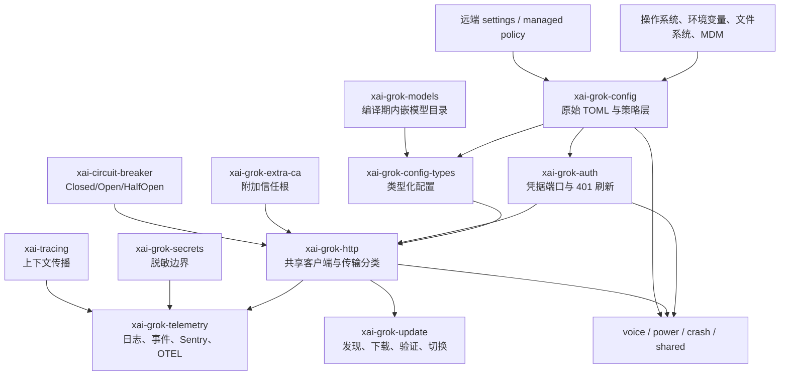
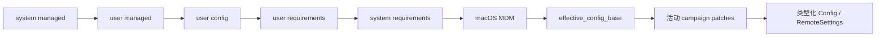
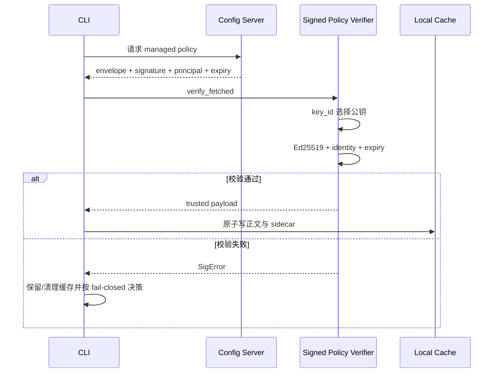
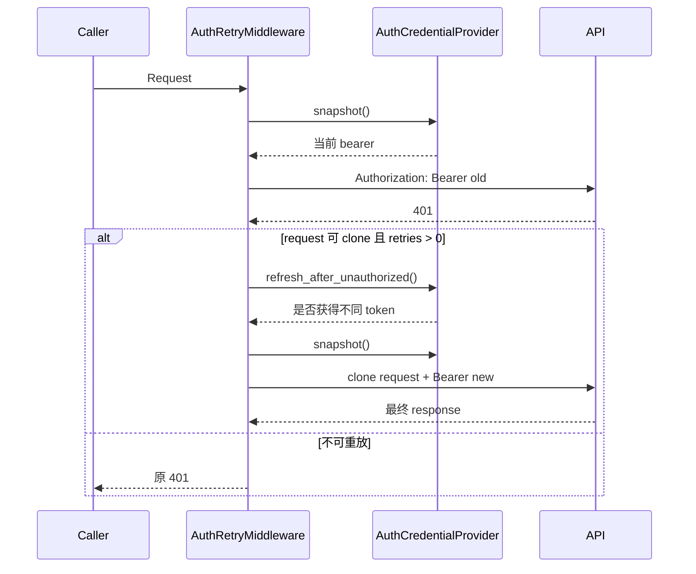
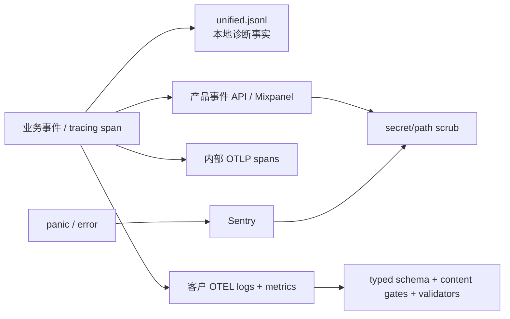
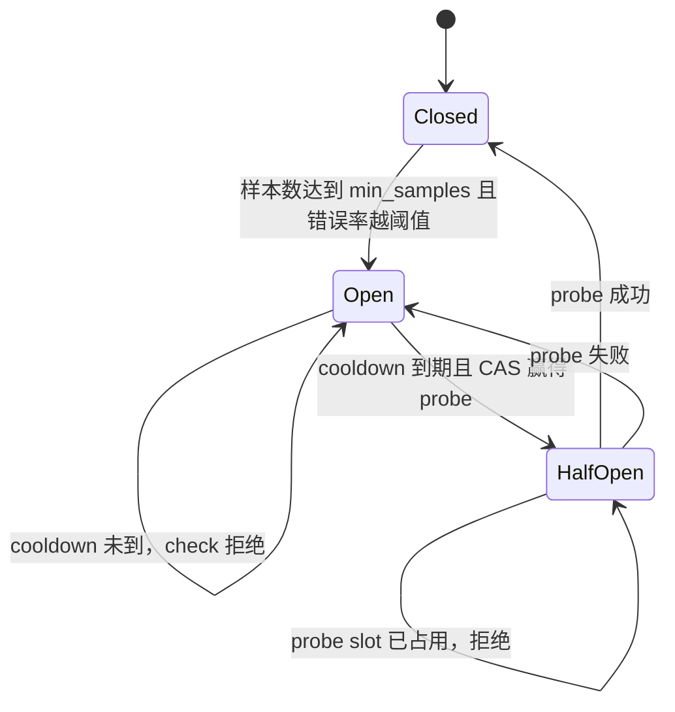
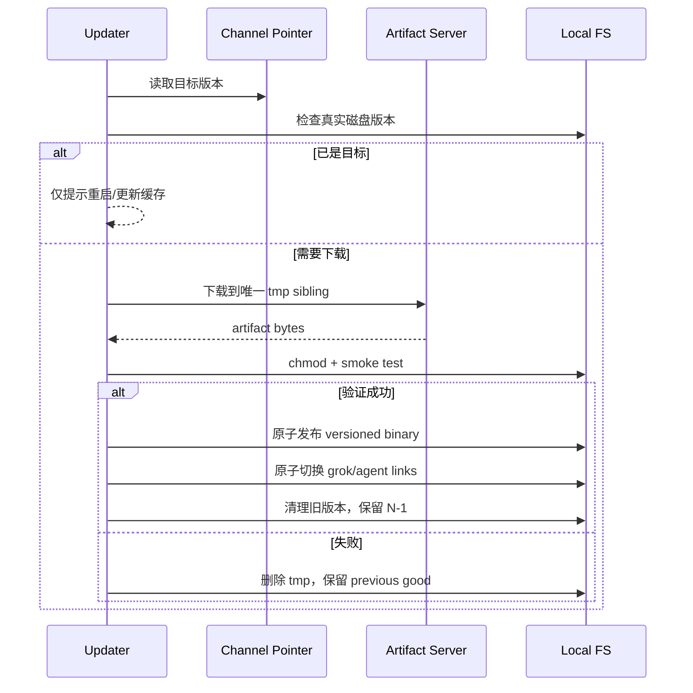
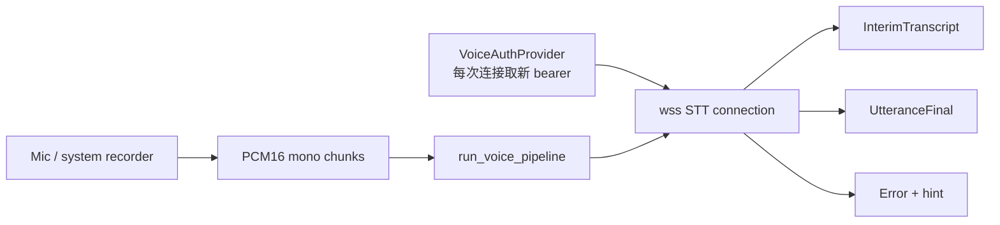

# 07 配置、认证、网络、模型目录与可观测性源码精读

> **全局调用位置**：配置/认证/遥测不是独立主链，而是在 `async_main`、`app::run`、`handle_prompt`、`run_turn_via_sampler`、Permission 和 Workspace 边界注入。启动调用见 [关键调用链第 2 节](13-关键调用链逐函数精读.md#2-调用链一进程启动到-tui-第一帧)，失败传播见 [关键调用链第 15 节](13-关键调用链逐函数精读.md#15-失败传播地图)。

> 面向第一次阅读 Grok Build 源码、并希望据此重新实现基础设施层的开发者。
>
> 本文只描述源码中已经存在的行为。标为“重实现建议”的内容是从现有边界提炼出的实施顺序，不代表源码额外承诺。

## 1. 本章范围与阅读方法

本章覆盖以下 crate：

| 主题 | crate |
|---|---|
| 配置与类型 | `xai-grok-config`、`xai-grok-config-types`、`xai-grok-env`、`xai-grok-paths` |
| Secret 与认证 | `xai-grok-secrets`、`xai-grok-auth` |
| 网络与证书 | `xai-grok-http`、`xai-grok-extra-ca` |
| 模型目录 | `xai-grok-models` |
| 可观测性 | `xai-grok-telemetry`、`xai-tracing`、`xai-tracing-macros`、`xai-mixpanel` |
| 韧性 | `xai-circuit-breaker` |
| 更新与版本 | `xai-grok-update`、`xai-grok-version` |
| 辅助能力 | `xai-grok-announcements`、`xai-grok-shared`、`xai-grok-voice`、`xai-system-power`、`xai-crash-handler` |

建议按下面的顺序阅读，而不是按 crate 名字的字母顺序阅读：

1. 先读 `xai-grok-config/src/lib.rs` 与 `loader.rs`，建立配置层级概念。
2. 再读 `validation.rs`、`signed_policy.rs`、`managed_cache.rs`，理解“普通偏好”和“管理员策略”的差别。
3. 读 `xai-grok-auth`、`xai-grok-extra-ca`、`xai-grok-http`，串起一次受认证请求。
4. 读 `xai-grok-telemetry`，注意内部遥测和客户外部 OTEL 是两条隔离的数据面。
5. 读 `xai-circuit-breaker` 与 `xai-grok-update`，理解失败、重试、并发和原子替换。
6. 最后读平台辅助 crate，理解为什么某些功能必须下沉到独立进程、信号处理器或 OS API。

## 2. 一页架构总览

这些 crate 不是互相独立的小工具，而是共同组成 CLI 的基础设施层。



必须先分清四种边界：

| 边界 | 含义 |
|---|---|
| 配置权威边界 | 用户配置可以改变偏好，但不能覆盖更高权威的 requirements/MDM 约束。 |
| 认证边界 | 业务模块只依赖 `HttpAuth`/`AuthCredentialProvider`，不直接持有 shell 的 `AuthManager`。 |
| 网络信任边界 | 系统/内嵌根证书是默认信任源；`GROK_EXTRA_CA_BUNDLE` 只做加法，不替换默认根。 |
| 遥测边界 | 内部产品遥测可以使用内部认证；客户外部 OTEL 只能使用客户提供的 OTEL headers。 |

## 3. 配置系统：从多个来源得到一个有效配置

### 3.1 配置层与优先级

权威入口是 `crates/codegen/xai-grok-config/src/lib.rs` 的模块注释和 `loader::ConfigLayers`。普通值采用递归深度合并，后应用的层覆盖先前层。

从低到高的优先级为：

| 顺序 | 来源 | 典型用途 | 权威程度 |
|---:|---|---|---|
| 1 | `/etc/grok/managed_config.toml` | 机器级托管默认值 | 低 |
| 2 | `$GROK_HOME/managed_config.toml` | 服务端同步的用户/团队托管配置 | 低至中 |
| 3 | `$GROK_HOME/config.toml` | 用户偏好 | 中 |
| 4 | `$GROK_HOME/requirements.toml` | 云端缓存的约束 | 高 |
| 5 | `/etc/grok/requirements.toml` | 机器管理员约束 | 更高 |
| 6 | macOS MDM `ai.x.grok` | OS 管理配置 | 最高 |

关键符号：

- `loader::ConfigLayers::load`：分别加载各层，并在合并前摘出 campaigns。
- `ConfigLayers::effective_config_base`：构造不含 campaign 动态覆盖的有效配置。
- `ConfigLayers::effective_config_with_campaigns`：在基础配置上应用活动 campaign。
- `loader::deep_merge_toml`：表递归合并；非表值由高层整体替换。
- `loader::load_effective_config_disk_only`：明确只读取磁盘，不包含远端 campaign/env override。



一个容易误读的点：`managed_config.toml` 名字看起来像管理员强制配置，但在当前合并模型里它低于用户 `config.toml`；真正用于不可绕过约束的是 requirements 和 MDM。

### 3.2 文件缺失、损坏与 Secret 安全

`loader::read_toml_file` 的行为：

- 文件不存在：返回空 TOML table，不算错误。
- 文件不可读：记录错误并返回 I/O 错误。
- TOML 语法错误：使用 `toml_error_detail` 返回行列和 parser message。
- 错误文本故意不使用 `toml::de::Error::Display`，因为 Display 会回显出错源码行，该行可能含 API key。

用户 home 无法确定时，`load_user_config_layer` 返回空表。它不会退化为读取当前目录下的 `.grok/config.toml`，因为那会把不可信项目文件提升为用户级配置。

### 3.3 环境变量展开

`loader::expand_env_vars_in_toml` 递归访问所有 TOML 字符串，并由 `expand_env_vars_in_string` 展开 `$VAR`/`${VAR}`。注意两个例外：

- hooks 通过 `hook_config_layers_at` 读取时不提前展开，避免 hook runner 再次展开造成双重替换。
- TOML 解析失败时不会把原始字符串写入错误日志。

这意味着环境变量展开是“读取阶段的值转换”，不是独立高优先级配置层。

### 3.4 `[[version_overrides]]`

`version_overrides.rs` 允许同一个配置文件携带按 CLI 版本生效的 patch：

- 元数据是 `minimum_version` 和可选 `maximum_version`。
- `apply_version_overrides` 总会从结果中移除原数组。
- 匹配项按 `minimum_version` 升序应用；后 patch 可以覆盖前 patch。
- patch 使用深度合并。
- `config_override::PATCH_STRIP_KEYS` 阻止 patch 重新注入 `version_overrides`、`campaigns`，也阻止注入敏感 command table。
- 安装版本解析失败时，普通加载路径剥离 overrides 后继续，避免测试环境中的坏 `GROK_TEST_VERSION` 让 CLI 完全不可用。

### 3.5 requirements 与 fail-closed

`validation.rs` 把 requirements 视为约束层，而不是普通配置：

- `requirements_layers` 返回带 `RequirementsSource` 来源信息的各层。
- `load_merged_requirements` 按用户、系统、MDM 顺序合并，后者胜出。
- 每一层先读取 `fail_closed`，再处理 version override，防止一个损坏 patch 反过来关闭强制校验。
- `GROK_MANAGED_CONFIG_FAIL_CLOSED` 只能把模式收紧为 true，不能把管理员文件中的 true 放宽为 false。
- 未开启 fail-closed 时，损坏层通常被跳过并告警；开启后，`validate_requirements` 返回 `RequirementsError`，由二进制启动入口决定退出。

这里的设计原则是：安全开关只能单调收紧。

### 3.6 签名策略与本地缓存

`signed_policy.rs` 实现 Ed25519 签名策略信封：

1. 服务端返回签名 payload、`key_id`、principal、过期时间和策略内容。
2. `verify_signed_payload` 从“已签名 payload 内的 key_id”选择编译期公钥。
3. `verify_fetched` 校验签名、principal 绑定和 expiry。
4. 策略正文与 `managed_config.sig.json` sidecar 一同持久化。
5. 离线加载时，`check_on_disk_matches` 对正文做字节级比对；签名声明某槽位应不存在时，本地多出的文件同样视为篡改。

安全细节：

- 私钥不进入客户端；源码仅包含受信公钥集合。
- 远端 kill switch `apply_remote_managed_config_signature_verification` 只有在 settings 来源可信时才能关闭已启用的签名校验。
- symlink、目录、FIFO 等占据策略文件位置时按 tamper 处理；检查是 no-follow 的。
- 拉取时 active team 暂时未知会宽容处理，避免一次 auth.json 读取抖动锁死客户端；落盘身份检查仍按预期 principal 比较。
- `managed_cache.rs` 维护 serving identity、同步标记、回滚下限、stale/hard-stale 与 compromised 状态。



### 3.7 原子写与 managed text

`fs_atomic.rs` 和 `managed_text/*` 处理配置之外的托管文本资源：

- 写入临时 sibling，再通过 rename/replace 提交。
- `source.rs` 描述来源；`validator.rs` 在提交前校验内容；`transaction.rs` 组织多文件变更；`format.rs` 处理规范格式。
- 事务失败不能留下“部分新、部分旧”的可见组合。
- `managed_cache` 的 claim tests 和 transaction tests 重点核对身份切换、回滚、防并发覆盖与恢复。

### 3.8 hooks、campaigns 与 shell 探测

这些属于配置系统的特殊值，不完全服从普通“最后值覆盖”：

- hooks：`HookConfigLayer` 保留 `HookProvenance`、来源名称和真实路径；各层独立交给下游组合。
- campaigns：先从各层摘出，再按活动时间、dismiss 状态及触及路径决定是否应用。
- `config_override::patch_touches_path` 能识别“父节点被非 table 替换”也等价于触及所有子路径。
- `global_hook_sources.rs` 对全局 hook 文件做祖先链、symlink 组件和直接 JSON 文件检查。
- `shell.rs` 解析 shell 可执行文件、登录 shell 行为和环境获取，避免各调用方各自实现平台分支。

## 4. 类型化配置、环境与路径

### 4.1 `xai-grok-config-types`

这个 crate 的目的不是再次加载配置，而是把配置值类型从 shell 中抽离，反转依赖方向。主要类型域包括：

- `RemoteSettings`：远端 feature/settings 的宽结构，大多数字段为 `Option`。
- `McpConfig`、`McpServerConfig`、OAuth/setup/preferences 类型。
- memory index/embedding/search/temporal decay/MMR/session/dream/watcher 配置。
- pool、permission 与 feature flags。

兼容策略分成两类：

| 类型 | 行为 | 原因 |
|---|---|---|
| 远端可独立降级的列表项 | tolerant deserialize，坏项丢弃，好项保序 | 一个灰度字段不应毒化全部 settings |
| 强类型运行参数 | 类型错误让整体解析失败或钳位 | 防止运行时拿到无意义参数 |

例如 goal role model、announcements 等允许单个坏项被过滤；jemalloc heap profile 的错误类型则会让远端设置解析失败。memory 的 `mmr_lambda` 与语义去重阈值反序列化时钳位到 `[0,1]`，并保留旧 `recency_decay` 到 half-life 的兼容换算。

### 4.2 `xai-grok-env`

`GrokBuildEnvironment` 当前把生产 endpoint 集合封装为 `GrokBuildEndpoints`，调用方通过 `cli_chat_proxy_base_url`、`asset_server_url`、`relay_ws_url`、`gateway_ws_url` 和 `ws_origin` 获取地址。

测试辅助 `EnvVarGuard` 的价值很大：

- 通过进程级 mutex 串行修改环境变量。
- 构造时记录旧值，Drop 时恢复。
- 避免并行测试互相污染。

重实现时不要让 endpoint 解析散落在业务代码中，也不要在并发测试中直接 set/remove 全局 env。

### 4.3 `xai-grok-paths`

`AbsPathBuf` 与 `RelPathBuf` 使用 `camino::Utf8PathBuf` 表达 UTF-8 路径不变量：

- `AbsPathBuf::new` 拒绝相对路径。
- `RelPathBuf::new` 拒绝绝对路径。
- `RelPathBuf::from_absolute` 要求目标位于 root 下。
- `normalize_lexically` 只消解 `.`/`..`，不访问文件系统。
- `contains_path` 做组件级包含判断，不应被字符串前缀替代。
- serde 反序列化继续执行绝对/相对校验。

配置 crate 自身的 `paths.rs` 负责 `$GROK_HOME`、系统配置目录、session cwd 目录和 cwd 编解码；类型 crate 则负责“这个值在类型上必须是绝对或相对路径”。两者职责不同。

## 5. Secret 脱敏

`xai-grok-secrets::sanitizer` 是外发数据的通用清洗器。

### 5.1 检测范围

它覆盖 xAI/OpenAI 风格 key、AWS access key、GitHub/GitLab/Slack token、Google API key、PEM private key、Bearer、裸 JWT、常见 `key=value`/`secret:` 赋值，以及 URL 中的敏感 query 参数。

处理流水线：

```text
RegexSet 快速判断
  -> 各具体 regex 依次替换
  -> URL parse 后移除 userinfo、fragment、敏感 query value
  -> JSON 递归遍历所有字符串值
  -> HOME/用户名路径匿名化
```

`redact_secrets` 在完全不匹配时返回 `Cow::Borrowed`，避免正常日志产生分配。`redact_json_string_values` 只处理 JSON 字符串叶子，不改变数字、布尔、数组和对象结构。

### 5.2 边界与局限

- regex 脱敏是外发前的最后防线，不是 Secret 存储方案。
- project token 等系统凭据必须在用户属性清洗后再注入，`xai-mixpanel::prepare_properties` 的测试专门锁定此顺序。
- HOME 替换做完整路径段匹配，`/Users/bob` 不会误伤 `/Users/bobby`。
- URL 清洗保留非敏感 query 参数，但移除 user/password、fragment，并替换 OAuth code/state/token 等值。

## 6. 认证抽象与 401 恢复

### 6.1 依赖倒置

`xai-grok-auth` 很小，但它是重要架构缝：

- `HttpAuth`：把认证信息应用到 `reqwest::RequestBuilder`。
- `AuthCredentialProvider`：提供刷新感知的 `snapshot`、`refresh_after_unauthorized`、header 模式和可用性判断。
- shell 实现真实 provider；data collector、telemetry 和 HTTP 层只持有 `Arc<dyn AuthCredentialProvider>`。
- `StaticAuthCredentialProvider` 用于原始 token、测试和没有刷新器的调用方。

`CredentialSnapshot` 除 token 外还包含 `user_id`、`team_id`、deployment-key 的稳定 UUIDv5、API-key 的稳定 UUIDv5 与 organization id。下游用这些稳定派生 ID 做关联，而不是把原 Secret 作为遥测标识。

### 6.2 401 retry 时序



实现约束：

- 只对 `401 Unauthorized` 触发凭据刷新。
- 重试次数由 `max_retries` 硬限制。
- request body 不可 clone 时不重试，避免发送语义不完整的副作用请求。
- provider 返回 false、刷新后无 token 或重建 header 失败时停止。
- `StampedBearerSuffix` 记录本次实际发送 token 的最后 12 个 Unicode 字符。
- `execute_with_stamp` 从 request extensions 返回 stamp；刷新重试会覆盖旧 stamp，因此归因对应最终 response 的那次尝试。

尾部而非头部用于归因，是因为 JWT header 和 API key 前缀高度重复。它仍然只适合受控诊断，不应扩展为记录完整 token。

## 7. HTTP 客户端与 TLS

### 7.1 四类 HTTP client

`xai-grok-http/src/lib.rs` 避免每次构造 `reqwest::Client` 的 TLS 根加载成本：

| 客户端 | 协议/连接策略 | 用途 |
|---|---|---|
| `shared_client` | 共享、HTTP/2、连接池、keepalive/idle 健康控制 | settings、feedback、一般请求 |
| `shared_upload_client` | HTTP/1.1、每 host 小池、短 idle | GCS/大对象上传，避免 H2 池中毒扩散 |
| `shared_startup_blocking_client` | blocking、启动前可用 | async runtime 建立前的模型预取 |
| `fresh_http1_client` | 不缓存、无 idle pool、HTTP/1.1 | 最后一次重试逃离疑似 poisoned pool |

采样流量另由 `xai_grok_sampler::shared_http` 管理，不应误认为全部请求都走这里的 `shared_client`。

### 7.2 超时预算

源码定义并通过 const assert 约束预算关系：

- `STARTUP_FETCH_TIMEOUT = 5s`
- `STARTUP_AUTH_REFRESH_TIMEOUT = 5s`
- `STARTUP_AUTH_TIMEOUT = 60s`
- `SETTINGS_REAPPLY_TIMEOUT = 30s`
- `SETTINGS_FETCH_MAX_ATTEMPTS = 3`
- `MIN_CLIENT_CONNECT_TIMEOUT = 120s`

这些数字表达的是“外层 deadline 必须覆盖内层最坏路径”，重实现时不能只复制数字而丢掉层级关系。

### 7.3 传输错误分类

`error_cause_chain` 展开 Rust error source 链；`find_os_error_code` 优先读 `io::Error::raw_os_error`，也识别 `(os error N)` 文本后缀。`TransportFailureKind` 与分类结果用于区分 timeout、connect/reset/interrupted 等失败，从而决定是否值得换新连接或重试。

不要仅根据顶层 `reqwest::Error::to_string()` 分类。TLS/hyper 包装经常把真正的 reset code 放在 source chain 深处。

### 7.4 User-Agent 与客户端身份

`OriginClientInfo` 可来自环境、ACP metadata 或 `ClientType`。`merge_origin_client_info` 保留主来源 product，并回填缺失 version。进程和 session User-Agent 分开生成，避免嵌入场景把宿主产品身份丢掉。`CLIENT_MODE_HEADER` 用一次性 latch 区分 `headless` 与 `interactive`。

### 7.5 额外 CA

`xai-grok-extra-ca` 的流程：

1. 仅当 `GROK_EXTRA_CA_BUNDLE` 非空时读取。
2. 文件最大 1 MiB。
3. 解析 PEM certificate blocks。
4. 每个 DER 先加入临时 `rustls::RootCertStore` 验证。
5. 只缓存通过验证的 DER，存入进程级 `OnceLock`。
6. async/blocking reqwest builder 各自把 DER 转为自身的 `Certificate`。

普通额外 CA 是 fail-open：文件缺失、超限、没有证书或部分坏证书会告警并继续使用默认信任根。相比之下，客户显式配置的 `OTEL_EXPORTER_OTLP_CERTIFICATE` 在 telemetry OTLP client 中是 fail-closed，因为忽略它会连接到错误的信任集合。这两个行为不要合并。

## 8. 模型目录

`xai-grok-models/default_models.json` 在编译期由 `include_str!` 嵌入二进制。`LazyLock<DefaultModels>` 首次访问时解析，并断言 `default` 必须出现在 `models` 数组中；失败代表开发/发布错误，因此 panic 是刻意行为。

导出函数：

- `default_model`
- `default_web_search_model`
- `default_image_description_model`
- `default_session_summary_model`

后三者缺失时回退到 primary default。完整模型解析优先级由调用链约定为：CLI flag > env > config.toml > remote settings > embedded defaults。

JSON 中不只保存 ID，还包含 context window、API backend、reasoning effort、自动压缩阈值、fingerprint 展示等模型元数据。重实现时应把“编译期安全默认目录”和“运行时覆盖解析器”分开。

## 9. 可观测性总体架构

### 9.1 四条数据面



| 数据面 | 目的 | 是否允许内容 | 认证 |
|---|---|---|---|
| unified log | 本地故障诊断 | 结构化 ctx，仍需谨慎 | 无网络 |
| 产品事件/Mixpanel | 产品使用与 session metrics | 由 telemetry mode 决定并脱敏 | 内部 endpoint/token |
| 内部 OTLP spans | xAI 自身 tracing | allowlist + redaction | 可使用刷新凭据 |
| 外部 OTEL | 客户自有 collector | 默认 metadata-only，内容需 gate | 仅客户 OTEL headers |
| Sentry | crash/error 聚合 | before_send 全面 scrub | Sentry DSN |

### 9.2 Telemetry mode 与配置

`TelemetryMode` 有三个状态：

- `Disabled`：不发送。
- `SessionMetrics`：只发送 metadata lifecycle，不发送用户内容。
- `Enabled`：完整产品 telemetry。

反序列化兼容 bool 和字符串 `session_metrics`。未知字符串 fail-safe 为 Disabled 并告警。

`TelemetryConfig` 的默认值来自编译期 build env；运行时 `apply_env_overrides` 再处理 events URL/key、Mixpanel token/enabled 和 trace upload。空白字符串正规化为 None。外部 OTEL 有独立的 enable、exporter、endpoint、protocol 和内容 gate 字段。

### 9.3 事件、session context 与异步发送

`events::TelemetryEvent` 用关联常量 `NAME` 固定 wire event 名称。大量事件结构体只声明 schema，实际发送集中在：

- `TelemetryClient`：内部产品事件 client 与元数据。
- `session_ctx::TelemetryCtx`：session/turn/prompt 上下文和 emitter origin。
- `emit_event`/`log_event`：把 typed event 送入对应数据面。
- `session_metrics`：session start、turn lifecycle、doom-loop、trace upload 等低内容事件。

事件类型多不等于所有事件都外发。外部 OTEL 只映射 `external/schema.rs` 明确登记的事件。

### 9.4 外部 OTEL 的安全管道

外部 OTEL 是最严格的数据路径：

1. `external/config.rs` 解析 exporter、protocol、endpoint、headers、temporality 与内容 gate。
2. `external/schema.rs` 把 typed event 映射为固定 `ExternalRecord`、typed key 和 metric increment。
3. `external/emit.rs` 注入 session/turn/prompt/sequence 上下文。
4. 内容字段先检查 gate。
5. 所有字符串经过 Secret/路径 scrub 和长度限制。
6. `external/redact.rs` 的 exporter wrapper 再做 fail-closed schema 校验。
7. 任何未知 attribute key、关闭 gate 下的 gated key 或未脱敏 secret 都导致丢弃，而不是带病发送。

限制包括：

- 普通字符串超过 512 chars 时保留前 128 chars 加 marker。
- tool input JSON 最多 4 KiB、深度 2、每集合 20 项。
- gated prompt/content 最多 60 KiB。
- file extension 最多 10 chars。
- 外部自由文本如 client identifier、screen mode、tool name 都归一到 allowlist/`other`/`mcp_tool`/`custom_tool`，避免指标基数爆炸。

provider 隔离是硬约束：`external/providers.rs` 不读取 `AuthCredentialProvider`，HTTP/gRPC exporter 只附加 `OTEL_EXPORTER_OTLP_HEADERS`。internal OTEL 的 Authorization、`X-XAI-Token-Auth`、user header 常量不被引用。

### 9.5 内部 OTEL spans

`otel_layer::RefreshableSpanExporter` 在每次 export 前重新读取 credential snapshot，因此长 session 的 token 轮换不会把 exporter 固定在启动 token。资源属性包含服务和租户派生信息，但 exporter 前通过 `redact_batch` 做 attribute allowlist、URL origin 化、event name 中和与内容去除。

`shutdown_otel`/`OtelGuard` 负责进程结束 flush/shutdown；不要只依赖 runtime drop。

### 9.6 本地日志

`unified_log.rs`：

- 文件是 `$GROK_HOME/logs/unified.jsonl`。
- 单文件上限 5 MiB。
- `LogEntry` 带 timestamp、level、source、version、session id 和 ctx。
- writer 在 mutex 后维护，并检测文件被外部替换/轮转。
- 支持整个日志或按 session 截取快照。
- client 日志通过 `ingest_client_entries` 统一写入。

`debug_log.rs` 提供 firehose 与按 session 路由，维护 `latest.txt` 链接并清理 7 天前日志。`hooks_log.rs` 是显式 opt-in 的 hooks/plugins 专项日志。`appender.rs` 把 `WorkerGuard` 保存到进程生命周期，退出时显式清空以 flush，避免短命 headless 进程丢日志。

### 9.7 Sentry 与 Mixpanel

Sentry `before_send` 会清理：

- exception/message、breadcrumb data、tags 中的 Secret 和用户路径；
- cwd 与 server_name 等高风险字段；
- HOME 和 username 路径段。

`xai-mixpanel` 只实现 `track` 与 `engage`，复用 reqwest 0.12，避免引入第二套旧 HTTP stack。它先清洗用户 properties，再注入 project token；请求目前只把 HTTP transport error 当错误，代码没有调用 `error_for_status`，因此非 2xx 是否算失败由上层/服务行为决定，这是重实现时值得明确的契约点。

### 9.8 `xai-tracing` 与宏

`xai-tracing` 负责协议级 trace context：

- HTTP middleware 创建 client span 并注入 W3C `traceparent`。
- gRPC `TraceLayer` 创建 span，`InjectTraceContextService` 把 context 注入 metadata。
- 没有 active tracing dispatcher 时返回 `Span::none()`，防止 tracing 的 log compatibility 把 span 降级成噪声日志。
- `fastrace` adapter 支持另一条 tracing 实现和 W3C parent 解码。
- `Timer` 在正常 `stop` 时记录完成，未 stop 而 Drop 时记录失败。

`xai-tracing-macros` 提供 timestamp/timed 宏，减少调用点重复代码；宏不拥有 exporter 或 subscriber 生命周期。

### 9.9 启动计时

`startup::StartupTimer` 维护当前 phase 与完成 phase：重复进入同一 phase 被忽略，进入新 phase 会自动关闭旧 phase。结果同时写 unified log、产品事件和 OTLP metric。`Owner` 避免 embedded client/agent 双重上报，`DONE` 保证进程启动完成只报告一次。

## 10. 熔断与重试

### 10.1 状态机



`xai-circuit-breaker` 的核心对象是轻量 `CircuitBreaker` handle，内部状态共享。关键组成：

- `BreakerConfig`：enabled、window、min_samples、error threshold、open duration、half-open probes。
- `SlidingWindow`：有界样本窗口。
- `BreakerState`：Closed/Open/HalfOpen。
- `Observer`：状态切换后回调。
- `Registry`：按依赖/名称复用 breaker。
- `RetryPolicy`/`GrpcRetryPolicy`：把结果分类为成功、失败或忽略。

### 10.2 并发不变量

- Open -> HalfOpen 使用 CAS，多个并发调用只有受限数量能取得 probe slot。
- `half_open_max_probes = 0` 被钳到至少 1。
- probe owner 被取消且不 record 时，slot 在 `open_duration` 后作为 lease 过期，可由新调用回收。
- `is_open` 有 atomic fast mirror；测试核对 Release/Acquire 可见性与权威 state 一致。
- observer 在状态提交后调用，并且每次 transition 只通知一次。
- window 有最大 10k 条的保护，压力测试核对 error rate 不会 NaN 或越界。

### 10.3 与普通 retry 的边界

认证 middleware 的 401 refresh retry、HTTP transport retry、OTLP exporter retry 和 circuit breaker 不能在每层都无限叠加。现有代码采用局部硬上限；重实现时需要统一预算：总 deadline、最大 attempts、`Retry-After`、退避与 cancellation 必须共同限制重试。

## 11. 更新与版本系统

### 11.1 版本事实源

`xai-grok-version`：

- 编译期 `GROK_VERSION` 优先于 Cargo package version。
- 测试运行时 `GROK_TEST_VERSION` 优先于编译版本。
- `installed_semver` 做严格 semver parse。
- display 函数只负责附加 `[stable]`/`[alpha]` label。

`xai-grok-update::version`：

- `version.json` 缓存最新版本、stable pointer 和 `checked_at`。
- TTL 是 30 分钟；未来时间戳视为不新鲜，防 clock skew。
- 缓存通过 `.tmp` 写入后 rename。
- internal channel pointer 首选 `https://x.ai/cli`，失败后回退公共 GCS。
- 单 base 最多 3 次重试，退避 1/2/4 秒，单请求 15 秒。
- alpha 渠道取 `max(alpha, stable)`，避免 stable 已更新而 alpha pointer 落后。
- npm 与 GitHub release 也使用同样的 max 语义，但没有跨 installer fallback。

### 11.2 更新决策

`UpdatePlan` 把策略结果分成：

- `Skip`：反降级/范围策略不允许。
- `Unavailable`：required minimum 高于已发布 latest。
- `Install`：得到实际 target。

`needs_update` 同时考虑 current、target、channel 和 installer 是否允许 downgrade。internal/gh-release 的 pointer 被视为权威，允许有意回滚；npm registry 可能被企业镜像缓存为旧版本，所以不允许自动降级。

更新判断优先读取磁盘实际 symlink 版本，而不是只看当前进程编译版本。这样多个 TUI/leader/updater 并发时，会收敛到已下载版本而不是重复下载。npm 不使用残留 internal symlink 作为磁盘事实，避免旧安装方式污染判断。

### 11.3 下载、验证、激活



关键实现：

- 大文件可按 range 并行下载；不支持 range 时回退单流。
- tmp 名包含目标和 attempt 唯一性，避免多个版本都落到同一 `.tmp`。
- 下载完成后先 smoke test，再激活。
- Unix 用临时 symlink + rename 做原子切换。
- `swap_managed_bin_links` 同时处理 `grok` 与 `agent`，第二个切换失败会回滚第一个。
- Windows 使用 copy/replace 与 `.old` 备份策略。
- cleanup 保留当前和一个 previous good。
- 同版本并发安装和不同版本并发安装由 convergence tests 覆盖。

NPM token 不放命令行：`create_temp_npmrc` 写 pid 专属临时文件，Unix 权限 0600，并通过 `--userconfig` 使用，完成后删除。

### 11.4 更新失败路径

| 失败 | 行为 |
|---|---|
| primary pointer 不可用 | 重试后尝试 fallback base |
| invalid/empty semver | 返回错误，不安装 |
| artifact 404/传输中断 | tmp 不激活，previous good 保持可运行 |
| smoke test 失败 | 拒绝激活 |
| `agent` link swap 失败 | 回滚 `grok` link |
| 并发进程先完成安装 | 重新看磁盘事实，跳过重复下载 |
| pinned install | 校验 hard floor，成功后关闭 auto-update |
| managed config 刷新失败 | 更新成功不回滚；按 auth/retryable 类型给出不同提示 |

## 12. 公告、共享能力与平台适配

### 12.1 announcements

`xai-grok-announcements` 定义公告 wire type、CTA、过期过滤、隐藏状态持久化和可见公告筛选。隐藏状态解析 fail-open：损坏或旧 bool shape 不阻塞启动。hide key 优先稳定 ID，没有 ID 时才以内容派生。状态会清理已不在活动公告列表中的旧 ID。

### 12.2 shared

`xai-grok-shared` 是跨 pager/shell 的轻量共享层：

- `ui_config`：UI 可消费配置。
- `session::info`：session 元信息。
- `stderr`：避免 protocol stdout 被诊断输出污染。
- `clipboard`：macOS 避免长驻链接 AppKit 导致巨大 GPU/IOAccelerator 开销；非 macOS 使用 arboard，Linux 包含 Wayland data-control 探测。
- `placeholder_images`：从 prompt placeholder 恢复图像时，先 canonicalize，再做允许前缀检查、敏感目录拒绝、MIME header 验证、单文件/总量上限与 URI 去重。

图像恢复的安全顺序是“先判断是否在 allowlist，再暴露 exists/type 错误”，防止日志成为文件存在性 oracle。HOME 本身不在 allowlist，只允许 Downloads/Desktop/Pictures 等有限目录。

### 12.3 voice

Voice 是 dictation pipeline：麦克风 PCM16 -> WebSocket STT -> `VoiceEvent` -> pager 输入框。



安全与平台点：

- `VoiceConfig::stt_ws_url` 拒绝 `http://` 和 `ws://`，防 bearer 经明文发送。
- `[voice].api_base` > `[endpoints].xai_api_base_url` > 调用方解析 endpoint > 默认 `https://api.x.ai`。
- client identifier/user agent 标为 `serde(skip)`，不能由配置伪造，由 pager 注入。
- `VoiceAuthProvider` 每次 WebSocket 连接获取新 bearer，不能在长 session 启动时缓存 15 分钟后过期的 OAuth token。
- macOS 使用当前可执行文件的 `__mic-capture` 子进程，结束后释放 CoreAudio 常驻内存；协议是状态行后接裸 PCM。
- Linux 不链接 ALSA，按 `pw-record > parec > arecord` 顺序找系统 recorder，保持 musl 静态二进制。
- Windows 使用 cpal/WASAPI 进程内采集。
- 实时 audio callback 使用非阻塞 send；压力时丢帧并计数，不能阻塞设备线程。

### 12.4 system power

`xai-system-power` 主要为一次性 refresh token 轮换服务。机器睡眠时，请求可能已经在服务端成功并使旧 refresh token 作废，但响应丢失；客户端醒来只剩失效旧 token。

- macOS：IOKit + CFRunLoop thread，支持 dark wake 查询与 RAII sleep assertion。
- Linux：systemd-logind D-Bus `PrepareForSleep` + delay inhibitor；worker 生命周期到进程退出。
- Windows：`PowerRegisterSuspendResumeNotification` callback。
- 不支持平台：返回 None/Unknown，调用方降级继续。

`WillSleep` callback 可以短暂有界等待正在进行的 refresh，但不能取消它；取消恰恰可能丢掉轮换后的新 token。`DidWake` 必须轻量。macOS 大约 30 秒预算，Linux logind 默认约 5 秒，业务层应使用更短的内部 deadline。

### 12.5 crash handler

`xai-crash-handler` 采用“两阶段崩溃处理”：

1. 当前进程 fatal signal/SEH 中只做 async-signal-safe 工作，写 `last-crash.bin`、恢复终端、恢复默认 disposition 并重新触发终止。
2. 下次启动先调用 `check_previous_crash`，解析 GCRX blob、符号化、写文本报告、归档并删除已消费 blob。

`CrashBlob` 保存 signal、code、fault address、pid、timestamp、app version 与 best-effort frame addresses。Unix 通过 ucontext 取 crash PC，再走 frame-pointer chain；musl/release 无 frame pointer 时也至少保留 crash PC。alt signal stack 只安装到调用 `install` 的线程，因此 install 应尽可能早于线程/runtime 创建。

终端恢复序列按顺序关闭 synchronized update、显示 cursor、关闭 mouse/paste/focus、弹出 kitty keyboard protocol、退出 alternate screen。signal handler 使用 `libc::write`，不能调用分配、锁、tracing 或普通 Rust I/O。

crash 文件和报告在 Unix 强制 owner-only 0600；测试同时核对新文件权限和已有 0644 文件被收紧。

## 13. 典型端到端流程

### 13.1 启动

1. `xai-grok-version` 确定运行版本。
2. crash handler 先处理上次 blob，再安装本次 handler。
3. `ConfigLayers::load` 加载各层并应用 version overrides。
4. `validate_requirements` 执行 fail-closed 检查。
5. typed config/remote settings 反序列化。
6. 初始化共享 HTTP client，附加额外 CA。
7. 初始化 auth provider、telemetry subscriber 和 startup timer。
8. 拉取 settings/model catalog；失败时按 timeout/retry/breaker 策略降级。
9. 启动 TUI/agent；后台检查更新。

### 13.2 一次认证请求

1. 调用方从共享 HTTP client 构造 request。
2. auth middleware 调用 provider snapshot。
3. 写 Authorization 与需要的 token-auth header。
4. tracing middleware 建 client span，注入 traceparent。
5. 发送请求。
6. 401 时仅在 request 可 clone 且刷新成功的情况下重试。
7. transport error 展开 source chain 并分类。
8. 调用方把结果记录到 breaker、unified log 和 typed telemetry event。

### 13.3 外部 OTEL 事件

1. 业务代码发出 typed `TelemetryEvent`。
2. schema mapper 只选择已登记字段。
3. 注入有界、低基数 context。
4. 内容 gate 删除未授权内容。
5. Secret/path scrub。
6. 字符串/JSON 截断。
7. exporter wrapper 重新验证 schema 和 gates。
8. 只使用客户 collector endpoint/headers 发送；验证失败则丢弃并增加 internal export-health 信号。

## 14. 失败路径总表

| 子系统 | 失败 | 当前策略 | 是否继续主流程 |
|---|---|---|---|
| 普通 config 文件 | 不存在 | 空 table | 是 |
| 普通 config 文件 | TOML 损坏 | snippet-free error | 视入口而定 |
| requirements | override 损坏且 fail_closed | 返回错误 | 否，启动方应退出 |
| signed policy | 签名/身份/落盘不一致 | tamper/compromised 分支 | 取决于 fail-closed 和缓存状态 |
| Secret scrub | 未识别的新 Secret 格式 | 可能漏检 | 主流程继续，因此必须多层防护 |
| auth | 401 且刷新失败 | 返回最后 401 | 是，由上层展示登录问题 |
| auth | body 不可 clone | 不重试 | 是，避免重复副作用 |
| extra CA | 文件坏/过大 | 忽略附加根 | 是 |
| OTEL 显式 CA | 文件坏/空 | 禁用该 exporter | 是，CLI 本身继续 |
| HTTP pool | 疑似连接中毒 | 最后尝试 fresh HTTP/1 client | 是/返回最终错误 |
| telemetry schema | 未知 key/secret/gate 违规 | 丢 record 或整批 metrics | 是，宁可少遥测不泄漏 |
| breaker | Open | 快速拒绝 | 是，由上层降级 |
| update download | 中断/坏 artifact | 不激活 tmp | 是，旧版本继续 |
| power listener | OS API 不可用 | None/Unknown | 是 |
| voice capture | recorder/device 不可用 | Error event + hint | 是，文本输入继续 |
| crash handler | 当前进程 fatal | 写最小 blob、恢复终端、保持原 signal 语义 | 否，下次启动恢复报告 |

## 15. 测试如何锁定这些行为

本次精读使用测试源码核对生产行为，未把测试名称当作实现本身。关键证据如下：

| crate | 测试锁定的不变量 |
|---|---|
| `xai-grok-config` | merge 优先级、缺失 home 不读 cwd、env 展开、hook 不双展开、fail-closed、签名 principal/expiry/tamper、claim、managed transaction 回滚 |
| `xai-grok-config-types` | defaults、partial override、tolerant list item、unknown field、clamp、旧格式兼容 |
| `xai-grok-secrets` | 已知 token shape、URL query、PEM、裸 JWT、路径段边界、避免误伤 lookalike |
| `xai-grok-auth` | stale token -> refresh -> retry、最大次数、无 credential 无 stamp、stamp 对应最后一次尝试 |
| `xai-grok-http` | error source chain、OS reset code、origin merge、UA 去重 |
| `xai-grok-extra-ca` | valid/mixed/invalid/empty/oversize；独立进程核对 OnceLock env 行为 |
| `xai-grok-telemetry` | gates、header isolation、OTLP HTTP/gRPC/TLS、session ctx、schema allowlist、低基数 sanitization、Sentry scrub |
| `xai-tracing` | client span 而非 parent span 上 wire、无 dispatcher 不产生日志噪声、gRPC status |
| `xai-circuit-breaker` | 全状态机、并发 CAS、probe lease reclaim、observer 顺序、窗口上限、server/client preset |
| `xai-grok-update` | downgrade matrix、网络 retry、subprocess 参数、下载取消 fuzz、smoke test、原子 link rollback、并发收敛、缓存 TTL |
| `xai-system-power` | 平台消息映射、dark/full wake、RAII assertion、start/drop 不挂起 |
| `xai-crash-handler` | blob roundtrip、坏 magic/truncate、SIGBUS/SIGSEGV/SIGABRT 子进程、Tokio/其他 signal 共存、0600 权限 |

## 16. 从零重实现的推荐顺序

下面的顺序以“每一步都可独立测试”为目标。

### 阶段 1：基础值与不变量

1. 实现 `AbsPathBuf`/`RelPathBuf` 与 lexical normalize。
2. 实现 version provider 和 embedded model JSON parser。
3. 实现 endpoint preset 与测试用 env guard。
4. 实现 Secret/path/URL scrubber及其 table-driven tests。

完成标准：任何更高层模块都不再直接拼 path、读版本 env 或实现自己的 token regex。

### 阶段 2：配置内核

1. 实现 snippet-free TOML loader。
2. 实现 deep merge。
3. 实现每层 version overrides。
4. 实现 `ConfigLayers` 固定顺序。
5. 分离 hooks/campaign 特殊合并。
6. 实现 requirements fail-closed 单调收紧。

完成标准：用临时目录测试所有层组合、损坏层、无 home 与环境展开。

### 阶段 3：策略安全

1. 定义签名 envelope wire contract。
2. 实现 Ed25519 verify、key rotation、typ tag、principal 与 expiry。
3. 实现正文/sidecar 原子提交。
4. 实现 no-follow tamper 检查。
5. 实现 serving identity、rollback floor、stale/hard-stale 状态。

完成标准：离线篡改、跨 team 缓存、回滚、symlink squat 都有失败测试。

### 阶段 4：认证与网络

1. 定义 `HttpAuth` 与 `AuthCredentialProvider`。
2. 实现 static provider，再接真实刷新 provider。
3. 实现共享/上传/启动/fresh 四类 client。
4. 实现额外 CA 加法信任。
5. 实现 401 有界重试与 attempt stamp。
6. 实现 transport source-chain 分类。

完成标准：可复现 stale token 401 后单次刷新成功，且不可 clone 请求不重放。

### 阶段 5：日志与 tracing

1. 实现统一 JSONL schema 和 5 MiB trim/rotation。
2. 实现 W3C HTTP/gRPC context propagation。
3. 实现 dispatcher-active guard。
4. 实现 startup phase timer。
5. 实现 non-blocking writer guard 和 exit flush。

完成标准：headless stdout 不受污染；短进程退出前日志完成 flush。

### 阶段 6：产品遥测与外部 OTEL

1. 定义 typed event trait 和 closed event names。
2. 实现 session context。
3. 接内部 event endpoint、Mixpanel、Sentry，并复用 scrubber。
4. 单独实现 external OTEL config/schema/gates。
5. 实现 emit-time scrub/truncate。
6. 实现 exporter-time fail-closed validator。
7. 做 header isolation 测试，证明内部 auth 绝不进入客户 collector。

完成标准：关闭内容 gate 时 prompt/tool details 在任何 transport 上都不能出现。

### 阶段 7：韧性与更新

1. 实现 clock 可注入的 breaker state machine。
2. 加 CAS probe、lease reclaim、observer 和 bounded window。
3. 实现 version cache、channel pointer、installer detection。
4. 下载到唯一 tmp、smoke test、发布 versioned file。
5. 原子切换 links，并实现跨两个入口的 rollback。
6. 增加并发 convergence 与 cancellation fuzz tests。

完成标准：任意中断点都保持 previous good 可执行。

### 阶段 8：平台适配

1. 先定义跨平台 trait/event，提供 no-op fallback。
2. voice 先做静态 PCM -> WebSocket，再加各 OS capture backend。
3. power listener 先接平台事件，再把 auth refresh gate 接入。
4. crash handler 最后实现；signal handler 内严格限制为 async-signal-safe 操作。

完成标准：平台能力缺失只禁用辅助功能，不拖垮主 CLI。

## 17. 重实现时最容易犯的错误

1. 把 `managed_config.toml` 当成最高权威，允许或禁止了错误的覆盖方向。
2. 在 TOML parse error 中打印原始 source line，泄露 Secret。
3. 对 hooks 做普通 deep merge 或提前 env expand。
4. 允许 env 把 fail-closed 从 true 改成 false。
5. 校验签名却不校验 principal、expiry 和落盘正文一致性。
6. 把完整 bearer 或稳定前缀写入日志。
7. 对不可 clone 的 request 自动重试。
8. 每次请求构造新 reqwest client，或让所有流量共享同一个可能中毒的池。
9. 把普通 extra CA 的 fail-open 复制到显式 OTEL CA。
10. 让外部 OTEL exporter 复用内部 auth header builder。
11. 只在 emit 时脱敏，没有 exporter chokepoint。
12. 指标维度直接使用任意 tool/server/client 字符串，造成高基数。
13. breaker 的 HalfOpen probe 没有并发限额或取消后的 lease reclaim。
14. 更新时直接覆盖当前二进制，而不是 versioned artifact + atomic switch。
15. 用当前进程版本代替磁盘实际版本做并发更新判断。
16. 在 signal handler 中分配、加锁、格式化或调用 tracing。
17. 在 macOS 长驻进程中直接打开 CoreAudio，却忽略不可回收的常驻内存。

## 18. 源码索引

### 配置与类型

- `crates/codegen/xai-grok-config/src/lib.rs`
- `crates/codegen/xai-grok-config/src/loader.rs`
- `crates/codegen/xai-grok-config/src/validation.rs`
- `crates/codegen/xai-grok-config/src/signed_policy.rs`
- `crates/codegen/xai-grok-config/src/managed_cache.rs`
- `crates/codegen/xai-grok-config/src/managed_text/`
- `crates/codegen/xai-grok-config/src/version_overrides.rs`
- `crates/codegen/xai-grok-config/src/config_override.rs`
- `crates/codegen/xai-grok-config-types/src/lib.rs`
- `crates/codegen/xai-grok-config-types/src/mcp.rs`
- `crates/codegen/xai-grok-config-types/src/memory.rs`
- `crates/codegen/xai-grok-env/src/lib.rs`
- `crates/codegen/xai-grok-paths/src/lib.rs`

### 认证与网络

- `crates/codegen/xai-grok-auth/src/auth_provider.rs`
- `crates/codegen/xai-grok-auth/src/retry_middleware.rs`
- `crates/codegen/xai-grok-auth/src/bearer_fragment.rs`
- `crates/codegen/xai-grok-http/src/lib.rs`
- `crates/codegen/xai-grok-extra-ca/src/lib.rs`
- `crates/codegen/xai-grok-secrets/src/sanitizer.rs`
- `crates/codegen/xai-grok-models/default_models.json`

### 可观测性与韧性

- `crates/codegen/xai-grok-telemetry/src/lib.rs`
- `crates/codegen/xai-grok-telemetry/src/client.rs`
- `crates/codegen/xai-grok-telemetry/src/session_ctx.rs`
- `crates/codegen/xai-grok-telemetry/src/events/`
- `crates/codegen/xai-grok-telemetry/src/otel_layer/`
- `crates/codegen/xai-grok-telemetry/src/external/`
- `crates/codegen/xai-grok-telemetry/src/unified_log.rs`
- `crates/common/xai-tracing/src/`
- `crates/common/xai-circuit-breaker/src/`

### 更新与平台辅助

- `crates/codegen/xai-grok-update/src/version.rs`
- `crates/codegen/xai-grok-update/src/version_policy.rs`
- `crates/codegen/xai-grok-update/src/auto_update.rs`
- `crates/codegen/xai-grok-announcements/src/lib.rs`
- `crates/codegen/xai-grok-shared/src/`
- `crates/codegen/xai-grok-voice/src/`
- `crates/codegen/xai-system-power/src/`
- `crates/codegen/xai-crash-handler/src/`
- `crates/codegen/xai-crash-handler/tests/integration.rs`

## 19. 最终心智模型

重新实现时可以把整套代码记成五句话：

1. 配置不是一个文件，而是带权威等级、版本 patch、动态 campaign 和签名约束的合并过程。
2. 认证不是一个字符串，而是可刷新、可归因、不能随意重放请求的 provider contract。
3. 网络不是一个全局 client，而是按流量性质划分连接池、超时、CA 和失败逃生路径。
4. 可观测性不是“多打日志”，而是对本地、内部和客户数据面分别做 schema、脱敏、gate、关联与 flush。
5. 韧性不是无限重试，而是有界 retry、熔断、原子提交、previous-good、平台降级和失败后可诊断。
