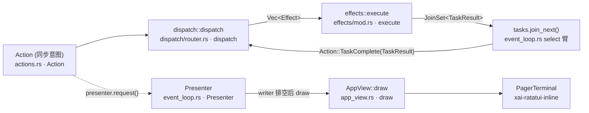

[上一篇：程序入口与运行模式](07-程序入口与运行模式.md) · [总目录](README.md) · [下一篇：Agent会话与模型循环](09-Agent会话与模型循环.md)

# TUI 交互循环与渲染：Action/Effect 可单测事件循环

> **第 8 / 18 篇**
> **场景**：用户在终端敲下回车，prompt 文本如何变成屏幕上的回答与工具调用卡片。本文把「同步 dispatch + 异步 effects + 节流呈现」事件循环讲清，让你能重写一个可单测的 UI 主循环，而不是「会用 Ratatui」。
> **时间**：采样于 2026-09-23（CST），工作区 `HEAD = 2178c69c`（main）。
> 工具版本：Rust 1.94.0（rust-toolchain.toml:11）/ `ratatui 0.29`（`Cargo.toml:234`）/ `tokio full` / `agent-client-protocol 0.10.4`（`Cargo.toml:118`）。UI crate `xai-grok-pager`，渲染 `xai-grok-pager-render`，内联终端 `xai-ratatui-inline`，输入框 `xai-ratatui-textarea`。workspace members = **102**。

> **阅读说明**：本文讲**调用关系与数据流**，不把行号当稳定 API。源码索引一律用「`文件路径` · `符号(+函数内相对偏移)`」，`+0` = 函数/定义所在行。核心不变量：`dispatch` 是**纯同步**的（`xai-grok-pager/src/app/dispatch/router.rs` · `dispatch(+0)` 文档注释「Dispatch an action: mutate state, return effects to execute」），所有 IO 都被推到 `Effect` 异步任务里。

---

### 本文件内容

1. [Why：为什么同步 dispatch + 异步 effects](#1-why为什么同步-dispatch--异步-effects)
2. [模块地图（远比旧文档宽）](#2-模块地图远比旧文档宽)
3. [核心三元组：Action / Effect / TaskResult](#3-核心三元组action--effect--taskresult)
4. [事件循环：input → Action → dispatch → Effect → TaskResult](#4-事件循环input--action--dispatch--effect--taskresult)
5. [渲染：AppView draw 与 pager-render](#5-渲染appview-draw-与-pager-render)
6. [流式渲染：markdown 与 Mermaid worker](#6-流式渲染markdown-与-mermaid-worker)
7. [Prompt 编辑与 PTY / alternate screen / Kitty keyboard](#7-prompt-编辑与-pty--alternate-screen--kitty-keyboard)
8. [Slash 命令与失败路径](#8-slash-命令与失败路径)
9. [重实现：先做一个可单测的空壳循环](#9-重实现先做一个可单测的空壳循环)

其余阶段见[总目录](README.md)。

---

## 1. Why：为什么同步 dispatch + 异步 effects

UI 逻辑要可单测，就不能在「处理一次按键」时阻塞在 IO 上。所以 Grok 把循环拆成两层：

- **同步层 `dispatch`**：给定 `Action` 和当前 `&mut AppView`，只改内存状态、产出 `Vec<Effect>`。**没有 await、不碰终端、不碰网络**——因此能在单测里直接调用。
- **异步层 `effects`**：把每个 `Effect` 变成一个 spawn 进 `JoinSet<TaskResult>` 的 tokio task，完成后把 `TaskResult` 回灌给视图（作为 `Action::TaskComplete`）。

当前 HEAD 上这个纪律有三条支撑：

- **呈现（presentation）被独立成 `Presenter`**：`dispatch` 不再直接「画一帧」，而是 `presenter.request(force)` 打脏标记，由 `Presenter::present_if_dirty` 在「writer 队列已排空」时才真正 draw。这样 ACP token 洪流不会把终端写队列堆爆（`event_loop.rs` · `Presenter`，字段 `dirty` / `force_full_repaint` / `in_flight_target` / `writer_stalled_since` / `last_written_observed` / `blocked_reported` / `last_draw_at` / `draw_scheduled_at`）。
- **同步层保持「可嵌套」**：`dispatch` 会自增/自减 `app.dispatch_depth`，只有**最外层**调用才 flush 图片通知（`dispatch/router.rs` · `dispatch(+0)` ~ `(+8)`；`AppView` 字段 `dispatch_depth: u32` 在 `app_view.rs` · `AppView` 内）。这保证「一次提交只出一条消息」，而嵌套 dispatch（slash 命令内部再发 action）不会互相淹没。
- **循环本体保持薄**：`event_loop.rs` 文件头注释即「A thin `tokio::select!` loop. All input routing, rendering, and state management is delegated to `AppView`」（`event_loop.rs` · `Module: xai-grok-pager/src/app/event_loop.rs(+2)`）。

这三条合起来保证：UI 状态由 `AppView` 单写者拥有，跨 await 的副作用全部在 effects/worker 里，UI 逻辑保持确定性、可断言。

---

## 2. 模块地图（远比旧文档宽）

`crates/codegen/xai-grok-pager/src/app/` 下当前分七大树：

| 子树 | 规模（当前源码） | 职责 |
|---|---|---|
| 事件循环 | `event_loop.rs`（6149 行） | `tokio::select!` 主循环、`Presenter`、`drain_and_process`、`process_effects`、写线程事件对账 |
| 同步分发 | `dispatch/`（28 个条目，含 `session/`、`settings/`、`tests/` 子目录） | `router.rs` 总入口 + `prompt/session/permissions/turn/queue/rewind/auth/billing/dashboard/interject/voice/...` 各专题 |
| 异步副作用 | `effects/`（`mod.rs` 5752 行 + `helpers.rs` + `session_list.rs` + 两个 tests 文件） | `execute(Effect) -> (bool, EffectMeta)`，内部 spawn 进 `JoinSet<TaskResult>` |
| 视图模型 | `app_view.rs`（5857 行）+ `agent_view/`（**38** 个条目） | `AppView` 全局状态；`AgentView` 每 agent 的视图模型 + 输入路由 + 渲染编排 |
| 组件渲染 | `../views/`（**74** 个条目） | 无状态的 widget/layout：`status_bar.rs`、`prompt_widget/`、`shortcuts_bar.rs`、`dashboard/`、各 modal、`agent.rs`（`AgentViewLayout` 纯布局计算） |
| ACP 适配 | `acp_handler/`（**15** 个条目） | 把 ACP 通知翻译成视图状态（permissions/session_notification/subagent_*/mcp/queue/follow_ups/...），入口 `acp_handler::handle` |
| 渲染辅助 | `mermaid_worker.rs`、`edit_highlight_worker.rs`、`status_line/`、`leader_cluster/`、`turn_completion/`、`reader_thread.rs` | Mermaid 后台渲染、编辑高亮、状态行、leader 集群桥、回合完成对账、stdin 读线程 |

> **真实漂移 1（旧文档写错的地方）**：旧指南说「`views/` 已被 `agent_view/` 取代」。**当前两者并存且职责不同**：`app/agent_view/` 是**每 agent 的视图模型**（`AgentView` 同时持有业务状态 session/entries 与 UI 状态 scroll/selection/focus/mode，并负责输入路由与渲染编排）；`src/views/` 是**共享的组件渲染层**（`views/agent.rs` 只做纯布局计算 `AgentViewLayout`/`ActivePane`/`PaneAreas`/`build_hints`，真正的绘制在 `AgentView::draw`）。重实现时按「状态归 AppView、每 agent 编排归 agent_view、共享 widget 归 views」三层切，不要合并成一个大文件。
>
> **真实漂移 2**：`PagerTerminal` 不再是 crossterm 直连的 `ratatui::Terminal`，而是 `xai-ratatui-inline` 的终端：`xai-grok-pager-render/src/render/draw.rs` · `PagerTerminal(+0)`（`= xai_ratatui_inline::Terminal<CrosstermBackend<TermWriter>>`）。多出来的 `TermWriter` 是**带序列号的写队列**，`Presenter` 的「已排空」判断就建立在它的 `queued()`/`written()` 水位上。
>
> **真实漂移 3**：stdin 读取被抽成独立类型 `ReaderThread`（`app/reader_thread.rs` · `ReaderThread(+0)`，`spawn(+11)` 起线程），它持唯一强 sender，`tx` 关闭即退出；teardown 时有界 join（`READER_JOIN_GRACE = 250ms`，`+16`），超时则 detach 并上报（`ReaderJoin::{Joined,TimedOut,Absent}`，`+26`）。旧文档没有这个「读线程所有权」的显式建模。

---

## 3. 核心三元组：Action / Effect / TaskResult

三个类型都定义在 `crates/codegen/xai-grok-pager/src/app/actions.rs`（按变体首行统计，当前分别约 258 / 118 / 139 个变体）：

| 类型 | 位置 | 角色 | 关键变体（节选，均逐字核对当前源码） |
|---|---|---|---|
| `pub enum Action` | `actions.rs` · `Action(+0)` | 同步 UI 意图（用户输入/事件） | `Quit`、`QuitForUpdate`、`QuitConfirmed`、`NewSession`、`SendPrompt(String)`、`RevisePlan(String)`、`SubmitFollowUp(String)`、`SendSlashCommandPreservingDraft(String)`、`Interject{text,images}`、`ExecutePlan{plan_file_content,plan_file_uri}`、`SendPromptNow{text,images,image_notice}`、`CancelTurn`、`TaskComplete(TaskResult)`、`RelaunchInScreenMode{minimal}` |
| `pub enum Effect` | `actions.rs` · `Effect(+0)` | 异步副作用（被 spawn） | `SendPrompt{agent_id,session_id,text,prompt_id,skill_token_ranges}`、`SendPromptBlocks{..}`、`SendPromptNow{agent_id,session_id,blocks,prompt_id}`、`ExecutePlan{..}`、`SendBashCommand{..}`、`CancelTurn{session_id,cancel_subagents,trigger,rewind_prompt_id}`、`Compact{..}`、`KillBgTask`、`KillSubagent`、`ResetMouseReporting`、`QueueRemove{..}`、`QueueReorder{..}`、`RegisterActiveSession`/`UnregisterActiveSession` |
| `pub enum TaskResult` | `actions.rs` · `TaskResult(+0)` | effect 完成回灌 | `WithPinnedMemoryMode{..}`、`SessionCreated{..}`、`StatusLineCommandFinished{..}`、`SendPromptNowFailed{..}`、`SessionRestoreProgress{agent_id,message}` |



> 经典主链路：`Action::SendPromptNow{text,..}` → `dispatch` 产出 `Effect::SendPromptNow{blocks,..}` → effect 经 ACP 把 prompt 发往会话 → `TaskResult`/ACP notification 回灌视图 → `presenter.request()` → 屏幕更新。
>
> 注意 `Effect::SendPrompt` 与 `Effect::SendPromptNow` 是**两个不同 effect**：前者是普通提交（`SendPrompt` 的字段是 `text: String` + `skill_token_ranges: Vec<Range<usize>>`），后者是「先取消在飞 turn，再把这段文本作为下一个 prompt turn」的 send-now 语义（`SendPromptNow` 携带 `blocks: Vec<acp::ContentBlock>`，源码注释「`session/prompt` stamped with `_meta.sendNow`」）。`TaskResult::SendPromptNowFailed` 是它专用的失败回执（见 `09` §9）。

---

## 4. 事件循环：input → Action → dispatch → Effect → TaskResult

`event_loop.rs` · `run(+0)`（`pub(crate) async fn run(`）是唯一的主循环入口；它的核心是**唯一一处** `tokio::select!`（`event_loop.rs` · 语句 `tokio::select!`，位于 `run` 体内，带 `biased;`）。旧文档说的「`select!` 同时消费四类源」已严重过时——当前是 **27 个臂**，且顺序（biased）本身是语义的一部分。

```text
┌──────────────── tokio::select! { biased; ... }  (event_loop.rs, run 体内) ────────────────┐
│  1  _ = connection_cancel.cancelled()          ← leader IPC 断开 → break                  │
│  2  _ = quit_notify.notified()                 ← 信号处理器优雅退出 → dispatch(Quit)→break │
│  3  writer_event = writer_event_rx.recv()      ← 写线程 ack / 失败（WriterEvent）          │
│  4  _ = writer_blocked_report                  ← 写队列零进度超时 → term.writer.blocked    │
│  5  msg = async{acp_peek.take() 或 acp_rx.recv()}, if input_rx.is_empty()                  │
│                                                ← ACP 通知（被输入门控）→ acp_handler::handle│
│  6  Some(join_result) = tasks.join_next()      ← TaskResult → dispatch(TaskComplete)       │
│  7  Some(msg) = progress_rx.recv()             ← 会话恢复进度 → SessionRestoreProgress      │
│  8  result = async{bg_update_rx.await}         ← 后台更新检查完成                           │
│  9  maybe_ev = input_rx.recv()                 ← crossterm 事件 → drain_and_process         │
│ 10  _ = stall_flush                                                                        │
│ 11  _ = resize_debounce        ← 尺寸稳定后只重排一次                                        │
│ 12  _ = deferred_draw          ← 被节流的 draw 到点补画                                      │
│ 13  _ = suspend_retry          ← 只开闸，真正 handoff 在循环顶                               │
│ 14  _ = scroll_tick            ← 16ms 节奏 flush 滚轮行 / 检测 80ms 流间隔                    │
│ 15  _ = animation_tick         ← 三个 reconcile_overdue_* 对账 + app.tick()                 │
│ 16  _ = billing_poll / 17 gate_poll / 18 status_line_refresh / 19 subscription_watch        │
│ 20  _ = dashboard_poll / 21 recap_poll / 22 load_barrier_tick                               │
│ 23  Ok(()) = config_watcher.changed()          ← 配置热重载（dev）                           │
│ 24  Ok(()) = async{appearance_watcher.changed()} ← 系统外观切换（auto-theme）                 │
│ 25  Ok(()) = async{leader_status_rx.changed()} ← leader 连接状态（重连处理）                  │
│ 26  result = async{reconnect_reinit.rx.await}  ← 重连 re-init 完成                          │
│ 27  ev = async{voice_rx.recv()}                ← 语音 STT，**刻意放在最后**                   │
└──────────────────────────────────────────────────────────────────────────────────────────┘
        │                              │
        ▼ (Action)                    ▼ (notification)
 dispatch::dispatch(action, &mut AppView)   ── 同步，纯内存 ──▶ Vec<Effect>
        │                                                      │
        ▼                                                      ▼
 process_effects(effs, &mut JoinSet<TaskResult>, app, &progress_tx)   [event_loop.rs · process_effects]
        │  effects::execute(eff, tasks, &app.acp_tx, &app.cwd, &flags, progress_tx)
        ▼                                                      [effects/mod.rs · execute]
 JoinSet<TaskResult> ── 完成 ──▶ Action::TaskComplete(TaskResult) → dispatch → 状态/新 Effect
        │
        └─ 循环尾：presenter.present_if_dirty(&mut app, terminal)（队列排空才真画）
```

| 序号 | 动作 | 内部调用链 | 说明 |
|---|---|---|---|
| 1 | 终端事件→Action | `input_rx.recv()` → `drain_and_process(ev, &mut input_rx, &mut app, &mut tasks, &progress_tx, &mut csi_filter, &mut x10_filter, &mut xt_filter, live_input_started_at)`（`event_loop.rs` · `drain_and_process(+0)`） | 读线程送来的 `TimedInputEvent`；本函数内部再 `app.handle_input_at_with_paste_provenance` |
| 2 | 同步分发 | `dispatch::dispatch(action, app)`（`dispatch/router.rs` · `dispatch(+0)`） | 返回 `Vec<Effect>`，不 await |
| 3 | 执行副作用 | `process_effects(effs, &mut tasks, &mut app, &progress_tx)`（`event_loop.rs` · `process_effects(+0)`） | 逐个 `effects::execute` → spawn 进 `JoinSet` |
| 4 | ACP 通知 | `acp_handler::handle(msg, &mut app)`（`acp_handler/mod.rs` · `handle(+0)`） | 返回 `bool` = 是否改了状态；随后 `std::mem::take(&mut app.pending_effects)` 再走 `process_effects` |
| 5 | 回灌结果 | `tasks.join_next()` → `dispatch::dispatch(Action::TaskComplete(result), &mut app)` | `input_rx` 关闭（`None`）时 `select!` 退出 |

### 4.1 逐函数骨架（dispatch::dispatch 与 process_effects）

#### 4.1.1 `dispatch::dispatch`（`dispatch/router.rs`）

**纯同步、无 await、无 IO**——这是它能单测的根本。骨架：

```rust
// xai-grok-pager/src/app/dispatch/router.rs  · dispatch(+0)
pub(crate) fn dispatch(action: Action, app: &mut AppView) -> Vec<Effect> {
    app.dispatch_depth = app.dispatch_depth.saturating_add(1);   // +1 可嵌套
    let effects = dispatch_inner(action, app);                   // +2 → 真身
    app.dispatch_depth = app.dispatch_depth.saturating_sub(1);   // +3
    if app.dispatch_depth == 0 {                                 // +4
        flush_image_notices(app);                                // +5 只有最外层 flush
    }
    effects                                                      // 返回，绝不 await
}
// 同文件  · dispatch_inner(+0)
fn dispatch_inner(action: Action, app: &mut AppView) -> Vec<Effect> {
    app.reconcile_foreign_resume_launch();
    let effects = match action {
        Action::Quit | Action::QuitConfirmed => confirmed_quit(app),   // 同文件 · confirmed_quit(+0)
        Action::QuitForUpdate => { /* unregister_all_active_sessions + quit_for_update + Effect::Quit */ }
        Action::ResumeForeignSession => { /* 取 foreign hint → dispatch_initial_prompt */ }
        Action::RelaunchInScreenMode { minimal } => { /* exec_switch_forced 或置 pending_screen_mode_switch */ }
        /* … Action 的其余上百个变体各自映射成 0..N 个 Effect … */
    };
    effects
}
```

> 关键：`dispatch` 的返回类型是 `Vec<Effect>`（不是 `Result`、不含 `async`）。一个 `Action` 可映射出**零个、一个或多个** `Effect`。所有副作用（ACP 请求、终端、磁盘）都被推到 `Effect`，由 `effects::execute` 在 tokio task 里跑。
>
> `dispatch_depth` 计数器让「嵌套 dispatch」在语义上仍是**一次提交**（只 flush 一次图片通知，`dispatch(+0)` 文档注释：「Only the outermost call shows the image notices the whole tree queued」）。重实现时若省掉它，slash 命令内部再 dispatch 会把通知刷两遍。`flush_image_notices` 另有独立入口（`dispatch/router.rs` · `flush_image_notices(+0)`）。

#### 4.1.2 `process_effects`（`event_loop.rs`）

把一批 `Effect` 逐个 spawn 进 `JoinSet<TaskResult>`，并消费每个 effect 的「副作用元数据」：

```rust
// xai-grok-pager/src/app/event_loop.rs  · process_effects(+0)
fn process_effects(
    effs: Vec<super::actions::Effect>,
    tasks: &mut JoinSet<TaskResult>,
    app: &mut AppView,
    progress_tx: &tokio::sync::mpsc::UnboundedSender<effects::RestoreProgressMsg>,
) -> bool {                                             // 返回 quit 标志
    let flags = session_flags_for_effects(app, &effs);
    let mut effs = effs.into_iter().peekable();
    while let Some(eff) = effs.next() {
        if matches!(eff, super::actions::Effect::ResetMouseReporting) {   // +9 终端私有模式：就地发 CSI，不 spawn
            if crate::app::MOUSE_CAPTURE_ENABLED.load(std::sync::atomic::Ordering::Acquire) {
                app.escape_writer.emit_command(crossterm::event::DisableMouseCapture);
                app.escape_writer.emit_command(crossterm::event::EnableMouseCapture);
            }
            continue;
        }
        // +18 把相邻的 interject 合并成一个有序批次（避免 N 个 prompt 竞态）
        let Some(eff) = effects::take_coalesced_interjects(eff, &mut effs, tasks, &app.acp_tx)
        else { continue; };
        let (quit, meta) = effects::execute(                // +22 真正 spawn
            eff, tasks, &app.acp_tx, &app.cwd, &flags, progress_tx);
        // +23 ~ +42 把 effect 回传的 auth 中止 / URL-poll 中止句柄安装进 app.auth_state
        if let Some((seq, abort_handle)) = meta.auth_abort_handle
            && let super::app_view::AuthState::Authenticating { request_seq, handle, .. } = &mut app.auth_state
            && *request_seq == seq
        { *handle = Some(abort_handle); }
        if quit { return true; }                            // 任一 effect 要求退出 → 立即返回
    }
    false
}
```

> 三处当前 HEAD 的细节，旧文档没有：
>
> 1. **`Effect::ResetMouseReporting` 不走 `execute`**：它是终端私有模式的就地重发（禁用再启用鼠标捕获），因为 ConPTY/relay 会剥掉 DEC 私有模式（见 `event_loop.rs` · `reassert_mouse_capture_on_focus(+0)`）。
> 2. **interject 合并在同步路径上做**：`effects::take_coalesced_interjects`（`effects/mod.rs` · `take_coalesced_interjects(+0)`）与 `spawn_ordered_interjects`（`effects/mod.rs` · `+0`）保证同一批次里的多条插话**按序**送入同一个 ACP 请求，而不是并发抢跑。
> 3. **`EffectMeta`**（`effects/helpers.rs` · `EffectMeta(+0)`）携带 `auth_abort_handle` / `auth_url_poll_handle`（各为 `Option<(u64, AbortHandle)>`，按 `request_seq` 对齐）——这是「同步 dispatch 产出的 effect，在异步层才拿到副作用句柄」的典型例子。

#### 4.1.3 `Presenter`：节流呈现（当前 HEAD 新增层）

`Presenter`（`event_loop.rs` · `Presenter(+0)`，`impl` 在 `+16`）把「请求重绘」与「真正 draw」解耦：

| 方法（`event_loop.rs` · `Presenter::X`） | 语义 |
|---|---|
| `acknowledge(sequence) -> bool` | writer ack 到达，`sequence >= in_flight_target` 才清在飞闸门 |
| `observe_writer_progress(queued, written, now) -> WriterProgress` | 从队列水位判 `Flowing` / `Stalled` / `Recovered{blocked_for}`（`WriterProgress` 枚举在 `+0`） |
| `blocked_report_deadline() -> Option<Instant>` | 未上报的 stall episode 的上报截止时间（`writer_stalled_since + WRITER_BLOCKED_WARN_AFTER`） |
| `mark_blocked_reported() -> Duration` | 同一 episode 只上报一次 |
| `try_present(written, queued_before, draw, queued_after) -> bool` | **写队列没排空（`written < queued_before`）就拒绝 draw**；否则清 dirty、`draw(force)`、按 `queued_after()` 置 `in_flight_target` |
| `request(force_full_repaint)` | 只打脏标记 |
| `request_throttled(now, min_draw_interval) -> bool` | 节流；被节流时记 `draw_scheduled_at`，由 `deferred_draw` 臂补画 |
| `mark_drawn(now)` | 更新 `last_draw_at`、清 `draw_scheduled_at` |
| `present_if_dirty(app, terminal)` | 取 `writer_sync.queued()/written()`，`try_present` 里调 `app.draw(terminal)` |
| `request_presentation(app, terminal, force)` | `request` + `present_if_dirty` 的组合 |

**失败路径（与成功路径同等重要）**：

- 写线程「活着但不消费」→ `writer_event_rx` 不再来 ack → `Presenter::observe_writer_progress` 判 `Stalled`，`writer_blocked_report` 臂在 `WRITER_BLOCKED_WARN_AFTER` 后发 `term.writer.blocked` 统一日志 + `TermWriterBlocked` 遥测（`event_loop.rs` · select 臂 `writer_blocked_report`，位于 `run` 体内）。这正是「循环活着但屏幕冻结」这一族线上问题的诊断点（源码注释：「Field diagnosis for the mid-turn freeze family」）。
- 写线程真的失败 → `writer_event_sequence(WriterEvent::Failed(e))` 返回 `Err` → `run` 直接 `return Err(...)`（`event_loop.rs` · `writer_event_sequence(+0)`，调用点在 `run` 的 `writer_event_rx` 臂内）。
- `writer_event_rx` 被关闭（`None`）→ `return Err(anyhow::anyhow!("terminal writer stopped"))`。
- `try_present` 在写队列有积压时**故意不画**（返回 `false`）——这是背压，不是 bug；`in_flight_target` 保证同一帧不会重复入队。

#### 4.1.4 `drain_and_process`：输入批处理（`event_loop.rs`）

`input_rx` 臂不逐事件处理，而是把当前就绪的一批事件一次性收干再统一处理：

```rust
// xai-grok-pager/src/app/event_loop.rs  · drain_and_process(+0)
async fn drain_and_process(
    first: TimedInputEvent,
    input_rx: &mut UnboundedReceiver<TimedInputEvent>,
    app: &mut AppView, tasks: &mut JoinSet<TaskResult>,
    progress_tx: &UnboundedSender<effects::RestoreProgressMsg>,
    csi_filter: &mut CsiFragmentFilter,
    x10_filter: &mut X10ReassemblyFilter,
    xt_filter: &mut XtversionFilter,
    live_input_started_at: Instant,
) -> DrainResult {
    let mut raw_events = vec![first];
    drain_immediate(&mut raw_events, input_rx);              // +16 收干就绪事件
    let live_start = raw_events.partition_point(|e| e.arrived_at < live_input_started_at);
    let mut live_events = raw_events.split_off(live_start);  // +18 启动前 typeahead 与实时输入分开
    let startup_events = raw_events;
    if xt_filter.armed() { /* XTVERSION 应答分片等待 */ }
    if should_extend_for_paste(&live_events) && detect_paste(&mut live_events, input_rx).await {
        collect_remaining_paste(&mut live_events, input_rx).await;   // +25 粘贴收全，避免截断
    }
    let mut coalesced = startup_events;
    if app.gboom_active() { coalesced.extend(live_events); }
    else { coalesced.extend(coalesce_live_keys(live_events)); }      // +35 同键重复合并
    let coalesced = csi_filter.filter(coalesced);                    // +37 过滤被截断的 CSI 片段
    let coalesced = x10_filter.filter(coalesced);                    // +38 重组 X10 鼠标字节
    let coalesced = coalesced.into_iter()
        .map(|e| normalize_input_event(e, live_input_started_at)).collect::<Vec<_>>();
    // 之后逐个 handle_one(...)，返回 DrainResult { handled, needs_draw, force_repaint, resize_only, should_quit }
}
```

> 三个过滤器（`csi_filter` / `x10_filter` / `xt_filter`）都是「防止半截转义序列被当成按键」的护栏：CSI 片段过滤防「一次 read 只读到一半 ESC 序列」；X10 重组防 ConPTY 把 SGR 鼠标降级成 X10 字节后混进文本；XTVERSION 过滤防终端版本应答被当成输入。**失败路径**：过滤器识别不出前缀时按普通字节透传（宁可显示乱码也不吞按键），并把 `force_repaint` 置位让下一帧整屏重绘。

---

## 5. 渲染：AppView draw 与 pager-render

- 视图状态集中在 `AppView`（`app/app_view.rs` · `AppView(+0)`，字段含 `escape_writer`、`pending_effects`、`dispatch_depth` 等；多个 `impl` 块分布在该文件内）。
- 绘制入口 `pub fn draw(&mut self, terminal: &mut PagerTerminal)`（`app_view.rs` · `draw(+0)`），它只做三件事：调 `draw_inner`（`+1`）、记 `xai_grok_telemetry::startup::record_first_draw()`、`crate::memory_release::run_deferred_release()`。
- `draw_inner`（`app_view.rs` · `draw_inner(+0)`）先判屏幕模式：**minimal 模式**直接走 `crate::minimal_hook::hooks().draw(self, terminal)` 并返回（`draw_inner(+2 ~ +6)`）；fullscreen 模式才继续铺 banner/状态行/各 pane。
- 真正画 agent 的是 `AgentView::draw`（`app/agent_view/render.rs` · `AgentView::draw(+0)`），签名较长（`area, buf, registry, scratch, pending_hint, overlay_focused, banner, bundle_state, in_dashboard_overlay, link_spans_out, app_params`），返回 `(Option<(u16,u16)> /*光标*/, Option<PostFlush> /*flush 后置动作*/)`。
- 共享 widget（StatusBar / ShortcutsBar / PromptWidget / 各 modal）由 `src/views/` 提供，布局计算在 `views/agent.rs`（`ActivePane(+0)`、`PaneAreas(+0)`、`AgentViewLayoutParams(+0)`、`AgentViewLayout(+0)`、`build_hints(+0)`）。
- 渲染底层在 `xai-grok-pager-render`：`render/draw.rs`（`PagerTerminal`、`TermWriter`、`WriterSync`、`WriterEvent`、`WriterDrain`）、`render/{wrapping,scrollbar,osc8,highlight,image_overlay,video_overlay,bidi,color,preview_overlay,renderable,safe_buf,terminal_output,gboom_overlay,line_utils,tool_paths}.rs`、`terminal/{kitty_keyboard,hyperlinks,probe,tmux,xtversion,da2,keyboard,embedded_editor,pop_fence,term_version}.rs`、`syntax.rs`、`theme/`。

**Writer 路径（帧如何真的到终端）**：

```text
AppView::draw(terminal)                                   app_view.rs  · draw(+0)
  └─ AppView::draw_inner(terminal)                        app_view.rs  · draw_inner(+0)
       └─ (fullscreen) render::draw::draw_frame(terminal, cursor, terminal_context, |f, spans| {…})
                                                          pager-render/src/render/draw.rs  · draw_frame(+0)
            └─ PagerTerminal::draw(render_callback)       xai-ratatui-inline/src/terminal.rs
                 └─ TermWriter 把一帧编码成 payload，WriterSync::reserve_sequence() 先占号
                    （draw.rs · TermWriter(+0)；draw.rs · WriterSync::reserve_sequence(+0)）
                      └─ 写线程写出 → WriterSync::mark_written(sequence)（draw.rs · +0）
                           └─ 发 WriterEvent::Written(seq)（draw.rs · WriterEvent(+0)）
                                └─ 主循环 writer_event_rx 臂 → Presenter::acknowledge(seq) 清在飞闸门
                                     └─ 首帧时 record_interactive_frame()，必要时 exit_after_first_render() 直接退出
```

> 序列号**在 send 之前**就保留（`reserve_sequence(+0)` 源码注释：「Sequence is reserved before send, so an accepted frame blocks the child-handoff drain before the writer sees it」），所以「已被接受的帧」会先于子进程接管 tty 而进入 drain 闸门——`WriterSync` 的 `producer` 字段（`Arc<OnceLock<ThreadId>>`）还额外锁死「只有一个线程能产 payload」。这是防止 `LeaveAlternateScreen` 之类 teardown 指令被插队的关键。`AppView` 另持有 `escape_writer: EscapeWriter`（`draw.rs` · `EscapeWriter(+0)`）用于「不入帧」的带外转义（鼠标捕获重发、光标样式），它共享同一个 `WriterSync`（`draw.rs` · `EscapeWriter::writer_sync(+0)`）。
>
> **背压闭环**：`WriterSync::wait_drained(timeout)`（`draw.rs` · `+0`）返回 `WriterDrain::{Drained,TimedOut}`，`WriterDrain` 定义在 `draw.rs(+0)`。

**失败语义**：终端损坏时 `select!` 退出路径统一走 `run` 的返回（`RunResult` / `Err`），由 `07` 的 `shutdown_and_flush_telemetry` 收尾；部分重绘由 Ratatui 的 diff 能力处理，UI 逻辑里不手写。

---

## 6. 流式渲染：markdown 与 Mermaid worker

- **Markdown 流式**：模型增量 token 经 ACP notification 进 `AppView`，由 `xai-grok-pager-render`（`syntax.rs` + `render/highlight.rs`）增量渲染为终端富文本，不阻塞事件循环。
- **Mermaid 后台渲染**（`app/mermaid_worker.rs`）：
  - `spawn_worker() -> (Sender<MermaidJob>, Receiver<MermaidResult>)`（`+0`）起独立线程；
  - `render_via_subprocess(...)`（`+0`）把 Mermaid 源码交给**子进程**渲染（带 wall-clock 预算），`maybe_run_render_subprocess()`（`+0`）是子进程入口；
  - `MermaidRuntime`（`+0`）是**每 agent 一份**的运行时（`AgentView` 的 `mermaid` 字段），不是 `AppView` 全局字段；`request_mermaid_render(source, action)`（`+0`）、`mermaid_tick()`（`+0`）、`mermaid_needs_tick()`（`+0`）由 `app.tick()` 驱动，而 `app.tick()` 在 `animation_tick` 臂里被调用；
  - `sweep_session_cache(dir, max_bytes)`（`+0`）做磁盘缓存淘汰。
- **编辑高亮**（`app/edit_highlight_worker.rs`）：`EditHlRuntime`（`+0`）是每 agent 一份，`spawn_worker()`（`+0`）起线程，`submit_edit_highlight(entry_id)`（`+0`）投递任务，`edit_hl_tick()`（`+0`）由 `app.tick()` 收割结果。
- **状态行**：`app/status_line/`（`command.rs` / `metrics.rs`）+ `app/status_line.rs` + `status_line_policy.rs`；`Effect::RunStatusLineCommand` 走 `JoinSet`，结果以 `TaskResult::StatusLineCommandFinished` 回灌；`status_line_refresh` 臂按独立节奏重新武装定时器。

> 这三个 worker 都是「effect/定时器的下游」：由事件循环 spawn 或 tick，结果经 channel 回灌视图，不占 `dispatch` 的同步路径。**失败路径**：Mermaid 子进程超时会带 `child_watchdog` 自毁码返回，`map_run_result` 把它与普通渲染错误区分开；worker 线程 panic 只丢失该次渲染，主循环照常。

---

## 7. Prompt 编辑与 PTY / alternate screen / Kitty keyboard

- **Prompt 输入框**：`views/prompt_widget/mod.rs`（+ `image_state.rs`）用 `xai-ratatui-textarea`（独立 crate）的 `TextArea`/`TextAreaState`/`TextElement`/`ElementId`，支持多行编辑、撤销、粘贴、内嵌图片元素。
- **alternate screen**：在 `app/mod.rs` · `init_terminal(+0)` 里设置。关键顺序（多数是 `with_locked_stderr` 包起来的）：
  1. `xai_crash_handler::enable_terminal_escape_restore()`（`+8`）、`enable_raw_mode()`（`+9`）；
  2. `set_terminal_title("")`（`+18`）；minimal 且 `clear_main_screen` 时清主屏（`+19`）；
  3. **fullscreen 才** `EnterAlternateScreen`（`+31`）——minimal 模式**不进** alternate screen；
  4. fullscreen 才 `EnableMouseCapture`（`+40`）；minimal 且终端会把鼠标上报漏成文本时发 `MOUSE_TRACKING_RESET`（`+42`）；
  5. `EnableFocusChange` + `EnableBracketedPaste` + `cursor::Hide`（`+46`）；
  6. 光标样式策略（`Inherit` / `ForceBlinking` / `ForceSteady`，`+50 ~ +64`）；
  7. `MOUSE_CAPTURE_ENABLED.store(!want_minimal)`（`+67`）、`set_current_screen_mode(mode)`（`+68`）、`set_panic_hook()`（`+69`）、`signal_handler::install(mode)`（`+70`）。
  退出/切模式由 `app/mode_switch.rs` 用 `EnterAlternateScreen`/`LeaveAlternateScreen` + `Clear` 完成。
- **Kitty keyboard**：`init_terminal` 先算跳过原因——`ctx.kitty_skip_reason()`，再叠加 `terminal::supports_keyboard_enhancement()`（`init_terminal(+79 ~ +85)`）；Alacritty 会保守地降级（`alacritty_conservative_version` 用 `ALACRITTY_BROKEN_EVENT_TYPES_MAX_PACKED`，`pager-render/src/terminal/kitty_keyboard.rs` 内常量）。`negotiated_kitty_flags(skip_reason, da2_packed)`（`kitty_keyboard.rs` · `+0`）返回最终 flag 集（`DISAMBIGUATE_ESCAPE_CODES` 必推，`REPORT_EVENT_TYPES` 仅在终端不误报 release 时推）；非空则 `PushKeyboardEnhancementFlags(flags)`（`init_terminal(+98)`），并用 `crate::terminal::set_pushed_kitty_flags(flags)`（`+109`）记下「真正推过什么」。挂起/恢复路径按记录原样重推（`app/mod.rs` 内两处 `set_pushed_kitty_flags` 调用），两者不会漂移。
- **OSC 8 / OSC 52**：链接用 `pager-render/src/render/osc8.rs`；剪贴板经 OSC 52，`app/wrap_clipboard_image.rs` 与 `07` 的 `Wrap` 子命令共用。
- **PTY**：分两块，别混：
  - **pager 自己包装子进程**（`src/pty_wrap.rs`、`src/wrap_cmd.rs`、`src/wrap_restore.rs`）：`Wrap` 子命令把用户命令塞进 PTY 跑，退出时还原终端。
  - **agent 作用域的交互式 PTY**（`xai-grok-shell-terminal/src/pty_session.rs`，`PtySession(+0)`）：按 `terminalId` 索引、**生命周期长于 session**，I/O 复用现有 ACP WebSocket 多路复用；对外 API `create_pty`（`+0`）、`write_pty_input`（`+0`）、`resize_pty`（`+0`）、`close_pty`（`+0`）、`close_all`（`+0`）、`load`（`+0`）。注释明确「shell 自己退出时**不**带走这些 PTY，就像真终端一样」。
- **PTY 回归/基准工具**：`crates/codegen/xai-grok-pager-pty-harness`（L1 `src/pty.rs` 管理、L2a `src/screen.rs` 用 `alacritty_terminal` 还原「用户看到什么」、L2b `src/timing.rs` 用 `?2026 h/l` 标记量每帧耗时、L3 `src/content.rs` 用 mock 推理服务灌真实内容），`src/scenarios/` 下有 `streaming_render`、`resize_storm`、`scroll_stress`、`x10_mouse_leak`、`plan_approval_resume`、`large_codeblock`、`mixed_interaction`、`idle_cost`、`empty_enter_send_now` 等命名负载。**这是「终端行为」唯一可自动断言的层**，重实现时应照抄这套分层。

---

## 8. Slash 命令与失败路径

- **Slash 命令**：解析入口 `crate::slash::parse_invocation(line)`（`src/slash/mod.rs` · `parse_invocation(+0)`），在 `dispatch/prompt.rs` 的提交路径里被调用。`SendPrompt` 与 `SubmitFollowUp` 的区别在于——follow-up 建议文本是 server/model 控制的，必须**绕过** slash 命令与退出别名解析（`actions.rs` · `Action` 中 `SubmitFollowUp` 的文档注释；`dispatch/prompt.rs` 提交函数内注释「The suggestion text is server/model-controlled, so it must bypass slash-command and exit-alias resolution」）。
- **mid-text 提升**：`slash::mid_text_hoist::hoist_mid_text_command(text, registry)`（`src/slash/mid_text_hoist.rs` · `+0`）支持把夹在正文中间的命令 token 提升成命令（例如 `/goal`），并会重写 `slash_input`，因为下游 args 站点会重新解析它。
- **`Action::SendSlashCommandPreservingDraft`**：由 modal 驱动的 slash 分发器（命令面板、ArgPicker）使用，行为与 `SendPrompt` 完全一致（同 registry 解析、同 effect 输出），**只是不调 `prompt.set_text("")`**，从而保留用户草稿（`actions.rs` · `Action` 内该变体文档注释）。
- **失败路径**（与成功路径同等篇幅）：
  - **会话创建失败** → `TaskResult` 携带错误 → 视图弹错；退出前 `unregister_all_active_sessions` 清理（`dispatch/router.rs` · `confirmed_quit(+0)`）。
  - **ACP RPC 超时** → `effects::helpers::acp_send_bounded(request, tx, action)`（`effects/helpers.rs` · `+0`）用 `session_rpc_timeout()` 包住，超时返回 `SessionRpcError::TimedOut{action, timeout}`。**注意**：旧文档引用的无界 `acp_send`（曾位于 `effects/mod.rs`）在当前 HEAD **已不是会话 RPC 的对外入口**，所有会话 RPC 都改走这个有界包装。
  - **effect 取消/abort** → `JoinSet` 中 task 被 drop；`tasks.join_next()` 的 `Err` 分支区分 `join_err.is_cancelled()`（正常 abort，debug 日志）与 panic（error 日志 + `tracing::error!("Spawned task panicked: {join_err}")`）。
  - **粘贴风暴** → `drain_and_process` 的 `detect_paste` + `collect_remaining_paste` 把整段粘贴收全再一次性投递；`coalesce_live_keys` 合并同键重复。
  - **终端字节流撕裂** → `csi_filter` / `x10_filter` / `xt_filter` 三道过滤（见 §4.1.4）。
  - **丢失响应**（turn 结束广播到了但 `session/prompt` RPC 响应没到）→ `animation_tick` 臂里的三个对账函数：`dispatch::reconcile_overdue_cancels`、`dispatch::reconcile_overdue_prompt_acks`、`dispatch::reconcile_overdue_turn_ends`（`event_loop.rs` · select 臂 `animation_tick`）。这是「不变量：UI 不能永远卡在 Working」的兜底。
  - **leader IPC 断开** → `connection_cancel.cancelled()` 臂直接 `break`（源码注释说明：否则 `AppView` 持有的客户端 tx 会让 `acp_rx` 永不关闭，循环挂死）；重连由 `leader_status_rx.changed()` 驱动并 toast 提示，重连后跑一次全 agent `session/load` re-init（`reconnect_reinit` 臂）。
  - **滚动/绘制卡顿** → `scroll_tick` 臂以 16ms 节奏 flush 残余滚轮行并检测流间隔；`resize_debounce` 臂等尺寸稳定后只重排一次。

---

## 9. 重实现：先做一个可单测的空壳循环

照真实符号的最小骨架（伪代码）：

```rust
// app/event_loop.rs（伪代码，对应真实符号）
pub(crate) async fn run(mut app: AppView, mut terminal: PagerTerminal) -> anyhow::Result<RunResult> {
    let mut tasks: JoinSet<TaskResult> = JoinSet::new();
    let mut presenter = Presenter::new();                       // event_loop.rs · Presenter(+0)
    loop {
        tokio::select! {                                        // event_loop.rs 唯一 select!（biased）
            _ = connection_cancel.cancelled() => break,
            _ = quit_notify.notified() => {
                let effs = dispatch::dispatch(Action::Quit, &mut app);   // router.rs · dispatch(+0)（同步）
                let _ = process_effects(effs, &mut tasks, &mut app, &progress_tx);
                break;
            }
            writer_event = writer_event_rx.recv() => {           // WriterEvent::Written/Failed
                let seq = writer_event_sequence(writer_event)?;  // Failed → 直接 Err 退出
                presenter.acknowledge(seq);
            }
            msg = acp_rx.recv(), if input_rx.is_empty() => {     // 被输入门控，防饥饿
                acp_handler::handle(msg, &mut app);              // acp_handler/mod.rs · handle(+0)
                let effs = std::mem::take(&mut app.pending_effects);
                process_effects(effs, &mut tasks, &mut app, &progress_tx);
            }
            Some(joined) = tasks.join_next() => {
                match joined {
                    Ok(result) => {
                        let effs = dispatch::dispatch(Action::TaskComplete(result), &mut app);
                        process_effects(effs, &mut tasks, &mut app, &progress_tx);
                    }
                    Err(e) if e.is_cancelled() => {}             // abort 是正常路径
                    Err(e) => tracing::error!("Spawned task panicked: {e}"),
                }
            }
            maybe_ev = input_rx.recv() => {
                let Some(ev) = maybe_ev else { break };          // 读线程结束 = 关闭
                let r = drain_and_process(ev, &mut input_rx, &mut app, &mut tasks,
                                          &progress_tx, &mut csi_filter, &mut x10_filter,
                                          &mut xt_filter, live_input_started_at).await;
                if r.should_quit { break; }
                if r.needs_draw { presenter.request(r.force_repaint); }
            }
            _ = animation_tick => { /* reconcile_overdue_* 三个对账 + app.tick() */ }
        }
        presenter.present_if_dirty(&mut app, &mut terminal);      // 队列排空才真画
    }
    Ok(/* RunResult */)
}
```

> 落地顺序建议：
> 1. 先把 `dispatch` 写成「`Action → Vec<Effect>` 的纯函数」并单测（无 tokio、无终端）；
> 2. 再让 `effects::execute` 把 `Effect` 接到真实 ACP/终端，配 `EffectMeta` 回传异步句柄；
> 3. 加 `Presenter` 的脏标记 + 写队列水位闸门（这是防「token 洪流堆爆写队列」的关键，别省）；
> 4. 最后补 `agent_view/` 编排与 `views/` widget；`drain_and_process` 的三道过滤器在有真实终端后按需加。
> 循环本体保持薄——所有判断都应在 `dispatch`、`acp_handler::handle`、`Presenter` 里可单测。

---

## 本文件结论

1. TUI 主循环 = 同步 `dispatch::dispatch(Action, &mut AppView) -> Vec<Effect>`（`dispatch/router.rs`，纯同步可单测，带 `dispatch_depth` 嵌套计数）+ 异步 `effects::execute` spawn 进 `JoinSet<TaskResult>`（`effects/mod.rs`），由 `event_loop.rs::run` 里**唯一一处**带 `biased` 的 `tokio::select!`（27 个臂）驱动。
2. `Presenter` 层（`event_loop.rs` · `Presenter`）：`dispatch` 只打脏标记，真正 draw 由 `present_if_dirty` 在**写队列排空后**执行，并用 `WriterEvent` ack 关在飞闸门——这是背压与「屏幕冻结」诊断的落点。
3. 视图状态归 `AppView`（`app/app_view.rs`）单写；**每 agent 的编排**归 `agent_view/`（38 条目），**共享 widget 渲染**归 `src/views/`（74 条目）——旧文档「views 被 agent_view 取代」的说法不成立，两者并存且分工不同。
4. 终端本体是 `xai-ratatui-inline::Terminal<CrosstermBackend<TermWriter>>`（`PagerTerminal` 别名在 `pager-render/src/render/draw.rs`），不是裸 crossterm；alternate screen 只在 fullscreen 模式进（`init_terminal`），minimal 模式走 `xai-grok-pager-minimal` 的 draw hook。
5. 输入侧由独立读线程（`app/reader_thread.rs` 的 `ReaderThread`）经 `UnboundedSender<TimedInputEvent>` 送进主循环，`drain_and_process` 负责粘贴收全、按键合并与 CSI/X10/XTVERSION 三道过滤；输出侧由 `mermaid_worker` / `edit_highlight_worker` / `status_line` 作为 effect/定时器下游异步产出。
6. 会话 RPC 统一走 `effects/helpers.rs::acp_send_bounded`（带 `session_rpc_timeout` 与 `SessionRpcError::TimedOut`）；`Effect::ResetMouseReporting` 是唯一不经 `execute`、由 `process_effects` 就地处理的 effect。

[上一篇：程序入口与运行模式](07-程序入口与运行模式.md) · [总目录](README.md) · [下一篇：Agent会话与模型循环](09-Agent会话与模型循环.md)
