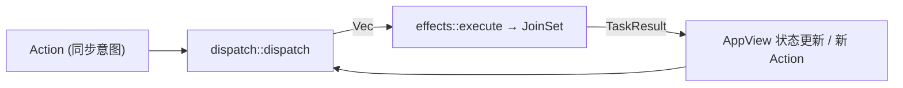

[上一篇：程序入口与运行模式](07-程序入口与运行模式.md) · [总目录](README.md) · [下一篇：Agent会话与模型循环](09-Agent会话与模型循环.md)

# TUI 交互循环与渲染：Action/Effect 可单测事件循环

> **场景**：用户在终端敲下回车，prompt 文本如何变成屏幕上的回答与工具调用卡片。本文把「同步 dispatch + 异步 effects」事件循环讲清，让你能重写一个可单测的 UI 主循环，而不是「会用 Ratatui」。
> **时间**：采样于 2026-08-25（CST），工作区 `HEAD = 940ce403`。
> **工具版本**：Rust `1.94.0`；UI crate `xai-grok-pager`，渲染 `xai-grok-pager-render`，输入框 `xai-ratatui-textarea`。

> **阅读说明**：本文讲**调用关系与数据流**，不把行号当稳定 API。行号来自当前工作区快照；若本地已有后续修改，**以当前源码为准**。核心不变量：`dispatch` 是**纯同步**的（`dispatch/mod.rs:10`「fully testable without tokio or a terminal」），所有 IO 都被推到 `Effect` 异步任务里。

---

### 本文件内容

1. [Why：为什么同步 dispatch + 异步 effects](#1-why为什么同步-dispatch--异步-effects)
2. [模块地图（远比旧文档宽）](#2-模块地图远比旧文档宽)
3. [核心三元组：Action / Effect / TaskResult](#3-核心三元组action--effect--taskresult)
4. [事件循环：input → Action → dispatch → Effect → TaskResult](#4-事件循环input--action--dispatch--effect--taskresult)
5. [渲染：AppView draw 与 pager-render](#5-渲染appview-draw-与-pager-render)
6. [流式渲染：markdown 与 Mermaid worker](#6-流式渲染markdown-与-mermaid-worker)
7. [Prompt 编辑与 PTY / alternate screen / Kitty keyboard](#7-prompt-编辑与-pty--alternate-screen--kitty-keyboard)
8. [Slash 命令与失败路径](#8-slash-命令与失败路径)
9. [重实现：先做一个可单测的空壳循环](#9-重实现先做一个可单测的空壳循环)

其余阶段见[总目录](README.md)。

---

## 1. Why：为什么同步 dispatch + 异步 effects

UI 逻辑要可单测，就不能在「处理一次按键」时阻塞在 IO 上。所以 Grok 把循环拆成两层：

- **同步层 `dispatch`**：给定 `Action` 和当前 `&mut AppView`，只改内存状态、产出 `Vec<Effect>`。**没有任何 await、不碰终端、不碰网络**——因此能在单测里直接调用（`dispatch/mod.rs:1-10`）。
- **异步层 `effects`**：把每个 `Effect` 变成一个 spawn 的 tokio task，完成后把 `TaskResult` 回灌给视图（或作为新的 `Action`）。

这保证「UI 状态」由 AppView 单写者拥有（README 不变量 1），跨 await 的副作用全部在 effects 里，UI 逻辑保持确定性。

---

## 2. 模块地图（远比旧文档宽）

`crates/codegen/xai-grok-pager/src/app/` 下当前分三大子树，规模远超早期「`app/mod.rs` + `event_loop.rs` + `dispatch/` + `effects.rs` + `scrollback/` + `views/`」的描述：

| 子树 | 代表文件 | 职责 |
|---|---|---|
| 事件循环 | `event_loop.rs` | `tokio::select!` 主循环、`process_effects` |
| 同步分发 | `dispatch/`（~20 文件） | `router.rs` 总入口 + `prompt/session/permissions/turn/queue/rewind/...` 各专题 |
| 异步副作用 | `effects/mod.rs` + `effects/helpers.rs` | `execute(Effect)` → `JoinSet<TaskResult>` |
| 视图 | `app_view.rs` + `agent_view/`（~30 文件） | `AppView` 状态 + 渲染拆图（input/prompt/panes/plan/links/viewer/...） |
| ACP 适配 | `acp_handler/`（~14 文件） | 把 ACP 通知翻译成视图状态（permissions/session_notification/subagent_*/mcp/...） |
| 渲染辅助 | `mermaid_worker.rs`、`edit_highlight_worker.rs`、`status_line/`、`render/` | Mermaid 后台渲染、编辑高亮、状态行、OSC8 链接 |

> **真实漂移**：旧指南把 TUI 渲染塞在「`views/`」里；当前 `agent_view/` 已展开为约 30 个职责单一的子模块（输入框、计划视图、链接、查看器、撤销/重放、队列、会话、媒体、工作流浮层等），`acp_handler/` 也独立成 14 文件。重实现时按「状态归 AppView，渲染归 agent_view，协议归 acp_handler」分层，不要回退到巨型 `views.rs`。

---

## 3. 核心三元组：Action / Effect / TaskResult

三个类型都定义在 `crates/codegen/xai-grok-pager/src/app/actions.rs`：

| 类型 | 行号 | 角色 | 关键变体（节选） |
|---|---|---|---|
| `pub enum Action` | `actions.rs:40` | 同步 UI 意图（用户输入/事件） | `Quit`、`SendPrompt(String)`、`LoadSession(String,..)`、`CreateSession`、`PickSession(usize)`、`ShowSessionPicker`、`OpenUrl(String)`、`RelaunchInScreenMode` |
| `pub enum Effect` | `actions.rs:1446` | 异步副作用（被 spawn） | `CreateSession{..}`、`LoadSession{..}`、`CreateWorktreeSession{..}`、`FetchSessionList{..}`、`RunStatusLineCommand`、`SetWorkingDir` |
| `pub enum TaskResult` | `actions.rs:2333` | effect 完成回灌 | 各 effect 对应的结果枚举（会话创建成功/失败、搜索结果、权限结果……） |



> 经典主链路：`Action::SendPrompt(text)` → `dispatch` 产出 `Effect::CreateSession`/`Effect::{SendPrompt 形态}` → effect 经 ACP 把 prompt 发往会话 → `TaskResult`/ACP notification 回灌视图 → 屏幕更新。

---

## 4. 事件循环：input → Action → dispatch → Effect → TaskResult

`event_loop.rs` 主循环是 `pub(crate) async fn run(`（`event_loop.rs:1046`），核心是 `tokio::select!`（`event_loop.rs:2552`），同时消费四类源：

```text
┌─────────────────────────── tokio::select! (event_loop.rs:2552) ───────────────────────────┐
│  input_rx.recv()      ← crossterm 终端事件（键鼠/resize）→ InputOutcome::Action            │
│  acp_rx.recv()        ← ACP 服务端通知（SamplingEvent/tool/permission）→ 视图状态          │
│  writer_event_rx      ← 渲染 writer 事件                                                 │
│  progress_tx / tasks  ← effects 完成的 TaskResult                                          │
└────────────────────────────────────────────────────────────────────────────────────────┘
        │                              │
        ▼ (Action)                    ▼ (notification)
 dispatch::dispatch(action, &mut AppView)   ── 同步，纯内存 ──▶ Vec<Effect>
        │                                                      │
        ▼                                                      ▼
 process_effects(effs, &mut JoinSet<TaskResult>, app, progress_tx)   [event_loop.rs:4488]
        │  effects::execute(eff, tasks, &app.acp_tx, &app.cwd, &flags, progress_tx)
        ▼                                                      [event_loop.rs:4496]
 JoinSet<TaskResult>  ── 完成后 ──▶ TaskResult → 视图状态 / 新 Action
```

| 序号 | 动作 | 内部调用链（`file:line`） | 说明 |
|---|---|---|---|
| 1 | 终端事件→Action | crossterm → `app.handle_input_at_with_paste_provenance` | 见 `dispatch_then_forward`（`event_loop.rs:4471`） |
| 2 | 同步分发 | `dispatch::dispatch(action, app)` — `dispatch/router.rs:149` | 返回 `Vec<Effect>`，不 await |
| 3 | 合并且可能再分发 | `dispatch_then_forward`（`event_loop.rs:4471`） | 分发 action 后把输入再走一遍，合并 effects |
| 4 | 执行副作用 | `effects::execute(eff, tasks, &app.acp_tx, &app.cwd, &flags, progress_tx)` — `event_loop.rs:4496` | spawn 进 `JoinSet<TaskResult>` |
| 5 | 回灌结果 | `TaskResult` → 视图/新 `Action` | 关闭 `input_rx` 时 `select!` 退出（`event_loop.rs:1846`） |

> `dispatch` 的纯同步性意味着第 2 步可以在没有 tokio、没有终端的单元测试里直接断言「给定这个 Action，产出这些 Effect」——这是可重实现的关键测试点。

---

### 4.1 逐函数骨架（dispatch::dispatch 与 process_effects）

把 §4 的「输入→Action→dispatch→Effect→TaskResult」落到真实函数体。

#### 4.1.1 `dispatch::dispatch`（dispatch/router.rs:149）

**纯同步、无 await、无 IO**——这是它能单测的根本（见 §1、`dispatch/mod.rs:10`）。骨架：

```rust
// xai-grok-pager/src/app/dispatch/router.rs:149
pub(crate) fn dispatch(action: Action, app: &mut AppView) -> Vec<Effect> {
    app.reconcile_foreign_resume_launch();
    let effects = match action {
        Action::Quit | Action::QuitConfirmed => {              // :152
            let mut effects = unregister_all_active_sessions(app);
            effects.push(Effect::Quit);                        // 退出前清活跃会话
            effects
        }
        Action::NewSession => dispatch_new_session(app),       // :203 委托专题 dispatch
        Action::SendPrompt(text) => { /* … 产出 Effect::{SendPrompt 形态} … */ }
        /* … Action 的其它 20+ 变体各自映射成 0..N 个 Effect … */
    };
    effects                                             // 返回，绝不 await
}
```

> 关键：`dispatch` 的返回类型是 `Vec<Effect>`（不是 `Result`、不含 `async`）。一个 `Action` 可映射出**零个、一个或多个** `Effect`（`08` §3 表）。所有副作用（ACP 请求、终端、磁盘）都被推到 `Effect`，由 `effects::execute` 在 tokio task 里跑。

#### 4.1.2 `process_effects`（event_loop.rs:4488）

把一批 `Effect` 逐个 spawn 进 `JoinSet<TaskResult>`，并消费每个 effect 的「副作用元数据」（如 auth 中止句柄）：

```rust
// xai-grok-pager/src/app/event_loop.rs:4488
fn process_effects(
    effs: Vec<Effect>,
    tasks: &mut JoinSet<TaskResult>,
    app: &mut AppView,
    progress_tx: &UnboundedSender<RestoreProgressMsg>,
) -> bool {                                            // 返回 quit 标志
    let flags = session_flags_for_effects(app, &effs);
    for eff in effs {
        let (quit, meta) = effects::execute(          // :4496 真正 spawn 副作用
            eff, tasks, &app.acp_tx, &app.cwd, &flags, progress_tx);
        // 把 effect 回传的 auth 中止 / URL-poll 中止句柄安装进 app.auth_state
        if let Some((seq, abort_handle)) = meta.auth_abort_handle
            && let AuthState::Authenticating { request_seq, handle, .. } = &mut app.auth_state
            && *request_seq == seq
        { *handle = Some(abort_handle); }
        if quit { return true; }                       // :4520 任一 effect 要求退出 → 立即返回
    }
    false
}
```

> `effects::execute`（`event_loop.rs:4496`）返回的 `(quit, meta)` 里，`quit` 是「是否要求退出主循环」，`meta` 携带本 effect 需要的异步句柄（登录中止等）。`process_effects` 把这些句柄按 `request_seq` 对齐装回 `app.auth_state`——这是「同步 dispatch 产出的 effect，在异步层才拿到副作用句柄」的典型例子，再次印证 §1 的「IO 全在 effects」纪律。

---

## 5. 渲染：AppView draw 与 pager-render

- 视图状态集中在 `AppView`（`app_view.rs:616`）；它持有所有面板/会话/输入框状态。
- 渲染拆到 `agent_view/`（约 30 子模块）与渲染 crate `xai-grok-pager-render`（markdown/语法高亮/布局）。
- 主循环每帧把 `AppView` 交给 Ratatui 后端 draw；ACP 通知到达时只更新状态、不重排整个树。

> 失败语义：终端损坏时 `select!` 退出路径统一走 `shutdown_and_flush_telemetry`（`07`）；部分重绘由 Ratatui 的 partial-redraw 能力处理，不在 UI 逻辑里手写。

---

## 6. 流式渲染：markdown 与 Mermaid worker

- **Markdown 流式**：模型增量 token 经 ACP notification 进 `AppView`，由 `xai-grok-pager-render` 增量渲染为终端富文本（不阻塞事件循环）。
- **Mermaid 后台渲染**：`mables`/`mermaid_worker.rs` 把 Mermaid 源码交给独立 worker 渲染成终端图，避免卡主循环（`crates/codegen/xai-grok-pager/src/app/mermaid_worker.rs`）。
- **编辑高亮**：`edit_highlight_worker.rs` 异步计算编辑区语法高亮。

> 这三个 worker 都是「effect 的下游」：它们由事件循环 spawn，结果经 channel 回灌视图，不占 `dispatch` 的同步路径。

---

## 7. Prompt 编辑与 PTY / alternate screen / Kitty keyboard

- **Prompt 输入框**：用 `xai-ratatui-textarea`（独立 crate）实现多行编辑、撤销、粘贴。
- **终端模式**：进入 TUI 时开 alternate screen，退出时还原（与 `07` 的 `shutdown_and_flush_telemetry` 配合）。
- **Kitty keyboard**：启用增强键盘协议以支持更丰富的按键（如区分 Shift+Tab）；不支持时回退。
- **OSC 8 / OSC 52**：链接用 `render::osc8::LinkTarget`（`actions.rs:73` 的 `OpenLink`），剪贴板经 OSC 52（`07` 的 `Wrap` 子命令也用它）。

---

## 8. Slash 命令与失败路径

- **Slash 命令**：在 `dispatch/` 内有专门解析（`dispatch/prompt.rs` 等）；`SendPrompt` 与 `SubmitFollowUp` 的区别在于——follow-up 建议文本是 server/model 控制的，必须**绕过** slash 命令与退出别名解析（见 `actions.rs:147-152` 注释：一个 `/quit` 建议 chip 绝不能当命令执行）。
- **失败路径**（与成功路径同等重要）：
  - 会话创建失败 → `TaskResult` 携带错误 → 视图弹错，`unregister_all_active_sessions` 清理（`dispatch/router.rs:156`）。
  - effect 超时/取消 → `JoinSet` 中 task 被 drop，视图状态机回到 Idle/失败。
  - 粘贴风暴 → `paste_provenance`（`event_loop.rs:4475`）去重/限流，避免一次性灌爆输入框。
  - 取消正在绘制的流 → `CancellationToken` 透传到 effects，不阻塞主循环。

---

## 9. 重实现：先做一个可单测的空壳循环

照真实符号的最小骨架（伪代码）：

```rust
// app/event_loop.rs（伪代码，对应真实符号）
pub(crate) async fn run(mut app: AppView) {
    let mut tasks: JoinSet<TaskResult> = JoinSet::new();
    loop {
        tokio::select! {                                   // event_loop.rs:2552
            Some(action) = input_rx.recv() => {
                let effs = dispatch::dispatch(action, &mut app);   // router.rs:149（同步）
                process_effects(effs, &mut tasks, &mut app);       // event_loop.rs:4488
            }
            Some(msg) = acp_rx.recv() => { app.apply_acp(msg); }
            Some(r) = tasks.join_next() => { app.apply_task_result(r); }
        }
        render(&mut app);                                  // agent_view + pager-render
    }
}
```

> 先把 `dispatch` 写成「`Action → Vec<Effect>` 的纯函数」并单测；再让 `effects::execute` 把 `Effect` 接到真实 ACP/终端；最后补 `agent_view/` 渲染。循环本体保持薄。

---

## 本文件结论

1. TUI 主循环 = 同步 `dispatch::dispatch(Action, &mut AppView) -> Vec<Effect>`（`dispatch/router.rs:149`） + 异步 `effects::execute` spawn 进 `JoinSet<TaskResult>`（`event_loop.rs:4496`），由 `tokio::select!`（`event_loop.rs:2552`）驱动。
2. `dispatch` 是纯同步、可单测、不碰 IO（`dispatch/mod.rs:10`）——这是 UI 可重实现的核心。
3. 视图状态归 `AppView`（`app_view.rs:616`）单写；渲染拆到 `agent_view/`（~30 文件）与 `xai-grok-pager-render`；ACP 通知归 `acp_handler/`（~14 文件）。
4. 流式 markdown、Mermaid、编辑高亮都是 effect 下游 worker，结果经 channel 回灌，不占同步路径。
5. 输入框用 `xai-ratatui-textarea`；alternate screen / Kitty keyboard / OSC8-OSC52 是终端适配层，统一在退出时由 `shutdown_and_flush_telemetry` 还原。

[上一篇：程序入口与运行模式](07-程序入口与运行模式.md) · [总目录](README.md) · [下一篇：Agent会话与模型循环](09-Agent会话与模型循环.md)
