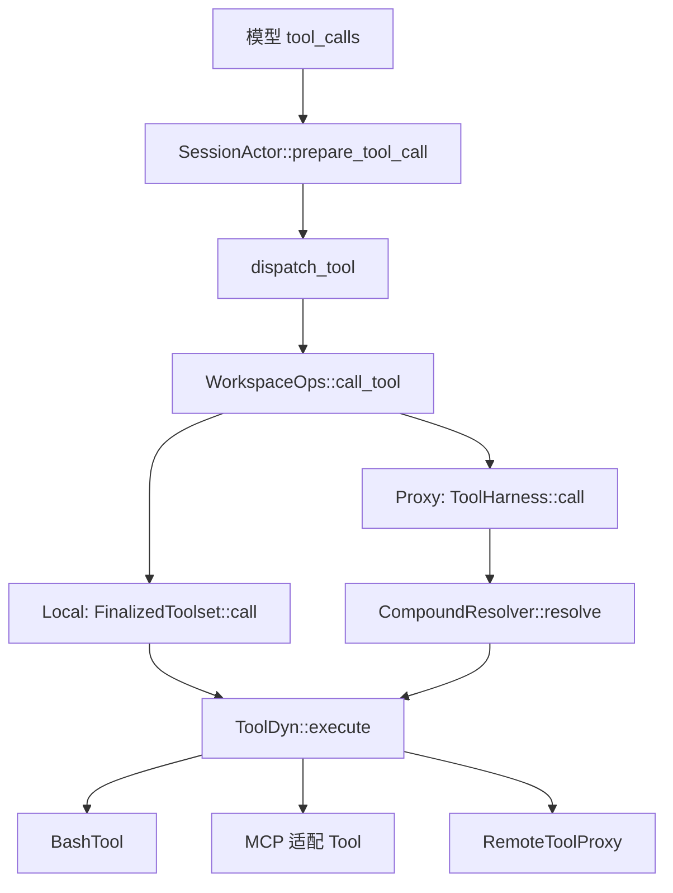
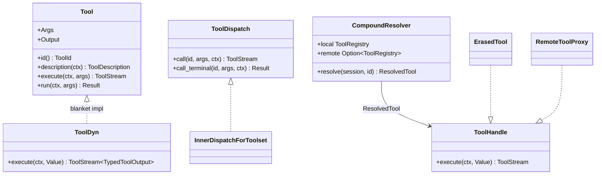
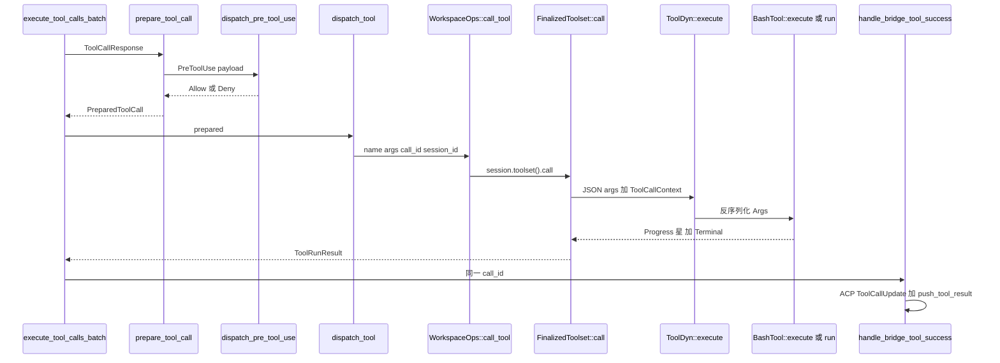
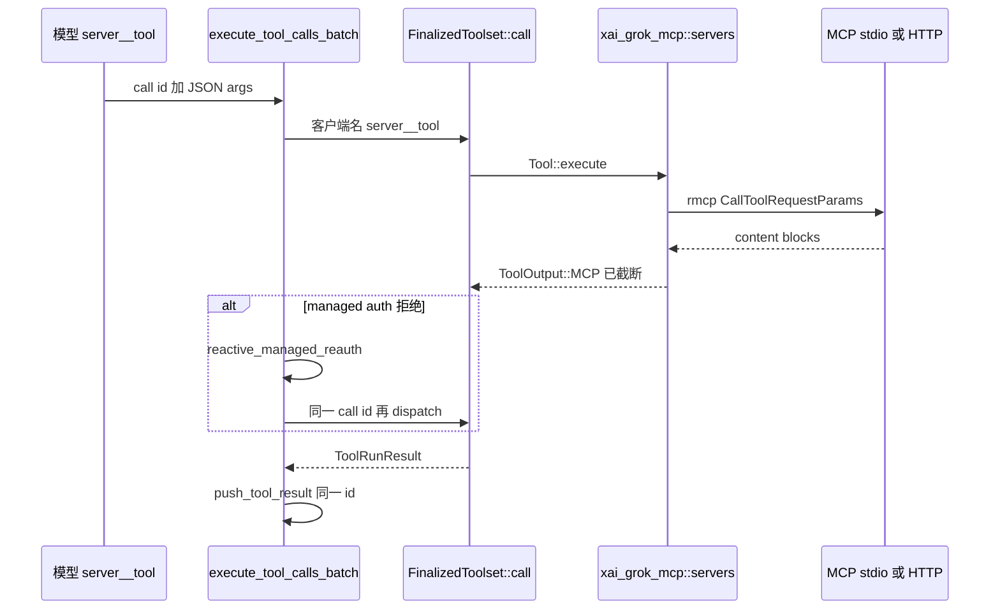

# 08 · 工具协议与扩展体系

> 读完本篇应能：实现一套与现系统兼容的工具运行时——同一 `Tool` trait 同时挂内置工具、MCP 和 Hub——并说清 Stream 不变量与 call id 闭合。上一篇：[07-Agent会话与模型循环.md](07-Agent会话与模型循环.md) · 下一篇：[09-Workspace权限沙箱与Git.md](09-Workspace权限沙箱与Git.md)

## 快速摘要

### 架构总览（模块与依赖）

工具子系统分三层端口，再加一条“产品装配”带：

```text
xai-tool-types      描述/参数 schema（模型能看见的形状）
xai-tool-protocol   线协议：id、Hello、JSON-RPC、capabilities
xai-tool-runtime    运行时：Tool trait、ToolStream、ToolDispatch、Context
        ▲
xai-grok-tools      内置实现 + ToolRegistry + ToolBridge
xai-grok-mcp        MCP 适配器（stdio / HTTP / OAuth）
xai-computer-hub-*  远程工具平面（CompoundResolver 本地优先）
xai-grok-hooks      文件/插件/客户端钩子
xai-grok-agent      AgentDefinition 选哪些工具、系统提示怎么写
```

内置、MCP、Hub 远程工具必须最终落到同一个 `Tool` / `ToolDyn` / `ToolDispatch` 表面，这样 Session 的 `execute_tool_calls_batch` 不用知道工具从哪来。

### 核心调用序列（逐步逻辑）

1. `AgentBuilder::build` 按 `AgentDefinition` + preset（`workspace_grok_build_toolset`）得到 `ToolServerConfig`。
2. `ToolRegistryBuilder::finalize` 产出 `FinalizedToolset`；`ToolBridge::finalize_builder` 包一层给 Session。
3. `WorkspaceOps::bind_local_session` 把 toolset 绑到 workspace session。
4. Turn 中 `prepare_tool_definitions_timed` 列出模型可见 schema（含 MCP 名 `server__tool`）。
5. 模型发出 tool call → `prepare_tool_call`（权限 + `PreToolUse` hook）→ `dispatch_tool`。
6. `dispatch_tool` → `WorkspaceOps::call_tool` → Local：`FinalizedToolset::call`；Proxy：Hub `ToolHarness::call`。
7. `FinalizedToolset::call` 把客户端名映射到 `ToolId`，构造 `ToolCallContext`，调 `ToolDyn::execute`，排空 `ToolStream` 直到恰好一个 `Terminal`。
8. `handle_bridge_tool_success` 用同一 call id 写 `ConversationItem::tool_result`，截断到 `DEFAULT_TOOL_OUTPUT_BYTES` / MCP cap。

### 易错点与边界条件

- `Tool::id()` 与模型看见的名字可以不同：`BashTool::id()` 是 `run_terminal_cmd`，grok_build preset 用 `with_name("run_terminal_command")`；`TaskTool` 对模型叫 `spawn_subagent`。
- Stream 不变量：任意多个 `Progress` + **恰好一个** `Terminal`。缺 Terminal 时 `ToolDispatch::call_terminal` 返回 `stream_no_terminal`。
- MCP 输出默认 20 KB（`MCP_MAX_OUTPUT_BYTES`），内置工具默认 40 KB；两者不是同一个旋钮。
- `CompoundResolver`：**本地同 id 永远盖住远程**。跨 session 查找返回 `None`。
- `PreToolUse` 可 deny（阻塞）；其它 hook 默认 fail-open。项目 hooks 受 folder trust 约束。

---

## 目录

1. [Why：必须共用一个 Tool trait](#1-why必须共用一个-tool-trait)
2. [三层 crate](#2-三层-crate)
3. [Tool::execute vs run 与 Stream 不变量](#3-toolexecute-vs-run-与-stream-不变量)
4. [ToolDispatch 与 CompoundResolver](#4-tooldispatch-与-compoundresolver)
5. [从 Session 到 Tool 的函数链](#5-从-session-到-tool-的函数链)
6. [grok_build 工具清单](#6-grok_build-工具清单)
7. [输出截断](#7-输出截断)
8. [MCP](#8-mcp)
9. [Computer Hub](#9-computer-hub)
10. [Hooks](#10-hooks)
11. [Plugins 与 marketplace](#11-plugins-与-marketplace)
12. [Skills 与 Workflow](#12-skills-与-workflow)
13. [关键调用关系表](#13-关键调用关系表)
14. [测试证据](#14-测试证据)
15. [重新实现检查清单](#15-重新实现检查清单)
16. [源码文件表](#16-源码文件表)
17. [自检](#17-自检)

---

## 1. Why：必须共用一个 Tool trait

Agent 循环只认识三件事：工具名、JSON 参数、call id。如果 bash 走 `std::process`、MCP 走另一套 client、Hub 再走第三套 RPC，会出现：

- 权限 / hook / 取消 / 截断各写一遍，语义漂移；
- `BuildConversationRequest` 无法用同一套 `ToolSpec` 列清单；
- 远程 workspace 无法代理本地工具（`WorkspaceOps::Proxy` 会断裂）。

因此 `xai-tool-runtime::Tool` 是唯一执行端口。MCP 适配器把 `CallTool` 结果编成 `ToolOutput::MCP`；Hub 把 JSON-RPC `tools/call` 编成 `ToolStream<TypedToolOutput>`；内置 grok_build 工具直接 `impl Tool`。Session 只调用 `WorkspaceOps::call_tool`。



---

## 2. 三层 crate

### 2.1 `xai-tool-types`：给模型看的形状

`crates/common/xai-tool-types/src/lib.rs`。稳定类型包括：

- `ToolDescription` / `ToolArgument` / `SchemaType`：listing schema。
- 任务族：`TaskToolInput`、`TaskOutputToolInput`、`WaitTasksToolInput`、`KillTaskToolInput`、`BUILTIN_SUBAGENTS`（explore / general-purpose / plan）、`MAX_SUBAGENT_DEPTH` 相关常量在 tools crate，但 **命名与 prompt 模板** 在 types 里，避免 shell 与 tools 各写一份。
- `parse_arguments_from_schema_lossy`、`deserialize_lenient_bool`：模型经常把 bool 写成字符串。

这一层 **没有** `async`、没有 HTTP、没有 FS。重实现时可以先抄类型。

### 2.2 `xai-tool-protocol`：线上的字节

`crates/common/xai-tool-protocol/src/lib.rs`。Computer Hub / workspace server 的 JSON-RPC 2.0 目录。

| 符号 | 职责 |
|---|---|
| `PROTOCOL_VERSION` | `"1.0.0"`（`handshake.rs`）；Hello / HelloAck 必须一致 |
| `ToolId` / `ToolCallId` / `SessionId` / `ServerId` | newtype；非法字符在构造时失败 |
| `ToolCapabilities` | `is_read_only`、`ToolScope`、`StreamingSpec`、frame caps |
| `Method` | `tools/call`、`tools/list`、`session.bind`、… |
| `ToolCallParams` / `ToolCallResult` / `ToolCallProgressFrame` | 一次调用的请求、进度、结果 |
| `ToolErrorWire` / `ToolOutputWire` / `McpBlock` | 跨进程错误与 MCP 风格 content |
| `HookEvent` / `turn_hook` | Hub 侧转发的 hook / after-turn |
| `WorkspaceUnavailableDetails` | workspace 进程消失时的专用 JSON-RPC 码 |

Session 的 `observability_bridge.emit(SessionEvent::ToolCallStarted { tool_call_id, ... })` 用的就是这里的 `session_event` 模块。协议 crate **禁止**依赖 grok_build 具体工具。

### 2.3 `xai-tool-runtime`：进程内执行

`crates/common/xai-tool-runtime/src/lib.rs` 再导出 `Tool`、`ToolDispatch`、`ToolCallContext`、`ToolSearchIndex`、`ToolNotification`。这是内置工具作者面对的表面。

---

## 3. `Tool::execute` vs `run` 与 Stream 不变量

`tool.rs` 写明：运行时 **永远** 调 `execute`。默认实现：

```text
execute(ctx, args) = terminal_only(run(ctx, args).await)
```

`run` 默认返回 `ToolError::not_implemented("Tool must implement either run or execute")`。只实现 `run` 的阻塞工具（`read_file`、`grep`、`todo_write`）自动变成单 item 流。需要 stdout 增量的工具（`BashTool`）覆盖 `execute`，用 `with_progress(progress_stream, terminal_future)`。

`ToolStream<T> = Pin<Box<dyn Stream<Item = ToolStreamItem<T>> + Send>>`。

| `ToolStreamItem` | 次数 |
|---|---|
| `Progress(ToolProgress)` | 0..N |
| `Terminal(Result<T, ToolError>)` | 恰好 1，且必须是最后一项 |

`ToolProgress`：`Text` / `Content { blocks }` / `Custom { subkind, payload }`。Bash 的 `bash_output_chunk` 走 Text/Custom，并受 `WorkspaceViewerContext.stream_tool_progress` 开关控制。

类型擦除：`ToolDyn::execute(ctx, Value)` 先 `serde_json::from_value` 成 `T::Args`，失败则 `terminal_only(Err(invalid_arguments))`。成功后再把 `T::Output` 序列化进 `TypedToolOutput { tool_id, value, model_output, chat_completion_output }`。`model_output` **不得为空**（MCP 合规）：若工具没 override，`extract_content_blocks(&value)` 至少产出一块 JSON 文本。

辅助构造：

- `terminal_only(result)` — 单 Terminal。
- `with_progress(progress, terminal)` — 先排空 progress，再 await terminal。progress 与 terminal 不要争同一上游。

`ToolFamily` / `ToolVariant`：同一 `ToolId` 多实现（例如 `read_file` 的 `legacy_0_4_10`）。Registry 启动时展开 `variants()`。



---

## 4. `ToolDispatch` 与 `CompoundResolver`

### 4.1 `ToolDispatch`

`dispatch.rs`。`Tool` 带关联类型，不是 object-safe。Dispatch 用 JSON：

- `call(tool_id, args, ctx) -> ToolStream<TypedToolOutput>`
- `call_terminal` 默认丢掉 Progress，遇到第一个 Terminal 返回；流结束仍无 Terminal → `ToolError::custom("stream_no_terminal", ...)`

`FinalizedToolset` 内部 `InnerDispatchForToolset` 实现该 trait：`toolset.call_raw(id, args, ctx)` 再包成 `TypedToolOutput::from_value`。

### 4.2 `CompoundResolver`

`xai-computer-hub-core/src/resolver.rs`。两个 `ToolRegistry` 平面：

| 构造 | 行为 |
|---|---|
| `local_only(local)` | 只查进程内 |
| `compound(local, remote)` | 先 local；miss 再 remote |

`resolve(session, tool_id) -> Option<ResolvedTool>`：

- `ResolvedTool::Local { tool, registration }`
- `ResolvedTool::Remote { proxy, registration }`

**本地同 id 永远覆盖远程。** 跨 session 返回 `None`（所有权对外不可见，调用方应映射为 `ToolError::NotFound`）。

`ToolHandle` 是 object-safe 投影：`id` / `description` / `capabilities` / `execute`。`ErasedTool::new` 包装 typed `Tool`；`RemoteToolProxy` 直接 impl，不经过 typed `Tool`。

`xai-computer-hub-sdk` 在此之上提供 `ToolServer` / `ToolHarness`、WebSocket 复用、`session.bind` 元数据（`WorkspaceBindMetadata`：preset、tools、yolo_mode、viewer_ctx）。

### 4.3 `ToolSearchIndex`

`xai-tool-runtime/src/search.rs`。`search_tool` 用 `Arc<dyn ToolSearchIndex>` 搜 MCP/内置工具。Session spawn 时把 `Bm25ToolSearchIndex` 塞进 ToolBridge resources（`spawn.rs`）。`is_ready=false` 表示 index 仍在预热，listing 可能不全。

---

## 5. 从 Session 到 Tool 的函数链

谁调用谁（函数级，对应 [07](07-Agent会话与模型循环.md) 第 7 节之后）：



`dispatch_tool`（`acp_session_impl/tool_dispatch.rs`）是一行转发，注释写死：Agent 会话永远 Local workspace ops。

`WorkspaceOps::call_tool`（`xai-grok-workspace/src/workspace_ops.rs`）：

- **Local**：必须有 `session_id`；`handle.session(id)` miss → `session_not_found`（先 `bind_local_session`）。然后 `session.toolset().call(name, args, call_id, None)`。
- **Proxy**：`client.harness().call(ToolId, args, ctx)`，`consume_stream_terminal`；传输致命错误会 `mark_disconnected`。

`FinalizedToolset::call` → `call_with_cancellation` → `call_streaming_with_cancellation`：解析客户端名、应用 `params_name_overrides` 反方向、插入 `ToolCallContext { call_id, extensions: Cwd, Cancellation, SessionContext, ... }`，再 `LocalRegistry` 上的 `ToolHandle::execute`。

`ToolBridge::call` 是给仍走 bridge 的路径用的薄封装，同样进 `registry.call`。Session 主路径已经改走 WorkspaceOps，避免再握 bridge 锁（bash 取消需要 lock-free 的 `terminal` 字段，所以 `ToolBridge` 把 `TerminalBackend` 存在 registry 锁外面）。

---

## 6. grok_build 工具清单

注册真相在 `xai-grok-agent/src/config.rs`：`default_grok_build_toolset` + `workspace_grok_build_toolset`。实现目录：`xai-grok-tools/src/implementations/grok_build/`。

`Tool::id()` 是稳定路由键；`ToolConfig::with_name` 是 **模型看见的名字**。下表「模型名」以 grok-build preset 为准。

### 6.1 默认 toolset（`default_grok_build_toolset`）

| 模型名 | `Tool::id()` / 类型 | 副作用 | 实现要点 |
|---|---|---|---|
| `run_terminal_command` | `run_terminal_cmd` / `BashTool` | 写（进程） | `execute` 流式 stdout；foreground 阻塞 / background 返回 `task_id`；`is_background` 参数改名为 `background` |
| `read_file` | `read_file` / `ReadFileTool` | 读 | `target_file`；PDF 分页；gitignore；legacy version 模块 |
| `search_replace` | `search_replace` / `SearchReplaceTool` | 写文件 | 经 `WorkspaceOps`/`FileSystem`；同路径在 batch 内加锁 |
| `list_dir` | `list_dir` / `ListDirTool` | 读 | 截断到 `DEFAULT_TOOL_OUTPUT_BYTES` |
| `grep` | `grep` / `GrepTool` | 读 | ripgrep；output mode content/count；默认 40 KB |
| `kill_command_or_subagent` | `KillTaskTool` | 写 | 杀后台 task / 子代理 |
| `todo_write` | `todo_write` / `TodoWriteTool` | 会话状态 | turn-end TodoGate 会读这份列表 |
| `get_command_or_subagent_output` | `TaskOutputTool` | 读/等 | wait 时可被插话打断 |
| `wait_commands_or_subagents` | `WaitTasksTool` | 等 | 整批 wait，一定 interruptible |
| `spawn_subagent` | `task` / `TaskTool` | 生成会话 | coordinator mailbox；`MAX_SUBAGENT_DEPTH` 默认 1 |
| `scheduler_create` / delete / list | `Scheduler*Tool` | 定时 | `/loop`；`LoopFireMode::Detached` vs `InSession` |
| `monitor` | `MonitorTool` | 读事件 | 完成时 `InjectNotification` |
| `search_tool` | `search_tool` / `SearchTool` | 读 index | BM25；调用后 Session 会 `retry_auth_required_servers` |
| `use_tool` | `use_tool` / `UseTool` | 调已搜到的 MCP | 延迟暴露 MCP schema，控制 prompt 体积 |
| `update_goal` | `UPDATE_GOAL_TOOL_NAME` / `UpdateGoalTool` | 目标状态 | 经 `goal_update_tx` |
| `workflow` | `WORKFLOW_TOOL_NAME` / `WorkflowTool` | 编排 | Rhai script；`agent_budget` 1..=1024，默认 128 |

### 6.2 workspace 完整集多出来的（`workspace_grok_build_toolset`）

| 模型名 | 类型 | 说明 |
|---|---|---|
| `write`（OpenCode） | `OpenCodeWriteTool` | 整文件写入；与 search_replace 并存 |
| `enter_plan_mode` | `EnterPlanModeTool` | 空参数；需用户批准；发 `PlanModeEntered`；种子 plan 文件 |
| `exit_plan_mode` | `ExitPlanModeTool` | Session **拦截** 做 client 审批（`should_intercept_exit_plan_approval`）；plan 文件 Unreadable 则 fail-closed |
| `ask_user_question` | `AskUserQuestionTool` | 受 `ask_user_question_enabled` / `--no-ask-user` 门控 |
| `web_search` | `WebSearchTool` | 也可走 backend hosted tool（`SamplingEvent::BackendToolCall*`） |
| `web_fetch` | `WebFetchTool` | SSRF 检查（`web_fetch/ssrf.rs`）；缓存；溢出截断 |
| `image_gen` / image-to-video / reference-to-video | `ImageGenTool` 等 | 需采样配置 |
| `memory_search` / `memory_get` | `memory::*` | 跨会话记忆 |
| `lsp` | `LspTool` | 代码导航；`code_nav_enabled` 为 false 时 `should_list` 应排除（推断：与 session 字段绑定，以 `should_list` 为准） |

其它：`GetTerminalCommandOutputTool`、`KillTerminalCommandTool` 出现在 `grok-computer` preset。`deploy_app` 目前是 stub。

### 6.3 Plan mode 与 Session 的分工

工具只发通知、种子文件；**只读强制与审批**在 `SessionActor::plan_mode`（`Arc<Mutex<PlanModeTracker>>`）。`exit_plan_mode` 在 `execute_tool_calls_batch` 里被 `split_exit_plan_tail` 排到批次末尾，避免计划文件还没写完就退出。

### 6.4 装配：谁 `register`

没有全局 `register_all()`。流程是：

1. `AgentDefinition` / `toolset_for_preset("grok-build")` → `ToolServerConfig { tools: Vec<ToolConfig> }`。
2. `ToolRegistryBuilder::register` / `register_with_params` 按 config 插入。
3. `finalize(config, SessionContext)` 检查 `ToolRequirement`（Terminal、Cwd、FileSystem…），失败 → `ToolError::invalid_arguments("Requirements unsatisfied")`。
4. `ToolBridge::finalize_builder` 抽出 `Terminal` 到 lock-free 字段。
5. `AgentBuilder::build` 把 bridge 放进 `Agent`；Session spawn 再 `bind_local_session`。

`register_tool_pack` 必须在 **第一次** `ToolRegistryBuilder::new()` 之前跑完（进程级 OnceLock）。

---

## 7. 输出截断

| 常量 | 值 | 作用域 |
|---|---|---|
| `xai_grok_tools::DEFAULT_TOOL_OUTPUT_BYTES` | `40_000` | 内置工具结果进模型的默认上限（约 10k tokens） |
| `DEFAULT_TOOL_OUTPUT_CHARS` | `20_000` | bash/terminal 字符上限 |
| `MCP_MAX_OUTPUT_BYTES` | `20_000` | MCP 内联进 chat state 的默认字节帽 |
| `ENV_GROK_MAX_MCP_OUTPUT_BYTES` / `ENV_MAX_MCP_OUTPUT_BYTES` | 环境覆盖 | 仅 MCP 路径 |
| `set_mcp_max_output_bytes` | 进程原子 | shell 在 bootstrap 把「requirements > env > config > remote > default」的决议写进去，供无 Config 的 dispatch 使用 |
| `TruncationCfg` resource | 每工具 / `mcp_max_output_bytes` | 会话级，可被 repo `[mcp]` 覆盖 |

`list_dir` / `grep` / `task_output` 都 `.unwrap_or(DEFAULT_TOOL_OUTPUT_BYTES)`。MCP 另走 `util/mcp_truncate.rs`：大 base64 附件不能整段进 chat state，否则 token 估计膨胀、过早 auto-compact。截断后的文本仍用 **原 call id** 闭合。

Bash 进度帧另有 `MAX_PROGRESS_DELTA_BYTES = 16 KiB`，防止单 tick 冲爆 UI；截断在 UTF-8 边界，余量下一 tick 继续（append 无损）。

---

## 8. MCP

`xai-grok-mcp` 故意隔离 `rmcp 2.1` + `reqwest 0.13`，避免污染 workspace 的 reqwest 0.12。

| 模块 | 职责 |
|---|---|
| `servers` | stdio（`TokioChildProcess`）与 Streamable HTTP；`CallToolRequestParams`；错误分类；managed-MCP refresh |
| `mcp_http_client` | 给 rmcp SSE 加 backoff（绕过 rmcp 零 backoff 重连环） |
| `credentials` | `$GROK_HOME/mcp_credentials.json` + rmcp `CredentialStore` |
| `oauth` / `oauth_config` | 浏览器 OAuth；跨进程去重；`config.toml` BYO |
| `liveness` | 子进程探活 |
| `wire` / `acp_transport` | 与 ACP 宿主交换 MCP 描述 |

Session 侧：

1. `spawn_session_actor` 合并 local + client + plugin + managed 配置进 `mcp_state`。
2. `MCP_INIT_STRATEGY`：非交互默认 `Blocking`，否则 `Progressive`。`wait_for_mcp_initialized` 在 `prepare_tool_definitions_timed` 里被等待（计 `mcp_wait_ms`）。
3. 工具名：`server__tool`（`MCP_TOOL_NAME_DELIMITER`）。`parse_mcp_tool_name` 供权限、PR 检测、遥测使用。
4. 执行：MCP 工具同样 `impl Tool`，经同一 `FinalizedToolset::call`。managed 前缀服务器若 auth 拒绝，`execute_tool_calls_batch` 调 `reactive_managed_reauth` 后 **同一 call id 再 dispatch 一次**。
5. 热更新：`SessionCommand::UpdateMcpServers` / `ToggleMcpServer` / `ToggleMcpTool`。Toggle 必须在 Actor 循环里 RMW，避免与后台 refresh TOCTOU。
6. 子代理：`SnapshotMcpPool` 继承活连接，不重新握手。
7. 模型外调用：`CallMcpTool` / `ReadMcpResource`（扩展 RPC，不进 agentic 循环）。

OAuth 失败、进程死、SSE 洪水（`tests/repro_sse_flood.rs`）都不得撕开 `Tool` 表面另写一套结果格式。



---

## 9. Computer Hub

当工具跑在 **另一个进程**（workspace server / 远程 computer）时：

```text
Session  WorkspaceOps::Proxy
    → xai-computer-hub-sdk::ToolHarness::call
    → JSON-RPC tools/call  (PROTOCOL_VERSION 1.0.0)
    → ToolServer 上的 CompoundResolver
    → Local ErasedTool 或再转发
```

`InnerDispatchForResolver`（`hub-core/src/inner.rs`）用 `Weak<CompoundResolver>` + `SessionId` 做一次调用。`session.bind` 带 `WorkspaceBindMetadata`（preset、tool 列表、yolo、viewer_ctx）。缺字段必须默认安全（yolo `None` = fail-closed）。

进度帧 `ToolCallProgressFrame` 对应 `ToolProgress`。Harness 侧 `consume_stream_terminal` 与 `call_terminal` 同一不变量。

Local 开发路径不强制 Hub：`CompoundResolver::local_only` + in-process `FinalizedToolset` 即可。重实现时先做 Local，Proxy 作为适配器后加。

---

## 10. Hooks

`xai-grok-hooks`：发现、匹配、执行。v0 范围写在 `lib.rs`：command-backed；`pre_tool_use` 可 deny；其它非阻塞；默认 fail-open。

发现：`~/.grok/hooks/`、`<git-root>/.grok/hooks/`、`.cursor/hooks.json` 兼容、插件贡献的 hooks。`SessionCommand::ReloadHooks` 在 folder-trust 授予后重新发现 **项目** hooks（插件 hooks 走 `ReloadPlugins`）。

`HookEventName` 由 `event.rs` 宏表生成（含 `session_start`、`pre_tool_use`、`post_tool_use`、`session_end`、`UserPromptSubmit`、subagent 别名等）。`traits()` 给出 gate / matcher / 是否转发 Hub。

Session 调用链：

| 时机 | 函数 | 阻塞？ |
|---|---|---|
| 用户消息入历史之后 | `dispatch_hook(UserPromptSubmit)`（`handle_prompt`） | 观察 |
| 每个 tool prepare | `acp_session/hooks.rs` 客户端 + 文件 `PreToolUse` | **是**：deny → `ToolLoop::HookDenied`，仍闭合 call id |
| 工具成功后 | `PostToolUse`（若 `hook_event_active`） | 否 |
| turn 结束 | `send_after_turn_event` / `StopFailure` | 否 |
| 会话退出 | `fire_session_end_hooks`（`run_loop.rs`） | 否 |

`dispatcher::dispatch_non_blocking` vs 阻塞 PreToolUse：`PreToolUseResult { decision, ... }`。payload 里 `toolInput` / `toolResult` 上限 `MAX_PAYLOAD_SIZE = 128 KiB`。

客户端 hooks（ACP 注册）与文件 hooks 分开：`SnapshotClientHooks` / `SetClientHooks`。子代理继承父连接上的同一 deny gate；Actor 死亡时 fail-open 到空 hooks 并 **warn**（丢掉 deny gate）。

---

## 11. Plugins 与 marketplace

### 11.1 运行时插件（`xai-grok-agent::plugins`）

插件是目录：`plugin.json` + skills + agents + MCP 配置 + hooks。搜索路径：`~/.grok/plugins/`、`.grok/plugins/`、`--plugin-dir` / `_meta.pluginDirs`。

| 模块 | 职责 |
|---|---|
| `manifest` | 解析 `plugin.json` |
| `discovery` | 扫盘；`PluginScope` / `PluginOrigin` |
| `trust` | 项目插件信任 |
| `registry` | `PluginRegistry` / `LoadedPlugin` |
| `hooks_adapter` | 插件 hooks → `HookRegistry` |
| `install_registry` | 已安装集合 |
| `marketplace`（agent 内） | 读 `.claude/settings.json` 的 `extraKnownMarketplaces`（兼容布局） |

Session：`ReloadPlugins { registry }` 热加载；`PluginsAction` / `PluginsList` 给 pager modal；`NotifyPluginUpdates` 通知。

### 11.2 市场 crate（`xai-grok-plugin-marketplace`）

浏览与安装，不执行工具。

- `OFFICIAL_SOURCE_GIT_URL` = `https://github.com/xai-org/plugin-marketplace.git`
- `is_official_source_url` 规范化 HTTPS/SSH/`www.`/`.git`
- `scan_marketplace` / `installer` / `install_resolve` 接到 `InstallRegistry`
- `load_require_sha`：企业环境可强制 commit SHA

安装后的执行路径仍是：插件 MCP → 同一 `Tool`；插件 skill → `SkillManager`；插件 hook → `HookRegistry`。

---

## 12. Skills 与 Workflow

### 12.1 Skills

发现编排在 `xai-grok-agent/src/prompt/skills.rs`（优先级：local / repo / workspace-user / user / bundled / config-path / plugin）。解析原语在 `xai-grok-tools::implementations::skills::discovery`。

`SkillsConfig`：额外 `paths`、`ignore` 前缀、`disabled` 名（仍出现在列表但不进 system prompt）、launcher 注入的 server/bundled 目录。

运行时状态在 tools 层 `SkillManager`（`ToolBridge::restore_announced_skill_names` 必须在 `seed_skill_discovery` **之前**，否则会把 resume 当成 BaselineChange）。

用户输入 `/skill-name`：`handle_prompt` → `slash_commands::resolve` → `SkillSlashRewrite::RewriteToRun`（非 Cursor 模板）。`SessionCommand::ReloadSkills` / `RefreshSkillBaseline` 扫盘并重新 advertise slash。

Skill 不是独立 `Tool`：它改写 prompt / 注入 reminder。真正副作用仍走 bash/read_file/…。

### 12.2 Workflow

`WorkflowTool`（`grok_build/workflow/mod.rs`）参数：`name` **或** `script` **或** `script_path` 恰好一个；`args` JSON；`agent_budget`。

Session：`workflow/store.rs` 持久化 runs；`WorkflowCompletionTurn` 在 run 结束后注入合成 prompt（`PromptOrigin::WorkflowCompleted`）。slash `/workflow` 可 `launch_named_workflow` 后直接 `ok_end_turn`，不采样。

子代理深度计数 `SubagentDepthCounter` 与 workflow 的 `agent()` / `parallel()` 共享预算：超预算在启动前拒绝，避免部分子代理已跑。

---

## 13. 关键调用关系表

| 调用方文件与符号 | 关系 | 被调用方文件与符号 | 触发与输入 | 返回与后续处理 | 错误、状态与副作用 |
|---|---|---|---|---|---|
| `AgentBuilder::build` | 装配 | `toolset_for_preset` → `ToolRegistryBuilder::finalize` | `AgentDefinition` + cwd | `Agent` 含 `ToolBridge` | requirements 失败 → `AgentBuildError` |
| `spawn_session_actor` | 绑定 | `WorkspaceOps::bind_local_session` | toolset + session_id | Local 可 `call_tool` | 未 bind → `session_not_found` |
| `prepare_tool_definitions_timed` | 列出 | `ToolBridge::tool_definitions` + MCP | ListToolsContext | `Vec<ToolSpec>` | `should_list==false` 的工具不出现 |
| `prepare_tool_call` | 调用 | `dispatch_hook` / client `PreToolUse` | 工具名+args | Allow 或 `HookDenied` | deny 仍 `push_tool_result` 原 id |
| `dispatch_tool` | 调用 | `WorkspaceOps::call_tool` | name、JSON、call_id、session_id | `ToolRunResult` | Proxy 断线 → `network_error` |
| `FinalizedToolset::call` | 调用 | `ToolDyn::execute` | 映射后的 `ToolId` + `ToolCallContext` | 排空 stream | 无 Terminal → `stream_no_terminal` |
| `Tool::execute` 默认 | 包装 | `Tool::run` | 同 ctx/args | `terminal_only` | 两者都不 override → `not_implemented` |
| `BashTool::execute` | 调用 | `TerminalBackend` | command、timeout、background | Progress chunks + BashOutput | 取消走 lock-free `kill_foreground_commands` |
| `TaskTool::run` | 调用 | `SubagentBackendResource` | `TaskToolInput` | 子会话 spawn | 超深度 / 超预算拒绝 |
| `SearchTool` | 调用 | `ToolSearchIndex::search` | 查询字符串 | hits + schema | index 未 ready 时 `is_ready=false` |
| `UseTool` | 调用 | 目标 MCP `ToolDyn::execute` | 搜到的名+args | MCP 结果 | 截断走 MCP cap |
| MCP `servers` | 适配 | `rmcp` `CallTool` | server + tool | `ToolOutput::MCP` | auth 拒绝可 reactive reauth |
| `CompoundResolver::resolve` | 选择 | Local `ToolRegistry` 然后 Remote | session + tool_id | `ResolvedTool` | 本地盖远程；跨 session `None` |
| `handle_bridge_tool_success` | 调用 | `ChatStateHandle::push_tool_result` | **同一** call_id + prompt_text | 下一轮采样 | 截断后的文本仍闭合 |
| `fire_session_end_hooks` | 调用 | `dispatcher::dispatch_non_blocking` | SessionEnd payload | 忽略失败 | fail-open |

---

## 14. 测试证据

| 位置 | 覆盖 |
|---|---|
| `xai-tool-runtime` `tool.rs` 文档测试契约 | execute 包装 run；两边都不实现则 NotImplemented |
| `xai-computer-hub-core/tests/compound_resolver.rs` | local_only、compound、本地盖远程、跨 session None |
| `xai-computer-hub-core/tests/tool_registry.rs` | bind / unbind / 解析 |
| `xai-computer-hub-core/tests/inner_dispatch.rs` | Weak resolver 调用 |
| `xai-grok-tools` 各 `grok_build/*/mod.rs` 模块测试 | grep 截断、bash background、read_file PDF |
| `xai-grok-tools/src/registry/types.rs` `grok_build_bridge` 测试辅助 | 真 toolset 装配 |
| `shell/.../parallel_dispatch_tests.rs` | 批次并行 + 同文件锁 |
| `shell/.../plan_mode_*_tests.rs` | enter/exit 拦截、审批 resume |
| `shell/.../web_search_e2e_tests.rs` | web_search |
| `xai-grok-mcp/tests/repro_sse_flood.rs` | HTTP 传输洪水 |
| `xai-grok-hooks/tests/integration.rs` | 发现 + dispatch |
| `xai-grok-plugin-marketplace/src/lib.rs` 单测 | official URL 规范化 |
| `shell/.../mcp_dispatcher_e2e_tests.rs` | MCP 进同一 dispatch |

覆盖缺口（推断）：Hub Proxy 断线后的完整 Session 恢复依赖手工/E2E；`deploy_app` stub 无生产路径。

---

## 15. 重新实现检查清单

必须保持的契约：

1. 内置 / MCP / Hub 远程全部 `impl Tool`（或 `ToolHandle`），Session 只认 `call_tool`。
2. Stream：`Progress*` + 恰好一个 `Terminal`。
3. `execute` 是唯一运行时入口；`run` 只是糖。
4. 每个模型 call id 恰好一个 tool result（deny/cancel/截断都算）。
5. `ToolId` 稳定；模型名允许 `with_name` 覆盖——文档和权限规则必须用 **客户端名**。
6. 默认输出帽：内置 40 KB，MCP 20 KB，可配置但截断不能丢 id。
7. `CompoundResolver` 本地优先。
8. `PreToolUse` 可硬拒绝；其它 hook fail-open。
9. 未 `bind_local_session` 禁止 `call_tool`。
10. Skill 改 prompt，不另开副作用通道。

可替换：BM25 vs 其它 `ToolSearchIndex`；Hub 用 gRPC 替换 JSON-RPC（只要 `PROTOCOL_VERSION` 与 Hello 对齐）；bash 用 PTY 或纯 pipe。

建议实现顺序：`Tool` + `terminal_only` + 内存 registry → `read_file`/`bash` → Session batch 闭合 id → MCP 一个 stdio server → hooks PreToolUse → Hub Proxy。

---

## 16. 源码文件表

| 路径 | 关键符号 |
|---|---|
| `crates/common/xai-tool-types/src/lib.rs` | `ToolDescription`、`TaskToolInput`、`BUILTIN_SUBAGENTS` |
| `crates/common/xai-tool-protocol/src/{lib,handshake,frames}.rs` | `PROTOCOL_VERSION`、`ToolCallParams`、`ToolId` |
| `crates/common/xai-tool-runtime/src/{tool,dispatch,context,search}.rs` | `Tool`、`ToolDyn`、`ToolDispatch`、`ToolCallContext`、`ToolSearchIndex` |
| `crates/codegen/xai-grok-tools/src/lib.rs` | `DEFAULT_TOOL_OUTPUT_BYTES`、MCP cap 再导出 |
| `crates/codegen/xai-grok-tools/src/bridge.rs` | `ToolBridge::call` / `finalize_builder` |
| `crates/codegen/xai-grok-tools/src/registry/types.rs` | `FinalizedToolset::call`、`InnerDispatchForToolset`、`register_tool_pack` |
| `crates/codegen/xai-grok-tools/src/implementations/grok_build/mod.rs` | 工具类型再导出 |
| `crates/codegen/xai-grok-tools/src/implementations/grok_build/{bash,read_file,search_replace,grep,list_dir,task,todo,web_search,web_fetch,workflow,lsp,enter_plan_mode,exit_plan_mode}/` | 各 `impl Tool` |
| `crates/codegen/xai-grok-tools/src/util/mcp_truncate.rs` | `MCP_MAX_OUTPUT_BYTES`、`set_mcp_max_output_bytes` |
| `crates/codegen/xai-grok-agent/src/config.rs` | `workspace_grok_build_toolset`、`with_name` 覆盖 |
| `crates/codegen/xai-grok-agent/src/builder.rs` | `AgentBuilder::build` |
| `crates/codegen/xai-grok-agent/src/plugins/` | `PluginRegistry`、发现与信任 |
| `crates/codegen/xai-grok-agent/src/prompt/skills.rs` | `SkillsConfig`、发现优先级 |
| `crates/codegen/xai-grok-shell/src/session/acp_session_impl/{tool_dispatch,tool_calls,hook_dispatch,mcp}.rs` | Session 侧调用 |
| `crates/codegen/xai-grok-workspace/src/workspace_ops.rs` | `WorkspaceOps::call_tool` |
| `crates/codegen/xai-grok-mcp/src/{lib,servers,oauth}.rs` | MCP 传输与鉴权 |
| `crates/common/xai-computer-hub-core/src/{lib,resolver,local,remote}.rs` | `CompoundResolver`、`ResolvedTool` |
| `crates/common/xai-computer-hub-sdk/src/lib.rs` | `ToolServer`、`ToolHarness` |
| `crates/codegen/xai-grok-hooks/src/{lib,dispatcher,event,discovery}.rs` | Hook 发现与 dispatch |
| `crates/codegen/xai-grok-plugin-marketplace/src/lib.rs` | 官方源、扫描、安装 |

---

## 17. 自检

1. 用自己的话区分 `xai-tool-types` / `protocol` / `runtime` 各自禁止依赖什么。
2. 指出 `BashTool::id()`、`with_name("run_terminal_command")`、测试里的 `"bash"` 三者如何对应（`ToolKind::Execute` + `TemplateRenderer`）。
3. 在 `tool.rs` 找到 Stream 不变量的类型别名和两个构造函数。
4. 从 `dispatch_tool` 跟到 `ToolDyn::execute`，数清经过几个 crate。
5. 说出内置 40 KB 与 MCP 20 KB 分别由哪个常量/函数生效。
6. 解释为什么 `CompoundResolver` 必须本地盖远程。
7. 若文档与源码冲突：以 `impl Tool for ...` 的 `fn id` 和 `config.rs` 的 `with_name` 为准。

阅读源码建议顺序：`xai-tool-runtime/src/tool.rs` → `dispatch.rs` → `config.rs` `default_grok_build_toolset` → `bridge.rs` → `workspace_ops.rs` `call_tool` → `grok_build/bash/mod.rs` `execute` → `xai-grok-mcp/src/lib.rs` → `compound_resolver.rs` 测试 → `hooks/src/dispatcher.rs`。

下一篇把 `WorkspaceOps` 背后的权限、沙箱与 Git 收口：[09-Workspace权限沙箱与Git.md](09-Workspace权限沙箱与Git.md)。
