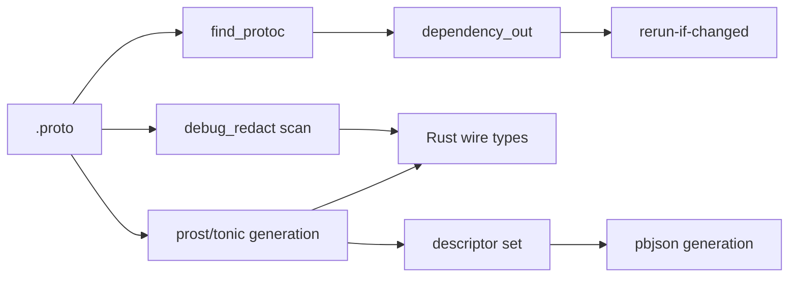
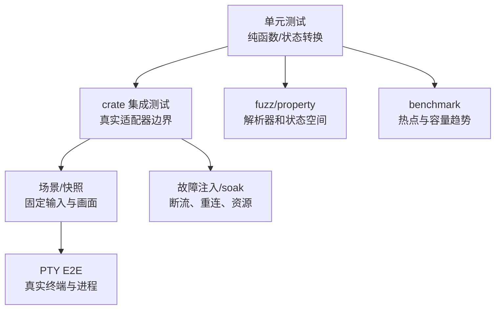
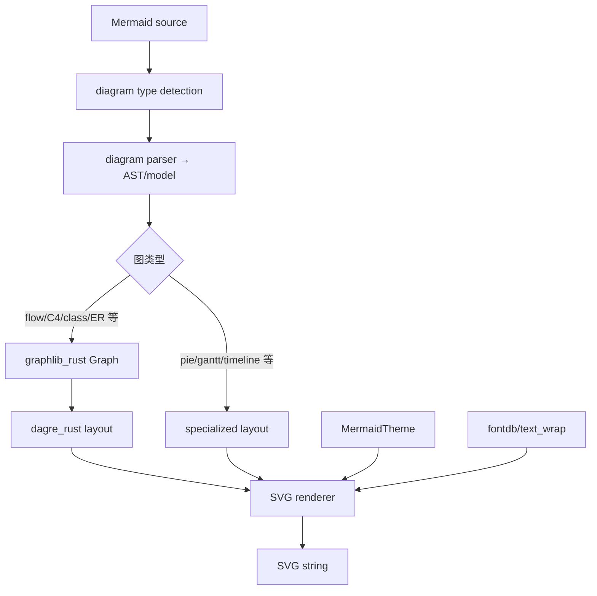

# 构建、测试、第三方源码与验收体系

## 1. 本章解决什么问题

前面的专题解释产品怎样运行，本章解释“工程怎样证明自己仍能运行”：

- Rust 工具链和 workspace 怎样固定；
- protobuf 代码怎样生成并保持兼容；
- 测试支持 crate 怎样模拟模型、ACP、leader、PTY 和故障；
- 单元、集成、场景、PTY E2E、benchmark 和 fuzz 各自证明什么；
- `third_party/` 中 Mermaid 渲染栈怎样工作；
- 从零重实现时怎样建立分阶段质量门。

## 2. 根构建基线

### 2.1 `rust-toolchain.toml`

工具链固定为 Rust `1.94.0`，并安装 `rustfmt`、`clippy`。Linux CI 目标至少包含：

```text
x86_64-unknown-linux-gnu
aarch64-unknown-linux-gnu
```

固定 point version 的目的不是追求最新，而是降低编译器/Clippy 变化带来的噪声，让回归更容易定位。升级后注释要求运行全 targets 的 check 和 clippy；日常开发仍应优先按 crate 验证。

### 2.2 `rustfmt.toml`

当前关键配置是 `use_field_init_shorthand = true`。格式配置看似很小，但它保证生成代码、人工代码和 CI 输出一致。重实现时应在第一阶段固定 rustfmt 版本与配置，避免后期产生全仓机械 diff。

### 2.3 `clippy.toml`

根 Clippy 配置不仅约束风格，还编码了真实安全规则：

| 禁止调用 | 原因 | 推荐边界 |
|---|---|---|
| `std::fs::canonicalize` | Windows 可能返回 `\\?\` verbatim 路径，破坏外部工具、Prompt 和路径等价键 | 使用 `dunce::canonicalize` 或项目路径 helper |
| `Path::canonicalize` | 同上 | 统一路径抽象 |
| `tokio::fs::canonicalize` | 同上，且异步调用点容易绕过统一 helper | blocking helper + `dunce` |
| `std::process::Command::spawn` | 未纳管 child 可能比 Session 活得更久 | `ProcessScope::enroll` |
| `tokio::process::Command::spawn` | 同上 | 统一 process manager |
| `SlavePty::spawn_command` | PTY child 也必须纳入任务树 | `enroll_terminal_pid` |

这说明 lint 是架构门禁：它防止开发者绕开 Workspace/ProcessScope 的生命周期和安全不变量。新实现也应把关键禁令放进可机器执行的 lint 或 wrapper，而不只写在文档里。

### 2.4 根 `Cargo.toml`

根清单是自动生成的 workspace 聚合：

- `resolver = "2"`；
- workspace edition 为 2024；
- 统一第三方依赖版本；
- 列出 80 余个 member；
- 使用 `[patch.crates-io]` 固定特定 fork/revision；
- 每个具体 crate 在自身 `Cargo.toml` 声明依赖和 feature。

README 明确要求优先修改 per-crate manifest。重实现时可先维护手写根清单；只有依赖规模和多构建系统确实需要时才生成它。

## 3. 构建产物与入口

主要用户产物来自 `xai-grok-pager-bin`，二进制 artifact 名为 `xai-grok-pager`，正式安装以 `grok` 暴露。常用最小命令：

```bash
cargo check -p xai-grok-pager-bin
cargo run -p xai-grok-pager-bin
cargo build -p xai-grok-pager-bin --release
```

构建还可能产生：

- protobuf/JSON 绑定；
- 测试 harness 二进制；
- PTY 控制 CLI；
- benchmark/fuzz target；
- 内嵌用户文档、模板、主题或模型元数据。

## 4. Protobuf 代码生成

### 4.1 crate 地图

`crates/build/xai-proto-build/`：

| 文件 | 作用 |
|---|---|
| `src/lib.rs` | `XaiProtoBuilder`、tonic/prost/pbjson 组合 |
| `src/find_protoc.rs` | 查找固定 `protoc`、环境和 fallback |
| `src/debug_redact.rs` | 读取 proto `debug_redact` 标记并生成脱敏 Debug |
| `test_data/*.proto` | 验证脱敏生成行为 |

### 4.2 `XaiProtoBuilder`

它包裹 `tonic_prost_build::Builder`，额外提供：

- `btree_map`、`bytes`、`extern_path`；
- descriptor set 输出；
- pbjson 生成；
- JSON 忽略未知字段选项；
- 保留 proto snake_case 字段名；
- 自定义 type/field attribute；
- `debug_redact` 强制检查；
- 精确 `cargo:rerun-if-changed` 依赖。

### 4.3 为什么自己计算 proto 依赖

源码注释指出默认 tonic-build 的 rerun 计算过宽且路径假设不正确。实现对每个输入 proto 调用：

```text
protoc --dependency_out=/dev/stdout --descriptor_set_out=/dev/null
```

解析真实 import 依赖后输出精确 `cargo:rerun-if-changed`。系统 well-known types 的绝对安装路径被过滤，减少构建环境差异。

### 4.4 路径与可复现性

- 输入 proto 不允许绝对路径；
- Bazel sandbox 下从 `protoc` 的 `../include` 查 well-known types；
- 使用固定 `bin/protoc`/DotSlash 或显式 `PROTOC`；
- 生成 pbjson 时通过 descriptor set 保持 proto/JSON 一致；
- 标记了 `debug_redact` 却未启用生成支持时直接构建失败。

最后一条是重要的安全门：敏感字段不能因为开发者忘记 builder 选项而进入 `Debug`。



## 5. 测试支持基础设施

### 5.1 `xai-grok-test-support`

该 crate 面向 Grok 产品链的高层测试，`src/lib.rs` 导出：

| 模块/类型 | 能力 |
|---|---|
| `MockInferenceServer` | 模拟 chat completions/responses、记录请求、脚本化 SSE |
| `GrokStdioClient` | 以子进程方式驱动 `grok agent stdio` |
| `RawStdioClient` | 发送 typed client 无法构造的原始 ACP wire 数据 |
| `leader::LeaderStdioClient` / `LeaderFixture` | 驱动 leader stdio/IPC 路径 |
| `TestSandbox` | 隔离目录、环境、可选 Git 和诊断 |
| `TestProcess` | child 生命周期、进程树清理和有界输出尾部 |
| `run_headless*` | 运行 `grok -p` 并捕获 stdout/stderr/退出结果 |
| `counting_server` | 统计连接，验证连接池和 wire 行为 |
| `uds_proxy` | 面向 leader Unix socket 的 frame-aware 故障注入 |
| `ResourceSnapshot` | RSS、线程、fd 的 soak 采样 |
| `sse` / `scripted` | 构造模型流事件与脚本行为 |

`scaled(Duration)` 读取 `GROK_TEST_TIMEOUT_SCALE`，让共享 CI runner 可以成比例放大 harness timeout。它只应调整测试容忍时间，不能掩盖生产代码的无界等待。

### 5.2 `xai-test-utils`

更底层、可复用的测试工具包括：

- 环境变量 guard；
- hermetic Git repo/helper；
- trace capture；
- 图片辅助；
- Bazel runfiles 与 Cargo manifest 路径兼容；
- crate root 定位。

这两个 crate 的区分是合理的：前者知道 Grok 二进制、ACP 和模型协议，后者只提供通用测试原语。

### 5.3 测试进程必须比普通进程更严格

测试若泄漏 child、fd 或环境变量，会导致后续用例随机失败。因此 harness 应：

- 记录 child/process tree；
- timeout 后先抓取有限诊断再终止；
- Drop 兜底清理；
- 环境修改通过 guard 恢复；
- tempdir 生命周期覆盖 child；
- stdout/stderr 持续排空，避免 pipe backpressure 死锁。

## 6. 同步协议类型：`cli-chat-proxy-types`

`prod/mc/cli-chat-proxy-types/src/` 包含：

```text
client_metrics_types.rs
deployment_config_types.rs
feedback_types.rs
metadata_types.rs
sandbox_types.rs
serde_helpers.rs
session_types.rs
storage_types.rs
subagent_bundle.rs
team_managed_config_types.rs
```

这些类型用于 CLI 与服务端/代理之间的 wire compatibility，覆盖部署配置、团队 managed config、会话、反馈、存储、客户端指标、沙箱和 subagent bundle。

阅读规则：

1. serde rename/default/tag 是协议，不是风格细节；
2. 新字段优先可选或有安全默认；
3. 删除/改名 enum variant 需要版本迁移；
4. 服务端下发的 managed policy 必须经过签名/身份/版本验证后再转换成运行时配置；
5. wire DTO 与领域对象分离，避免远端兼容字段渗透全部代码。

## 7. 测试分层



### 7.1 单元测试

适合：

- enum 状态转换；
- 配置合并与策略；
- serde/wire round-trip；
- 路径规范化；
- Markdown/parser；
- retry/circuit-breaker；
- reducer 和布局纯函数。

单元测试快，但不能证明真实 terminal、child、socket 和文件系统行为。

### 7.2 Crate 集成测试

统计中具有显式 `tests/` 的重点 crate 包括：

| crate | 约测试文件数 | 主要边界 |
|---|---:|---|
| `xai-grok-shell` | 56 | headless/stdio/leader、Session、取消、持久化 |
| `xai-grok-pager` | 80 | 应用行为、组件和终端集成 |
| `xai-grok-update` | 11 | 下载、校验、切换和并发 |
| `xai-tool-runtime` | 9 | object safety、streaming、错误和上下文 |
| `xai-computer-hub-core` | 8 | resolver、transport、remote proxy、错误 |
| `xai-grok-telemetry` | 8 | 导出、脱敏、兼容和失败隔离 |
| `xai-grok-sampler` | 6 | 模型 wire、重试、流终止 |
| `xai-grok-extra-ca` | 4 | 证书来源和错误 |
| `xai-tool-protocol` | 4 | ID、envelope、serde、握手 |

文件数不是用例数；许多模块内单测未计入显式 `tests/`。

### 7.3 TUI 场景测试

`xai-grok-pager/tests/scenarios/` 约 45 个 YAML 场景，覆盖：

- welcome、help、settings、release notes；
- slash dropdown、command palette、mode switch；
- prompt queue、plan、goal、feedback；
- paste/image/drag/drop；
- Markdown、table、Mermaid、HTML entity；
- resize、小屏幕、scrollbar、selection；
- undo/rewind 提示和会话状态。

场景文件是声明式行为输入，harness 将其变成事件序列和快照。它适合检查“在固定终端尺寸下用户看到什么”，但仍不等于真实 PTY 的时序。

### 7.4 PTY E2E

`xai-grok-pager/tests/pty_e2e/` 约 186 个 Rust 文件，是全仓最密集的用户行为证据。代表性类别：

| 类别 | 验证内容 |
|---|---|
| 终端恢复 | raw mode、bracketed paste、alternate/inline screen、退出无残留 |
| 输入 | Enter、Esc、Ctrl-C、IME、paste、file completion |
| 流式内容 | reasoning/output 区分、cancel/retry、scroll follow |
| Scrollback | resize 保持位置、drag select、复制、sticky header |
| Prompt queue | 排队、重排、send-now、自动唤醒和取消 |
| Tool UI | 折叠、路径选择、bash 输出、权限提示 |
| Session | continue/new/rewind、历史重印、模式保持 |
| 配置/扩展 | model、MCP、folder trust、subscription gate |
| 平台兼容 | Apple Terminal、iTerm、Chrome drag、macOS clipboard |

PTY E2E 速度慢且容易受时序影响，因此等待应基于可观察条件，而不是大量固定 sleep；失败输出需包含屏幕快照、进程状态和日志尾部。

### 7.5 Fuzz

统计中 `xai-grok-markdown/fuzz` 约 12 个目标。解析器面对不可信模型输出，fuzz 的目标不是检查漂亮画面，而是保证：

- 任意字节/Unicode 不 panic；
- 嵌套标记不会指数爆炸；
- 流式 chunk 边界不破坏状态；
- 资源使用有上限；
- 错误输入得到确定错误或安全降级。

同类 fuzz 应扩展到 SSE、JSON-RPC frame、配置、JSONL 尾部、路径和 apply-patch parser。

### 7.6 Benchmark

显式 benchmark 分布在 Pager、Pager PTY harness、Shell、Markdown、fsnotify、ratatui-inline 等 crate。重点不是单次绝对数字，而是趋势：

- 大 transcript render；
- resize/reflow；
- Markdown 增量解析；
- 事件风暴合并；
- history/queue 规模增长；
- PTY screen 解析和快照。

## 8. 测试如何映射架构不变量

| 不变量 | 首选测试 |
|---|---|
| Session 单写者和队列顺序 | Actor 单测 + Shell 集成 |
| 模型流只有一个 terminal result | Sampler scripted SSE + fault injection |
| ToolCall/ToolResult 闭合 | ChatState/Session 多工具测试 |
| 取消不污染下一 Prompt | Shell 集成 + PTY E2E |
| 文件冲突不静默覆盖 | Workspace tempdir 并发测试 |
| child 被回收 | ProcessScope 单测 + PTY E2E + fd soak |
| 权限 fail closed | policy 表驱动 + sandbox 平台集成 |
| JSONL 截断可恢复 | property/fault test |
| TUI 退出恢复终端 | PTY E2E |
| 迟到异步结果不覆盖新状态 | reducer generation 单测 + E2E |
| secret 不进入日志 | redaction 单测 + trace capture |
| 辅助依赖不阻断主链 | telemetry/update failure integration |

## 9. Vendored Mermaid 栈总览



### 9.1 `mermaid-to-svg`

生产模块约 35 个，按图类型拆分：

```text
flowchart / parser / ast
sequence_diagram
class_diagram
state_diagram
er_diagram
c4_diagram
gantt_diagram
journey_diagram
pie_diagram
timeline_diagram
gitgraph_diagram
mindmap_diagram
kanban_diagram
quadrant_diagram
radar_diagram
requirement_diagram
sankey_diagram
xychart_diagram
packet_diagram
block_diagram
```

公共层包括 `config.rs`、`theme.rs`、`text_wrap.rs`、`layout.rs`、`svg_renderer.rs`、`error.rs`。`lib.rs` 暴露 diagram 检测和渲染入口，并含大量兼容性测试。

`mermaid_port/` 是 flowchart 兼容移植层，包含 `flow_parser`、`flow_db`、`flow_data`、cluster 调整和 Dagre 适配。阅读时先从公共入口按 diagram type 分发，再下钻单一解析器，不要从所有图类型横向逐文件读。

### 9.2 文本与国际化

源码测试专门验证 CJK 显示宽度：宽字符按接近两个单位参与节点尺寸计算。终端和 SVG 都不能简单使用 `str.len()`；后者是 UTF-8 byte 数，不是字符数，也不是显示宽度。

### 9.3 `dagre_rust`

约 24 个 Rust 文件，是分层有向图布局端口。核心数据：

- `GraphNode`：位置、尺寸、rank/order、parent、dummy、border；
- `GraphEdge`：minlen、weight、label、points、reversed；
- `GraphConfig`：node/rank/edge spacing、方向、ranker、acyclicer。

典型布局流水线：


重要目录：

- `layout/rank/`：可行树、network simplex；
- `layout/order/`：barycenter、冲突解析、cross count；
- `layout/position/`：Brandes-Köpf 坐标；
- `layout/normalize/`：长边 dummy chain；
- `acyclic.rs`：临时反转边以获得 DAG；
- `parent_dummy_chains.rs`、`nesting_graph.rs`：compound graph。

### 9.4 `graphlib_rust`

提供 Graph、node/edge label、parent/children、predecessor/successor，以及 DFS/preorder/postorder。Dagre 依赖它表达多重边、compound node 和遍历。

### 9.5 `ordered_hashmap`

用 `Vec<K>` 保持插入顺序，用 `HashMap<K,V>` 提供查找。布局和 SVG 输出需要稳定遍历顺序，否则同一图可能产生不同节点/属性顺序，破坏快照与缓存。

`values_mut`/`iter_mut` 为同时遍历 key vec 并可变访问 map 使用内部裸指针。它依赖的不变量是遍历期间 keys 和 map 的结构不发生改变；维护时应特别谨慎。重实现可优先选择成熟的 `indexmap`，除非兼容性要求保留该实现。

## 10. 第三方许可证与修改边界

- 第一方工程主体使用 Apache-2.0；
- vendored crate 保留各自原许可证；
- 根 `THIRD-PARTY-NOTICES` 汇总依赖和移植来源；
- `third_party/NOTICE` 是 vendored Mermaid 栈索引；
- `xai-grok-tools/THIRD_PARTY_NOTICES.md` 记录 Codex/OpenCode 等移植实现。

修改 vendored 代码时：

1. 保留原许可证头和 NOTICE；
2. 记录相对上游的修改；
3. 不把第一方专有逻辑悄悄混入难以升级的移植层；
4. 升级时用行为测试比较输出，而不只看编译通过；
5. 检查新依赖许可证和制品分发义务。

## 11. 从零重实现的测试建设顺序

### 阶段 1：基础门禁

- 固定 Rust/rustfmt/Clippy；
- per-crate check/test；
- 禁止裸 process spawn、路径 canonicalize 和 secret Debug；
- CI 缓存不改变正确性。

### 阶段 2：协议与纯类型

- ID newtype；
- serde round-trip；
- 错误分类；
- config/policy 表驱动；
- unknown/legacy 字段。

### 阶段 3：Actor 与模型 fake

- 内存 Session/ChatState；
- scripted model stream；
- terminal event 不变量；
- queue/cancel/retry；
- property test 不完整 tool calls。

### 阶段 4：工具与 Workspace

- tempdir FS；
- version/hash 冲突；
- command output/cancel/reap；
- permission/sandbox fail closed；
- external result unknown 对账。

### 阶段 5：持久化

- JSONL append/ack；
- 每个尾部截断位置；
- duplicate record；
- schema upgrade；
- rewind/compaction 一致性。

### 阶段 6：TUI

- reducer 单元测试；
- 固定尺寸 snapshot；
- declarative scenarios；
- PTY clean exit、resize、paste、cancel；
- stale task result generation。

### 阶段 7：跨进程协议

- ACP raw/typed client；
- stdio frame 污染；
- EOF/half-close；
- leader UDS fault proxy；
- reconnect/replay 去重。

### 阶段 8：扩展与丰富内容

- MCP fake servers；
- Hook/Plugin trust；
- subagent task tree；
- Markdown/Mermaid fuzz；
- image/PDF 资源上限。

### 阶段 9：稳定性与发布

- RSS/thread/fd soak；
- telemetry failure isolation；
- update 原子切换和回滚；
- macOS/Linux 平台矩阵；
- 产物 NOTICE/许可证检查。

## 12. 每次改动怎样选择测试

| 改动 | 最低测试 |
|---|---|
| 类型/serde | 单测 + round-trip + legacy fixture |
| Session 状态 | Actor test + cancel/close |
| 模型 parser | scripted stream + arbitrary chunk + malformed input |
| 工具 schema | schema/serde 一致 + unknown/invalid args |
| 文件写 | tempdir + conflict + result unknown |
| process/PTY | integration + cancellation + reap |
| TUI reducer | pure unit + snapshot |
| 终端控制 | PTY E2E |
| 配置/权限 | precedence matrix + fail closed |
| 持久化 | crash/truncate/replay |
| 第三方 parser/layout | golden + fuzz + representative compatibility |

## 13. 当前源码阅读的验证边界

本套文档通过读取生产源码、Cargo 清单和测试源码提炼行为，没有在本次文档任务中运行全工程测试。原因是全 workspace 构建开销大，且用户目标是建立源码阅读与重实现文档。真正修改代码时，应按对应专题和本章矩阵选择最小 crate 测试，再逐步升级到集成/PTY 门禁。

## 14. 完整重实现的最终质量门

一个接近原工程能力的重实现至少应通过：

1. 所有公共 wire/schema 兼容测试；
2. Session queue、cancel、retry、tool closure 状态测试；
3. 模型流 arbitrary chunk、断流和 terminal event 测试；
4. 文件并发、路径逃逸、沙箱失败和 child reap 测试；
5. 会话截断、重复、升级、rewind 和 compaction 恢复测试；
6. TUI 场景快照与关键 PTY E2E；
7. ACP stdio/leader 的 EOF、重连和故障代理测试；
8. MCP/Hook/Plugin/Subagent 权限收敛测试；
9. Markdown/Mermaid/parser fuzz 与大输入资源限制；
10. macOS/Linux 构建、NOTICE、更新回滚和资源 soak。

