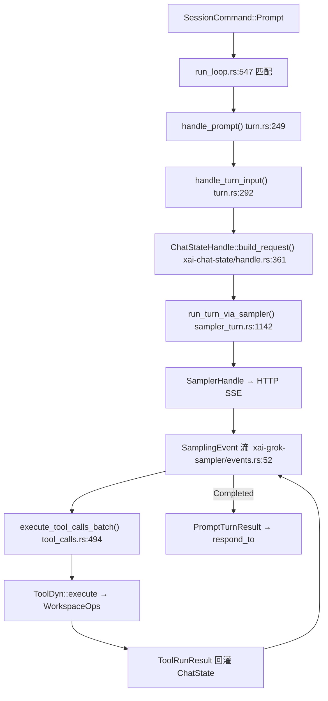

[上一篇：TUI交互循环与渲染](08-TUI交互循环与渲染.md) · [总目录](README.md) · [下一篇：工具协议与扩展体系](10-工具协议与扩展体系.md)

# Agent 会话与模型循环：Session Actor 回合循环

> **场景**：用户按回车后，一条 `SessionCommand::Prompt` 怎样走完「入队 → 建请求 → 采样 → 工具调用闭合 → 完成」的完整回合。本文把 Session Actor 的回合循环写成可实现的伪代码与真实函数链。
> **时间**：采样于 2026-08-25（CST），工作区 `HEAD = 940ce403`。
> **工具版本**：Rust `1.94.0`；会话 `xai-grok-shell`、对话状态 `xai-chat-state`、采样 `xai-grok-sampler`。

> **阅读说明**：本文讲**调用关系与数据流**，不把行号当稳定 API。行号来自当前工作区快照；若本地已有后续修改，**以当前源码为准**。核心不变量：会话是**单写者**（Session Actor），历史/工具结果/压缩不竞态（README 不变量 1、2）。

---

### 本文件内容

1. [Why：会话必须是单写者](#1-why会话必须是单写者)
2. [核心对象：Handle / Actor / Command / LiveState](#2-核心对象handle--actor--command--livestate)
3. [一次 Prompt 的回合循环（调用链）](#3-一次-prompt-的回合循环调用链)
4. [SamplingEvent → ACP notification 的翻译](#4-samplingevent--acp-notification-的翻译)
5. [工具批次：execute_tool_calls_batch 与 call id 闭合](#5-工具批次execute_tool_calls_batch-与-call-id-闭合)
6. [压缩：xai-grok-compaction 与 CompactionMode](#6-压缩xai-grok-compaction-与-compactionmode)
7. [插话：xai-interjection-core 与 PromptOrigin](#7-插话xai-interjection-core-与-promptorigin)
8. [Subagent：xai-grok-subagent-resolution 与 Task 工具](#8-subagentxai-grok-subagent-resolution-与-task-工具)
9. [取消：session/cancel 与 CancellationToken](#9-取消sessioncancel-与-cancellationtoken)
10. [PromptTurnResult / PromptCompletionKind](#10-promptturnresult--promptcompletionkind)
11. [重实现最小对象集](#11-重实现最小对象集)

其余阶段见[总目录](README.md)。

---

## 1. Why：会话必须是单写者

如果并发改历史、工具结果、压缩，三者会互相覆盖。所以每个会话有且仅有一个**Session Actor** 单写者，所有外部输入（`SessionCommand`）都经它的 channel 串行化；UI、leader、子 agent 只持有 `SessionHandle`（调用端口），不直接碰 `ChatState`。

---

## 2. 核心对象：Handle / Actor / Command / LiveState

| 类型 | 位置（`file:line`） | 角色 |
|---|---|---|
| `SessionHandle` | `xai-grok-shell/src/session/handle.rs:47` | 调用端口（clone 到处传），内部是 `mpsc` tx + 状态快照 |
| `spawn_session_actor` | `xai-grok-shell/src/session/acp_session_impl/spawn.rs:188` | 起 Actor 主循环、`JoinSet` 与状态机 |
| `SessionCommand` | `xai-grok-shell/src/session/commands.rs:249` | Actor 收的消息（`Prompt`/`Cancel`/`Load`/…） |
| `SessionLiveState` | `xai-grok-shell/src/session/handle.rs:23` | 生命周期状态机（Working/IdleResident/Dormant/Completed/DeadFailed/Attaching…） |
| `PromptTurnResult` | `xai-grok-shell/src/session/commands.rs` | 一次 turn 的结果（带 `PromptCompletionKind`） |
| `PromptCompletionKind` | `xai-grok-shell/src/session/commands.rs:38` | 完成语义枚举（见 §10） |

> `SessionCommand::Prompt` 字段极多（`run_loop.rs:547`）：`prompt_id`、`prompt_blocks`、`prompt_mode`、`verbatim`、`send_now`、`json_schema`、`respond_to: oneshot::Sender<PromptTurnResult>`（把结果回给调用方）、`parsed_prompt_tx` 等——这是「提交屏障」的回执通道。

---

## 3. 一次 Prompt 的回合循环（调用链）



| 序号 | 动作 | 内部调用链（`file:line`） | 说明 |
|---|---|---|---|
| 1 | 入队/分发 | `SessionCommand::Prompt` → `run_loop.rs:547` | prompt 先入 prompt 队列（`prompt_queue.rs`），串行化 |
| 2 | 处理输入 | `handle_prompt`（`turn.rs:249`）→ `handle_turn_input`（`turn.rs:292`） | 解析、记遥测、决定 authority |
| 3 | 建请求 | `ChatStateHandle::build_request()` — `xai-chat-state/src/handle.rs:361` | 拼 `ConversationRequest`（含 system、memory 注入、工具定义、图片预算） |
| 4 | 跑采样 | `run_turn_via_sampler(request, &mut budget)` — `sampler_turn.rs:1142` | 经 `SamplerHandle` 发 HTTP SSE |
| 5 | 流事件 | `SamplingEvent` — `xai-grok-sampler/src/events.rs:52` | token / tool_call_delta / Completed |
| 6 | 工具批 | `execute_tool_calls_batch(body, ...)` — `tool_calls.rs:494` | 闭合工具调用（见 §5） |
| 7 | 完成 | `PromptTurnResult` → `respond_to` oneshot | `respond_to` 是提交屏障回执（`run_loop.rs:547`） |

---

### 3.1 逐函数骨架（真实函数体精读）

把 §3 的调用链落到「真实函数签名 + 关键分支」，逐函数拆解。所有行号来自当前快照。

#### 3.1.1 `handle_prompt`（turn.rs:249）

入口极薄——只把散装参数收进 `TurnInputRequest`，**全部委派**给 `handle_turn_input`：

```rust
// xai-grok-shell/src/session/acp_session_impl/turn.rs:249
pub(super) async fn handle_prompt(
    self: &Arc<Self>,
    prompt_id: &str,
    prompt_blocks: Vec<acp::ContentBlock>,
    prompt_mode: PromptMode,
    verbatim: bool, send_now: bool,
    json_schema: Option<serde_json::Value>,
    persist_ack: Option<oneshot::Sender<()>>,
    parsed_prompt_tx: Option<oneshot::Sender<ParsedPromptInfo>>,
    /* … 其余 6 个参数 … */
) -> PromptTurnResult {
    self.handle_turn_input(TurnInputRequest {        // :264 → 委派
        prompt_id: prompt_id.to_string(),
        input_origin: InputOrigin::from_prompt_id(prompt_id),   // :266 由 prompt_id 反推来源
        prompt_blocks, prompt_mode, verbatim, send_now,
        json_schema, persist_ack, parsed_prompt_tx,
        /* … */
    }).await
}
```

> 注意 `self: &Arc<Self>`：两个函数都要求 `Arc<SessionActor>`，因为回合内要把 `self` 克隆进多个并发 task（工具执行、采样）。`input_origin.policy()` 决定本次输入的 authority（human vs model-controlled），是整个回合权限判断的起点。

#### 3.1.2 `handle_turn_input`（turn.rs:292）

真正干活的函数。骨架（节选关键分支）：

```rust
// xai-grok-shell/src/session/acp_session_impl/turn.rs:292
pub(super) async fn handle_turn_input(
    self: &Arc<Self>, request: TurnInputRequest,
) -> PromptTurnResult {
    let TurnInputRequest { prompt_id, input_origin, prompt_blocks,
        prompt_mode, verbatim, send_now, json_schema, .. } = request;
    let prompt_id = prompt_id.as_str();
    // 1) 记遥测（turn 活跃计数、prompt 长度）
    let policy = input_origin.policy();                       // :331 来源策略
    if let Some(completion_id) = input_origin.completion_id() {
        self.mark_completions_reported(&[completion_id]).await;  // :333 回收 subagent 预约
    }
    if policy.authority.is_human_intent() {                   // :338 人类意图？
        // … 走「human prompt」分支：解析 slash、构造 user message …
    } else {
        // … 走「model-controlled」（如 follow-up 建议）分支 —— 必须 verbatim 透传 …
    }
    // 2) 后续：build_request → run_turn_via_sampler → 工具闭合 → 提交屏障
}
```

关键分支：`policy.authority.is_human_intent()`（`:338`）区分**人类直接输入**与**模型控制的 follow-up 建议**——前者要解析 slash 命令、可被取消；后者必须 `verbatim` 透传，绝不能把 `/quit` 建议 chip 当命令执行（见 `08` §8）。这就是 §7 插话 authority 的落地点。

#### 3.1.3 `run_turn_via_sampler`（sampler_turn.rs:1142）

带**限流重试**的采样入口。骨架：

```rust
// xai-grok-shell/src/session/acp_session_impl/sampler_turn.rs:1142
pub(crate) async fn run_turn_via_sampler(
    self: &Arc<Self>,
    request: ConversationRequest,
    budget: &mut RateLimitWaitBudget,
) -> Result<SamplerTurnOutcome, acp::Error> {
    self.prepare_sampler_for_turn().await;                   // :1147 清流屏障 / 重置状态
    if !budget.can_wait() {                                   // :1148 预算用尽 → 直接提交一次
        return match self.submit_turn_request(request).await {
            Ok(outcome) => Ok(outcome),
            Err(info) => self.recover_from_sampling_failure(info, budget).await,
        };
    }
    loop {                                                     // :1154 限流退避重试
        match self.submit_turn_request(request.clone()).await {
            Ok(outcome) => {
                budget.record_submission_accepted();          // :1157
                return Ok(outcome);
            }
            Err(info) => {
                let decision = budget.decide(&info);          // :1161 算退避
                let RateLimitWaitDecision::Wait { attempt, backoff } = decision else {
                    return self.recover_from_sampling_failure(info, budget).await; // 预算耗尽
                };
                self.notify_rate_limit_wait(attempt, budget, backoff).await;
                sleep(backoff).await;                          // :1167 退避
                self.prepare_sampler_for_turn().await;        // :1168 重试前再准备
            }
        }
    }
}
```

`submit_turn_request`（`:1173`）内部：建 `DrainBarrier`（RAII 守卫，drop 时清 `turn_stream_drained`）、随机 `RequestId`、借 `sampling_gate` 许可后 `self.sampler_handle.submit_and_collect(request_id, request).await`（`:1192-1194`，即 §2 的 `SamplerHandle::submit`）、等 5s 流排空屏障、返回 `SamplerTurnOutcome::Response`。失败经 `recover_from_sampling_failure`（`:1223`）走 `CompactAndResubmit` / `RefreshAuthAndResubmit` 两条恢复路径——后者接 §9（认证章）的 401 刷新回路。

#### 3.1.4 `execute_tool_calls_batch`（tool_calls.rs:494）

工具批次闭合。骨架（节选）：

```rust
// xai-grok-shell/src/session/acp_session_impl/tool_calls.rs:494
async fn execute_tool_calls_batch(
    &self,
    tool_calls: Vec<ToolCallResponse>,
    deferred_followups: &mut Vec<ConversationItem>,
    final_result: &mut Option<ToolLoop>,          // :498 早前 reject/cancel 的累积结果
) -> Result<(), acp::Error> {
    if self.permissions.is_auto_mode() {                       // :500 自动模式：刷新分类器 transcript
        let conversation = self.chat_state_handle.get_conversation().await;
        super::refresh_classifier_transcript(&self.permissions, &conversation);
    }
    let mut approved: Vec<PreparedToolCall> = Vec::new();
    for call in tool_calls.into_iter() {
        if final_result.is_some() {                            // :506 已被 reject/cancel → 直接回灌 tool_result
            self.chat_state_handle
                .push_tool_result(ConversationItem::tool_result(call.id.clone(), message));
            continue;
        }
        self.emit_event(Event::ToolStarted { tool_name: call.function.name.clone() }); // :534
        match self.prepare_tool_call(call, deferred_followups).await? {  // :547 权限/沙箱裁决 + 准备
            Ok(prepared) => approved.push(prepared),            // 通过 → 入 approved
            Err(tool_loop) => {                                 // 拒绝 → 记 ToolLoop 并可能为 MCP 错误
                self.events.tool_finished();
                /* … parse_mcp_tool_name → emit McpToolCallCompleted … */
            }
        }
    }
    // 后续：并发执行 approved（tokio::spawn），每个 call id 恰好一个 ToolRunResult 闭合
}
```

> 这是 README 不变量 3（每个 `tool_call_id` 恰好一个 `tool_result`）的**执行点**：循环里 `final_result.is_some()` 的分支，把已拒绝/已取消的工具调用也以 `tool_result` 形式闭合（不是丢弃），保证对话结构不被破坏。`prepare_tool_call`（`:547`）内部串起「权限 + 沙箱 + 工具执行」，是 fail-closed 裁决的落点。

---

## 4. SamplingEvent → ACP notification 的翻译

`SamplingEvent`（`xai-grok-sampler/src/events.rs:52`）是采样层的通用事件，关键变体：

| 变体 | 行号 | 含义 |
|---|---|---|
| `StreamStarted` | `events.rs:54` | HTTP 流建立，首 token 前 |
| `FirstToken` | `events.rs:60` | 首个内容 token |
| `ChannelToken` | `events.rs:63` | 命名通道（text / reasoning）的 token |
| `ToolCallDelta` | `events.rs:75` | 工具调用参数片段（**单段不一定是合法 JSON**，需累积） |
| `ResponseStarted` | `events.rs:94` | 真实 message id / 模型 / token 计数 |
| `ReasoningCompleted` | `events.rs:107` | 思考块结束 + 签名 |
| `Completed` | `events.rs:113` | **规范完成消息**（带 `ConversationResponse` + 延迟统计） |

> 关键不变量（README 第 2 条）：**增量 token 不是完成消息**，`SamplingEvent::Completed` 才是提交屏障。翻译层把 `ChannelToken`/`ToolCallDelta` 转成 ACP 流式通知，把 `Completed` 转成最终 `PromptTurnResult`。

---

## 5. 工具批次：execute_tool_calls_batch 与 call id 闭合

- 当采样流累积出完整工具调用（`ToolCallDelta` 拼成合法 JSON），Actor 调 `execute_tool_calls_batch`（`tool_calls.rs:494`）。
- 每个工具调用由**同一个 call id** 的结果闭合（README 不变量 3）；闭合前若会话崩溃，恢复时必须先闭合或标记 dangling（`13-持久化记忆与会话恢复.md`）。
- 工具执行经 `ToolDyn::execute` → `WorkspaceOps`/`Permission`/`Sandbox`，结果 `ToolRunResult` 回灌 `ChatState`，再触发下一轮采样（§3 的回环）。

---

## 6. 压缩：xai-grok-compaction 与 CompactionMode

- 上下文超限时触发压缩，实现见 `crates/common/xai-grok-compaction`。
- 模式由 `CompactionMode` 控制，可被 env `GROK_COMPACTION_MODE`（`06` §4）与用户配置覆盖（`xai-grok-config-types/src/lib.rs:1066`）。
- 压缩是**重写历史摘要**的操作，必须在 Session Actor 单写者内做，避免与并发 turn 竞态。

---

## 7. 插话：xai-interjection-core 与 PromptOrigin

- 「插话（interjection）」允许在模型回合中插入用户/系统意图，实现见 `crates/common/xai-interjection-core`。
- 来源由 `PromptOrigin` / `InputOrigin` 区分（human intent vs model-controlled），决定 authority（`turn.rs:331` `input_origin.policy()`、`turn.rs:338` `is_human_intent()`）。
- `verbatim` 标志（`turn.rs:257`）表示「原样提交、不解析 slash 命令」——与 TUI `SubmitFollowUp` 的语义一致（`08` §8）。

---

## 8. Subagent：xai-grok-subagent-resolution 与 Task 工具

- 子 agent 解析见 `xai-grok-subagent-resolution`；运行见 `xai-grok-shell/src/agent/subagent/attempt_runner.rs`。
- 子 agent 自己也是一个 Session Actor，回合循环复用 §3 的同一条链；完成后 `PromptCompletionKind`（`attempt_runner.rs:134/159`）回灌父会话。
- Task 工具把「派发子 agent」作为普通工具调用暴露（`08` 工具体系）。

---

## 9. 取消：session/cancel 与 CancellationToken

- 取消经 `session/cancel` 命令 → Actor 用 `CancellationToken` 取消在飞的 `run_turn_via_sampler` 与工具 task。
- 完成语义标记为 `PromptCompletionKind::Cancelled { category, .. }`（`acp_session_impl/turn_end_hooks.rs:133`）。
- **不变量（README 第 5 条）**：取消只停止**未来**工作，已发生的副作用（已写的文件、已发的 HTTP）不撤销——结果未知时先 reconcile（`可靠性与通用技术实现说明书.md`）。

---

## 10. PromptTurnResult / PromptCompletionKind

`PromptCompletionKind`（`commands.rs:38`）枚举一次 turn 的结束方式：

| 变体 | 含义 |
|---|---|
| `Completed` | 正常完成（提交屏障） |
| `Cancelled { category, context }` | 被取消（`turn_end_hooks.rs:133`） |
| `MaxTurnsReached { limit }` | 达到最大回合（`attempt_runner.rs:159`） |
| `StationarityEnded` | 模型不再推进（无进展） |
| `Rewound` | 已 rewind |
| `RemovedFromQueue` | 被移出队列（`prompt_queue.rs:748`） |

> `prompt_queue.rs` 用 `respond_to: oneshot::Sender<PromptTurnResult>`（`prompt_queue.rs:28/38`）把结果回给最初发起方；队列还处理「prompt 被新输入顶替/移除」的情况（`RemovedFromQueue`）。

---

## 11. 重实现最小对象集

照真实符号的最小骨架（伪代码）：

```rust
// xai-grok-shell（伪代码，对应真实符号）
pub(crate) async fn spawn_session_actor(...) -> SessionHandle {   // spawn.rs:188
    let (tx, rx) = mpsc::unbounded_channel::<SessionCommand>();    // commands.rs:249
    tokio::spawn(async move {
        let mut state = SessionLiveState::Working;                // handle.rs:23
        while let Some(cmd) = rx.recv().await {
            match cmd {
                SessionCommand::Prompt { prompt_blocks, respond_to, .. } => {  // run_loop.rs:547
                    let result = handle_prompt(&prompt_blocks).await;          // turn.rs:249
                    let _ = respond_to.send(result);             // 提交屏障回执
                }
                SessionCommand::Cancel { token } => token.cancel(),
            }
        }
    });
    SessionHandle { tx }
}
```

> 先让 `spawn_session_actor` 串起 `SessionCommand` channel + 单写者循环，再填 `handle_prompt` → `build_request` → `run_turn_via_sampler` → 工具闭合；压缩/插话/subagent/取消作为后续专题叠加。

---

## 本文件结论

1. 会话单写者：`spawn_session_actor`（`spawn.rs:188`）起 Actor，`SessionCommand`（`commands.rs:249`）经 channel 串行化，`SessionHandle`（`handle.rs:47`）是调用端口。
2. 一次 Prompt 链：`run_loop.rs:547` → `handle_prompt`（`turn.rs:249`）→ `handle_turn_input`（`turn.rs:292`）→ `ChatStateHandle::build_request`（`xai-chat-state/handle.rs:361`）→ `run_turn_via_sampler`（`sampler_turn.rs:1142`）→ `SamplingEvent`（`events.rs:52`）→ `execute_tool_calls_batch`（`tool_calls.rs:494`）。
3. `SamplingEvent::Completed`（`events.rs:113`）才是提交屏障；增量 token 不是。
4. 工具调用由相同 call id 闭合（`tool_calls.rs:494`）；压缩 `xai-grok-compaction`、插话 `xai-interjection-core`、子 agent `xai-grok-subagent-resolution` 都在单写者内。
5. 取消只停未来工作（`CancellationToken` + `PromptCompletionKind::Cancelled`），不撤销已发生副作用。

[上一篇：TUI交互循环与渲染](08-TUI交互循环与渲染.md) · [总目录](README.md) · [下一篇：工具协议与扩展体系](10-工具协议与扩展体系.md)
