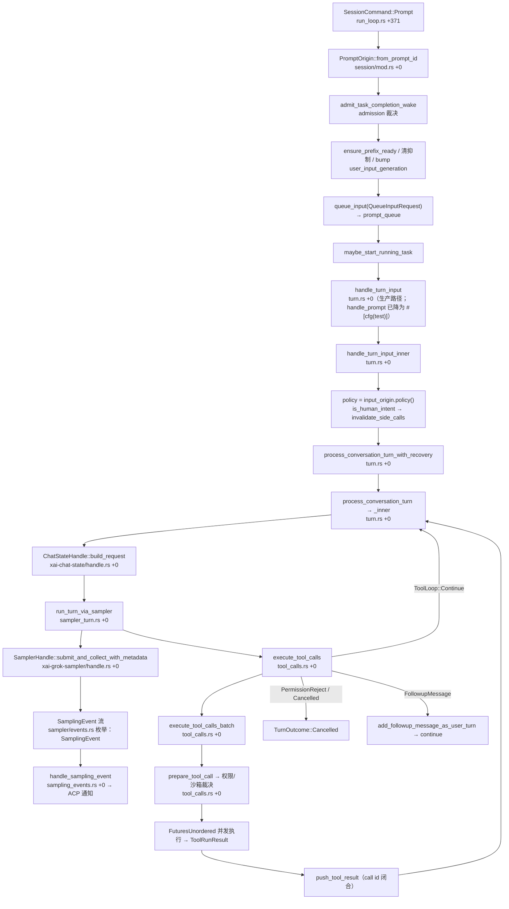

[上一篇：TUI交互循环与渲染](08-TUI交互循环与渲染.md) · [总目录](README.md) · [下一篇：工具协议与扩展体系](10-工具协议与扩展体系.md)

# Agent 会话与模型循环：Session Actor 回合循环

> **场景**：用户按回车后，一条 `SessionCommand::Prompt` 怎样走完「入队 → 建请求 → 采样 → 工具调用闭合 → 完成」。本文把 Session Actor 的回合循环写成可实现的伪代码与真实函数链。
> **时间**：采样于 2026-09-20（CST），工作区 `HEAD = 6c01b90c`。
> **工具版本**：Rust `1.94.0`（`rust-toolchain.toml:11`）/ `ratatui 0.29` / `tokio full` / `agent-client-protocol 0.10.4`。会话 `xai-grok-shell`，对话状态 `xai-chat-state`，采样 `xai-grok-sampler`，采样类型 `xai-grok-sampling-types`，压缩 `xai-grok-compaction`（common）+ `xai-compaction-transcript`。

> **阅读说明**：本文讲**调用关系与数据流**，不把行号当稳定 API。源码索引一律用「文件路径 + 函数名 + 函数内相对偏移（`+0` = 函数定义行）」。核心不变量：会话是**单写者**（Session Actor），历史/工具结果/压缩不竞态。

---

### 本文件内容

1. [Why：会话必须是单写者](#1-why会话必须是单写者)
2. [核心对象：Handle / Actor / Command / LiveState](#2-核心对象handle--actor--command--livestate)
3. [一次 Prompt 的回合循环（调用链）](#3-一次-prompt-的回合循环调用链)
4. [SamplingEvent → ACP notification 的翻译](#4-samplingevent--acp-notification-的翻译)
5. [工具批次：execute_tool_calls_batch 与 call id 闭合](#5-工具批次execute_tool_calls_batch-与-call-id-闭合)
6. [压缩：xai-grok-compaction 与 CompactionMode](#6-压缩xai-grok-compaction-与-compactionmode)
7. [插话：xai-interjection-core 与 InputPolicy](#7-插话xai-interjection-core-与-inputpolicy)
8. [Subagent：xai-grok-subagent-resolution 与 Task 工具](#8-subagentxai-grok-subagent-resolution-与-task-工具)
9. [取消：session/cancel 与取消语义](#9-取消sessioncancel-与取消语义)
10. [PromptTurnResult / PromptCompletionKind](#10-promptturnresult--promptcompletionkind)
11. [重实现最小对象集](#11-重实现最小对象集)

其余阶段见[总目录](README.md)。

---

## 1. Why：会话必须是单写者

如果并发改历史、工具结果、压缩，三者会互相覆盖。所以每个会话有且仅有一个**Session Actor** 单写者，所有外部输入（`SessionCommand`）都经它的 channel 串行化；UI、leader、子 agent 只持有 `SessionHandle`（调用端口），不直接碰 `ChatState`。

当前 HEAD 上这条纪律被**显式建模**成三层：

| 层 | 载体 | 作用 |
|---|---|---|
| 输入授权 | `InputPolicy`（7 个维度） | 决定「这条输入是谁的、能不能解析 slash、是不是回合边界、怎么记分析、怎么参与压缩、在队列里可不可见/可编辑、关停时怎么处理」 |
| 队列 | `QueueInputRequest` / `prompt_queue` | 把授权结果落到「排队还是插队」，并携带回执通道 |
| 回合终局 | `FinalizationGate` | 谁有权宣布这一回合结束（防「任务被 abort 与正常 finalize 双写」） |

```mermaid
sequenceDiagram
    autonumber
    participant Pager as Pager (UI)
    participant Handle as SessionHandle
    participant Actor as SessionActor (单写者)
    participant Queue as prompt_queue
    participant Turn as Turn task
    participant Chat as ChatStateHandle
    participant Samp as SamplerHandle / SamplerActor
    participant Tools as tool_calls

    Pager->>Handle: SessionCommand::Prompt{respond_to, prompt_blocks, send_now, ..}
    Handle->>Actor: cmd_tx.send(cmd)
    Actor->>Actor: PromptOrigin::from_prompt_id(prompt_id)
    Actor->>Actor: admit_task_completion_wake(origin, admission)
    Actor->>Actor: ensure_prefix_ready() / 清 task_wake 抑制 / bump user_input_generation
    Actor->>Queue: queue_input(QueueInputRequest{input_origin, respond_to, ..})
    Queue-->>Actor: 排队或 send_now 抢占
    Actor->>Turn: maybe_start_running_task(session, completion_tx)
    Turn->>Turn: handle_turn_input → handle_turn_input_inner
    Turn->>Turn: policy = input_origin.policy(); if is_human_intent → invalidate_side_calls
    loop 采样回合（tool_turn_count 递增）
        Turn->>Chat: build_request(effective_tools, memory_reminder, ..)
        Chat-->>Turn: ConversationRequest
        Turn->>Samp: run_turn_via_sampler(request, budget, transient, ..)
        Samp->>Samp: submit_turn_request → submit_and_collect_with_metadata
        Samp-->>Actor: SamplingEvent 流（drainer task）
        Actor->>Actor: handle_sampling_event(event) → ACP 流式通知
        Samp-->>Turn: SamplerTurnOutcome::Response(ConversationResponse)
        alt 有 tool_calls
            Turn->>Tools: execute_tool_calls(tool_call_responses)
            Tools->>Chat: push_tool_result(每个 call id 恰好一次)
        else 无 tool_calls
            Turn-->>Queue: PromptTurnOk{completion_kind: Completed}
        end
    end
    Note over Turn,Samp: 失败路径：CompactAndResubmit / RefreshAuthAndResubmit / RetryTransient /<br/>Cancelled(PermissionRejected|PermissionCancelled|HookDenied|MidTurnAbort)
```

---

## 2. 核心对象：Handle / Actor / Command / LiveState

| 类型 | 位置 | 角色 |
|---|---|---|
| `SessionHandle` | `xai-grok-shell/src/session/handle.rs 结构体：SessionHandle +0` | 调用端口（`#[derive(Clone)]`，到处传），核心字段 `cmd_tx: mpsc::UnboundedSender<SessionCommand>`、`persistence_tx`、`current_prompt_id`、`pending_interactions`、`chat_state_handle`、`signals_handle`、`gateway_enabled`、`active_work`、`spawn_snapshot` |
| `spawn_session_actor` | `xai-grok-shell/src/session/acp_session_impl/spawn.rs 函数：spawn_session_actor +0` | 起 Actor：构造 `SessionActor`、接线 sampler/goal/persistence drainer、在 `LocalSet` 里 spawn `run_session` |
| `run_session` | `acp_session_impl/run_loop.rs 函数：run_session +0` | Actor 主循环：`cmd_rx.recv()` → 大 `match SessionCommand` |
| `SessionCommand` | `xai-grok-shell/src/session/commands.rs 枚举：SessionCommand +0` | Actor 收的消息（`Initialize`/`Prompt`/`Cancel`/`SetSessionModel`/`ParentAgentMessage`/…） |
| `SessionLiveState` | `xai-grok-shell/src/session/handle.rs 枚举：SessionLiveState +0` | 生命周期状态机：`Working` / `IdleResident` / `Dormant` / `Completed` / `DeadFailed` / `Attaching` |
| `InputOrigin` | `acp_session_impl/queue_mutation.rs 结构体：InputOrigin +0` | `PromptOrigin` 的薄包装；`函数：InputOrigin::policy +0`、`函数：InputOrigin::is_synthetic +0`、`函数：InputOrigin::completion_id +0` |
| `PromptOrigin` | `xai-grok-shell/src/session/mod.rs 枚举：PromptOrigin +0` | 来源枚举：`User`、`TaskCompleted`、`SubagentCompleted`、`ParentAgentMessage`、`ParentHumanMessage`、`WorkflowCompleted`、`NotificationDrain`、`GoalSummary`、`GoalClassifierNudge`、`SchedulerFired`、`PlanResume`；`函数：PromptOrigin::from_prompt_id +0`、`函数：PromptOrigin::policy +0`、`函数：PromptOrigin::is_synthetic +0`、`函数：PromptOrigin::completion_id +0` |
| `TurnInputRequest` | `acp_session_impl/turn_task.rs 结构体：TurnInputRequest +0` | 一次输入的完整参数包（`prompt_id`、`input_origin`、`prompt_blocks`、`prompt_mode`、`verbatim`、`send_now`、`json_schema`、`persist_ack`、`parsed_prompt_tx`、`start_gate`…） |
| `AgentTask` / `FinalizationGate` | `turn_task.rs 结构体：AgentTask +0` / `FinalizationGate +0` | 在飞回合的句柄与「谁有权 finalize」的闸门 |

> `SessionCommand::Prompt` 字段极多（`commands.rs 枚举变体：SessionCommand::Prompt`）：`prompt_id`、`prompt_blocks`、`prompt_mode`、`artifact_upload_ctx`、`client_identifier`、`screen_mode`、`verbatim`、`traceparent`、`json_schema`、`send_now`、`admission: Option<TaskWakeAdmission>`、`tool_overrides_update`、`respond_to: oneshot::Sender<PromptTurnResult>`、`prompt_admitted`、`persist_ack`、`parsed_prompt_tx`——`respond_to` 是「提交屏障」的回执通道。

---

## 3. 一次 Prompt 的回合循环（调用链）



| 序号 | 动作 | 内部调用链 | 说明 |
|---|---|---|---|
| 1 | 入队/分发 | `SessionCommand::Prompt` 臂（`run_loop.rs 函数：run_session`，Prompt 臂在 `+371`） | 先做 admission 裁决，再 `queue_input` |
| 2 | 处理输入 | `handle_turn_input`（`turn.rs +0`）→ `handle_turn_input_inner`（`turn.rs +0`） | 解析、记遥测、决定 authority |
| 3 | 建请求 | `ChatStateHandle::build_request(...)` — `xai-chat-state/src/handle.rs 函数：build_request +0` | 拼 `ConversationRequest`（system、memory 注入、工具定义、图片预算） |
| 4 | 跑采样 | `run_turn_via_sampler(request, &mut budget, transient, mid_salvage_continuation, park)` — `sampler_turn.rs +0` | 经 `SamplerHandle` 发 HTTP SSE |
| 5 | 流事件 | `SamplingEvent` — `xai-grok-sampler/src/events.rs 枚举：SamplingEvent +0` | token / tool_call_delta / Completed |
| 6 | 工具批 | `execute_tool_calls(...)`（`tool_calls.rs +0`）→ `execute_tool_calls_batch(...)`（`tool_calls.rs +0`） | 闭合工具调用（见 §5） |
| 7 | 完成 | `PromptTurnOk` → `respond_to` oneshot | `respond_to` 是提交屏障回执 |

### 3.1 逐函数骨架（真实函数体精读）

#### 3.1.1 `run_session` 的 `Prompt` 臂（`run_loop.rs`）

```rust
// xai-grok-shell/src/session/acp_session_impl/run_loop.rs  函数：run_session（Prompt 臂在 +371）
SessionCommand::Prompt { prompt_id, prompt_blocks, prompt_mode, artifact_upload_ctx,
    client_identifier, screen_mode, verbatim, traceparent, json_schema, send_now,
    admission, tool_overrides_update, respond_to, prompt_admitted, persist_ack,
    parsed_prompt_tx } => {
    let origin = super::PromptOrigin::from_prompt_id(&prompt_id);          // +372
    let (actor_admitted, task_wake_fallback) = match admission {           // +373
        Some(admission) => {
            let fallback = session.admit_task_completion_wake(&origin, admission).await;
            (fallback.is_some(), fallback)
        }
        None => (true, None),
    };
    if !actor_admitted {                                                   // +382
        SessionActor::respond_removed_prompt(respond_to);                  // 直接回 RemovedFromQueue
        continue;
    }
    session.ensure_prefix_ready().await;                                   // +386
    if !origin.is_synthetic() {                                            // +389 真人输入才解除抑制
        /* task_wake 抑制闸门清零、notifications_suppressed=false、hook_block_hold 释放 */
        session.user_input_generation.fetch_add(1, Ordering::AcqRel);      // +411 LazinessDetector 唤醒
    }
    let (trace_gcs_config, artifact_tracker) = match artifact_upload_ctx { /* … */ };
    let cancel_for_send_now = session.queue_input(QueueInputRequest {      // +431
        prompt_blocks, prompt_id, input_origin: InputOrigin::new(origin),
        prompt_mode, /* … */ send_now, task_wake_fallback,
        tool_overrides_update, respond_to, persist_ack, parsed_prompt_tx,
        initial_child_prompt_ready: prompt_admitted, traceparent,
    }).await;
    let settled = if cancel_for_send_now {                                 // +453
        session.cancel_turn_for_send_now(&mut replay_buffer).await.settled
    } else { true };
    if settled {                                                           // +462
        SessionActor::maybe_start_running_task(session.clone(), completion_tx.clone()).await;
    }
}
```

> 三处关键语义：
> 1. **`admission` 是 Actor 权威的准入裁决**，不是 UI 侧的礼貌检查。被拒时 `respond_removed_prompt` 立刻回执并 `continue`，**该 prompt 从未开始过回合**——这正是 `PromptCompletionKind::RemovedFromQueue` 的由来（`commands.rs 枚举变体注释`：必须跳过 `prompt_complete` 广播与 roster `Idle` 增量，否则会把仍在飞的 turn 在仪表盘上误标成空闲）。
> 2. **`is_synthetic()` 分流**：合成的 auto-wake（`TaskCompleted`/`SubagentCompleted`/`GoalSummary`/`NotificationDrain`）**不**解除 post-cancel 抑制、**不** bump `user_input_generation`。bump 是「Layer-3 LazinessDetector 唤醒」：任何在跑的分类器轮询会因为快照过期而自行中止。
> 3. **`send_now` 是「取消并让位」**：`cancel_turn_for_send_now` 返回 `settled`。`settled == false` 表示「另一个 finalization 拥有这个回合」，此时**不** `maybe_start_running_task`，等它的 release 再踢队列——这是防双重启动的闸门。

#### 3.1.2 `handle_turn_input` / `handle_turn_input_inner`（`turn.rs`）

**注意**：`handle_prompt`（`turn.rs 函数：handle_prompt +0`）在当前 HEAD 上带 `#[cfg(test)]`，**只用于测试**。生产路径是 `run_loop` → `queue_input` → turn task → `handle_turn_input`。

```rust
// xai-grok-shell/src/session/acp_session_impl/turn.rs  函数：handle_turn_input +0
pub(super) async fn handle_turn_input(self: &Arc<Self>, request: TurnInputRequest)
    -> PromptTurnResult {
    let span = tracing::info_span!("session.handle_prompt", session_id = .., prompt_id = ..);
    if let Some(ref tp) = request.traceparent { xai_grok_otel::link_span_to_meta(&span, ..); }
    self.handle_turn_input_inner(request).instrument(span).await   // +17 委派
}

// 同文件  函数：handle_turn_input_inner +0
async fn handle_turn_input_inner(self: &Arc<Self>, request: TurnInputRequest)
    -> PromptTurnResult {
    let _active = TURNS_ACTIVE.enter();                            // +4 进程级在飞回合计数
    let _work = WorkGuard::new(self.active_work.clone());          // +5 RAII：active_work++/--
    let TurnInputRequest { prompt_id, input_origin, prompt_blocks, /* … */ } = request;
    let policy = input_origin.policy();                            // +34 七维授权
    self.open_subagent_spawn_admission();                          // +35
    if let Some(reservations) = &self.tool_context.task_completion_reservations
        && let Some(completion_id) = input_origin.completion_id() {
        reservations.release(completion_id);                       // +39 回收 subagent 预约
    }
    if policy.authority.is_human_intent() {                        // +41 人类意图？
        self.invalidate_side_calls_for_new_prompt();               // +42 作废在飞 side call
    }
    self.ensure_session_disk_writable().await?;                    // +44
    let wake_message = match input_origin.as_prompt_origin() {     // +45
        PromptOrigin::SubagentCompleted { subagent_id } => Some(self.build_wake_turn_message(subagent_id).await),
        _ => None,
    };
    let (prompt_blocks, commit_ids) = match wake_message {         // +51
        Some(WakeTurnMessage::Digest { text, ids }) => (vec![Text(text)], ids),
        Some(WakeTurnMessage::Silent) => { return ok_end_turn(0, None); }  // 不采样直接收尾
        Some(WakeTurnMessage::KeepBody) | None => (prompt_blocks, /* … */),
    };
    /* … 之后进 process_conversation_turn_with_recovery … */
}
```

> **真实漂移**：旧文档写的 `policy.authority.is_human_intent()`（`turn.rs:338`）**仍然成立**，但 `policy` 的维度远比旧文档描述的宽。`InputPolicy`（`xai-agent-lifecycle/src/send/contributors/turn_lifecycle.rs 结构体：InputPolicy +0`）有 7 个字段：
>
> | 字段 | 类型 | 取值 |
> |---|---|---|
> | `authority` | `InputAuthority` | `HumanIntent` / `ModelAuthoredUntrusted` / `RuntimeControl`；`is_human_intent()`（`+7`）只认第一个 |
> | `slash` | `SlashAuthority` | `HumanCatalog` / `ModelAuthored` / `Inert` —— **与 authority 独立**：人类父会话文本仍可 slash-inert |
> | `turn_boundary` | `TurnBoundary` | `Conversational` / `MidTurn` / `None` |
> | `analytics` | `AnalyticsClass` | `HumanPrompt` / `AgentMessage` / `RuntimeWake` |
> | `compaction` | `CompactionClass` | `HumanAnchor` / `ConversationalAgentAnchor` / `RuntimeEphemera` |
> | `queue` | `QueuePolicy` | `VisibleProtected` / `VisibleEditable` / `Hidden` |
> | `shutdown` | `ShutdownPolicy` | `Drain` / `CancelWithProducer` / `DropEphemeral` |
>
> 所以「解析 slash 命令」的判断应该看 `policy.slash`，而不是 `policy.authority`——旧文档把两件事混成一件，是错的。

#### 3.1.3 `run_turn_via_sampler`（`sampler_turn.rs`）

带**限流退避重试**的采样入口。签名比旧文档宽：多了 `transient: TransientRetryState`、`mid_salvage_continuation: bool`、`park: TurnParkState`。

```rust
// xai-grok-shell/src/session/acp_session_impl/sampler_turn.rs  函数：run_turn_via_sampler +0
pub(crate) async fn run_turn_via_sampler(
    self: &Arc<Self>,
    request: ConversationRequest,
    budget: &mut RateLimitWaitBudget,
    transient: TransientRetryState,
    mid_salvage_continuation: bool,
    park: TurnParkState,
) -> Result<SamplerTurnOutcome, acp::Error> {
    if !park.is_parked() {
        self.prepare_sampler_for_turn().await;                  // +11 刷新认证 + 推 sampler 配置
    }
    if !budget.can_wait() {                                     // +14 预算用尽 → 只提交一次
        return match self.submit_turn_request(request).await {
            Ok(outcome) => Ok(outcome),
            Err(info) => self.recover_from_sampling_failure(
                info, budget, transient, mid_salvage_continuation, park).await,
        };
    }
    loop {                                                      // +31 限流退避重试
        match self.submit_turn_request(request.clone()).await {
            Ok(outcome) => {
                budget.record_submission_accepted();            // +34
                return Ok(outcome);
            }
            Err(info) => {
                let decision = budget.decide(&info);            // +38 算退避
                let RateLimitWaitDecision::Wait { attempt, backoff } = decision else {
                    self.log_rate_limit_budget_spent(decision, &info);
                    return self.recover_from_sampling_failure(
                        info, budget, transient, mid_salvage_continuation, park).await;
                };
                self.notify_rate_limit_wait(attempt, budget, backoff).await;
                sleep(backoff).await;                           // +53 「Esc 取消靠 abort 任务，这个 await 点本身就是取消点」
                if !park.is_parked() {
                    self.prepare_sampler_for_turn().await;      // +57 长等待后 token 可能过期
                }
                self.turn_phases.record_sampling_retries(1);    // +59
            }
        }
    }
}
```

`submit_turn_request`（`sampler_turn.rs 函数：submit_turn_request +0`）内部：

1. `RequestId::random()`（`+4`）；
2. 在 `turn_stream_drained` 里为该 `request_id` 插入 `StreamOwnership { generation, waiter: Some(tx) }`（`+9`）——这是**流排空屏障**的登记点；
3. 借 `sampling_gate` 许可（`acquire_subagent_sampling_permit`，`+22`）——限制子 agent 的并发采样；
4. 打 `traceparent`（`+27`），再 `self.sampler_handle.submit_and_collect_with_metadata(request_id, request).await`（`+28`）；
5. 收回 ownership 并对账 doom-loop 元数据（`+39`）。

失败经 `recover_from_sampling_failure`（`sampler_turn.rs 函数 +0`）走三条路，映射到 `SamplerTurnOutcome`（`acp_session_impl/types.rs 枚举：SamplerTurnOutcome +0`）：

| `SamplerTurnOutcome` 变体 | 恢复动作 | 回到主循环后 |
|---|---|---|
| `Response(Box<ConversationResponse>, Box<InferenceLatencyStats>)` | 无 | 解析 tool_calls |
| `CompactAndResubmit` | 先压缩再重提 | 外层 `continue`，从最新 chat state 重建请求 |
| `RefreshAuthAndResubmit { credential, store }` | 401 → 刷新凭据重提 | 见 §9 的 auth 重试调度 |
| `RetryTransient { kind, status_code }` | 瞬时错误 → 抖动退避重试 | 递增 `transient_retry_attempts` |

#### 3.1.4 内层采样循环（`turn.rs`，`process_conversation_turn_inner`）

外层「回合循环」在 `turn.rs 函数：handle_turn_input_inner`（`+803` 附近的 `loop`）里反复调 `process_conversation_turn_with_recovery`；真正的**采样 + 工具循环**在 `process_conversation_turn_inner`（`turn.rs 函数 +0`）里：

```rust
// xai-grok-shell/src/session/acp_session_impl/turn.rs  函数：process_conversation_turn_inner +0
let mut tool_turn_count: usize = 1;                                  // +90
let mut loop_index: u32 = 0;                                         // +91
let mut identical_tool_calls = IdenticalToolCallRun::default();      // +92
loop {                                                               // +133
    self.emit_event(Event::LoopStarted { loop_index });              // +134
    loop_index += 1;
    // 1) 动作静止性（action stationarity）：同一工具重复到阈值 → 直接收尾
    if identical_tool_calls.run_len >= identical_tool_calls.hard_stop_threshold() {
        /* ActionStationarityStop 遥测 */ return Ok(TurnOutcome::StationarityEnded);   // +173
    }
    if identical_tool_calls.take_nudge() { /* 注入 ACTION_STATIONARITY_NUDGE_TEMPLATE */ }
    // 2) 安全点插话：只在没有等待 salvage 续写时抽干
    if !salvage.awaiting_continuation() {
        self.drain_interjections_at_safe_point().await;              // +216
        self.flush_pending_skill_reminders().await;
        self.inject_pending_monitor_events().await;
    }
    let memory_reminder = self.first_turn_memory_reminder().await;    // +220
    // 3) 两趟压缩预热（后台 pass1）
    if self.two_pass_active() && !self.compaction.prefire.has_cache()
        && self.should_prefire_two_pass().await && self.compaction.prefire.try_begin() {
        tokio::task::spawn_local(actor.run_prefire_pass1());         // +247
    }
    // 4) 采样前自动压缩
    if let Some(trigger_info) = self.check_auto_compact_needed().await
        && let Err(e) = self.run_compact_only(trigger_info, false).await {
        if Self::is_auth_compact_error(&e) { return Err(self.surface_compact_auth_failure(e).await); }
    }
    // 5) 组装有效工具集（子 agent 走 child_safe_tool_specs 投影；结构化输出加 StructuredOutput 工具）
    let effective_tools = /* … */;                                   // +289
    let request = self.chat_state_handle.build_request(               // +330
        effective_tools, memory_reminder, self.memory.is_enabled(),
        trace_ctx, self.session_info.id.to_string(), req_id.to_owned()).await
        .expect("chat state actor should be alive");
    // 6) 采样
    let model_sampler_outcome = self.run_turn_via_sampler(            // +411
        request.clone(), &mut rate_limit_waits, TransientRetryState { .. },
        salvage.awaiting_continuation(), turn_parked).await;
    /* … Response / RetryTransient / CompactAndResubmit / RefreshAuthAndResubmit 分支 … */
    // 7) 工具批
    let tool_call_responses: Vec<ToolCallResponse> = tool_calls.into_iter().map(..).collect();
    match self.execute_tool_calls(tool_call_responses).await {        // +1176
        Ok(ToolLoop::PermissionReject { tool_name, reason }) => return Ok(TurnOutcome::Cancelled { .. }),
        Ok(ToolLoop::HookDenied { .. }) => {}                          // 非终止：继续回合
        Ok(ToolLoop::Cancelled) => return Ok(TurnOutcome::Cancelled { .. }),
        Ok(ToolLoop::FollowupMessage(m)) => { self.add_followup_message_as_user_turn(&m).await; continue; }
        _ => {}
    }
    // 8) max_turns 与 preflight 溢出
    if let Some(limit) = self.max_turns && tool_turn_count + 1 > limit {
        return Ok(TurnOutcome::MaxTurnsReached { limit });             // +1217
    }
    tool_turn_count += 1;
    if let Some(trigger_info) = self.check_preflight_overflow().await {
        if let Err(e) = self.run_compact_only(trigger_info, false).await { /* … */ }
        continue;                                                      // 压缩后重开一轮
    }
}
```

> 循环出口只有五类：`TurnOutcome::Completed{stop: CompletedStop}`（`EndTurn`/`MaxTokens`/`Refusal`）、`Cancelled{category, context}`、`MaxTurnsReached{limit}`、`StationarityEnded`，以及 `Err(acp::Error)`。`CompletedStop`（`types.rs 枚举 +0`）在**返回点一次性决定**，再在 `turn.rs` 里映射成 `acp::StopReason`。

---

## 4. SamplingEvent → ACP notification 的翻译

`SamplingEvent`（`xai-grok-sampler/src/events.rs 枚举：SamplingEvent +0`）是采样层的通用事件，关键变体：

| 变体 | 偏移 | 含义 |
|---|---|---|
| `StreamStarted { request_id, timestamp_ms }` | `+2` | HTTP 流建立，首 token 前 |
| `FirstToken { request_id }` | `+8` | 首个内容 token |
| `ChannelToken { .. }` | `+11` | 命名通道（`Text` / `Reasoning`）的 token |
| `ToolCallDelta { .. }` | `+21` | 工具调用参数片段（**单段不一定是合法 JSON**，需累积） |
| `ResponseStarted { .. }` | `+32` | 真实 message id / 模型 / token 计数 |
| `ReasoningCompleted { signature, .. }` | `+44` | 思考块结束 + 签名 |
| `Completed { .. }` | `+50` | **规范完成消息**（带 `ConversationResponse` + 延迟统计） |
| `DoomLoopSignals { .. }` | `+58` | 重复检测信号 |
| `ImagesStripped { stripped_urls, reason, .. }` | `+65` | 服务端剥图 |
| `Retrying { .. }` | `+73` | 采样层内部重试 |
| `Failed { request_id, error }` | `+88` | 终局失败 |
| `ModelMetadata { metadata, .. }` | `+94` | 模型元数据 |
| `BackendToolCallStarted/Completed { .. }` | `+101` / `+108` | 后端工具调用（服务端执行） |

**翻译层**：`handle_sampling_event`（`acp_session_impl/sampling_events.rs 函数 +0`），由 `spawn_session_actor` 里 spawn 的 **drainer task** 逐条驱动：

```rust
// xai-grok-shell/src/session/acp_session_impl/spawn.rs  （在 spawn_session_actor 内）
tokio::task::spawn_local(async move {
    while let Some(event) = sampler_event_rx.recv().await {      // 直到 channel 关闭
        drainer_session.handle_sampling_event(event).await;
    }
    tracing::debug!("sampler event drainer exiting (channel closed)");
});
```

`handle_sampling_event` 的前置过滤（决定「这条事件还算不算这个回合的」）：

```rust
// sampling_events.rs  函数：handle_sampling_event +0
let request_owned = self.turn_stream_drained.lock().contains_key(event.request_id());
let owns_pending_strip = self.pending_image_strip.lock().contains_key(event.request_id());
let closes_backend_tool = matches!(event, SamplingEvent::BackendToolCallCompleted { .. });
let resolves_pending_strip = match &event {
    SamplingEvent::ImagesStripped { stripped_urls, reason, .. } =>
        owns_pending_strip && Self::should_defer_image_strip(stripped_urls, reason),
    SamplingEvent::Completed { .. } | SamplingEvent::Failed { .. } => owns_pending_strip,
    _ => false,
};
if matches!(event, Completed | Failed | Retrying { .. }) { self.close_stream_apply_span(..); }
if !request_owned && !closes_backend_tool && !resolves_pending_strip { return; }  // 丢弃过期事件
```

> 关键不变量：**增量 token 不是完成消息**，`SamplingEvent::Completed` 才是提交屏障。`request_owned` 门控保证「上一回合的迟到 token 不会污染下一回合」——`turn_stream_drained` 里没有该 `request_id` 时，非终局事件一律丢弃。

**失败路径**：

- `SamplingEvent::Failed` → 转成 `acp::Error` 交回 `run_turn_via_sampler` 的错误路径（§3.1.3 的三条恢复）。
- `SamplingEvent::Retrying` → 只更新 UI 提示与 span，不结束回合；同时 `close_stream_apply_span` 关闭当前流应用 span，避免重试期间 span 悬空。
- `SamplingEvent::ImagesStripped` → 只有 `owns_pending_strip` 且 `should_defer_image_strip` 才认领，否则当作上一回合的迟到事件丢弃（否则会把图片剥离提示错记到新回合）。
- drainer task 只在 `sampler_event_rx` 关闭时退出；session 结束时 channel 关闭，drainer 自然收尾（`spawn_local` 的任务随 `LocalSet` 一起 drop）。

---

## 5. 工具批次：execute_tool_calls_batch 与 call id 闭合

- 当采样流累积出完整工具调用（`ToolCallDelta` 拼成合法 JSON），主循环调 `execute_tool_calls`（`tool_calls.rs 函数 +0`），返回 `Result<ToolLoop, acp::Error>`。它的分批规则是**两条**：
  1. `self.reject_excess_media_gen_calls(tool_calls).await?` —— 先剔除超过媒体生成限额的调用（被剔除者会被 `handle_tool_not_executed` 以「未执行」tool_result 闭合）；
  2. 调用数 > 1 时用 `split_exit_plan_tail(tool_calls, kind_of)` 拆成 `body` + `tail`，**body 与 tail 各调一次** `execute_tool_calls_batch`；只有 1 个调用时直接一批。
- 因此 `execute_tool_calls_batch` 最多被调两次，`final_result: &mut Option<ToolLoop>` 跨批累积「首个终止原因」（`+111` 处 `if final_result.is_none()` 保证先到者胜出）。
- `execute_tool_calls_batch` 的三段结构：**prepare → dispatch → post-flight**（函数文档明确「Caller owns the outer tail flush」）。

```rust
// xai-grok-shell/src/session/acp_session_impl/tool_calls.rs  函数：execute_tool_calls_batch +0
async fn execute_tool_calls_batch(&self, tool_calls: Vec<ToolCallResponse>,
    deferred_followups: &mut Vec<ConversationItem>,
    final_result: &mut Option<ToolLoop>) -> Result<(), acp::Error> {
    if self.permissions.is_auto_mode() {                       // +6 自动模式：刷新分类器 transcript
        let conversation = self.chat_state_handle.get_conversation().await;
        super::refresh_classifier_transcript(&self.permissions, &conversation);
    }
    let mut approved: Vec<PreparedToolCall> = Vec::new();       // +17
    let mut mcp_file_budget = mcp_file_input::McpFileBatchBudget::default();
    for call in tool_calls.into_iter() {
        if final_result.is_some() {                             // +20 已被 reject/cancel → 仍以 tool_result 闭合
            let message = match &*final_result {
                Some(ToolLoop::PermissionReject { .. }) => "…earlier permission rejection…",
                Some(ToolLoop::Cancelled)               => "…earlier user cancellation…",
                Some(ToolLoop::FollowupMessage(_))      => "…earlier user followup message…",
                _                                       => "…cancelled…",
            };
            self.chat_state_handle.push_tool_result(ConversationItem::tool_result(call.id.clone(), message));
            continue;                                           // 不执行，但闭合
        }
        self.emit_event(Event::ToolStarted { tool_name: call.function.name.clone() });   // +48
        self.observability_bridge.emit(SessionEvent::ToolCallStarted { .. }).await;      // +51
        match self.prepare_tool_call(call, deferred_followups).await? {                  // +61
            Ok(prepared) => {
                if let Err(error) = mcp_file_budget.admit(&prepared) {                   // +63
                    self.handle_tool_not_executed(&prepared.call_id, &prepared.tool_call_id, error).await?;
                    self.events.tool_finished();
                } else { approved.push(prepared); }                                      // +72
            }
            Err(tool_loop) => {                                                          // +75 拒绝路径
                self.events.tool_finished();
                if let Some((server, tool)) = parse_mcp_tool_name(&call_name) {
                    self.emit_event(Event::McpToolCallCompleted { success: false, error: Some(error_reason), .. });
                }
                if matches!(tool_loop, PermissionReject{..} | Cancelled | FollowupMessage(_))
                    && final_result.is_none() { *final_result = Some(tool_loop); }         // +111 首个终止原因胜出
            }
        }
    }
    // … 并发 dispatch …
    let mut dispatch_stream = futures::stream::FuturesUnordered::new();                  // +459
    for fut in dispatch_futures { dispatch_stream.push(fut); }
    let mut approved_slots: Vec<Option<PreparedToolCall>> = approved.into_iter().map(Some).collect();
    let (dispatch_tx, mut dispatch_rx) = tokio::sync::mpsc::unbounded_channel::<..>();
    let drainer = tokio::spawn(async move { while let Some(item) = dispatch_stream.next().await {
        if dispatch_tx.send(item).is_err() { break; } } }.in_current_span());
    let _drainer_guard = crate::util::AbortOnDrop(drainer);
    while let Some((idx, result, duration_ms)) = dispatch_rx.recv().await {
        let Some(prepared) = approved_slots.get_mut(idx).and_then(Option::take) else {
            tracing::error!(batch_idx = idx, slots = approved_slots.len(),
                "dispatch result has no pending approved slot; dropping it");
            continue;
        };
        // … post-flight：post_tool_use hook、失败 hook、telemetry、push_tool_result …
    }
}
```

> 这是「每个 `tool_call_id` 恰好一个 `tool_result`」不变量（README 不变量 3）的**执行点**：
>
> - `final_result.is_some()` 分支把已拒绝/已取消的工具调用也以 `tool_result` 形式闭合（不是丢弃），保证对话结构不被破坏；
> - `approved_slots.get_mut(idx).and_then(Option::take)` 用 `Option` 槽位保证每个批次下标**只被消费一次**——重复结果会打 error 日志并丢弃，而不是二次写入；
> - `call.id` 为空时**合成 join key** `missing-call-id-{idx}` 并告警（`tool_calls.rs` dispatch 消费循环内），保证闭合键非空。
>
> `prepare_tool_call`（`tool_calls.rs 函数 +0`）内部串起「权限 + 沙箱 + 工具执行准备」，是 fail-closed 裁决的落点。它返回 `Result<Result<PreparedToolCall, ToolLoop>, acp::Error>`：外层 `Err` 是基础设施错误（终止整批），内层 `Err(ToolLoop)` 是业务拒绝（继续处理后续调用，但记下 `final_result`）。
>
> `ToolLoop`（`acp_session_impl/types.rs 枚举：ToolLoop +0`）：`Continue` / `NonExistingTool` / `ToolParsingError` / `PermissionReject { tool_name, reason }` / `Cancelled` / `FollowupMessage(String)` / `HookDenied { hook_name }`。注意 `HookDenied` 是**非终止**的：拒绝原因回灌给模型，回合继续（枚举注释明确）。

**失败路径**：

- **权限拒绝** → `ToolLoop::PermissionReject` → `final_result` 记下 → 后续调用全部以 `tool_result` 闭合 → 主循环映射成 `TurnOutcome::Cancelled { category: PermissionRejected }`。
- **用户取消** → `ToolLoop::Cancelled` → `TurnOutcome::Cancelled { category: PermissionCancelled }`。
- **follow-up 消息代替批准** → `ToolLoop::FollowupMessage(m)` → 主循环 `add_followup_message_as_user_turn(&m)` 后 `continue`（**不**终止回合）。
- **MCP 文件预算超限** → `mcp_file_budget.admit(&prepared)` 失败 → `handle_tool_not_executed(...)` 写一条「未执行」的 tool_result（仍闭合），并 `tool_finished()`。
- **MCP 工具失败** → `is_mcp_error_result` → 走 `dispatch_tool_failure` 而非 `dispatch_post_tool_use_hook`，`McpToolCallCompleted { success: false }`。
- **dispatch 槽位缺失** → error 日志 + 丢弃（防御性，正常不该发生）。
- **`spawn_blocking` 锁路径解析失败** → `unwrap_or_else` 记 warn 并返回全 `None` 的 `lock_paths`，退化成「无文件锁」而非 panic。

---

## 6. 压缩：xai-grok-compaction 与 CompactionMode

### 6.1 两层分工

| 层 | crate | 职责 |
|---|---|---|
| 引擎（transport-agnostic） | `crates/common/xai-grok-compaction` | 共享策略、prompt、选择、组装。用 trait 缝解耦宿主：`CompactionItem`/`CompactionRole`/`CompactionItemBuilder`、`ItemTokenCounter`、`CompactionSampler`、`CompactionStreamProc`、`Intra/InterCompactionObserver`。风格分三个模块：`code_compaction`（grok-build 的**整会话全量替换**）、`intra_compaction`（Grok chat 的保尾逐步）、`inter_compaction`（Grok chat 的分块跨回合） |
| 宿主触发/持久化 | `xai-grok-shell/src/session/compaction.rs` | 触发时机、transport、持久化/回放/rewind、状态提交、指标 |
| 段渲染 | `crates/codegen/xai-compaction-transcript` | 把压缩后的段渲染成自包含 markdown（`COMPACTION_DIR = "compaction"`、`INDEX_FILE = "INDEX.md"`、`CompactionDetail`）；纯渲染无 IO |

### 6.2 `CompactionMode`（当前 HEAD 变了）

```rust
// xai-chat-state/src/compaction_mode.rs  枚举：CompactionMode +0
pub enum CompactionMode {
    Summary,                                 // 只有摘要，无回指
    Transcript,                              // 摘要 + 指向完整 updates.jsonl
    Segments(CompactionDetail),              // 摘要 + compaction/ 下干净的逐段 markdown —— Default
}
```

- `Default for CompactionMode`（`+9`）= `Segments(CompactionDetail::default())`。**旧文档说的「模式由 `CompactionMode` 控制、可被 env `GROK_COMPACTION_MODE` 覆盖」仍成立**，但现在还多了 `GROK_COMPACTION_DETAIL` 单独解析细节级别，由 `with_segment_detail(detail)`（`+30`）合并进去。
- `parse(s)`（`+19`）接受 `summary` / `transcript` / `segments`（大小写不敏感），未知返回 `None` 让调用方回落。
- `writes_segments()`（`+45`）决定是否落 `compaction/` 段存储；`transcript_hint(location)`（`+52`）按模式生成回指文本（`Summary` 返回 `None`）。
- `spawn_session_actor` 把它作为参数 `compaction_mode: xai_chat_state::CompactionMode` 传入（`spawn.rs 函数：spawn_session_actor` 参数表内），即**模式在会话诞生时就钉死**。

### 6.3 触发与执行（`xai-grok-shell/src/session/compaction.rs`）

| 函数 | 偏移 | 作用 |
|---|---|---|
| `two_pass_active` | `+0` | 两趟压缩是否启用 |
| `two_pass_sample` | `+0` | 两趟的采样调用 |
| `run_prefire_pass1` / `_inner` | `+0` / `+0` | 后台**预热**：用量逼近阈值时先偷偷摘要较早历史（pass 1） |
| `run_compact` | `+0` | 手动 `/compact` 与自动压缩的主入口 |
| `run_compact_inner` | `+0` | 真正的压缩流程 |
| `should_auto_compact` | `+0` | 纯判断：估算 token 是否越过 `auto_compact_threshold_percent` |
| `should_compact_on_error` | `+0` | 错误驱动的压缩判断 |
| `check_auto_compact_needed` | `+0` | 采样前检查 → `Option<AutoCompactTriggerInfo>` |
| `check_preflight_overflow` | `+0` | 工具批之后、下一轮之前的溢出检查 |
| `maybe_compact_on_model_switch` | `+0` | 换模型后 context window 变小 → 可能需要压缩 |
| `run_compact_only` | `+0` | 「只压缩、不重提」的封装（`run_compact` + 通知 + 遥测） |

`CompactionPolicy`（`xai-grok-agent/src/compaction.rs 结构体：CompactionPolicy +0`）是策略面：

| 字段 | 默认 | 说明 |
|---|---|---|
| `auto_compact_threshold_percent` | `85` | 用到 context window 的这个百分比就触发自动压缩 |
| `compact_model` | `None` | 生成摘要用的模型；`None` = 用会话当前模型 |
| `memory_flush_enabled` | `false` | 压缩前先跑一次 memory flush turn（需 memory 系统启用） |
| `wall_clock_budget_secs` | `300` | 单次压缩的墙钟预算；超时切断并重试（防「token 限额抓不到的失控推理」） |
| `two_pass_enabled` | `false` | 两趟压缩；`false` 走 legacy 单趟 |

**失败路径**：

- **压缩失败但属认证类** → `is_auth_compact_error(&e)` → `surface_compact_auth_failure(e).await` 把 401 转成明确的认证错误返回（而不是让回合带着坏 token 继续）。
- **压缩失败但非认证类** → `tracing::error!` 记录后**继续**本回合（采样前压缩失败不阻断；preflight 压缩失败则 `continue` 重开一轮）。
- **压缩与并发 turn 竞态** → 因为压缩在 Session Actor 单写者内做，天然不与并发 turn 竞态；`auto_compact_suppressed`（`compaction_config.rs 结构体字段`）是 AtomicU8 抑制闸门，rewind / 特定取消路径会把它置位。
- **两趟预热未命中** → `prefire.has_cache()` 为假时 pass 2 自己算完整摘要，退化为单趟语义（不是错误）。

---

## 7. 插话：xai-interjection-core 与 InputPolicy

- **插话（interjection）** 允许在模型回合中插入用户/系统意图，纯逻辑（缓冲/事件/格式化）在 `crates/common/xai-interjection-core`：`InterjectionBuffer`、`PendingInterjection`、`format_interjection` / `format_interrupt` / `frame_user_turn` / `user_query`、`INTERJECTION_NOTE` / `INTERRUPT_NOTE`。
- **宿主侧**（`acp_session_impl/interjection.rs`）：

| 函数 | 偏移 | 作用 |
|---|---|---|
| `is_interject_fallback(prompt_id)` | `+0` | 判断某个 prompt_id 是不是插话回落 |
| `queue_interjection_fallback_prompt` | `+0` | 回落路径：插话降级成普通 prompt 排队 |
| `flush_stranded_interjections` | `+0` | 回合结束时把没送出的插话捞出 |
| `prepare_interjection_images` | `+0` | 插话携带的图片预处理 |
| `broadcast_interjection(text, id)` | `+0` | 广播给客户端（回显） |
| `persist_synthetic_user_message` | `+0` | 持久化合成 user message |
| `inject_synthetic_user_message` | `+0` | 注入到 chat state |
| `drain_interjections_at_safe_point` | `+0` | **安全点抽干**（回合循环每轮调一次） |
| `drain_admitted_messages_at_safe_point` | `+0` | 父/子消息版本 |
| `drain_pending_interjections` | `+0` | 纯抽干 |

- **安全点在哪**：`process_conversation_turn_inner` 的循环顶部，且**只在 `!salvage.awaiting_continuation()` 时**抽干（`turn.rs` 循环内）。原因是 salvage（长度续写）中途插入用户文本会破坏续写语义。
- **授权由 `InputPolicy` 决定**（§3.1.2 的表）：插话文本通常是 `HumanIntent` + `TurnBoundary::MidTurn`，因此 `invalidate_side_calls_for_new_prompt` 会执行、但不会开新回合边界。
- `Effect::SendPrompt` 的 `skill_token_ranges`（`08` §3）与插话共用「`_meta` 携带字节区间以便回放时重现样式」的约定。

**失败路径**：插话在回合已进入不可插点（正在 salvage 续写、正在等权限裁决）时不会丢——`queue_interjection_fallback_prompt` 把它降级成普通 prompt 排队，`flush_stranded_interjections` 在回合边界兜底捞出。若持久化失败，`persist_synthetic_user_message` 记录错误但插话本身仍注入到内存 chat state（内存优先，落盘 best-effort）。

---

## 8. Subagent：xai-grok-subagent-resolution 与 Task 工具

- 子 agent 解析见 `xai-grok-subagent-resolution`；运行见 `xai-grok-shell/src/agent/subagent/`：
  `attempt_runner.rs`（回合尝试驱动）、`prompt_turn_result.rs` / `prompt_turn_receipt.rs`（结果与回执）、`child_runtime.rs`（子运行时）、`spawn.rs`（派生）、`handle_request.rs`（请求处理）、`resume_window.rs`（恢复窗口）、`start_artifact_publication.rs`。
- **子 agent 自己也是一个 Session Actor**，回合循环复用 §3 的同一条链（`spawn_session_actor` → `run_session` → `handle_turn_input` → `process_conversation_turn_*`）。
- **工具面被投影收窄**：`child_tool_projection::child_safe_tool_specs(tools, ChildToolProjection::Rebuilt | VerbatimMirror, messaging_grant, |name| bridge.tool_kind(name))`（在 `process_conversation_turn_inner` 组装 `effective_tools` 处）。`messaging_grant` 由「是否有 `AgentMessageSenderResource` 且暴露 `ActiveAgentMessage` 工具」决定（`ChildMessagingGrant::Granted` / `Ungranted`）。
- **回合数上限**：`self.max_turns` 在 `SessionHandle` 上（`handle.rs 结构体字段：SessionHandle::max_turns`，`None` = 不限）；超限返回 `TurnOutcome::MaxTurnsReached { limit }` → `PromptCompletionKind::MaxTurnsReached { limit }`。
- **结果回灌父会话**：子 agent 完成时以 `PromptOrigin::SubagentCompleted { subagent_id }` 唤醒父会话（`handle_turn_input_inner` 里 `build_wake_turn_message`），且 `handle_turn_input_inner` 会 `reservations.release(completion_id)` 回收预约（§3.1.2）。
- **Task 工具**把「派发子 agent」作为普通工具调用暴露（`10` 工具体系）。
- **`SubagentCompleted` 唤醒的三种形态**（`WakeTurnMessage`）：`Digest { text, ids }`（用摘要文本跑一个真回合）、`Silent`（**不采样**，直接 `ok_end_turn(0, None)` 收尾）、`KeepBody`（沿用原 prompt body）。

**失败路径**：子 agent 回合被 abort 时，父会话侧的预约由 `task_completion_reservations` 释放；`FinalizationGate`（`turn_task.rs 结构体 +0`）保证「任务被 abort」与「正常 finalize」不会双写同一回合的完成记录——`claim_task_finalization` / `claim_cancel_finalization` / `finalization_binding_is_current` / `release_finalizing_task` / `finish_finalization` 五个方法构成租约（`FinalizationLease`，`turn_task.rs 结构体 +0`）。

---

## 9. 取消：session/cancel 与取消语义

取消入口在 `acp_session_impl/cancel.rs`：

| 函数 | 偏移 | 作用 |
|---|---|---|
| `cancel_running_turn_subagents(parent_prompt_id)` | `+0` | 只取消**当前回合**派出的子 agent（用 `parent_prompt_id` 精确匹配） |
| `cancel_all_session_subagents()` | `+0` | 取消本会话全部子 agent |
| `open_subagent_spawn_admission()` | `+0` | 重新放开子 agent 派生准入 |
| `cancel_turn_for_send_now(&mut replay_buffer)` | `+0` | 「取消并让位」：给 send-now 让路，返回 `settled` |
| `finish_rewound_cancel` | `+0` | rewind 场景的取消收尾 |
| `cancel_running_task` | `+0` | 取消在飞的采样/工具任务 |
| `kill_foreground_commands_for_cancel` | `+0` | 杀掉前台命令 |

取消语义要点：

1. **取消靠 abort 任务实现**，不是靠轮询标志。`run_turn_via_sampler` 的注释明确：「Esc cancels a turn by aborting its task, so this await point is itself the cancellation point; no select needed」——即 `sleep(backoff).await` 这个 await 点就是取消点，不需要额外 `select!`。
2. **`settled` 是「谁拥有 finalization」的裁决结果**（`cancel_turn_for_send_now` 的返回字段）。未 settled 表示另一个 finalization 拥有该回合，它的 release 会再踢队列（`run_loop` Prompt 臂注释）。
3. **取消类别落到 `_meta`**：`PromptCompletionKind::Cancelled { category, context }`（`commands.rs 枚举变体 +5`）经 `cancellation_category_meta()`（`+52`）序列化成 `_meta.cancellationCategory`，取值是**第二套词表**（PascalCase，客户端已匹配）：`HookDenied` / `PermissionRejected` / `PermissionCancelled` / `MidTurnAbort`；`cancellation_context_meta()`（`+65`）带 hook 名/原因/触发方式。注释明确「故意与 events.jsonl 的 serde snake_case 并存」。
4. **`session/cancel` 的触发方式随请求走**：`Effect::CancelTurn { trigger: Option<CancelTrigger>, rewind_prompt_id, cancel_subagents }`（`08` §3），`trigger` 会作为 `_meta.cancelTrigger` 发出，让 shell 侧 `mid_turn_abort` 遥测区分 ESC / Ctrl+C / 鼠标。
5. **回合结束钩子**：`turn_end_hooks.rs` 的 `TurnEndHook`（`枚举 +0`，`Cancelled { reason: StopCancelledReason }`）把 `PromptCompletionKind` 映射成 hook 事件名（`StopCancelled` / `StopFailure`）与 `StopCancelledReason`（`cancel_reason_for_options +0`；`Cancelled{..}` → 按 category 映射，`MaxTurnsReached` → `MaxTurns`，`StationarityEnded` → `NoProgress`，`Completed|Rewound|RemovedFromQueue` → `None`）。

> **不变量**：取消只停止**未来**工作，已发生的副作用（已写的文件、已发的 HTTP）不撤销——结果未知时先 reconcile。

**失败路径**：

- **丢失取消**：`animation_tick` 臂的 `dispatch::reconcile_overdue_cancels` 会对「取消宽限期已过仍在 cancelling 的面板」重发取消（`08` §4 的 select 臂表）。这是「UI 卡在 Cancelling」的兜底。
- **取消与 finalize 竞争**：`FinalizationGate::claim_cancel_finalization` 与 `claim_task_finalization` 互斥；`finalization_binding_is_current` 校验租约仍属当前 epoch，过期租约的 finalize 会被拒。
- **取消期间到达的 ACP 事件**：`handle_sampling_event` 的 `request_owned` 门控会丢弃非终局事件（§4）。
- **取消后仍有排队 prompt**：`settled == true` 时 `maybe_start_running_task` 立即踢队列；未 settled 时等 release 再踢，避免「取消后队列永久卡住」。

---

## 10. PromptTurnResult / PromptCompletionKind

**真实漂移**：`PromptTurnResult` 在当前 HEAD 是**类型别名**，不再是枚举：

```rust
// xai-grok-shell/src/session/commands.rs
pub struct PromptTurnOk {                       // 结构体：PromptTurnOk +0
    pub stop_reason: acp::StopReason,
    pub total_tokens: u64,
    pub turn_snapshot: Option<TurnDeltaSnapshot>,
    pub completion_kind: PromptCompletionKind,
    pub structured_output: Option<Result<serde_json::Value, String>>,
    pub usage: Option<crate::extensions::notification::PromptUsage>,
    pub tool_overrides: Option<xai_grok_sampling_types::ToolOverrides>,
}
pub(crate) type PromptTurnResult = Result<PromptTurnOk, acp::Error>;   // +11
pub(crate) fn ok_end_turn(tokens: u64, snapshot: Option<TurnDeltaSnapshot>) -> PromptTurnResult { /* +12 */ }
```

`PromptCompletionKind`（`commands.rs 枚举 +0`）枚举一次 turn 的结束方式：

| 变体 | 含义 | 构造点 |
|---|---|---|
| `Completed` | 正常完成（提交屏障） | `turn.rs` `TurnOutcome::Completed` 映射处 |
| `StationarityEnded` | 动作静止：模型不再推进（与 `Completed` 分开，避免在活跃 goal 下被重新入队） | `turn.rs` `TurnOutcome::StationarityEnded` 映射处 |
| `Cancelled { category, context }` | 被取消，带 `CancellationCategory` 与 `CancellationContext` | `turn.rs` `TurnOutcome::Cancelled` 映射处（**不是** `turn_end_hooks.rs`——旧文档此处指错了文件） |
| `MaxTurnsReached { limit }` | 达到最大回合 | `turn.rs` `TurnOutcome::MaxTurnsReached` 映射处 |
| `Rewound` | 已 rewind | rewind 路径 |
| `RemovedFromQueue` | 排队中的 prompt 在运行前被移除/合并 | `prompt_queue.rs`（`+0` 附近的合并路径）与 `run_loop.rs` 的 `respond_removed_prompt` |

> `TurnOutcome` → `PromptCompletionKind` 的映射集中在 `turn.rs 函数：handle_turn_input_inner` 的收尾段（`TurnOutcome::Completed{stop,..}` / `Cancelled` / `MaxTurnsReached` 三个分支，各自把 `stop` 映射成 `acp::StopReason::{EndTurn,MaxTokens,Refusal}`）。`PromptCompletionKind` → hook 事件的映射在 `turn_end_hooks.rs`。
>
> `prompt_queue` 用 `respond_to: oneshot::Sender<PromptTurnResult>` 把结果回给最初发起方；队列还处理「prompt 被新输入顶替/合并」的情况（`RemovedFromQueue`）。合并规则来自 `xai-prompt-queue` crate（`combine.rs` 的 `can_merge_front` / `can_merge_follower` / `join_texts` / `stamp_combined_display_texts`）。

---

## 11. 重实现最小对象集

照真实符号的最小骨架（伪代码）：

```rust
// xai-grok-shell（伪代码，对应真实符号）
pub(crate) async fn spawn_session_actor(session_info: SessionInfo, /* ~70 个参数 */
    compaction_mode: CompactionMode, auto_compact_threshold_percent: u8, /* … */)
    -> SessionHandle {
    let (cmd_tx, cmd_rx) = mpsc::unbounded_channel::<SessionCommand>();      // handle.rs 结构体：SessionHandle
    let (sampler_event_tx, sampler_event_rx) = mpsc::unbounded_channel::<SamplingEvent>();
    // 注意：SamplerActor::spawn 只返回 SamplerHandle（内部自建 cmd channel 并 tokio::spawn(actor.run())）
    let sampler_handle = SamplerActor::spawn(sampler_config, retry_policy, sampler_event_tx);
                                                                             // sampler/actor/mod.rs 函数：SamplerActor::spawn +0
    let session = Arc::new(SessionActor { /* … */ });                        // spawn.rs

    // sampler 事件 drainer：把 SamplingEvent 翻译成 ACP 通知
    let drainer = session.clone();
    tokio::task::spawn_local(async move {
        while let Some(event) = sampler_event_rx.recv().await {
            drainer.handle_sampling_event(event).await;                      // sampling_events.rs +0
        }
    });

    // 命令循环：单写者
    let local = tokio::task::LocalSet::new();
    local.spawn_local(async move {
        run_session(session, cmd_rx, /* … */).await;                         // run_loop.rs +0
    });

    SessionHandle { cmd_tx, chat_state_handle, /* … */ }                     // handle.rs 结构体：SessionHandle
}

// 命令循环内的 Prompt 臂（run_loop.rs +371）
let origin = PromptOrigin::from_prompt_id(&prompt_id);
let (admitted, wake_fallback) = match admission { /* admit_task_completion_wake（run_loop.rs +0） */ };
if !admitted { SessionActor::respond_removed_prompt(respond_to); continue; }  // prompt_queue.rs +0
session.ensure_prefix_ready().await;                                          // session_setup.rs +0
if !origin.is_synthetic() { /* 清抑制 + user_input_generation.fetch_add(1) */ }
let cancel_for_send_now = session.queue_input(QueueInputRequest { input_origin: InputOrigin::new(origin), .. }).await;
let settled = if cancel_for_send_now { session.cancel_turn_for_send_now(&mut buf).await.settled } else { true };
if settled { SessionActor::maybe_start_running_task(session.clone(), completion_tx).await; }  // notification_drain.rs +0
```

> 落地顺序建议：
> 1. 先让 `spawn_session_actor` 串起 `SessionCommand` channel + 单写者 `run_session`，把 `SessionHandle` 的 `cmd_tx` 暴露出去；
> 2. 再填 `queue_input` → `handle_turn_input` → `build_request` → `run_turn_via_sampler` → 工具闭合；
> 3. 补 `handle_sampling_event` drainer（否则 UI 收不到流式 token）；
> 4. 压缩 / 插话 / subagent / 取消作为专题叠加；`FinalizationGate` 在引入「可 abort 的回合任务」时就必须一起加，否则会出现完成记录双写。

---

## 本文件结论

1. 会话单写者：`spawn_session_actor`（`spawn.rs`）起 Actor，`SessionCommand`（`commands.rs`）经 channel 串行化，`run_session`（`run_loop.rs`）是唯一命令循环，`SessionHandle`（`handle.rs`）是调用端口；`SessionLiveState` 有 6 态（`Working`/`IdleResident`/`Dormant`/`Completed`/`DeadFailed`/`Attaching`）。
2. 一次 Prompt 链：`run_loop` Prompt 臂（admission → `ensure_prefix_ready` → `queue_input`）→ `handle_turn_input` → `handle_turn_input_inner` → `process_conversation_turn_with_recovery` → `ChatStateHandle::build_request` → `run_turn_via_sampler` → `SamplingEvent` → `execute_tool_calls`/`execute_tool_calls_batch`。**`handle_prompt`（`turn.rs`）当前是 `#[cfg(test)]`，不在生产路径上**。
3. 授权模型已从「human vs model-controlled 二分」升级为 `InputPolicy` **七维**（authority / slash / turn_boundary / analytics / compaction / queue / shutdown）；`InputAuthority` 与 `SlashAuthority` 是**两个独立维度**。
4. `SamplingEvent::Completed` 才是提交屏障；翻译由 `spawn_session_actor` 里的 drainer task 驱动 `handle_sampling_event`，并用 `turn_stream_drained` 的 `request_owned` 门控丢弃过期事件。
5. 工具调用由相同 call id 闭合（`execute_tool_calls_batch` 的 `Option` 槽位 + 空 id 合成键 + 已拒绝调用仍写 tool_result）；`ToolLoop::HookDenied` 是非终止的。
6. 压缩 `CompactionMode` 现在是 `Summary | Transcript | Segments(CompactionDetail)`（默认 `Segments`），引擎在 `crates/common/xai-grok-compaction`（trait 缝解耦宿主），宿主触发/持久化在 `xai-grok-shell/src/session/compaction.rs`，段渲染在 `xai-compaction-transcript`。
7. 取消只停未来工作：靠 abort 任务实现（await 点即取消点），`settled` 决定是否立刻踢队列，类别经 `_meta.cancellationCategory`（PascalCase 第二套词表）下发；`FinalizationGate` 防「abort 与 finalize 双写」。

[上一篇：TUI交互循环与渲染](08-TUI交互循环与渲染.md) · [总目录](README.md) · [下一篇：工具协议与扩展体系](10-工具协议与扩展体系.md)
