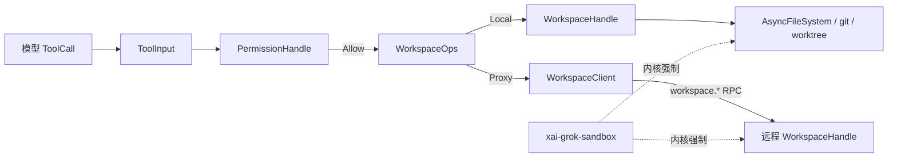
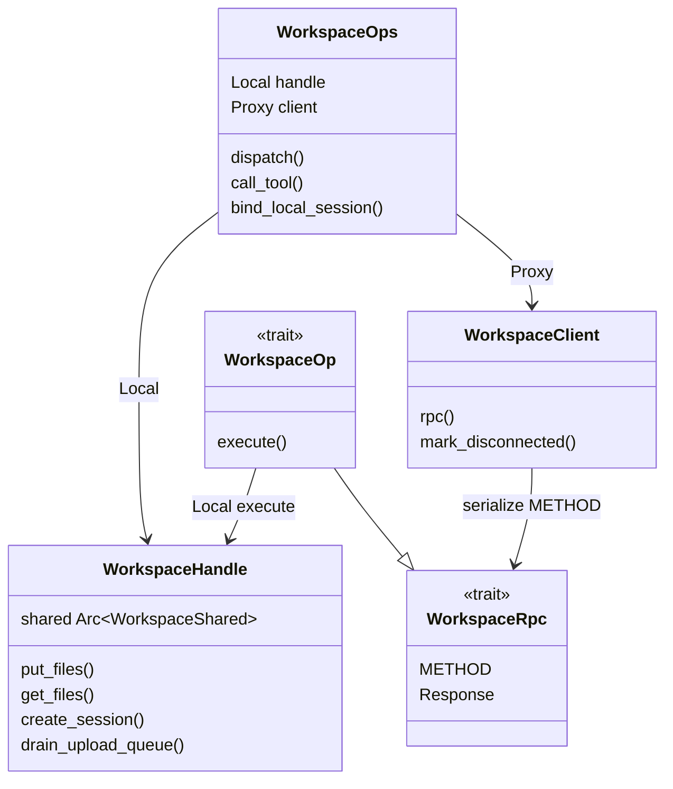
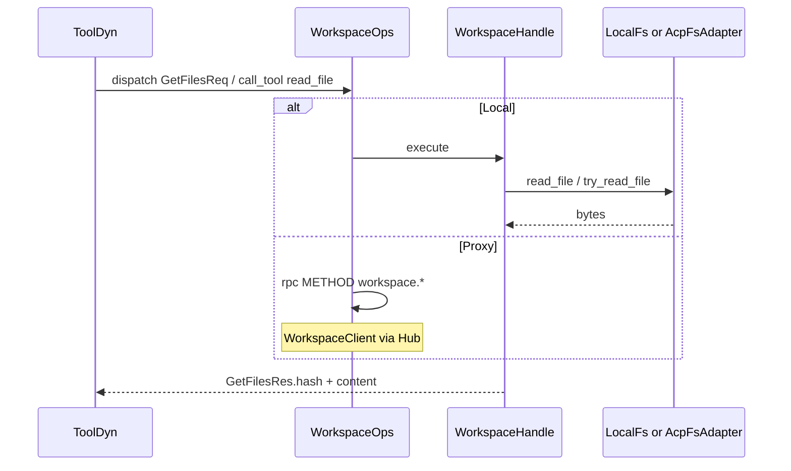
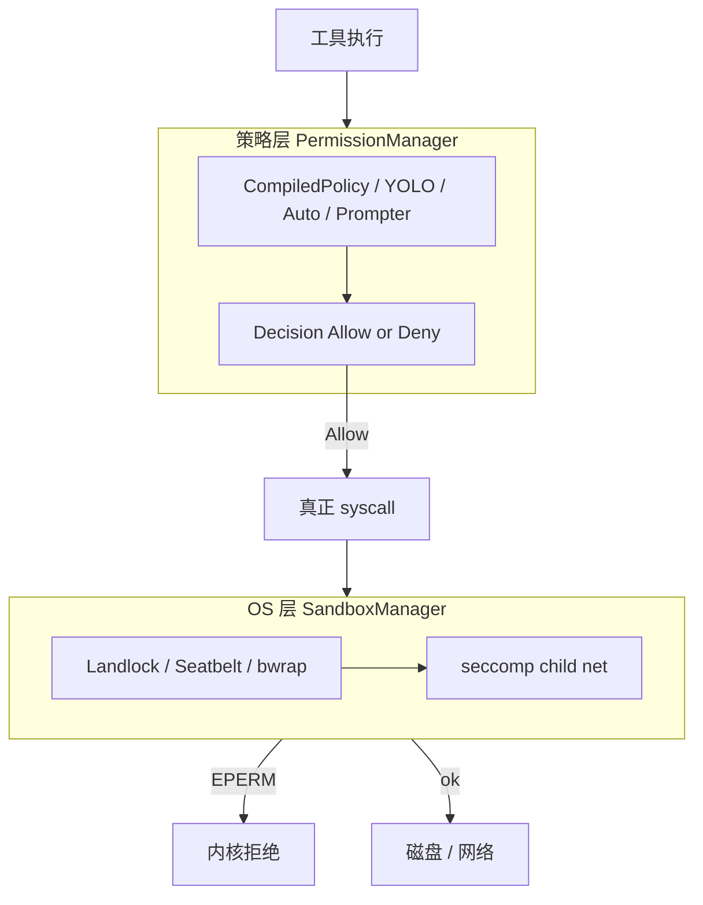

# 09 · Workspace、权限、沙箱与 Git

> 读完本篇应能：把所有宿主副作用收口到 `WorkspaceOps`；实现 Local/Proxy 双模；复现权限决策链（classification → rules → prompter）；并说明权限决策与 OS 沙箱是两层。上一篇：[08-工具协议与扩展体系.md](08-工具协议与扩展体系.md) · 下一篇：[10-认证网络遥测与更新.md](10-认证网络遥测与更新.md)

## 快速摘要

### 架构总览（模块与依赖）

Workspace 是 Agent 接触磁盘、Git、worktree 的唯一端口。`xai-grok-workspace-types` 持有 wire 类型与 `WorkspaceRpc`；`xai-grok-workspace-client` 是 Hub 上的 typed RPC 客户端；`xai-grok-workspace` 持有 `WorkspaceHandle`、Local 执行、权限 Actor、FS、Git、worktree。OS 层沙箱在独立 crate `xai-grok-sandbox`（Landlock/Seatbelt via `nono`，Linux 上另有 bwrap + seccomp）。Hunk 归因在 `xai-hunk-tracker`。路径类型在 `xai-grok-paths`。依赖方向：types → client / workspace；sandbox 被组合根与 shell 在进程启动时应用，不反向依赖 workspace。

### 核心调用序列（逐步逻辑）

1. 工具参数解析为 `xai_grok_tools::types::ToolInput`（shell `acp_session_impl/tool_calls.rs`）。
2. `AccessKind::from(&tool_input)` 把工具输入分类为 Read / Grep / Edit / Bash / MCP / WebFetch / WebSearch。
3. `PermissionHandle::request_with_path_context_resolved` 经 unbounded mpsc 发给权限 Actor；oneshot 回 `PermissionResolution`。
4. Actor：`GatePreflight::evaluate`（规则）→ YOLO / session grant / auto classifier → 必要时 `AcpPrompter`。
5. `Decision::Allow` 之后，工具经 `WorkspaceOps::call_tool` 或 `dispatch` 落到 `LocalFs` / git CLI / git2 / gix。
6. 写文件后 `HunkTrackerHandle::record_agent_write`；外部改动经 `xai-fsnotify` → `handle_file_change`。
7. OS 沙箱在 `main()` 早期 `apply_sandbox` → `SandboxManager::apply` + `install`，与步骤 3–4 独立。

### 易错点与边界条件

- 工具直接 `std::fs` / `Command` 会绕过权限、审计、Proxy 和 hunk 归因。
- `put_files` 顺序写、失败不回滚；结果未知时必须用 `get_files` 的 SHA-256 对账，不能盲目重试。
- 策略 `Deny` 在 YOLO 之前生效；bash 的 Ask 门会挡住 YOLO 快路径。
- `should_auto_allow_bash()` 只在沙箱 **已 applied** 时为真；configured-but-unapplied 不能当批准。
- `gix` status 的 `Some(0)` 表示无限线程，禁止传入；`xai-gix-status` 硬顶 8 并尊重 `RLIMIT_NPROC`。
- 权限允许 ≠ 内核允许。两层都要通过，副作用才真正发生。

---

## 目录

1. [Why：Agent 不能直接 `std::fs`](#1-whyagent-不能直接-stdfs)
2. [What：crate 地图与对象](#2-whatcrate-地图与对象)
3. [WorkspaceOps：Local vs Proxy](#3-workspaceopslocal-vs-proxy)
4. [WorkspaceHandle 与 `connect_local_workspace`](#4-workspacehandle-与-connect_local_workspace)
5. [FS API 与路径类型](#5-fs-api-与路径类型)
6. [Git / gix / jj](#6-git--gix--jj)
7. [HunkTracker](#7-hunktracker)
8. [Permission 全流程](#8-permission-全流程)
9. [Sandbox：OS 层](#9-sandboxos-层)
10. [Worktree pool](#10-worktree-pool)
11. [结果未知时的对账](#11-结果未知时的对账)
12. [权限 ≠ 沙箱](#12-权限--沙箱)
13. [关键调用关系表](#13-关键调用关系表)
14. [测试证据](#14-测试证据)
15. [如何重新实现](#15-如何重新实现)

---

## 1. Why：Agent 不能直接 `std::fs`

Grok Build 的工具跑在模型输出之后。如果 `read_file` / `search_replace` / `bash` 直接调用 `std::fs` 或 `std::process::Command`，会出现四件无法补救的事：

1. **无法代理**。ACP 宿主（编辑器）和远程 Workspace Server 必须把同一套工具指到另一台机器的磁盘。`WorkspaceOps::Local` 走 `WorkspaceHandle`；`Proxy` 把同一个 `WorkspaceRpc` 结构体序列化到 Hub WebSocket。工具代码不知道自己在哪边。
2. **无法审计**。权限 Actor 要记录 `PermissionEvent`（tool id、access kind、decision_reason、classifier verdict）。直接 syscall 没有 call id，也无法把「用户点了 AllowOnce」和一次工具调用闭合。
3. **无法归因**。`HunkTrackerActor` 靠 `record_agent_write` 区分 Agent 编辑与外部编辑。绕过 workspace 的写入会变成 `HunkSource::External`，或根本不被看见。
4. **无法与沙箱对齐**。进程级 Landlock/Seatbelt 拦的是「这个进程能不能碰这条路径」；权限拦的是「用户同不同意这次工具调用」。两层语义不同，必须都经过显式端口。

`file_system/fs.rs` 甚至给 `AsyncFileSystem::write_file` 留了 `TODO: handle atomic write`：连本地适配器都承认写文件是有承诺点的副作用，不能当成普通函数。



**必须保持的行为**：所有模型驱动的读/写/exec 都经过 `WorkspaceOps` 或会话绑定的 `FinalizedToolset`。  
**可以替换的实现**：Local 用 `tokio::fs` 还是 ACP `read_text_file`，由适配器决定。

---

## 2. What：crate 地图与对象

| crate | 职责 | 关键符号 |
|---|---|---|
| `xai-grok-workspace-types` | wire 类型、`WorkspaceRpc` trait、`METHOD` 常量 | `rpc::WorkspaceRpc`、`rpc::fs` / `git` / `hunks` / `worktree` |
| `xai-grok-workspace-client` | Hub 上的 typed 客户端 + 断连闩 | `WorkspaceClient::rpc`、`is_transport_fatal` |
| `xai-grok-workspace` | 本地执行、会话、权限、FS、Git、Hub 服务 | `WorkspaceOps`、`WorkspaceHandle`、`PermissionHandle` |
| `xai-grok-paths` | 绝对/相对 UTF-8 路径 | `AbsPathBuf`、`RelPathBuf`、`normalize_lexically` |
| `xai-fsnotify` | 单根目录文件系统事件广播 | `FsEventSource`、`FsEvent` |
| `xai-hunk-tracker` | 按文件的 diff hunk + 来源 | `HunkTrackerHandle`、`HunkSource` |
| `xai-gix-status` | gix status 线程预算 | `with_budgeted_thread_limit` |
| `xai-fast-worktree` | CoW / btrfs / overlay 创建与 pool sync | `WorktreeBuilder`、`WorktreeSync`、`WORKTREE_POOL_DIR` |
| `xai-grok-sandbox` | OS 沙箱 | `SandboxManager`、`ProfileName` |

`xai-grok-workspace/src/lib.rs` 把 `WorkspaceHandle`、`WorkspaceOps`、`HunkTrackerHandle`、权限模块一并 re-export，并提供 `init_metrics()`：空闲面板必须显示 `0` 而不是 “No data”。



---

## 3. WorkspaceOps：Local vs Proxy

定义在 `workspace_ops.rs`：

```text
enum WorkspaceOps {
    Local { handle: WorkspaceHandle },
    Proxy { client: WorkspaceClient },
}
```

构造：

- `WorkspaceOps::local(handle)`：扩展立刻可 `dispatch`；工具调用要先 `bind_local_session`。
- `WorkspaceOps::proxy(harness)`：`WorkspaceClient::new` 包一层 `ToolHarness`。
- `proxy_with_connected`：共享 `Arc<AtomicBool>`，Harness 的 `on_reconnect` 必须复位这面旗，否则断连闩会把后续 RPC 全部判死。

`dispatch<Op: WorkspaceOp>`：

| 模式 | 行为 |
|---|---|
| Local | `op.execute(handle, session_id).await`，进程内直接调 |
| Proxy | `serde_json::to_value(req)` → `rpc_raw(Op::METHOD, params)` → 解析 `RpcEnvelope` |

`call_tool` 是另一条路：Local 用 `handle.session(session_id).toolset().call(...)`；Proxy 检查 `client.is_connected()`，再 `harness().call`，消费 stream 的 Terminal。传输致命错误会 `mark_disconnected()`。

`bind_local_session` 的不变量（注释写死、测试钉死）：

- 首次创建会话时复用 Agent 的 `hunk_tracker` 和 `cwd`，避免「窗口 A 的 git 查询打到启动目录」。
- 安装的 toolset **保留 shell 自己的 terminal backend**；会话自造的 backend 闲置，只给 `drop_session` 去 SIGKILL。若从外部 toolset 领养 backend，teardown 会杀掉 shell 还在用的 PTY。
- Proxy 模式是 no-op：会话归远程 workspace-server。

`git_op_cwd` 测试 `git_op_cwd_uses_explicit_git_root_per_window` 证明：显式 `git_root` 覆盖 workspace 启动目录。多窗口必须各自带 repo 路径。

Wire 名由 `WorkspaceRpc::METHOD` 钉死，`pinned_workspace_method_wire_names` 测试防止改名 silently 破坏网关，例如：

- `workspace.repos_list`
- `workspace.hook_registry`
- `workspace.get_all_hunks`
- `workspace.worktree_create_from_worktree_sync`

---

## 4. WorkspaceHandle 与 `connect_local_workspace`

`WorkspaceHandle` 是 `Clone` 的薄柄，内部 `Arc<WorkspaceShared>`。`new(config)` 不创建隐式 main session——TUI 和 workspace-server 必须显式 `create_session` / `fork_session`。

`connect_local_workspace`（`handle.rs`）是 standalone `workspace_server` 与 TUI 进程内 server 的共享启动：

1. `resolve_workspace_home()`：`$GROK_WORKSPACE_HOME` 优先，否则 `<grok_home>/workspace`。
2. 构造 `WorkspaceSessionContextFactory`（auth + `GROK_CLI_CHAT_PROXY_BASE_URL`，默认 `https://cli-chat-proxy.grok.com/v1`）。
3. `WorkspaceConfig::new_for_proxy` + Hub URL。
4. 启动 `UploadQueue`；`GROK_WORKSPACE_DATA_COLLECTION_DISABLED != "false"` 时 **purge** 溢出项，否则 `recovery::run_startup_recovery` 按 sidecar SHA-256 重入队。
5. `spawn_blocking(worktree::run_auto_gc_best_effort)`。
6. `WorkspaceHandle::new_with_data_collection` → `connect_hub()`。
7. Prometheus：`startup_recovery` / `tool_catalog` / `hub_ws_connect` / `connect_hub` / `time_to_ready`。

`confine_fs_to_workspace_root`：standalone server 默认开（远程沙箱）；CLI leader 传 `false`。这是路径逃逸的第一道软件闸，不是沙箱。

优雅退出：`drain_upload_queue`，默认 SIGTERM 预算 45s（`GROK_WORKSPACE_TERMINATION_GRACE_MS`），preStop 标记 `/tmp/workspace-server.draining`。drain 开始后仍 spawn 的 producer 会计 `grok_workspace_producer_spawned_after_drain_total`（期望 0）。

---

## 5. FS API 与路径类型

### 5.1 `AsyncFileSystem`

`file_system/fs.rs`：

| 方法 | 契约 |
|---|---|
| `root()` | 相对路径解析锚 |
| `exists` / `read_file` / `write_file` / `delete_file` | 基本 IO |
| `try_read_file` | 默认 exists+read；后端应覆写成一次 syscall / 一次 RPC |

`AsyncFsWrapper` 接受任何 `ToAbsPath`（`AbsPathBuf`、`RelPathBuf`、`&Path`），用 `fs.root()` 拼绝对路径。

`LocalFs`（`local_fs.rs`）是 `tokio::fs` 适配器：`write_file` 会 `create_dir_all` 父目录。这是 **适配器内部** 允许的 `tokio::fs`，不是 Agent 工具代码。

`AcpFsAdapter` 把同一 trait 翻成 ACP `read_text_file` / `write_text_file`；`delete_file` 返回错误（协议尚未支持）。远程编辑器当宿主时，工具仍调同一套 FS 端口。

### 5.2 路径

`xai-grok-paths::AbsPathBuf` 要求绝对 + UTF-8。`normalize_lexically` **不碰文件系统**：只折叠 `.` / `..`。注释明确：若中间是 symlink，词法归一会指到与 OS 不同的目标。真正做 containment 的调用方必须 canonicalize，或保留原始拼写。

`contains_path` 用词法归一做前缀判断，适合 UI / 规则 glob，不适合当唯一安全边界。

### 5.3 列表、搜索、通知

- `walk.rs`：分页 list + 有上限的 ranged read（`MAX_LIST_COLLECT`、`MAX_READ_BYTES`）。
- `fuzzy.rs` + `FuzzySearchManager`：打开 picker 时后台 walk；空 query 会 `restart_walk`。
- `content_search_streaming`：给 grep 类工具。
- `xai-fsnotify`：单根、单广播通道的 `FsEvent`。多根（父仓库 + worktree）的组合在 workspace 层做 git 富化后变成 `WorkspaceEvent`。`SETTLE_MS` 防抖 checkout 风暴。



---

## 6. Git / gix / jj

`session/git.rs` 把两种实现叠在一起：

- **CLI** `git_cli`：stage / commit / push 等简单动作。一律加 `--no-optional-locks`，避免后台 stat-cache 刷新制造 `index.lock`。必要锁（`git add`）不受影响。stdin 置 null，并注入 `GIT_AUTH_SUPPRESSION_ENVS`，禁止交互式凭据提示。
- **libgit2** `git2::Repository`：结构化 status / diff。
- **jj**：只读走 `jj_cli`（`--ignore-working-copy`）；`describe` / `new` / `restore` 走 `jj_cli_mut`。`detect_vcs_kind` 看 `.jj/` 是否与 `.git/` 并列。

`GitDiscoveryResult` 三分：`Found` / `NotARepo` / `DiscoveryFailed`。权限错误或损坏仓库 **不能** 当成 NotARepo，否则 UI 会谎称「不在 git 里」。

`file_system/git_status.rs` 给 system prompt 的紧凑状态 **故意用 git CLI**：注释写 libgit2 status 在大仓库上慢 5–10 倍。stdout ≥ 1 MiB 视为错误，整段 `<git_status>` 丢弃，而不是截断（截断会让模型看见半份 porcelain）。

`xai-gix-status` 解决另一个真实故障：`gix-features` 的 `in_parallel` 在 `panic=abort` + 紧 `RLIMIT_NPROC` 下 spawn 失败会 **直接 abort 进程**。`compute_gix_status_thread_limit`：

- 硬顶 8；
- `Some(0)` 在 gix 里等于无限，禁止传入；
- `GROK_GIX_STATUS_THREADS=N`（N≥1）可强制覆盖；
- Unix 上读 soft nproc，预留 `OUTER_RESERVE=8`。

调用点：`xai-fast-worktree/src/git/status.rs`、`xai-hunk-tracker/src/actor/git.rs` 都包 `with_budgeted_thread_limit`。

`GIT_STATUS_CACHE_TTL` = 2 秒，按 commit hash 失效。

---

## 7. HunkTracker

`xai-hunk-tracker` 是标准 Actor：`HunkTrackerHandle` 发 `HunkTrackerCommand`，状态无锁，事件从 `event_tx` 出去。

`HunkSource`：

| 变体 | 含义 |
|---|---|
| `AgentEdit { prompt_index }` | 工具在某次 prompt 写下的 |
| `ExternalEditOnAgentFile` | 用户改了 Agent 碰过的文件 |
| `External` | Agent 没碰过；仅 `TrackingMode::AllDirty` 跟踪 |

Handle API：

- `record_agent_write(path, content, prompt_index, previous_content)`：fire-and-forget。`previous_content` 是 dirty worktree 上文件不在 HEAD 时的 fallback baseline。
- `handle_file_change` / `handle_file_deleted`：fs_notify 入口。
- `hunk_action` / `file_action` / `turn_action` / `all_action`：Accept/Reject，oneshot 等待。
- `noop()`：立刻丢掉 receiver，测试用。

Workspace 侧把内部 `Hunk` 映射成 `HunkWire`（`workspace_ops.rs` 的 `hunk_to_wire`），RPC 与 Actor 状态分离。`xai-grok-workspace-types/src/types/hunk.rs` 仍是精简子集，文件头 TODO 写明尚未与 tracker 完全对齐——重实现时不要把 types crate 的 `Hunk` 当成完整领域模型。

Agent 写路径：工具成功写入 → `record_agent_write` → Actor 算 diff → `HunkEvent::HunkAdded`。用户在编辑器改同一文件 → fs_notify → `HandleFileChange` → 可能变成 `ExternalEditOnAgentFile`。

---

## 8. Permission 全流程

权限是 **会话级 Actor**，不是函数调用。`spawn_permission_manager` → `PermissionHandle::Actor { cmd_tx, yolo_state, auto_state, ... }`。另有 `AllowAll` 变体（测试 / 显式旁路）。

入口在 shell：`acp_session_impl/tool_calls.rs` 在 plan-mode 门之后调用 `permissions.request_with_path_context_resolved(access_kind, tool_call_update, path_context, session_id, ...)`。`AccessKind::from(&ToolInput)` 的映射是分类的第一刀：`ReadFile`→Read，`SearchReplace`/`Write`→Edit，`Bash`→Bash，`MCPTool`→MCP（带 raw JSON args，给分类器看行为而不是名字）。

### 8.1 请求生命周期

```mermaid
sequenceDiagram
    participant TC as tool_calls.rs
    participant PH as PermissionHandle
    participant Actor as Permission Actor
    participant GP as GatePreflight
    participant Clf as PermissionClassifier
    participant Pr as AcpPrompter
    TC->>PH: request_with_path_context_resolved
    PH->>Actor: PermissionCommand::Request + oneshot
    Actor->>GP: evaluate policy + bash gates
    alt PolicyDeny
        Actor-->>TC: Decision::PolicyDeny
    else YOLO and not shell Ask
        Actor-->>TC: Allow reason=yolo
    else session grant
        Actor-->>TC: Allow reason=session_grant
    else auto Classify
        Actor->>Clf: classify with BashSecurityAssessment
        Clf-->>Actor: Allow / Block / Unavailable
    else needs user
        Actor->>Pr: ACP RequestPermission
        Pr-->>Actor: PromptOutcome
        Actor-->>TC: Allow or Reject
    end
```

`InFlightGuard` 在 send 前 +1、drop 时 -1，保证所有返回路径上 `queue_depth` 平衡。channel 发送失败 → `Reject("permission manager unavailable")` 且 `event=None`（调用方禁止伪造分析字段）。

### 8.2 决策顺序（源码顺序，不可重排）

`manager/mod.rs` 的 `Request` 臂，按注释与控制流：

1. **`GatePreflight::evaluate`**：直接规则 + bash 命令门 + shell-file 门。Deny > Ask-rule-match > Ask-fail-closed。
2. **Policy Deny**：在 YOLO **之前** 强制 `Decision::PolicyDeny`。测试 `sourced_script_dont_ask_denies_without_prompt` 等钉死「托管 deny 压过 YOLO」。
3. **YOLO**：`yolo_mode && !shell_forced_prompt` → Allow，`decision_reason=yolo`。`yolo_pin`（`requirements.toml` 的 `disable_bypass_permissions_mode`）在 spawn 时读一次并缓存；`clamp_yolo` 让客户端永远无法在 pin 下打开 always-approve。
4. **Session grant**：MCP always-allow、web_fetch 域名、`allow_edits_for_session`、bash 精确/安全命令。Ask 地板存在时 **不** 短接。
5. **Auto + 干净评估 + policy Allow**：无 security findings 时，宽规则 `Bash(*)` 可跳过分类器；有 findings 必须进分类器（防 HackerOne 类绕过）。
6. **Auto classifier**：`auto_mode_fast_path` → Allow / PromptUser / Classify。Classify 把冻结的 `BashSecurityAssessment` 交给 `PermissionClassifier`；`respond_to.closed()` 则放弃分类并记 `requester_gone`。
7. **Prompter**：`AcpPrompter` 按 `ClientType` 组选项（TUI/Pager 有 bash 词选择 + `enable-always-approve`；Web 用简单选项）。Hub HITL 走 `request_permission_via_hub`。

`AUTO_DENY_CONSECUTIVE_LIMIT = 3`，`AUTO_DENY_TOTAL_LIMIT = 20`。连续/累计拒绝达限后强制提示，文案要求模型改用更安全做法、不要绕过。

### 8.3 Rules DSL

`permission/rules.rs` 的 `parse_permission_rule`：

- `Bash(...)` / `Read(...)` / `Edit|Write(...)` / `MCPTool(...)` / `Grep|Glob(...)` / `WebFetch(...)` / `WebSearch(...)`
- 裸 `Bash` 等于该工具类型的通配
- `WebFetch(domain:example.com)` → `PatternMode::Domain`
- `Bash(cmd:*)` 尾部 `:*` 是前缀惯用法
- `EnterWorktree` / `NotebookEdit` / `NotebookRead` 返回 `UnsupportedToolPrefix`，规则被跳过而不是当成 Any

`CompiledPolicy` 预编译 glob。`GateDecision` 保留 Ask 的 provenance：规则匹配的 Ask 在 auto 模式仍绑定提示；分析失败的 fail-closed Ask 才交给分类器（`admits_auto_classifier` / `defers_gate_ask`）。

`permissions.defaultMode`：`dontAsk`→`PromptPolicy::Deny`；`auto`→`PromptPolicy::Auto` 并在非 YOLO 时 seed `auto_state`。

### 8.4 Prompter 与持久化

- `ALLOW_EDITS_SESSION_OPTION_ID`（`allow-edits-session`）：**仅内存**，不写 `permission.toml`。加载时若发现历史 `edit_policy=Allow`，会降回 Ask 并 persist——旧版本把「本次会话允许编辑」写盘，重启后仍生效，与标签不符。
- `ENABLE_ALWAYS_APPROVE_OPTION_ID`：shell 映射为 `AllowOnce`；Pager 另发 `set_yolo_mode(true)` 并 persist `[ui] permission_mode = "always-approve"`。不认识该 id 的旧客户端最坏只批准当前一次。
- `remember_tool_approvals`：显式 grant 可以满足 ask 规则（问一次，记住）。

`PermissionEvent.decision_reason` 的词表由 `manager/reasons.rs` 的 `ALL` 独占；遥测枚举有 drift 测试，新增 reason 必须两边一起改。

---

## 9. Sandbox：OS 层

`xai-grok-sandbox` 文档自己写明：在 **进程启动时 apply 一次**，覆盖进程内 `tokio::fs` 和子进程。进程级网络保持开放（要打 LLM API）；Linux 子进程网络用 seccomp 按次拦截。

`ProfileName`：`workspace` / `devbox` / `read-only` / `strict` / `off` / `Custom(String)`。`read-only` 与 `strict` 配置 `restrict_network`。

`SandboxManager::apply`：

- `Off`：直接返回。
- 需要 hook write-deny 时：`ensure_grok_hook_slots` + 可能的 namespace lockdown。
- `Sandbox::support_info()` 不支持则 **降级继续**，记 `apply_failed` 事件，不 abort。
- 成功则 `applied=true`，不可逆。
- 无 `enforce` feature（含 musl）时 apply 是 stub。

`install()` 把状态放进 `OnceLock<GlobalSandboxState>`。`is_active()` 看 applied；`requested_confinement_profile()` 看启动时请求的非 off 名——requested-but-unapplied 仍要警告用户，fail-closed 以请求为准。

Linux bwrap：`bwrap_reexec_for_profile` 在尚未 `__GROK_INSIDE_BWRAP` 时重建命令：`--cap-drop ALL`、`--bind / /`、deny_write 做 `--ro-bind`、deny_read 用 mode 000 的 placeholder bind-over。placeholder 文件名带 PID，避免并发 grok 进程互相 chmod。deny glob 在启动时展开；**之后新建的匹配文件不受覆盖**（源码 `tracing::warn`）。展开失败则拒绝启动。

`should_auto_allow_bash()` = `AUTO_ALLOW_BASH && is_active()`。权限层的 `sandbox_may_auto_allow_bash` 还要看 bash request floor（危险命令 findings 不能靠沙箱静默放行）。

`child_net.rs`：seccomp 禁止 `unshare`/`setns`/带 `CLONE_NEW*` 的 clone；`clone3` 返回 ENOSYS 让 libc 回退到旧 clone，避免 BPF 读不到 clone3 参数结构体。

配置合并：`~/.grok/sandbox.toml` 与项目 `.grok/sandbox.toml`。项目 **只能新增 profile 名**，不能重定义全局已有名——否则恶意仓库可以掏空企业 deny 列表却沿用可信名字。

Pager 入口：`async_main` 里 `xai_grok_shell::config::apply_sandbox`。resume 时 `--sandbox` 与会话保存的 profile 冲突则 exit 1。

---

## 10. Worktree pool

`xai-fast-worktree` 的创建路径：

1. `git worktree add --no-checkout`（只建元数据）；
2. 并行 CoW clone（hash 分片）；
3. 可选脏文件 / ignored 文件复制；
4. Linux 上 Btrfs snapshot（O(1)）；无 `CAP_SYS_ADMIN` 时走注册的 `BtrfsDelegate`；
5. `WorktreeSync` 把预创建 pool 成员同步到源仓库 HEAD + dirty 状态。

目录约定（`discovery.rs`）：`<grok_home>/worktrees/<repo>/<wt>` 与 `<grok_home>/worktree_pool/...`。深度钉死为 2。跳过 `.ready` / `.claimed` / `.claiming` 后缀。

`WorktreeSync` 注释解释为何脏状态用 `git status --porcelain=v2 -z` 而不是 `gix::status()`：gix 的 index-worktree iter 分不清 staged 列与 worktree 列（`D ` vs ` D`）。`collect_source_dirty_state` 可在多个 sync 间共享（`Bytes` 引用计数），避免大仓库上每次 ~1.4s。

Workspace 层 `worktree/mod.rs`：

- `claim_worktree_in_progress(session_id)` 进程内去重；Proxy 下 prepare 与 create 是不同进程，正确性不依赖这把锁。
- `prepare_*` 只 **读** in-progress 标记：若在 prepare 里 insert，Proxy 重试会永远卡死。
- `BackgroundCopyContext` 在 remove 时取消 ignored-file 后台拷贝。
- `CreationMode`：Linked / Standalone / GitCheckout。

`count_tracked_files` 用 gix 读 index header，O(1) 决定仓库是否大到值得进 pool。

---

## 11. 结果未知时的对账

写文件的承诺点在 `WorkspaceHandle::put_single_file`：`tokio::fs::write`（或 append+flush）成功后才计算 `sha256_hex` 填入 `PutFileResult.hash`。`put_files` **顺序写、不回滚**：文件 N 失败时 1..N-1 已在磁盘。调用方必须看 per-file `ok`/`hash`。

结果未知（超时、连接断开、进程被杀）时：

1. **不要**再发一遍同样的 `put_files`——append 会重复，非幂等 write 可能覆盖用户随后的编辑。
2. 用 `get_files`：每条结果带 `exists`、`content`、**全文件** SHA-256。与意图内容的 hash 比较。
3. hash 已匹配 → 上次其实成功，当作完成。
4. 不存在或 hash 不同 → 再写一次，或向用户报告冲突。

Upload 队列的启动恢复是同一模式的磁盘版：`recovery::run_startup_recovery` 扫 `upload_queue/*.meta.json`，校验 temp 的 sha256，匹配则 `enqueue_recovered`（保留原始 `enqueued_at`，避免重启滑动 max-age）；`sha_mismatch` / `missing_tmp` / `parse_error` 记 `grok_workspace_orphan_lost_total` 并删除。错误吞进 `RecoveryReport`，不 panic 启动。

Hunk 侧：Agent 写入若结果未知，不要 `record_agent_write` 假内容；先读盘再记录，否则 baseline 会漂。

取消：`CancellationToken` 只停止未来工作。已经 `write` 成功的文件不会自动还原——还原是 hunk Reject / rewind 的另一次副作用。

---

## 12. 权限 ≠ 沙箱



| | 权限 | 沙箱 |
|---|---|---|
| 时机 | 每次工具调用 | 进程启动一次，不可逆 |
| 决策者 | 规则、用户、分类器 | 内核 LSM / 容器 |
| 失败形态 | `PolicyDeny` / `Reject` 回给模型 | `EPERM` / 子进程直接失败 |
| 能否 YOLO | 可以（受 pin 与 Ask 门约束） | 不能「批准」一次越界路径 |
| bash 自动过 | `SAFE_COMMAND` / session grant / `sandbox_auto` 仅当 `is_active()` | `should_auto_allow_bash` 依赖 applied |

常见抄错：以为开了 `workspace` profile 就可以关掉权限提示。沙箱只保证「出不了配置的路径集合」；`rm -rf` 工作区内部仍然需要权限层。反过来，用户点了 Allow 但 Landlock 没有该路径的 write cap，syscall 仍失败——工具必须把 OS 错误当成真实结果，不能当成权限拒绝去重试另一条规则。

`should_restrict_child_network()` 仅在 **applied && 配置了 restrict_network && Linux**。macOS Seatbelt 路径不要假设有同等 seccomp。

---

## 13. 关键调用关系表

| 调用方 | 关系 | 被调用方 | 触发与输入 | 返回与后续 | 错误 / 状态 / 副作用 |
|---|---|---|---|---|---|
| `tool_calls.rs` 工具循环 | 调用 | `PermissionHandle::request_with_path_context_resolved` | `AccessKind`、ACP `ToolCallUpdate`、`RequestPathContext` | `PermissionResolution` | mpsc 失败 → Reject；无 event |
| `PermissionHandle` | 发命令 | `PermissionCommand::Request` | oneshot `respond_to` | Actor 单线程处理 | `InFlightGuard` 计并发 |
| Permission Actor | 调用 | `GatePreflight::evaluate` | `CompiledPolicy`、access、request cwd、auto_mode | `policy_decision` / `shell_forced_prompt` | Deny 在 YOLO 前 |
| Permission Actor | 调用 | `PermissionClassifier::classify` | tool 名、access、`ClassifierContext` | `ClassifierOutcome` | timeout → Unavailable；requester gone → Cancelled |
| Permission Actor | 调用 | `AcpPrompter` / `request_permission_via_hub` | 按 `ClientType` 的 options | `PromptOutcome` | 用户取消 → `Decision::Cancelled` |
| `WorkspaceOps::dispatch` | 动态分派 | `WorkspaceOp::execute` 或 `WorkspaceClient::rpc` | `Op::METHOD` | `Op::Response` | Proxy 解析 `RpcEnvelope` |
| `WorkspaceOps::call_tool` Local | 调用 | `FinalizedToolset::call` | name、args、call_id、session_id | `ToolRunResult` | 未 bind → `session_not_found` |
| `WorkspaceHandle::put_files` | 调用 | `put_single_file` → `tokio::fs::write` | `PutFileEntry` | per-file `hash` | 部分成功不回滚 |
| 写工具成功后 | 发命令 | `HunkTrackerHandle::record_agent_write` | path、content、prompt_index | fire-and-forget | Actor 更新 hunk |
| `xai-fsnotify` | 发命令 | `handle_file_change` | 路径 | 可能 External hunk | settle 防抖 |
| `connect_local_workspace` | 调用 | `recovery::run_startup_recovery` | workspace_home、UploadQueue | `RecoveryReport` | sha 不匹配删除 sidecar |
| `pager-bin::async_main` | 调用 | `apply_sandbox` → `SandboxManager::apply` | profile + cwd | 不可逆 applied | 不支持则降级 |

谁创建对象：

- `PermissionHandle`：session 启动时 `spawn_permission_manager_with_hub`（生产带 remember gate + 可选 Hub transport）。
- `WorkspaceHandle`：Local 测试用 `new`；server 用 `connect_local_workspace`。
- `WorkspaceOps`：shell 在装配 Agent 后 `local(handle)` 并 `bind_local_session`；远程模式 `proxy(harness)`。
- `HunkTrackerHandle`：`HunkTrackerActor::spawn`，由 session 持有并注入 workspace session。

---

## 14. 测试证据

| 测试 / 位置 | 钉住的行为 |
|---|---|
| `workspace_ops.rs::git_op_cwd_uses_explicit_git_root_per_window` | 每窗口 git_root |
| `pinned_workspace_method_wire_names` | RPC METHOD 字符串 |
| `put_files_req_round_trip` | PutFiles 序列化 |
| `permission/manager`：YOLO 不能绕过托管 deny；`env -S` 高置信 PolicyDeny | 策略优先于 YOLO |
| `yolo_pin_clamps_set_yolo_mode` | pin 同步夹紧 Arc |
| `bash_safe_command_without_policy_auto_allows_without_prompt` | 安全命令快路径 |
| `sandbox`：`bwrap_reexec_returns_none_inside_bwrap`；deny_read bind-over；hook ancestor RW 先于 leaf RO | bwrap 计划 |
| `requires_read_deny_only_for_custom_profile_with_deny` | 自定义 deny 才强制 read-deny |
| `xai-gix-status` nproc / `Some(0)` 断言 | 防 abort |
| `xai-fast-worktree` overlay / pool 集成测试 | CoW 与 sync |
| `xai-fsnotify/tests/integration.rs` | 事件因果流 |
| `init_metrics_is_idempotent_and_registers_baselines` | 指标 0 基线 |

本篇未实际跑测试；以上为静态对照。覆盖缺口：`AsyncFileSystem::write_file` 的原子写仍是 TODO；ACP `delete_file` 无协议；types crate 的 `Hunk` 与 tracker 未对齐。

---

## 15. 如何重新实现

建议顺序：

1. `AbsPathBuf` + `AsyncFileSystem` + `LocalFs` + wrapper。单测相对路径解析与 `try_read_file` 的 NotFound。
2. `WorkspaceRpc` trait + `dispatch` 的 Local 臂。先不要 Hub。
3. `PermissionHandle` Actor：Deny 规则 → YOLO → prompt。用假 Prompter。
4. 把工具执行接到「先 permission 再 FS」。
5. `HunkTrackerActor` + fs_notify。
6. git CLI 封装与 `GitDiscoveryResult` 三分。
7. `SandboxManager` 作为启动时可选层；测试用 `off`。
8. Proxy：同一 request 结构体走 RPC。
9. worktree pool 与启动 recovery。

验收：

- 工具代码路径上搜不到业务性 `std::fs::write`。
- 关沙箱、关 YOLO 时，Edit 必出 prompt。
- 托管 Deny 在 YOLO 下仍拒绝。
- `put_files` 中途失败返回 per-file 结果，已写文件仍在。
- 断开 Proxy 后 `call_tool` 返回网络错误而不是假成功。

阅读源码建议顺序：`workspace_ops.rs`（enum + dispatch + call_tool）→ `handle.rs` 的 `connect_local_workspace` / `put_files` → `permission/manager/mod.rs` Request 臂 → `gate_preflight.rs` → `prompter.rs` → `xai-grok-sandbox/src/lib.rs` → `xai-hunk-tracker/src/handle.rs` → `session/git.rs` → `xai-fast-worktree/src/sync.rs`。

---

## 本篇涉及的真实文件

| 路径 | 角色 |
|---|---|
| `crates/codegen/xai-grok-workspace/src/lib.rs` | crate 出口、`init_metrics` |
| `crates/codegen/xai-grok-workspace/src/workspace_ops.rs` | Local/Proxy、`WorkspaceOp`、`dispatch`、`call_tool` |
| `crates/codegen/xai-grok-workspace/src/handle.rs` | `WorkspaceHandle`、`connect_local_workspace`、`put_files`/`get_files` |
| `crates/codegen/xai-grok-workspace/src/permission/mod.rs` | 权限模块出口 |
| `crates/codegen/xai-grok-workspace/src/permission/types.rs` | `AccessKind`、`Decision`、`PermissionCommand`、`PermissionEvent` |
| `crates/codegen/xai-grok-workspace/src/permission/manager/mod.rs` | Actor 决策环 |
| `crates/codegen/xai-grok-workspace/src/permission/manager/request_classification.rs` | 分类状态机、deny 限额 |
| `crates/codegen/xai-grok-workspace/src/permission/manager/reasons.rs` | `decision_reason` 词表 |
| `crates/codegen/xai-grok-workspace/src/permission/rules.rs` | 规则 DSL |
| `crates/codegen/xai-grok-workspace/src/permission/policy.rs` | `CompiledPolicy`、`GateDecision` |
| `crates/codegen/xai-grok-workspace/src/permission/gate_preflight.rs` | 规则预检 |
| `crates/codegen/xai-grok-workspace/src/permission/prompter.rs` | ACP 选项与 outcome 映射 |
| `crates/codegen/xai-grok-workspace/src/permission/auto_mode/mod.rs` | 分类器、fast path、findings |
| `crates/codegen/xai-grok-workspace/src/file_system/` | FS trait、LocalFs、ACP、fuzzy、walk |
| `crates/codegen/xai-grok-workspace/src/session/git.rs` | git/jj CLI 与发现 |
| `crates/codegen/xai-grok-workspace/src/worktree/mod.rs` | worktree 生命周期 |
| `crates/codegen/xai-grok-workspace/src/recovery.rs` | 上传队列 SHA 对账 |
| `crates/codegen/xai-grok-sandbox/src/lib.rs` | `SandboxManager`、bwrap |
| `crates/codegen/xai-grok-sandbox/src/profiles.rs` | profile 解析与配置合并 |
| `crates/codegen/xai-hunk-tracker/src/{lib,handle,types}.rs` | hunk Actor |
| `crates/codegen/xai-gix-status/src/lib.rs` | gix 线程预算 |
| `crates/codegen/xai-fast-worktree/src/{lib,sync,discovery}.rs` | pool 与 sync |
| `crates/codegen/xai-fsnotify/src/lib.rs` | FS 事件源 |
| `crates/codegen/xai-grok-paths/src/lib.rs` | `AbsPathBuf` |
| `crates/codegen/xai-grok-workspace-types/src/rpc/mod.rs` | `WorkspaceRpc` |
| `crates/codegen/xai-grok-workspace-client/src/lib.rs` | Proxy 传输 |
| `crates/codegen/xai-grok-shell/src/session/acp_session_impl/tool_calls.rs` | 工具循环里的权限请求 |
| `crates/codegen/xai-grok-pager-bin/src/main.rs` | `apply_sandbox` 调用点 |

## 自检问题

1. 为什么 `bind_local_session` 不能把外部 toolset 的 terminal backend 装进 workspace session？
2. `GatePreflight` 的 fail-closed Ask 和 rule-match Ask 在 auto 模式下分别去哪？
3. `put_files` 写到一半失败，调用方怎样判断哪些文件已经提交？
4. `should_auto_allow_bash` 在 sandbox apply 失败但仍配置了 `strict` 时是什么值？
5. 为什么 gix status 不能传 `thread_limit = Some(0)`？
6. 权限 Allow 之后 Landlock 返回 EPERM，应该回给模型什么？要不要当权限拒绝重试？

下一篇：[10-认证网络遥测与更新.md](10-认证网络遥测与更新.md)
