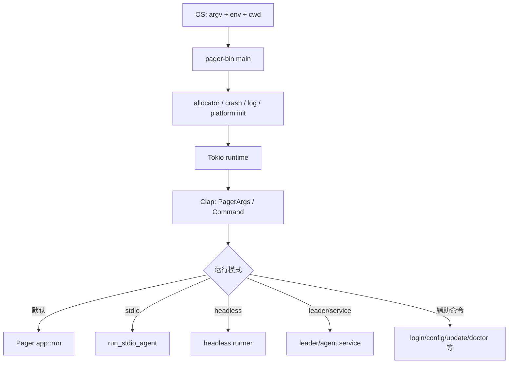
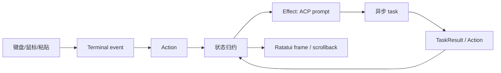
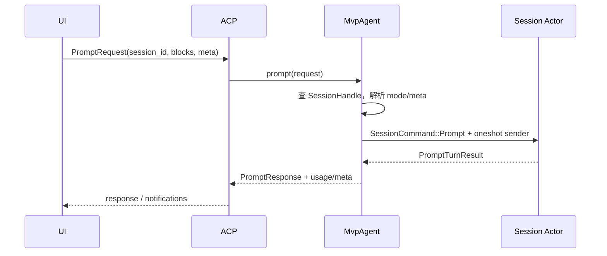
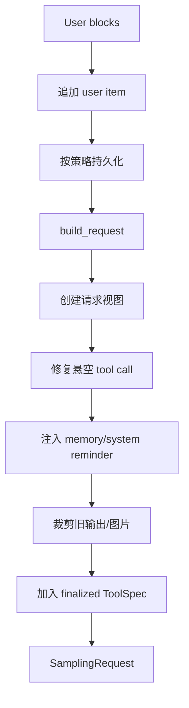
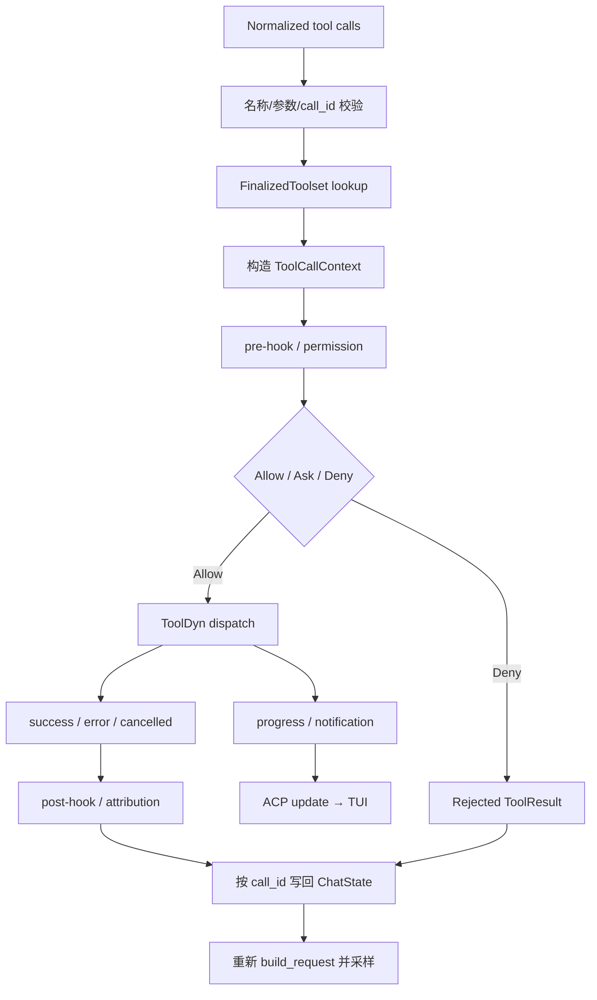
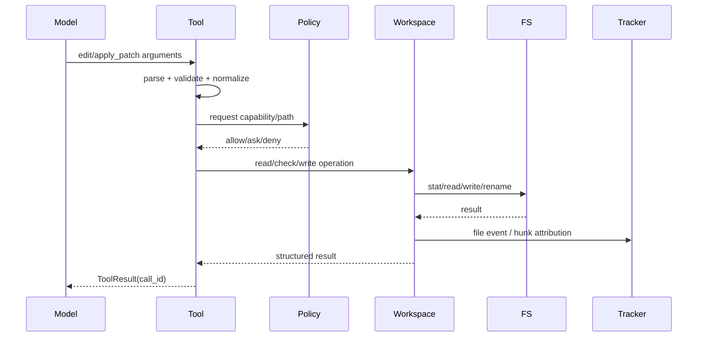
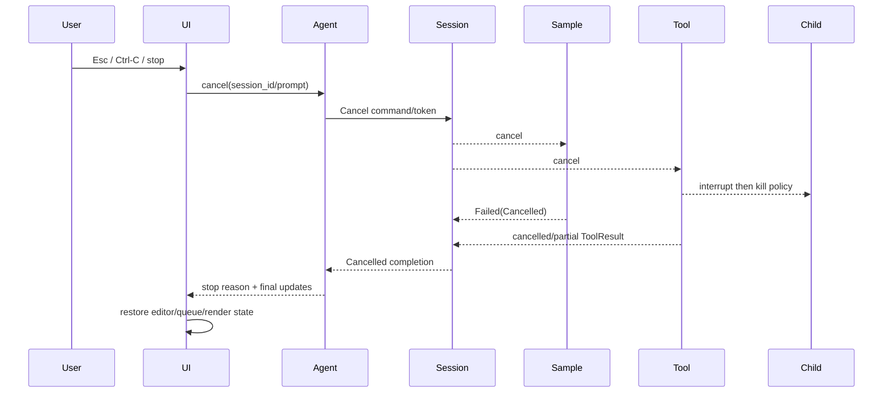

# 跨模块完整运行链

## 1. 为什么需要单独看跨模块链路

逐 crate 阅读能看清局部实现，却容易误判“成功”的含义。例如：

- TUI 把 Prompt 写入 ACP transport，不代表 Session 已接受；
- Session 把命令发给 ChatState Actor，不代表磁盘已持久化；
- Sampler 收到若干 token，不代表模型回复已经完成；
- 文件系统调用成功，不代表工具结果已经写回对话；
- 用户看到停止动画，不代表子进程已经退出。

本章把入口、会话、采样、工具和 UI 串成一条完整链，并在每个边界标注事实和失败语义。

## 2. 运行参与者

| 参与者 | 主要职责 | 主要事实 |
|---|---|---|
| `xai-grok-pager-bin` | 进程初始化与模式分发 | 本次进程采用的启动模式 |
| Pager/TUI | 输入、展示、modal、scrollback | 当前交互和展示状态 |
| ACP client/server | 跨边界请求、响应和 notification | 请求路由与协议关联 |
| `MvpAgent` | 协议到内部会话命令的适配 | session handle 路由 |
| Session Actor | 当前 Prompt、模型轮次、工具执行、取消 | 会话运行状态 |
| ChatState Actor | 对话顺序、usage、prompt index | 规范对话状态 |
| Sampler | 模型 HTTP/流协议适配 | 当前 attempt 的采样事件 |
| Tool registry/dispatcher | 工具发现、schema、调用路由 | finalized tool set |
| Workspace | 文件、Git、命令和主机事件 | 主机侧事实 |
| Persistence | 会话日志/快照 | 可跨进程恢复的会话事实 |

## 3. 进程启动

入口可从 `crates/codegen/xai-grok-pager-bin/src/main.rs` 开始。同步 `main()` 先建立进程级环境，再创建 Tokio runtime 并进入异步入口。这种写法让 allocator、崩溃处理、日志和平台初始化发生在 runtime 之前。



### 3.1 启动阶段的错误边界

- 参数组合错误：Clap 层尽早拒绝；
- 配置错误：类型化加载/校验边界拒绝，不能带着半合法配置启动；
- 认证失败：可进入登录/刷新流程，或在无交互模式中返回明确错误；
- 终端初始化失败：不得继续假装 TUI 可用；
- Agent/ACP 连接失败：恢复终端后展示诊断；
- 启动中断：已创建的子任务和子进程应被取消或回收。

## 4. TUI 提交 Prompt

TUI 的本质是单写者状态机：输入事件和异步结果都变成 action，由 event loop 顺序修改 view state。耗时操作被描述为 effect，在后台执行后再把结果送回 event loop。



提交时至少产生三个不同事实：

1. 编辑器草稿被读取；
2. UI 进入 queued/running 等乐观展示状态；
3. ACP 请求真正发送。

这三步不能合并理解。若请求发送失败，草稿是否恢复、队列指示是否清除、错误展示放在哪里，都由 TUI 状态机明确处理。

## 5. ACP 到 Session Actor

`MvpAgent::prompt` 的角色是协议适配，不应承载完整模型循环。典型过程：



### 5.1 两类 channel 的职责

- `mpsc`：多个协议请求或内部任务向同一个 Session Actor 发送命令；
- `oneshot`：一条 Prompt 命令对应一个最终结果。

`mpsc::send().await` 成功只说明命令进入 channel。只有 oneshot 返回才能说明 Actor 为本请求形成了结果；若结果还需要持久化保证，则必须继续检查 persistence ack。

### 5.2 Actor 串行化了什么

- 当前 Prompt 是否正在运行；
- 新 Prompt 是排队、插话还是立即拒绝；
- 当前 sampling/tool task 属于哪个 prompt；
- 配置更新何时对后续轮次生效；
- 取消应终止哪棵任务树；
- 一轮结束后何时启动队列下一项。

Actor 不会自动让文件系统副作用变成事务，也不会让跨进程消息 exactly-once。

## 6. ChatState 构建模型请求

收到可运行 Prompt 后，会话把用户内容交给 ChatState。ChatState 不是简单的 `Vec<String>`，而是带类型、顺序和工具闭合关系的 conversation。



必须区分：

- live conversation：会话事实；
- request view：为本次模型请求生成的派生视图；
- persistence record：用于恢复的磁盘事实；
- TUI transcript：面向用户的展示模型。

对 request clone 的裁剪不一定应回写 live history；真正的 compaction/rewind 则需要原子地协调多个会话字段和持久化记录。

## 7. Sampler 请求与流事件

Sampler 将统一 `SamplingRequest` 转换成具体模型 API，并把不同 wire protocol 归一为内部事件。

```mermaid
sequenceDiagram
    participant Session
    participant Actor as SamplerActor
    participant Task as RequestTask
    participant HTTP as Model API

    Session->>Actor: start(request, cancellation)
    Actor->>Task: spawn attempt
    Task->>HTTP: HTTP request
    HTTP-->>Task: bytes stream / SSE
    Task-->>Session: StreamStarted
    Task-->>Session: FirstToken / ChannelToken
    Task-->>Session: ToolCallDelta...
    alt 正常完成
        Task-->>Session: Completed(normalized response)
    else 可重试错误
        Task-->>Session: Retrying(attempt, delay)
        Task->>HTTP: new attempt
    else 失败/取消
        Task-->>Session: Failed(typed error)
    end
```

### 7.1 关键屏障

- TCP chunk 不是 SSE event；
- SSE event 不是规范 Assistant message；
- 增量 token 只用于流式展示；
- 只有 `Completed` 携带的规范化响应能成为本轮事实；
- 每个 attempt 必须以一个有效 terminal event 收束；
- 重试后的旧 attempt 事件不能污染新 attempt。

## 8. 无工具与有工具的分叉

### 8.1 最终回答

若规范响应没有工具调用：

1. Session 将 Assistant 结果提交到 ChatState；
2. 更新 usage、turn capture 和完成原因；
3. 按策略 flush/persist；
4. 完成 oneshot；
5. Agent 转成 ACP response；
6. TUI 清除 running 状态并提交最终 scrollback。

### 8.2 工具回边

若响应包含工具调用：



每个模型发出的 call id 最终都应有一个 ToolResult。未知工具、参数错误、权限拒绝、执行失败和因前序失败而未执行，都应转成显式结果，而不是让调用悬空。

## 9. 工具到 Workspace

工具层负责理解工具语义；Workspace 层负责主机事实和执行边界。

| 工具层关心 | Workspace 层关心 |
|---|---|
| schema 与模型参数 | 规范化路径和 cwd |
| ToolCallContext | 文件身份、权限和锁 |
| 用户友好的结果 | 系统调用、进程和退出状态 |
| pre/post hook | Git/worktree/hunk attribution |
| tool progress | 文件事件与 RPC chunk |

### 9.1 文件编辑链



重实现必须防止经典的 read-modify-write 丢失更新：读取版本 V 后，其他任务可能已经写入 V+X。可选策略包括按规范路径锁、写前 hash/version 比较、原子临时文件替换，以及冲突时拒绝重新让模型读取。

### 9.2 命令执行链

命令工具最终会触发 shell/PTY/沙箱：

- 解析工作目录、环境和超时；
- 根据策略决定是否 Ask/Allow/Deny；
- 构造平台 sandbox profile；
- 启动 child/PTY；
- 流式读取 stdout/stderr；
- 响应取消并执行 interrupt/kill 策略；
- 回收退出状态和后台任务；
- 把有限、可解释的输出写回 ToolResult。

“用户允许”不等于“可跳过沙箱”；“取消成功”也不等于命令没有产生副作用。

## 10. 事件返回 TUI

中间事件通常通过 ACP notification 返回：

```text
Sampler token/reasoning
  → Session update
  → ACP notification
  → TUI background receiver
  → Action/TaskResult
  → event loop state
  → renderer
```

迟到事件必须携带足够的 `session_id`、`prompt_id/request_id`、`call_id` 或 generation，避免旧任务覆盖新会话状态。

## 11. 取消完整链



取消必须回答四个问题：

1. 哪个 prompt 被取消？
2. 哪些子任务属于它？
3. 已经发生的副作用如何报告？
4. 队列中的下一条 prompt 是否继续？

## 12. 会话恢复与 rewind

恢复不是简单读取最后一行 JSON。至少需要：

- 识别 session identity 和 schema 版本；
- 恢复 conversation 的有效前缀；
- 处理尾部截断或旧格式；
- 修复 dangling tool calls；
- 恢复 prompt index、usage/token baseline；
- 恢复或重新确认 cwd/worktree；
- 把恢复结果通知 UI；
- 不把上次崩溃时仍 running 的任务误认为继续运行。

rewind 还可能关联文件快照。对话 rewind 和文件 restore 是两个事实域，必须明确协调，不能假设同一数据库事务。

## 13. 新手跟读清单

1. 在入口找 `main` 和异步分发函数。
2. 在 Pager CLI 找 `PagerArgs` 与顶层 `Command`。
3. 在 Agent 找 `prompt` 方法和 `SessionCommand::Prompt` 构造点。
4. 在 Session run loop 找命令 `match`。
5. 找 turn loop 中 `build_request`、Sampler 和 `execute_tool_calls` 的回边。
6. 在 Sampler 找统一事件 enum 与 terminal event。
7. 在工具 runtime 找 `Tool`、`ToolDyn`、`ToolDispatch`。
8. 在 Workspace 找文件/命令 RPC 的实现。
9. 沿 notification 返回 TUI，确认 action/effect/result 的闭环。
10. 最后读取消、恢复、权限和错误测试，修正成功路径的误解。

## 14. 重实现时的端到端里程碑

最小可运行纵切片应该是：

```text
CLI 启动
→ 单屏文本输入
→ 内存 Session Actor
→ 一个模型 HTTP adapter
→ 流式文本事件
→ 一个只读工具
→ ToolResult 回边
→ 最终回复
→ 结构化取消
```

完成这个纵切片后，再增加文件编辑、持久化、权限询问、沙箱、MCP、多会话、完整 TUI 和远端 Hub。每个增量都应沿本章整条链加入测试，不能只测局部函数。

