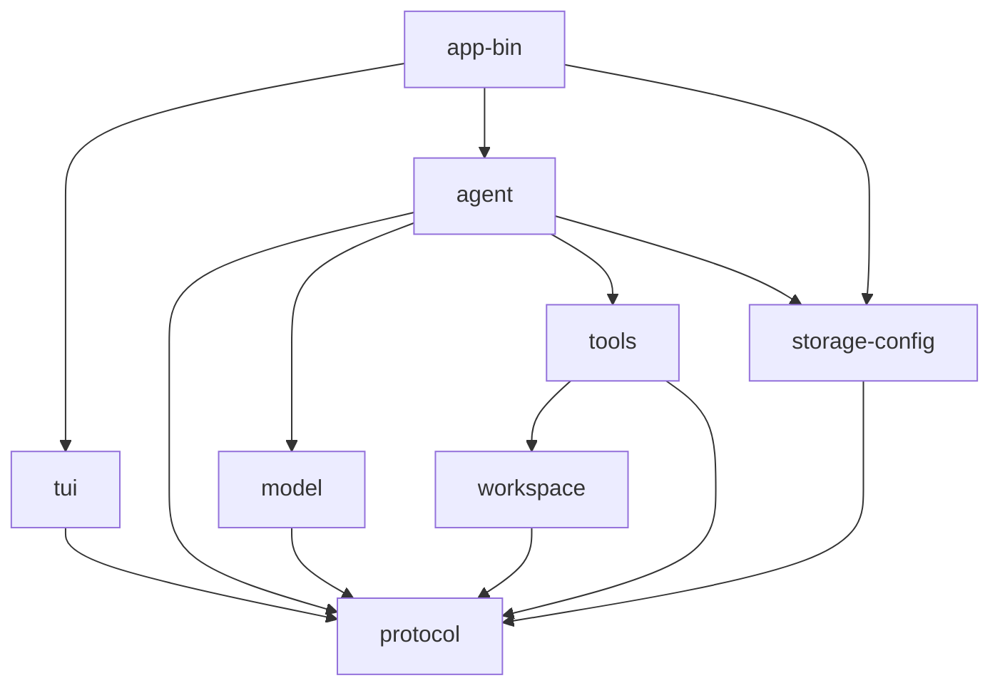

# 从零重实现 Grok Build：开发路线图

> 实施本路线前，先用 [源码符号关系总览](12-源码符号关系总览.md) 确认模块/trait/channel 边界，再用 [关键调用链逐函数精读](13-关键调用链逐函数精读.md) 确认每个阶段需要打通的真实调用节点。不要只复制 crate 名称而遗漏消息、返回和取消契约。

## 1. 重实现目标

目标不是逐文件复制原仓库，而是先恢复其关键架构性质：

- 一个可组合的 CLI/进程入口；
- 一个单写者 Session Actor；
- 一个将模型 wire protocol 归一为内部事件的 Sampler；
- 一个具有 schema、上下文、权限和结构化结果的工具系统；
- 一个隔离文件/命令/Git 主机能力的 Workspace；
- 一个 Action/Effect/Result 驱动的 TUI；
- 一套可恢复的会话持久化；
- 明确的取消、超时、重试、结果未知和安全默认。

原仓库 80 余个 crate 是长期演进后的边界。新实现不应一开始机械复制所有 crate，否则会先花大量时间管理依赖，而不是验证核心调用链。

## 2. 建议的初始 workspace

```text
grok-rebuild/
├── Cargo.toml
├── crates/
│   ├── app-bin/              # main、CLI、组合根
│   ├── protocol/             # 稳定 ID、命令、事件、错误、wire DTO
│   ├── agent/                # Session Actor、ChatState、turn loop
│   ├── model/                # Sampler trait、流事件、一个 provider
│   ├── tools/                # Tool trait、registry、内置工具
│   ├── workspace/            # 文件、命令、Git 与本地实现
│   ├── tui/                  # event loop、view state、render
│   └── storage-config/       # 配置、secret 引用、JSONL/SQLite
└── tests/
    └── e2e/
```

依赖方向：



`protocol` 不依赖任何上层 crate。`app-bin` 是唯一允许知道所有具体实现的组合根。

## 3. 阶段 0：建立工程骨架

### 3.1 交付

- Rust 2024 workspace；
- 统一 `rustfmt`、Clippy 和错误策略；
- 结构化 tracing 初始化；
- `app-bin --version` 和 `app-bin doctor`；
- crate 级测试命令和 CI 基线。

### 3.2 最小依赖

```toml
tokio
clap
serde
serde_json
thiserror
tracing
tracing-subscriber
uuid 或等价 ID 库
```

不要在此阶段加入 Ratatui、SQLite、MCP、Git、语音和 telemetry provider。

### 3.3 验收

- 每个 crate 独立 `cargo check -p <crate>`；
- CLI 参数错误有稳定退出码；
- panic hook 和正常错误输出不混淆；
- 日志包含进程版本但不包含环境 secret。

## 4. 阶段 1：稳定协议与错误类型

### 4.1 ID

```rust
pub struct SessionId(String);
pub struct PromptId(String);
pub struct SamplingRequestId(String);
pub struct ToolCallId(String);
```

使用 newtype，避免把 session id 误传为 tool call id。为 wire DTO 实现显式 serde；领域类型不要直接暴露供应商字段。

### 4.2 核心命令与事件

```rust
pub enum SessionCommand {
    Prompt { id: PromptId, input: UserInput, reply: ReplyTx },
    Cancel { prompt_id: PromptId },
    Shutdown,
}

pub enum SessionEvent {
    PromptAccepted { prompt_id: PromptId },
    Sampling(SamplingEvent),
    Tool(ToolEvent),
    Completed(PromptCompletion),
}
```

### 4.3 错误分类

至少定义：`InvalidInput`、`Config`、`Auth`、`RateLimited`、`TransientTransport`、`Timeout`、`Cancelled`、`PermissionDenied`、`Sandbox`、`ExternalResultUnknown`、`InvariantViolation`。

不要让控制流依赖字符串包含关系。

### 4.4 验收

- 所有 ID JSON round-trip；
- 未知字段、缺失字段和 enum 版本行为有测试；
- 错误分类可映射到 CLI 退出码和 UI 文案；
- secret 类型的 `Debug` 输出脱敏。

## 5. 阶段 2：内存 Session Actor

### 5.1 状态

```rust
struct SessionState {
    id: SessionId,
    conversation: Vec<ConversationItem>,
    running: Option<RunningPrompt>,
    queue: VecDeque<QueuedPrompt>,
    config: SessionConfigSnapshot,
}
```

`SessionState` 只存在于 Actor task 内部。外部通过 handle 发送命令，不暴露 `Arc<Mutex<SessionState>>`。

### 5.2 第一版行为

- 一次只运行一个 Prompt；
- 运行中收到新 Prompt 进入有界队列；
- Cancel 只影响匹配的 prompt id；
- Actor shutdown 拒绝新请求并完成已有 reply channel；
- channel 关闭时有明确退出路径。

### 5.3 验收

- 并发发送 100 个 Prompt 时顺序可解释；
- reply receiver 被丢弃不会使 Actor panic；
- shutdown 时所有等待者得到错误；
- 取消旧 prompt 不会取消新 prompt。

## 6. 阶段 3：模型端口与流式 Sampler

### 6.1 稳定端口

```rust
#[async_trait]
pub trait ModelBackend: Send + Sync {
    async fn sample(
        &self,
        request: SamplingRequest,
        events: SamplingEventSink,
        cancel: CancellationToken,
    ) -> Result<CompletedResponse, SamplingError>;
}
```

可以让 `sample` 返回 Stream，也可以通过 sink 发事件；关键是 terminal result 只有一个权威来源。

### 6.2 第一版 Provider

- 只实现一种 API；
- 支持纯文本和单个 tool call；
- 正确解析 HTTP body/SSE framing；
- 将 wire event 转为统一 `SamplingEvent`；
- 记录 first-token 和 total latency；
- cancellation 关闭网络读取。

### 6.3 attempt gate

每次尝试分配递增 attempt/generation。Session 只接受当前 generation 的事件。terminal event 后关闭 gate，迟到事件丢弃并记录诊断。

### 6.4 验收

- 正常 token 流；
- TCP chunk 拆分在任意字节边界仍能正确解 SSE；
- 无 terminal event 的 EOF 返回协议错误；
- Completed 后迟到 token 不提交；
- Cancel 在无 token、流中和 Completed 临界点都可预测；
- 429/5xx 使用有限重试，非法 JSON 不重试。

## 7. 阶段 4：ChatState 与工具闭合

### 7.1 ConversationItem

```rust
pub enum ConversationItem {
    System(SystemMessage),
    User(UserMessage),
    Assistant(AssistantMessage),
    ToolResult(ToolResultMessage),
}
```

Assistant message 可包含文本、reasoning 摘要和 `Vec<ToolCall>`。每个 call id 在下一次模型请求前必须有结果。

### 7.2 build_request

- 从 live state 创建快照；
- 检查 role/order 不变量；
- 修复或拒绝 dangling calls；
- 加 system prompt 和 tool specs；
- 执行 context window 裁剪；
- 不把仅用于请求的裁剪意外写回 live state。

### 7.3 验收

- User → Assistant 的纯文本回合；
- Assistant(tool call) → ToolResult → Assistant 的回边；
- tool call id 重复/缺失被拒绝；
- 多工具中失败和取消仍全部闭合；
- request view 的裁剪不改变 live history。

## 8. 阶段 5：工具运行时

### 8.1 Tool trait

```rust
#[async_trait]
pub trait Tool: Send + Sync {
    fn spec(&self) -> ToolSpec;
    async fn call(
        &self,
        args: serde_json::Value,
        ctx: ToolCallContext,
    ) -> Result<ToolOutput, ToolError>;
}
```

原工程通过 typed Tool 和 dyn adapter 获得更强类型安全。新实现可先用 JSON 值跑通，再升级到关联类型 + type erasure。

### 8.2 Registry

- 工具名唯一；
- schema 与反序列化类型由同一实现生成；
- finalize 后不可随意修改；
- Session 同时拿到 specs 和 dispatcher 的同版本快照；
- unknown tool 返回 ToolResult，不使会话崩溃。

### 8.3 第一批工具

1. `read_file`：只读、最容易验证；
2. `list_dir` 或受限搜索；
3. `write_file`：先整文件原子替换；
4. `run_command`：最后加入，因为涉及进程、流、取消和沙箱。

### 8.4 验收

- schema/serde round-trip；
- 参数错误是模型可理解的工具错误；
- 每次调用携带 call id、session id、prompt id；
- progress 有大小/速率限制；
- output 截断策略保留退出状态；
- 用户取消能结束工具 task。

## 9. 阶段 6：Workspace 与文件安全

### 9.1 Workspace trait

```rust
#[async_trait]
pub trait Workspace: Send + Sync {
    async fn read(&self, path: WorkspacePath) -> Result<FileSnapshot, WsError>;
    async fn write_if_version(
        &self,
        path: WorkspacePath,
        expected: FileVersion,
        content: Bytes,
    ) -> Result<FileSnapshot, WsError>;
    async fn run(&self, command: CommandSpec, cancel: CancellationToken)
        -> Result<CommandResult, WsError>;
}
```

### 9.2 路径规则

- 明确 workspace root；
- 规范化相对路径；
- 默认拒绝越出 root；
- symlink 解析采用一致策略；
- Windows/macOS 大小写和分隔符行为有测试；
- UI 展示路径与安全判定路径不要混用。

### 9.3 原子写和并发

- 读取返回内容 hash/version；
- 编辑提交 expected version；
- 同路径写入串行化；
- 写临时文件、flush、rename；
- rename 后重新 stat/hash；
- 冲突返回 typed error，让模型重新读取。

### 9.4 命令执行

- 第一版仅允许受限 cwd；
- stdout/stderr 独立读取，避免管道死锁；
- output 有 byte 上限；
- cancellation 先 interrupt 后 kill；
- 必须 wait/reap child；
- shell 解析规则与直接 argv 执行模式分开。

### 9.5 验收

- `../`、绝对路径、symlink escape；
- 两个编辑竞争同一文件；
- rename 前后目标变化；
- child 大量输出不死锁；
- child 忽略 interrupt 后被 kill/reap；
- 已写成功但响应丢失时可按 hash 对账。

## 10. 阶段 7：权限与沙箱

### 10.1 策略输入

- 工具 capability；
- 规范化路径/cwd；
- 网络目标；
- 命令摘要；
- managed、user、project 三层策略；
- 是否存在可交互审批 UI。

### 10.2 决策优先级

高层 deny 永远不能被低层 allow 放宽。示例：

```text
managed deny
> managed ask/allow
> user policy
> trusted project policy
> safe default
```

真实优先级应写成一个纯函数并用表驱动测试，不要散落在 UI 和工具代码中。

### 10.3 沙箱

先只支持一个平台。将 sandbox 编译器定义为端口：输入能力和路径，输出平台 profile/command wrapper。profile 构造失败时 fail closed。

### 10.4 验收

- deny 无法被项目配置覆盖；
- headless 模式遇到 Ask 不自动允许；
- 审批只对原 call id 生效；
- sandbox 不可用时高风险操作不执行；
- 命令参数变化后旧审批失效。

## 11. 阶段 8：会话持久化与恢复

### 11.1 第一版 JSONL

每行包含：

```text
record_id
schema_version
session_id
sequence
timestamp
record_kind
payload
checksum（可选但推荐）
```

单 writer task 接收 append 命令并返回 ack。需要明确 `write`、`flush` 和 `sync_all` 各自的承诺。

### 11.2 恢复

- 校验 header/session id；
- 按 sequence 重放；
- 识别重复 record id；
- 容忍最后一条截断；
- 中部损坏停止并报告；
- 把 running prompt 转 interrupted；
- 修复 dangling tool call；
- 重新计算派生 token/usage。

### 11.3 SQLite 何时引入

当需要索引大量 session、并发读、事务更新多个索引、可靠去重或后台上传队列时，再引入 SQLite。不要仅因为原工程存在 `xai-sqlite-journal` 就提前复杂化。

### 11.4 验收

- 每个字节位置截断最后一行的属性测试；
- append 完成但 ack receiver 丢弃；
- 重复重放不产生重复消息；
- 旧 schema 升级；
- rewind 后内存和磁盘一致。

## 12. 阶段 9：最小 TUI

### 12.1 状态模型

```rust
struct AppState {
    editor: EditorState,
    transcript: TranscriptState,
    modal: Option<ModalState>,
    session: SessionViewState,
    terminal: TerminalState,
}
```

所有字段只在 event loop 修改。后台任务只能返回 `TaskResult`。

### 12.2 Action/Effect

Reducer 输出：

```rust
struct Transition {
    effects: Vec<Effect>,
    redraw: bool,
}
```

Effect runner 执行 ACP/agent 请求、剪贴板、文件 picker 等操作，再把结果放回 action channel。

### 12.3 第一版界面

- transcript；
- 多行输入；
- running/cancel 状态；
- tool call/result 文本块；
- terminal resize；
- clean exit；
- bracketed paste。

modal、鼠标选择、图片、Mermaid、vim mode、dashboard 和完整主题可后加。

### 12.4 终端 RAII

进入 raw mode、alternate screen、mouse/bracketed paste 后必须通过 guard 恢复。panic hook 也应尝试恢复，但不能与正常 Drop 产生双重破坏。

### 12.5 验收

- 纯 reducer 测试，不开真实终端；
- snapshot 测试固定宽高；
- PTY E2E 验证 raw mode 退出恢复；
- resize storm 不 panic；
- 流中取消后可以再次提交；
- 粘贴文本不被当成快捷键序列。

## 13. 阶段 10：ACP 与多运行模式

核心纵切片稳定后，把 UI 与 Agent 之间替换为 ACP：

- JSON-RPC request/response/notification；
- version/capabilities handshake；
- session/prompt/cancel；
- request id 映射；
- transport EOF 和 graceful shutdown；
- reconnect 时的状态查询或有限 replay。

先实现 stdio，再考虑 leader/socket/远端模式。stdio 已经需要处理半关闭、非法 frame、stdout 污染和 Windows 管道差异。

## 14. 阶段 11：Git、worktree、rewind 与归因

按以下顺序：

1. 只读 status/diff；
2. 记录 Agent 修改路径；
3. hunk attribution；
4. prompt 边界 checkpoint；
5. 显式文件 restore；
6. fast worktree；
7. export/commit 等高风险操作。

rewind UI 必须展示“仅对话”“仅文件”“两者”的差异，不能用一个含糊按钮隐藏两个事实域。

## 15. 阶段 12：MCP、Hook、Plugin 和子 Agent

### 15.1 MCP

- server 配置和启动；
- initialize/capability negotiation；
- tools/list 与 tools/call；
- stdio/HTTP transport；
- OAuth/credential 引用；
- liveness、超时、重连；
- 把 MCP schema 适配为统一 ToolSpec。

### 15.2 Hook

Hook 只能观察或在明确定义的点影响流程。规定超时、失败策略、输出大小和是否允许修改参数。不要让 hook 绕开权限。

### 15.3 Plugin

安装涉及 Git/文件副作用，应使用临时目录、内容校验、原子切换和版本记录。插件提供的工具、skill、hook 都视为不可信输入。

### 15.4 子 Agent

- 父子 task id；
- 继承的配置/权限快照；
- 独立预算和 cancellation；
- 结果汇聚；
- 最大深度/并发；
- 父任务退出后的清理。

## 16. 阶段 13：上下文压缩、记忆和丰富内容

最后加入：

- token 估算与 provider usage 校准；
- context threshold；
- compaction summary；
- memory 提醒和长期存储；
- 图片/PDF；
- Markdown 高级渲染；
- Mermaid 内嵌布局；
- voice。

压缩必须保留 system/tool 契约和最近上下文，且写入可恢复的 replace-history 记录。摘要生成失败时应保留原历史或明确停止，不能丢失事实。

## 17. 阶段 14：可观测性、更新和产品辅助能力

- 结构化 trace 贯穿 session/prompt/attempt/call；
- 指标与日志脱敏；
- telemetry 队列有上限且不阻断主链；
- crash handler 恢复终端；
- update 下载校验、临时文件和原子切换；
- announcement/远端配置失败时保守降级；
- circuit breaker 按依赖隔离。

## 18. 测试金字塔

| 层 | 目标 | 典型内容 |
|---|---|---|
| 纯函数单测 | 快速证明局部不变量 | 配置合并、策略、路径、schema |
| Actor 测试 | 消息顺序和取消 | Session/ChatState/Sampler fake |
| 适配器集成测试 | 真实 I/O 边界 | HTTP mock、JSONL、Git temp repo |
| 场景/snapshot | UI 和格式稳定 | 固定 terminal 尺寸、Markdown |
| PTY E2E | 终端真实行为 | raw mode、resize、粘贴、退出 |
| 故障注入 | 恢复语义 | 断流、ack 丢失、child 卡死 |
| fuzz/property | 解析与状态空间 | SSE、Markdown、路径、日志截断 |

## 19. 每阶段完成定义

任何阶段不能只实现成功路径。完成应同时包含：

- 公共类型和边界；
- 正常实现；
- typed failure；
- cancellation/timeout；
- 安全默认；
- 结构化日志/指标；
- 单元和集成测试；
- 数据/协议版本考虑；
- 回滚或禁用方式；
- 本文档中对应章节更新。

## 20. 可延后与不可延后

### 20.1 可以延后

- 多模型 provider；
- remote Hub；
- MCP OAuth；
- plugin marketplace；
- voice、图片、PDF、Mermaid；
- fast worktree；
- telemetry provider；
-高级鼠标选择、vim 模式和 dashboard。

### 20.2 不可延后

- 类型化 ID 和错误；
- Session 单写者；
- sampling terminal event 不变量；
- tool call/result 闭合；
- cancellation task tree；
- 文件版本/冲突检测；
- 权限 fail closed；
- child process reap；
- persistence 恢复边界；
- secret 脱敏；
- 终端退出恢复。

## 21. 最终兼容性回归清单

当逐步接近原工程能力时，按专题逐项比较：

1. CLI flags、subcommands 和环境覆盖；
2. TUI 键盘、鼠标、粘贴、scrollback、modal、screen mode；
3. ACP capability、request、notification 和 meta；
4. Session queue/interjection/cancel/rewind；
5. 三类模型 API 和流事件；
6. 工具名、schema、别名和结果格式；
7. Workspace RPC、文件/Git/PTY 行为；
8. 配置路径、优先级、managed policy 和 secret；
9. MCP、hook、plugin、subagent；
10. JSONL/SQLite schema 和旧会话升级；
11. tracing/telemetry/crash/update；
12. macOS/Linux/Windows 条件分支。

先保证语义兼容，再追求文件结构和实现细节相似。
