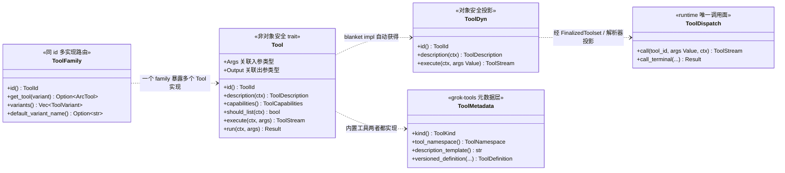

[上一篇：Agent会话与模型循环](09-Agent会话与模型循环.md) · [总目录](README.md) · [下一篇：Workspace权限沙箱与Git](11-Workspace权限沙箱与Git.md)

> **本篇位置**：第 10 / 18 篇

# 10 · 工具协议与扩展体系

> **场景**：模型在每一轮采样中可以产出 `tool_use` 块，runtime 必须把这些 JSON 调用路由到正确的实现、流式回传进度、并最终把结果送回采样循环。本章拆解 grok-build 的工具系统：它既不是「一个巨大的 match」，也不是「每种工具写一份胶水」，而是三件东西的组合——**统一工具 trait**、**对象安全的派发契约**、**可插拔的扩展平面**。
>
> **阅读说明**：源码基准为当前 HEAD `2178c69c`（2026-09-23，`Merge branch 'xai-org:main' into main`）。工具版本：Rust 1.94.0（`rust-toolchain.toml:11`，`channel = "1.94.0"`）；workspace members 共 **102** 个（`Cargo.toml` 的 `members` 数组）。
>
> **索引记法**：本系列不使用「绝对行号」作为稳定依据，统一写作 `文件路径 符号：名字 偏移：+N`。约定：
> - **顶层符号**（自由函数、类型、常量、trait）：只写 `文件路径 符号：名字`，其自身定义行即 `偏移：+0`；此时不再重复标注偏移。
> - **成员**（trait / impl 内的方法）：写 `文件路径 impl <Type> 函数：name 偏移：+N`，其中 **+0 为该 impl / trait 的头部行**。这是本系列偏移的常规用法——它把「位置」锚在结构上，而不是锚在会漂移的行号上。
> - 需要指向某函数体内部的某一步时，同样给相对该函数的偏移。
> - **例外说明（本章大量出现）**：当引用的是一个**顶层符号**（`Trait：` / `Struct：` / `Enum：` / `Const：` / `Type：` / `Module：` / 顶层 `函数：`）时，本章有时会在符号名后附一个 `偏移：+N`。此时 N 是该符号的**定义行快照**（顶层符号的定义行本身就是它的 `+0` 锚点），不是相对某个 impl 的偏移。只有对 **impl / trait 的成员**，`偏移：+N` 才是相对该 impl / trait 头部（`+0`）的行偏移。两种写法在文中都紧邻符号名出现，按「是不是 impl 成员」区分即可。
>
> 类型/常量用 `Trait：` / `Struct：` / `Enum：` / `Const：`，函数用 `函数：`。行号随版本变化，以当前源码为准。
>
> 工具系统的三个基座 crate 是 `crates/common/xai-tool-types`、`crates/common/xai-tool-protocol`、`crates/common/xai-tool-runtime`；线格式（protobuf）另有一个 `crates/codegen/xai-grok-tools-api`。下游实现分散在 `crates/codegen/xai-grok-tools`（内置工具 + 注册表）、`crates/codegen/xai-grok-mcp`（MCP）、`crates/common/xai-computer-hub-core` + `xai-computer-hub-sdk` + `xai-computer-hub-mcp-adapter`（Computer Hub）、`crates/codegen/xai-grok-hooks`（钩子）、`crates/codegen/xai-grok-plugin-marketplace`（插件市场）。
>
> **本次刷新（相对上次基线 `6c01b90c`）的要点**：`xai-tool-runtime` 新增 `ToolVariant` / `ToolFamily` 这一「同 id 多实现」扩展点（`crates/common/xai-tool-runtime/src/tool.rs`）；`xai-tool-runtime` 的 blanket impl 在 `model_output()` 为空时改用 `render::extract_content_blocks` 兜底（旧文档写作「直接取 `model_output()`」）；注册表 `FinalizedToolset` 的调用面新增 `call_with_context` / `call_streaming_with_context`，`call_tool` 改为经 `WorkspaceOps::call_tool_with_context` 中转；`xai-grok-tools` 侧新增 `types/context.rs` 的 `CanonicalToolMeta` / `ToolIdentity` 与 `tool_taxonomy.rs` 的 `WRITING_TOOL_WIRE_NAMES`；钩子事件从 7 个扩到 **16 个变体**。

---

## 第一层 · 简单框架（系统骨架）

工具系统可以压缩成一句话：**一个 trait 描述「一个工具是什么」，一个 trait 描述「怎么调用它」，一个 index 描述「去哪找它」，一个 family 描述「同一个 id 的多个实现怎么选」，五个平面提供「它的具体实现」**。

```
                         ┌───────────────────────────────────────┐
                         │         模型一轮采样 (Sampler)          │
                         │    产出 tool_use { name, arguments }   │
                         └───────────────────┬───────────────────┘
                                             │ tool_id + args(Value)
                                             ▼
   ┌─────────────────────────────────────────────────────────────────────┐
   │                    会话派发入口 (ToolDispatch)                        │
   │   async fn call(tool_id, args, ctx) -> ToolStream<TypedToolOutput>   │
   │   crates/common/xai-tool-runtime/src/dispatch.rs                    │
   └──────────────────────────────┬──────────────────────────────────────┘
                                  │ 按 tool_id 路由
            ┌─────────────────────┼─────────────────────┬──────────────────┐
            ▼                     ▼                     ▼                  ▼
   ┌─────────────────┐  ┌──────────────────┐  ┌─────────────────┐  ┌─────────────┐
   │ 内置工具注册表    │  │   MCP 服务器群    │  │  Computer Hub   │  │ 远程/沙箱    │
   │ xai-grok-tools  │  │  xai-grok-mcp    │  │ hub-core / sdk  │  │ 工具服务器    │
   └────────┬────────┘  └──────────────────┘  └─────────────────┘  └─────────────┘
            │ 每个工具实现 Tool trait，经 ToolDyn 类型擦除后挂入注册表
            ▼
   ┌─────────────────────────────────────────────────────────────────────┐
   │  Trait：Tool（泛型，非对象安全）    Trait：ToolDyn（对象安全投影）        │
   │  crates/common/xai-tool-runtime/src/tool.rs                         │
   │  Tool 成员偏移：execute +51 / run +65                                │
   │  同文件另有 Trait：ToolFamily（同 id 多实现的路由面，当前无生产实现）     │
   └─────────────────────────────────────────────────────────────────────┘
```

四个「基座」概念：

| 概念 | 类型 / trait | 位置（文件 + 符号） | 一句话职责 |
|------|-------------|--------------------|-----------|
| 统一工具接口 | `Trait：Tool` | `crates/common/xai-tool-runtime/src/tool.rs` | 一种工具的「身份 + 描述 + 能力 + 入参 + 出参 + 执行」 |
| 类型擦除层 | `Trait：ToolDyn` | 同文件 | 把泛型 `Tool` 抹平成 `Arc<dyn ToolDyn>`，便于塞进一个 `Vec` |
| 对象安全派发 | `Trait：ToolDispatch` | `crates/common/xai-tool-runtime/src/dispatch.rs` | 拿到 `tool_id + args(Value)` 返回流式结果，runtime 只认这个 |
| 可插拔搜索 | `Trait：ToolSearchIndex` | 有两个定义：`crates/common/xai-tool-runtime/src/search.rs` 与 `crates/codegen/xai-grok-tools/src/types/tool_index.rs` | 「给定一句自然语言，返回最相关的 N 个工具」 |
| 同 id 多实现 | `Trait：ToolFamily` + `Enum：ToolVariant` | `crates/common/xai-tool-runtime/src/tool.rs` | 一个 `ToolId` 下挂多个实现，按 `ToolVariant` 选择 |

（上表五个 trait 都以自身定义行为锚；它们内部成员的偏移见 4.2 / 4.3 / 4.7。）

> 注意两处容易踩的点：
> 1. `ToolSearchIndex` **在当前源码里存在两份定义**。`xai-tool-runtime` 里那份是 runtime 侧的抽象；真正被 Shell 的 BM25 实现所实现的是 `xai-grok-tools` 里那份（`crates/codegen/xai-grok-shell/src/session/tool_index.rs` `impl ToolSearchIndex for Bm25ToolSearchIndex` 偏移：`+0`，impl 头在 145 行）。引用时务必区分，见 4.7。
> 2. `ToolFamily` **当前仓库内没有生产实现**：全仓检索只命中定义处、runtime 的 re-export，以及 `crates/common/xai-tool-runtime/tests/tool_dyn.rs` 里的测试实现 `EchoFamily`。它是为「同一工具 id 多实现」预留的稳定接口，不要写成「已有工具在用」。

五个扩展平面（都通过上面几个概念接入，模型侧无感）：

1. **内置工具**：`crates/codegen/xai-grok-tools/src/implementations/`，含 `grok_build`、`grok_build_concise`、`grok_build_hashline`、`codex`、`opencode`、`memory`、`search_tool`、`use_tool`、`skills`、`editor_infra`、`lsp`、`read_file`、`task_output`、`web_search` 等子平面。
2. **MCP（Model Context Protocol）**：`crates/codegen/xai-grok-mcp`，把外部 MCP server 的工具桥接成 `Tool`/`ToolDispatch`。
3. **Computer Hub**：`crates/common/xai-computer-hub-core` + `xai-computer-hub-sdk` + `xai-computer-hub-mcp-adapter`，远程工具服务器经 `CompoundResolver` 聚合成本地 `ToolDispatch`。
4. **Hooks**：`crates/codegen/xai-grok-hooks`，在会话/工具边界插入用户脚本与 HTTP 钩子，可改写入参、追加上下文、阻断调用。
5. **Plugins / Skills**：`crates/codegen/xai-grok-plugin-marketplace`（插件市场）+ `xai-grok-tools` 的技能子系统，把「外部能力包」与「可调用技能」变成工具清单的一部分。

---

## 第二层 · 一个完整例子（全路径走读）

以「模型想读一个文件」为例，走完整条链路。只看主干，第三层再展开每一步。

```
① 模型采样产出 tool_use
   { name: "read_file", arguments: { path: "src/main.rs" } }
        │  注意：模型可见名是 client_name（默认=工具 id），
        │  注册表内部 id 是 "<Namespace>:<id>"，例如 "GrokBuild:read_file"
        ▼
② 会话 turn 收集 tool_use 块，进入批处理
   crates/codegen/xai-grok-shell/src/session/acp_session_impl/tool_calls.rs
     impl SessionActor（头在第 309 行）
       函数：execute_tool_calls        偏移：+26
        │  按 split_exit_plan_tail 切批（同文件顶层 函数：split_exit_plan_tail，第 146 行）
        ▼
③ 逐批执行
   函数：execute_tool_calls_batch      偏移：+175
        │  对每个调用：prepare_tool_call  偏移：+1136
        │              → 文件锁 lock_path_for_args
        │                （tool_dispatch.rs 顶层 函数：lock_path_for_args，第 77 行）
        ▼
④ 派发到工具
   crates/codegen/xai-grok-shell/src/session/acp_session_impl/tool_dispatch.rs
     函数：dispatch_tool（顶层，第 16 行）
        │  → dispatch_observed（同文件，相对 dispatch_tool 头 偏移：+27）装配 ToolCallContext
        │  → workspace_ops.call_tool_with_context(tool_name, args, Some(session_id), ctx)
        ▼
⑤ WorkspaceOps 收口（见 11 章）
   crates/codegen/xai-grok-workspace/src/workspace_ops.rs
     impl WorkspaceOps  函数：call_tool  偏移：+241（impl 头 +0）
        │  内部只组装 ctx 后转调 call_tool_with_context（偏移：+254）
        ▼
⑥ 注册表把 JSON 还原成强类型，调用工具本体
   crates/codegen/xai-grok-tools/src/registry/types.rs
     impl FinalizedToolset  函数：call_with_context  偏移：+326（impl 头 +0）
        │  → ToolDyn::execute（tool.rs，impl<T: Tool> ToolDyn for T 偏移：+21）
        │  → Tool::execute（tool.rs，Trait：Tool 偏移：+51）→ Tool::run（+65）
        ▼
⑦ 工具产出流：
   [ Progress(Text{...})? , Terminal(Ok(TypedToolOutput{ value, model_output })) ]
   tool.rs  Enum：ToolStreamItem（定义行）
   tool.rs  Struct：TypedToolOutput（定义行）
        │
⑧ TypedToolOutput 回传采样循环，作为下一轮 assistant 消息的 tool_result
        ▼
⑨ 模型拿到文件内容，继续推理 / 产出最终答案
```

链路里最关键的一点：**模型侧永远只看到 `tool_id + args(Value) → ToolStream<TypedToolOutput>`**。无论工具是内置的、MCP 的还是远程 Hub 的，接口完全一致。这就是「扩展平面可插拔」的含义。

---

## 第三层 · 详细逐步说明（主链路拆解）

### 步骤 1 — 工具清单：模型先「看见」工具

模型之所以能产出 `read_file`，是因为上一轮请求里带了工具清单。清单由 `FinalizedToolset` 生成：

- `函数：tool_definitions`（`crates/codegen/xai-grok-tools/src/registry/types.rs` `impl FinalizedToolset`，偏移 `+33`，impl 头 `+0`）返回全部已启用工具的 `ToolDefinition`。
- `函数：tool_definitions_builtins_only`（偏移 `+109`）只返回内置（过滤掉名字含 `__` 的 MCP 工具）；`tool_definitions_builtins_only_inline_mcp`（`+119`）额外带内联 MCP 定义。
- `函数：tool_name_for_kind`（`+43`）、`tool_name_for_registry_id`（`+61`）把 `ToolKind` / 注册表 id 翻译成**模型可见名**；`registered_identity`（`+49`）返回 `RegisteredToolIdentity`。

命名规则是本版必须澄清的一点（旧文档写作 `grok_build__read_file`，与当前源码不符）：

| 名字 | 形态 | 来源 |
|------|------|------|
| 注册表 id（registry id） | `"GrokBuild:read_file"` | `impl ToolRegistryBuilder` 函数：`register_with_params` 偏移：`+21`（impl 头 +0）里的 `format!("{}:{}", tool.tool_namespace(), Tool::id(&tool))` |
| 模型可见名（client name） | 默认 `"read_file"`，可被 `name_override` 改写 | `函数：resolve_client_name`（`impl ToolConfig` 偏移：`+55`，impl 头 +0），在 `impl ToolRegistryBuilder` 函数：`finalize_with_trunc_config` 偏移：`+437` 处被调用 |
| MCP 工具名 | `"<server>__<tool>"`，必含 `__` | `Const：MCP_TOOL_NAME_DELIMITER = "__"`，定义在 `crates/codegen/xai-grok-workspace-types/src/lib.rs` |

因此「内置 vs MCP」在实现里是靠 **client name 是否含 `__`** 区分的：`finalize_with_trunc_config` 里 `native_tool_names` 的过滤条件就是 `!t.client_name.contains("__")`。

### 步骤 2 — 收集并批处理工具调用

`crates/codegen/xai-grok-shell/src/session/acp_session_impl/tool_calls.rs`（`impl SessionActor` 头在第 309 行）：

- `函数：execute_tool_calls`（偏移 `+26`）拿到一轮里的全部 `tool_use`，先用 `函数：split_exit_plan_tail`（同文件顶层函数，第 146 行）把「退出计划模式」这类必须单独处理的尾巴切出来，其余交给批处理器。
- `函数：execute_tool_calls_batch`（偏移 `+175`）逐个 `函数：prepare_tool_call`（偏移 `+1136`）：解析参数、判定是否 MCP 面（`search_tool` / `use_tool` / 名字含 `__`）、按文件加锁（`函数：lock_path_for_args`，在 `tool_dispatch.rs` 第 77 行）、发出 `ToolStarted` 事件。
- 它**不关心工具来自哪个平面**——只调用统一的 `ToolDispatch` 契约。

### 步骤 3 — 派发契约 `ToolDispatch::call`

`Trait：ToolDispatch`（`crates/common/xai-tool-runtime/src/dispatch.rs`）是唯一被 runtime 调用的对象安全接口：

```rust
pub trait ToolDispatch: Send + Sync {
    async fn call(
        &self,
        tool_id: ToolId,
        args: Value,
        ctx: ToolCallContext,
    ) -> ToolStream<TypedToolOutput>;          // 偏移 +3

    async fn call_terminal(&self, ...) -> Result<TypedToolOutput, ToolError> { /* 默认实现，偏移 +18 */ }
}
```

`call` 返回 `ToolStream`，且**必须**以恰好一个 `Terminal` 收尾（不变量，见 4.3）。`call_terminal` 的默认实现只是把 `Progress` 丢掉、拿到第一个 `Terminal`；如果流里没有 `Terminal`，它报 `ToolError::custom("stream_no_terminal", ...)`——这是实现方违反协议时的兜底。

> 为什么需要 `ToolDispatch` 这一层？因为 `Tool` 本身是**非**对象安全的（它带关联类型 `Args` / `Output`）。runtime 不能在 `dyn` 上保留泛型，所以「给模型 / 给批处理器用的入口」必须是 JSON 类型安全的 `ToolDispatch`，而「具体工具作者写代码用的接口」是带泛型的 `Tool`。二者通过 `ToolDyn` 的 blanket impl 自动桥接（步骤 4）。

### 步骤 4 — 类型擦除 `ToolDyn`

每个 `Tool` 实现都会自动获得 `ToolDyn`（`Trait：ToolDyn` 在 `tool.rs` 偏移 `+322`；blanket impl `impl<T: Tool> ToolDyn for T` 相对该 trait 头偏移 `+31`）。`ToolDyn::execute`（blanket impl 内，偏移 `+21`）做三件事：

1. `serde_json::from_value::<T::Args>(args)` 把 `Value` 反序列化为强类型入参；失败则直接 `Terminal(Err(invalid_arguments))`，不进工具逻辑。
2. 调 `Tool::execute(self, ctx, typed_args)`。
3. 把 typed 输出 `serde_json::to_value` 成 `Value`，并调用 `out.model_output()` 抽出模型可见的 content blocks；**若 `model_output()` 返回空**，改用 `crate::render::extract_content_blocks(&value)` 从已序列化的 `Value` 里兜底提取，最后组装成 `TypedToolOutput`。

这一步是「泛型世界」与「JSON 世界」的唯一边界。第 3 点的「空则兜底」是相对旧文档的行为变化——它保证即便工具的作者只实现了 `ToolOutput` 的默认 `model_output()`（返回空 `Vec`），`TypedToolOutput.model_output` 仍非空。

### 步骤 5 — 工具本体：`run` vs `execute`

工具作者二选一实现（`Trait：Tool` 偏移相对该 trait 头 `+0`）：

- **`execute`**（流式，trait 默认实现偏移 `+51`）：包一层 `terminal_only(self.run(...).await)`。也就是说，**只写 `run` 也行**，默认就被包成单条 `Terminal` 流。
- **`run`**（阻塞，trait 默认实现偏移 `+65`）：返回 `Err(ToolError::not_implemented(...))`。两者都不写 = 首次调用即失败，loudly fail。

流式工具（如要实时回传 stdout 的 bash）应直接覆写 `execute`，用 `函数：with_progress`（`tool.rs` 偏移 `+234`）拼出 `[Progress*, Terminal]`。

### 步骤 6 — 流不变量与 `TypedToolOutput`

`Enum：ToolStreamItem`（`tool.rs` 偏移 `+121`）只有两个变体：

- `Progress(ToolProgress)` —— 零或任意多个。`Enum：ToolProgress`（`tool.rs` 偏移 `+140`）分 `Text` / `Content` / `Custom { subkind, payload }`，其中 `Custom` 是给上层（如 TUI）传结构化进度用的逃生口。
- `Terminal(Result<T, ToolError>)` —— **恰好一个，且永远最后**。

`Struct：TypedToolOutput`（`tool.rs` 偏移 `+262`）携带四个字段：

| 字段 | 含义 |
|------|------|
| `tool_id` | 哪个工具产出的 |
| `value` | typed 输出序列化后的 JSON |
| `model_output: Vec<ContentBlock>` | 送回模型的 content blocks |
| `chat_completion_output` | 可选，chat-completions 形态的兼容输出 |

`Enum：ContentBlock`（`tool.rs` 偏移 `+167`）分 `Text` / `Image` / `Resource`。

> **MCP 不变量**：`model_output` 永远非空。默认 `ToolOutput::model_output`（`impl ToolOutput for TypedToolOutput`，偏移 `+1`，相对该 impl 头 `+0`）会把 typed 输出序列化成 JSON 文本块；即便它返回空，blanket impl 也会用 `render::extract_content_blocks` 兜底（步骤 4）。两道保险叠加，满足 MCP 的内容合规要求。

### 步骤 7 — 回传与下一轮

`TypedToolOutput` 被批处理器收集为 `tool_result`，附回 assistant 消息，下一轮采样携带它继续。若工具返回 `Terminal(Err(e))`，错误同样作为 `tool_result` 回传模型（而不是中断整个 turn）——模型可以自我纠正。

### 步骤 8 — 为什么还要 `WorkspaceOps` 中转

Shell 并不直接持有 `FinalizedToolset` 去调工具，而是经 `WorkspaceOps::call_tool`（`crates/codegen/xai-grok-workspace/src/workspace_ops.rs` `impl WorkspaceOps` 偏移 `+241`，impl 头 `+0`；定义在 1754 行）。本版 `call_tool` 只做一件事：用 `call_id` 组装 `ToolCallContext`，然后转调 `call_tool_with_context`（偏移 `+254`）。真正的双模语义在后者：

- **Local 模式**：要求该 session 已绑定（`函数：bind_local_session` 偏移 `+42`）。`session_id` 为 `None` 报 `missing_session`；会话不存在报 `session_not_found`。取到会话后调 `session.toolset().call_with_context(name, args, ctx)`——工具就在本进程内。
- **Proxy 模式**：要求 `WorkspaceClient` 已连接（否则返回 `network_error`，提示重启会话）。把名字解析成 `ToolId`，构造一个只带 `call_id` 的 `proxy_ctx`（注释明确：proxy 一跳无法携带 slot，故不序列化），调 `client.harness().call(tool_id, args, proxy_ctx)`，再用 `crate::hub_channel::consume_stream_terminal` 收流；**传输致命错误会把客户端标记为断连**（`client.mark_disconnected()`），最后反序列化成 `ToolRunResult`。

这条「收口」是 11 章的主题：**所有宿主副作用（读盘、写盘、跑命令、改 Git）都从 `WorkspaceOps` 出去**，权限与沙箱才有唯一的横切点。

---

## 第四层 · 补全所有逻辑与技术要点

### 4.1 三基座 + 一个线格式 crate 的职责切分

```
crates/common/xai-tool-types      → 工具描述/参数/能力/错误的「纯数据结构」
crates/common/xai-tool-protocol   → 线格式与握手 (PROTOCOL_VERSION)
crates/common/xai-tool-runtime    → Tool / ToolDyn / ToolFamily / ToolDispatch / ToolSearchIndex / 流原语
crates/codegen/xai-grok-tools-api → protobuf 生成物 (pb) + 配置校验 + slash 命令
```

- **握手版本**：`crates/common/xai-tool-protocol/src/handshake.rs` 的 `Const：PROTOCOL_VERSION`（偏移 `+10`）定义 `pub const PROTOCOL_VERSION: &str = "1.0.0"`。任何「工具 ↔ runtime」桥接（MCP、Hub）都要对齐这个版本号。
- **类型层**：`crates/common/xai-tool-types` 的实际定义在 `src/types.rs`，由 `src/lib.rs` 的 `pub use types::{ArgumentType, SchemaType, ToolArgument, ToolDescription, ValidationError, ValidationErrors}` 转出；`ToolDescription`（`types.rs` 偏移 `+10`）、`ToolArgument`（`+166`）、`ArgumentType`（`+282`）、`SchemaType`（`+349`）、`ValidationError`（`+505`）。同一 crate 还提供 grep / read / task / web_search 的共享输入输出类型，以及 `MAX_WAIT_BLOCK_MS_DEFAULT = 3_600_000`（`src/task.rs` 偏移 `+772`）、`max_wait_block_ms()`（`+780`）、`format_wait_cap_ms()`（`+792`）。
- **能力层**：`crates/common/xai-tool-protocol/src/capabilities.rs` 的 `Struct：ToolCapabilities`（偏移 `+10`）含 `streaming` / `supports_cancel` / `max_concurrency` / `is_read_only` / `hooks` / `behavior_version` / `max_frame_bytes` / `timeout_ms` / `tool_scope`。其中帧上限是 **16 MiB 硬顶**（`max_frame_bytes` 会被 service 夹到该天花板）、默认超时 **60_000 ms**、默认流式分片 **16 KiB**（同文件 `Struct：StreamingSpec` 偏移 `+58`，字段 `subkind` + `max_delta_bytes`）。`Enum：HookKind`（偏移 `+73`）声明一个工具会触发哪些钩子点：`OnSessionOpen` / `OnSessionClose` / `OnToolCallStart` / `OnToolCallResult` / `OnCancel` / `OnNotification`。`Enum：ToolScope`（`+88`）= `Read` / `Write`，用于多 agent 写协调（Hub 只把 `Write` 工具路由给 leader agent）。
- **protobuf 层**：`crates/codegen/xai-grok-tools-api/src/lib.rs` 的 `Module：pb`（偏移 `+11`）用 `include!` 引入生成代码；`Module：config_validation`（`+15`）与 `Module：slash_commands`（`+16`）是配套模块；`函数：default_client_name`（`+106`，按第一个 `:` 切分取尾段）与 `impl ToolCategory`（`+113`，`as_str` 输出 `unspecified`/`file`/`search`/`shell`/`workflow`/`external`/`custom`）是两个手写辅助。

### 4.2 `Tool` trait 全字段

`crates/common/xai-tool-runtime/src/tool.rs` 的 `Trait：Tool`（偏移均相对该 trait 头 `+0`）：

| 成员 | 偏移 | 默认 | 说明 |
|------|------|------|------|
| `type Args` | — | — | 反序列自 JSON 的入参类型（需 `JsonSchema`） |
| `type Output` | — | — | 出参类型（需 `ToolOutput`） |
| `id()` | `+14` | — | 稳定身份（不含命名空间），派发/注册用它做基名 |
| `description(ctx)` | `+23` | — | 模型可见描述 + 入参 schema；吃 `ListToolsContext` 做上下文感知 |
| `capabilities()` | `+26` | `ToolCapabilities::default()` | 并发/作用域/帧上限等能力标志 |
| `has_dynamic_description()` | `+33` | `false` | 描述是否随 turn 变化 |
| `should_list(ctx)` | `+39` | `true` | 本 turn 是否进入模型可见的工具清单 |
| `execute(ctx, args)` | `+51` | 包 `run` 成单 `Terminal` | 流式入口，**runtime 永远只调它** |
| `run(ctx, args)` | `+65` | `Err(not_implemented)` | 阻塞便捷入口 |

五个 trait 的关系可以一次看清（注意它们**不是**继承链，而是「同一份实现被投影成不同接口」）：



`ListToolsContext`（`crates/common/xai-tool-runtime/src/context.rs` 偏移 `+102`）让 `description` / `should_list` 能按「当前查看器、附件、会话」做动态裁剪——这是「同一个工具在不同 turn 看到不同描述」的机制。

`ToolCallContext`（同文件偏移 `+66`）携带 `call_id` 与 `TypedExtensions`（偏移 `+12`）。扩展是按 `TypeId` 索引的顶层新类型：`Cwd`（`+118`）、`BehaviorVersion`（`+123`）、`TraceContext`（`+130`）、`SessionContext`（`+136`）、`Cancellation`（`+142`）、`WorkspaceViewerContext`（`+150`，字段 `stream_tool_progress`）、`WorkspaceBindMetadata`（`+167`）与 `Enum：ToolApprovalPolicy`（`+257`：`AlwaysPrompt` / `GrantsAllowed`（默认）/ `UnattendedAllowed`）。工具要读 cwd、要订阅取消、要看是否允许无人值守，都从这里取，而不是自己去摸全局。

`WorkspaceBindMetadata` 是 Hub `session.bind` 元数据的唯一线格式定义（发射方序列化、workspace 消费方反序列化，共用一份以免字段漂移）。字段：`preset`、`capability_mode`、`tools`、`viewer_ctx`、`yolo_mode`、`tool_approval_policy`、`manifest_version`、`manifest_hash`、`system_notifications`、`rpc_only`、`session_root`。容错策略由两个自定义 deserializer 表达：`函数：ok_or_default`（`+269`）——缺失或畸形一律落回默认值，保留兄弟字段；`函数：tool_approval_policy_ok_or_err`（`+281`）——**唯独这个字段畸形时保留为 `Some(Err(raw))`**，让消费方能 fail-closed（映射到 `AlwaysPrompt`）而不是悄悄放宽。

### 4.3 流构造器与不变量强制

三个受支持的构造器（均为 `tool.rs` 的顶层函数）：

- `函数：terminal_only`（偏移 `+207`）：单条 `Terminal`，覆盖 99% 阻塞工具。
- `函数：deferred_terminal`（`+218`）：把「产出 Terminal」推迟到一个 future，适合需要在流启动后才决定结果的工具。
- `函数：with_progress`（`+234`）：先排干 `progress` 流，再 await `terminal` 并发最后一条 `Terminal`。

不变量由约定 + `call_terminal` 兜底共同维护：流的 shape 必须是 `[Progress*, Terminal]`。违反 = 实现 bug，由 `dispatch.rs` 的 `stream_no_terminal` 错误暴露。

### 4.4 `ToolMetadata`：grok-tools 特有的元数据层

`xai-tool-runtime` 的 `Tool` 只管「怎么执行」；「这是什么类别的工具、属于哪个命名空间、描述模板长什么样」由 `xai-grok-tools` 自己的 `Trait：ToolMetadata` 承担（`crates/codegen/xai-grok-tools/src/types/tool_metadata.rs`，偏移均相对该 trait 头 `+0`）：

| 成员 | 偏移 | 默认 | 说明 |
|------|------|------|------|
| `kind() -> ToolKind` | `+4` | — | 语义类别（见下） |
| `tool_namespace() -> ToolNamespace` | `+9` | — | 命名空间，决定注册表 id 前缀（如 `"GrokBuild:grep"`） |
| `description_template() -> &str` | `+14` | — | MiniJinja 描述模板，含 `${ tools.by_kind.X }` / `${ params.tool.param }` 占位符（源码写作双花括号 `${{ … }}`），finalize 时由 `TemplateRenderer` 解析 |
| `is_read_only()` | `+22` | 由 `kind()` 推导 | 是否只读 |
| `emitted_notifications()` | `+29` | `&[]` | 会发出哪些通知（tag 对应 `ToolNotification` 的 serde 判别符） |
| `requires_expr()` | `+35` | `Expr::True` | 启用条件表达式，finalize 时求值 |
| `sanitized_description_template()` | `+42` | 剥掉 `${{ … }}` / `$` 标记 | 给绕过注册表的消费者用的安全描述——它们绝不该看到裸模板语法 |
| `versioned_definition(...)` | `+49` | 有实现 | 生成带 contract version 的 `ToolDefinition` |

`Enum：ToolNamespace`（`crates/codegen/xai-grok-tools/src/types/tool.rs` 偏移 `+29`）：6 个变体 `GrokBuild` / `GrokBuildConcise` / `GrokBuildHashline` / `Codex` / `OpenCode`（serde 名 `opencode`，接受 `OpenCode` / `open_code` 别名）/ `MCP`（serde 名 `mcp`，接受 `MCP` 别名）；前四个另接受 PascalCase 别名。

`Enum：ToolKind`（同文件偏移 `+62`）：**37 个变体（含 `Other`）**，带 `#[serde(other)] Other` 兜底与 strum 驱动的 `VARIANT_COUNT` / `as_key()`。完整清单（按定义顺序）：

`Read`、`Edit`、`Delete`、`ListDir`、`Write`、`Move`、`Search`、`Lsp`、`Execute`、`Plan`、`WebSearch`、`WebFetch`、`BackgroundTaskAction`、`WaitTasksAction`、`KillTaskAction`、`List`、`Skill`、`MemorySearch`、`MemoryGet`、`Task`、`ActiveAgentMessage`、`EnterPlan`、`ExitPlan`、`AskUser`、`ImageGen`、`VideoGen`、`ImageToVideo`、`ReferenceToVideo`、`DeployApp`、`InitOrUpdateApp`、`SearchTool`、`UseTool`、`Monitor`、`GoalUpdate`、`Workflow`、`Feedback`、`Other`。

`ToolKind` 的两种投影集中在 `crates/codegen/xai-grok-tools/src/tool_taxonomy.rs`：`impl ToolKind`（偏移 `+31`）里的 `presentation_name()`（`+4`，穷尽匹配，给 UI 用）与 `is_read_only()`（`+48`，穷尽匹配，给权限用）。同文件还有：

- `Module：field`（偏移 `+14`）——规范参数名 `PATH` / `OFFSET` / `LIMIT` / `COMMAND` / `DESCRIPTION` / `CWD` / `DIRECTORY` / `PATTERN`。
- `Const：TOOL_META_KEY = "x.ai/tool"`（`+27`）、`Const：TOOL_META_VERSION = 1`（`+30`）——写进工具 schema 元数据的版本标记；`函数：tool_meta_json_schema_str`（`+235`）给出该元数据的 JSON Schema。
- `Const：WRITING_TOOL_WIRE_NAMES`（`+124`）与 `函数：writing_tool_kind`（`+146`）——把「会写盘的工具 wire name」映射回 `ToolKind`，是本版新增的显式表。
- `Struct：ToolIdentity`（`+177`）与 `Struct：CanonicalToolMeta`（`+187`，方法 `new` 偏移 `+13`、`merge_into` 偏移 `+30`）——`_meta` 里那一个嵌套对象的规范化形态。

`Trait：Reminder`（`crates/codegen/xai-grok-tools/src/types/tool.rs` 偏移 `+112`）是配套的「跨切面提醒」：`requires_expr()` + `collect_reminders`。提醒在每次工具调用后触发，检查 `ToolOutput` 与 `Resources` 决定是否追加提醒文本。内置三条：`LspDiagnosticsReminder`（`src/reminders/lsp_diagnostics.rs`）、`TaskCompletionReminder`（`src/reminders/task_completion.rs`）、`SkillDiscoveryReminder`（`src/reminders/skill_discovery.rs`）。

### 4.5 注册表、`ToolPack` 与 finalize

`crates/codegen/xai-grok-tools/src/registry/types.rs` 是注册表的全部实现。

**注册阶段**：

- `Struct：ToolRegistryBuilder` 持有 `tools`（按注册表 id 索引的 `ToolEntry`）、`reminders`、`shared_local_registry`、`system_reminders_enabled`、`mcp_file_input_preparation`（`impl ToolRegistryBuilder` 头在 `types.rs` 第 511 行，以下偏移相对它 `+0`）。
- `函数：register<T>()`（`impl ToolRegistryBuilder` 偏移 `+4`，impl 头 `+0`）= `register_with_params::<T, ()>()`。
- `函数：register_with_params<T, P>()`（偏移 `+21`）：id 取 `"{namespace}:{id}"`，并生成入参 schema、输出转换器、参数校验器、`Params<P>` 注册器、`LocalRegistry` 注册器。
- `函数：new()`（偏移 `+121`）把全部内置工具 + 三条 reminder 一次性登记。当前内置清单（按注册顺序）：

  `BashTool`、`ReadFileTool`、`SearchReplaceTool`、`ListDirTool`、`GrepTool`、`KillTaskTool`、`KillTerminalCommandTool`、`TodoWriteTool`、`UpdateGoalTool`、`WorkflowTool`、`TaskOutputTool`、`GetTerminalCommandOutputTool`、`WaitTasksTool`、`TaskTool`、`SendSubagentMessageTool`、`SendFeedbackTool`、`WebSearchTool`、`WebFetchTool`、`LspTool`、`ImageGenTool`、`ImageEditTool`、`ImageToVideoTool`、`ReferenceToVideoTool`、`EnterPlanModeTool`、`ExitPlanModeTool`、`AskUserQuestionTool`、`MonitorTool`、`SchedulerCreateTool`、`SchedulerDeleteTool`、`SchedulerListTool`；`codex::ApplyPatchTool`、`codex::CodexListDirTool`、`codex::CodexGrepFilesTool`、`codex::CodexReadFileTool`；`opencode::{OpenCodeBashTool, OpenCodeReadTool, OpenCodeEditTool, OpenCodeWriteTool, OpenCodeGrepTool, OpenCodeGlobTool, OpenCodeTodoWriteTool, OpenCodeSkillTool}`；`memory::{MemorySearchImpl, MemoryGetImpl}`；`search_tool::SearchTool`、`use_tool::UseTool`；`grok_build_concise::{ReadFileConciseTool, SearchReplaceConciseTool, BashConciseTool}`；`grok_build_hashline::{HashlineReadTool, HashlineEditTool, HashlineGrepTool}`。

  最后是 `for pack in tool_packs().lock().iter() { pack(&mut b); }` —— 见下。

**外部扩展点 `ToolPack`**：

- `Type：ToolPack = fn(&mut ToolRegistryBuilder)`（`types.rs` 偏移 `+30`），全局槽 `static TOOL_PACKS: OnceLock<Mutex<Vec<ToolPack>>>`（`+31`，由 `fn tool_packs()` 访问）。
- `函数：register_tool_pack(pack)`（偏移 `+38`）让**树外 crate** 把自己的工具批量塞进内置注册表，而 `register` / `register_with_params` 被刻意声明为 `pub` 就是为此。
- 注意：当前仓库内没有调用 `register_tool_pack` 的地方（全仓检索只命中定义处与其文档注释引用），它是为下游/未来扩展预留的稳定接口；`new()` 里那个 pack 循环因此在本仓库中是空转。这一点必须如实说明，不要写成「已有插件在用」。

**finalize 阶段**：

- `函数：finalize`（偏移 `+422`）/ `finalize_with_trunc_config`（偏移 `+437`）把 builder 变成不可变的 `Struct：FinalizedToolset`（`types.rs` 第 422 行；其 `impl` 头在第 1331 行，后文偏移相对它 `+0`）。
- 关键动作：对每个 `ToolConfig` 求 `contract_version`（`crate::versions::resolve_version`）、算 `client_name`、合并有效参数、生成 `ToolDefinition`（含 `interpolate_description` 与 `apply_to_schema` 两步截断）、为 `UseTool` 额外生成一份「不支持文件输入」的内联定义、把 reminder 按 `requires_expr` 求值筛选后保留。
- `FinalizedToolset` 的对外面（`impl FinalizedToolset` 偏移 `+1331` 起，偏移相对该 impl 头 `+0`）：`tool_definitions`（`+33`）、`tool_name_for_kind`（`+43`）、`registered_identity`（`+49`）、`tool_name_for_registry_id`（`+61`）、`tool_kinds`（`+69`）、`tool_kind_map`（`+79`）、`template_param_names`（`+87`）、`tool_definitions_builtins_only`（`+109`）、`tool_definitions_builtins_only_inline_mcp`（`+119`）、`get_contract_version`（`+134`）、`get_tool_metadata`（`+142`）、`tool_identity`（`+152`）、`is_mcp_target`（`+165`）、`try_parse`（`+217`）、`call_raw`（`+247`）、`call`（`+299`）、`call_with_cancellation`（`+310`）、`call_with_context`（`+326`）、`call_streaming`（`+345`）、`call_streaming_with_cancellation`（`+361`）、`call_streaming_with_context`（`+375`）。
- 动态增删：`register_tool`（`+575`）、`unregister_tools_by_prefix`（`+627`）、`unregister_tool_by_name`（`+641`）——MCP 工具就是靠这些在运行时挂上/摘下的。
- `impl xai_tool_runtime::ToolDispatch for InnerDispatchForToolset`（偏移 `+1308`）把 `FinalizedToolset` 本身也投影成一个 `ToolDispatch`，这样它既能被直接调用，也能塞进 Hub 的解析器里。

### 4.6 输出截断：`TruncationConfig`（两套阈值）

`crates/codegen/xai-grok-tools/src/lib.rs`：

- `Const：DEFAULT_TOOL_OUTPUT_BYTES = 40_000`（偏移 `+9`）——内置工具的默认输出字节上限。
- `Const：DEFAULT_TOOL_OUTPUT_CHARS = 20_000`（偏移 `+13`）——对应的字符上限。

`crates/codegen/xai-grok-tools/src/types/context.rs` `Struct：TruncationConfig`（偏移 `+8`）字段：`default_max_output_bytes`、`per_tool_max_output_bytes`、`max_lines_read`、`mcp_max_output_bytes`、`whole_read`。解析优先级由五个方法表达（偏移均相对 `impl TruncationConfig` 头 `+38`）：

| 方法 | 偏移 | 优先级 |
|------|------|--------|
| `max_lines_read()` | `+2` | 读文件的行数上限 |
| `max_output_bytes_for(tool, builtin)` | `+9` | 按工具覆盖 > 全局默认 > 编译期内置值 |
| `mcp_max_output_bytes_for(tool, builtin)` | `+19` | 同上，但走 MCP 专用阈值链 |
| `interpolate_description(...)` | `+31` | 替换描述里的 `{max_lines_read}` / `{max_wait_ms}` / `{max_chars_per_line}` / `{max_output_bytes}` |
| `apply_to_schema(...)` | `+56` | 把 `maximum` 钉到等待类参数上 |

`Struct：WholeReadPolicy`（同文件偏移 `+24`）另给 `skill_markdown` 与 `instruction_files` 开「整读」豁免——技能正文与 AGENTS.md 这类文件不能只读一半。

截断在**工具清单生成**时作用于描述与 schema（见 4.5 的 finalize）。含义：超大描述/入参 schema 会被裁剪，避免把整个上下文窗口喂给工具元数据——这是「工具清单可扩展但上下文不被撑爆」的关键旋钮。

MCP 侧的字节上限有独立的环境变量入口：`crates/codegen/xai-grok-tools/src/util/mcp_truncate.rs` 提供 `Const：MCP_MAX_OUTPUT_BYTES = 20_000`（偏移 `+34`）、`Const：ENV_MAX_MCP_OUTPUT_BYTES = "MAX_MCP_OUTPUT_BYTES"`（`+39`）、`Const：ENV_GROK_MAX_MCP_OUTPUT_BYTES = "GROK_MAX_MCP_OUTPUT_BYTES"`（`+42`）与 `函数：set_mcp_max_output_bytes`（`+52`）、`mcp_max_output_bytes_from_env`（`+66`）、`mcp_max_output_bytes`（`+74`），由 `lib.rs` 的 `pub use util::mcp_truncate::{...}` 转出。

### 4.7 搜索索引 `ToolSearchIndex`（两份定义，务必区分）

**(a) runtime 侧**：`crates/common/xai-tool-runtime/src/search.rs`

```rust
pub trait ToolSearchIndex: Send + Sync {          // 偏移 +63
    fn search_snapshot(&self, query: &str, limit: usize) -> SearchSnapshot;   // +4
    fn list_server_summaries(&self) -> Vec<ServerSummary>;                    // +8
}
```

同文件另有三个顶层结构：`Struct：ToolSearchResult`（`+11`）、`Struct：SearchSnapshot`（`+31`，含 `results` / `total_hidden_tools` / `is_ready`）、`Struct：ServerSummary`（`+42`，含 `name` / `description` / `tool_names`，以及 `impl ServerSummary`（`+52`）的 `tool_count()` 方法（`+2`，即 `tool_names.len()`）），以及 `Struct：ToolIndex(pub Arc<dyn ToolSearchIndex>)`（`+77`）。

**(b) grok-tools 侧**：`crates/codegen/xai-grok-tools/src/types/tool_index.rs` —— 同样的 trait 名与同名结构（`ToolSearchIndex` 偏移 `+56`、`SearchSnapshot` `+32`、`ServerSummary` `+42`、`ToolIndex` `+70`），但 **`ServerSummary` 多了一个 `tool_count: usize` 字段**（而不是方法）。**Shell 的 BM25 实现走的是这一份**：`crates/codegen/xai-grok-shell/src/session/tool_index.rs` `pub(crate) struct Bm25ToolSearchIndex`（偏移 `+135`）、`impl ToolSearchIndex for Bm25ToolSearchIndex`（偏移 `+145`），其 `search_snapshot`（`+146`）用 `bm25::{Language, SearchEngineBuilder}`，`list_server_summaries`（`+211`）汇总已连接 server；分词器 `函数：split_identifier`（偏移 `+16`）会切开 `__`、`_`、`-` 与 camelCase——这正是为了让 `server__tool` 这种名字能被自然语言命中。

用途：当工具总数远超上下文窗口时，runtime 用搜索索引做「按需召回」而非「全量清单」——这是 MCP/Hub 工具动辄上百个时的必需机制。与之配套的两个工具是 `SEARCH_TOOL_NAME` / `USE_TOOL_NAME`（由 `crates/codegen/xai-grok-tools/src/lib.rs` 的 `pub use implementations::{SEARCH_TOOL_NAME, USE_TOOL_NAME}` 转出）：模型先搜，再用 `use_tool` 调具体那个。

### 4.8 MCP 平面（`xai-grok-mcp`）

**依赖隔离**：`crates/codegen/xai-grok-mcp/src/lib.rs` 的 crate 文档明确写了，`rmcp 2.1`（要求 `reqwest >= 0.13.2`）与 `reqwest 0.13` 被完全私有化在 `xai_grok_mcp::rmcp::*` 命名空间之下，不作为公共 API 泄漏——workspace 其余部分仍消费 `reqwest 0.12`，换版本不会波及下游。

**工具名准入**（`crates/codegen/xai-grok-mcp/src/tool_name.rs`）：

| 项 | 值 / 语义 |
|----|-----------|
| `Const：PROVIDER_TOOL_NAME_MAX_CHARS` | `64`（单个 segment 上限，偏移 `+9`） |
| `Const：MCP_QUALIFIED_NAME_MAX_CHARS` | `256`（`server__tool` 全名上限，偏移 `+12`） |
| `Enum：McpToolAdmissionError` | `InvalidServerName` / `InvalidToolName` / `QualifiedNameTooLong` / `InvalidOrAmbiguousQualifiedName`（偏移 `+16`） |
| `函数：validate_tool_name` | 校验单段名（偏移 `+36`） |
| `函数：parse_mcp_qualified_name` | 拆出 `(ToolId, server, tool)`（`+52`） |
| `函数：parse_mcp_tool_name` | 拆出 `(server, tool)`（`+73`） |
| `函数：qualify_mcp_tool_name` | 拼成 `server__tool`，超长/非法即拒绝（`+83`） |

**工具形态**（`crates/codegen/xai-grok-mcp/src/servers.rs`，以下均为顶层符号）：

- `Struct：McpTool`（偏移 `+1453`）持 `name` / `description` / `server_name` / `mcp_state` / `schema` / `meta`。
- `Struct：McpToolRegistration`（`+1464`，字段含 `tool: McpErasedTool`）：`model_visible` 由 `meta.ui.visibility` 推导。
- `函数：McpTool::into_registration`（`+1498`）→ 产出注册信息（失败返回 `McpToolAdmissionError`）。
- `Struct：McpErasedTool`（`+1536`）是关键：它**直接实现 `xai_tool_runtime::Tool`**（`impl xai_tool_runtime::Tool for McpErasedTool` 偏移 `+1563`），`type Args = serde_json::Value`、`type Output = ToolOutput`，`id()` 返回限定名 `server__tool`。同时 `impl ToolMetadata for McpErasedTool`（偏移 `+1549`）声明 `kind() = Other`、`tool_namespace() = MCP`。
  - 含义：MCP 工具**不需要**任何胶水层或适配器就能进注册表，它就是一个普通 `Tool`。这是「一个 trait 统一内置与 MCP」最直接的证据。
- `run()` 发事件 `McpToolCallStarted`（偏移 `+1614`）/ 对应的 completed 事件，遇鉴权失败走 `client.force_reauth(false)`（偏移 `+1639`）重试一次，最终产出 `ToolOutput::MCP(mcp_out)`。
- 图标元数据：`Enum：McpIconTheme`（`+96`）、`Struct：McpIcon`（`+106`，`from_rmcp` 偏移 `+12`、`from_rmcp_list` 偏移 `+56`），配套上限常量 `MAX_MCP_ICONS_PER_ENTITY = 8`（`+79`）、`MAX_MCP_ICON_SRC_BYTES = 64 * 1024`（`+82`）、`MAX_MCP_ICON_MIME_TYPE_BYTES = 128`（`+85`）、`MAX_MCP_ICON_SIZES = 8`（`+88`）、`MAX_MCP_ICON_SIZE_TOKEN_BYTES = 32`（`+91`）。

**调用链与 SEP-2322 多轮往返**（均为 `servers.rs` 内 `impl McpErasedTool`（偏移 `+1809`）的私有辅助，偏移相对该 impl 头）：

- `函数：try_call_tool`（偏移 `+4`）实现 **SEP-2322 多轮往返（MRTR）循环**：带 `inputRequests` 的轮次是交互式再提示，按 `rmcp::model::DEFAULT_MRTR_MAX_ROUNDS` 限轮数；只带 `requestState` 的轮次表示服务端侧还有带外交互（URL elicitation）未完成，改为有界退避轮询、由 `Const：MRTR_PENDING_STATE_TIMEOUT`（偏移 `+1802`，600 s）限总时长——因为浏览器流程是「分钟」量级而不是「轮次」量级。每轮调用 `call_tool_round`。
- `函数：call_tool_round`（偏移 `+98`）：超时后对 HTTP 传输执行一次 `reset_transport`；**对有副作用的工具不重试**——这是「宁可失败也不重复执行」的取舍。
- 错误分类：`函数：is_retriable_transport_error`（`+1753`）、`tool_error_for_service_error`（`+1762`）；`Enum：McpError` 是统一错误面。
- `Const：STRUCTURED_LABEL_MAX_LEN = 64`（`+1735`）与 `函数：structured_label`（`+1740`）：把结构化输出压成短标签给 UI。

**传输与生命周期**：

- stdio：`Struct：SafeTokioChildProcess`（偏移 `+2600`）——一个「不会在 `pre_exec` 里分配堆内存」的子进程封装，配合 `impl Transport<RoleClient> for SafeTokioChildProcess`。
- HTTP / SSE：由 `Struct：McpClient` 承载（`impl McpClient`，其 `force_reauth` 偏移 `+3296`）；`Struct：McpClientTimeoutOverrides` 允许按 server 覆盖超时。`ClientStateKind` / `LivenessCheck` / `McpClientEvent` / `McpClientEventKind` 构成状态与事件面。`src/mcp_http_client.rs` 是包给 rmcp streamable-HTTP 传输的退避包装（绕开 rmcp 零退避的 SSE 重连循环）。
- ACP 桥接：`crates/codegen/xai-grok-mcp/src/acp_transport.rs`。
- 存活探活：`crates/codegen/xai-grok-mcp/src/liveness.rs` `Struct：TransportLivenessHandle`。
- `Const：GROK_AGENT_ID_HEADER = "X-Grok-Agent-ID"`（`servers.rs` 偏移 `+60`）：把 agent 身份带给 MCP server（多 agent 隔离）。
- 会话状态机：`Struct：McpState`（`+422`）与 `Struct：AdmittedMcpServers`（`+398`）、`Struct：AcpServerEntry`（`+350`）、`Enum：InitProgress`（`+220`）、`Struct：McpConfigChange`（`+206`）。

**启动**：

- `函数：start_mcp_server`（`servers.rs` 偏移 `+4747`）拉起单个 server；内部在构造子进程命令后会调用 **`xai_grok_sandbox::child_net::restrict_child_network(&mut cmd)`**（同函数内，`+4791` 附近）——即 MCP 子进程和 bash 子进程走同一套 seccomp 封网（见 11 章），并调用 `xai_grok_tools::util::detach_command(&mut cmd)`（`+4790` 附近）做进程组隔离。
- `函数：start_mcp_servers`（偏移 `+4932`）用 `futures::future::join_all` **无上限并发**启动全部 server；这是「启动快」与「瞬间打满进程数」之间的已知取舍。
- `函数：mcp_server_name`（偏移 `+4963`）从 `acp::McpServer` 取名字。

**认证**（`crates/codegen/xai-grok-mcp/src/oauth.rs`）：

| 项 | 语义 |
|----|------|
| `Const：MCP_OAUTH_CLIENT_NAME = "Grok"`（偏移 `+13`，crate 私有） | OAuth client 名 |
| `Const：CREDENTIAL_POLL_INTERVAL = 2s`（`+18`） | 凭据轮询间隔 |
| `Const：BROWSER_AUTH_TIMEOUT = 600s`（`+20`） | 浏览器授权总超时 |
| `Const：AUTH_LOCK_WAIT`（`+23`） | 取认证文件锁的等待上限 |
| `函数：discover_metadata_bounded`（`+29`） | 有界超时的 OAuth 元数据发现 |
| `函数：authenticate_mcp_server_dedup`（`+61`） | 去重登录（同一 server 并发只登一次） |
| `函数：authenticate_with_fs_lock`（`+139`） | 用文件锁跨进程互斥（`auth_lock_path`，`+224`） |
| `函数：run_browser_auth_flow`（`+239`） | 拉起浏览器 + 回环回调（`bind_loopback_callback` 偏移 `+360`、`start_oauth_callback_server` 偏移 `+580`） |
| `函数：ensure_oauth_ready`（`+324`） | 快速探活，返回「是否已 hydrated」 |
| `函数：try_token_refresh`（`+282`） | 静默刷新 |

凭据存储：`crates/codegen/xai-grok-mcp/src/credentials.rs` `Struct：McpCredentialStore`（偏移 `+64`，`impl` 偏移 `+77`）提供 `key`（`+2`）/ `load_default`（`+9`）/ `load_from`（`+16`）/ `save_default`（`+34`）/ `insert_and_save`（`+62`）/ `save_to`（`+81`）/ `get`（`+85`）/ `insert_rmcp`（`+93`）/ `has_credentials`（`+104`）/ `remove`（`+109`）/ `remove_and_save`（`+116`）/ `remove_by_server_name`（`+124`）/ `is_empty`（`+131`）；`Struct：McpCredentialStoreAdapter`（`+308`）把它适配成 rmcp 需要的 `CredentialStore` trait 形态（`impl` 偏移 `+329`）。

**Elicitation（服务端反问用户）**：`crates/codegen/xai-grok-mcp/src/elicitation.rs` `Struct：ElicitationJob`（偏移 `+8`）+ `Struct：ElicitationInbox`（`+22`，`push` 偏移 `+63`、`recv` 偏移 `+77`）+ `函数：elicit_result_from_wire`（`+156`）把 MCP 的 elicit 请求桥接成一个需要用户回答的 job 并回写；`decline_result` / `cancel_result` / `accept_result` 是三种预置结果。

### 4.9 Computer Hub 平面（core + sdk + mcp-adapter）

**core**（`crates/common/xai-computer-hub-core`）：

- `Trait：ToolRegistry`（`src/registry.rs` 偏移 `+109`）是 Hub 侧的工具源抽象，方法面比 runtime 的 `ToolDispatch` 宽得多（偏移相对 trait 头 `+0`）：`register_tool`（`+10`）、`register_server`（`+23`）、`unregister_tool`（`+33`）、`unregister_server`（`+37`）、`bind_tool_session`（`+43`）、`unbind_tool_session`（`+52`）、`drop_connection`（`+62`）、`find_tool`（`+69`）、`list_tools`（`+74`）、`list_servers`（`+78`）、`search`（`+83`）、`unregister_session`（`+91`）、`tool_sessions`（`+97`）、`list_servers_for_user`（`+100`）、`get_server_record`（`+103`）、`get_server_id`（`+109`）。同文件还有 `Struct：ServerRecord`（`+230`）、`Const：REGISTRATION_SEQ_SHIFT = 10`（`+255`）、`函数：seq_from_wall_ms`（`+259`）、`seq_wall_ms`（`+265`）、`next_registration_seq`（`+270`）——用挂钟毫秒做单调序号，保证重放顺序稳定。
- `Struct：CompoundResolver`（`src/resolver.rs` 偏移 `+215`）把「本地 + 远端」两路工具源聚合成一个解析器。构造：`local_only`（偏移 `+2`）、`compound`（`+10`）；访问：`local`（`+18`）、`remote`（`+23`）；核心 `函数：resolve(&self, session, tool_id)`（`+28`）**本地优先**（本地命中就遮蔽同名远端），`resolve_and_dispatch`（`+45`）一步解析并派发。（偏移均相对 `impl CompoundResolver` 头 `+220`。）
- `Enum：ResolvedTool`（`+34`）分 `Local { tool, registration }` / `Remote { proxy, registration }`；其 `registration()` 偏移 `+23`、`handle()` 偏移 `+30`（相对 enum 头 `+0`）。
- `Trait：ToolHandle`（`+80`）是对象安全的工具投影；`Struct：ErasedTool<T>`（`+114`，`impl<T> ErasedTool<T>` 头 `+118`）用 `from_arc`（偏移 `+2`）/ `new`（`+7`）把任意 `T` 擦成 `ToolHandle`（`impl<T> ToolHandle for ErasedTool<T>` 相对 `impl<T> ErasedTool<T>` 头 `+29`）。这就是「解析结果能存进 `Vec<Arc<dyn ToolHandle>>`」的原因。
- `Struct：InnerDispatchForResolver`（`src/inner.rs` 偏移 `+34`）持 `Weak<CompoundResolver>` + `session_id`（`new` 偏移 `+3`，`session_id()` 偏移 `+11`，相对 `impl InnerDispatchForResolver` 头 `+39`），并实现 `impl ToolDispatch for InnerDispatchForResolver`（偏移 `+17`）。runtime 拿到的是 `Arc<dyn ToolDispatch>`，路由全部委托给 `CompoundResolver::resolve`。**upgrade 失败时报 `ToolError::custom("computer_hub_dropped", ...)`**——这是「会话销毁不该拖死远程连接」的设计落点。

**sdk**（`crates/common/xai-computer-hub-sdk`）：

- `Struct：ConnKey`（`src/connection.rs` 偏移 `+504`）：连接键 = `(url, principal)`。
- `Struct：HubConnection`（`+568`）+ `impl HubConnection`（`+728`）：**每 `(url, principal)` 一个 WebSocket**，多 `ToolServer` 共享，会话绑定用引用计数。它内置断线重连 / 重放状态机，参数都是显式常量（同文件，均为 crate 私有 `const`）：`OUTBOUND_BUFFER = 256`（`+64`）、`WRITER_CTL_CAPACITY = 4`（`+67`）、`PRIORITY_OUTBOUND_CAPACITY = 16`（`+70`）、`WRITER_CLOSE_SEND_TIMEOUT = 2s`（`+73`）、`RECONNECT_BACKOFF_MS = &[100, 200, 500, 1_000, 2_000, 5_000, 10_000]`（`+77`）、`RECONNECT_SPREAD_FLOOR = 1s`（`+86`）、`RECONNECT_ATTEMPT_RESET_AFTER = 10s`（`+91`）、`RECONNECT_ATTEMPT_MIN_BUDGET = 30s`（`+98`）、`INITIAL_CONNECT_ATTEMPT_TIMEOUT = 10s`（`+110`）、`INITIAL_CONNECT_MAX_ATTEMPTS = 3`（`+114`）、`DEFAULT_WS_PING_INTERVAL = 30s`（`+117`）、`SERVE_ATTEMPT_TIMEOUT = 30s`（`+118`）、`SERVE_MAX_ATTEMPTS = 3`（`+119`）、`CLOCK_PROBE_INTERVAL = 5s`（`+147`）。
  - 掉线语义：把 parked 的响应 waiter 全部以 `NetworkError` 快速失败（避免死锁），再以指数退避 + 全抖动重连，重跑 `hello` 握手，由 `ToolServer` 对每个活跃会话重放 `serve{session_id, tools}`。
- `Const：CLOSE_CODE_SANDBOX_TERMINATED = 4103`（`+1450`）：沙箱被终止的专用关闭码，让上层能区分「服务端正常退出」与「被沙箱杀掉」。
- `Struct：HubConnectionPool`（`src/pool.rs` 偏移 `+71`）：连接池，按 `ConnKey` 复用；`DEFAULT_POOL_IDLE_TTL = 300s`（`+36`）、`DEFAULT_POOL_SWEEP_INTERVAL = 60s`（`+39`）。
- `Trait：ToolServerHandler`（`src/server.rs` 偏移 `+161`）、`Struct：ToolServerBuilder`（`+213`）、`Struct：ToolServer`（`+681`）：**服务端侧**（把本地工具暴露给 Hub）。
- `Struct：LocalRegistry`（`src/harness.rs` 偏移 `+124`）、`Struct：ToolHarnessBuilder`（`+323`）、`Struct：ToolHarness`（`+601`）：**客户端侧**的轻量门面，`WorkspaceClient` 就是包着 `ToolHarness` 的（见 11 章）。
- `InitialConnectPolicy` / `ReconnectEvent` / `AuthCredential` 等由 `src/lib.rs` 转出；`SessionBindReport`（`+548`）/ `CancelOnDrop`（`+85`）/ `ModelOutputExtractor` / `extractor_for`（`+90`）/ `PERMISSION_REQUEST_KIND = "permission_request"`（`+71`）也在其中。

**mcp-adapter**（`crates/common/xai-computer-hub-mcp-adapter`）：把 Hub 的 `ToolServerHandler` 与 MCP 世界对接——`src/bridge.rs` 的 `Struct：McpBridge`（偏移 `+61`）、`McpBridgeConfig`（`+22`）、`McpBridgeHandle`（`+33`）、`McpToolHandler`（`+197`，实现 `ToolServerHandler`）；`src/transport.rs` 的 `Trait：McpTransport`（`+18`）；`src/types.rs` 的 `McpCallResult`（`+39`）/ `McpContent`（`+54`）/ `McpError`（`+86`）/ `McpServerInfo`（`+12`）/ `McpToolDefinition`（`+25`）。含义：**一个 MCP server 可以整体挂到 Hub 上当远端工具源**，反之 Hub 上的工具也能以 MCP 形态暴露出去。

### 4.10 Hooks 平面（`xai-grok-hooks`）

钩子不是「工具」，而是在工具/会话边界插入的用户脚本与 HTTP 端点。`crates/codegen/xai-grok-hooks/src/lib.rs` 的 crate 文档给出两个目录：`~/.grok/hooks/` 与 `<git-worktree-root>/.grok/hooks/`。

**事件名**：`Enum：HookEventName`（`src/event.rs`，由 `hook_events!` 宏生成），本版共 **16 个变体**：`SessionStart`、`UserPromptSubmit`、`PreToolUse`、`PostToolUse`、`PostToolUseFailure`、`PermissionDenied`、`Stop`、`StopFailure`、`StopCancelled`、`Notification`、`SubagentStart`、`SubagentStop`、`SubagentEnd`（`SubagentStop` 的 legacy 别名，被 `canonical()` 折叠）、`PreCompact`、`PostCompact`、`SessionEnd`。每个变体带一组别名（camelCase、snake_case、以及 `beforeShellExecution` / `afterFileEdit` 这类按操作命名的兼容别名），并自带 `traits`。

**两类闸门元数据**：`Enum：GateKind`（偏移 `+183`）与 `Enum：MatcherPolicy`（`+195`），`Struct：EventTraits`（`+201`）把两者打包并加一个 `hub_forward: bool`。`GateKind` 有 5 个变体：`Observe` / `Tool` / `Stop` / `PostTool` / `Prompt`——前者说明该事件是「门」（可阻断）还是「通知」，`MatcherPolicy`（`Ignored` / `Tested`）说明匹配器怎么比。同文件另有输出裁剪常量：`MAX_PAYLOAD_SIZE = 128 KiB`（`+3`）、`MAX_STOP_ENTRY_TEXT_CHARS = 1000`（`+220`）、`MAX_CANCEL_TRIGGER_CHARS = 64`（`+222`）、`MAX_ASSISTANT_MESSAGE_CHARS = 32_768`（`+224`）、`MAX_REASON_CHARS = 256`（`+244`）、`MAX_HOOK_FEEDBACK_CHARS = 10_000`（`+246`）、`MAX_HOOK_OUTPUT_REPLACEMENT_CHARS = 64 KiB`（`+248`），以及 `clip_assistant_message` / `clip_text` / `clip_stop_entry_text` / `clip_reason` 四个裁剪函数。

**注册与加载**（`src/discovery.rs`）：

- `Struct：HookRegistry`（偏移 `+16`，`impl` 偏移 `+20`）：`hooks_for`（`+3`）、`has_enabled_hooks_for_canonical`（`+8`）、`hooks_for_canonical`（`+21`）、`append_specs`（`+38`）、`into_specs`（`+46`）、`remove_by_prefix`（`+66`）、`all_hooks`（`+72`）、`find_by_name`（`+81`）、`recompile_matchers`（`+88`）。
- `Enum：HookSource<'a>`（`+132`）、`Enum：HookSourceConfig`（`+140`）、`函数：load_hooks_from_sources`（`+156`）、`collect_specs_from_sources`（`+182`）、`函数：registry_from_specs_deduped`（`+229`，去重合并）、`函数：load_hooks`（`+276`）、`Struct：HookSourcePaths`（`+285`）、`函数：discover_hook_source_paths`（`+330`）、`discover_hooks`（`+400`）、`assemble_hooks`（`+417`）。
- `Struct：HookSpec`（`src/config.rs`）：一条钩子定义。配套顶层项 `HooksMap`、`MatcherGroup`、`RawHandler`、`Enum：HandlerType`、`函数：expand_env_skipping_runner_vars`、`Enum：HookOrigin`、`函数：hook_origin`、`HookDisplayName`、`函数：hook_display_label` / `hook_display_name`、`函数：parse_hooks_from_value`、`parse_hooks_from_value_with_dir`、`parse_hooks_from_config_layers`、`parse_hook_file`。

**派发**（`src/dispatcher.rs`，以下均为该文件内的顶层函数）：

| 函数 | 定义行（快照） | 语义 |
|------|------|------|
| `dispatch_pre_tool_use` | 第 315 行 | `pre_tool_use` 闸门：可 allow/ask/deny，可 `updatedInput` 改写入参，可追加 `additional_context` |
| `dispatch_sequential_gate`（私有） | 第 87 行 | 顺序跑闸门，第一个阻断即停 |
| `dispatch_prompt_gate` | 第 353 行 | `user_prompt_submit` 闸门：可阻断用户提示 |
| `dispatch_stop` | 第 448 行 | `stop` / `subagent_stop`：可覆写「是否停下」（`StopOverride`） |
| `dispatch_post_tool_use` | 第 656 行 | 工具成功后处理，可替换输出（`OutputReplacement`） |
| `dispatch_post_tool_use_failure` | 第 771 行 | 工具失败后处理 |
| `dispatch_non_blocking` | 第 868 行 | 通知类事件，不阻断 |
| `hub_hook_kind` | 第 997 行 | 把事件名映射成 Hub 的 `HookKind` |
| `runnable_count` | 第 39 行 | 统计可跑钩子数（供 span / 遥测） |

结果类型（`src/dispatcher.rs`，均为顶层结构，括号内为定义行快照）：`PreToolUseResult`（第 64 行，含 `decision` / `updated_input` / `additional_context` / `results`）、`InputRewrite`（第 53 行）、`AdditionalContext`（第 59 行）、`PromptGateResult`（第 348 行）、`StopBlock`（第 376 行）、`StopDispatchResult`（第 382 行）、`StopSignals`（第 417 行）、`PostToolUseBlock`（第 568 行）、`SelectedReplacement`（第 576 行）、`PostToolUseResult`（第 582 行）、`PostToolUseFailureResult`（第 763 行）。

`src/result.rs`：`Enum：HookDecision`、`Enum：PromptDecision`、`Enum：StopHookOutcome`、`Struct：StopOverride`、`Enum：ReplacementKind`、`Struct：OutputReplacement`、`Struct：PostToolUseHookOutcome`、`Struct：HttpInfo`、`Struct：HookRunResult`。

**执行**：`Struct：RunContext<'a>`（`src/runner/mod.rs` 偏移 `+16`）、`Enum：HookRunnerResult`（`+31`）、`函数：run_hook`（`+547`）。命令钩子：`src/runner/command.rs`。HTTP 钩子：`src/runner/http.rs`。

**信任与禁用**（`src/trust.rs`）：`Enum：HookSkipReason`（偏移 `+33`）、`Struct：DisabledHooks`（`+43`）、`函数：disable_hook`（`+108`）/ `enable_hook`（`+132`）、`函数：list_trusted_projects_with_file`（`+15`）/ `legacy_trust_file_path`（`+8`）。项目级钩子默认需要信任，未信任则被 `HookSkipReason` 记下并跳过。

**fail-open 是默认策略**：钩子脚本崩溃、超时、输出不可解析时，**不阻断**工具调用，只记录。这是刻意的——用户脚本不该成为主链路的单点故障。

**与权限系统的接口**：`pre_tool_use` 的 `ask` 决定不会直接弹窗，而是被搬进权限请求里：`Struct：HookAsk`（`crates/codegen/xai-grok-workspace/src/permission/types.rs` 偏移 `+186`）携带 `hook_name` 与可选 `reason`，通过元数据键 `Const：HOOK_ASK_META_KEY = "hookAsk"`（`+191`）传给 TUI，并有 `ask_line` / `prompt_header` / `strip_prompt_header` 三个展示辅助（`impl HookAsk` 偏移 `+193`）。**钩子的 ask 与配置规则的 ask 在同一个决策面上呈现，但溯源不同**（见 11 章 4.4）。

### 4.11 插件与技能平面

**插件市场**（`crates/codegen/xai-grok-plugin-marketplace`）：

- `Const：OFFICIAL_SOURCE_NAME = "xAI Official"`（`src/lib.rs` 偏移 `+26`）、`Const：OFFICIAL_SOURCE_GIT_URL = "https://github.com/xai-org/plugin-marketplace.git"`（`+29`）、`函数：is_official_source_url`（`+33`）。
- 源解析：`src/install_resolve.rs` 的 `parse_marketplace_ref`、`slugify`、`addressable_qualifier`、`resolve_qualified_source`、`select_bare_name`；`src/config.rs` 的 `load_require_sha` / `env_require_sha` / `load_sources` / `native_settings_roots` / `foreign_settings_roots` / `load_extra_sources_from_settings`。
- 缓存与同步（`src/git.rs`）：`sync_source_cache`、`force_sync_source_cache`、`sync_source_cache_with_mode`、`default_cache_root`、`probe_git_remote`；`SyncMode` / `SourceCacheLease` 是配套类型。
- 目录与索引：`src/catalog.rs` 的 `Struct：PluginCatalog` / `CatalogEntry` / `load_catalog`；`src/index.rs` 的 `Struct：MarketplaceIndex` / `load_index`。
- 扫描与类型：`src/scanner.rs` 的 `scan_marketplace`；`src/types.rs` 的 `MarketplaceRelativePath` / `MarketplaceSource` / `Enum：SourceKind` / `MarketplaceEntry` / `MarketplaceScan`。
- 安装（`src/installer.rs`）：`Enum：MarketplaceInstallResult`（偏移 `+18`）、`Struct：MarketplaceUpdateResult`（`+29`）、`函数：install_from_marketplace`（`+38`）、`install_from_remote_url`（`+101`）、`update_from_marketplace_entry_transactional`（`+184`，事务式更新）、`find_installed_marketplace_plugin`（`+423`）。
- 关键词匹配：`src/matcher.rs` 的 `Struct：KeywordCandidate` / `match_plugin_keyword`。

**技能（Skills）**——技能在工具层表现为一个普通可调用工具：

- `Enum：SkillScope`、`Struct：SkillInfo`、`函数：skill_name_from_path`（`crates/codegen/xai-grok-tools/src/implementations/skills/types.rs`）。
- 发现（`implementations/skills/discovery.rs`，均为顶层函数）：`find_skill_paths`、`find_command_paths`、`scan_md_files`、`find_skill_md_paths`、`walk_for_skill_md`、`parse_skill_frontmatter`、`read_frontmatter_only`、`extract_first_paragraph`、`parse_skill_files`、`discover_skills_for_paths`；配套类型 `ParsedFrontmatter`、`SkillParseError`，辅助 `normalize_skill_name` / `is_valid_skill_name`。
- 正文装配（`implementations/skills/skill.rs`，均为顶层函数）：`build_skill_message`、`build_skill_block`、`cap_skill_body`、`build_skill_information`、`format_skill_name`、`extract_skill_display_text`、`apply_substitutions`、`resolve_skill_internal_links`、`extract_skill_body`、`load_skill_content`、`load_skill_with_body`；配套 `SkillRef`、`SubstitutionContext`。
- 运行时管理：`Struct：SkillManager`（`crates/codegen/xai-grok-tools/src/types/skill_discovery_tracker/mod.rs` 偏移 `+75`，`impl` 偏移 `+282`），配套 `Enum：SkillUpdateKind`（`+31`）、`Struct：SkillListingSnapshot`（`+45`）、`Struct：SkillUpdateEffects`（`+58`）。以下偏移均相对 `impl SkillManager` 头 `+0`：`seed`（`+43`）、`update_plugin_skills`（`+75`）、`update_startup_baseline`（`+156`）、`add_discovered`（`+213`）、`activate_conditional_skills_for_paths`（`+236`，按文件路径激活条件技能）、`take_pending`（`+253`）、`take_pending_reconciliation`（`+315`）、`slash_skills`（`+326`）、`listing_snapshot`（`+346`）、`registered_scope`（`+385`）、`on_compaction`（`+419`）、`on_clear`（`+426`）。
- 工具形态：`crates/codegen/xai-grok-tools/src/implementations/opencode/skill/mod.rs` `Struct：SkillTool`，`impl ToolMetadata for SkillTool` 声明 `kind() = Skill`，`impl Tool for SkillTool` 把「调用一个技能」做成标准 `tool_use`。注意它挂在 **OpenCode 命名空间**下（`tool_namespace() = OpenCode`）——这是历史兼容选择，不是笔误。
- 提醒：`SkillDiscoveryReminder`（`crates/codegen/xai-grok-tools/src/reminders/skill_discovery.rs`）在合适时机把「当前可用技能」提示给模型。
- Shell 侧桥接：`crates/codegen/xai-grok-tools/src/bridge.rs` 的 `Struct：ToolBridge`（偏移 `+69`，`impl` 偏移 `+74`）暴露一整组技能方法（偏移均相对 `impl ToolBridge` 头 `+0`）：`restore_announced_skill_names`（`+190`）/ `get_announced_skill_names`（`+198`）、`skill_listing_snapshot`（`+208`）、`seed_skill_discovery`（`+220`）、`set_skill_listing_xml_format`（`+258`）、`on_skill_discovery_compaction`（`+291`）、`on_skill_discovery_clear`（`+302`）、`update_plugin_skills`（`+312`）、`update_skill_baseline`（`+326`）、`apply_pending_skill_update`（`+341`）、`slash_skills`（`+358`）、`skill_discovery_snapshot_names`（`+368`）。`ToolBridge` 还提供 `toolset()`（`+142`）与 `call`（`+146`）——`WorkspaceOps::bind_local_session` 正是把 `toolset()` 装进会话（见 11 章）。
- 安装 RPC：`crates/codegen/xai-grok-shell/src/extensions/skills.rs` 的 `SkillsAddRequest` / `SkillsAddResponse` / `SkillsRemoveRequest` 走 workspace RPC 增删技能。

一句话：**技能 = 被 `SkillManager` 发现、被 `SkillTool` 暴露、被 `SkillDiscoveryReminder` 提示、经 `ToolBridge`/RPC 增删的一组特殊工具**。

### 4.12 设计不变量小结（本章范围内）

1. **单一入口**：runtime 只调 `ToolDispatch::call`，所有平面（内置/MCP/Hub/技能）都收敛到它。
2. **单一边界**：泛型 ↔ JSON 的唯一转换发生在 `ToolDyn` 的 blanket impl（`crates/common/xai-tool-runtime/src/tool.rs`，`impl<T: Tool> ToolDyn for T` 相对 `Trait：ToolDyn`（偏移 `+322`）头 `+31`）。
3. **流不变量**：`[Progress*, Terminal]` 且 `Terminal` 恰好一个、永远最后。
4. **MCP 内容不变量**：`TypedToolOutput.model_output` 永非空——`ToolOutput::model_output` 的默认序列化 + `render::extract_content_blocks` 兜底双保险。
5. **命名不变量**：内置工具 client name 不含 `__`；MCP 工具名必含 `__`（`MCP_TOOL_NAME_DELIMITER`）；注册表 id 恒为 `"<Namespace>:<id>"`。
6. **上下文不变量**：工具清单描述/schema 受 `TruncationConfig` 两套阈值（内置 40_000 字节 / MCP 独立链，默认 20_000 字节）截断，防止上下文膨胀。
7. **fail-open 不变量**：钩子失败不阻断主链路。
8. **弱引用不变量**：Hub 派发经 `Weak<CompoundResolver>`，会话销毁不拖死远程连接（`computer_hub_dropped`）。
9. **版本不变量**：所有桥接对齐 `PROTOCOL_VERSION = "1.0.0"`（`crates/common/xai-tool-protocol/src/handshake.rs` 偏移 `+10`）。
10. **扩展点空转不变量**：`ToolPack`（`register_tool_pack`）与 `ToolFamily` 都是预留接口，当前仓库无生产调用方——不要把它们描述成「已在使用」。

---

[上一篇：Agent会话与模型循环](09-Agent会话与模型循环.md) · [总目录](README.md) · [下一篇：Workspace权限沙箱与Git](11-Workspace权限沙箱与Git.md)
