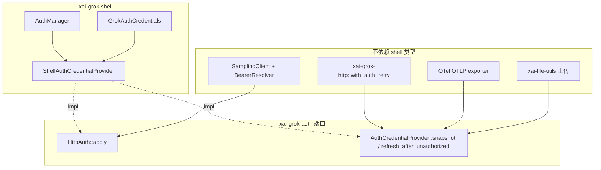
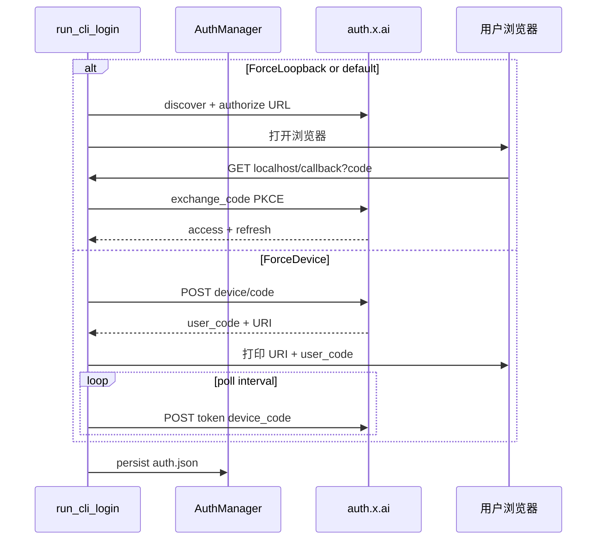
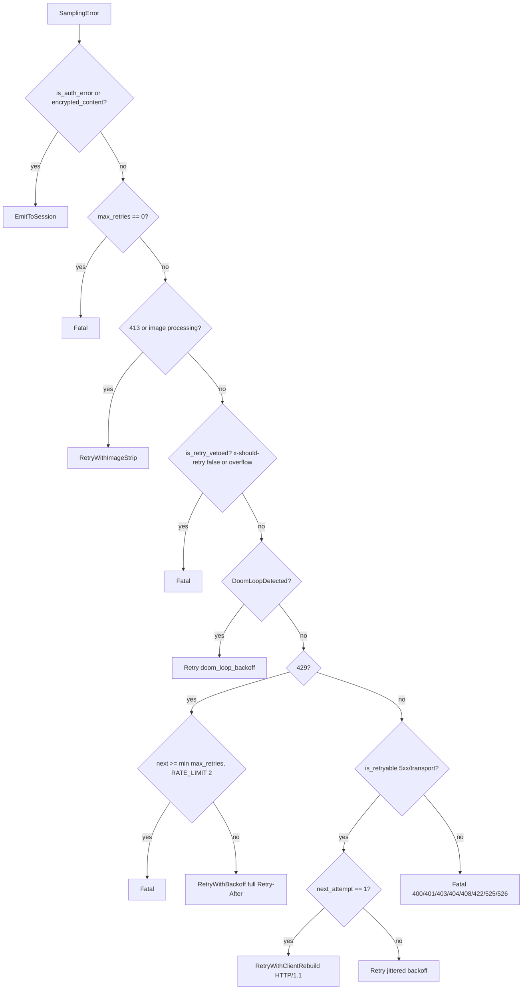

# 10 · 认证、网络、遥测与更新

> 读完本篇应能：用 `HttpAuth` 依赖倒置替换登录实现；区分 OAuth loopback 与 device-code；实现采样重试与 401 后缀归因；接上 Sentry/OTEL/debug_log/crash handler；按 channel 做自更新。密钥不得进配置明文日志。上一篇：[09-Workspace权限沙箱与Git.md](09-Workspace权限沙箱与Git.md) · 下一篇：[11-持久化记忆与会话恢复.md](11-持久化记忆与会话恢复.md)

## 快速摘要

### 架构总览（模块与依赖）

HTTP 栈只依赖 `xai-grok-auth::HttpAuth`（`apply(RequestBuilder, base_url)`）。Shell 实现 `ShellAuthCredentialProvider`（包 `AuthManager` + 静态 deployment/alpha key），数据面 crate 不 import shell 类型。采样走 `SamplingClient`（独立 reqwest 池）；通用流量走 `xai-grok-http::shared_client`。遥测 crate 拥有 Sentry、OTEL、unified.jsonl、Mixpanel 发射；crash handler 在 `main()` 里、Tokio runtime 之前安装。更新 crate 读 channel 指针（stable/alpha/enterprise），组合根 `Command::Login/Logout/Update` 只做分发。

### 核心调用序列（逐步逻辑）

1. `pager-bin::main`：`telemetry::startup::mark_process_start` → Sentry `init` → crash handler → Tokio → `async_main`。
2. `Command::Login` → `xai_grok_shell::auth::run_cli_login`：devbox 短路；否则 `AuthManager::new` + 解析 `--oauth`/`--device-auth`。
3. Loopback：本机 axum 收 callback + PKCE；device-code：`request_device_code` 后轮询 `urn:ietf:params:oauth:grant-type:device_code`。
4. 凭据写入 `~/.grok/auth.json`（按 scope）；`HttpAuth::apply` 在出站请求上盖 Bearer。
5. `SamplingClient` 发 SSE；401 时只把 `bearer_suffix`（12 字符）交给 `Auth401AttributionCallback`；`classify_error` 决定 Retry / Fatal / EmitToSession。
6. 产品事件经 `TelemetryClient` → Mixpanel（先 scrub 再注入 project token）与内部 events URL。
7. `Command::Update` / 后台 `check_update_background` 按 `UpdateConfig.channel` 拉指针并安装。

### 易错点与边界条件

- JWT 头与 xAI key 前缀是共享的，归因必须打 **尾** 12 字符（`BEARER_SUFFIX_LEN`），且按 Unicode 字符而非字节切。
- 401 归因必须读 middleware 盖章时的 `StampedBearerSuffix`，不能在 record 时再 `snapshot()`——刷新会竞态。
- Sampler 对 401 **不重试**，交给 session 刷新；通用 HTTP 用 `AuthRetryMiddleware` 最多再试一次。
- `classify_error` 里 Cloudflare 525/526 立即 Fatal；429 另有 `RATE_LIMIT_RETRY_THRESHOLD=2`。
- Mixpanel 必须先 redact 用户属性再插入 project token，否则 Bearer 形 token 会被 scrub 掉。
- debug 构建默认不跑自动更新；`GROK_DISABLE_AUTOUPDATER` 与 `--no-auto-update` 同样抑制。

---

## 目录

1. [Why：HTTP 只依赖 `HttpAuth`](#1-whyhttp-只依赖-httpauth)
2. [What：认证对象与存储](#2-what认证对象与存储)
3. [Login：OAuth vs device-code](#3-loginoauth-vs-device-code)
4. [`xai-grok-http`：客户端与传输分类](#4-xai-grok-http客户端与传输分类)
5. [SamplingClient 与重试](#5-samplingclient-与重试)
6. [401 归因 suffix](#6-401-归因-suffix)
7. [Telemetry：Sentry / OTEL / debug_log / unified_log](#7-telemetrysentry--otel--debug_log--unified_log)
8. [Mixpanel](#8-mixpanel)
9. [Crash handler](#9-crash-handler)
10. [Update 与 channels](#10-update-与-channels)
11. [敏感数据 redaction](#11-敏感数据-redaction)
12. [组合根分支](#12-组合根分支)
13. [关键调用关系表](#13-关键调用关系表)
14. [测试证据](#14-测试证据)
15. [如何重新实现](#15-如何重新实现)

---

## 1. Why：HTTP 只依赖 `HttpAuth`

`xai-grok-auth` 的 crate 文档写明：这是 `xai-file-utils`（持有者）与 `xai-grok-shell`（实现者）之间的依赖倒置缝。数据采集、OTEL exporter、采样客户端都不能 `use` shell 的 `AuthManager`，否则：

- 刷新逻辑、文件锁、JWT 解析会泄漏进每个 HTTP 调用方；
- 测试无法用静态 token 替换 OAuth；
- CI `--api-key` / deployment key / 用户 OAuth 三种凭据无法共用同一 `apply` 路径。

端口只有两个层次：

```text
trait HttpAuth {
    fn apply(&self, builder: RequestBuilder, base_url: &str) -> RequestBuilder;
}

trait AuthCredentialProvider: HttpAuth {
    fn snapshot(&self) -> CredentialSnapshot;
    async fn refresh_after_unauthorized(&self) -> bool;
    fn needs_token_auth_header(&self) -> bool; // 默认 true；deployment key 为 false
    fn has_usable_credential(&self) -> bool;
}
```

`CredentialSnapshot.token` **必须** 与 `HttpAuth::apply` 即将放到 `Authorization` 上的 bearer 一致，否则 401 归因前缀对不上真实请求。`StaticAuthCredentialProvider` 把 inner `HttpAuth` 与显式 `bearer: Option<String>` 绑在一起，专门服务测试和「只有一段 &str」的调用方；`refresh_after_unauthorized` 恒为 `false`。

生产实现 `ShellAuthCredentialProvider`：`apply` 克隆静态 `GrokAuthCredentials`，若没有 deployment key 则填 `auth_manager.current_wire_valid().key`。Sampler 另有 `WireValidBearerResolver`：`current_bearer()` 只返回未硬过期的 access token，session 与 subagent 共用同一构造函数，避免两处契约漂移。



**必须保持**：刷新感知的 token 解析与 header 构造同属一个 provider。  
**可以替换**：OAuth、device-code、外部 `auth_provider` 命令、静态 API key。

---

## 2. What：认证对象与存储

`AuthManager`（`shell/src/auth/manager.rs`）是 `auth.json` + 内存 bearer 的唯一写者。

锁顺序（注释强制）：`refresh_lock`（async）→ 同步锁 `inner` / `refresher` / `permanent_failure` / `manual_auth`，**永不共持**；禁止把 `parking_lot` guard 跨 `.await`。`Debug` 实现是 redacted 的，避免 `Arc<AuthManager>` 被嵌进派生 Debug 的消息类型后把密钥打进日志。

关键超时：

| 常量 | 值 | 用途 |
|---|---|---|
| `AUTH_LOCK_TIMEOUT` | 10s | 非关键 `auth.json.lock` |
| `REFRESH_LOCK_TIMEOUT` | 45s | 跨 IdP 调用，防止 refresh-token 重放 |
| `BACKOFF_INTERVAL` | 300s | 主动刷新任务空转间隔 |
| `PERMANENT_FAILURE_TTL` | 300s | 可恢复的永久失败缓存；用 `DualClock`（墙上+单调），睡眠不能把 TTL 延长成「醒着的 5 分钟」 |
| `RELOAD_RETRY_TRIES` | 3 × 50ms | `force_reload_from_disk` 吸收唤醒后短暂 ENOENT |

`RefreshReason::PreRequest` 可用缓存；`ServerRejected` 必须拿到 **不同** 的 token。`refresh_chain` 在锁内调 IdP，follower 等待而不是并发 reuse。

`GrokComConfig` / `PreferredAuthMethod`：`ApiKey` vs `Oidc`。`XAI_OAUTH2_ISSUER` 与 `is_xai_oauth2_issuer` 区分第一方 issuer。`force_login_team_uuid` 会让缓存凭据在 principal 不匹配时失效，强制重新交互登录（`is_cached_credential_compatible`）。

存储：`read_auth_json` / `write_auth_json` / `store_api_key` / `clear_api_key`，按 `auth_scope` 分槽。损坏文件走 `read_auth_json_or_empty_recovering_corrupt`。

---

## 3. Login：OAuth vs device-code

组合根：

```text
Command::Login { oauth, device_auth, devbox, .. }
  → run_cli_login(&config, oauth, device_auth, devbox)
Command::Logout
  → run_cli_logout(&config)
```

`run_cli_login`：devbox 走 `devbox_login::run_devbox_login`，不建 `AuthManager`（避免改写 auth.json）。普通路径会 `init` 产品遥测——`grok login` 不启动 Agent，否则 LoginFailed 事件会被丢掉。结束时 `drain_pending(5s)`，因为进程马上退出。

传输选择 `LoginTransportOverride::from_flags`：`--oauth` 赢过 `--device-auth`。完整优先级在 `resolve_device_flow`：

```text
CLI 旗标 > 环境变量 > config `[auth] login_device_flow` > 远程 feature flag > 默认 loopback
```

返回 `Resolved<bool>` 并记录是哪一层做的决定，避免日志把预解析结果标成 `cli`。

### 3.1 OAuth loopback（`--oauth` / 默认）

`oidc/login.rs`：

1. OIDC discover + PKCE（`generate_pkce`）+ `build_authorize_url`。
2. 本机 `TcpListener` + axum `/callback`，CORS 允许 private network。
3. 浏览器跳转；并行接受「粘贴 code 或完整 callback URL」。
4. `AUTH_CALLBACK_TIMEOUT` = 600s。
5. `exchange_code` → `build_grok_auth` → `enforce_login_principal`。
6. 浏览器展示 `callback_page`（成功/失败 HTML）。

失败：`OidcError::CallbackAuthFailed`、空粘贴、URL 无 `code`。

### 3.2 Device-code（RFC 8628）

`device_code.rs` 两阶段，UI 插在中间：

1. `request_device_code()` POST，得到 `verification_uri`、`user_code`、内部 `device_code`。
2. 调用方把 URL+code 印到 stderr / TUI / IDE。
3. `complete_device_code_login()` 按 `interval` 轮询；`slow_down` 每次 +5s。
4. grant type 常量：`urn:ietf:params:oauth:grant-type:device_code`。
5. 404「无 device 端点」是唯一结构化 `DeviceCodeError::NotEnabled`，login funnel 据此回退 loopback。其它错误保持 `anyhow`，以便 `reqwest::Error` 的 `source()` 能被传输分类看见。

`ClientSurface`：`Ui` / `Cli`（stderr 是 TTY）/ `Headless`。作为 `x-grok-client-surface` 送给 IdP，避免无头脚本把 device-flow 转化率分母污染掉。无头路径没有人能完成浏览器同意。



Logout：`perform_logout` / `run_cli_logout` 清 scope 槽；不在这里展开 IdP revocation 细节——以 `LogoutResult` 与磁盘删除为准。

---

## 4. `xai-grok-http`：客户端与传输分类

建 `reqwest::Client` 约 95ms（加载 OS 信任根），所以进程级缓存：

| 函数 | 用途 |
|---|---|
| `shared_client()` | 通用异步；HTTP/2 + pool idle 30s + keepalive ping 20s/10s + TCP keepalive 30s |
| `shared_upload_client()` | GCS；**仅 HTTP/1.1**，每 host idle 2，idle timeout 10s。避免 HTTP/2 多路复用中毒后所有 multipart 变成 Content-Length 0 → 海量 400 |
| `shared_startup_blocking_client()` | runtime 之前的 `/settings`、`/v1/models`；自带 `STARTUP_FETCH_TIMEOUT=5s` |
| `fresh_http1_client()` | 不缓存、pool=0；给最终一次「逃出毒池」 |

`GROK_EXTRA_CA_BUNDLE` 经 `xai_grok_extra_ca` 注入。采样流量 **不** 用这些客户端，而用 `xai_grok_sampler::shared_http`（可用 `GROK_SAMPLER_SHARED_CLIENT=0` 改为每 `SamplingClient` 新建）。

User-Agent：`process_user_agent_string()` = `{origin} grok-shell/{version} ({os}; {arch})`。origin 来自 `GROK_CLIENT_NAME`/`GROK_CLIENT_VERSION` 或 `set_client_name(ClientType)`。Pager 交互路径设 `GrokPager`，headless 设 `Generic`。`x-grok-client-mode`：`headless` 或默认 `interactive`。

`TransportFailure::classify`：**先** `is_connect()`（reqwest 0.12 里 connect 失败也是 `Kind::Request`）→ `Unreachable`；timeout/request/body → `Interrupted`；其余 `Permanent`。`error_cause_chain` 拼接 `source()`，否则 Display 只剩 “error sending request for url”。`find_os_error_code` 沿链找 `raw_os_error` 或 `(os error N)` 后缀——TLS 握手 RST 常是 custom `io::Error`，没有 raw code。

`send_with_retry_escaping_pool`：前几次用 pooled HTTP/2；**最后一次** 换 fresh HTTP/1.1。只能救「快失败」的 reset/GOAWAY；黑洞连接仍会烧光 per-request timeout。`backoff` 由调用方提供 sleep，保持 runtime 无关。

启动常量：`STARTUP_AUTH_TIMEOUT=60s`，`MIN_CLIENT_CONNECT_TIMEOUT=120s`（≥ 2× auth timeout，compile-time assert）。`rustls::crypto::ring::default_provider` 在 `async_main` 开头 `install_default`。

---

## 5. SamplingClient 与重试

`SamplingClient`（`sampler/src/client.rs`）持有 `reqwest::Client`、默认头、`base_url`、可选 `attribution_callback` 与 `bearer_resolver`。三条后端：

- Chat Completions `/chat/completions`
- Responses `/responses`
- Anthropic Messages `/messages`

`x-grok-conv-id` / `req-id` / `session-id` / `model-override` / `agent-id` 以及可选 user/deployment/turn。trace 上传与 URL 级 header **不** 在这里；session 应放进 `SamplerConfig::extra_headers`。

`retry.rs` 是纯函数，无 IO。预算：`DEFAULT_MAX_RETRIES=15`（第 15 次 Fatal），约 5.5 分钟；`GROK_MAX_RETRIES` > 模型配置 > 默认。`MAX_RETRY_BACKOFF=30s`。`retry_backoff_with_jitter`：2s、4s、8s… 封顶 30s，±20% jitter（hasher + 线程 id + 原子序号），打散 Cloudflare 52x 时的同步重试。

`classify_error` 决策：



要点：

- `x-should-retry: false` 立即 Fatal；`true` **不** 强制重试（避免在不可重试状态码上放大失败）。检查放在 image-strip **之后**，因为 strip 改变了 payload。
- 429 走完整 `Retry-After`（解析层另有 120s 帽），但次数被 `RATE_LIMIT_RETRY_THRESHOLD=2` 限制。
- 通用 5xx 的 `Retry-After` 被夹到 30s 再 jitter——Cloudflare 52x 常给 60–120s，14 次会拖到 ~28 分钟。
- 第一次可重试传输错误重建 HTTP/1.1 客户端（毒 HTTP/2 池）。
- Doom-loop 近乎立即重试（0–250ms jitter）；温度随机，等没用。

401/403 不是 sampler 的重试范围：`is_auth_error()` → `EmitToSession`，由 session 调 `AuthManager::unauthorized_recovery`。

---

## 6. 401 归因 suffix

`BEARER_SUFFIX_LEN = 12`。`bearer_suffix` 用 `char_indices().rev().nth(11)` 切尾，短于 12 则整串返回。JWT 头和 `xai-` 前缀是常量，只有尾巴能区分「发了过期快照」还是「发了活 token 仍被拒」。

`Auth401AttributionCallback::record_401(consumer, sent_bearer_suffix)` 必须便宜、非阻塞。`SamplingConsumer` 枚举对应六条 API 路径（chat/responses/messages × stream/非 stream）。完整 token 不得离开 `SamplingClient`。

`AuthRetryMiddleware`（feature `middleware`）在 stamp 时把 `StampedBearerSuffix` 放进 `http::Extensions`。`execute_with_stamp` 是 401 现场读后缀的唯一推荐方式：401 会触发 refresh，record 时再 `snapshot()` 可能已经是新 token。

`with_auth_retry(client, credentials)` 给通用 HTTP 包一层，`max_retries=1`。Sampler 不用这层，避免与 `classify_error` 双重重试。

---

## 7. Telemetry：Sentry / OTEL / debug_log / unified_log

`xai-grok-telemetry` 从 file-utils 拆出，CODEOWNERS 独立。出口：`TelemetryClient`、`TelemetryEvent`、`session_ctx::{emit_event, with_session_ctx}`。

### 7.1 启动计时

`startup.rs`：`mark_process_start` 在 `main()` 第一行。`StartupTimer` 的 phase 是闭集：`LoadConfig`、`ManagedPolicy`、`Bootstrap`、`ModelCatalog`、`SpawnWorker`、`LeaderConnect`、`AcpInitialize`、`EagerAuth`、`AppInit`、`SessionCreate`。同一 phase 重入忽略。写入 `unified.jsonl` 的消息键：`startup phase` / `connect finished` / `startup complete` / `startup timing`。`Owner::Client|Agent` 防止嵌入式运行双报。

### 7.2 Sentry

`pager-bin::main`：

```text
sentry::init(Config {
    client: "grok-pager",
    client_version: PAGER_CLIENT_VERSION,
    release: env!("VERSION_WITH_COMMIT"),
    disabled: is_error_reporting_disabled_sync(),
})
```

`send_default_pii: false`，`server_name: ""`，`traces_sample_rate: 0.01`，`before_send` 走 `Scrubber`：`xai_grok_secrets::redact_secrets`、替换 `$HOME`、用户名（`$USER`/`$USERNAME`，≥3 字符）→ `<user>`。DSN 来自环境或编译期 `SENTRY_DSN`，缺省空串（no-op）。退出路径 `flush_on_shutdown`（2s）。

### 7.3 OTEL

`otel_layer` 与 `external/`（客户 collector）共享 `redact_common::{redact_owned, url_origin}`。URL 只保留 `scheme://host[:port]`，path/query 可能含用户内容。两处都是「出进程字节」的权威检查点。`otel_guard()` 在 Login/Update/TUI/`async_main` 多条路径上持有。

### 7.4 debug_log

`GROK_DEBUG_LOG=1`：每会话 `~/.grok/debug/<session_id>.txt`，另有 `<role>-<pid>.txt` 与 `latest.txt` 符号链接。显式路径（`GROK_LOG_FILE` 或 `GROK_DEBUG_LOG=/path`）则单文件。写盘走 `tracing_appender` non-blocking。Firehose 指令把第一方 crate 提到 debug，`sampling_log=off` 避免 prompt 明文。`ACP_UPDATE_TARGET` / `ACP_UPDATE_PAYLOAD_TARGET` 与 pager 的 filter 共用常量，改名不会变成空指令。

### 7.5 unified_log

`~/.grok/logs/unified.jsonl`，5MB 轮转。字段：`ts`、`src`（shell/grok-pager/grok-desktop）、`pid`、`ver`、`lvl`、`sid`、`msg`、`ctx`。Pager/Desktop 经 ACP `x.ai/log` 转发，shell `ingest_client_entries` 代写。`pid` 让多进程交叉的同一文件可重建因果。`set_version` 在启动时打一次，识别僵尸旧二进制。

---

## 8. Mixpanel

`xai-mixpanel::Mixpanel` 是对旧 `mixpanel-rs` 的瘦客户端，钉在 reqwest 0.12，避免二进制里两套 HTTP。

`track`：属性先 `redact_json_string_values`，再插入 project `token`，POST `https://api.mixpanel.com/track`（form `data=` base64 JSON 数组）。`engage` 同样先 scrub 再带 `$token`/`$distinct_id`/`$set`。

测试 `prepare_properties_scrubs_then_injects_token` 用故意做成 Bearer 形的 project token：若先插入再 scrub，token 会被红acted；若漏掉 scrub，用户属性里的 Bearer 会泄漏。

`TelemetryClient` 的 `$insert_id` 是裸 UUID（≤36，`[A-Za-z0-9-]`）。不要把 event name 放进该字段：下游截断 36 字符后，长名字会变成「每用户每秒同一个 id」。`event_value` 剥掉 `grok-shell-` / `grok-workspace-` 前缀，与 `EmitterOrigin::ALL` 锁步。

---

## 9. Crash handler

`xai-crash-handler`：Unix 上 `sigaction` 捕 SIGBUS/SIGSEGV/SIGABRT（release `panic=abort`，Rust panic 走 `abort(3)`，没有 SIGABRT 就没有报告）；Windows 上 `SetUnhandledExceptionFilter` 捕 access violation，`abort()` 不经过该 filter。

`main()` 顺序：

1. `install_terminal_restore_only()`：只恢复 termios / 清转义，无文件 IO。
2. 若 `load_crash_handler_enabled_sync()`：`check_previous_crash(~/.grok/crash)` **必须在 `install` 之前**（`install` 会 `O_TRUNC` `last-crash.bin`）。
3. 有上次报告则 eprintln signal / version / path。
4. `install(CrashHandlerConfig { app_version: VERSION_WITH_COMMIT, crash_dir })`。

Handler 内禁止分配：先把 crash PC 落盘，再走 frame-pointer 链；二次 fault 仍有可用 PC。最多保留 5 份历史。TUI 进入时 `enable_terminal_escape_restore`，退出时 downgrade。符号解析在下次启动的 `check_previous_crash` 里做，不在信号上下文。

另：`active_sessions::collect_crashed` 收集上次会话崩溃，与 OS 级 crash dump 互补（见 `11`）。

---

## 10. Update 与 channels

`UpdateConfig`：`proxy_base_url`、`auth_scope`、`deployment_key`、`alpha_test_key`、`channel`（默认 `"stable"`）、`npm_registry`。`from_environment` 之后 pager 用磁盘 config 的 channel 覆盖，并用 `GROK_NPM_REGISTRY` 或 sync loader 填 registry。

指针 URL：主 `https://x.ai/cli`，回退 GCS `storage.googleapis.com/grok-build-public-artifacts/cli`。npm 包 `@xai-official/grok`。

Channel 语义：

| 开关 | `get_channel_switch` | 解析最新版本 |
|---|---|---|
| `--stable` | `"stable"` | npm `@latest` 或 `/stable` 指针 |
| `--alpha` | `"alpha"` | **max(alpha, latest/stable)**，避免稳定版已更新而 alpha dist-tag 落后把用户钉死 |
| `--enterprise` | `"enterprise"` | 企业指针（与 stable 互斥，clap 保证最多一个） |

`channel_name()` / `channel_label()` 比较编译进二进制的 `VERSION` 与 `~/.grok/version.json` 里缓存的 stable 指针：超前 → `[alpha]`，否则 `[stable]`；无缓存（首次启动）返回空。进程内 `OnceLock`。

`should_check_for_updates`：debug_assertions → false；`--no-auto-update` → false；`GROK_DISABLE_AUTOUPDATER` 真值 → false。TUI 路径 spawn `check_update_background`；退出 `finish_update_on_exit`。只有当 `exe` canonicalize 等于 `<grok_home>/bin/grok` 才算 managed install（自定义 `GROK_HOME` 会跳过）。stdio agent 另有 `stdio_auto_update_enabled`：仅直接 stdio、非 leader、updates_enabled、managed。

`Command::Update`：`--json` 必须配 `--check`；`--version` 不能与 `--check` 同用；semver 校验。成功后 `signal_leaders_to_relaunch`：发现本机更旧的 reachable leader，best-effort 通知 relaunch。`enforce_version_policy_or_exit` 在 Agent/TUI/headless 路径上先跑，不满足托管 requirements 则 exit 2（`main` 里 `validate_requirements` 同样）。

---

## 11. 敏感数据 redaction

出进程的每一层都要先 scrub：

| 层 | 机制 |
|---|---|
| 日志 / OTEL / 外部 collector | `redact_secrets` + `redact_user_paths`；URL → origin |
| Sentry `before_send` | secrets + home + username |
| Mixpanel | 属性字符串 scrub，然后才写 project token |
| 401 遥测 | 只传 `bearer_suffix`，12 字符 |
| `AuthManager` Debug | `finish_non_exhaustive` |
| unified_log | 不要把 token 放进 `ctx`；调用方负责 |

`needs_token_auth_header`：用户/OAuth 为 true（额外 `X-XAI-Token-Auth`）；deployment key 为裸 Bearer。不要把 deployment key 当作用户 token 去打 suffix 对比——snapshot 必须反映真正上线的那种。

---

## 12. 组合根分支

`main()` 与本篇相关的骨架：

1. `mark_process_start`
2. mermaid/voice 子进程早退
3. parse CLI；doctor/version 可在 Sentry 前返回
4. `validate_requirements` → exit 2
5. Sentry init（guard 必须活过进程）
6. `install_terminal_restore_only`；可选完整 crash handler
7. `collect_crashed`
8. Tokio multi-thread → `async_main`
9. 失败：restore stderr、drop sentry guard、exit 1
10. 成功路径末尾 `debug_log::flush`；TUI 退出前 `xai_grok_sandbox::flush`

`async_main` 的 `Command` match：`Update` 调 `run_update_command`；`Login` 调 `run_cli_login` 后 `finalize_and_exit(0)`；`Logout` 同理。默认 TUI 在 `enforce_version_policy_or_exit` 之后持有 `_otel_guard` 并可能后台检查更新。

---

## 13. 关键调用关系表

| 调用方 | 关系 | 被调用方 | 触发与输入 | 返回与后续 | 错误 / 状态 / 副作用 |
|---|---|---|---|---|---|
| `pager-bin::main` | 调用 | `sentry::init` | client=`grok-pager`、release、disabled 旗 | `ClientInitGuard` | disabled 或空 DSN → no-op |
| `pager-bin::main` | 调用 | `crash_handler::install` | `~/.grok/crash` | bool | 须先 `check_previous_crash` |
| `async_main` | match | `run_cli_login` | oauth/device/devbox 旗 | persist auth.json | 无 Agent 时仍 init 遥测 |
| `run_cli_login` | 调用 | `AuthManager::new` | grok_home、GrokComConfig | Arc manager | 可能修复损坏 json |
| `resolve_device_flow` | 选择 | loopback 或 device | CLI>env>config>remote>default | `Resolved<bool>` | Headless device 污染转化率 |
| `ShellAuthCredentialProvider` | 实现 | `HttpAuth::apply` | builder、base_url | 带 Authorization 的 builder | deployment key 优先于用户 token |
| `with_auth_retry` | 包装 | `AuthRetryMiddleware` | snapshot token、max_retries=1 | 401 时 refresh 再试 | Extensions 盖 `StampedBearerSuffix` |
| `SamplingClient` 401 臂 | 回调 | `Auth401AttributionCallback::record_401` | `SamplingConsumer`、suffix | 无 | 禁止传完整 token |
| Sampler actor | 调用 | `classify_error` | err、retry_count、max_retries | `RetryDecision` | 纯函数；sleep 在 actor |
| `classify_error` | 上交 | session | `is_auth_error` | `EmitToSession` | session 刷新凭据 |
| `TelemetryClient::track` | 调用 | `Mixpanel::track` | event + properties | HTTP POST | 先 scrub |
| `async_main` TUI | spawn | `check_update_background` | `UpdateConfig` | 可选 child wait | debug 构建跳过 |
| `Command::Update` | 调用 | `auto_update::run_update` | force、version、channel_switch | 安装版本 | 通知旧 leader relaunch |

谁创建：

- `AuthManager`：login CLI、Agent bootstrap、session 共享 Arc。
- `SamplingClient`：`SamplerActor` 按 `SamplerConfig` 构建，注入 `WireValidBearerResolver` 与 attribution callback。
- `TelemetryClient`：`init` / `init_if_needed`，HTTP 客户端注入以避免依赖 shell UA 构建器。
- `UpdateConfig`：`build_update_config()` 一次，后续 clone。

---

## 14. 测试证据

| 测试 | 钉住的行为 |
|---|---|
| `bearer_fragment.rs::bearer_suffix_semantics` | 切尾、短串、多字节字符不 panic |
| `http`：`error_cause_chain`、`find_os_error_code`、真实 RST → Interrupted + OS code | 传输分类 |
| `retry.rs` 模块内决策（与注释表对照） | 429 帽、525 Fatal、auth 上交 session |
| Mixpanel `prepare_properties_scrubs_then_injects_token` | scrub 顺序 |
| `redact_common`：secret 改写、干净输入 None、URL origin 丢 query | OTEL 红action |
| `xai-grok-update`：alpha 取 max(alpha, stable)；非法 semver 硬错误 | channel 指针 |
| `flow.rs`：有效磁盘 token、过期走 refresh、无 refresh_token 则 fallthrough | login 缓存 |
| device-code 404 → NotEnabled | 回退 loopback |
| AuthManager lock/TTL 测试（`manager_tests.rs`） | DualClock、pin |

本篇未实际跑测试。覆盖缺口：Sentry DSN 生产值、企业 channel 的完整安装矩阵、device-code 在无 TTY CI 中的产品行为（代码已标 Headless，转化率统计依赖服务端）。

---

## 15. 如何重新实现

1. 定义 `HttpAuth` + `CredentialSnapshot`。先实现静态 token provider。
2. 共享 reqwest 客户端 + User-Agent；`TransportFailure` 三分类。
3. `SamplingClient` 一条 `/chat/completions` SSE；401 只打 suffix。
4. 把 `classify_error` 写成无 IO 函数并单测真值表。
5. `AuthManager`：文件 + 内存 + 一把 refresh 锁。先 API key，再 loopback OAuth。
6. Device-code 作为 CLI 无浏览器时的第二传输。
7. `unified.jsonl` + 可选 Mixpanel（先 scrub）。
8. Crash handler：至少 SIGSEGV 写 PC；`check` 先于 `install`。
9. Update：读一个 channel 指针、校验 semver、替换二进制；debug 关闭。

验收：

- 日志里搜不到完整 Bearer / JWT。
- 401 事件里只有 12 字符尾，且与该次 stamp 一致（刷新后 snapshot 可变）。
- 模拟 529 会重试并 jitter；模拟 525 不会。
- `grok login --device-auth` 在无 device 端点时回退或给出 NotEnabled，而不是把 reqwest 错误包死。
- Mixpanel 测试：用户属性里的 Bearer 被红acted，project token 仍在。

阅读源码建议顺序：`xai-grok-auth/src/{visibility,auth_provider,bearer_fragment,retry_middleware}.rs` → `shell/src/auth/{mod,manager,flow,oidc/login,device_code,credential_provider}.rs` → `xai-grok-http/src/lib.rs` → `sampler/src/{client,retry,attribution}.rs` → `telemetry/src/{lib,startup,sentry,unified_log,debug_log,redact_common}.rs` → `xai-mixpanel` → `xai-crash-handler` → `xai-grok-update` → `pager-bin/src/main.rs` 的 `main` / `async_main` Login-Logout-Update 臂。

---

## 本篇涉及的真实文件

| 路径 | 角色 |
|---|---|
| `crates/codegen/xai-grok-auth/src/lib.rs` | 端口 crate 出口 |
| `crates/codegen/xai-grok-auth/src/visibility.rs` | `HttpAuth` |
| `crates/codegen/xai-grok-auth/src/auth_provider.rs` | `AuthCredentialProvider`、`CredentialSnapshot`、静态实现 |
| `crates/codegen/xai-grok-auth/src/bearer_fragment.rs` | `BEARER_SUFFIX_LEN`、`bearer_suffix` |
| `crates/codegen/xai-grok-auth/src/retry_middleware.rs` | 401 再试 + `StampedBearerSuffix` |
| `crates/codegen/xai-grok-shell/src/auth/mod.rs` | shell 认证模块出口 |
| `crates/codegen/xai-grok-shell/src/auth/manager.rs` | `AuthManager` |
| `crates/codegen/xai-grok-shell/src/auth/flow.rs` | `run_cli_login`、传输解析 |
| `crates/codegen/xai-grok-shell/src/auth/oidc/login.rs` | loopback OAuth |
| `crates/codegen/xai-grok-shell/src/auth/device_code.rs` | RFC 8628 |
| `crates/codegen/xai-grok-shell/src/auth/credential_provider.rs` | `ShellAuthCredentialProvider`、`WireValidBearerResolver` |
| `crates/codegen/xai-grok-http/src/lib.rs` | 共享客户端、UA、`TransportFailure` |
| `crates/codegen/xai-grok-sampler/src/client.rs` | `SamplingClient` |
| `crates/codegen/xai-grok-sampler/src/retry.rs` | `classify_error`、backoff |
| `crates/codegen/xai-grok-sampler/src/attribution.rs` | 401 callback |
| `crates/codegen/xai-grok-telemetry/src/lib.rs` | 遥测出口 |
| `crates/codegen/xai-grok-telemetry/src/startup.rs` | 启动 phase |
| `crates/codegen/xai-grok-telemetry/src/sentry.rs` | Sentry init + scrub |
| `crates/codegen/xai-grok-telemetry/src/unified_log.rs` | `unified.jsonl` |
| `crates/codegen/xai-grok-telemetry/src/debug_log.rs` | `GROK_DEBUG_LOG` |
| `crates/codegen/xai-grok-telemetry/src/redact_common.rs` | OTEL 共享红action |
| `crates/codegen/xai-grok-telemetry/src/client.rs` | Mixpanel/事件发射 |
| `crates/codegen/xai-mixpanel/src/lib.rs` | Mixpanel HTTP |
| `crates/codegen/xai-crash-handler/src/{lib,handler}.rs` | 信号处理 |
| `crates/codegen/xai-grok-update/src/{lib,version,auto_update}.rs` | channel 与安装 |
| `crates/codegen/xai-grok-pager-bin/src/main.rs` | Sentry、crash、Login/Logout/Update |

## 自检问题

1. 为什么 `CredentialSnapshot.token` 必须与 `HttpAuth::apply` 的 bearer 相同？
2. `--oauth` 和 `--device-auth` 同时出现时谁赢？完整优先级还有哪几层？
3. Sampler 收到 401 会不会自己 refresh？通用 `shared_client` 呢？
4. 为什么 401 归因不能在回调里再读 `AuthManager::snapshot()`？
5. Mixpanel 的 project token 为什么必须在 scrub **之后** 插入？
6. `check_previous_crash` 若放在 `install` 之后会发生什么？

下一篇：[11-持久化记忆与会话恢复.md](11-持久化记忆与会话恢复.md)
