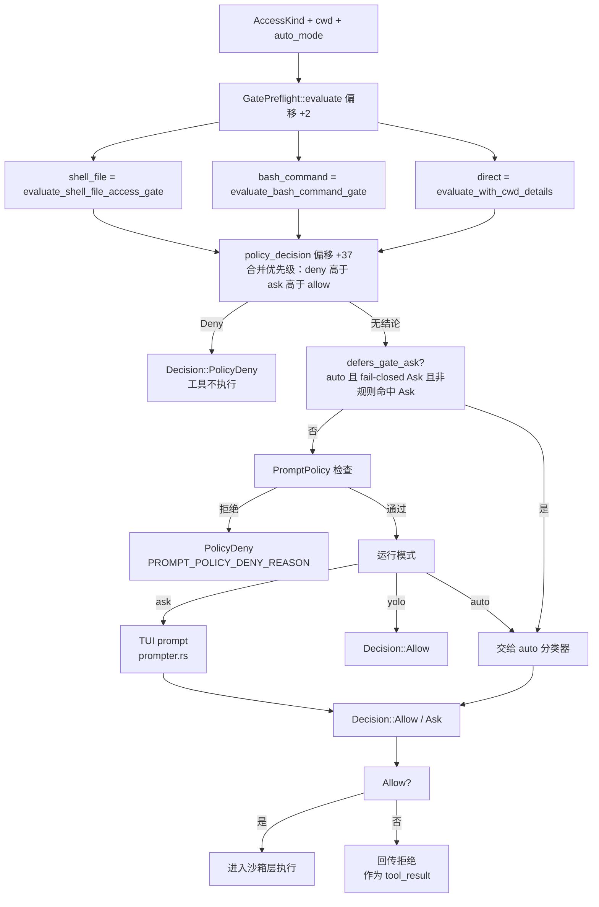

[上一篇：工具协议与扩展体系](10-工具协议与扩展体系.md) · [总目录](README.md) · [下一篇：认证网络遥测与更新](12-认证网络遥测与更新.md)

# 11 · Workspace 权限、沙箱与 Git

> **场景**：一个工具要「读文件 / 写文件 / 跑命令 / 改 Git」，但有三条线必须同时满足——(1) **Workspace 边界**：操作只能发生在工作区之内；(2) **权限边界**：每次敏感操作要过配置规则 + 运行时授权两道关卡；(3) **OS 沙箱边界**：进程级用 Landlock/Seatbelt 兜底，子进程网络按 seccomp 封禁。本章把这三件事拆开讲清楚，并补上第四个收口面——`WorkspaceOps`。
>
> **阅读说明**：源码基准为当前 HEAD `6c01b90c`（2026-09-20）。工具版本：`Rust 1.94.0`（`rust-toolchain.toml:11`）、`ratatui 0.29`、`tokio`（`features = ["full"]`）、`agent-client-protocol 0.10.4`；workspace members 共 **101** 个。
>
> **索引记法**：`文件路径 符号：名字 偏移：+N`。**顶层符号**（自由函数/类型/常量/trait）只写名字，其定义行即 `偏移：+0`；**成员**（trait / impl 内的方法）写成 `文件 impl <Type> 函数：name 偏移：+N`，**+0 为该 impl / trait 的头部行**。行号随版本变化，以当前源码为准。
>
> **对旧版的一处必要更正**：旧文档用 `xai-grok-sandbox/src/lib.rs:320` 与 `xai-grok-sandbox/src/child_net.rs:105` 作为沙箱锚点，这两个行号在当前源码已不对应任何有意义的位置。本文全部改为函数 + 偏移：`SandboxManager` 系列见 4.5，seccomp 见 4.5 的 `child_net` 小节。
>
> 四个子系统分别在：`crates/codegen/xai-grok-workspace`（实现：`WorkspaceOps` / 权限 / 会话）、`crates/codegen/xai-grok-workspace-client`（代理模式的类型化客户端）、`crates/codegen/xai-grok-workspace-daemon`（守护化与预览监管）、`crates/codegen/xai-grok-workspace-types`（纯数据线格式）、`crates/codegen/xai-grok-sandbox`（OS 级沙箱）、`crates/codegen/xai-gix-status`（gix 线程预算）、`crates/codegen/xai-hunk-tracker`（逐 hunk 改动追踪）。

---

## 第一层 · 简单框架（系统骨架）

把「一次文件/命令/Git 操作」的约束拆成四道闸门，其中**前三道是拦截，第四道是记账**：

```
                 ┌───────────────────────────────────────────────┐
                 │ 工具调用 (bash / read_file / search_replace)   │
                 │ 来自 FinalizedToolset（见 10 章）               │
                 └───────────────────────┬───────────────────────┘
                                         │ ① 唯一出口：WorkspaceOps
                                         ▼
   ┌─────────────────────────────────────────────────────────────────────────┐
   │ Enum：WorkspaceOps    Local{ handle } | Proxy{ client }                  │
   │ crates/codegen/xai-grok-workspace/src/workspace_ops.rs                  │
   │ impl WorkspaceOps  函数：call_tool  偏移：+241（impl 头 +0）              │
   └──────────┬──────────────────────────────────────┬───────────────────────┘
              │ Local                                │ Proxy
              ▼                                      ▼
   ┌──────────────────────────────┐    ┌────────────────────────────────────┐
   │ ② 权限：本地双层               │    │ WorkspaceClient（harness 代理）      │
   │  · 配置层 CompiledPolicy      │    │ crates/codegen/xai-grok-workspace-  │
   │  · 运行时 PermissionHandle    │    │ client/src/lib.rs                   │
   │  · 预检 GatePreflight         │    └────────────────────────────────────┘
   │ permission/policy.rs /        │
   │ permission/manager/mod.rs /   │    ┌────────────────────────────────────┐
   │ permission/gate_preflight.rs  │    │ ② 权限：远端/沙箱宿主              │
   └──────────────┬───────────────┘    │ Enum：ToolApprovalGate             │
                  │ 通过                │ 函数：approval_gate_for             │
                  ▼                     │ permission/hub_gate.rs             │
   ┌──────────────────────────────┐    └────────────────────────────────────┘
   │ ③ OS 沙箱（进程级，启动期套上）  │
   │ Struct：SandboxManager        │
   │ 子进程 seccomp：child_net      │
   │ xai-grok-sandbox/src/lib.rs   │
   │ xai-grok-sandbox/src/child_net.rs │
   └──────────────┬───────────────┘
                  │ 执行
                  ▼
   ┌─────────────────────────────────────────────────────────────────────────┐
   │ ④ 记账（不拦截）：HunkTrackerHandle 逐 hunk 记录 agent 写入              │
   │ xai-hunk-tracker/src/handle.rs                                          │
   └─────────────────────────────────────────────────────────────────────────┘
```

| 子系统 | 入口类型 / trait | 位置 | 一句话职责 |
|--------|-----------------|------|-----------|
| Workspace 操作收口 | `Enum：WorkspaceOps` | `crates/codegen/xai-grok-workspace/src/workspace_ops.rs` | Local / Proxy 双模，所有宿主副作用唯一出口 |
| 类型化线契约 | `Trait：WorkspaceRpc` + `Trait：WorkspaceOp` | `crates/codegen/xai-grok-workspace-types/src/rpc/mod.rs` / `workspace_ops.rs` | 每个操作声明 `METHOD` + `ACTIVITY` + `Response`，再加本地 `execute()` |
| 权限决策层（配置） | `Struct：CompiledPolicy` | `crates/codegen/xai-grok-workspace/src/permission/policy.rs` | 把 `PermissionConfig` 编译成可求值的规则集 |
| 权限决策层（运行时） | `Enum：PermissionHandle` | `crates/codegen/xai-grok-workspace/src/permission/manager/mod.rs` | actor 承载授权状态；`AllowAll` 是旁路变体 |
| 预检合并 | `Struct：GatePreflight` | `crates/codegen/xai-grok-workspace/src/permission/gate_preflight.rs` | 一次性评估「直接规则 + 两道 bash 安全门」，保留 `Ask` 溯源 |
| Hub 审批门 | `Enum：ToolApprovalGate` | `crates/codegen/xai-grok-workspace/src/permission/hub_gate.rs` | 远端/沙箱宿主上，每个变更型工具调用都要 owner 点头 |
| OS 沙箱 | `Struct：SandboxManager` | `crates/codegen/xai-grok-sandbox/src/lib.rs` | 进程启动期套 Landlock/Seatbelt；子进程网络 seccomp 封禁 |
| 子进程封网 | `Module：child_net` | `crates/codegen/xai-grok-sandbox/src/child_net.rs` | seccomp BPF：namespace lockdown + child network 两个过滤器 |
| Git 线程预算 | `xai-gix-status` | `crates/codegen/xai-gix-status/src/lib.rs` | 给 gix 的并行 status 扫描设上限，避免 spawn 失败 abort 进程 |
| 改动追踪 | `Struct：HunkTrackerHandle` | `crates/codegen/xai-hunk-tracker/src/handle.rs` | agent 每次写盘都登记成一个可回滚的 hunk |

「双层」是权限系统的关键：**第一层是配置规则（fail-closed，匹配不到就 Ask）**；**第二层是运行时授权（用户在 TUI 里 allow/deny，或 auto/yolo 模式自动放行）**。两层都过了才真正执行。

---

## 第二层 · 一个完整例子（全路径走读）

以「模型让 bash 工具执行 `rm -rf build/`」为例（危险操作最能暴露全链路）：

```
① 模型产出 tool_use: { name: "bash",
                        arguments: { command: "rm -rf build/" } }
        │
② Shell 批处理（见 10 章）
   tool_calls.rs 函数：execute_tool_calls_batch → 函数：prepare_tool_call
        │
③ 派发
   tool_dispatch.rs 函数：dispatch_tool
        │  → WorkspaceOps::call_tool(...)   workspace_ops.rs impl 偏移：+241
        ▼
④ Local 模式：取会话里已绑定的 FinalizedToolset 调用 BashTool
   （绑定发生在 WorkspaceOps::bind_local_session，impl 偏移：+42）
        │
⑤ BashTool 在执行前向权限 actor 申请授权：
   PermissionHandle::request(PermissionRequest)   manager/mod.rs impl 偏移：+179
        │   actor 循环里：
        │   - 读 PermissionState（用户已 allow/deny 过什么）
        │   - 调 GatePreflight::evaluate(...)   gate_preflight.rs impl 偏移：+2
        │        · direct      = CompiledPolicy::evaluate_with_cwd_details(...)
        │        · bash_command= CompiledPolicy::evaluate_bash_command_gate(...)
        │        · shell_file  = CompiledPolicy::evaluate_shell_file_access_gate(...)
        │   - 区分「规则命中 Ask」与「fail-closed Ask」（auto 模式下后者交给分类器）
        ▼
⑥ 裁决分支：
   ├─ 规则命中 Deny / PromptPolicy 拒绝 → Decision::PolicyDeny，工具不执行
   ├─ yolo 模式（PermissionHandle::set_yolo_mode） → 直接 Allow
   ├─ auto 模式（set_auto_mode + set_classifier） → 分类器裁决后 Allow/Ask
   └─ 其余 → 在 TUI 弹 prompt（prompter），用户 allow/deny
        │
⑦ 授权通过 → 真正执行前，沙箱已在进程启动期套好：
   SandboxManager::new(ProfileName::Workspace, ws)  impl 偏移：+2
   SandboxManager::apply(ws)                        impl 偏移：+14（enforce/unix 分支）
   SandboxManager::install()                        impl 偏移：+84
   子进程封网：child_net::restrict_child_network(&mut cmd)
        │
⑧ 子进程跑 `rm -rf build/`；路径落在 workspace 内，越界会被沙箱与
   WorkspaceHandle 的 confine_* 双重拦截
        │
⑨ 结果经 ToolStream 回传（Terminal(Ok(TypedToolOutput))），见 10 章
        │
⑩ 若是写文件：ToolNotification::FileWritten 触发
   HunkTrackerHandle::record_agent_write(...)   handle.rs impl 偏移：+24
```

关键观察：**权限与沙箱都在「工具真正执行之前」横切**。`bash` 工具自身不实现授权逻辑——它只是 `PermissionHandle` 的调用方；沙箱则在更底层由进程启动统一套上，对工具透明。而 hunk 追踪在**之后**发生，它不拦截、只记账。

---

## 第三层 · 详细逐步说明（主链路拆解）

### 步骤 1 — `WorkspaceOps`：为什么需要这一层

`Enum：WorkspaceOps`（`crates/codegen/xai-grok-workspace/src/workspace_ops.rs`）只有两个变体：

```rust
pub enum WorkspaceOps {
    Local { handle: WorkspaceHandle },
    Proxy { client: WorkspaceClient },
}
```

它的存在解决一个具体问题：**同一套工具代码要能在「工具就在本进程」与「工具在远端 workspace server」两种部署下都跑**，而调用方不该关心是哪一种。构造器：`local`（`impl WorkspaceOps` 偏移 `+4`）、`proxy`（`+7`）、`proxy_with_connected`（`+13`，额外传入一个已连接标志 `Arc<AtomicBool>`）。探询：`is_proxy`（`+19`）、`client`（`+23`）、`workspace_handle`（`+30`）。

`函数：call_tool`（偏移 `+241`）是本章的核心出口，两种模式的语义完全不同：

| 模式 | 前置条件 | 实际动作 |
|------|---------|---------|
| Local | `session_id` 必须是 `Some`（否则报 `missing_session`），且该会话存在（否则报 `session_not_found`，提示先调 `bind_local_session`） | `session.toolset().call(name, args, call_id, None)`——直接调 `FinalizedToolset::call`，工具在本进程执行 |
| Proxy | `client.is_connected()` 为真（否则返回 `network_error`，提示重启会话） | 把名字解析成 `ToolId`，调 `client.harness().call(tool_id, args, ctx)`，再用 `crate::hub_channel::consume_stream_terminal` 收流；**传输致命错误会把客户端标记为断连**（`client.mark_disconnected()`），最后反序列化成 `ToolRunResult` |

> **注意**：Local 模式下 `call_tool` **必须**拿到 `session_id`——工具集是按会话绑定的，没有会话就没有工具集。这是旧文档没写清的一点。

`函数：bind_local_session`（偏移 `+42`）负责把工具集装进会话：它调 `WorkspaceHandle` 的 `replace_session_toolset_if_mapped` 或 `create_session_with_tracker_and_viewer_ctx`（`CapabilityMode::All`），并带一个 **2 次重试**的循环——绑定失败会重试，因为会话可能正在被别的路径创建。

其余面向会话生命周期的门面：`end_local_session`（`+76`）、`end_local_session_if_bound`（`+87`）、`on_before_turn`（`+97`）、`on_after_turn`（`+111`）。

### 步骤 2 — 类型化线契约 `WorkspaceRpc` / `WorkspaceOp`

`crates/codegen/xai-grok-workspace-types/src/rpc/mod.rs`：

```rust
pub enum RpcActivityClass { ... }                 // 偏移相对自身定义行
pub trait WorkspaceRpc: Serialize {
    const METHOD: &'static str;
    const ACTIVITY: RpcActivityClass;
    type Response: Serialize + DeserializeOwned + Send;
}
```

`crates/codegen/xai-grok-workspace/src/workspace_ops.rs` 在其上加了本地执行能力：

```rust
#[async_trait]
pub trait WorkspaceOp: WorkspaceRpc + DeserializeOwned + Send + Sync {
    async fn execute(&self, ws: &WorkspaceHandle, session_id: Option<&str>)
        -> WorkspaceResult<Self::Response>;
}
```

三件配套机制值得单独点出：

1. **`ACTIVITY` 无默认值**是刻意的：源码注释写明「every method's author must decide」——每个操作必须自己声明它是读还是写，不能靠默认值蒙混。这直接喂给 activity tracker 与 telemetry。
2. **`workspace_rpc!` 宏**（同文件）给那些「响应类型引用了 crate 内部类型、没法放进 types crate」的请求补实现。原因写在宏上方的注释里。
3. **`dispatch<Op: WorkspaceOp>`**（`impl WorkspaceOps` 偏移 `+151`）是统一入口：Local 直接 `op.execute(handle, session_id)`；Proxy 走 `rpc(op)`。另有两个更底层的口子：`rpc_raw`（`+125`）与 `rpc<R: WorkspaceRpc>`（`+139`）。

已实现的 `WorkspaceOp` 覆盖了本章全部关注面（按源码顺序）：Git 全族（`GitStatusExtReq`、`GitFilesReq`、`GitDiffReq`、`GitStageReq`、`GitStageContentReq`、`GitUnstageReq`、`GitDiscardReq`、`GitCommitReq`、`GitSyncBaseReq`、`GitCheckoutReq`、`GitEnsureBindingReq`、`GitMergeToMainReq`、`GitPushReq`、`GitStashReq`、`GitInfoReq`、`GitBranchesReq`、`GitCollectChangesReq`、`GitResolveRootReq`、`GitCurrentCommitReq`、`DetectVcsKindReq`、`GitCheckoutCommitReq`）、worktree 族、hunk 族（`HunkSingleActionReq` … `HunkGetFileSummariesReq`）、搜索族（`FuzzyOpenReq` / `FuzzyChangeReq` / `FuzzyCloseReq` / `ContentSearchRequest`）、code-nav 族、`PutFilesReq` / `GetFilesReq`、客户端文件系统族（`ClientFsListReq` / `ClientFsStatReq` / `ClientFsReadFileReq`）、`HookRegistryReq`、`StoreSessionImageReq`。

### 步骤 3 — `WorkspaceHandle` 与本地连接

`Struct：WorkspaceHandle`（`crates/codegen/xai-grok-workspace/src/handle.rs`）是 Local 模式的真实主体，内部只有 `shared: Arc<WorkspaceShared>`（`impl WorkspaceHandle` 偏移 `+18` 处取用）。关键成员（偏移相对 `impl WorkspaceHandle` 头 `+0`，注意该 impl 分多段）：

| 成员 | 偏移 | 说明 |
|------|------|------|
| `trace_donation_reporter` / `log_donation_layer` / `metric_donation_reporter` | `+3` / `+19` / `+35` | 遥测/日志/指标上贡通道 |
| `new(config)` | `+48` | 构造（测试与本地模式走无队列路径） |
| `hub_server` / `hub_server_blocking` | `+256` / `+262` | Hub 服务端句柄 |
| `create_session` / `create_session_with_cwd` / `create_session_with_config` | `+269` / `+276` / `+286` | 会话创建三档 |
| `create_session_with_tracker` / `create_session_with_tracker_and_viewer_ctx` | `+323` / `+343` | 带 hunk tracker / viewer ctx（`bind_local_session` 用的就是后者） |
| `on_before_turn` / `on_after_turn` / `compute_turn_injections` | `+785` / `+823` / `+874` | 回合边界钩子 |
| `drain_upload_queue` / `two_phase_drain` | `+1023` / `+1076` | 上传队列排空（两阶段） |
| `cancel_tool_call` / `cancel_all_tool_calls` | `+1182` / `+1192` | 取消 |
| `on_session_ended` / `on_yolo_toggled` / `on_mcp_server_toggled` | `+1201` / `+1211` / `+1220` | 状态广播 |
| `hook_registry` / `hook_load_errors` | `+1230` / `+1235` | 钩子注册表与加载错误 |
| `confine_to_workspace_root` / `confine_to_root` | `+1415` / `+1431` | **路径越界拦截** |
| `put_files` / `get_files` | `+1448` / `+1520` | 批量文件传输 |
| `start_session_mcp_servers` / `reload_bind_mcp` / `stop_mcp_server` | `+2102` / `+2182` / `+2221` | 会话级 MCP 生命周期 |
| `drop_session_with_teardown` / `teardown_session_mcp` | `+2354` / `+2366` | 会话拆除 |
| `connect_hub` / `shutdown_hub` | `+3229` / `+3619` | Hub 连接生命周期 |

顶层项：`Enum：SwapOutcome`（`pub(crate)`，`Swapped` / `Reused` / `SkippedExternallyOwned`）、`Enum：DrainReason`、`Enum：DrainOutcome`（`Full` / `Partial` / `ProducersTimeout` / `Timeout`）、`函数：termination_grace_from_env`、`Struct：LocalWorkspaceConnectOptions`、`函数：connect_local_workspace`、`函数：resolve_workspace_home`。

`connect_local_workspace` 是本地模式的唯一入口，注释明确了两条边界：它负责解析 `$GROK_WORKSPACE_HOME`（其它路径绝不碰真实 grok home），并把上传队列接上（无法上传的宿主走无队列路径）。

`Struct：SessionToolHandle`（私有，`impl xai_tool_runtime::ToolDyn for SessionToolHandle`）是把「会话内的一个工具」暴露成 `ToolDyn` 的适配器——Hub 侧要用它把本地工具注册进 `LocalRegistry`。

### 步骤 4 — 权限双层：第一层（配置规则）

配置层数据结构全在 `crates/codegen/xai-grok-workspace/src/permission/types.rs`：

- `Struct：PermissionConfig` = `Vec<PermissionRule>` 容器。
- `Struct：PermissionRule` 描述一条规则：`Enum：PatternMode` 决定匹配方式，`Enum：RuleAction` 是 `Allow`/`Deny`/`Ask` 三类，`Struct：ToolFilter` 限定作用的工具。
- `Struct：EditPolicy` 控制「写文件」策略（自定义 serde，接受 ask/allow/reject 三种字面量）；`Struct：PromptPolicy` 控制「何时弹 prompt」。
- `Enum：RequirementSource` + `Struct：Sourced<T>` 记录每条规则来自哪一层配置（用户/托管/MDM），用于合并优先级。

编译后的求值器是 `Struct：CompiledPolicy`（`permission/policy.rs`）。它的方法面（偏移相对 `impl CompiledPolicy` 头 `+0`）：

| 方法 | 偏移 | 作用 |
|------|------|------|
| `new(config)` | `+1` | 把配置编译成可求值形态 |
| `evaluate_bash_command_policy(cmd)` | `+41` | 单条 bash 命令的规则求值 |
| `evaluate(access)` | `+119` | 无 cwd 上下文的求值 |
| `evaluate_with_cwd(access, cwd)` | `+125` | 带 cwd 的求值（路径规则依赖它） |

`evaluate_with_cwd_details` / `evaluate_bash_command_gate` / `evaluate_shell_file_access_gate` 是 `GatePreflight` 用到的三个更细的口子（见步骤 6）。同文件还导出三个 bash 模式工具函数：`函数：bash_glob_is_catchall`、`函数：bash_pattern_matches_command`、`函数：bash_pattern_is_broad`——它们决定「用户勾选的这条 bash 规则是不是等于放行一切」，这是防止「always allow」变成「always allow everything」的关键守卫。

**语义**：规则命中 `Deny` 立即拒绝；命中 `Allow`（且范围匹配）直接进入第二层；都没命中 = **fail-closed → Ask**。

### 步骤 5 — 权限双层：第二层（运行时授权）

运行时层由 `Enum：PermissionHandle`（`crates/codegen/xai-grok-workspace/src/permission/manager/mod.rs`）承载，**它不是一个 struct 而是一个 enum**：

```rust
pub enum PermissionHandle {
    Actor {
        cmd_tx: ..., yolo_state: ..., auto_state: ...,
        side_query_wired: ..., yolo_pin: ..., deny_read_globs: ...,
        in_flight: ..., user_prompt_notify: ...,
    },
    AllowAll,
}
```

`AllowAll`（构造器 `allow_all`，`impl PermissionHandle` 偏移 `+1`）是旁路变体：`request` 直接返回 `Allow`，**并且会丢弃钩子提出的 ask**——这是「无头/受信任宿主」的显式开关，不是默认。

`Actor` 变体的对外 API（偏移相对 `impl PermissionHandle` 头 `+0`）：

| 方法 | 偏移 | 说明 |
|------|------|------|
| `request(PermissionRequest) -> PermissionResolution` | `+179` | 唯一请求入口（async） |
| `set_yolo_mode(bool)` | `+5` | yolo = 全放行；内部先 `clamp_yolo` 同步夹紧 |
| `is_yolo_mode()` | `+143` | |
| `set_auto_mode(bool)` | `+29` | auto = 让分类器裁决 |
| `is_auto_mode()` | `+150` | |
| `set_classifier(...)` | `+50` | 注入分类器 |
| `set_classifier_with_side_query(...)` | `+69` | 带 side-query 的分类器 |
| `set_llm_side_query_wired(bool)` | `+88` | |
| `set_classifier_transcript(...)` | `+98` | 给分类器的会话摘要 |
| `set_project_instructions(Option<String>)` | `+110` | 项目指令（分类器上下文） |
| `has_llm_side_query()` | `+159` | |
| `deny_read_globs() -> Vec<String>` | `+170` | 禁止读取的 glob（读保护） |
| `reset_state()` | `+119` | |
| `set_user_prompt_notify(tx)` | `+129` | 通知前端「即将弹窗」 |

构造器（顶层函数）：`spawn_permission_manager`、`spawn_permission_manager_with_hub`（含 Hub 远程授权）、`spawn_permission_manager_with_pin`。配套常量与类型：

- `Const：PROMPT_POLICY_DENY_REASON = "denied by prompt policy (tool not pre-approved)"`（`manager/mod.rs`）。
- `Const：AUTO_DENY_CONSECUTIVE_LIMIT = 3` 与 `Const：AUTO_DENY_TOTAL_LIMIT = 20`（均在 `manager/request_classification.rs`）——auto 模式分类器的**连败 3 次**或**累计失败 20 次**即熔断，不再自动放行。同文件的 `Struct：DenialCounters`（`pub(super)`）与 `Enum：RequestClassification`（`NotClassified` / `FastPath` / `Classified{...}`）是配套状态机。
- `函数：broad_allow_floor_requires_prompt`（`manager/bash_policy_allow.rs`）——当用户勾的 bash 规则宽到接近「放行一切」时，强制回落到 prompt。
- `Struct：InFlightGuard` 是请求计数的 RAII 守卫。

actor 循环里 `PermissionCommand::Request` 分支的实际步骤（这是本章最值得逐条读的一段）：

1. 记录 `request_received`，算 `permission_mode`（wire 字符串 `AlwaysApprove` / `Auto` / `Ask`）。
2. 组装 `tool_id` / `tool_name` / `access_kind_str` / `access_detail`（`read`/`grep`/`edit`/`bash`/`mcp`/`web_fetch`/`web_search`/`agent_message`/`tool`）。
3. **检查 requester 是否还在**：不在则返回 `Decision::Cancelled` 并带 `reasons::REQUESTER_GONE`。这是「用户关掉了那个子 agent，就别再弹窗」的落点。
4. 对 `Bash` / `MCPTool` / `WebFetch` 三类访问，`store.reload_if_changed()` 重新读盘合并授权——**但绝不会因此把 `allow_bash_execute` 抬上去**（只收紧不放松）。
5. bash 类访问额外做**环境风险扫描**：`evaluate_bash` + 一个 `AmbientScanPlan`（`FailClosed` 或 `CheckDirs`），后者走 `spawn_blocking` 执行 `ambient_exec_risk_from_plan`，把结果作为 `ClassifierSecurityFinding::ExecOrAmbientGit` 塞进分类上下文。
6. 调 `GatePreflight::evaluate`（见步骤 6），按 `policy_decision()` → `defers_gate_ask()` → auto 分类器 → prompt 的顺序给出最终 `Decision`。

### 步骤 6 — `GatePreflight` 把两层结论合并

`Struct：GatePreflight`（`crates/codegen/xai-grok-workspace/src/permission/gate_preflight.rs`）的字段本身就把「三个来源」显式化了：

```rust
pub struct GatePreflight {
    direct: Option<Decision>,          // 直接规则命中
    bash_command: Option<Decision>,    // bash 命令安全门
    shell_file: Option<Decision>,      // shell 文件访问安全门
    native_symlink_fail_closed: bool,  // 原生无法解析符号链接 → 强制 fail-closed
    defers_gate_ask: bool,             // 是否可以把「门」的 Ask 推给 auto 分类器
}
```

`函数：evaluate(policy, access, cwd, auto_mode)`（偏移 `+2`）做三件事：调 `policy.evaluate_with_cwd_details(...)`、`policy.evaluate_bash_command_gate(...)`、`policy.evaluate_shell_file_access_gate(...)`，然后分别标记：

- `rule_match_ask` = 「规则真的匹配到了 Ask」；
- `fail_closed_ask` = 「分析无法拆解命令，fail-closed 兜底的 Ask」；
- `defers_gate_ask = auto_mode && fail_closed_ask && !rule_match_ask`。

其余方法：`policy_decision()`（偏移 `+37`，把三个来源按 **deny > ask > allow** 合并，见 `combine_decisions`）、`policy_forced_prompt()`、`shell_forced_prompt()`（`+51`）、`shell_file_forced_prompt()`、`admits_auto_classifier()`（`+63`）、`defers_gate_ask()`、`prompt_trigger(auto_prompt_reason)`（`+75`，返回 `reasons::POLICY_ASK` / `reasons::BASH_COMMAND_GATE_ASK` / `reasons::SHELL_FILE_GATE_ASK`）。

设计意图（模块文档原文）：**「一次性评估 + 保留 provenance」，让 manager 能区分两种 Ask，而不是在每个决策点并行比对一堆布尔值**。`exec_risk.rs`（命令执行风险分析）与 `bash_command_splitting.rs`（命令拆分）是那两道 bash 安全门的具体实现。

把「合并 → 分类器 → prompt」的完整分支画出来：



图中三条进入 `policy_decision` 的边就是 `GatePreflight` 的三个来源；`defers_gate_ask` 是唯一的「把 Ask 交给分类器」入口——**只有「auto 模式 + fail-closed Ask + 非规则命中 Ask」三者同时成立才成立**。

### 步骤 7 — Hub 审批门 `hub_gate`

当工具跑在**远端宿主或沙箱宿主**上时，本地权限 actor 未必存在，取而代之的是 `hub_gate`。`crates/codegen/xai-grok-workspace/src/permission/hub_gate.rs` 的模块文档给出四条铁律：

1. **owner 的回答是唯一闸门**——每一个「会改变状态」的 hub 工具调用都必须得到 owner 明确答复。
2. **解不出来的调用一律不执行**（undecodable never runs）。
3. **读操作不问**。
4. **两个否定即拒绝**；文件夹级授权落在 `permission.toml`。

实现面：

- `Enum：ToolApprovalGate`（`Enforced` / `Off`）与 `函数：approval_gate_for(host_kind)`（顶层函数），内部 `resolve_gate(host_kind, hitl_opt_in)`：**Daemon 宿主永远强制**；**Sandbox 宿主需要 `GROK_HITL_PERMISSION_LIVE` 显式开启**。
- `函数：requires_approval(access)`（私有）：`Read` / `Grep` / `WebSearch` 返回 `false`，`Bash` / `Edit` / `MCPTool` / `WebFetch` / `AgentMessage` / `Tool` 返回 `true`。
- `Struct：SessionApproval`（`pub(crate)`，字段含 `policy` 与 `grants: Mutex<Option<FolderGrants>>`）与 `Struct：FolderGrants`（含 `cwd` / `store` / `state` / `allow_edits_for_session`），后者有 `FolderGrants::load(cwd)`。
- 可观测：`static DECISION_TOTAL: IntCounterVec` 带 7 个固定标签值 `DECISIONS = ["undecodable", "grant_allow", "grant_deny", "no_transport", "prompt_allow", "prompt_deny", "prompt_redirect"]`。**这 7 个标签就是这套审批门的完整决策面**——包括「没有传输通道可用」（`no_transport`）与「重定向到别处问」（`prompt_redirect`）。

### 步骤 8 — OS 沙箱兜底

即便权限层全过，进程级兜底仍生效。`crates/codegen/xai-grok-sandbox/src/lib.rs` 的 crate 文档明确了三件事：

1. 沙箱在**进程启动期一次性套上**，覆盖进程内 `tokio::fs` 与所有子进程。
2. **进程自身的网络保持开放**——agent 要连 LLM API，封掉自己就没法工作了。
3. 子进程网络**按子进程单独**用 seccomp 封禁。

`Struct：SandboxManager`（顶层结构）与 `impl SandboxManager`（偏移 `+0`）的成员（偏移相对该 impl 头 `+0`）：

| 成员 | 偏移 | 说明 |
|------|------|------|
| `new(profile, _workspace)` | `+2` | 注意第二个参数当前未使用（`_workspace`） |
| `apply(workspace)` — enforce/unix 分支 | `+14` | 真正调内核 |
| `apply(_workspace)` — 其它平台 stub | `+76` | 同名空实现，保证全平台可编译 |
| `install(self)` | `+84` | 把状态存进进程级全局 |
| `support_info()` | `+96` | 报告内核是否支持沙箱 |
| `is_applied()` | `+99` | |
| `restrict_child_network()` | `+103` | **只影响子进程**，见 4.5 |
| `profile()` | `+106` | 当前档位 |
| `logger()` | `+110` | 违规事件日志器 |

顶层开关与可观测函数：`函数：requires_hook_write_deny`、`is_inside_bwrap`、`trust_bwrap_marker_for_devbox`、`should_restrict_child_network`、`should_auto_allow_bash`、`set_auto_allow_bash`、`set_configured_profile`、`configured_profile_name`、`requested_confinement_profile`、`is_active`、`profile_name`、`log_violation`、`flush`、`metrics`、`bwrap_reexec_command`、`requires_read_deny`、`requires_data_write_deny`、`bwrap_reexec_for_profile`。

**档位**（`crates/codegen/xai-grok-sandbox/src/profiles.rs`）：`Enum：ProfileName` = `Workspace`（默认）/ `Devbox` / `ReadOnly` / `Strict` / `Off` / `Custom(String)`。`impl ProfileName` 提供 `restricts_network()`（`ReadOnly` 与 `Strict` 为真）、`Display`（输出 `workspace`/`devbox`/`read-only`/`strict`/`off`/自定义名）、`FromStr`（接受 `read-only`/`readonly`、`off`/`none` 等别名）。`Struct：SandboxProfile` / `ProfileConfig` / `SandboxConfig` 是配置形态；`函数：load_sandbox_config(workspace)` **先读全局 `~/.grok/sandbox.toml`，再读项目 `<workspace>/.grok/sandbox.toml`，且项目层只能新增档位名、不能重定义全局已有的档位**（`sandbox_profile_conflicts` / `mismatched_profile_names` 负责把冲突报出来）。这是一条重要的安全性质：项目配置不能悄悄放宽用户设定的沙箱。

**降级**：`enforce` feature（默认开启）关掉时，crate 仍提供 `log_violation` / `should_restrict_child_network` / `child_net` 等轻量 helper，全平台（含 musl）可编译。

### 步骤 9 — Git：`xai-gix-status` 的线程预算

`crates/codegen/xai-gix-status/src/lib.rs` 只有一百多行，但它解决一个会导致**整个进程 abort** 的问题。crate 文档原文：

> `gix-features` `in_parallel` does `spawn_scoped(...).expect("valid name")`. Under `panic=abort` and a tight `RLIMIT_NPROC`, a failed spawn aborts the whole process instead of becoming a recoverable `JoinError`.

也就是说：gix 的并行 status 扫描如果线程创建失败，不是返回错误，而是直接 abort。因此必须**在传给 gix 之前就把线程数压到安全范围**。实现：

- `Const：HARD_CAP = 8` —— 「Past 8 produce workers a status scan gains no speed, only spawn pressure」（超过 8 个只会增加 spawn 压力，不再提速）。
- `pub(crate) const OUTER_RESERVE = 8` —— 预留给非 gix 线程。
- `Const：ENV_THREADS = "GROK_GIX_STATUS_THREADS"` —— 强制拨盘。
- `函数：compute_gix_status_thread_limit_from(cores, soft_nproc, threads_used)`：先 `cores.min(8)`，若已知 soft nproc 则算 `headroom = soft - used - OUTER_RESERVE`；**`headroom < 2` 直接降到 1**，否则取 `min(limit, headroom)`，最后 `max(1)`。
- `函数：compute_gix_status_thread_limit()`：优先读 `GROK_GIX_STATUS_THREADS`（`N >= 1` 时绕过 nproc），否则走上面的纯函数。
- `函数：parse_env_thread_override`、`函数：apply_thread_limit`（内部 `debug_assert` 断言**绝不传 `Some(0)`**——gix 里 `Some(0)` 表示无限制，正好是我们要避免的）、`函数：with_budgeted_thread_limit(platform)`、`函数：soft_nproc_limit()`（unix / 非 unix 两份）、`函数：threads_used()`。

用法：任何要调 gix status 的地方都经 `with_budgeted_thread_limit` 包一层，而不是自己设 `thread_limit`。

### 步骤 10 — Hunk：逐改动记账

`crates/codegen/xai-hunk-tracker` 的 crate 文档说明架构：**`HunkTrackerActor` 在专属 tokio 任务上独占状态**，调用方通过 `Struct：HunkTrackerHandle` 发命令并收 `HunkEvent`。

`HunkTrackerHandle`（`crates/codegen/xai-hunk-tracker/src/handle.rs`，偏移相对 `impl HunkTrackerHandle` 头 `+0`）的完整方法面：

| 方法 | 偏移 | 说明 |
|------|------|------|
| `noop()` | `+8` | 空实现（测试/禁用时） |
| `is_closed()` | `+17` | |
| `record_agent_write(path, content, prompt_index, previous_content)` | `+24` | **agent 写盘的登记入口** |
| `set_working_dir(PathBuf)` | `+41` | |
| `handle_file_change(path)` / `handle_file_deleted(path)` | `+57` / `+64` | 外部改动感知 |
| `refresh_git_dirty_cache()` | `+71` | |
| `reset_baseline(path)` | `+76` | |
| `set_mode(TrackingMode)` | `+81` | |
| `hunk_action(...)` | `+86` | 单 hunk 操作（stage/unstage/discard…） |
| `file_action(...)` | `+103` | 整文件操作 |
| `all_action(HunkAction)` | `+118` | 全部改动 |
| `turn_action(...)` | `+128` | 整回合操作 |
| `get_all_hunks()` / `get_hunks_for_path(path)` / `get_file_hunk_data(path)` | `+143` / `+152` / `+162` | 查询 |
| `get_hunks_by_source(filter)` / `get_hunk(id)` | `+172` / `+182` | |
| `get_all_tracked_paths()` / `get_staged_files()` / `get_all_file_contents()` | `+194` / `+204` / `+214` | |
| `is_agent_file(path)` | `+223` | 该文件是否是 agent 改的 |
| `get_session_summary()` / `get_turn_hunks(prompt_index)` | `+233` / `+242` | 汇总 |
| `reset_stats()` / `refresh_all_baselines()` | `+252` / `+259` | |
| `snapshot_state()` / `snapshot_turn_delta(idx)` / `restore_state(snapshot)` | `+265` / `+276` / `+287` | 快照与恢复 |

**它从哪里被调用**：`crates/codegen/xai-grok-shell/src/tools/notification_bridge.rs` 处理 `ToolNotification::FileWritten` 时，调 `config.hunk_tracker_handle.record_agent_write(...)`，随后调 `file_state_tracker.add_before_snapshot_for_prompt(...)`。这就是「agent 每写一次盘，hunk 追踪与回滚快照同时被更新」的落点。

注意 hunk 追踪**不拦截**任何操作——它是记账与回滚能力，不是安全边界。把它和权限/沙箱混为一谈是常见误解。

---

## 第四层 · 补全所有逻辑与技术要点

### 4.1 `WorkspaceClient` 方法全集（`xai-grok-workspace-client/src/lib.rs`）

`Struct：WorkspaceClient` 是 **Proxy 模式**的类型化客户端，内部只包一个 `ToolHarness` + 一个连接标志 `Arc<AtomicBool>` + 可选 deadline。它**不设默认超时**——crate 文档写明，只有显式 `with_deadline` 才启用 deadline。

顶层辅助：`Enum：WorkspaceClientError`（`NotConnected` / `Transport` / `Timeout` / `Decode` / `WorkspaceHibernated` / `Rpc`）、`函数：consume_stream_terminal`、`函数：server_version_at_least(version, baseline)`、`函数：is_transport_fatal(err)`、`函数：is_non_retryable_workspace_unavailable(err)`。

方法面（偏移相对 `impl WorkspaceClient` 头 `+0`）：

| 方法 | 偏移 | 作用 |
|------|------|------|
| `new(harness)` | `+1` | |
| `with_connected_flag(harness, connected)` | `+9` | 注入连接标志 |
| `with_deadline(duration)` | `+17` | 显式启用超时 |
| `harness()` | `+21` | 取底层 harness |
| `server_binary_version()` | `+26` | |
| `is_connected()` / `mark_disconnected()` / `mark_connected()` | `+32` / `+35` / `+39` | 连接闩锁 |
| `rpc_raw` | `+43` | 裸 RPC |
| `rpc<R: WorkspaceRpc>` | `+88` | 类型化 RPC |
| `info()` | `+102` | |
| `git_status()` | `+110` | 工作区状态 |
| `discover_skills()` / `discover_agents_md()` | `+113` / `+116` | 发现 |
| `git_status_ext(...)` | `+119` | 扩展状态 |
| `git_files(...)` | `+125` | 列举文件 |
| `git_diff(&GitDiffReq)` | `+131` | 差异 → `GitDiffsData` |
| `git_stage(&GitStageReq)` | `+134` | 暂存 → `StageData` |
| `git_stage_content(...)` | `+137` | 按内容暂存 |
| `git_unstage(&GitUnstageReq)` | `+143` | 取消暂存 |
| `git_discard(&GitDiscardReq)` | `+146` | 丢弃改动 |
| `git_commit(...)` | `+149` | 提交 |
| `git_sync_base(...)` | `+155` | 同步基线 |
| `git_checkout(&GitCheckoutReq)` | `+161` | 切换 |
| `git_stash(&GitStashReq)` | `+164` | 储藏 |
| `git_info(&GitInfoReq)` | `+167` | 仓库信息 → `GitInfoData` |
| `git_branches(...)` | `+170` | 分支列表 |
| `git_resolve_root(...)` | `+176` | 解析工作区根 |
| `git_current_commit(...)` | `+182` | 当前 commit |
| `detect_vcs_kind(...)` | `+188` | 判定 VCS 种类（git / jj） |
| `git_checkout_commit(...)` | `+194` | 切到指定 commit |
| `git_branch_info()` | `+200` | |
| `git_metadata()` | `+203` | |
| `git_collect_changes(...)` | `+207` | 收集改动 |
| `put_files` / `get_files` | `+213` / `+216` | 批量文件 |
| `export_github(...)` | `+219` | 导出到 GitHub |
| `fs_list` / `fs_exists` / `fs_read_file` / `fs_write_file` / `fs_delete_file` | `+225` / `+228` / `+231` / `+237` / `+240` | 客户端侧文件系统 |
| `hunk_action` / `hunk_file_action` / `hunk_turn_action` / `hunk_all_action` | `+243` / `+249` / `+255` / `+261` | hunk 操作 |
| `hunk_get_staged_files()` / `hunk_get_file_summaries()` | `+267` / `+270` | hunk 查询 |
| `code_goto_definition` / `code_goto_references` / `code_find_definitions` / `code_find_references` / `code_index_status` | `+273` / `+279` / `+285` / `+291` / `+297` | 代码导航 |
| `ripgrep(...)` | `+303` | 内容搜索 |
| `fuzzy_open` / `fuzzy_change` / `fuzzy_close` / `fuzzy_status` | `+309` / `+312` / `+315` / `+318` | 模糊查找 |
| `create_worktree` / `worktree_create_sync` / `remove_worktree` / `apply_worktree` | `+321` / `+327` / `+333` / `+339` | worktree |
| `worktree_list` / `worktree_show` / `worktree_gc` / `worktree_db_rebuild` / `worktree_db_path` / `worktree_db_stats` | `+345` / `+351` / `+357` / `+360` / `+363` / `+366` | worktree 管理 |
| `begin_prompt` / `end_prompt` / `rewind_to` | `+369` / `+372` / `+375` | 回合边界与回滚 |
| `load_project_config` / `load_permissions` / `load_envrc` | `+381` / `+384` / `+387` | 配置读取 |
| `tool_definitions(...)` / `resolve_file_references(...)` / `update_tool_config(...)` | `+390` / `+396` / `+402` | 工具配置 |
| `drop_session(&DropSessionReq)` | `+408` | |
| `configure_mcp(...)` | `+411` | |
| `install_plugin()` / `refresh_plugins()` / `discover_plugins()` | `+417` / `+420` / `+423` | 插件 |

**要点**：所有 Git / 文件 / hunk 请求都经 `WorkspaceClient`（Proxy）或 `WorkspaceHandle`（Local），绝不裸用 `std::fs` / `std::process::Command`——路径校验因此只集中在两处（`confine_to_workspace_root` / `confine_to_root`）。

### 4.2 权限模块（`xai-grok-workspace/src/permission/`）全貌

`mod.rs` 的模块声明与重导出拼出完整能力面：

| 模块 / 导出 | 职责 |
|------------|------|
| `auto_mode` | auto 模式分类器编排；重导出 `AutoFastPath`、`HeuristicPermissionClassifier`、`LlmPermissionClassifier`、`SharedClassifier`、`FixedClassifier`、`ClassifierVerdict` / `ClassifierOutcome` / `ClassifierSecurityFinding`、`auto_mode_fast_path`、`default_auto_mode_classifier`、`is_auto_mode_allowlisted_access` / `is_auto_mode_allowlisted_tool_name`、`AUTO_MODE_CLASSIFIER_SYSTEM_PROMPT`、`CLASSIFIER_TURN_MAX_LEN` |
| `bash_command_splitting` | bash 命令拆分（安全门之一） |
| `bash_permission_script` | 用户可插的 bash 权限脚本 |
| `claude_settings` | 从 Claude 设置导入规则 |
| `exec_risk` | 命令执行风险分析（安全门之二） |
| `gate_preflight` | 重导出 `GatePreflight` |
| `grants` | 重导出 `always_allow_scope_persists`、`default_always_allow_scope`、`default_always_deny_scope`、`minimum_always_allow_scope` |
| `hub_gate` | 重导出 `ToolApprovalGate`、`approval_gate_for` |
| `hub_permission` | 重导出 `PermissionHookTransport`、`ToolServerPermissionTransport`、`hitl_permission_live_enabled`、`prompt_outcome_allows`、`request_permission_via_hub` |
| `managed_policy` | 托管/MDM 策略 |
| `manager` | 重导出 `PermissionHandle`、`spawn_permission_manager*`、`AUTO_DENY_CONSECUTIVE_LIMIT`、`AUTO_DENY_TOTAL_LIMIT`、`PROMPT_POLICY_DENY_REASON`、`broad_allow_floor_requires_prompt` |
| `policy` | 重导出 `CompiledPolicy`、`bash_glob_is_catchall`、`bash_pattern_is_broad`、`bash_pattern_matches_command` |
| `prompter` | TUI 弹窗桥：`AcpPrompter`、`PromptOutcome` / `PromptOutcomeKind`、`BashCommandPermission` / `BashCommandSelectedTerms`、`McpScopeSelection` / `McpToolPermission`、`ALLOW_EDITS_SESSION_OPTION_ID`、`ENABLE_ALWAYS_APPROVE_OPTION_ID`、`is_enable_always_approve_option`、`mcp_pretty_name_if_qualified` / `mcp_titleize_segment` / `mcp_tool_action` / `mcp_tool_display_name`、`tool_name_for_access`、`MCP_TOOL_NAME_DELIMITER` |
| `reasons` | 决策原因常量（`POLICY_ASK` / `BASH_COMMAND_GATE_ASK` / `SHELL_FILE_GATE_ASK` / `REQUESTER_GONE` …） |
| `resolution` | 裁决结果处理 |
| `rules` | 规则构造与匹配 |
| `shell_access` | 重导出 `ProtectedEditPermission`、`ProtectedEditReason`（受保护文件的写保护） |
| `state` | 重导出 `PermissionState`、`cleanup_stale_permission_state` |
| `types` | 全部数据结构（见 4.3） |

### 4.3 权限数据结构（`permission/types.rs`）

| 类型 | 含义 |
|------|------|
| `Struct：PermissionEvent` | 一次权限事件的记录（喂给 TUI/遥测） |
| `Struct：PermissionResolution` | 最终裁决结果（含 `decision` 与元数据） |
| `Enum：ClientType` | 调用方类型；`can_present_permission_prompt()` 决定它能不能弹窗 |
| `Enum：AccessKind` | 访问种类（`#[non_exhaustive]`）：`Read(Option<String>)` / `Grep{path,glob}` / `Edit(String)` / `Bash(String)` / `MCPTool{name,input}` / `WebFetch(String)` / `WebSearch(String)` / `AgentMessage{subagent_id}` / `Tool(String)`。**`Tool` 变体的源码注释值得记住**：它覆盖「既不是文件编辑、也不是命令、也不是 MCP 调用」的所有变更型工具（子 agent 派生、scheduler、workflow、生成、部署、反馈、浏览器……），且**没有任何 grant scope 覆盖它——每一次调用都必须弹窗**。 |
| `Enum：Decision` | 裁决：`Allow` / `Ask` / `FollowupMessage(String)` / `Reject(String)` / `PolicyDeny(String)` / `Cancelled` |
| `Struct：EditPolicy` | 写文件策略：`Ask`（默认）/ `Allow` / `Reject`，自定义 serde 只接受 `"ask"` / `"allow"` / `"reject"` 三个字面量 |
| `Struct：RequestPathContext` | 请求附带的路径上下文：`real_cwd` + `display_cwd: Option<PathBuf>` |
| `Struct：HookAsk` | 钩子提出的 ask：`hook_name` + `reason`，含 `ask_line` / `prompt_header` / `strip_prompt_header` |
| `Const：HOOK_ASK_META_KEY = "hookAsk"` | 把 `HookAsk` 带过 wire 的元数据键 |
| `Struct：PermissionRequest` | 一次授权请求 |
| `Enum：PermissionCommand` | actor 命令：`Request` / `SetYoloMode` / `SetAutoMode` / `SetClassifier` / `SetClassifierTranscript` / `SetProjectInstructions` / `ResetState` / `Shutdown` |
| `Struct：PermissionConfig` | 规则容器 |
| `Struct：PromptPolicy` | 何时弹 prompt |
| `Struct：PermissionRule` | 单条规则 |
| `Enum：PatternMode` | 规则匹配模式 |
| `Enum：RuleAction` | `Allow` / `Deny` / `Ask` |
| `Struct：ToolFilter` | 规则作用的工具过滤 |
| `Enum：RequirementSource` | 规则来源（用户/托管/MDM） |
| `Struct：Sourced<T>` | 带来源标注的值（用于合并优先级） |

另有 `impl From<&ToolInput> for AccessKind`：工具入参到访问种类的默认映射（工具可以不自己构造 `AccessKind`）。

> 与旧文档的差异：旧版写 `Decision` 只有 `Allow` / `Deny` / `Ask` 三种。当前源码是六种，新增 `FollowupMessage`（把决定权推回给用户追问）、`PolicyDeny`（策略性拒绝，与工具自己报错区分开）、`Cancelled`（请求方消失）。

### 4.4 三个「Ask」来源（配置 / 安全门 / 钩子）

`gate_preflight` 把一次请求拆成两个**结构性**来源（见步骤 6），而钩子又引入第三个：

| 来源 | 标记方式 | 后续处理 |
|------|---------|---------|
| 配置规则真的命中 `Ask` | `rule_match_ask` | 停在 prompt（真实策略匹配） |
| 命令无法拆解 → fail-closed `Ask` | `fail_closed_ask` | **auto 模式下交给分类器**（`defers_gate_ask`），避免每个决策点平行比对布尔值 |
| `pre_tool_use` 钩子提出 ask | `HookAsk` + `HOOK_ASK_META_KEY` | 搬进同一个 `PermissionRequest`，在 TUI 上以「哪个钩子、什么理由」呈现 |

三者在**同一个决策面**上呈现，但溯源不同。这是「双层」在工程上的落点：配置层给确定结论，分析层给 fail-closed 兜底，钩子层给用户可编程的插口，运行时层（auto/yolo/prompt）给最终裁决。

### 4.5 OS 沙箱详解（`xai-grok-sandbox`）

**`SandboxManager::apply` 的真实函数体**（`crates/codegen/xai-grok-sandbox/src/lib.rs`，enforce + unix 分支，偏移 `+14`；非该平台走 `+76` 的同名 stub）：

```rust
pub struct SandboxManager {
    profile: ProfileName,
    logger: SandboxLogger,
    net_restricted: bool,
    applied: bool,
}

#[cfg(all(feature = "enforce", unix))]
pub fn apply(&mut self, workspace: &Path) -> anyhow::Result<()> {
    if self.profile == ProfileName::Off {                    // 关 = 直接放行
        tracing::info!("Sandbox disabled (profile: off)");
        return Ok(());
    }
    if requires_hook_write_deny(&self.profile, workspace) {   // 钩子写保护需先开槽
        xai_grok_config::ensure_grok_hook_slots(paths::grok_home().as_path())?;
    }
    hook_write_deny::maybe_install_namespace_lockdown_inside_bwrap(&self.profile, workspace)?;
    let config = profiles::load_sandbox_config(workspace);
    let mut resolved = self.profile.resolve_profile(workspace, &config)?;
    self.net_restricted = resolved.restrict_network;
    let support = Sandbox::support_info();
    if !support.is_supported {                                // 内核不支持 → 降级继续
        self.logger.log(SandboxEvent::apply_failed(
            &self.profile.to_string(), workspace, &support.details));
        return Ok(());
    }
    let caps = ProfileName::capability_set_from_profile(workspace, &resolved)?;
    resolved.deny = deny::effective_deny_paths(workspace, &resolved.deny);
    match Sandbox::apply(&caps) {                             // 内核级，不可逆
        Ok(_)  => { self.applied = true;
                    self.logger.log(SandboxEvent::profile_applied(...)); Ok(()) }
        Err(e) => { self.logger.log(SandboxEvent::apply_failed(...)); Ok(()) }  // 套不上也继续跑
    }
}
```

要点：

- 文档注释直接写了 **Irreversible** 与 **Degrades gracefully**：`apply` 是内核级不可逆操作；失败时**降级继续**而非崩溃——这就是「沙箱兜底」的工程落点。
- `ProfileName::Off` 是唯一「立即返回」的档位。
- 钩子写保护（`hook_write_deny`）在**装载沙箱之前**先处理，因为 `~/.grok/hooks/` 需要预先开槽（`ensure_grok_hook_slots`），随后才安装 namespace lockdown。
- `impl ProfileName` 里配套的解析方法：`resolve_profile`（偏移 `+160`，相对 `impl ProfileName` 头 `+0`）、`resolve_profile_with_runtime_sockets`（`+170`）、`capability_set_from_profile`（`+60`）。`resolve_profile_with_runtime_sockets` 是更底层的形式——它把「运行时会话产生的 socket 路径」也算进能力集，`read_deny_verify` 的校验走的是它。

**子进程 seccomp（`crates/codegen/xai-grok-sandbox/src/child_net.rs`）**——这是旧文档锚点错得最厉害的部分，本文按函数给出完整结构：

| 符号 | 说明 |
|------|------|
| `Module：ns_lockdown`（`cfg(linux)`） | namespace 锁定的私有模块 |
| `函数：mount_mutation_syscalls()` | 9 个 mount/namespace 变更系统调用（含 `SYS_OPEN_TREE = 428`） |
| `函数：build_namespace_lockdown_filter()` | 构造 BPF：mount API / `unshare` / `setns` → `EPERM`；`clone3`（`SYS_CLONE3 = 435`）→ `ENOSYS`（让旧代码回退到 `clone`）；带 namespace 位的 `clone` → `EPERM` |
| `函数：filter_jeq_immediates(filter)` | 测试辅助：抽出过滤器里的立即数 |
| `函数：install(filter)` | 用 `SECCOMP_SET_MODE_FILTER \| SECCOMP_FILTER_FLAG_TSYNC` 装载 |
| `函数：child_network_blocked_syscalls()` | 11 个网络相关系统调用：`connect` / `bind` / `sendto` / `sendmsg` / `sendmmsg` / `listen` / `accept` / `accept4` / `io_uring_setup` / `io_uring_enter` / `io_uring_register` |
| `函数：build_child_network_filter()` | 构造子进程网络过滤器 |
| `函数：prebuilt_child_network_filter()` | **关键**：用 `OnceLock` 在**父进程**里预先构造一次 |
| `unsafe 函数：install_child_network_filter(filter)` | async-signal-safe 装载（见下） |
| `unsafe 函数：install_namespace_lockdown_filter()` | 同上，namespace 版 |
| `函数：restrict_child_network(&mut tokio::process::Command)` | 给 tokio 子进程挂 `pre_exec`；`should_restrict_child_network()` 为假或非 Linux 时是 no-op |
| `函数：restrict_child_network_std(&mut std::process::Command)` | std 版本 |
| `unsafe 函数：install_namespace_lockdown_filter()` | 非 Linux 平台的同名 stub |

为什么必须有 `prebuilt_child_network_filter`：`pre_exec` 钩子运行在 **fork 之后、exec 之前**，此时进程是多线程的；在这段窗口里做堆分配可能死锁。因此过滤器必须在父进程里构造好、只读地传进去，`pre_exec` 里只做纯 syscall。这是这段代码里最容易被忽略、也最不能改错的一处约束。

架构与 x32 处理：过滤器会校验 `arch`（x86_64 / aarch64），并对带 `X32_SYSCALL_BIT` 的调用号一律拒绝——防止用 x32 ABI 绕过过滤。测试模块里有一个完整的 BPF 解释器（`函数：eval`），逐条断言：普通 `clone` 放行、带 namespace 位的 `clone` 拒绝、mount 变更拒绝、错误架构与 x32 拒绝、过滤器以 `ALLOW` 结尾、网络过滤器拦住 `connect` 等但仍放行 `read`。

**路径策略**：允许/拒绝路径在 `paths.rs` / `allow_path.rs` / `deny/`（含 `hook_write_deny.rs`，禁止钩子写某些路径）。`Struct：SandboxEvent` / `SandboxEventType` / `SandboxMetrics` 是可观测面；`NETWORK_POLICY_SNAPSHOT_VERSION` / `NetworkPolicySnapshot` / `WebsiteAction` / `WebsiteOrigin` / `WebsitePolicy` 是网络策略的版本化快照。

### 4.6 授权状态持久化

`crates/codegen/xai-grok-workspace/src/permission/state.rs`：

- `Struct：PermissionState` 记录「用户已 allow/deny 过什么」，字段包括 `edit_policy`、`allow_bash_execute`、`allowed_bash_commands`、`disallowed_bash_commands`、`allowed_bash_globs`、`allowed_web_fetch_domains`、`allowed_mcp_tools`、`allowed_mcp_servers`、`disallowed_mcp_tools`、`disallowed_web_fetch_domains`。
- `Struct：CachedStateStore` 是带缓存与「文件变更检测」的存储层——步骤 5 里 `store.reload_if_changed()` 就是它。
- `函数：cleanup_stale_permission_state` 清理过期条目。

**注意一个安全细节**：重新加载授权状态时，实现刻意**只收紧不放松**——`allow_bash_execute` 这类总闸不会因为文件被改而被抬起来。持久化让「允许一次 `cargo build`」在会话内保持一致，避免每次重复弹窗，但不会让一次授权扩散成永久全局放行。

### 4.7 线格式与守护进程

**`xai-grok-workspace-types`** 是纯数据 crate：**不依赖 tokio / async-trait，也不做任何 IO**。它的设计约束写在 crate 文档里：

- 线格式用**邻接标记**（adjacently tagged）：`#[serde(tag = "type", content = "data")]`。
- **wire 整数一律用 `u64` / `u32`，绝不用 `usize`**——跨平台宽度不一致会让线协议在不同架构间不可移植。
- `Const：MCP_TOOL_NAME_DELIMITER = "__"` **故意放在这个 crate**：这样权限校验（`prompter.rs` 里要判断一个名字是不是 MCP 工具）与 MCP 传输层（见 10 章）共享同一个常量，不会各写一份而漂移。
- 模块划分：`binding` / `chunks` / `error` / `events` / `identity` / `metadata` / `request` / `requests` / `rpc` / `types`。

**`xai-grok-workspace-daemon`** 提供两件与 workspace 无直接耦合的能力：

- `Module：daemonize`：Unix 上双 fork + `setsid()`，Windows 上重定向 stdio，并用 pidfile 锁保证单实例。
- `Module：preview_supervisor`：监管沙箱内的 preview-proxy 子进程，抓取回环控制端点；活动数据经 `preview_supervisor::PreviewActivitySink` 上报。
- 安全细节：两者打开 daemon 自有文件时都使用 `O_NOFOLLOW` 且权限 `0600`。
- 有意为之的依赖约束：这个 crate **刻意不依赖 `xai-grok-workspace`**，以免把整个 workspace 栈拖进守护进程。

### 4.8 设计不变量小结（本章范围内）

1. **集中落地**：所有 fs/Git/hunk 操作经 `WorkspaceOps`（Local → `WorkspaceHandle`，Proxy → `WorkspaceClient`），路径校验只在 `confine_*` 两处。
2. **fail-closed**：规则未命中 = Ask，而非默认放行。
3. **双层裁决**：配置规则层（`CompiledPolicy`）+ 运行时授权层（`PermissionHandle`，prompt/auto/yolo）都过才执行。
4. **Ask 溯源**：`GatePreflight` 区分「规则命中 Ask」与「分析失败 Ask」；钩子的 ask 是第三类，经 `HOOK_ASK_META_KEY` 汇入同一决策面。
5. **授权只收紧不放松**：状态重载不会抬起 `allow_bash_execute` 这类总闸。
6. **沙箱兜底**：即便权限全过，进程级 Landlock/Seatbelt + 子进程 seccomp 仍生效，对工具透明；套不上时降级继续而非崩溃。
7. **网络分离**：进程网络开放（要连 LLM），子进程网络按 seccomp 封禁；过滤器必须在父进程预构造（`prebuilt_child_network_filter`），因为 `pre_exec` 窗口内不能做堆分配。
8. **配置不可放宽**：项目级 `sandbox.toml` 只能新增档位，不能重定义全局档位。
9. **线程预算**：任何 gix 并行 status 都必须经 `with_budgeted_thread_limit`，上限 8，且绝不传 `Some(0)`。
10. **记账与拦截分离**：`HunkTrackerHandle` 只记账不拦截；安全边界只由权限与沙箱承担。

---

[上一篇：工具协议与扩展体系](10-工具协议与扩展体系.md) · [总目录](README.md) · [下一篇：认证网络遥测与更新](12-认证网络遥测与更新.md)
