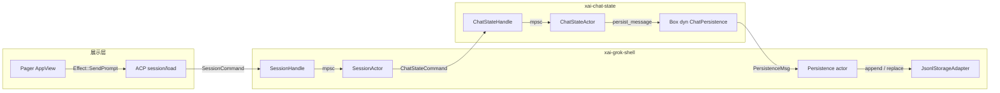
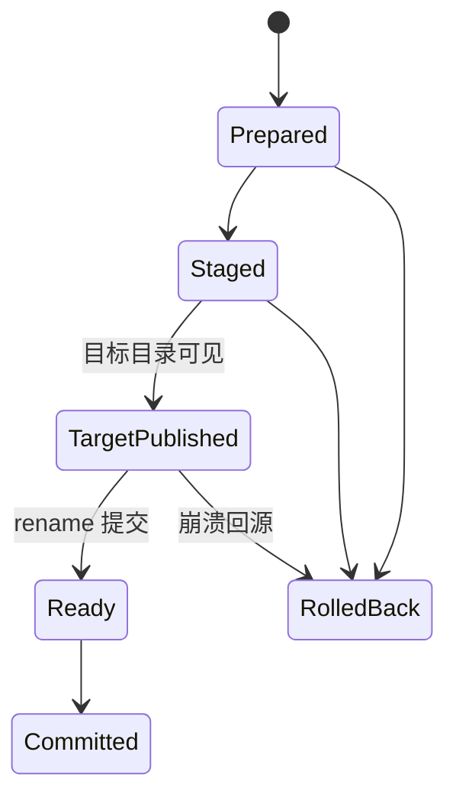
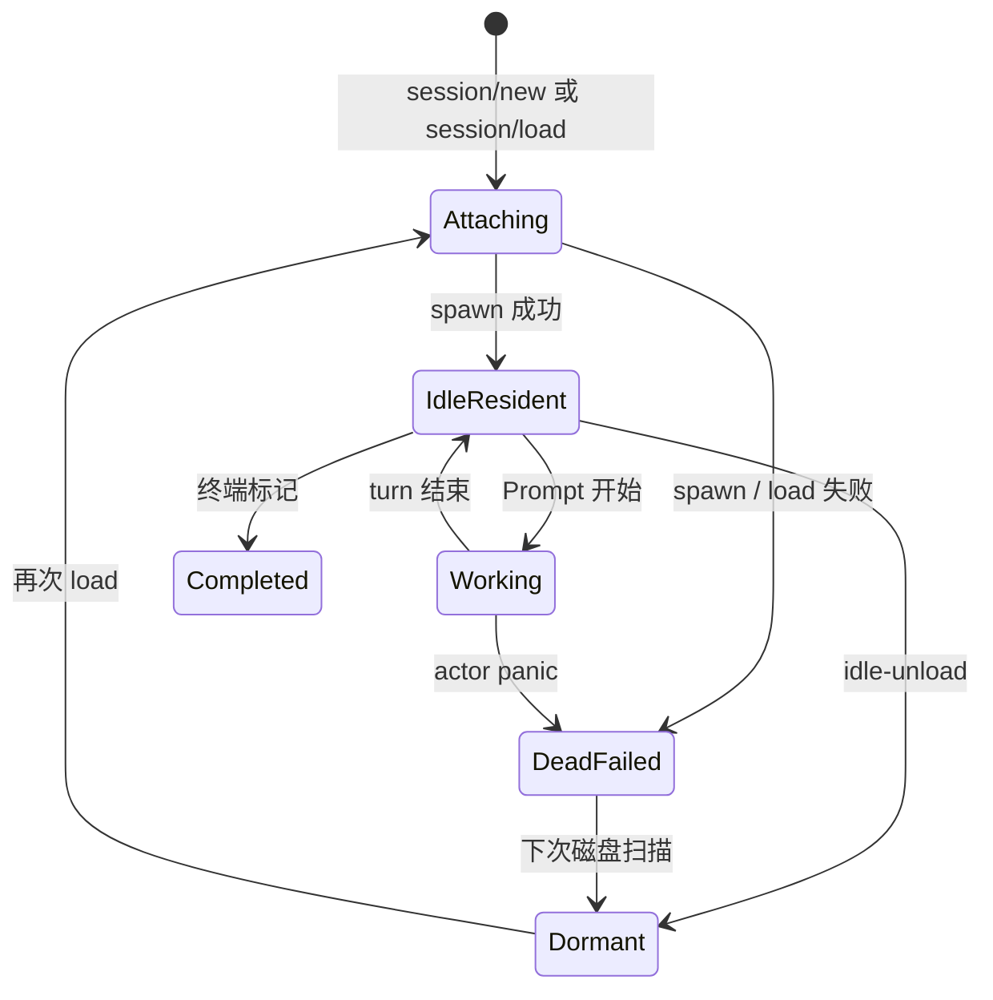
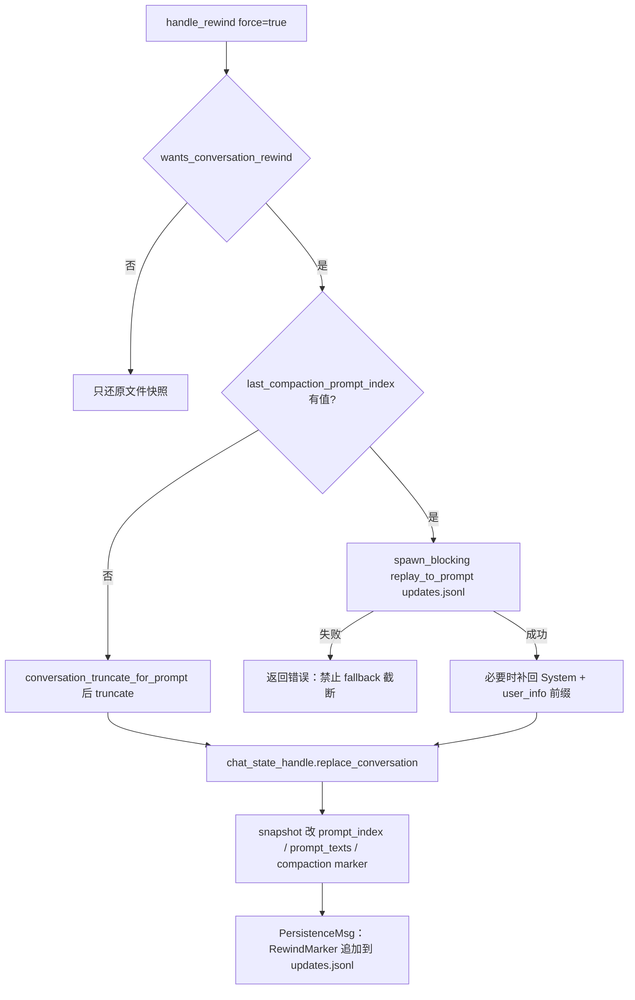
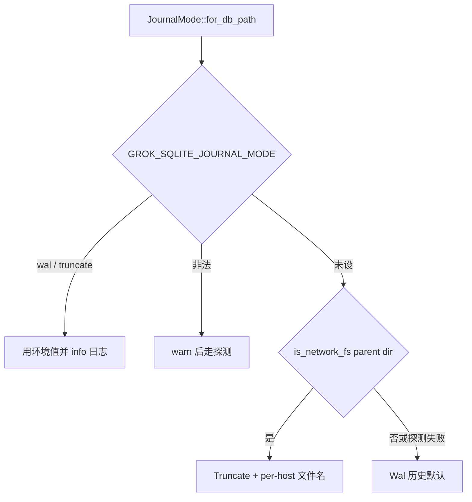

# 11 · 持久化、记忆与会话恢复

> 读完本篇应能：把会话当成磁盘上的可恢复日志来实现——JSONL append、cwd generation、六态生命周期、resume/fork/rewind，以及恢复时 dangling tool call 必须闭合。上一篇：[10-认证网络遥测与更新.md](10-认证网络遥测与更新.md) · 下一篇：[12-构建测试第三方与许可证.md](12-构建测试第三方与许可证.md)

## 快速摘要

### 架构总览（模块与依赖）

会话不是进程内对象，而是磁盘上的可恢复日志。对话事实由 `xai-chat-state` 的 `ChatStateActor` 单写者拥有；磁盘适配由 `xai-grok-shell` 的 persistence actor + `JsonlStorageAdapter` 独占。跨会话知识走另一条轨：`xai-grok-memory` 把 Markdown 切成 chunk，写入 SQLite（FTS5 + 可选 sqlite-vec），检索时做 hybrid search + MMR。SQLite 的 journal 模式由 `xai-sqlite-journal::JournalMode` 按文件系统决定，避免 NFS 上 WAL 的 `-shm` SIGBUS。

依赖方向：`SessionActor` → `ChatStateHandle`（command channel）→ `Box<dyn ChatPersistence>` → `ChannelChatPersistence` → `PersistenceMsg` → persistence actor → `StorageAdapter`。Memory 不进入这条链；它通过 `MemoryBackend` 工具和 session-end flush / dream 接到会话生命周期。

### 核心调用序列（逐步逻辑）

1. TUI 打开会话：`Effect::RegisterActiveSession` 把 `{session_id, pid, cwd}` 写入 `~/.grok/active_sessions.json`。
2. `session/new` 或 `session/load`：`MvpAgent::attach_session` 把 roster 标成 `Attaching`，`spawn_session_actor` 读 `chat_history.jsonl`，`ChatStateActor::spawn_with_pruning` 在 `ChatState::new` 里先闭合 dangling tool calls。
3. 每条对话项：`ChatStateActor::push_message` → `ChatPersistence::persist_message` → `PersistenceMsg::Chat` → `JsonlStorageAdapter::append_chat_message`（JSONL 追加 + `summary.json` 计数）。
4. cwd 切换：`ChatStateHandle::append_working_directory_switch_and_ack` 走 generation-aware 严格追加；磁盘命中同一 generation 返回 `StrictAppendAck::AlreadyPresent`。
5. 崩溃后再启动：`main()` 调 `collect_crashed()`，按 PID 存活拆分，把死进程条目交回给 roster / 恢复 UI。
6. 跨会话检索：`hybrid_search`（FTS5 ± vec KNN）→ 时间衰减 → MMR → 注入或 `memory_search` 工具。

### 易错点与边界条件

- **读路径禁止修 dangling**。`ensure_conversation_integrity` 只允许在写边界（`ChatState::new`、`push_user_message`、`BuildConversationRequest`）运行；后台读会把进行中的 tool call 误判为悬挂。
- **`ChatState::new` 只修内存**。构造时插入合成 `ToolResult`，但不会立刻 `replace_history`。磁盘回写发生在后续真正改写历史的边界（compaction / rewind / `RepairHistory` / prune）。下一次进程启动会再次在内存里修，因此幂等。
- **`RepairHistory` 必须拒绝 in-flight turn**。拒绝检查在 actor 命令处理时读 `turn_active`，而不是只在调用方检查——否则会与 turn 开始竞态。
- **cwd 切换按 generation 去重，不按文本去重**。同一 generation 的重试必须收敛到磁盘上已提交的那一条，不能再 append。
- **rewind 跨 compaction 禁止 fallback 到截断**。`updates.jsonl` replay 失败必须报错，不能按 User 条数截 `chat_history.jsonl`。
- **WAL 不能上网络盘**。`JournalMode::Truncate` 还会把 DB 改成 per-host 文件名，防止旧二进制把共享库翻回 WAL。

---

## 目录

1. [Why：会话必须是磁盘日志](#1-why会话必须是磁盘日志)
2. [What：磁盘布局与两套 Actor](#2-what磁盘布局与两套-actor)
3. [How：JSONL append 与原子替换](#3-howjsonl-append-与原子替换)
4. [How：generation-aware cwd 切换](#4-howgeneration-aware-cwd-切换)
5. [How：`SessionLiveState` 六态](#5-howsessionlivestate-六态)
6. [How：resume / fork / rewind](#6-how-resume--fork--rewind)
7. [How：记忆 chunk / embedding / MMR / dream](#7-how记忆-chunk--embedding--mmr--dream)
8. [How：SQLite journal 与网络盘](#8-howsqlite-journal-与网络盘)
9. [How：崩溃收集与 dangling 闭合](#9-how崩溃收集与-dangling-闭合)
10. [关键调用关系表](#10-关键调用关系表)
11. [测试证据](#11-测试证据)
12. [重新实现检查清单](#12-重新实现检查清单)
13. [本篇涉及的真实文件](#13-本篇涉及的真实文件)
14. [自检问题](#14-自检问题)

---

## 1. Why：会话必须是磁盘日志

终端 agent 的失败模式不是“进程优雅退出”，而是：用户按 Ctrl+C、PTY 被杀、磁盘满、NFS home、模型还在跑工具时进程崩了。如果会话状态只活在 `Arc<Mutex<Vec<Message>>>` 里，下一次启动只能从空白开始，用户会丢失上下文、权限决策和未闭合的 tool call。

因此本仓库把会话定义成 **磁盘上的可恢复日志**：

- 对话事实的规范副本是 `{session_dir}/chat_history.jsonl`（给模型 API 的消息序列）。
- UI / ACP 回放事实是 `{session_dir}/updates.jsonl`（append-only；rewind 靠插入 `RewindMarker` 表达时间线分叉，而不是改写历史行）。
- 会话元数据是 `{session_dir}/summary.json`（cwd generation、parent fork、model、计数）。
- “这个 TUI 进程此刻开着哪个会话”是 `~/.grok/active_sessions.json`（按 PID 探活，不是会话自己的终态字段）。

`SessionHandle` 上的注释把这件事说死了：grok session **没有**自己的终端 status 字段；liveness 是 **驻留（residency）+ 回合状态（turn-state）**，不是 pid。pid 只用来发现“上一次 TUI 崩了，条目还留着”。

跨会话记忆走另一条 Why：单次会话的 JSONL 会因 compaction 丢掉细节，但“这个仓库上次决定用 tokio、不要再改 schema”这类知识需要活过会话边界。所以 memory 是 Markdown 文件 + SQLite 索引，而不是把整段 `chat_history.jsonl` 再嵌入下一次 prompt。

---

## 2. What：磁盘布局与两套 Actor

### 2.1 会话目录

`JsonlStorageAdapter` 的规范路径是：

```text
{GROK_HOME}/sessions/{url_encoded_cwd}/{session_id}/
  ├── chat_history.jsonl      # ConversationItem，一行一条 JSON
  ├── updates.jsonl           # ACP / xAI SessionUpdate，append-only
  ├── summary.json            # Summary：cwd_generation、parent、model…
  ├── rewind_points.jsonl     # 每 prompt 的文件快照元数据
  ├── plan.json / plan_mode.json
  ├── signals.json
  ├── feedback.jsonl
  ├── system_prompt.txt
  ├── prompts/prompt_{n}.txt
  └── subagents/{id}/         # 子会话：Explicit session_dir，不走 cwd 编码
```

`GROK_HOME` 默认 `~/.grok`。cwd 要 URL 编码，因为路径里有 `/`。子 agent 用 `JsonlStorageAdapter::with_explicit_session_dir`，文件落在父会话目录下，避免再按子进程 cwd 分桶。

工作区切换会把整个 session 目录从 `sessions/{old_cwd}/` 搬到 `sessions/{new_cwd}/`。搬迁不是 `rename` 一下完事，而是 `relocation/` 里带 journal 的状态机（见第 4 节）。

### 2.2 两套单写者



`ChatPersistence` trait 有意用 `&mut self`：actor 独占 `Box<dyn ChatPersistence>`，不需要内部锁。生产实现 `ChannelChatPersistence` 只是把调用翻译成 `PersistenceMsg`；真正的文件 I/O 在 persistence actor 里串行执行。测试用 `MockChatPersistence`（channel 记录）和 `NullChatPersistence`（丢弃）。

`ChatState` 内部字段全部由 actor task 独占：`conversation`、`prompt_index`、`prompt_texts`、token 估计、`last_compaction_prompt_index`、turn capture 偏移。没有第二把锁。

### 2.3 记忆目录（与会话目录分开）

权威实现是 `MemoryStorage`（`storage.rs`），不是 `lib.rs` 顶部那份过时注释。workspace 目录名是 `{slug}-{hash8}`：`slug` 来自项目目录名，`hash8` 是 blake3 hex 的前 8 位。

```text
{GROK_HOME}/memory/
  ├── MEMORY.md                          # global 精选知识
  └── {slug}-{hash8}/                    # 例如 xai-a3f7b2c9
        ├── MEMORY.md                    # workspace 精选
        ├── sessions/YYYY-MM-DD-{slug}-{sid8}.md
        └── index.sqlite                 # chunks + FTS5 + 可选 vec0
```

临时目录 cwd 被标成 `ephemeral`，workspace 写入静默跳过，避免把 `/tmp/...` 污染成“项目记忆”。

---

## 3. How：JSONL append 与原子替换

### 3.1 追加：热路径

普通消息走 fire-and-forget：

1. `ChatStateActor::push_message` 先 `persist_message(&item)`，再 `conversation.push(item)`。
2. `ChannelChatPersistence::persist_message` 发送 `PersistenceMsg::Chat(item.clone())`。
3. persistence actor 调 `storage.append_chat_message`。
4. `JsonlStorageAdapter` 把一条 JSON + `\n` append 到 `chat_history.jsonl`，再 `SummaryPatch` 把 `num_chat_messages + 1`。

追加失败只打 `tracing::warn`，不回滚内存。这是有意的：会话 actor 已经把这条消息当成事实；磁盘稍后可通过 replace / repair 对齐。重实现时不要在 append 失败时把内存也丢掉，否则 UI 与下次 resume 会看到不同历史。

`updates.jsonl` 是另一条 append 流。连续 ACP 文本 chunk 会在 persistence actor 里 merge，减少行数；xAI 扩展更新直接写。rewind 往这条流 **追加** `XaiSessionUpdate::RewindMarker`，从不改已经写出的行。

### 3.2 整文件替换：冷路径

下列操作必须重写整个 `chat_history.jsonl`，因为它们不是尾部追加：

| 触发 | 符号 | 原因 |
|---|---|---|
| compaction | `replace_conversation(items, is_compaction=true)` | 历史被摘要替换 |
| rewind / fork 截断 | `replace_conversation` / `replace_chat_history` | 前缀保留、后缀丢弃 |
| dangling / dup 修复 | `ensure_conversation_integrity` → `replace_history` | 中间插入合成结果 |
| 老 tool result hard-clear | `prune_retained_conversation` | 原地改 content 后整文件写回 |
| `x.ai/session/repair` | `repair_history` | 还要剥孤儿 `ToolResult` |

原子写原语在 `session/storage/mod.rs`：`write_bytes_atomic` 写唯一 sibling tmp，再 `rename` 覆盖。崩溃或并发写都不能留下半截目标文件。macOS 上 `sync_file_durable` 额外走 `F_FULLFSYNC`，因为普通 `fsync` 可能停在易失磁盘缓存。

spawn / agent-rebuild 还有一条同步捷径 `persist_chat_history_jsonl_sync`：写 `chat_history.jsonl.sync.tmp` 再 rename。它与 persistence actor 的 `.tmp` 用不同后缀，两个 writer 谁后 rename 谁赢，内容应相同，所以不会撕文件。用途是：enrichment 后的 system prompt 必须在第一次 prompt 的 reload 竞态之前落到磁盘。

### 3.3 损坏行

加载 `chat_history.jsonl` 时，撕坏或合并的行会被跳过（resume 路径的 corruption-tolerant reader）。这正是会话被“砌死”的一种成因：某条 Assistant（带 `tool_call_id`）丢了，后面的 `ToolResult` 变成孤儿，provider 对每次请求回 400。见第 9 节的 `repair_history`。

---

## 4. How：generation-aware cwd 切换

会话目录键包含 cwd。用户把工作区从 `/old` 换到 `/new`，等于要把整棵 session 目录搬走，同时在对话里插入一条“我换目录了”的 `ConversationItem`。这两件事都必须 **按 generation 幂等**：崩溃重试不能插入第二条 switch，也不能把目录搬两次。

### 4.1 对话项上的 generation

`ConversationItem::working_directory_switch(content, generation)` 携带非零 `cwd_generation`。`Summary.cwd_generation` 是当前权威 cwd 的单调代数。`pending_cwd_switch_reminder` 暂存“搬迁完成后恰好追加一次”的提醒文本。

严格追加的 ack 类型：

```text
StrictAppendAck::Appended
StrictAppendAck::AlreadyPresent(ConversationItem)  # 磁盘上已有同一 generation

StrictAppendError::NotCommitted(io::Error)         # 字节可能没上盘，可按 generation 重试
StrictAppendError::Committed { acknowledgement, source }  # 行已提交，后续 bookkeeping 失败
StrictAppendError::Indeterminate(io::Error)        # 通道断了，必须按 generation 重试
```

### 4.2 严格追加算法

`JsonlStorageAdapter::append_cwd_switch_line_sync_with`：

1. 对 `chat_history.jsonl` 加文件锁。
2. `find_cwd_switch_generation(path, generation)` 扫描已有行；命中则返回 `AlreadyPresent(authoritative)`，**不再写入**。
3. 否则 append 一行，`flush` + durable sync + parent dir sync。
4. 然后 patch `summary.json` 的 `cwd_switch_bookkeeping_generation`。

`ChatStateActor` 收到 ack 后调用 `converge_working_directory_switch`：内存里同一 generation 的条目必须改成磁盘权威文本（或插入）。重试发送的 `"retry"` 文本会被丢掉，保留第一次成功提交的 `"authoritative"`。`MockChatPersistence` 的测试 `mock_persistence_deduplicates_working_directory_generation` 把这条契约钉死。

通道断开时 `ChannelChatPersistence` 返回 `Indeterminate`，文案是 `"retry by generation"`。调用方 **禁止** 换一个新 generation 再试。

### 4.3 目录搬迁 journal

`session/storage/relocation/` 把目录移动做成有 journal 的事务。权威边界写在模块注释里：

> source wins through `TargetPublished`; target wins from `Ready` onward.



`RelocationJournal` 字段：`session_id`、`nonce`、`source_cwd`、`target_cwd`、`cwd_generation`、`phase`。`cwd_generation == 0` 直接 `Inconsistent`。崩溃恢复看 phase 决定 `RollBackToSource` / `CommitTarget` / `VerifyCommitted`。`RelocationView` 让 `list_sessions` 在搬迁中途仍能找到会话，而不是扫到一半的空目录。

---

## 5. How：`SessionLiveState` 六态

定义在 `session/handle.rs`。这是 leader / roster 看到的粗粒度生命周期，**不是** JSONL 里的字段。

| 变体 | 含义 | roster 投影 |
|---|---|---|
| `Working` | 驻留 actor，正在跑 turn | 忙碌 |
| `IdleResident` | 驻留 actor，无 turn | 空闲但占内存 |
| `Dormant` | 在磁盘上，本进程未加载（idle-unload 或从未 load） | 可 resume |
| `Completed` | 写了终端标记，仍可 resume | 完成 |
| `DeadFailed` | actor panic / load 失败，JoinHandle 结束且无终端标记 | 可收割，下次磁盘扫描降为 Dormant |
| `Attaching` | load / resume 正在建 actor | 竞态请求必须等待 |

运行时真正的枚举是 `SessionPresence`（`session_registry.rs`），它把“证据”嵌进变体，让非法组合无法表示：

- `Resident { handle, thread, activity: Idle|Working }` — 有 handle 才叫驻留；因此不可能出现“Working 但没有 actor”。
- `Attaching { waiter, displaced, ... }` — `waiter` 是 `watch::Receiver<bool>`，并发的 `session/prompt` 等它。`displaced` 保存被替换的旧 presence，attach 失败则还原。
- `Dormant` / `Closed` / `Dead` 仍带着 optional `SessionThread`，避免 `set_live` 把 sweep 还拥有的 thread 丢掉。
- `Evicted` 故意 **不** 投影成任何 `SessionLiveState`：client 走了、actor 还在 flush，不能对外说 Dormant 或 Completed。



`SessionHandle::is_busy` 问 actor `running_task.is_some() || !pending_inputs.is_empty()`。通道断了默认返回 `true`（保守：不要 unload）。这是 leader 在 client 断开时决定是否 idle-unload 的依据。

`set_live(Attaching)` 有特殊规则：独立的 liveness 写入必须停在 `Attaching` 变体内部，只有 `settle_attach` 才能退出该变体。否则并发 `set_live(Working)` 会把“还在 load”误标成已经驻留。

---

## 6. How：resume / fork / rewind

### 6.1 Resume（`session/load`）

入口：`MvpAgent::load_session_inner` → `attach_session(..., AttachOperation::Load)`。

1. `begin_session_load` 把 roster 标成 `Attaching`，后续 `session_handle_waiting_for_load` 会阻塞在 watcher 上（有界超时）。这是为了修复“reconnect 重放 `session/load` 的同时 `session/prompt` 到达，被当成 unknown session”的竞态。
2. 若已驻留：更新 MCP servers / YOLO 等，不重新 spawn。
3. 若未驻留：`JsonlStorageAdapter` 读 `chat_history.jsonl`（跳过坏行、做 legacy 升级），`spawn_session_actor` 把 `Vec<ConversationItem>` 交给 `ChatStateActor::spawn_with_pruning`。
4. `ChatState::new` **立刻** `dedup_duplicate_tool_results` + `repair_dangling_tool_calls(..., UserCancelled)`。日志文案是 `"likely from a previous crash"`。
5. 若磁盘上有 `prompt_texts` / token / compaction marker，spawn 之后 `snapshot` + `restore_snapshot` 填回去。`restore_snapshot` 会清掉 prompt billing，session ledger 不持久化。

`session/resume` 对 chat session 直接拒绝（`session_setup.rs` 常量：请用 `session/load`）。不要实现第二套 resume API。

### 6.2 Fork

`fork_session`（`session/fork.rs`）**只拷贝磁盘文件，不启动 actor**。

- 新 ID 是 UUIDv7，恒定 36 字符；从 fork 再 fork 也不会变长。
- `CopySessionOptions`：`parent_session_id`、可选 `new_model_id`、`target_prompt_index`、`session_kind`（默认 `"fork"`，worktree 用 `"worktree"`）、`copy_compaction_segments: true`（子会话必须保留压缩前的 checkpoint，live summary 已经在 `chat_history.jsonl` 里）。
- 拷贝在 `spawn_blocking` 里跑，避免 LocalSet 上同步磁盘 I/O 把并发 fork 串行化。
- `updates.jsonl` **按行流式拷贝**，峰值内存 ≈ 一行（上限 64 MiB，超长行当损坏丢弃）。`chat_history.jsonl` 物化后再做 `fork_filter_chat` / `transform_conversation_cwd` / `conversation_truncate_for_prompt`，因为它需要随机访问，且体积被 context window 限制。
- 后端 `upsert_session` 是 fire-and-forget 遥测；本地 fork 不依赖它成功。

### 6.3 Rewind

`SessionActor::handle_rewind`。语义：**恢复到 prompt N 运行之前**，保留 `0..N-1`。

三种 mode：`All`（对话+文件）、`ConversationOnly`、`FilesOnly`。`force=false` 是纯预览：列 conflict / clean，不写盘。TUI 用它弹确认框。

对话回退：



为什么 compaction 之后不能按 User 条数截断：压缩把 N+1 条 user 消息折叠成约 3 条，`truncate_to_prompt_index` 数 User item 会切错 **所有** 压缩后目标，不只是边界。`replay_to_prompt` 从 `updates.jsonl` 重放，并认识 compaction checkpoint。

`ConversationOnly` 时文件不还原，但要把 `>= target_index` 的文件效应 merge 进上一个 rewind point（`merge_rewind_tracker_from`），这样以后 `/rewind 0` 仍能撤销全部文件改动。磁盘 merge 是权威的，防止懒加载的部分 tracker 把历史截掉。

---

## 7. How：记忆 chunk / embedding / MMR / dream

Memory 默认关闭。打开方式：`--experimental-memory` 或 `GROK_MEMORY=1`。关闭时本 crate 不被 host 初始化。

### 7.1 Chunk

`chunk_markdown`：

1. 整篇 ≤ `max_chunk_chars` → 单 chunk。
2. 否则按 `##` 及更深 header 切 section。
3. section 仍超限 → 按段落 `\n\n`，再按行。
4. 续 chunk 带祖先 header 上下文，并重叠上一段的 `chunk_overlap_chars`。

`chunk_hash` = blake3(text) hex，用作内容身份。reindex 时 hash 不变则跳过 embedding。

### 7.2 索引 schema

`schema.rs`：`SCHEMA_VERSION = 1`。

| 表 | 角色 |
|---|---|
| `meta` | embedding 维数、schema version、`reindex_claim` |
| `chunks` | id / path / 行号 / text / hash / source / access_count |
| `chunks_fts` | contentless FTS5，BM25 |
| `chunks_vec` | 仅当 sqlite-vec 加载成功：`vec0(chunk_id, embedding FLOAT[N])` |

`MemoryIndex::open_or_create` 先 `JournalMode::for_db_path`，再 `journal_mode.open`。`init_sqlite_vec` 用 `Once` + `sqlite3_auto_extension` 注册；失败则 FTS-only，搜时 `text_weight = 1.0`。维数不匹配会 `DROP` 并重建 `chunks_vec`。

`rusqlite::Connection` 是 `!Send + !Sync`。`MemoryBackendImpl` **每次查询打开新的 `MemoryIndex`**，靠 WAL（本地盘）让读者不阻塞。不要把一个 connection 塞进 `Arc` 跨 await。

### 7.3 Embedding

`EmbeddingProvider::embed_batch`。生产实现 `ApiEmbeddingProvider`：OpenAI 兼容 HTTP，batch 32，429/5xx 最多 3 次指数退避（1s/2s/4s）。`chunks_vec` **就是缓存**，没有第二层 cache。

`embed_missing_chunks` 查出未嵌入的 chunk，batch upsert。凭据经 `EndpointScopedCredentials::for_endpoint`：只有受信任 endpoint 才带上 session 的 auth；否则丢掉，避免把第一方 key 打到第三方 embedding URL。

### 7.4 Hybrid search + MMR

`hybrid_search` 流水线（`search.rs` 注释即契约）：

1. FTS5 关键词。
2. 若有 embedding：vec KNN。
3. 按 `chunk_id` 合并，分数归一化到 \[0,1\]。
4. 丢掉空/脚手架 chunk（自动生成的 `MEMORY.md` stub）。
5. 时间衰减：`global` / `workspace` evergreen（×1.0）；`session` 指数半衰期 `e^(-ln2 / half_life_days * age_days)`。
6. source 权重 + access_count 加成，`min_score` 过滤；排序用 **未 clamp** 的分数，写入结果的 display score 再 clamp。
7. `mmr_rerank`：`MMR = λ·relevance − (1-λ)·max Jaccard(selected)`。Jaccard 在小写 token 集合上算，不需要向量。`λ == 1` 或不足 2 条则 no-op。
8. `max_results` 截断。

`&MemoryIndex` 不跨越 `.await`，这样调用方 future 可以是 `Send`。

### 7.5 Dream

Dream 是把最近 session 日志合成进 `MEMORY.md` 的离线整理。`check_dream_gates` 最便宜的门先判：

1. `dream.enabled`
2. 距上次整理 ≥ `min_hours`
3. 新增 session 数 ≥ `min_sessions`

过门后再拿 `DreamLock`。输入上限 `MAX_DREAM_INPUT_CHARS = 32_000`；超出的 stem **不算** `cleaned_stems`，成功后只删真正读过并写入索引的那些文件。模型若回 `NO_REPLY` → `NothingToConsolidate`。system prompt 要求：合并主题、用绝对日期、丢掉问候和 tool 噪音、保留决策与架构。

会话侧胶水在 `acp_session_impl/memory_dream.rs`：turn 结束 flush、注册 `memory_search` / `memory_get`、first-turn injection 用单独的 `search_source = "injection"` 以免污染工具检索阈值。

---

## 8. How：SQLite journal 与网络盘

WAL 依赖相干共享内存和可靠 POSIX lock。`$HOME` 在 NFS 上时，对端重建 `-shm` 会让本进程下一次 wal-index 读 SIGBUS。`xai-sqlite-journal` 的对策：



- Linux：`statfs` magic（NFS/SMB/CIFS/9p/AFS/Ceph/Lustre/GPFS/FUSE/WekaFS…）。
- macOS：没有 `MNT_LOCAL` 视为远程；`nfs/smbfs/macfuse` 名称即使标了 local 也当网络。
- Windows：UNC 路径或 `GetDriveTypeW == DRIVE_REMOTE`。
- 探测失败 → 当作本地（保持历史 WAL）。

`Truncate` 模式下 `effective_db_path("worktrees.db")` → `worktrees.h-{host}.db`。旧二进制不知道这个名字，无法把共享 DB 翻回 WAL。这些 DB 都是可重建索引，每台机器从空开始可接受。

`open_readonly` 在 Truncate 下其实以读写 fd 打开（无 CREATE）再 `query_only=1`：因为只读 fd 无法对 WAL 遗留文件做 EXCLUSIVE 转换（`SQLITE_IOERR_LOCK`）。忙等待：`busy_timeout` 5s + `BUSY_RETRY_BUDGET` 10s，避免 journal 转换时的 fail-fast `SQLITE_BUSY`。

Memory 索引、worktree 池等凡是 SQLite 的消费者都应走 `JournalMode::open`，不要自己 `PRAGMA journal_mode=WAL`。

---

## 9. How：崩溃收集与 dangling 闭合

### 9.1 `collect_crashed`

`active_sessions.json` 跟踪 **开着的 TUI 会话**，不是会话终态。

- 打开：`Effect::RegisterActiveSession` → `register`（按 `session_id` 幂等替换）。
- 干净退出：`Effect::UnregisterActiveSession`。信号处理器走 `try_unregister`：锁争用返回 `Ok(false)`，孤儿留给下次 `collect_crashed`。
- 下次 `main()` 在装 crash handler 之后、建 Tokio runtime 之前调用 `collect_crashed()`。实现：排他锁 → 按 `is_pid_alive` partition → 活的写回，死的返回。Unix 用 `kill(pid, 0)`；`EPERM` 视为还活着（进程存在但无权限）。损坏的 JSON 当空列表，不让启动失败。

PID 探活 **不能**代替 `SessionLiveState`。一个 leader 进程里可以驻留许多 session，它们共享一个 pid。

### 9.2 Dangling tool call 必须闭合

模型 API 要求：每个 assistant `tool_calls[].id` 后面紧跟匹配的 `ToolResult`，且同一 id 只能有一条结果。违反则 400，会话永久砌死。

悬挂来源：

- 用户在工具执行中取消（Ctrl+C）。
- 进程在 `push_assistant` 与 `push_tool_result` 之间崩溃。
- tokio task 在 `.await` 点被 abort。
- JSONL 坏行跳过，Assistant 行消失，ToolResult 变成孤儿。

`DanglingToolCallReason`（`xai-grok-sampling-types`）决定合成结果的措辞，让模型知道该重试还是停：

| 变体 | 合成文本要点 | 生产者 |
|---|---|---|
| `UserCancelled` | `cancelled by the user`；默认/崩溃恢复 | `ChatState::new`、`push_user_message`、`BuildConversationRequest` |
| `HarnessHalted { class }` | `halted by the harness ({class})` | harness halt、`repair_history` 的 `class: "history_repair"` |

`repair_dangling_tool_calls` 全表正向扫描：对每个带 `tool_calls` 的 Assistant，只看 **紧随其后的连续 ToolResult 段**。缺的按原始 call 顺序插入合成结果。必须全表扫描，因为换过 provider 的老会话悬挂不一定在尾部。

`dedup_duplicate_tool_results`：同一 `tool_call_id` 在连续结果段里出现多次时 **只留最后一条**（真实结果），删掉取消时插入的合成重复。`chat_history_integrity_tests.rs` 用真实 turn loop 钉死：中途注入 user reminder 不得留下双结果。

### 9.3 两层修复，不要混用

| API | 做什么 | 何时 |
|---|---|---|
| `repair_dangling_tool_calls` | 为未回答的 call **插入**合成结果 | 每个写边界；`ChatState::new` |
| `repair_history` | dedup → `strip_displaced_tool_results` → 再插入合成 | `ChatStateCommand::RepairHistory` / `x.ai/session/repair` |

`repair_history` 更狠：它删除 **位置不对** 的 ToolResult（所有者行被跳过、或结果跑到别的 Assistant 后面）。这是砌死会话的形状。`sanitize_compacted_history` 更松（只要前面某处见过 id 就留），只用于 compaction 输出，不能拿来修砖。

`RepairHistory` 处理：

1. 调用方 `handle_repair_history` 先看 `session_turn_active`（**每会话** flag，不是 agent 全局 `is_turn_active`）。
2. 命令到达 ChatState actor 时 **再读一次** `turn_active`。调用方检查单独会与 turn 开始竞态：turn 可能在检查之后、命令入队之前把 assistant tool calls 推进来，修复会把 in-flight call 当成悬挂。
3. 若 blocked → `RepairHistoryBlocked`（“stop the turn first”）。
4. 非 dry-run 且 `changed()` → `PersistenceMsg::FlushAndAck`，成功必须意味着 `chat_history.jsonl` 已重写。

非驻留会话走磁盘轨：`extensions/repair.rs` 用 resume 同款 reader 加载 → `repair_history` → `replace_chat_history`。

`BuildConversationRequest` 在组请求前再跑一次 `ensure_conversation_integrity`。注释强调：这个 command 只由 agent loop 在 turn 之间发出，从不由后台任务发出。读命令（`GetConversation` 等）**禁止**修复。

---

## 10. 关键调用关系表

| 调用方文件与符号 | 关系 | 被调用方文件与符号 | 触发与输入 | 返回与后续处理 | 错误、状态与副作用 |
|---|---|---|---|---|---|
| `pager/.../effects/mod.rs` `Effect::RegisterActiveSession` | 调用 | `active_sessions::register` | TUI 打开会话，`session_id`+pid+cwd | 写入 `active_sessions.json` | 失败只 warn；锁争用由下次 collect 清理 |
| `pager-bin/main.rs` `main` | 调用 | `collect_crashed` | 启动，crash handler 之后 | 死 PID 条目列表 | 损坏文件当空；Unix `kill(0)` |
| `mvp_agent/session_setup.rs` `attach_session` | 编排 | `spawn_session_actor` | `session/load` 且未驻留 | 新 `SessionHandle` | roster=`Attaching`；失败 → `DeadFailed` |
| `acp_session_impl/spawn.rs` `spawn_session_actor` | 构造 | `ChatStateActor::spawn_with_pruning` | 磁盘 `conversation` + `ChannelChatPersistence` | `ChatStateHandle` | `ChatState::new` 内存修 dangling |
| `actor/mutations.rs` `push_message` | 调用 | `ChatPersistence::persist_message` | 任意非严格消息 | fire-and-forget | 先 persist 再 push 内存 |
| `chat_persistence.rs` `persist_message` | 发送 | `PersistenceMsg::Chat` | item clone | persistence actor append JSONL | 通道关则丢 |
| `handle.rs` `append_working_directory_switch_and_ack` | oneshot | `AppendWorkingDirectorySwitchAndAck` | `NonZeroU64` generation | `StrictAppendAck` | 失败按 generation 重试 |
| `jsonl/mod.rs` `append_cwd_switch_line_sync_with` | 磁盘 | 同 generation 扫描 + append | 文件锁 | `AlreadyPresent` 或 `Appended` | `NotCommitted` vs `Committed` |
| `actor/mod.rs` `BuildConversationRequest` | 调用 | `ensure_conversation_integrity` | turn 之间组 API 请求 | 修复后的 `ConversationRequest` | 写边界才修；可能 `replace_history` |
| `rewind.rs` `handle_rewind` | 调用 | `replay_to_prompt` 或 truncate | `force=true` + mode | `replace_conversation` + RewindMarker | 跨 compaction replay 失败禁止截断 |
| `fork.rs` `fork_session` | 调用 | `copy_session_data_sync` | 源/目标 Info + options | 新 session 目录 | blocking 线程；后端 upsert 后台 |
| `extensions/repair.rs` `handle_session_repair` | 分派 | resident：`SessionCommand::RepairHistory`；else 磁盘 `repair_history` | `x.ai/session/repair` | `RepairSessionResponse` | in-flight → `RepairHistoryBlocked` |
| `memory/search.rs` `hybrid_search` | 调用 | FTS + 可选 vec + `mmr_rerank` | query + `MemorySearchConfig` | `Vec<SearchResult>` | 无 vec 则 FTS-only |
| `memory/index.rs` `open_or_create` | 调用 | `JournalMode::for_db_path` + `open` | db 路径 | `MemoryIndex` | 网络盘 Truncate + per-host 名 |

代表性恢复链：

```text
main
  → collect_crashed
  → （用户选崩溃会话）session/load
  → attach_session（Attaching）
  → load chat_history.jsonl
  → ChatState::new（内存闭合 dangling）
  → 下次 Prompt
  → BuildConversationRequest → ensure_conversation_integrity（通常 no-op）
  → Sampler 看到成对的 tool_call / tool_result
```

---

## 11. 测试证据

| 测试 | 钉住的契约 |
|---|---|
| `xai-chat-state` `mock_persistence_deduplicates_working_directory_generation` | 同 generation 第二次 ack 是 `AlreadyPresent`，文本保持第一次 |
| `xai-chat-state` `build_request_repairs_dangling_tool_calls` | 修复发生在 `ChatState::new`，不是 build_request 本体 |
| `xai-chat-state` actor tests：`RepairHistory` 在 turn_active 时返回 `RepairHistoryBlocked` | 竞态安全拒绝 |
| `active_sessions.rs` `collect_crashed_partitions_by_pid_liveness` | 活 PID 留下、死 PID 返回 |
| `active_sessions.rs` `try_unregister_skips_if_locked` / `corrupt_file_recovers` | 信号路径与损坏恢复 |
| `extensions/repair.rs` 测孤儿 `call_LOST` | 磁盘轨剥孤儿并写回 |
| `acp_session_tests/turn/chat_history_integrity_tests.rs` | 中途 user 注入不得双 `tool_result` |
| `acp_session_tests/rewind_cross_compaction_tests.rs` | 压缩后 rewind 走 replay |
| `jsonl/copy.rs` / `tests/test_fork_copy_memory.rs` | fork 流式拷贝与内存上限 |
| `xai-sqlite-journal` `network_mode_survives_legacy_wal_flip_back` | per-host 文件不受旧 WAL 共享库影响 |
| `xai-grok-memory` schema / MMR 单测 | 无 vec 时 schema 不含 `chunks_vec`；λ=1 不重排 |

未覆盖风险（推断）：`ChatState::new` 修复后到第一次 `replace_history` 之间崩溃，磁盘仍悬挂；下一次启动再次内存修复，因此产品可接受，但若有外部工具直接读 JSONL 会看到未闭合历史。

---

## 12. 重新实现检查清单

必须保持的行为契约：

1. 对话事实单写者；JSONL append 与 replace 分开。replace 必须原子 rename。
2. 每个 tool call id 在发给模型之前必须闭合；合成结果带可区分 reason。
3. 读路径不修历史。`RepairHistory` 与 turn 开始在同一 actor 队列上互斥。
4. cwd 切换按非零 generation 去重；不确定错误按同一 generation 重试。
5. 目录搬迁有 journal；`TargetPublished` 前源权威，`Ready` 后目标权威。
6. `SessionLiveState` 六态；`Attaching` 有 waiter；`Working` 必须有 resident handle。
7. fork 不启动 actor；`updates.jsonl` 流式拷贝；compaction segments 一起拷。
8. rewind 跨 compaction 只用 replay，失败就失败。
9. SQLite：本地 WAL，网络 Truncate + per-host 文件。
10. Memory 默认关；检索 FTS 可单独工作；MMR 用文本 Jaccard 即可。

可以替换的实现：JSONL 换成 SQLite（`StorageAdapter` 已预留）；embedding 换成本地模型；dream 换成规则合并。不要替换：tool call 闭合不变量、generation 幂等、replay 与截断的分界。

建议实现顺序：① `ChatPersistence` + JSONL append/replace → ② `ChatState::new` 修 dangling → ③ persistence actor 串行化 → ④ `collect_crashed` → ⑤ cwd generation → ⑥ fork 拷贝 → ⑦ rewind truncate → ⑧ compaction replay → ⑨ memory FTS → ⑩ vec + MMR + dream。

---

## 13. 本篇涉及的真实文件

| 路径 | 角色 |
|---|---|
| `crates/codegen/xai-chat-state/src/persistence.rs` | `ChatPersistence` trait、Mock/Null |
| `crates/codegen/xai-chat-state/src/commands.rs` | `RepairHistory`、`StrictAppendAck` |
| `crates/codegen/xai-chat-state/src/actor/mutations.rs` | 完整性修复、push、replace、cwd converge |
| `crates/codegen/xai-chat-state/src/actor/state.rs` | `ChatState::new` 启动修复 |
| `crates/codegen/xai-chat-state/src/compaction_utils.rs` | `repair_history` / `HistoryRepairReport` |
| `crates/codegen/xai-grok-shell/src/session/chat_persistence.rs` | `ChannelChatPersistence` |
| `crates/codegen/xai-grok-shell/src/session/persistence.rs` | `PersistenceMsg`、`Summary.cwd_generation` |
| `crates/codegen/xai-grok-shell/src/session/storage/jsonl/mod.rs` | JSONL append / cwd 严格追加 |
| `crates/codegen/xai-grok-shell/src/session/storage/jsonl/copy.rs` | fork 流式拷贝 |
| `crates/codegen/xai-grok-shell/src/session/storage/relocation/` | cwd 目录搬迁 journal |
| `crates/codegen/xai-grok-shell/src/session/handle.rs` | `SessionLiveState` |
| `crates/codegen/xai-grok-shell/src/session/fork.rs` | `fork_session` |
| `crates/codegen/xai-grok-shell/src/session/acp_session_impl/rewind.rs` | rewind / repair 入口 |
| `crates/codegen/xai-grok-shell/src/active_sessions.rs` | `collect_crashed` |
| `crates/codegen/xai-grok-shell/src/extensions/repair.rs` | `x.ai/session/repair` |
| `crates/codegen/xai-grok-sampling-types/src/conversation.rs` | `DanglingToolCallReason`、`repair_dangling_tool_calls` |
| `crates/codegen/xai-grok-memory/src/` | chunk / index / search / mmr / dream |
| `crates/codegen/xai-sqlite-journal/src/lib.rs` | WAL vs Truncate |
| `crates/codegen/xai-grok-pager-bin/src/main.rs` | 启动时收集崩溃会话 |
| `crates/codegen/xai-grok-pager/src/app/effects/mod.rs` | register / unregister active session |

## 14. 自检问题

1. 为什么 `updates.jsonl` 在 rewind 时追加 marker，而 `chat_history.jsonl` 整文件替换？
2. `ChatState::new` 修了 dangling 却不写盘，下一次 API 请求为什么仍然安全？
3. 同一 `cwd_generation` 重试时，内存文本和磁盘文本以谁为准？
4. `RepairHistory` 为什么必须在 ChatState actor 内部重读 `turn_active`？
5. compaction 之后 rewind 到压缩点之前，为什么不能 `truncate` User 条数？
6. `SessionLiveState::Working` 和 `active_sessions.json` 里的 pid 各回答什么问题？
7. NFS home 上 memory 索引应打开哪个文件名、哪种 journal？
8. fork 时为什么 `chat_history.jsonl` 可以物化、`updates.jsonl` 必须流式？

阅读源码建议顺序：`persistence.rs`（trait）→ `chat_persistence.rs` → `storage/jsonl/mod.rs` 的 append → `mutations.rs` 的 integrity → `conversation.rs` 的 `repair_dangling_tool_calls` → `active_sessions.rs` → `handle.rs` 的 live state → `rewind.rs` → `fork.rs` → `xai-grok-memory` 的 `search.rs` / `dream.rs` → `xai-sqlite-journal`。

下一篇：[12-构建测试第三方与许可证.md](12-构建测试第三方与许可证.md)
