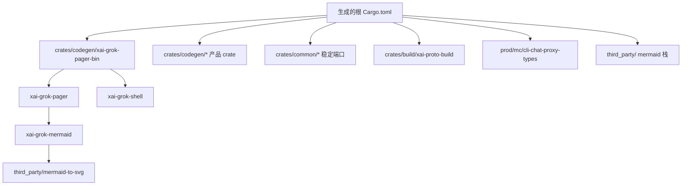
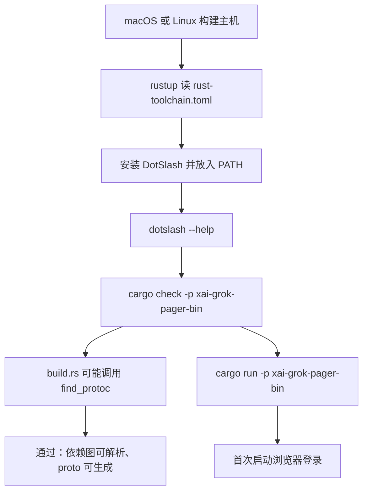
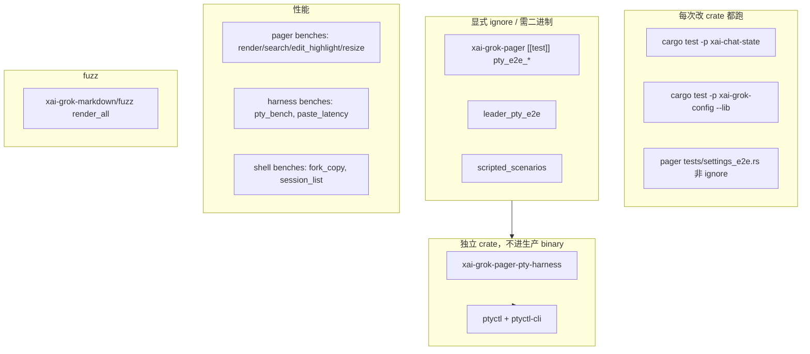

# 12 · 构建、测试、第三方与许可证

> 读完本篇应能：在干净机器上构建、按 crate 测试，并分清第一方 Apache-2.0、vendored Mermaid、以及 tools 里的 codex/opencode 移植义务。上一篇：[11-持久化记忆与会话恢复.md](11-持久化记忆与会话恢复.md) · 下一篇：[13-跨模块完整运行链.md](13-跨模块完整运行链.md)

## 快速摘要

### 架构总览（模块与依赖）

本篇不是运行时模块，而是 **把源码变成可运行二进制、可验证测试、可合法分发产物** 的工程层。组合根只有 `xai-grok-pager-bin`（产物名 `xai-grok-pager`，发行安装名 `grok`）。根 `Cargo.toml` 是生成文件：workspace members、依赖版本、lint、profile 都从上游 monorepo 同步而来，日常改依赖应改各 crate 的 `Cargo.toml`。工具链由 `rust-toolchain.toml` 钉死 `1.94.0`。protobuf 生成走 `xai-proto-build`，通过 DotSlash 包装的 `bin/protoc`（v29.3）或 `$PROTOC` / PATH 回退。Unix 默认链接 jemalloc。测试分成 crate 单测、被 `#[ignore]` 的 PTY E2E（`ptyctl` + `xai-grok-pager-pty-harness`）、markdown fuzz、若干 `harness = false` 的 bench。`third_party/` 是 vendored Mermaid 布局栈，不是第一方架构。工具实现里的 codex / opencode 移植另有许可证义务。

### 核心调用序列（逐步逻辑）

1. `rustup` 读 `rust-toolchain.toml`，装 `1.94.0` + rustfmt/clippy。
2. 开发者执行 `cargo check -p xai-grok-pager-bin`（或 `cargo run -p xai-grok-pager-bin`）。
3. 若依赖 `xai-grok-tools-api`，其 `build.rs` 调 `xai_proto_build::configure().compile_protos(...)`。
4. `find_protoc`：`$PROTOC` → 向上找 `bin/protoc`（DotSlash 包装器）→ PATH 上的 `protoc`。GitHub Actions 找不到则硬失败。
5. Unix + feature `jemalloc`：`#[global_allocator]` 换成 `tikv_jemallocator::Jemalloc`。
6. 验证：`cargo test -p <crate>`；PTY 场景另编 pager 二进制并设 `PAGER_BINARY`。
7. 分发：`--features release-dist` + profile `release-dist`（thin LTO、codegen-units=1、留符号给 CI 抽 debug sidecar）。

### 易错点与边界条件

- **手改根 `Cargo.toml` 会在下次同步被覆盖。** README 与文件头都写明它是 generated。
- **没装 DotSlash 时 `bin/protoc` 无法执行。** 本地会 fallback 到 PATH；CI（`GITHUB_ACTIONS`）则报错。错误文案会提示 `cargo install dotslash`。
- **不要 `cargo test --workspace` 当日常命令。** 全 workspace 慢，且会试图编 PTY harness、fuzz 外围和大量 ignore 测试的空壳。
- **PTY E2E 默认 `#[ignore]`。** 普通 `cargo test -p xai-grok-pager` 不会驱动真实 TUI；漏设 `PAGER_BINARY` 会在选跑时失败。
- **jemalloc 只在 Unix。** Windows 走系统分配器；`malloc_conf` 在 macOS 导出名为 `_rjem_malloc_conf`。
- **许可证分层不要抄错：** 第一方 Apache-2.0；crates.io 闭包看 `THIRD-PARTY-NOTICES`；vendored Mermaid 看 `third_party/NOTICE`；工具移植看 `xai-grok-tools/THIRD_PARTY_NOTICES.md`。发行构建故意省略 CDDL/EPL/WTFPL 包。
- **`lib.rs` 注释与 `MemoryStorage` 路径格式曾经不一致**（见第 11 篇）；构建文档里同类风险是：`third_party/*/Cargo.toml` 头注释才是 re-vendor 清单，不要只信目录名。

---

## 目录

1. [Why：生成的 workspace 根](#1-why生成的-workspace-根)
2. [What：工具链、成员、profile、feature](#2-what工具链成员profilefeature)
3. [How：从干净机器到 `cargo check -p`](#3-how从干净机器到-cargo-check--p)
4. [How：DotSlash 与 protoc 代码生成](#4-howdotslash-与-protoc-代码生成)
5. [How：jemalloc 与发行 profile](#5-howjemalloc-与发行-profile)
6. [How：测试矩阵](#6-how测试矩阵)
7. [How：vendored Mermaid 栈](#7-howvendored-mermaid-栈)
8. [How：许可证与移植代码](#8-how许可证与移植代码)
9. [关键关系表](#9-关键关系表)
10. [重新实现验收清单](#10-重新实现验收清单)
11. [本篇涉及的真实文件](#11-本篇涉及的真实文件)
12. [自检问题](#12-自检问题)

---

## 1. Why：生成的 workspace 根

这个仓库是从 SpaceXAI monorepo **周期性同步**出来的切片。根目录 `SOURCE_REV` 记录对应的上游 commit（分析当日文件内容为 `796754a8bf947b7c6c579049f94c7cfd0ac0ec03`，与 git HEAD `008a48d…` 不是同一个对象：前者是上游标记，后者是本 git 仓库最近一次文档提交）。

在 monorepo 里，workspace members、`[workspace.dependencies]` 版本、`[profile.*]`、`[workspace.lints.clippy]` 由生成器统一写出，避免八十多个 crate 各自 pin 不同的 tokio。因此根 `Cargo.toml` 第一行是：

```text
# Auto-generated workspace root. Prefer editing per-crate Cargo.toml files.
```

README 用 IMPORTANT 再强调一次：把它当只读。重实现者若把这个仓库当独立项目养，可以开始手改根文件，但必须知道：**往回同步时生成器会覆盖你的改动**。正确的日常改法是编辑 `crates/.../foo/Cargo.toml` 的 `[dependencies]`，让生成器（或下一次人工同步）把版本抬到 workspace 表。

为什么不能“第一天就复制 80 个 crate”：crate 切分是编译隔离和测试边界的演进结果。构建层真正必须先复制的是：

- 一个 workspace 根（哪怕只有 3 个 member）
- 钉死的 `rust-toolchain.toml`
- 一个组合根 binary crate
- 一套“改叶子、不改生成根”的习惯

---

## 2. What：工具链、成员、profile、feature

### 2.1 工具链契约

`rust-toolchain.toml`：

| 字段 | 值 | 含义 |
|---|---|---|
| `channel` | `1.94.0` | 手动 bump，一次一个 point version，发布后等几周再升 |
| `components` | `rustfmt`, `clippy` | 格式与 lint 与编译器同版本 |
| `profile` | `default` | 覆盖用户全局 rustup profile |
| `targets` | `x86_64-unknown-linux-gnu`, `aarch64-unknown-linux-gnu` | 额外安装的交叉目标；host 会自动加上 |

注释要求 bump 后跑：

```text
cargo check --all-targets --workspace
cargo clippy --all-targets --workspace
```

这是 **工具链升级验收**，不是日常开发命令。日常仍应 `-p`。

`[workspace.package]`：`edition = "2024"`，`license = "Apache-2.0"`。叶子 crate 写 `edition.workspace = true`。

### 2.2 Workspace 成员长什么样

`[workspace].members` 按目录分成四类（完整名单以根 `Cargo.toml` 为准，约 80+）：



`[patch.crates-io]` 目前只 patch `async-openai` 到 `github.com/our-forks/async-openai.git` 的固定 rev。重实现若不用 Responses API 分叉，可以不 patch，但不要无声换成 crates.io 上行为不同的版本。

### 2.3 Profile

| Profile | inherits | 要点 |
|---|---|---|
| `dev` | （默认） | `panic = "abort"`，`codegen-units = 128`，`incremental = true`，`opt-level = 0` |
| `release` | （Cargo 默认） | 本地 `--release` |
| `release-dist` | `release` | `lto = "thin"`，`codegen-units = 1`，`strip = false`，`debug = 1`，给 CI 抽 `.debug` / `.dSYM` |
| `release-dist-jemalloc` | `release-dist` | **故意与父 profile 相同的别名**，桌面流水线用名字而不绑 CLI 名 |
| `x-prod` | `release` | 延迟敏感服务；`debug = "line-tables-only"`，`panic = "unwind"` |
| `bench` | | `debug = true` |

链接硬化（RELRO、NX stack）在 `.cargo/config.toml` 按目标设置，不在 `Cargo.toml`。

`dev` 的 `panic = "abort"` 意味着开发构建里 panic 不跑析构。测试若依赖 `Drop` 清理临时文件，应自己 `defer` 或用 RAII 且假设 abort 不跑 drop——这是重实现时容易踩的差异。

### 2.4 组合根 feature

`xai-grok-pager-bin/Cargo.toml`：

```text
default = ["jemalloc", "sandbox-enforce"]
jemalloc = [tikv-jemallocator, tikv-jemalloc-sys, tikv-jemalloc-ctl]
sandbox-enforce → xai-grok-pager/sandbox-enforce
local-workspace → xai-grok-pager/local-workspace
release-dist → xai-grok-pager/release-dist
default-bazel = jemalloc + sandbox-enforce + local-workspace
```

`tikv-jemallocator` 的 `stats` feature **只在 binary crate 打开**，不是 workspace 全局，这样 CLI 才能 `mallctl` `stats.allocated` / `stats.resident`，而不强迫所有依赖开 stats。

二进制名为 `xai-grok-pager`，`default-run` 同名。独立成 package 的原因写在 Cargo.toml：`xai-grok-pager-minimal` 依赖 pager 库，若 pager 再依赖 minimal 会成环。IoC 钩子在 `main.rs` 启动时安装。

---

## 3. How：从干净机器到 `cargo check -p`

README「Building from source」是权威步骤。按源码核实后的顺序：



Windows：README 写明 best-effort，本树 **未**从该路径测试。`rust-toolchain.toml` 也没列 windows target。

推荐命令（与 README / 第 00 篇一致，这里映射到真实 crate）：

```sh
cargo check -p xai-grok-pager-bin            # 组合根能否编译
cargo build -p xai-grok-pager-bin --release  # target/release/xai-grok-pager
cargo test  -p xai-chat-state                # 只测一个领域 crate
cargo test  -p xai-grok-config --lib
cargo clippy -p xai-grok-pager-bin
cargo fmt --all
```

全 workspace `check/clippy --all-targets` 留给工具链 bump 和 CI。本地用它会把 `ptyctl`、`xai-grok-pager-pty-harness`、`third_party/*` 全部拉进编译图，耗时长且失败点分散。

Clippy 最近的 `clippy.toml` **不合并**：`crates/codegen/**` 若自带一份必须重复根配置。codegen 这份额外 `disallowed-methods`：禁止 `std::fs::canonicalize`（Windows `\\?\` 路径）、禁止未登记的 `Command::spawn`（子进程必须 `ProcessScope::enroll`）。重实现若没有这些禁令，Windows 路径和孤儿进程问题会在很晚才出现。

---

## 4. How：DotSlash 与 protoc 代码生成

### 4.1 `bin/protoc` 是什么

`bin/protoc` 不是编译好的二进制，而是 DotSlash 清单（shebang `#!/usr/bin/env dotslash`）。它按平台下载 GitHub `protocolbuffers/protobuf` **v29.3** 的 zip，校验 sha256，解出 `bin/protoc`。列出的平台包括 `macos-aarch64`、`linux-x86_64`、`linux-aarch64`（文件中还有后续平台条目）。没有 DotSlash，内核会试图把 JSON 当可执行文件跑，`protoc --version` 失败。

### 4.2 `find_protoc` 搜索顺序

`crates/build/xai-proto-build/src/find_protoc.rs`：

1. **`$PROTOC`** — Bazel `build_script_env` 和用户覆盖。指向真正的 hermetic 二进制，而不是 wrapper。
2. **从 cwd 向上走，找相对路径 `bin/protoc`**。返回相对路径，让 build 更确定。存在但执行失败（远程执行环境没有 `dotslash`）→ 打印原因，**不 fatal**，继续。
3. **PATH 上的 `protoc`**。
4. 都没有：若 `GITHUB_ACTIONS` 有值 → `Err`；否则 `eprintln` 并 `Ok(None)`（Docker 镜像缺工具时不把所有人的 build.rs panic）。

`check_protoc_good` 跑 `protoc --version`；失败信息明确写 `likely dotslash is missing; try cargo install dotslash`。

### 4.3 `XaiProtoBuilder`

`xai-proto-build` 包装 `tonic-prost-build`，可选 `pbjson-build`。当 `$PROTOC` 指向 `.../bin/protoc` 时，include 目录试 `.../include`（Bazel 沙箱里二进制和 well-known types 不在一起，必须 `-I`）。

消费者样本：`xai-grok-tools-api/build.rs`：

```text
xai_proto_build::configure()
  .type_attribute(".", "#[derive(serde::Serialize, serde::Deserialize)]")
  .field_attribute(".xai.grok.tools.v1.ToolConfigEntry.params_json", "#[serde(default)]")
  …（只给 optional 字段 default，id 缺失仍反序列化失败）
  .compile_protos(&["proto/grok-tools.proto"], &["proto/"])
```

契约测试在 `tests/wire_shape.rs`：稀疏 JSON 必须能 deserialize，但缺 `id` 不行。重实现生成代码时不要图省事给整个 message `#[serde(default)]`。

没有 proto 的 crate（pager、chat-state）不经过这一步。因此 `cargo check -p xai-chat-state` 可以在没装 DotSlash 的机器上过；`cargo check -p xai-grok-pager-bin` 只要依赖图碰到 `xai-grok-tools-api` 就会要 protoc。

---

## 5. How：jemalloc 与发行 profile

### 5.1 何时启用

`main.rs` 顶部：

```text
#[cfg(all(feature = "jemalloc", unix))]
#[global_allocator]
static GLOBAL: tikv_jemallocator::Jemalloc = tikv_jemallocator::Jemalloc;
```

默认 feature 含 `jemalloc`，所以 Unix 开发/发行构建都用它。`cfg(unix)` 把 Windows 排除在外。

`release-dist` **并且** `jemalloc` 时编译 `jemalloc_malloc_conf` 模块：导出 C 符号 `malloc_conf`（macOS/iOS 为 `_rjem_malloc_conf`），内容：

```text
prof:true,prof_active:false,lg_prof_sample:19,prof_final:false
```

即：编译进 profiling 但默认不 active；采样 2^19；进程结束不自动 dump。运行时用 `jemalloc_set_prof_active` / `mallctl` 打开。另有 `purge_jemalloc_retained_pages`（arena purge，把 retained 页还 OS）和 `jemalloc_allocator_stats`（epoch 后读 `stats.allocated` / `stats.resident`）。

### 5.2 构建发行二进制

```sh
cargo build -p xai-grok-pager-bin \
  --profile release-dist \
  --features release-dist
```

`--features release-dist` 打开 pager 库里发行期行为；`--profile release-dist` 打开 thin LTO。两者名字相同但一个是 Cargo feature，一个是 profile，不要只开一个。

`strip = false` + `debug = 1`：CI 先抽出 debug sidecar 再 strip 真正发给用户的二进制。本地直接用 `target/release-dist/xai-grok-pager` 会带着行号，体积更大。

---

## 6. How：测试矩阵

不要把“有 `tests/` 目录”当成一种测试。按 **调度方式** 分成五层。



### 6.1 单 crate 单元 / 集成

领域不变量优先在叶子 crate 用 mock 钉死（第 11 篇的 `MockChatPersistence`、`active_sessions` 的 `TempDir`）。`cargo test -p <crate>` 是默认姿势。`--lib` 跳过该 crate 的 `tests/*.rs` 集成测试，适合 sampler 这类重网络的包在离线时只跑纯函数。

### 6.2 PTY E2E

`xai-grok-pager/Cargo.toml` 把 PTY 测分到多个 `[[test]]` target，让不同家族（smoke / queue / scroll / minimal / config_ui / shell_tools / persistence / clipboard / auto_mode / leader）各自一个进程，避免 bounded pool 互相饿死。注释写明：模块仍在 `tests/pty_e2e/`，**全部 `#[ignore]`**，普通 `cargo test` 不跑。选跑必须提供 `PAGER_BINARY`；Bazel 会把 sibling binary 织进去。

`leader_pty_e2e` 从普通 PTY 家族拆出，因为多进程 cluster 启动会和它们的超时预算打架。

`settings_e2e` **不** ignore，每次 `cargo test -p xai-grok-pager` 都跑（键盘/鼠标 dispatch，不 spawn 真 pager）。

### 6.3 `ptyctl` 与 harness 分层

`ptyctl`：`publish = false`。用 `alacritty_terminal` 做无头 PTY：spawn、送键、读 text/styled/HTML，并可选 HTTP。这是通用控制器，不依赖 pager。

`xai-grok-pager-pty-harness`：`publish = false`。Cargo.toml 强调 **生产 pager 的 `[dependencies]` 不引用它**，只在 pager 的 `[dev-dependencies]`。因此 `cargo build -p xai-grok-pager` 不会编任何 harness 代码。分层（`lib.rs`）：

| 层 | 模块 | 职责 |
|---|---|---|
| L1 | `pty` | spawn / 注入按键 / resize / drain |
| L2a | `screen` | `alacritty_terminal` 虚拟屏 = 用户看见的 |
| L2b | `timing` | `?2026 h/l` 帧标记测每帧耗时 |
| L3 | `content` | mock inference server 把内容打进 pager |
| 场景 | `scenarios/*` | plan_approval_resume、streaming_render、resize_storm… |
| 其它 | `scroll_matrix`、`env`、`flows` | JSONL 滚动矩阵、二进制路径、跨套件 drive |

`env.rs` 用 `CARGO_MANIFEST_DIR` 上溯 3 层得到 workspace root，默认二进制 `target/debug/xai-grok-pager`。额外二进制：`pty-scenario`、`scroll-matrix`；bench：`pty_bench`（CI 预编译后打发行 pager）、`paste_latency`（macOS 真剪贴板）。

### 6.4 Fuzz 与 bench

`crates/codegen/xai-grok-markdown/fuzz/` 是 **自己的 workspace**（`[workspace] members = ["."]`），避免 cargo-fuzz 污染根 workspace。目标 `render_all`：pretty/non-pretty × syntect/no-syntect × full/streaming。种子在 `fuzz/seeds/render_all/`。

Pager benches：`render`、`search`、`edit_highlight`、`resize`，都是 `harness = false`（不用 libtest bench harness）。Shell 另有 `benches/fork_copy.rs`、`session_list.rs`。这些都不在 `cargo test` 默认路径里。

### 6.5 建议的本地矩阵（重实现时的最低集）

| 命令 | 证明什么 |
|---|---|
| `cargo check -p xai-grok-pager-bin` | 组合根 + proto 生成能过 |
| `cargo test -p xai-chat-state` | JSONL 契约、dangling 修复 |
| `cargo test -p xai-sqlite-journal` | WAL/Truncate 决策 |
| `cargo test -p xai-grok-memory` | chunk / MMR / schema |
| `cargo test -p xai-grok-pager settings_e2e` | TUI dispatch 不需 PTY |
| （可选）`cargo test -p xai-grok-pager --test pty_e2e_smoke -- --ignored` + `PAGER_BINARY` | 真 TUI 冒烟 |

本篇 **没有**运行上述命令；上表是源码与 Cargo.toml 推出的调度契约，不是本次执行记录。

---

## 7. How：vendored Mermaid 栈

`third_party/` 不是“随手放的 vendor”。`third_party/README.md` 说明 Why：这条路径渲染 **不可信的模型输出**（diagram source → SVG）。vendoring 提供完整审计面、钉死源码、避免 crates.io yank。本地补丁和升级清单写在 **各 crate `Cargo.toml` 头注释**，re-vendor 时以那些注释为准。

依赖形状：

```text
xai-grok-mermaid
  └── mermaid-to-svg          MIT    warpdotdev/mermaid-to-svg
        ├── dagre_rust        Apache-2.0  r3alst/dagre-rust 0.0.5
        │     ├── graphlib_rust
        │     └── ordered_hashmap
        └── graphlib_rust     Apache-2.0  r3alst/graphlib-rust 0.0.2
              └── ordered_hashmap         Apache-2.0  0.0.3
```

它们是根 workspace 的 **正式 member**（不是 git submodule 静默目录）。`xai-grok-pager` 对 `xai-grok-mermaid` **没有 feature gate**：检测到 ` ```mermaid ` fence 就走进程外 dagre 引擎，运行时只受 `appearance.render_mermaid` 设置开关。重实现若把 mermaid 做成可选 dependency，TUI 的“始终能编进引擎”契约就变了。

Apache 那三个 crate 的许可证文件名单数拼写 **`LICENCE`**（英式），与上游一致。只 grep `LICENSE` 会漏。

`mermaid-to-svg/THIRD_PARTY_NOTICES` 还列了更早的 JS 祖先（mermaid.js、dagre.js）。产品级总表仍是仓库根 `THIRD-PARTY-NOTICES`。

---

## 8. How：许可证与移植代码

### 8.1 四层通知，不要合成一份抄来抄去

| 文件 | 覆盖 | 第一方代码是否看它 |
|---|---|---|
| `LICENSE` | Apache-2.0 全文；版权行 `Copyright 2023-2026 SpaceXAI` | 是：你写的新文件默认这个 |
| `THIRD-PARTY-NOTICES` | crates.io / git 依赖闭包 + **in-tree 移植**；Part I 每包一条，Part II 许可证正文 | 分发二进制时必须带 |
| `third_party/NOTICE` | vendored 四 crate 的短索引 | 改 Mermaid 栈时 |
| `crates/codegen/xai-grok-tools/THIRD_PARTY_NOTICES.md` | codex / opencode 移植 + 捆绑 ripgrep/ugrep/bfs | 改工具实现时 |

`THIRD-PARTY-NOTICES` 头部策略（`third_party/NOTICE` 也指向它）：发行物满足 MIT/Apache-2.0/BSD/ISC/Zlib/Unicode/BSL/MPL/CDLA 等。**故意从发行中拿掉** CDDL `inferno`、EPL `colored_json`、WTFPL `terminfo`，所以总表里没有它们——不是生成器漏了。重实现若 `cargo add` 回这些包，许可证矩阵立刻变。

双许可包在 Part I 写明 “obligations are satisfied under: MIT”（或所选那一侧）。不要在文档里改写成“我们选了 Apache”除非条目就是那样。

### 8.2 openai/codex 与 sst/opencode 移植

这不是 vendored 目录，是 **改写进第一方 crate 的派生代码**。`THIRD-PARTY-NOTICES` 约第 16620 行起的 in-tree 段，以及 crate 本地 `THIRD_PARTY_NOTICES.md`，构成 Apache-2.0 §4(b) 要求的显著变更通知。

| 上游 | 许可证 | 本仓库路径 | 模块 |
|---|---|---|---|
| openai/codex `codex-rs/core/src/tools/handlers/` | Apache-2.0 | `xai-grok-tools/src/implementations/codex/` | `apply_patch`, `grep_files`, `list_dir`, `read_file` |
| sst/opencode `packages/opencode/src/tool/` | MIT | `xai-grok-tools/src/implementations/opencode/` | `bash`, `edit`, `glob`, `grep`, `read`, `skill`, `todowrite`, `write` |

移植时做了：语言翻译、接到本仓库 `Tool` trait、扩展。重实现如果 **重新从上游 port**，必须：

1. 保留版权与许可全文（crate 本地通知文件最稳）。
2. Apache 侧写清“我们改了什么”（§4(b)）。
3. MIT 侧保证通知出现在所有副本。
4. 不要把这些文件标成“Grok 原创算法”。第 00 篇的三种代码分类在这里落地。

### 8.3 捆绑的第三方二进制

`xai-grok-tools` 的 `build.rs`（通知文件描述）在 **release 构建** 里可嵌入：

- **ripgrep**：每个 release 都嵌；MIT OR Unlicense，官方二进制还静态链 PCRE2。通知选择转述 MIT；PCRE2 对“仅随 ripgrep 分发、自己不用 PCRE2”的包有豁免，故不单独再贴一份 PCRE2 公告。
- **ugrep**（BSD-3-Clause）、**bfs**：仅当流水线经 `GROK_TOOLS_BUNDLE_UGREP_PATH` / `GROK_TOOLS_BUNDLE_BFS_PATH` 提供静态二进制。未设则运行时从 `~/.grok/vendor/` 或 PATH 解析。

运行时自解压到 `~/.grok/vendor/`。重实现若改为“假设用户已安装 rg”，可以少一截 build.rs，但发行体验与许可证附录都会变，验收清单要改写。

---

## 9. 关键关系表

| 调用方文件与符号 | 关系 | 被调用方文件与符号 | 触发与输入 | 返回与后续处理 | 错误、状态与副作用 |
|---|---|---|---|---|---|
| rustup / cargo | 读取 | `rust-toolchain.toml` | 首次在本仓库构建 | 安装 1.94.0 + rustfmt/clippy | 与全局 toolchain 冲突时以本文件为准 |
| 开发者 / CI | 调用 | `cargo check -p xai-grok-pager-bin` | 日常验证 | 编译组合根依赖图 | 可能触发 proto build.rs |
| `xai-grok-tools-api/build.rs` `main` | 调用 | `xai_proto_build::configure` | crate 编译 | 生成 prost/tonic 源 | `compile_protos` unwrap |
| `find_protoc::find_protoc` | 探测 | `$PROTOC` / `bin/protoc` / PATH | build.rs | `Option<PathBuf>` | GHA 缺失则 Err；本地可 None |
| `bin/protoc` | DotSlash | GitHub protoc 29.3 zip | 执行 wrapper | 真正 protoc 二进制 | 无 dotslash 则 `--version` 失败 |
| `pager-bin/src/main.rs` | cfg 链接 | `tikv_jemallocator::Jemalloc` | `feature=jemalloc` + unix | 全局分配器 | Windows 不编译此路径 |
| `pager-bin` `jemalloc_malloc_conf` | 导出 C 符号 | jemalloc `malloc_conf` | `jemalloc`+`release-dist`+unix | profiling 默认关 | macOS 符号名带 `_rjem_` 前缀 |
| pager `Cargo.toml` `[[test]] pty_e2e_*` | 集成 | `xai-grok-pager-pty-harness` | `--ignored` + `PAGER_BINARY` | 真 TUI 断言 | 默认 cargo test 跳过 |
| harness `env.rs` | 解析 | `target/debug/xai-grok-pager` | 未设环境变量 | 二进制路径 | 上溯 3 层 workspace root |
| pager 库 | 依赖 | `xai-grok-mermaid` | 编译期始终 | 进程外 SVG | 运行时 `appearance.render_mermaid` |
| `xai-grok-mermaid` | path 依赖 | `third_party/mermaid-to-svg` | 编 mermaid | dagre 布局 | 许可证 MIT + Apache 子 crate |
| 发行打包 | 必须附带 | `LICENSE` + `THIRD-PARTY-NOTICES` | 分发 | 法律附件 | 省略 CDDL/EPL/WTFPL 包是故意的 |

构建主链：

```text
rustup → cargo check -p xai-grok-pager-bin
  →（若触及）xai-grok-tools-api/build.rs
  → xai_proto_build::find_protoc
  → bin/protoc 或 $PROTOC
  → 生成代码进入编译
  → unix 下链接 jemalloc
  → 得到 xai-grok-pager
```

---

## 10. 重新实现验收清单

下列条目是 **客观、可勾选** 的。全部勾上之前，不要宣称“能在干净机器上构建并合法分发”。

### 10.1 构建

- [ ] 新 clone 后只装 rustup + DotSlash，即可 `cargo check -p <组合根>`。
- [ ] `rust-toolchain.toml`（或等价）钉死编译器版本；bump 有书面步骤。
- [ ] 根 workspace 清单若由生成器产生，文档写明“改叶子、不改生成根”。
- [ ] proto 搜索顺序与本仓库一致：环境变量 → 仓库内 wrapper → PATH；CI 缺失即失败。
- [ ] 日常命令是 `-p`，不是默认 `--workspace`。
- [ ] Unix 发行构建能打开 jemalloc stats / 可选 heap profile；Windows 有明确的非 jemalloc 路径。
- [ ] 发行 profile 保留符号直到 CI 抽完 sidecar；不要在 profile 里直接 `strip = true` 除非另有步骤。

### 10.2 测试

- [ ] 每个领域 crate 有不依赖真 TUI 的单测命令。
- [ ] PTY / 真二进制测试默认关闭，文档写清环境变量。
- [ ] harness 不链进生产 binary（dev-dependency 或独立 package）。
- [ ] fuzz 若存在，不污染根 workspace member 列表。
- [ ] 至少有一条“进程崩溃后会话可 load”的测试落在第 11 篇的 crate 上（`xai-chat-state` / `active_sessions`），而不是只靠 PTY。

### 10.3 第三方与许可证

- [ ] 第一方 `LICENSE` 是 Apache-2.0，版权人正确。
- [ ] 依赖闭包有机器可更新的 NOTICE（本仓库是 `THIRD-PARTY-NOTICES`）。
- [ ] vendored 源码有目录级 `NOTICE` + 每 crate 全文；re-vendor 清单在 Cargo.toml 头。
- [ ] 从 codex（Apache）或 opencode（MIT）移植的文件带 §4(b) / MIT 通知，且 **不要**标成原创。
- [ ] 捆绑 rg/ugrep/bfs 时附录里有对应许可证；不捆绑则运行时查找路径有文档。
- [ ] 发行物不含未评估的 CDDL/EPL/WTFPL 依赖，或你显式接受并更新 NOTICE。
- [ ] `third_party` 里 Apache crate 的 `LICENCE` 英式拼写被 grep 策略覆盖。

### 10.4 常见抄错点

1. 把 `xai-grok-pager` 库当成 binary crate，再依赖 `pager-minimal` → Cargo 环。
2. 为了“一次测完”跑 `--workspace --all-targets`，然后以为 PTY 已经覆盖——它们是 ignore 的。
3. 在没有 DotSlash 的 Docker 里复制 `bin/protoc` 却不提供 `$PROTOC`。
4. 把 mermaid 从 workspace member 改成 crates.io 依赖，失去审计面。
5. 删除 `implementations/codex/` 时连 NOTICE 一起删，或反过来删 NOTICE 留代码。
6. 手改根 `Cargo.toml` 的 tokio 版本，下次同步被生成器打回。

建议实现顺序：钉 toolchain → 空 workspace + 组合根 `main` → `cargo check -p` 习惯 →（需要 gRPC 时）接入 `find_protoc` → 单测矩阵 → 可选 jemalloc → 最后才 vendor mermaid 与工具移植（先写 NOTICE 再贴代码）。

---

## 11. 本篇涉及的真实文件

| 路径 | 角色 |
|---|---|
| `Cargo.toml` | 生成的 workspace 根：members、deps、profiles、lints |
| `rust-toolchain.toml` | 编译器 1.94.0 契约 |
| `README.md` | 官方构建/安装步骤 |
| `SOURCE_REV` | 上游 monorepo SHA 标记 |
| `LICENSE` | 第一方 Apache-2.0 |
| `THIRD-PARTY-NOTICES` | 依赖闭包 + in-tree 移植 |
| `clippy.toml` / `crates/codegen` 近邻 clippy.toml | lint；canonicalize / spawn 禁令 |
| `bin/protoc` | DotSlash 清单，protoc 29.3 |
| `crates/build/xai-proto-build/src/lib.rs` | `XaiProtoBuilder` |
| `crates/build/xai-proto-build/src/find_protoc.rs` | protoc 搜索顺序 |
| `crates/codegen/xai-grok-tools-api/build.rs` | proto 生成调用点 |
| `crates/codegen/xai-grok-pager-bin/Cargo.toml` | jemalloc / release-dist features |
| `crates/codegen/xai-grok-pager-bin/src/main.rs` | `#[global_allocator]`、`malloc_conf` |
| `crates/codegen/xai-grok-pager/Cargo.toml` | `[[test]]` / `[[bench]]` 调度 |
| `crates/codegen/xai-grok-pager-pty-harness/` | PTY 场景库，不进生产 binary |
| `crates/codegen/ptyctl/` | 无头 PTY 控制器 |
| `crates/codegen/xai-grok-markdown/fuzz/` | 独立 fuzz workspace |
| `third_party/NOTICE`、`third_party/README.md` | vendored Mermaid 索引 |
| `crates/codegen/xai-grok-tools/THIRD_PARTY_NOTICES.md` | codex/opencode/rg 通知 |

## 12. 自检问题

1. 为什么改 tokio 版本应该去某个 crate 的 `Cargo.toml`，而不是根文件的 `[workspace.dependencies]`？（若你维护的是同步切片：根文件下次会被生成器覆盖。若已分叉独立：仍应只在 workspace 表改一次，不要在 80 个叶子里各 pin。）
2. `cargo check -p xai-chat-state` 在没装 DotSlash 的机器上为什么往往能过，而 check 组合根可能不能？
3. `feature = "release-dist"` 和 `--profile release-dist` 各控制什么？
4. 为什么 `xai-grok-pager-pty-harness` 必须是独立 crate 且 `publish = false`？
5. PTY 测试写在 `tests/pty_e2e/` 却拆成多个 `[[test]]` name，是为了什么调度性质？
6. mermaid 引擎为什么始终编进 pager，却仍可能在运行时不渲染？
7. 从 opencode 再 port 一个 `glob` 实现时，MIT 通知要出现在哪两个地方？
8. 发行 NOTICE 里找不到 `inferno`，一定是生成器 bug 吗？

阅读源码建议顺序：根 `README.md` 构建节 → `Cargo.toml` 头与 `[profile.release-dist]` → `rust-toolchain.toml` → `pager-bin/Cargo.toml` features → `main.rs` 分配器 cfg → `xai-proto-build/src/find_protoc.rs` → `xai-grok-tools-api/build.rs` → pager `Cargo.toml` 的 `[[test]]` → harness `lib.rs` 分层注释 → `third_party/NOTICE` → `xai-grok-tools/THIRD_PARTY_NOTICES.md` → `THIRD-PARTY-NOTICES` 的 in-tree 段（不要通读 Part I 每一包）。

下一篇：[13-跨模块完整运行链.md](13-跨模块完整运行链.md)
