# 源码符号关系总览

> 本文是 `docs/adrian/sourceReader/` 中“源码之间如何连接”的权威入口。
>
> 图中的节点尽量使用真实 crate、文件和 Rust 符号。模块内部算法细节仍由对应专题负责；完整逐函数执行过程见 [关键调用链逐函数精读](13-关键调用链逐函数精读.md)。

## 1. 先区分四种关系

阅读大型 Rust workspace 时，“A 和 B 有关系”至少可能表示四种不同含义。若不区分，很容易把 Cargo 依赖误认为运行调用。

| 关系 | 如何确认 | Grok Build 示例 |
|---|---|---|
| Cargo 编译依赖 | `Cargo.toml` | `xai-grok-shell` 依赖 `xai-chat-state` |
| Rust 静态调用 | 函数体、trait impl | `MvpAgent::prompt` 构造 `SessionCommand::Prompt` |
| 运行时消息关系 | channel、JSON-RPC、stream | Pager 通过 ACP 向 Agent 发送 `PromptRequest` |
| 数据所有权关系 | Actor state、持久化、文件系统 | ChatState Actor 拥有 conversation，Workspace 文件系统拥有文件事实 |

后面的图会用不同边表达这些关系：

```text
A --> B       直接调用或静态依赖
A -.消息.-> B  channel / notification / stream
A ==> B       跨进程或外部协议
```

## 2. Workspace 的编译依赖骨架

下面不是完整 Cargo 图，而是理解主链所需的稳定骨架。

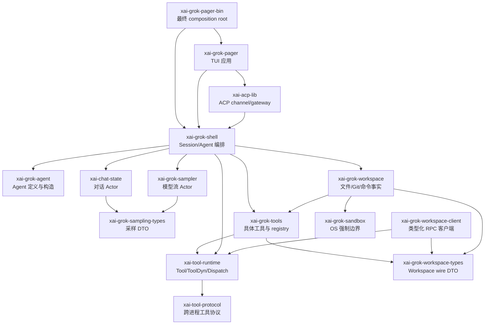

### 2.1 为什么会看见部分双向概念

逻辑上“工具调用 Workspace”，但具体 Cargo 关系不一定只有 `tools → workspace`：

- `xai-grok-tools` 定义和实现工具；
- `xai-grok-workspace` 可以在本地 session 中安装 finalized toolset；
- `xai-grok-workspace-client` 通过通用 `ToolHarness` 调用 `workspace_rpc` 工具；
- `xai-grok-workspace-types` 把双方共同使用的 DTO 下沉，避免直接循环依赖。

因此真正稳定的边界不是 crate 名称，而是：

```text
Tool / ToolDyn / ToolDispatch
WorkspaceRpc / RpcEnvelope
AsyncFileSystem
PermissionHandle
```

## 3. 物理进程、线程与 Actor 关系

### 3.1 默认 TUI 可以是内嵌 Agent，也可以经过 Leader

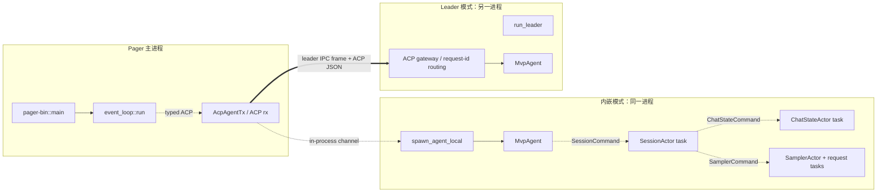

### 3.2 `LocalSet` 的影响

`xai-grok-shell/src/agent/app.rs::spawn_agent_local` 允许 Agent future 运行在本地任务集合中。代码中存在 `Rc`、`RefCell` 和 `?Send` trait 实现，意味着：

- 这些 future 不保证在线程池 worker 之间迁移；
- Session Actor 的“单写者”不仅是概念，也依赖 task 所在执行上下文；
- 重实现时不能把 `spawn_local` 机械替换为 `tokio::spawn`，除非所有捕获值都变成 `Send` 且并发语义仍正确。

## 4. 程序入口的真实符号关系

入口文件是 `crates/codegen/xai-grok-pager-bin/src/main.rs`。

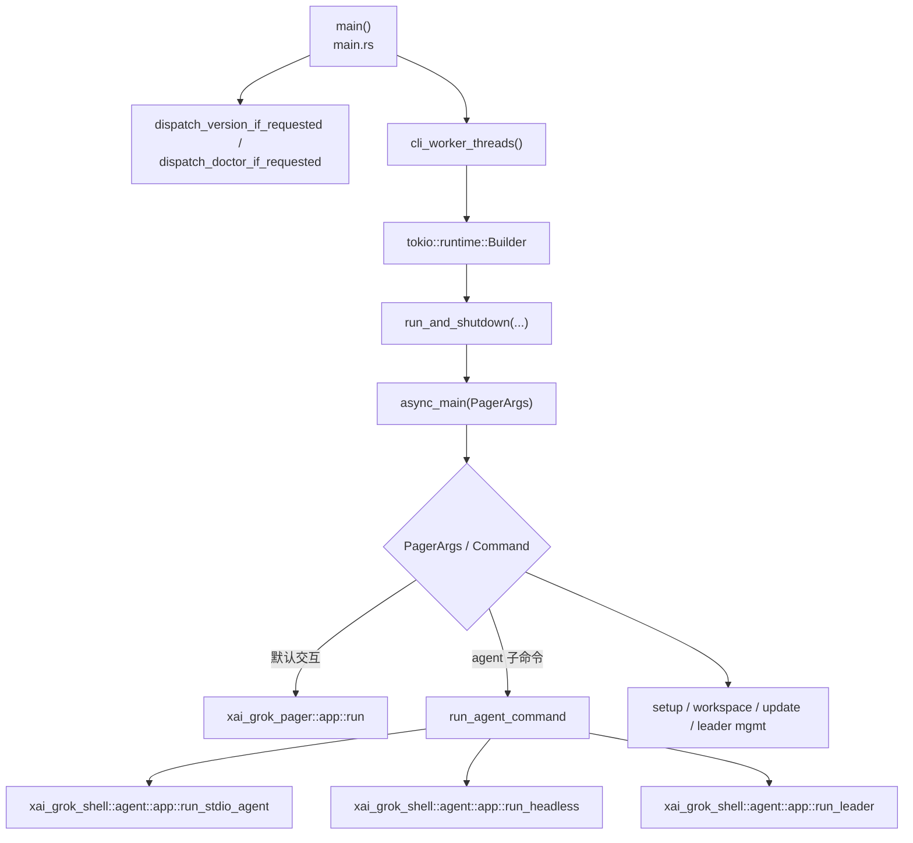

### 4.1 函数责任表

| 符号 | 输入 | 直接调用/创建 | 输出或下一跳 |
|---|---|---|---|
| `main()` | OS argv/env | Clap、worker 数、Tokio runtime | `run_and_shutdown(async_main(...))` |
| `async_main(PagerArgs)` | 已解析参数 | 配置、认证、模式分发 | TUI、Agent 或管理命令 |
| `xai_grok_pager::app::run` | `PagerArgs`、启动意图 | ACP connect、terminal init | `event_loop::run` |
| `run_stdio_agent` | stdin/stdout、AgentConfig | line reader、`spawn_agent_local` | ACP stdio 服务 |
| `run_headless` | Prompt、输出设置 | Agent connection、单次 Prompt | headless 输出/退出码 |
| `run_leader` | Leader 配置 | IPC listener、路由、Agent runtime | 多客户端长期服务 |

## 5. TUI 的代码关系：Action → Effect → TaskResult

TUI 主循环位于 `crates/codegen/xai-grok-pager/src/app/event_loop.rs::run`。它不直接在按键分支里执行所有异步工作，而是形成闭环。

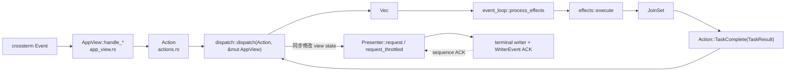

### 5.1 提交 Prompt 的具体关系

`effects::execute` 处理以下几个真实 variant：

```text
Effect::SendPrompt
Effect::SendPromptBlocks
Effect::SendPromptNow
Effect::SetModeThenPrompt
Effect::SendBashCommand
```

它们最终通过 `xai_acp_lib::acp_send`/`AcpAgentTx` 发出 ACP 请求，并把完成值转换为：

```text
TaskResult::PromptResponse
TaskResult::SendPromptNowFailed
TaskResult::CancelComplete
```

event loop 的 `JoinSet<TaskResult>::join_next()` 分支再执行：

```rust
dispatch::dispatch(Action::TaskComplete(result), &mut app)
```

因此异步 task 不能直接持有并修改 `AppView`。`AppView` 的修改仍回到 event loop 单写者。

### 5.2 ACP 流式事件的另一条回流路径

最终 Prompt response 通过 task 返回；流式 token、工具进度、权限请求等则从 `acp_rx` 进入：

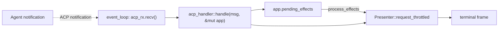

源码使用有界 ACP drain batch，并在 terminal input 到达时停止 drain，目的是避免 token firehose 饿死键盘和滚轮输入。

## 6. ACP Prompt 到 SessionCommand

协议实现位于 `crates/codegen/xai-grok-shell/src/agent/mvp_agent/acp_agent.rs`。

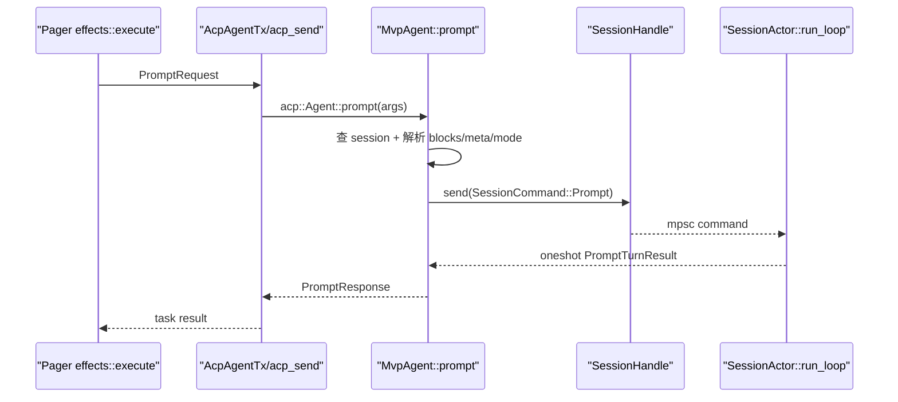

### 6.1 `SessionCommand::Prompt` 携带什么

定义位于 `crates/codegen/xai-grok-shell/src/session/commands.rs`。Prompt variant 负责跨 Agent/Session 边界传递：

- `prompt_id`；
- ACP `ContentBlock` 列表；
- Prompt mode；
- tool overrides update；
- structured output/schema 等扩展；
- `oneshot::Sender<PromptTurnResult>`。

具体字段以当前 enum 定义为准。这里最重要的关系是：

```text
mpsc sender 成功 = Session 命令已排队
oneshot 返回 = Session 对这一 Prompt 形成终态结果
持久化 ACK = 另一个更深的承诺点
```

## 7. Session Actor 的命令关系

`SessionActor::run_loop` 位于 `session/acp_session_impl/run_loop.rs`，循环消费 `SessionCommand`。

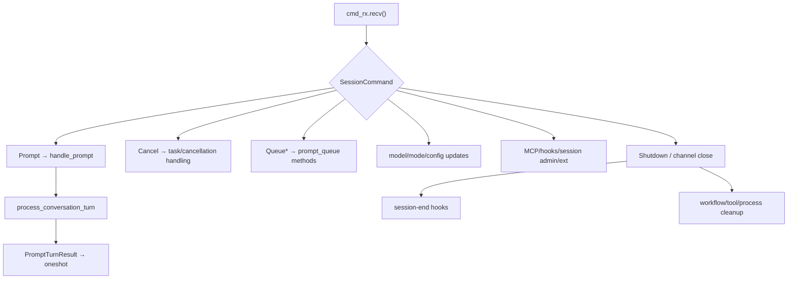

### 7.1 Session 内部文件分工

| 文件 | `SessionActor` 方法关系 |
|---|---|
| `run_loop.rs` | 命令总入口、shutdown |
| `turn.rs` | `handle_prompt`、`process_conversation_turn`、最终 bookkeeping |
| `sampler_turn.rs` | tool definitions、SamplingRequest、认证恢复、采样事件 |
| `tool_calls.rs` | batch 执行、审批、ToolResult 回写 |
| `tool_dispatch.rs` | 单个工具的本地/远端 dispatch 选择 |
| `prompt_queue.rs` | queued prompt 的版本和状态转换 |
| `tasks_cancel.rs` | 运行任务取消与清理 |
| `compaction.rs` | 上下文压缩触发与提交 |
| `notification_drain.rs` | notification drain/barrier |

这些文件都为同一个 `SessionActor` 增加 impl；它们不是互相独立的服务。

## 8. ChatState Handle → Command → Actor

ChatState 的公共入口位于 `crates/codegen/xai-chat-state/src/handle.rs`，Actor 位于 `src/actor/mod.rs`。

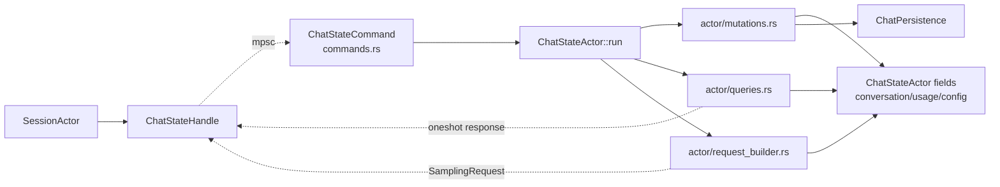

### 8.1 写方法与查询方法的区别

| Handle 方法 | 消息模式 | 意义 |
|---|---|---|
| `push_user_message` | fire-and-forget command | 请求追加，不等待确认 |
| `push_user_message_and_ack` | command + oneshot | 等 Actor 处理 |
| `push_assistant_response` | command | 提交规范 Assistant item |
| `push_tool_result` | command | 闭合对应 tool call |
| `build_request` | query + oneshot | 从 Actor 当前状态构造 `SamplingRequest` |
| `snapshot` | query + oneshot | 获取一致快照 |
| `truncate_to_prompt_index` | command/query coordination | rewind 对话 |
| `replace_conversation_for_compaction` | command | 压缩后替换历史 |

`ChatStateHandle::query<T>` 内部创建 oneshot，把响应 sender 放进 command，再等待 Actor 返回。这是读者识别“真正异步边界”的关键。

## 9. Session → ChatState → Sampler 的关系

`SessionActor::process_conversation_turn` 位于 `turn.rs`。它先准备 tool definitions，然后循环执行采样和工具回边。

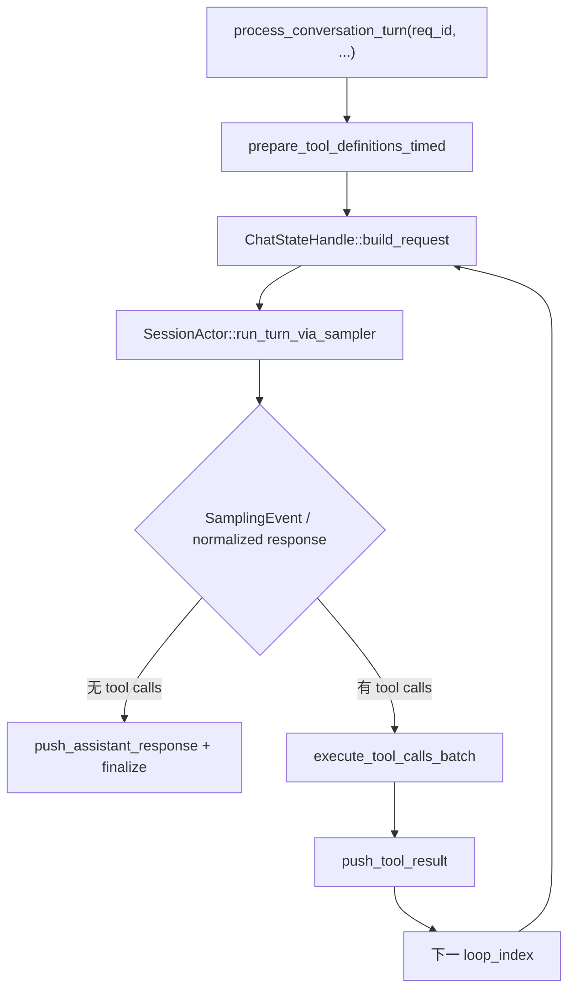

### 9.1 为什么 `prepare_tool_definitions_timed` 在 Session

它需要同时观察：

- MCP 初始化策略；
- 当前 Agent 的 `ToolBridge`；
- plan mode；
- backend search 是否启用；
- per-turn tool overrides；
- structured output 工具是否临时追加。

因此 tool definitions 不是全局常量，而是“当前 turn 的能力快照”。

## 10. Sampler Handle、Actor 与 request task

Sampler 事件定义在 `xai-grok-sampler/src/events.rs`，Actor 在 `src/actor/mod.rs`，每次网络尝试在 `src/actor/request_task.rs`。

```mermaid
flowchart LR
    SESSION["SessionActor::run_turn_via_sampler"]
    HANDLE["SamplerHandle"]
    COMMAND["SamplerCommand"]
    ACTOR["SamplerActor::run"]
    TASK["request_task"]
    ATTEMPT["run_one_attempt"]
    L2["drive_l2"]
    STREAM["stream::responses / chat_completions / messages"]
    MODEL["Model HTTP API"]
    EVENT["SamplingEvent"]

    SESSION --> HANDLE
    HANDLE -."mpsc".-> COMMAND
    COMMAND --> ACTOR
    ACTOR -->|spawn request task| TASK
    TASK --> ATTEMPT
    ATTEMPT --> MODEL
    MODEL -."bytes/SSE".-> STREAM
    STREAM --> L2
    L2 -."FirstToken/ChannelToken/ToolCallDelta".-> EVENT
    TASK -."Retrying/Completed/Failed".-> EVENT
    EVENT -."event channel".-> SESSION
```

### 10.1 `SamplingEvent` 的终态

真实 enum 包括 stream started、首 token、channel token、tool call delta、retry、completed、failed 等类别。关系上必须满足：

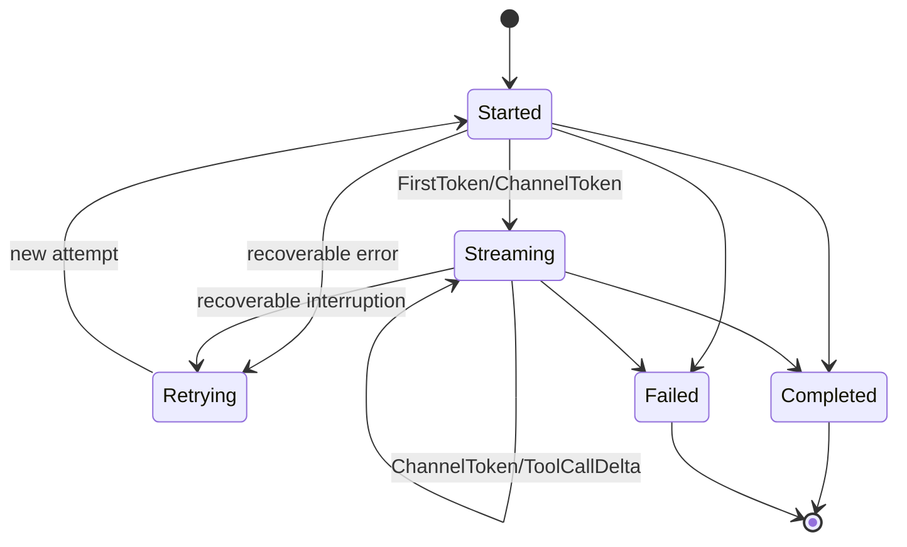

`request_task::send_completion`/`emit_failed` 负责形成终态；Session 不能把任意增量 token 当成规范 Assistant response。

## 11. Tool trait、类型擦除与 ToolBridge

### 11.1 类型层关系

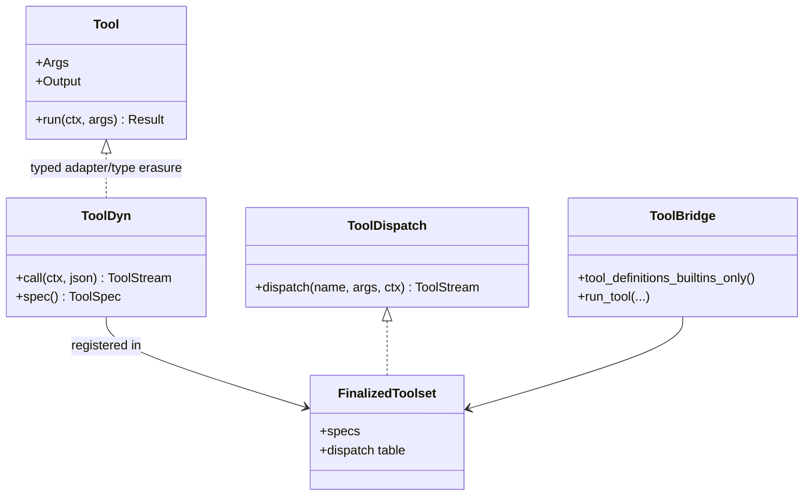

`Tool` 和 `ToolDyn` 位于 `xai-tool-runtime/src/tool.rs`，`ToolDispatch` 位于 `src/dispatch.rs`，`ToolBridge` 位于 `xai-grok-tools/src/bridge.rs`。

### 11.2 运行时关系

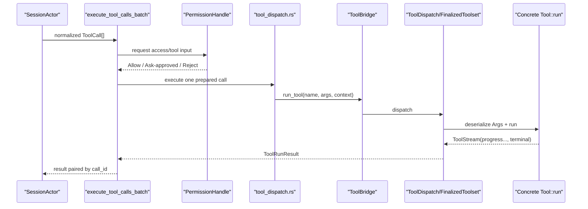

## 12. Permission Actor 的关系

`PermissionHandle` 和 manager 位于 `xai-grok-workspace/src/permission/manager/mod.rs`，协议类型位于 `permission/types.rs`。

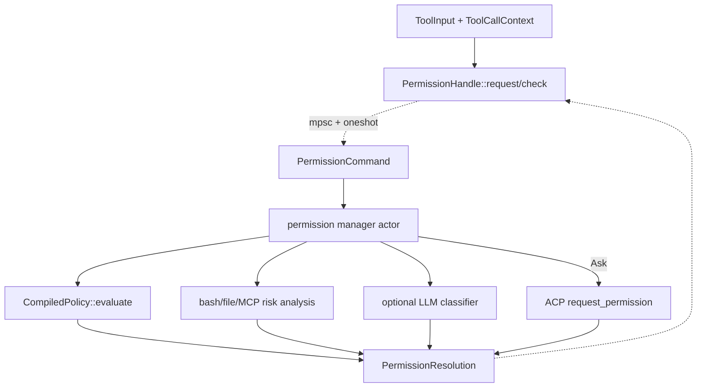

`set_yolo_mode` 和 `set_auto_mode` 先同步更新共享原子状态，再发送 Actor 命令；最终 Actor 会重新 clamp 和记录。这避免 UI 刚切模式时出现短暂的乐观放行窗口。

## 13. Workspace 本地与 Proxy 双路径

`WorkspaceOps` 位于 `xai-grok-workspace/src/workspace_ops.rs`：

```rust
pub enum WorkspaceOps {
    Local { handle: WorkspaceHandle },
    Proxy { client: WorkspaceClient },
}
```

### 13.1 统一关系图

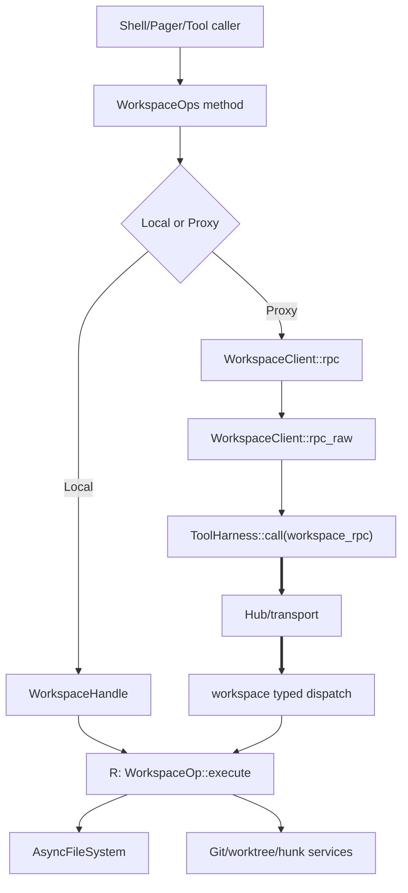

### 13.2 类型化 RPC 如何工作

`WorkspaceClient::rpc<R: WorkspaceRpc>`：

1. 使用 `serde_json::to_value(req)` 序列化参数；
2. 使用 `R::METHOD` 调用 `rpc_raw`；
3. `rpc_raw` 通过固定 tool id `workspace_rpc` 调用 `ToolHarness`；
4. 消费 `ToolStream` 的 terminal item；
5. 解析 `RpcEnvelope<R::Response>`；
6. 将 transport、decode、RPC application error 分开返回。

服务端对应的请求类型同时实现：

```text
WorkspaceRpc    定义 METHOD 和 Response
WorkspaceOp     定义 execute(&WorkspaceHandle, session_id)
```

这使 method 字符串、请求类型、响应类型和本地实现绑定在一起。

## 14. 文件系统关系

`AsyncFileSystem` 位于 `xai-grok-workspace/src/file_system/fs.rs`。

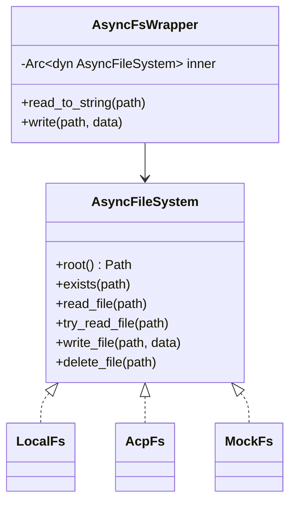

`AsyncFsWrapper` 负责把 `AbsPathBuf`、`RelPathBuf` 和普通 `Path` 统一转换到 filesystem root。真正的路径安全还需要 Workspace 的 canonical root、service path resolution、权限策略和沙箱共同完成，不能只依赖 wrapper。

## 15. ToolResult 回到模型的关系

```mermaid
sequenceDiagram
    participant Tool as "Concrete Tool"
    participant Batch as "execute_tool_calls_batch"
    participant Chat as "ChatStateHandle"
    participant Loop as "process_conversation_turn"
    participant Build as "build_request"
    participant Model as "Sampler"

    Tool-->>Batch: ToolRunResult
    Batch->>Batch: 与原 call_id 配对/格式化
    Batch->>Chat: push_tool_result(ConversationItem)
    Chat-->>Loop: Actor command accepted/processed
    Loop->>Build: 下一次循环
    Build->>Chat: query current conversation
    Chat-->>Build: Assistant ToolCall + ToolResult
    Build->>Model: SamplingRequest
```

如果工具未知、参数解析失败、权限拒绝或因前序失败未运行，也必须生成带原 call id 的 ToolResult。否则 `build_request` 会面对悬空调用，模型协议不完整。

## 16. 完整事件回流关系

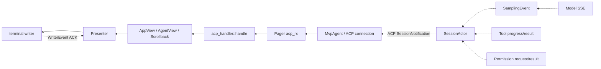

需要区分两类返回：

- notification：流式 token、工具进度、权限交互、状态更新；
- request response：整个 `MvpAgent::prompt` 的 `PromptResponse`。

前者可以很多次，后者每个 ACP request 只有一次。

## 17. 取消关系

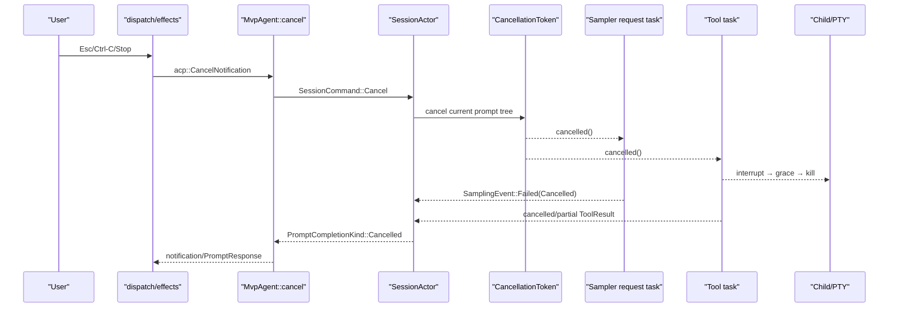

取消信号不会撤销已经完成的文件写入、外部 HTTP 写操作或 Git 操作。相关对账规则由 [可靠性与通用技术实现说明书](可靠性与通用技术实现说明书.md) 维护。

## 18. Shutdown 与资源清理关系

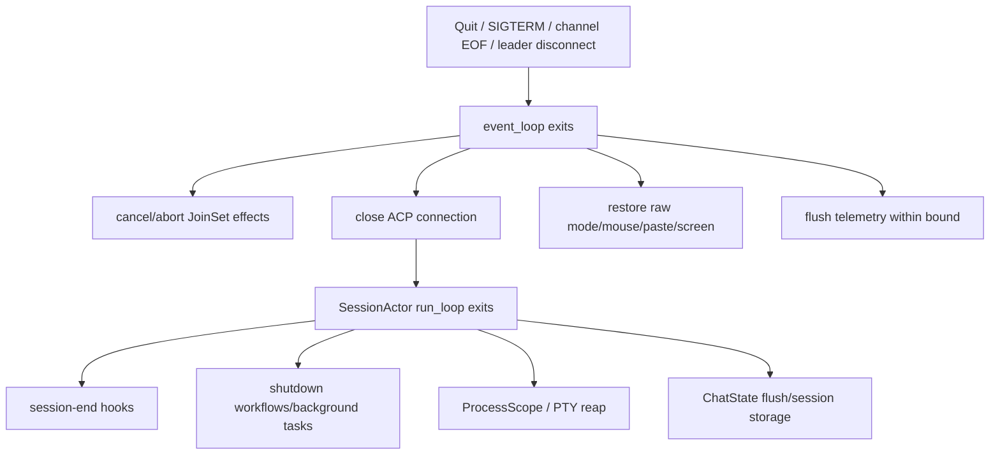

终端恢复属于 Pager 进程责任；Session/工具/child 清理属于 Agent/Workspace 责任。即使 Agent shutdown 卡住，Pager 也必须有界恢复用户终端。

## 19. 从任意符号继续跟读的方法

### 19.1 从 enum variant 找消费点

```bash
rg -n "SessionCommand::Prompt" crates/codegen/xai-grok-shell/src
rg -n "SamplingEvent::Completed" crates/codegen/xai-grok-shell/src crates/codegen/xai-grok-sampler/src
rg -n "Effect::SendPrompt" crates/codegen/xai-grok-pager/src
```

### 19.2 从 trait 找实现

```bash
rg -n "impl .*ToolDispatch|impl ToolDispatch" crates
rg -n "impl .*AsyncFileSystem|impl AsyncFileSystem" crates
rg -n "impl WorkspaceOp for" crates/codegen/xai-grok-workspace/src
```

### 19.3 从 Handle 找 Actor command

```bash
rg -n "ChatStateHandle|ChatStateCommand" crates/codegen/xai-chat-state/src
rg -n "PermissionHandle|PermissionCommand" crates/codegen/xai-grok-workspace/src/permission
rg -n "SamplerHandle|SamplerCommand" crates/codegen/xai-grok-sampler/src
```

## 20. 关系阅读检查表

每跟一条边，至少记录：

| 问题 | 示例答案 |
|---|---|
| 调用者是谁？ | `effects::execute` |
| 被调用者是谁？ | `AcpAgentTx` / `acp_send` |
| 参数类型？ | ACP `PromptRequest` |
| 同步还是异步？ | async request/response |
| 是否跨 task？ | 是，JoinSet task |
| 是否跨进程？ | 取决于 embedded/leader |
| 返回类型？ | `PromptResponse` → `TaskResult::PromptResponse` |
| 错误在哪里转换？ | effect 层转成 TaskResult/user error |
| 状态由谁修改？ | 最终由 event loop 修改 `AppView` |
| 取消如何传播？ | ACP cancel → Session cancellation token |

## 21. 跨文件调用索引

这张表用于代码审查和重实现。它不替代函数正文，但能快速回答“修改当前符号会影响谁”。

| # | 调用方 | 被调用方/消息消费方 | 传递内容 | 边界类型 | 源码证据 |
|---:|---|---|---|---|---|
| 1 | `pager-bin::main` | `async_main` | `PagerArgs` | runtime `block_on` | `xai-grok-pager-bin/src/main.rs` |
| 2 | `async_main` | `xai_grok_pager::app::run` | CLI、配置、启动意图 | async 直接调用 | `xai-grok-pager-bin/src/main.rs` |
| 3 | `async_main` | `run_agent_command` | Agent 子命令 | async 直接调用 | 同上 |
| 4 | `run_agent_command` | `run_stdio_agent` | AgentConfig、stdio | async 直接调用 | 同上、`xai-grok-shell/src/agent/app.rs` |
| 5 | `run_agent_command` | `run_headless` | Prompt/relay config | async 直接调用 | 同上 |
| 6 | `run_agent_command` | `run_leader` | Leader config | async 直接调用 | 同上 |
| 7 | `xai_grok_pager::app::run` | `event_loop::run` | terminal、AcpConnection、startup | async 直接调用 | `xai-grok-pager/src/app/mod.rs` |
| 8 | `event_loop::run` | `AppView::new` | tx、models、commands | 同 task 构造 | `app/event_loop.rs`、`app/app_view.rs` |
| 9 | input handler | `dispatch::dispatch` | `Action`、`&mut AppView` | 同 task 直接调用 | `app/event_loop.rs` |
| 10 | `dispatch::dispatch` | `process_effects` | `Vec<Effect>` | 同 task 直接调用 | `app/event_loop.rs` |
| 11 | `process_effects` | `effects::execute` | 单个 `Effect` | task spawn/JoinSet | `app/event_loop.rs`、`app/effects/mod.rs` |
| 12 | `effects::execute` | `AcpAgentTx`/`acp_send` | ACP request | typed ACP request | `app/effects/mod.rs` |
| 13 | effect task | event loop | `TaskResult` | `JoinSet::join_next` | `app/event_loop.rs` |
| 14 | event loop | `dispatch::dispatch` | `Action::TaskComplete` | 同 task 直接调用 | 同上 |
| 15 | Agent ACP runtime | `MvpAgent::prompt` | `acp::PromptRequest` | ACP trait callback | `xai-grok-shell/src/agent/mvp_agent/acp_agent.rs` |
| 16 | `MvpAgent::prompt` | Session handle | `SessionCommand::Prompt` | mpsc | 同上、`session/commands.rs` |
| 17 | Session handle | `SessionActor::run_loop` | `SessionCommand` | mpsc receive | `session/acp_session_impl/run_loop.rs` |
| 18 | `run_loop` Prompt 分支 | `SessionActor::handle_prompt` | prompt id/blocks/mode | async 直接调用 | `run_loop.rs`、`turn.rs` |
| 19 | `handle_prompt` | lifecycle contributors | `TurnStartInput` | async trait callback | `turn.rs` |
| 20 | `handle_prompt` | ChatState handle | User `ConversationItem` | Actor command | `turn.rs`、`xai-chat-state/src/handle.rs` |
| 21 | `handle_prompt` | `process_conversation_turn` | req id/schema/artifact context | async 直接调用 | `turn.rs` |
| 22 | `process_conversation_turn` | `prepare_tool_definitions_timed` | 当前 Session 状态 | async 直接调用 | `turn.rs`、`sampler_turn.rs` |
| 23 | `prepare_tool_definitions_inner` | `ToolBridge::tool_definitions_builtins_only` | 当前 bridge | async 直接调用 | `sampler_turn.rs`、`xai-grok-tools/src/bridge.rs` |
| 24 | `process_conversation_turn` | `ChatStateHandle::build_request` | tool specs/config | Actor query + oneshot | `turn.rs`、`xai-chat-state/src/handle.rs` |
| 25 | `ChatStateHandle::build_request` | `ChatStateHandle::query` | BuildRequest command | 同对象调用 | `handle.rs` |
| 26 | `ChatStateHandle::query` | `ChatStateActor::run` | `ChatStateCommand` + responder | mpsc + oneshot | `handle.rs`、`actor/mod.rs` |
| 27 | `ChatStateActor::run` | `handle_command` | `ChatStateCommand` | Actor 内直接调用 | `actor/mod.rs` |
| 28 | `handle_command` | request builder/mutations/queries | Actor state | 模块内直接调用 | `actor/*.rs` |
| 29 | `process_conversation_turn` | `run_turn_via_sampler` | `SamplingRequest` | async 直接调用 | `turn.rs`、`sampler_turn.rs` |
| 30 | Session sampler method | `SamplerActor` | `SamplerCommand` | mpsc | `sampler_turn.rs`、`xai-grok-sampler/src/actor/mod.rs` |
| 31 | `SamplerActor::run` | request task | request、event sink、cancel token | spawned task | `actor/mod.rs`、`actor/request_task.rs` |
| 32 | request task | `run_one_attempt` | attempt context | async 直接调用 | `actor/request_task.rs` |
| 33 | `run_one_attempt` | backend stream adapter | HTTP byte stream | Stream | `request_task.rs`、`stream/*.rs` |
| 34 | `drive_l2`/request task | Session | `SamplingEvent` | event channel | `request_task.rs`、`events.rs` |
| 35 | `process_conversation_turn` | `execute_tool_calls_batch` | normalized ToolCall 列表 | async 直接调用 | `turn.rs`、`tool_calls.rs` |
| 36 | `execute_tool_calls_batch` | Permission handle | `ToolInput`/AccessKind | Actor command + oneshot | `tool_calls.rs`、`permission/manager/mod.rs` |
| 37 | tool-call batch | `tool_dispatch.rs` | prepared call/context | async 直接调用 | `tool_calls.rs`、`tool_dispatch.rs` |
| 38 | Session dispatch | `ToolBridge` | name、JSON args、context | async/ToolStream | `tool_dispatch.rs`、`xai-grok-tools/src/bridge.rs` |
| 39 | `ToolBridge`/registry | `ToolDyn::call` | JSON args | trait object | `bridge.rs`、`xai-tool-runtime/src/tool.rs` |
| 40 | typed dyn adapter | `Tool::run` | `T::Args` | async trait call | `xai-tool-runtime/src/tool.rs` |
| 41 | tool batch | `ChatStateHandle::push_tool_result` | ToolResult ConversationItem | Actor command | `tool_calls.rs`、`xai-chat-state/src/handle.rs` |
| 42 | 下一 loop | `ChatStateHandle::build_request` | 已闭合 conversation | Actor query | `turn.rs` |
| 43 | Workspace facade | `WorkspaceOps::Local` | typed request | 进程内 | `xai-grok-workspace/src/workspace_ops.rs` |
| 44 | `WorkspaceOps::Local` | `WorkspaceOp::execute` | `WorkspaceHandle`、session id | async trait call | 同上 |
| 45 | Workspace facade | `WorkspaceOps::Proxy` | typed request | 进程内 facade | 同上 |
| 46 | Proxy | `WorkspaceClient::rpc<R>` | `R: WorkspaceRpc` | async 直接调用 | `xai-grok-workspace-client/src/lib.rs` |
| 47 | `WorkspaceClient::rpc` | `rpc_raw` | `R::METHOD`、JSON params | async 直接调用 | 同上 |
| 48 | `rpc_raw` | `ToolHarness::call` | `workspace_rpc` tool id | Tool protocol stream | 同上 |
| 49 | workspace server | `WorkspaceOp::execute` | decoded request | typed dispatch | `workspace_ops.rs` |
| 50 | Workspace operation | `AsyncFileSystem`/Git/Hunk service | path/operation | async trait/service | `file_system/fs.rs`、`workspace_ops.rs` |
| 51 | Session notification sender | Pager `acp_rx` | ACP notification | channel/IPC | Shell session、Pager `event_loop.rs` |
| 52 | Pager `acp_rx` branch | `acp_handler::handle` | notification | 同 task 直接调用 | `app/event_loop.rs` |
| 53 | `acp_handler::handle` | `AppView`/scrollback | UI state update | 单写者修改 | Pager app modules |
| 54 | Presenter | terminal writer | frame/sequence | writer channel | Pager render/event loop |
| 55 | terminal writer | Presenter | `WriterEvent` ACK | mpsc | `event_loop.rs` |

### 21.1 如何使用这张表

- 修改调用方：向右检查参数、错误和取消契约；
- 修改被调用方：向左搜索所有调用者和 trait impl；
- 修改传递类型：同时检查生产方、消费方、serde/wire 和持久化；
- 修改跨 task 边：检查 channel 关闭、backpressure、迟到结果和 responder drop；
- 修改跨进程边：检查版本、重连、去重、deadline 和错误映射。
