# 关键调用链逐函数精读

> 本文按“可以在 IDE 中逐个跳转”的方式阅读源码。
>
> 每条链都包含真实路径、关键符号、输入输出、异步边界和失败出口。模块关系先读 [源码符号关系总览](12-源码符号关系总览.md)。

## 1. 使用方法

不要一次打开所有文件。对每条链：

1. 先看 Mermaid 图，记住 5–10 个主节点；
2. 打开第一个文件定位符号；
3. 只跟当前函数直接调用的下一跳；
4. 遇到 channel 时先读 command enum，再读 Actor loop；
5. 遇到 trait 时先读 trait，再找当前 composition root 注入的 impl；
6. 成功路径走通后，再跟同一函数的 `?`、`Err`、cancel 和 cleanup。

## 2. 调用链一：进程启动到 TUI 第一帧

### 2.1 总图

```mermaid
sequenceDiagram
    participant OS
    participant Main as "pager-bin::main"
    participant AM as "async_main"
    participant App as "xai_grok_pager::app::run"
    participant Conn as "ACP connection builder"
    participant Term as "terminal init/writer"
    participant Loop as "event_loop::run"
    participant View as "AppView::new"
    participant Presenter

    OS->>Main: argv/env/cwd
    Main->>Main: fast flags + worker count + runtime
    Main->>AM: PagerArgs
    AM->>App: default interactive branch
    App->>Conn: embedded or leader connect
    Conn-->>App: AcpConnection
    App->>Term: resolve screen mode + init terminal
    App->>Loop: terminal, connection, args, startup
    Loop->>View: AppView::new(tx, models, commands)
    Loop->>Presenter: request_presentation
    Presenter->>Term: first frame
```

### 2.2 逐函数表

| 步骤 | 路径与符号 | 关键输入 | 直接下一跳 | 失败出口 |
|---:|---|---|---|---|
| 1 | `xai-grok-pager-bin/src/main.rs::main` | argv、env | Clap 解析、runtime builder | 参数错误由 Clap 退出；runtime/init 错误走 shutdown |
| 2 | `main.rs::cli_worker_threads` | env override、CPU | Tokio worker 数 | 非法 override 采用代码定义的回退/诊断 |
| 3 | `main.rs::run_and_shutdown` | `async_main` future | runtime `block_on` | 统一退出与 telemetry flush |
| 4 | `main.rs::async_main` | `PagerArgs` | command/mode 分发 | 返回 `anyhow::Result` |
| 5 | `xai-grok-pager/src/app/mod.rs::run` | args、配置、启动意图 | ACP connect、screen mode、terminal | 连接或终端初始化错误 |
| 6 | `app/mod.rs::bounded_connect` | connect future、cancel | embedded/leader connection | timeout/cancel |
| 7 | `app/event_loop.rs::run` | `PagerTerminal`、`AcpConnection` | `AppView::new` | writer 停止、连接关闭、事件错误 |
| 8 | `app/app_view.rs::AppView::new` | Agent tx、models、commands | 初始 UI state | 纯构造阶段不执行远端请求 |
| 9 | `Presenter::request_presentation` | AppView、terminal | draw/writer | writer 通过 `WriterEvent` 报错/ACK |

### 2.3 `main()` 为什么先处理 fast flags

`--version`、doctor 等不需要完整认证、配置和 TUI。`dispatch_version_if_requested`、`dispatch_doctor_if_requested` 在重初始化前处理，可以：

- 缩短启动时间；
- 避免版本查询触发网络或登录；
- 保证 stdout 输出不混入 TUI 控制序列。

### 2.4 第一帧之前已经确定的状态

`event_loop::run` 创建 `AppView` 后，会继续设置：

- screen mode；
- leader mode；
- terminal rows；
- permission mode/yolo/auto 的启动快照；
- plan/subagent/ask-user 开关；
- folder trust 初值；
- startup session intent。

所以第一帧不是默认空结构的直接 render，而是经过启动策略注入后的状态快照。

## 3. 调用链二：用户按 Enter 到 ACP PromptRequest

### 3.1 总图

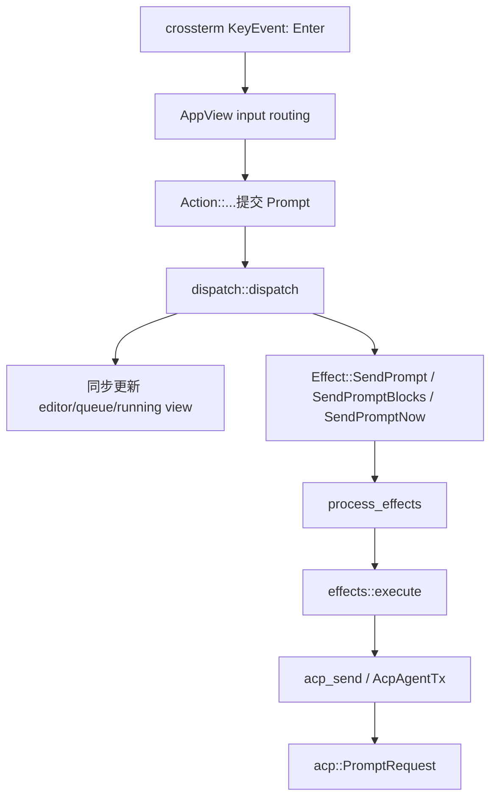

### 3.2 输入路由为什么不能直接找 Enter

Enter 的含义取决于：

- 当前是 welcome、dashboard 还是 AgentView；
- modal/overlay 是否拥有输入；
- 编辑器是否在补全、slash dropdown、plan review；
- Prompt 是否运行中；
- 当前行为是 queue、interject 还是 send-now；
- terminal 是否在 bracketed paste 中。

因此跟读顺序是：

```text
event_loop 收到 Event
→ AppView 当前焦点/overlay
→ AgentView/editor handler
→ 语义 Action
→ dispatch
```

### 3.3 Effect 执行的真实分支

文件：`crates/codegen/xai-grok-pager/src/app/effects/mod.rs`。

| Effect | 语义 | 完成 TaskResult |
|---|---|---|
| `SendPrompt` | 普通 Prompt 文本 | `PromptResponse` |
| `SendPromptBlocks` | 文本、图片等 ACP blocks | `PromptResponse` |
| `SendPromptNow` | 当前运行中立即发送/插入 | `PromptResponse` 或 `SendPromptNowFailed` |
| `SetModeThenPrompt` | 先切 session mode 再 Prompt | `PromptResponse` |
| `SendBashCommand` | UI 直接命令入口 | `PromptResponse` |
| `CancelTurn` | 当前 turn 取消 | `CancelComplete` |

Effect task 完成后不直接改 view，而是：

```rust
Action::TaskComplete(result)
```

重新进入 `dispatch::dispatch`。

### 3.4 这里的状态提交点

| 状态 | 所有者 | 何时成立 |
|---|---|---|
| 草稿已从 editor 取出 | TUI | dispatch 同步处理后 |
| UI 显示 queued/running | TUI | view state 更新后 |
| PromptRequest 已发送 | ACP transport | `acp_send` 成功后 |
| Session 已接受 | Session Actor | command 被处理后 |
| Prompt 已完成 | Session oneshot/ACP response | `PromptTurnResult` 返回后 |

## 4. 调用链三：`MvpAgent::prompt` 到 Session Actor

### 4.1 关键源码

```text
crates/codegen/xai-grok-shell/src/agent/mvp_agent/acp_agent.rs
crates/codegen/xai-grok-shell/src/session/commands.rs
crates/codegen/xai-grok-shell/src/session/handle.rs
crates/codegen/xai-grok-shell/src/session/acp_session_impl/run_loop.rs
```

### 4.2 时序

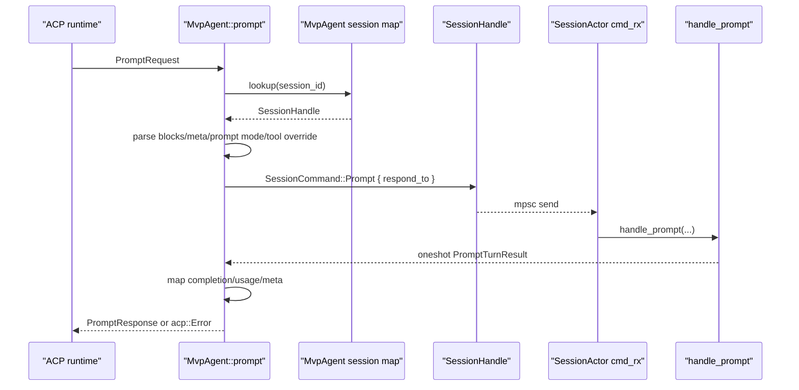

### 4.3 `MvpAgent::prompt` 的边界职责

负责：

- 验证 session id；
- 把 ACP content/meta 转成内部命令字段；
- 创建 prompt id/trace context；
- 创建 oneshot；
- 等待 `PromptTurnResult`；
- 转换 stop reason、usage 和错误。

不负责：

- 直接构造模型 HTTP body；
- 直接执行工具；
- 直接写 conversation；
- 直接修改文件。

### 4.4 Session command 的消费方式

`SessionActor::run_loop` 是 `SessionCommand` 的权威消费点。新增 command variant 时，应同时检查：

1. enum 定义；
2. `SessionHandle` 发送方法；
3. run loop 的 match；
4. shutdown 时未完成 responder 的处理；
5. 相关 ACP ext method/notification 的转换。

## 5. 调用链四：普通文本 Prompt 完成

本链不含工具调用，最适合第一次跟读。

### 5.1 总时序

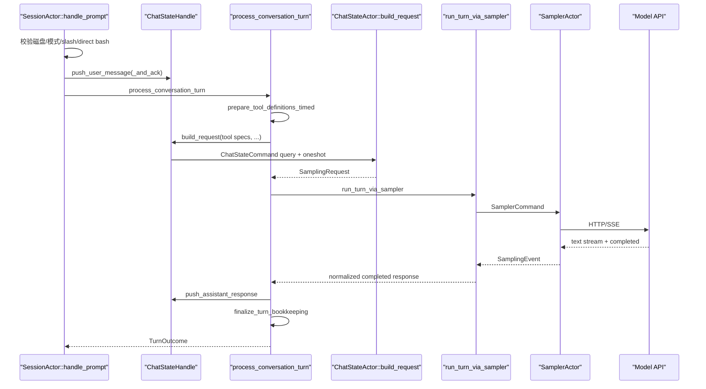

### 5.2 `handle_prompt` 前置工作

`turn.rs` 中 `SessionActor::handle_prompt` 在模型调用前还会处理：

- disk writable 检查；
- turn activity guard；
- lifecycle contributor `on_turn_start`；
- rewind 后 regenerate/edit-and-retry 归因；
- direct bash 特殊入口；
- slash command、skill、workflow 解析；
- Prompt mode 和 tool overrides；
- memory/reminder/project instruction 注入；
- workspace prompt boundary。

这解释了为什么不能把 `handle_prompt` 简化理解为“调用一次模型”。

### 5.3 `process_conversation_turn` 的循环变量

源码维护：

- `loop_index`：当前 Prompt 内第几次模型循环；
- `tool_turn_count`：工具回边次数；
- `identical_tool_calls`：重复工具调用停止保护；
- `auth_retry_schedule`：认证恢复预算；
- `structured_output_retries`：结构化输出修复；
- `turn_span_totals`：跨模型/工具耗时；
- `model_fingerprint`：模型元数据。

普通文本路径通常第一轮就退出，但同一个函数必须支持工具、重试和结构化输出。

### 5.4 ChatState 请求构造

`ChatStateHandle::build_request`：

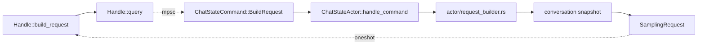

构造 request 时可能进行派生裁剪和 reminder 注入，但不能把所有 request-view 变化都误写回 live conversation。

## 6. 调用链五：模型流式采样与重试

### 6.1 文件关系

```text
xai-grok-sampler/src/actor/mod.rs           Actor 命令循环
xai-grok-sampler/src/actor/request_task.rs  每次请求和重试
xai-grok-sampler/src/stream/mod.rs           后端分发
xai-grok-sampler/src/stream/responses.rs     Responses API
xai-grok-sampler/src/stream/chat_completions.rs
xai-grok-sampler/src/stream/messages.rs
xai-grok-sampler/src/events.rs               统一事件
```

### 6.2 调用图

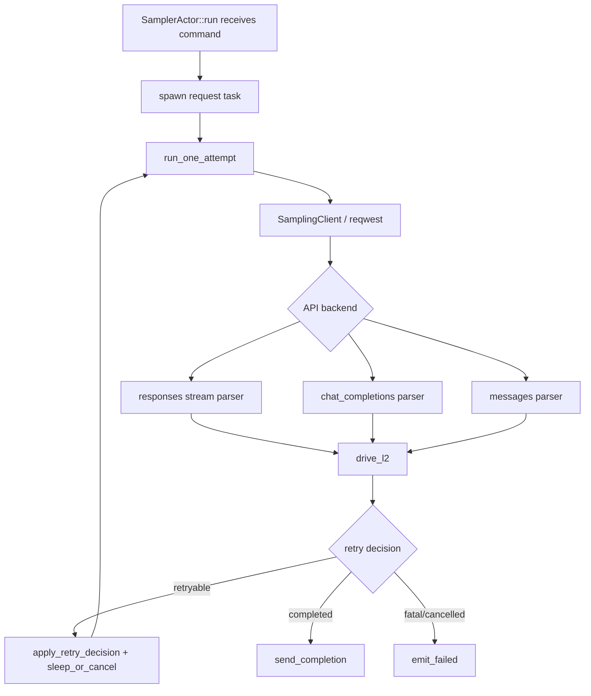

### 6.3 增量与终态的不同消费者

| 事件 | Session 用途 | 是否写入规范 conversation |
|---|---|---|
| `StreamStarted` | 指标/状态 | 否 |
| `FirstToken` | 首 token 延迟 | 否 |
| `ChannelToken` | TUI 流式展示 | 否，直到 Completed 形成 response |
| `ToolCallDelta` | 展示/组装 | 不单独提交 |
| `Retrying` | UI/遥测 | 否 |
| `Completed` | 规范 Assistant response | 是 |
| `Failed` | typed failure/cancel | 否，但会形成 Prompt 终态 |

### 6.4 重试为什么在 request task

Sampler Actor 本身需要继续响应取消和其他命令。若 Actor 在自身 loop 中 sleep/backoff 并读取整个 SSE，会阻塞控制面。将网络请求放入 task 后：

- Actor 负责生命周期和路由；
- request task 负责 attempt、退避和 stream；
- cancellation token 可同时唤醒 sleep 和网络读取；
- Session 只看到统一 `SamplingEvent`。

## 7. 调用链六：模型请求工具并回到下一轮采样

### 7.1 总时序

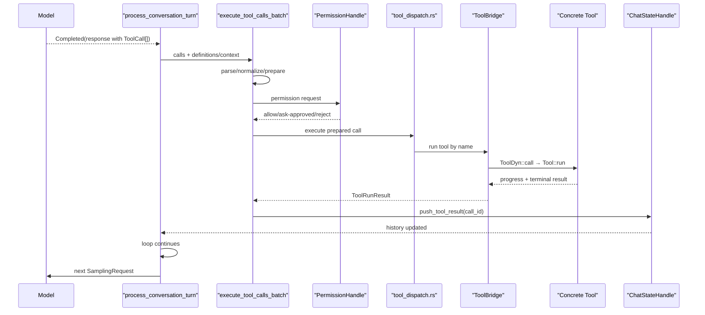

### 7.2 `execute_tool_calls_batch` 做了什么

文件：`session/acp_session_impl/tool_calls.rs`。

它不仅是 `join_all`：

- 建立 tool execution span；
- 区分 plan approval、interruptible wait 等特殊工具；
- 解析参数并处理 parse error；
- 发送 tool-call-start notification；
- 等待/记录权限状态；
- 根据工具并发规则组织执行；
- 收集每个结果和耗时；
- 保证 call id 顺序和结果闭合；
- 处理 pending interjection；
- 写回 ChatState 并向 UI 发进度。

### 7.3 单个工具的类型转换


Schema 与 `T::Args` 必须同源。否则模型按 ToolSpec 生成的 JSON 会在 `ToolDyn` 反序列化处失败。

## 8. 调用链七：工具读取或写入文件

不同工具族实现不同，但主边界相似。

### 8.1 读取文件

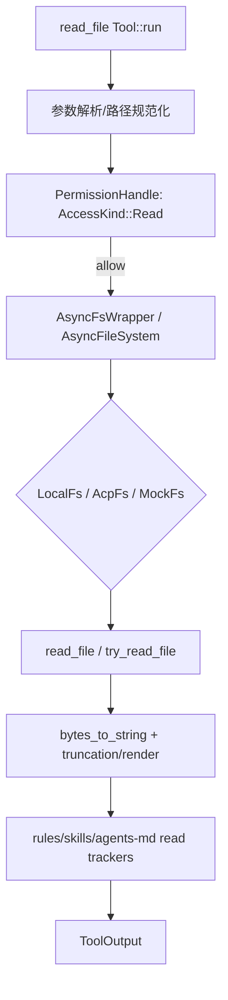

### 8.2 编辑文件

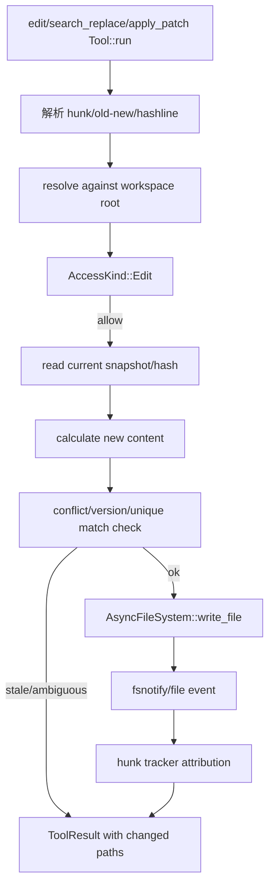

### 8.3 需要继续核对的具体实现差异

| 工具族 | 定位策略 | 主要失败 |
|---|---|---|
| Codex `apply_patch` | patch hunk/context | 上下文不匹配、路径非法 |
| OpenCode `edit` | old/new text | 0 次或多次匹配 |
| Grok concise `search_replace` | 搜索替换 | 模糊/重复匹配 |
| Grok hashline `edit` | 行 hash/锚点 | 锚点过期 |

不要因为存在统一 `AsyncFileSystem` 就假设四种工具共享完全相同的并发锁和冲突语义；要继续跟各实现的 write 前检查。

## 9. 调用链八：Workspace 类型化 RPC

### 9.1 客户端调用

以 `WorkspaceClient::git_diff` 为例，它最终调用泛型 `rpc<R>`。

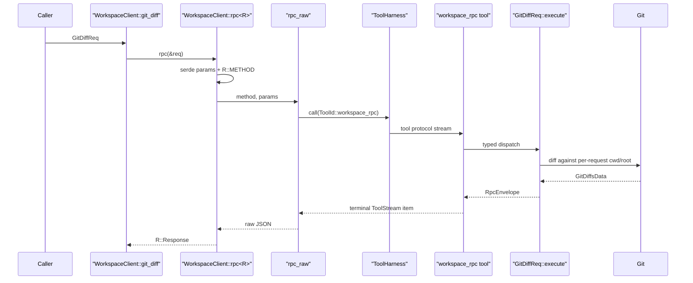

### 9.2 Local 模式

`WorkspaceOps::Local` 不需要 transport：

```text
WorkspaceOps method
→ request type `WorkspaceOp::execute`
→ WorkspaceHandle/service
→ response
```

### 9.3 Proxy 模式

`WorkspaceOps::Proxy`：

```text
WorkspaceOps method
→ WorkspaceClient::rpc
→ workspace_rpc ToolHarness
→ Hub/IPC
→ server typed dispatch
→ 同一个 WorkspaceOp::execute
```

Local 和 Proxy 应共享请求/响应语义，差异集中在 transport、deadline、connected latch 和序列化错误。

## 10. 调用链九：权限 Ask 如何回到 TUI

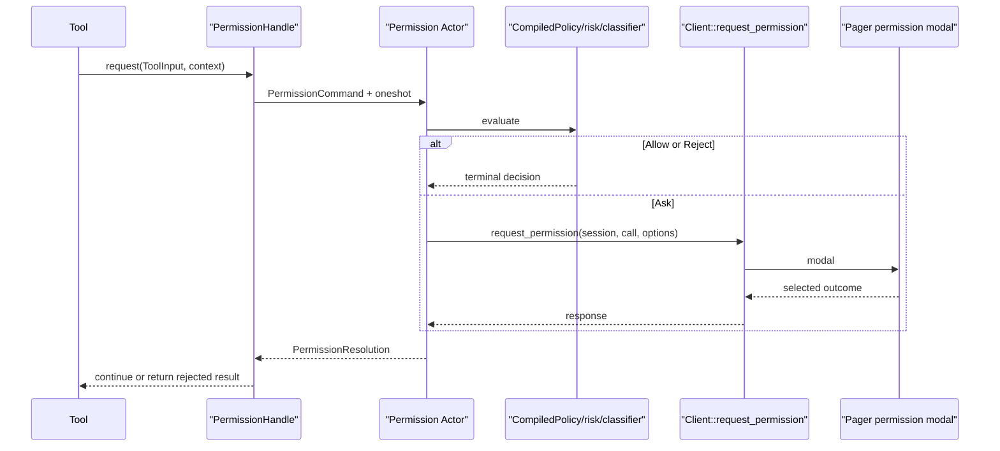

### 10.1 为什么审批必须绑定原调用

审批期间可能发生：

- 用户取消 Prompt；
- Session 被关闭；
- tool call 被新 generation 替代；
- requester future 被 drop；
- permission mode 被修改。

因此 Actor 需要 in-flight guard、request/call identity 和 requester-death 处理，不能让迟到的“允许”应用到另一个命令。

## 11. 调用链十：取消当前 Prompt

### 11.1 UI 到 Agent

`Effect::CancelTurn` 在 `effects::execute` 中发送 ACP cancel，完成后产生 `TaskResult::CancelComplete`。

### 11.2 Agent 到 Session

`MvpAgent::cancel` 位于 `acp_agent.rs`，查找 session 并发送内部取消命令/信号。

### 11.3 Session 到子任务

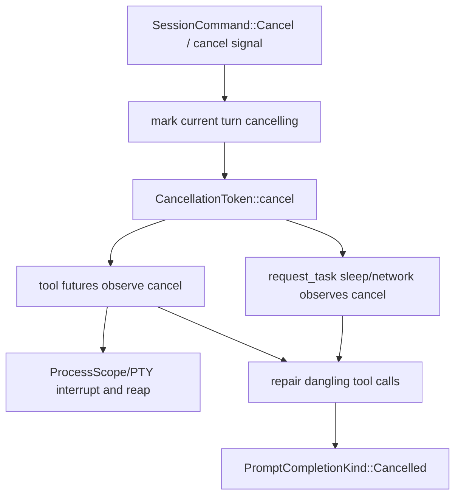

### 11.4 Cancel race 需要检查什么

| Race | 正确处理方向 |
|---|---|
| cancel 与 Completed 同时到达 | 只能形成一个规范 Prompt 终态 |
| cancel 与 tool write 同时发生 | 报告已发生/结果未知，不假装回滚 |
| cancel 后旧 token 到达 | generation/request id 过滤 |
| cancel 后立即新 Prompt | 新 token/任务树不能继承旧取消状态 |
| requester 已断开 | Actor 仍需清理内部任务，不向死 receiver 无限等待 |

## 12. 调用链十一：Session 恢复与 Rewind

### 12.1 Session load

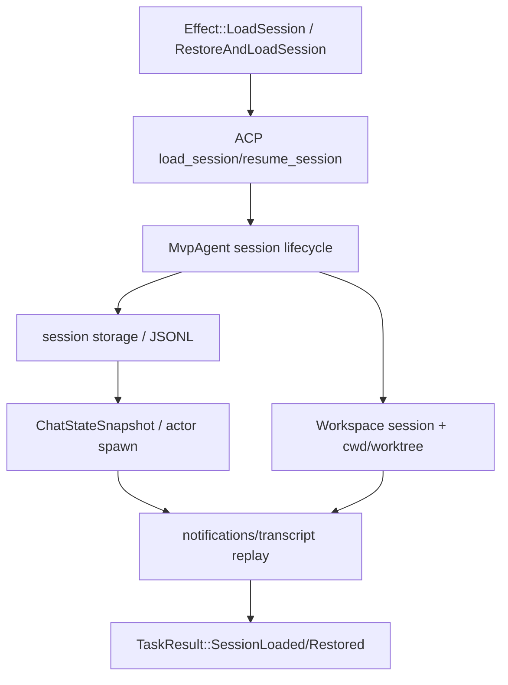

恢复时 `running` 不是可直接恢复的事实；上次进程中的 task 已不存在，应转换为 interrupted/repair 状态。

### 12.2 Rewind 跨两个事实域

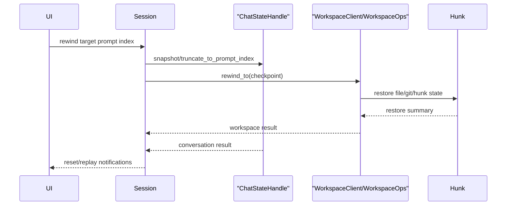

Conversation 截断和文件恢复不是同一数据库事务。任一方失败时必须保留可诊断状态，不能声称整体成功。

## 13. 调用链十二：正常退出和异常退出

### 13.1 正常退出

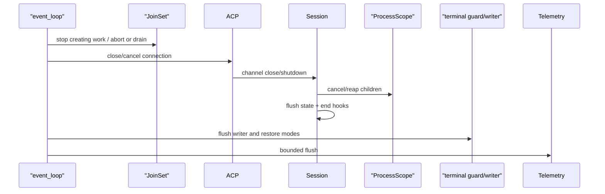

### 13.2 Panic/signal

异常路径还要检查：

- crash handler 是否先恢复终端；
- normal Drop 是否会重复写不兼容控制序列；
- child process 是否由 ProcessScope 独立兜底；
- telemetry/symbolication 是否有时间上限；
- signal handler 是否只做 async-signal-safe 的最小工作，再通知正常任务清理。

## 14. 关键返回类型地图

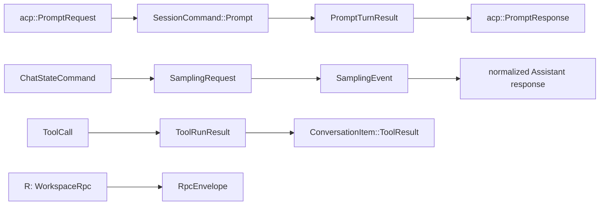

## 15. 失败传播地图

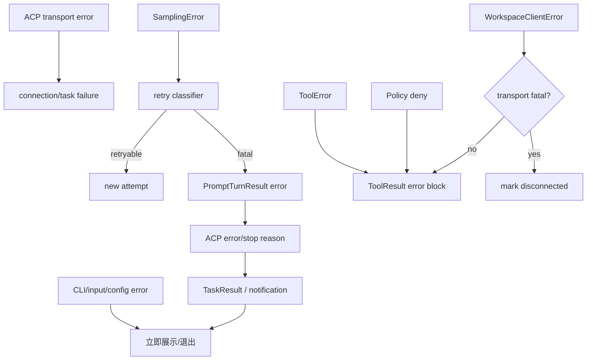

工具失败通常应成为模型可见 ToolResult，而不是直接让整个 Session task panic。Transport 完全断开、内部不变量破坏或持久化不可继续时，才可能升级为 Prompt/Session 失败。

## 16. 修改代码时的影响分析模板

### 16.1 修改 `SessionCommand`

检查：

```text
commands.rs enum
→ SessionHandle sender
→ MvpAgent ACP adapter
→ run_loop match
→ shutdown/drop responder
→ tests and wire/meta compatibility
```

### 16.2 修改 `SamplingEvent`

检查：

```text
events.rs enum
→ every stream adapter
→ request_task terminal/retry logic
→ Session run_turn_via_sampler
→ ACP notification mapping
→ Pager acp_handler/render
```

### 16.3 修改 Tool 参数

检查：

```text
Args serde
↔ JSON Schema/ToolSpec
→ normalization/name mapping
→ ToolDyn adapter
→ permission ToolInput/AccessKind
→ concrete Tool::run
→ output renderer/tests
```

### 16.4 修改 Workspace RPC

检查：

```text
WorkspaceRpc::METHOD + Response
→ client convenience method
→ WorkspaceClient::rpc decode
→ server typed dispatch registration
→ WorkspaceOp::execute
→ local/proxy parity tests
→ old client compatibility
```

### 16.5 修改 TUI Action

检查：

```text
input mapping/action registry
→ Action enum
→ dispatch match
→ Effect enum
→ effects::execute
→ TaskResult
→ Action::TaskComplete handling
→ snapshot + PTY E2E
```

## 17. 推荐 IDE 跟读断点

按顺序放置日志断点或普通断点：

```text
1. pager-bin main.rs::async_main
2. xai-grok-pager app/mod.rs::run
3. app/event_loop.rs::run 的 input 分支
4. app/effects/mod.rs 的 Effect::SendPrompt 分支
5. mvp_agent/acp_agent.rs::prompt
6. acp_session_impl/run_loop.rs 的 SessionCommand::Prompt 分支
7. turn.rs::handle_prompt
8. turn.rs::process_conversation_turn
9. ChatStateHandle::build_request
10. sampler_turn.rs::run_turn_via_sampler
11. sampler request_task::run_one_attempt
12. tool_calls.rs::execute_tool_calls_batch
13. ChatStateHandle::push_tool_result
14. Pager event_loop 的 acp_rx 分支
15. Pager event_loop 的 JoinSet<TaskResult> 分支
```

## 18. 新手自测问题

读完后应能回答：

1. `Effect::SendPrompt` 与 `SessionCommand::Prompt` 分别在哪个进程/层次？
2. 为什么 `TaskResult` 不能直接修改 `AppView`？
3. `ChatStateHandle::build_request` 为什么需要 oneshot？
4. `ChannelToken` 与 `Completed` 的提交语义有什么不同？
5. 为什么工具失败通常要写成 ToolResult？
6. `Tool` 怎样变成可放入统一 registry 的 `ToolDyn`？
7. `WorkspaceOps::Local` 与 `Proxy` 在哪一层重新汇合？
8. Permission Ask 的响应怎样避免应用到迟到调用？
9. 用户取消后为什么仍可能有文件改动？
10. Session shutdown 和终端恢复分别由谁负责？

