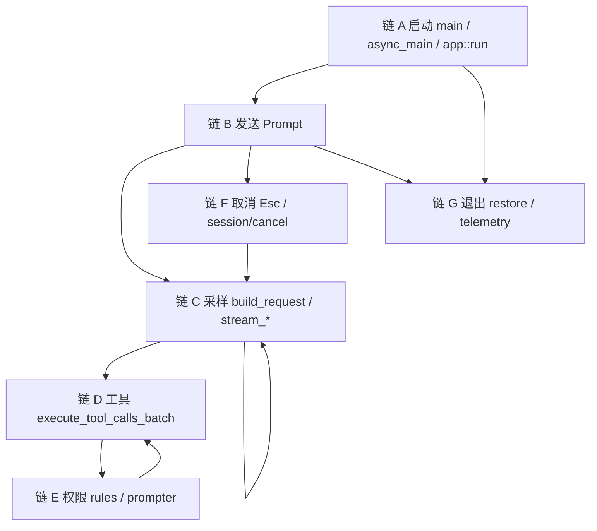
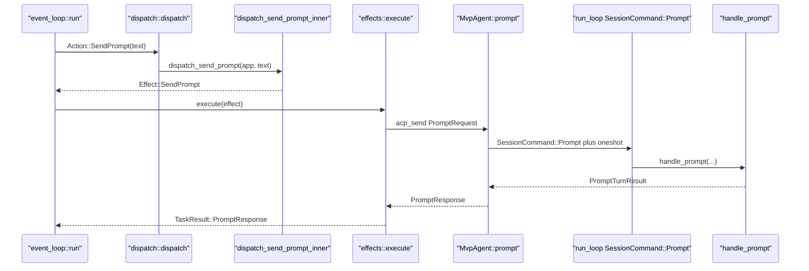

# 14 · 关键调用链逐函数精读

> 读完本篇应能：打开对应 `.rs`，按编号单步走完启动、发送、采样、工具、权限、取消、退出。场景级时序见 [13-跨模块完整运行链.md](13-跨模块完整运行链.md)。

## 快速摘要

### 架构总览（模块与依赖）

七条链覆盖一个进程的寿命：`main` 装配运行时 → TUI `run` 接管终端 → Prompt 穿过 Action/Effect/ACP/Session → Sampler 流式推理 → Tool/Workspace 副作用 → Permission HITL → Esc 取消 → restore + telemetry flush。

每一跳必须能回答：谁调用、参数在哪一层定型、返回谁消费、错误谁包装、走的是直接调用还是 channel。

### 核心调用序列（逐步逻辑）

1. **启动**：`main` → Tokio → `async_main` → `xai_grok_pager::app::run` → `event_loop::run`。
2. **发送**：`Action::SendPrompt` → `dispatch_send_prompt` → `Effect::SendPrompt` → `MvpAgent::prompt` → `SessionCommand::Prompt` → `handle_prompt`。
3. **采样**：`ChatStateHandle::build_request` → `SamplerHandle::submit_and_collect` → `run_request_task` → `stream_*` → `SamplingEvent::Completed`。
4. **工具**：`execute_tool_calls_batch` → `prepare_tool_call` → `dispatch_tool` → `ToolDyn::execute` → `WorkspaceOps`。
5. **权限**：classification / rules / `AcpPrompter` / `Decision`。
6. **取消**：Esc → `dispatch_cancel_turn` → `session/cancel` → token → `PromptCompletionKind::Cancelled`。
7. **退出**：`restore_terminal` → sandbox flush → Sentry/OTEL/`debug_log` flush。

### 易错点与边界条件

- `dispatch_send_prompt` 在 `prompt.rs`；`interject.rs` 的 `dispatch_send_prompt_now` 是插话/插队。
- `submit_and_collect` 的 RAII Drop 会 Cancel；不要再手发一次除非你知道 id 仍在 active set。
- `Tool::execute` 默认包装 `run`；运行时永远调 `execute`。
- `MvpAgent::cancel` 对未知 session 返回 `Ok(())`。
- TUI 退出与 agent 模式退出的 telemetry 路径不同：前者 `signal_handler::flush_telemetry_and_exit` / `app::run` 尾部；后者 `shutdown_and_flush_telemetry`（不写终端 escape）。

---

## 1. Why：概念链不够，必须落到函数名

[13](13-跨模块完整运行链.md) 说明边界穿越。对着 IDE 单步时，还需要「第 N 步打开哪个文件、函数叫什么、参数从哪来」。本篇只列生产路径上真实被调用的符号；测试替身单独标注。

阅读约定：每一步格式为 **文件 → 函数 → 参数要点 → 返回**。`channel` 取值与 13 的词汇表相同。

七条链在进程寿命中的位置：

发送 Prompt 的逐步符号（与链 B 表格一一对应）：

---

## 2. 链 A：启动 `main` → `async_main` → TUI `run`

### A1. 进程入口

| 步 | 文件 | 函数 | 参数要点 | 返回 |
|---|---|---|---|---|
| 1 | `crates/codegen/xai-grok-pager-bin/src/main.rs` | `main()` | 无 CLI 参数（内部 `PagerArgs::parse_cli()`） | `()`；失败 `process::exit` |
| 2 | 同文件 | `xai_grok_telemetry::startup::mark_process_start` | 无 | 标记进程启动时刻 |
| 3 | `xai-grok-pager` mermaid/voice | `maybe_run_render_subprocess` / `maybe_run_capture_subprocess` | 看 argv 是否子进程身份 | `Some(code)` 则立刻 `exit` |
| 4 | `xai-grok-pager` CLI | `PagerArgs::parse_cli` | argv | `PagerArgs` |
| 5 | 同 `main.rs` | `dispatch_version_if_requested` / `dispatch_doctor_if_requested` | `&PagerArgs` | `true` 则 `return`，不进 Tokio |
| 6 | `xai-grok-pager-minimal` | `install` | 无 | 安装 minimal 运行时钩子 |
| 7 | `xai-grok-config` | `validate_requirements` | 托管 requirements | `Err` → `exit(2)` |
| 8 | `xai-grok-telemetry` | `sentry::init` | `client: "grok-pager"` | `SentryGuard` 活到 `main` 结束 |
| 9 | `xai-crash-handler` | `install_terminal_restore_only` 然后可选 `install` | crash 目录 `$GROK_HOME/crash` | 失败只 warn |
| 10 | `xai-grok-shell` | `active_sessions::collect_crashed` | 无 | 上一轮崩溃会话列表（只打 log） |
| 11 | 同 `main.rs` | `cli_worker_threads` + `tokio::runtime::Builder::new_multi_thread` | `GROK_WORKER_THREADS` | `Runtime`；失败 `shutdown_and_flush_telemetry(1)` |
| 12 | 同 `main.rs` | `run_and_shutdown(runtime, async_main(args), RUNTIME_SHUTDOWN_GRACE)` | future + grace | `async_main` 的 `Result<()>` |
| 13 | 同 `main.rs` | `debug_log::flush` | 无 | 退出前冲刷 debug 文件 |

`channel`：到步骤 12 之前全是同步直接调用。步骤 12 是 `runtime.block_on`。

### A2. `async_main` 分发

| 步 | 函数 | 参数要点 | 返回 |
|---|---|---|---|
| 14 | `async_main(args: PagerArgs)` | 已 parse 的 CLI | `Result<()>` |
| 15 | `rustls::crypto::ring::default_provider().install_default` | 无 | 忽略错误 |
| 16 | `args.apply_cwd()` | 可能改进程 cwd | `PagerArgs` |
| 17 | 条件 `set_var("GROK_COMPACTION_MODE")` 等 | CLI compaction / chat / leader socket / debug | 进程环境 |
| 18 | `xai_grok_shell::config::apply_sandbox(None, profile, cwd)` | resume 冲突则 `exit(1)` | 进程级沙箱 profile |
| 19 | `http::set_client_name(GrokPager 或 Generic)` | 交互式 vs `-p` | 后续 HTTP 客户端身份 |
| 20 | `args.command.take()` match | `Command::Agent` → `run_agent_command`；其它 CLI 子命令各自 return | 默认下落到 TUI 或 `-p` |
| 21 | `HeadlessPrompt::from_args(single, prompt_json, prompt_file)` | `-p` / `--prompt-json` / `--prompt-file` | `Some` → 链 H（见 13 场景 8） |
| 22 | `xai_grok_pager::app::run(args, bg_update_rx)` | TUI 路径 | `Result<bool>`（`true` = quit-for-update） |

`-p` 在步骤 21 短路，**不**调用 `app::run`。`grok agent headless` 在步骤 20 进 `run_headless`，也不是 TUI。

### A3. TUI `app::run` → event loop

文件：`crates/codegen/xai-grok-pager/src/app/mod.rs` 的 `pub async fn run`。

| 步 | 函数 | 参数要点 | 返回 |
|---|---|---|---|
| 23 | `xai_tty_utils::redirect_native_stderr` | 无 | fd 2 改走内部，避免污染 TUI |
| 24 | `config::load_effective_config` | 磁盘 + managed | toml |
| 25 | `auth::try_ensure_fresh_auth`（timeout `STARTUP_AUTH_REFRESH_TIMEOUT`） | grok.com config | `Option<Auth>` |
| 26 | `models::start_early_prefetch*` + `join_early_prefetch` | auth | `RemoteSettings` |
| 27 | `resolve_leader_mode` | `--leader` / `--no-leader` / 沙箱 / 远程策略 | `LeaderMode` |
| 28 | `session_startup::materialize_startup` | resume/fork/new | `MaterializedStartup` |
| 29 | `init_terminal` | screen mode、raw mode、alternate screen | `(PagerTerminal, ScreenMode)` |
| 30 | `acp::connect` 或 `connect_via_leader` | `ConnectFlags`（subagents、memory、hunk tracker…） | `AcpConnection`；leader 失败可 fallback embedded |
| 31 | `event_loop::run(&mut terminal, connection, …)` | 见下 | `RunResult` |
| 32 | `unified_log::flush_blocking` | 无 | 冲刷 pager 侧统一日志 |
| 33 | `restore_terminal(terminal, writer_thread, screen_mode)` | 见链 G | `Result` |
| 34 | `drop(AgentShutdownGuard)` + `global_process_scope().kill_all` | cancel token | 停嵌入 agent 线程、杀后台子进程 |

文件：`crates/codegen/xai-grok-pager/src/app/event_loop.rs` 的 `pub(crate) async fn run`。

| 步 | 函数 | 参数要点 | 返回 |
|---|---|---|---|
| 35 | `AppView::new(connection.tx, models, available_commands)` | ACP 发送端 | 可变 UI 状态（唯一 UI 写者在本 loop） |
| 36 | 应用 launch yolo/auto、theme、session materialize | CLI + remote | 可能立刻 `dispatch(Action::…)` 创建 session |
| 37 | `tokio::select!`（biased） | `connection_cancel`、`quit_notify`、writer ack、`acp_rx`、`JoinSet`、input、tick | 直到 Quit 或 disconnect |

`select!` 里处理输入的路径：crossterm `Event` → `AppView` 输入路由 → `InputOutcome::Action` → `dispatch::dispatch` → `effects::execute`。这是链 B 的入口。

测试证据：`pager` dispatch 单测不启动 `app::run`；PTY e2e `initial_prompt_positional_auto_submits.rs` 覆盖 CLI 位置参数 → NewSession → SendPrompt。

失败：leader connect 失败且未 cancel → 打 warn，fallback `acp::connect`；connect 仍失败 → `restore_terminal` 后 `Err`。requirements 校验失败发生在 `main`，进不了这里。

---

## 3. 链 B：发送 Prompt `Action` → `dispatch` → `Effect::SendPrompt` → `MvpAgent::prompt` → `SessionCommand::Prompt`

### B1. 输入到 Action

| 步 | 文件 | 函数 | 参数要点 | 返回 |
|---|---|---|---|---|
| 1 | `app_view.rs` / `agent_view/input.rs` | 按键匹配 `ActionId::SendPrompt` | Enter；composer 文本 | `InputOutcome::Action(Action::SendPrompt(text))` |
| 2 | `event_loop.rs` | 将 Action 交给 dispatch | `Action`, `&mut AppView` | `Vec<Effect>` |

### B2. 同步 dispatch

文件：`crates/codegen/xai-grok-pager/src/app/dispatch/router.rs`

| 步 | 函数 | 参数要点 | 返回 |
|---|---|---|---|
| 3 | `dispatch(action, app)` | 先 `reconcile_foreign_resume_launch` | match 后 `Vec<Effect>`，多数臂再经 `sync_sleep_inhibitor` |
| 4 | 臂 `Action::SendPrompt(text)` | `text: String` | 调用 `dispatch_send_prompt(app, text)` |

文件：`crates/codegen/xai-grok-pager/src/app/dispatch/prompt.rs`

| 步 | 函数 | 参数要点 | 返回 |
|---|---|---|---|
| 5 | `dispatch_send_prompt(app, text)` | 打 `prompt.enqueue` 日志 | `dispatch_send_prompt_inner(app, text, consume_input=true, literal=false, is_follow_up=false)` |
| 6 | `dispatch_send_prompt_inner` | 清 `pending_action`；合并 voice interim；`reconnect_pending` 则 toast 并 `vec![]` | 见下分支 |
| 7 | 受限 slash（`/usage`、`/imagine`…） | `registry().is_restricted` | 开 upsell，**不** SendPrompt |
| 8 | 已知 slash | slash registry | 本地 Effect（如 Compact），或改写后继续 |
| 9 | 立即发送路径 | 有 `session_id`，生成 `prompt_id` UUID，可选 `skill_token_ranges` | `vec![Effect::SendPrompt { agent_id, session_id, text, prompt_id, skill_token_ranges }]` |
| 10 | 本地排队路径 | turn 正在跑且不能 server-authoritative 发送 | 入队；可能稍后 `maybe_drain_queue` 再产出 Effect |

**不要**在 `interject.rs` 找 `dispatch_send_prompt`。该文件是：

| 函数 | 作用 |
|---|---|
| `dispatch_interject` | 中途插话 → `Effect::SendInterject`（`x.ai/interject`） |
| `dispatch_send_prompt_now` | 插队 → `Effect::SendPromptNow`（meta `sendNow=true`） |

测试：`dispatch/tests/prompt.rs` `hello` → `Effect::SendPrompt`；chip/`SendPromptNow` 另有断言。

### B3. Effect 执行

文件：`crates/codegen/xai-grok-pager/src/app/effects/mod.rs` `pub(crate) fn execute`

| 步 | 函数 | 参数要点 | 返回 |
|---|---|---|---|
| 11 | `execute(effect, tasks, acp_tx, …)` | `Effect::SendPrompt { … }` | `(bool quit, EffectMeta)`；本臂 quit=false |
| 12 | `tasks.spawn` async | 构造 `plain_prompt_content_block(text, skill_token_ranges)` | JoinSet 任务 |
| 13 | `acp::PromptRequest::new(session_id, prompt).meta(prompt_request_meta(prompt_id, screen_mode))` | `_meta.promptId` | `PromptRequest` |
| 14 | `acp_send(req, &tx).await` | ACP-RPC | `Result<PromptResponse, acp::Error>` |
| 15 | 映射 `TaskResult::PromptResponse { agent_id, result: map_err(format_acp_error), http_status, prompt_id }` | HTTP 状态从错误提取 | 回 event loop → `Action::TaskComplete` |

`SendPromptBlocks` / `SendPromptNow` 共用后续逻辑；SendNow 失败额外 `TaskResult::SendPromptNowFailed` 以便重入队。

### B4. `MvpAgent::prompt`

文件：`crates/codegen/xai-grok-shell/src/agent/mvp_agent/acp_agent.rs`

| 步 | 函数 | 参数要点 | 返回 |
|---|---|---|---|
| 16 | `async fn prompt(&self, arguments: acp::PromptRequest)` | `session_id`, `prompt` blocks, `meta` | `Result<PromptResponse, acp::Error>` |
| 17 | `session_handle_waiting_for_load(&session_id)` | 等 session load 完成 | `None` → `invalid_params "unknown session id"` |
| 18 | allowlist / unavailable model 短路 | `models_manager` | 可能直接 `PromptResponse::new(EndTurn)` 并通知 |
| 19 | `dispatch_lock(session_id).lock()` | 防同一 session prompt/cancel 交错 | `MutexGuard`，发送完 Command 后 drop |
| 20 | 解析 `meta.mode` / 否则 `SessionCommand::GetCurrentPromptMode` oneshot | `PromptMode` | 默认 unwrap_or_default |
| 21 | `prompt_id` 从 `meta.promptId` 或新 UUID；`allocate_turn_number` | 字符串 id | 写入 tracing span |
| 22 | `cmd_tx.send(SessionCommand::Prompt { prompt_id, prompt_blocks: arguments.prompt, prompt_mode, artifact_upload_ctx, client_identifier, screen_mode, verbatim, traceparent, json_schema, send_now, admission: None, tool_overrides_update, respond_to: tx, persist_ack: None, parsed_prompt_tx })` | unbounded mpsc | `Err` → `internal_error "failed to dispatch prompt"` |
| 23 | `push_roster_activity_delta(… Working)` | roster | 无 |
| 24 | `rx.await` oneshot | `PromptTurnResult` | 掉线 → `internal_error "session failed to respond"` |
| 25 | 组装 `PromptResponse`（`StopReason`、usage meta、tool overrides） | `PromptTurnOk` | 回 ACP-RPC |

### B5. Session actor 收 Command

文件：`crates/codegen/xai-grok-shell/src/session/acp_session_impl/run_loop.rs`

| 步 | 函数 | 参数要点 | 返回 |
|---|---|---|---|
| 26 | `SessionCommand::Prompt { … }` 臂 | `admission` 可拒绝 task-wake | 拒绝则 `respond_removed_prompt`（`PromptCompletionKind::RemovedFromQueue`） |
| 27 | `ensure_prefix_ready`；非 synthetic 时清 `task_wake_suppressed` | 用户重新参与 | 无 |
| 28 | `queue_input(QueueInputRequest { … })` | 可能 `cancel_for_send_now` | 排队或立即跑 |
| 29 | `maybe_start_running_task` | spawn 回合 future | 把 `handle_prompt` 放进 `running_task` |

文件：`crates/codegen/xai-grok-shell/src/session/acp_session_impl/turn.rs`

| 步 | 函数 | 参数要点 | 返回 |
|---|---|---|---|
| 30 | `handle_prompt(self, prompt_id, prompt_blocks, prompt_mode, …)` | 见签名；`verbatim`/`json_schema` | `PromptTurnResult` |
| 31 | `PromptOrigin::from_prompt_id`；`ensure_session_disk_writable` | 磁盘满则 Err | `?` 上浮 |
| 32 | 可选 `extract_bash_command` → `handle_direct_bash_command` | meta.bash_command | 旁路模型 |
| 33 | `slash_commands::resolve` | skills / builtin | builtin 可能 `ok_end_turn` 直接返回 |
| 34 | `process_conversation_turn_with_recovery` 循环（goal harness 可能多 round） | `req_id = prompt_id` | `TurnOutcome` |
| 35 | 映射 `PromptCompletionKind::{Completed, StationarityEnded, Cancelled, MaxTurnsReached}` | `TurnOutcome` | `PromptTurnOk` 经 oneshot 回步骤 24 |

错误冒泡：`handle_prompt` 的 `Err(acp::Error)` 经 oneshot → `MvpAgent::prompt` → `acp_send` Err → `TaskResult::PromptResponse { result: Err }` → dispatch 画错误。

---

## 4. 链 C：采样 `build_request` → `SamplerHandle` → `stream_*` → `Completed`

### C1. 组请求

文件：`turn.rs` `process_conversation_turn`

| 步 | 函数 | 参数要点 | 返回 |
|---|---|---|---|
| 1 | `prepare_tool_definitions_timed` | MCP 可能 wait | `(Vec<ToolSpec>, mcp_wait_ms)` |
| 2 | loop：`check_auto_compact_needed` → 可选 `run_compact_only` | 估计 token / context_window | `Option<AutoCompactTriggerInfo>` |
| 3 | `turn_base_tool_specs` 或 `forked_tool_override` | 本回合可见工具 | `Vec<ToolSpec>` |
| 4 | `ChatStateHandle::build_request(effective_tools, memory_reminder, persist_memory, trace, conv_id, req_id)` | Handle query | `Option<ConversationRequest>`；`expect` actor 活着 |

文件：`crates/codegen/xai-chat-state/src/handle.rs`

| 步 | 函数 | 参数要点 | 返回 |
|---|---|---|---|
| 5 | `build_request` | 封装 `ChatStateCommand::BuildConversationRequest { reply }` | oneshot `ConversationRequest` |

文件：`crates/codegen/xai-chat-state/src/actor/request_builder.rs`

| 步 | 函数 | 参数要点 | 返回 |
|---|---|---|---|
| 6 | `ChatStateActor::build_conversation_request` | 已 `ensure_conversation_integrity` 的 clone | `ConversationRequest` |
| 7 | 可选 `compact_images_to_byte_budget` | body ≥ 约 50MB | 驱逐最旧 inline 图 |
| 8 | 可选 `prune_conversation` | total_tokens > 50% window | 修剪旧 tool result |
| 9 | 可选 `inject_memory_reminder` | 第一回合 memory | 写入 system 或 clone |

Session 再填 `x_grok_session_id` / `x_grok_turn_idx` / `x_grok_agent_id` / `hosted_tools` / `json_schema`。

### C2. 提交采样

文件：`crates/codegen/xai-grok-shell/src/session/acp_session_impl/sampler_turn.rs`

| 步 | 函数 | 参数要点 | 返回 |
|---|---|---|---|
| 10 | `prepare_sampler_for_turn` | `refresh_token_if_expired`；`update_config` idle timeout | `()` |
| 11 | `run_turn_via_sampler(request)` | 新 `RequestId::random()`；oneshot `turn_stream_drained` | `Result<SamplerTurnOutcome, acp::Error>` |
| 12 | `sampler_handle.submit_and_collect(request_id, request)` | 见下 | `(ConversationResponse, InferenceLatencyStats)` 或 `SamplingError` |
| 13 | 成功：最多等 5s drain barrier | 超时 warn，仍继续 | `SamplerTurnOutcome::Response` |
| 14 | 失败：`handle_sampling_failure` | `SamplingErrorInfo` | `CompactAndResubmit` / `RefreshAuthAndResubmit` / `Err` |

文件：`crates/codegen/xai-grok-sampler/src/handle.rs`

| 步 | 函数 | 参数要点 | 返回 |
|---|---|---|---|
| 15 | `submit_and_collect` | `CancelOnDrop` 持有 `request_id` | oneshot `CompletionResult` |
| 16 | `cmd_tx.send(SamplerCommand::Submit { request_id, request: Box, config: None, completion_tx: Some })` | unbounded | send 失败则不装 Drop guard |
| 17 | `completion_rx.await` | actor 死后 | `Err(SamplingError::auth_unknown("sampler actor dropped…"))` |

### C3. Actor 与 stream

文件：`crates/codegen/xai-grok-sampler/src/actor/mod.rs`

| 步 | 函数 | 参数要点 | 返回 |
|---|---|---|---|
| 18 | `SamplerActor::spawn(config, retry_policy, event_tx)` | 创建 cmd channel | `SamplerHandle` |
| 19 | `run` select `tasks.join_next` 与 `cmd_rx` | JoinSet 清理 `active_requests` | 所有 handle drop 后 break |
| 20 | `handle_command(Submit)` | 新 `CancellationToken`；重复 id 取消旧任务 | `tasks.spawn(run_request_task)` |
| 21 | `handle_command(Cancel { request_id })` | `state.cancel` | token.cancel() |

文件：`crates/codegen/xai-grok-sampler/src/actor/request_task.rs`

| 步 | 函数 | 参数要点 | 返回 |
|---|---|---|---|
| 22 | `run_request_task(request_id, request, config, retry_policy, event_tx, cancel_token, completion_tx)` | idle 默认 300s | 返回 `RequestId` 给 JoinSet |
| 23 | `SamplingClient::new(config)` | 配置错误不重试 | `Err` → Failed + completion Err |
| 24 | loop：若 `cancel_token.is_cancelled` → `handle_cancellation` | 无 Completed | 退出 |
| 25 | 按 `client.api_backend()` 分支 | `ChatCompletions` / `Responses` / `Messages` | L2 stream |
| 26a | `stream_chat_completions(teed, metadata, request_id, idle_timeout)` | SSE chat.completions | 流结束 yield `SamplingEvent::Completed` |
| 26b | `stream_responses_tracked(…)` | Responses API | 同上 |
| 26c | `stream_messages(…)` | Messages API | 同上 |
| 27 | 消费 stream：ChannelToken / ToolCallDelta / Completed / Failed | 每个事件 `event_tx.send` | UI 用这条；完成另走 oneshot |
| 28 | `AttemptOutcome::Completed` 非空 → `send_completion(Ok((response, metrics)))` | 取消 Drop 随后 Cancel 是 no-op | 回合继续 |
| 29 | Empty / Failed → `classify_error` + backoff | `RetryPolicy` | 耗尽则 Failed 上浮 |

### C4. 事件翻译（与 oneshot 并行）

Session spawn 时（`acp_session_impl/spawn.rs`）创建 `sampler_event_tx/rx`，drainer：`while let Some(event) = sampler_event_rx.recv()`.

文件：`tool_calls.rs` `handle_sampling_event`

| 事件 | 副作用 |
|---|---|
| `StreamStarted` | `record_stream_start`；streaming capture begin |
| `FirstToken` | `Event::FirstToken` |
| `ChannelToken { Text }` | `SessionUpdate::AgentMessageChunk` ACP-notif |
| `ChannelToken { Reasoning }` | `AgentThoughtChunk` |
| `ToolCallDelta` | 增量工具 UI |
| `Completed` | capture 收尾；**不**在这里改 ChatState 规范消息（turn loop 用 oneshot 的 response） |
| `Failed` | 记录；语义恢复在 `handle_sampling_failure` |

测试：`xai-grok-sampler/tests/test_actor.rs` `submit_and_collect_returns_response`；stream 单测断言恰好一个 Completed。

---

## 5. 链 D：工具 `execute_tool_calls_batch` → `ToolDyn::execute` → `WorkspaceOps`

文件：`crates/codegen/xai-grok-shell/src/session/acp_session_impl/tool_calls.rs`

| 步 | 函数 | 参数要点 | 返回 |
|---|---|---|---|
| 1 | `execute_tool_calls_batch(&self, tool_calls, deferred_followups, final_result)` | 本轮模型给出的 `Vec<ToolCallResponse>` | `Result<(), acp::Error>` |
| 2 | 若 `final_result` 已有（权限拒绝/取消） | 为剩余 call **仍** `push_tool_result` 取消文案 | 闭合 call id |
| 3 | `emit ToolStarted` + observability `ToolCallStarted` | `tool_call_id`, `tool_name` | 无 |
| 4 | `prepare_tool_call(call, deferred_followups)` | 见链 E | `Ok(PreparedToolCall)` 或 `Err(ToolLoop)` |
| 5 | 同路径写锁：`lock_path_for_args` → `file_path`/`path`/`target_file` | 共享 `Mutex<()>` | 同文件串行 |
| 6 | `dispatch_tool(&workspace_ops, &prepared, session_id)` | 可 `call_with_auth_retry` | `Result<ToolRunResult, ToolError>` |
| 7 | interruptible wait 工具 | `tokio::select!` 与 `wait_for_pending_interjection` | 插话可中断 wait |
| 8 | 成功/失败都 `push_tool_result(ConversationItem::tool_result(same id, …))` | 必须同 id | ChatState 追加 |
| 9 | 后置：deferred followups、`drain_pending_interjections` | 可能 `ToolLoop::Continue` 或终止 | 外层 loop 再采样或结束 |

文件：`crates/codegen/xai-grok-shell/src/session/acp_session_impl/tool_dispatch.rs`

| 步 | 函数 | 参数要点 | 返回 |
|---|---|---|---|
| 10 | `dispatch_tool(workspace_ops, prepared, session_id)` | `prepared.tool_name`, `parsed_args`, `tool_call_id.0` | `ToolRunResult` |
| 11 | `workspace_ops.call_tool(name, args, call_id, Some(session_id))` | Local 必须有 session | 见下 |

文件：`crates/codegen/xai-grok-workspace/src/workspace_ops.rs`

| 步 | 变体 | 行为 | 错误 |
|---|---|---|---|
| 12a | `WorkspaceOps::Local { handle }` | `handle.session(session_id).toolset().call(name, args, call_id, None)` | 缺 session → `session_not_found` |
| 12b | `WorkspaceOps::Proxy { client }` | Hub `client.harness().call` 消费 stream | 断线 → `network_error`；反序列化失败 → `tool_result_deserialize` |

文件：`crates/codegen/xai-grok-tools/src/registry/types.rs` `Toolset`

| 步 | 函数 | 参数要点 | 返回 |
|---|---|---|---|
| 13 | `call` → `call_with_cancellation(..., None)` | 排空 Progress | 第一个 Terminal |
| 14 | `call_streaming_with_cancellation` | `prepare_dispatch` 解析工具 | `lr_handle.execute(ctx, canonical_params)` |
| 15 | `finalize_output` | 截断、转换 | `ToolRunResult` |

文件：`crates/common/xai-tool-runtime/src/tool.rs`

| 步 | 符号 | 参数要点 | 返回 |
|---|---|---|---|
| 16 | `ToolDyn::execute(&self, ctx, args: Value)` | JSON → typed `T::Args` | `ToolStream<TypedToolOutput>` |
| 17 | 反序列化失败 | `invalid_arguments` | 立即 Terminal Err |
| 18 | `Tool::execute(self, ctx, typed_args)` 默认 | 包装 `Tool::run` 为单 Terminal | Progress* + 恰好一个 Terminal |

具体工具（grok_build）：

| 工具 | 文件 | `run` 要点 | Workspace 副作用 |
|---|---|---|---|
| `read_file` | `xai-grok-tools/.../grok_build/read_file/mod.rs` | `target_file`、行范围、PDF 抽取 | `FileSystem` 读；gitignore 可选 |
| `search_replace` | `.../search_replace/mod.rs` | `file_path`, `old_string`, `new_string` | 写文件 + `FileWritten` 通知 |
| `bash` / `run_terminal_cmd` | `.../bash/mod.rs` | cmd、timeout、foreground/background | `Terminal` spawn；可 sandbox 网络过滤 |

`channel`：工具内部是 async 直接调用 + `ToolStream`。不经过 Session-cmd。权限在步骤 4 已完成（链 E）。

失败：`ToolError` → `handle_tool_error` → 同 id 的错误 tool result → 模型下一轮看到失败。不把 `ToolError` 直接变成 ACP `session/prompt` 失败，除非磁盘满等会话级错误。

---

## 6. 链 E：权限 classification → rules → prompter → decision

入口仍在 `prepare_tool_call`（`tool_calls.rs`）。

| 步 | 函数 | 参数要点 | 返回 |
|---|---|---|---|
| 1 | 发 ACP `ToolCall` status Pending | `raw_input` 尽早给 UI | 无 |
| 2 | MCP 名：`parse_mcp_tool_name`；managed 前缀则 `refresh_managed_mcp_if_stale` | 限定名 | 可能 wait init |
| 3 | `normalize_empty_arguments` + JSON parse；失败尝试 concatenated JSON | 模型偶发粘连 JSON | `raw_input: Value` |
| 4 | `tool_bridge().try_parse(name, raw_input)` | 类型化 `tool_input` | Err → `ToolLoop::ToolParsingError` |
| 5 | `AccessKind::from(&tool_input)` | Read/Grep/Edit/Bash/MCP/WebFetch/WebSearch | 权限输入 |
| 6 | `plan_mode_edit_gate` | Plan 模式禁写 | Deny → 不执行，`ToolLoop::Continue` |
| 7 | `send_tool_call_start` | UI 标题 / ToolKind | display 结构 |
| 8 | auto 模式：`set_classifier_transcript(recent turns)` | 给 classifier 上下文 | 无 |
| 9 | `PendingInteractionGuard` | 标记 pending permission | Drop 时清 |
| 10 | `permissions.request_with_path_context_resolved(access, tool_call_update, path_context, session_id, None, None)` | `real_cwd` = session cwd | `PermissionResolution` |

文件：`crates/codegen/xai-grok-workspace/src/permission/manager/mod.rs`

| 步 | 函数 | 参数要点 | 返回 |
|---|---|---|---|
| 11 | `PermissionHandle::request` | 委托 `request_with_path_context` | 仅 `Decision` |
| 12 | `request_with_path_context_resolved` | `AllowAll` 立即 Allow + `event: None` | `PermissionResolution` |
| 13 | Actor 变体：`InFlightGuard` + `cmd_tx.send(PermissionCommand::Request { respond_to oneshot, … })` | send 失败 | `Reject("permission manager unavailable")` |
| 14 | `rx.await` | actor 死 | `Reject("failed to receive permission decision")` |

Actor 臂（同文件 `PermissionCommand::Request`）：

| 步 | 逻辑 | 输入 | 输出 |
|---|---|---|---|
| 15 | 解析 `request_cwd` | `path_context.real_cwd` 否则 manager cwd | 规则锚点 |
| 16 | `permission_mode` | yolo → AlwaysApprove；auto → Auto；否则 Ask | 遥测 |
| 17 | `RequestClassification` 初始 `NotClassified` | 每请求一份 | 事件投影源 |
| 18 | **Rules**：`CompiledPolicy` + `PermissionState` grants/denies | path glob、bash prefix、MCP allowlist | 快路径 Allow/Deny |
| 19 | Bash：`evaluate_bash(cmd, state, honor_safe_lists)` | segment、safe-list、`rg --pre` 等例外 | `BashEvaluation` |
| 20 | MCP：`mcp_pre_decision` | `allowed_mcp_tools` / `allowed_mcp_servers`；`policy_forced_prompt` | `Some(Allow)` 或继续问 |
| 21 | **Classification**（auto + bash/mcp 等）：`auto_mode::classify` | `BashSecurityAssessment` | `ClassifierVerdict`；连续自动拒绝上限 3 / 总计 20 |
| 22 | FastPath | 明显安全 | `RequestClassification::FastPath`，不问 |
| 23 | **Prompter**：`AcpPrompter::request(&access, &tool_call_update, protected_edit)` | ACP `session/request_permission` | `PromptOutcome` → `Decision` |
| 24 | 持久化 `PermissionState`（Always 选项） | 写磁盘 | 后续快路径 |
| 25 | oneshot 发回 `PermissionResolution { decision, event }` | 权威 `PermissionEvent` | Session 不得再伪造事件 |

文件：`crates/codegen/xai-grok-workspace/src/permission/prompter.rs` — `AcpPrompter` 经 gateway `request_permission`；Hub 路径 `request_permission_via_hub`。

文件：`crates/codegen/xai-grok-pager/src/app/acp_handler/permissions.rs` — 收到 `RequestPermission` 打开 modal；用户选择经 ACP 响应回去。`dispatch/permissions.rs` 处理 option / pattern edit / MCP scope。

`Decision` 在 `prepare_tool_call` 的消费：

| Decision | 后续 |
|---|---|
| `Allow` / `Ask`（Ask 已在 manager 内变成 Allow 或仍问） | 加入 `approved` 批次 |
| `Reject` / `PolicyDeny` | `ToolLoop::PermissionReject`；批次停止 |
| `Cancelled` | `ToolLoop::Cancelled` |
| `FollowupMessage` | `ToolLoop::FollowupMessage` |

测试：workspace manager 模块内 `async fn request_permission` 假客户端；pager `dispatch/tests/permissions.rs`。

---

## 7. 链 F：取消 Esc → `session/cancel` → token → `PromptCompletionKind::Cancelled`

| 步 | 文件 | 函数 | 参数要点 | 返回 |
|---|---|---|---|---|
| 1 | `app/mod.rs` | `esc_cancels_turn(is_minimal, vim_mode)` | minimal 或非 vim | `bool` |
| 2 | `app_view.rs` / `agent_view/input.rs` | Esc / Ctrl+C | 设 `cancel_trigger_hint` | `Action::CancelTurn` |
| 3 | `dispatch/router.rs` | `Action::CancelTurn` | 无 | `dispatch_cancel_turn(app)` |
| 4 | `dispatch/turn.rs` | `dispatch_cancel_turn` | 已 Cancelling → retry 再发；有 subagent 无偏好 → modal | `Vec<Effect>` 或空 |
| 5 | 同文件 | `emit_cancel_turn` / `do_cancel_turn` | `cancel_subagents`, `rewind_if_no_output=false` | `Effect::CancelTurn { session_id, cancel_subagents, trigger, rewind_if_no_output }` |
| 6 | `effects/mod.rs` | `execute` CancelTurn 臂 | meta `cancelSubagents`/`cancelTrigger`/`rewindIfNoOutput` | spawn；`TaskResult::CancelComplete` |
| 7 | ACP | `acp_send(CancelNotification)` | 通知，不是 request | 失败只 warn |
| 8 | `mvp_agent/acp_agent.rs` | `cancel(&self, args)` | 解析 trigger / cancelSubagents 默认 true | `Ok(())` |
| 9 | 同函数 | `cmd_tx.send(SessionCommand::Cancel(CancelOptions { user_initiated: true, … }))` | 未知 session 跳过 send | 无 oneshot |
| 10 | `run_loop.rs` | `SessionCommand::Cancel` 臂 | 先 `replay_buffer.flush` | 再 cancel |
| 11 | `tasks_cancel.rs` | `cancel_running_task(options)` | compact `request_cancel`；可选 suppress task wakes | `WakeBarrier` |
| 12 | 同函数 | `running_task.abort()`；`cancel_all_session_subagents` 若 flag | 先 abort 生产者 | 无 |
| 13 | 同函数 | `tool_bridge().kill_foreground_commands[_by_owner]` | subagent 收窄 owner | 停 PTY |
| 14 | 回合 future abort | `submit_and_collect` Drop | `SamplerCommand::Cancel { request_id }` | request_task `AttemptOutcome::Cancelled` |
| 15 | `turn.rs` `handle_prompt` | `TurnOutcome::Cancelled { category, context }` | 映射 | `PromptCompletionKind::Cancelled { category, context }` |
| 16 | ACP `PromptResponse` | `StopReason::Cancelled` | 仍会返回 prompt RPC | TUI 结束 turn UI |

`channel`：步骤 3 sync-dispatch；6 JoinSet；7 ACP-notif；9 Session-cmd；14 Sampler-cmd。

不变量：已 `push_tool_result` 或已写盘的不回滚。`kill_background_tasks` 默认 false（交互式）；subagent teardown 才 true。

测试：`cancel_running_task_tests.rs` `cancel_propagates_to_sampler_handle_so_no_further_emission`；`turn_completion_emit_tests.rs` `cancellation_persists_turn_completed_cancelled`。

---

## 8. 链 G：退出 restore / telemetry flush

分三条退出路径，不能混。

### G1. 正常 TUI Quit

| 步 | 文件 | 函数 | 参数要点 | 返回 |
|---|---|---|---|---|
| 1 | `dispatch/router.rs` | `Action::Quit` | 停 voice；`unregister_all_active_sessions` | `Effect::Quit` |
| 2 | `effects::execute` | `Effect::Quit` | 打 `pager quit` 日志 | `(true, meta)` → event loop `break` |
| 3 | `event_loop::run` 返回 | `RunResult` | `quit_for_update` / `relaunch` | 回 `app::run` |
| 4 | `app/mod.rs` `run` 尾 | `unified_log::flush_blocking` | 无 | 无 |
| 5 | 同文件 | `restore_terminal(terminal, writer_thread, screen_mode)` | 先 drain writer，再 `disable_raw_mode`、`LeaveAlternateScreen`、`cursor::Show` | `Result` |
| 6 | `drop(AgentShutdownGuard)` | `cancel` token | 停嵌入 `MvpAgent` 线程 | 无 |
| 7 | `xai_tty_utils::global_process_scope().kill_all` | 无 | 杀 setsid 后台子进程 | 无 |
| 8 | 返回 `async_main` | `Ok(true/false)` | true = 等更新安装 | `xai_grok_sandbox::flush()` 在 `async_main` match 前 |
| 9 | `main` | `debug_log::flush` | `_sentry_guard` drop | 进程结束 |

`restore_terminal` 细节：`restore_terminal_with` 调 `emit_terminal_teardown_sequences`；与 panic hook / 信号路径共用字节序，避免乱码。

### G2. TUI 信号（SIGTERM / 二次 Ctrl+C）

文件：`crates/codegen/xai-grok-pager/src/app/signal_handler.rs`

| 步 | 函数 | 参数要点 | 返回 |
|---|---|---|---|
| 1 | `shutdown_with_terminal_restore(exit_code)` | 若 `TERMINAL_OWNED` 已 false，跳过 teardown | `!` |
| 2 | `emit_terminal_teardown_sequences` + `disable_raw_mode` | 无 terminal handle，光标落到屏底 | 无 |
| 3 | `active_sessions::try_unregister` | 非阻塞 flock | 无 |
| 4 | `flush_telemetry_and_exit` | `kill_all`；`restore_native_stderr` | `sentry::flush_on_shutdown`；`shutdown_otel`；debug_log flush；`process::exit` |

这条**绕过** `main` 的 flush，所以必须自己 flush。

### G3. Agent / headless 信号

文件：`xai-grok-pager-bin/src/main.rs`

| 步 | 函数 | 参数要点 | 返回 |
|---|---|---|---|
| 1 | `run_agent_command` 内 `tokio::spawn` 等 TERM/HUP/ctrl_c | Unix `next_signal_code` | 调用 `shutdown_and_flush_telemetry(code)` |
| 2 | `shutdown_and_flush_telemetry(exit_code)` | **不**写终端 escape（agent 从未 raw mode） | sentry + otel + debug_log；`exit` |

`async_main` 里 TUI 成功返回后还有 `xai_grok_sandbox::flush()`：把沙箱 violation 缓冲写出。Quit-for-update（`Action::QuitForUpdate`）在 restore 之后 `finish_update_on_exit`。

失败：`restore_terminal` 失败且 event loop 已 Ok → 只 warn；两者都失败 → 把 cleanup error 附在 run error 上。

---

## 9. 关系总表（跨链）

| 调用方 | 关系 | 被调 | channel | 错误冒泡 |
|---|---|---|---|---|
| `event_loop::run` | 调用 | `dispatch::dispatch` | sync-dispatch | 无；Effect 失败在 JoinSet |
| `effects::execute` | ACP-RPC | `MvpAgent::prompt` | ACP-RPC | `TaskResult::PromptResponse Err` |
| `MvpAgent::prompt` | 发送 | `SessionCommand::Prompt` | Session-cmd + oneshot | `acp::Error` |
| `handle_prompt` | 调用 | `process_conversation_turn` | 同 task | `TurnOutcome` / `acp::Error` |
| `ChatStateHandle::build_request` | 查询 | `build_conversation_request` | ChatState-cmd | actor 死 → `None`（Session `expect`） |
| `SamplerHandle::submit_and_collect` | 提交 | `run_request_task` | Sampler-cmd + Sampling-ev + oneshot | `SamplingError` |
| `execute_tool_calls_batch` | 调用 | `dispatch_tool` | 直接 async | `ToolError` → tool result |
| `dispatch_tool` | 端口 | `WorkspaceOps::call_tool` | 直接或 Hub 流 | Local/Proxy 错误码不同 |
| `Toolset::call` | 动态分派 | `ToolDyn::execute` | Tool-stream | Terminal Err |
| `prepare_tool_call` | 查询 | `PermissionHandle::request_*` | Perm-cmd + oneshot | 默认 Reject |
| `AcpPrompter` | ACP-RPC | pager permission modal | ACP request_permission | Cancelled |
| `dispatch_cancel_turn` | ACP-notif | `MvpAgent::cancel` | ACP-notif | warn |
| `cancel_running_task` | 取消 | `SamplerCommand::Cancel` | Sampler-cmd | 无返回 |

---

## 10. 如何重新实现（按链验收）

1. **启动**：假 `main` 能 parse CLI、建 Tokio、进入空 loop；`--help`/`-p`/默认 TUI 三分发可测。
2. **发送**：`dispatch` 单测断言 `SendPrompt` Effect 字段；不启动网络。
3. **采样**：用假 SSE 喂 `stream_chat_completions`，断言 ChannelToken 然后恰好一个 Completed。
4. **工具**：`Toolset::call("read_file", …)` 读夹具文件；call id 闭合。
5. **权限**：Ask 模式 Edit 必问；yolo `AllowAll` 不问。
6. **取消**：abort 后不再发 ChannelToken（对照 `cancel_propagates_to_sampler_handle_*`）。
7. **退出**：raw mode 关闭；debug_log 在信号路径也 flush。

---

## 11. 阅读源码建议顺序

按链 A→G 打开文件，每步用 `rg "fn 名字"` 跳转，不要按目录字母序。遇到 `ToolDyn` 先看 `tool.rs` 的 blanket impl，再看 grok_build 具体 `run`。遇到 Permission 先看 `PermissionHandle::request_with_path_context_resolved`，再进 actor 的巨大 `Request` 臂（用 `PermissionCommand::Request` 搜索）。

---

## 本篇文件表

| 路径 | 链 |
|---|---|
| `crates/codegen/xai-grok-pager-bin/src/main.rs` | A、G3、`-p` |
| `crates/codegen/xai-grok-pager/src/app/mod.rs` | A3、G1 |
| `crates/codegen/xai-grok-pager/src/app/event_loop.rs` | A3 |
| `crates/codegen/xai-grok-pager/src/app/dispatch/{router,prompt,turn,interject}.rs` | B、F |
| `crates/codegen/xai-grok-pager/src/app/effects/mod.rs` | B、F |
| `crates/codegen/xai-grok-pager/src/app/signal_handler.rs` | G2 |
| `crates/codegen/xai-grok-pager/src/headless.rs` | A2 `-p` |
| `crates/codegen/xai-grok-shell/src/agent/mvp_agent/acp_agent.rs` | B4、F |
| `crates/codegen/xai-grok-shell/src/session/acp_session_impl/{run_loop,turn,sampler_turn,tool_calls,tool_dispatch,tasks_cancel,spawn}.rs` | B5、C、D、F |
| `crates/codegen/xai-chat-state/src/{handle.rs,actor/request_builder.rs}` | C1 |
| `crates/codegen/xai-grok-sampler/src/{handle.rs,actor/mod.rs,actor/request_task.rs,stream/*}` | C2–C3 |
| `crates/codegen/xai-grok-workspace/src/{workspace_ops.rs,permission/manager/mod.rs,permission/prompter.rs}` | D、E |
| `crates/common/xai-tool-runtime/src/tool.rs` | D |
| `crates/codegen/xai-grok-tools/src/implementations/grok_build/{read_file,search_replace,bash}/` | D |
| `crates/codegen/xai-grok-shell/src/session/commands.rs` | `PromptCompletionKind` |

## 自检

- [x] 七条链均给出文件 + 函数 + 参数要点 + 返回
- [x] 与 13 的场景对齐，但不复制其时序图原文
- [x] `dispatch_send_prompt` 定位在 `prompt.rs`（源码核对）
- [x] 取消链落到 `PromptCompletionKind::Cancelled`
- [x] 退出链区分 TUI restore 与 agent-only flush
- [ ] 未运行测试

## 下一篇

[可靠性与通用技术实现说明书.md](可靠性与通用技术实现说明书.md) 统一取消、重试、结果未知与背压语义。然后按 [15-从零重实现路线图.md](15-从零重实现路线图.md) 分阶段实现。术语对照见 [16-术语表与源码查找手册.md](16-术语表与源码查找手册.md)。
