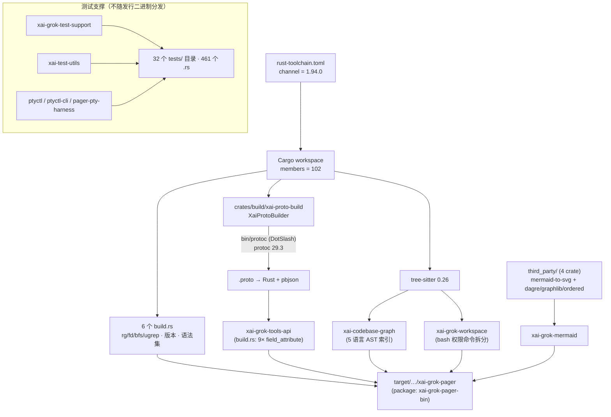
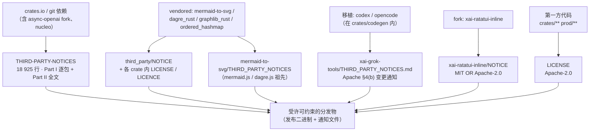

[上一篇：持久化记忆与会话恢复](13-持久化记忆与会话恢复.md) · 第 14 / 18 篇 · [总目录](README.md) · [下一篇：跨模块完整运行链与场景](15-跨模块完整运行链与场景.md)

# 14 · 构建、测试、第三方依赖与许可证

> **场景**：grok-build 是 **102 个 member** 的 Cargo workspace，要在 macOS/Linux 上编译、要用 DotSlash 拉 hermetic 的 `protoc`、要生成 protobuf 代码、要把 `rg`/`fd`/`bfs`/`ugrep` 塞进二进制、要跑分层测试，还要对 vendored 与移植的第三方代码做许可证合规。本章讲清「怎么从源码变成可运行的 `xai-grok-pager` 二进制、以及合规边界在哪」。
>
> **阅读说明**：源码基准 `SOURCE_REV = 84745de98b3d3996729aefcefd518890ffb73930`（仓库根 `SOURCE_REV`；注意它与当前 git HEAD `2178c69c` 不是同一个 SHA——`SOURCE_REV` 记录的是上游 monorepo 的 commit）。**工具版本**：Rust `1.94.0`（`rust-toolchain.toml:11`）、`ratatui 0.29` / `ratatui-core 0.1`、`tokio` 特性 `full`、`agent-client-protocol 0.10.4`（`Cargo.toml` `[workspace.dependencies]`）、`tree-sitter 0.26`（`Cargo.toml:296`，本轮新增）。本章一律用「文件 + 符号 + 偏移」定位：`符号(+N)` 中 `N` 是**函数内相对偏移**，`+0` = 该定义所在行；同一文件内的兄弟定义用 `（相对 X +N）` 明确基准；纯快照行号只写作 `（行 N）`，仅作辅助。代码会漂移，请以符号为准。

---

## 第一层 · 简单框架（系统骨架）

四件事，从「编译」到「合规」：

```
┌────────────────────────────────────────────────────────────────────────────┐
│ ① 构建 (Build)                                                              │
│   Cargo workspace: 102 members                                              │
│     crates/codegen/*  84   crates/common/*  12                              │
│     crates/build/*     1   prod/mc/*         1   third_party/*  4           │
│   rust-toolchain.toml: channel = "1.94.0" (第 11 行)                        │
│   DotSlash: bin/protoc  → protoc 29.3（本地开发用 wrapper）                  │
│   proto 代码生成: crates/build/xai-proto-build (XaiProtoBuilder)            │
│   6 个 build.rs: shell / tools / tools-api / pager-bin / version / markdown │
└────────────────────────────────────────────────────────────────────────────┘
                ┌───────────────────────────────────────────────────────────┐
                │ ② 第三方 (Third-party) —— vendored 源码                     │
                │   third_party/: mermaid-to-svg (MIT) + dagre_rust /        │
                │                 graphlib_rust / ordered_hashmap (Apache)   │
                │   + NOTICE（索引）+ README.md（vendoring 说明）             │
                │   另: codex/opencode 工具移植在 crates/codegen/ 内，       │
                │       带 crate 级 THIRD_PARTY_NOTICES.md                   │
                │   ⚠ README/NOTICE 仍列 nfsserve/fuser，但目录不存在         │
                └───────────────────────────────────────────────────────────┘
                ┌───────────────────────────────────────────────────────────┐
                │ ③ 测试 (Test) —— 分层测试支撑                              │
                │   xai-grok-test-support: TestSandbox / GrokStdioClient /   │
                │     AcpTestClient / MockInferenceServer / Conversation /   │
                │     LeaderStdioClient / MockOtelServer / UdsProxy / ...    │
                │   xai-test-utils: env / git / image / runfiles_util /      │
                │     tracing_capture                                        │
                │   ptyctl + ptyctl-cli + xai-grok-pager-pty-harness: PTY    │
                └───────────────────────────────────────────────────────────┘
                ┌───────────────────────────────────────────────────────────┐
                │ ④ 许可证 (License) —— 合规边界                            │
                │   LICENSE (Apache-2.0) / SECURITY.md (HackerOne) /         │
                │   THIRD-PARTY-NOTICES (18 925 行) / third_party/NOTICE /   │
                │   xai-grok-tools/THIRD_PARTY_NOTICES.md /                  │
                │   xai-ratatui-{inline,textarea}/NOTICE                     │
                └───────────────────────────────────────────────────────────┘
```

依赖关系（谁把谁装进最终二进制）：



| 子系统 | 入口符号 | 位置（文件 + 符号） | 一句话职责 |
|--------|---------|--------------------|-----------|
| 工作区定义 | `members` / `[workspace.dependencies]` | `Cargo.toml`（自动生成，只读） | 102 个 member、版本统一、profile、lint |
| 工具链锁定 | `[toolchain] channel` | `rust-toolchain.toml:11` | 固定 Rust 1.94.0 + rustfmt/clippy |
| 构建期 proto 生成 | `XaiProtoBuilder` / `configure` | `crates/build/xai-proto-build/src/lib.rs` `Struct：XaiProtoBuilder`（快照行 34）、`函数：configure`（快照行 347） | `.proto` → Rust + pbjson |
| protoc 定位 | `find_protoc` | `xai-proto-build/src/find_protoc.rs` `函数：find_protoc`（快照行 39） | `$PROTOC` → `bin/protoc` → `PATH` |
| hermetic 工具 | DotSlash wrapper | `bin/protoc`（`#!/usr/bin/env dotslash`） | 按平台下载并校验 sha256 的 protoc |
| 编译期嵌入 | 各 `build.rs` | 6 个 crate 的 `build.rs` | 版本/commit/搜索二进制/syntax dump |
| AST 解析 | `tree_sitter::Parser` | `xai-codebase-graph`、`xai-grok-workspace` | 代码图索引 + bash 权限命令拆分 |
| 测试支撑 | `TestSandbox` 等 | `crates/codegen/xai-grok-test-support/src/*` | 隔离环境 + 桩推理 + 桩 OTLP |
| vendored 第三方 | `third_party/` | 仓库根 `third_party/` | Mermaid 布局栈源码内联 |
| 移植代码 | `implementations::{codex,opencode}` | `crates/codegen/xai-grok-tools/src/implementations/` | openai/codex、sst/opencode 工具移植 |
| 许可证 | `LICENSE` 等 | 仓库根 + 各 crate | 三层覆盖：主许可 / 依赖汇总 / vendored 声明 |

> 注意 `Cargo.toml` 顶部第 1 行就写明 **"Auto-generated workspace root. Prefer editing per-crate Cargo.toml files."**——workspace 清单与版本表由上游生成，人工改动会被覆盖。

---

## 第二层 · 一个完整例子（全路径走读）

以「开发者改了一处 proto 定义，跑 `cargo build` + `cargo test`」为例：

```
① cargo build
   │  rustup 读 rust-toolchain.toml → 安装/使用 Rust 1.94.0 + rustfmt + clippy
   │  Cargo 读根 Cargo.toml → 展开 102 个 member
   ▼
② 各 crate 的 build.rs 先跑（顺序由依赖图决定）
   │
   ├─ xai-grok-tools-api/build.rs
   │    xai_proto_build::configure()
   │      .type_attribute(".", "#[derive(serde::Serialize, serde::Deserialize)]")
   │      ... (9 个 field_attribute，全部是 #[serde(default)])
   │          params_json / name_override / params_name_overrides /
   │          behavior_version / description_override /
   │          FinalizeToolServerConfigRequest.{client_callback_addr,
   │            session_id, client_callback_secret} /
   │          FinalizeToolServerConfigResponse.callback_status
   │      .compile_protos(&["proto/grok-tools.proto"], &["proto/"])
   │         │
   │         ▼
   │    xai-proto-build 内部：
   │      find_protoc::find_protoc()            ← 定位 protoc
   │        1) $PROTOC（Bazel build_script_env 注入的 hermetic 二进制）
   │        2) 向上逐级找 bin/protoc（DotSlash wrapper，本地开发）
   │        3) PATH 上的 protoc
   │        4) 都失败：GitHub Actions 直接报错；否则 warn 后返回 None
   │      configure() 的固定预设：
   │        .compile_well_known_types(true)
   │        .extern_path(".google.protobuf", "::pbjson_types")
   │        .extern_path(".google.protobuf.Empty", "()")
   │        .protoc_arg("--experimental_allow_proto3_optional")
   │      emit_rerun_if_changed(...)            ← 自己算 rerun-if-changed
   │        （tonic-build 的版本「懒且不正确」，见 lib.rs 注释）
   │      debug_redact::apply / first_marked_field
   │        ← 若 proto 里有 debug_redact=true 但没调 honor_debug_redact() → 直接 bail
   │      builder.compile_with_config(...)      ← tonic-prost-build 生成 Rust
   │      若 gen_pbjson() → pbjson_build 生成 serde 层
   │
   ├─ xai-grok-shell/build.rs   → 下载/复制 ripgrep 15.0.0 并 emit cfg(bundle_rg)
   ├─ xai-grok-tools/build.rs   → rg 15.0.0 / fd 10.4.2 / bfs 4.1 / ugrep 7.7.0
   ├─ xai-grok-markdown/build.rs→ syntect syntax set dump（含 Swift.sublime-syntax）
   ├─ xai-grok-pager-bin/build.rs→ 嵌入 VERSION_WITH_COMMIT；Windows 加 DELAYLOAD
   └─ xai-grok-version/build.rs → 只声明 rerun-if-env-changed=GROK_VERSION
   ▼
③ 编译 102 个 crate → 链接出 target/{debug,release}/xai-grok-pager
   （package 名 xai-grok-pager-bin，artifact 名 xai-grok-pager，见其 Cargo.toml [[bin]]）
        │
④ cargo test -p <crate>
   │  测试经 xai-grok-test-support 拉起：
   │   - TestSandbox::new/builder  → 隔离 HOME/GROK_HOME/TMPDIR/workspace，child env 从 env_clear() 起
   │   - GrokStdioClient           → 驱动真实 `grok agent stdio` 子进程 + 脚本化 ClientPolicy + 类型化 transcript
   │   - AcpTestClient             → 写 verbatim JSON-RPC 行（Foundation `\/` 方法、字符串 UUID id）
   │   - MockInferenceServer       → 桩 /v1/chat/completions、/v1/responses、/v1/messages + 请求日志
   │   - Conversation              → 按会话脚本化工具调用与回复；ObservedFailure 记录「没回答」的原因
   │   - run_headless              → 跑 `grok -p` 并捕获输出
   │   - MockOtelServer/OtelRecorder → 收 OTLP/HTTP 日志与指标
   │   - leader::LeaderStdioClient → 驱动 `grok agent --leader stdio`
   │   - UdsProxy / spawn_counting_server / ResourceSnapshot
   │   - scaled(base)              → 按 GROK_TEST_TIMEOUT_SCALE 放大超时（CI 共享 runner 用）
        ▼
⑤ 合规检查：
   third_party/ 下每个 vendored crate 保留原始许可（Apache 系用英式 LICENCE）
   third_party/NOTICE 是索引；THIRD-PARTY-NOTICES 覆盖全部依赖 + 在树移植
```

链路说明：**构建 = 工具链锁定 + protoc 定位 + 协议生成 + 编译期资源嵌入**；**测试 = 用支撑 crate 造可控、确定性的环境**；**第三方/许可证 = 把外部代码与合规声明分层管起来**。

---

## 第三层 · 详细逐步说明（主链路拆解）

### 步骤 1 — 工具链与工作区

`rust-toolchain.toml`（`channel` 在**第 11 行**）：

```toml
[toolchain]
channel = "1.94.0"
components = ["rustfmt", "clippy"]
profile = "default"
targets = ["x86_64-unknown-linux-gnu", "aarch64-unknown-linux-gnu"]  # host 自动追加
```

文件头部的注释是版本策略的一部分：**一次只升一个小版本、发布后至少等两周、升完跑 `cargo check --all-targets --workspace` 与 `cargo clippy --all-targets --workspace`**。

workspace 分层（`Cargo.toml` `members`，共 **102** 项）：

| 目录 | 数量 | 内容 |
|------|-----:|------|
| `crates/codegen/` | 84 | 业务/工具实现（pager、shell、tools、workspace、auth、mcp、telemetry、update…） |
| `crates/common/` | 12 | 共享基座：`xai-tool-runtime`、`xai-tool-types`、`xai-tool-protocol`、`xai-circuit-breaker`、`xai-computer-hub-{core,sdk,mcp-adapter}`、`xai-grok-compaction`、`xai-interjection-core`、`xai-message-delivery-core`、`xai-test-utils`、`xai-tracing` |
| `crates/build/` | 1 | `xai-proto-build`（构建期 crate） |
| `third_party/` | 4 | vendored 上游源码 |
| `prod/mc/` | 1 | `cli-chat-proxy-types`（跨产品共享类型） |

> **本轮新增 member**：`crates/codegen/xai-grok-file-lock`（`Cargo.toml:36`）。它提供 **有界、非阻塞的 advisory 文件锁**，取锁前先经过 machine-local 的 acquire slot，避免网络文件系统卡住时拖垮多进程。当前唯一使用者是 `xai-grok-shell`（`crates/codegen/xai-grok-shell/Cargo.toml:147`）。公开 API：`lock_file`、`LockedFile`、`LockOptions`/`SlotPolicy`/`Wait`、`LockError`、`DEFAULT_SLOT_GRACE`、`SLOT_DIR_ENV`/`slot_path_in`（`xai-grok-file-lock/src/lib.rs` 的 `pub use` 列表）。其不变量写在该文件 `Module：lib.rs` 的文档注释里：**永不阻塞等待**、**先占 slot 再 open**、**slot 目录只能是 `GROK_FILE_LOCK_SLOT_DIR` 或 `/tmp/grok-file-lock-<euid>`**、**slot 名是路径字符串的纯函数（目标路径从不 canonicalize/stat）**、**Windows 上无 slot**。

`[workspace.package]` 定 `edition = "2024"`、`license = "Apache-2.0"`；`[workspace.dependencies]` 集中版本，其中本章关注的几条是：

```toml
agent-client-protocol = { version = "0.10.4", features = ["unstable"] }   # :118
ratatui = { version = "0.29" }                                            # :234
ratatui-core = "0.1"                                                      # :235
tokio = { version = "1", features = ["full"] }                            # :281
tree-sitter = "0.26"                                                      # :296（本轮新增）
```

另有两条 git 覆盖值得注意：`[patch.crates-io] async-openai = { git = "https://github.com/our-forks/async-openai.git", rev = "95b52ebdedf42143083cf3d6f0e0be7c84e9c808" }`（`Cargo.toml:4`），以及 `nucleo = { git = "https://github.com/helix-editor/nucleo.git", rev = "5b74652" }`（`Cargo.toml:210`）——即这两个依赖**不走 crates.io**，构建需要能访问 GitHub。

### 步骤 2 — `tree-sitter 0.26`：新增的 AST 解析基座

`tree-sitter = "0.26"` 是本轮新增的 workspace 依赖（`Cargo.toml:296`）。它**不是**某个 crate 的私有依赖，而是被两个 crate 以 `{ workspace = true }` 引用：

| 使用方 | 声明位置 | 语法（grammar）依赖 | 用途 |
|--------|---------|--------------------|------|
| `xai-codebase-graph` | `crates/codegen/xai-codebase-graph/Cargo.toml:60` | `tree-sitter-rust 0.24.0`、`tree-sitter-typescript 0.23.2`、`tree-sitter-python 0.25.0`、`tree-sitter-go 0.25.0`、`tree-sitter-javascript 0.25.0` | **代码图索引**：crate 描述即 "High-performance code graph generation using tree-sitter queries" |
| `xai-grok-workspace` | `crates/codegen/xai-grok-workspace/Cargo.toml:70` | `tree-sitter-bash 0.25` | **bash 权限分析**：把 shell 命令拆成可匹配权限规则的原子命令 |

`xai-codebase-graph` 的语言适配器在 `src/languages/`（`rust.rs` / `ts.rs` / `python.rs` / `golang.rs` / `javascript.rs` + `types.rs` / `mod.rs`），范围类型在 `src/types/range.rs`，索引管理在 `src/index_manager.rs` 与 `src/manager/builder.rs`，作用域图在 `src/scope_graph/{mod,graph}.rs`。该 crate 还提供三个二进制：`code-graph`、`bench_index`、`bench_file_listing`（见其 `[[bin]]`）。

`xai-grok-workspace` 侧的使用点（`src/permission/` 下）：

- `bash_command_splitting.rs`：`use tree_sitter::{Node, Parser, Tree};`（+0）+ `use tree_sitter_bash::LANGUAGE as BASH;`（+1）。`Module：bash_command_splitting.rs` 内的 `try_parse_shell` 负责「用 tree-sitter-bash 解析 bash 源码」；文件注释指出「返回 `None` 表示脚本包含 tree-sitter-bash 无法干净分解为纯 word 命令的构造」。
- `bash_permission_script.rs`、`shell_access.rs`、`auto_mode/mod.rs` 也引用 `tree_sitter`。

> **设计要点**：tree-sitter 在这两处的角色不同——代码图侧是**只读索引**（解析多语言仓库、产图），权限侧是**安全判定前置**（把一条 bash 拆成可逐条匹配规则的命令；拆不动 → fail-closed）。两者共用同一 grammar 运行时，因此 grammar 版本（`tree-sitter-bash 0.25` 等）与运行时版本（`0.26`）必须同时升。

### 步骤 3 — DotSlash 与 protoc 定位

`bin/protoc` **不是二进制，而是一个 DotSlash 清单**（1570 字节，首行 `#!/usr/bin/env dotslash`），声明三平台资产（protoc 29.3，按平台校验 sha256）。

`find_protoc`（`crates/build/xai-proto-build/src/find_protoc.rs` `函数：find_protoc`）的搜索顺序写得很明确，也是**失败路径与成功路径同等重要**的典型：

```
find_protoc()
 ├─ 1. $PROTOC 存在且 try_exists() → check_protoc_good() 通过 → 返回它
 │       （Bazel 的 cargo_build_script build_script_env 注入 hermetic protoc）
 ├─ 2. 从 cwd 逐级向上找 bin/protoc（相对路径，保证构建可复现）
 │       ├─ check_protoc_good 成功 → 返回
 │       └─ 存在但执行失败（例如 Bazel 远端执行环境没有 dotslash）
 │            → eprintln! 警告，break 到第 3 步（不是致命错误）
 ├─ 3. PATH 上的 protoc → check_protoc_good 通过 → 返回 PathBuf::from("protoc")
 └─ 4. 都没有
         ├─ GITHUB_ACTIONS 环境 → Err("`protoc` not found (checked $PROTOC env, bin/protoc, and PATH)")
         └─ 否则 → eprintln!("likely it is missing in docker image") 并 Ok(None)
```

`check_protoc_good`（同文件 `函数：check_protoc_good`）跑 `protoc --version`，失败时给的提示就是安装指引：**`try \`cargo install dotslash\`;`**。README 也把 DotSlash 列为构建前置条件（`README.md`「Building from source」明确要求先把 `dotslash` 放上 `PATH`，并给出 `cargo install dotslash`）。

`xai-proto-build/src/lib.rs` 还有一个 `find_protoc_include_dir` 自由函数：因为 Bazel 把 `protoc` 二进制与 `include/` 放在沙箱里两个不同位置，需要显式 `-I`。

### 步骤 4 — `XaiProtoBuilder`：protobuf → Rust + pbjson

`crates/build/xai-proto-build/src/lib.rs`：

- `Struct：XaiProtoBuilder`（快照行 34）持有 `builder: tonic_prost_build::Builder` 与一组**本地开关**：`file_descriptor_set_path`、`gen_pbjson`、`pbjson_ignore_unknown_fields`、`pbjson_preserve_proto_field_names`、`pbjson_exclude`、`honor_debug_redact`、`btree_map_paths`。
- `函数：configure`（快照行 347）是唯一构造入口，固定三项预设：`compile_well_known_types(true)`、`extern_path(".google.protobuf", "::pbjson_types")`、`extern_path(".google.protobuf.Empty", "()")`、`protoc_arg("--experimental_allow_proto3_optional")`。

builder 方法语义（下表偏移**相对 `Struct：XaiProtoBuilder` 定义行**）：

| 方法 | 偏移 | 作用 | 关键实现细节 |
|------|-----:|------|-------------|
| `btree_map(paths)` | +56 | map 字段用 `BTreeMap` | **同时记进 `btree_map_paths`**，稍后传给 pbjson_build——否则 JSON map key 按 HashMap 顺序序列化，生成文件不是逐字节稳定的 |
| `bytes(paths)` | +64 | bytes 字段表示 | 直接转发给 tonic builder |
| `boxed(path)` | +68 | 递归类型装箱 | 直接转发 |
| `extern_path(proto, rust)` | +72 | 外部 proto → 已有 Rust 路径 | 避免重复生成；配合 `pbjson_exclude` 防 orphan impl |
| `file_descriptor_set_path(path)` | +76 | 输出描述符集 | pbjson 生成需要它 |
| `gen_pbjson()` | +81 | 生成 pbjson serde 层 | 若调用方没给 fds 路径，**自动建 `tempfile::TempDir`** 并把 fds 写到 `xai-proto-build.pbbin` |
| `pbjson_ignore_unknown_fields()` | +86 | 忽略未知字段 | 前向兼容 |
| `pbjson_preserve_proto_field_names()` | +95 | JSON 用 snake_case 原名 | 反序列化仍接受 camelCase，因此对已存 camelCase 文档向后兼容 |
| `pbjson_exclude(prefixes)` | +106 | 跳过某些类型的 serde 生成 | **按段匹配**：`.pkg.Foo` 不匹配 `.pkg.FooBar` |
| `generate_default_stubs(bool)` | +115 | 默认桩 | 转发 |
| `honor_debug_redact()` | +121 | 尊重 `debug_redact` 字段选项 | 标注字段在 `Debug` 里打印为 `***`；**该 crate 必须依赖 `veil`** |
| `type_attribute` | +126 | 注入类型属性 | 转发给 tonic builder |
| `field_attribute` | +130 | 注入字段属性 | 转发给 tonic builder |

`函数：compile_protos`（快照行 214）是真正干活的路径，顺序如下：

```
compile_protos(protos, includes)
 ├─ 先校验：任何 proto 是绝对路径 → Err("Absolute paths are not allowed: ...")
 ├─ 解构 self（把 pbjson_* 开关与 btree_map_paths 拿出来）
 ├─ prost_build::Config::new() + config.enable_type_names()
 ├─ protoc = find_protoc::find_protoc()?      → 有则 config.protoc_executable(protoc)
 ├─ protoc_include_dir = find_protoc_include_dir(protoc)   ← Bazel 沙箱里 protoc 与 include 分离
 ├─ builder.emit_rerun_if_changed(false)      ← 关掉 tonic 自带的（注释：懒且不正确）
 ├─ Self::emit_rerun_if_changed(...)          ← 自己实现（+138）：
 │     对每个 proto 跑 protoc --dependency_out=/dev/stdout --descriptor_set_out=/dev/null
 │     - 输出必须以 "/dev/null:" 开头，否则 Err
 │     - 跳过包含 "/include/google/protobuf/" 的行（避免依赖 Homebrew 绝对路径，保持确定性）
 │     - 依赖文件不存在 → Err("dependency file not found: ...")
 │     - 逐行 println!("cargo:rerun-if-changed={line}")
 ├─ 若 honor_debug_redact → debug_redact::apply(...)
 │  否则 → debug_redact::first_marked_field(...)：**只要有一个字段标了 debug_redact=true
 │          就直接 bail!("{field} sets `debug_redact = true` but redaction is not active:
 │                         call `.honor_debug_redact()` on the builder")**
 ├─ builder.compile_with_config(config, protos, all_includes)  → 失败 .context("tonic_build failed")
 └─ 若 gen_pbjson：
       读回 fds → pbjson_build::Builder::new()
       .register_descriptors(descriptor_set).context("Failed to register descriptors in pbjson_build")?
       [可选] .ignore_unknown_fields() / .preserve_proto_field_names() / .exclude(...) / .btree_map(...)
       .build(&["."]).context("Failed to build descriptor set")?
```

设计要点：**"配置了脱敏却没启用" 是编译期错误，不是运行期静默**——`first_marked_field` 的 bail 让敏感字段不可能悄悄以明文进 `Debug`。

### 步骤 5 — 6 个 `build.rs`

| crate | `build.rs` 做什么 | 关键符号/常量（文件 + 符号；行号为快照辅助） |
|-------|------------------|--------------|
| `xai-grok-shell` | 打包 ripgrep | `Const：RG_VER = "15.0.0"`（行 10）；env 覆盖 `GROK_SHELL_BUNDLE_RG_PATH`（行 21）、镜像基址 `GROK_SHELL_RG_DOWNLOAD_BASE`（行 94）；emit `cargo:rustc-cfg=bundle_rg`（行 50）与 `GROK_SHELL_RG_{VER,TARGET,GEN_DIR}`；`函数：is_bazel_build`（行 149） |
| `xai-grok-tools` | 打包 4 个搜索二进制 | `Const：RG_VER=15.0.0`/`BFS_VER=4.1`/`UGREP_VER=7.7.0`/`FD_VER=10.4.2`（行 10–13）、`FD_VER_MACOS_X64=10.3.0`（行 15）；`Const：FD_TARBALL_SHA256`（行 18）逐资产钉 sha256；`函数：compress_and_pin`（行 191）再 zstd 压缩并 emit `GROK_TOOLS_<NAME>_SHA256`；`函数：bundle_search_tool`（行 213） |
| `xai-grok-tools-api` | 跑 proto 生成 + serde 默认值 | **9 处** `field_attribute(..., "#[serde(default)]")`；`compile_protos(&["proto/grok-tools.proto"], &["proto/"])`（行 46） |
| `xai-grok-pager-bin` | 嵌入版本号 + Windows 链接 | emit `VERSION_WITH_COMMIT={version} ({commit})`（行 38）（commit 取 12 位）；`rerun-if-changed` 只挂 HEAD / logs/HEAD / 当前分支 ref（行 20–27）；Windows msvc 加 `/DELAYLOAD:ProjectedFSLib.dll` + `delayimp.lib`（行 46–47） |
| `xai-grok-version` | 只声明环境依赖 | `println!("cargo:rerun-if-env-changed=GROK_VERSION")`（行 2） |
| `xai-grok-markdown` | 预编译语法集 | 把 `assets/Swift.sublime-syntax` 加载进 `two_face::syntax::extra_newlines()`（行 13），`dump_to_uncompressed_file(..., OUT_DIR/syntaxes.bin)`（行 16）；注释说明原因是 **运行时 `SyntaxSet::build` 会卡住首次 Read 渲染（GB-5513 PTY fold）**（行 9） |

**失败路径的共性**：搜索二进制打包在**离线环境**下都可覆盖——`GROK_SHELL_BUNDLE_RG_PATH` / `GROK_TOOLS_BUNDLE_{RG,FD,BFS,UGREP}_PATH` 直接给本地二进制；`GROK_SHELL_RG_DOWNLOAD_BASE` 指向内网镜像。Windows 上 ripgrep 自动打包**主动跳过**（上游只发 `.zip`，脚本只会解 `.tar.gz`），靠 `return Ok(())` 在 emit `cfg(bundle_rg)` 之前返回，从而把 `include_bytes!` 编译掉、运行时回落到 PATH 上的 `rg`（`xai-grok-shell/build.rs` 注释点名运行时回落点是 `src/util/ripgrep.rs::rg_path`）。`fd` 在非 release 且无覆盖时也跳过（避免拖慢 `cargo check`），且只有 `PI` feature 打开时才走 fd 分支（`CARGO_FEATURE_PI` 未设即 `return Ok(())`）。

`xai-grok-tools/build.rs` 的 `bundle_search_tool` 与 ripgrep/fd 不同：**bfs/ugrep 不自动下载**——上游不发布预编译静态资产，由发布流水线通过 `GROK_TOOLS_BUNDLE_<NAME>_PATH` 提供路径，脚本只做拷贝 + sha256 + zstd 压缩 + emit cfg。

### 步骤 6 — profile、lint、格式化

`Cargo.toml` 定义了 7 个 profile：

| profile | 继承 | 关键设置 | 用途 |
|---------|------|---------|------|
| `release` | — | `panic = "abort"`、`incremental = true` | 默认发布；`panic = "abort"` 是 crash-handler 能靠 SIGABRT 捕获 panic 的前提 |
| `release-dist` | release | `lto = "thin"`、`codegen-units = 1`、`strip = false`、`debug = 1`、`split-debuginfo = "off"` | 面向终端用户的加固构建；保留符号供 CI 抽 `.debug`/`.dSYM` sidecar 后再 strip |
| `release-dist-jemalloc` | release-dist | 无额外项 | 桌面流水线的**别名**，alpha/stable 共用同一 profile 以便指针切换 |
| `x-prod` | release | `lto = "thin"`、`codegen-units = 1`、`debug = "line-tables-only"`、**`panic = "unwind"`** | 延迟敏感的服务端产品（VF、home-mixer） |
| `admin-cli-dist` | release | `opt-level = "z"`、`lto = true`、`codegen-units = 1`、`strip = true` | prod-admin-cli 的体积优化（放根清单因为 Cargo 忽略非根 manifest 的 profile） |
| `dev` | — | `panic = "abort"`、`codegen-units = 128`、`debug = "line-tables-only"`、`split-debuginfo = "unpacked"`、`opt-level = 0`、`lto = false`、`incremental = true`；`[profile.dev.package."*"] debug = false` | 本地开发；**非 workspace 依赖不产 debug info** |
| `bench` | — | `debug = true` | 基准 |

`.cargo/config.toml` 按 target 给 rustflags（rustflags 非叠加，故每个 target 段重复声明）：

| target | rustflags 要点 |
|--------|---------------|
| `x86_64-apple-darwin` / `aarch64-apple-darwin` | `link-arg=-undefined`、`link-arg=dynamic_lookup`、`force-unwind-tables=yes`、`link-args=-ObjC` |
| `x86_64-unknown-linux-gnu` | `force-unwind-tables=yes` |
| `aarch64-unknown-linux-gnu` | `target-cpu=neoverse-v2`、`force-unwind-tables=yes` |
| `x86_64-unknown-linux-musl` | `force-unwind-tables=yes`、`link-arg=-Wl,-z,relro,-z,now,-z,noexecstack`（Full RELRO + NX stack） |
| `aarch64-unknown-linux-musl` | `target-cpu=generic`、`force-unwind-tables=yes`、同上加固 link-arg |
| `x86_64-pc-windows-msvc` / `aarch64-pc-windows-msvc` | `force-unwind-tables=yes`、`target-feature=+crt-static` |

`.cargo/config.toml` 末尾还有一个 `[env]` 段，做两件事：给 jemalloc 设定各 aarch64 平台的页大小（`AARCH64_APPLE_DARWIN_JEMALLOC_SYS_WITH_LG_PAGE = "14"`，Linux aarch64 = `"16"`），以及给 `rusty_ffmpeg` 指向 `third_party/ffmpeg/binding.rs` 与 `third_party/ffmpeg/local/lib`（`FFMPEG_LINK_MODE = "static"`）。

> ⚠️ **文档/代码漂移（重要）**：`.cargo/config.toml` 的 `[env]` 段引用 `third_party/ffmpeg/fetch_local.py` 与 `third_party/ffmpeg/{binding.rs,local/lib}`，但**当前 `third_party/` 下没有 `ffmpeg/` 目录**（只有 4 个 vendored crate）。这与步骤 8 的 `nfsserve`/`fuser` 属于同一类上游同步残留：相关 crate 属于其他产品线，未随本快照同步进来。**结论：`third_party/` 的实况以 `ls third_party/` 为准（4 个 crate），上述 env 在缺少 `ffmpeg/` 时不会命中。**

lint 分两处：

- `Cargo.toml` `[workspace.lints.clippy]`：`doc_lazy_continuation`、`doc_overindented_list_items`、`needless_lifetimes`、`single_range_in_vec_init`、`too_many_arguments`、`uninlined_format_args`（注释解释：老分支合并会带进违规，等有 merge-queue 再改 `deny`）、`useless_format`（fastrace 宏展开副作用）全部 `allow`。
- `clippy.toml`（**注释明确：clippy 用最近的 clippy.toml 且不合并，所以本文件必须重复根 clippy.toml 的设置**；且**只作用于 `crates/codegen/**`**）：`large-error-threshold = 256`、`allow-indexing-slicing-in-tests = true`，以及一组 `disallowed-methods`，每条都带理由：
  - `reqwest::Client::new` / `reqwest::blocking::Client::new` / `reqwest::ClientBuilder::build` / `reqwest::blocking::ClientBuilder::build` → 必须走 `xai_grok_extra_ca`（TLS 后端钉死、OS roots、`GROK_EXTRA_CA_BUNDLE`）
  - `std::fs::canonicalize` / `std::path::Path::canonicalize` / `tokio::fs::canonicalize` → Windows 会返回 `\\?\` verbatim 路径，用 `dunce::canonicalize`（tokio 版改用 `xai_grok_tools::util::fs` 助手或 `spawn_blocking` + dunce）
  - `std::env::home_dir` / `dirs::home_dir` → grok-home 统一走 `xai-dirs`（`xai_dirs::home_dir`），否则与 Node 的 `os.homedir()`（读 `USERPROFILE`）不一致
  - `std::process::Command::spawn` / `tokio::process::Command::spawn` / `portable_pty::SlavePty::spawn_command` → 未登记的 child 会活过会话，必须用 `xai_tty_utils::ProcessScope::enroll`（pty 用 `enroll_terminal_pid`）

`rustfmt.toml` 只有一行：`use_field_init_shorthand = true`。

### 步骤 7 — 测试支撑

规模：**32 个 `tests/` 目录、461 个集成测试 `.rs`、13 个 bench**（`criterion` 0.6）。bench 集中在 pager（`render.rs`/`resize.rs`/`search.rs`/`edit_highlight.rs`）、shell（`fork_copy.rs`/`session_list.rs`/`skills_watcher_startup.rs`/`child_replay_lookup.rs`）、pty-harness（`pty_bench.rs`/`paste_latency.rs`）、markdown、ratatui-inline、fsnotify。

`crates/codegen/xai-grok-test-support/src/lib.rs` 的文档注释（`Module：lib.rs` 顶部列表）即权威清单，与文件一一对应：

| 符号 | 文件 | 作用 |
|------|------|------|
| `TestSandbox` / `TestSandboxBuilder` | `sandbox.rs` | 隔离 `HOME`/`GROK_HOME`/workspace/TMPDIR；构造**不改进程环境**，子进程从 `env_clear()` 起，只拿平台必需项 + sandbox 路径 + grok 网络开关 + 显式覆盖；可选 `git` 建仓 |
| `GrokStdioClient` / `SpawnOptions` | `acp_client.rs` | 驱动真实 `grok agent stdio` 子进程，脚本化 `ClientPolicy`，产出类型化 `TranscriptEntry` |
| `AcpTestClient` | `acp_test_client.rs` | 写 verbatim JSON-RPC 行，读到同 id 响应为止——覆盖类型化客户端造不出的线格式（Foundation `\/` 方法、字符串 UUID id） |
| `MockInferenceServer` | `mock_server.rs` | 桩 `/v1/chat/completions`、`/v1/responses`、`/v1/messages`，带请求日志与会话脚本；同文件还导出 `FeedbackPost`/`GatedUploadProxy`/`StorageUpload`/`MockUserTeam`/`MockCanAdministerTeam`/`ScriptedResponse`/`SseEvent`/`MockModelEntry` |
| `Conversation` / `MockToolCall` / `ScriptViolation` | `conversation_script.rs` | 每会话的工具调用与回复；`Tool` 从请求里挑名字；`mock_call_id` 生成调用 id |
| `ObservedFailure` / `StatusFailure` / `StreamError` | `failure.rs` | 失败时记录「mock 对请求做了什么」；常量 `CUT_REPLY`/`LOOPING_REPLY`/`DOOM_LOOP_TRIGGER`/`DOOM_LOOP_CHECK_HEADER` |
| `leader::LeaderStdioClient` / `LeaderFixture` | `leader.rs` | 驱动 `grok agent --leader stdio`（unix） |
| `TestProcess` / `TestProcessConfig` / `TestProcessTree` / `TestStdin` / … | `process.rs` | 自有 detached child 生命周期、进程树清理、有界输出尾巴 |
| `run_headless` / `assert_headless_success` / `assert_no_crashes` / `stderr_tail` | `headless.rs` | 对 mock server 跑 `grok -p` 并捕获输出 |
| `git_workdir` / `grok_binary` / `isolate_grok_env` / `EnvGuard` | `env.rs` | 建 git 工作区；解析 grok 二进制（`GROK_BINARY` 或 `cargo_bin`）；隔离 grok 环境 |
| `spawn_counting_server` | `counting_server.rs` | 连接计数 HTTP/1.1 server，测 wire/pooling |
| `uds_proxy::UdsProxy` | `uds_proxy.rs` | leader IPC socket 的帧感知故障注入代理（unix） |
| `ResourceSnapshot` / `RssSampler` / `ResourceGrowth` | `resources.rs` | RSS/线程/fd 采样，供 soak 测试 |
| `MockOtelServer` / `OtelRecorder` / `otel_decode` / `OtelEvent` | `mock_otel_server.rs` / `otel_recorder.rs` / `otel_decode.rs` / `otel_event.rs` | 收 OTLP/HTTP 日志与指标，解码成类型化事件 |
| `MockManagedConfigServer` / `ManagedPolicy` / `TestSigningKey` | 同名文件 | 托管配置策略的桩 server，可签名可不签 |
| `InferenceExpectation` / `InferenceRequestMatcher` | `inference_override.rs` | 请求匹配断言 |
| `scaled(base)` | `lib.rs` | 乘 `GROK_TEST_TIMEOUT_SCALE`（正整数，默认 1）——CI 共享 runner 靠它让负载**拖慢而不误判失败** |
| `run_in_local_set(body)` | `lib.rs` | 在 `tokio::task::LocalSet` 里跑测试体——stdio 客户端连接不是 `Send` |

`crates/common/xai-test-utils/src/` 更底层：`env.rs`（环境变量）、`git.rs`（造测试仓库）、`image.rs`、`runfiles_util.rs`（Bazel runfiles）、`tracing_capture.rs`（捕获 tracing 输出）、`lib.rs`。

另有 PTY 栈：`crates/codegen/ptyctl`（`pty.rs`/`term.rs`/`server.rs`/`session.rs`/`keys.rs`/`wait.rs`/`styled.rs`）+ `ptyctl-cli`（`cli.rs`/`main.rs`/`commands/`/`registry.rs`）+ `xai-grok-pager-pty-harness`（含 `benches/pty_bench.rs`、`paste_latency.rs`），构成 TUI 的真实终端端到端验证层。

### 步骤 8 — vendored 第三方

`third_party/` 实际内容（`ls` 结果）：

```
third_party/
  ├── NOTICE              # 3.7 KB，vendored crate 索引（名字/版本/许可/上游/许可全文路径）
  ├── README.md           # 3.2 KB，vendoring 理由、依赖树、升级清单
  ├── mermaid-to-svg/     # MIT   + LICENSE + THIRD_PARTY_NOTICES + src/(34 个 .rs) + Cargo.toml
  ├── dagre_rust/         # Apache-2.0 + LICENCE（英式拼写）+ src
  ├── graphlib_rust/      # Apache-2.0 + LICENCE + src
  └── ordered_hashmap/    # Apache-2.0 + LICENCE + src
```

`third_party/README.md` 给出的 Mermaid 布局栈依赖树（`xai-grok-mermaid` 的渲染链）：

```text
xai-grok-mermaid
  └── mermaid-to-svg          (MIT)
        ├── dagre_rust        (Apache-2.0)
        │     ├── graphlib_rust
        │     └── ordered_hashmap
        └── graphlib_rust     (Apache-2.0)
              └── ordered_hashmap
```

vendoring 理由（README 原文要点）：mermaid 布局栈渲染**不可信的模型输出**，内联托管给出完整审计面、钉死精确源码、免疫 crates.io yank；本地补丁与升级清单写在**每个 crate 的 `Cargo.toml` 头部注释**里，作为重新 vendoring 的唯一真源。`mermaid-to-svg/Cargo.toml` 头部还钉了上游 rev：`40cecf2be376e47e15053eadbfb782a531777420`。

`third_party/mermaid-to-svg/Cargo.toml` 的 `VENDORING NOTES` 块列出了**必须每次升级重放的 9 条改动**（本轮比旧文档多出第 8、9 条）：

1. **不 vendoring** `src/bin/render_mermaid.rs`（CLI 二进制）及其 dev-only 依赖（insta/rust-embed/resvg/roxmltree/image/anyhow/serde*）——`xai-grok-mermaid` 自己用 workspace 的 `resvg` 光栅化，所以这里只当 SVG 生成器。
2. **不 vendoring** 所有 `*_tests.rs` 快照/夹具测试与 `reference_svg`/`fixtures`；`[lib] doctest = false`。保留的两处 in-source `mod tests`（`src/lib.rs` 公共 API 冒烟、`src/mermaid_port/dagre_layout_port.rs` 单测）不用 dev-deps；另有一处**本地新增**测试 `test_simple_c4_diagram`。
3. **HERMETIC PATCH**：`src/mermaid_port/mod.rs` 的 `is_enabled()` **无条件返回 `false`**——上游读 `MERMAID_TO_SVG_USE_PORT` 环境变量，而「读环境变量」在不可信输入下是不确定的；被禁用的 port 保留 `#[allow(dead_code)]` 以便未来 diff 最小。
4. 丢掉上游声明但 vendored 源码里没引用的 `petgraph`、`regex`。
5. `thiserror` 从上游 `"1.0"` 钉到 workspace 的 `"2"`。
6. 跑过 `cargo fmt`。
7. **LOCAL REWRITE**：`src/sequence_diagram.rs` 重写（上游 sequence 解析器对大部分标准 Mermaid sequence 语法直接硬失败），补齐 `activate`/`deactivate`、`actor`、`create`/`destroy`、`box…end`、`autonumber`、`par`/`and`、`critical`/`option`、`break`、`rect` 以及完整箭头集——**这条刻意不在源码里标注，本注释是唯一记录，升级时必须重放**。
8. **LOCAL MODIFICATION**（新增 `unicode-width` 依赖）：文本宽度估算把东亚宽字符按 2 个窄单位计（`text_wrap::display_width_units`），涉及 `text_wrap.rs` 与 `sequence_diagram.rs`/`xychart_diagram.rs`/`mindmap_diagram.rs` 的本地估算器；ASCII 测量不变。
9. **LOCAL MODIFICATION**（`src/parser.rs`）：支持 Mermaid 的开放边标签语法（`A -- text --> B` 等，上游只解析 `|text|` 形式），并让 `find_edge_start` 感知括号/引号，避免节点标签里的 `-->` 被当成边。

> ⚠️ **文档/代码漂移（重要）**：`third_party/README.md` 与 `third_party/NOTICE` 都还列出 `nfsserve`（BSD-3-Clause，0.11.0）与 `fuser`（MIT，0.18.0），但**当前树里这两个目录不存在**。README 的 "Why vendor" 段也仍写着「grove-on-NFS userspace server（nfsserve）与 grove 的 FUSE client（fuser）」。这是上游同步留下的残留：这两个 crate 属于 grove 产品线，未随本快照同步进来。**结论：以 `ls third_party/` 的实际目录为准（4 个 crate），README/NOTICE 的 nfsserve/fuser 条目当前无法证实。**

> **英式拼写陷阱**：Apache 系 vendored crate 的许可文件是 **`LICENCE`**（沿用上游 vendoring 时的拼写），只 grep `LICENSE` 会漏掉它们。`third_party/README.md` 专门提示了这一点。

### 步骤 9 — codex / opencode 移植（不在 `third_party/`）

一个容易搞错的位置：**codex 与 opencode 的工具移植不在 `third_party/`，而在 `crates/codegen/xai-grok-tools/src/implementations/` 内**，属于第一方 crate 的源码，但带**crate 级**第三方声明：

```
crates/codegen/xai-grok-tools/
  ├── THIRD_PARTY_NOTICES.md        ← crate 级许可声明（含 Apache §4(b) 变更通知）
  └── src/implementations/
        ├── codex/                  ← openai/codex 移植（Apache-2.0）
        │     apply_patch/  grep_files/  list_dir/  read_file/  mod.rs
        └── opencode/               ← sst/opencode 移植（MIT）
              bash/ edit/ glob/ grep/ read/ skill/ todowrite/ write/  各 mod.rs
```

同一层还有大量第一方工具实现目录（`grok_build/`、`grok_build_hashline/`、`editor_infra/`、`lsp/`、`memory/`、`search_tool/`、`web_search/`、`use_tool/`、`task_output/`、`skills/`、`cursor_rules_on_read.rs`、`read_file/`、`grok_build_concise/` 等），**它们不是移植代码**，不应混入第三方声明。

`THIRD_PARTY_NOTICES.md` 明确了两件事：

1. **移植来源**：`src/implementations/codex/`（`apply_patch`、`grep_files`、`list_dir`、`read_file`）移植自 [openai/codex](https://github.com/openai/codex) 的 `codex-rs/core/src/tools/handlers/`，Copyright 2025 OpenAI，Apache-2.0；`src/implementations/opencode/`（`bash`、`edit`、`glob`、`grep`、`read`、`skill`、`todowrite`、`write`）移植自 [sst/opencode](https://github.com/sst/opencode) 的 `packages/opencode/src/tool/`，MIT，Copyright (c) 2025 opencode。
2. **变更通知**：文件开头即声明「移植文件已被修改（跨语言翻译、适配本 crate 的 `Tool` trait 与 runtime、并做了扩展）；本文件构成 Apache License 2.0 §4(b) 要求的显著变更通知」。

同一文件还声明 release 构建会**嵌入预编译第三方工具二进制**（即步骤 5 的 rg/fd/bfs/ugrep），归属 "Bundled tool binaries" 一节。

### 步骤 10 — 许可证与合规文件

| 文件 | 覆盖范围 | 内容要点 |
|------|---------|---------|
| `LICENSE` | 第一方代码 | Apache License 2.0；首行 `Copyright 2023-2026 SpaceXAI` |
| `THIRD-PARTY-NOTICES` | **全部** crates.io / git 依赖 + 在树移植 | **18 925 行**；`PART I — PER-PACKAGE ENTRIES` 逐包给 `Source` / `License`（含上游声明与本次分发实际履行的许可）/ `Copyright notice` / `License text: see Part II — <许可>`；`PART II` 放许可全文 |
| `third_party/NOTICE` | vendored 4 crate | 逐 crate 给 `Path` / `License` / `License file` / `Upstream` / `Version` / `crates.io`；结尾指向根 `THIRD-PARTY-NOTICES`，并说明被排除的包（CDDL inferno、EPL colored_json、WTFPL terminfo「by design」省略） |
| `third_party/mermaid-to-svg/THIRD_PARTY_NOTICES` | SVG 引擎的**祖先** | mermaid.js、dagre.js 等 MIT 声明 |
| `crates/codegen/xai-grok-tools/THIRD_PARTY_NOTICES.md` | codex/opencode 移植 + 打包二进制 | 见步骤 9 |
| `crates/codegen/xai-ratatui-inline/NOTICE` | ratatui fork | 「包含派生自 Ratatui 的代码」，双许可 MIT OR Apache-2.0，Copyright (c) 2023-2024 The Ratatui Developers + Florian Dehau（tui-rs 谱系） |
| `crates/codegen/xai-ratatui-textarea/NOTICE` | 第一方 | 明确「不是第三方源码的整体再分发」，依赖许可见根 `THIRD-PARTY-NOTICES` |
| `SECURITY.md` | 安全披露 | 只有 166 字节：**通过 HackerOne（https://hackerone.com/x）报告，不要开公开 GitHub issue** |
| `CONTRIBUTING.md` | 贡献流程 | README 同步声明：**不接受外部贡献** |

许可分层可画成一张覆盖图：



---

## 第四层 · 补全所有逻辑与技术要点

### 4.1 构建分层的四个不变量

1. **工具链锁定**：`rust-toolchain.toml` 固定 1.94.0 + `rustfmt`/`clippy` 组件，CI 与本地一致；升级策略（一次一个小版本、等两周、跑 check+clippy）写在文件注释里。
2. **protoc 定位确定性**：`find_protoc` 的四级顺序里，`bin/protoc` 返回的是**相对路径**（"Return relative path to make build more deterministic"），且 `emit_rerun_if_changed` 主动跳过 `/include/google/protobuf/` 的绝对路径依赖——两处都在对抗「构建输出随机器变化」。
3. **脱敏不静默**：`honor_debug_redact` 未开而 proto 标了 `debug_redact=true` → **编译失败**。
4. **资源嵌入可离线**：所有下载型 `build.rs`（rg/fd）都有 `*_BUNDLE_*_PATH` 覆盖与镜像基址覆盖；bfs/ugrep 则干脆不下载、只接受流水线提供。

### 4.2 产物与命名

| 名称 | 值 | 来源 |
|------|----|------|
| package | `xai-grok-pager-bin` | `crates/codegen/xai-grok-pager-bin/Cargo.toml:2` |
| artifact（`[[bin]] name`） | `xai-grok-pager` | 同上 `[[bin]]`（行 14）、`path = "src/main.rs"`（行 16）；`default-run = "xai-grok-pager"`（行 7） |
| 安装名 | `grok` | README「official installs ship it as `grok`」 |
| 版本 | `1.0.41`（package）+ `VERSION_WITH_COMMIT` | package version（`pager-bin/Cargo.toml:3`）+ `pager-bin/build.rs`（行 38） |
| 运行时版本 | `xai_grok_version::VERSION` / `IS_DEV_BUILD` / `full_version()` | `xai-grok-version/src/lib.rs`：`VERSION`（行 11）取 `option_env!("GROK_VERSION")` 否则 `CARGO_PKG_VERSION`；`IS_DEV_BUILD`（行 17）= `option_env!("GROK_VERSION").is_none()`；`set_full_version`（行 25）由二进制启动时注入 `"<version> (<shortcommit>)"`（幂等，首次生效），`full_version()`（行 30）读取 |

**为什么版本注入要绕一圈**：`pager-bin/build.rs` 注释说明「只有 release 二进制在自己的 build.rs 里钉 commit 并在启动时注入」，这样**库 crate 不会因为每次 commit 就重编译**——把「随 commit 变化的字符串」限制在最外层 crate。该 build.rs 还刻意**只对存在的 git 路径 emit `rerun-if-changed`**（注释：缺失路径会让 cargo 认为永远 dirty、每次构建都重编）。

### 4.3 测试金字塔的落点

```
        ┌──────────────────────────────────────────┐
        │ E2E / PTY                                │
        │  GrokStdioClient + TestSandbox           │
        │  LeaderStdioClient / UdsProxy            │
        │  ptyctl + pager-pty-harness              │
        ├──────────────────────────────────────────┤
        │ 集成 (32 个 tests/ 目录, 461 个 .rs)      │
        │  MockInferenceServer + Conversation      │
        │  MockOtelServer / MockManagedConfigServer│
        │  spawn_counting_server / run_headless    │
        ├──────────────────────────────────────────┤
        │ 单元 #[test] / #[tokio::test]            │
        │  xai-test-utils: git / env / tracing     │
        ├──────────────────────────────────────────┤
        │ 基准 (criterion 0.6, 13 个 bench)         │
        │  pager render/resize/search/edit_highlight│
        │  shell fork_copy/session_list             │
        │  pty paste_latency / pty_bench            │
        └──────────────────────────────────────────┘
```

三个让测试**确定性**的关键设计：

- `TestSandbox` 构造**不改进程环境**，子进程从 `env_clear()` 起步——避免测试间通过环境变量互相污染。
- `scaled(base)` 把超时乘 `GROK_TEST_TIMEOUT_SCALE`：CI 共享 runner 上负载高时**变慢而不是变红**。
- `run_in_local_set` 专门为「stdio 客户端连接不是 `Send`」而存在，保证测试能在 LocalSet 里 spawn 本地任务。

### 4.4 各 `build.rs` 的失败路径对照

| 场景 | 结果 |
|------|------|
| 本地 debug `cargo check`，无 rg 覆盖 | shell/tools 的 rg 打包**早返回**（`path_override.is_none() && !is_release`），不碰文件系统 |
| 未启用 `PI` feature | `bundle_fd()` 直接 `return Ok(())`（`CARGO_FEATURE_PI` 未设即跳过 fd） |
| 本地 release 构建，无网 | rg 下载失败 → `Err("Failed to download ripgrep: ...\nSet GROK_SHELL_BUNDLE_RG_PATH to a local rg for offline builds.")` |
| Windows 目标，无覆盖 | rg/fd/bfs/ugrep 全部跳过（在 emit cfg 之前 return），运行时回落 PATH |
| 不支持的 `(os, arch)`，无覆盖 | `Err("Unsupported target for ripgrep bundling: {os}-{arch}. Set ... for offline or unsupported builds.")` |
| fd 下载内容被篡改 | `FD_TARBALL_SHA256` 不匹配 → `Err("SHA-256 mismatch for {url}:\n  expected ...\n  actual   ...")` |
| fd 缺钉死的 sha256 条目 | `Err("No pinned SHA-256 for fd {ver} {asset_triple}")` |
| Bazel 沙箱，`bin/protoc` 不可执行 | `find_protoc` 打警告后回落 PATH，不致命 |
| GitHub Actions，protoc 全找不到 | 硬 `Err`（CI 不允许静默跳过 proto 生成） |
| proto 标了 `debug_redact` 但没开 honor | `compile_protos` 直接 `bail!` |

### 4.5 第三方与合规的边界

- **两类第三方，两套位置**：源码内联的走 `third_party/`（4 个 crate，Mermaid 布局栈）；**移植/派生**的留在第一方 crate 里（codex/opencode 在 `xai-grok-tools`，ratatui fork 在 `xai-ratatui-inline`），靠 **crate 级 NOTICE** 声明。
- **依赖不走 `third_party/`**：tokio/serde 等一律经 `Cargo.lock` + crates.io 解析，归属根 `THIRD-PARTY-NOTICES`。`third_party/README.md` 明确写「This directory is only for **in-tree vendored** sources.」
- **升级流程**（README 四步）：读 crate `Cargo.toml` 顶部的 `VENDORING NOTES` → 重放列出的本地补丁（fmt、hermetic env、unsafe 修复、删掉的 bin/test）→ 确认许可文件仍匹配 `license =` 字段 → 版本或上游 URL 变了就刷新 `NOTICE`。
- **被排除的包**是**刻意**的：CDDL inferno、EPL colored_json、WTFPL terminfo 不随发布分发，因此不出现在 `THIRD-PARTY-NOTICES`。

### 4.6 本章范围内的设计不变量小结

1. **工具链锁定**：`rust-toolchain.toml:11` 固定 Rust 1.94.0；workspace = **102** member，`Cargo.toml` 自动生成只读。
2. **协议单源生成**：`.proto` 经 `xai-proto-build::XaiProtoBuilder` 统一生成 Rust + pbjson；`extern_path` 复用跨 crate 类型、`pbjson_exclude` 防 orphan impl；ACP（agent-client-protocol 0.10.4）消息线格式在 TUI 与 Agent 两侧一致。
3. **protoc 可复现**：DotSlash `bin/protoc`（protoc 29.3，按平台校验 sha256）+ 四级回退 + 相对路径 + 跳过绝对 include 依赖。
4. **编译期嵌入**：6 个 `build.rs` 分别嵌入搜索二进制（rg 15.0.0 / fd 10.4.2 / bfs 4.1 / ugrep 7.7.0，带 sha256 + zstd）、版本与 commit、syntect 语法集、Windows DELAYLOAD 链接参数。
5. **AST 解析统一在 tree-sitter 0.26**：`xai-codebase-graph`（5 语言代码图索引）与 `xai-grok-workspace`（bash 权限命令拆分）共享同一 grammar 运行时；grammar 与运行时版本需同步升级。
6. **测试可控**：`TestSandbox`（env_clear 起步）+ `MockInferenceServer`/`Conversation`（确定性推理）+ `MockOtelServer`（可断言遥测）+ `scaled()`（CI 负载容忍）+ `run_in_local_set`（非 Send 客户端）。
7. **第三方内联 + 移植留痕**：`third_party/` 4 个 crate 源码随仓库走；codex/opencode 移植带 crate 级 `THIRD_PARTY_NOTICES.md` 与 Apache §4(b) 变更通知。
8. **许可证三层可审计**：`LICENSE`（第一方 Apache-2.0）→ `THIRD-PARTY-NOTICES`（全部依赖，18 925 行）→ `third_party/NOTICE` + 各 crate 内许可 + fork/移植的 crate 级 NOTICE。
9. **已知漂移（两处，均以上游同步残留解释）**：`third_party/README.md`/`NOTICE` 仍列 `nfsserve`/`fuser`，`.cargo/config.toml` `[env]` 仍引用 `third_party/ffmpeg/`——但当前树中这些目录都不存在，**以 `ls third_party/` 的实况为准**。

---

[上一篇：持久化记忆与会话恢复](13-持久化记忆与会话恢复.md) · 第 14 / 18 篇 · [总目录](README.md) · [下一篇：跨模块完整运行链与场景](15-跨模块完整运行链与场景.md)
