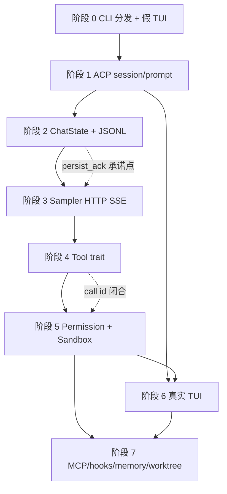
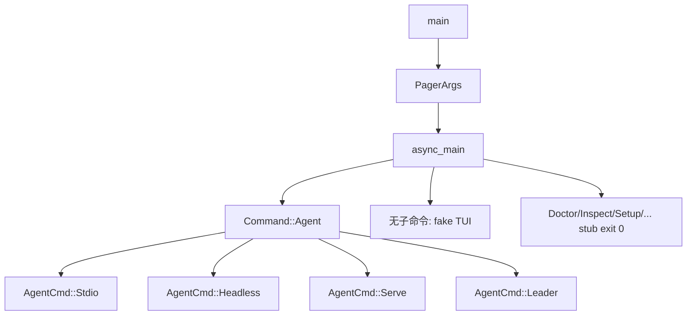
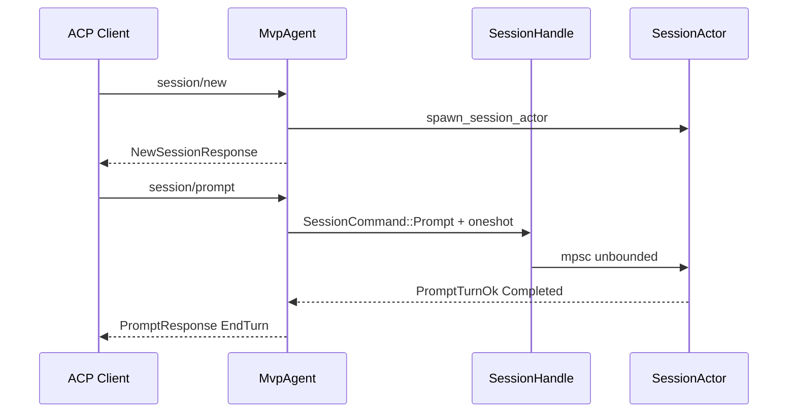
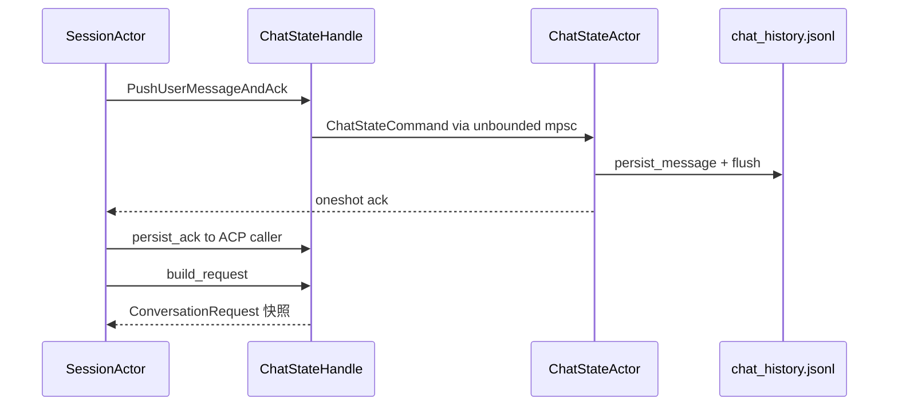
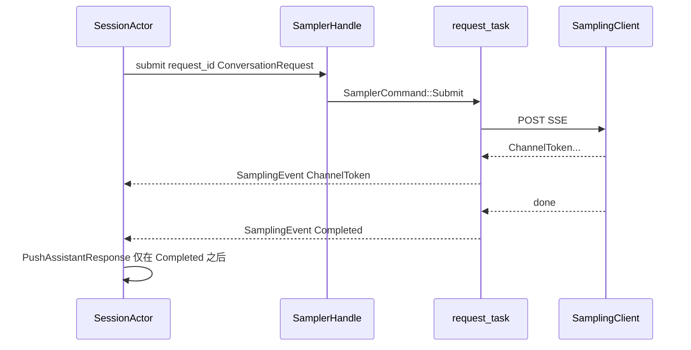
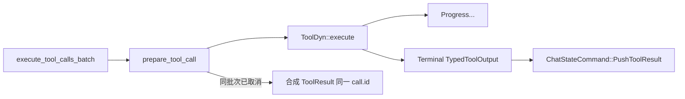
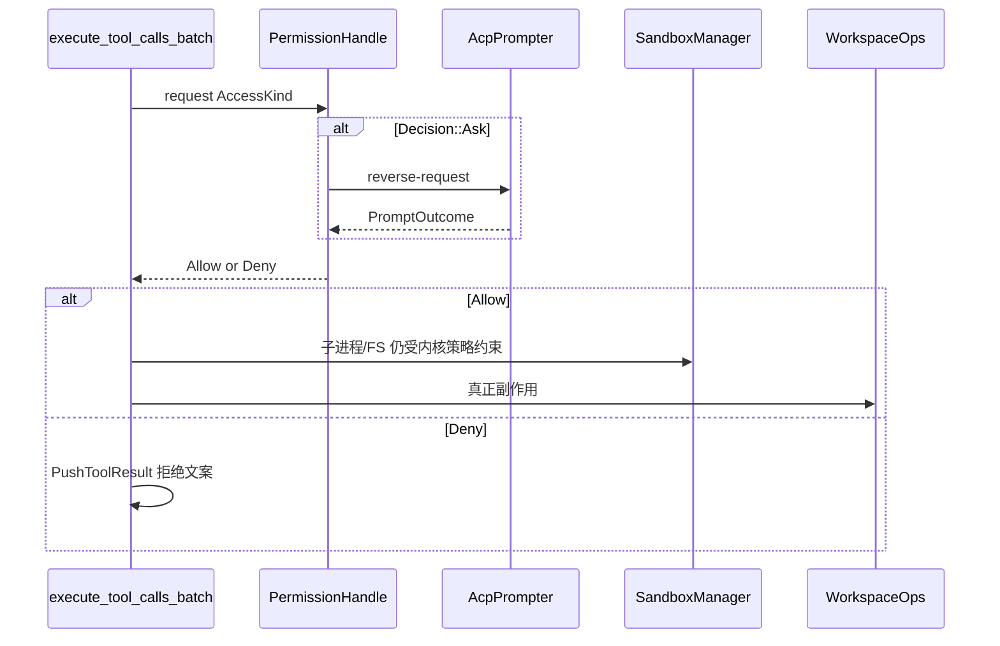
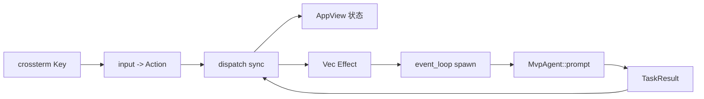
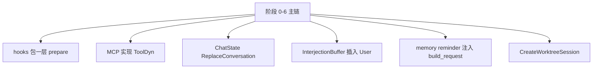

# 15 · 从零重实现路线图

> 读完本篇应能：按 8 个可交付阶段从空 workspace 做出功能等价系统，且第一天不复制 80 个 crate。上一篇：[14-关键调用链逐函数精读.md](14-关键调用链逐函数精读.md) · 可靠性语义见 [可靠性与通用技术实现说明书.md](可靠性与通用技术实现说明书.md)。

## 快速摘要

### 架构总览（模块与依赖）

原仓库 workspace 有 80 余个 crate，那是演进结果，不是第一天的施工图。重实现只需要先画出六条端口：CLI 分发、ACP 会话、ChatState 单写者、Sampler HTTP SSE、Tool 运行时、Workspace（权限 + 沙箱 + FS）。其余 MCP、hooks、memory、worktree 都挂在这些端口上，可以晚到阶段 7。

对照真实组合根：`crates/codegen/xai-grok-pager-bin/src/main.rs` 的 `async_main` 只做模式分发，领域逻辑在 `xai-grok-shell` 与 `xai-grok-pager`。

### 核心调用序列（逐步逻辑）

1. `PagerArgs` 解析 → `async_main` 按 `Command` / `AgentCmd` 分发。
2. TUI 路径：`Action` → `dispatch::dispatch` → `Effect::SendPrompt`。
3. ACP：`MvpAgent::prompt` → `SessionCommand::Prompt`（`oneshot` 回 `PromptTurnResult`）。
4. `SessionActor::handle_prompt` → `ChatStateHandle::build_request` → `run_turn_via_sampler`。
5. `SamplerHandle::submit` → `SamplingEvent`；`Completed` 才是提交屏障。
6. `execute_tool_calls_batch` → `ToolDyn::execute` → `WorkspaceOps` / `PermissionHandle::request` / OS sandbox。
7. 工具结果 `ConversationItem::ToolResult` 写回 ChatState，再采样，直到 `PromptCompletionKind`。

### 易错点与边界条件

- 第一天复制 crate 数量，会把生成的根 `Cargo.toml`、vendored 第三方和测试 harness 一起拖进来。
- 把 token 增量当完成消息：规范完成是 `SamplingEvent::Completed`，不是 `ChannelToken`。
- 取消当成回滚：已写文件、已跑 bash、已 append 的 JSONL 不会自动撤销。
- 权限弹窗和 OS 沙箱当成同一层：`PermissionHandle` 决定“允不允许做”，`SandboxManager` 决定“内核拦不拦”。
- 写操作失败后盲目重试：必须有对账键（见可靠性说明书）。

---

## 目录

1. [Why：为什么分 8 个阶段](#why为什么分-8-个阶段)
2. [阶段依赖图](#阶段依赖图)
3. [阶段 0：空 workspace + CLI 分发 + 假 TUI](#阶段-0空-workspace--cli-分发--假-tui)
4. [阶段 1：ACP 最小 session/prompt](#阶段-1acp-最小-sessionprompt)
5. [阶段 2：ChatState Actor + JSONL](#阶段-2chatstate-actor--jsonl)
6. [阶段 3：Sampler HTTP SSE](#阶段-3sampler-http-sse)
7. [阶段 4：Tool trait + read_file/bash](#阶段-4tool-trait--read_filebash)
8. [阶段 5：Permission + sandbox](#阶段-5permission--sandbox)
9. [阶段 6：真实 TUI Action/Effect](#阶段-6真实-tui-actioneffect)
10. [阶段 7：MCP / hooks / memory / worktree](#阶段-7mcp--hooks--memory--worktree)
11. [常见抄错点](#常见抄错点)
12. [文件表](#文件表)
13. [自检](#自检)

## Why：为什么分 8 个阶段

Grok Build 同时服务四种宿主：交互 TUI、CI headless（`PagerArgs.single` / `-p`）、编辑器 ACP stdio、后台 Leader。如果按 crate 目录从左到右抄，你会在还没有“一次 Prompt 能闭合”之前，就陷入 Ratatui、MCP OAuth、worktree pool 和遥测。

正确的可交付顺序是：**先有进程分发，再有协议闭环，再有状态所有权，再有模型 IO，再有副作用，再有双层安全，再把假 UI 换成真事件循环，最后才接扩展面。**

每个阶段结束时必须能跑一个演示，并且有失败测试。没有演示的阶段不算完成。

对照原仓库最小对象集（阶段 0–6 结束时应出现等价物）：

| 角色 | 原仓库类型 | crate |
|---|---|---|
| 组合根 | `PagerArgs` / `Command` / `AgentCmd` | `xai-grok-pager` + `xai-grok-pager-bin` |
| ACP 门面 | `MvpAgent` | `xai-grok-shell` |
| 会话单写者 | `SessionHandle` / `SessionActor` / `SessionCommand` | `xai-grok-shell` |
| 对话事实 | `ChatStateHandle` / `ChatStateCommand` / `ConversationItem` | `xai-chat-state` |
| 模型 IO | `SamplerHandle` / `SamplingClient` / `SamplingEvent` | `xai-grok-sampler` |
| 工具端口 | `Tool` / `ToolDyn` / `ToolDispatch` | `xai-tool-runtime` |
| 宿主副作用 | `WorkspaceOps` / `PermissionHandle` / `SandboxManager` | `xai-grok-workspace` / `xai-grok-sandbox` |
| UI 意图 | `Action` / `Effect` / `TaskResult` | `xai-grok-pager` |

## 阶段依赖图



硬依赖是实线：没有 ACP 就不能接 ChatState；没有 ChatState 就不能把 `Completed` 提交进历史；没有 Tool 就不能做权限。虚线是语义依赖：阶段 3 必须尊重阶段 2 的 `persist_ack`；阶段 5 必须用阶段 4 的同一个 `ToolCall.id` 闭合。

阶段 6 可以在阶段 1 之后就开始接线框，但 **SendPrompt 必须等到阶段 5 的权限路径存在**，否则 TUI 会把写文件做成“按回车即执行”。

---

## 阶段 0：空 workspace + CLI 分发 + 假 TUI

### 目标 Why

一个二进制要同时服务 TUI / headless / stdio ACP / leader。如果 `main` 里直接 `ratatui::run`，后面三种模式只能靠环境变量 hack。原仓库把分发收口在 `async_main`：先 `PagerArgs::apply_cwd`，再 `match command`。

### 要落地的接口（对照）

| 你的最小接口 | 原仓库对照 | 路径 |
|---|---|---|
| 顶层参数 | `PagerArgs` | `crates/codegen/xai-grok-pager/src/app/cli.rs` |
| 子命令 | `Command::{Agent, Doctor, Inspect, Leader, Login, Mcp, Plugin, Memory, Sessions, Setup, Update, Worktree, Workspace, Dashboard, ...}` | 同上 |
| Agent 子命令 | `AgentCmd::{Stdio, Headless, Serve, Leader}` | 同上 |
| 组合根 | `async_main(args: PagerArgs)` | `crates/codegen/xai-grok-pager-bin/src/main.rs` |
| stdio / headless / leader 入口 | `run_stdio_agent` / `run_headless` / `run_leader` | `crates/codegen/xai-grok-shell/src/agent/app.rs` |
| 假 UI | 打印 “fake tui: cwd=…” 后退出 0 | 你自己的 `run_fake_tui` |

`-p` / `--single` / `--print` 是 `PagerArgs.single`，不是 `Command::Agent`。headless 单轮问答走默认 TUI 缺省路径里的 headless 分支，测试见 `xai-grok-shell/tests/test_built_binary_e2e.rs` 的 `["-p", "say hello", "--yolo"]`。

### 最小实现

1. 新建 workspace，一个 `bin` crate + 一个 `cli` crate。钉死与 `rust-toolchain.toml` 相同的 `1.94.0`（或你声明的版本），不要默默用本机 nightly。
2. 用 clap 解析 `PagerArgs` 的子集：`cwd`、`--debug`、`-p`、`agent stdio|headless|serve|leader`、无子命令时进入假 TUI。
3. `async_main` 只做 match，不在 `main` 里写业务。
4. 假 TUI：进入 alternate screen 不是必须；打印工作目录和“waiting for prompt (stub)”即可。
5. `CancellationToken` 在进程级建一个，子任务以后都 clone 它。原仓库 `main.rs` 已 `use tokio_util::sync::CancellationToken`。



### 测试

- clap 解析：`grok agent stdio`、`grok -p hello`、`grok --cwd /tmp` 不冲突。
- 无 TTY 时假 TUI 仍退出 0（CI 友好）。
- `Command` 未实现的子命令打印 “not implemented” 且退出码稳定（建议 2，与 doctor/requirements 失败风格接近）。

对照测试：`crates/codegen/xai-grok-pager/src/app/cli.rs` 内 `PagerArgs::try_parse_from`；`crates/codegen/xai-grok-pager/tests/doctor_early_dispatch.rs`。

### 禁止事项

- 不要引入 `xai-grok-pager` 的 views / scrollback / mermaid worker。
- 不要在这一阶段连 HTTP、写 `~/.grok`、加载 `managed_config.toml`。
- 不要把根 `Cargo.toml` 的 80 个 member 抄过来。

### 完成定义 DoD

- 四种模式都能进到各自 stub 函数。
- `-p` 打印固定字符串 `"stub: {prompt}"` 后退出 0。
- `cargo test -p <your-cli>` 覆盖解析。

---

## 阶段 1：ACP 最小 session/prompt

### 目标 Why

TUI、headless、编辑器都是 ACP 客户端。会话生命周期如果焊在 UI 上，headless 和 stdio 必须各写一套。原仓库把 ACP 落在 `MvpAgent`：`new_session` / `load_session` / `prompt` / `close_session`。

### 要落地的接口（对照）

| 你的最小接口 | 原仓库对照 |
|---|---|
| ACP Agent | `MvpAgent`（`crates/codegen/xai-grok-shell/src/agent/mvp_agent/mod.rs`） |
| `session/new` | `MvpAgent::new_session` → `new_session_inner` |
| `session/prompt` | `MvpAgent::prompt`（span 名 `agent.prompt`） |
| `session/cancel` | `SessionCommand::Cancel(CancelOptions)` |
| 会话句柄 | `SessionHandle { cmd_tx: UnboundedSender<SessionCommand>, ... }` |
| 回合结果 | `PromptTurnResult` = `Result<PromptTurnOk, acp::Error>` |
| 完成种类 | `PromptCompletionKind::{Completed, Cancelled, MaxTurnsReached, Rewound, RemovedFromQueue, StationarityEnded}` |

`SessionCommand::Prompt` 关键字段（不要一次全实现，但名字要对上，避免以后改协议）：

- `prompt_id: String`
- `prompt_blocks: Vec<acp::ContentBlock>`
- `respond_to: oneshot::Sender<PromptTurnResult>`
- `persist_ack: Option<oneshot::Sender<()>>`（阶段 2 才真正 flush）
- `send_now: bool`、`verbatim: bool`

stdio 入口对照 `run_stdio_agent`：stdin/stdout 被 ACP 占用，日志必须去 stderr。原仓库 `init_tracing_simple` 对 headless 默认 filter 为 `"off"`。

### 最小实现

1. 内存 `HashMap<SessionId, SessionHandle>`。
2. 每个 session 一个 tokio task，循环 `cmd_rx.recv()`。
3. `Prompt` 立即 `respond_to.send(ok_end_turn(0, None))`，回复固定文本 “hello from stub”，通过 ACP session notification 发出去。
4. `Cancel` 只设置 `CancellationToken::cancel()`，已发出的固定回复不撤回。
5. 未知 `session_id` 返回 `acp::Error::invalid_params().data("unknown session id")`（`MvpAgent::prompt` 同款）。



### 测试

- `session/new` 返回 `sessionId`。
- 连续两次 `prompt` 都得到固定回复；第二次开始前第一次的 `oneshot` 必须已经完成（单写者）。
- 取消正在“睡眠 200ms 的假 turn”：`PromptCompletionKind::Cancelled`，且 `CancelTrigger::from_client("esc")` 映射到 `Esc`。
- 对照：`crates/codegen/xai-grok-shell/tests/test_built_binary_e2e.rs` 对字面量 `"session/new"` / `"session/prompt"` 的 JSON-RPC。

### 禁止事项

- 不要在 Actor 里直接 `reqwest`。
- 不要把会话状态放进 `Mutex<Conversation>` 给 UI 和 prompt 同时写。
- 不要实现 `session/load`、fork、rewind。

### 完成定义 DoD

- `grok agent stdio` 能与一个最小 JSON-RPC 客户端完成 new + prompt。
- 进程崩溃后内存会话丢失是可接受的（阶段 2 才持久化）。

---

## 阶段 2：ChatState Actor + JSONL

### 目标 Why

会话是磁盘上的可恢复日志，不是进程内 `Vec<Message>`。UI、压缩、工具结果、恢复都必须经过同一个单写者，否则会出现“屏幕上有回复、jsonl 没有”或“jsonl 有半截 tool call”。

原仓库：`ChatStateHandle` 持有 `mpsc::UnboundedSender<ChatStateCommand>`；Actor 独占 `Box<dyn ChatPersistence>`。

### 要落地的接口（对照）

| 你的最小接口 | 原仓库对照 |
|---|---|
| 句柄 | `ChatStateHandle` |
| 命令 | `ChatStateCommand::{PushUserMessage, PushUserMessageAndAck, PushAssistantResponse, PushToolResult, IncrementPromptIndex, ReplaceConversation, RepairHistory, ...}` |
| 观察 | `ChatStateEvent::{PromptIndexChanged, TokensUpdated, ConversationReset, ImageBudget}` |
| 事实类型 | `ConversationItem::{System, User, Assistant, ToolResult, BackendToolCall, Reasoning}` |
| 持久化端口 | `ChatPersistence::{persist_message, replace_history, flush, persist_working_directory_switch_and_ack}` |
| 构建请求 | `ChatStateHandle::build_request(...) -> ConversationRequest` |
| 严格 append | `StrictAppendAck::{Appended, AlreadyPresent}` / `StrictAppendError::{NotCommitted, Committed, Indeterminate}` |

`persist_ack` 的语义（`SessionCommand::Prompt` 注释）：用户消息已 append **并且** persistence flush barrier 完成之后、LLM 推理开始之前，才 fire oneshot。这是阶段 2 的承诺点。

### 最小实现

1. `ChatStateActor` 循环处理命令；构建 `ConversationRequest` 时 **复制** 历史，不在 `build_request` 里 mutate（对照 `build_request_does_not_mutate_actor_state`）。
2. JSONL：每条 `ConversationItem` 一行，文件名 `chat_history.jsonl`，放在 session 目录。
3. `PushUserMessageAndAck` 必须在 `persist_message` + `flush` 后才回 oneshot。
4. `build_request` 若发现未闭合的 tool call，调用 `repair_dangling_tool_calls`（`xai-grok-sampling-types`）。`RepairHistory` 在 `turn_active` 时返回 `RepairHistoryBlocked`（错误字符串：`cannot repair history while a turn is in flight; stop the turn first`）。
5. `IncrementPromptIndex` 发出 `ChatStateEvent::PromptIndexChanged`。



### 测试

对照 `crates/codegen/xai-chat-state/src/actor/tests.rs`：

- `build_request_includes_all_messages`
- `build_request_repairs_dangling_tool_calls`
- `build_request_does_not_mutate_actor_state`
- `build_request_with_tool_definitions`

自己至少再写：崩溃恢复时最后一行半截 JSON 被跳过；`AlreadyPresent` 对同一 `cwd_generation` 幂等。

### 禁止事项

- 不要让 SessionActor 直接 `OpenOptions::append` 写 jsonl。
- 不要用 `Mutex<Vec<ConversationItem>>` 替代 Actor。
- 不要在 `build_request` 成功后才 persist 用户消息（顺序反了，崩溃会丢 Prompt）。

### 完成定义 DoD

- kill -9 后 `session/load`（可仍是 stub 读 jsonl）能重建相同 `ConversationItem` 序列。
- dangling tool call 在下一次 `build_request` 被合成 `ToolResult`。

---

## 阶段 3：Sampler HTTP SSE

### 目标 Why

模型 IO 必须与会话状态解耦：重试、熔断分类、SSE 解析都不应持有 jsonl 锁。原仓库 `SamplerHandle` 同样是 unbounded mpsc；结果走共享 `SamplingEvent` 通道。

### 要落地的接口（对照）

| 你的最小接口 | 原仓库对照 |
|---|---|
| 句柄 | `SamplerHandle::{submit, cancel, update_config}` |
| HTTP | `SamplingClient`（`crates/codegen/xai-grok-sampler/src/client.rs`） |
| 事件 | `SamplingEvent::{StreamStarted, FirstToken, ChannelToken, ToolCallDelta, Completed, Retrying, Failed, ...}` |
| 重试分类 | `classify_error` → `RetryDecision`（`retry.rs`） |
| 常量 | `DEFAULT_MAX_RETRIES = 15`、`RATE_LIMIT_RETRY_THRESHOLD = 2`、`MAX_RETRY_BACKOFF = 30s` |
| 401 上交 | `RetryDecision::EmitToSession`；会话侧 `AuthRetrySchedule` |

`ChannelToken` 的 `SamplingChannel::{Text, Reasoning}` 只用于 UI 流式渲染。`ToolCallDelta.arguments_delta` **不必是合法 JSON**。规范完成是 `Completed { response: Box<ConversationResponse>, ... }`。

### 最小实现

1. `SamplerActor` 收到 `SamplerCommand::Submit` 后 spawn 一个 request task。
2. HTTP：一个 `POST` + `text/event-stream`。先支持一种 API（Chat Completions 即可）。
3. 将 SSE 翻译成 `SamplingEvent`。中途失败走 `classify_error(err, retry_count, max_retries, RATE_LIMIT_RETRY_THRESHOLD)`。
4. 401 / Auth：不要在 sampler 里刷新 token，发 `EmitToSession`。会话侧对照 `turn.rs` 的 `AuthRetryDecision::{UnchargedResubmit, Backoff, Exhausted, RunawayGuard}`。
5. `IdleTimeout` 必须 `Fatal`（`retry.rs` 注释与测试 `expected Fatal(IdleTimeout)`）。
6. 取消：`SamplerHandle::cancel(request_id)` 取消 in-flight；已收到的 token 不从 ChatState 删除。



### 测试

对照 `crates/codegen/xai-grok-sampler/src/retry.rs` 的大量 `classify_error` 单测，以及 `tests/test_actor.rs`。

自己必须覆盖：

- 429 超过 `RATE_LIMIT_RETRY_THRESHOLD` → Fatal。
- `x-should-retry: false` → Fatal（`is_retry_vetoed`）。
- 第一次可重试传输错误 → `RetryWithClientRebuild`。
- 401 → `EmitToSession`，sampler 不自己 sleep 重试。

### 禁止事项

- 不要在收到第一个 token 时就 `PushAssistantResponse`。
- 不要把 bearer 全文写入日志；只用 `bearer_suffix`（`BEARER_SUFFIX_LEN = 12`）。
- 不要实现三种 API 变换（Chat / Responses / Messages）——先一种。

### 完成定义 DoD

- 对 mock SSE 服务器跑通无工具问答，jsonl 中有完整 Assistant item。
- `classify_error` 的 Fatal / Retry / EmitToSession 有表驱动测试。

---

## 阶段 4：Tool trait + read_file/bash

### 目标 Why

内置工具、MCP、Hub 远程工具必须走同一端口，否则 SessionActor 会分叉三套执行器。原仓库 `Tool` 不是 object-safe（关联类型 `Args`/`Output`），运行时调用的是 `ToolDyn::execute`。

### 要落地的接口（对照）

| 你的最小接口 | 原仓库对照 |
|---|---|
| 类型化工具 | `trait Tool { type Args; type Output; fn id; fn description; fn execute; fn run; }` |
| 类型擦除 | `trait ToolDyn { async fn execute(&self, ctx, args: Value) -> ToolStream<TypedToolOutput> }` |
| 分发 | `trait ToolDispatch { async fn call; async fn call_terminal }` |
| 流不变量 | `[Progress*] + 恰好一个 Terminal` |
| 上下文 | `ToolCallContext` |
| 调用 id | `ToolCall { id, name, arguments }` 与 `xai-grok-workspace-types::ToolCallId` |
| 批次 | `SessionActor::execute_tool_calls_batch` |
| 读文件 | `xai-grok-tools/.../read_file/mod.rs`（`MAX_LINES_READ = 1000`，`is_read_only: true`） |
| bash | `.../bash/mod.rs`（`is_read_only: false`，`ToolScope::Write`） |
| 截断 | `DEFAULT_TOOL_OUTPUT_BYTES = 40_000`，bash 另有 `DEFAULT_TOOL_OUTPUT_CHARS = 20_000` |

`Tool::execute` 默认把 `run` 包成 `terminal_only`。两个都不 override 会在运行期得到 `ToolError::not_implemented`。

### 最小实现

1. 实现 `read_file`（只读，可走 `std::fs`，但必须经 `WorkspaceOps::Local` 的函数指针，便于阶段 5 换沙箱）。
2. 实现 `bash`（前台、超时、截断）。输出超过 cap 时截断并在结果里标明 truncated。
3. `execute_tool_calls_batch`：对每个 `ToolCallResponse`，`prepare` → `execute` → `push_tool_result(ConversationItem::tool_result(id, ...))`。若批次中途 `Cancelled` / `PermissionReject`，后续 call 仍必须写入合成结果，文案对照现实现：`Tool execution cancelled due to earlier user cancellation for tool \`{name}\``。
4. 流：bash 可以发 `ToolProgress::Text`，但最后必须 `Terminal`。`call_terminal` 丢弃 Progress，遇不到 Terminal 则 `ToolError` code `stream_no_terminal`。



### 测试

- 只读 `read_file` 不创建文件。
- bash `echo hi` 的 Terminal 含 `hi`。
- 超大 stdout 被截到 cap。
- 缺 Terminal 的假工具 → `stream_no_terminal`。
- 两个并行 tool call 使用不同 `id`，结果不会串。

对照：`xai-grok-tools` 内 read_file / bash / grep 的单元测试；`task_output/tool.rs` 对截断的 `snapshot_to_result(..., DEFAULT_TOOL_OUTPUT_BYTES)`。

### 禁止事项

- 不要让模型循环直接 `std::process::Command`。
- 不要在 SessionActor 里写 `if name == "bash"` 的巨型 match 作为长期方案（最小实现可以有两个 arm，但要立刻藏进 `ToolDispatch`）。
- 不要实现 grep/search_replace/task/web_search。

### 完成定义 DoD

- 模型返回一个 `read_file` call 时，下一轮 `ConversationRequest` 含对应 `ToolResult`。
- 取消批次时每个未执行 call 都有同 id 的结果行。

---

## 阶段 5：Permission + sandbox

### 目标 Why

权限是产品决策（问不问用户、记不记 always-allow）；沙箱是内核强制（Landlock/Seatbelt/bwrap）。互相替代会导致：用户点了 Allow，OS 仍 SIGKILL；或用户点了 Deny，进程却已经写出文件。

### 要落地的接口（对照）

| 你的最小接口 | 原仓库对照 |
|---|---|
| 权限句柄 | `PermissionHandle::{Actor, AllowAll}` |
| 请求 | `PermissionHandle::request(...) -> Decision` |
| 决策 | `Decision::{Allow, Ask, FollowupMessage, Reject, PolicyDeny, Cancelled}` |
| 弹窗 | `AcpPrompter` / `PromptOutcome` |
| 工作区 | `WorkspaceOps::{Local { handle }, Proxy { client }}` |
| 沙箱 | `SandboxManager` + `ProfileName::{Workspace, Devbox, ReadOnly, Strict, Off, Custom}` |
| CLI | `--always-approve` / `--yolo`；`--sandbox` / `GROK_SANDBOX` |

`PermissionHandle::AllowAll` 对应 yolo。`Actor` 变体还带 `yolo_state`、`auto_state`（LLM classifier，与 yolo 互斥）、`yolo_pin`（managed policy 钉死）。阶段 5 不必实现 auto classifier。

沙箱：`xai-grok-sandbox` 在进程启动 `apply` + `install`。网络在进程级保持开放（要访问 LLM），子进程可用 seccomp 断网。`ProfileName::Off` 跳过 hook write-deny。

### 最小实现

1. `read_file`：默认 Allow（仍走 `request`，便于审计）。
2. `bash`：默认 Ask；yolo 时 `AllowAll`。
3. Deny / PolicyDeny：向模型写回拒绝原因，**不**把 turn 标成用户 Cancelled。
4. `Decision::Cancelled`：映射 `PromptCompletionKind::Cancelled`。
5. 沙箱至少实现 `Off` 与 `Workspace`（Workspace = 只能写工作区目录）。无内核支持时，用路径前缀检查作为用户态兜底，并在日志标明 “userspace-only”。



### 测试

- yolo 下 bash 不弹窗。
- Deny 后文件不存在。
- Allow 但路径在沙箱外 → 失败（权限 Allow ≠ 沙箱放行）。
- 对照：`crates/codegen/xai-grok-shell/tests/sandbox_requirements_pin.rs`（`requirements.toml` 可钉 sandbox profile）。

### 禁止事项

- 不要用 `--yolo` 关闭沙箱。
- 不要把 `GROK_SANDBOX=off` 当成“跳过权限”。
- 不要在用户点 Allow 之前 spawn bash。

### 完成定义 DoD

- 双层矩阵测过：Allow×Inside、Allow×Outside、Deny×Inside。
- 审计日志能看到 decision，且不含完整 bearer。

---

## 阶段 6：真实 TUI Action/Effect

### 目标 Why

同步 `dispatch` + 异步 `Effect` 才能单测 UI：输入变成 `Action`，状态变迁可断言，网络在测试里用假 Effect。原仓库明确三元组：`Action`（同步意图）、`Effect`（异步副作用）、`TaskResult`（完成回灌，变成 `Action::TaskComplete`）。

### 要落地的接口（对照）

| 你的最小接口 | 原仓库对照 |
|---|---|
| 意图 | `Action::{Quit, SendPrompt, ...}`（`app/actions.rs`） |
| 分发 | `dispatch::dispatch(action, &mut AppView) -> Vec<Effect>`（`dispatch/router.rs`） |
| 副作用 | `Effect::{CreateSession, SendPrompt { prompt_id, text, ... }, CancelTurn, ...}` |
| 完成 | `TaskResult` → 再 `dispatch` |
| 事件循环 | `app/event_loop.rs` |
| 输入 | composer Enter → `Action::SendPrompt`（`agent_view` `PromptInputMode::Normal`） |

最小 `Effect::SendPrompt` 字段：`agent_id`、`session_id`、`text`、`prompt_id`。`prompt_id` 是客户端 UUID，通知和 `PromptResponse` 都要带回。

### 最小实现

1. 不用完整 Ratatui 布局：一块输入、一块 scrollback 文本即可。
2. Enter → `dispatch(SendPrompt)` → `Effect::SendPrompt` → spawn → ACP `prompt`。
3. 流式 `ChannelToken` 只更新 UI buffer；`Completed` 才冻结该条 assistant 气泡。
4. Esc → `Effect::CancelTurn` → `session/cancel`，`CancelOptions.trigger = Some(CancelTrigger::Esc)`。
5. 受限 slash（如计费相关）对照 `dispatch/tests/billing.rs`：不得产生 `Effect::SendPrompt`。



### 测试

对照 `dispatch/tests/billing.rs`、`dispatch/interject.rs`、`agent_view/queue.rs` 的 `interject_key_when_idle_is_noop`。

自己写：

- `dispatch(Action::SendPrompt("hi"))` 在已绑定 session 时恰好一个 `Effect::SendPrompt`。
- 无 session 时不 panic，而是 `CreateSession` 或排队。
- Esc 在 idle 为 noop。

### 禁止事项

- 不要在 `dispatch` 里 `.await`。
- 不要在按键处理函数里直接调 `SessionHandle`。
- 不要一上来做 Kitty keyboard / PTY / Mermaid worker。

### 完成定义 DoD

- 手工：启动 TUI → 输入 → 看到流式 token → 结束。
- `dispatch` 单测不启 tokio runtime 也能跑（纯同步）。

---

## 阶段 7：MCP / hooks / memory / worktree

### 目标 Why

这些是扩展面，不是主链。没有它们，阶段 0–6 已经是一个能读文件、跑命令、可恢复会话的 coding agent。原仓库把它们做成可插拔，正是为了避免主链膨胀。

### 要落地的接口（对照）

| 子系统 | 原仓库对照 | 阶段 7 最小范围 |
|---|---|---|
| MCP | `xai-grok-mcp`；工具名经 `parse_mcp_tool_name`；结果仍走 `ToolDyn` | stdio 一个 MCP server，列出并调用 1 个工具 |
| Hub | `xai-tool-protocol::PROTOCOL_VERSION = "1.0.0"`，`HelloMsg` / `HelloAckMsg` | 可推迟；不要和 MCP 搞混 |
| Hooks | `xai-grok-hooks`；权限路径有 `ToolLoop::HookDenied` | pre-tool hook 能 Deny |
| Memory | `xai-grok-memory`；`build_request_injects_memory_reminder` | SQLite 可空实现，只注入一条 reminder |
| Worktree | `Command::Worktree`；`Effect::CreateWorktreeSession`；`xai-fast-worktree` | `grok worktree` stub + 可选 `git worktree add` |
| 插话 | `xai-interjection-core::{InterjectionBuffer, format_interjection}`；`SyntheticReason::Interjection` | Ctrl+Enter 不取消 turn，插入 User item |
| 压缩 | `CompactionMode::{Summary, Transcript, Segments}`；`GROK_COMPACTION_MODE` | token 超阈时 `ReplaceConversation` |
| Subagent | `xai-grok-subagent-resolution`；`PromptOrigin::SubagentCompleted` | 可只做文档契约，不实现调度器 |
| Leader | `LEADER_PROTOCOL_VERSION: u32 = 1` | 不要和 ACP 版本、Hub `1.0.0` 混用 |

### 最小实现

按下面顺序，每完成一项就能停：

1. Hooks：在 `prepare_tool_call` 前调 hook；Deny 则 `PushToolResult` 且不执行。
2. MCP：把 MCP 工具注册进同一个 `ToolDispatch`，名字保持 `server__tool` 这种可 parse 形式。
3. Compaction：只实现 `CompactionMode::Summary`。
4. Interjection：`SyntheticReason::Interjection`，不走 `session/cancel`。
5. Memory / worktree / leader：有 CLI 入口即可，内部可 stub。



### 测试

- hook Deny 时 bash 不执行。
- MCP 工具失败时仍用同一 call id 闭合。
- 压缩后 `ChatStateEvent::ConversationReset` 发出，jsonl 被 `replace_history` 重写而非只 append。
- 插话：idle 时 interject 为 noop（对照 `interject_key_when_idle_is_noop`）。

### 禁止事项

- 不要为 MCP 另写一套 `execute_mcp_batch`。
- 不要把 Leader 协议版本写成 `"1.0.0"`（那是 Hub）。
- 不要在阶段 7 之前“顺便”做 plugin marketplace。

### 完成定义 DoD

- 主链回归（阶段 1–6 测试）全绿。
- 至少一项扩展（hooks 或 MCP）有失败测试。
- 未做的扩展在 README 里标明 stub。

---

## 常见抄错点

| 抄错 | 后果 | 正确做法 |
|---|---|---|
| 第一天 80 个 crate | 编译地狱、根 `Cargo.toml` 是生成物 | 6–8 个自己的 crate，端口名字对齐即可 |
| UI 直接写 jsonl | 恢复与 UI 不一致 | 只有 `ChatPersistence` 写 |
| token 当完成 | 取消/重试后历史损坏 | 只在 `Completed` 提交 Assistant |
| 401 在 sampler 重试 | 用过期 token 打满预算 | `EmitToSession` + `AuthRetrySchedule` |
| yolo 关沙箱 | 内核约束被旁路 | 两层独立 |
| unbounded mpsc 当无限缓冲 | 内存胀死 | 见可靠性说明书：单写者 + 事件抽样 |
| `oneshot` 当广播 | 第二个订阅者收不到 | 完成通知用 ACP notification / broadcast |
| Prompt / Turn / Attempt 混用 | 取消杀错对象 | 见 `16-术语表` |

## 推荐验证命令（重实现侧）

原仓库对应包（用于对照行为，不是让你第一天就编过它们）：

```bash
cargo test -p xai-chat-state --lib
cargo test -p xai-grok-sampler --lib
cargo test -p xai-tool-runtime --lib
cargo test -p xai-circuit-breaker --lib
cargo test -p xai-grok-pager --lib dispatch
```

你的新工程每阶段至少：

```bash
cargo test -p grok-cli
cargo test -p grok-session
cargo test -p grok-chat-state
cargo test -p grok-sampler
```

---

## 文件表

| 路径 | 本文用到的符号 |
|---|---|
| `crates/codegen/xai-grok-pager-bin/src/main.rs` | `async_main`、`Command` match |
| `crates/codegen/xai-grok-pager/src/app/cli.rs` | `PagerArgs`、`Command`、`AgentCmd`、`-p` |
| `crates/codegen/xai-grok-pager/src/app/actions.rs` | `Action`、`Effect`、`TaskResult` |
| `crates/codegen/xai-grok-pager/src/app/dispatch/router.rs` | `dispatch` |
| `crates/codegen/xai-grok-shell/src/agent/mvp_agent/acp_agent.rs` | `new_session`、`prompt` |
| `crates/codegen/xai-grok-shell/src/agent/app.rs` | `run_stdio_agent`、`run_headless`、`run_leader` |
| `crates/codegen/xai-grok-shell/src/session/handle.rs` | `SessionHandle`、`SessionLiveState` |
| `crates/codegen/xai-grok-shell/src/session/commands.rs` | `SessionCommand`、`PromptCompletionKind`、`CancelTrigger` |
| `crates/codegen/xai-grok-shell/src/session/acp_session_impl/spawn.rs` | `spawn_session_actor` |
| `crates/codegen/xai-grok-shell/src/session/acp_session_impl/turn.rs` | `handle_prompt`、401 retry |
| `crates/codegen/xai-grok-shell/src/session/acp_session_impl/tool_calls.rs` | `execute_tool_calls_batch` |
| `crates/codegen/xai-chat-state/src/{handle,commands,persistence,events}.rs` | ChatState 全套 |
| `crates/codegen/xai-grok-sampler/src/{handle,events,retry,client}.rs` | Sampler 全套 |
| `crates/common/xai-tool-runtime/src/{tool,dispatch}.rs` | `Tool` / `ToolDyn` / `ToolDispatch` |
| `crates/codegen/xai-grok-workspace/src/workspace_ops.rs` | `WorkspaceOps` |
| `crates/codegen/xai-grok-workspace/src/permission/manager/mod.rs` | `PermissionHandle` |
| `crates/codegen/xai-grok-sandbox/src/{lib,profiles}.rs` | `SandboxManager`、`ProfileName` |

## 自检

- [x] 8 个阶段均含 Why、接口对照、最小实现、测试、禁止、DoD
- [x] 阶段依赖用 mermaid，节点为阶段名而非空泛“模块”
- [x] 强调不要第一天复制 80 个 crate
- [x] 符号与源码交叉核对：`PagerArgs.single`、`MvpAgent::prompt`、`ChatPersistence`、`classify_error`、`ToolDyn`、`PermissionHandle`、`dispatch`
- [x] 未把生成日期写成永久事实；基准提交已记录
- [x] 未写入本机绝对路径
- [x] 失败路径（取消、Deny、dangling、401）与成功路径同等出现

下一步：用 [16-术语表与源码查找手册](16-术语表与源码查找手册.md) 消歧 Prompt/Turn/Attempt，用 [可靠性与通用技术实现说明书](可靠性与通用技术实现说明书.md) 补失败语义后再开始阶段 0。
