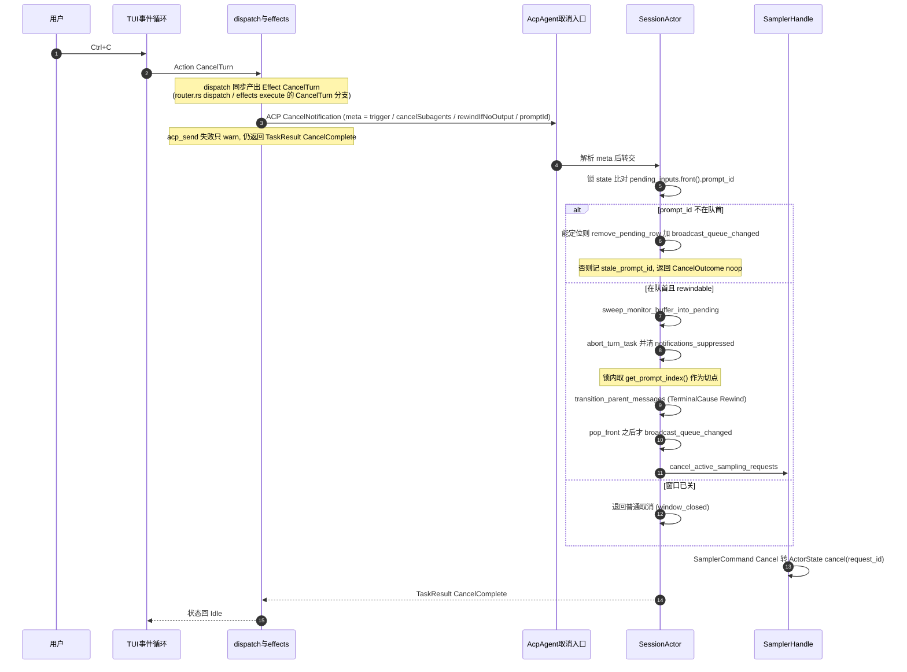

[上一篇：构建测试第三方与许可证](14-构建测试第三方与许可证.md) · [总目录](README.md) · [下一篇：术语表与源码查找手册](16-术语表与源码查找手册.md)

# 15 · 跨模块完整运行链与场景

> **场景**：前面 07–14 章把系统拆成入口、TUI、Agent、工具、Workspace、认证、持久化、构建八个切面。本章把它们**重新缝回一条主线**——给你 **8 个端到端场景**，每一跳都标出它落在哪个 crate、哪个符号、函数内偏移多少。读完后，你应当能在脑中把任意一次用户操作映射到具体代码。
>
> **阅读说明**：源码基准 `SOURCE_REV = 9bb727ccdff0a793ee73bcde4e2e09cbef6b5387`（仓库根 `SOURCE_REV`，与 git HEAD `6c01b90c` 不同——它记录上游 monorepo commit）。**工具版本**：Rust `1.94.0`（`rust-toolchain.toml:11`）、`ratatui 0.29`、`tokio` 特性 `full`、`agent-client-protocol 0.10.4`。本章是综合章：所有锚点均来自当前源码逐条核对；命名一律「文件 + 符号 + 偏移」，行号随版本变化，以当前源码为准。

---

## 第一层 · 简单框架（系统骨架）

把八章的主角排成一条「请求→响应」流水线。**注意 09 章之后的一次重大重构**：会话实现已从单个 `acp_session.rs` 拆成 `crates/codegen/xai-grok-shell/src/session/acp_session_impl/` 目录；沙箱也从 `xai-grok-workspace` 独立成 `xai-grok-sandbox` crate。

```
用户键盘
   │  (KeyEvent)
   ▼
TUI 事件循环  ──[08]──  event_loop::run (event_loop.rs +0) / tokio::select! (+1079)
   │
   ▼
同步决策      ──[08]──  dispatch::dispatch (dispatch/router.rs +0) -> Vec<Effect>
   │                     dispatch_inner (+9)
   ▼
异步执行      ──[08]──  effects::execute (effects/mod.rs +0) → JoinSet → ACP 客户端
   │                     acp_send_bounded (effects/helpers.rs +0)
   │  ── ACP JSON-RPC (agent-client-protocol 0.10.4) ──
   ▼
会话 Actor    ──[09]──  spawn_session_actor (acp_session_impl/spawn.rs +0)
   │                     SessionHandle (session/handle.rs +0) / SessionCommand (session/commands.rs +0)
   │                     handle_prompt (acp_session_impl/turn.rs +0) → handle_turn_input (+35)
   ▼
采样循环      ──[09]──  run_turn_via_sampler (acp_session_impl/sampler_turn.rs +0)
   │                     提交屏障 = SamplingEvent::Completed (xai-grok-sampler/src/events.rs +50)
   │                     产出 tool_use
   ▼
工具派发      ──[10]──  execute_tool_calls_batch (acp_session_impl/tool_calls.rs +0)
   │                     prepare_tool_call (+893) → dispatch_tool (tool_dispatch.rs +0)
   │                     → WorkspaceOps::call_tool (xai-grok-workspace/src/workspace_ops.rs +0)
   │  调用具体工具前先过两关：
   ├─ 权限    ──[11]──  PermissionHandle::request (permission/manager/mod.rs +0)
   │                     + GatePreflight (permission/gate_preflight.rs +0)
   │                     + Decision (permission/types.rs, Enum：Decision)
   └─ 沙箱    ──[11]──  SandboxManager::apply / install (xai-grok-sandbox/src/lib.rs +20 / +90)
                         child_net::restrict_child_network (child_net.rs +0)
   ▼
结果回流 → 模型下一轮 → 最终答案渲染回 TUI
```

> 这条主线同时被 **[14] 构建系统**支撑（proto 单源生成让 ACP 线格式一致、`build.rs` 把 rg/fd/bfs/ugrep 与版本嵌进二进制），并在**后台**由 **[12] 自更新**保持二进制新鲜、由 **[13] 持久化**保证崩溃可恢复。

---

## 第二层 · 一个完整例子（全路径走读）

### 场景 A：用户发一条消息，grok 直接回答（无工具）

```
① 键盘事件 → event_loop::run 的 tokio::select! (event_loop.rs +1079) 收集
        │ 转成 Action
② dispatch::dispatch(Action, &mut AppView) -> Vec<Effect>  (dispatch/router.rs +0)
        │ 纯同步、可单测；实现体在 dispatch_inner (+9)
        ▼
③ effects::execute(Effect, ...)  (effects/mod.rs +0)
        │ 把 Effect spawn 进 JoinSet；出网经 acp_send_bounded (effects/helpers.rs +0)
        │ 触发 SendPrompt → SessionCommand::Prompt (session/commands.rs +0)
        ▼
④ SessionHandle (session/handle.rs +0) 把命令送进 Actor 通道
   spawn_session_actor (acp_session_impl/spawn.rs +0) 已建好单写者 Actor
        │
        ▼
⑤ handle_prompt (turn.rs +0) → handle_turn_input (+35) → handle_turn_input_inner (+52)
        │   - signals_handle().increment_turn()
        │   - ensure_session_disk_writable().await?
        │   - 组装 TurnInputRequest（prompt_id / prompt_blocks / prompt_mode / verbatim ...）
        ▼
⑥ run_turn_via_sampler (sampler_turn.rs +0)
        │  ChatStateHandle::build_request (xai-chat-state/src/handle.rs +0 相对 Struct)
        │  组装 ConversationRequest（含 system head、历史、工具表）
        │  出网经 shared_client (xai-grok-http/src/lib.rs +0 相对函数) + with_auth_retry (+20)
        ▼
⑦ 模型返回 SamplingEvent::Completed (xai-grok-sampler/src/events.rs +50)
        │  —— 无 tool_use，这就是「提交屏障」
        │  TelemetryClient 记一次对话事件
        ▼
⑧ 答案渲染回 AppView → TUI 画出
        │  会话 Summary 落盘（含 git head，见 13 章）
```

### 场景 B：模型调用 `read_file` 读一个文件（权限 Read）

```
① SamplingEvent::Completed 含 tool_use: read_file {"target_file": "src/lib.rs"}
② execute_tool_calls_batch (tool_calls.rs +0)
        │   - 先 refresh_classifier_transcript（若在 auto 模式）
        │   - mcp_surface_requested 判定：名字含 MCP 分隔符 或 是 search_tool/use_tool
        │   - emit Event::ToolStarted / SessionEvent::ToolCallStarted
        ▼
③ prepare_tool_call (tool_calls.rs +893)
        │   解析参数、决定本次调用的 AccessKind
        ▼
④ 权限：PermissionHandle::request (permission/manager/mod.rs +0)
        │   - AllowAll 句柄 → 直接 Decision::Allow（且丢弃 hook_ask，记 debug 日志）
        │   - Actor 句柄 → InFlightGuard + oneshot，走 PermissionCommand::Request
        │     命令通道发送失败 → Decision::Reject("permission manager unavailable")
        │     oneshot 接收失败 → Decision::Reject("failed to receive permission decision")
        │   规则未命中 = Ask（fail-closed，见 11 章）
        ▼
⑤ dispatch_tool (tool_dispatch.rs +0)
        │   注释明确：agent session 一律用本地 workspace ops（in-process toolset）
        │   → workspace_ops.call_tool(tool_name, execution_arguments, tool_call_id, Some(session_id))
        ▼
⑥ WorkspaceOps::call_tool (xai-grok-workspace/src/workspace_ops.rs +0)
        │   真正落到 ReadFileTool (implementations/grok_build/read_file/mod.rs +0，
        │   ToolId::new("read_file"))
        ▼
⑦ 结果经 ToolStream<TypedToolOutput> 回传（形状 [Progress*, Terminal]，见 10 章）
   TypedToolOutput 作为 tool_result 回模型 (ChatStateHandle::push_tool_result)
        ▼
⑧ 模型下一轮基于文件内容继续
```

### 场景 C：模型编辑文件（权限 Edit + 同文件串行 + 快照）

```
① tool_use: search_replace / opencode EditTool / codex apply_patch
② prepare_tool_call (tool_calls.rs +893)
        │
        ▼
③ 权限：AccessKind::Edit(String)  (permission/types.rs, Enum：AccessKind)
        │   EditPolicy (permission/types.rs, Enum：EditPolicy) 默认 Ask —— 即默认弹窗
        │   用户可选 Always → 记入 session 级 grants
        ▼
④ 同文件串行：lock_path_for_args (tool_dispatch.rs +30)
        │   从参数里取 file_path / path / target_file（codex read_file 用 target_file）
        │   相对路径按 cwd 拼接 → 逐 component 归一化（去掉 CurDir、ParentDir 回退）
        │   → dunce::canonicalize 最近的已存在祖先（Windows 上避开 \\?\ verbatim 路径）
        │   注意：target_directory 被刻意排除——目录列举不是编辑，不该抢文件锁
        ▼
⑤ dispatch_tool → WorkspaceOps::call_tool
        │   编辑产生 hunk：xai-hunk-tracker 的 HunkTrackerActor (actor/mod.rs +0)
        │   落快照：xai-grok-workspace/src/session/checkpoint_store.rs
        │           checkpoint_path(prompt_index)（用于 /rewind 与压缩后的回退）
        ▼
⑥ 若文件被外部改动：grok_build_hashline 的 checkpoint 指纹校验会检出 upstream edit
⑦ 结果回模型；TUI 侧渲染 diff（pager-diff crate）
```

### 场景 D：模型调用 `bash`（权限 + 沙箱双层横切）

```
① tool_use: bash {"command": "sed -i ..."}
② prepare_tool_call → 权限：AccessKind::Bash(String)
        │
        ▼
③ 权限三关（11 章）：
   PermissionHandle::request (manager/mod.rs +0)
     ├─ 直接规则命中 → Allow / Reject
     ├─ GatePreflight (gate_preflight.rs +0) 合并「直接规则 + 两道 bash 安全门」
     │     bash_command_splitting.rs 做命令拆分，bash_permission_script.rs 跑脚本判定
     │     若 gate 无法把命令拆解到可匹配规则 → fail-closed finding（ClassifierSecurityFinding::FailClosedPolicy）
     └─ 分支：yolo / auto（LLM classifier）/ prompt（用户弹窗）
   相关判定函数（manager/mod.rs 内的自由函数）：
     auto_prompt_blocks_allow(access)      —— 非 bash 访问时，自动强制弹窗必须中和已定的 Allow
     bash_assessment_is_clear(evaluation)  —— 无静态分析发现时才允许宽泛策略 Allow 绕过 classifier
     classifier_assessment(evaluation, fail_closed_policy)
     sandbox_may_auto_allow_bash(evaluation, sandbox_active)
        ▼
④ 沙箱（与权限**互相独立**，双层都过才执行）：
   SandboxManager::new(profile, workspace)   (xai-grok-sandbox/src/lib.rs +8)
   SandboxManager::apply(workspace)          (lib.rs +20，标注 **Irreversible**)
        │   - profile == Off → 直接 Ok
        │   - 需要 hook 写拒绝 → ensure_grok_hook_slots + maybe_install_namespace_lockdown_inside_bwrap
        │   - load_sandbox_config → resolve_profile → capability_set_from_profile
        │   - deny::effective_deny_paths
        │   - 内核不支持 → 记 SandboxEvent::apply_failed 后 **继续运行**（降级，不崩）
        │   - Sandbox::apply(&caps) 失败 → 同样记日志后继续
   SandboxManager::install()                 (lib.rs +90，存进全局 SANDBOX，供会话期违规日志)
        ▼
⑤ 子进程封网：restrict_child_network (child_net.rs +0)
        │   门控 crate::should_restrict_child_network() (lib.rs +0 相对函数)
        │   装 seccomp BPF：禁 mount 类 syscall、禁 unshare/setns、clone3→ENOSYS、
        │   clone 带 namespace 位→EPERM（child_net.rs 里 filter 构造 + install 走
        │   prctl(PR_SET_NO_NEW_PRIVS) 后 syscall(SYS_seccomp, ...TSYNC)）
        │   父进程网络保持开放（要连 LLM API）
        │   Std 版孪生：restrict_child_network_std（给 std::process::Command）
        ▼
⑥ 命令执行 → 结果回传（ToolStream[Progress*, Terminal]）→ tool_result 回模型
⑦ 违规（若有）记 SandboxEvent + metrics()（lib.rs +0 相对函数）
```

### 场景 E：用户按 Ctrl+C 取消正在跑的一轮

```
① Ctrl+C → InputOutcome::Action(Action::CancelTurn)
        │   （若正在跑 turn，视图层把 Ctrl+C 绑给 CancelTurn；Esc 在 turn 中会被吞掉）
② dispatch::dispatch (dispatch/router.rs +0) → Effect::CancelTurn {
        session_id, cancel_subagents, trigger, rewind_prompt_id }
③ effects::execute 的 CancelTurn 分支 (effects/mod.rs +1360)
        │   - ulog "cancel.acp_send.start"
        │   - 构造 acp::CancelNotification::new(session_id).meta(cancel_notification_meta(...))
        │   - acp_send(req, &tx).await
        │   - ulog "cancel.acp_send.done"（带 ok / elapsed_ms）
        │   - 失败只 warn!（取消是尽力而为，不能让 TUI 卡住）
        │   - 返回 TaskResult::CancelComplete
        ▼
④ shell 侧 AcpAgent::cancel (agent/mvp_agent/acp_agent.rs +0)
        │   - 从 meta 读 cancelTrigger / cancelSubagents（默认 true）/
        │     rewindIfNoOutput（兼容旧名 rewindIfPristine）/ promptId
        │   - ulog "shell.cancel.received"
        ▼
⑤ SessionActor::cancel_running_task (acp_session_impl/cancel.rs +0)
        │   若带 prompt_id（rewind 语义）：
        │     - 锁 state，比对 pending_inputs.front().prompt_id
        │       · 不一致 → 该 prompt 排在运行中的 turn 之后：
        │           能定位到行 → remove_pending_row + broadcast_queue_changed（"queued_row_removed"）
        │           定位不到 → "stale_prompt_id"
        │         记 log_rewind_decision 后返回 CancelOutcome::noop()
        │     - 一致且 state.rewindable 且 front 可弹出：
        │           sweep_monitor_buffer_into_pending → abort_turn_task(&task, epoch)
        │           → cancel_active_sampling_requests()
        │           → 清 task_wake_suppressed / notifications_suppressed
        │           → 在锁内取 chat_state_handle.get_prompt_index() 作为切点
        │           → transition_parent_messages(..., TerminalCause::Rewind)
        │           → pop_front 得到 claimed_rewound
        │           → 有 fallback 时 broadcast_queue_changed（在 pop 之后，避免客户端看到被切的 prompt）
        │     - state.rewindable == false → 退回普通取消（"window_closed"）
        ▼
⑥ 取消传播：SamplerHandle::cancel(request_id) 发 SamplerCommand::Cancel
   (xai-grok-sampler/src/handle.rs +0 相对函数；actor 侧 actor/mod.rs 处理)
⑦ TUI 收到 CancelComplete → 状态回 Idle
```

同一条链的时序（谁 await 谁、跨了几次 channel）：



### 场景 F：上下文快满，自动压缩

```
① 采样前检查（sampler_turn.rs 内）：
   SessionActor::check_preflight_overflow (session/compaction.rs +113)   ← 预检溢出
   SessionActor::check_auto_compact_needed (compaction.rs +56)           ← 阈值触发
        │   两者都返回 Option<AutoCompactTriggerInfo> (compaction.rs +0 相对 Struct)
        ▼
② 需要压缩 → 走 xai-grok-compaction（common crate，传输无关的压缩引擎）
        │   本 crate 依赖 **既不是** conversation 类型 crate，**也不是** sampling-types：
        │   通过一组 trait 缝解耦 —— CompactionItem / ItemTokenCounter /
        │   CompactionSampler / CompactionStreamProc / Intra+InterCompactionObserver
        │
        │   grok-build 用的是 code_compaction（整会话 full-replace 子系统）：
        │     sample_full_replace_summary / build_summary_prompt /
        │     assemble_compacted_history / apply_full_replace_compaction /
        │     is_context_length_error / is_degenerate_summary
        ▼
③ 压缩模式：CompactionMode (xai-chat-state/src/compaction_mode.rs +0)
        │   Summary（只有摘要）/ Transcript（摘要 + 指向原始 updates.jsonl）/
        │   Segments(CompactionDetail)（摘要 + compaction/ 目录的干净分段 markdown，默认）
        ▼
④ 提交：ChatStateHandle::replace_conversation_for_compaction
        (xai-chat-state/src/handle.rs +243)
        │   发 ChatStateCommand::ReplaceConversation { items, is_compaction: true }
        │   （is_compaction=true 会在当前 turn capture 上置 compaction_occurred）
        ▼
⑤ 同时记边界：ChatStateHandle::record_compaction_at(prompt_index) (+300)
        │   供 /rewind 跨压缩回退（配合 checkpoint_store）
        ▼
⑥ 用户中途取消压缩：
   AutoCompactCancelReason::UserCancelled (shell/src/extensions/notification.rs +0 相对 Enum)
   通知里带上该 reason
```

### 场景 G：模型调用一个 MCP 工具

```
① 工具名形如 "<server><分隔符><tool>"，或元工具 search_tool / use_tool
   （判定见 execute_tool_calls_batch (tool_calls.rs +0) 的 mcp_surface_requested）
② 权限：AccessKind::MCPTool { name, input } (permission/types.rs, Enum：AccessKind)
        │   未命中规则 → Ask
        ▼
③ dispatch 到 MCP 层：xai-grok-mcp/src/servers.rs
   call_tool (servers.rs +0 相对 fn)
        │   ├─ call_tool_round (+0 相对 fn)        单轮调用
        │   └─ call_tool_cancel_aware (+0 相对 fn) 取消感知调用（长工具可被打断）
        │
        │   transport：rmcp 的 StreamableHttpClientTransport / TokioChildProcess
        │   HTTP 侧套 mcp_http_client（backoff 包装，专治 rmcp 的零退避 SSE 重连循环）
        ▼
④ 生命周期与失败：
   McpState (servers.rs +0) 维护 configs / handshaking / failure 记录
     InitProgress (servers.rs +0) 枚举 + is_complete / is_in_progress / has_finished_init
     mark_handshaking / mark_handshake_complete / has_failure_record
   servers.rs 的 cancel（+0 相对 fn）可中断单次调用
        ▼
⑤ 结果回传；失败时 emit McpToolCallCompleted {
        server_name, tool_name, call_id, duration_ms, success, is_timeout,
        error, reconnect_attempted, auth_retry_attempted }
   （execute_tool_calls_batch 里对 PermissionReject/Cancelled/FollowupMessage/HookDenied
     分别映射 error_reason）
```

### 场景 H：进程崩溃后重启并恢复会话

```
① 崩溃瞬间：xai-crash-handler
   Unix 经 sigaction(2) 捕 SIGBUS/SIGSEGV/SIGABRT；Windows 经 SetUnhandledExceptionFilter
   捕访问越界。发布构建 panic="abort"（Cargo.toml [profile.release]）——SIGABRT 捕获让
   Rust panic 中止也留下崩溃报告。
        │   写 last-crash.bin（handler.rs::write_crash_blob）
        │   终端状态还原（terminal.rs，按 TUI 是否启用分 escape/termios 两档）
        ▼
② 下次启动早期（顺序有硬约束）：
   check_previous_crash(crash_dir)  (xai-crash-handler/src/lib.rs +0)
        │   读 last-crash.bin → CrashBlob::parse → symbolicate::resolve_frames
        │   → format_report → 写 last-crash-report.txt（owner-only）
        │   → archive_report（history/ 保留 MAX_HISTORY = 5 份）
        │   → **删除 last-crash.bin**（避免被重复处理）
   install(CrashHandlerConfig)      (lib.rs +0)
        │   必须在 check 之后：install 以 O_TRUNC 打开 last-crash.bin，
        │   顺序反了会把上次证据抹掉，崩溃检测永远为空
        ▼
③ 同时扫描孤儿会话：xai-grok-active-sessions
   collect_crashed()  (lib.rs +0) → collect_crashed_in(root) (+26)
        │   在锁下 drain active_sessions.json，按 is_pid_alive(pid) (+107) 分区：
        │   存活的写回，死掉的作为「崩溃会话」返回
        │   正常退出走 try_unregister（+0 相对 fn）：拿不到锁就 Ok(false)，
        │   孤儿留给下次 collect_crashed 清
        ▼
④ 用户从「可恢复会话」点开 → 加载 Summary（向后兼容 head_commit/head_branch）
   记忆系统召回：{workspace_hash}/MEMORY.md + 全局 MEMORY.md
   （xai-grok-memory 现在有 legacy 与 v2 两条互不共享的流水线：
     legacy = ~/.grok/memory/ 的 markdown；v2 = ~/.grok/memory-v2/ 的 topics + observation
     inbox + 生成的 MEMORY.md。v2 从不读写 legacy 树。）
        ▼
⑤ 若需检索历史会话：xai-grok-session-search
   SearchIndexManager / execute_search / evict_session (lib.rs 再导出)
        │   SQLite FTS5 缓存位于 <grok home>/sessions/session_search.sqlite
        │   损坏自愈：recovery.rs 分类 unusable 错误（DatabaseCorrupt / NotADatabase ...）
        │   → 加 HEAL_LOCK 隔离 → 重建空库 → CACHE_EPOCH 自增（调用方据此知道索引被换过）
        │   全量重建由 bootstrap 带 lease 单进程执行
        ▼
⑥ 重新跑任务时若调远程 Hub 工具：
   HubConnection (xai-computer-hub-sdk/src/connection.rs +0 相对 Struct)
   断线 → 重连 → 重放（见「可靠性与通用技术实现说明书」）
```

---

## 第三层 · 详细逐步说明（主链路拆解）

### 步骤 1 — TUI 是「同步决策 + 异步执行」的分层

- **同步层**：`dispatch::dispatch(action, &mut AppView) -> Vec<Effect>`（`dispatch/router.rs` `函数：dispatch`，实现体 `dispatch_inner` 偏移 `+9`）。纯函数、无 IO、可单测——这是「主链路怎么走」的答案核心。同文件还有 `dispatch_action_result`（处理 `TaskResult` 回流）与 `dispatch_copy_auth_url`。
- **异步层**：`effects::execute`（`effects/mod.rs` `函数：execute`）把 `Effect` spawn 进 `JoinSet`；主循环 `event_loop::run`（`event_loop.rs` `函数：run`）在 `tokio::select!`（偏移 `+1079`）里同时等键盘、定时器、任务完成。
- **出网封装**：pager 侧统一走 `acp_send_bounded`（`effects/helpers.rs` `函数：acp_send_bounded`）；更底层的 `acp_send`（`xai-acp-lib/src/channel.rs` `函数：acp_send`）是 `UnboundedSender` + 请求/响应配对的通用封装。

### 步骤 2 — 会话 Actor 是「单写者」

- `spawn_session_actor`（`acp_session_impl/spawn.rs` `函数：spawn_session_actor`）建出单写者 Actor。
- 对外是 `SessionHandle`（`session/handle.rs` `Struct：SessionHandle`），入队是 `SessionCommand`（`session/commands.rs` `Enum：SessionCommand`）。
- `SessionCommand` 的变体数量与语义直接暴露了会话的职责边界，抽样（当前源码）：
  - `Initialize { system_prompt }` / `ReplaceSystemPrompt { system_prompt }`——后者是**非破坏性**的 system head 同步（只换头部 `System` 消息，保留 user/assistant 轮次），背后是原子的 `ChatStateCommand::ReplaceSystemHead`。
  - `Prompt { prompt_id, prompt_blocks, prompt_mode, verbatim, send_now, traceparent, json_schema, respond_to, prompt_admitted, persist_ack, parsed_prompt_tx, ... }`——注意 `send_now`（取消并发送：取消运行中的 turn，下一个跑这条）、`persist_ack`（持久化落定后再回信号）、`prompt_admitted`（初始子会话就绪信号）。
  - `ParentAgentMessage { delivery, receipt_sink, parent_telemetry_ctx, respond_to }`——父 agent 的消息作为受保护 turn 或运行中 Steer 入队。
  - `RestorePlanApproval` / `TitleRenamed { manual }` / `SetToolOverrides` / `GetToolOverrides` / `EmitStatusSnapshot`。
- 所有对会话的修改都经命令通道串行化，避免竞态。

### 步骤 3 — 采样循环的「提交屏障」

`run_turn_via_sampler`（`acp_session_impl/sampler_turn.rs` `函数：run_turn_via_sampler`）只把 `SamplingEvent::Completed`（`xai-grok-sampler/src/events.rs` `Enum：SamplingEvent`，`Completed` 变体偏移 `+50`）当作一轮稳定结果。

`SamplingEvent` 的完整变体（当前源码）说明流里都有什么：

| 变体 | 语义 |
|------|------|
| `StreamStarted { request_id, timestamp_ms }` | HTTP 流已建立、头已读，早于任何内容 |
| `FirstToken { request_id }` | 第一个内容 token |
| `ChannelToken { request_id, channel, text, chunk_index }` | 命名通道的内容 token；`SamplingChannel` 目前是 `Text` / `Reasoning`（可扩展，加通道不需要加事件变体） |
| `ToolCallDelta { request_id, tool_index, id, name, arguments_delta }` | 工具调用参数的**分片**；单个 delta 不保证是合法 JSON |
| `ResponseStarted { request_id, message_id, model, input_tokens, cache_read_input_tokens, cache_creation_input_tokens }` | 仅 Messages L2 transform 发出（Responses/Chat 在流开时没有这些字段） |
| `ReasoningCompleted { request_id, signature }` | 仅 Messages transform：思考块结束、加密签名已知 |
| `Completed { request_id, response, metrics }` | **提交屏障** |

流式 `Progress` 不进提交，工具结果不在 token 流里拼接——保证「一轮 = 一个可决断的快照」。

另有 `StripReason`（`events.rs` 同文件）解释「请求为什么被剥掉」：`ServerRejected`（带码的 `invalid_image`：HTTP 400 / Responses 流中 / StreamError）与 `PayloadHeuristic`（体积/传输启发式，如 413 或上传时连接重置；含代理包装的 500、旧式短语匹配、无码流中错误）。**怎么处理剥除是消费方的决定，不是 sampler 的**。

### 步骤 4 — 工具派发的「统一入口」

无论内置 / MCP / Hub / 技能，模型侧永远只看到 `tool_id + args(Value) -> ToolStream<TypedToolOutput>`：

- 契约在 `ToolDispatch`（`crates/common/xai-tool-runtime/src/dispatch.rs` `Trait：ToolDispatch`）：`call(tool_id, args, ctx) -> ToolStream<TypedToolOutput>`。
- `ToolDispatch::call_terminal`（偏移 `+18`）是默认实现：丢弃 `Progress`，第一个 `Terminal` 短路；流结束时没有 `Terminal` 则返回 `ToolError::Custom { code: "stream_no_terminal", ... }`——把「实现违反协议」变成显式错误而不是挂起。
- 多路工具源聚合在 `CompoundResolver`（`crates/common/xai-computer-hub-core/src/resolver.rs` `Struct：CompoundResolver`），`resolve(session, tool_id)` 偏移 `+33`；`InnerDispatchForResolver`（`inner.rs` `impl ToolDispatch for InnerDispatchForResolver`）把 resolver 接成 `ToolDispatch`。
- shell 侧的三段式：`execute_tool_calls_batch`（`tool_calls.rs` `函数：execute_tool_calls_batch`）→ `prepare_tool_call`（偏移 `+893`）→ `dispatch_tool`（`tool_dispatch.rs` `函数：dispatch_tool`）。`dispatch_tool` 的注释写得很清楚：**agent session 一律用本地 workspace ops（in-process toolset）**，最终调 `WorkspaceOps::call_tool`（`workspace_ops.rs` `函数：call_tool`）。
- 早退语义：`execute_tool_calls_batch` 里一旦 `final_result` 被置位（`ToolLoop::PermissionReject` / `Cancelled` / `FollowupMessage`），**后续 tool_use 不再执行**，而是逐个 `push_tool_result` 一条「因先前 X 而取消」的说明。`ToolLoop` 定义在 `acp_session_impl/types.rs` `Enum：ToolLoop`。

### 步骤 5 — 权限 / 沙箱是「工具执行前的横切」

**权限**（`crates/codegen/xai-grok-workspace/src/permission/`）：

- 分类维度是 `AccessKind`（`types.rs` `Enum：AccessKind`）：`Read(Option<String>)`、`Grep { path, glob }`、`Edit(String)`、`Bash(String)`、`MCPTool { name, input }`、`WebFetch(String)`、`WebSearch(String)`、`AgentMessage { subagent_id }`、`Tool(String)`。注意最后一条的注释：**「既不是文件编辑、不是命令、也不是 MCP 调用」的可变工具（子 agent spawn、scheduler、workflow、generation、deploy、feedback、browser、任何未分类的）——没有任何 grant 作用域覆盖它，每次调用都弹窗。**
- 判定结果是 `Decision`（`types.rs` `Enum：Decision`）：`Allow` / `Ask` / `FollowupMessage(String)` / `Reject(String)` / `PolicyDeny(String)` / `Cancelled`。`Ask` 是默认落点（fail-closed）。
- 编辑单独有 `EditPolicy`（`types.rs` `Enum：EditPolicy`，`#[default] Ask`，可序列化为 `"ask"` / `"allow"` / `"reject"`）。
- 入口是 `PermissionHandle::request(request) -> PermissionResolution`（`manager/mod.rs` `函数：PermissionHandle::request`）。两种句柄：`AllowAll`（不可弹窗，`hook_ask` 被丢弃并记 debug）与 `Actor`（命令通道 + oneshot；**发送失败或接收失败都返回 `Reject`**，绝不静默放行）。
- Actor 由 `spawn_permission_manager` / `spawn_permission_manager_with_hub` / `spawn_permission_manager_with_pin` 起（`manager/mod.rs` 三个自由函数）。`clamp_yolo(requested, yolo_pin)` 保证**pin 永远赢**：客户端不能在 pin 生效时打开 always-approve。
- `GatePreflight`（`gate_preflight.rs` `Struct：GatePreflight`）合并「直接规则 + 两道 bash 安全门」；配套 `bash_command_splitting.rs`（命令拆分）、`bash_permission_script.rs`（脚本判定）、`exec_risk.rs`、`shell_access.rs`、`hub_gate.rs`、`rules.rs`、`grants.rs`。

**沙箱**（`crates/codegen/xai-grok-sandbox/`，**已从 workspace crate 独立出来**）：

- `SandboxManager::new` / `apply` / `install` / `restrict_child_network` / `is_applied`（`lib.rs`，偏移 `+8` / `+20` / `+90` / `+109`）。
- `apply` 在 `enforce` + unix 下真正调内核（**不可逆**），否则是同名 stub（只打 info 日志）。**内核不支持或 apply 失败都不致命**：记 `SandboxEvent::apply_failed` 后继续——这是「沙箱兜底而非阻断启动」的工程落点。
- 子进程封网在 `child_net.rs`：`restrict_child_network(&mut tokio::process::Command)` 与 std 孪生 `restrict_child_network_std`；`install(filter)` 走 `prctl(PR_SET_NO_NEW_PRIVS)` + `syscall(SYS_seccomp, SECCOMP_SET_MODE_FILTER, SECCOMP_FILTER_FLAG_TSYNC, ...)`。过滤器拒绝 mount 类 syscall、`unshare`/`setns`，`clone3` → `ENOSYS`，`clone` 带 namespace 位 → `EPERM`。**父进程网络保持开放**（要连 LLM API）。
- 其它模块：`profiles.rs`（profile 解析 + `restricts_network`）、`deny/`、`network_policy.rs`、`hook_write_deny.rs`、`read_deny_verify.rs`、`runtime_sockets.rs`、`allow_path.rs`、`paths.rs`、`logging.rs`。

### 步骤 6 — 认证 / 遥测 / 持久化是「旁路但贯穿」

- **认证**：每次出网请求经共享 client（`xai-grok-http` 的 `shared_client` / `shared_upload_client` / `shared_startup_blocking_client`，都是 `OnceLock` 缓存，因为建 client 要加载 OS TLS roots 约 95ms）+ `AuthRetryMiddleware`（见可靠性章）。
- **遥测**：关键节点发事件。本链路上能直接看到的：`Event::ToolStarted`（shell session events）、`SessionEvent::ToolCallStarted`、`McpToolCallCompleted`、`SandboxEvent`、`unified_log` 的 `cancel.acp_send.start/done`、`shell.cancel.received`、`shell.handle_prompt.start`。
- **持久化**：会话 Summary、记忆（legacy + v2 两条流水线）、FTS5 检索索引、崩溃登记表各自落盘（见 13 章）。

---

## 第四层 · 补全所有逻辑与技术要点

### 4.1 八个场景 ↔ 模块映射表

| # | 场景 | 关键符号（文件 + 符号） | 章 |
|---|------|------------------------|----|
| A | 纯文本回答 | `event_loop::run`（`event_loop.rs`）/ `dispatch`（`dispatch/router.rs`）/ `effects::execute`（`effects/mod.rs`）/ `handle_prompt`（`turn.rs`）/ `run_turn_via_sampler`（`sampler_turn.rs`）/ `SamplingEvent::Completed`（`sampler/events.rs`） | 08/09 |
| B | 读文件 | `execute_tool_calls_batch`（`tool_calls.rs`）/ `prepare_tool_call`（+893）/ `PermissionHandle::request`（`manager/mod.rs`）/ `dispatch_tool`（`tool_dispatch.rs`）/ `WorkspaceOps::call_tool`（`workspace_ops.rs`）/ `ReadFileTool`（`read_file/mod.rs`） | 10/11 |
| C | 编辑文件 | `AccessKind::Edit`（`permission/types.rs`）/ `EditPolicy`（同）/ `lock_path_for_args`（`tool_dispatch.rs`）/ `HunkTrackerActor`（`xai-hunk-tracker`）/ `checkpoint_store`（`xai-grok-workspace`） | 10/11 |
| D | bash + 沙箱 | `GatePreflight`（`gate_preflight.rs`）/ `SandboxManager::{apply,install}`（`xai-grok-sandbox/src/lib.rs`）/ `child_net::{restrict_child_network,install}` | 11 |
| E | 取消 | `Action::CancelTurn` / `Effect::CancelTurn`（`effects/mod.rs`）/ `AcpAgent::cancel`（`acp_agent.rs`）/ `cancel_running_task`（`cancel.rs`）/ `SamplerHandle::cancel` | 08/09 |
| F | 自动压缩 | `check_preflight_overflow` / `check_auto_compact_needed` / `AutoCompactTriggerInfo`（`session/compaction.rs`）/ `code_compaction`（`xai-grok-compaction`）/ `CompactionMode`（`xai-chat-state`）/ `replace_conversation_for_compaction`（`chat-state/handle.rs`） | 09/13 |
| G | MCP 工具 | `McpState` / `call_tool` / `call_tool_cancel_aware`（`xai-grok-mcp/src/servers.rs`）/ `mcp_http_client` / `AccessKind::MCPTool` | 10 |
| H | 崩溃恢复 | `check_previous_crash` / `install`（`xai-crash-handler/src/lib.rs`）/ `collect_crashed`（`xai-grok-active-sessions/src/lib.rs`）/ `xai-grok-memory`（legacy + v2）/ `session-search/recovery.rs` | 13 |

### 4.2 「单写者 Actor」贯穿全系统

同一模式在四处复用：

| 位置 | 对外句柄 | 入队类型 |
|------|---------|---------|
| 会话 | `SessionHandle`（`session/handle.rs`） | `SessionCommand`（`session/commands.rs`） |
| 聊天状态 | `ChatStateHandle`（`xai-chat-state/src/handle.rs`） | `ChatStateCommand`（`xai-chat-state/src/commands.rs`） |
| 权限 | `PermissionHandle`（`permission/manager/mod.rs`） | `PermissionCommand`（`permission/types.rs`） |
| 工具解析 | `CompoundResolver`（`xai-computer-hub-core/src/resolver.rs`，`Weak<Self>` + `session_id` 绑定） | 直接 `resolve()` |
| 编辑追踪 | `HunkTrackerHandle`（`xai-hunk-tracker/src/handle.rs`） | `xai-hunk-tracker/src/commands.rs` |

共同好处：**把并发收敛到单点串行**，状态变更可预测、可测试。`ChatStateHandle` 的 `xai-chat-state/src/lib.rs` 顶部甚至用 ASCII 画了 Actor 图（`SessionActor ──Command──▶ ChatStateActor`，带 `ChatStateEvent` 回流通道）。

### 4.3 「同步决策 / 异步执行」在 TUI

- 同步：`dispatch` 输入 `Action` + `&mut AppView`，输出 `Vec<Effect>`。
- 异步：`effects::execute` 把 `Effect` 派发到 `JoinSet`，主循环 `tokio::select!` 多路等待；`TaskResult` 回到 `dispatch_action_result` 再进同步层。

这是「UI 永远不卡、逻辑可单测」的不二法门（08 章）。**取消路径**也遵守这条：`Effect::CancelTurn` 只负责发通知并返回 `TaskResult::CancelComplete`，失败仅 `warn!`，不阻塞 UI。

### 4.4 「fail-closed」在多处一致

| 位置 | 表现 |
|------|------|
| 权限 | 规则未命中 = `Decision::Ask`，绝不默认放行；`AllowAll` 句柄连 hook 的 ask 都只能丢弃并记日志 |
| 权限（错误路径） | 命令通道发送失败 / oneshot 接收失败 → `Decision::Reject(...)`，不是 Allow |
| 权限（yolo） | `clamp_yolo` 让 pin 永远赢 |
| 权限（bash 拆解） | gate 无法把命令拆到可匹配规则 → 插入 `ClassifierSecurityFinding::FailClosedPolicy` |
| 沙箱 | 即便权限全过，进程级 + 子进程 seccomp 仍生效；`apply` 不可逆 |
| 工具流 | 缺 `Terminal` → `ToolError::Custom("stream_no_terminal")`，不挂起 |
| 检索 | SQLite 不可用 → 隔离 + 重建，绝不静默返回脏结果 |
| 崩溃报告 | `last-crash-report.txt` 以 owner-only 权限写（含源码路径与 backtrace） |

设计哲学统一：**默认收紧，显式放行**。

### 4.5 跨 crate 的「名字变了」清单（读旧文档时最容易踩的坑）

| 旧文档写法 | 当前源码 |
|-----------|---------|
| `crates/codegen/xai-grok-shell/src/session/acp_session.rs` 大文件 | 已拆成 `session/acp_session_impl/`（`spawn.rs` / `turn.rs` / `sampler_turn.rs` / `tool_calls.rs` / `tool_dispatch.rs` / `cancel.rs` / `types.rs` / `hook_dispatch.rs` / `model_switch.rs` …） |
| `xai-grok-workspace/src/sandbox/lib.rs` 的 `SandboxManager` | 独立 crate `crates/codegen/xai-grok-sandbox/src/lib.rs` |
| `PermissionManager::request_with_path_context` | `PermissionHandle::request`（`permission/manager/mod.rs`） |
| `spawn_session_actor` 在 `spawn.rs:188` | `acp_session_impl/spawn.rs`，`函数：spawn_session_actor` 偏移 `+0` |
| `SessionCommand` 在 `commands.rs:249` | `session/commands.rs`，`Enum：SessionCommand` 偏移 `+0` |
| `SamplingEvent::Completed` 在 `events.rs:52` | `xai-grok-sampler/src/events.rs`，`Completed` 偏移 `+50` |
| `gate_preflight.rs:1` | `permission/gate_preflight.rs`，`Struct：GatePreflight` 偏移 `+0` |
| 压缩在 shell 内实现 | 引擎抽到 `crates/common/xai-grok-compaction`（`code_compaction` / `intra_compaction` / `inter_compaction` 三种风格） |
| 记忆只有 `~/.grok/memory/` | 新增 v2：`~/.grok/memory-v2/`（topics + observation inbox + 生成的 `MEMORY.md`），与 legacy **互不共享文件/搜索/flush/Dream** |

### 4.6 设计不变量小结（全系统级）

1. **入口单一**：`xai-grok-pager-bin` 组合根，artifact 名 `xai-grok-pager`，安装名 `grok`（14 章）。
2. **UI 分层**：同步 `dispatch` + 异步 `effects::execute` + `tokio::select!`（08 章）。
3. **会话单写者**：`SessionHandle` / `SessionCommand` 串行化状态；`ChatStateHandle` / `PermissionHandle` / `HunkTrackerHandle` 同构（09/10/11 章）。
4. **提交屏障**：`SamplingEvent::Completed` 才是稳定结果；`ToolCallDelta` 单条不保证是合法 JSON（09 章）。
5. **工具统一入口**：`ToolDispatch::call` 收敛所有平面；`CompoundResolver` 聚合多路来源；缺 `Terminal` 显式报错（10 章）。
6. **执行前横切**：权限（`AccessKind` → `Decision`，fail-closed）+ 沙箱（进程级不可逆 + 子进程 seccomp），双层都过才执行（11 章）。
7. **旁路贯穿**：认证（`with_auth_retry`）/ 遥测（事件化）/ 持久化（Summary、记忆双流水线、FTS5）（12、13 章）。
8. **构建支撑**：proto 单源生成 + 6 个 `build.rs` 嵌版本与搜索二进制（14 章）。
9. **取消尽力而为**：`CancelTurn` 只发通知，失败只 warn；shell 侧区分「重放窗口内回退」与「普通取消」，并保证队列广播在 `pop_front` 之后（避免客户端看到已被切掉的 prompt 仍在队列里）。
10. **崩溃顺序契约**：`check_previous_crash` 必须早于 `install`（`install` 以 `O_TRUNC` 打开 `last-crash.bin`）；孤儿会话按 PID 存活判定回收。

---

[上一篇：构建测试第三方与许可证](14-构建测试第三方与许可证.md) · [总目录](README.md) · [下一篇：术语表与源码查找手册](16-术语表与源码查找手册.md)
