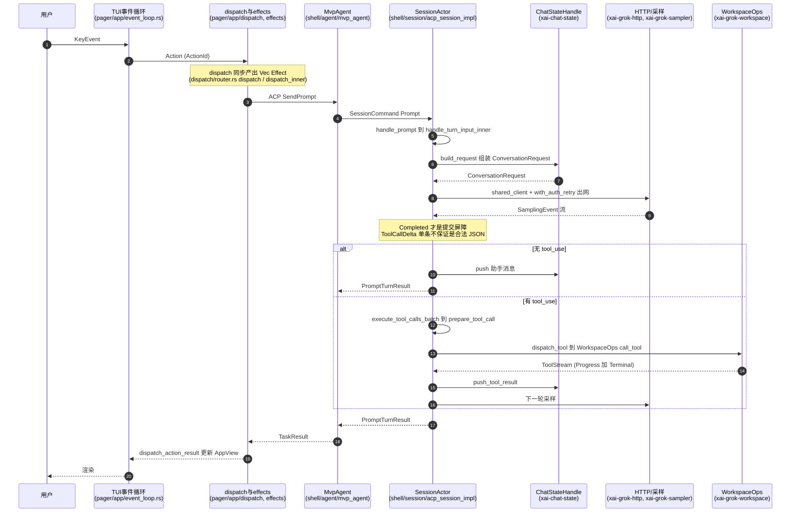
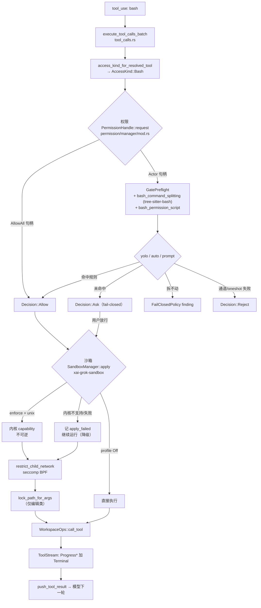
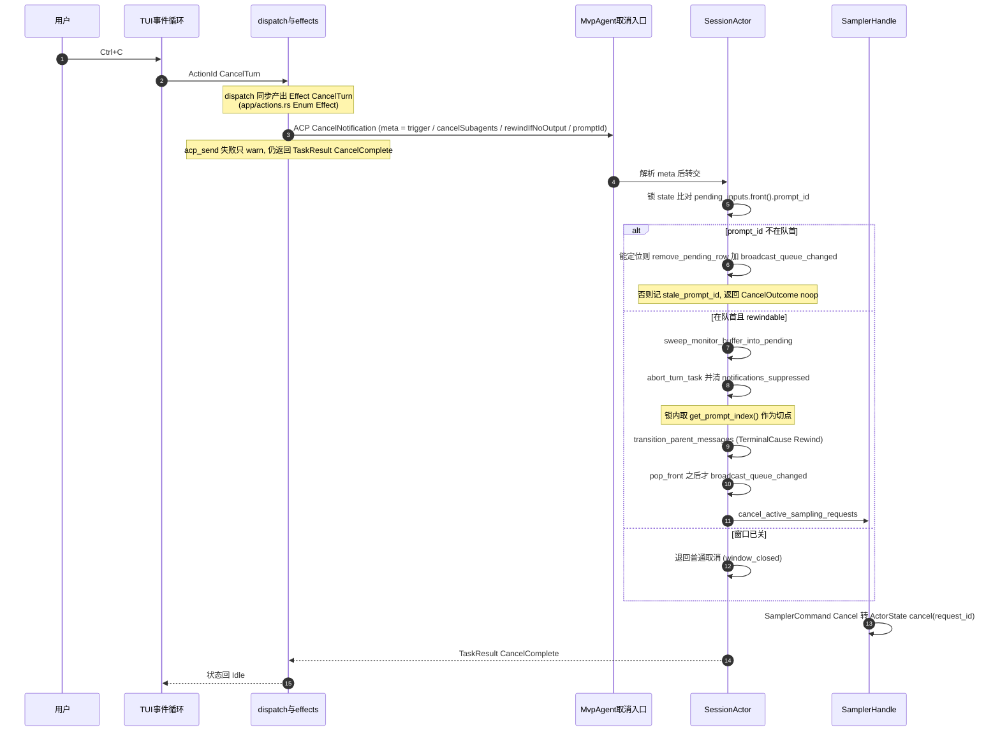

[上一篇：构建测试第三方与许可证](14-构建测试第三方与许可证.md) · 第 15 / 18 篇 · [总目录](README.md) · [下一篇：术语表与源码查找手册](16-术语表与源码查找手册.md)

# 15 · 跨模块完整运行链与场景

> **场景**：前面 07–14 章把系统拆成入口、TUI、Agent、工具、Workspace、认证、持久化、构建八个切面。本章把它们**重新缝回一条主线**——给你 **3 个端到端场景**（完整编码任务 / 权限请求流 / 错误恢复流），每一跳都标出**调用方 → 被调用方**、落在哪个 crate、哪个符号。读完后，你应当能在脑中把任意一次用户操作映射到具体代码。
>
> **阅读说明**：源码基准 `SOURCE_REV = 84745de98b3d3996729aefcefd518890ffb73930`（仓库根 `SOURCE_REV`，与 git HEAD `2178c69c` 不同——它记录上游 monorepo commit）。**工具版本**：Rust `1.94.0`（`rust-toolchain.toml:11`）、`ratatui 0.29`、`tokio` 特性 `full`、`agent-client-protocol 0.10.4`、`tree-sitter 0.26`。本章是综合章：所有锚点均来自当前源码逐条核对。**定位约定**：`符号(+N)` 中 `N` 是**函数内相对偏移**，`+0` = 该定义所在行；同一文件内的兄弟定义用 `（相对 X +N）` 明确基准；纯快照行号只写作 `（行 N）` 且仅作辅助，漂移后请以符号为准。涉及 crate 总数 **102**（见 14 章）。

---

## 第一层 · 简单框架（系统骨架）

把八章的主角排成一条「请求→响应」流水线。**注意两次结构性事实**：会话实现已从单个 `acp_session.rs` 拆成 `crates/codegen/xai-grok-shell/src/session/acp_session_impl/` 目录（**89 个 `.rs` 文件**）；沙箱也已从 `xai-grok-workspace` 独立成 `xai-grok-sandbox` crate。会话 Actor 结构体是 `MvpAgent`（`agent/mvp_agent/mod.rs` · `Struct：MvpAgent`），其 ACP 协议实现分散在 `agent/mvp_agent/acp_agent.rs`（`impl acp::Agent for MvpAgent`）。

```
用户键盘
   │  (KeyEvent)
   ▼
TUI 事件循环  ──[08]──  event_loop::run (app/event_loop.rs · run(+0)) / tokio::select!（相对 run +1084）
   │                     调用方：pager-bin/src/main.rs · main
   ▼
同步决策      ──[08]──  dispatch::dispatch (app/dispatch/router.rs · dispatch(+0)) -> Vec<Effect>
   │                     被调用方：dispatch_inner(+9)
   ▼
异步执行      ──[08]──  effects::execute (app/effects/mod.rs · execute(+0)) → JoinSet → ACP 客户端
   │                     acp_send_bounded (app/effects/helpers.rs · acp_send_bounded(+0))
   │  ── ACP JSON-RPC (agent-client-protocol 0.10.4) ──
   ▼
会话 Actor    ──[09]──  spawn_session_actor (session/acp_session_impl/spawn.rs · spawn_session_actor(+0))
   │                     SessionHandle (session/handle.rs · Struct：SessionHandle) / SessionCommand (session/commands.rs · Enum：SessionCommand)
   │                     handle_prompt (session/acp_session_impl/turn.rs · handle_prompt(+0)) → handle_turn_input（相对 handle_prompt +35）
   ▼
采样循环      ──[09]──  run_turn_via_sampler (session/acp_session_impl/sampler_turn.rs · run_turn_via_sampler(+0))
   │                     提交屏障 = SamplingEvent::Completed (xai-grok-sampler/src/events.rs · Enum：SamplingEvent，Completed（相对枚举定义 +50）)
   │                     产出 tool_use
   ▼
工具派发      ──[10]──  execute_tool_calls_batch (session/acp_session_impl/tool_calls.rs · execute_tool_calls_batch(+0))
   │                     prepare_tool_call(+0) → dispatch_tool (session/acp_session_impl/tool_dispatch.rs · dispatch_tool(+0))
   │                     → WorkspaceOps::call_tool (xai-grok-workspace/src/workspace_ops.rs · call_tool(+0))
   │  调用具体工具前先过两关：
   ├─ 权限    ──[11]──  PermissionHandle::request (xai-grok-workspace/src/permission/manager/mod.rs · request(+0))
   │                     + GatePreflight (permission/gate_preflight.rs · Struct：GatePreflight)
   │                     + Decision (permission/types.rs · Enum：Decision)
   └─ 沙箱    ──[11]──  SandboxManager::apply / install (xai-grok-sandbox/src/lib.rs · apply(+0) / install(+0))
                         child_net::restrict_child_network (child_net.rs · restrict_child_network(+0))
   ▼
结果回流 → 模型下一轮 → 最终答案渲染回 TUI
```

这张图的**跨 crate 边界**只有三处：`pager → shell`（ACP 线协议）、`shell → workspace`（in-process 工具执行）、`shell → sampler/http`（出网）。其余全在 crate 内部。

> 这条主线同时被 **[14] 构建系统**支撑（proto 单源生成让 ACP 线格式一致、6 个 `build.rs` 把 rg/fd/bfs/ugrep 与版本嵌进二进制、tree-sitter 0.26 同时服务代码图索引与 bash 权限拆分），并在**后台**由 **[12] 自更新**保持二进制新鲜、由 **[13] 持久化**保证崩溃可恢复。

---

## 第二层 · 一个完整例子（全路径走读）

### 场景 A：一次完整编码任务（入口 → TUI → 会话 → 模型 → 工具 → workspace → 渲染）

覆盖「无工具轮」与「带工具轮」两段。每一步都写清 **调用方 → 被调用方**。

```
① 进程入口
   调用方：OS
   被调用方：xai-grok-pager-bin/src/main.rs · main
       │  （package = xai-grok-pager-bin，artifact = xai-grok-pager，见 14 章）
       ▼
② 键盘事件进入 TUI 主循环
   被调用方：xai-grok-pager/src/app/event_loop.rs · run(+0)
       │  内部 tokio::select!（相对 run +1084）同时等键盘 / 定时器 / JoinSet 任务完成
       │  被调用方：xai-grok-pager/src/app/app_view.rs · Struct：AppView（状态宿主）
       ▼
③ 同步决策：Action → Vec<Effect>（纯函数、无 IO、可单测）
   被调用方：xai-grok-pager/src/app/dispatch/router.rs · dispatch(+0)
       │  实现体：dispatch_inner（相对 dispatch 定义 +9）
       │  入参：xai-grok-pager/src/actions/mod.rs · Enum：ActionId（如 CancelTurn 变体）
       ▼
④ 异步执行：把 Effect 派发进 JoinSet
   被调用方：xai-grok-pager/src/app/effects/mod.rs · execute(+0)
       │  Effect 枚举定义：xai-grok-pager/src/app/actions.rs · Enum：Effect
       │  出网封装：xai-grok-pager/src/app/effects/helpers.rs · acp_send_bounded(+0)
       │  触发 SendPrompt → SessionCommand::Prompt
       ▼
⑤ 会话 Actor（单写者）
   调用方：pager 侧 ACP 客户端
   被调用方：xai-grok-shell/src/agent/mvp_agent/acp_agent.rs · MvpAgent 的 acp::Agent 实现
       │  （结构体定义在 agent/mvp_agent/mod.rs · Struct：MvpAgent；
       │    acp_agent.rs 内 `impl acp::Agent for MvpAgent`）
       │  转发到 xai-grok-shell/src/session/acp_session_impl/spawn.rs · spawn_session_actor(+0)
       │  对外句柄：xai-grok-shell/src/session/handle.rs · Struct：SessionHandle
       │  入队类型：xai-grok-shell/src/session/commands.rs · Enum：SessionCommand
       ▼
⑥ 处理 prompt
   被调用方：session/acp_session_impl/turn.rs · handle_prompt(+0)
       │  → handle_turn_input（相对 handle_prompt +35）→ handle_turn_input_inner（相对 handle_prompt +52）
       │  - signals_handle().increment_turn()
       │  - ensure_session_disk_writable().await?
       │  - 组装 TurnInputRequest（prompt_id / prompt_blocks / prompt_mode / verbatim ...）
       │  注：PromptMode 定义在 session/plan_mode.rs · Enum：PromptMode
       ▼
⑦ 采样循环
   被调用方：session/acp_session_impl/sampler_turn.rs · run_turn_via_sampler(+0)
       │  组装请求：xai-chat-state/src/handle.rs · ChatStateHandle::build_request(+0)
       │     （含 system head、历史、工具表）
       │  出网：xai-grok-http/src/lib.rs · shared_client(+0)（OnceLock 缓存）
       │        + with_auth_retry(+0)（认证重试中间件）
       ▼
⑧ 模型返回
   被调用方：xai-grok-sampler/src/events.rs · Enum：SamplingEvent
       │  提交屏障 = Completed(+50)（相对枚举定义行）
       │  —— 无 tool_use：这就是「一轮结束」
       │  —— 有 tool_use：进入 ⑨
       │  TelemetryClient 记一次对话事件
       ▼
⑨ 工具派发（仅当有 tool_use）
   被调用方：session/acp_session_impl/tool_calls.rs · execute_tool_calls_batch(+0)
       │  - 先 refresh_classifier_transcript（若在 auto 模式）
       │  - mcp_surface_requested 判定：名字含 MCP 分隔符 或 是 search_tool / use_tool
       │  - emit xai-grok-session-events/src/types.rs · Enum：Event（ToolStarted 系）
       │  → prepare_tool_call(+0)
       │      解析参数、决定本次调用的 AccessKind
       │  → session/acp_session_impl/tool_dispatch.rs · dispatch_tool(+0)
       │      注释明确：agent session 一律用本地 workspace ops（in-process toolset）
       ▼
⑩ 真正执行
   被调用方：xai-grok-workspace/src/workspace_ops.rs · WorkspaceOps::call_tool(+0)
       │  （Enum：WorkspaceOps 定义在 workspace_ops.rs）
       │  另有带上下文的 call_tool_with_context（相对 call_tool 定义 +13）
       │  落到具体工具：如 xai-grok-tools/src/implementations/grok_build/read_file/mod.rs · ReadFileTool
       ▼
⑪ 结果回流
   被调用方：xai-chat-state/src/handle.rs · push_tool_result(+0)
       │  形状 [Progress*, Terminal]（见 10 章）
       ▼
⑫ 模型下一轮基于工具结果继续；最终答案渲染回 AppView → TUI 画出
       │  会话 Summary 落盘（含 git head，见 13 章）
```

同一条链的时序（谁 await 谁、跨了几次 channel）：



### 场景 B：权限请求流（bash：权限 + 沙箱双层横切）

这是「工具执行前必须过的两关」。**权限与沙箱互相独立，双层都过才执行**。

```
① 模型给出 tool_use: bash {"command": "sed -i ..."}
   调用方：采样循环
   被调用方：session/acp_session_impl/tool_calls.rs · execute_tool_calls_batch(+0)
       │
       ▼
② 归类 AccessKind
   被调用方：session/acp_session_impl/tool_calls.rs · access_kind_for_resolved_tool(+0)
       │  产出 permission/types.rs · Enum：AccessKind 的 Bash(String) 变体
       │  分类维度：Read / Grep / Edit / Bash / MCPTool / WebFetch / WebSearch /
       │           AgentMessage / Tool（最后一条 = 无可 grant 作用域的可变工具，每次弹窗）
       ▼
③ 权限判定
   调用方：prepare_tool_call
   被调用方：xai-grok-workspace/src/permission/manager/mod.rs · PermissionHandle::request(+0)
       │  Enum：PermissionHandle（manager/mod.rs）两种句柄：
       │    - AllowAll → 直接 Decision::Allow（丢弃 hook_ask，记 debug 日志）
       │    - Actor   → InFlightGuard + oneshot，走 PermissionCommand::Request
       │        命令通道发送失败 → Decision::Reject("permission manager unavailable")
       │        oneshot 接收失败 → Decision::Reject("failed to receive permission decision")
       │  规则未命中 = Ask（fail-closed）
       │  判定结果：permission/types.rs · Enum：Decision
       │    （Allow / Ask / FollowupMessage / Reject / PolicyDeny / Cancelled）
       │
       ├─ 预检合并：permission/gate_preflight.rs · Struct：GatePreflight
       │    合并「直接规则 + 两道 bash 安全门」：
       │    · permission/bash_command_splitting.rs —— 用 tree-sitter-bash 拆分命令
       │         （Module：bash_command_splitting.rs 的 try_parse_shell 返回 None
       │          表示无法干净分解为纯 word 命令）
       │    · permission/bash_permission_script.rs —— 跑脚本判定
       │    若 gate 无法把命令拆解到可匹配规则 → fail-closed finding
       │      （ClassifierSecurityFinding::FailClosedPolicy）
       │
       ├─ 分支：yolo / auto（LLM classifier）/ prompt（用户弹窗）
       │    manager/mod.rs 内的自由函数：
       │      auto_prompt_blocks_allow(access)      —— 非 bash 访问时强制弹窗必须中和已定 Allow
       │      bash_assessment_is_clear(evaluation)  —— 无静态分析发现时才允许宽泛策略绕过 classifier
       │      classifier_assessment(evaluation, fail_closed_policy)
       │      sandbox_may_auto_allow_bash(evaluation, sandbox_active)
       │
       └─ yolo 钳制：manager/mod.rs · clamp_yolo(+0)
            保证 pin 永远赢——客户端不能在 pin 生效时打开 always-approve
       │  Actor 由三个自由函数起（偏移相对 spawn_permission_manager 定义）：
              spawn_permission_manager(+0) / spawn_permission_manager_with_hub(+34) /
              spawn_permission_manager_with_pin(+74)
       ▼
④ 沙箱（与权限独立，双层都过才执行）
   调用方：dispatch_tool / 会话 setup
   被调用方：xai-grok-sandbox/src/lib.rs · SandboxManager
       │  SandboxManager::new(profile, workspace)      (new(+0))
       │  SandboxManager::apply(workspace)             (apply(+0)，标注 **Irreversible**)
       │      - profile == Off → 直接 Ok
       │      - 需要 hook 写拒绝 → ensure_grok_hook_slots + maybe_install_namespace_lockdown_inside_bwrap
       │      - load_sandbox_config → resolve_profile → capability_set_from_profile
       │      - deny::effective_deny_paths
       │      - 内核不支持 → 记 SandboxEvent::apply_failed 后 **继续运行**（降级，不崩）
       │      - Sandbox::apply(&caps) 失败 → 同样记日志后继续
       │  SandboxManager::install()                    (install(+0)，存进全局 SANDBOX，供会话期违规日志)
       │  SandboxManager::is_applied()                 (is_applied(+0))
       │  非 enforce / 非 unix → 同名 stub `apply`（快照行 243，只打 info 日志）
       ▼
⑤ 子进程封网
   调用方：工具执行（bash）
   被调用方：xai-grok-sandbox/src/child_net.rs · restrict_child_network(+0)
       │  门控：xai-grok-sandbox/src/lib.rs · should_restrict_child_network(+0)
       │  装 seccomp BPF：禁 mount 类 syscall、禁 unshare/setns、clone3→ENOSYS、
       │   clone 带 namespace 位→EPERM
       │   （filter 构造 + install 走 prctl(PR_SET_NO_NEW_PRIVS) 后
       │     syscall(SYS_seccomp, ...TSYNC)）
       │  父进程网络保持开放（要连 LLM API）
       │   Std 版孪生：restrict_child_network_std（相对 restrict_child_network 定义 +15）
       │  另有 SandboxManager::restrict_child_network(+0)（实例方法，读 profile）
       ▼
⑥ 同文件串行锁（编辑类才需要）
   被调用方：session/acp_session_impl/tool_dispatch.rs · lock_path_for_args(+0)
       │  从参数里取 file_path / path / target_file（codex read_file 用 target_file）
       │  相对路径按 cwd 拼接 → 逐 component 归一化 → dunce::canonicalize 最近已存在祖先
       │  （Windows 上避开 \\?\ verbatim 路径）
       │  注意：target_directory 被刻意排除——目录列举不是编辑，不该抢文件锁
       ▼
⑦ 命令执行 → 结果回传（ToolStream[Progress*, Terminal]）→ tool_result 回模型
   编辑类另产生 hunk：xai-hunk-tracker/src/actor/mod.rs · Struct：HunkTrackerActor
   快照落盘：xai-grok-workspace/src/session/checkpoint_store.rs · checkpoint_path(+0)
   （用于 /rewind 与压缩后的回退）
   TUI 侧渲染 diff：xai-grok-pager-diff
   ▼
⑧ 违规（若有）记 SandboxEvent + metrics()
```



### 场景 C：错误恢复流（取消 / 崩溃恢复 / 自动压缩）

三条恢复路径，共同的哲学是**默认收紧、显式放行、失败降级不崩**。

```
【C-1】用户按 Ctrl+C 取消正在跑的一轮

① Ctrl+C → ActionId::CancelTurn
   被调用方：xai-grok-pager/src/actions/mod.rs · Enum：ActionId（CancelTurn 变体）
        │  （若正在跑 turn，视图层把 Ctrl+C 绑给 CancelTurn；Esc 在 turn 中会被吞掉）
        ▼
② 同步决策产出 Effect
   调用方：dispatch
   被调用方：xai-grok-pager/src/app/actions.rs · Enum：Effect（CancelTurn 变体）
        │  字段：session_id / cancel_subagents / trigger / rewind_prompt_id
        ▼
③ 异步发送取消通知（尽力而为）
   被调用方：xai-grok-pager/src/app/effects/mod.rs · execute(+0) 的 CancelTurn 分支
        │  - ulog "cancel.acp_send.start"
        │  - 构造 acp::CancelNotification::new(session_id).meta(cancel_notification_meta(...))
        │  - acp_send(req, &tx).await
        │  - ulog "cancel.acp_send.done"（带 ok / elapsed_ms）
        │  - 失败只 warn!（取消是尽力而为，不能让 TUI 卡住）
        │  - 返回 TaskResult::CancelComplete
        ▼
④ shell 侧接收
   被调用方：xai-grok-shell/src/agent/mvp_agent/acp_agent.rs · MvpAgent::cancel(+0)
       │  （位于 `impl acp::Agent for MvpAgent` 内）
        │  - 从 meta 读 cancelTrigger / cancelSubagents（默认 true）/
        │    rewindIfNoOutput（兼容旧名 rewindIfPristine）/ promptId
        │  - ulog "shell.cancel.received"
        ▼
⑤ 会话 Actor 决策
   被调用方：session/acp_session_impl/cancel.rs · SessionActor::cancel_running_task(+0)
        │  若带 prompt_id（rewind 语义）：
        │     - 锁 state，比对 pending_inputs.front().prompt_id
        │       · 不一致 → 该 prompt 排在运行中的 turn 之后：
        │           能定位到行 → remove_pending_row + broadcast_queue_changed（"queued_row_removed"）
        │           定位不到 → "stale_prompt_id"
        │         记 log_rewind_decision 后返回 CancelOutcome::noop()
        │     - 一致且 state.rewindable 且 front 可弹出：
        │           sweep_monitor_buffer_into_pending → abort_turn_task(&task, epoch)
        │           → cancel_active_sampling_requests()
        │           → 清 task_wake_suppressed / notifications_suppressed
        │           → 在锁内取 chat_state_handle.get_prompt_index() 作为切点
        │           → transition_parent_messages(..., TerminalCause::Rewind)
        │           → pop_front 得到 claimed_rewound
        │           → 有 fallback 时 broadcast_queue_changed（在 pop 之后，
        │             避免客户端看到被切的 prompt）
        │     - state.rewindable == false → 退回普通取消（"window_closed"）
        │  辅助判定：cancel.rs · front_is_rewind_poppable(+0)
        ▼
⑥ 取消传播到采样层
   被调用方：xai-grok-sampler 的 SamplerHandle::cancel(request_id) → SamplerCommand::Cancel
        │  （actor 侧 actor/mod.rs 处理）
        ▼
⑦ TUI 收到 CancelComplete → 状态回 Idle

【C-2】进程崩溃后重启并恢复会话

① 崩溃瞬间：xai-crash-handler
   Unix 经 sigaction(2) 捕 SIGBUS/SIGSEGV/SIGABRT；Windows 经 SetUnhandledExceptionFilter
   捕访问越界。发布构建 panic="abort"（Cargo.toml [profile.release]）——SIGABRT 捕获让
   Rust panic 中止也留下崩溃报告。
        │  写 last-crash.bin（handler.rs）
        │  终端状态还原（terminal.rs，按 TUI 是否启用分 escape/termios 两档）
        ▼
② 下次启动早期（顺序有硬约束）
   被调用方：xai-crash-handler/src/lib.rs · check_previous_crash(+0)
        │   读 last-crash.bin → CrashBlob::parse → symbolicate::resolve_frames
        │   → format_report → 写 last-crash-report.txt（owner-only）
        │   → archive_report（history/ 保留 MAX_HISTORY 份）
        │   → **删除 last-crash.bin**（避免被重复处理）
   被调用方：xai-crash-handler/src/lib.rs · install(+0)
        │   必须在 check 之后：install 以 O_TRUNC 打开 last-crash.bin，
        │   顺序反了会把上次证据抹掉，崩溃检测永远为空
        │   另有 install_terminal_restore_only（相对 install 定义 +7，只做终端还原，不装信号处理器）
        ▼
③ 孤儿会话登记表（xai-grok-active-sessions，**本轮语义已变**）
   被调用方：xai-grok-active-sessions/src/lib.rs · register(+0)
        │   在 ~/.grok/active_sessions.json 上：
        │     retain(|s| s.session_id != 新 id && is_pid_alive(s.pid))  → push 新会话
        │   —— 即「崩溃留下的条目由下一次 register 按 PID 存活自动 prune」
        │   is_pid_alive(+0)（私有）：unix 用 libc::kill(pid, 0)（EPERM 视为存活），
        │                            Windows 用 OpenProcess(PROCESS_QUERY_LIMITED_INFORMATION)
        │   锁语义：LOCK_ACQUIRE_TIMEOUT = 2s、LOCK_POLL_INTERVAL = 50ms
        │            （NFS home 上 flock 无租约，绝不能无限等）
        │   正常退出走 try_unregister(+0)：拿不到锁就 Ok(false)，孤儿留给下次 register 清
        │   只读列举：list_in(+0)
        ▼
④ 用户从「可恢复会话」点开 → 加载 Summary（向后兼容 head_commit/head_branch）
   记忆系统召回：{workspace_hash}/MEMORY.md + 全局 MEMORY.md
   （xai-grok-memory 有 legacy 与 v2 两条互不共享的流水线：
     legacy = ~/.grok/memory/ 的 markdown；
     v2 = ~/.grok/memory-v2/ 的 topics + observation inbox + 生成的 MEMORY.md。
     v2 从不读写 legacy 树。v2 相关模块：v2.rs / v2_capture.rs / v2_carryover.rs /
     v2_consolidation.rs / v2_maintenance.rs / v2_access.rs）
        ▼
⑤ 若需检索历史会话：xai-grok-session-search
   SearchIndexManager / execute_search / evict_session（lib.rs 再导出；manager.rs 实现）
        │   SQLite FTS5 缓存位于 <grok home>/sessions/session_search.sqlite
        │   损坏自愈：recovery.rs 分类 unusable 错误 → 加锁隔离 → 重建空库 →
        │            CACHE_EPOCH 自增（调用方据此知道索引被换过）
        │   全量重建由 bootstrap.rs 带 lease 单进程执行
        ▼
⑥ 重新跑任务时若调远程 Hub 工具：
   HubConnection (xai-computer-hub-sdk/src/connection.rs · Struct：HubConnection)
   断线 → 重连 → 重放（见「可靠性与通用技术实现说明书」）

【C-3】上下文快满，自动压缩

① 采样前检查
   被调用方：xai-grok-shell/src/session/compaction.rs
        │  SessionActor::check_auto_compact_needed(+0)    ← 阈值触发
        │  SessionActor::check_preflight_overflow(+0)     ← 预检溢出
        │  两者都返回 Option<AutoCompactTriggerInfo>（compaction.rs · Struct：AutoCompactTriggerInfo）
        ▼
② 需要压缩 → 走 xai-grok-compaction（common crate，传输无关的压缩引擎）
        │   本 crate 依赖 **既不是** conversation 类型 crate，**也不是** sampling-types：
        │   通过一组 trait 缝解耦 —— CompactionItem / ItemTokenCounter /
        │   CompactionSampler / CompactionStreamProc / Intra+InterCompactionObserver
        │
        │   grok-build 用的是 code_compaction（整会话 full-replace 子系统）：
        │     src/code_compaction/prompt.rs · build_summary_prompt(+0)
        │     src/code_compaction/prompt.rs · build_summary_prompt_kind（相对 build_summary_prompt +55）
        │     src/code_compaction/assemble.rs · assemble_compacted_history(+0)
        │     src/code_compaction/failure.rs · is_context_length_error(+0)
        │     src/code_compaction/summary.rs · is_degenerate_summary(+0)
        ▼
③ 压缩模式
   被调用方：xai-chat-state/src/compaction_mode.rs · Enum：CompactionMode
        │   Summary（只有摘要）/ Transcript（摘要 + 指向原始 updates.jsonl）/
        │   Segments(CompactionDetail)（摘要 + compaction/ 目录的干净分段 markdown，默认）
        ▼
④ 提交
   被调用方：xai-chat-state/src/handle.rs · replace_conversation_for_compaction(+0)
        │   发 ChatStateCommand::ReplaceConversation { items, is_compaction: true }
        │   （is_compaction=true 会在当前 turn capture 上置 compaction_occurred）
        │   ChatStateCommand 定义：xai-chat-state/src/commands.rs · Enum：ChatStateCommand
        ▼
⑤ 同时记边界
   被调用方：xai-chat-state/src/handle.rs · record_compaction_at(prompt_index)(+0)
        │   供 /rewind 跨压缩回退（配合 checkpoint_store）
        ▼
⑥ 用户中途取消压缩
   AutoCompactCancelReason::UserCancelled
   （xai-grok-shell/src/extensions/notification.rs · Enum：AutoCompactCancelReason）
   通知里带上该 reason
```

取消路径的时序（谁 await 谁、跨了几次 channel）：



---

## 第三层 · 详细逐步说明（主链路拆解）

### 步骤 1 — TUI 是「同步决策 + 异步执行」的分层

- **同步层**：`dispatch::dispatch(action, &mut AppView) -> Vec<Effect>`（`xai-grok-pager/src/app/dispatch/router.rs` · `dispatch(+0)`，实现体 `dispatch_inner`（相对 `dispatch` +9））。纯函数、无 IO、可单测——这是「主链路怎么走」的答案核心。同文件还有 `dispatch_action_result`（处理 `TaskResult` 回流）与 `dispatch_copy_auth_url`。
- **异步层**：`effects::execute`（`xai-grok-pager/src/app/effects/mod.rs` · `execute(+0)`）把 `Effect` spawn 进 `JoinSet`；主循环 `event_loop::run`（`xai-grok-pager/src/app/event_loop.rs` · `run(+0)`）在 `tokio::select!`（`+1084`）里同时等键盘、定时器、任务完成。
- **出网封装**：pager 侧统一走 `acp_send_bounded`（`xai-grok-pager/src/app/effects/helpers.rs` · `acp_send_bounded(+0)`）。
- **状态宿主**：`AppView`（`xai-grok-pager/src/app/app_view.rs` · `Struct：AppView`）。

### 步骤 2 — 会话 Actor 是「单写者」

- `spawn_session_actor`（`xai-grok-shell/src/session/acp_session_impl/spawn.rs` · `spawn_session_actor(+0)`）建出单写者 Actor。
- 对外是 `SessionHandle`（`xai-grok-shell/src/session/handle.rs` · `Struct：SessionHandle`），入队是 `SessionCommand`（`xai-grok-shell/src/session/commands.rs` · `Enum：SessionCommand`）。
- `SessionCommand` 的变体数量与语义直接暴露了会话的职责边界，抽样（当前源码）：
  - `Initialize { system_prompt }` / `ReplaceSystemPrompt { system_prompt }`——后者是**非破坏性**的 system head 同步（只换头部 `System` 消息，保留 user/assistant 轮次），背后是原子的 `ChatStateCommand::ReplaceSystemHead`；live head 已一致时是 no-op。
  - `EmitStatusSnapshot` / `RestorePlanApproval` / `TitleRenamed { manual }`——分别服务「resident 会话 attach」「恢复后重发 exit_plan_mode 审批」「`/rename` 冻结或重开自动标题」。
  - `GetToolOverrides { respond_to }` / `SetToolOverrides { overrides }`——子 agent 首次 `Prompt` 前先建立每轮工具覆盖状态。
  - `Prompt { prompt_id, prompt_blocks, prompt_mode, artifact_upload_ctx, client_identifier, screen_mode, verbatim, traceparent, json_schema, send_now, admission, tool_overrides_update, respond_to, prompt_admitted, persist_ack, parsed_prompt_tx }`——注意 `send_now`（取消并发送：取消运行中的 turn，下一个跑这条）、`persist_ack`（持久化落定后再回信号；被 hook 拦下的 prompt 立即 fire，因为没存东西）、`prompt_admitted`（初始子会话就绪信号）。
  - `ParentAgentMessage { delivery, receipt_sink, parent_telemetry_ctx, respond_to }`——父 agent 的消息作为受保护 turn 或运行中 Steer 入队。
  - `SessionMode { session_mode, responds_to }` / `SetSessionModel { switch, responds_to }`。
- 所有对会话的修改都经命令通道串行化，避免竞态。

### 步骤 3 — 采样循环的「提交屏障」

`run_turn_via_sampler`（`xai-grok-shell/src/session/acp_session_impl/sampler_turn.rs` · `run_turn_via_sampler(+0)`）只把 `SamplingEvent::Completed`（`xai-grok-sampler/src/events.rs` · `Enum：SamplingEvent`，`Completed` 变体相对枚举定义 `+50`）当作一轮稳定结果。

`SamplingEvent` 的完整变体（当前源码）说明流里都有什么：

| 变体 | 语义 |
|------|------|
| `StreamStarted { request_id, timestamp_ms }` | HTTP 流已建立、头已读，早于任何内容 |
| `FirstToken { request_id }` | 第一个内容 token |
| `ChannelToken { request_id, channel, text, chunk_index }` | 命名通道的内容 token；`SamplingChannel`（`events.rs` · `Enum：SamplingChannel`）目前是 `Text` / `Reasoning`（可扩展，加通道不需要加事件变体） |
| `ToolCallDelta { request_id, tool_index, id, name, arguments_delta }` | 工具调用参数的**分片**；单个 delta 不保证是合法 JSON（由 L2 transform 逐 chunk 发出） |
| `ResponseStarted { request_id, message_id, ... }` | 仅 Messages L2 transform 发出（Responses/Chat 在流开时没有这些字段） |
| `ReasoningCompleted { request_id, signature }` | 仅 Messages transform：思考块结束、加密签名已知 |
| `Completed { request_id, response, metrics }` | **提交屏障** |
| `BackendToolCallCompleted { ... }` | 后端工具调用完成（服务端侧） |

流式 `Progress` 不进提交，工具结果不在 token 流里拼接——保证「一轮 = 一个可决断的快照」。

另有 `StripReason`（`events.rs` · `Enum：StripReason`）解释「请求为什么被剥掉」：`ServerRejected`（带码的 `invalid_image`：HTTP 400 / Responses 流中 / StreamError）与 `PayloadHeuristic`（体积/传输启发式，如 413 或上传时连接重置；含代理包装的 500、旧式短语匹配、无码流中错误）。**怎么处理剥除是消费方的决定，不是 sampler 的**。

### 步骤 4 — 工具派发的「统一入口」

无论内置 / MCP / Hub / 技能，模型侧永远只看到 `tool_id + args(Value) -> ToolStream<TypedToolOutput>`：

- 契约在 `ToolDispatch`（`crates/common/xai-tool-runtime/src/dispatch.rs` · `Trait：ToolDispatch`）：`call(tool_id, args, ctx) -> ToolStream<TypedToolOutput>`。
- `ToolDispatch::call_terminal`（相对 `Trait：ToolDispatch` 定义 `+18`）是默认实现：丢弃 `Progress`，第一个 `Terminal` 短路；流结束时没有 `Terminal` 则返回 `ToolError::Custom { code: "stream_no_terminal", ... }`——把「实现违反协议」变成显式错误而不是挂起。
- 多路工具源聚合在 `CompoundResolver`（`crates/common/xai-computer-hub-core/src/resolver.rs` · `Struct：CompoundResolver`），`resolve_and_dispatch`（相对 `Struct：CompoundResolver` 定义 `+50`）；`InnerDispatchForResolver`（`inner.rs` · `impl ToolDispatch for InnerDispatchForResolver`）把 resolver 接成 `ToolDispatch`。
- shell 侧的三段式：`execute_tool_calls_batch`（`session/acp_session_impl/tool_calls.rs` · `+0`）→ `prepare_tool_call`（同文件 `+0`）→ `dispatch_tool`（`session/acp_session_impl/tool_dispatch.rs` · `+0`）。`dispatch_tool` 的注释写得很清楚：**agent session 一律用本地 workspace ops（in-process toolset）**，最终调 `WorkspaceOps::call_tool`（`xai-grok-workspace/src/workspace_ops.rs` · `+0`）。
- 早退语义：`execute_tool_calls_batch` 里一旦 `final_result` 被置位（`ToolLoop::PermissionReject` / `Cancelled` / `FollowupMessage`），**后续 tool_use 不再执行**，而是逐个 `push_tool_result` 一条「因先前 X 而取消」的说明。

### 步骤 5 — 权限 / 沙箱是「工具执行前的横切」

**权限**（`crates/codegen/xai-grok-workspace/src/permission/`）：

- 分类维度是 `AccessKind`（`types.rs` · `Enum：AccessKind`）：`Read(Option<String>)`、`Grep { path, glob }`、`Edit(String)`、`Bash(String)`、`MCPTool { name, input }`、`WebFetch(String)`、`WebSearch(String)`、`AgentMessage { subagent_id }`、`Tool(String)`。注意最后一条的注释：**「既不是文件编辑、不是命令、也不是 MCP 调用」的可变工具（子 agent spawn、scheduler、workflow、generation、deploy、feedback、browser、任何未分类的）——没有任何 grant 作用域覆盖它，每次调用都弹窗。**
- 判定结果是 `Decision`（`types.rs` · `Enum：Decision`）：`Allow` / `Ask` / `FollowupMessage(String)` / `Reject(String)` / `PolicyDeny(String)` / `Cancelled`。`Ask` 是默认落点（fail-closed）。
- 编辑单独有 `EditPolicy`（`types.rs` · `Enum：EditPolicy`，`#[default] Ask`，可序列化为 `"ask"` / `"allow"` / `"reject"`）。
- 入口是 `PermissionHandle::request(request) -> PermissionResolution`（`manager/mod.rs` · `request(+0)`）。两种句柄（`Enum：PermissionHandle`）：`AllowAll`（不可弹窗，`hook_ask` 被丢弃并记 debug）与 `Actor`（命令通道 + oneshot；**发送失败或接收失败都返回 `Reject`**，绝不静默放行）。
- Actor 由 `spawn_permission_manager` / `spawn_permission_manager_with_hub` / `spawn_permission_manager_with_pin` 起（`manager/mod.rs` 三个自由函数，`+0` / `+34` / `+74`）。`clamp_yolo(requested, yolo_pin)`（`+0`）保证**pin 永远赢**：客户端不能在 pin 生效时打开 always-approve。
- `GatePreflight`（`gate_preflight.rs` · `Struct：GatePreflight`）合并「直接规则 + 两道 bash 安全门」；配套 `bash_command_splitting.rs`（tree-sitter-bash 命令拆分）、`bash_permission_script.rs`（脚本判定）、`exec_risk.rs`、`shell_access.rs`、`hub_gate.rs`、`rules.rs`、`grants.rs`、`auto_mode/`。

**沙箱**（`crates/codegen/xai-grok-sandbox/`，**已从 workspace crate 独立出来**）：

- `SandboxManager::new` / `apply` / `install` / `is_applied` / `restrict_child_network`（`lib.rs`，各自 `+0`；非 enforce 分支有同名 stub `apply`，快照行 243）。
- `apply` 在 `enforce` + unix 下真正调内核（**不可逆**），否则是同名 stub（只打 info 日志）。**内核不支持或 apply 失败都不致命**：记 `SandboxEvent::apply_failed` 后继续——这是「沙箱兜底而非阻断启动」的工程落点。
- 子进程封网在 `child_net.rs`：`restrict_child_network(&mut tokio::process::Command)`（`+0`）与 std 孪生 `restrict_child_network_std`（`+15`）；`install(filter)` 走 `prctl(PR_SET_NO_NEW_PRIVS)` + `syscall(SYS_seccomp, SECCOMP_SET_MODE_FILTER, SECCOMP_FILTER_FLAG_TSYNC, ...)`。过滤器拒绝 mount 类 syscall、`unshare`/`setns`，`clone3` → `ENOSYS`，`clone` 带 namespace 位 → `EPERM`。**父进程网络保持开放**（要连 LLM API）。门控函数是 `lib.rs` · `should_restrict_child_network(+0)`。
- 其它模块：`profiles.rs`（profile 解析 + `restricts_network`）、`deny/`、`network_policy.rs`、`hook_write_deny.rs`、`read_deny_verify.rs`、`runtime_sockets.rs`、`allow_path.rs`、`paths.rs`、`logging.rs`。

### 步骤 6 — 认证 / 遥测 / 持久化是「旁路但贯穿」

- **认证**：每次出网请求经共享 client（`xai-grok-http/src/lib.rs` 的 `shared_client(+0)` / `shared_upload_client(+0)` / `shared_startup_blocking_client(+0)`，都是 `OnceLock` 缓存，因为建 client 要加载 OS TLS roots 约 95ms）+ `with_auth_retry`（`lib.rs` · `+0`，见可靠性章）。
- **遥测**：关键节点发事件。本链路上能直接看到的：`xai-grok-session-events/src/types.rs` · `Enum：Event`（含 `McpToolCallStarted` / `McpToolCallCompleted` 等变体）、`SandboxEvent`、`unified_log` 的 `cancel.acp_send.start/done`、`shell.cancel.received`、`shell.handle_prompt.start`。
- **持久化**：会话 Summary、记忆（legacy + v2 两条流水线）、FTS5 检索索引、崩溃登记表各自落盘（见 13 章）。

---

## 第四层 · 补全所有逻辑与技术要点

### 4.1 三个场景 ↔ 模块映射表

| # | 场景 | 关键符号（文件 + 符号 + 偏移） | 章 |
|---|------|------------------------------|----|
| A | 完整编码任务 | `main`（`pager-bin/src/main.rs`）/ `event_loop::run`（`pager/app/event_loop.rs` +0）/ `dispatch`（`pager/app/dispatch/router.rs` +0）/ `execute`（`pager/app/effects/mod.rs` +0）/ `spawn_session_actor`（`shell/session/acp_session_impl/spawn.rs` +0）/ `handle_prompt`（`shell/…/turn.rs` +0）/ `run_turn_via_sampler`（`shell/…/sampler_turn.rs` +0）/ `SamplingEvent::Completed`（`xai-grok-sampler/src/events.rs` +50）/ `execute_tool_calls_batch`（`shell/…/tool_calls.rs` +0）/ `WorkspaceOps::call_tool`（`xai-grok-workspace/src/workspace_ops.rs` +0） | 08/09/10 |
| B | 权限请求流 | `access_kind_for_resolved_tool`（`shell/…/tool_calls.rs` +0）/ `PermissionHandle::request`（`xai-grok-workspace/src/permission/manager/mod.rs` +0）/ `clamp_yolo`（同 +0）/ `GatePreflight`（`permission/gate_preflight.rs`）/ `bash_command_splitting`（tree-sitter-bash）/ `SandboxManager::{new,apply,install}`（`xai-grok-sandbox/src/lib.rs`）/ `restrict_child_network`（`xai-grok-sandbox/src/child_net.rs` +0）/ `lock_path_for_args`（`shell/…/tool_dispatch.rs` +0） | 10/11 |
| C | 错误恢复流 | `ActionId::CancelTurn`（`pager/actions/mod.rs`）/ `Effect::CancelTurn`（`pager/app/actions.rs`）/ `MvpAgent::cancel`（`shell/agent/mvp_agent/acp_agent.rs`，`impl acp::Agent`）/ `cancel_running_task`（`shell/…/cancel.rs` +0）/ `check_previous_crash`/`install`（`xai-crash-handler/src/lib.rs` +0）/ `register`/`try_unregister`/`list_in`（`xai-grok-active-sessions/src/lib.rs` +0）/ `check_auto_compact_needed`/`check_preflight_overflow`（`shell/session/compaction.rs` +0）/ `CompactionMode`（`xai-chat-state/src/compaction_mode.rs`）/ `replace_conversation_for_compaction`（`xai-chat-state/src/handle.rs` +0） | 08/09/11/13 |

### 4.2 「单写者 Actor」贯穿全系统

同一模式在四处复用：

| 位置 | 对外句柄 | 入队类型 |
|------|---------|---------|
| 会话 | `SessionHandle`（`shell/session/handle.rs`） | `SessionCommand`（`shell/session/commands.rs`） |
| 聊天状态 | `ChatStateHandle`（`xai-chat-state/src/handle.rs`） | `ChatStateCommand`（`xai-chat-state/src/commands.rs`） |
| 权限 | `PermissionHandle`（`permission/manager/mod.rs`） | `PermissionCommand`（`permission/types.rs`） |
| 工具解析 | `CompoundResolver`（`xai-computer-hub-core/src/resolver.rs`，持有 `local: Arc<dyn ToolRegistry>` + `remote: Option<Arc<dyn ToolRegistry>>`，local 先查） | 直接 `resolve_and_dispatch()` |
| 编辑追踪 | `HunkTrackerHandle`（`xai-hunk-tracker/src/handle.rs`） | `xai-hunk-tracker/src/commands.rs` |

共同好处：**把并发收敛到单点串行**，状态变更可预测、可测试。

### 4.3 「同步决策 / 异步执行」在 TUI

- 同步：`dispatch` 输入 `Action`（`ActionId`）+ `&mut AppView`，输出 `Vec<Effect>`。
- 异步：`effects::execute` 把 `Effect` 派发到 `JoinSet`，主循环 `tokio::select!` 多路等待；`TaskResult` 回到 `dispatch_action_result` 再进同步层。

这是「UI 永远不卡、逻辑可单测」的不二法门（08 章）。**取消路径**也遵守这条：`Effect::CancelTurn` 只负责发通知并返回 `TaskResult::CancelComplete`，失败仅 `warn!`，不阻塞 UI。

### 4.4 「fail-closed」在多处一致

| 位置 | 表现 |
|------|------|
| 权限 | 规则未命中 = `Decision::Ask`，绝不默认放行；`AllowAll` 句柄连 hook 的 ask 都只能丢弃并记日志 |
| 权限（错误路径） | 命令通道发送失败 / oneshot 接收失败 → `Decision::Reject(...)`，不是 Allow |
| 权限（yolo） | `clamp_yolo` 让 pin 永远赢 |
| 权限（bash 拆解） | gate 无法把命令拆到可匹配规则 → 插入 `ClassifierSecurityFinding::FailClosedPolicy` |
| 沙箱 | 即便权限全过，进程级 + 子进程 seccomp 仍生效；`apply` 不可逆 |
| 工具流 | 缺 `Terminal` → `ToolError::Custom("stream_no_terminal")`，不挂起 |
| 检索 | SQLite 不可用 → 隔离 + 重建，绝不静默返回脏结果 |
| 崩溃报告 | `last-crash-report.txt` 以 owner-only 权限写（含源码路径与 backtrace） |
| 会话登记表 | 锁拿不到 → `try_unregister` 返回 `Ok(false)`，不阻塞、不删错；死 PID 由下次 `register` 回收 |
| 文件锁（`xai-grok-file-lock`） | 永不阻塞等待；slot 被占超短宽限 → `LockError::AcquireInProgress`；slot 目录不可用则降级为无 slot 的尝试 |

设计哲学统一：**默认收紧，显式放行**。

### 4.5 跨 crate 的「名字变了」清单（读旧文档时最容易踩的坑）

| 旧文档写法 | 当前源码（HEAD `2178c69c`） |
|-----------|-------------------------|
| `crates/codegen/xai-grok-shell/src/session/acp_session.rs` 大文件 | 已拆成 `session/acp_session_impl/`（**80 个文件**：`spawn.rs` / `turn.rs` / `sampler_turn.rs` / `tool_calls.rs` / `tool_dispatch.rs` / `cancel.rs` / `types.rs` / `hook_dispatch.rs` / `model_switch.rs` / `memory_*.rs` / `goal*.rs` …） |
| `xai-grok-workspace/src/sandbox/lib.rs` 的 `SandboxManager` | 独立 crate `crates/codegen/xai-grok-sandbox/src/lib.rs` |
| `PermissionManager::request_with_path_context` | `PermissionHandle::request`（`permission/manager/mod.rs`） |
| `spawn_session_actor` 在 `spawn.rs:188` | `session/acp_session_impl/spawn.rs` · `spawn_session_actor(+0)` |
| `SessionCommand` 在 `commands.rs:249` | `session/commands.rs` · `Enum：SessionCommand`(+0) |
| `SamplingEvent::Completed` 在 `events.rs:52` | `xai-grok-sampler/src/events.rs` · `Completed`（枚举定义 +50） |
| `prepare_tool_call` 在 `tool_calls.rs:893` | `session/acp_session_impl/tool_calls.rs` · `prepare_tool_call(+0)`（函数定义整体下移，不要再用旧行号） |
| `dispatch_tool` 在 `tool_dispatch.rs:1` | `session/acp_session_impl/tool_dispatch.rs` · `dispatch_tool(+0)`；`lock_path_for_args` 同文件 |
| `Action::CancelTurn`（单一 Action 枚举） | 已拆成 `ActionId::CancelTurn`（`pager/actions/mod.rs`）+ `Effect::CancelTurn`（`pager/app/actions.rs`） |
| `event_loop.rs` 的 `tokio::select!` 在 `+1079` | `pager/app/event_loop.rs` · `run(+0)`，`tokio::select!` 在 `+1084` |
| 压缩在 shell 内实现 | 引擎抽到 `crates/common/xai-grok-compaction`（`code_compaction` / `intra_compaction` / `inter_compaction` 三种风格） |
| 记忆只有 `~/.grok/memory/` | 新增 v2：`~/.grok/memory-v2/`（topics + observation inbox + 生成的 `MEMORY.md`），与 legacy **互不共享文件/搜索/flush/Dream** |
| `xai-grok-active-sessions` 有 `collect_crashed()` / 公开 `is_pid_alive()` | **当前源码不存在这两个公开符号**。语义改为：`register(+0)` 在写入时 `retain(is_pid_alive)` 自动回收死 PID；`try_unregister(+0)` 供信号处理器非阻塞注销；`list_in(+0)` 只读列举。`is_pid_alive(+0)` 是私有函数。 |
| workspace 依赖数 101 / crate 总数 101 | **102**（新增 `crates/codegen/xai-grok-file-lock`） |

### 4.6 设计不变量小结（全系统级）

1. **入口单一**：`xai-grok-pager-bin` 组合根，artifact 名 `xai-grok-pager`，安装名 `grok`（14 章）。
2. **UI 分层**：同步 `dispatch` + 异步 `effects::execute` + `tokio::select!`（08 章）。
3. **会话单写者**：`SessionHandle` / `SessionCommand` 串行化状态；`ChatStateHandle` / `PermissionHandle` / `HunkTrackerHandle` 同构（09/10/11 章）。
4. **提交屏障**：`SamplingEvent::Completed` 才是稳定结果；`ToolCallDelta` 单条不保证是合法 JSON（09 章）。
5. **工具统一入口**：`ToolDispatch::call` 收敛所有平面；`CompoundResolver` 聚合多路来源；缺 `Terminal` 显式报错（10 章）。
6. **执行前横切**：权限（`AccessKind` → `Decision`，fail-closed）+ 沙箱（进程级不可逆 + 子进程 seccomp），双层都过才执行（11 章）。
7. **旁路贯穿**：认证（`with_auth_retry`）/ 遥测（事件化）/ 持久化（Summary、记忆双流水线、FTS5）（12、13 章）。
8. **构建支撑**：proto 单源生成 + 6 个 `build.rs` 嵌版本与搜索二进制 + `tree-sitter 0.26` 统一 AST 解析（14 章）。
9. **取消尽力而为**：`Effect::CancelTurn` 只发通知，失败只 warn；shell 侧区分「重放窗口内回退」与「普通取消」，并保证队列广播在 `pop_front` 之后（避免客户端看到已被切掉的 prompt 仍在队列里）。
10. **崩溃顺序契约**：`check_previous_crash` 必须早于 `install`（`install` 以 `O_TRUNC` 打开 `last-crash.bin`）；孤儿会话按 PID 存活判定，由下一次 `register` 回收。

### 4.7 本章锚点快照（辅助定位，主依据是符号）

下表只是 `2178c69c` 的一次快照，**不要当主依据**——代码漂移后请用「文件 + 符号」重新定位。

| 符号 | 快照行 |
|------|-------:|
| `pager/app/event_loop.rs · run` | 1031（`tokio::select!` 2115） |
| `pager/app/dispatch/router.rs · dispatch` | 156（`dispatch_inner` 165） |
| `pager/app/effects/mod.rs · execute` | 120（`Effect::CancelTurn` 1480） |
| `pager/app/actions.rs · Effect` | 1404 |
| `pager/app/app_view.rs · AppView` | 554 |
| `shell/session/acp_session_impl/spawn.rs · spawn_session_actor` | 217 |
| `shell/session/acp_session_impl/turn.rs · handle_prompt` | 451（`handle_turn_input` 486 / `_inner` 503） |
| `shell/session/acp_session_impl/sampler_turn.rs · run_turn_via_sampler` | 1671 |
| `shell/session/acp_session_impl/tool_calls.rs · execute_tool_calls_batch` | 484（`prepare_tool_call` 1445） |
| `shell/session/acp_session_impl/tool_dispatch.rs · dispatch_tool` | 16（`lock_path_for_args` 77） |
| `shell/session/acp_session_impl/cancel.rs · cancel_running_task` | 251 |
| `shell/session/commands.rs · SessionCommand` | 334 |
| `shell/session/handle.rs · SessionHandle` | 53 |
| `shell/agent/mvp_agent/acp_agent.rs · MvpAgent::cancel` | 1852（`impl acp::Agent` 92；`MvpAgent` 663） |
| `shell/session/compaction.rs · check_auto_compact_needed` | 2147（`check_preflight_overflow` 2204） |
| `xai-grok-sampler/src/events.rs · SamplingEvent` | 36（`Completed` 86） |
| `xai-grok-workspace/src/workspace_ops.rs · WorkspaceOps` | 1507（`call_tool` 1754） |
| `xai-grok-workspace/src/permission/manager/mod.rs · PermissionHandle` | 67（`request` 269 / `clamp_yolo` 318） |
| `xai-grok-sandbox/src/lib.rs · SandboxManager::apply` | 181（stub 243 / `install` 251） |
| `xai-chat-state/src/handle.rs · replace_conversation_for_compaction` | 263（`record_compaction_at` 320） |
| `xai-crash-handler/src/lib.rs · check_previous_crash` | 104（`install` 78） |
| `xai-grok-active-sessions/src/lib.rs · register` | 35（`try_unregister` 41 / `list_in` 63） |

---

[上一篇：构建测试第三方与许可证](14-构建测试第三方与许可证.md) · 第 15 / 18 篇 · [总目录](README.md) · [下一篇：术语表与源码查找手册](16-术语表与源码查找手册.md)
